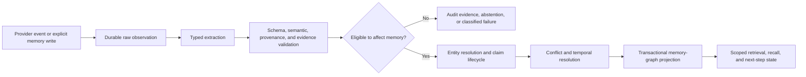
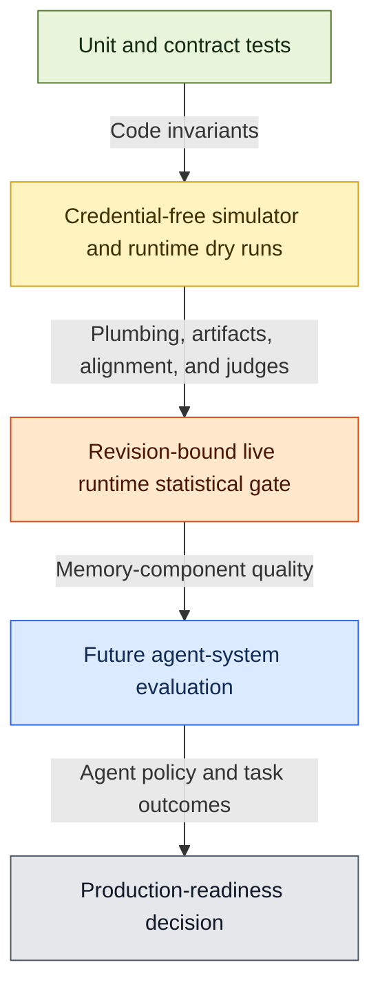

# Memorii

Memorii is a framework-neutral memory plane for agent systems. It turns
provider events and explicit memory writes into typed, auditable memory state
while preserving raw observations, provenance, lifecycle history, execution
state, and task-local reasoning state.

> Memorii is designed for agents that must remember ongoing work, not only
> retrieve similar conversation fragments.

> [!IMPORTANT]
> Memorii is under active development. The repository currently provides
> production-shaped memory components, deterministic contract tests, runtime
> memory-evolution benchmarks, and a Hermes-facing integration. It has not yet
> established agent-level task improvement, production-scale operation, or
> readiness for unguarded durable writes from ordinary chat.

## Why Memorii

Most memory systems flatten state into a collection of documents to retrieve.
Memorii keeps different kinds of memory and reasoning state explicit so that
an agent can answer questions such as:

- What did the user actually say, and where is the evidence?
- Which facts are current, historical, superseded, or uncertain?
- What work remains, what is blocked, and what has already been verified?
- Which hypotheses are candidates rather than committed conclusions?
- Can this task be resumed deterministically after a process restart?

Memorii is not a vector database, a chat-history wrapper, a generic RAG
library, a single unified memory graph, or a system that writes model guesses
directly into long-term memory.

## Architecture

The production-facing memory-evolution path is:



Three graph/state boundaries are deliberately separate:

- **Execution graph:** persistent work, dependencies, invariants, artifacts,
  tests, decisions, and statuses.
- **Solver graph:** task-local hypotheses, observations, actions, assumptions,
  justifications, belief overlays, and unresolved questions.
- **Memory-evolution graph:** derived entities, claims, evidence, relations,
  lifecycle state, contradictions, and temporal retrieval views.

Raw observations remain the source of truth. Derived graph state is a validated,
replayable projection; it does not replace the raw event history.

### Conceptual Overview


## Implemented Capabilities

The current codebase includes:

- typed transcript, semantic, episodic, user-context, execution, and solver
  memory contracts
- explicit candidate-versus-committed state and conservative promotion
- persistent execution graphs and task-local solver graphs
- provider ingestion and retrieval through `ProviderMemoryService`
- Hermes-facing lifecycle hooks through `HermesMemoryProvider`
- default-on runtime memory evolution in normal provider composition
- rule, LLM, and hybrid extraction modes with classified outcomes
- entity resolution, claim lifecycle, contradiction handling, temporal
  semantics, and deterministic graph projection
- scoped, lifecycle-aware retrieval with explicit abstention for ambiguous
  entity, graph, scope, or temporal constraints
- caller-supplied delivery IDs and idempotent replay across partial-turn and
  process-restart recovery
- transactional memory-plane commits, crash-atomic filesystem persistence, and
  fenced evolution-operation leases
- work-state, decision-state, prefetch, recall, and next-step tools
- typed benchmark artifacts, calibration reports, reproducibility
  fingerprints, and revision-bound live-gate contracts

Runtime memory evolution is part of the standard provider composition. Durable
recovery across process restarts requires a persistent memory-plane store; the
standalone default composition remains in memory.

## Quick Start

Memorii requires Python 3.11 or newer. From the repository root:

```bash
cd memorii
python -m pip install -e '.[dev]'
```

Run the deterministic unit suite:

```bash
python -W error -m pytest tests/unit -p no:cacheprovider
```

Run a credential-free runtime memory-evolution smoke evaluation:

```bash
python -m memorii.tools.run_eval \
  --suite memory_evolution_runtime_v1 \
  --mode all \
  --dry-run \
  --storage-root .memorii \
  --sim-profile smoke \
  --seed 7
```

Dry-run LLM and hybrid modes use deterministic fake extraction to validate
composition, artifacts, alignment, judges, and calibration. They do not make
provider calls and do not measure live model quality.

For provider configuration and live execution, see
[Environment Configuration](docs/design/environment_config.md). Live gates
consume credentials and are meaningful only when intentionally bound to an
exact clean revision.

## Provider Integration Surface

`ProviderMemoryService` is the production-facing composition boundary.
`build_provider_memory_service_from_env(...)` creates the environment-aware
runtime and reconciles recoverable evolution operations at startup. Direct
`ProviderMemoryService(...)` construction is deterministic and does not read
process configuration implicitly.

The current provider surface includes:

- `sync_event(..., operation_id=...)`
- `apply_memory_write(..., operation_id=...)`
- `prefetch(...)`
- `retrieve_evolution_decision(...)`
- `handle_tool_call(...)`
- `reconcile_memory_evolution()`

The Hermes integration exposes turn synchronization, session-end,
pre-compression, explicit memory-write, and delegation hooks. Every mutating
hook requires a stable caller-supplied `operation_id`; retries must reuse that
ID so replay remains idempotent.

This is a component integration surface, not a declaration that agent-level
integration is ready. See the
[Agent Integration Readiness Plan](docs/plans/agent_integration_readiness.md)
for the remaining evaluation and operational requirements.

## Correctness And Safety Contracts

Memorii is designed around fail-closed boundaries:

- model output is candidate data until schema, semantic, provenance, evidence,
  and lifecycle policy checks pass
- failed extraction does not commit memory
- deferred or ineligible modalities may remain audit evidence but cannot become
  active truth
- unknown persisted lifecycle values are rejected rather than coerced
- public provider mutations require stable, non-empty delivery IDs
- filesystem commits expose the old or new complete snapshot, not a partial
  intermediate state
- evolution operations use renewable fenced leases, bounded stale recovery,
  and terminal exhaustion
- expired workers cannot commit after losing lease ownership
- production extraction and retrieval cannot consume benchmark oracle state
- ambiguous retrieval constraints abstain or fail closed rather than silently
  broadening the query

Unknown, ambiguous, insufficient-evidence, and needs-test outcomes are valid
system states.

## Benchmarks And Evidence

Memorii keeps code-level, plumbing, live-component, and agent-level evidence
separate:



| Suite | Primary evidence |
| --- | --- |
| `memory_lifecycle_v1` | Lifecycle decision contracts and semantic lifecycle traps |
| `memory_evolution_v1` | Hand-authored memory-evolution scenarios |
| `memory_evolution_sim_v1` | Reconstruction and judge behavior over visible latent-simulator inputs |
| `memory_evolution_runtime_v1` | Production-shaped extraction, validation, projection, retrieval, and artifact plumbing |
| `retrieval_corruption_v1` | Retrieval behavior under noisy or corrupted state |
| `execution_graph_v1` | Execution-state and resume behavior |
| `hotpotqa_v1` | Deterministic external-task adaptation |

Important interpretation rules:

- fake-oracle execution validates plumbing and is never provider success
- runtime dry runs do not prove semantic quality from a live model
- live evidence is valid only for the exact clean revision and declared run
  identity that produced it
- a passing component gate does not establish agent policy quality, recovery
  behavior, tool-use strategy, or end-to-end task improvement

Example deterministic HotpotQA artifacts are available as a
[canonical JSON report](docs/examples/benchmarks/hotpotqa_sample_report.json)
and a [Markdown summary](docs/examples/benchmarks/hotpotqa_sample_report.md).

## Current Limitations

Memorii is not yet ready for:

- controlled or broad agent-system deployment without a separately approved
  agent-level evaluation
- unguarded durable fact or preference writes from ordinary chat
- claims of production-scale throughput, distributed operation, or operational
  maturity
- claims that benchmark performance implies improved agent task outcomes
- automatic confidence caps, learned calibration, or broad
  reference-augmented retrieval

Graph-derived current truth is not yet fully integrated into every next-step
selection path. The current default-on memory-evolution component also has no
runtime disable flag; an operational rollback mechanism is required before an
agent integration pilot.

## Documentation

- [Memorii Specification](docs/design/memorii_spec.md)
- [Storage Details](docs/design/memorii_storage_details.md)
- [Event Model](docs/design/event_model.md)
- [Implementation Rules](docs/IMPLEMENTATION_RULES.md)
- [Runtime Memory Evolution](docs/design/memory_evolution_runtime.md)
- [Semantic Temporal Retrieval](docs/design/semantic_temporal_retrieval.md)
- [Prompt Contracts](docs/design/prompt_contracts.md)
- [Latent Graph Simulator](docs/design/latent_graph_simulator.md)
- [Runtime Benchmark](docs/design/memory_evolution_runtime_benchmark.md)
- [Benchmark Certification](docs/development/benchmark_certification.md)
- [Agent Integration Readiness](docs/plans/agent_integration_readiness.md)
- [Engineering Hardening Closure Matrix](docs/plans/engineering_hardening_closure_matrix.md)
- [Contributor And Agent Guide](agents.md)

## Development

Run the normal local checks from `memorii/`:

```bash
python -W error -m pytest tests/unit -p no:cacheprovider
python -m ruff check memorii tests
pyright --pythonpath "$(python -c 'import sys; print(sys.executable)')"
```

Follow [Static Tooling](docs/development/static_tooling.md) for wheel/package
verification and deterministic benchmark smoke commands. Normal pull requests
run the `Unit Tests` and `Benchmark Contracts` checks. The live runtime
statistical gate is a separate candidate-acceptance check bound to an exact PR
head, not a substitute for deterministic pull-request checks.

## License

See [LICENSE](LICENSE).
