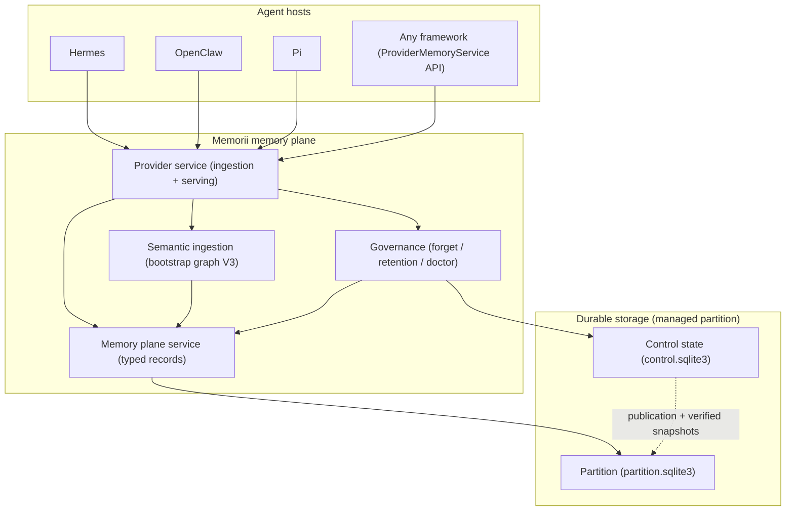
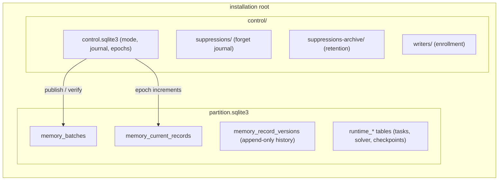
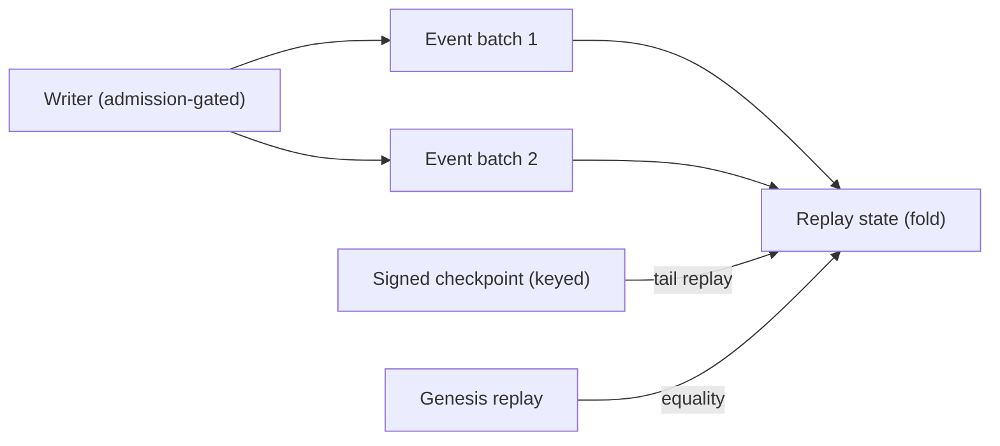
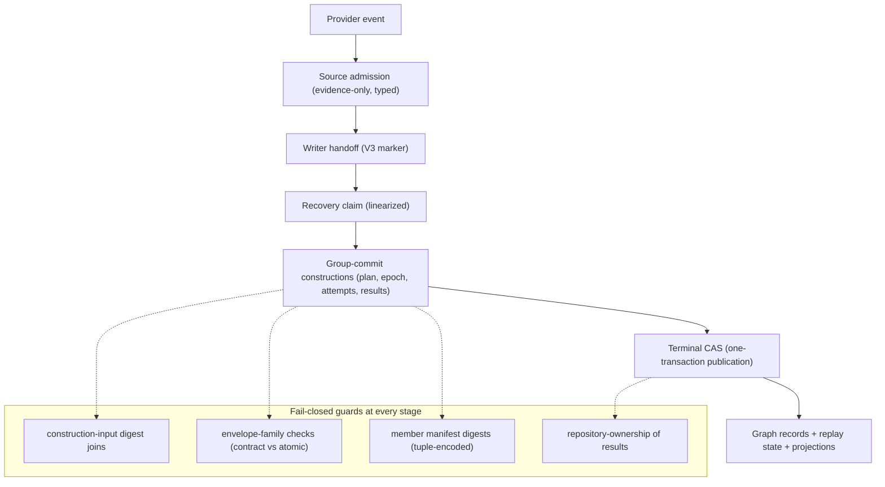
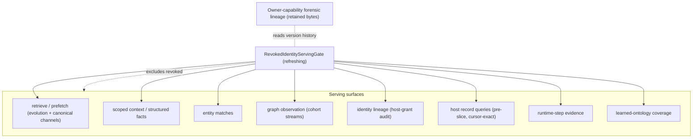
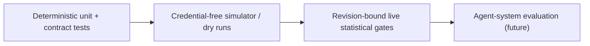

# Memorii Architecture

This document is the detailed, current-state architecture of the Memorii
memory plane: what exists in production code today, how the pieces connect,
and where the contracts live. It is grounded in the governing design
documents (`docs/design/memorii_spec.md`,
`docs/design/memorii_storage_details.md`, `docs/design/event_model.md`)
and stays honest about what is implemented versus planned — see
[Current Limitations](../README.md#current-limitations) for the boundary.

## 1. System Overview

Memorii sits between agent hosts and durable storage as a **typed memory
plane**: hosts submit events and explicit writes through a validated
ingestion surface, and read back scoped, lifecycle-aware memory through
gated serving surfaces.



Three properties hold across the whole plane:

- **Raw observations are the source of truth.** Derived graph state is a
  validated, replayable projection; nothing derived replaces the raw event
  history.
- **Model output is candidate data.** Nothing a model produced becomes
  committed memory without schema, semantic, provenance, evidence, and
  lifecycle policy validation.
- **Fail closed everywhere.** Unknown lifecycle values, ambiguous
  constraints, missing authorities, and stale leases refuse rather than
  guess.

## 2. The Typed Memory Model

Memory is not one bag of documents. The plane keeps six logical domains
separate, each with typed contracts (`memorii/core/memory_plane/models.py`):

| Domain | Contents | Example record kinds |
| --- | --- | --- |
| Raw transcript | Durable observations of what was actually said | transcript records |
| Semantic | Entities, claims, evidence, relations, lifecycle | `claim_state`, `entity_link`, `graph_node` |
| Episodic | Session- and event-scoped recall | episodic records |
| User context | Preferences and delegations | preference records |
| Execution | Persistent work state: tasks, nodes, edges | runtime tables |
| Solver / search | Task-local hypotheses, justifications, overlays | solver tables |

Two distinctions cut across all domains:

- **Candidate vs committed state.** Extraction and promotion produce
  candidates; only explicit validation stages commit. Promotion is
  conservative and auditable.
- **Structural vs versioned.** Structural graph state is separate from
  versioned belief/status overlays; lifecycle revision never deletes
  history (append-only event log, superseding versions).

## 3. Storage and Control Architecture

A **managed installation** is one root directory containing a control
authority and a data partition:



Key invariants:

- **Publication is the only write path into the partition.** Every batch
  lands through `publish_memory_plane_batch` under a verified control
  revision; readers see old-or-new, never partial state.
- **`memory_record_versions` is the retained-bytes ledger.** Forgetting
  rewrites records as tombstone versions; nothing is deleted. The
  owner-capability forensic surface reads this history.
- **The suppression journal is the serving gate of record for
  revocation** between apply and enforcement, and retention tiering moves
  aged entries to the archive without ever removing revocation state.
- **The release proof** pins every production and tool file
  (`docs/work/semantic_ingestion/observation-ledger/release-preparation/candidate.json`);
  the installed-artifact proof refuses any drift.

Legacy JSONL plane layouts are supported read-side through migration; a
managed installation refuses to coexist with un-migrated legacy layouts.

## 4. Event Model and Replay Spine

Every semantic mutation is an append-only event under the single active
envelope schema `memorii.semantic-memory-event.v1` (additive grammar
extensions extend v1; a version mint requires a non-additive change — the
owner-ratified rule in `docs/design/semantic_forgetting.md` §6.10).



- **Replay determinism:** folding the persisted batches always equals the
  persisted replay state — checkpoint-tail replay and genesis replay agree
  byte-for-byte (pinned by the replay suite, including mixed
  pre/post-extension history).
- **Registry-monotone schema history:** the event schema registry admits
  new record kinds additively; strict decode rejects unknown kinds
  fail-closed, so an older binary refuses newer records rather than
  misreading them.
- **Group-commit primaries:** each transaction group's immutable request
  and reload are retained in a content-addressed primary record whose
  identity binds the construction digests — the substrate the golden
  fixtures and the migration engine build on.

## 5. Semantic Ingestion Pipeline (Bootstrap Graph V3)

The default production ingestion path is the bootstrap graph V3 pipeline —
a sequence of admission-gated, digest-pinned stages
(`memorii/core/memory_evolution/atomic_store.py`,
`memorii/core/semantic_ingestion/contracts.py`):



Everything in this pipeline is content-addressed: intents pin construction
input digests, members carry payload digests, manifests hash the member
tuple, and the terminal publication lands under one admission-governed
compare-and-set. The five golden fixtures under
`memorii/tests/fixtures/semantic_ingestion/current_terminal/` capture a
full terminal publication (request, reload, intent, retained records) and
are migrated deterministically whenever the grammar evolves.

## 6. Serving Surfaces and Revocation Gating

All host reads flow through `ProviderMemoryService`
(`memorii/core/provider/service.py`). Every serving path consults the
**revoked-identity view** — a typed, composition-injected gate derived
from the suppression journal plus retention archive, refreshed on journal
writes so long-lived processes observe new revocations without restart.



The forgetting flow end to end:

```mermaid
sequenceDiagram
    participant O as Owner (CLI / operator)
    participant G as Governance
    participant J as Suppression journal
    participant S as Semantic store
    participant V as Serving views

    O->>G: plan_forget (typed selectors)
    G-->>O: content-free plan + closure
    O->>G: apply_forget (under read-only barrier)
    G->>J: journal entry (revokes immediately)
    J->>V: serving gates observe the journal
    O->>G: mode resume → drain
    G->>S: enforce (directive + tombstones, one CAS)
    S->>V: revoked identities + tombstoned records
    Note over V: Every host path excludes revoked content; bytes retained
```

Design references: the full enforcement matrix is
`docs/design/semantic_forgetting.md` §6.8; the owner forensic surface is
R16. The parity suite (`tests/integration/test_forget_parity_family.py`)
walks these surfaces with count arithmetic, cursor-exact pagination, and
the crash-cut recovery.

## 7. Execution and Solver Memory

The execution plane (persistent work state) is deliberately separate from
the memory-evolution graph:

- **Execution graph:** tasks, execution nodes and edges, solver runs,
  justifications, checkpoints — persisted in the partition's runtime
  tables through `RuntimeStateRepository`
  (`memorii/core/persistence/runtime_repository.py`), with resume
  envelopes and revalidation marking for revoked evidence.
- **Solver graph:** task-local hypotheses and overlays, never mixed into
  the persistent execution graph.
- **Loopback sidecar:** a local-only HTTP sidecar exposes read-only
  runtime state to sandboxed hosts (`memorii/core/harness_state/`), with
  a typed Python client and a TypeScript client
  (`sdk/typescript`, `@memorii/runtime-client`).

## 8. Host Integrations

Integration adapters are thin and live at the edges
(`memorii/integrations/`, `memorii/core/semantic_ingestion/production_capture.py`):

| Host | Path | Status |
| --- | --- | --- |
| Hermes | First-party Docker image (`Dockerfile.memorii`), Level-2 sidecar, full hook surface | Early real-world testing |
| OpenClaw | Docker image (`Dockerfile.openclaw`) + adapter | Blocked on gateway auth for the container journey |
| Pi | Docker image (`Dockerfile.pi`) + adapter | Journey pending |
| Any framework | `build_provider_memory_service_from_env(...)` (requires a revoked-identity gate) | Production composition boundary |
| TypeScript hosts | `@memorii/runtime-client` (loopback sidecar protocol v1) | Shipping |

Framework-neutral contracts never import host SDKs; adapters translate at
the boundary. Production composition roots are **fail-closed**: the
provider factory refuses to compose without an explicit revoked-identity
gate.

## 9. Verification Architecture

Evidence is tiered and never conflated:



- **CI (PR Gates, ~58 jobs):** unit shards, semantic-ingestion
  acceptance, terminal persistence shards, both durable integration jobs
  (all forget suites registered), observation-ledger activation, package
  smoke with the installed proof, benchmark contracts, static analysis,
  ruff/pyright, host-compatibility.
- **Golden fixtures:** byte-exact captured terminal publications; a
  deterministic migration engine re-derives them whenever the grammar
  changes — fixture bytes never hand-edited.
- **Benchmarks:** typed artifacts with reproducibility fingerprints;
  fake-oracle runs validate plumbing and are never reported as provider
  success (see `docs/development/benchmark_certification.md`).

## 10. Repository Map

```
memorii/                  Python package (memorii 0.1.0, Python >= 3.11)
  core/
    memory_plane/         typed records, plane service, sqlite/jsonl stores
    memory_evolution/     atomic store, replay, graph, tombstones, view
    semantic_ingestion/   contracts, admission, event replay, capture
    provider/             provider service, factory, prefetch
    storage_administration/ control state, governance, revoked view
    harness_state/        loopback sidecar + runtime reads
    persistence/          runtime repository, partition factory
  integrations/           hermes, openclaw, pi, authenticated source
  tools/                  memorii-operator, memorii-consume, evals
  tests/                  unit / integration / acceptance / fixtures
sdk/typescript/           @memorii/runtime-client
docs/
  design/                 governing designs (spec, storage, events, ...)
  architecture.md         this document
  plans/                  readiness and hardening plans
  work/                   active WorkPlans and release evidence
Dockerfile.memorii|openclaw|pi   host images
```

For the governing documents' precedence and the full operating rules, see
`AGENTS.md`. For what is explicitly not yet claimed, see the README's
Current Limitations.
