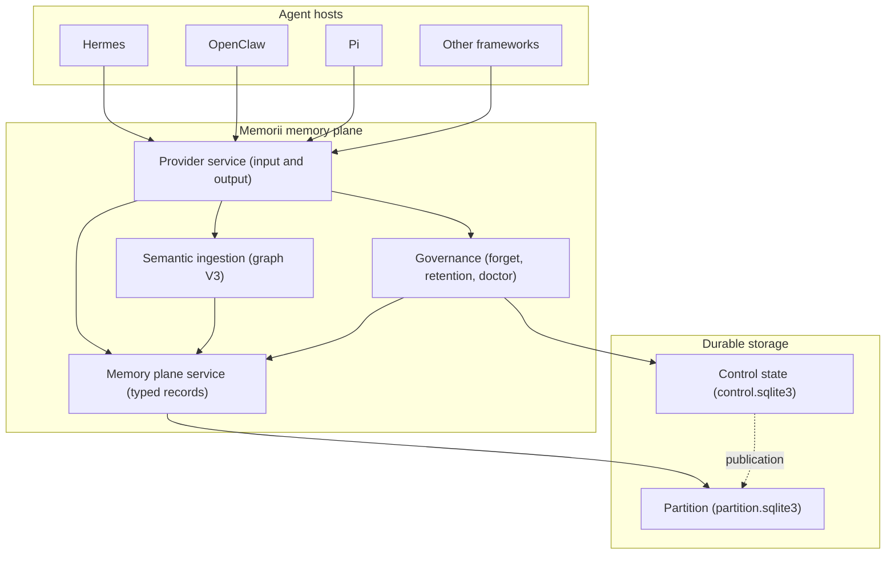
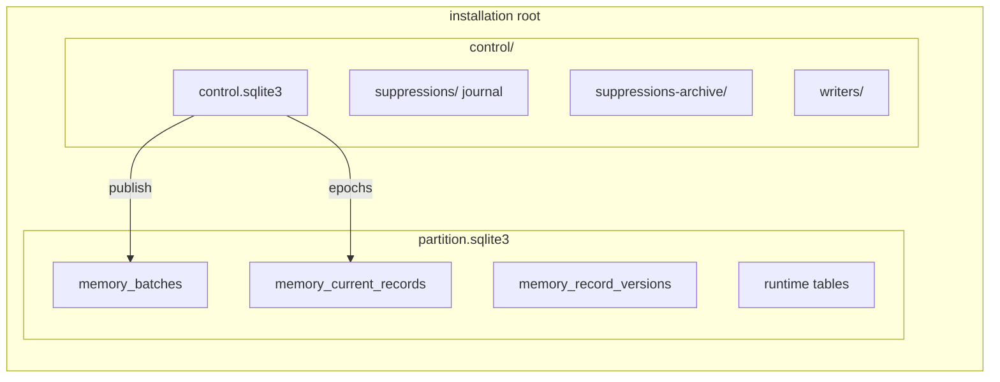
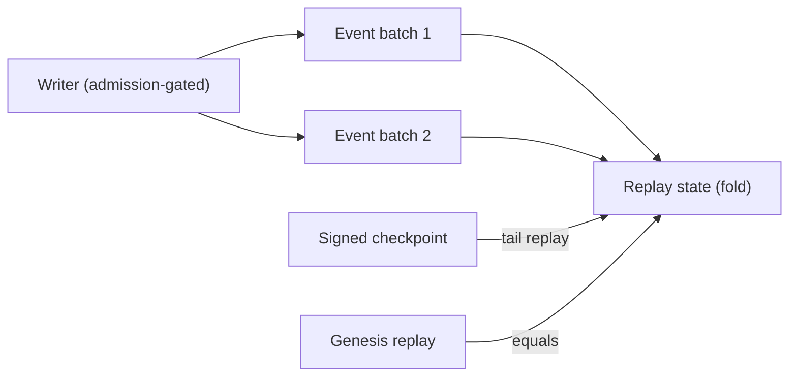
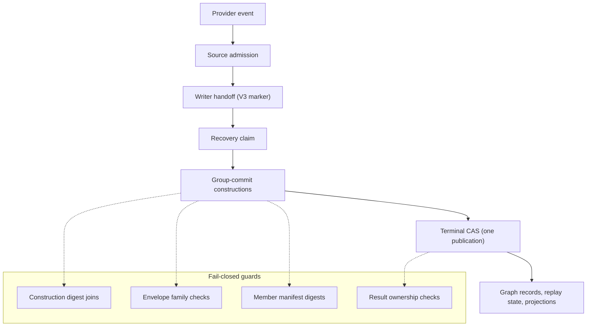
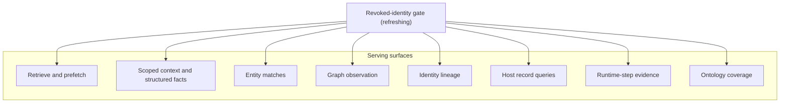
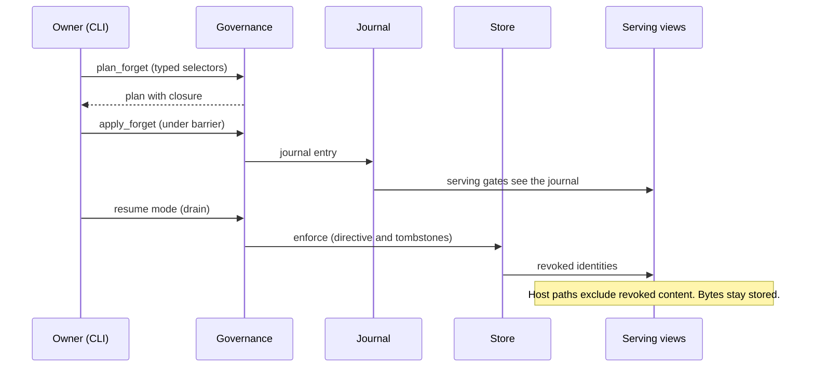
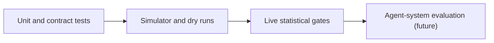

# Memorii Architecture

This document describes the Memorii memory plane. It tells you what the
production code does today and how the parts connect. It follows
Simplified Technical English (ASD-STE100): short sentences, active
voice, imperative procedures, and one word for one meaning.

The governing documents are `docs/design/memorii_spec.md`,
`docs/design/memorii_storage_details.md`, and `docs/design/event_model.md`.
These documents win when the text disagrees. For limits on what Memorii
claims today, read the README section "Current Limitations".

## 1. System Overview

Memorii sits between agent hosts and durable storage. It is a typed
memory plane. Hosts send events and explicit writes. Memorii validates
the input, stores typed state, and serves scoped reads.



Three rules hold everywhere in the plane:

1. Raw observations are the source of truth. Derived graph state is a
   projection. The system can rebuild it from the events.
2. Model output is candidate data. It becomes memory only after
   schema, semantic, provenance, evidence, and lifecycle checks pass.
3. The system fails closed. Unknown values, unclear input, missing
   authorities, and stale leases cause a refusal. The system never
   guesses.

## 2. The Typed Memory Model

Memorii does not store memory as one set of documents. It keeps six
logical domains apart (`memorii/core/memory_plane/models.py`):

| Domain | Contents | Example kinds |
| --- | --- | --- |
| Raw transcript | What the user actually said | transcript records |
| Semantic | Entities, claims, evidence, relations | `claim_state`, `entity_link`, `graph_node` |
| Episodic | Session and event recall | episodic records |
| User context | Preferences and delegations | preference records |
| Execution | Persistent work state | runtime tables |
| Solver / search | Task-local hypotheses and overlays | solver tables |

Two distinctions cross all domains:

- **Candidate versus committed.** Extraction makes candidates. Only the
  validation stages commit. Promotion is careful and auditable.
- **Structure versus version.** Structural graph state stays apart from
  versioned belief overlays. Revision writes new versions. It does not
  delete history.

## 3. Storage and Control

A managed installation is one root directory. It holds a control
authority and a data partition:



Key facts:

- Publication is the only write path into the partition. Each batch
  lands under a verified control revision. Readers see the old state or
  the new state. They never see a partial state.
- `memory_record_versions` keeps every version of every record. A forget
  writes tombstone versions. It deletes nothing. The owner forensic
  surface reads this history.
- The suppression journal gates serving between apply and enforcement.
  Retention moves old entries to the archive. The revocations stay in
  force.
- The release proof pins every production and tool file
  (`docs/work/semantic_ingestion/observation-ledger/release-preparation/candidate.json`).
  The proof fails when a file changes.

The system reads legacy JSONL planes through migration. A managed
installation refuses to run next to a legacy plane that no migration
adopted.

## 4. Event Model and Replay

Every semantic mutation is an append-only event. The active envelope
schema is `memorii.semantic-memory-event.v1`. Additive grammar changes
extend v1. A new version number needs a non-additive change. This rule
is in `docs/design/semantic_forgetting.md` §6.10.



- Replay is deterministic. Folding the stored batches gives the stored
  replay state. Checkpoint-tail replay equals genesis replay. The test
  suite proves this, also for mixed old and new history.
- The schema registry grows one way. It admits new record kinds
  additively. Strict decode rejects an unknown kind. An old binary
  refuses a new record. It does not misread it.
- Each transaction group keeps an immutable request and reload in a
  primary record. The record identity binds the construction digests.
  The golden fixtures and the migration engine build on this substrate.

## 5. Semantic Ingestion (Bootstrap Graph V3)

The default ingestion path is a chain of gated stages
(`memorii/core/memory_evolution/atomic_store.py`,
`memorii/core/semantic_ingestion/contracts.py`):



Every stage is content-addressed. Intents pin construction input
digests. Members carry payload digests. Manifests hash the member
tuple. The terminal publication lands under one admission-governed
compare-and-set.

Five golden fixtures under
`memorii/tests/fixtures/semantic_ingestion/current_terminal/` capture a
complete terminal publication. When the grammar changes, the migration
engine re-derives the fixtures. Nobody edits fixture bytes by hand.

## 6. Serving and Revocation Gating

All host reads go through `ProviderMemoryService`
(`memorii/core/provider/service.py`). Every serving path consults the
revoked-identity view. The view derives from the journal and the
retention archive. It refreshes on journal writes. A long-lived
process sees new revocations without a restart.



The forget sequence:



The full enforcement matrix is `docs/design/semantic_forgetting.md`
§6.8. The parity suite
(`tests/integration/test_forget_parity_family.py`) walks the surfaces
with count checks, exact pagination, and crash recovery.

## 7. Execution and Solver Memory

The execution plane stays separate from the memory-evolution graph:

- The execution graph keeps tasks, nodes, edges, solver runs,
  justifications, and checkpoints. It persists through
  `RuntimeStateRepository` (`memorii/core/persistence/runtime_repository.py`).
- The solver graph keeps task-local hypotheses and overlays. It never
  mixes into the execution graph.
- A loopback sidecar serves read-only runtime state to sandboxed hosts
  (`memorii/core/harness_state/`). Python and TypeScript clients exist
  (`sdk/typescript`, `@memorii/runtime-client`).

## 8. Host Integrations

Adapters are thin and sit at the edges (`memorii/integrations/`,
`memorii/core/semantic_ingestion/production_capture.py`):

| Host | Path | Status |
| --- | --- | --- |
| Hermes | Docker image (`Dockerfile.memorii`), Level-2 sidecar | Early real-world tests |
| OpenClaw | Docker image (`Dockerfile.openclaw`) | Blocked on gateway auth |
| Pi | Docker image (`Dockerfile.pi`) | Journey pending |
| Other frameworks | `build_provider_memory_service_from_env(...)` | Production boundary |
| TypeScript hosts | `@memorii/runtime-client` | Ships |

Framework-neutral contracts never import host SDKs. Adapters translate
at the boundary. The provider factory refuses to compose without an
explicit revoked-identity gate. This rule fails closed.

## 9. Verification

Evidence has tiers. The tiers do not mix:



- CI runs about 58 jobs: unit shards, ingestion acceptance, terminal
  persistence, two durable integration jobs, activation, package smoke
  with the installed proof, benchmark contracts, and static analysis.
- Golden fixtures are byte-exact captures. The migration engine
  re-derives them when the grammar changes.
- Benchmarks produce typed artifacts with fingerprints. A fake-oracle
  run proves plumbing. It never proves live model quality
  (`docs/development/benchmark_certification.md`).

## 10. Repository Map

```
memorii/                  Python package (memorii 0.1.0, Python >= 3.11)
  core/
    memory_plane/         typed records, plane service, stores
    memory_evolution/     atomic store, replay, graph, tombstones, view
    semantic_ingestion/   contracts, admission, event replay, capture
    provider/             provider service, factory, prefetch
    storage_administration/ control state, governance, revoked view
    harness_state/        loopback sidecar, runtime reads
    persistence/          runtime repository, partition factory
  integrations/           hermes, openclaw, pi, authenticated source
  tools/                  memorii-operator, memorii-consume, evals
  tests/                  unit, integration, acceptance, fixtures
sdk/typescript/           @memorii/runtime-client
docs/
  design/                 governing designs
  architecture.md         this document
  plans/                  readiness and hardening plans
  work/                   WorkPlans and release evidence
Dockerfile.memorii|openclaw|pi   host images
```

For document precedence and operating rules, read `AGENTS.md`. For what
Memorii does not claim, read the README section "Current Limitations".
