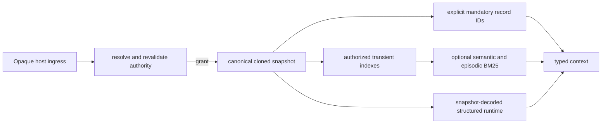

# Scoped Storage And Context Activation

## Status And Authority

This document is an additive design for a typed, opt-in read API.  It does not
change the behavior of `ProviderMemoryService.prefetch`, replace an existing
memory-plane store, or authorize a deployment.  It is the proposed canonical
contract for the symbols named in the identity inventory below after a separate
implementation operation accepts it.

Normative sources, in precedence order, are `docs/design/memorii_spec.md`,
`docs/design/memorii_storage_details.md`, `docs/design/event_model.md`, and
`docs/IMPLEMENTATION_RULES.md`.  `docs/design/semantic_temporal_retrieval.md`
governs structured temporal decisions.  This document preserves the completed
semantic-ingestion M3.1/M4 behavior and is linked to, but does not complete,
the pending M5 deployment-acceptance requirements.

The user-supplied research notes in
`docs/work/semantic_context_activation/research-notes.md` are informative.
They neither define a durable schema nor supply authority, trust, topology,
statistical, monitoring, or signature values.

## Problem And Bounded Outcome

Long-running hosts need two kinds of context at a task boundary:

1. mandatory canonical-record references selected by the host for its state,
   artifact, or constraint context, which must arrive independently of ranking;
2. optional supporting material selected from the host-authorized view of
   semantic and episodic records.

The existing prefetch path performs separate reads and formats up to three work
state summaries.  It therefore cannot say that it used one common snapshot or
that it returned a complete set of obligations.  Its scope matcher also treats
absent record scope fields as wildcards.  That is retrieval filtering, not an
authorization decision, and this design must not reuse it for access control.

The initial outcome is `ProviderMemoryService.retrieve_context`, an opt-in typed
operation whose caller supplies opaque authenticated host ingress, a task/state
label, and a host-declared canonical-record reference set.  The host authority
resolves and revalidates ingress into a finite grant; callers cannot supply one.
The
operation reads one request-local canonical snapshot, resolves mandatory
references deterministically, and optionally ranks eligible semantic and
episodic records with BM25.  It preserves structured graph decisions and their
temporal abstentions without converting text ranking into categorical truth.

This is deliberately not an execution state machine, an automatic discovery
of all obligations, a learned-control promotion path, a durable secondary
index, a graph-directory redesign, or a new host harness.  A host declaration
of completeness means only that the host represented its intended mandatory
set in this request; Memorii does not infer that it contains every obligation.

## Requirements And Acceptance

| ID | Requirement | Acceptance criterion |
| --- | --- | --- |
| SMC-R01 | Explicit mandatory references are independent of optional ranking. | A ranker failure, empty query, or optional overflow cannot remove a successfully resolved mandatory item. |
| SMC-R02 | Reads are authorized before record lookup, scoring, statistics, or graph query. | A missing, invalid, expired, revoked, or scope-inadequate host authority returns a typed denial with no revision, count, or record-derived identifier. |
| SMC-R03 | One activation result is based on a request-local canonical record snapshot. | Its result carries the captured memory snapshot revision and all canonical-derived item references resolve from that clone. |
| SMC-R04 | Semantic and episodic text are optional supporting channels. | They are domain-filtered and scored only after authorization; neither channel can assert categorical truth. |
| SMC-R05 | Structured graph retrieval remains governed by its existing temporal contract. | A `MemoryQueryInput` over readers decoded from the same canonical snapshot preserves ambiguity/abstention and yields no graph-truth substitute from lexical retrieval. |
| SMC-R06 | Overflow is explicit and mandatory content is never silently truncated. | Invalid budgets and mandatory overflow return typed failures; optional omission is recorded with reason and identifiers/counts. |
| SMC-R07 | Each emitted item is attributable and reconstructible. | Items carry record or graph identifiers, source/provenance references when present, and snapshot/binding metadata. |
| SMC-R08 | Existing callers remain compatible. | `prefetch` retains its contract; the new method has no implicit fallback from the old API. |
| SMC-R09 | Storage remains authoritative-record-first and rebuildable-index-second. | The initial implementation uses only request-local derived indexes; deleting them cannot delete or alter canonical records. |
| SMC-R10 | Initial rollout has a real planned production composition chain. | The implementation binding table has a named non-test factory, filesystem, and Hermes caller slice with required authority and fail-closed absence. |

### M5 Crosswalk

This design must preserve all eight pending M5 concerns without claiming their
external activation evidence.

| M5 requirement | Constraint in this design | Still owned by M5 |
| --- | --- | --- |
| SIA-R03 | The identity, binding, and verification tables name every proposed behavioral symbol and future caller. | M5 evidence ledger and independent acceptance closure. |
| SIA-R08 | The new API is local and opt-in; it makes no remote call and has no remote fallback. | Bootstrap profile activation and its no-network certification. |
| SIA-R13 | No acceptance key, signature, release, or witness is introduced or imported. | Lifecycle-checked acceptance trust and external witness validation. |
| SIA-R14 | No metric, threshold, sample size, or statistical claim is invented. | Mandatory routing/analysis/coverage/abstention statistical certification. |
| SIA-R15 | No monitor policy or state transition is added. Typed observable outcomes are only future implementation inputs. | Deterministic capability monitoring and evidence-only transitions. |
| SIA-R16 | Factory wiring must retain the existing bootstrap topology and not add model, tokenizer, asset, or remote dependencies. | Topology declaration and startup certification. |
| SIA-R17 | This API is not the acceptance oracle and cannot import oracle state. It returns application context only. | Authorized structural observation, global bijection, and oracle isolation. |
| SIA-R19 | Explicit local authority and opt-in use prevent a hidden alternate ingestion path. | Governed source admission and local profile acceptance. |

## Storage Organization

The six existing logical domains remain separate: raw transcript, semantic,
episodic, user context, execution plan/state, and solver/search.  Canonical
records and graph stores remain their present owners.  This design neither
places dynamic belief on a structural graph node nor merges the execution and
solver graphs.

Canonical records are authoritative.  A future implementation may construct a
request-local `ScopedContextIndex` from the authorized clone for namespace,
provenance, lexical, and record-to-graph-reference lookup.  It is a transient
derived object, not a persisted table or source of truth.  It must be rebuilt
for every activation request from authorized canonical records and must never
be treated as valid merely because the runtime-context data revision is
unchanged: that revision does not represent every internal authority change.

`MemoryPlaneStore.read_snapshot()` already produces cloned canonical records
under its store lock for the in-memory and JSONL stores.  The design relies on
that canonical snapshot for every v1 result, including snapshot-decoded
structured retrieval.  This v1 operation reads neither the separately owned
work-state store nor a graph store, so it makes no cross-store transaction,
revision, or composed-snapshot claim.

The selected alternative was a transient index over the clone.  A persisted
lexical/namespace/graph directory might reduce repeated setup cost, but would
require durable versioning, invalidation, recovery, migration, and cross-store
consistency rules that this scope does not need.  Direct per-record scans avoid
that new durable risk but repeatedly reconstruct tokenization and provenance
lookups.  The transient index improves organization and duplicate work within
one request; it makes no asymptotic performance claim while canonical snapshot
creation and BM25 candidate preparation remain proportional to eligible
records.

## Typed Public Contract

The future implementation owns the following closed symbols under
`memorii/memorii/core/scoped_context/`.  None exists today.  All models forbid
extra fields; opaque identifiers are nonblank and compared byte-for-byte; every tuple has a
deterministic order; unknown enum values fail validation.

```python
class ScopedContextChannel(StrEnum):
    MANDATORY = "mandatory"
    SEMANTIC_BM25 = "semantic_bm25"
    EPISODIC_BM25 = "episodic_bm25"
    STRUCTURED_GRAPH = "structured_graph"

class ScopedContextStatus(StrEnum):
    COMPLETE = "complete"
    PARTIAL_OPTIONAL = "partial_optional"
    DENIED = "denied"
    INVALID_REQUEST = "invalid_request"
    MANDATORY_UNRESOLVED = "mandatory_unresolved"
    MANDATORY_OVERFLOW = "mandatory_overflow"
    UNAVAILABLE = "unavailable"

class ScopedOmissionReason(StrEnum):
    EMPTY_QUERY = "empty_query"
    NO_MATCH = "no_match"
    OPTIONAL_LIMIT = "optional_limit"
    RENDERED_BYTE_LIMIT = "rendered_byte_limit"
    SCORER_UNAVAILABLE = "scorer_unavailable"
    PROVENANCE_UNAVAILABLE = "provenance_unavailable"
    STRUCTURED_NO_MATCH = "structured_no_match"
    STRUCTURED_ABSTAINED = "structured_abstained"
    STRUCTURED_UNSUPPORTED_QUERY = "structured_unsupported_query"
    STRUCTURED_UNAVAILABLE = "structured_unavailable"

class ScopedRecordReference(BaseModel):
    record_id: str
    purpose: Literal["state", "artifact", "constraint"]

class ScopedContextBudget(BaseModel):
    max_mandatory_items: PositiveInt
    max_optional_items: PositiveInt
    max_optional_omission_ids: PositiveInt
    max_rendered_utf8_bytes: PositiveInt

class ScopedContextRequest(BaseModel):
    host_task_id: str
    host_state_id: str
    declared_complete_mandatory_set: bool
    mandatory_record_references: tuple[ScopedRecordReference, ...]
    optional_query: str | None
    optional_domains: tuple[Literal[MemoryDomain.SEMANTIC, MemoryDomain.EPISODIC], ...]
    budget: ScopedContextBudget
    reference_time: datetime
    structured_query: MemoryQueryInput | None

class ScopedContextItem(BaseModel):
    channel: ScopedContextChannel
    record_id: str
    domain: MemoryDomain
    source_kind: str
    rendered_text: str
    source_record_ids: tuple[str, ...]
    provenance_ref: str | None

class ScopedContextOmission(BaseModel):
    channel: ScopedContextChannel
    reason: ScopedOmissionReason
    omitted_count: NonNegativeInt
    omitted_record_ids: tuple[str, ...]
    identifiers_truncated: bool

class ScopedStructuredOutcome(BaseModel):
    status: Literal["answered", "no_match", "abstained"]
    claim_items: tuple[ScopedContextItem, ...]
    evidence_items: tuple[ScopedContextItem, ...]
    abstention_reason: str | None

class ScopedContextActivation(BaseModel):
    status: ScopedContextStatus
    request_task_id: str | None
    request_state_id: str | None
    authority_binding_receipt: ScopedAuthorityBindingReceipt | None
    memory_snapshot_revision: int | None
    mandatory_items: tuple[ScopedContextItem, ...]
    optional_items: tuple[ScopedContextItem, ...]
    omissions: tuple[ScopedContextOmission, ...]
    structured_outcome: ScopedStructuredOutcome | None
```

`ScopedHostReadAuthority` is separately injected into `ProviderMemoryService`;
it is never a request model and is not the verified ingestion authority. The
concrete v1 owner is `InProcessScopedReadAuthority` in
`core/scoped_context/authority.py`. A trusted embedding host configures finite
grants there, receives server-owned opaque identity handles, and passes a handle
only as `opaque_host_ingress`. Request callers cannot create, serialize, or
supply grants. Handles are process-local: restart invalidates them; grants are
not persisted.

```python
@dataclass(frozen=True)
class ScopedNamespaceGrantRow:
    domain: MemoryDomain
    task_id: str | None; session_id: str | None; user_id: str | None
    agent_id: str | None; execution_node_id: str | None; solver_run_id: str | None
    allowed_record_ids: frozenset[str] | None

@dataclass(frozen=True)
class ResolvedScopedReadGrant:
    handle_id: str; host_task_id: str; host_state_id: str
    authority_epoch: int; expires_at: datetime
    rows: tuple[ScopedNamespaceGrantRow, ...]

@dataclass(frozen=True)
class ScopedAuthorityBindingReceipt:
    handle_id: str; authority_epoch: int

class InProcessScopedReadAuthority:
    def __init__(self, *, now_provider: Callable[[], datetime]): ...
    def provision(self, *, host_task_id: str, host_state_id: str,
                  rows: tuple[ScopedNamespaceGrantRow, ...], expires_at: datetime) -> object: ...
    def resolve(self, handle: object, *, task_id: str, state_id: str) -> ResolvedScopedReadGrant | None: ...
    def revoke(self, handle: object) -> None: ...
    def authorize_release(self, grant: ResolvedScopedReadGrant) -> ScopedAuthorityBindingReceipt | None: ...

class ScopedSnapshotBackendError(RuntimeError): ...
class ScopedSnapshotDecodeError(RuntimeError): ...
class ScopedOptionalScorerError(RuntimeError): ...
class ScopedStructuredDependencyError(RuntimeError): ...
class ScopedUnsupportedQueryError(RuntimeError): ...
```

Under one authority-owned lock, `InProcessScopedReadAuthority` owns provision,
revocation, `resolve`, and `authorize_release`. Provision validates exact fields,
nonblank IDs, no duplicate rows, and a nonempty all-null row allowlist; it mints
an unforgeable process-local object handle, a distinct nonsecret audit
`handle_id`, and epoch at least one. Re-provision creates a new identity; an
authority update revokes the old grant. A resolved grant
binds exact `host_task_id`, `host_state_id`, authority epoch, UTC expiry, and
finite namespace rows. A row contains domain, task, session, user, agent,
execution node, solver run, and an optional finite `allowed_record_ids` set.
All row fields compare by exact equality, including null. A partial-null row is
therefore exact. An all-null identity row is not a wildcard: it must have a
nonempty `allowed_record_ids` set and permits only those exact canonical record
IDs. This rule applies to old and new all-null records; no legacy-global
provenance inference or record migration is introduced.

The injected UTC clock is explicit. At equality with `expires_at`, a grant is
expired. `resolve` occurs before the snapshot; assembly happens outside the
lock; `authorize_release` reacquires the lock and compares the complete current
grant, handle, exact request labels, expiry, epoch, and rows with the resolved
grant. This is the linearization point. Revocation before it returns the empty
`DENIED` envelope; revocation after it governs the next read and cannot retract
bytes already released. No cryptographic format, trust value, or remote policy
is invented. A serialized receipt contains only the audit label and epoch; it
is not a bearer handle and can never resolve a grant.

The public method is
`ProviderMemoryService.retrieve_context(request, *, opaque_host_ingress)`.
It rejects duplicate mandatory record IDs, a domain outside semantic/episodic
for optional search, a nonpositive budget, and a nonempty structured query
whose fields fail existing `MemoryQueryInput` validation.  It does not accept a
caller-made grant, external state/artifact resolver, graph reference, or an
execution transition request.

Every success echoes `request_task_id`/`request_state_id`, returns the opaque
authority-issued binding receipt and the snapshot revision, and puts
`source_kind` on each item. The receipt is only a current-read binding, not a
durable reconstruction promise; reconstruction requires a retained snapshot.
For optional omissions, ordered authorized candidate IDs are included only up
to `max_optional_omission_ids`; `omitted_count` is the full count and
`identifiers_truncated` records the cap. `max_rendered_utf8_bytes` covers only
rendered content units: the UTF-8 sum of each item's `rendered_text`, record
ID, domain, source kind, source IDs, and provenance reference. Status, counts,
request labels, receipt, omission reason, and capped omission IDs are excluded
from that content budget but are independently bounded by optional item and
omission-ID limits.

Every failure status (`DENIED`, `INVALID_REQUEST`, `MANDATORY_UNRESOLVED`,
`MANDATORY_OVERFLOW`, and `UNAVAILABLE`) has null request echo, receipt, and
revision; empty items, omissions, and structured outcome; and no data-derived
metadata. `UNAVAILABLE` is only a typed snapshot/backend/decode failure;
corruption is never converted to no match. `COMPLETE` means every requested
mandatory reference resolved and no optional omission occurred; an empty
mandatory set is valid. `PARTIAL_OPTIONAL` means every mandatory reference
resolved and at least one closed optional omission occurred. A host's
completeness declaration is informational, not a claim that all obligations
were supplied.

Status consistency is closed: `COMPLETE` has no omissions; `PARTIAL_OPTIONAL`
has at least one; `DENIED` never contains a structured outcome; and every
structured outcome is either `answered` with nonempty, unique claim items and
unique evidence items, `no_match` with both tuples empty and no reason, or
`abstained` with both tuples empty and a nonblank reason. Each emitted source,
claim/citation item is charged, authorized, and from the captured clone.
Omission IDs are excluded from the content-byte budget and are bounded
only by their independent cap. A structured unsupported purpose is represented only as the typed
optional omission, never as a `ScopedStructuredOutcome`.

## Activation Algorithm And Failure Behavior



1. `ProviderMemoryService.retrieve_context` validates the request shape and
   resolves opaque ingress through the injected authority protocol. Failure
   returns `DENIED` before lookup, scoring, document frequency, statistics,
   graph decoding, or record-derived timing.
2. It makes one snapshot attempt through `MemoryPlaneService` to
   `MemoryPlaneStore.read_snapshot()`. `ScopedSnapshotBackendError` or
   `ScopedSnapshotDecodeError` returns empty
   `UNAVAILABLE`; an unexpected exception propagates and never returns a
   success-shaped result.
3. One common eligibility predicate runs before every catalog, mandatory lookup,
   BM25 calculation, decoder, analyzer, or statistics operation. It requires
   the exact grant row (including all-null ID allowlist), runtime-context
   visibility, committed status, and complete readable provenance. Semantic claim state uses the existing typed
   `ClaimStateQueryService`; raw transcript and other typed committed records
   use their canonical `MemoryPlaneService` record conversion plus the generic
   committed/runtime-visible fallback. Candidates, internal-control records,
   malformed payloads, and missing required provenance are excluded before any
   optional index. A malformed owned payload is typed `UNAVAILABLE`.
4. Every mandatory ID must resolve exactly once from the eligible clone across
   all six domains. Generic nonclaim current validity permits `valid_from=None`
   only for transcript or committed plain-context records; expired/invalidated
   records are not current evidence and intervals are half-open `[from, to)`.
   Mandatory claim references and lexical claim candidates use
   `ClaimStateQueryService` CURRENT at `request.reference_time` before rendering.
   Only structured candidates defer lifecycle selection to their resolved
   temporal frame. An absent `structured_query.reference_time` is set from the
   request; an explicit mismatch is `INVALID_REQUEST`.
   Missing required provenance yields
   `MANDATORY_UNRESOLVED`; optional candidates with it are excluded and create
   `PROVENANCE_UNAVAILABLE`. For `ClaimState`, provenance is canonical
   `source_record_ids` plus `evidence_spans`; for `EntityLinkState` it is
   `evidence_spans.source_id`; for `TemporalAnchor` it is `source_ids` plus
   evidence. Each required source ID must be eligible. Envelope and decoded inner claim/link/anchor scope agree
   on shared task/session/user fields; the grant separately enforces
   agent/execution-node/solver-run. Duplicates, lifecycle-ineligible records, and unauthorized
   matches fail the mandatory channel as a whole.
5. The assembler renders mandatory items whole, sums UTF-8 bytes, and fails
   `MANDATORY_OVERFLOW` for item or byte overflow. It never clips content or
   starts optional work after mandatory failure.
6. For nonblank optional text, it builds `ScopedContextIndex` from current-time
   eligible semantic/episodic records only, evaluated at required UTC
   `reference_time`. It reuses `BM25Scorer` tokenization, orders by channel,
   descending score, then record ID, and
   admits whole items under the charged item/byte budget. This offers no ranking
   or quality gain claim. Unadmitted candidates create capped-ID omissions.
7. For a structured query, only `RetrievalPurpose.ANSWER` is supported in v1.
   `ScopedClaimQueryAnalyzer` implements the existing `QueryAnalyzer.analyze`:
   it delegates exactly once to local `EnglishLexicalQueryAnalyzer` over
   snapshot-bound inputs, returns allowed or ambiguous `QueryAnalysis` unchanged,
   and raises `ScopedUnsupportedQueryError` for EXECUTION/BELIEF before
   `MemoryEvolutionRetrievalRuntime` can branch. GRAPH_AUDIT and EXECUTION
   purposes are rejected before analysis. The API maps that error to
   `STRUCTURED_UNSUPPORTED_QUERY`, never a claim-only substitute. Unknown enum
   or schema values follow existing validation failure and are never guessed. The
   pure `EvolutionStateRepository.from_snapshot(records)` decoder factory feeds
   `ClaimStateQueryService`; its claim/entity/action readers, snapshot-only
   anchors, explicit local analyzer, predicate registry, and injected clock feed
   `MemoryEvolutionRetrievalRuntime`. The local analyzer is selected regardless
   of configured provider analyzers and makes no remote call. These read-only
   capabilities have no memory-plane or graph-store fallback and never invoke a
   mutation path.
8. The snapshot repository maps every logical claim ID to one canonical memory
   record ID. Each
   selected claim, citation, and transitive evidence reference must be unique,
   present in the clone, and eligible before catalog/analyzer use. The structured
   decision is then sanitized. Rejected IDs, entity catalogs, raw payloads, and
   document-frequency aggregates never cross the boundary. Typed scorer or
   `ScopedOptionalScorerError` creates `SCORER_UNAVAILABLE` and
   `ScopedStructuredDependencyError` creates `STRUCTURED_UNAVAILABLE`, preserving
   mandatory items; unexpected bugs propagate. A structured result is one
   optional unit: claim items plus its complete evidence-item closure are
   deduplicated in stable record-ID order, charged together, and included whole
   or omitted with `RENDERED_BYTE_LIMIT`/`OPTIONAL_LIMIT`. `authorize_release`
   runs after every data-bearing outcome is assembled.

Temporal ambiguity produces `STRUCTURED_ABSTAINED`, no selected claim, and
`PARTIAL_OPTIONAL`; no match produces `STRUCTURED_NO_MATCH`. Empty optional
search produces `EMPTY_QUERY`. Unsupported tokenization or scoring failure
produces `SCORER_UNAVAILABLE`. None can cause lexical fallback into categorical
truth, an execution transition, or a control promotion.

| Retrieval purpose | Temporal kind | v1 result |
| --- | --- | --- |
| ANSWER | CURRENT | runtime claims |
| ANSWER | HISTORICAL | runtime claims |
| ANSWER | INTERVAL | runtime claims |
| ANSWER | AMBIGUOUS | existing structured abstention |
| ANSWER | EXECUTION | `STRUCTURED_UNSUPPORTED_QUERY` |
| ANSWER | BELIEF | `STRUCTURED_UNSUPPORTED_QUERY` |
| GRAPH_AUDIT | CURRENT, HISTORICAL, INTERVAL, AMBIGUOUS, EXECUTION, BELIEF | `STRUCTURED_UNSUPPORTED_QUERY` before analysis |
| EXECUTION | CURRENT, HISTORICAL, INTERVAL, AMBIGUOUS, EXECUTION, BELIEF | `STRUCTURED_UNSUPPORTED_QUERY` before analysis |

## Snapshot, Provenance, And Visibility

Every successful canonical-derived result records `memory_snapshot_revision` and
its canonical record ID.  For a record with ingestion provenance, the item carries
its source record IDs, source kind, and any existing provenance-manifest
reference; lack of provenance is surfaced as an omission or rejected according
to the record's existing domain policy, never synthesized. Structured output
is decoded from the same canonical clone. It has no separate graph-store
snapshot or cross-store consistency claim.

For deterministic reconstruction, the future API records no durable activation
event in this slice.  A host that needs audit durability must invoke a separate
event contract rather than writing a raw nested result into a memory domain.
This avoids silently adding an event schema, retention policy, or acceptance
authority.  The API can return its complete request identity and omission data
to a host-owned audit boundary.

## Production Entrypoint Binding Plan

There are zero current production callers of this new API.  The following is a
required implementation binding, not a claim of present reachability.  The
implementation WorkPlan must update its `production_entrypoint_bindings` entry
before it says this runtime requirement is complete, and must prove one
non-test caller reaches the canonical owner with validated authority.

| Stage | Exact future owner/call | Required authority and data | Absence behavior |
| --- | --- | --- | --- |
| Composition root | `core/provider/factory.py:build_provider_memory_service_from_env(..., scoped_read_authority=...)` forwards the separate authority into `ProviderMemoryService(..., scoped_read_authority=...)`. | `InProcessScopedReadAuthority`; never verified ingestion authority. | Missing owner makes `retrieve_context` deny before lookup. |
| Filesystem root | `core/filesystem_storage/bundle.py:FilesystemStorageBundle.build_provider_memory_service(..., scoped_read_authority=...)` forwards it to the factory and returns the configured provider. The returned provider's `retrieve_context` is the actual filesystem trigger. | Separate authority, request, opaque ingress. | No convenience fallback or inferred filesystem grant. |
| Hermes root | `integrations/hermes_provider.py:HermesMemoryProvider(..., scoped_read_authority=...)` forwards it through the factory; `HermesMemoryProvider.retrieve_context(request, *, opaque_host_ingress)` explicitly forwards to provider `retrieve_context`. | Separate authority, request, opaque ingress; never a grant. | Hermes preserves `prefetch`; it never substitutes prefetch for this call. |
| Canonical service | `core/provider/service.py:ProviderMemoryService.retrieve_context(request, *, opaque_host_ingress)`. | Injected authority, request, memory-plane snapshot owner, snapshot readers. | Fails closed before lookup or statistics. |
| Canonical records | `core/memory_plane/service.py` delegates snapshot acquisition to `MemoryPlaneStore.read_snapshot`. | Authorization already validated; cloned records and revision. | Backend error is an explicit unavailable/error result, never a partial authorization bypass. |
| Structured read | `core/memory_evolution/retrieval_runtime.py:MemoryEvolutionRetrievalRuntime`. | Same-clone pure decoder, `ClaimStateQueryService`, snapshot anchors, local analyzer, predicates, clock. | Preserve no-match/abstention; no live alternate reader. |

`core/execution/service.py` retains its existing `RetrievalPlan` to
`MemoryPlaneService.retrieve_runtime_context` path and is not a new composition
root. Reusing it would create automatic execution/solver coupling outside this
scope. The agent-integration readiness document also prohibits
claiming a real harness pilot.  Component implementation and tests may be
prepared later; real-harness evaluation remains a separate operation.

## Migration, Rollout, And Rollback

Rollout is additive and opt-in:

1. add closed contract models, `InProcessScopedReadAuthority`, exact
   canonical snapshot filtering, and deterministic unit tests;
2. bind one filesystem composition root and one Hermes composition root behind
   explicit host calls, while preserving old `prefetch` paths;
3. add bounded observability for status, omission reasons, snapshot identities,
   and channel counts, with no content or unauthorized statistics; and
4. undertake harness evaluation, durable audit design, or persisted indexes
   only in separate approved work.

No canonical record migration is necessary for the transient index or an
all-null scope. Old and new null fields compare exactly; an all-null record is
visible only through a finite all-null grant-row record-ID allowlist. Rollback
removes the host's opt-in invocation and preserves
records unchanged.  If code removal is needed, it must first drain in-flight
requests and leave no persisted index or activation event to reconstruct.

## Resource And Environment Matrix

| Dimension | v1 contract |
| --- | --- |
| Python/store | Python 3.12; in-memory and JSONL stores take one detached clone per read. Same-process mutation and fresh-process JSONL reopen are mechanism-tested. `read_snapshot()` remains O(N); no bounded capture-memory claim is made. |
| Authority | Local-process handles and grants only. Process restart invalidates handles. The authority lock protects provision, resolve, revoke/update, and release authorization. |
| Time | Separate injected UTC clocks govern authority expiry and request `reference_time`; equality at authority expiry denies. |
| Tokenization | `BM25Scorer` local tokenization is exercised under the exact environment/config identity recorded by test evidence. ICU and fallback environments are not silently compared; exposing a runtime tokenizer fingerprint requires a later helper. |
| Network | `EnglishLexicalQueryAnalyzer` and BM25 are local; no configured provider analyzer, remote proposal, or network fallback is callable. |
| Response limits | Mandatory units must fit; optional lexical units and complete structured units share item/content limits. Metadata stays outside content budget but omission IDs have their independent finite cap. |

`scope_probe.py` establishes that omitted and explicit-null canonical scope
fields serialize identically. It supports the unified all-null finite-ID grant
rule only; it proves neither global provenance nor migration behavior.

## Verification And Attack Matrix

| Family | Required proof |
| --- | --- |
| Authority | Missing injected owner, forged/restarted handle, wrong request labels, expired/revoked/update-before-release grant, all-null row without finite IDs, denied record ID, and every namespace-field mismatch deny. Initial denial makes zero data read; final denial discloses no assembled data. |
| Mandatory channel | State/artifact/constraint purpose over canonical IDs succeeds across eligible domains; duplicate, missing, wrong-domain, cross-namespace, internal-control, lifecycle/provenance failure, malformed, unauthorized, and charged-budget variants produce empty failure envelopes. |
| Optional channel | Empty query, no match, score tie order under one recorded tokenizer environment, semantic-only, episodic-only, typed scorer outage, item/byte/omission-ID cap, and optional provenance exclusion produce deterministic omissions. |
| Snapshot | In-memory and JSONL clones resist post-capture writes and caller mutation; all canonical result IDs, decoded claim state, entity link, action, contradiction, anchor, and evidence reference come from one authorized clone. |
| Temporal graph | The full 18 purpose/temporal pairs are tested: ANSWER/CURRENT,HISTORICAL,INTERVAL return claims; ANSWER/AMBIGUOUS abstains; every ANSWER/EXECUTION,BELIEF and GRAPH_AUDIT/EXECUTION pair is unsupported with no runtime execution dispatch. Shared scope agreement and evidence closure are required. |
| Provenance | Source/provenance preservation, absent required provenance, record/claim/evidence substitution, stale snapshot identity, and cross-channel item substitution are rejected or visibly omitted. |
| Compatibility | Existing `prefetch`, provider factory default construction, local bootstrap no-network behavior, and explicit remote opt-in tests retain their existing outcomes. |
| Binding | Each of R01-R10 has both a filesystem and Hermes integration case: strip caller forwarding, authority, ingress, snapshot owner, and each snapshot reader in turn; prove failure before fallback and no prefetch substitution. Factory forwarding is separately asserted. Fixtures/direct construction alone do not satisfy this proof. |
| Isolation | Acceptance oracle modules must not be imported; no benchmark oracle state, acceptance schema/key, monitor policy, or learned-control artifact enters the production API. |
| Quality boundary | Deterministic plumbing tests remain separate from retrieval quality, ranking quality, and agent-system evaluation. Future ablations compare explicit-only, optional-only, and combined channels without invented effect sizes or provider-success claims. |
| Errors/retries | One snapshot attempt only. Named backend/decode errors return empty `UNAVAILABLE`; named scorer/structured dependency errors yield closed optional omissions after mandatory assembly; unexpected exceptions propagate. Both roots cover every branch. |

### Requirement-To-Test Mapping And Identity Enforcement

| Requirement | Focused future test family |
| --- | --- |
| SMC-R01, R06 | Mandatory-first assembly, charged content/item/omission-ID budget, whole-output failure, and complete structured-unit omission tests in `test_scoped_context_activation.py`. |
| SMC-R02, R07 | Authority no-read/release-race spies, exact all-null allowlist plus namespace matrix, scope/provenance closure, and receipt/source-kind sanitization tests. |
| SMC-R03, R09 | In-memory/JSONL detached-snapshot, one-attempt, pure decoder-reader, and request-local index tests. |
| SMC-R04, R05 | BM25 environment/tie/failure tests plus the complete 18 purpose/temporal-pair matrix and no runtime execution-dispatch proof. |
| SMC-R08, R10 | Existing prefetch compatibility plus both filesystem/Hermes R01-R10 forwarding and owner-stripping tests in `test_scoped_context_production_binding.py`. |
| SIA-R03, R08, R13-R17, R19 | The six ordered M5 slices, their named authority/monitor/observation/root/live evidence families, and the existing M5 packet's final acceptance. |

The implementation must run the existing field-aware gate
`python -m memorii.tools.identity_hygiene --root .. --allowlist
../.agents/identity_hygiene_allowlist.json` without adding a planning-coordinate
exception. New public schemas, enums, module paths, test names, fixtures, and
binding names use the behavioral identities in the inventory. The mutation
corpus injects milestone/work-plan/review coordinates into declaration field
names, schema enums, module metadata, proposed fixture IDs, and binding
manifests; each injection must fail the field-aware gate. Opaque user task,
state, and record values remain unrestricted exact data, while typed
traceability values are the gate's explicit exception class. Positive cases
prove behavioral identifiers, the existing BM25 name, and schema-version
numerals remain accepted. This is repository identity governance, not
record-identifier normalization.

The existing snapshot probe establishes detached canonical snapshot mechanics
for memory and JSONL stores, including reopen retention.  It does not prove
authorization, index performance, production reachability, or operational
acceptance.  It is mechanism evidence only.

## M5-Linked Acceptance Slices

These ordered slices are a design scheduling proposal. They do not activate M5
or weaken its completion contract. One future implementation WorkPlan may be
authorized across all determinate slices; only the existing external artifacts
gate live activation and acceptance.

| Order | Owner and slice | Dependency | Measurable evidence | M5 links |
| --- | --- | --- | --- | --- |
| 1 | M5 coordinator: baseline authority inventory. | Frozen M3.1/M4 and the existing bootstrap topology. | Every release/profile/trust/policy/observation boundary maps to a real owner and external gaps are classified. | R03, R08, R13, R16, R19 |
| 2 | Capability/acceptance boundary: deterministic deployment, key, and policy validation. | Slice 1 plus supplied key/policy authority. | Missing, expired, revoked, wrong-purpose, superseded, and rollback forms fail before activation; production imports no acceptance authority. | R03, R13, R19 |
| 3 | Monitor/registry boundary: fake-clock monitoring and revocation races. | Validated policy from slice 2. | Identical immutable policy/evidence gives identical transition; breach, stale evidence, outage, race, deactivation, and recovery prove evidence-only behavior. | R15 |
| 4 | Acceptance harness: authenticated structural observation and independent comparator/statistics. | Authorized observation interface and isolated expected-ingestion oracle. | Pagination, authn/authz, revocation, zero-mutation, and unique-fence-bijection attacks pass; comparator consumes its independent expected oracle and imports no production semantic helper. | R14, R17 |
| 5 | Factory/filesystem/Hermes owners: authorized-root fixture matrix. | Slices 2-4 and known bootstrap topology. | Local permitted fixture, no-network default, explicit remote-only behavior, and stripped-authority failures pass at all roots. | R08, R16, R19 |
| 6 | External authority plus M5 coordinator: exact-revision live acceptance. | Supplied release/trust/policy/monitoring/statistical artifacts. | Signed release-bound witnesses and declared metric gates identify one exact revision; fixture/fake-oracle runs remain deterministic only. | R03, R13-R17 |

The bootstrap topology is a resolved input to this schedule. `POLICY` and
`TRACEABILITY` remain external authority gaps; this design supplies neither.
Their absence stops live activation and acceptance. A lower slice may still run
explicitly labeled deterministic fixture validation with synthetic authority;
that evidence cannot become live, activation, or acceptance evidence.

## Research Crosswalk And Deferred Decisions

| Research theme | Decision in this document | Follow-up needed |
| --- | --- | --- |
| Persistent cognitive state | Preserve separate memory, execution, and solver owners. | Execution control design if a host needs automatic state entry. |
| State-triggered activation | Host supplies explicit required references. | State registry/completeness semantics and transitions. |
| Search-triggered retrieval | Optional semantic and episodic BM25 channels. | Evaluation corpus, relevance metrics, and ranking policy. |
| Source/namespace/provenance/lexical/graph organization | Canonical records plus transient derived index only. | Durable index data model, rebuild, migration, and operational budget if justified. |
| Snapshot consistency | Canonical clone also supplies structured-runtime decoding. | Cross-store transaction design only if a future API adds external graph/execution reads. |
| Learning and control promotion | Explicitly excluded. | Separate lifecycle, trust, counterexample, shadow-evaluation, and promotion design. |
| Completion and artifacts | Explicit artifact/constraint references can be mandatory. | Artifact authority and evidence-completion schema. |
| Agent harness integration | Future explicit factory/filesystem/Hermes call only. | Integration readiness evaluation and real-harness pilot authorization. |

The contract has no unresolved core implementation choice. The injected host
protocol deliberately leaves issuer wire format and trust material to its
existing owner while requiring deny-on-absence and final revalidation. Budgets
are request-supplied positive finite limits. Lexical coverage follows the
existing scorer; unsupported operation is `SCORER_UNAVAILABLE`. Durable indexes,
external graph/execution references, learned control, quality thresholds, and
operational activation remain separate scope and must not be inferred here.

## Identity Inventory

| Identity | Class | Proposed owner | Behavior |
| --- | --- | --- | --- |
| `docs/design/scoped_memory_context.md` | canonical design | design operation | Additive normative design. |
| `ProviderMemoryService.retrieve_context` | future public method | `core/provider/service.py` | Typed opt-in activation entrypoint. |
| `ScopedContextChannel`, `ScopedContextStatus`, `ScopedOmissionReason` | future public enums | `core/scoped_context/contracts.py` | Closed channel, terminal-status, and omission algebra. |
| `ScopedRecordReference`, `ScopedContextBudget`, `ScopedContextRequest` | future public request schemas | `core/scoped_context/contracts.py` | Canonical mandatory references, finite budgets, and optional query input. |
| `ScopedContextItem`, `ScopedContextOmission`, `ScopedStructuredOutcome`, `ScopedContextActivation` | future public result schemas | `core/scoped_context/contracts.py` | Closed rendered, omission, structured, and terminal result contracts. |
| `ScopedHostReadAuthority` / `ResolvedScopedReadGrant` | future boundary protocol/internal result | `core/scoped_context/authority.py` | Host resolves opaque ingress to exact rows and revalidates before release. |
| `InProcessScopedReadAuthority`, `ScopedNamespaceGrantRow`, `ScopedAuthorityBindingReceipt` | future authority symbols | `core/scoped_context/authority.py` | Finite host grants, process-local handles, lock-linearized resolve/release, and receipt. |
| `ScopedSnapshotBackendError`, `ScopedSnapshotDecodeError`, `ScopedOptionalScorerError`, `ScopedStructuredDependencyError` | future narrow adapter errors | `core/scoped_context/service.py` | Closed expected-failure translation; unexpected exceptions propagate. |
| `ScopedClaimQueryAnalyzer`, `ScopedUnsupportedQueryError` | future query guard and narrow error | `core/scoped_context/service.py` | One local analysis and pre-runtime rejection of unsupported purpose/kind pairs. |
| `ScopedContextIndex` | future internal transient helper | `core/scoped_context/index.py` | Rebuildable request-local authorized-record index. |
| `ScopedContextAssembler` | future internal service | `core/scoped_context/service.py` | Mandatory resolution, optional selection, and omission assembly. |
| `EvolutionStateRepository.from_snapshot`, `ClaimStateQueryService` binding | future snapshot composition | `core/memory_evolution/state_repository.py` | Pure same-clone query readers with no live fallback. |
| `EnglishLexicalQueryAnalyzer` binding | future local analyzer choice | `core/scoped_context/service.py` | Local query analysis with no remote transport. |
| `HermesMemoryProvider.retrieve_context` | future host trigger | `integrations/hermes_provider.py` | Explicit opaque-ingress forwarding. |
| `test_scoped_context_activation.py` | future focused test | `memorii/tests/unit/core/provider/` | Contract, authority, budget, scope-closure, and temporal isolation tests. |
| `test_scoped_context_production_binding.py` | future integration test | `memorii/tests/integration/provider/` | Non-test composition-root reachability proof. |

Evidence maturity is `specified` for this contract and its verification plan.
The detached-store snapshot mechanism is locally demonstrated by the recorded
probe.  No new API, caller, migration, metric, live certification, or
operational behavior is implemented or certified by this design.
