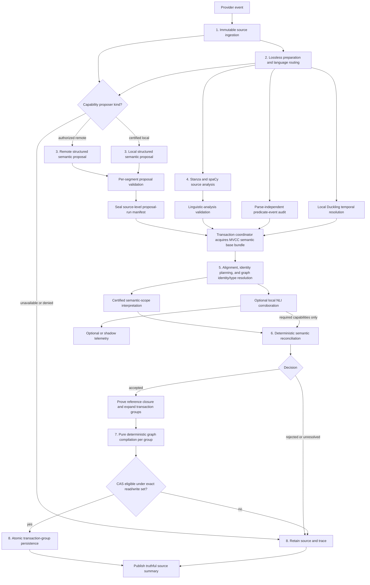

# Source-Grounded Semantic Ingestion Architecture

**Document status:** Proposed target architecture for production memory
ingestion.

Assessment baseline: commit
`44cd7773a75ac8545ddcf799c76dc94c0240f788` (2026-07-26). The file and symbol
references in this document were revalidated against that committed tree:
`memorii/core/provider/service.py:ProviderMemoryService.sync_event`,
`memorii/core/provider/factory.py:build_provider_memory_service_from_env`,
`memorii/domain/enums.py:MemoryScope`,
`memorii/core/memory_evolution/models.py:MemoryScope`, and their provider,
memory-evolution, and factory test surfaces. The architectural contracts are
intended to survive later refactoring.

The current implementation remains authoritative until this design is
implemented and accepted through the rollout gates in Section 5.

This document is deliberately limited to semantic correctness from raw source
ingestion through durable graph persistence. It also defines the structural
graph-observation surface required to prove that persisted current, historical,
trust, and identity-lineage state is correct. Natural-language retrieval query
interpretation, agent integration, ranking, and answer generation remain outside
its scope.

An ingestion acceptance result and a runtime retrieval acceptance result are
different claims. A correct persisted graph closes an ingestion failure. It does
not close a later runtime failure over that graph. This architecture defines
only the ingestion verdict and a typed handoff proving the persisted graph
passed; downstream systems own their own design, instrumentation, and verdict.
Neither verdict may relabel or repair the other.

## 1. Problem Statement

### 1.1 Objective

Memorii must convert unstructured source text into durable graph state without
promoting a relation that the source does not actually assert.

The current ingestion path has strong transport validation, exact source
grounding, graph atomicity, and benchmark stage attribution. Its remaining
semantic checks rely too heavily on language-specific strings, token ordering,
marker lists, and hand-authored frames. Those mechanisms can prove that words
occur in the source. They cannot generally prove that the words play the roles,
carry the polarity, or have the commitment represented by a proposed graph
edge.

For example:

```text
Alice thinks Bob does not own Atlas.
```

A correct ingestion decision must determine all of the following:

- `Bob`, not `Alice`, fills the owner role.
- `Atlas` fills the owned-resource role.
- the embedded ownership proposition is negative;
- the proposition is attributed to Alice's belief;
- the source does not assert positive ownership as global current truth.

An extraction can contain every required word, valid JSON, valid IDs, and an
exact evidence quote while still encoding the wrong graph. Source grounding is
necessary, but it is not semantic validation.

### 1.2 Why the current approach is unstable

The current string-frame path is becoming a partial natural-language parser.
Every added phrase interacts with:

- inflection and word order;
- active and passive voice;
- intervening or omitted entities;
- negation and its scope;
- coordination;
- reported speech, quotation, and belief;
- modality and questions;
- clause and sentence boundaries;
- multilingual morphology;
- domain-specific names and noun phrases.

Patching one observed sentence therefore changes an implicit grammar without a
complete model of its interactions. That is why locally successful fixes have
moved failures between scenarios and profiles.

### 1.3 Canonical failure patterns and required behavior

These patterns are enduring design hazards, not a record of one benchmark
incident. They define behavior the architecture must prevent or handle safely
across providers, languages, domains, and future implementations.

| ID | Canonical failure pattern | Unsafe behavior | Required system behavior |
| --- | --- | --- | --- |
| CFP-01 | A malformed or internally inconsistent provider proposal crosses the semantic boundary. | Unknown IDs, conflicting entity/literal fields, or partial output reaches semantic processing. | Validate proposal shape and local references before semantic analysis; never guess or merge a repair. |
| CFP-02 | Source visibility is confused with semantic support. | A quote containing the expected names and trigger is accepted even though it does not assert the proposed relation. | Separate exact provenance from proposition assessment. |
| CFP-03 | Role binding relies on surface token order rather than certified structural evidence. | Relation endpoints are reversed or assigned to a nearby entity. | Compare proposals with independently derived clause arguments and certified role schemas. |
| CFP-04 | Competing entities and predicate events are derived from provider output. | Provider omission weakens validation of an incorrect proposal or creates silent false absence. | Derive mentions, arguments, and certified predicate-event candidates from source-only analysis. |
| CFP-05 | Polarity, commitment, and attribution are inferred from marker presence or incomplete intervals. | Negation, belief, quotation, questioning, instruction, or denial receives the wrong scope. | Interpret raw syntactic cues only through certified, construction-bounded semantic-scope policies. |
| CFP-06 | Predicate domains are decided from untrusted, stale, or circular type/identity inference. | A relation uses the wrong entity, wrong canonical type, or mixes entity and literal values. | Require source/registry-rooted type and identity proof ancestry, separate canonical types from role sorts, couple type dependencies, and revalidate graph-relative proofs after revision changes. |
| CFP-07 | Production semantic behavior is fitted to benchmark wording, entity names, or one language. | One fixture passes while paraphrases, arbitrary names, another profile, or another language regress. | Use language-neutral contracts, language-owned resources, metamorphic tests, and held-out natural text. |
| CFP-08 | An expected-state oracle repairs absent source evidence or production identity state. | A malformed fixture appears source-grounded, subset comparison hides unexpected output, or comparison creates missing aliases, lineage, or graph content. | Reject fixtures without unique source-visible introductions and compare an authoritative source/operation cohort exactly without production canonicalization or natural-language retrieval. |
| CFP-09 | Downstream retrieval and comparison continue after an upstream divergence. | Later symptoms obscure the first broken pipeline stage. | Stop validation at the first mismatch and report that stage truthfully. |
| CFP-10 | Tests emphasize schemas and familiar examples instead of semantic invariants. | Unit tests pass while model-shaped outputs create incorrect active graph state. | Test mutations, minimal pairs, graph prefixes, arbitrary-name transformations, and captured failures. |
| CFP-11 | Provider confidence influences semantic truth acceptance. | A confident but unsupported proposal progresses farther than an identical low-confidence proposal. | Treat provider confidence as diagnostic only. |
| CFP-12 | A weaker fallback produces success-shaped output after a verified-path dependency fails. | Rule output or another uncertified path becomes active truth. | Give the verified semantic path a distinct runtime identity and remove rule fallback from production and certification. |
| CFP-13 | Source temporal context is dropped, conflicts silently, or collapses into one timestamp. | Historical facts become current, disappear, or change with event arrival or policy order. | Preserve operation-complete temporal evidence, select and migrate versioned policy explicitly, retain immutable assertions, and project finite, right-unbounded, and atemporal valid/system-time partitions. |
| CFP-14 | Claim competition or source trust is caller/model controlled, underdefined, or evaluated without graph context. | Multi-valued facts compete incorrectly, source count amplifies authority, or malformed decay silently displaces stronger truth. | Share one claim-slot/value/cardinality contract and apply monotone fingerprinted rank, decay, tie, eligibility, and conflict algebra against a revision-bound snapshot. |
| CFP-15 | Canonical identity change is modeled as revision-ID replacement over an incomplete reference set. | Rekey, merge, or split fragments claim state or loses entities, aliases, relations, claims, actions, citations, or provenance. | Separate immutable revision provenance from logical projection identity, resolve identity from proof-carrying evidence, prove closure from schema/ledger/base records, and disposition plus reproject every affected reference atomically. |

### 1.4 Current implementation evidence

The branch demonstrates these issues concretely:

- `memory_evolution/language_support/base.py` implements `SemanticFrame` and
  can default omitted gap policies to unrestricted gaps.
- Negation checks are substantially based on finite markers and selected token
  intervals rather than complete clause scope.
- `memory_evolution/source_grounding.py` derives `known_entity_names` from
  provider-emitted grounded entities, allowing a provider omission to weaken
  its own verification.
- `memory_evolution/entity_resolution.py` can reuse a sole name- and
  type-compatible candidate without proof that the source mention and stored
  entity are the same real-world identity.
- Predicate-domain checks currently conflate structural relation roles with
  canonical entity types, which makes generic ownership reject valid teams or
  organizations and can let a predicate participate in proving its own domain.
- Current lifecycle projections do not expose one shared, explicit contract for
  claim-slot cardinality, temporal interval partitioning, trust-decay age, and
  identity-reference closure.
- Benchmark alignment can obscure graph omissions when expected and observed
  state are canonicalized through related logic or compared as a subset rather
  than through an authoritative closed source/operation cohort.
- English and Spanish resources are separated correctly, but currently form a
  growing hand-built semantic parser through triggers and frames.
- Existing benchmark and production-boundary tests cover examples well but do
  not establish behavior for omitted arguments, unseen paraphrases, nested
  clauses, or model-shaped semantic mutations.

Lexical resources are not inherently wrong. They become unsafe when they are
the final authority for proposition meaning instead of bounded evidence inside
a typed semantic decision.

### 1.5 Required outcome

The target system must:

1. retain the original observation even when extraction fails;
2. generate open-vocabulary semantic candidates from the source;
3. derive independent linguistic views over the same complete semantic content
   through exact content-bound segment routes;
4. validate provenance, roles, polarity, commitment, attribution, and domains
   separately;
5. promote only propositions inside an empirically certified capability;
6. return `unresolved` and retain evidence when support is incomplete;
7. compile accepted typed facts, corrections, retractions, action-state
   operations, and identity operations through
   deterministic graph invariants;
8. expose the first failing stage in tests and production diagnostics;
9. prevent benchmarks from repairing production graph mistakes;
10. remain extensible across languages without putting English strings in the
    language-neutral compiler or reconciler;
11. preserve source scope, modality, authority, event time, and system time
    through every semantic boundary;
12. retain historical truth without confusing it with current truth;
13. preserve entity, claim, action, and provenance continuity across explicit
    identity rekeys, merges, and splits;
14. make source-level proposal completeness a prerequisite for any derived
    graph mutation;
15. expose revision-bound structural current, historical, and lineage views for
    ingestion verification without natural-language retrieval;
16. separate source-local co-reference, canonical graph identity, immutable
    revision provenance, and lineage-stable projection identity;
17. give one transaction coordinator ownership of snapshot-bound
    graph-dependent decisions, grouping, closure, bounded revalidation, and CAS;
18. prove reference and observation completeness from typed storage schemas,
    atomic edge ledgers, base records, and immutable write-set deltas; and
19. bind every accepted temporal operation and every acceptance artifact to
    complete, replayable evidence;
20. construct every accepted operation through one closed language-neutral IR
    with exact selectors and no production-ID or display-text tie-breaking;
21. allocate idempotent first-observation identities before claim-key
    construction without persisting them before atomic commit;
22. preserve source, transaction-group, and operation cardinality in execution,
    persistence, replay, and status aggregation;
23. activate temporal policies and existing-data reference integrity only
    through complete, snapshot-bound migration certificates and cutover
    watermarks; and
24. bind capability activation to every behavior-affecting dependency and
    degrade statistically unsafe capabilities to evidence-only without fallback;
25. authorize every remote semantic request through a deny-by-default,
    source-bound provider-egress decision before source text leaves Memorii;
26. route language through one fingerprinted source-only decision whose
    uncertainty prevents active promotion rather than selecting a convenient
    parser;
27. resolve textual temporal evidence through a named, pinned, source-only
    temporal resolver before temporal reconciliation;
28. require a unique canonical role assignment across certified, independently
    packaged syntactic analyzers and audit predicate-event coverage through a
    parse-independent high-recall detector; and
29. represent fixed-point prefix state with typed planning records whose
    transaction-group commit coordinates remain unambiguous until materialized.

#### 1.5.1 Canonical requirements ledger

This ledger is the normative traceability authority for the design. Section 1.5
summarizes the desired outcome; CFP and ING identifiers classify failure
patterns and prior review findings. Neither replaces these stable requirements.
Every implementation WorkPlan must map each in-scope `SIA-Rxx` row to its
production owner, tests, and other completion evidence. A row is not complete
because a related CFP or ING row is marked closed.

| ID | Requirement and source | Priority | Canonical owner | Measurable acceptance | Required verification |
| --- | --- | --- | --- | --- | --- |
| SIA-R01 | Retain immutable verbatim source and provenance before derivation. Sources: Memorii spec; storage details. | Required | Source governance and source store | Every durably accepted stable delivery-principal binding/key has exactly one byte-identical source record and provenance envelope before any derivation. Current session authorization is separately typed and revalidated for admission, recovery, and result access without changing durable identity. A governed source derives and authorizes its complete canonical required-scope set and exact per-segment governance carriers before semantic admission; source context contains only whole-source invariants. Invalid envelopes or insufficient current scope coverage are explicitly rejected; retention failures return no success-shaped admission, and indeterminate writes require authenticated idempotent recovery before semantic execution. | Invalid-envelope, complete-scope exact/superset/partial/zero/cross-tenant/stale/revoked, mixed scope/classification/modality/authority/egress, carrier substitution, authorization-spy, cross-principal same-ID, forged recovery, stable-binding/key substitution, session renewal/policy rotation, prewrite failure, write-before-acknowledgement recovery, delivery replay, conflicting replay, source mutation, and every post-retention stage-failure test. |
| SIA-R02 | Keep model output candidate-only until typed transport, semantic, provenance, lifecycle, and transaction checks pass. Sources: Memorii spec; implementation rules; C2. | Required | Proposal adapter, reconciler, coordinator | No provider field, confidence, or successful transport response alone can create committed graph state. | Malformed, unsupported, high-confidence, partial, and failed-stage zero-effect tests. |
| SIA-R03 | Give every material requirement a stable source, owner, acceptance rule, and executable verification path. Sources: `.agent/PLANS.md`; `$review-design`. | Required | This design and implementation WorkPlan | Closed structural extraction covers every unit in Sections 1-5; every ledger row self-maps; every unit maps to all applicable requirements, owners, versioned assertions, and test groups; and trusted passing evidence binds exact unit content plus exact design and implementation revisions. Parser agreement alone is insufficient. | Independent structure/coverage checker, independent evidence verifier, fresh whole-design review, and Sections 1-5 mapping plus missing/stale/orphan/wrong-revision/failed/unexecuted/forged-evidence mutation tests. |
| SIA-R04 | Make proposal, source-analysis, normalization, reconciliation, retry-plan, and terminal-result contracts compose without invented identifiers, statuses, or side channels. Source: implementation rules. | Required | Semantic-analysis and transaction-result contracts | Every downstream reference is produced by exactly one typed upstream artifact; every segment/operation consumes its exact governance binding without a representative source value; pre-planning and planned progress are disjoint; every terminal group identifies its exact eligible attempt, plan, and authorization. | Definition/reference audit, schema round trips, mixed-governance carrier mutation tests, pre-planning/planned transition tests, mixed accepted/unresolved event tests, and commit-then-replan lineage mutations. |
| SIA-R05 | Require certified independent role, scope, attribution-bearer, and attachment evidence before promotion. Sources: Memorii spec Sections 16.25-16.27 and 25.1-25.3; implementation rules, commit gating. | Required | Linguistic consensus, scope interpreter, source-local identity, and canonical identity resolver | Analyzer disagreement, incomplete ancestor closure, unsupported attachment, or missing/ambiguous/noncanonical reported-source bearer yields unresolved and zero graph effect. | Active/passive, negation, quotation, direct/reported/nested attribution, bearer/identity substitution, coordination, and analyzer-mutation tests. |
| SIA-R06 | Detect and attach textual valid time independently of proposer completeness, and combine it with authenticated non-text temporal evidence only through the closed matrix in Section 3.5. Sources: Memorii spec Sections 7.2, 17, and 25; implementation rules, commit gating. | Required | Temporal resolver and attachment consensus | Source-present temporal text omitted by the proposer, ambiguous or misattached text, and unsupported text/non-text combinations cannot be promoted. Genuinely absent text follows the predicate mode and authenticated-evidence matrix rather than being treated as proposer omission. | Absolute/relative/interval, omission versus absence, event/document reference provenance, authenticated interval, atemporal, misattachment, timezone, DST, and replay tests covering every matrix cell. |
| SIA-R07 | Bind prompt text, schema, owner, redaction, and visibility policy through one registered prompt authority. Source: prompt contracts. | Required | Prompt registry/renderer and proposer transport | Any registration-coordinate substitution blocks transport before a provider or local model call; a valid policy removes registered non-source secrets from rendered prompt, transport metadata, and traces without rewriting source text. | YAML/schema/owner/visibility/redaction/digest mutation tests plus independent serialized-byte observation for valid nested redaction and immutable sanitized copies. |
| SIA-R08 | Preserve a certifiable local-only active ingestion path and make the built-in bootstrap profile the ordinary production default; cloud proposal is explicit opt-in. Source: storage-details local-first requirement. | Required | `BootstrapProfileCoordinate("memorii.bootstrap_local_english_rule", 1)`, provider factory, and composition roots | Normal construction selects the Section 3.23.0 deterministic English rule profile with network denied. The complete governed-source-admission no-semantic outcome set is selected-pipeline-pending, disabled, unavailable, authority-unavailable, unsupported-input, and abstained; remote is explicit only and never a fallback. | Default-composition, no-network local, disable/failure/evidence-only, supported-English, unsupported-language/form, explicit remote-opt-in, and remote-deny zero-call tests. |
| SIA-R09 | Authorize remote egress only under the current active source-bound policy. Sources: storage details; Memorii spec Sections 15 and 25. | Required | Source governance and provider transport | Each segment uses only its exact classification/context-bound decision; revoked, expired, superseded, stale, swapped-segment, or mismatched policy produces zero remote calls. | Mixed classification/modality/authority/egress routing, policy rotation, rollback, concurrent change, provider/model/region, swapped/missing/extra decision, and replay tests. |
| SIA-R10 | Emit canonical idempotent full-state memory events for every committed semantic mutation, retain canonical ingestion-observation deltas for every terminal source-visible operation, and reconstruct both materialized authorities and every acknowledged replay dependency from their logs. Sources: Memorii spec Sections 18.2-18.3; event model Sections 3-5, 8-9, and 14-16. | Required | Transaction coordinator, graph event/replay authority, ingestion-observation ledger, semantic-conflict authority, and atomic replay-artifact store | Genesis and signed-checkpoint replay across every active read schema reproduce the exact committed graph revision, ingestion-observation ledger, progress state, semantic-conflict history/current pointers, and replay-authoritative artifact closure without prior materialized state, provider, analyzer, file cache, or read-time reconstruction. No visible state references an artifact absent from the same or an earlier complete generation. Envelope `event_id`, logical-retry `dedupe_key`, and record identity are distinct; only `payload.entity_id == payload.record_id == GraphRecordMutation.record_id`. One typed `create|update` mutation kind is carried unchanged from compiler delta through event identity and replay; one logical mutation has one stable dedupe key across retries. Every terminal operation has exactly one immutable introduction and terminal-outcome record; committed outcomes link exactly one graph delta and terminal non-committing outcomes forbid one. Every committed user-decidable contested projection atomically publishes its canonical semantic-conflict revision and pointer. Exact duplicate envelopes remain idempotent and current-writer same-record/version collisions reject before visibility. Under the frozen `SIA-ED-REPLAY-001` decision, non-identical historical equal-version conflicts fail closed without selecting or materializing a winner. | Every-record-kind create/update/retirement mapping, introduction/outcome/conflict replay, zero-mutation terminals, graph/projection/conflict publication failpoints, pre-planning resume, identity mutations, envelope/dedupe/record identity separation, exact-duplicate idempotency, semantic-conflict retry/rebuild/race behavior, current-writer version-collision rejection, non-identical historical equal-version fail-closed behavior from genesis and checkpoints, conflicting-dedupe, reordered, supported/retired/future schema, deterministic upcast, corrupt, partial-commit, checkpoint trust/rollback, and replay-resume tests. |
| SIA-R11 | Enforce one certified semantic writer across embedded, sidecar, event-consumer, legacy, and generic-store paths. Sources: Memorii spec Sections 17.3 and 19.2; implementation rules, commit gating. | Required | Store-owned writer admission, delivery-coordinate migration owner, semantic-record ownership manifest, and common storage boundary | Every governed semantic mutation carries one current writer binding. Activation stops new legacy admissions, drains or terminalizes every old-epoch operation, and atomically publishes one independently certified complete target-coordinate generation before advancing the epoch. A stale or binding-free writer changes no semantic or lifecycle revision. | Shared-store mixed-version, every atomic and generic write entry point, finite migration inventory/certificate, ambiguity/collision, crash/restart, cutover, rollback, cross-cutover retry, drain, active-lease, and paused in-flight process tests. |
| SIA-R12 | Use closed discriminated temporal and lifecycle algebras in source, resolver, accepted, durable, expected, and observed contracts. Sources: implementation rules; C1. | Required | Decision, graph, and acceptance contracts | Impossible basis/value combinations and unknown variants fail deserialization; equal temporal values with different authenticated bases remain distinct end to end. | Exhaustive variant round trips, equal-value/different-basis mutations, missing/swapped provenance, and malformed-row tests. |
| SIA-R13 | Bind acceptance evidence to lifecycle-checked keys and monotonic active releases without placing acceptance authority in production. Sources: Memorii spec Sections 17-18 and 25; implementation rules, commit gating. | Required | Acceptance trust policy and acceptance harness | Revoked, compromised, expired, superseded, wrong-purpose, or rollback releases cannot validate evidence; signed acceptance witnesses bind exact public production attestations, while production imports no acceptance schema, key, or policy. | Key lifecycle, active-release, cross-purpose, cross-artifact replay, production-import-boundary, attestation substitution, and witness reconstruction tests. |
| SIA-R14 | Statistically certify every behavior-affecting routing, analysis, coverage, temporal, semantic, safety, utility, and abstention lane. Sources: Memorii spec Sections 16.25-16.27 and 25; engineering-hardening closure matrix C4. | Required | Acceptance statistical gate | Capability activation requires every predeclared mandatory metric gate and valid multiplicity adjustment. | Independent metric/cluster/p-value/bound recomputation and manifest-completeness tests. |
| SIA-R15 | Make runtime monitoring decisions executable and deterministic from typed policy plus immutable evidence. Sources: Memorii spec Sections 17.5-17.6 and 25; implementation rules, commit gating. | Required | Capability monitor and registry | Identical policy/evidence yields the same state transition; breach or stale evidence atomically enters evidence-only. | Boundary, fake-clock, race, outage, recovery, and independent sequential-decision tests. |
| SIA-R16 | Declare one unambiguous initial dependency topology and certification set. Sources: Memorii spec Sections 16.25-16.27 and 25; storage-details local-first requirement; selected architecture decisions in Sections 3.3-3.5 implementing SIA-R05, SIA-R08, and SIA-R14. | Required | Bootstrap profile owner and capability registry | The v1 bootstrap topology contains only the named deterministic repository components and no model/tokenizer/runtime asset or remote dependency; Section 3.23.0 defines its startup verification. Every later profile requires its own manifest/resource authorization. | Bootstrap component/integrity/no-network checks; unsupported-profile and future manifest/module/package/asset/profile consistency tests. |
| SIA-R17 | Compare a pre-ingest expected ingestion graph with direct, scope-authorized structural observations, including terminal zero-mutation outcomes, never retrieval or production semantic helpers. Sources: Memorii spec Sections 16.27, 17, and 25; storage-details scoped-access requirement; implementation rules, commit gating. | Required | Acceptance-only oracle and graph observation API | One unique global operation/fence bijection is established before source/entity alignment; zero or multiple solutions fail. Production-only source-outcome integrity coordinates are independently checked against public production records before fixture equality. One-field, missing, and unexpected-record mutations fail at the first structural divergence; every expected operation aligns through one persisted introduction and terminal outcome; committed and non-committing outcomes have exact, disjoint effect shapes; cross-principal, cross-scope, mixed-seed, forged-cursor, and revoked access fail without record, digest, cohort, page, or existence disclosure. Hand-authored fixture semantics require current content-bound independent review evidence before ingest. | Static import boundary, reviewed-fixture evidence, global-bijection permutation/ambiguity tests, source-outcome consistency mutation tests, closed-world comparator, zero-mutation and mixed-outcome cohorts, fence alignment, view, revision, pagination, cross-principal/scope, cursor-integrity, and authorization-revocation tests through the production boundary. |
| SIA-R18 | Preserve immutable historical truth, trust evolution, entity lineage, and user-visible semantic-conflict history. Sources: Memorii spec Sections 7.2, 17, 18, and 25; canonical event model Sections 5-10; conflict-attention design. | Required | Graph compiler, projection scheduler, semantic-conflict authority, and persistence | Required current, historical, contested, conflict-attention, and lineage views remain replayable after late arrival, policy migration, natural conflict change/resolution, clarification, rekey, merge, and split. Every committed user-decidable contest has same-transaction canonical conflict authority. | Interval/trust/identity/conflict prefix matrices, conflict coalescing and scope/display authority, migration and clarification races, cache rebuild, and exact genesis/checkpoint structural comparison. |
| SIA-R19 | Activate semantic ingestion through the normal production provider composition selected by the bootstrap profile. Source: engineering-hardening closure matrix C3. | Required | Provider factory, `ProviderMemoryService`, ingestion coordinator, and bootstrap profile owner | Normal production builders route governed sources through `BootstrapProfileCoordinate("memorii.bootstrap_local_english_rule", 1)` with no legacy writer or fallback authority. Every governed-source-admission no-semantic outcome retains governed evidence without semantic promotion. | Owner-stripping and default-constructor provider/Hermes/filesystem tests for bootstrap, disablement, failure, unsupported/abstained, and later approved profiles. |
| SIA-R20 | Fence long-running work with renewable leases, bounded stale recovery, terminal exhaustion, and a separate stable allocation namespace. Source: engineering-hardening closure matrix C13. | Required | Operation repository, lease heartbeat, semantic ingestion coordinator, and identity/action planners | Only the current lease owner may persist or commit; reclaim preserves allocation namespace and byte-identical planned IDs. Fence/allocation coordinates derive only from the version-bound stable delivery identity, immutable admitted source coordinates, and operation ID; current authorization evidence is excluded. Abandoned work recovers within the fixed budget and then becomes terminal. | Fake-clock, session/scope/policy/trust/revocation rotation identity-stability, multiprocess token-fencing, crash/reclaim before and after planning, namespace substitution, slow-stage renewal, lost-acknowledgement, restart, stale-recovery, and exhaustion tests. |
| SIA-R21 | Make semantic-ingestion admission, checkpoint progress, terminal-group persistence, and source finalization process-safe and crash-atomic; the filesystem/JSONL backend must publish each complete batch as one generation. Source: engineering-hardening closure matrix C12. | Required | Semantic-ingestion atomic-store protocol and filesystem storage adapter | Readers observe the prior state or one complete admission, progress checkpoint, group, or finalization transaction, never a subset. First visibility of every replay-authoritative artifact is atomic with the state that references it. A terminal-group transaction atomically publishes its group result and ingestion-observation delta and, only when committed, its graph delta/event batch. Every transaction validates its exact graph/control/observation/artifact revisions, artifact closure, lease, writer epoch, and stable idempotency fence; checkpoint/group/finalization equality excludes current authorization evidence and ingress context. | Backend-neutral in-memory/filesystem conformance plus source-normalization, plan-published, attempt-published, and lineage-published states, committed, zero-mutation, and mixed-outcome group transactions; session/scope/policy/trust/revocation rotation with stable durable equality, deterministic artifact/index/state failpoints, multiprocess same/distinct delivery, failed replace, reopen, corruption, lost acknowledgement, and idempotent retry schedules. |
| SIA-R22 | Preserve the immutable provider envelope contract while exposing truthful semantic-ingestion state only through the protected accessor. Sources: current provider operation contract; implementation rules; normal production composition requirement C3. | Required | Provider service, result-access authorizer, protected admission authorization index, operation repository, and semantic-result repository | Compatibility freezes declaration order, field names/types, enums, defaults, nullability, validators, serialization shape, and independent legacy-reader decoding. Dynamic outcome fixtures are profile-versioned behavior, not envelope authority: the old fixture remains historical reader input but is retired as bootstrap behavior authority. Semantic-aware callers use only `SemanticIngestionOutcomeLookupRequest`; it authorizes before result/artifact lookup and is non-disclosing when unavailable. | Static schema/declaration/validator/reader audit; historical-reader input decoding; profile-versioned truthful outcome matrix; protected-accessor authorization matrix; and a transition audit rejecting use of retired outcome bytes as bootstrap expected behavior. |
| SIA-R23 | Preserve public provider delivery identity through one owned versioned internal normalization contract, governed structured source envelopes, metadata-poor evidence retention, and composite-hook replay. Source: engineering-hardening closure matrix C11 and the current provider boundary. | Required | Ingestion contracts, delivery-coordinate migration owner, provider adapters, source-admission normalizer, and operation repository | Every public mutation validates one strict Unicode-scalar delivery ID, preserves its accepted scalar sequence and UTF-8 bytes exactly, and rejects empty/all-whitespace, invalid encoding/scalars, over-limit values, and non-public composite-coordinate injection. The normalization-contract version is part of `DeliveryIdentity`. Before activation, every current stripped public ID and raw child ID is mapped from preserved evidence into one complete content-addressed target generation; ambiguity/collision blocks activation absent an evidence-backed owner disposition. After activation only typed target coordinates are readable or writable. Governed snapshots/delegations produce one canonical internal envelope; current metadata-poor snapshot hooks retain exact evidence with no semantic projection or synthetic identity. Accepted admission returns the complete immutable authenticated operation/namespace/writer handoff. Composite hooks derive typed domain-separated child coordinates; restart, partial replay, and cross-cutover retry execute only missing children and never duplicate effects. | Cross-adapter independently authored golden vectors for normalization version, canonical-equivalent Unicode pairs, case, leading/trailing whitespace, non-ASCII, byte limit, invalid scalars/encoding, empty/all-whitespace, public/composite coordinate collision attempts; frozen migration fixtures for whitespace, NFC/NFD, delimiter-like IDs, partial fan-out, collision, crash/restart, rollback, cross-cutover retry, parent/child fan-out, admission-to-lease/lost-ack/replay, conflicting replay, and exactly-one-effect recovery permutations. |

The following additions are part of the normative ledger rows above and take
precedence over their shorter acceptance summaries:

| Requirement | Revision closure |
| --- | --- |
| SIA-R01, SIA-R20, SIA-R21, SIA-R22, SIA-R23 | Admission, recovery, replay, leases, fences, allocations, finalization, and results bind one stable server-derived delivery-principal binding and key; volatile session authorization is separate. Cross-principal/tenant/scope same-ID, recovery, and result-disclosure attempts receive the non-disclosing mismatch outcome and make no mutation. |
| SIA-R01, SIA-R04, SIA-R09, SIA-R22, SIA-R23 | A governed snapshot has exact per-message immutable semantic contexts. Current metadata-poor snapshot hooks retain evidence only and have no projection, promotion, remote egress, synthetic identity, or authority. |
| SIA-R09 | The separately ACL-protected egress-governance control plane accepts only lifecycle-checked signed commands and monotonic activation records; provider transport revalidates current policy before serialization and denies any mismatch or control-plane outage with zero wire activity. |
| SIA-R14, SIA-R15 | Statistical and monitoring policies have strict finite/domain invariants and require an independently approved content-bound baseline before activation or held-out evaluation; substantive values remain an external approval. |
| SIA-R17 | A production-owned authenticated authorizer makes a pre-lookup decision and reauthorizes each page. Observation is one flattened canonical record stream with total bounded page size, a versioned positioned cursor, and typed non-disclosing invalid, stale, and revoked outcomes. |
| SIA-R08, SIA-R16 | A typed approved local resource/admission profile governs startup, capacity, queueing, deadlines, and deterministic evidence-only/no-mutation overload outcomes. Profile values, host envelopes, and model assets are not selected here. |
| SIA-R04, SIA-R20, SIA-R21, SIA-R22 | Both source-result variants and both transaction-group result variants carry the byte-identical admission-time `OperationFenceBinding`; all summaries, deltas, event/replay projections, finalization inputs, and lost-acknowledgement results validate exact equality before mutation or disclosure. |
| SIA-R08, SIA-R13, SIA-R14, SIA-R15, SIA-R16 | Production-owned deployment authorization verifies serialized signed artifacts against production trust, revocation, and active-epoch state at every use point. Acceptance independently validates and publishes bytes, and neither side imports the other's schemas or trust objects. |
| SIA-R03, SIA-R08, SIA-R10, SIA-R13, SIA-R14, SIA-R15, SIA-R16, SIA-R18, SIA-R19, SIA-R21 | Section 1.5.2 exclusively registers the four unresolved external decisions under stable IDs with exact owners, artifacts, fail-closed behavior, and unblock conditions. |
| SIA-R01, SIA-R09, SIA-R22, SIA-R23 | Semantic-result access uses only `SemanticIngestionOutcomeLookupRequest` plus trusted out-of-band ingress resolution and a protected admission-only index. It authorizes stable principal, tenant, complete required-scope set, delivery key, and fence before any outcome/result/artifact lookup; exact or authorized-superset current scope coverage may proceed, partial coverage has no projection fallback, and all failures share one non-disclosing unavailable shape. |
| SIA-R13, SIA-R14, SIA-R16 | Acceptance independently signs and lifecycle-validates one baseline approval release. Its verified digest is required in baseline deployment-authorization issuance and signed into the production artifact; production imports no acceptance schema/verifier and trusts only deployment authorization. |
| SIA-R02, SIA-R03, SIA-R04, SIA-R07, SIA-R10, SIA-R13, SIA-R17, SIA-R21, SIA-R22, SIA-R23 | Every digest/signature-bearing ingestion schema uses one owned versioned canonical typed-value profile and exact schema binding. Historical bytes verify under their original binding before deterministic upcast; graph observation has no local codec. |
| SIA-R03 | Closed extraction covers every structural unit in Sections 1-5, ledger rows self-map, shared units retain complete many-to-many requirement mappings, and acceptance requires independent structure, coverage, trusted-evidence, and exact-revision passing-execution gates. |
| SIA-R01, SIA-R04, SIA-R10, SIA-R12, SIA-R17 | Retained source, semantic projection, and segment-local text are three closed artifact-coordinate kinds. Structured-envelope fields carry canonical-pointer/field-bytes/decoded-content/projection/segment mapping proofs; no JSON offset is treated as a decoded-content offset. |
| SIA-R02, SIA-R04, SIA-R15, SIA-R16 | Language routing and every proposal/analyzer/event/temporal/NLI/reconciliation capability binding are exact-segment and content-bound. Mixed-language segments may use distinct certified routes; an unresolved route makes only its segment evidence-only with zero learned call or graph effect. |
| SIA-R01, SIA-R09, SIA-R22, SIA-R23 | The protected admission generation persists the canonical complete required-scope set derived from all segment governance. Complete-source outcome access requires current authorization for every represented scope before any result/artifact read and has no partial projection path. |
| SIA-R01, SIA-R04, SIA-R09, SIA-R22, SIA-R23 | Before semantic admission, validated segment governance produces the canonical complete `RequiredOutcomeScopeSet`; same-tenant subset coverage by `AuthenticatedIngressContext.current_authorized_scopes` is required before Step 2, provider calls, reservations, or graph effects. The atomic admission stores an audit-only authorization proof, while current session/policy/trust/revocation values remain outside durable identity. |
| SIA-R01, SIA-R20, SIA-R21, SIA-R22, SIA-R23 | Durable delivery, fence, allocation, checkpoint, result, recovery, and replay identity excludes `AuthenticatedIngressContext` and every current authorization value. Exact versioned preimages use only stable provider/principal/tenant binding, exact normalized delivery bytes or typed child coordinate, immutable admitted source coordinates, and operation ID. |
| SIA-R01, SIA-R20, SIA-R21, SIA-R23 | `ingestion_contracts.py` exclusively owns `normalize_delivery_id` version 1 and typed public/composite delivery coordinates. Accepted strict UTF-8 bytes are unchanged; trimming, Unicode normalization, case folding, delimiter rewriting, raw child concatenation, structural look-alikes, and alternate adapter normalizers are forbidden. |

CFP and ING identifiers below are non-normative rationale and regression
labels. Their sole implementation authority is the owning SIA requirement in
this mapping:

| Rationale IDs | Owning normative requirements |
| --- | --- |
| CFP-01, CFP-02, CFP-11 | SIA-R02, SIA-R04 |
| CFP-03, CFP-05 | SIA-R05 |
| CFP-04 | SIA-R04, SIA-R05 |
| CFP-06 | SIA-R02, SIA-R18 |
| CFP-07, CFP-10 | SIA-R14, SIA-R16 |
| CFP-08, CFP-09 | SIA-R17 |
| CFP-12 | SIA-R08, SIA-R19 |
| CFP-13 | SIA-R06, SIA-R12, SIA-R18 |
| CFP-14, CFP-15 | SIA-R12, SIA-R18 |
| ING-P1-01, ING-P1-02, ING-P1-03 | SIA-R02, SIA-R04, SIA-R11 |
| ING-P1-04, ING-P1-15 | SIA-R04, SIA-R11 |
| ING-P1-05, ING-P1-10, ING-P1-16, ING-P1-18 | SIA-R04, SIA-R11, SIA-R18 |
| ING-P1-06 | SIA-R04, SIA-R12 |
| ING-P1-07, ING-P1-12 | SIA-R17 |
| ING-P1-08 | SIA-R02, SIA-R14 |
| ING-P1-09, ING-P1-13, ING-P1-14 | SIA-R02, SIA-R04, SIA-R12 |
| ING-P1-11, ING-P1-17 | SIA-R10, SIA-R12, SIA-R18 |
| ING-P1-19 | SIA-R09 |
| ING-P1-20 | SIA-R06, SIA-R12 |
| ING-P2-01, ING-P2-05 | SIA-R12, SIA-R13, SIA-R17 |
| ING-P2-02, ING-P2-03, ING-P2-06, ING-P2-09 | SIA-R11, SIA-R12, SIA-R18 |
| ING-P2-04 | SIA-R15 |
| ING-P2-07, ING-P2-10, ING-P2-11, ING-P2-14 | SIA-R13, SIA-R17 |
| ING-P2-08, ING-P2-12 | SIA-R14 |
| ING-P2-13 | SIA-R10, SIA-R12, SIA-R18 |
| ING-P2-15 | SIA-R05, SIA-R16 |
| ING-P2-16 | SIA-R04, SIA-R05, SIA-R14 |
| ING-P2-17 | SIA-R05, SIA-R16 |
| ING-P2-18 | SIA-R13 |

A static audit expands every range above and fails on an absent or duplicate
rationale ID, an unknown SIA ID, or a rationale row that claims independent
completion authority.

#### 1.5.2 Canonical external-decision register

This is the sole normative register for external decisions, including decisions
whose selected artifacts are now frozen. Stable
`SIA-ED-*` identifiers name design dependencies, not review findings. Every
normative reference must resolve to exactly one row; an undefined or duplicate
identifier fails the traceability audit. Resolving one row does not resolve or
weaken another.

| Decision ID | External owner | Affected requirements | Required artifact | Selected or fail-closed behavior | Exact unblock condition or resolution |
| --- | --- | --- | --- | --- | --- |
| `SIA-ED-TOPOLOGY-001` | Resolved by the unshipped-product bootstrap decision in Section 3.23.0 | SIA-R08, SIA-R16, SIA-R19, SIA-R22 | Built-in `BootstrapProfileCoordinate("memorii.bootstrap_local_english_rule", 1)` names deterministic components, network-denial requirement, startup verification, disablement, rollback, and governed-source-admission outcomes. A future profile still requires its own reviewed deployment artifact. | Normal construction automatically selects the verified bootstrap local profile. It retains governed evidence for the complete closed governed-source-admission no-semantic outcome set and never falls back to remote. | The normal constructor, filesystem root, and Hermes root pass the Section 3.23.0 acceptance matrix with local network denial and truthful outcomes. |
| `SIA-ED-REPLAY-001` | Resolved by the event-model-owner decision frozen in `docs/design/equal_version_replay_decision-v1.json` | SIA-R10, SIA-R18, SIA-R21 | The governing `EqualVersionReplayDecisionArtifact` plus the consistent `docs/design/event_model.md` rule defining exact duplicates, non-identical historical equal-version events, current-writer collisions, genesis replay, and checkpoint replay. | Exact duplicates are idempotent and current-writer collisions reject; non-identical historical equal-version replay rejects before materialization or winner selection. | Resolved. The bound artifact and validator select one genesis/checkpoint-consistent fail-closed algebra; implementation must pass every arrival-order, checkpoint, upcast, and mixed-version permutation independently. |
| `SIA-ED-POLICY-001` | Product/ML acceptance owner | SIA-R14, SIA-R15 | One signed, content-bound `InitialSemanticIngestionPolicyArtifact` containing all statistical thresholds, multiplicity allocation, cluster minima, unsupported cells, freshness deadlines, and monitoring limits. | Capability activation and local learned execution remain evidence-only; no implementation default, held-out-derived value, or runtime traffic may fill an absent value. | The complete artifact is deployment-authorized for the exact capability/dependency bundle and independent event-level recomputation validates every metric, cluster, bound, multiplicity, freshness, activation, and rollback rule. |
| `SIA-ED-TRACEABILITY-001` | Traceability approval authority and independently provisioned trust-root owner | SIA-R03, SIA-R13 | Separately authenticated `TraceabilityBootstrapTrustAnchor` and `TraceabilityRecoveryTrustRoot` artifacts provisioned outside the release channel; one signed `TraceabilityRecoveryTrustPolicy`; the signed append-only `TraceabilityTrustLifecycleRoot`; and one signed `SemanticIngestionTraceabilityRelease` conforming to Section 3.23.4 and naming the qualified coverage reviewers, normative-evidence issuers, their public keys and trust snapshot, and the initial active release. These artifacts fix purpose/target, signer eligibility, canonical/signature profiles, key or certificate digests, effective/recorded times, predecessors, monotonic sequences, activation, rotation, revocation, compromise, recovery, and historical-verification coordinates. | No registry source package, release-contained trust snapshot, coverage approval, execution evidence, or caller-supplied signature is bootstrap or recovery authority; an absent, ambiguous, backdated, expired, revoked, compromised, wrong-purpose/profile, rollback, same-coordinate-substituted, or self-authorizing root/record makes every traceability gate fail closed. | The root owner independently provisions and authenticates the complete bootstrap and recovery roots before release retrieval; publishes the signed recovery policy and lifecycle root; the release authority publishes the complete signed all-root release and trust snapshot; and independent lifecycle, release, coverage, and execution-evidence verifiers accept the exact topologically constructed bytes and every activation, rotation, revocation, compromise, recovery, and historical check. |

### 1.6 Scope

In scope:

- immutable source records and exact typed retained/projection/segment
  coordinates with mapping proofs;
- lossless text preparation and language routing;
- source-data classification and provider-egress authorization;
- a provider-neutral source-grounded semantic proposer with certified local and
  optional remote deployments;
- primary and corroborating source-only linguistic analysis;
- bounded source-only temporal-expression resolution;
- optional semantic corroboration;
- semantic role, polarity, commitment, attribution, and domain assessment;
- source eligibility, authority, scope, modality, and bitemporal assessment;
- typed acceptance, rejection, and abstention;
- deterministic graph compilation and atomic persistence;
- explicit identity-lineage compilation and evidence-backed reference
  disposition;
- a read-only structural graph-observation API used to verify ingestion output;
- capability certification, replay, diagnostics, and validation;
- migration away from the current production frame matcher.

Out of scope:

- natural-language retrieval query understanding, including
  `StructuredQueryAnalyzer`;
- agent integration and agent policy;
- retrieval ranking and answer generation;
- broad ontology redesign;
- arbitrary long-range coreference and discourse understanding;
- automatic support for every language or construction;
- using an LLM judge as the production acceptance oracle;
- making the rule benchmark baseline pass.

## 2. High-Level Solution Flow

### 2.1 Runtime workflow

The selected production design **continues to call an LLM for semantic
understanding**. The LLM may run in-process through a certified local adapter or
through an explicitly authorized remote adapter. It is a proposal generator,
not the authority that writes durable graph truth. Each active capability binds
one exact proposer deployment. An ingestion attempt never falls back from one
proposer to another.

For each retained source, the normal active path is:

1. **Immutable source ingestion** persists the original text, provenance,
   server-owned authority, scope, modality, bitemporal context, and a
   deny-by-default provider-egress decision. A denied source is retained but
   cannot cause a remote call.
2. **Lossless text preparation** derives typed projection/segment coordinates,
   sentence boundaries, and language metadata without discarding source
   content, then emits one content-bound language route for every exact segment
   or an explicit segment-local unresolved result.
3. **LLM semantic proposal** makes one structured-output inference per bounded
   segment through the capability-bound proposer. A local proposer runs from a
   pinned in-process model manifest without network access. A remote proposer
   runs only when the exact source and provider configuration are authorized.
   Both seal all segment outcomes into the same source-level proposal-run
   contract.
4. **Independent source analysis** runs pinned Stanza and spaCy dependency
   adapters, a parse-independent high-recall predicate-event detector, and a
   pinned local Duckling temporal resolver over each exact routed segment,
   concurrently with Step 3. These components produce evidence, not truth.
5. **Evidence normalization, identity resolution, and optional corroboration**
   deterministically aligns the independent lanes, requires one stable
   canonical role assignment across certified parser outputs, resolves bounded source-local
   co-reference as a total mention partition, plans idempotent first-observation
   identities, resolves reused graph identity and type from one proof-carrying
   MVCC base bundle, interprets certified semantic-scope constructions, audits
   proposal coverage against the parse-independent event inventory, resolves
   certified textual temporal evidence, and may run local multilingual mDeBERTa inference in
   shadow mode.
6. **Deterministic semantic reconciliation** compares the complete source-level
   proposal run, immutable source context, source-only linguistic analysis,
   optional NLI assessment, bundle-bound identity/type evidence, predicate
   policy, and exact capability certification, then emits only the closed
   language-neutral accepted-operation IR. An incomplete segment run cannot
   produce accepted operations.
7. **Transaction coordination and deterministic graph compilation** expand
   source groups with same-token dependency extensions, prove bootstrapped
   reference closure, seal one effective read set per group, invoke the pure
   compiler, and apply entity, predicate, lifecycle, temporal, trust, identity,
   action, and atomicity invariants to accepted typed operations only.
8. **Persistence and replay** retain source traces, atomically apply each
   commit-eligible transaction-group delta, and publish one truthful source
   summary without collapsing group or operation outcomes.



Trust decay, temporal-policy migration, and identity-lineage reprojection also
have server-owned deterministic paths that do not ingest new text. Persisted
commands load an MVCC semantic snapshot bundle, recompute the affected
projection under fingerprinted policy and lineage, and atomically persist any
transition. They share coordinator, compiler, and operation-fence invariants but
never invoke the proposer, parser, scope interpreter, or NLI model.

### 2.2 Call topology

The terms `LLM`, `local model`, and `deterministic` are not interchangeable in
this design.

| Component | Remote provider call | Local learned-model inference | Final semantic authority |
| --- | --- | --- | --- |
| Source-governance resolver | No | No | Authoritative for scope, modality, trigger eligibility, source authority, bitemporal metadata, and provider-egress eligibility |
| Language router | No | Yes, pinned fastText inference | Authoritative only for selecting a certified language capability or abstaining; never for proposition meaning |
| Local semantic proposer | No | Yes, pinned in-process structured-output model | No; produces untrusted candidates |
| Remote semantic proposer | Yes, normally once per bounded segment | No | No; produces untrusted candidates |
| Stanza linguistic analyzer | No | Yes | No; produces primary source-only syntax evidence |
| spaCy linguistic corroborator | No | Yes | No; exposes role-assignment disagreement and parser instability |
| Predicate-event coverage detector | No | No | Authoritative only for high-recall coverage obligations inside a certified predicate lexicon/morphology manifest |
| Duckling temporal resolver | No | No | Authoritative only for certified source spans and normalized temporal candidates under an explicit reference-time contract |
| Proposal aligner and scope interpreter | No | No | Authoritative only for certified alignment and construction-level scope checks |
| Source-local identity resolver | No | No | Clusters mentions only from certified same-source evidence; ambiguity remains unresolved |
| Canonical identity resolver | No | No | Resolves source-local clusters only from proof-carrying, authorized, snapshot-bound graph evidence |
| Type-evidence ledger | No | No | Authoritative for independent canonical type evidence, role sorts, and proof-mode checks |
| Predicate state registry | No | No | Authoritative for claim-slot partitioning, typed value identity, cardinality, and conflict behavior |
| Multilingual NLI corroborator | No | Yes, optional and initially shadow-only | No; can eventually veto or force abstention, never approve alone |
| `SemanticReconciler` | No | No | Applies the complete deterministic acceptance policy over certified inputs |
| Transaction coordinator | No | No | Owns one base graph snapshot, same-token read-set extensions, planned identities, graph-dependent grouping, closure acquisition, bounded revalidation, and per-group CAS commit |
| Graph compiler | No | No | Purely enforces deterministic graph and lifecycle invariants over complete inputs after semantic acceptance |
| Projection scheduler | No | No | Applies fingerprinted trust, temporal-policy, and identity-lineage reprojection without new semantic interpretation |
| Persistence | No | No | Applies only a commit-eligible graph delta |
| Structural graph observation | No | No | Exposes exact revision-bound graph state without query interpretation or ranking |

One additional remote proposal call is allowed only for bounded transport
repair, such as malformed structured output or invalid proposal-local
references. A semantic rejection is never repeatedly sent back to the model
until it emits an acceptable answer.

No LLM judge participates in production acceptance.

### 2.3 Normal and degraded behavior

| Context | Proposal behavior | Analyzer behavior | Promotion behavior |
| --- | --- | --- | --- |
| Production active ingestion | Calls the one capability-bound local or remote proposer; remote calls require exact current egress authorization | Requires a certified language decision, checksum-valid Stanza/spaCy analyses, event coverage, and temporal resolution where required | May promote only after reconciliation and compilation pass |
| Provider egress denied | Makes no remote call; a capability already bound to a local proposer is unaffected, while a remote-bound attempt does not switch proposers | Source-only analysis may still complete | Retains source and approved local evidence for remote-bound attempts; local-bound attempts follow their certified path |
| Provider unavailable or invalid after bounded repair | Records explicit provider failure | Analysis may still complete | Retains source; no open-vocabulary relation promotion |
| Analyzer unavailable, partial, or uncertified | Proposal may still be retained as a trace | Returns typed unavailable/partial status | Retains source; required capabilities become unresolved |
| Evidence-only deployment | Proposer may be disabled | Analyzer may be disabled | Retains observations and independently safe mention evidence only |
| Offline tests and replay | Uses fake or recorded proposals | Uses typed fixtures or packaged adapter assets | Exercises production boundaries without paid calls |
| Rule benchmark baseline | No LLM call | Benchmark-specific behavior | Isolated discriminative baseline, never a silent production fallback |

The failure policy is fail-closed for active semantic promotion. Once the source
store has durably accepted a delivery, every later failure retains that raw
observation for reprocessing. An invalid envelope or a retention failure occurs
before that invariant applies: it returns an explicit non-success admission and
no semantic stage starts. A write whose durability is indeterminate is recovered
by the same stable delivery identity plus newly valid authorization before any
caller may observe acceptance.

### 2.4 Authority flow

| Authority | Owns | Does not own |
| --- | --- | --- |
| Source observation | What was received, provenance, immutable text, event and system time | Relation meaning or graph truth |
| Source-governance policy | Authenticated scope, source modality, trigger eligibility, authority tier, and trust-arbitration policy | Natural-language meaning or graph facts |
| Provider-egress policy | Whether an exact source may be sent to one provider/model/region under one retention and training-use configuration | Semantic truth, redaction inference, or permission inferred from source text |
| Language router | One certified language capability or explicit uncertainty | Proposition meaning, parser repair, or code-switched semantic inference |
| LLM proposer | Candidate mentions, propositions, source quotes, open-vocabulary interpretation | Final acceptance, canonical IDs, lifecycle state |
| Linguistic analyzer ensemble | Source-only tokens, morphology, dependency structure, clause boundaries, raw syntactic cues, and explicit cross-analyzer role-set agreement or disagreement | Proposal alignment, semantic scope, product predicates, durable truth, canonical identity |
| Temporal resolver | Source-only temporal spans and normalized candidates under a certified locale, timezone, and reference instant | Graph precedence, source authority, or conflict resolution |
| Scope interpreter | Certified construction-level polarity, commitment, attribution, and clause-scope assessments from normalized syntax | Open-ended language interpretation, graph mutation, or trust arbitration |
| Source-local identity resolver | Same-source mention clusters supported by explicit alias/apposition/external-ID or certified unambiguous repetition evidence | Graph candidates, name-only clustering, pronoun resolution, or cross-segment inference |
| Canonical identity resolver | Revision-bound reuse, distinct creation, or abstention from authorized identity-binding evidence | Name-only matching, model confidence, cross-scope linking, or benchmark alignment |
| Type-evidence ledger | Independent canonical types and non-persistent structural role sorts under explicit proof modes | Type decisions from model confidence, capitalization, unsupported NER inference, or circular predicate-role proof |
| Predicate state registry | Shared claim-slot/value identity, cardinality, qualifier partition, and conflict policy | Language interpretation or source authority |
| NLI corroborator | Entailment/neutral/contradiction evidence for frozen hypotheses | Final acceptance or graph mutation |
| Semantic reconciler | Typed agreement, contradiction, unsupported capability, and abstention decisions | Storage, lifecycle mutation, benchmark scoring |
| Transaction coordinator | MVCC bundle, graph-dependent revalidation, transaction groups, reference closures, bounded retries, and CAS | Provider/parser/NLI recall, language interpretation, or benchmark scoring |
| Graph compiler | Pure predicate-domain, bitemporal, trust, identity-lineage, reference-disposition, consistency, and atomic-eligibility calculation | Storage reads/retries or natural-language interpretation |
| Projection scheduler | Due trust/temporal/identity commands and deterministic catch-up | Source meaning, policy invention, or provider calls |
| Persistence | Durable observation, trace, and eligible graph delta | Semantic reinterpretation |
| Structural graph-observation API | Authorized typed records for one exact graph revision and time | Natural-language query interpretation, expected-state alignment, or repair |

### 2.5 End-to-end execution sketch

```python
observation = source_ingestor.retain(
    provider_event,
    governance=source_governance,
)
source_context = observation.semantic_context  # resolved before durable success
prepared = text_preparer.prepare(observation, source_context)

proposal_futures = bound_proposer.propose_segments(prepared)
primary_analysis_future = primary_analyzer.analyze(prepared)
corroborating_analysis_future = corroborating_analyzer.analyze(prepared)
event_inventory_future = predicate_event_detector.detect(prepared)
temporal_resolution_future = temporal_resolver.resolve(prepared, source_context)

proposal_run = proposal_run_sealer.validate_and_seal(
    proposal_futures, prepared
)
analyses = analysis_validator.validate_bundle(
    primary_analysis_future.result(),
    corroborating_analysis_future.result(),
    prepared,
)

stable_source_lane_outputs = StableSourceLaneOutputs(
    proposal_run=proposal_run,
    analyses=analyses,
    predicate_events=event_inventory_future.result(),
    temporal_resolution=temporal_resolution_future.result(),
)
result = transaction_coordinator.execute(
    source=prepared,
    source_context=source_context,
    stable_source_lane_outputs=stable_source_lane_outputs,
    arbitration_as_of=operation_time,
    normalize=proposal_aligner.align_and_group_source,
    corroborate=corroborator.assess_bound_operations,  # optional, at most once
    reconcile=reconciler.assess_all,
    expand_groups=transaction_group_planner.expand,
    compile_group=compiler.compile,
)
persistence.retain_source_trace(result.source_trace_request)
for group_request in result.group_persistence_requests:
    persistence.commit_group_trace_and_eligible_delta(group_request)
persistence.retain_source_summary(result.source_summary_request)
```

The actual implementation may use the existing operation fence and async
abstractions, but it must preserve these ownership and call boundaries. The
coordinator supplies one `GraphSemanticSnapshotBundle` to normalization and
reconciliation, acquires verified reference closure, expands transaction groups,
and performs the CAS. Initial NLI runs only after alignment seals operation
capability bindings; the coordinator then seals proposal, analysis, alignment,
bindings, and NLI assessments as graph-independent lane outputs before any
graph-dependent retry. Only source-derived operation spans,
predicate/construction classification, source semantic groups, and capability
bindings are sealed. Canonical identity, type evidence, correction targets,
reference closure, and transaction grouping remain graph-dependent.
NLI input cannot contain canonical entity IDs or another graph-derived value.
On one related conflict the coordinator repeats only graph-dependent operations
with a new complete bundle; graph-independent lane outputs are reused
byte-for-byte and no learned component is called again.

## 3. Key Decisions and Executive Decisions

### 3.1 Preserve raw source as the highest authority

Original text, source identity, timestamps, and provenance are immutable.
Normalized text and model annotations are derived data. Every promoted claim
retains exact source references, and every failed extraction remains
replayable.

Rationale: false-negative semantic decisions can be reprocessed. A false
active graph edge can contaminate retrieval, lifecycle arbitration, and agent
behavior.

### 3.2 Keep the LLM, but demote it from truth authority to proposer

Structured-output LLM inference remains valuable for open-vocabulary entity and
predicate interpretation. The proposer protocol has a local in-process adapter
and an optional remote adapter; neither is trusted to validate its own output.
Structured JSON proves transport shape, not semantic correctness.

The proposer receives the complete bounded source, predicate ontology, output
contract, and source-grounding requirements. It does not receive hidden
benchmark answers or the independent parser's role decisions.

### 3.3 Run linguistic analysis independently, not as lossy LLM preprocessing

Stanza and the LLM inspect the same exact routed segment text in parallel. Parser role
answers are not inserted into the proposal prompt and then reused as
"independent" verification.

Safe tokenization and exact projection/segment coordinates may be shared.
Semantic conclusions must
remain independent enough to expose disagreements.

Each analyzer consumes only one `SegmentAnalysisInput`, its exact
`SegmentLanguageRoute`, and its pinned analyzer manifest.
It never consumes proposal mentions, proposal spans, provider-local IDs, or
provider-selected predicate anchors. A separate deterministic alignment stage
runs only after both lanes complete and compares their independently produced
source coordinates. This ordering is an architecture invariant, not an
implementation optimization.

### 3.4 Select Stanza as primary and spaCy as corroborating analysis

The initial adapter uses `stanza==1.14.0` with:

```text
tokenize,mwt,pos,lemma,depparse
```

Stanza was selected because it provides:

- exact character-addressable token data;
- Universal Dependencies heads and relations;
- morphology, dependency structure, voice features, and raw polarity cues where
  available;
- one API for English and Spanish;
- offline model installation and disabled runtime downloads.

Stanza NER is not required for correctness. Generic NER is insufficient for
projects, tasks, services, documents, and other domain noun phrases. Argument
candidates come from dependency structure, noun phrases, and exact proposer
spans.

Stanza is an untrusted syntactic signal, not a semantic-scope oracle. Negation
tokens, complement edges, quotation punctuation, mood features, and dependency
ancestors remain raw evidence until a certified scope policy interprets them.
Model assets
are pinned, checksummed, measured on Memorii data, and capability-scoped.

The initial active capability also requires an independently packaged spaCy
dependency parser for the same language. Stanza is the primary analyzer only
for diagnostics and operational ownership; primary designation cannot break a
semantic disagreement. The analyzers use separate model manifests and adapter
implementations and meet only at the normalized language-neutral contract.
Gate C must qualify the full pair before any capability becomes active.

### 3.5 Use multilingual NLI only as asymmetric corroboration

The selected experiment uses Hugging Face `transformers` with
`MoritzLaurer/mDeBERTa-v3-base-mnli-xnli`, loaded from an immutable repository
revision.

For a proposed ownership relation, a language-owned verbalizer produces:

```text
positive:       Alice owns Atlas.
role_swapped:   Atlas owns Alice.
negative:       Alice does not own Atlas.
```

The local model evaluates all hypotheses in one batch. It begins in shadow
mode because public XNLI accuracy is far below the precision required for a
durable-memory authority. After held-out calibration, strong counterevidence
may force `unresolved`; positive entailment can never create acceptance by
itself or override deterministic source, role, scope, or domain failures.

The base mDeBERTa model is preferred over smaller multilingual MiniLM for the
initial correctness study because ingestion is off the retrieval hot path.
Latency optimization occurs only after semantic parity on the frozen corpus.

### 3.6 Own semantic reconciliation in deterministic Memorii code

No third-party library knows Memorii's canonical predicate direction,
commitment policy, domain constraints, capability evidence, identity boundary,
or lifecycle semantics.

`SemanticReconciler` therefore performs only deterministic operations:

- exact span and source checks;
- token/span alignment;
- typed UD graph traversal under a predicate policy;
- role comparison;
- polarity, commitment, attribution, and domain checks;
- capability fingerprint lookup;
- consumption of an already-computed optional `NliAssessment`;
- three-valued `accepted`, `rejected`, or `unresolved` decision algebra.

It does not call OpenAI, Stanza, Transformers, persistence, or benchmark code.
It does not perform open-ended language interpretation.

### 3.7 Keep the graph compiler language-neutral

The compiler consumes accepted typed operations only. It owns canonical entity
references, predicate domains, correction targeting, identity operations,
bitemporal and trust arbitration, reference dispositions, action/claim
consistency, graph projection, and atomic commit eligibility.

It must not contain English or Spanish dictionaries, language-specific regular
expressions, model calls, or benchmark terminology.

### 3.8 Make abstention a first-class product result

`unresolved` means the observation was retained but active semantic promotion
was not justified. It is distinct from provider failure, parser failure,
semantic contradiction, and successful promotion.

The default policy is:

```text
accepted =
    all mandatory checks pass
    AND no check fails
    AND the exact capability is certified

rejected =
    a source, role, polarity, commitment, attribution, or domain check fails

unresolved =
    no mandatory check fails
    AND at least one required check is unknown or unavailable
```

Model confidence never converts `unknown` into `pass`.

### 3.9 Certify bounded capabilities, not models globally

Promotion permission is attached to one closed, transitive dependency bundle:

```python
class ProposalCapabilityDependencyBundle(BaseModel):
    language: str
    proposer_fingerprint: str
    prompt_fingerprint: str
    proposal_schema_fingerprint: str
    proposal_run_schema_fingerprint: str
    preparation_fingerprint: str
    language_router_fingerprint: str
    provider_egress_policy_fingerprint: str
    memorii_source_tree_fingerprint: str
    runtime_asset_manifest_fingerprint: str
    runtime_environment_fingerprint: str
    dependency_lock_fingerprint: str
    bundle_digest: str

class CertifiedProposalCapability(BaseModel):
    dependencies: ProposalCapabilityDependencyBundle
    proposer_manifest: "SemanticProposerManifest"
    registered_prompt: "RegisteredSemanticPromptBinding"
    supported_predicate_catalog_fingerprint: str
    supported_action_catalog_fingerprint: str
    status: Literal["active", "evidence_only", "disabled"]
    status_revision: str
    status_record_digest: str
    certification_evidence_digest: str
    proposal_capability_fingerprint: str

class SemanticCapabilityDependencyBundle(BaseModel):
    language: str
    predicate_family: str
    construction_family: str
    memorii_source_tree_fingerprint: str
    runtime_asset_manifest_fingerprint: str
    runtime_environment_fingerprint: str
    proposal_run_schema_fingerprint: str
    accepted_ir_schema_fingerprint: str
    preparation_fingerprint: str
    language_router_fingerprint: str
    stanza_analyzer_fingerprint: str
    spacy_analyzer_fingerprint: str
    linguistic_consensus_fingerprint: str
    predicate_event_manifest_fingerprint: str
    temporal_resolver_fingerprint: str
    language_policy_fingerprint: str
    alignment_fingerprint: str
    coverage_policy_fingerprint: str
    scope_policy_fingerprint: str
    ontology_fingerprint: str
    type_policy_fingerprint: str
    identity_policy_fingerprint: str
    identity_allocation_policy_fingerprint: str
    predicate_state_fingerprint: str
    action_policy_fingerprint: str
    temporal_policy_fingerprint: str
    trust_policy_fingerprint: str
    reconciliation_fingerprint: str
    transaction_grouping_fingerprint: str
    compiler_fingerprint: str
    transaction_coordinator_fingerprint: str
    reference_schema_manifest_fingerprint: str
    graph_record_codec_manifest_fingerprint: str
    persistence_schema_fingerprint: str
    execution_graph_fingerprint: str
    nli_fingerprint: str | None
    dependency_lock_fingerprint: str
    bundle_digest: str

class VerifierManifest(BaseModel):
    verifier_fingerprint: str
    model_revision: str
    tokenizer_revision: str
    model_asset_digest: str
    tokenizer_asset_digest: str
    calibration_digest: str
    language: str
    predicate_id: str
    construction_family: str
    verbalizer_fingerprint: str

class CertifiedSemanticCapability(BaseModel):
    dependencies: SemanticCapabilityDependencyBundle
    compatible_proposal_capability_fingerprints: tuple[str, ...]
    certification_evidence_digest: str
    status: Literal["shadow", "active", "evidence_only", "disabled"]
    status_revision: str
    status_record_digest: str
    monitoring_policy_digest: str
    evidence_freshness_digest: str
    evidence_freshness: Literal["fresh", "grace", "stale"]
    freshness_evaluated_at: datetime
    grace_deadline: datetime | None
    nli_mode: Literal["required", "optional", "shadow", "disabled"]
    verifier_manifest: VerifierManifest | None
    capability_fingerprint: str

class CapabilityRegistrySnapshot(BaseModel):
    registry_revision: str
    proposal_capabilities: tuple[CertifiedProposalCapability, ...]
    capabilities: tuple[CertifiedSemanticCapability, ...]
    status_record_keys: tuple[str, ...]
    read_set_extension: GraphReadSetExtension
    registry_fingerprint: str
    snapshot_digest: str
```

The two capability classes have different authority and selection times.
`CertifiedProposalCapability` is selected once per bounded segment before Step
3 and authorizes only the exact proposer, prompt, schema, catalogs, and egress
mode that actually run. `CertifiedSemanticCapability` is selected once per
aligned operation in Step 5 and authorizes semantic verification and promotion
for one language/predicate/construction family. It cannot retroactively claim
that another proposer or prompt executed. An operation is eligible only when
its semantic capability lists the proposal capability fingerprint sealed into
its `SemanticProposalRun`. A segment may contain multiple operation families
when every selected semantic capability explicitly accepts the same proposal
capability; otherwise the affected semantic group is unresolved. No hidden
pre-proposal predicate router is permitted.

The bundles are exact runtime authorities, not illustrative lists.
Named component fingerprints provide attribution, while
`memorii_source_tree_fingerprint` is the completeness backstop: it hashes every
regular file in the complete installable Memorii source tree, including shared
runtime code, whether or not a current import path appears to reach it. The
runtime asset manifest likewise enumerates and hashes every prompt, policy,
ontology, schema, parser/model manifest, verbalizer, and generated runtime
artifact used by ingestion. The environment fingerprint binds the Python
implementation/ABI, platform-sensitive runtime settings, and dependency lock.

Both tree and asset digests use repository-relative POSIX paths, Unicode NFC
path normalization, byte-exact file content, lexicographic path ordering, and
length-delimited path/content composition. Missing roots, unreadable files,
duplicate normalized paths, case-colliding paths, files that change during
hashing, and symlinks are hard failures; generated caches, VCS metadata, local
benchmark artifacts, and test-only roots are excluded by one versioned,
reviewed ownership manifest. The manifest itself contributes to both digests.
No Python name-binding or dynamic-import interpreter is used to decide
coverage. Startup recomputes the bundle and refuses to activate a capability
when any field differs from its certification evidence.

Changing a model, prompt, verbalizer, policy, ontology, parser asset, accepted
IR, reconciler, grouping rule, compiler, coordinator, reference schema,
graph-record codec manifest, persistence schema, execution graph, or dependency
lock invalidates the
capability until deterministic replay and held-out evaluation pass again.
Graph-observation and independent-comparator fingerprints are intentionally not
runtime semantic dependencies; they belong to the acceptance evidence bundle,
and changing either invalidates that evidence without leaking test code into
production.

Capability status is transactionally authoritative. Normalization reads each
selected capability status through the configuration repository and contributes
its status record to the transaction read set. CAS verifies the same status
revision and digest. A monitor or operator demotion during an in-flight run
therefore conflicts before graph mutation; deterministic revalidation returns
evidence-only or unresolved without recalling a learned component.
Step 3 likewise reads the selected proposal capability's status record before
transport and seals its revision/digest into the proposal run. Step 5 adds that
record to the transaction read set, and group CAS requires it to remain active
and byte-identical alongside every selected semantic capability status. A
proposal-capability demotion after learned execution therefore prevents
promotion without recalling or reinterpreting the proposer output.
Capability-status records live in a configuration partition inside the same
MVCC/CAS domain as graph commits. An eventually consistent control-plane read,
process-local cache, or cross-store best-effort check cannot authorize
promotion. Control-plane tooling may request a status transition, but the
transactional status record is the sole runtime authority.

The initial active envelope is deliberately small:

| Predicate family | Initially eligible | Initially evidence-only or unresolved |
| --- | --- | --- |
| `owner`, `approver`, `api_owner` | Certified single-clause active, passive, and explicit copular role-noun forms | Pronouns, ellipsis, nested attribution, implicit ownership, unsupported coordination |
| `dependency` | Explicit single-clause dependency with both source-visible endpoints and a certified UD path | Causal implication, topical co-occurrence, cross-sentence dependency |
| `entity_type` | Explicit root copular typing with a supported type | Type inferred only from capitalization, NER, or world knowledge |
| `status`, `action_state` | Explicit root state assertion or certified state-change verb | Planned, requested, quoted, hypothetical, or ambiguous state |
| `correction` | Explicit correction containing source-visible corrected and replacement propositions in one all-or-none semantic group | Implicit correction, omitted replacement, unsupported cross-segment correction |
| Identity | Explicit alias, equivalence, rekey, split, or merge naming all affected entities | Name similarity, abbreviation inference, translation, or co-occurrence |
| Temporal lifecycle | Server-owned event time and explicit certified effective/retraction intervals | Temporal meaning requiring external knowledge or ambiguous deictic expressions |
| `preference`, `belief`, generic semantic facts | Source evidence retention | Active promotion until separately designed and certified |

Initial active support requires declared English or Spanish, one complete
assertion span per proposition, source-visible required arguments, no unresolved
code switch, no cross-sentence coreference, and exact certified fingerprints.
Correction and identity groups may contain multiple complete proposition spans
inside one safe segment, but compile all-or-none.

### 3.10 Encapsulate language-specific resources

The language-neutral core uses spans, UD-compatible relations, proposition
roles, polarity, commitment, attribution, and capability status. It contains
no English words.

Each language adapter owns:

- parser model and tokenizer configuration;
- morphology and normalization resources;
- predicate lemmas and relational function words;
- mapping from normalized syntax to common clause roles;
- bounded modality and polarity cues;
- NLI proposition verbalizers.

English-specific dictionaries are expected for bounded linguistic features.
They are not allowed to enumerate benchmark sentences or bypass structural
analysis. Spanish implements the same conformance contract with native
fixtures and language-owned resources.

### 3.11 Do not add LangExtract initially

LangExtract is a possible future implementation of the LLM proposal and source
grounding lane. It is not a semantic acceptance system and does not replace
role binding, commitment, predicate domains, lifecycle, or graph atomicity.

The existing OpenAI/Pydantic proposal path already supplies structured output.
Adding LangExtract before reconciliation is proven would add migration and
dependency cost without addressing the canonical failure patterns.

### 3.12 Package the complete deployment topology explicitly

The base package does not silently acquire learned runtimes or model assets.
One checked-in, canonically serialized `SemanticIngestionDeploymentManifest` is
the sole source of truth for the initial topology:

```python
class DeploymentComponent(BaseModel):
    component_id: str
    kind: Literal[
        "python_distribution",
        "model_asset",
        "tokenizer_or_template",
        "local_runtime",
        "ruleset",
        "optional_remote_adapter",
    ]
    required_for_default: bool
    version_or_revision: str
    content_digest: str
    license_record_digest: str
    owning_runtime_module: str

class SemanticIngestionDeploymentManifest(BaseModel):
    manifest_revision: str
    components: tuple[DeploymentComponent, ...]
    dependency_lock_fingerprint: str
    manifest_digest: str
```

The initial manifest must enumerate every approved runtime distribution, local
asset, tokenizer/template, optional remote adapter, license, and owner needed
by the eventually selected topology. It does not select a local model asset,
supported host profile, packaging envelope, or inference/writeback owner:
those are future non-bootstrap `SIA-ED-TOPOLOGY-001` decisions. An optional remote adapter is never a
default dependency or fallback.

The deployment lock supplies exact compatible versions. Runtime downloads,
unmanifested executables, mutable model aliases, and network fallback are
disabled. Every manifest component names exactly one owning runtime module,
and every mandatory module or rollout gate names a manifest component. Static
cross-section validation fails for a missing, extra, duplicate, unowned, or
digest/license-incomplete component. Sections 3.14 and Gates C/F refer to this
manifest rather than maintaining independent package lists.

### 3.13 Preserve one production semantic authority during migration

The new reconciler first runs in shadow. Cutover occurs one certified
predicate/construction/language capability at a time. Exactly one path controls
commits for a capability.

After cutover, the legacy frame matcher may remain only as an isolated rule
benchmark baseline. It cannot remain a silent production fallback, dual-write
path, or compatibility authority.

The statement above is enforced by storage, not deployment convention:

```python
class SemanticWriterAdmission(BaseModel):
    admission_id: str
    writer_namespace: Literal["semantic_ingestion"]
    active_runtime_mode: Literal[
        "legacy_pre_cutover",
        "verified_semantic",
        "evidence_only",
    ]
    active_writer_implementation_fingerprint: str
    accepted_graph_schema_fingerprint: str
    writer_epoch: int
    activated_at: datetime
    previous_admission_digest: str | None
    admission_digest: str

class SemanticWriterCommitBinding(BaseModel):
    admission_id: str
    admission_digest: str
    writer_namespace: Literal["semantic_ingestion"]
    expected_writer_epoch: int
    runtime_mode: Literal[
        "legacy_pre_cutover",
        "verified_semantic",
        "evidence_only",
    ]
    writer_implementation_fingerprint: str
    graph_schema_fingerprint: str

class SemanticRecordOwnershipManifest(BaseModel):
    manifest_revision: str
    governed_record_kinds: frozenset[str]
    semantic_store_methods: frozenset[str]
    manifest_digest: str
```

One store-owned admission record exists for the global
`semantic_ingestion` writer namespace. It chooses which runtime implementation
may mutate governed semantic records; it does not select a predicate,
construction, language, proposal, or NLI capability. Those semantic
capabilities remain separately selected after source alignment and are
validated through `OperationCapabilitySelection`, active capability-status
records, and group-time CAS.

Every transaction
group, source admission, checkpoint, and source finalization request includes
the complete `SemanticWriterCommitBinding`; the store atomically compares all
fields before applying any governed semantic record. The
`SemanticRecordOwnershipManifest` is the sole inventory of semantic record
kinds and public storage methods. The common store boundary rejects a governed
record passed through `write_records`, `apply_batch`, a backend-specific batch,
or any future generic method unless the same atomic request carries a valid
binding. Method naming, process role, and record shape cannot bypass this
check. Diagnostics outside the governed inventory remain ordinary records and
cannot reference or mutate semantic state.

Every binding must reproduce the global admission's namespace, writer
implementation fingerprint, schema fingerprint, digest, mode, and epoch.
`legacy_pre_cutover` names the pinned legacy writer implementation;
`verified_semantic` and `evidence_only` name the target coordinator
implementation. A later operation capability can authorize semantic promotion
only in combination with this global binding; it can never replace or mint the
binding.
`evidence_only` may write retained source, progress, non-committing outcomes,
and lifecycle state but the store rejects graph records, graph deltas, or
canonical graph events under that mode. Shadow capability execution has no
target commit binding and cannot publish target semantic state. Every other
combination fails model validation.

Before global target-writer cutover, existing production writes are admitted only through an
explicit `legacy_pre_cutover` binding issued by the store. Cutover first stops
new legacy admissions, drains or durably terminalizes every operation admitted
under the old epoch, proves that no old-epoch lease is active, completes and
independently certifies the finite delivery-coordinate migration in Section
3.15.1, and then atomically publishes that target generation, advances
`writer_epoch`, and activates the target writer. The
legacy mode can never be reissued after that transition. Cutover and rollback
both create a new monotonically increasing epoch; rollback enters
`evidence_only` or a separately certified capability and never reactivates an
old epoch or coordinate path. Per-capability rollout after target activation changes
capability-status epochs, not the global writer epoch. Unsupported or
unpromoted capabilities remain evidence-only inside the one target
coordinator; no old process receives writer authority for them. An in-flight
writer or generic store call carrying a previous epoch
fails before any graph, event, observation, artifact, source, progress, or
lifecycle revision changes. Revalidation may reuse acknowledged
content-addressed learned artifacts but must acquire a new admitted operation
under the active epoch.

### 3.14 Enforce concrete production module ownership

The reference implementation uses the following module boundaries. Exact file
names may change only through an explicit design update; the dependencies and
responsibilities are acceptance requirements.

| Module | Required symbols and responsibility | Permitted dependencies | Forbidden dependencies |
| --- | --- | --- | --- |
| `memory_evolution/ingestion_contracts.py` | canonical ingestion types/codecs, `normalize_delivery_id` version 1, exact UTF-8 delivery-ID validation, typed public/composite delivery coordinates, stable delivery-identity preimages, and canonical source/provenance/span/scope contracts | Pydantic, standard-library strict UTF-8 codec, canonical typed-value profile | Adapter-local normalization, Unicode normalization/case folding/trimming, raw composite-ID concatenation, NLP libraries, provider SDK, benchmark fixtures |
| `memory_evolution/source_admission.py` | `SourceAdmissionRequest`, `ProviderEventNormalizer`, closed provider-operation mapping, source/retention/pending-operation admission command | Current provider contracts, source governance, atomic-store protocol | NLP libraries, proposal output, benchmark code |
| `memory_evolution/source_governance.py` | invariant-only `SourceSemanticContext`, complete required-scope derivation, exact per-segment scope/modality/classification/authority/egress carriers, `ProviderEgressDecision`, `TrustPolicySnapshot`, `TemporalPolicySnapshot`, bitemporal metadata, and deny-by-default provider authorization | Existing source/provenance/security policies, Pydantic | NLP libraries, provider output, benchmark code |
| `memory_evolution/delivery_coordinate_migration.py` | finite content-addressed legacy-coordinate inventory, evidence-backed public/composite mapping, collision and ambiguity detection, resumable target-generation writes, independent certificate verification, and writer-epoch activation | Ingestion contracts, operation/source/result/replay repositories, atomic-store and writer-admission protocols | Runtime legacy parsing, adapter fallbacks, aliases, dual reads, semantic inference, benchmark fixtures |
| `memory_evolution/deployment_manifest.py` | `SemanticIngestionDeploymentManifest`, component ownership, digest/license validation, and packaging/runtime consistency audit | Packaging metadata, standard library, typed manifest contracts | Runtime model loading, semantic decisions, benchmark fixtures |
| `memory_evolution/deployment_authorization.py` | production-owned `DeploymentAuthorizationArtifact`, deployment trust snapshot and revocation contracts, read-only `DeploymentAuthorizationVerifier`, canonical-byte validation, and active-epoch/use-time authorization | Production key-management port, server clock, deployment manifest and capability/profile contracts | Every `acceptance.*` or oracle module, acceptance schemas/keys/trust policy, benchmark fixtures, semantic inference |
| `memory_evolution/semantic_analysis/source_contracts.py` | `PreparedSource`, `SegmentLanguageRouteSet`, segment-scoped linguistic bundles, `TemporalResolution`, typed text-artifact coordinates/mappings, tokens, clauses, source mentions, and raw syntactic cues | Pydantic, standard library | Proposal contracts, concrete analyzers, OpenAI SDK, benchmark code |
| `memory_evolution/semantic_analysis/language_router.py` | pinned fastText adapter, declared-language comparison, threshold/margin policy, and one content-bound typed route per semantic segment | fastText model assets, source contracts, language capability registry | Proposal output, graph state, benchmark fixtures |
| `memory_evolution/semantic_analysis/proposal_contracts.py` | `SemanticProposalAttempt`, `SemanticProposal`, `SemanticProposalRun`, and typed proposed facts/corrections/retractions/action-state/identity operations | Pydantic, standard library | Linguistic contracts, Stanza, Transformers, graph persistence, benchmark code |
| `memory_evolution/semantic_analysis/decision_contracts.py` | `SourceNormalizationResult`, `GraphProposalAlignment`, `OperationCapabilitySelection`, `SemanticScopeAssessment`, `TypeEvidence`, `NliAssessment`, `SemanticAssessment`, closed accepted-operation IR/selectors, `SemanticCapability` | Source/proposal/state contracts, Pydantic, standard library | Concrete model libraries, live registry lookup, storage, benchmark code |
| `memory_evolution/semantic_analysis/linguistic/protocol.py` | `LinguisticAnalyzer` protocol and typed result/failure values | Source contracts only | Proposal contracts, concrete NLP libraries |
| `memory_evolution/semantic_analysis/linguistic/stanza_adapter.py` | `StanzaLinguisticAnalyzer`, manifest loader, UD normalizer | Stanza, PyICU, source contracts | Proposal contracts, provider SDK, graph persistence, benchmark fixtures |
| `memory_evolution/semantic_analysis/linguistic/spacy_adapter.py` | `SpacyLinguisticAnalyzer`, pinned pipeline manifest, UD-compatible role normalizer | spaCy, packaged language pipelines, source contracts | Proposal contracts, Stanza runtime objects, provider SDK, graph persistence, benchmark fixtures |
| `memory_evolution/semantic_analysis/linguistic/consensus.py` | analyzer-output validation, canonical role-assignment-set comparison, and explicit disagreement/ambiguity results | Normalized linguistic contracts, standard library | Concrete NLP libraries, proposal output, graph state, benchmark code |
| `memory_evolution/semantic_analysis/predicate_events.py` | parse-independent high-recall predicate-event candidates from language-owned lemma, inflection, and multi-token manifests | Prepared source tokens, language-owned resources, standard library | Dependency parses, proposal output, graph state, benchmark fixtures |
| `memory_evolution/semantic_analysis/temporal/protocol.py` | `TemporalExpressionResolver` and closed temporal candidate/result contracts | Source contracts, standard library | Proposal contracts, graph state, benchmark code |
| `memory_evolution/semantic_analysis/temporal/duckling_adapter.py` | pinned local Duckling client, locale/reference-time normalization, exact span adapter, and manifest validation | Local Duckling service, source contracts | Remote provider SDK, proposal output, graph state, benchmark fixtures |
| `memory_evolution/semantic_analysis/proposal.py` | provider-neutral proposer protocol, registered-prompt binding, and common structured-result validation | Pydantic, proposal/source identity and prompt-registration contracts | Linguistic contracts, graph persistence, benchmark fixtures |
| `memory_evolution/semantic_analysis/local_proposer.py` | pinned in-process llama.cpp adapter and local manifest validation | `llama-cpp-python`, local model assets, proposer protocol | Provider egress policy, linguistic outputs, graph state, benchmark fixtures |
| `memory_evolution/semantic_analysis/openai_proposer.py` | OpenAI transport adapter and active egress-policy enforcement | OpenAI adapter, proposer protocol, source governance | Linguistic outputs, graph state, benchmark fixtures |
| `memory_evolution/semantic_analysis/alignment.py` | `ProposalAligner`, parse-independent predicate-event coverage audit, source-span/token alignment | Core contracts, standard library | Provider calls, concrete analyzer objects, persistence, benchmark code |
| `memory_evolution/semantic_analysis/scope.py` | `SemanticScopeInterpreter`, bounded ancestor/scope checks | Core contracts and language-owned policies | Provider calls, raw Stanza objects, persistence, benchmark code |
| `memory_evolution/semantic_analysis/source_local_identity.py` | `SourceLocalIdentityResolver`, certified same-source cluster decisions, and ambiguity reporting | Grounded source mentions, normalized linguistic contracts, language-owned identity-construction policies | Graph candidates, provider confidence, persistence, benchmark code |
| `memory_evolution/semantic_analysis/typing.py` | `TypeEvidenceLedger`, independent canonical type evidence, role sorts, proof-mode validation, conflict reporting | Core contracts, ontology | Model confidence, generic NER authority, circular predicate-role proof, benchmark code |
| `memory_evolution/semantic_state.py` | lineage-stable logical identity, immutable assertion references, `SemanticClaimSlotKey`, `SemanticClaimValueKey`, predicate cardinality, qualifier partition, and typed value identity | Core graph/entity/scope contracts | Language strings, model confidence, benchmark code |
| `memory_evolution/semantic_analysis/policies.py` | `PredicateSemanticPolicy`, `UdRoleSchema`, language policy registries | Core contracts and language-owned resources | Stanza objects, model logits, persistence |
| `memory_evolution/semantic_analysis/nli/protocol.py` | `SemanticCorroborator` and `NliAssessment` protocol | Core contracts | Transformers |
| `memory_evolution/semantic_analysis/nli/huggingface_adapter.py` | mDeBERTa loader, batch inference, calibration adapter | Transformers, PyTorch, packaged model artifacts | Graph persistence, benchmark fixtures |
| `memory_evolution/semantic_analysis/reconciliation.py` | `SemanticReconciler` and deterministic checks/decision algebra | Core contracts and predicate policies | OpenAI, Stanza, Transformers, storage, benchmark code |
| `memory_evolution/semantic_analysis/capabilities.py` | immutable proposal and semantic capability registry snapshots, pre-transport proposal-capability selection, post-alignment operation capability selection, compatibility validation, execution binding, manifest schema, fingerprint lookup, certification status | Core contracts, standard library | Hidden pre-proposal predicate routing, post-selection mode changes, runtime threshold tuning, benchmark imports |
| `memory_evolution/capability_monitoring.py` | `CapabilityMonitoringPolicy`, `CapabilityEvidenceFreshness`, privacy-bounded counters, sequential drift tests, canary/label deadlines, scheduled evidence-expiry evaluation, and atomic active-to-evidence-only transition | Capability registry, server clock, operational metrics, reviewed statistical policy | Per-observation semantic override, indefinite canary substitution, legacy fallback, benchmark fixtures |
| `memory_evolution/action_policy.py` | immutable `ActionPolicySnapshot`, state/transition/branch definitions, action-allocation policy, and snapshot-bound validation | Typed action-domain contracts, configuration repository, graph read-set contracts | Language strings, provider output, process-local mutable registries, benchmark fixtures |
| `memory_evolution/entity_resolution.py` | total source-local partition validation, proof-carrying bindings, authorized revision-bound lookup, operation-fenced identity planning, deterministic reuse/create/abstain decisions | Existing graph/entity/scope/fence contracts | Provider confidence, name-only merge heuristics, NLP libraries, benchmark code |
| `memory_evolution/identity_lineage.py` | revisioned logical identity, rekey/merge/split validation, and evidence-backed reference-disposition plan | Existing graph/entity/storage contracts | NLP libraries, provider SDK, benchmark code |
| `memory_evolution/reference_integrity.py` | mandatory physical/logical reference annotations, generated `ReferenceSchemaManifest`, typed-target atomic edge ledger, legacy bootstrap/catch-up activation, per-target audit certificate, closure proof, and index verification | Typed storage schemas, graph repositories, transaction layer | NLP libraries, provider SDK, benchmark fixtures |
| `memory_evolution/semantic_compilation.py` | pure accepted-operation compiler over complete typed record snapshots, explicit action/retraction/bitemporal/trust/identity transitions, reference dispositions, typed after-records, and graph-revision delta | Existing graph/domain/lifecycle/governance contracts | Storage reads/retries, natural-language libraries, language strings, benchmark code |
| `memory_evolution/transaction_coordinator.py` | `SemanticIngestionTransactionCoordinator`, base MVCC bundle, exact segment-binding/fence/issuer-bound read-set extensions, sealed transaction context, planned identity/action reservations, atomic-store-backed immutable planning-artifact read views, fixed-point prefix planning, semantic-effect independence certificates, graph-validation attempts, bounded revalidation, and CAS commit | Deterministic normalization/reconciliation/compiler protocols, graph repositories, operation fence | Provider recall during retry, language interpretation, benchmark code |
| `memory_evolution/atomic_store.py` | `SemanticIngestionAtomicStore`, admission/checkpoint/terminal-group/finalization requests, atomic replay-artifact bytes/index/reference publication, discriminated source-normalization/plan-published/attempt-published/planned progress, mixed graph/control/observation/artifact CAS semantics, and backend conformance protocol | Source, graph, operation, observation-ledger, event, result, lease, writer-admission, and storage contracts | NLP libraries, provider recall, benchmark orchestration or test hooks |
| `memory_evolution/operation_lease.py` | store-owned work claims, renewable owner/token/epoch leases, bounded stale recovery, terminal exhaustion, and lease-bound durable-write authorization | Operation repository, server clock, process-safe CAS | Semantic interpretation, graph mutation, benchmark fixtures |
| `memory_evolution/writer_admission.py` | store-owned global semantic-writer namespace, implementation admission, monotonic writer epochs, cutover/rollback CAS, governed-record manifest, and commit-binding validation | State store, graph schema contracts | Predicate/language capability selection, provider calls, NLP libraries, benchmark code |
| `memory_evolution/events.py` | canonical full-state semantic-ingestion memory-event payloads, exact record/event identity binding, logical-mutation dedupe keys, event-schema registry and deterministic upcasters, graph-delta references, typed replay checkpoints, and replay reducer | Canonical event contracts, graph contracts, state store, checkpoint trust policy | Provider calls, NLP libraries, benchmark code |
| `memory_evolution/observation_ledger.py` | canonical source/operation introduction and terminal-outcome records, immutable observation deltas, codec manifest, signed checkpoints, replay reducer, and operation/source indexes | Public ingestion-observation contracts, group results, graph-delta digests, state store, checkpoint trust policy | Provider calls, NLP libraries, expected fixtures, comparator code, read-time semantic reconstruction |
| `memory_evolution/policy_migration.py` | typed temporal/trust migration plans, discriminated slot results, atomic writer catch-up, migration-partition revisions, writer epochs, unavailable-slot blocking, and all-committed cutover CAS | Source-governance policy contracts, graph repositories, transaction layer, server clock | NLP libraries, provider SDK, caller-enumerated membership, benchmark fixtures |
| `memory_evolution/projection_scheduler.py` | idempotent trust/temporal/identity reprojection commands, scheduling, catch-up execution, and stale-materialization detection | Source-governance and graph operation contracts | NLP libraries, provider SDK, benchmark fixtures |
| `memory_evolution/persistence.py` | source trace, discriminated committing/noncommitting group persistence, append-only source plan lineage, pregraph/graph-bound source summaries, attempt/plan/authorization-bound idempotent group results, and production-owned source-retention/group-commit time attestations | Storage/graph/fence/execution/clock contracts | Acceptance witnesses or keys, sentinel commit values, NLP libraries, provider SDK, benchmark fixtures |
| `memory_evolution/security_authority.py` | revision-bound signing-authority snapshots, key validity/revocation semantics, and signature-policy verification for destructive graph operations | Existing key-management and graph read-set contracts | NLP libraries, provider SDK, benchmark fixtures |
| `memory_evolution/graph_observation.py` | graph/observation-revision-bound structural current/historical/lineage read API, terminal-outcome-first cohort resolution, exact revision/logical references, and closed observation schemas | Graph, observation-ledger, storage, authorization, and reference-integrity contracts | NLP libraries, provider SDK, benchmark fixtures, expected IDs, source-text reconstruction |
| `memory_evolution/result_access.py` | purpose-bound `SemanticIngestionOutcomeLookupRequest`, pre-repository `SemanticIngestionOutcomeAuthorizer`, opaque operation/delivery resolution, protected admission-index-only scope-set verification, complete fence/key/all-scope coverage, and one non-disclosing unavailable result | Authenticated ingress resolver/context, protected admission authorization index, operation/source-result/artifact repositories, server clock | Caller-selected principal/scope, partial result projection, any result/artifact lookup before authorization, acceptance/oracle code, NLP libraries, benchmark fixtures |
| `memory_evolution/service.py` | dependency injection and orchestration of Steps 1-8 through the transaction coordinator | Protocols and production adapters | Hidden benchmark graph or fixture logic |
| `provider/ingestion.py`, `provider/service.py`, `provider/factory.py`, and `filesystem_storage/bundle.py` | normal production composition root for semantic ingestion; construct the certified Steps 1-8 coordinator, operation lease, writer admission, result-access authorizer, supported storage transaction adapter, unchanged coarse lifecycle projection, and separate typed `semantic_ingestion_outcome` accessor | Public provider configuration, authenticated ingress/result-access and semantic-ingestion service protocols, supported backend bundles | Scalar or unauthenticated semantic-result lookup, semantic-status aliases in the legacy envelope, versioned replacement APIs, legacy semantic writer authority, benchmark-only construction, hidden fallback |

Acceptance code has a separate one-way ownership boundary:
`acceptance/expected_ingestion_graph.py` owns the closed expected schema,
view/time-specific observations, boundary contracts, and pre-ingest fixture
validation, while `acceptance/ingestion_graph_comparator.py` owns the unique
operation/fence-first alignment, independent public source-outcome consistency
assessment, instant-constraint evaluation, and typed equality.
`acceptance/fixture_authorship.py` owns qualified-reviewer validation,
hand-authored semantic-review attestations, simulator-latent release evidence,
and their content-bound trust checks.
`acceptance/statistical_certification.py` owns the immutable cluster table,
predeclared gate manifest, independent bound/multiplicity computation, and
signed certification decision.
`acceptance/capability_baseline_approval.py` owns
`CapabilityBaselineApprovalRelease`, its independent signature/lifecycle
verifier, and the verified release digest passed to deployment-authorization
issuance.
`acceptance/registry_release.py` owns signed, independently reviewed releases
for boundary-comparison and operation-effect registries plus the acceptance
trust-store policy that authorizes those releases.
None of these packages is importable by production, and none may import
production semantic, identity, policy, compiler, persistence, or
observation-construction helpers. They may consume only public serialized
contracts and simulator latent fixtures.
Acceptance tooling may independently validate a deployment authorization and
publish its exact serialized bytes to the deployment artifact repository, but
it uses an acceptance-owned decoder and never supplies an in-process schema,
verifier, key object, or trust store to production. Production parses and
verifies those bytes only through `memory_evolution/deployment_authorization.py`.

The acceptance-owned contract is:

```python
class CapabilityBaselineApprovalRelease(BaseModel):
    schema_version: Literal[1]
    approval_purpose: Literal["semantic_ingestion_capability_baseline_approval"]
    approver_subject_id: str
    target_approved_capability_baseline_artifact_digest: str
    capability_fingerprint: str
    capability_contract_digest: str
    dependency_bundle_digest: str
    coverage_manifest_digest: str
    statistical_gate_manifest_digest: str
    monitoring_policy_digest: str
    unsupported_cells_digest: str
    issued_at: datetime
    expires_at: datetime
    acceptance_authority_snapshot_digest: str
    acceptance_release_epoch: int = Field(ge=1)
    acceptance_release_sequence: int = Field(ge=1)
    acceptance_signing_key_reference: str
    lifecycle_state: Literal["active", "superseded", "revoked"]
    supersedes_release_digest: str | None
    revoked_at: datetime | None
    compromise_effective_at: datetime | None
    release_digest: str
    signature: str

class VerifiedCapabilityBaselineApproval(BaseModel):
    release_digest: str
    target_approved_capability_baseline_artifact_digest: str
    acceptance_authority_snapshot_digest: str
    acceptance_release_epoch: int
    verified_at: datetime
    verification_digest: str

class CapabilityBaselineApprovalVerifier(Protocol):
    def verify(
        self,
        release_bytes: bytes,
        baseline_artifact_bytes: bytes,
        evaluation_time: datetime,
    ) -> VerifiedCapabilityBaselineApproval: ...
```

The release uses the canonical ingestion typed-value profile and its registered
approval-release schema binding. `release_digest` excludes only
`release_digest` and `signature`; the signature covers the domain-separated
approval purpose, that digest, complete binding, and the same canonical content.
Thus approver, target, policy coordinates, times, authority/release/key
coordinates, and lifecycle state are signed rather than advisory metadata.

This schema, verifier, acceptance keys, and lifecycle store remain acceptance-
only. The verifier independently recomputes profile bytes, release and target
digests, every capability/dependency/policy coordinate, purpose, approver/key
authorization, authority snapshot, signature, issue/expiry interval, current
release epoch and sequence, lifecycle state, supersession chain, revocation,
and compromise-effective time. Approval use requires the unique current
`active` release. `superseded` and `revoked` are immutable signed lifecycle
records; rollback is a later sequence and cannot revive a revoked release or
decrement the epoch. Missing, stale, expired, revoked, compromised,
wrong-purpose, wrong-target, substituted, ambiguous, or rollback-invalid input
produces no `VerifiedCapabilityBaselineApproval` and no deployment-
authorization issuance request.

Migration of existing modules is explicit:

- `language_support` retains language registration, normalization, parser
  configuration, and language-owned lexical resources. Its frame matcher loses
  production promotion authority after cutover.
- `source_grounding.py` narrows to source IDs, exact quotes/spans,
  proposal-local references, object shape, and source-scope consistency.
  Proposition meaning moves to reconciliation.
- `semantic_compilation.py` keeps canonical references, predicate domains,
  action/claim pairing, lifecycle preparation, graph constraints, and atomic
  eligibility. It consumes accepted language-neutral propositions and complete
  transaction inputs only; graph reads, conflict retry, and group expansion move
  to `transaction_coordinator.py`.
- `entity_resolution.py` removes automatic reuse or split from unique
  name/type-compatible candidates. Existing links are imported as active
  identity evidence only when their source proof and namespace uniqueness can be
  verified; all other legacy aliases remain diagnostic until re-established.
- production composition validates required adapter/model manifests at startup.
  Active semantic promotion fails readiness when required assets are absent;
  an explicitly configured evidence-only deployment may start degraded.

### 3.15 Preserve source governance and bitemporal context end to end

Source semantics include more than text. Every observation carries a
server-owned `SourceSemanticContext` containing only source identity/digest,
temporal/provenance, trigger, and policy-snapshot coordinates that are
invariant across the entire source. The same contract family separately
defines per-segment governance and egress authorities:

```python
class ProviderEgressRule(BaseModel):
    rule_id: str
    data_classification: str
    provider_id: str
    resolved_model_id: str
    processing_region: str
    provider_retention_mode: str
    provider_training_use: Literal["prohibited"]
    rule_digest: str

class ProviderEgressPolicySnapshot(BaseModel):
    policy_revision: str
    policy_epoch: int
    activated_at: datetime
    expires_at: datetime | None
    supersedes_policy_revision: str | None
    default_decision: Literal["deny"]
    rules: tuple[ProviderEgressRule, ...]
    snapshot_digest: str

class ActiveProviderEgressPolicy(BaseModel):
    active_policy_revision: str
    active_policy_epoch: int
    active_snapshot_digest: str
    status: Literal["active", "deny_all"]
    activated_at: datetime
    previous_active_record_digest: str | None
    active_record_digest: str

class ProviderEgressDecision(BaseModel):
    source_id: str
    source_digest: str
    segment_id: str
    message_semantic_context_digest: str
    decision: Literal["allow_verbatim", "deny"]
    data_classification: str
    matched_rule_id: str | None
    provider_id: str | None
    resolved_model_id: str | None
    processing_region: str | None
    provider_retention_mode: str | None
    provider_training_use: Literal["prohibited"] | None
    policy_revision: str
    policy_fingerprint: str
    policy_snapshot_digest: str
    active_policy_epoch: int
    active_policy_record_digest: str
    decision_digest: str

class AuthenticatedEventTimeReference(BaseModel):
    kind: Literal["authenticated_event_time"]
    source_field: Literal["event_time"]
    reference_instant: datetime
    authority_basis: Literal[
        "server_event_metadata",
        "authenticated_external_time",
    ]
    provenance_digest: str
    reference_digest: str

class AuthenticatedDocumentTimeReference(BaseModel):
    kind: Literal["authenticated_document_time"]
    source_field: Literal["authenticated_document_time"]
    reference_instant: datetime
    authority_basis: Literal[
        "authenticated_document_metadata",
        "authenticated_external_time",
    ]
    provenance_digest: str
    reference_digest: str

class AuthenticatedSourceIntervalEvidence(BaseModel):
    kind: Literal["authenticated_source_interval"]
    source_field: Literal["source_effective_interval"]
    interval: TimeInterval
    authority_basis: Literal[
        "server_source_metadata",
        "authenticated_external_interval",
    ]
    provenance_digest: str
    evidence_digest: str

TemporalReferenceEvidence = Annotated[
    AuthenticatedEventTimeReference | AuthenticatedDocumentTimeReference,
    Field(discriminator="kind"),
]

class SourceSemanticContext(BaseModel):
    source_id: str
    source_digest: str
    trigger_mode: ExtractionTriggerMode
    provenance_digest: str
    temporal_references: tuple[TemporalReferenceEvidence, ...]
    received_at: datetime
    retained_at: datetime
    source_effective_interval_evidence: AuthenticatedSourceIntervalEvidence | None
    provider_egress_policy_fingerprint: str
    governance_policy_fingerprint: str
    trust_policy_fingerprint: str
    context_digest: str

class SourceAuthority(BaseModel):
    authority_class: str
    authenticated_provenance_class: str
    governing_principal_id: str | None
    policy_revision: str

class ImmutableAssertionEntityRef(BaseModel):
    entity_revision_id: str
    logical_entity_id_at_assertion: str

class SemanticClaimSlotKey(BaseModel):
    subject_logical_entity_id: str
    predicate_id: str
    scope_identity: str
    qualifier_partition: tuple[tuple[str, str], ...]

class SemanticClaimValueKey(BaseModel):
    object_kind: Literal["entity", "literal"]
    object_logical_entity_id: str | None
    literal_type: str | None
    canonical_literal_value: str | None
    value_policy_fingerprint: str

class SemanticAssertionKey(BaseModel):
    slot: SemanticClaimSlotKey
    value: SemanticClaimValueKey

class PredicateStateRule(BaseModel):
    predicate_id: str
    cardinality: Literal["single", "multi"]
    conflict_behavior: Literal[
        "compete_within_slot",
        "accumulate_distinct_values",
        "explicit_contradiction_only",
    ]
    qualifier_partition_fields: tuple[str, ...]
    value_identity_policy_id: str
    policy_fingerprint: str

class TrustDecayStep(BaseModel):
    minimum_age: timedelta
    authority_loss: int = Field(ge=0)
    eligibility: Literal["eligible", "ineligible"]

class IncomparableAuthorityClassPair(BaseModel):
    # Canonical lexical order: lower_authority_class < higher_authority_class.
    lower_authority_class: str
    higher_authority_class: str

class PredicateTrustRule(BaseModel):
    predicate_id: str
    scope_pattern: ScopePattern
    eligible_authority_classes: frozenset[str]
    authority_rank_by_class: Mapping[str, int]
    incomparable_class_pairs: tuple[IncomparableAuthorityClassPair, ...]
    decay_age_basis: Literal[
        "assertion_system_start",
        "authenticated_event_time",
    ]
    decay_schedule_by_class: Mapping[str, tuple[TrustDecayStep, ...]]
    conflicting_equal_rank_behavior: Literal["contested"]
    same_value_behavior: Literal["co_support"]

class TrustPolicySnapshot(BaseModel):
    policy_revision: str
    system_effective_interval: TimeInterval
    predicate_rules: tuple[PredicateTrustRule, ...]
    fingerprint: str
    snapshot_digest: str

class PredicateTemporalRule(BaseModel):
    predicate_id: str
    valid_time_requirement: Literal["required", "optional", "atemporal"]
    allow_open_end: bool
    allow_reference_as_effective_start: bool
    correction_behavior: Literal["close_target_interval"]
    retraction_behavior: Literal["close_target_interval"]

class TemporalPolicySnapshot(BaseModel):
    policy_revision: str
    system_effective_interval: TimeInterval
    predicate_rules: tuple[PredicateTemporalRule, ...]
    fingerprint: str
    snapshot_digest: str

class ActionRoleSlotDefinition(BaseModel):
    role_id: str
    endpoint_kind: Literal["actor", "object"]
    minimum_cardinality: int = Field(ge=0)
    maximum_cardinality: int = Field(ge=1)
    allowed_role_sorts: frozenset[RoleSort]
    allowed_canonical_types: frozenset[str]
    canonical_type_requirement: Literal[
        "not_required",
        "independent_evidence_required",
    ]

class ActionStateDefinition(BaseModel):
    state_id: str
    terminal: bool
    role_slots: tuple[ActionRoleSlotDefinition, ...]
    entity_reuse_policy: Literal[
        "forbidden_across_slots",
        "allowed_across_slots",
    ]

class ActionTransitionRoleRequirement(BaseModel):
    role_id: str
    presence: Literal["required", "optional", "forbidden"]
    minimum_cardinality_override: int | None = Field(default=None, ge=0)
    maximum_cardinality_override: int | None = Field(default=None, ge=0)

class ActionTransitionApplicabilityKey(BaseModel):
    from_state_id: str | None
    to_state_id: str
    execution_branch_kind: str | None
    applicability_key_digest: str

class ActionTransitionRule(BaseModel):
    applicability_keys: tuple[ActionTransitionApplicabilityKey, ...]
    role_requirements: tuple[ActionTransitionRoleRequirement, ...]
    transition_rule_id: str

class ActionPolicySnapshot(BaseModel):
    policy_revision: str
    system_effective_interval: TimeInterval
    state_definitions: tuple[ActionStateDefinition, ...]
    transition_rules: tuple[ActionTransitionRule, ...]
    creation_policy_fingerprint: str
    branch_policy_fingerprint: str
    read_set_extension: GraphReadSetExtension
    fingerprint: str

class TrustReprojectionCommand(BaseModel):
    claim_slot_key: SemanticClaimSlotKey
    threshold_time: datetime
    trust_policy_fingerprint: str
    command_id: str

class PolicyMigrationFenceSnapshot(BaseModel):
    migration_partition_id: str
    partition_revision: str
    writer_epoch: int
    catch_up_high_watermark: str
    fence_digest: str

class TemporalMigrationSlotPlan(BaseModel):
    plan_origin: Literal["base"]
    migration_kind: Literal["temporal"]
    claim_slot_key: SemanticClaimSlotKey
    expected_assertion_ids: tuple[str, ...]
    expected_projection_ids: tuple[str, ...]
    read_set_digest: str
    slot_plan_digest: str

class TemporalMigrationCatchUpSlotPlan(BaseModel):
    plan_origin: Literal["catch_up"]
    migration_kind: Literal["temporal"]
    migration_plan_digest: str
    active_policy_fingerprint: str
    pending_policy_fingerprint: str
    migration_partition_id: str
    writer_epoch: int
    claim_slot_key: SemanticClaimSlotKey
    catch_up_ledger_position: str
    catch_up_membership_digest: str
    expected_assertion_ids: tuple[str, ...]
    expected_projection_ids: tuple[str, ...]
    read_set_digest: str
    slot_plan_digest: str

class TemporalPolicyMigrationPlan(BaseModel):
    migration_kind: Literal["temporal"]
    pending_policy_fingerprint: str
    active_policy_fingerprint: str
    activation_snapshot_token: str
    activation_graph_revision: str
    migration_fence: PolicyMigrationFenceSnapshot
    slot_plans: tuple[TemporalMigrationSlotPlan, ...]
    plan_digest: str

class TemporalMigrationCatchUpEntry(BaseModel):
    migration_kind: Literal["temporal"]
    migration_plan_digest: str
    active_policy_fingerprint: str
    pending_policy_fingerprint: str
    ledger_position: str
    graph_revision: str
    migration_partition_id: str
    partition_revision_before: str
    partition_revision_after: str
    writer_epoch: int
    claim_slot_key: SemanticClaimSlotKey
    assertion_ids_added_or_changed: tuple[str, ...]
    projection_ids_added_or_changed: tuple[str, ...]
    membership_digest: str
    slot_plan: TemporalMigrationCatchUpSlotPlan
    entry_digest: str

class TemporalBaseMigrationSlotCoordinates(BaseModel):
    plan_origin: Literal["base"]
    migration_kind: Literal["temporal"]
    migration_plan_digest: str
    active_policy_fingerprint: str
    pending_policy_fingerprint: str
    migration_partition_id: str
    writer_epoch: int
    slot_plan_digest: str

class TemporalCatchUpMigrationSlotCoordinates(BaseModel):
    plan_origin: Literal["catch_up"]
    migration_kind: Literal["temporal"]
    migration_plan_digest: str
    active_policy_fingerprint: str
    pending_policy_fingerprint: str
    migration_partition_id: str
    writer_epoch: int
    slot_plan_digest: str
    catch_up_ledger_position: str
    catch_up_entry_digest: str

TemporalPolicyMigrationSlotCoordinates = Annotated[
    TemporalBaseMigrationSlotCoordinates
    | TemporalCatchUpMigrationSlotCoordinates,
    Field(discriminator="plan_origin"),
]

class TemporalReprojectionCommand(BaseModel):
    migration_kind: Literal["temporal"]
    claim_slot_key: SemanticClaimSlotKey
    policy_effective_at: datetime
    temporal_policy_fingerprint: str
    migration_plan_digest: str
    slot_coordinates: TemporalPolicyMigrationSlotCoordinates
    expected_assertion_ids: tuple[str, ...]
    expected_projection_ids: tuple[str, ...]
    expected_read_set_digest: str
    command_id: str

class TemporalCommittedMigrationSlotResult(BaseModel):
    result_kind: Literal["temporal_committed"]
    migration_kind: Literal["temporal"]
    claim_slot_key: SemanticClaimSlotKey
    migration_plan_digest: str
    slot_coordinates: TemporalPolicyMigrationSlotCoordinates
    active_policy_fingerprint: str
    pending_policy_fingerprint: str
    command_id: str
    migration_partition_id: str
    partition_revision: str
    writer_epoch: int
    expected_read_set_digest: str
    graph_revision: str
    applied_delta_digest: str
    result_digest: str

class TemporalUnavailableMigrationSlotResult(BaseModel):
    result_kind: Literal["temporal_unavailable"]
    migration_kind: Literal["temporal"]
    claim_slot_key: SemanticClaimSlotKey
    migration_plan_digest: str
    slot_coordinates: TemporalPolicyMigrationSlotCoordinates
    active_policy_fingerprint: str
    pending_policy_fingerprint: str
    command_id: str
    migration_partition_id: str
    partition_revision: str
    writer_epoch: int
    expected_read_set_digest: str
    unavailability_reason: str
    retryable: bool
    result_digest: str

TemporalPolicyMigrationSlotResult = Annotated[
    TemporalCommittedMigrationSlotResult
    | TemporalUnavailableMigrationSlotResult,
    Field(discriminator="result_kind"),
]

class TemporalPolicyCutover(BaseModel):
    migration_kind: Literal["temporal"]
    migration_plan_digest: str
    active_policy_fingerprint_before: str
    pending_policy_fingerprint: str
    final_catch_up_watermark: str
    expected_migration_partition_id: str
    expected_partition_revision: str
    expected_writer_epoch: int
    activated_writer_epoch: int
    expected_catch_up_slot_plan_digests: tuple[str, ...]
    slot_results: tuple[TemporalPolicyMigrationSlotResult, ...]
    semantic_conflict_authority: "SemanticConflictAuthorityCommitInput"
    cutover_operation_id: str
    cutover_digest: str

class TrustMigrationSlotPlan(BaseModel):
    plan_origin: Literal["base"]
    migration_kind: Literal["trust"]
    claim_slot_key: SemanticClaimSlotKey
    expected_assertion_ids: tuple[str, ...]
    expected_projection_ids: tuple[str, ...]
    next_decay_command_ids: tuple[str, ...]
    read_set_digest: str
    slot_plan_digest: str

class TrustMigrationCatchUpSlotPlan(BaseModel):
    plan_origin: Literal["catch_up"]
    migration_kind: Literal["trust"]
    migration_plan_digest: str
    active_policy_fingerprint: str
    pending_policy_fingerprint: str
    migration_partition_id: str
    writer_epoch: int
    claim_slot_key: SemanticClaimSlotKey
    catch_up_ledger_position: str
    catch_up_membership_digest: str
    expected_assertion_ids: tuple[str, ...]
    expected_projection_ids: tuple[str, ...]
    expected_decay_command_ids: tuple[str, ...]
    read_set_digest: str
    slot_plan_digest: str

class TrustPolicyMigrationPlan(BaseModel):
    migration_kind: Literal["trust"]
    pending_policy_fingerprint: str
    active_policy_fingerprint: str
    arbitration_as_of: datetime
    activation_snapshot_token: str
    activation_graph_revision: str
    migration_fence: PolicyMigrationFenceSnapshot
    slot_plans: tuple[TrustMigrationSlotPlan, ...]
    plan_digest: str

class TrustMigrationCatchUpEntry(BaseModel):
    migration_kind: Literal["trust"]
    migration_plan_digest: str
    active_policy_fingerprint: str
    pending_policy_fingerprint: str
    ledger_position: str
    graph_revision: str
    migration_partition_id: str
    partition_revision_before: str
    partition_revision_after: str
    writer_epoch: int
    claim_slot_key: SemanticClaimSlotKey
    assertion_ids_added_or_changed: tuple[str, ...]
    projection_ids_added_or_changed: tuple[str, ...]
    decay_command_ids_added_or_changed: tuple[str, ...]
    membership_digest: str
    slot_plan: TrustMigrationCatchUpSlotPlan
    entry_digest: str

class TrustBaseMigrationSlotCoordinates(BaseModel):
    plan_origin: Literal["base"]
    migration_kind: Literal["trust"]
    migration_plan_digest: str
    active_policy_fingerprint: str
    pending_policy_fingerprint: str
    migration_partition_id: str
    writer_epoch: int
    slot_plan_digest: str

class TrustCatchUpMigrationSlotCoordinates(BaseModel):
    plan_origin: Literal["catch_up"]
    migration_kind: Literal["trust"]
    migration_plan_digest: str
    active_policy_fingerprint: str
    pending_policy_fingerprint: str
    migration_partition_id: str
    writer_epoch: int
    slot_plan_digest: str
    catch_up_ledger_position: str
    catch_up_entry_digest: str

TrustPolicyMigrationSlotCoordinates = Annotated[
    TrustBaseMigrationSlotCoordinates | TrustCatchUpMigrationSlotCoordinates,
    Field(discriminator="plan_origin"),
]

class TrustPolicyMigrationCommand(BaseModel):
    migration_kind: Literal["trust"]
    claim_slot_key: SemanticClaimSlotKey
    arbitration_as_of: datetime
    trust_policy_fingerprint: str
    migration_plan_digest: str
    slot_coordinates: TrustPolicyMigrationSlotCoordinates
    expected_assertion_ids: tuple[str, ...]
    expected_projection_ids: tuple[str, ...]
    expected_decay_command_ids: tuple[str, ...]
    expected_read_set_digest: str
    command_id: str

class TrustCommittedMigrationSlotResult(BaseModel):
    result_kind: Literal["trust_committed"]
    migration_kind: Literal["trust"]
    claim_slot_key: SemanticClaimSlotKey
    migration_plan_digest: str
    slot_coordinates: TrustPolicyMigrationSlotCoordinates
    active_policy_fingerprint: str
    pending_policy_fingerprint: str
    command_id: str
    migration_partition_id: str
    partition_revision: str
    writer_epoch: int
    expected_read_set_digest: str
    graph_revision: str
    applied_delta_digest: str
    result_digest: str

class TrustUnavailableMigrationSlotResult(BaseModel):
    result_kind: Literal["trust_unavailable"]
    migration_kind: Literal["trust"]
    claim_slot_key: SemanticClaimSlotKey
    migration_plan_digest: str
    slot_coordinates: TrustPolicyMigrationSlotCoordinates
    active_policy_fingerprint: str
    pending_policy_fingerprint: str
    command_id: str
    migration_partition_id: str
    partition_revision: str
    writer_epoch: int
    expected_read_set_digest: str
    unavailability_reason: str
    retryable: bool
    result_digest: str

TrustPolicyMigrationSlotResult = Annotated[
    TrustCommittedMigrationSlotResult | TrustUnavailableMigrationSlotResult,
    Field(discriminator="result_kind"),
]

class TrustPolicyCutover(BaseModel):
    migration_kind: Literal["trust"]
    migration_plan_digest: str
    active_policy_fingerprint_before: str
    pending_policy_fingerprint: str
    final_catch_up_watermark: str
    expected_migration_partition_id: str
    expected_partition_revision: str
    expected_writer_epoch: int
    activated_writer_epoch: int
    expected_catch_up_slot_plan_digests: tuple[str, ...]
    slot_results: tuple[TrustPolicyMigrationSlotResult, ...]
    semantic_conflict_authority: "SemanticConflictAuthorityCommitInput"
    cutover_operation_id: str
    cutover_digest: str

class TemporalProjectionGeneration(BaseModel):
    generation_id: str
    repository_id: str
    temporal_policy_fingerprint: str
    predecessor_generation_digest: str | None
    migration_plan_digest: str
    base_snapshot_token: str
    base_graph_revision: str
    final_catch_up_watermark: str
    canonical_slot_result_digests: tuple[str, ...]
    canonical_projection_digests: tuple[str, ...]
    publication_kind: Literal["migration_cutover", "projection_commit"]
    publication_certificate_digest: str
    activated_writer_epoch: int
    activated_at: datetime
    generation_digest: str

class TrustProjectionGeneration(BaseModel):
    generation_id: str
    repository_id: str
    trust_policy_fingerprint: str
    predecessor_generation_digest: str | None
    migration_plan_digest: str
    base_snapshot_token: str
    base_graph_revision: str
    final_catch_up_watermark: str
    canonical_slot_result_digests: tuple[str, ...]
    canonical_projection_digests: tuple[str, ...]
    canonical_decay_command_digests: tuple[str, ...]
    publication_kind: Literal["migration_cutover", "projection_commit"]
    publication_certificate_digest: str
    arbitration_as_of: datetime
    activated_writer_epoch: int
    activated_at: datetime
    generation_digest: str

class TemporalPolicyMigrationCertificate(BaseModel):
    migration_kind: Literal["temporal"]
    migration_plan_digest: str
    active_generation_digest_before: str
    output_generation_digest: str
    server_derived_base_slot_plan_digests: tuple[str, ...]
    server_derived_catch_up_entry_digests: tuple[str, ...]
    final_catch_up_watermark: str
    complete_read_set_digest: str
    cutover_digest: str
    certificate_digest: str

class TrustPolicyMigrationCertificate(BaseModel):
    migration_kind: Literal["trust"]
    migration_plan_digest: str
    active_generation_digest_before: str
    output_generation_digest: str
    server_derived_base_slot_plan_digests: tuple[str, ...]
    server_derived_catch_up_entry_digests: tuple[str, ...]
    final_catch_up_watermark: str
    complete_read_set_digest: str
    cutover_digest: str
    certificate_digest: str

class ProjectionCommitRequest(BaseModel):
    repository_id: str
    operation_id: str
    graph_revision: str
    event_batch_sequence: int = Field(ge=0)
    event_batch_digest: str
    complete_read_set_digest: str
    writer_epoch: int = Field(ge=1)
    base_snapshot_token: str
    temporal_policy_fingerprint: str
    trust_policy_fingerprint: str
    arbitration_as_of: datetime
    temporal_projections: tuple[TemporalProjectionRecord, ...]
    trust_projections: tuple[TrustProjectionRecord, ...]
    trust_decay_command_digests: tuple[str, ...]
    semantic_conflict_authority: "SemanticConflictAuthorityCommitInput"

class TemporalProjectionCommitCertificate(BaseModel):
    publication_kind: Literal["projection_commit"]
    repository_id: str
    operation_id: str
    temporal_policy_fingerprint: str
    predecessor_generation_digest: str
    output_generation_digest: str
    graph_revision: str
    event_batch_sequence: int = Field(ge=0)
    event_batch_digest: str
    complete_read_set_digest: str
    added_projection_digests: tuple[str, ...]
    removed_projection_digests: tuple[str, ...]
    semantic_conflict_authority_input_digest: str
    writer_epoch: int
    certificate_digest: str

class TrustProjectionCommitCertificate(BaseModel):
    publication_kind: Literal["projection_commit"]
    repository_id: str
    operation_id: str
    trust_policy_fingerprint: str
    predecessor_generation_digest: str
    output_generation_digest: str
    graph_revision: str
    event_batch_sequence: int = Field(ge=0)
    event_batch_digest: str
    complete_read_set_digest: str
    added_projection_digests: tuple[str, ...]
    removed_projection_digests: tuple[str, ...]
    added_decay_command_digests: tuple[str, ...]
    removed_decay_command_digests: tuple[str, ...]
    semantic_conflict_authority_input_digest: str
    arbitration_as_of: datetime
    writer_epoch: int
    certificate_digest: str

class ActiveTemporalProjectionPointer(BaseModel):
    repository_id: str
    policy_fingerprint: str
    generation_digest: str
    publication_kind: Literal["migration_cutover", "projection_commit"]
    publication_certificate_digest: str
    writer_epoch: int
    pointer_revision: int = Field(ge=1)
    published_at: datetime
    publication_sequence: int = Field(ge=1)
    predecessor_pointer_digest: str | None
    pointer_digest: str

class ActiveTrustProjectionPointer(BaseModel):
    repository_id: str
    policy_fingerprint: str
    generation_digest: str
    publication_kind: Literal["migration_cutover", "projection_commit"]
    publication_certificate_digest: str
    writer_epoch: int
    pointer_revision: int = Field(ge=1)
    published_at: datetime
    publication_sequence: int = Field(ge=1)
    predecessor_pointer_digest: str | None
    pointer_digest: str
```

`ProviderEgressDecision` is resolved separately for each semantic segment
before its proposal request from that segment's authenticated classification
and the exact retained server-owned `ProviderEgressPolicySnapshot`. Rule IDs
and rule digests are unique; rules are
canonically ordered; two rules cannot match the same classification; and the
snapshot's only default is deny. The transport independently recomputes the
decision from the selected segment binding, retained classification, and
snapshot immediately before a call rather than trusting a caller-created
decision or detached digest. It also loads the store-owned
`ActiveProviderEgressPolicy` and requires exact revision, epoch, and
snapshot-digest equality. The decision's source, segment, and message-context
coordinates must equal the selected `SegmentGovernanceBinding`; another
segment's decision cannot authorize this one. Expired, superseded, absent, or
`deny_all` state causes zero remote calls. Active-policy changes use monotonic epochs and
compare-and-swap; an older still-cryptographically-valid snapshot cannot be
replayed after revocation. The
initial production contract deliberately has only `allow_verbatim` and `deny`:
it does not claim that ad hoc redaction preserves semantic meaning or source
offsets. `allow_verbatim` requires non-null provider, resolved immutable model,
region, zero-retention-equivalent processing mode, and prohibited training use;
all fields must match one exact rule and the deployed provider client
configuration. `deny` requires `matched_rule_id` and all provider fields to be
null and causes no remote call. The
decision digest covers the exact source and segment coordinates,
message-context digest, classification, and all policy/configuration
coordinates, is included in the semantic request fingerprint, and is retained
through its exact segment carrier for replay. A caller declaration, source
text, prompt, another segment, or model output cannot elevate egress permission.
A future redacted projection requires a separate
design with a lossless source-span mapping and its own certification; it is not
an implicit third mode here.

The temporal and trust slot-result unions are separate closed algebras.
Their `*_committed` variants always carry graph revision and applied delta;
their `*_unavailable` variants carry neither and
requires a nonempty reason; `retryable` states whether the same plan coordinates
may be retried or operator replanning is required. A result cannot use nullable
fields to impersonate another variant. A temporal cutover cannot deserialize a
trust result, and a trust cutover cannot deserialize a temporal result. Every
base and catch-up coordinate, catch-up plan, entry, command, and result is
inseparably bound to the migration kind, exact migration plan, old and pending policy fingerprints,
command, read set, migration partition revision, and writer epoch. Cutover
recomputes every result digest and rejects a result from another plan, policy,
command, partition revision, epoch, or slot membership even when its slot key
and graph revision still exist. Result replay is idempotent only for byte-equal
coordinates under the same command.

A base slot result names a base slot plan in the immutable migration plan. A
catch-up result names the exact catch-up ledger position, finalized entry
digest, and server-derived catch-up slot-plan digest. The writer creates that catch-up slot
plan in the same transaction as the graph delta and catch-up entry, from the
complete post-write assertion, projection, and, for trust, decay-command
membership plus the exact read set. The catch-up plan and entry repeat and
validate the migration kind, plan digest, active/pending policy pair, partition,
and writer epoch before any command can be issued. The entry first derives
`membership_digest` from its non-plan membership fields; the slot plan binds
that digest, and the final entry digest then covers both membership and plan.
This one-way digest graph has no self-reference. Its slot key, ledger position,
membership, plan, and read-set digests are validated together. Cutover
loads every catch-up entry through `final_catch_up_watermark`, derives the
canonical ordered `expected_catch_up_slot_plan_digests`, and requires exactly
one committed result for every base and catch-up plan. Borrowing a base plan
digest for catch-up work, omitting a newly created slot, or producing a result
without a loadable slot plan fails cutover.

The server-derived membership and read set have one durable closure. A
`TemporalPolicyMigrationCertificate` or `TrustPolicyMigrationCertificate`
enumerates the complete canonical base-plan and catch-up-entry digest sets,
their final watermark, and the complete effective read-set digest. The output
projection generation contains exactly the committed result membership and no
other projection. Cutover publishes the certificate, immutable generation, and
the corresponding active pointer in one CAS transaction. A pointer cannot name
detached generation bytes or a certificate from another kind, plan, policy,
repository, writer epoch, watermark, or predecessor generation.

Projection generations are immutable policy-relative system-time history. A
store-owned append-only pointer history retains every publication. Within one
repository and projection kind, `publication_sequence` starts at one,
increments by exactly one, and orders publications totally; `published_at` is
server owned, UTC, and nondecreasing. A historical query selects the retained
pointer with the greatest `(published_at, publication_sequence)` whose
`published_at <= system_as_of`; when timestamps are equal, the greatest
sequence wins. A request before the first retained publication returns typed
`projection_history_unavailable`. A missing predecessor, sequence gap,
truncation, duplicate sequence, time regression, or digest substitution is
integrity failure, not an alternate historical view. The selected generation
evaluates only records whose system interval was visible in that generation;
later publication never rewrites or relabels it.

Migration cutover is not the only pointer-advance path. After cutover, every
normal graph/event transaction that changes temporal projections atomically
publishes a `TemporalProjectionCommitCertificate`, a complete immutable
successor generation, its pointer-history entry, and the new active pointer.
The trust writer does the same with a `TrustProjectionCommitCertificate` for
assertion, arbitration, or scheduled-decay changes. The certificate is derived
from the complete post-write membership and exact read set; the successor
generation retains unchanged membership and applies exactly the named
additions/removals. Late arrivals after a migration final watermark follow
this normal-write protocol under the active policy. The graph/event commit and
pointer publication share one CAS transaction, so neither can become visible
alone.

Every transaction that can publish a temporal or trust projection also owns
semantic-conflict authority for every affected slot whose complete successor
projection is `contested`. This includes ordinary committed ingestion,
temporal-policy cutover, trust-policy cutover, scheduled trust reprojection,
and clarification-driven semantic publication. Each writer carries one
`SemanticConflictAuthorityCommitInput` inside its own typed request and writes
conflict records and pointers in its existing projection CAS; none delegates a
post-commit append to the ordinary-ingestion path.
The shared choke point is `ProjectionCommitRequest`: it always carries one
`SemanticConflictAuthorityCommitInput`, including the canonical empty input
when the derived affected contest set is empty. `ProjectionHistoryRepository`
may not prepare projection records, certificates, generations, or pointers
until it has derived the complete post-write contest set and validated the
input bijection and every conflict/resolver precondition. Its direct `publish`
entry point applies the same validation and writes the prepared conflict
records in the same CAS; possession of the projection writer capability alone
is insufficient. Ordinary terminal and clarification paths copy the one
externally owned authority input from their typed semantic request into this
internal request and require byte equality. Cutover and decay construct the
same closure from their typed inputs. Both projection commit certificates bind
the authority-input digest, so replay rejects a projection publication whose
conflict closure is absent or substituted.
Before compare-and-swap, the store derives the complete applicable contest set
from the prepared post-write projection generations and validates it against
the host-supplied `semantic_conflict_authority.resolutions` tuple. Each resolution is a
frozen strict record containing the resolver authority record ID, revision and
digest; renderer schema and policy fingerprint; contender source/admission
bindings; one tenant; the canonical required-scope union; bounded question and
option bytes; and a resolution digest. It is not model output and cannot be
constructed from caller tool arguments.

The store canonicalizes each basis candidate set by sorting unique
`(candidate_id, candidate_digest)` pairs and derives one
`SemanticConflictContestKey` for every complete affected post-write contest
that remains open. The request tuple is sorted by contest-key digest
and must be an exact bijection with that derived set: zero, one, and many
contests are all explicit. Missing, duplicate, extra, swapped-slot,
swapped-basis, changed-candidate, or changed-projection resolutions fail before
any write. An active contest whose complete authority binding equals the
predecessor appends nothing; changed authority participates in the successor
revision. Naturally resolved contests require no new host display resolution
and instead retain their predecessor display for audit. The store derives all
introduction, transition, and pointer IDs and digests itself and requires them
to reproduce the request digest; producer-supplied canonical record bytes are
never trusted.

For every contested candidate, the store loads the candidate's governed source
and admission index through the frozen projection evidence, validates source,
event, authority, fence, tenant and admission digests, and derives the
canonical union of all contender required scopes. The supplied resolution must
match that tenant, union and every contender binding exactly. It must also
produce one safe option for each exact candidate ID and record digest from an
active host display authority. That authority is an immutable memory-plane
record behind an active host-owned pointer. Both exact record and pointer
digests, plus every affected conflict pointer, are named in
`SemanticConflictAuthorityCommitInput` and are CAS preconditions. The store
requires the authority to be active and unexpired at its server-owned commit
time. Missing, stale, revoked, cross-tenant,
incomplete, unsafe or non-reproducible authority fails before the semantic
conditional write. The store never substitutes the new source's scopes,
provider text, an internal ID, or a read-time formatter.

Temporal and trust contests coalesce only for one identical claim-slot and
valid-time partition with equal canonical sorted candidate-set identity,
regardless of valid projection tuple order.
Otherwise each contested basis is separate. The semantic conflict ID is stable
over repository, tenant, claim slot, valid-time partition and basis tuple; its
revision binds predecessor, complete candidate/admission/scope/projection/
display authority, graph revision and event-batch coordinates. A changed
contest appends an open successor. A prior affected contest absent from the
successor projection appends a resolved successor. Combined and split forms
close and introduce their respective IDs explicitly. The complete state
machine, schemas and option limits are governed by
`docs/design/conflict_attention.md`.

`SemanticIngestionAtomicStore` prepares the immutable semantic-conflict
introductions or projection transitions plus `ActiveSemanticConflict` pointer
updates alongside projection-history records. Every prior conflict pointer,
resolver authority record, contender admission index and projection authority
is a precondition of the same conditional write. The canonical semantic-
conflict records are a separate typed projection authority, not a new
`AtomicGenerationMember` and not a dictionary embedded in a generation
manifest. Exact retry returns existing bytes; divergent reuse, stale pointer,
changed resolver authority or changed contender provenance loses CAS and
replans from the complete current state.

`TemporalPolicyCutover` and `TrustPolicyCutover` bind the authority input into
their cutover digests. Cutover derives the exact affected post-migration
contest bijection from the complete output generation and rejects missing,
extra, stale, or revoked authority before the policy, generation, certificate,
projection pointer, or conflict pointer changes. A
`TrustReprojectionPublicationRequest` does the same for one scheduled decay
command at its fixed `arbitration_as_of`; the command, projection successor,
conflict successor, replay binding, and both active pointers share one CAS.
An unchanged contest appends nothing, resolution appends its resolved
successor, and a newly contested decay or cutover cannot commit without its
authorized introduction. These publishers race clarification through the same
conflict-pointer precondition and replan on loss.

The v2 semantic replay aggregate and signed v2 checkpoint each contain exactly
one `SemanticConflictReplayBinding` governed by
`docs/design/conflict_attention.md`. It binds the ordered immutable-record
prefix, pointer-history prefix, record and pointer counts, last record
coordinate, current conflict-pointer set, and active resolver-authority-pointer
set. Genesis and checkpoint-tail replay validate that binding before they reconstruct the canonical
conflict history and current pointers byte-for-byte without consulting a file
cache or current renderer. A listing/worker file is only a rebuildable
projection over that authority. Clarification proposals, receipts, work and
status transitions use the same memory-plane conflict repository so a
projection update racing a user answer has one pointer-CAS winner. A post-
commit conflict-file append is forbidden.

An active semantic writer that can produce a contested projection must include
the exact conflict repository capability and host resolver authority in its
verified runtime profile. Attention read enablement is separate: disabling
attention hides records from attention-aware pulls but does not permit a
hidden contest to commit without canonical authority or delete existing
history. A v2 reader maps a pre-activation v1 checkpoint/aggregate to the
unique empty conflict binding only when the store contains no conflict-authority
record. Once a v1 conflict record exists, only the v2 reader is supported; an
old binary is not a rollback target. Feature rollback uses the v2-capable
reader with conflict reads and conflict-producing writes disabled and retains
all bytes. Existing stores do not infer conflicts from historical projections;
backfill requires a separately designed migration with frozen scope/display
evidence and an atomic output certificate.

`operation_id` makes this publication idempotent. An exact retry returns the
same certificate, generation, and pointer; divergent bytes reject. Restart and
genesis replay reconstruct and validate the entire pointer chain from the
event log. A trusted checkpoint binds the pointer-history prefix digest,
active-pointer digest, and generation digest before tail replay. A current
query uses the one active pointer and rejects a missing, mixed-fingerprint,
stale, or partially published generation. Rollback is a new forward migration
whose pending policy bytes equal an earlier policy, whose output is a new
generation, and whose pointer revision, publication sequence, and writer epoch
advance. Restoring an older pointer revision or mutating a prior generation is
corruption.

An `ActionPolicySnapshot` is activated only after deterministic validation:
state IDs and transition-rule IDs are unique; every transition rule has a
nonempty applicability-key set; applicability keys are globally unique across
the snapshot; and every key endpoint names a declared state except the explicit
`from_state_id=None` creation edge. A key names exactly one branch kind or
explicitly names no branch, so branch applicability cannot overlap. Terminal
states have no outgoing transition; every state has unique role-slot IDs; every
slot has `minimum_cardinality <= maximum_cardinality`, a nonempty role-sort set,
and an explicit independent canonical-type rule. A slot requiring independent
type evidence has a nonempty allowed-type set; a slot not requiring it has an
empty set so ignored type configuration cannot drift. Every transition role
requirement names exactly one slot in every applicability key's destination
state; a rule spanning destination states with different slot contracts is
invalid. Every applicability-key digest is recomputed from its canonical tuple.
Transition overrides may
only narrow the state cardinality interval. Required slots have a positive
effective minimum, forbidden slots have an effective maximum of zero, and the
policy explicitly controls whether one entity may bind more than one slot.
No two transition rules may match the same `(from_state_id, to_state_id,
execution_branch_kind)` tuple, and policy system-effective intervals do not overlap. The
repository selects exactly one snapshot at the server-owned operation time and
adds its read-set extension to the sealed transaction context. Zero or multiple
matching snapshots is unresolved. Neither provider output nor accepted IR may
add a state, transition, role domain, or branch kind.

Every datetime is timezone-aware UTC. `TimeInterval` is half-open
`[start_inclusive, end_exclusive)`; its end may be `None` only when the
predicate temporal rule permits an open interval, and a finite end must be later
than its start.

Claim identity is also closed. A `SemanticClaimSlotKey` identifies the product
slot whose state is being projected; it never contains the proposed object
value. A `SemanticClaimValueKey` identifies one typed value inside that slot,
and a `SemanticAssertionKey` identifies the pair. Scope identity and qualifier
partition use canonical, policy-owned representations rather than display
strings.

Projection identity and assertion provenance are intentionally different:

- every `EntityRevision` carries an immutable `logical_entity_id`;
- immutable assertions retain the exact `entity_revision_id` values observed at
  assertion time through `ImmutableAssertionEntityRef`;
- slot/value keys use lineage-resolved logical entity IDs, never mutable display
  labels or revision IDs;
- a rekey successor retains the predecessor's logical entity ID;
- a merge creates one new logical entity ID. The accepted merge disposition
  maps each predecessor's current references to that successor while preserving
  every original revision reference in immutable assertions;
- each split successor receives a new logical entity ID. Every current reference
  requires exactly one explicit, source-backed successor assignment or is left
  unresolved; references are never fanned out;
- projection keys are resolved under the exact identity-lineage snapshot,
  disposition plan, valid time, and system time named by the transaction.

An identity transition enumerates every affected slot/value key and schedules
deterministic reprojection in the same atomic graph delta. Historical reads
continue to resolve the assertion's original revision and then apply the lineage
state visible at their requested system time. Trust, cardinality, correction
selection, temporal partitioning, grouping, replay, and observation all use the
same lineage-resolved projection keys. This prevents rekey from creating a new
claim slot, merge from silently dropping predecessor state, and split from
duplicating state.

`PredicateStateRule` determines competition:

- `single` plus `compete_within_slot` compares every distinct value in the same
  slot;
- `multi` plus `accumulate_distinct_values` co-supports equal assertion keys and
  retains different values without treating them as replacements;
- `explicit_contradiction_only` creates a conflict only from a separately
  accepted contradiction operation;
- entity values use the lineage-resolved logical identity selected under the
  transaction snapshot; literal values use one typed, fingerprinted
  canonicalization policy;
- unknown predicate, qualifier, cardinality, or value-identity policy is a
  contract failure, never an inferred default.

Grouping, correction selection, contradiction detection, trust arbitration,
temporal projection, replay, and graph observation use these same keys. No
component may define a private approximation of semantic equality.

An authenticated event-time reference may be valid-time evidence, while
`received_at` and `retained_at` are server-owned system-time evidence. They are
never substituted for one another. `TemporalReferenceEvidence` records both the
reference value and why it may be trusted:

- server or authenticated external event metadata may establish an
  `AuthenticatedEventTimeReference`;
- authenticated document metadata may establish an
  `AuthenticatedDocumentTimeReference`;
- authenticated source metadata may establish one
  `AuthenticatedSourceIntervalEvidence`; the interval value is never detached
  from its source field, authority basis, provenance digest, or evidence digest;
- a textual time expression is resolved later into operation-level
  `AcceptedTemporalEvidence` only after a certified temporal construction
  resolves its exact source span; it never mutates `SourceSemanticContext`;
- an unknown, absent, duplicated, or provenance-mismatched reference cannot
  establish temporal precedence. A temporal-sensitive proposition remains
  unresolved rather than using receipt order as event or document time.

The original temporal qualifier, normalized interval, parser/policy fingerprint,
source span, exact `TemporalReferenceEvidence.reference_digest`, and exact
`AuthenticatedSourceIntervalEvidence.evidence_digest` remain attached to the
accepted operation whenever present. Those evidence objects are preserved in
durable graph records, replay, expected graph, observed graph, and comparison.
Equal timestamp or interval values under different fields, authority bases, or
provenance digests are not interchangeable. A later policy or model cannot
silently reinterpret old valid time.

Interval construction is governed by this normative matrix. “Certified text”
means one unambiguous source span independently attached to the operation.
“Reference” means one authenticated event- or document-time
`TemporalReferenceEvidence`; a reference resolves relative text but is not
itself an effective interval unless the selected predicate rule explicitly
allows `allow_reference_as_effective_start`.

| Predicate mode | Certified text and/or authenticated source interval | Authenticated reference only | No temporal evidence | Ambiguous, misattached, or proposer-omitted source-present text |
| --- | --- | --- | --- | --- |
| `required` | Construct one `TemporalEvidenceCandidate` for each complete asserted interval and resolve only through the trust-selection algebra below. A `resolved` result uses exactly the selected asserted interval; `contested` or any other non-resolved result is unresolved with zero graph effect. | Use `[reference_instant, None)` only when both `allow_reference_as_effective_start` and `allow_open_end` are true; otherwise unresolved. | Unresolved. | Unresolved. |
| `optional` | Apply the same candidate and trust-selection algebra. A non-resolved result is unresolved when source-present text materially attaches to the operation; genuinely absent temporal evidence remains atemporal. | Use exactly `[reference_instant, None)` only when both `allow_reference_as_effective_start` and `allow_open_end` are true; otherwise accept as atemporal with no interval. | Accept as atemporal with no interval. | Unresolved when source-present text materially attaches to the operation. |
| `atemporal` | Unresolved because the predicate policy forbids operation valid-time attachment. Unrelated source metadata remains unattached. | The reference may resolve other operations but is not attached and creates no interval. | Accept as atemporal with no interval. | Unresolved when the temporal expression materially attaches to the operation. |

#### 3.5.1 Temporal evidence trust-selection algebra

An asserted interval is never reconstructed from bounds. An
`AuthenticatedSourceIntervalEvidence` produces one candidate containing its
whole `interval`; a certified textual candidate produces one candidate
containing its whole `normalized_interval`. The text candidate's source
authority is the authenticated `SourceAuthority` established for the source
that contains its certified span. The authenticated source-interval candidate's
source authority is the authority authenticated for its source metadata.
Neither source field, provenance basis, span, candidate ID, nor source authority
may be borrowed from another candidate. A candidate is not a new truth claim;
it is immutable retained input to this decision.

`TimeInterval` has a required start and optional open end. An open end is a
complete asserted interval, not a missing bound. A non-null end must be
strictly later than start; `end == start` and `end < start` are invalid. An open
end is admissible only where
`allow_open_end` permits it. An absent interval produces no candidate. A
malformed interval, an open end forbidden by the selected predicate rule, a
missing authority, an unknown policy class, a source/provenance mismatch, or an
unknown candidate variant makes the operation unresolved and cannot be treated
as absence.

The server selects both the `TemporalPolicySnapshot` and `TrustPolicySnapshot`
at the same immutable server-owned `arbitration_as_of` coordinate. Their exact
fingerprints and snapshot digests are part of the assessment and every accepted
artifact. "High enough" means eligible under the selected
`PredicateTrustRule`; it introduces no numeric threshold. Candidate-to-terminal
resolution rank is
the immutable `authority_rank_by_class` integer for that candidate's
authenticated source authority. Trust decay is deliberately not evaluated here:
its `assertion_system_start` basis may not exist before acceptance, and later
claim-projection decay remains the separately governed trust-arbitration
operation. Rank comparison is legal only within this exact predicate and scope
rule.

The resolver uses this total algorithm:

1. Validate every present candidate and policy binding. If any required binding
   is absent, invalid, stale, ambiguous, or does not reproduce its digest,
   return `unresolved`.
2. Retain every candidate as immutable evidence, then exclude candidates that
   are policy-ineligible from selection. Ineligible evidence never wins and is
   never discarded.
3. Partition eligible candidates by semantic interval equality: same start
   instant and same end variant/value (`None` equals only `None`). Equality
   ignores evidence identity only; it does not merge provenance or authority.
4. A candidate is top when no other eligible candidate has a strictly higher
   comparable base rank. Candidates named by an explicit incomparable class pair
   are both top; rank, identifier, receipt order, source order, model
   confidence, and candidate order cannot break that relation.
5. If there are no eligible candidates, return `unresolved`. If all top
   candidates belong to one equality partition, return `resolved` for exactly
   that asserted interval. Every candidate in that equality partition is a
   distinct co-supporter, including a lower-ranked eligible one; lower-ranked
   different intervals remain retained, non-selected evidence.
6. If top candidates occupy two or more non-equal equality partitions, return
   `contested`. The output contains every top candidate and every retained
   lower/ineligible candidate, names no winner, and creates no accepted temporal
   evidence, valid-time assertion, graph mutation, or temporal transition.

Thus a uniquely higher eligible source governs a non-equal lower-ranked source;
equal-ranked or incomparable non-equal top evidence remains two or more
explicitly sourced contradictory answers. Equal values co-support even when
their provenance differs. The algorithm never synthesizes, stitches, narrows,
widens, intersects, unions, or fills complementary bounds. A textual open-end
interval and a source interval with a finite end are non-equal intervals, not
complementary fragments.

Across every matrix row:

- a resolved interval is exactly the typed interval asserted by a selected
  candidate; it is never a constructed value;
- `contested`, `unresolved`, and invalid outcomes retain all present evidence
  and diagnostics in the non-committing terminal artifact, not an accepted
  operation;
- an `atemporal` predicate carries no valid-time interval and cannot participate
  in temporal supersession;
- a `required` temporal predicate without a resolved trusted valid-time
  interval is unresolved;
- proposer omission is diagnosed against the independent source-derived
  temporal inventory; it is never conflated with genuinely absent text;
- no receipt, retention, claim ID, processing order, source count, or model
  confidence is used as a missing valid-time value or trust tie-breaker.

`TemporalPolicySnapshot` is selected by server-owned system time from a
non-overlapping policy timeline. The accepted operation stores both the
component evidence and the selected policy fingerprint. A later policy version
does not reinterpret an immutable assertion; it may create a new, explicit
system-time projection only through a revisioned migration operation.

`SourceAuthority` is derived from authenticated provenance and server policy.
The source text, caller, LLM, and benchmark cannot self-assign an authority tier.
Authority is predicate- and scope-sensitive: a policy may admit one source for
ownership while refusing to use it for identity. Reconciliation validates that
admission without reading graph state. The compiler alone compares admitted
evidence with current and historical truth. Lower-authority evidence is retained
but cannot silently supersede stronger current truth. Trust decay, conflict
handling, and exceptions are explicit policy data with fingerprints, not
hard-coded conditionals.

`authority_rank_by_class` is local to one predicate/scope rule; a rank from one
rule is meaningless in another. Larger integers are stronger. Missing classes
and explicitly incomparable class pairs do not receive an inferred ordering.
`TrustPolicySnapshot` is selected at server-owned `arbitration_as_of` from a
non-overlapping system-effective policy timeline; zero or multiple matching
snapshots is an unresolved policy state.
`TrustPolicySnapshot.snapshot_digest` is the canonical typed-value digest of
the complete snapshot, including its schema fingerprint/version, policy
revision, system-effective interval, canonically ordered predicate rules,
canonical incomparability pairs, decay schedules, and `fingerprint`. It is not
a digest of a lookup key. Validation recomputes it before selection and again
at reconciliation, compilation, CAS revalidation, persistence, and replay;
the exact loaded snapshot bytes, fingerprint, digest, and
`arbitration_as_of` must agree at every boundary. No stage may refresh, infer,
or look up a replacement trust policy from a fingerprint or revision.

An `IncomparableAuthorityClassPair` names exactly two distinct classes in
strict lexical order. Pairs are unique after ordering, every named class occurs
in the same rule's `authority_rank_by_class`, and a class cannot be incomparable
with itself. Two candidate classes are incomparable exactly when their canonical
unordered pair occurs in that rule. Incomparability suppresses numerical rank
comparison for that pair; it is not transitive and does not create an inferred
order for any other pair. A malformed, duplicate, unsorted, cross-rule, or
unknown-class pair prevents activation of the complete trust snapshot.
Every decay schedule is well formed before activation:

- steps are strictly ordered by non-negative `minimum_age`;
- `authority_loss` is non-decreasing and is subtracted from the immutable base
  rank;
- the rule names one decay age basis; `assertion_system_start` uses the
  server-owned assertion system-time start, while `authenticated_event_time`
  requires trusted event-time evidence;
- eligibility may transition from `eligible` to `ineligible` at most once and
  can never return to eligible;
- an ineligible class remains retained as evidence but cannot win a projection;
- every class named by eligibility, rank, incomparability pair, or decay belongs to
  the same rule;
- malformed, overlapping, or incomplete rules prevent policy activation.

The compiler evaluates trust with the exact `TrustPolicySnapshot` effective at
the server-owned `arbitration_as_of` time:

1. determine source eligibility from the predicate/scope rule;
2. resolve the predicate state rule and canonical claim slot/value keys;
3. compute age from the policy-declared anchor and apply the greatest eligible
   decay step whose threshold is met exactly once to the configured base rank;
4. for a single-valued slot, compare distinct values whose valid intervals
   overlap the elementary projection interval;
5. for a multi-valued slot, compare only equal assertion keys unless an accepted
   explicit contradiction says otherwise;
6. co-support equal assertion keys without increasing authority from source
   count;
7. let strictly higher effective authority supersede a competing value while
   preserving the displaced assertion and provenance;
8. retain lower-authority evidence as non-current conflicting evidence;
9. mark conflicting equal-rank or incomparable evidence `contested` and expose
   no unique current value unless a separately fingerprinted rule supplies a
   deterministic resolution.

Effective rank is the exact signed integer `base_rank - authority_loss`; it is
not clamped or interpolated. Missing required anchors, future anchors that would
produce negative age, source-count voting, implicit default steps, and
cross-rule rank comparison are unresolved or invalid policy inputs, never
coerced decisions.

Trust decay never deletes evidence. When decay changes the winning projection,
the compiler records a new system-time transition with the policy fingerprint,
`arbitration_as_of`, compared claim IDs, pre/post effective ranks, and reason.
Replaying the same graph snapshot, policy snapshot, and timestamp must produce
the same transition.

Decay is not dependent on another user observation arriving. Every committed
claim computes its next policy threshold, if any, and persists an idempotent
`TrustReprojectionCommand` keyed by claim slot, policy fingerprint, and
threshold time. A server-owned scheduler executes that command through the same
deterministic projection compiler with `arbitration_as_of` fixed to the
threshold. Missed commands are replayed in threshold order after recovery.
Current-view reads also evaluate the pure projection function at the requested
`system_as_of` and fail with `stale_materialized_projection` if durable
materialization is behind; they never silently return the stale winner. No
reprojection command makes a provider or linguistic-model call.

Trust-policy activation is a typed, revisioned migration, not a deployment
side effect. A new fingerprint remains `pending` while the repository derives
one `TrustPolicyMigrationPlan` from a fixed MVCC snapshot. The repository
enumerates every slot whose eligibility, authority rank, incomparability,
decay basis, decay schedule, tie behavior, or next threshold can change. Each
slot plan binds the complete assertion, projection, and scheduled-decay-command
sets. One idempotent `TrustPolicyMigrationCommand` recomputes each slot at the
plan's server-owned `arbitration_as_of`; it never invokes a provider or mutates
an immutable assertion. Earlier projections and decay decisions remain
queryable by system time and old policy fingerprint.

Trust migration has the same base-plan, catch-up, and cutover protocol as
temporal migration. Every concurrent writer that changes an affected slot
atomically commits its base graph delta, a `TrustMigrationCatchUpEntry`, and the
next migration-partition revision under the active writer epoch. A
slot is affected when its predicate/scope matches any changed trust rule,
including a slot first created after the migration snapshot; absence from the
base slot plan does not exempt a new slot from catch-up. A
`TrustPolicyCutover` can activate the pending policy only after every base and
catch-up slot result is committed and an atomic CAS confirms the expected
partition revision and writer epoch. `slot_results` is an exact bijection with
the server-derived base and catch-up slot plans;
`expected_catch_up_slot_plan_digests` equals the canonical digest sequence
derived from the ledger through the final watermark, and every member has
`status="committed"` and its graph revision and delta digest verify against
storage. An unavailable result is retained as migration progress, blocks
cutover, and names an explicit retryable or operator-actionable reason; it never
authorizes a new-policy read. The same transaction advances the writer epoch
and switches the active fingerprint. Therefore no
writer can commit under the old trust policy after the final watermark without
appearing in catch-up: it either commits before cutover and advances the
partition, causing cutover CAS to retry, or conflicts and retries under the new
epoch. A deployment cannot relabel assertions in place, reuse projections or
decay commands from another fingerprint, or activate an unplanned subset.

Temporal-policy activation follows the same discipline. A new temporal-policy
fingerprint remains `pending` while the repository derives one
`TemporalPolicyMigrationPlan` from a fixed MVCC snapshot. The repository, never
a caller or model, enumerates every affected slot and the complete assertion and
projection set for that slot, then persists one idempotent
`TemporalReprojectionCommand` per slot at the policy's system-effective time.
Commands are replayed in `(policy_effective_at, command_id)` order after
recovery. The new policy cannot become active until every affected slot command
has committed. An explicitly unavailable slot blocks global cutover while the
old policy remains the sole active policy; it does not create a per-slot
activation exception. No command reinterprets source text, invokes a provider,
or mutates an immutable assertion; it only recomputes projection constraints
from retained accepted temporal evidence. Trust and temporal commands that
affect the same slot are serialized by the transaction coordinator against one
policy bundle.

Writes after the temporal migration snapshot continue to use the active policy.
For every affected slot, one transaction commits the graph delta, a
`TemporalMigrationCatchUpEntry`, and the next revision of the migration
partition under the active writer epoch. The same transaction persists the
typed catch-up slot plan derived from complete post-write membership and its
read set. Predicate/scope rule differences
define affectedness, so a newly created matching slot also enters catch-up even
though it was absent from the base snapshot. Selecting a watermark alone never
authorizes activation. The cutover transaction binds the plan digest, old and
new fingerprints, final watermark, all committed slot-result digests, expected
migration partition revision, expected writer epoch, and the exact canonical
catch-up slot-plan digest sequence. It atomically verifies those
coordinates, advances the writer epoch, and switches the active policy. A write
that races after watermark selection either advances the partition first and
forces cutover to retry with a later watermark, or loses the CAS and retries
under the new policy. There is no admission gap in which an old-policy write
can escape both catch-up and the new policy.

Until cutover commits, including while any slot is unavailable, the old policy
remains the only active current-view policy; the system never exposes
mixed-policy success. Migration-status APIs expose unavailable slots, reasons,
and retry state separately from graph reads. A command whose
assertion, projection, decay-command, or read-set membership differs from its
server-derived slot plan is stale and must be replanned rather than silently
processing a caller-supplied subset. Temporal and trust migrations that overlap
on a slot acquire their migration partitions in canonical order and compile one
policy-bundle projection; they cannot independently publish incompatible
winners.

Every Step 2-8 request carries the same context or a cryptographic reference to
it. Dropping, changing, or reconstructing governance fields is a contract
failure. The graph compiler records both valid-time and system-time intervals so
late or out-of-order observations can add historical truth without replacing
the current projection incorrectly.

Claims are immutable assertions. Current state is a deterministic projection for
`(valid_at, system_as_of, scope, policy_fingerprint)`, not a destructive
overwrite:

- a disjoint earlier interval adds historical truth and cannot close or replace
  a later interval;
- an overlapping interval can alter current state only through explicit
  temporal and trust arbitration;
- correction and retraction close only the target interval proven by the
  accepted operation;
- equal starts, open intervals, and partial overlap use stable claim-ID ordering
  only for deterministic serialization, never to choose semantic truth;
  unresolved ties become `contested`;
- system-time history records when every assertion and projection became known
  and when a projection changed.

Projection is defined over interval partitions, not pairwise overwrite order.
For one claim slot, the compiler collects every finite valid-time start and end
visible at `system_as_of`, sorts and deduplicates those endpoints, and creates
disjoint elementary half-open atoms. If any visible assertion or constraint is
right-unbounded, the final atom is explicitly `[last_finite_endpoint, +infinity)`;
`+infinity` is a typed sentinel used only by the partition algebra, never a
serialized datetime. A slot containing only right-unbounded intervals starts at
the minimum finite start. Atemporal assertions are evaluated in a separate
atemporal partition and never compete with temporal atoms. Empty intervals,
non-increasing bounds, and an unbounded interval without a finite start are
invalid.

Predicate cardinality and trust arbitration apply independently in every atom.
Adjacent atoms coalesce only when selected assertion keys, policy fingerprints,
and decision metadata are identical. Corrections and retractions add
system-versioned projection constraints; they never mutate the original
assertion interval. This makes finite tails, partial overlap, open intervals,
late arrival, and temporal-policy migration deterministic.

Arrival-order permutations must produce equivalent valid-time projections when
the same evidence and policy snapshots are supplied.

#### 3.15.1 Admission, governance, observation, and resource closure

This subsection is normative for the contracts named below. It amends the
earlier illustrative fields in Sections 3.12, 3.15, 3.21, 4.1, 4.8, 5.4.3,
5.6, and 5.6.1: an implementation must use these coordinates rather than an
unqualified `delivery_id`, caller-selected scope, mutable egress policy, or
multiple independently paged observation collections. It does not amend inference/writeback ownership
for a future non-bootstrap `SIA-ED-TOPOLOGY-001` profile or the governing equal-version replay decision
(`SIA-ED-REPLAY-001`).
Any earlier reference to a selected local model, asset, or host profile is
superseded as a normative choice for future profiles; bootstrap selection is
resolved in Section 3.23.0. Non-identical historical equal-version conflicts
fail closed under the frozen `SIA-ED-REPLAY-001` artifact. No timestamp,
arrival-order, or event-ID implementation default is permitted.

**Canonical ingestion primitives.**
`memory_evolution/ingestion_contracts.py` owns the following public persisted
ingestion types and their codecs. No other package may define an ingestion
homonym, serialize a structural look-alike, or accept one by duck typing.
`CanonicalTypedValueProfile` below is the only encoding profile for
every digest- or signature-bearing ingestion schema in Sections 1-5, including
acceptance and deployment authorities, provider envelopes, source and
governance carriers, proposals, plans, graph mutations/events, replay
artifacts, observations, manifests, results, and traceability evidence. A
contract cannot add a local datetime, collection, null, base64, enum, or map
rule. A digest-bearing value rejects if its exact profile/schema binding is
unknown or recomputation does not equal its declared digest. [SIA-I313]

```python
class CanonicalTypedValueProfile(BaseModel):
    profile_id: Literal["semantic_ingestion_typed_value"]
    profile_version: int = Field(ge=1)
    grammar_revision: str
    grammar_digest: str
    profile_digest: str

class CanonicalTypedValueProfileBinding(BaseModel):
    profile_id: Literal["semantic_ingestion_typed_value"]
    profile_version: int = Field(ge=1)
    profile_digest: str
    schema_id: str
    schema_version: int = Field(ge=1)
    binding_digest: str

class CanonicalEncodedArtifact(BaseModel):
    binding: CanonicalTypedValueProfileBinding
    canonical_value_bytes: bytes
    canonical_value_digest: str
    artifact_digest: str

class CanonicalTypedValueProfileRegistryEntry(BaseModel):
    binding: CanonicalTypedValueProfileBinding
    schema_fingerprint: str
    enum_registry_digest: str
    optional_field_policy_digest: str
    numeric_encoding_spec_registry_digest: str
    digest_signature_field_policy_digest: str
    decoder_digest: str
    upcast_target: CanonicalTypedValueProfileBinding | None
    upcaster_digest: str | None
    read_status: Literal["active", "replay_only", "retired"]
    entry_digest: str

class CanonicalTypedValueProfileRegistry(BaseModel):
    profile: CanonicalTypedValueProfile
    entries: tuple[CanonicalTypedValueProfileRegistryEntry, ...]
    registry_digest: str

class CanonicalFiniteBinary64(BaseModel):
    ieee754_hex: str

class CanonicalDecimalQuantity(BaseModel):
    encoding_spec_id: str
    fixed_scale_value: str
```

The profile first maps the schema-validated typed value recursively to the
following tagged JSON value algebra and then applies RFC 8785 to that JSON
value. Tag objects have exactly the shown keys; unknown or extra keys reject.
Every decoder must decode and re-encode to byte-identical input before returning
a value.

- `None` is JSON `null`; `bool` is JSON `true|false` and is never accepted as an
  integer. An integer is
  `{"$type":"integer","value":"<decimal>"}` where the decimal is `0` or an
  optional `-` followed by a nonzero digit and zero or more digits. `+`, leading
  zeroes, `-0`, exponent form, and JSON numeric values reject. Integers are
  mathematical integers; the owning schema supplies any narrower range.
- A string is a JSON string containing its exact Unicode scalar sequence.
  Input and output are strict UTF-8; unpaired surrogates and invalid UTF-8
  reject. No NFC/NFD normalization, case folding, or replacement occurs.
- Bytes are
  `{"$type":"bytes","value":"<base64>"}` using RFC 4648 standard base64 with
  the standard alphabet, no whitespace or line breaks, and required `=` padding
  to a multiple of four when padding is needed. The empty byte string is `""`.
  URL-safe alphabet, omitted or superfluous padding, nonzero unused bits, and
  any form whose decode/re-encode differs reject.
- A datetime is
  `{"$type":"datetime","value":"YYYY-MM-DDTHH:MM:SS.ffffffZ"}`. The encoder
  accepts only timezone-aware values, converts the represented instant to UTC,
  and emits exactly six fractional digits and uppercase `T`/`Z` for years
  `0001` through `9999`. Offset spellings, missing or additional fractional
  digits, leap seconds, naive values, and conversion outside that range reject
  on canonical decode.
- A timedelta is
  `{"$type":"duration_microseconds","value":"<decimal>"}` with exact integral
  microseconds in the closed signed 64-bit range
  `[-9223372036854775808, 9223372036854775807]`. The integer spelling follows
  the rule above. Fractional microseconds, unit substitution, and arithmetic or
  decode overflow reject before hashing.
- An enum is
  `{"$type":"enum","enum_type":"<registered-schema-qualified-id>",
  "member":"<registered-member-id>"}`. The binding's immutable enum registry
  maps each member one-to-one to its declared wire value. Unknown types or
  members, aliases, implicit ordinal/numeric encodings, and a changed registry
  under the same binding reject.
- A list or tuple is respectively
  `{"$type":"list","items":[...]}` or
  `{"$type":"tuple","items":[...]}` in declared order. A set or frozenset is
  respectively `{"$type":"set","items":[...]}` or
  `{"$type":"frozenset","items":[...]}`; each member is recursively encoded to
  its canonical RFC 8785 bytes, members are ordered by unsigned lexicographic
  byte order, and duplicate canonical member bytes reject even if the source
  runtime would have collapsed them.
- A map is `{"$type":"map","entries":[[key,value],...]}`. Keys are strings
  only, preserve their exact scalar sequence, are unique, and are ordered by
  unsigned lexicographic order of their canonical UTF-8 JSON-string bytes.
  Duplicate keys, non-string keys, and input not already canonical on decode
  reject. Nested values apply this same algebra without depth-specific rules.
- A schema-bound model is encoded as the same map algebra. Its entries are the
  fields declared by the exact registered schema version, keyed by declared
  field name; map ordering, not source-language declaration order, determines
  the bytes. Unknown fields reject. Required fields are present, optional
  fields follow the registered optional-field policy, and defaults are never
  materialized before verification. A union value must have exactly one
  registered discriminator and validate exactly one member. Inheritance is
  flattened into the registered field set before fingerprinting; it does not
  introduce a second wire form.

Raw binary floating-point and decimal values, including finite values, NaN,
infinities, and negative zero, are forbidden in the profile and in a bound
schema. A domain that requires a real-valued quantity must define a distinct
schema-owned tagged string type with an exact lexical grammar, scale, rounding,
range, and unit; it is then encoded as that schema type, never as JSON number,
runtime `float`, or runtime `Decimal`. `CanonicalFiniteBinary64` is the one
schema-owned representation for finite model-output binary64 values:
`ieee754_hex` is exactly 16 lowercase hexadecimal digits in network bit order;
NaN, infinity, and negative zero reject; positive zero and every other finite
bit pattern decode and re-encode exactly. `CanonicalDecimalQuantity` is the one representation for
policy, metric, probability, and bound values: its registered
`encoding_spec_id` fixes unit, inclusive/exclusive range, exact positive
decimal scale, and `reject_inexact` rounding; `fixed_scale_value` uses optional
`-`, one or more integer digits with no leading zero except `0`, `.`, and
exactly that many fractional digits. Exponent, plus sign, negative zero,
trailing-scale omission, and rounding reject. Each schema field names one
encoding spec explicitly; there is no profile-wide default.

Optionality is a schema rule, not a codec guess. Each binding's
`optional_field_policy_digest` covers every field as `required`,
`omittable_nonnull`, `required_nullable`, or `omittable_nullable`. Omission is
the absence of a map entry and differs from an explicit `null`;
`omittable_nonnull` rejects `null`, `required_nullable` rejects omission, and
`omittable_nullable` preserves either state distinctly. No decoder supplies a
default before digest verification, and sequence positions are never omitted.

The canonical artifact preimage is the unambiguous length-prefixed byte
concatenation of the ASCII domain
`semantic-ingestion-canonical-artifact`, profile ID/version/digest, schema
ID/version, binding digest, and `canonical_value_bytes`; each length is an unsigned
big-endian 64-bit integer and every non-byte component is its strict UTF-8
string (versions use the canonical unsigned decimal integer spelling).
`canonical_value_digest` is SHA-256 of the canonical
value bytes and `artifact_digest` is SHA-256 of that complete preimage.
Schema-specific digest preimages prepend their own registered domain and include
this complete binding plus canonical bytes with only the digest/signature fields
that the schema registry explicitly excludes. A signature covers its registered
purpose, complete binding, exact schema-specific preimage, and resulting digest.
No digest or signature may rely on an ambient/current profile version.

Registry entries are immutable and unique by
`(profile_id, profile_version, schema_id, schema_version)`. Replay verifies an
old artifact with the exact historical entry and original bytes before any
conversion. A deterministic, registry-pinned upcaster may then transform the
decoded typed tree through each adjacent declared target; it must not consult
runtime policy, time, locale, or graph state. The upcast is emitted as a new
derived artifact with a new binding and digest and never rewrites the original
digest, signature, event identity, dedupe key, or replay evidence. Missing,
ambiguous, cyclic, skipped-version, retired-without-replay-decoder, lossy, or
nondeterministic paths fail closed. Cross-version replay compares materialized
state only after every original artifact verifies and every required upcast
chain produces byte-identical output in two independent implementations.
`profile_digest` is the domain-separated SHA-256 of the profile ID/version,
grammar revision, and exact published grammar bytes. `binding_digest` is the
domain-separated SHA-256 of profile ID/version/digest, schema
ID/version, schema fingerprint, enum registry digest, optional-field policy
digest, numeric-encoding-spec registry digest, and digest/signature field-policy
digest, each encoded by the length-prefix rule above. The registry entry must
recompute that value; this definition has no entry/registry-digest cycle. The
deployment manifest pins the complete registry digest and the independently
published golden-vector digest, so changing a schema rule, exclusion, enum,
numeric encoding, decoder, or upcaster under an existing binding fails before
artifact decode.

The complete binding is embedded in every `CanonicalEncodedArtifact` envelope
and every signature preimage even when a conceptual schema listing omits the
repeated envelope field for readability. A decoder receives envelope bytes and
selects by that embedded binding before decoding value bytes; it never selects
from a current-profile setting, filename, endpoint, or caller hint.

**Traceability encoding boundary.** `memorii-sia-canonical-json-v1` is used
only for the checked-in `registry-v1.json` source package and the explicitly
named raw JSON report/profile artifacts in Section 3.23.4.1; it is not an
alternative digest or signature codec. Every traceability trust, lifecycle,
approval, evidence-root, release, pointer, and generation artifact is a
`CanonicalEncodedArtifact` under its listed
`CanonicalTypedValueProfileBinding`. Its typed body is encoded by
`CanonicalTypedValueEncode`, the registered schema-specific preimage excludes
only the fields named in this section, and its outer serialized envelope is
the same typed-value profile. A raw canonical-JSON digest named by the registry
is an input byte artifact, not a typed traceability envelope. The complete
binding for every body and envelope is therefore part of both the digest and
signature preimage; a `canonical_profile_id` string in a legacy conceptual
listing denotes the raw-source profile only and cannot select a verifier.

Acceptance owns, and production cannot import, a
`CanonicalTypedValueGoldenVectorManifest`. Each vector binds a unique vector
ID, exact profile/schema binding and registry-entry digest, an independently
specified typed-input fixture digest, expected canonical value bytes, expected
canonical value/artifact digests, optional schema-specific digest/signature
preimages and outputs, and either `accept` or one exact rejection code. The
manifest contains boundary and nested vectors for every algebra variant,
optional state, numeric wrapper, active/replay-only version, and upcast edge,
plus every noncanonical and overflow case named in Section 5.13. Two codecs
implemented without shared encoding/decoding code must independently reproduce
every accepted byte/digest and the exact rejection class for every adversarial
vector. A vector generated from either codec under test is not independent
evidence.

```python
class SourceKind(StrEnum):
    CONVERSATION_TURN = "conversation_turn"
    CONVERSATION_SNAPSHOT = "conversation_snapshot"
    EXPLICIT_MEMORY_WRITE = "explicit_memory_write"
    DELEGATION_RESULT = "delegation_result"

class RetainedSourceTextArtifact(BaseModel):
    artifact_kind: Literal["retained_source_text"]
    artifact_id: str
    content_digest: str
    unicode_scalar_length: int = Field(ge=0)
    offset_unit: Literal["unicode_scalar"]
    artifact_digest: str

class SemanticProjectionTextArtifact(BaseModel):
    artifact_kind: Literal["semantic_projection_text"]
    artifact_id: str
    content_digest: str
    unicode_scalar_length: int = Field(ge=0)
    offset_unit: Literal["unicode_scalar"]
    artifact_digest: str

class SegmentLocalTextArtifact(BaseModel):
    artifact_kind: Literal["segment_local_text"]
    artifact_id: str
    projection_segment_id: str
    content_digest: str
    unicode_scalar_length: int = Field(ge=0)
    offset_unit: Literal["unicode_scalar"]
    artifact_digest: str

TextArtifactDescriptor = Annotated[
    RetainedSourceTextArtifact
    | SemanticProjectionTextArtifact
    | SegmentLocalTextArtifact,
    Field(discriminator="artifact_kind"),
]

class RetainedSourceTextSpan(BaseModel):
    artifact_kind: Literal["retained_source_text"]
    artifact: RetainedSourceTextArtifact
    start: int = Field(ge=0)
    end: int = Field(ge=0)
    substring_digest: str
    span_digest: str

class ProjectionTextSpan(BaseModel):
    artifact_kind: Literal["semantic_projection_text"]
    artifact: SemanticProjectionTextArtifact
    start: int = Field(ge=0)
    end: int = Field(ge=0)
    substring_digest: str
    span_digest: str

class SegmentLocalTextSpan(BaseModel):
    artifact_kind: Literal["segment_local_text"]
    artifact: SegmentLocalTextArtifact
    start: int = Field(ge=0)
    end: int = Field(ge=0)
    substring_digest: str
    span_digest: str

TextArtifactSpan = Annotated[
    RetainedSourceTextSpan | ProjectionTextSpan | SegmentLocalTextSpan,
    Field(discriminator="artifact_kind"),
]

class VerbatimTextArtifactMappingProof(BaseModel):
    kind: Literal["verbatim_identity"]
    retained_span: RetainedSourceTextSpan
    projection_span: ProjectionTextSpan
    segment_span: SegmentLocalTextSpan
    proof_digest: str

class EnvelopeFieldTextArtifactMappingProof(BaseModel):
    kind: Literal["envelope_field"]
    retained_artifact: RetainedSourceTextArtifact
    canonical_json_pointer: str
    canonical_encoded_field_value_bytes: bytes
    canonical_encoded_field_value_digest: str
    decoded_content_bytes: bytes
    decoded_content_text_digest: str
    projection_segment_id: str
    projection_span: ProjectionTextSpan
    segment_artifact: SegmentLocalTextArtifact
    segment_span: SegmentLocalTextSpan
    proof_digest: str

TextArtifactMappingProof = Annotated[
    VerbatimTextArtifactMappingProof | EnvelopeFieldTextArtifactMappingProof,
    Field(discriminator="kind"),
]

class SourceProvenance(BaseModel):
    source_kind: SourceKind
    source_reference: str
    retained_source_digest: str
    producer_reference: str | None
    occurred_at: datetime | None
    recorded_at: datetime
    provenance_digest: str

class MemoryScope(BaseModel):
    tenant_partition_id: str
    user_id: str | None
    session_id: str | None
    task_id: str | None
    scope_digest: str
```

The three text-artifact descriptors and three matching span variants are the
closed ingestion coordinate algebra. Every span is half-open `[start, end)` in
Unicode scalar values of exactly its named immutable artifact, not UTF-8 bytes,
UTF-16 code units, grapheme clusters, normalized text, or another artifact.
`start <= end <= artifact.unicode_scalar_length`; the artifact content digest
must match the exact full text and `substring_digest` the exact scalar slice.
Artifact kind, ID, content/artifact digest, length, offset unit, boundaries, and
substring digest all enter `span_digest`. A span of one kind cannot deserialize
as another, and equal text in two artifacts does not make their coordinates
interchangeable. [SIA-I315]

The retained source artifact is the exact `SourceObservation.original_text`,
including canonical structured-envelope JSON. The semantic projection artifact
is the exact concatenated `projection_text`. Each projection segment has a
distinct segment-local artifact containing decoded semantic content only.
Structured JSON character offsets are never used as decoded-content offsets.
An envelope-field proof binds the exact retained artifact, canonical JSON
pointer, canonical encoded field-value bytes/digest (including JSON string
quoting and escaping), decoded UTF-8 content bytes/text digest, projection
segment and projection span, and complete segment-local artifact/span.
Reparsing the retained bytes, resolving the pointer, and decoding that exact
field must reproduce all proof bytes and digests. A verbatim proof is permitted
only when all three complete texts have identical scalar sequences; it still
names three distinct artifact kinds and binds their three complete spans.
Every `TextArtifactMappingProof` covers the complete projection segment and
complete segment-local artifact. A `SourceSpanReference` may name a subspan only
when both spans are contained in those complete proof spans, their relative
starts/ends are equal, and their exact scalar slices and substring digests are
equal. The projection offset is computed from the persisted segment projection
start; it is never computed from the retained JSON pointer or field byte offset.

`SourceProvenance.retained_source_digest` equals the retained artifact content
digest. A projection is valid only when its ordered projection spans are
non-overlapping, its declared separator and segment texts reproduce the
projection artifact exactly, and every segment mapping proof validates against
the same retained artifact. This `MemoryScope` is the only scope type usable in
ingestion admission, source observations, semantic projections, operations,
or persisted graph provenance. Its non-null tenant is authenticated authority,
not a caller field; all non-null child coordinates must be authorized by that
tenant and its digest binds the complete coordinate set.

The existing `domain.enums.MemoryScope` is a coarse enum and
`core.memory_evolution.models.MemoryScope` is a query/read-model structure.
Neither is an ingestion serialization, persisted alias, or conversion target.
The adapter may map an authenticated ingestion `MemoryScope` to a narrower
existing read constraint only after the semantic write commits; that mapping
is outside this ingestion design and cannot authorize admission or change a
retained scope. `SourceObservation.source_type` remains the current runtime
type until implementation; `SourceKind` is the closed ingestion contract and
the adapter must map it explicitly without loss before durable admission.

**Authenticated ingress and snapshot governance.** The hosting boundary
supplies one out-of-band, non-caller-serializable
`AuthenticatedIngressContext`; no public provider payload or envelope can
supply or override it. The admission service derives one stable
`DeliveryPrincipalBinding` from authenticated provider, principal subject, and
tenant partition. It derives `delivery_key_digest` by domain-separated hashing
of that binding digest and one typed, version-bound delivery coordinate.
Session ID, authorized-scope membership, policy/trust revision,
issue/expiry time, and revocation evidence are current authorization inputs
only and are forbidden from the durable key, operation fence, allocation
namespace, checkpoint, recovery index, replay identity, and result key.

```python
class DeliveryPrincipalBinding(BaseModel):
    principal_subject_id: str
    tenant_partition_id: str
    provider_identity: str
    binding_digest: str

class NormalizedDeliveryId(BaseModel):
    normalization_contract_version: Literal[1]
    value: str
    strict_utf8_bytes: bytes
    utf8_byte_length: int = Field(ge=1, le=1024)
    normalized_delivery_id_digest: str

class PublicDeliveryCoordinate(BaseModel):
    kind: Literal["public"]
    normalized_delivery_id: NormalizedDeliveryId
    coordinate_digest: str

class CompositeChildDeliveryCoordinate(BaseModel):
    kind: Literal["composite_child"]
    normalized_parent_delivery_id: NormalizedDeliveryId
    composite_namespace_version: Literal[1]
    child_kind: str
    coordinate_digest: str

DeliveryCoordinate = Annotated[
    PublicDeliveryCoordinate | CompositeChildDeliveryCoordinate,
    Field(discriminator="kind"),
]

class CurrentAuthorizedScopeSet(BaseModel):
    tenant_partition_id: str
    scopes: tuple[MemoryScope, ...]
    canonical_scope_digests: tuple[str, ...]
    authorized_scope_set_digest: str

class SessionAuthorizationEvidence(BaseModel):
    delivery_principal_binding_digest: str
    authorized_scope_set_digest: str
    issuer_id: str
    audience: str
    authentication_session_id: str
    ingress_policy_revision: str
    trust_snapshot_digest: str
    revocation_snapshot_digest: str
    issued_at: datetime
    expires_at: datetime
    evidence_digest: str

class AuthenticatedIngressContext(BaseModel):
    delivery_principal_binding: DeliveryPrincipalBinding
    required_outcome_scopes: RequiredOutcomeScopeSet
    current_authorized_scopes: RequiredOutcomeScopeSet
    session_authorization: SessionAuthorizationEvidence
    language_declaration: str | None = Field(default=None)
    language_evidence_kind: Literal["authenticated_host_declaration", "missing", "untrusted", "mismatched"] = Field(default="missing")
    language_evidence_trust: Literal["trusted", "missing", "untrusted", "mismatched"] = Field(default="missing")
    language_governance_agreement: Literal["agrees", "missing", "disagrees"] = Field(default="missing")
    semantic_egress_governance: AuthenticatedSemanticEgressGovernance | None = Field(default=None)
    semantic_source_authority: AuthenticatedSemanticSourceAuthority | None = Field(default=None)
    semantic_source_interval: AuthenticatedSemanticSourceInterval | None = Field(default=None)

class AuthenticatedHostIngress(BaseModel):
    authenticated_principal: object
    authenticated_session: object
    provider_identity: str
    received_at: datetime

class AuthenticatedIngressContextResolver(Protocol):
    def resolve(
        self,
        host_ingress: AuthenticatedHostIngress,
        server_time: datetime,
    ) -> AuthenticatedIngressContext: ...

class DeliveryIdentity(BaseModel):
    delivery_principal_binding_digest: str
    delivery_coordinate: DeliveryCoordinate
    delivery_key_digest: str

class DeliveryAuthorizationRequest(BaseModel):
    delivery_identity: DeliveryIdentity
    delivery_principal_binding: DeliveryPrincipalBinding
    session_authorization: SessionAuthorizationEvidence
    required_outcome_scopes: "RequiredOutcomeScopeSet"
    purpose: Literal["admission", "recovery"]

class GovernedMessageSemanticContext(BaseModel):
    message_id: str
    source_reference: str
    effective_scope: MemoryScope
    authority: SourceAuthority
    data_classification: str
    modality: SourceModality
    remote_egress_eligible: bool
    context_digest: str

class SegmentGovernanceBinding(BaseModel):
    source_id: str
    segment_id: str
    message_semantic_context_digest: str
    effective_scope_digest: str
    authority_digest: str
    data_classification: str
    modality: SourceModality
    provider_egress_decision_digest: str
    egress_disposition: Literal["allow_verbatim", "deny"]
    binding_digest: str

class SegmentGovernanceCarrierSet(BaseModel):
    source_id: str
    bindings: tuple[SegmentGovernanceBinding, ...]
    carrier_set_digest: str

class RequiredOutcomeScopeSet(BaseModel):
    tenant_partition_id: str
    scopes: tuple[MemoryScope, ...]
    canonical_scope_digests: tuple[str, ...]
    required_scope_set_digest: str

class AdmissionScopeAuthorizationProof(BaseModel):
    delivery_principal_binding_digest: str
    required_outcome_scope_set_digest: str
    current_authorized_scope_set_digest: str
    session_authorization_evidence_digest: str
    decision: Literal["authorized"]
    authorized_at: datetime
    proof_digest: str

class MessageAdmissionIdentity(BaseModel):
    delivery_principal_binding_digest: str
    authenticated_source_reference: str
    authenticated_source_reference_key_digest: str
    message_bytes_digest: str
    segment_governance_binding_digest: str
    message_admission_key_digest: str

class MessageAdmissionCarrierSet(BaseModel):
    source_id: str
    identities: tuple[MessageAdmissionIdentity, ...]
    carrier_set_digest: str

class GovernanceCarrierArtifact(BaseModel):
    artifact_id: str
    atomic_generation: int = Field(ge=1)
    segment_governance: SegmentGovernanceCarrierSet
    message_admissions: MessageAdmissionCarrierSet
    required_outcome_scopes: RequiredOutcomeScopeSet
    canonical_payload: bytes
    canonical_payload_digest: str
    artifact_digest: str

class AdmissionAuthorizationIndexEntry(BaseModel):
    opaque_operation_reference_digest: str
    opaque_delivery_reference_digest: str
    delivery_principal_binding_digest: str
    delivery_key_digest: str
    operation_id: str
    operation_fence_binding_digest: str
    required_outcome_scopes: RequiredOutcomeScopeSet
    governance_carrier_artifact_id: str | None
    governance_carrier_artifact_digest: str | None
    governance_carrier_atomic_generation: int | None
    internal_result_key: str
    entry_digest: str

class MessageAdmissionIndexEntry(BaseModel):
    message_admission_identity: MessageAdmissionIdentity
    governance_carrier_artifact_id: str
    governance_carrier_artifact: GovernanceCarrierArtifact
    governance_carrier_atomic_generation: int = Field(ge=1)
    first_source_id: str
    first_operation_fence_binding_digest: str
    terminal_result_digest: str | None
    entry_digest: str

class LegacyDeliveryCoordinateEvidence(BaseModel):
    legacy_record_id: str
    legacy_writer_epoch: int = Field(ge=0)
    delivery_principal_binding_digest: str
    legacy_coordinate_kind: Literal["public", "raw_composite_child"]
    legacy_normalized_value: str
    legacy_normalized_utf8_bytes: bytes
    original_value: str | None
    original_utf8_bytes: bytes | None
    authenticated_parent_legacy_record_id: str | None
    registered_child_kind: str | None
    persisted_fanout_record_digest: str | None
    referenced_state_digests: tuple[str, ...]
    evidence_digest: str

class DeliveryCoordinateOwnerDisposition(BaseModel):
    disposition_id: str
    migration_plan_id: str
    legacy_evidence_digest: str
    authoritative_original_evidence_bytes: bytes
    authoritative_original_evidence_digest: str
    selected_coordinate: DeliveryCoordinate
    owner_authority_id: str
    owner_authority_revision: str
    issued_at: datetime
    disposition_digest: str

class DeliveryCoordinateMigrationEntry(BaseModel):
    migration_plan_id: str
    legacy_evidence: LegacyDeliveryCoordinateEvidence
    target_coordinate: DeliveryCoordinate
    target_delivery_key_digest: str
    owner_disposition: DeliveryCoordinateOwnerDisposition | None
    migrated_state_digests: tuple[str, ...]
    entry_digest: str

class DeliveryCoordinateMigrationPlan(BaseModel):
    migration_plan_id: str
    source_writer_epoch: int = Field(ge=0)
    target_writer_epoch: int = Field(ge=1)
    legacy_snapshot_token: str
    complete_legacy_record_ids: tuple[str, ...]
    legacy_evidence_digests: tuple[str, ...]
    entry_digests: tuple[str, ...]
    canonical_plan_bytes: bytes
    plan_digest: str

class DeliveryCoordinateMigrationCheckpoint(BaseModel):
    migration_plan_id: str
    plan_digest: str
    completed_entry_digests: tuple[str, ...]
    target_generation: int = Field(ge=1)
    checkpoint_digest: str

class DeliveryCoordinateMigrationCertificate(BaseModel):
    migration_plan_id: str
    plan_digest: str
    source_writer_epoch: int = Field(ge=0)
    target_writer_epoch: int = Field(ge=1)
    legacy_snapshot_token: str
    complete_legacy_record_ids: tuple[str, ...]
    verified_entry_digests: tuple[str, ...]
    owner_disposition_digests: tuple[str, ...]
    target_generation: int = Field(ge=1)
    independent_verifier_fingerprint: str
    certificate_digest: str

class DeliveryCoordinateMigrationActivation(BaseModel):
    migration_plan_digest: str
    migration_certificate_digest: str
    source_writer_epoch: int = Field(ge=0)
    target_writer_epoch: int = Field(ge=1)
    target_generation: int = Field(ge=1)
    activation_digest: str

class MetadataPoorSnapshotEvidence(BaseModel):
    schema_version: Literal[1]
    source_kind: Literal["conversation_snapshot"]
    retained_source_digest: str
    reason: Literal["missing_message_governance"]
```

`memory_evolution.ingestion_contracts.normalize_delivery_id` is the only
delivery-ID validator and has contract version `1`. It accepts a Unicode scalar
sequence, encodes it with strict UTF-8, and returns the same scalar sequence
and byte sequence without trimming, Unicode normalization, case folding,
whitespace rewriting, delimiter rewriting, or any other transformation. It
rejects an empty or all-Unicode-whitespace sequence, an unpaired surrogate or
other strict-encoding failure, and any encoding longer than 1,024 bytes.
Leading or trailing whitespace in a non-all-whitespace value is accepted and
preserved. For contract version `1`, "whitespace" is exactly the Unicode 15.1.0
`White_Space` property table packaged with `ingestion_contracts.py`; host
runtime Unicode tables cannot change the decision. Adapters may not deserialize
`NormalizedDeliveryId` from callers or implement a local equivalent.
`NormalizedDeliveryId.strict_utf8_bytes` must equal
`value.encode("utf-8", errors="strict")`, and `utf8_byte_length` must equal the
length of those bytes; either mismatch rejects.

A public request always produces `PublicDeliveryCoordinate`. Composite fan-out
accepts that validated public parent only at the server adapter boundary and
produces `CompositeChildDeliveryCoordinate` from one registered, nonempty
`child_kind`; it never manufactures a caller-visible child delivery string.
The `kind` discriminator and composite namespace version are part of the
coordinate digest, so a public ID containing `:`, a child literal, or text that
resembles an older concatenated form remains a distinct public coordinate.
Caller injection of a composite coordinate, an unregistered child kind,
duplicate child kind, or a coordinate/digest mismatch is the reserved
composite-namespace collision and rejects before source admission. There is no
delimiter alias or legacy concatenation parser.

All following preimages use the canonical typed-value profile's unambiguous
length-prefixed encoding and SHA-256. The ordered field lists are exact;
omitted fields are forbidden:

- `DeliveryPrincipalBinding.binding_digest`: domain
  `memorii.semantic-ingestion.delivery-principal-binding`, preimage version `1`,
  `provider_identity`, `principal_subject_id`, and `tenant_partition_id`;
- `NormalizedDeliveryId.normalized_delivery_id_digest`: domain
  `memorii.semantic-ingestion.normalized-delivery-id`, preimage version `1`,
  normalization contract version `1`, UTF-8 byte length, and exact strict UTF-8
  bytes;
- `PublicDeliveryCoordinate.coordinate_digest`: domain
  `memorii.semantic-ingestion.public-delivery-coordinate`, preimage version
  `1`, coordinate kind, and normalized-delivery-ID digest;
- `CompositeChildDeliveryCoordinate.coordinate_digest`: domain
  `memorii.semantic-ingestion.composite-child-delivery-coordinate`, preimage
  version `1`, coordinate kind, normalized-parent-delivery-ID digest, composite
  namespace version, and exact registered child-kind bytes;
- `DeliveryIdentity.delivery_key_digest`: domain
  `memorii.semantic-ingestion.delivery-key`, preimage version `1`,
  delivery-principal-binding digest, and delivery-coordinate digest.

No session, authorized-scope set or digest, authorization proof, policy/trust
or revocation coordinate, issue/expiry/authorization time, lease coordinate,
or `AuthenticatedIngressContext` value participates in those preimages.

`memory_evolution.delivery_coordinate_migration` owns the only transition from
persisted pre-target delivery identity into this algebra. Before target-writer
activation it freezes new source-epoch admission, drains or terminalizes every
source-epoch operation, takes one complete state-backed snapshot, and
enumerates every persisted public delivery record, raw composite-child record,
fan-out record, admission/recovery index, checkpoint, result, and replay
reference reachable from that snapshot. The finite ordered enumeration and
every migration entry are content-addressed in one
`DeliveryCoordinateMigrationPlan`; no live adapter enumeration or heuristic
scan can supplement it.

For each legacy public record, `LegacyDeliveryCoordinateEvidence` preserves the
persisted value and exact UTF-8 bytes after the old `strip_whitespace`
validator. It also preserves the exact original value and bytes when retained
request, journal, or authenticated provider evidence has them. Absence is
represented by null fields, never by copying the stripped value into the
original fields. A target public coordinate is derived only from independently
verifiable original bytes. When those bytes are unavailable or conflicting,
the mapping is non-invertible and target activation is blocked unless an
explicit `DeliveryCoordinateOwnerDisposition` binds independently retained
authoritative original-byte evidence and selects the corresponding
version-1 coordinate. A disposition cannot contain an uncorroborated value,
merge two effects, discard a reachable effect, or synthesize an identity.

A legacy raw composite child is mapped to a
`CompositeChildDeliveryCoordinate` only from a persisted fan-out relationship
that names its parent legacy record and registered child kind. Delimiter
parsing is forbidden: current `sync_turn` rows whose raw IDs resemble
`<parent>:user` or `<parent>:assistant` become children only when their
persisted fan-out state proves that relationship. A persisted public ID such as
`X:user` remains public, while a child with the same raw legacy text remains
composite. Missing parent
or child state, duplicate child kinds, partial fan-out with an unenumerated
persisted child, public/child ambiguity, two legacy records targeting one
coordinate or key, one legacy record targeting multiple coordinates, and
unequal referenced source/result/effect state are blocking collisions. NFC and
NFD, case, whitespace, and delimiter-like byte sequences are compared exactly;
no migration normalization repairs them.

Migration writes one unpublished target generation. Each entry atomically
writes its typed coordinate, target key/index rows, rewritten state references,
entry bytes, and an idempotent checkpoint keyed by plan and entry digest.
Restart reloads the plan and checkpoint, verifies already written bytes, and
continues only missing entries; a mismatch blocks. An independent verifier
re-enumerates the frozen snapshot, recomputes all evidence, coordinate, key,
entry, state-reference, collision, fan-out, and plan digests, and issues a
`DeliveryCoordinateMigrationCertificate` only for a complete bijection with no
undisposed ambiguity. Partial child fan-out is complete only when each expected
child is either represented by its existing state or proven not admitted by
the persisted fan-out record; migration never creates a missing child effect.

Target activation is one compare-and-set transaction over the still-drained
source epoch, exact plan/certificate digests, unpublished target generation,
and next writer epoch. It publishes that generation and advances the writer
epoch together. Before activation, rollback discards or leaves unpublished the
candidate generation and may resume only the unchanged source epoch. After
activation, rollback is a forward target-epoch transition over the same typed
coordinates; it never re-enables a legacy writer, legacy lookup, or old
generation. Runtime then has exactly one target lookup/write path. Legacy
values, stripped bytes, original-byte evidence, plan entries, and dispositions
remain audit evidence only and are not an alias, parser, compatibility DTO,
dual-read index, or retry fallback.

A request spanning activation is admitted exactly once: pre-activation state
is rewritten under its evidence-backed target coordinate, and the post-
activation adapter computes that same coordinate from the retried original
bytes. Admission/recovery CAS reloads the migrated source and result rather
than creating another operation or graph effect. If exact original bytes cannot
support that equality, activation remains blocked. [SIA-I318]

Migration digests use the canonical typed-value profile's length-prefixed
encoding and SHA-256. Their exact ordered preimages are:

- `LegacyDeliveryCoordinateEvidence.evidence_digest`: domain
  `memorii.semantic-ingestion.delivery-coordinate-migration-evidence`,
  preimage version `1`, legacy record ID, source writer epoch, stable principal
  binding digest, legacy coordinate kind, exact legacy normalized value/bytes,
  nullable exact original value/bytes, nullable authenticated parent record ID,
  nullable registered child-kind bytes, nullable persisted fan-out digest, and
  ordered referenced-state digests;
- `DeliveryCoordinateOwnerDisposition.disposition_digest`: domain
  `memorii.semantic-ingestion.delivery-coordinate-owner-disposition`, preimage
  version `1`, disposition ID, plan ID, legacy-evidence digest, canonical
  authoritative-original-evidence bytes and digest, selected typed-coordinate
  digest, owner authority ID/revision, and issue time;
- `DeliveryCoordinateMigrationEntry.entry_digest`: domain
  `memorii.semantic-ingestion.delivery-coordinate-migration-entry`, preimage
  version `1`, plan ID, complete legacy-evidence digest, target-coordinate
  digest, target delivery-key digest, nullable disposition digest, and ordered
  migrated-state digests;
- `DeliveryCoordinateMigrationPlan.plan_digest`: domain
  `memorii.semantic-ingestion.delivery-coordinate-migration-plan`, preimage
  version `1`, plan ID, source/target writer epochs, frozen snapshot token,
  ordered complete legacy record IDs, ordered evidence digests, ordered entry
  digests, and exact canonical plan bytes;
- `DeliveryCoordinateMigrationCheckpoint.checkpoint_digest`: domain
  `memorii.semantic-ingestion.delivery-coordinate-migration-checkpoint`,
  preimage version `1`, plan ID/digest, ordered completed-entry digests, and
  unpublished target generation;
- `DeliveryCoordinateMigrationCertificate.certificate_digest`: domain
  `memorii.semantic-ingestion.delivery-coordinate-migration-certificate`,
  preimage version `1`, plan ID/digest, source/target writer epochs, frozen
  snapshot token, ordered complete record IDs, ordered verified-entry and
  disposition digests, target generation, and independent-verifier
  fingerprint; and
- `DeliveryCoordinateMigrationActivation.activation_digest`: domain
  `memorii.semantic-ingestion.delivery-coordinate-migration-activation`,
  preimage version `1`, plan/certificate digests, source/target writer epochs,
  and published target generation.

All ordered sets are canonical-byte-sorted and duplicate-free. An independent
decoder recomputes each nested digest from loadable bytes; digest-only,
missing, extra, reordered, duplicate, or cross-plan content blocks activation.
`canonical_plan_bytes` is the canonical encoding of all plan fields except
itself and `plan_digest`, so neither field creates a digest cycle.

`GovernanceCarrierArtifact.canonical_payload` is the canonical encoding of its
decoded segment-governance and message-admission carrier sets plus complete
required-outcome scope set, not an encoding of the artifact envelope itself.
Its payload digest must equal independently encoding those values;
`artifact_digest` additionally binds artifact ID and atomic generation. Every
index entry's artifact ID, digest, and generation must load that exact envelope
before its identity can be reused.

`CurrentAuthorizedScopeSet.scopes` is the server-derived,
non-caller-serializable canonical-byte-sorted, duplicate-free set of complete
`MemoryScope` values currently authorized for its tenant. Its digest binds its
tenant, ordered complete scope bytes, and ordered scope digests. The resolver
accepts no caller representation of this type, validates it against the
current session, policy, trust, expiry, and revocation lifecycle, and binds its
digest into `SessionAuthorizationEvidence`; a substituted set or digest
mismatch rejects before lookup, mutation, or disclosure.

`RequiredOutcomeScopeSet.scopes` is the canonical-byte-sorted, duplicate-free
set of complete `MemoryScope` values resolved from every segment's authenticated
semantic context. Its digest binds tenant, ordered complete scope bytes, and
ordered scope digests. Segment-governance bindings are an exact many-to-one
projection onto that set: every binding's `effective_scope_digest` equals
exactly one member, and every member is reached by at least one binding. A
source with no semantic segment has the canonical empty set for its admitted
tenant; principal/delivery authorization still applies. The set and digest are
derived before semantic admission and persisted atomically with the carrier
artifact, source observation, protected
authorization-index entry, and admission result. They are never reconstructed
from terminal results or caller claims. [SIA-I317]

For every non-null semantic projection, source governance validates all segment
bindings and derives this complete set before constructing the atomic semantic
admission request. Admission requires equal tenant partitions and requires
`required_outcome_scopes.scopes` to be a subset of
`context.current_authorized_scopes.scopes`, then verifies that the current scope
set and `SessionAuthorizationEvidence` are byte-consistent and current for
session, policy, trust, expiry, and revocation. Exact and strict-superset
coverage authorize; partial, zero, cross-tenant, stale, or revoked coverage
does not. A successful decision produces
`AdmissionScopeAuthorizationProof`, whose digest binds the stable principal,
complete required-set digest, current authorized-set digest, current session
evidence digest, decision, and authorization time.

The proof, current-set digest, session evidence digest, and authorization time
are current-use and audit authority only. They are atomically persisted beside
the observation and protected admission index but are not fields of that index
and never contribute to delivery, operation, fence, allocation, checkpoint,
result, recovery, or replay identity
or equality. A governed source denied complete-set coverage returns
`SourceAdmissionRejected` under the existing incompatible-scope policy and is
not retained as an authorization-denial fallback. A source that the existing
governance/trigger policy independently classifies as evidence-only may retain
only after current authorization covers every scope it represents; a
metadata-poor source represents the canonical empty set and creates no semantic
segment. Neither path obtains authorization by downgrading a coverage denial.
Missing or stale authorization rejects both paths before persistence. In every
denied case no Step 2 work, provider call, local/resource reservation,
operation lease, or graph effect occurs.

The protected `AdmissionAuthorizationIndexEntry` contains no lifecycle status,
source result, group result, or replay-artifact content. It is the only
repository the result authorizer may read before authorization and resolves the
opaque references to the stable principal/key/fence, complete required-scope
set, immutable carrier generation, and internal result key.

`GovernedConversationSnapshotInput` has an exact one-to-one, order-preserving
mapping between messages and contexts. Each context is server-derived from the
authenticated ingress context and policy, never from `role`, content, a caller
scope, or a fabricated message reference. `SemanticProjectionSegment` carries
the matching context digest and is eligible for semantic lanes only when that
context is present and exact. This is an internal admission input and does not
add an alias or versioned public provider API. A current metadata-poor `session_end` or
`pre_compress` hook remains accepted as immutable retained evidence under the
existing envelope shape, represented by `MetadataPoorSnapshotEvidence`; it
creates neither a semantic projection nor a synthetic message identity,
authority, scope, classification, or egress eligibility. It is permanently
evidence-only for that admitted delivery, starts no active semantic promotion,
and creates zero remote wire activity. This is not a legacy authority.

The resolver is a production-owned dependency of `ProviderMemoryService`,
injected by `provider/factory.py` and passed unchanged through
`provider/ingestion.py` to admission. Provider adapters accept an
`AuthenticatedHostIngress` only from their authenticated host boundary; they
must not construct it from `sync_event` fields, headers supplied by a general
caller, or a deserialized provider payload. The resolver verifies issuer,
audience/provider identity, tenant membership, authorized scope set, session
expiry, and session/key revocation against its current trust snapshot, then
issues separate stable principal binding and bounded session-authorization
evidence. `SessionAuthorizationEvidence.evidence_digest` includes issuer,
stable binding digest, authorized-scope digest, session identifier,
policy/trust/revocation snapshot, and issue/expiry times. It is not a durable
identity coordinate, and `AuthenticatedIngressContext` has no aggregate digest
that a durable schema can accidentally reuse. Admission, recovery, and result
access revalidate fresh authorization evidence for the persisted stable binding
at use time. Missing
resolver, missing authenticated host ingress, unknown issuer, invalid or
expired signature/session, unavailable revocation state, or any mismatch is a
non-disclosing fail-closed admission rejection with no lookup, write, local
reservation, or remote call. A host that cannot supply this boundary remains
evidence-only under its existing coarse lifecycle and cannot enter semantic
admission; no compatibility API or caller-selected substitute exists.

Admission atomically creates one immutable `OperationFenceBinding` with the
accepted delivery and no later lookup or recomputation:

```python
class OperationFenceBinding(BaseModel):
    operation_id: str
    operation_fence_id: str
    source_id: str
    source_digest: str
    delivery_identity: DeliveryIdentity
    delivery_principal_binding_digest: str
    delivery_key_digest: str
    allocation_namespace_id: str
    binding_digest: str
```

Its `operation_fence_id` is server-derived from the atomic admission request
and is unique in the store. The exact `operation_fence_id` preimage is canonical
typed-value encoding of domain
`memorii.semantic-ingestion.operation-fence`, preimage version `1`,
`DeliveryIdentity.delivery_key_digest`, immutable admitted `source_id`,
immutable admitted `source_digest`, and immutable `operation_id`.
The exact `allocation_namespace_id` preimage uses the same ordered fields with
the distinct domain `memorii.semantic-ingestion.allocation-namespace` and
preimage version `1`. `OperationFenceBinding.binding_digest` uses domain
`memorii.semantic-ingestion.operation-fence-binding`, preimage version `1`, and
every shown field except `binding_digest`, in declaration order. Session
authorization evidence is retained beside admission for audit but is forbidden
from this model, its digest, fence/operation/allocation derivation, and every
durable identity index. The admission
write persists the binding with the observation and pending operation under
the same delivery-key compare-and-set. Every operation state, lease binding,
atomic checkpoint/group/finalization request, source summary, local admission
reservation/outcome, and source/group result carries the byte-identical binding
directly. A source/group persistence request carries it through its exact
`OperationLeaseBinding`. Event batches, observation deltas, replay-artifact
publications, recovery indexes, and reducer inputs retain their contractually
defined scalar projections and persisted association with that binding; they
are valid only when every projection equals the enclosing binding. Every
top-level durable, result, recovery, and replay handoff rejects a missing,
different, or recomputed binding before mutation or disclosure. It replaces the
ambiguous `delivery_fence_id`; that field is forbidden in all new or persisted
contracts.

Admission atomically binds the stable
`DeliveryPrincipalBinding.binding_digest` and
`DeliveryIdentity.delivery_key_digest` through
`SourceObservation`, `SourceAdmissionAccepted`, `PendingSemanticOperation`,
`OperationLeaseBinding`, `operation_fence_id`, `allocation_namespace_id`, all
recovery/replay indexes, source finalization, and the typed source result.
`operation_id`, fence, and allocation namespace are server-derived from the
stable binding, delivery-key digest, and immutable source/admission bytes after
excluding all session-authorization and audit fields. Every nested
`DeliveryIdentity` reproduces the same binding digest; every retained
identity-bearing contract carries both stable digests explicitly and rejects a
missing or unequal copy. Authorization evidence is retained separately and can
be renewed. Non-disclosing failure responses carry neither stable digest.
Recovery reauthorizes the persisted binding/key rather than requiring the same
session. A missing, forged, stale, cross-principal, cross-tenant, cross-scope,
or mismatched request returns the same non-disclosing admission failure shape
and performs no lookup result, mutation, or result disclosure.
`SourceAdmissionRejected` and
`SourceAdmissionRetryRequired` therefore carry only an opaque request
correlation token and generic reason class, never an unqualified delivery ID.

**Egress-policy control plane.** Egress policy storage is a separate
authenticated governance control plane, not a semantic-writer or generic
memory-writer capability. It accepts only canonical signed commands with a
purpose `provider_egress_governance`, authenticated administrator subject,
tenant partition, command nonce, issued/expiry times, target policy digest,
expected active-record digest, and lifecycle-checked signing-key reference.
The command algebra is closed to `install`, `activate`, `rotate`, `revoke`,
and `rollback_to_previously_approved`; each command is authorized against the
governance trust snapshot at command evaluation time. Policy snapshots are
immutable; activation is append-only and monotonic in an unsigned integer
activation sequence, and may only name an installed, valid, non-revoked,
tenant-matching snapshot. Rollback writes a later activation record and never
decrements sequence or revives a revoked snapshot.

Every command, including `install`, carries the exact current active-record
digest (the repository's immutable genesis `deny_all` record for first
installation) and executes one atomic CAS against that record. The repository
returns only `installed` for a first successful install, `transitioned` for a
successful active-record change, `idempotent` when the same command digest has
already produced the same record, and `stale` when its expected record differs;
`stale` makes no policy or active-record change. A command may not use a
nullable or wildcard CAS coordinate.

The policy repository and its activation records have an ACL which excludes
generic memory writers, semantic-writer bindings, provider adapters, and
source-admission callers. Only the egress-governance service may mutate them.
Admission snapshots the active policy into the source context, but transport
re-loads the current active record immediately before serialization and
recomputes the decision against the retained source digest, segment context,
provider/model/region, and policy lifecycle. Any command/signature/lifecycle,
tenant, source, segment, provider, model, region, digest, or active-record
mismatch denies egress with zero wire activity. A control-plane outage also
denies transport.

**Graph observation authorization and paging.** Observation has a distinct
authenticated caller boundary. `AuthenticatedGraphObservationContext` is
out-of-band and contains authenticated subject, tenant partition, authorized
scope set, session, and context digest. A production-owned
`GraphObservationAuthorizer` evaluates one purpose-bound policy before cohort
or storage lookup and returns either `authorized` with an immutable
`GraphObservationAuthorizationDecision` (authorized scope identity, policy
revision, decision digest, and expiry) or a single non-disclosing denial. The
request never selects a scope: its scope field is a requested constraint which
must be a subset of the decision. The authorizer, policy store, and decision
issuer are not owned by the acceptance harness or graph reader.

```python
class EgressGovernanceCommand(BaseModel):
    kind: Literal["install", "activate", "rotate", "revoke", "rollback_to_previously_approved"]
    tenant_partition_id: str
    administrator_subject_id: str
    purpose: Literal["provider_egress_governance"]
    target_policy_digest: str
    expected_active_record_digest: str
    command_nonce: str
    issued_at: datetime
    expires_at: datetime
    signing_key_reference: str
    signature: str

class LocalExecutionResourceProfile(BaseModel):
    profile_revision: str
    deployment_manifest_digest: str
    capability_fingerprint: str
    startup_prerequisite_digests: tuple[str, ...]
    disk_reservation_bytes: int = Field(gt=0)
    memory_reservation_bytes: int = Field(gt=0)
    maximum_concurrent_admissions: int = Field(gt=0)
    maximum_queued_admissions: int = Field(gt=0)
    stage_deadline: timedelta
    queue_deadline: timedelta
    deployment_authorization_digest: str
    profile_digest: str

LocalAdmissionDecision = Literal[
    "admitted", "queue_full", "deadline_expired", "resource_unavailable", "profile_unapproved", "profile_disabled"
]

class LocalAdmissionOutcome(BaseModel):
    decision: LocalAdmissionDecision
    source_id: str
    delivery_principal_binding_digest: str
    delivery_key_digest: str
    operation_fence_binding: OperationFenceBinding
    resource_profile_digest: str | None
    reason_codes: tuple[str, ...]
    outcome_digest: str

class ApprovedCapabilityBaselineArtifact(BaseModel):
    capability_fingerprint: str
    capability_contract_digest: str
    coverage_manifest_digest: str
    statistical_gate_manifest_digest: str
    monitoring_policy_digest: str
    unsupported_cells_digest: str
    dependency_bundle_digest: str
    deployment_authorization_digest: str
    canonical_content_digest: str
    artifact_digest: str

class DeploymentAuthorizationArtifact(BaseModel):
    schema_version: Literal[1]
    purpose: Literal[
        "semantic_ingestion_capability_baseline",
        "semantic_ingestion_local_resource_profile",
        "semantic_ingestion_topology",
    ]
    target_kind: Literal[
        "capability_baseline",
        "local_resource_profile",
        "topology",
    ]
    target_artifact_digest: str
    deployment_manifest_digest: str
    capability_fingerprint: str | None
    verified_capability_baseline_approval_release_digest: str | None
    signer_subject_id: str
    signing_key_reference: str
    authority_snapshot_digest: str
    active_epoch: int = Field(ge=1)
    issued_at: datetime
    expires_at: datetime
    authorization_digest: str
    signature: str

class DeploymentAuthorizationIssuanceRequest(BaseModel):
    purpose: Literal[
        "semantic_ingestion_capability_baseline",
        "semantic_ingestion_local_resource_profile",
        "semantic_ingestion_topology",
    ]
    target_kind: Literal[
        "capability_baseline",
        "local_resource_profile",
        "topology",
    ]
    target_artifact_digest: str
    deployment_manifest_digest: str
    capability_fingerprint: str | None
    verified_capability_baseline_approval_release_digest: str | None
    requested_active_epoch: int = Field(ge=1)
    issuance_request_digest: str

class DeploymentAuthorizationSigningKey(BaseModel):
    signing_key_reference: str
    signer_subject_id: str
    public_key_fingerprint: str
    allowed_purposes: frozenset[str]
    valid_from: datetime
    valid_until: datetime | None
    status: Literal["active", "retired", "revoked"]
    revoked_at: datetime | None
    compromise_effective_at: datetime | None
    key_state_digest: str

class DeploymentAuthorizationTrustSnapshot(BaseModel):
    snapshot_revision: int = Field(ge=1)
    active_epoch: int = Field(ge=1)
    keys: tuple[DeploymentAuthorizationSigningKey, ...]
    revoked_authorization_digests: tuple[str, ...]
    snapshot_digest: str

class DeploymentAuthorizationUse(BaseModel):
    purpose: str
    target_kind: str
    target_artifact_digest: str
    deployment_manifest_digest: str
    capability_fingerprint: str | None
    use_point: Literal["startup", "activation", "admission", "stage_start"]
    use_digest: str

class DeploymentAuthorizationDecision(BaseModel):
    decision: Literal["authorized", "denied"]
    authorization_digest: str | None
    trust_snapshot_digest: str
    active_epoch: int
    evaluated_at: datetime
    decision_digest: str

class DeploymentAuthorizationTrustStore(Protocol):
    def load_current(self) -> DeploymentAuthorizationTrustSnapshot: ...

class DeploymentAuthorizationVerifier(Protocol):
    def verify(
        self,
        authorization_bytes: bytes,
        use: DeploymentAuthorizationUse,
        server_time: datetime,
    ) -> DeploymentAuthorizationDecision: ...
```

`LocalAdmissionOutcome` is a writer-safe-preplanning-and-later resource
protocol. It is forbidden during governed-source admission: a bootstrap
outcome neither contains nor implies an
`OperationFenceBinding`, resource-profile digest, reservation, lease, writer,
or allocation. In particular, `admitted`, `profile_disabled`, and
`resource_unavailable` are not governed-source-admission projections or aliases. They retain their
resource meaning only after writer-safe preplanning owns resource admission.
`profile_unapproved` is not a bootstrap ordinary outcome and remains reserved
for future unresolved profiles.

The resolved cohort is the one canonical flattened
`GraphObservationStreamRecord` stream defined in Section 5.4.3. It sorts by
`(record_kind, primary_key)`, and every record participates
exactly once. `total_page_size` bounds the whole stream page and is validated
against the authorized page-policy snapshot. The cursor is a signed versioned
payload containing cursor schema version, stream position (the count of
preceding triples), page-policy revision,
authenticated caller-context digest, authorization-decision digest and expiry,
cohort/snapshot/revision/view/time coordinates, and the preceding triple when
position is nonzero. It never contains a caller-selected offset. Invalid
encoding/signature/version/position yields `invalid_cursor`; expired snapshot
or revision yields `stale_cursor`; current authorization failure or revocation
yields `revoked_access`. These outcomes have the same non-disclosing transport
shape and disclose no page, cohort, cursor replacement, seed existence, digest,
or record. The authorizer re-evaluates every page before cohort lookup; an
authorization-policy outage denies likewise.

**Policy and resource validity.** Every numeric input used by statistical,
monitoring, resource, admission, queue, deadline, or overload policy is a
finite number. Counts, byte limits, capacities, and concurrency limits are
integers greater than zero; durations are positive finite durations; alpha and
probability/budget fields are strictly greater than zero and at most one;
bounds are finite with lower strictly less than upper; warning and breach
thresholds are finite and ordered in the declared unsafe direction; all metric
thresholds lie inside their declared finite bounds. Duplicate gates, empty
gate sets, empty enabled-cell metrics, vacuous bounds, NaN, infinity, negative
zero where a count is required, and over-budget alpha allocations reject the
policy before evaluation.

Before any implementation activation or held-out evaluation, each active
capability requires one immutable, content-bound, independently approved
baseline artifact. It binds the exact capability contract, coverage manifest,
statistical-gate manifest, monitoring policy, unsupported cells, dependency
bundle, policy digests, and canonical content digests. The separate
`CapabilityBaselineApprovalRelease` binds approver identity, approval time, and
acceptance lifecycle to that exact artifact digest. The baseline supplies the
substantive statistical/monitoring thresholds, cluster minima, and freshness
deadlines; this design deliberately does not choose them.

Both deployment targets name one production-owned
`DeploymentAuthorizationArtifact`. The artifact uses the canonical ingestion
typed-value profile and its registered deployment-authorization schema binding;
`authorization_digest` excludes only `signature`, and the signature covers the
complete binding and those exact canonical bytes. Purpose, target kind and digest,
signer and key, immutable authority snapshot, active epoch, issue/expiry times,
deployment manifest, and capability fingerprint are therefore content-bound.
The target's `deployment_authorization_digest` equals that
`authorization_digest`. Its `target_artifact_digest` equals `profile_digest`
for `local_resource_profile` and `artifact_digest` for `capability_baseline`;
purpose and target kind must be the matching closed pair. No authorization may
cover two targets or be reused across those purposes.

There is no digest cycle: `LocalExecutionResourceProfile.profile_digest` and
`ApprovedCapabilityBaselineArtifact.artifact_digest` are computed over their
canonical target content with `deployment_authorization_digest` omitted. The
baseline `canonical_content_digest` is likewise approval- and authorization-
neutral. Acceptance signs the stable baseline `artifact_digest`; deployment
authorization signs that same target digest plus the verified approval-release
digest; only then is `deployment_authorization_digest` attached to the target
envelope. Verification recomputes the stable target digest, authorization
digest, and attachment equality independently. Changing any target content
invalidates both approval and authorization, while changing only the attachment
cannot retarget either signature.

For `capability_baseline`, acceptance first validates the independently signed
`CapabilityBaselineApprovalRelease` against the exact serialized
`ApprovedCapabilityBaselineArtifact`. It places the resulting
`VerifiedCapabilityBaselineApproval.release_digest` in
`DeploymentAuthorizationIssuanceRequest.verified_capability_baseline_approval_release_digest`.
The deployment-authorization issuer requires that field to be non-null for the
baseline purpose and null for resource-profile and topology purposes, copies it
unchanged into `DeploymentAuthorizationArtifact`, and includes it in
`authorization_digest` and the signature. Missing approval, wrong purpose or
target, coordinate substitution, or acceptance verification failure prevents
issuance. The issuer consumes only the verified digest and issuance request; it
does not import or invoke the acceptance schema, verifier, keys, or lifecycle
store.

The resulting deployment authorization expires no later than the approval
release. Acceptance supersession, revocation, compromise, or rollback rejection
must cause the deployment authority to revoke every authorization naming that
release digest and advance its active epoch before publishing a replacement as
active. The control plane does not acknowledge that acceptance lifecycle
transition until the production revocation is durable. Production observes
only the production trust-store transition and never consults acceptance state.

`DeploymentAuthorizationVerifier` is a read-only production port backed by
`DeploymentAuthorizationTrustStore`; neither interface can publish, activate,
rotate, or revoke authority. At startup, capability activation, local
admission, and immediately before each local learned stage, it loads the
current production trust snapshot and requires exact schema, canonical bytes,
digest, purpose, target, manifest/capability binding, authorized signer/key,
signature, authority snapshot, current active epoch, issue/expiry interval,
non-revocation, and non-compromise at the use time. A trust-store outage or any
superseded, revoked, expired, unsigned, wrong-purpose, or substituted artifact
denies authorization: capability activation and local admission are
evidence-only with zero learned or graph mutation.

Acceptance independently decodes and verifies the serialized authorization
bytes before publishing them and before held-out evaluation, using only its own
schemas and trust inputs. Production independently decodes the published bytes
into its contract and imports no acceptance module, schema, key, verifier, or
trust policy. Cross-decoder canonical-byte fixtures must agree; disagreement
blocks publication and production use. At runtime production verifies only the
resulting deployment authorization, including the signed approval-release
digest; it never reads or trusts the acceptance release directly.

`SIA-ED-POLICY-001` governs the substantive initial threshold, multiplicity,
cluster, unsupported-cell, freshness, and monitoring values. The approval-
release and deployment-authorization mechanism governs who approved exact
bytes and whether those bytes may deploy; it supplies, infers, or defaults none
of those values. Until the external policy artifact exists and is independently
approved, deployment authorization cannot issue and the capability remains
evidence-only. All three registered external decisions remain unresolved.

Writer-safe-preplanning-and-later local execution is governed by a separately approved `LocalExecutionResourceProfile`
bound to the deployment manifest and capability fingerprint. It declares only
typed profile coordinates: startup prerequisites, disk and memory reservation,
maximum concurrent admissions, maximum queued admissions, per-stage deadline,
and queue deadline. `LocalAdmissionDecision` is one of `admitted`,
`queue_full`, `deadline_expired`, `resource_unavailable`, `profile_unapproved`,
or `profile_disabled`. `admitted` requires the exact approved profile digest;
`profile_unapproved` requires a null profile digest, and the other outcomes
name the evaluated approved profile. Every writer-safe-preplanning-and-later outcome binds the accepted source
and the stable principal/key pair plus separate admission-authorization
evidence. A source result for a selected local capability after writer-safe
preplanning must
carry exactly one outcome; graph-bound local execution requires `admitted`.
An explicitly selected remote capability carries null and remains governed by
the egress decision instead. The latter four are evidence-only/no-mutation outcomes:
they retain already accepted source evidence and terminal diagnostics but start
no learned stage, create no graph delta, consume no remote fallback, and do not
alter allocation, admission, writer, or lifecycle authority. No supported
profile values, model assets, or host envelope are selected here; those remain
blocked only for future non-bootstrap profiles by `SIA-ED-TOPOLOGY-001`.

`memory_evolution/local_admission.py` owns one store-resident
`LocalAdmissionReservation`, created in the same atomic admission transaction
as `OperationFenceBinding`, never in process-local memory:

```python
class LocalAdmissionReservation(BaseModel):
    reservation_id: str
    delivery_key_digest: str
    operation_fence_binding: OperationFenceBinding
    resource_profile_digest: str
    queue_sequence: int = Field(ge=0)
    state: Literal["queued", "reserved", "leased", "released", "expired"]
    queued_at: datetime
    queue_deadline_at: datetime
    stage_deadline_at: datetime | None
    lease_owner_id: str | None
    lease_token: str | None
    lease_expires_at: datetime | None
    state_revision: int = Field(ge=0)
    reservation_digest: str
```

The store assigns a monotonically increasing `queue_sequence` and derives all
deadlines from its server clock and the verified profile. A delivery-key replay
returns its exact existing reservation; it never consumes another slot.
`queued -> reserved` occurs only by atomic profile-digest capacity CAS in queue
order before `queue_deadline_at`; `reserved -> leased` binds the current
operation lease; `leased -> released` occurs with terminal finalization; and
expired queue, reservation, or lease states transition through atomic CAS to
`expired` then `released`. Stale recovery may reclaim only an expired,
fence-matching reservation and must preserve its delivery key, binding, profile,
and queue sequence. Release is idempotent only for the same terminal binding;
cross-delivery, profile, or fence substitution rejects. Queue full, expired,
or unavailable transitions create the existing evidence-only outcome and no
reservation that holds capacity. Crash recovery scans only server-clock-expired
records, performs the same CAS, and cannot start semantic work until a current
`leased` reservation and matching operation lease exist.

**Revision closure and verification.** The following determinate corrections
are normative and are verified against the assessment baseline named in this
document. They do not alter the substance of the external decisions. The replay
decision is frozen and fail closed under `SIA-ED-REPLAY-001`;
`SIA-ED-POLICY-001` and `SIA-ED-TRACEABILITY-001` remain unresolved and fail
closed; topology is resolved for bootstrap only.

| Review finding | Determinate closure | Required verification |
| --- | --- | --- |
| R1-F001 | `ingestion_contracts.py` owns closed source/provenance/span/scope types, the one versioned canonical typed-value profile, Unicode-scalar half-open spans, projection binding, and explicit read-model relationship. | Independent codec round trips; Unicode/non-normalization, typed-value, and boundary mutations; source/projection/scope substitution; digest vectors; ownership/import audit. |
| R1-F002 | Resolver protocol, host-only authenticated input, factory/service/adapter injection, issuer/trust/session lifecycle, use-time revalidation, and non-disclosing failure are defined. | Forged caller fields; missing resolver; two-principal same ID; expired/revoked session; cross-tenant/scope recovery; ordinary factory composition. |
| R1-F003 | Atomic admission creates one immutable `OperationFenceBinding`; every listed top-level durable/replay handoff carries it; lower-level fence projections validate against it; `delivery_fence_id` is forbidden. | Admission/replay byte equality; lost acknowledgement; lease reclaim; binding mutation in checkpoint/group/finalization/result/replay; static field-closure audit. |
| R1-F005 | Baseline and profile approvals require purpose-bound, signed deployment authorization with epoch, expiry, revocation, and use-time checks. | Unsigned, wrong-purpose, expired, revoked, superseded, substituted, and rollback-authorization rejection before activation/admission. |
| R1-F006 | Store-owned reservation state is atomic, delivery/fence/profile bound, server-clock ordered, lease/recovery/release controlled. | Two-process final-slot race; replay; crash while reserved; queue/deadline race; deterministic reclaim; zero semantic/graph effects when not admitted. |
| R1-F007 | Every egress lifecycle command uses exact active-record CAS and has install/idempotent/stale outcomes. | Race two valid transitions; exactly one transition; duplicate idempotence; stale/revoked policy causes zero transport calls. |
| R1-F010 | Current-owner, public-contract, persistence, composition, and test references are revalidated at `44cd7773a75ac8545ddcf799c76dc94c0240f788`. | Revision-bound static reference audit recording commit, design SHA-256, line count, cited symbol paths, and test paths. |
| R2-F001 | All four terminal source/group result variants carry and validate the admission-time `OperationFenceBinding`. | Omission/substitution mutation tests for every variant, cross-carrier equality, lost-acknowledgement byte equality, and static carrier audit. |
| R2-F002 | Production owns deployment authorization schemas, trust/revocation state, and read-only verification; acceptance only validates and publishes serialized bytes independently. | Bidirectional import audit, cross-decoder bytes, lifecycle mutations, trust-store outage, and zero learned/graph effects on denial. |
| R2-F003 | Section 1.5.2 is the sole external-decision register and all normative dependencies use stable `SIA-ED-*` IDs. | Undefined/duplicate ID audit plus owner/artifact/requirements/fail-closed/unblock-column completeness. |
| R3-F001 | Scalar semantic-result lookup is replaced by one authenticated, purpose-bound typed request and a pre-repository authorization decision. | Valid caller plus forged/missing/expired/revoked/cross-authority/key/fence/outage mutations; every denial is non-disclosing and mutation-free. |
| R3-F002 | Acceptance owns a signed, lifecycle-checked baseline approval release whose verified digest is sealed into deployment-authorization issuance and signed production bytes. | Missing/wrong-purpose/wrong-target/stale/expired/revoked/compromised/substituted/rollback release tests plus import-boundary and production-use checks. |
| DREV-001 | Durable delivery/fence/allocation/checkpoint/result/recovery/replay identity uses the exact stable versioned preimages in Section 3.15.1 and excludes `AuthenticatedIngressContext` plus every session/scope/policy/trust/revocation value. | Renewal, rotation, scope-change, checkpoint, reclaim, recovery, replay, and result tests preserve byte-identical durable coordinates; static field/preimage audits reject volatile inputs. |
| DREV-002 | Validated segment governance derives one complete canonical required-scope set before semantic admission; same-tenant current subset coverage and one atomic audit-only `AdmissionScopeAuthorizationProof` are mandatory. | Exact/superset/partial/zero/cross-tenant/stale/revoked and substitution cases plus provider/repository/reservation/lease/graph spies. |
| DREV-003 | `ingestion_contracts.py` owns version-1 byte-preserving `normalize_delivery_id` and typed domain-separated public/composite coordinates; no adapter-local transform or raw child concatenation exists. | Independent cross-adapter golden vectors, byte-limit/invalid-scalar boundaries, normalization/case/whitespace pairs, composite-coordinate collision tests, and restart/retry stability. |
| R3-001 | One finite pre-activation migration rewrites evidence-backed stripped public IDs and persisted raw child fan-out into the typed target algebra; ambiguity or collision blocks activation, and target runtime has one path. | Frozen whitespace/NFC/NFD/delimiter/fan-out fixtures, independent plan/certificate recomputation, crash/restart, rollback, collision/disposition mutation, and cross-cutover retry with exactly one source/effect. |
| R3-002 | `SourceSemanticContext` is invariant-only; complete required scopes plus exact segment carriers/artifact are the sole per-segment governance authorities throughout admission, execution, replay, and result access. | Mixed scope/classification/modality/authority/egress acceptance, provider routing, reconciliation, compiler, recovery/replay/result tests plus missing/extra/swapped/substituted carrier mutations. |

### 3.16 Separate syntax, alignment, and semantic scope

The source-only linguistic adapter returns normalized syntax and raw cues. A
deterministic `ProposalAligner` later maps proposal spans to analyzer tokens and
clauses. A separate `SemanticScopeInterpreter` applies language-owned,
construction-bounded policies to produce typed polarity, commitment,
attribution, and temporal-scope assessments.

The scope interpreter may pass a dimension only when:

- exactly one certified predicate head and clause attachment are resolved;
- all relevant negation, embedding, mood, quotation, and attribution ancestors
  are inside the supported construction;
- the policy identifies the scope bearer and proposition target explicitly;
- no unsupported clause crossing, coordination, or parser ambiguity remains.

Otherwise the dimension is `unknown` or `fail`; the interpreter never guesses.
Stanza features do not become semantic truth merely because a field is present.
NLI may add counterevidence but cannot turn unsupported scope into `pass`.

Each language-owned scope policy is declarative and fingerprinted:

```python
class ConstructionFamily(BaseModel):
    family_id: str
    family_digest: str

class UdPathStep(BaseModel):
    direction: Literal["up", "down"]
    dependency_label: str
    ordinal: int | None

class UdPathPattern(BaseModel):
    anchor: Literal["predicate_head", "role_head", "clause_head"]
    steps: tuple[UdPathStep, ...]
    pattern_digest: str

class QuotationBoundaryPolicy(BaseModel):
    mode: Literal[
        "outside_quoted_content",
        "inside_quoted_content",
        "allow_nested_quotation",
    ]
    policy_digest: str

class SemanticScopePolicy(BaseModel):
    language: str
    construction_family: ConstructionFamily
    predicate_family: str
    allowed_predicate_ancestor_paths: tuple[UdPathPattern, ...]
    negation_bearer_patterns: tuple[UdPathPattern, ...]
    embedding_head_lemmas: Mapping[str, Commitment]
    reporting_head_lemmas: frozenset[str]
    question_mood_features: frozenset[str]
    quotation_boundary_policy: QuotationBoundaryPolicy
    temporal_attachment_patterns: tuple[UdPathPattern, ...]
    forbidden_clause_crossings: frozenset[str]
    policy_fingerprint: str
```

The entries describe bounded constructions and dependency paths, not complete
sentences or benchmark names. A lexical entry is never sufficient by itself: it
must occupy the declared structural role and all required ancestors must be
available. Policy conformance tests include counterexamples in which the same
lemma appears outside the governing scope.
`ConstructionFamily`, `UdPathStep`, `UdPathPattern`, and
`QuotationBoundaryPolicy` are strict, frozen, `extra="forbid"`, closed-wire v1
records. `ConstructionFamily`, `UdPathPattern`, and
`QuotationBoundaryPolicy` are content-addressed: their digests are lowercase
64-hex SHA-256 spellings over the canonical CTV preimages in
`memorii.semantic-ingestion.construction-family.v1`,
`memorii.semantic-ingestion.ud-path-pattern.v1`, and
`memorii.semantic-ingestion.quotation-boundary-policy.v1` respectively,
excluding only the trailing digest field in declaration order. `UdPathStep` is
not independently content-addressed; it is the closed leaf embedded in
`UdPathPattern.steps` and contributes only through the enclosing
`pattern_digest`. `UdPathPattern` never encodes a parser object, callback, or
implementation-local cursor; it is only the explicit anchored dependency
traversal consumed by the certified scope and parser policies.

`SemanticScopePolicy` is likewise strict, frozen, `extra="forbid"`, and a
closed-wire v1 record. `policy_fingerprint` is the lowercase 64-hex SHA-256
content address of the canonical CTV preimage in
`memorii.semantic-ingestion.semantic-scope-policy.v1` over every declared field
except `policy_fingerprint`, in declaration order. The
`embedding_head_lemmas` map is canonical by CTV map key, so insertion-order
permutations produce identical bytes. Its frozenset fields canonicalize by
sorted typed-value order. `allowed_predicate_ancestor_paths`,
`negation_bearer_patterns`, and `temporal_attachment_patterns` are
duplicate-free tuples ordered by `pattern_digest`; `UdPathPattern.steps`
preserves declared traversal order and contributes byte-for-byte through the
nested `pattern_digest`. A missing field, inferred default, duplicate or
noncanonical pattern tuple, invalid nested digest, map-order-dependent
fingerprint, legacy preimage, or unknown field rejects before policy reuse.

### 3.17 Use an explicit type-evidence ledger

Entity typing is a constraint-solving boundary, not an LLM confidence check.
The design separates **canonical entity type** from **predicate role sort**.
The reconciler consumes immutable, proof-carrying `TypeEvidence` records from
only three independent sources:

1. an existing canonical entity type in the current graph revision;
2. an explicit source assertion accepted under a certified `entity_type`
   construction;
3. an authenticated external registry admitted by server policy.

Provider `proposed_type`, capitalization, generic NER, and world knowledge are
diagnostic hints only.

```python
class TypeEvidence(BaseModel):
    evidence_id: str
    entity_reference: GroundedMentionRef | CanonicalEntityRevisionRef
    asserted_type: str
    origin: Literal[
        "certified_source_assertion",
        "authenticated_external_registry",
        "verified_graph_type_assertion",
    ]
    source_evidence: tuple[SourceSpanReference, ...]
    registry_record_id: str | None
    authority: SourceAuthority
    valid_interval: TimeInterval | None
    recorded_at: datetime
    proof_ancestry_ids: tuple[str, ...]
    proof_policy_fingerprint: str

class RoleSortEvidence(BaseModel):
    operation_id: str
    entity_reference: GroundedMentionRef
    role_sort: RoleSort
    predicate_id: str
    source_evidence: tuple[SourceSpanReference, ...]

class TypeEvidenceLedgerSnapshot(BaseModel):
    graph_revision: str
    canonical_type_evidence: tuple[TypeEvidence, ...]
    role_sort_evidence: tuple[RoleSortEvidence, ...]
    snapshot_digest: str

class PredicateEndpointDomain(BaseModel):
    required_role_sort: RoleSort
    allowed_canonical_types_when_known: frozenset[str]
    evidence_requirement: Literal[
        "independent_canonical_type_required",
        "certified_role_sort_sufficient",
    ]

class PredicateDomainPolicy(BaseModel):
    predicate_id: str
    subject: PredicateEndpointDomain
    object: PredicateEndpointDomain
    policy_fingerprint: str
```

Structural role binding may establish a non-persistent role sort such as
`resource` or `agentive`; it does not prove a canonical type such as `project`
or `person`. Each predicate endpoint selects its evidence requirement
independently. An endpoint with
`independent_canonical_type_required` needs explicit source, registry, or
pedigreed graph type evidence independent of that predicate. An endpoint with
`certified_role_sort_sufficient` may accept a first-observation relation when
its source-derived role is unambiguous and no independent type evidence
contradicts `allowed_canonical_types_when_known`; it persists the entity's
canonical type as unknown unless another independent source proves it.

A graph-resident canonical type is independent only when its complete proof
ancestry terminates in a certified source assertion or authenticated registry
record and contains no role-sort or predicate-domain inference. Legacy or
imported graph types without that pedigree are retained as
`unverified_legacy_type` diagnostics and cannot satisfy
`independent_canonical_type_required`. Type evidence retains authority, valid
time, system time, entity revision, and policy fingerprint; it does not silently
follow an identity redirect into another entity revision.

The same predicate therefore cannot manufacture the canonical type used to pass
its own domain check. The initial generic `owner` capability has a
`resource` subject endpoint and an `agentive` object endpoint; both use
`certified_role_sort_sufficient`. A known subject type must be compatible with
the resource family, and a known object type may be a person, team, organization,
or another policy-declared actor. The relation does not assert either canonical
type. A narrower product predicate that requires a person owner places
`independent_canonical_type_required` on the object endpoint only. It cannot use
the ownership role itself to prove personhood. The compiler solves all
independent types and role sorts together. Contradiction or underconstraint
rejects or leaves the transaction unresolved without partial mutation.

Type-producing operations and every operation whose acceptance consumes that
type are in the same semantic dependency group. The group cannot be split merely
because the operations use different predicates. `TypeEvidenceLedgerSnapshot`,
entity resolution, and bounded graph state must occur in one
`GraphSemanticSnapshotBundle`. If CAS detects a changed dependency in its read
set, the transaction coordinator reloads the complete bundle and reruns
graph-dependent type/domain, identity, grouping, and target checks
deterministically before recompilation; it never reuses an acceptance decision
whose proof IDs changed.

### 3.18 Resolve canonical identity through proof-carrying evidence

Mention grounding and canonical entity identity are separate decisions. The LLM
proposes source-local mentions only; it receives no graph-derived
`candidate_identity_context` and cannot select canonical IDs. A server-owned,
revision-bound identity resolver operates after source grounding and before
claim-slot construction.

```python
class PlannedEntityIdentity(BaseModel):
    allocation_key: str
    entity_revision_id: str
    logical_entity_id: str
    allocation_namespace_id: str
    allocation_policy_fingerprint: str

class PlannedIdentityReservation(BaseModel):
    planned_identity: PlannedEntityIdentity
    collision_read_set_extension: GraphReadSetExtension
    expected_absent_write_intents: tuple[GraphWriteIntent, ...]
    reservation_digest: str

class ReservationUseAuthorization(BaseModel):
    reservation_kind: Literal["identity", "action"]
    reservation_digest: str
    operation_id: str
    operation_fence_id: str
    allocation_namespace_id: str
    lease_binding: "OperationLeaseBinding"
    authorization_digest: str

class IdentityBindingEvidence(BaseModel):
    evidence_id: str
    kind: Literal[
        "authenticated_external_id",
        "explicit_source_alias",
        "explicit_source_equivalence",
        "certified_unique_alias_binding",
    ]
    scope_identity: str
    alias_namespace: str | None
    normalized_alias_key: str | None
    external_identity_key: str | None
    entity_revision_id: str
    source_evidence: tuple[SourceSpanReference, ...]
    policy_fingerprint: str

class EntityResolutionSnapshot(BaseModel):
    graph_revision: str
    required_outcome_scopes: RequiredOutcomeScopeSet
    binding_evidence: tuple[IdentityBindingEvidence, ...]
    lineage: IdentityLineageSnapshot
    snapshot_digest: str

class CanonicalEntityDecision(BaseModel):
    source_local_cluster_id: str
    grounded_mentions: tuple[GroundedMentionRef, ...]
    decision: Literal["reuse", "create_distinct", "unresolved"]
    canonical_entity_revision_id: str | None
    logical_entity_id: str | None
    planned_identity_reservation: PlannedIdentityReservation | None
    supporting_evidence_ids: tuple[str, ...]
    identity_policy_fingerprint: str
    reason_codes: tuple[str, ...]
    decision_digest: str

class GraphSemanticSnapshotBundle(BaseModel):
    snapshot_token: str
    graph_revision: str
    required_outcome_scopes: RequiredOutcomeScopeSet
    segment_governance_binding_digests: tuple[str, ...]
    entity_resolution: EntityResolutionSnapshot
    type_evidence: TypeEvidenceLedgerSnapshot
    action_policy: ActionPolicySnapshot
    policy_fingerprints: tuple[str, ...]
    base_read_set: GraphReadSet
    snapshot_digest: str
```

Source-local co-reference is closed before graph lookup. A
`SourceLocalIdentityResolver` consumes grounded mentions, source-only syntax,
authenticated source metadata, and a language-owned construction policy. It
does not consume existing graph candidates. It may cluster mentions only when a
certified same-source cue proves identity: explicit alias/equivalence,
apposition, one authenticated external identifier, or unambiguous repetition
under a policy that proves no competing compatible mention exists in the bounded
source segment. Name equality alone is insufficient when multiple candidates
exist. Pronouns, ellipsis, ambiguous repeated names, cross-sentence discourse
without a certified construction, and cross-segment coreference remain
`unresolved`.

`SourceLocalIdentityResolution` is a total partition over the independently
grounded mention universe. Every grounded mention appears in exactly one
non-empty, pairwise-disjoint cluster; `unresolved_mention_refs` equals exactly
the union of mention references in `unresolved` clusters; and no provider-only
mention may enter the universe. A `singleton_distinct` cluster contains exactly
one mention and certifies only that source-local entity, not pairwise
distinctness from unseen graph entities. Duplicate membership, omitted
mentions, overlapping clusters, an unresolved-list mismatch, or a cluster
containing incompatible certified identities makes the entire identity result
invalid before graph lookup.

Graph canonical resolution receives source-local clusters, never isolated
provider-local IDs. Resolution is closed:

- an authenticated external ID or explicit accepted identity operation may
  establish reuse;
- an alias may establish reuse only when its namespace is declared unique by
  policy, the binding is source-grounded, visible in the authorized scope, type
  compatible under independent evidence, and resolves to exactly one active
  lineage revision;
- surface-name equality, Unicode-normalized equality, type compatibility,
  candidate count, embedding similarity, ordering, or model confidence cannot
  establish identity by themselves;
- an unbound first mention creates a distinct entity only when the predicate and
  scope policy permit new identity creation; otherwise it is unresolved;
- ambiguous, cross-scope, cyclic, or stale bindings are unresolved;
- every decision records the source-local cluster, exact graph revision,
  logical entity ID, and evidence IDs used.

Canonical decisions are variant-complete:

- `reuse` requires non-null `canonical_entity_revision_id` and
  `logical_entity_id`, requires at least one snapshot-bound supporting evidence
  ID, and forbids `planned_identity_reservation`;
- `create_distinct` requires a non-null `planned_identity_reservation`; its
  canonical revision and logical IDs must equal the reserved planned IDs, and it
  cannot claim existing binding evidence;
- `unresolved` requires all canonical and planned identity fields to be null and
  cannot participate in claim-key construction.

The transaction coordinator invokes a server-owned `EntityIdentityPlanner`
after source-local clustering and before reconciliation. The planner derives an
idempotent allocation key from the authorized scope, source digest,
source-local cluster ID, stable allocation namespace, and allocation-policy
fingerprint. `allocation_namespace_id` is derived once from
the exact versioned preimage defined with `OperationFenceBinding`: stable
`DeliveryIdentity.delivery_key_digest`, immutable admitted `source_id` and
`source_digest`, and immutable `operation_id`. It never contains current
authorization, lease token, owner, lease expiry, state revision, or ownership
epoch. The pending operation
retains the namespace and the resulting planned revision and logical IDs.
Retrying the same source operation therefore returns the same IDs, while a
different operation cannot reuse the allocation key. The planner adds collision
checks for every planned record key to the graph read set and matching
expected-absent intents to the write set. It returns those two artifacts only as
one `PlannedIdentityReservation`. Its validators require the collision-read
keys and expected-absent write-intent keys to equal the complete canonical
record-key set implied by the planned revision/logical IDs and allocation
policy; every write intent has `expected_before_digest=None`. The reservation
digest is copied into the canonical entity decision, accepted IR, compilation,
and transaction manifest. The compiler must include those exact intents in its
group write set, and CAS rejects a missing, additional, or changed reservation
intent. No downstream component may reconstruct a reservation from IDs alone.
Planning does not persist an entity;
the entity and every referencing record are created together only by a
commit-eligible graph delta. A collision, changed scope, changed cluster, or
changed allocation policy forces deterministic revalidation rather than a
second allocation.

Alias namespaces define normalization and confusable handling explicitly.
Production identity lookup never broadens the source scope and never sends
existing graph entities to the remote proposer. This makes ordinary mention
linking and explicit rekey/merge/split use the same durable identity evidence.
The hidden oracle may observe that evidence through the production structural
boundary, but it neither invokes the resolver nor shares its normalization or
decision logic.

`GraphSemanticSnapshotBundle` is the only graph-derived input admitted to
normalization and reconciliation. Its identity and type snapshots are read under
one storage snapshot token, complete required-scope set, and exact segment-
binding set; every embedded graph revision, base-read-set version, policy
fingerprint, and digest must agree. A bundle is
immutable. Normalization and reconciliation may not refresh one member
independently or query extra graph state. The transaction coordinator may
acquire additional compiler dependencies only through snapshot-bound read-set
extensions described in Step 7; it may never combine data from another token or
revision.

### 3.19 Make proposal attempts and semantic groups atomic

A provider attempt is either complete and eligible to participate in a sealed
source-level `SemanticProposalRun`, or it is retained as a non-committing trace.
`partial` is an attempt status, not an admissible `SemanticProposal` status. A
bounded transport-repair call must return a new complete proposal for the same
immutable segment and semantic-request fingerprint; its exact repair payload has
a distinct attempt-payload fingerprint, and its output is never merged
field-by-field with the failed attempt.

The source-derived analyzer also emits certified predicate-event candidates.
The `ProposalCoverageAudit` compares those candidates with provider proposals.
It cannot create graph facts, but an uncovered candidate is an explicit
`unresolved_proposal_coverage` result rather than silent absence.

Semantically coupled operations receive a deterministic
`source_dependency_group_id` from a fingerprinted graph-free grouping policy
after source alignment; a provider cannot assign it or weaken source
dependencies. Graph-sensitive transaction boundaries are derived later.
Corrections and their replacement facts, action declarations and required
state, and explicit identity operations compile all-or-none. Independent
facts may compile independently only after the complete expected segment set is
sealed into a `complete` source-level proposal run and the coverage audit has no
unresolved event affecting that group. Any incomplete segment blocks every
active mutation from the source; evidence and traces are still retained.

### 3.20 Give the verified production path an unambiguous identity

The target production and certification mode is `verified_semantic`: one
segment-bound certified proposal capability (local or explicitly authorized
remote), source-only Stanza and spaCy analysis, deterministic alignment and
cross-analyzer role/scope/temporal-attachment consensus, reconciliation,
compilation, canonical event emission, and persistence.

The existing `hybrid` extractor means LLM extraction followed by an English
rule fallback. It is not the architecture defined here and is ineligible for
Gate G certification. Before cutover, production registration and live workflow
configuration remove that fallback path rather than aliasing it to
`verified_semantic`. The rule extractor may remain only as the isolated `rule`
benchmark baseline. Provider, analyzer, or policy failure in
`verified_semantic` produces evidence-only or unresolved output and never calls
the rule extractor.

The normal production composition root is
`build_provider_memory_service_from_env` /
`build_filesystem_provider` constructing `ProviderMemoryService` and
`ProviderIngestionCoordinator`. At cutover, those ordinary builders inject the
same certified `SemanticIngestionService`, operation repository/lease,
writer-admission repository, and atomic storage adapter defined here. Direct
construction by benchmarks or tests is not activation evidence. No default
configuration may retain a second legacy semantic writer or silently select the
old LLM-to-rule path. An explicitly disabled semantic capability remains
evidence-only; it does not reactivate legacy mutation.

After a future non-bootstrap `SIA-ED-TOPOLOGY-001` selects the owner/deployment envelope and approves the exact
manifest and resource profiles, the selected ordinary composition uses one
active local `CertifiedProposalCapability` and starts with network access
denied. Before that approval, local execution returns
`profile_unapproved` and cannot promote. Remote proposal is selected only by explicit operator
configuration naming an active remote proposal capability and still requires
the exact source-bound `allow_verbatim` decision for each request. Missing,
invalid, unavailable, or revoked remote configuration yields a typed
non-transport result; it never falls back to local, legacy, or another remote
capability during that attempt.

### 3.21 Preserve fenced work ownership and bounded recovery

The new coordinator preserves the existing durable operation lifecycle. At this
boundary, a *delivery* means one already-expanded `ProviderEvent` passed to
`ProviderMemoryService.sync_event` and then `ProviderIngestionCoordinator`; it
creates exactly one pending operation. An upstream adapter may expand one hook
invocation into multiple independently identified child events, as
`sync_turn` does for user and assistant events. That adapter fan-out remains
outside semantic ingestion, and each child independently satisfies the
one-delivery/one-operation invariant. Long-running proposal,
analysis, reconciliation, compilation, and persistence work runs only under a
store-owned renewable lease:

```python
class PendingSemanticOperation(BaseModel):
    kind: Literal["pending"]
    operation_id: str
    operation_fence_binding: OperationFenceBinding
    delivery_identity: DeliveryIdentity
    delivery_principal_binding_digest: str
    delivery_key_digest: str
    allocation_namespace_id: str
    writer_namespace: Literal["semantic_ingestion"]
    admitted_writer_epoch: int = Field(ge=0)
    writer_admission_digest: str
    writer_implementation_fingerprint: str
    state_revision: int = Field(ge=0)
    attempt_count: int = Field(ge=0)
    lease_recovery_count: int = Field(ge=0)
    maximum_lease_recoveries: int = Field(ge=0)
    operation_digest: str

class ActiveSemanticOperationLease(BaseModel):
    kind: Literal["active"]
    operation_id: str
    operation_fence_binding: OperationFenceBinding
    delivery_identity: DeliveryIdentity
    delivery_principal_binding_digest: str
    delivery_key_digest: str
    allocation_namespace_id: str
    writer_namespace: Literal["semantic_ingestion"]
    admitted_writer_epoch: int = Field(ge=0)
    writer_admission_digest: str
    writer_implementation_fingerprint: str
    state_revision: int = Field(ge=1)
    attempt_count: int = Field(ge=1)
    lease_recovery_count: int = Field(ge=0)
    maximum_lease_recoveries: int = Field(ge=0)
    owner_id: str
    execution_token: str
    ownership_epoch: int = Field(ge=1)
    acquired_at: datetime
    lease_expires_at: datetime
    renewal_interval: timedelta
    operation_digest: str

class TerminalSemanticOperation(BaseModel):
    kind: Literal["terminal"]
    operation_id: str
    operation_fence_binding: OperationFenceBinding
    delivery_identity: DeliveryIdentity
    delivery_principal_binding_digest: str
    delivery_key_digest: str
    allocation_namespace_id: str
    writer_namespace: Literal["semantic_ingestion"]
    admitted_writer_epoch: int = Field(ge=0)
    writer_admission_digest: str
    writer_implementation_fingerprint: str
    state_revision: int = Field(ge=1)
    attempt_count: int = Field(ge=0)
    lease_recovery_count: int = Field(ge=0)
    maximum_lease_recoveries: int = Field(ge=0)
    final_status: Literal[
        "committed",
        "evidence_only",
        "rejected",
        "unresolved",
        "failed",
        "lease_recovery_exhausted",
    ]
    completed_ownership_epoch: int
    completed_at: datetime
    result_digest: str
    operation_digest: str

SemanticOperationState = Annotated[
    PendingSemanticOperation
    | ActiveSemanticOperationLease
    | TerminalSemanticOperation,
    Field(discriminator="kind"),
]

class OperationLeaseBinding(BaseModel):
    operation_id: str
    operation_fence_binding: OperationFenceBinding
    delivery_identity: DeliveryIdentity
    delivery_principal_binding_digest: str
    delivery_key_digest: str
    allocation_namespace_id: str
    writer_namespace: Literal["semantic_ingestion"]
    admitted_writer_epoch: int = Field(ge=0)
    writer_admission_digest: str
    writer_implementation_fingerprint: str
    state_revision: int
    owner_id: str
    execution_token: str
    ownership_epoch: int
    lease_expires_at: datetime
    binding_digest: str

class StaleLeaseRecoveryCommand(BaseModel):
    operation_id: str
    expected_state_revision: int
    expected_execution_token: str
    expected_ownership_epoch: int
    expected_lease_expires_at: datetime
    recovering_owner_id: str
    evaluated_at: datetime
    command_digest: str
```

Acquisition and renewal use process-safe compare-and-swap against
`state_revision`, `execution_token`, and `ownership_epoch`. Server time is the
only lease clock. Renewal keeps the token and epoch, increments state revision,
and must finish before expiry. Every durable source trace, proposal-attempt
record, graph-validation attempt, transaction-group request, event batch,
summary, and graph CAS carries an `OperationLeaseBinding`; the repository
reloads it immediately before writing. An expired or mismatched binding cannot
persist even diagnostic progress under the stale owner, and writer admission
does not override lease ownership.

`allocation_namespace_id` and `OperationLeaseBinding` are deliberately
different authorities. The former is immutable idempotent identity used only
for deterministic allocation and replay alignment. The latter is renewable
write authorization. A reservation persists the allocation namespace but never
the current lease. Each use is authorized separately by a
`ReservationUseAuthorization` that binds the immutable reservation digest,
operation, fence, namespace, and current complete lease binding. Validation and
CAS load both artifacts, reproduce the authorization digest, validate the
namespace against the admitted operation, and validate the lease against
current ownership. Reclaim rotates only the use authorization and preserves the
namespace and all acknowledged reservation bytes and digests. A namespace
derived from another delivery or operation is an integrity failure; an old,
missing, or cross-reservation authorization is a stale-owner conflict.

`operation_fence_id` remains the immutable persisted identity that groups one
operation's introductions, terminal outcomes, deltas, and acceptance
observations. It is derived once from the version-bound stable delivery key,
immutable admitted source ID/digest, and immutable operation ID under the exact
operation-fence preimage above, and never rotates.
`allocation_namespace_id` is the distinct domain-separated digest of those
same immutable coordinates used only by identity/action allocation. Neither
value contains or compares session, current scope membership, policy, trust,
revocation, issue/expiry time, authorization proof/time, or any aggregate
authenticated-ingress digest. Neither value is an
`OperationLeaseBinding`. Any implementation that aliases either stable value
to `execution_token`, `ownership_epoch`, lease expiry, or state revision
violates the contract.

A different owner may reclaim only an expired active lease by applying one
`StaleLeaseRecoveryCommand` whose expected coordinates equal the stored state.
Successful reclaim increments ownership epoch, execution token, attempt count,
lease-recovery count, and state revision atomically. It reuses immutable
retained source, complete proposer attempts, sealed proposal run, analyzer
outputs, and other valid content-addressed artifacts; it never repeats a paid
or learned stage merely because ownership changed. Any artifact that is
partial, unsealed, dependency-mismatched, or not durably acknowledged is
recomputed according to its ordinary idempotency contract.

When the next reclaim would exceed `maximum_lease_recoveries`, CAS writes
`lease_recovery_exhausted` as the terminal noncommitting state and releases no
new lease. Terminal states are immutable and replayable. A lost commit
acknowledgement first reloads the operation, operation fence, graph revision,
event batch, and outcome; an already committed matching result is returned
without recompilation. No retry or recovery loop is unbounded.

Every public mutation first applies the sole
`ingestion_contracts.normalize_delivery_id` version `1` contract and constructs
a `PublicDeliveryCoordinate`. Composite hooks accept only that typed parent and
derive each child as a `CompositeChildDeliveryCoordinate` with composite
namespace version `1` and one adapter-registered `child_kind`, such as `user` or
`assistant`. They never concatenate raw strings or reinterpret delimiters. The
normalized parent coordinate, ordered expected child kinds, and derived typed
child coordinates form one durable fan-out record. Restart reloads that record;
partial replay invokes only children without matching terminal or active
operations and returns the aggregate in original child order. It never
renumbers, re-derives from content, or replays a completed child.

### 3.22 Make replay and retry provenance self-contained

Canonical events separate three identities. Envelope `event_id` identifies one
concrete event, `dedupe_key` identifies one logical mutation across retries, and
the generic payload `entity_id` identifies the changed graph record. Memorii
does not create a second record-identity namespace:
`payload.entity_id == payload.record_id == GraphRecordMutation.record_id`.

Semantic ingestion never physically deletes a memory-graph record. Retraction,
invalidation, supersession, expiration, archival, and identity retirement are
complete typed updates whose prior revisions remain observable. Event replay
therefore reconstructs retained full-state records without hidden graph reads.
Any future storage-compaction protocol is governed separately and cannot emit a
semantic-ingestion graph change or alter its historical observation contract.

Graph-dependent retries keep a different kind of history: an append-only
source plan lineage. Each terminal group result names the exact eligible
attempt, plan, and planning authorization that produced it. Freezing one plan
for all retries was rejected because graph conflicts legitimately require a
new snapshot-bound plan. Keeping only the latest plan was rejected because it
erases the authority for already committed groups. Per-group lineage is the
smallest representation that preserves both revalidation and auditability.

### 3.23 Internal closure contracts

#### 3.23.0 Bootstrap built-in local profile (resolved topology decision)

This section resolves `SIA-ED-TOPOLOGY-001` for the unshipped bootstrap
profile. It supersedes every earlier bootstrap rule that requires external
approval, leaves normal construction `profile_unapproved`, or lets ambient LLM
configuration choose a semantic path. External signed authorization remains
required only for a future non-bootstrap profile.

**Closed bootstrap configuration.** The production-owned host adapter owns this
typed configuration and selection; core never self-authorizes writeback:

```python
class BootstrapProfileCoordinate(BaseModel):
    profile_id: str
    profile_version: int

class BootstrapProfileTrustAnchor(BaseModel):
    schema_id: Literal["memorii.semantic_ingestion.bootstrap_profile_trust_anchor"]
    schema_version: Literal[1]
    coordinate: BootstrapProfileCoordinate
    profile_manifest_digest: str
    grammar_capability_manifest_digest: str
    grammar_corpus_digest: str
    component_root_digest: str
    trust_anchor_digest: str

class BootstrapProfileReleaseMetadata(BaseModel):
    coordinate: BootstrapProfileCoordinate
    bootstrap_profile_trust_anchor_digest: str

class ComponentSymbolFingerprint(BaseModel):
    module_path: str
    qualified_symbol: str
    distribution_name: str | None
    distribution_version: str | None
    repository_blob_identity: str | None
    source_or_package_content_digest: str
    fingerprint_digest: str

class BootstrapGrammarCorpusCase(BaseModel):
    case_id: str
    declared_language: str | None
    language_evidence_kind: Literal["authenticated_host_declaration", "missing", "untrusted", "mismatched"]
    language_evidence_trust: Literal["trusted", "missing", "untrusted", "mismatched"]
    governance_agreement: Literal["agrees", "missing", "disagrees"]
    normalized_segment_bytes: bytes
    disposition: Literal["supported_form", "unsupported_form", "abstain_form"]
    expected_reason: Literal["missing_language_declaration", "untrusted_language", "language_mismatch", "non_english_language", "mixed_residue", "unsupported_grammar", "extractor_abstained"] | None

class BootstrapGrammarCorpus(BaseModel):
    schema_id: Literal["memorii.semantic_ingestion.bootstrap_grammar_corpus"]
    schema_version: Literal[1]
    coordinate: BootstrapProfileCoordinate
    cases: tuple[BootstrapGrammarCorpusCase, ...]
    corpus_digest: str

class BootstrapGrammarCapabilityManifest(BaseModel):
    schema_id: Literal["memorii.semantic_ingestion.bootstrap_grammar_capability_manifest"]
    schema_version: Literal[1]
    coordinate: BootstrapProfileCoordinate
    grammar_corpus_digest: str
    manifest_digest: str

class BootstrapAuthenticatedLanguageEvidence(BaseModel):
    source_id: str
    source_digest: str
    original_text_digest: str
    delivery_principal_binding_digest: str
    segment_governance_set_digest: str
    governance_carrier_artifact_digest: str
    segment_governance_carriers_digest: str
    message_admission_carriers_digest: str
    language_declaration: str | None
    language_evidence_kind: Literal["authenticated_host_declaration", "missing", "untrusted", "mismatched"]
    language_evidence_trust: Literal["trusted", "missing", "untrusted", "mismatched"]
    language_governance_agreement: Literal["agrees", "missing", "disagrees"]
    evidence_digest: str

class BootstrapLocalProfileManifest(BaseModel):
    schema_id: Literal["memorii.semantic_ingestion.bootstrap_local_profile_manifest"]
    schema_version: Literal[1]
    coordinate: BootstrapProfileCoordinate
    extractor_symbol: Literal["memorii.core.memory_evolution.extraction.EnglishRuleMemoryExtractor"]
    compiler_symbol: Literal["memorii.core.memory_evolution.semantic_compilation.SemanticIngestionCompiler"]
    validator_symbol: Literal["memorii.core.memory_evolution.validation.MemoryEvolutionValidator"]
    service_symbol: Literal["memorii.core.memory_evolution.service.MemoryEvolutionService"]
    source_normalizer_symbol: Literal["memorii.core.memory_evolution.source_admission.ProviderEventNormalizer"]
    scope_authorizer_symbol: Literal["memorii.core.memory_evolution.source_governance.require_complete_scope_authorization"]
    preparation_service_symbol: Literal["memorii.core.semantic_ingestion.source_preparation.TextPreparationService"]
    local_analyzer_symbol: Literal["memorii.core.semantic_ingestion.local_analyzer.ProductionLocalSemanticAnalyzer"]
    preparation_policy: TextPreparationPolicy
    declared_language: Literal["en"]
    grammar_capability_manifest_digest: str
    grammar_corpus_digest: str
    component_root_digest: str
    component_fingerprints: tuple[ComponentSymbolFingerprint, ...]
    profile_digest: str
    network_capability: Literal["denied"]

class BootstrapProfileSelection(BaseModel):
    manifest: BootstrapLocalProfileManifest
    enabled: bool
    remote_selector: Literal[None]

class HostVerifiedBootstrapReleaseEvidence(BaseModel):
    coordinate: BootstrapProfileCoordinate
    signed_release_digest: str
    bootstrap_anchor_digest: str
    external_root_digest: str
    active_lifecycle_snapshot_digest: str
    lifecycle_state: Literal["active"]
    verified_at: datetime
    evidence_digest: str

class CurrentBootstrapReleaseAssertion(BaseModel):
    coordinate: BootstrapProfileCoordinate
    signed_release_digest: str
    bootstrap_anchor_digest: str
    active_lifecycle_snapshot_digest: str
    assertion_phase: Literal["prepared_publication", "pre_handoff_retry", "writer_handoff"]
    assertion_nonce: str
    assertion_digest: str

class CurrentBootstrapReleaseVerifier(Protocol):
    def assert_current(
        self,
        authorization: DeliveryAuthorizationRequest,
        release_evidence: HostVerifiedBootstrapReleaseEvidence,
        assertion_phase: Literal["prepared_publication", "pre_handoff_retry", "writer_handoff"],
    ) -> CurrentBootstrapReleaseAssertion: ...

class VerifiedBootstrapProfile(BaseModel):
    coordinate: BootstrapProfileCoordinate
    enabled: bool
    artifacts: BootstrapProfileArtifacts
    release_evidence: HostVerifiedBootstrapReleaseEvidence
    selection_digest: str
    verification_digest: str

```

The host-verified material is runtime composition input, not a persisted
wire contract; its shape is:

```text
class HostVerifiedBootstrapMaterial:
    release_metadata: BootstrapProfileReleaseMetadata
    trust_anchor: BootstrapProfileTrustAnchor
    artifact_payloads: BootstrapProfileArtifactPayloads
    release_evidence: HostVerifiedBootstrapReleaseEvidence
    authenticated_ingress_resolver: AuthenticatedIngressContextResolver
    profile_enabled: bool
```

All bootstrap models are frozen and reject unknown fields. Component distribution
name/version are paired, and a component without a distribution identity requires
a repository blob identity. Grammar corpus disposition, language evidence, and
reason combinations are validated against the closed matrix defined below.

`BootstrapAuthenticatedLanguageEvidence` is derived only after governance has
sealed the retained source and its carrier sets. Its digest is SHA-256 over
declaration-order CTV with domain
`memorii.semantic_ingestion.bootstrap_authenticated_language_evidence.v1`,
every shown field except `evidence_digest`, and no defaulting or aliases. Thus
it binds the stable principal, retained source/text digest, exact governance
carrier artifact, exact segment-governance and message-admission carrier-set
digests, and the authenticated ingress language tuple. Admission persists the
record unchanged in both request and observation; a missing carrier digest,
source/principal substitution, or unequal ingress tuple rejects the route.

**Step-1/Step-2 route authority.** The unreleased V1
`BootstrapLocalProfileManifest` is regenerated atomically with the existing V1
grammar-capability manifest, corpus, trust anchor, release metadata, and signed
release bytes before any publication. Its embedded frozen `TextPreparationPolicy`
and literal `en` bind the exact deterministic path: `ProviderEventNormalizer`,
`require_complete_scope_authorization`, `TextPreparationService`,
`ProductionLocalSemanticAnalyzer`, and the existing extractor/compiler/validator/
service symbols. Its ordered component fingerprints and root cover exactly those
eight actual owners. Trusted
language comes only from the existing `AuthenticatedIngressContext` tuple; no
detector, registry, remote provider, model asset, or caller language input is
authorized. `profile_digest` remains the V1 CTV preimage over every field except
itself, so regenerated pre-release bytes have one exact V1 authority chain.

The canonical coordinate is the typed tuple
`BootstrapProfileCoordinate("memorii.bootstrap_local_english_rule", 1)`.
The spelling `.v1` is only a non-normative display label and is forbidden in
CTV, registry, fixture, or persisted profile coordinates. The artifact graph
has exactly three content artifacts for each profile version: one grammar-capability
manifest, one separate grammar corpus, and one profile manifest. The regenerated
V1 profile manifest binds both grammar artifact digests and the one expanded
component root. No manifest has a second or
ambiguous grammar-manifest digest. `profile_digest` is the CTV encoding of every profile
manifest field except itself under the schema ID/version above and the owned
`semantic_ingestion_typed_value` binding. `component_root_digest` is the
compiled/package-owned expected root over ordered module/qualified-symbol/module-content
fingerprints.

`BootstrapProfileTrustAnchor` is the immutable V1 artifact outside all supplied
CTV artifacts. It binds the exact coordinate, profile-manifest digest,
grammar-capability-manifest digest, grammar-corpus digest, and expanded
component-root digest. It is not self-authority: an active signed
`SemanticIngestionTraceabilityRelease`, verified against the independently
provisioned `TraceabilityBootstrapTrustAnchor` and its signed lifecycle root,
authorizes host-verified `BootstrapProfileReleaseMetadata` for the Step-1/Step-2
route with the exact bootstrap-anchor digest and coordinate. The
out-of-box installer/host distribution process
automatically provisions the `TraceabilityBootstrapTrustAnchor` through an
authenticated channel separate from the Memorii package/release into the host
or OS trust store (or host-executable trust boundary); no manual user
configuration is required. Runtime obtains root authority only from that
external store/host capability before it reads the release, bootstrap anchor,
or any CTV artifact. A package may ship only a cache or hint, which must be
byte-equal to the externally provisioned root; a package-only root,
replacement, mismatch, or missing external root fails closed before any
release/anchor/artifact use. This preserves the `SIA-ED-TRACEABILITY-001`
external trust boundary and does not claim a process-wide package-integrity
sandbox.
`BootstrapProfileSelection` remains the exact V1 persisted/decoded selection
shape. This correction regenerates those unreleased V1 bytes atomically; it
does not introduce a second coordinate, decoder, registry, release member, or
conversion path.

**Scenario-first V1 certified corpus closure.** The four normative
scenario-first cases are a required deterministic conformance slice of this
same unreleased V1 profile; they are not a second fixture-only semantic path.
The regenerated corpus therefore contains the following exact trusted-English
members in addition to its required negative, unsupported, and abstain
inventory:

| Corpus case ID | Exact normalized segment bytes | Required local result |
| --- | --- | --- |
| `scenario_owner_alice` | `Atlas owner is Alice.` | one `owner` fact with person-valued object `Alice` |
| `scenario_owner_bob` | `Atlas owner is Bob.` | one `owner` fact with person-valued object `Bob` |
| `scenario_status_running` | `Orion status is running.` | one literal-valued `status` fact with value `running` |
| `scenario_insufficient` | `No source-grounded assertion is available.` | `abstain_form` with `extractor_abstained`; no candidate and an abstained terminal |

The `ambiguous-owner` scenario is not a corpus value of its own. It is the
ordered two-segment source `scenario_owner_alice`, ASCII space separator,
`scenario_owner_bob`; both segment proofs must be present and exactly cover
their own source spans. The separator is retained and span-mapped but is not a
grammar segment or a candidate. This is the only V1 multi-segment form. A
missing, duplicate, reordered, altered, or separately sourced member is not
an ambiguity proof and remains non-promoting.

`ProductionLocalSemanticAnalyzer` is the sole local semantic owner for this
closure. It must accept only the four literal corpus forms above after the
existing preparation route has proved each segment, emit the public semantic
predicate vocabulary `owner` and `status` (not a private alias), and reject
all other text. It must produce one analysis per proven segment, bind each
analysis and candidate to that segment's route/proof/span, and aggregate only
the two declared owner segments for the one scenario ambiguity result. Exact
one-segment `owner`, `status`, and insufficient inputs retain their existing
accepted or abstained terminal shapes. An unsupported corpus form, a malformed
separator, any route/proof mismatch, or an owner pair with equal values must
not be reclassified as ambiguous. No learned model, tokenizer, external
registry, remote service, or caller-provided grammar participates.

The scenario ingress runner must construct a real
`BuiltInLocalHostSemanticIngestionCapability` from scenario-test-only
host-verified V1 material and inject it into the ordinary
`ProviderMemoryService`. It must invoke the public event ingress once per
renderer observation, supply the matching authenticated host ingress, and
derive its run record only from the persisted terminal/protected result and
source artifacts. For rendered observation ordinal `n`, the renderer derives
the opaque event ID from SHA-256 over the domain
`memorii.scenario-first.public-ingress-id.v1`, the ordinal, the rendered source
bytes digest, and the public scope tuple; it exposes only that opaque ID and
the normal public event fields. The renderer/comparator-private map from that
opaque ID to scenario turn ID is never passed to the host capability, ingress,
analyzer, store, trace, or persisted payload. Scenario ID, classification,
expected verdict, hidden entity IDs, and comparator state are excluded from
both the derivation and all public inputs. The runner may not call `EnglishRuleMemoryExtractor`,
`ProductionLocalSemanticAnalyzer`, preparation, or persistence directly, and
may not use a test root in a default or production host. It records separate
per-observation outcomes and one aggregate scenario comparator result; no
scenario ID, expected result, hidden entity identifier, or comparator value is
made available to the host capability, provider event, analyzer, or persisted
payload.

**Non-forgeable scenario trust-domain capability.** Bootstrap trust-domain
selection is host-owned, opaque to core, and is not a public flag, environment
variable, constructor value, CTV field, or persisted field. The installed
production/default composition root obtains a host capability that can verify
only the `production` trust domain before it exposes V1 material to
`BuiltInLocalHostSemanticIngestionCapability`. The separately bounded scenario
runner obtains a test-process capability that can verify only the
`scenario_test` trust domain and is not discoverable through the installed
production capability provider. Both capability variants verify the complete
externally provisioned root/release/lifecycle chain and bind the accepted
domain to the same host-verified material; core receives no constructible
domain assertion and cannot convert, relabel, or substitute one domain for the
other. A missing, mixed, unknown, or mismatched domain is `profile_unavailable`
before artifact decoding or runtime construction.

The deterministic three-root proof uses distinct `production`,
`scenario_test`, and `unrelated` roots. Production/default construction accepts
only material verified under `production` and rejects `scenario_test` and
`unrelated`; the scenario runner accepts only `scenario_test` and rejects
`production` and `unrelated`. The proof mutates root bytes, capability/domain
selection, release-chain domain binding, and runner/default entry-point routing
independently. Passing scenario-test material through any production/default
entry point, or production material through the scenario runner, must produce
no semantic runtime, source preparation, authority artifact, or semantic
write.

The implementation acceptance matrix is closed: the four positive scenario
cases above; corpus and analyzer mutation for every literal/route/proof/span,
separator, predicate, object-kind, and duplicate-value sibling; absent or
invalid host material/current-release verifier; provider, Hermes, and
filesystem construction through the built-in capability; restart/retry
equality; opaque-ID/private-map leakage mutation; and the three-root
production/default/scenario-runner domain matrix. The
corpus, grammar-capability manifest, profile manifest, trust anchor, signed
V1 release binding, scenario run, elaborated manifests/spools, CTV authority,
and all design/registry/workflow pins regenerate together only after this
matrix passes. Until then the scenario artifacts remain historical and no
activation or signed-release claim is made from the new corpus.

**V1 release and codec closure.** The existing V1
`SemanticIngestionTraceabilityRelease` remains the sole signed release envelope.
Its existing V1 schema, signature preimage, lifecycle history, signer,
expiry, predecessor, and external-root verification apply unchanged. Before
enablement, its V1 release metadata binds the regenerated V1 trust-anchor
digest and coordinate, and the anchor binds the regenerated V1 profile,
capability, corpus, and component-root digests. The existing V1 CTV binding and
decoder for each of the three content artifacts reject unknown fields, aliases,
default insertion, alternate envelope profiles, and mismatched schema or
profile digests. There is no bootstrap decoder registry or release-member
artifact. Missing, inactive, revoked, expired, stale, wrong-coordinate, or
mismatched release/anchor/artifact material is `profile_unavailable` before
artifact decoding or construction.

`HostVerifiedBootstrapMaterial.release_evidence` is the non-forgeable
host-to-core result of external-root release and lifecycle verification. The
host capability verifies it before exposing any artifact payload: its coordinate,
signed-release digest, anchor digest, external-root digest, active lifecycle
snapshot, and evidence digest must equal the signed V1 release's
`bootstrap_profile_coordinate` and `bootstrap_profile_trust_anchor_digest`,
the verified profile anchor, and the active lifecycle entry.
Startup first validates that evidence, then decodes artifacts and creates
`VerifiedBootstrapProfile`, which retains the byte-identical evidence. Core has
no constructor for this evidence and cannot substitute a package root, release,
or lifecycle result. The admission pin and prepared-publication CAS retain and
revalidate this original evidence. `ProfileUnavailable`/`profile_unavailable`
is reserved for startup or activation before artifact decoding/construction;
any missing, changed, revoked, or no-longer-active evidence discovered by the
prepared-publication CAS atomically persists retained-pending
`ProfileAuthorityUnavailable` wrapping
`BootstrapRetainedPendingAuthorityUnavailable`, rather than selecting newer
authority.

`CurrentBootstrapReleaseVerifier` is host-owned and opaque to persistence. It
revalidates the externally rooted active lifecycle at the transaction
linearization point. The atomic admission owner separately revalidates the
current delivery session and complete scopes from `DeliveryAuthorizationRequest`.
Its `CurrentBootstrapReleaseAssertion` is use-time authority only: it is never
persisted or included in a pin, persisted request identity, marker, digest
preimage, replay equality, or durable identity.
The verifier proof uses three distinct nonce/digest assertion pairs in strict
call order: A has phase `prepared_publication` and is accepted only by prepared
publication, B has phase `pre_handoff_retry` and is accepted only by the
pre-handoff retry/check, and C has phase `writer_handoff` and is accepted only
by writer handoff after a fresh-process reopen. Reusing a phase, nonce, or
digest at another stage is stale and rejects before lookup or mutation. A, B,
and C are all absent from persisted bytes and durable equality despite their
independent use-time revalidation.

Startup then decodes and verifies the three CTV artifacts for the selected
profile version against the anchored digest set; it recomputes every component
fingerprint, root, corpus, and manifest,
and anchor digest before it constructs any ambient config, provider, extractor,
promoter, query analyzer, or client. Missing, invalid, revoked, superseded, or
wrong-coordinate release/lifecycle material, or any anchor/artifact
substitution, missing, duplicate, alteration, unknown field, or invalid
component/corpus/config is `profile_unavailable`; explicit `enabled=False` is
`profile_disabled`. A future remote profile uses a separate typed
lifecycle-authorized selector outside bootstrap. Bootstrap rejects every
non-null remote input and never falls back from or into remote.

The required repository artifacts are
`docs/design/semantic_ingestion/bootstrap_profile/trust-anchor-v1.ctv`,
`docs/design/semantic_ingestion/bootstrap_profile/manifest-v1.ctv`,
`docs/design/semantic_ingestion/bootstrap_profile/grammar-capability-v1.ctv`,
`docs/design/semantic_ingestion/bootstrap_profile/corpus-v1.ctv`; all are
regenerated together as unreleased V1 bytes. The
bootstrap-anchor bytes are not supplied at bootstrap input and are accepted
only after external-root/release-chain verification.
`ComponentSymbolFingerprint` sort key is `(module_path, qualified_symbol)`;
duplicates and non-increasing order reject. A fingerprint CTV preimage is the
domain `memorii.semantic_ingestion.bootstrap_component_fingerprint.v1` followed
by every declared field except `fingerprint_digest` in declaration order.
`component_root_digest` is the CTV/domain
`memorii.semantic_ingestion.bootstrap_package_root.v1` preimage of the typed
coordinate and ordered fingerprint digests. The grammar/capability manifest is
CTV/domain `memorii.semantic_ingestion.bootstrap_grammar_capability.v1` and
binds exactly one corpus digest. The corpus is CTV/domain
`memorii.semantic_ingestion.bootstrap_grammar_corpus.v1`; cases sort by
`case_id`, are unique, and bind exact normalized bytes, language evidence kind,
trust status, governance agreement, grammar disposition, and closed expected
reason. The cross-field validator rejects every combination except this closed
matrix: `supported_form` requires authenticated/trusted/agrees/`en` and no
failure reason; `unsupported_form` requires that same language tuple with
`mixed_residue` or `unsupported_grammar`; `abstain_form` allows only
missing/missing/missing/null with `missing_language_declaration`,
untrusted/untrusted/missing/null with `untrusted_language`,
mismatched/mismatched/disagrees/`en` with `language_mismatch`, authenticated
trusted agreeing non-`en` with `non_english_language`, or authenticated trusted
agreeing `en` with `extractor_abstained`. The corpus inventory exhaustively covers accepted complete rule forms
and missing, untrusted, mismatched, non-English, empty, partial, mixed-residue,
malformed, and unsupported forms. Its CTV preimage excludes only
`corpus_digest`; each artifact's preimage excludes only its own digest field,
uses declaration order, and is bound to its schema ID/version and typed-value
binding. The trust-anchor preimage similarly excludes only `trust_anchor_digest`.
Add, remove, reorder, duplicate, field, digest, coordinate-suffix, disposition,
language tuple, reason, owner symbol, embedded policy, or component
mutation must fail the gate.

**Closed outcome algebra.** Governed-source admission uses a source-admission
fact, not the writer-safe-preplanning `LocalAdmissionOutcome`. The atomic
admission retains the existing immutable `OperationFenceBinding` as its retry
identity, but that identity is not writer authority or writer effect. It creates
no resource-profile digest, reservation, lease, writer binding, or allocation.
The protected accessor serializes exactly one
`BootstrapProfileOutcome`; each variant references that fact and every model is
frozen with `ConfigDict(extra="forbid")`:

```python
BootstrapUnavailableReason = Literal[
    "invalid_manifest", "altered_manifest", "missing_manifest",
    "missing_component", "altered_component", "invalid_corpus", "invalid_config",
]

class GovernedSourceAdmissionFact(BaseModel):
    source_id: str
    source_digest: str
    delivery_principal_binding_digest: str
    delivery_key_digest: str
    required_scope_set_digest: str
    admission_index_digest: str
    delivery_identity: DeliveryIdentity
    operation_fence_binding: OperationFenceBinding

class ProfileSelectedPipelinePending(BaseModel):
    kind: Literal["selected_pipeline_pending"]
    coordinate: BootstrapProfileCoordinate
    source_admission: GovernedSourceAdmissionFact
    authority_pin: BootstrapAdmissionPin
    selection_digest: str
    verification_digest: str

class ProfileDisabled(BaseModel):
    kind: Literal["disabled"]
    coordinate: BootstrapProfileCoordinate
    source_admission: GovernedSourceAdmissionFact
    disable_reason: Literal["operator_disabled"]

class ProfileUnavailable(BaseModel):
    kind: Literal["unavailable"]
    coordinate: BootstrapProfileCoordinate
    source_admission: GovernedSourceAdmissionFact
    reason: BootstrapUnavailableReason

class ProfileAuthorityUnavailable(BaseModel):
    kind: Literal["authority_unavailable"]
    coordinate: BootstrapProfileCoordinate
    source_admission: GovernedSourceAdmissionFact
    terminal: "BootstrapAuthorityUnavailable"

class ProfileUnsupportedInput(BaseModel):
    kind: Literal["unsupported_input", "abstained"]
    coordinate: BootstrapProfileCoordinate
    source_admission: GovernedSourceAdmissionFact
    input_normalized_digest: str
    matched_corpus_case_id: str | None
    reason: Literal["missing_language_declaration", "untrusted_language", "language_mismatch", "non_english_language", "mixed_residue", "unsupported_grammar", "extractor_abstained"]

class ProfileAcceptedCandidate(BaseModel):
    kind: Literal["accepted_candidate"]
    coordinate: BootstrapProfileCoordinate
    source_admission: GovernedSourceAdmissionFact
    candidate_digest: str
    operation_fence_binding_digest: str

class ProfileCommittedTerminal(BaseModel):
    kind: Literal["committed_terminal"]
    coordinate: BootstrapProfileCoordinate
    source_admission: GovernedSourceAdmissionFact
    terminal_result_digest: str
    operation_fence_binding_digest: str

BootstrapProfileOutcome = (
    ProfileSelectedPipelinePending | ProfileDisabled | ProfileUnavailable |
    ProfileAuthorityUnavailable | ProfileUnsupportedInput | ProfileAcceptedCandidate |
    ProfileCommittedTerminal
)
```

`kind` is the required discriminator for `BootstrapProfileOutcome`.

Unknown kinds, absent required fields, extra fields, and cross-variant fields
reject before persistence or disclosure. The unchanged `ProviderSyncResult`
has a total coarse projection: every outcome preserves its existing schema;
`selected_pipeline_pending`, disabled, unavailable, authority-unavailable, and unsupported/abstained
project no invented evolution outcome; candidate and terminal variants project
only the existing truthful lifecycle fields when their stage is implemented.
The protected accessor returns the full union or its existing non-disclosing
unavailable shape.
For `ProfileAuthorityUnavailable`, it returns the persisted discriminated
terminal unchanged and never reauthorizes, promotes, or replaces either variant;
terminal reopen first validates current `DeliveryAuthorizationRequest` and the
host-only current release assertion before any terminal lookup. Denial returns
the coordinate-free non-disclosing access result without mutation; after that
current validation succeeds, it returns the original terminal byte-identically,
validates its original pin, release/language evidence, delivery identity, and
fence, and never reactivates either variant.

| From | To | Legal stage |
| --- | --- | --- |
| bootstrap profile activation | unavailable | verified V1 startup/activation failure only; it cannot be produced by prepared-publication CAS |
| selected_pipeline_pending | disabled, unsupported_input, abstained | governed-source admission |
| selected_pipeline_pending | `ProfileAuthorityUnavailable` wrapping retained-pending `BootstrapRetainedPendingAuthorityUnavailable` | in-CAS authority revalidation after access validation, before prepared publication |
| selected_pipeline_pending | `BootstrapPreparedSourceAccepted` | source-owned prepared-publication CAS; pre-writer result only |
| `BootstrapPreparedSourceAccepted` | accepted_candidate | `bootstrap_writer_handoff` then existing writer-safe preplanning |
| `BootstrapPreparedSourceAccepted` | prepared-published authority-unavailable terminal | atomic handoff current authorization/release denial; terminal for that prepared tuple |
| accepted_candidate | committed_terminal, unsupported_input, abstained | candidate-to-terminal resolution |
| disabled, unavailable, authority_unavailable, unsupported_input, abstained, committed_terminal | any other variant | forbidden; a new delivery starts anew |

Governed-source admission persists exactly raw governed source, protected admission index, the immutable
delivery/fence identity, and profile selection, verification, and outcome evidence.
It persists zero semantic candidate, commit, graph, event, reservation, lease,
writer binding, allocation, or remote artifact. Its complete and authoritative durable outcome set is
selected-pipeline-pending, disabled, unavailable, authority-unavailable,
unsupported-input, and abstained. `unavailable` is profile activation failure;
`authority-unavailable` is only either discriminated retained-pending or
prepared-published in-CAS terminal. `BootstrapHandoffAccessDenied` is an
ephemeral pre-lookup response and never enters this durable set;
accepted-candidate and committed-terminal are illegal before
writer-safe-preplanning and candidate-to-terminal prerequisites.

**Host ownership and staged execution.** `ProviderMemoryService`, Hermes, and
filesystem host adapters automatically construct and authorize the manifest at
normal construction, provide authenticated ingress, and retain the canonical
writeback authorization. The core receives that authority; it cannot invent or
elevate it. Governed-source admission performs selection, prerequisite verification, governed source
admission, and deterministic unsupported/abstention classification only. Its
complete durable outcome set is selected-pipeline-pending, disabled,
unavailable, authority-unavailable, unsupported-input, and abstained;
`unavailable` is activation failure while `authority-unavailable` is restricted
to the two in-CAS terminal variants. It has zero semantic candidate, committed,
or graph effect and starts no writer-safe-preplanning lease/writer/generation
behavior. Writer-safe preplanning supplies writer safety; candidate-to-terminal
resolution supplies the semantic pipeline and only then may
the host-authorized canonical writer persist a semantic result. The final
shipped product therefore auto-runs without user configuration, while
governed-source admission can complete without claiming later behavior.

**Network confinement.** The factory dependency graph must not build, inject,
or retain a network-capable LLM client, promotion provider, query provider,
remote adapter, or model downloader for bootstrap construction. Construction
spies prove the absence of every such dependency; subprocess socket, DNS, and
HTTP transport traps prove no transport attempt. This is capability/dependency
isolation, not a claim of a global process sandbox.

**Language and outcomes.** The only accepted source language is authenticated
host-declared English whose declaration agrees with the source governance, plus
a content-bound deterministic grammar match that consumes the entire normalized
segment. The separate corpus names whole-segment cases with closed language
evidence/trust/governance fields; declared `en` alone is insufficient. Unknown
or mixed residue, a partial match, missing/incorrect/untrusted declaration, a
non-English declaration, or an unlisted grammar form abstains with evidence-only
retention. Every live unsupported/abstained outcome carries the normalized-input
digest and names a corpus case only when its normalized bytes exactly match that
case; no live input is required to match a corpus case. Content-language
detection is not a bootstrap feature.
`supported_form` maps only to `selected_pipeline_pending` during governed-source
admission and may map to `accepted_candidate` only after writer-safe-preplanning
and candidate-to-terminal-resolution
prerequisites; it is not itself a candidate. `unsupported_form` maps exactly to
`unsupported_input`, and `abstain_form` maps exactly to `abstained`, at every
stage; both retain evidence only and never later become candidates for that
delivery. Before candidate-to-terminal resolution, selected-pipeline-pending, disabled,
unavailable, authority-unavailable, unsupported-input, and abstained are the
complete typed durable bootstrap outcomes. `unavailable` is activation failure;
`authority-unavailable` means only a retained-pending or prepared-published
in-CAS terminal. Ephemeral `BootstrapHandoffAccessDenied` is never a durable
bootstrap outcome.
The coarse public provider envelope remains schema-compatible; exact profile
outcome, source result, and reason are available only through the protected
semantic accessor.

For the Step-1/Step-2 bootstrap route, `ProviderEventNormalizer` may construct
the `SourceAdmissionRequest` only when the existing authenticated
`AuthenticatedIngressContext` language tuple is exactly `en`, is bound to the
existing delivery principal, and agrees by digest with the complete
segment-governance set. Step 1 derives and retains closed
`BootstrapAuthenticatedLanguageEvidence` in the source observation; it is not
a source-wide semantic conclusion. `TextPreparationService` then
receives only the admitted `SourceObservation` and the exact embedded
`TextPreparationPolicy` from the verified V1 profile manifest. Each persisted
`BootstrapDeclaredSegmentLanguageRoute` has the closed trusted-`en` evidence
tuple and exact V1 profile-manifest, component-root, and policy digests. It contains
no classifier candidates, scores, or generic resource binding. This is a closed
declaration route, not a general language router.
Missing, untrusted, mismatched, mixed, non-English, or otherwise unsupported
declaration produces the existing evidence-only `abstained` or
`unsupported_input` outcome before a Step-2 publication, learned call, remote
call, candidate, fence, or graph effect. A content form not exhaustively
consumed by the frozen grammar follows the same nonpromoting outcome.

The V1 profile does not inject an arbitrary `TextPreparationService` producer.
The verified-profile factory is the sole production constructor: it resolves
only the V1 manifest's fingerprinted `TextPreparationService`, constructs the
closed deterministic producer from the embedded policy and verified grammar
corpus, and passes it only the admitted observation. The producer identity is
the `TextPreparationService` fingerprint in the eight-symbol component root;
test-only or caller-supplied producers cannot enter this factory. After
deterministic segmentation and before publication, the producer persists one
`BootstrapSegmentGrammarProof` per prepared segment:

```python
class BootstrapSegmentGrammarProof(BaseModel):
    source_id: str
    segment_id: str
    language_evidence_tuple: tuple[Literal["en"], Literal["authenticated_host_declaration"], Literal["trusted"], Literal["agrees"]]
    bootstrap_language_evidence_digest: str
    normalized_segment_digest: str
    corpus_case_id: str
    proof_digest: str
```

The corpus match key is the complete language-evidence tuple plus normalized
segment bytes; corpus entries are unique by that key. A per-route proof identity
is instead `(source_id, segment_id)` plus that evidence/text/case binding; equal
valid segment bytes in one source therefore produce distinct proofs and succeed.
Each proof's CTV preimage excludes only `proof_digest`. Missing proof, a case
not matching the normalized bytes, a duplicate route identity, or a proof whose
case is not `supported_form` rejects publication. `BootstrapDeclaredSegmentLanguageRoute`
adds `corpus_case_id` and `normalized_segment_digest`, and binds its proof
digest. The prepared source stores the source-ordered proof tuple as an exact
bijection with its bootstrap-declared routes in `PreparedSource` fingerprint;
replay reloads and revalidates it, never resegments or rematches current grammar.

Bootstrap admission has a source-only, delivery-idempotent retention
transaction for every terminal negative outcome. Missing/untrusted/mismatched/
non-English/mixed/unsupported input atomically persists the retained observation,
closed language evidence, profile verification reference, normalized digest when
available, immutable delivery/fence identity, and typed nonpromoting outcome.
It persists no writer binding, lease, reservation, allocation, preplanning, reconciliation,
candidate, or graph effect. A positive route orders operations strictly as:
retained observation -> verified V1 prepared-source/proof publication -> the
existing fenced semantic handoff. Before each arrow, crash means no next-stage
bytes; after durable publication but before acknowledgement, retry/recovery
returns the byte-identical persisted outcome/publication; conflicting delivery
bytes reject; and a negative terminal never transitions to positive on retry.

The atomic admission persists `selected_pipeline_pending` with a
`BootstrapAdmissionPin` containing the V1 coordinate, original host-verified
release evidence and signed release digest, bootstrap-anchor digest, verification digest,
profile-manifest digest, preparation-policy fingerprint, grammar-capability
manifest digest, grammar-corpus digest, and component-root digest. The source
admission owner exposes `publish_bootstrap_prepared_source_if_absent(pin,
prepared_source, grammar_proofs)`: a source-owned CAS which revalidates every
pinned authority, original release evidence, exact delivery identity, and
operation-fence binding. It receives a current `DeliveryAuthorizationRequest`
and host-only `CurrentBootstrapReleaseAssertion`, revalidates current session,
complete scopes, and active release inside the linearized transaction, accepts
only byte-identical retry, and has no
`SemanticWriterCommitBinding`, writer epoch, or lease input.
Retry loads this pin and never selects a newer release. Revoked, unavailable,
or pin-mismatched authority atomically persists `ProfileAuthorityUnavailable`
with `terminal=BootstrapRetainedPendingAuthorityUnavailable` (and the exact
retained admission coordinate, source, pin, release/language evidence,
delivery identity, and fence), without prepared publication. This is the
retained-pending in-CAS terminal, not `ProfileUnavailable`, which remains
profile activation failure, and not pre-lookup `BootstrapHandoffAccessDenied`.
Only a successful prepared CAS may enter
the existing semantic writer/fence handoff. Crash states are closed: no
admission write; admitted/pinned without prepared bytes; prepared/pinned without
writer handoff; writer handoff without acknowledgement; and terminal negative.
Recovery returns the exact durable state for each, never fabricates a later one.

```python
class BootstrapAdmissionPin(BaseModel):
    coordinate: BootstrapProfileCoordinate
    verified_profile_digest: str
    signed_release_digest: str
    bootstrap_anchor_digest: str
    release_evidence: HostVerifiedBootstrapReleaseEvidence
    verification_digest: str
    profile_manifest_digest: str
    preparation_policy_fingerprint: str
    grammar_capability_manifest_digest: str
    grammar_corpus_digest: str
    component_root_digest: str
    bootstrap_language_evidence_digest: str
    delivery_identity: DeliveryIdentity
    operation_fence_binding: OperationFenceBinding
    pin_digest: str

class BootstrapPreparedPublicationRequest(BaseModel):
    source_id: str
    source_digest: str
    expected_generation: int
    authority_pin: BootstrapAdmissionPin
    current_delivery_authorization: DeliveryAuthorizationRequest
    current_release_assertion: CurrentBootstrapReleaseAssertion
    delivery_identity: DeliveryIdentity
    operation_fence_binding: OperationFenceBinding
    prepared_source: PreparedSource
    grammar_proofs: tuple[BootstrapSegmentGrammarProof, ...]
    request_digest: str

class BootstrapPreparedPublicationResult(BaseModel):
    kind: Literal["published", "already_published", "authority_unavailable", "conflict"]
    source_id: str
    source_digest: str
    generation: int
    authority_pin_digest: str
    operation_fence_binding_digest: str
    prepared_source_digest: str | None
    authority_unavailable: "BootstrapAuthorityUnavailable | None"
    result_digest: str
```

The selected-pipeline-pending outcome and the three publication contracts are
frozen, forbid unknown fields, and use declaration-order CTV preimages
excluding only their trailing digest and the ephemeral current authorization/
release-assertion inputs. They contain no writer binding, lease,
preplanning, reservation, allocation, or semantic result field; the retained
`OperationFenceBinding` is only immutable delivery/retry identity.
The state machine is `retained_pending(generation=n)` ->
`prepared_published(generation=n+1)` -> `writer_handoff_started`; either
`retained_pending` or `prepared_published` may instead transition durably to
`authority_unavailable` when the current release assertion or delivery
authorization fails. The handoff form is the terminal
`BootstrapPreparedPublishedAuthorityUnavailable` record: recovery retains the exact
already-published generation, never selects newer authority, and never retries
that prepared tuple after the terminal record. Only the last transition enters
existing writer authority.
`already_published` returns
byte-identical request/result bytes, `conflict` rejects different bytes for the
same source/generation, and `authority_unavailable` atomically persists and
returns the exact retained-pending terminal record; the durable source outcome
is `ProfileAuthorityUnavailable` wrapping that
`BootstrapRetainedPendingAuthorityUnavailable` terminal. Current authorization
and release assertions are intentionally excluded from the prepared-publication
request digest, pin, persisted result, and replay equality; terminal reopen
first reobtains and revalidates them before terminal lookup. Once that current
validation succeeds, it validates the original V1 pin, release evidence,
language evidence, delivery identity, and fence, returns the original terminal
bytes, and never reactivates the source.
The existing V1 outcome/admission decoders own these pre-release contracts. The
V1 activation decoder requires every regenerated authority to match the exact
verified V1 profile digest; a mismatch is `profile_unavailable` before profile
activation, not a prepared-publication-CAS outcome.
For `BootstrapPreparedPublicationResult`, `authority_unavailable` requires the
non-null `BootstrapRetainedPendingAuthorityUnavailable` variant and no prepared
source digest; `published` and `already_published` require no terminal variant.
Only `bootstrap_writer_handoff` may create the prepared-published terminal
variant after a prepared generation exists.

**Protected semantic result-access transition matrix.**

| Input | Authority after this revision | Required handling |
| --- | --- | --- |
| Frozen schema/declaration/default/validator and legacy-reader bytes | Immutable compatibility authority | Must remain byte/schema/reader compatible |
| Old dynamic outcome fixture | Historical reader input only | Retain and decode; reject it as bootstrap expected behavior |
| Bootstrap coordinate governed-source-admission outcome | Versioned truthful behavior | selected-pipeline-pending, disabled, unavailable (activation failure), `ProfileAuthorityUnavailable` (retained-pending/prepared-published in-CAS terminal), unsupported-input, abstained, or `BootstrapPreparedSourceAccepted` before writer handoff; ephemeral `BootstrapHandoffAccessDenied` is excluded |
| Bootstrap coordinate after candidate-to-terminal resolution | Versioned truthful behavior | Supported success or abstention only |
| Future profile outcome | Its own versioned contract | Cannot change bootstrap coordinate or public schema silently |

No adapter may fabricate historical IDs, attempts, fallback provenance, or
terminal outcomes. A controlled compatibility migration updates dynamic fixtures
only after this design, the profile manifest, and the traceability authority are
regenerated and reviewed.

**Root and attack matrices.** The callable root inventory is direct
`ProviderMemoryService`, `build_provider_memory_service_from_env`, default and
injected `HermesMemoryProvider`, `FilesystemStorageBundle` builder, and
`build_filesystem_provider`; reconciliation is a matrix scenario for each root,
not a separate owner. Explicit disable, invalid manifest,
missing/corrupt component, ambient-LLM substitution, remote selector, invalid
language declaration, unsupported grammar, socket/DNS/HTTP trap, old-reader,
and protected-accessor roots all have a deterministic acceptance test. The
required implementation artifact/gate `check_bootstrap_local_english_route_profile.py`
consumes this design, the externally rooted trust anchor and active release
chain, the three bootstrap CTV artifacts for each profile version, the provider
public-schema capture, and the root-inventory
declaration; it is not present evidence. It fails on an absent or
duplicate root, profile literal/version/digest mismatch, non-null bootstrap
remote selector, ambient-provider construction, missing network-trap case, or
any bootstrap-governing section that says topology is unresolved, requires
external bootstrap approval, selects `profile_unapproved` as ordinary behavior,
or permits a legacy/remote fallback.
Required mutation families also include every invalid corpus cross-field tuple,
supported/disposition-to-stage substitution, rejected-disposition promotion,
coordinated active-release/bootstrap-anchor/profile/corpus/component-artifact
substitution, release revocation/supersession/wrong-coordinate mutation, and
installed-package release-root omission. Each rejects before construction or
semantic promotion as applicable.

The Step-1/Step-2 route matrix additionally requires: (1) a positive trusted
host-`en` declaration that agrees with all persisted segment governance and an
entire grammar match, proving byte-identical V1 profile-manifest/policy/fingerprint
binding from admission through prepared-source publication; (2) missing,
untrusted, mismatched, non-English, mixed-residue, partial-match, malformed,
and unsupported-form inputs, each proving source retention with no prepared
publication, learned/remote transport, candidate, fence, lease, or graph
effect; (3) one-field mutations of each anchor/release schema version, all three
artifact digests, owner symbols, component bytes/fingerprints/root ordering,
embedded preparation-policy field/fingerprint, declaration, and route digest;
(4) atomic V1 regeneration, restart, revocation, and disablement; and (5) socket, DNS, HTTP, ambient-LLM, remote
selector, classifier, live-registry, and downloader construction traps. The
positive case proves only this frozen deterministic English route; it does not
certify language detection or non-English support.

**Rollout and traceability gate.** Historical governed-source-admission keeps
its v1 coordinate; enabling the new Step-1/Step-2 route selects the regenerated
V1 anchor/release authority automatically. Rollback is explicit disablement to
evidence-only behavior and never restores a legacy writer. This revision changes normative topology, R08/R19/R22, and outcome
authority. Before governed-source admission resumes, the design checksum,
registry mappings, CTV/profile
binding, traceability authority, and execution evidence must be regenerated and
freshly reviewed by the controlled traceability operation, including the active
signed bootstrap release binding the independently rooted anchor digest and the
coordinated anchor-plus-artifact substitution evidence. No generated
authority is changed by this document edit.

This section is authoritative for the similarly named contracts in Sections
3-5. It replaces only conflicting uses of an authentication-session digest as
durable delivery identity, source-wide reconstruction of message governance,
manually maintained execution-DAG renderings, and broad-row-only traceability.
It resolves `SIA-ED-TOPOLOGY-001` only for the bootstrap profile; it does not
weaken the frozen `SIA-ED-REPLAY-001` rule or select
`SIA-ED-POLICY-001`.

#### 3.23.1 Stable delivery identity and session authorization

Durable delivery identity and current-use authorization are separate typed
authorities. Admission derives and persists `DeliveryPrincipalBinding` once
from authenticated provider, principal subject, and tenant partition. Its
digest excludes current authorized-scope membership and digest, session ID,
issue/expiry time, revocation snapshot, and ingress-policy revision.
`DeliveryIdentity` is the domain-separated pair of that binding and one exact
versioned public or composite delivery coordinate. A session can authorize the
stable binding but can never
change, reconstruct, or be embedded in its delivery key, fence, allocation,
checkpoint, result, replay, or recovery identity. [SIA-I301]

The foundational ingress contract above is the only declaration site for
`DeliveryPrincipalBinding`, `NormalizedDeliveryId`, `DeliveryCoordinate` and
its variants, `SessionAuthorizationEvidence`, `AuthenticatedIngressContext`,
`DeliveryIdentity`, `DeliveryAuthorizationRequest`, and
`AdmissionScopeAuthorizationProof`; downstream contracts reference those exact
types and may not redeclare or structurally imitate them.

The resolver validates provider, principal, tenant, the complete current typed
authorized scope set, policy, expiry, and revocation before it performs a
durable-key lookup. `DeliveryAuthorizationRequest` is admission/recovery-only:
its complete `required_outcome_scopes` is server-derived from validated segment
governance for admission or loaded from persisted admission state for recovery.
The complete same-tenant subset check plus
`AdmissionScopeAuthorizationProof` must succeed before the atomic admission.
Recovery may proceed when current authorization is exact or a strict superset
of its persisted required scopes without changing durable identity; partial,
revoked, or otherwise denied current authorization is non-disclosing and
mutation-free. A renewed session or policy/trust rotation therefore
reauthorizes the same delivery identity; revoked, cross-principal,
cross-tenant, and out-of-scope requests use the existing coordinate-free
unavailable shape with no lookup, mutation, or disclosure. `OperationFenceBinding`, admission, leases, terminal
results, recovery indexes, replay artifacts, and result authorizers persist
`delivery_principal_binding_digest` and `delivery_key_digest`; an
admission-time authorization-evidence digest is audit evidence only. [SIA-I302]

Admission atomically persists the stable binding, identity, audit-only
authorization evidence/proof, immutable source, fence, and pending operation.
Neither authorization artifact participates in durable equality or identity.
Recovery and result access use newly valid current authorization for that exact stable
binding/key and return only byte-identical original admission/result bytes.
The finite pre-activation migration in Section 3.15.1 is the only legacy
transition. Its independently verified target generation is complete before
the target writer epoch activates; afterward no runtime uniqueness bridge,
alias, parser, dual read, or legacy-derived fallback exists. Ambiguous,
mismatched, unavailable, or collision-producing evidence blocks activation
unless an explicit owner disposition is itself backed by authoritative
original-byte evidence. [SIA-I303]

#### 3.23.2 Segment governance carrier closure

`SourceSemanticContext` contains only source-wide identity/digest,
temporal/provenance, trigger, and policy-snapshot coordinates that are valid for
the entire source. It contains no scope, authority, classification, modality,
or egress decision. Each projected governed message has one immutable
admission-derived binding containing those exact segment-varying values.
`RequiredOutcomeScopeSet`, the complete `SegmentGovernanceCarrierSet`, and its
loadable `GovernanceCarrierArtifact` are their sole authorities.
Its `context_digest` uses domain
`memorii.semantic-ingestion.source-semantic-context`, preimage version `1`, and
exactly source ID, source digest, trigger mode, provenance digest, ordered
temporal-reference digests, received/retained times, nullable authenticated
source-interval evidence digest, provider-egress-policy fingerprint,
governance-policy fingerprint, and trust-policy fingerprint. No segment scope,
authority, classification, modality, egress decision, first-segment value, or
aggregate of those values may enter this digest.

The foundational ingress contract is also the only declaration site for
`SegmentGovernanceBinding`, `SegmentGovernanceCarrierSet`,
`MessageAdmissionIdentity`, `MessageAdmissionCarrierSet`,
`GovernanceCarrierArtifact`, and `MessageAdmissionIndexEntry`.

`PreparedSegment`, `PreparedSource`, `SemanticProposalRequest`,
`SemanticProposalAttempt`, `SemanticProposalRun`, `ReconciliationRequest`,
`SemanticAssessment`, `AcceptedSemanticOperation`, `TransactionSemanticGroup`,
`GraphCompilationRequest`, planning artifacts, terminal results, durable
observation/event payloads, replay bundles, and result-access records carry the
exact full binding or carrier set plus its loadable artifact for every
represented segment/operation. A nested digest is valid only when that same
atomic generation contains canonical carrier bytes; replay restores those
bytes without source-wide reconstruction.
Proposal transport accepts only one `allow_verbatim` binding for its segment.
A denied segment creates no transport request. [SIA-I304]

Every downstream stage selects the exact binding for each segment it processes;
an operation spanning segments carries the ordered duplicate-free set of those
bindings, and a transaction group carries the exact ordered union of its
operations' bindings. Mixed scope, authority, classification, modality, or
egress values are valid when each segment and operation retains its exact
binding and applicable policy supports that combination. Provider routing is
per segment, while reconciliation, planning, compilation, persistence,
recovery, replay, and result access preserve the exact operation-to-binding
relation. No representative, first-segment, union-valued, fallback, or
reconstructed source-wide governance value exists. Missing, extra, swapped,
cross-segment, or substituted bindings reject before the affected stage,
reservation, mutation, or disclosure. [SIA-I305]

`GraphSemanticSnapshotBundle.required_outcome_scopes` and
`EntityResolutionSnapshot.required_outcome_scopes` equal the admitted complete
set; the bundle's binding digests are an exact bijection with the admitted
carrier set. `TransactionSnapshotContext` and `ReferenceClosureSnapshot` carry
the exact required set and ordered binding-digest union for the transaction
group they authorize, while `GraphCompilationRequest.accepted_operations`
carry each operation's exact subset. `SourceTraceArtifact.provider_egress_results`
is an ordered bijection with the distinct non-null egress-decision digests
referenced by its segment carriers. Replay restores these exact relations;
recovery cannot replace them with current policy output.

#### 3.23.3 Cross-entry-point message admission

Every semantically projectable turn and governed snapshot message has one
server-derived `MessageAdmissionIdentity`, independent of its enclosing source
delivery. It is domain-separated over stable delivery-principal binding,
authenticated source reference, immutable message bytes, and exact segment
governance binding, so the same bytes cannot be reused under another context.
The `authenticated_source_reference_key_digest` is derived only from stable
principal binding and authenticated source reference and is the unique CAS
index key; the complete `message_admission_key_digest` binds that key to bytes
and governance. An existing source-reference key with unequal bytes or
governance rejects rather than allocating another identity.

Turn, `pre_compress`, and `session_end` resolve eligible messages through one
shared compare-and-set index in the same generation as source admission. Exact
repeats reuse the first admission/result; changed bytes for the same
authenticated source reference reject; snapshots retain complete evidence but
schedule only unseen messages. Concurrent-process losers reload the same entry.
Legacy cutover backfills only records with authenticated references, byte
digests, and exact carriers; records lacking them remain evidence-only and
cannot be projected or guessed into the index. [SIA-I306]

#### 3.23.4 One execution graph and complete reverse traceability

`CanonicalIngestionExecutionGraphTemplate` is the single declarative graph
artifact. It contains every `IngestionStage` literal exactly once, every
permitted scope, and every typed dependency edge/mode. The stage registry is
its ordered keys, `IngestionExecutionGraph` its canonical serialization,
`IngestionExecutionManifest` its instantiation, and Section 5.8 its
deterministic rendering. Independent registry, edge list, prose DAG, and alias
are forbidden; `proposal_alignment` is not a stage or alias. [SIA-I307]

The template scopes `source_ingestion`, `source_governance`,
`text_preparation`, `proposal_run_sealing`, `source_proposal_alignment`,
`proposal_coverage`, `source_local_identity`, `source_trace_persistence`, and
`source_summary_persistence` as source stages. It scopes
`language_routing`, `provider_egress_authorization`, `llm_proposal`,
`proposal_validation`, both linguistic analyses, `linguistic_consensus`,
`predicate_event_detection`, `temporal_resolution`,
`semantic_scope_consensus`, `temporal_attachment_consensus`, and
`semantic_scope` as segment stages, with exactly one stage instance for every
member of the source's ordered segment-route bijection and no source-level
instance of those stages. Segment-stage instance identity includes the exact
`segment_id` and selected route digest; a blocked route still has an
`evidence_only` stage outcome but authorizes no learned call. Source-plan
attempts contain `capability_selection`, `nli_corroboration`,
`graph_proposal_alignment`, `canonical_identity_resolution`,
`planned_identity_reservation`, `capability_status_binding_validation`,
`type_evidence_resolution`, `claim_slot_construction`,
`semantic_reconciliation`, `reference_closure`, and
`transaction_group_expansion`; transaction-group attempts contain the same
graph-bound stages except capability selection, NLI, and group expansion; and
terminal groups contain `graph_compilation`, `temporal_projection`,
`trust_arbitration`, `identity_lineage`, and
`transaction_group_persistence`. [SIA-I308]

The template defines the exact required edge closure already described in
Section 4.8: ingress/governance/preparation/routing; governance egress;
routing to proposal, analyses, detector, and resolver; remote egress to
proposal; proposal validation/sealing; analyses to consensus; sealing,
consensus, detector, and resolver to source alignment; source alignment with
its dependent scope, coverage, identity, capability, NLI, graph-attempt,
reconciliation, planning, compilation, terminal-persistence, trace, and source
summary edges. It records each at its exact source/attempt/group scope;
rendering cannot infer, omit, or collapse an edge. [SIA-I309]

Reverse traceability is generated from document structure, not English words or
exhaustive hand tagging. `SIA-I301` and later identifiers are optional explicit
anchors for cross-unit invariants; they do not define or limit coverage.
Two independent implementations parse the exact UTF-8 bytes from the `## 1.`
heading through the byte immediately before the first same-level heading after
`## 5.`, or through end of file when Section 5 is terminal, and emit one unit
for every nonempty structural element under this closed grammar:

1. each heading is a scope unit;
2. each prose paragraph is one unit, including all continuation lines until a
   blank line or another block begins;
3. each ordered or unordered list item is one unit, including its indented
   continuations and nested blocks; the containing list is also one unit;
4. each non-separator table row is one unit, including header rows, and the
   table is one unit whose children are the row IDs;
5. each fenced block is one unit. A Python schema fence additionally emits one
   unit for every class/type-alias declaration and every declared field or union
   member, then emits each remaining nonempty logical line as `code_line` so no
   method, validator, comment, or expression is omitted; other code fences emit
   one unit per nonempty logical line; and
6. each normative diagram fence is one unit plus one unit per nonempty node or
   edge line after indentation folding.

Blank lines, Markdown table separator rows, and fence delimiters are structural
tokens and do not become units. Comments are units rather than being silently
dropped. The parser does not inspect modal verbs, language, punctuation, or a
normative-keyword allowlist. Therefore every represented contract is covered
whether it is prose, schema, list, table, or diagram. An unknown Markdown block,
unclosed fence, malformed table, or schema line that the closed grammar cannot
classify fails generation instead of being ignored. [SIA-I310]

Each unit's identity payload contains grammar revision, unit kind, fence
language tag, payload, and ordered child content keys where applicable. Parent
ID, heading path, and line coordinates are a separate location envelope and do
not enter the content key. Structural payload preparation decodes UTF-8
strictly, changes CRLF/CR to LF, normalizes Unicode to NFC, removes only
grammar-classified Markdown indentation and trailing horizontal whitespace, and
preserves all remaining scalar values and child order. It never case-folds,
rewrites prose, sorts children, or normalizes schema identifiers. The prepared
payload is encoded through the canonical typed-value profile with the registered
normative-unit schema binding; the content key is SHA-256 over the
domain-separated canonical artifact preimage. Units with the same content key
receive a deterministic duplicate suffix equal to their zero-based occurrence
among equal keys in document order; their manifest ID is
`SIA-N-<content-key>-<occurrence>`. A move that preserves content keeps the key;
duplicate insertion/removal changes the affected occurrence set and is detected
by manifest equality. Optional `SIA-Ixxx` anchors map to one or more generated
unit IDs and fail if duplicated or dangling.

Traceability defaults are declared once per Section 1-5 heading, not per unit.
The closed `SectionTraceabilityDefaultRegistry` has exactly one explicit entry
for every extracted heading, including each child heading; inheritance and a
catch-all default are forbidden. Each entry supplies the complete nonempty set
of normally applicable `SIA-Rxx` requirements, with owner and assertion/test
defaults copied from the ledger and assertion registry. A closed
`StructuralRequirementMappingRuleRegistry` may add secondary requirements for
specified heading-path hashes and structural unit kinds. Rules may select only
closed parser outputs such as unit kind, parent/child relation, table identity,
schema declaration identity, or a ledger-row ID parsed from the canonical
requirements table; they cannot inspect prose words or use regex/semantic
classification. The canonical requirements-ledger table is identified by its
exact heading-path hash and column schema. Every extracted `SIA-Rxx` ledger-row
unit is unconditionally mapped to its own row ID in addition to every other
applicable requirement, so the ledger self-maps.

The requirement set for a unit is the sorted set union of its heading default,
all matching structural-rule additions, its ledger self-mapping when
applicable, and explicit override additions. A
`TraceabilityOverride` is permitted only for an exceptional exact generated
unit ID; it may add mappings or replace a default assertion/test binding for an
already mapped requirement, records a nonempty reason and reviewer evidence,
and cannot remove a requirement, owner, unit, or ledger self-mapping. This
heading-level default plus structural-rule union maps shared units to every
applicable requirement without English heuristics or exhaustive per-line tags.

Assertion templates are closed and measurable: schema units require
production-schema canonical equality plus valid/invalid round trips;
edge/table/list units require exact set and cardinality equality plus one-member
mutations; prose and headings require a registered content-bound conformance
assertion. Each unit-to-requirement pair resolves to exactly one versioned
assertion binding and may share an assertion/evidence artifact with other units
only when the evidence record enumerates and binds every unit content key.

#### 3.23.4.1 Canonical registry source and release boundary

`docs/design/semantic_ingestion/traceability_registry/registry-v1.json` is the
sole checked-in source package for grammar revision `sia-traceability-v1`. It
is normative input, not an example or a generator fixture. Its ordered
`heading_defaults` array contains exactly one direct numeric heading path for
every heading emitted by the closed Sections 1-5 parser. Every array member is
an explicit mapping selected by the design author; the parser never derives a
mapping from words, regular expressions, a parent default, a wildcard, or a
catch-all rule. Its `requirement_bindings`, `assertion_templates`,
`structural_rules`, `overrides`, `anchor_bindings`, `artifact_dag`, `report_schemas`,
`runner_environment_profiles`, and `test_evidence_groups` are complete
registry roots. An empty root is spelled
`[]` and means exactly no members; omission,
`null`, and an unknown root are invalid. `registry-v1.json` is intentionally
unapproved: it contains no authority identity, key, signature, trust snapshot,
coverage approval, or execution evidence.

Source serialization uses the closed `memorii-sia-canonical-json-v1` profile:
strict UTF-8 without BOM; NFC strings; exactly one JSON value followed by one
LF; recursively Unicode-scalar-ordered object member names; `:` and `,` with
no surrounding whitespace; shortest base-10 integers without leading zero;
lowercase `true`, `false`, and `null`; and JSON string escaping only for quote,
backslash, and control scalars, with lowercase four-hex-digit control escapes.
Floats, decimals, non-integer JSON numbers, duplicate object names, lone
surrogates, non-NFC strings, and any bytes before the value or after the final
LF are invalid. Arrays preserve declared order and are never sorted. A strict
duplicate-aware decoder rejects duplicates before canonicalization, and the
checked-in raw bytes must equal a fresh recursive canonical serialization
byte-for-byte. A source identity is
`SHA-256("memorii:sia-traceability-source:v1\\0" || canonical_bytes)`. Heading
identity is its direct numeric path (for example `"3.23.4"`) and is converted
to the existing heading-path hash only by the registered unit-identity
preimage. The checker rejects a reordered source array even when an ordinary
JSON parser would consider it equivalent. Requirement IDs are ordered by
numeric suffix; template and test-group IDs use bytewise Unicode order. A
duplicate ID/path, missing root, unresolved reference, unknown key, changed
content hash, or a source package with a heading not present exactly once in
the design fails before manifest construction.

The raw design document is the exact repository blob at
`docs/design/semantic_ingestion_architecture.md`. It must be nonempty strict
UTF-8 without BOM, NUL, carriage return, trailing bytes after one final LF, or
an invalid Unicode scalar; no normalization or Markdown reserialization is
permitted. Its identity is exactly
`SHA-256("semantic-ingestion-traceability\\0" || raw_design_bytes)`.
That value is simultaneously the raw `design_document` generation member's
`artifact_digest` and coordinate suffix and every
`design_document_digest` in the structural manifest, coverage approvals,
execution evidence, release, and generation manifest. Each verifier loads the
raw member once, recomputes this preimage, and requires byte equality to the
document parsed for structural reconstruction. A Git blob ID, path, normalized
text, decoded/re-encoded string, or unqualified SHA-256 is not this digest.

The source package is expanded only after the exact design bytes are frozen.
Each report-schema artifact digest is
`SHA-256("memorii:sia-report-schema:v1\\0" || canonical_schema_artifact_bytes)`;
each runner-environment profile digest is
`SHA-256("memorii:sia-runner-environment-profile:v1\\0" ||
canonical_profile_artifact_bytes)`. Each byte sequence is that item's recursive
canonical JSON value plus its one terminating LF; neither artifact contains its
own digest. The report-schema registry root is
`SHA-256("memorii:sia-report-schema-registry:v1\\0" ||
CanonicalTypedValueEncode(ordered_item_digests,
"TraceabilityReportSchemaRegistryDigestTuple.v1"))`; the runner-environment
profile registry root uses domain
`memorii:sia-runner-environment-profile-registry:v1\\0` and binding
`TraceabilityRunnerEnvironmentProfileRegistryDigestTuple.v1`. The tuple order
is the source-array order and duplicate item coordinates reject. Every test
group carries the expected item digests, and source validation recomputes them
before structural expansion.

`NormativeTraceabilityStructuralManifest` is the one immutable structural
artifact. Its body contains the exact design digest, registry source identity,
grammar/profile bindings, every source-root digest, extracted units, expanded
unit mappings, and assertion bindings. It contains no coverage approval,
execution record, coverage root, execution root, release, or active pointer.
Its digest is exactly
`SHA-256("memorii:sia-traceability-structural-manifest:v1\\0" ||
CanonicalTypedValueEncode(body,
"NormativeTraceabilityStructuralManifestBody.v1"))`; `body` means every field
of `NormativeTraceabilityStructuralManifestBody` in the schema below and no
digest field. There is no optional exclusion list.

Coverage approvals and execution evidence separately bind the immutable
`structural_manifest_digest`. A coverage-root digest is
`SHA-256("memorii:sia-traceability-coverage-root:v1\\0" ||
CanonicalTypedValueEncode(TraceabilityCoverageEvidenceRootBody,
"TraceabilityCoverageEvidenceRootBody.v1"))`; an execution-root digest uses
the corresponding `memorii:sia-traceability-execution-root:v1` domain and
`TraceabilityExecutionEvidenceRootBody.v1` binding. Each root body contains
the structural-manifest digest and its complete ordered records but excludes
its own digest. Neither later root is embedded in or can change the structural
manifest.

The source package's `artifact_dag` is the closed machine-readable dependency
list for these artifacts. Each node ID appears once, dependencies are unique
known node IDs, and array order is the required topological order. An
independent Kahn topological sort uses source-array order as its deterministic
ready-node tie-break, must consume every node exactly once, and must emit that
same order; a self-edge, back-edge, unknown dependency, duplicate edge,
dependency appearing after its consumer, or unconsumed node is a
cycle/ambiguity failure.

For `artifact_dag`, `requirement_bindings`, `assertion_templates`,
`test_evidence_groups`, `heading_defaults`, `structural_rules`, `overrides`,
and `anchor_bindings`, the root digest is
`SHA-256("memorii:sia-traceability-registry-root:" || root_name || ":v1\\0" ||
CanonicalTypedValueEncode(complete_root_value,
"TraceabilityRegistryRoot." || root_name || ".v1"))`. `complete_root_value`
is the exact source value with array order preserved; no field or member is
excluded. The report-schema and runner-environment roots use their specialized
item/root formulas above. These digests plus the source identity cover every
top-level source member; scalar metadata is also carried directly in the
structural manifest.

The eight component bindings are closed as follows. Schema coordinate
`TraceabilityRegistryRoot.requirement_bindings.v1` means
`TraceabilityRegistryRootRequirementBindings`;
`assertion_templates`, `heading_defaults`, `structural_rules`, `overrides`,
`anchor_bindings`, `artifact_dag`, and `test_evidence_groups` map respectively
to the identically suffixed `TraceabilityRegistryRoot*` classes declared
below. The wrapper field `items` is the complete source array and is not an
additional source object key. Requirement bindings preserve source order and
have unique `requirement_id`; assertion templates preserve source order and
have unique `(template_id, version)`; heading defaults preserve source order
and have unique `heading_path`; structural rules preserve source order and
have unique `rule_id`; overrides preserve source order and have unique
`invariant_id`; anchor bindings preserve source order and have unique `anchor`;
artifact-DAG nodes preserve source topological order and have unique `node_id`;
test-evidence groups preserve source order and have unique `group_id`.
Duplicate keys reject before encoding. Every root except overrides is
nonempty. Overrides is exactly empty for registry v1 and may become nonempty
only in a new registry version. Cardinality must equal the corresponding
source array and no default, inferred, or omitted member is permitted.

Within each record, model field declaration order is the CTV field order;
tuple order is the declared source-array order except fields explicitly
specified elsewhere as sorted sets. Any set-like tuple must be Unicode-scalar
bytewise sorted and unique. The eight root digest domains remain exactly
`memorii:sia-traceability-registry-root:<root_name>:v1\\0`, followed by CTV
encoding under the matching dotted schema coordinate. A wrapper-name,
record-type, order, cardinality, or duplicate-policy mismatch rejects before
digest comparison.

`TraceabilityReportSchemaRegistryDigestTuple.v1` is the declared-order tuple
of `TraceabilityReportSchemaDigestCoordinate` records containing exactly
`schema_id`, positive `schema_version`, and `schema_digest`.
`TraceabilityRunnerEnvironmentProfileRegistryDigestTuple.v1` is the
declared-order tuple of
`TraceabilityRunnerEnvironmentProfileDigestCoordinate` records containing
exactly `profile_id`, positive `profile_version`, and `profile_digest`.
Both tuples are nonempty; duplicate `(id, version)` coordinates reject, each
digest is lowercase 64-hex, order is the corresponding registry source-array
order, and cardinality is identical to that source array. Reordering,
deduplication, sorting, or digest-only projection rejects.

`TraceabilityCanonicalContentBoundary` is the only open-content boundary.
`content_bytes` is the exact canonical payload represented by padded canonical
RFC 4648 base64 in JSON/CTV, not a decoded ambient object. It is nonempty,
strictly decodes, re-encodes byte-identically, has byte length exactly
`content_size`, and validates under the declared `content_schema_id`,
positive `content_schema_version`, `media_type`, and `canonical_profile_id`.
Its digest is
`SHA-256("memorii:sia-canonical-content:v1\\0" ||
LP(content_schema_id) || LP(decimal_schema_version) || LP(media_type) ||
LP(canonical_profile_id) || LP(content_bytes))`. The lowercase 64-hex result
must equal `content_digest`. For report schemas the bytes are canonical
`application/schema+json` under `memorii-sia-canonical-json-v1`; for golden
typed inputs they are the exact CTV bytes under the fixture's declared target
schema and body binding. Empty bytes, noncanonical base64, unknown media or
profile identity, size mismatch, digest mismatch, decoded dict/object
substitution, or a payload that fails its declared canonical decoder rejects.

Migration from the open v1 source fields is fail-closed: no previously encoded
`schema_document` object or `typed_input_value` object is wire-compatible.
Design tooling must decode the legacy source value once, canonically encode it
into the new content bytes, populate every boundary field, recompute all item,
root, generation, and release bindings, and publish a newly identified
package. Readers do not auto-wrap, infer identities, preserve old digests, or
accept both shapes. Production and C1 remain unchanged by this design-only
migration.

For the C2 v1 migration, the two authored golden typed-input occurrences are
closed without inference. Occurrence 1 targets
`TraceabilityBootstrapTrustAnchorBody.v1`, uses that registered body binding,
and contains the complete canonical CTV value selected by primitive
`fixture-01-bootstrap_anchor`. Occurrence 2 targets
`TraceabilityRunnerReportBody.v1`, uses that registered body binding, and
contains the complete canonical CTV value selected by primitive
`fixture-14-runner_report`. Both boundaries use media type
`application/vnd.memorii.ctv+json;version=1`; `content_bytes` is the canonical
CTV-v1 JSON plus one LF. If embedding either occurrence under its original
owner would introduce a dependency cycle, the occurrence remains assigned to
the same target but is owned by the earliest acyclic fixture in existing
topological order. Target identity or value substitution is forbidden.

A `SemanticIngestionTraceabilityRelease` is
a distinct, signed canonical artifact that binds: release ID, purpose
`semantic_ingestion_traceability_release`, registry source identity and every
derived registry-root digest, exact design digest, structural-manifest digest,
grammar/profile bindings, assertion artifact digest, test-evidence-group
registry digest, report-schema registry digest, runner-environment-profile
registry digest, golden-vector manifest digest,
coverage root digest, execution root digest, bootstrap trust
anchor identity/digest/rotation sequence, bootstrap-profile metadata containing
the exact `BootstrapProfileCoordinate` and `BootstrapProfileTrustAnchor`
digest, trust-snapshot digest, monotonic
epoch and sequence, issuer,
issue/expiry times, issuance state, predecessor/supersession coordinate, and
signature. Every immutable release is issued as `active`; its later
`superseded`, `revoked`, or `compromised` state exists only in the closed
`TraceabilityReleaseHistory` defined below. A release is valid only after its signature
is verified for the exact traceability-release purpose and canonical/signature
profile against a separately provisioned, independently authenticated
`TraceabilityBootstrapTrustAnchor`. The verifier loads that anchor from its
bootstrap channel before fetching the initial release and rejects any release
that supplies, replaces, or self-authorizes its own bootstrap root. Only after
that check may the release-bound trust snapshot qualify coverage reviewers and
evidence issuers for their distinct purposes. Anchor rotation is an
append-only, higher-sequence certificate signed by the currently active root,
binds predecessor and successor identities plus activation time, and cannot
retroactively authorize an older release. Revoked, compromised, expired,
ambiguous, wrong-purpose/profile, skipped-predecessor, stale-sequence, or
rollback roots fail closed. Emergency recovery uses the release-bound policy
whose roots were separately provisioned and authenticated, and it advances
sequence through the append-only lifecycle log; it never accepts a
release-contained replacement root. The design does not select
any external root, identity, key, or release value:
`SIA-ED-TRACEABILITY-001` is their sole authority boundary.

`release_digest` is
`SHA-256("memorii:sia-traceability-release:v1\\0" ||
CanonicalTypedValueEncode(release_body,
"SemanticIngestionTraceabilityReleaseBody.v1"))`; the release signature is
over the exact
`SemanticIngestionTraceabilityReleaseSignaturePreimage.v1` bytes under the
purpose-scoped signer coordinate. Thus the signature binds
all registry, structural, coverage, execution, trust, schema, environment, and
lifecycle roots without digest self-reference.

For this unreleased V1 correction, the same signed release body additionally
binds exactly one `bootstrap_profile_coordinate` and one
`bootstrap_profile_trust_anchor_digest`. The canonical V1 release-body encoding
and existing signature preimage include those fields in declaration order; the
existing release verifier rejects absent, duplicate, substituted, or coordinate/
anchor-mismatched values before bootstrap artifact decoding. There is no second
release schema, envelope, coordinate, or verifier path. Consequently
`HostVerifiedBootstrapReleaseEvidence` is derived only from these signed fields,
the externally provisioned root, and the verified active lifecycle entry: its
coordinate, signed-release digest, profile-anchor digest, root digest, and
lifecycle snapshot must be exact copies of the verified release chain.

#### 3.23.4.2 Release-bound trust snapshot, signed lifecycle root, and active pointer

`TraceabilityReleaseTrustSnapshot` is a distinct immutable acceptance artifact,
not a projection inferred from release fields. Its closed body names exactly
one release coordinate and the qualified issuers that may sign coverage and
normative execution evidence for that release. It contains the purpose,
issuer ID, key/certificate digest, signature profile, eligibility-snapshot
digest, eligible issue interval, and the allowed coverage/evidence purposes
for every signer. Each issuer ID/key/purpose coordinate appears exactly once;
the tuples are Unicode-scalar ordered; empty eligibility, overlapping
incompatible intervals, an issuer without a lifecycle-qualified key, or any
unknown/omitted field rejects. The snapshot binds the bootstrap-anchor,
recovery-policy, and lifecycle-root digests from which eligibility was
evaluated, its exact release ID/epoch/sequence, and the recorded-time cutoff.
It is valid only if independently replaying that lifecycle prefix produces the
same active/revoked/compromised state at every listed issue interval. A release
must name the snapshot digest and the independently loaded snapshot must name
that exact release coordinate; neither artifact may authorize the other by
itself. `trust_snapshot_digest` is
`SHA-256("memorii:sia-traceability-release-trust-snapshot:v1\\0" ||
CanonicalTypedValueEncode(snapshot_body,
"TraceabilityReleaseTrustSnapshotBody.v1"))`. The release signature covers
that digest; the snapshot has no self-signature and cannot introduce an
authority absent from the independently provisioned lifecycle view.
Each qualified issuer's `eligibility_derivation` is the explicit replay result,
not an opaque snapshot digest: its lifecycle-root/terminal-record digests and
interval must equal the inherited signer coordinate and the deterministic
state derived from the complete histories. Any unequal duplicate field or
derivation that cannot be reproduced rejects.
Every `TraceabilityCoverageApprovalRecordBody` and
`NormativeExecutionEvidenceRecordBody` carries `trust_snapshot_digest`, never
an opaque trust-context digest. It must equal the digest in the listed active
release and the independently loaded `TraceabilityReleaseTrustSnapshot`.
The record signer coordinate must equal one qualified-issuer entry for that
exact purpose/key/profile and its `issued_at` must fall inside both that entry's
derived lifecycle interval and the artifact's own expiry interval. Missing,
different, transitive-only, or caller-supplied snapshot coordinates reject.

`TraceabilityTrustLifecycleRoot` is a signed envelope. Its body is the exact
authority ID, canonical typed-value binding, and complete ordered record tuple;
it excludes `lifecycle_root_digest`, `signer_coordinates`, and
`signatures`. `lifecycle_root_digest` is the existing domain-separated body
digest. `signer_coordinates` is a tuple of the owner-specific closed union
`TraceabilityLifecycleRootSignerProvenance =
TraceabilityLifecycleRootGenesisSignerProvenance |
TraceabilitySignerCoordinate`; no other artifact owner accepts the genesis
member. A terminal sequence-one root has exactly one genesis member, which
names the independently provisioned bootstrap anchor and cannot name a
lifecycle root or record. A terminal sequence greater than one has only the
existing prior-verified-lifecycle-root coordinate members; it cannot use the
genesis member. The envelope signer rule is determined solely by the final record:
`revoke` and `compromise` use exactly the signer eligible immediately before
the final record's `effective_at`, and each signer coordinate names that exact
pre-transition lifecycle root and terminal record; `recover` uses exactly the
pre-transition recovery policy's threshold of distinct uncompromised recovery
roots in policy tuple order; every other final action uses exactly the
post-transition active bootstrap signer. No final-time active-signer shortcut
or alternate signer set is permitted. Each signature preimage is
the lifecycle-root digest plus the complete root-body binding, issuance purpose
`semantic_ingestion_traceability_lifecycle_root`, and the complete selected
root-signer provenance value. For genesis, verification resolves the exact
independently provisioned bootstrap anchor and requires its authority/channel,
anchor ID/digest, issuer/key/profile, purpose, and interval to match; for a
successor it replays the named prior root and terminal record. A root envelope
whose signer is not eligible when the root closes,
whose binding/signature cardinality or profile does not match the final action, or whose
body does not re-encode byte-identically rejects. The root signature attests
the complete append-only log; individual record signatures never substitute
for it.

`TraceabilityActiveReleasePointer` is the sole durable mutable acceptance
coordinate. Its signed body contains `pointer_id`, purpose
`semantic_ingestion_traceability_active_release_pointer`, target authority ID,
complete typed-value binding, `generation_id`, `generation_manifest_digest`,
release ID/digest/epoch/sequence, predecessor pointer digest, monotonically
increasing pointer sequence, `published_at`, and issuer ID/key/certificate
digest/signature profile. It contains no active-pointer digest or signature.
`active_pointer_digest` is
`SHA-256("memorii:sia-traceability-active-release-pointer:v1\\0" ||
CanonicalTypedValueEncode(pointer_body,
"TraceabilityActiveReleasePointerBody.v1"))`; its signature is over that
digest under the release's lifecycle-qualified release-authority key. Pointer
sequence starts at one with a null predecessor. Every successor increments by
exactly one, names the immediately prior pointer digest, advances to a
strictly higher `(epoch, sequence)` release coordinate, and names a generation
manifest that contains exactly that release. Equal or lower release coordinates,
pointer rewind, a fork, stale CAS writer, same-coordinate unequal bytes, or a
signature/key not qualified for the target release rejects.

Acceptance owns the pointer repository and its compare-and-set transaction;
production receives neither its schema nor a pointer repository interface.
The repository writes all immutable generation members under their content
digests, validates their closure with the independent verifier, durably writes
the signed candidate pointer, fsyncs its generation directory, and atomically
advances the current index plus independent monotonic fence only if their
expected predecessor digests, generation, token, and pointer digest match. It
fsyncs every required failure domain before acknowledging the advance. On
restart it reads the index/fence pair, rejects a generation below the
independently durable minimum, and verifies pointer signature, generation
closure, predecessor chain, and release monotonicity before use; a torn file,
missing member, ambiguous pointer, or failed fsync outcome is typed
`TraceabilityApprovalUnavailable`, not a reconstructed or guessed pointer.
A well-formed but invalid signature, schema, lifecycle, generation, or
monotonicity condition is typed `TraceabilityApprovalRejected`. Concurrent
writers receive `TraceabilityApprovalRejected(reason="stale_pointer_cas")`;
readers observe only the prior complete pointer/generation or the next complete
pointer/generation. Rollback publishes a new valid higher pointer and release
that explicitly supersede the active coordinate; repository recovery never
rewinds or silently promotes an unpublished candidate.

#### 3.23.4.3 Complete acceptance generation

The selected alternative is one signed-pointer-bound
`TraceabilityApprovalGenerationManifest`, rather than a pointer-bound tuple
of independent coordinates. A tuple would have fewer bytes but would duplicate
the complete-member list in every pointer reader and offers no immutable proof
that the independently loaded closure was the one atomically published. The
manifest provides one content-addressed, topologically ordered membership/DAG
record while leaving the pointer as the minimal mutable CAS coordinate. Its
cost is one additional immutable artifact; this is necessary enabling state
for R03/R13, not a second authority system.

The manifest body contains exactly: generation ID; purpose
`semantic_ingestion_traceability_approval_generation`; complete typed-value
binding; design digest; registry source identity; complete ordered artifact
members; and the active pointer's intended release/pointer coordinates. A
member contains a unique `artifact_kind`, stable `artifact_coordinate`, exact
content digest, body schema ID/version/binding digest, and ordered dependency
coordinates. The required members are: raw design-document bytes, raw canonical
registry-source bytes, complete bootstrap-anchor/recovery-root/recovery-policy
histories and every artifact they contain, signed lifecycle root, release-bound trust snapshot,
normative structural manifest, every coverage approval and coverage root,
every execution evidence record and its required report/environment/test/result/
stdout/stderr
artifacts, execution root, complete release history, active release, prior
pointer history, pinned golden-vector manifest and all referenced typed-input
fixtures, and candidate active
pointer intent. The member list is the authoritative complete generation; the
registry `artifact_dag` remains authoritative for registry-derived structural
nodes, while this manifest adds the publication DAG for trust and evidence
bytes. It must include every digest transitively named by any listed member
except raw external provisioned bytes already named as bootstrap/recovery
members. Unknown, omitted, duplicate, dangling, cross-generation, later-only,
or unordered members reject.

`generation_manifest_digest` is
`SHA-256("memorii:sia-traceability-approval-generation:v1\\0" ||
CanonicalTypedValueEncode(manifest_body,
"TraceabilityApprovalGenerationManifestBody.v1"))`; it excludes only its own
digest. The manifest is signed by the same lifecycle-qualified release
authority as its release, over that digest and complete binding, and is loaded
by exact digest from the candidate pointer. Dependencies must appear earlier;
an independent Kahn sort using declared member order as tie-break must consume
the list once and emit exactly that order. The candidate pointer is included
as an `active_pointer_intent`, which is the complete pointer body except
`generation_id`, `generation_manifest_digest`, and signature/digest fields.
The verifier input is the pointer bytes selected by the atomic repository
coordinate; after loading the manifest it reconstructs the omitted fields from
the manifest and compares every pointer field, digest, and signature. This
avoids a fixed-point digest cycle: the pointer names the already-published
manifest digest, while the manifest binds only the independently chosen pointer
transition intent. The repository publishes the immutable manifest before
signing/persisting the pointer.

The public approval gate independently loads the pointer bytes, manifest bytes,
and each listed member by exact digest; decodes and canonical re-encodes each
under its embedded binding; recomputes every body digest and signature;
reconstructs structural bytes from design/registry bytes; reconstructs coverage
and execution roots from their complete records; replays lifecycle eligibility;
recomputes release and pointer preimages; and compares every DAG edge and
cross-reference. It accepts only a byte-equal complete generation. Production
cannot call this gate or import its schemas; it receives only a serialized
acceptance outcome/attestation through the existing production boundary.

Generation publication writes immutable members in topological order to an
unpublished generation directory, verifies all bytes using the independent
reader, fsyncs every member and directory, then atomically exposes the
generation and advances the pointer CAS. A crash before pointer replacement
leaves an unreachable candidate that readers ignore; a crash after replacement
must expose the complete verified generation or return unavailable. Garbage
collection may remove only unreachable candidates after a durable retention
watermark and never rewrites a published member. Mixed-version readers load
the pointer first and reject any member that is not in that pointer's manifest;
they never combine old pointer/manifest bytes with new members.

#### 3.23.4.4 Closed histories, member coordinates, and durable retention

Release envelopes are immutable issuance facts. Every
`SemanticIngestionTraceabilityReleaseBody.issued_state` is `active`; its state
never changes in place. `TraceabilityReleaseHistory` is the sole source of
current release state. Its entries are an append-only sequence of release
digests and state transitions: the genesis entry activates one issued release;
each later entry increments sequence by one, names the prior entry digest,
names exactly one newly issued higher `(epoch, sequence)` release, and records
that the prior active release became `superseded`, `revoked`, or `compromised`.
Thus R1's signed bytes continue to say `issued_state=active`, while the R2
history entry is authoritative that R1 is now superseded and R2 is current.
No release envelope is re-signed or rewritten to express a later state.
Each `entry_digest` is
`SHA-256("memorii:sia-traceability-release-history-entry:v1\\0" ||
CanonicalTypedValueEncode(entry_body,
"TraceabilityReleaseHistoryEntryBody.v1"))` and excludes only
`entry_digest`.
`release_history_digest` is
`SHA-256("memorii:sia-traceability-release-history:v1\\0" ||
CanonicalTypedValueEncode(history_body,
"TraceabilityReleaseHistoryBody.v1"))`. The history body excludes only its
digest and is signed over the exact typed
`TraceabilityReleaseHistorySignaturePreimage.v1` bytes.

Bootstrap anchors, recovery roots, and recovery policies have equivalent
complete ordered histories. Each history begins with the independently
provisioned genesis artifact, increments its own sequence exactly once per
entry, binds prior entry and artifact digests, and contains every artifact
needed to replay eligibility at any release, evidence-issuance, or pointer time.
The lifecycle root names all three exact history digests. A current-only anchor,
root, or policy set cannot validate a release; missing, pruned, reordered, or
forked history is rejected. External provisioning authenticates the bytes and
values but does not replace these content-addressed replay histories.
Their digest domains/body bindings are, respectively,
`memorii:sia-traceability-bootstrap-anchor-history:v1\\0` /
`TraceabilityBootstrapAnchorHistoryBody.v1`,
`memorii:sia-traceability-recovery-root-history:v1\\0` /
`TraceabilityRecoveryRootHistoryBody.v1`, and
`memorii:sia-traceability-recovery-policy-history:v1\\0` /
`TraceabilityRecoveryPolicyHistoryBody.v1`; each digest is SHA-256 of the
domain followed by its `CanonicalTypedValueEncode` body and excludes only the
declared history digest.

For the raw registry generation member, `artifact_digest` and coordinate suffix
are exactly the previously defined `registry_source_identity`. The loaded bytes
must equal the canonical `registry-v1.json` source bytes and that identity must
equal every structural-manifest, coverage/evidence, release, and generation
reference; a plain file SHA-256 or typed-envelope digest is not substitutable.

Generation coordinates have the exact ASCII grammar
`sia-traceability/v1/<artifact-kind>/<sha256>`, where `<artifact-kind>` is one
literal from `TraceabilityGenerationArtifactKind` and `<sha256>` is 64 lowercase
hexadecimal digits equal to the member's `artifact_digest`. Slashes, percent
escapes, aliases, case variants, semantic names, and caller-selected coordinates
reject. The discriminated member union below is closed. Raw design and registry
members use schema IDs `memorii.raw.design_document.v1` and
`memorii.raw.traceability_registry_source.v1`, binding digest
`raw-sha256-bytes-v1`, and their already specified raw-byte digest formulas;
all other members use their exact typed schema binding and artifact digest.
Singleton kinds occur once; plural kinds occur once per unique digest; cardinality
is otherwise derived exactly from the release, roots, histories, and evidence
records. Reuse from an earlier generation is permitted only by listing the same
coordinate and byte-equal digest in the new manifest; implicit cross-generation
lookup is forbidden.
The kind-to-schema map is exact: each typed kind uses the same-named body/envelope
schema declared in this section (`bootstrap_anchor` uses
`TraceabilityBootstrapTrustAnchor`, `recovery_root` uses
`TraceabilityRecoveryTrustRoot`, `recovery_policy` uses
`TraceabilityRecoveryTrustPolicy`, history kinds use their closed history
envelopes, `trust_lifecycle_root`, `trust_snapshot`, `structural_manifest`,
`coverage_approval`, `coverage_root`, `execution_evidence`, `execution_root`,
`release`, `pointer_history`, and `golden_vector_manifest` use their exact named
schemas). Report/schema/environment/test/result kinds use the binding already
named by the owning test-evidence group or evidence record; a different schema
ID/version/binding for the same kind rejects. Singleton kinds are raw design,
raw registry, all three histories, lifecycle root, trust snapshot, structural
manifest, both evidence roots, release history, active release, pointer
history, and golden-vector manifest. The plural cardinality for every other
kind must equal
the complete distinct digest set transitively named by those singletons.

`report_schema` and `runner_environment_profile` members are raw canonical-JSON
members, not typed-envelope members. Their exact bytes, item digests, schema
ID/version, source-array ordinal, and registry-root membership are derived from
the loaded registry item and owning test-evidence group; member metadata cannot
override them. `runner_environment_observation` and `runner_report` are
`CanonicalEncodedArtifact` envelopes whose inner bodies are respectively
`TraceabilityRunnerEnvironmentObservationBody.v1` and
`TraceabilityRunnerReportBody.v1` under their exact registered bindings; their
member digest is the envelope `artifact_digest`.
The evidence record's loaded schema/profile/observation/report digests must
equal those members.

**C2 artifact encoding and membership map.** The preceding shorthand is closed
as follows. Every non-raw row is a `CanonicalEncodedArtifact.v1` encoded under
the registered `CanonicalEncodedArtifact.v1` binding. Its
`canonical_value_bytes` are the registered body schema's CTV bytes under the
listed body binding; `canonical_value_digest` is SHA-256 of those body bytes;
and its `artifact_digest` is the generic outer-envelope digest from Section
3.15.1. A member's `artifact_digest` is always that outer digest. A raw member
uses its expressly named raw digest as both artifact digest and coordinate
suffix. `body digest` is never an alias for an envelope digest.

| Kind(s) | Registered body schema/binding | Body digest | Signature and direct dependencies |
| --- | --- | --- | --- |
| `design_document`, `registry_source` | exact raw bytes / `raw-sha256-bytes-v1` | respective raw design/source identity | no signature; design `[]`, registry `[design_document]` |
| `report_schema`, `runner_environment_profile`, `test_artifact`, `result_artifact`, `stdout_artifact`, `stderr_artifact` | exact owning raw canonical-JSON or raw-blob/stream domain binding | respective named raw-item/blob/stream digest | no signature; dependencies exactly as their member fields and owning group require |
| `bootstrap_anchor`, `recovery_root`, their histories, `recovery_policy`, its history | exact corresponding `Traceability*Body.v1` listed in the member union | declared `anchor`/`root`/`policy`/`history` digest | only recovery policy has `TraceabilityRecoveryPolicySignaturePreimage.v1`; histories depend on every contained member |
| `trust_lifecycle_root`, `trust_snapshot` | `TraceabilityTrustLifecycleRootBody.v1`, `TraceabilityReleaseTrustSnapshotBody.v1` | `lifecycle_root_digest`, `trust_snapshot_digest` | lifecycle record/root preimages and signatures live in root; snapshot has none; snapshot depends on lifecycle root and all trust histories |
| `structural_manifest`, `coverage_approval`, `coverage_root` | `NormativeTraceabilityStructuralManifestBody.v1`, `TraceabilityCoverageApprovalRecordBody.v1`, `TraceabilityCoverageEvidenceRootBody.v1` | their declared domain digest | approval preimage/signature lives in approval; structural -> raw design/registry/report/environment; approval -> structural/snapshot; root -> approvals |
| `runner_environment_observation`, `runner_report` | `TraceabilityRunnerEnvironmentObservationBody.v1`, `TraceabilityRunnerReportBody.v1` (not caller-selected) | inner `canonical_value_digest` | no signature; outer envelope is the member; dependencies are the owning profile/evidence fields |
| `execution_evidence`, `execution_root` | `NormativeExecutionEvidenceRecordBody.v1`, `TraceabilityExecutionEvidenceRootBody.v1` | `evidence_digest`, execution-root digest | normative-evidence preimage/signature in evidence; evidence -> structural/snapshot/its report inputs, root -> all evidence |
| `release`, `release_history`, `pointer_history` | exact corresponding release/history body binding | `release_digest`, `release_history_digest`, `pointer_history_digest` | exact named release/history/pointer-history preimage and signature in body; all explicitly named trust/structural/evidence/predecessor members are direct dependencies |
| `golden_typed_input_fixture`, `golden_vector_manifest` | `TraceabilityGoldenTypedInputFixtureBody.v1`, `TraceabilityApprovalGoldenVectorManifestBody.v1` | fixture and golden-manifest digest | no signature; fixture -> raw design/registry, manifest -> every fixture |

The C2-only `active_release_pointer`, `current_pointer_index`,
`current_pointer_fence`, `retention_watermark`, `reader_authorization_request`,
`reader_lease`, and `monotonic_time_witness` use their identically named
`*Body.v1` binding plus this generic outer-envelope binding. Their declared
digest fields are body digests; their persisted artifact is the outer envelope.
The corresponding `*SignaturePreimage.v1` is stored only in independent golden
fixtures/evidence and the resulting signature is a field of the typed body.
`active_pointer_intent` has no envelope, digest, coordinate, or signature: it
is embedded in the manifest body to avoid a manifest/pointer cycle. A verifier
must use only the body's named references and `depends_on_coordinates`; missing,
extra, or later dependencies reject rather than becoming implicit edges.

`test_artifact` and `result_artifact` are opaque raw byte blobs. Their digests
are respectively
`SHA-256("memorii:sia-traceability-test-artifact:v1\\0" || raw_bytes)` and
`SHA-256("memorii:sia-traceability-result-artifact:v1\\0" || raw_bytes)`;
empty bytes are allowed only when the group's artifact policy explicitly names
the exact empty digest. Their schema ID/version and binding-domain literal are
fixed by `TraceabilityRawEvidenceBlobGenerationMember`, and
`owning_evidence_digest` must be the exact record that names the blob. The
member coordinate, kind, schema, binding, digest, and dependencies are derived
from registry group plus evidence record after both verify; caller-provided
metadata is comparison input only. Substituting a report for a result, a raw
blob for a typed envelope, or one group's artifact under another group's
metadata rejects.

`stdout_artifact` and `stderr_artifact` are separate closed raw-stream kinds.
Their member `stream`, kind, schema ID, and binding domain must be the matching
stdout or stderr tuple; cross-stream substitution rejects. Digests are
`SHA-256("memorii:sia-traceability-stdout:v1\\0" || raw_stream_bytes)` and
`SHA-256("memorii:sia-traceability-stderr:v1\\0" || raw_stream_bytes)`, and
coordinates use the corresponding kind plus that digest. Each selected runner
report contributes exactly one member of each kind and both members depend on
that report and its owning evidence record. Explicit empty output is represented
by `explicit_empty=True` plus the domain-separated digest of exactly zero bytes,
never by omission, null, an empty coordinate, or the other stream's empty
digest. A stream coordinate may be shared across reports only when raw bytes,
stream kind, schema/binding, and digest are identical and every owning group's
artifact policy explicitly permits exact-byte content-addressed sharing; the
member then lists every owning report/evidence dependency. Otherwise each
report has a distinct member even for equal bytes. Cardinality and ownership
are derived from the complete runner-report set, not caller metadata.

Each golden `typed_input_fixture_digest` names one
`TraceabilityGoldenTypedInputFixture`. Its digest is
`SHA-256("memorii:sia-traceability-golden-typed-input-fixture:v1\\0" ||
CanonicalTypedValueEncode(body,
"TraceabilityGoldenTypedInputFixtureBody.v1"))`; its member coordinate uses
kind `golden_typed_input_fixture` and that digest, schema identity
`TraceabilityGoldenTypedInputFixtureBody.v1`, and the registered binding for
that body. Fixtures are Unicode-scalar ordered by unique `fixture_id`, owned
only by the independent vector author, and every vector references exactly one
fixture whose target kind/schema/binding equals the vector. One member exists
per distinct fixture digest, lists every owning vector ID, and depends on the
raw design/registry bytes. Unreferenced fixtures,
missing members, caller-authored values, unequal same-ID bytes, or cross-schema
reuse reject.

Dependencies are closed by kind: raw design and registry have none; structural
manifest depends on both; bootstrap/recovery/policy histories depend on every
ordered artifact they contain; lifecycle root depends on those histories;
trust snapshot depends on lifecycle and all trust histories; coverage approvals
depend on structural manifest and trust snapshot, and coverage root depends on
all approvals; execution records depend on structural manifest, trust snapshot,
and their exact report/schema/environment/test/result/stdout/stderr members,
and execution
root depends on all execution records; release depends on structural, coverage,
execution, lifecycle, trust snapshot, and all trust histories; release history
depends on every release and its prior release-history prefix; the golden-vector
manifest depends on raw design/registry bytes and every fixture it contains;
generation
manifest depends on every listed member; the pointer depends on generation
manifest, active release, release history, lifecycle root, and prior pointer
history. `active_pointer_intent` is inline manifest body data, never a generation
member and never independently addressed.

Every signed artifact except a sequence-one lifecycle-root envelope uses a
purpose-scoped `TraceabilitySignerCoordinate`. The lifecycle-root envelope uses
its closed `TraceabilityLifecycleRootSignerProvenance` union only: its genesis
member is the independently provisioned bootstrap-anchor attestation, and its
successor member is this existing coordinate. The generic coordinate fixes
purpose, issuer ID, key/certificate digest, signature
profile, lifecycle-root digest, lifecycle-record digest, and inclusive eligible
interval. Verification independently replays the named lifecycle and trust
histories and requires issuance time inside that exact interval. A signer
eligible for release signing cannot sign coverage, evidence, lifecycle roots,
generation manifests, pointers, histories, retention watermarks, or reader
leases unless each purpose is explicitly present in its release-bound snapshot
or independently provisioned root policy. Issuer ID alone is never authority.

For release, lifecycle-root, generation-manifest, pointer, coverage approval,
execution evidence, and history signatures, the signature input is exactly
`CanonicalTypedValueEncode(signature_preimage,
"<Artifact>SignaturePreimage.v1")`. Each closed preimage contains the literal
issuance purpose, complete body binding, the already recomputed body digest,
one exact signer provenance value and no signature bytes. For every owner other
than lifecycle root, that value is exactly `TraceabilitySignerCoordinate`; for
lifecycle root it is exactly `TraceabilityLifecycleRootSignerProvenance`. The signature
profile receives those exact bytes, not the ASCII digest spelling. The body
digest domains and bindings are respectively:
`memorii:sia-traceability-release:v1\\0` /
`SemanticIngestionTraceabilityReleaseBody.v1`;
`memorii:sia-traceability-trust-lifecycle-root:v1\\0` /
`TraceabilityTrustLifecycleRootBody.v1`;
`memorii:sia-traceability-approval-generation:v1\\0` /
`TraceabilityApprovalGenerationManifestBody.v1`;
`memorii:sia-traceability-active-release-pointer:v1\\0` /
`TraceabilityActiveReleasePointerBody.v1`;
`memorii:sia-traceability-coverage-approval:v1\\0` /
`TraceabilityCoverageApprovalRecordBody.v1`; and
`memorii:sia-traceability-execution-evidence:v1\\0` /
`NormativeExecutionEvidenceRecordBody.v1`. Each body excludes exactly its
envelope digest and signature and nothing else.

The independent vectors contain one accepted and one wrong-signer rejection
for each final-action class: pre-transition `revoke`, pre-transition
`compromise`, exact-threshold pre-transition `recover`, and post-transition
ordinary activation/rotation. Revoke/compromise vectors also substitute the
post-transition root/record reference; recovery vectors delete, duplicate,
reorder, and substitute threshold signers; ordinary vectors substitute the
pre-transition signer. Each mutation must return `signature_invalid`. The
transition becomes effective only after record body/signatures and root
body/signatures all verify, preventing the disabled signer from authorizing
anything issued at or after the transition.

The acceptance store keeps immutable `TraceabilityActiveReleasePointerHistory`
objects plus one mutable `TraceabilityCurrentPointerIndex` and an independently
durable monotonic `TraceabilityCurrentPointerFence`. The index body contains
its stable ID, exact canonical binding, generation, predecessor-index digest,
store-issued fence token, pointer ID/digest/sequence, and pointer-history
digest. Genesis generation is one with null predecessors; each successful
advance increments generation and pointer sequence by exactly one and names the
immediate prior index digest. Its digest is
`SHA-256("memorii:sia-traceability-current-pointer-index:v1\\0" ||
CanonicalTypedValueEncode(index_body,
"TraceabilityCurrentPointerIndexBody.v1"))`.
The fence body binds that exact index digest, equal generation and token, and
the prior fence digest. Its digest is
`SHA-256("memorii:sia-traceability-current-pointer-fence:v1\\0" ||
CanonicalTypedValueEncode(fence_body,
"TraceabilityCurrentPointerFenceBody.v1"))`.
Every pointer-history object contains
the complete ordered pointer envelopes through its sequence and is loaded and
verified before the index can select its tail. A same-candidate retry with the
same expected predecessor and byte-identical pointer, manifest, and history is
idempotent success even after lost acknowledgement; a different candidate or
bytes at that coordinate is `stale_pointer_cas`. Restart scans no directory to
infer current state: it loads the one index, its exact history, tail pointer,
manifest, complete generation, and independent fence, or returns unavailable.
`pointer_history_digest` uses domain
`memorii:sia-traceability-pointer-history:v1\\0` and body binding
`TraceabilityActiveReleasePointerHistoryBody.v1`; its signature uses the
closed pointer-history signature preimage containing its exact purpose, body
binding, digest, and signer coordinate. Index and fence are content-addressed
atomic storage records rather than authority and carry no signatures.

The acceptance store is their sole writer. One backend transaction, or one
documented equivalent linearizable compare-and-advance primitive, compares the
expected prior index digest, prior fence digest, generation, token, pointer
digest, and pointer-history digest; persists the new immutable index and fence
bytes; advances the independently stored monotonic minimum generation; and
then exposes the new current-index coordinate. The fence/minimum-generation
record is stored in an anti-rollback failure domain independent of index and
history backup restoration. A backend that cannot atomically couple these
effects must return `persistence_outcome_indeterminate` and may not acknowledge
or select either candidate until recovery proves one complete outcome.
On every read and restart, the loaded index and fence must have equal
generation/token/index digest, must extend both immediate predecessors, and
must be at least the independently read monotonic minimum generation. Restoring
a byte-valid older index, pointer history, and fence below that minimum is
`active_pointer_monotonicity`; missing, torn, or mutually indeterminate state
is unavailable. The acceptance vectors include a committed G2 control followed
by restoration of valid G1 index/history/fence bytes and require rejection,
plus lost-ack replay of the byte-identical G2 transaction and require
idempotent success without generation increment.

Successor-generation closure is finite. Pointer history embeds each prior
pointer's complete canonical bytes and digest and verifies every signature,
sequence, predecessor-pointer digest, release coordinate, and history chain.
For a prior pointer, its `generation_manifest_digest` is a terminal historical
coordinate already authenticated by that pointer and the earlier successful
publication; it is explicitly exempt from transitive expansion into the current
generation's member set. The verifier must nevertheless load the exact prior
manifest bytes from the immutable acceptance repository, recompute its body
digest and signature, and require its generation ID/release/pointer intent to
equal the prior pointer. Missing, substituted, mutable, same-coordinate unequal,
or unverifiable historical manifest bytes reject restart/current approval.
The verifier does not recursively import that prior manifest's members into the
current manifest and does not follow its pointer-history member. The exact load
counts are: G1 loads one total/current manifest and zero historical manifests;
G2 loads two total manifests (current G2 plus historical G1) and one historical
manifest; G3 loads three total manifests (current G3 plus historical G1 and G2)
and two historical manifests. All three perform zero ordinary historical-member
traversals.
Every manifest referenced by retained pointer history is itself retained
regardless of generation-member GC. Members of an older generation may be
collected only below the signed watermark with no reader lease and after its
manifest/pointer/history proof remains durable; historical manifests and pointer
bytes are never reconstructed from remaining members.
The independent vector source contains at least: accepted G1 genesis, accepted
G2 with one terminal G1 manifest coordinate, accepted G3 with terminal G1 and
G2 coordinates, unavailable G2 with missing G1 manifest bytes, rejected G3
with substituted G2 manifest bytes, rejected G3 with a predecessor pointer or
manifest-intent mismatch, rejected recursive expansion of a prior manifest,
and rejected collection while a retained history or reader lease pins the
generation. The G1, G2, and G3 acceptance vectors bind exactly `1/0`, `2/1`,
and `3/2` total/historical manifest loads respectively and zero ordinary
historical-member traversals.

`TraceabilityRetentionWatermark` is a signed monotonic artifact binding the
current pointer-history digest, minimum retained pointer sequence, minimum
retained release/lifecycle/trust-history prefixes, and issue time. It advances
only by signed CAS over the exact expected predecessor-watermark and current
pointer-history digests and cannot exceed the lowest sequence pinned by any
unexpired `TraceabilityGenerationReaderLease`. The acceptance store is the sole
writer and signer of pointer indices/histories, reader leases, watermarks, and
time witnesses; callers submit no pre-signed substitute.

A reader submits one closed `TraceabilityReaderAuthorizationRequest` binding
authenticated principal/reader IDs, read purpose, nonce, expected current
pointer/index/history/generation coordinates, requested bounded duration, and
time-witness digest. The store authorizes that principal under its local
acceptance access policy, recomputes the request digest with domain
`memorii:sia-traceability-reader-authorization-request:v1\\0` and binding
`TraceabilityReaderAuthorizationRequestBody.v1`, reloads the expected current
index, and only then CAS-creates a store-signed lease. The lease binds that
request digest, exact generation/pointer/history coordinates, nonce,
issue/expiry, time witness, and a store signer coordinate whose purpose is
`semantic_ingestion_traceability_reader_lease`; stale expectation, unauthorized
principal, excessive duration, duplicate nonce with unequal bytes, or
cross-purpose signer rejects. It then rechecks the current index before reading.
Garbage collection loads the watermark and all unexpired leases, preserves
every transitively referenced member/history prefix, and deletes only unreachable
candidate generations below the safe watermark. Lease expiry uses an acceptance-
owned monotonic time witness. Each
`TraceabilityMonotonicTimeWitness` is content-addressed under domain
`memorii:sia-traceability-monotonic-time-witness:v1\\0`, binding
`TraceabilityMonotonicTimeWitnessBody.v1`, and the exact typed signature
preimage; it binds clock authority, strictly increasing sequence, UTC instant,
predecessor digest, and a purpose-qualified store signer. Missing predecessor,
non-increasing sequence/time, clock rollback, ambiguous restart state, or
unavailable monotonic-clock evidence returns unavailable and cannot expire a
lease or advance a watermark. Crash or uncertainty during index, watermark,
lease, or deletion operations is unavailable; it never authorizes deletion or
selects a fallback pointer. Process-restart and concurrent reader/writer/GC
tests must prove old-or-new visibility and no collected pinned generation.
Watermark and lease body digests use domains
`memorii:sia-traceability-retention-watermark:v1\\0` and
`memorii:sia-traceability-reader-lease:v1\\0` with bindings
`TraceabilityRetentionWatermarkBody.v1` and
`TraceabilityGenerationReaderLeaseBody.v1`; their signatures use the same
closed four-field preimage shape with their exact purpose, body binding, body
digest, and signer coordinate.

Construction and publication use this exact topological order: (1) load and
verify complete independently provisioned bootstrap/recovery/policy histories
plus lifecycle history/root; (2) freeze raw design bytes and canonical
registry-source bytes; (3) recompute all registry item/root digests, including
report schemas and runner environments; (4) independently extract
units/mappings and publish one immutable structural manifest; (5) create
coverage approvals and conforming execution reports that bind that structural
digest, then independently publish the coverage and execution roots; (6) build
the release-bound trust snapshot and sign one release binding structural,
coverage, execution, trust, history, and registry roots; (7) append and sign the
release history; (8) construct the closed generation manifest including the
prior pointer-history prefix and inline candidate-pointer intent; (9) verify
every immutable byte and DAG edge with the second implementation; and only then
(10) sign/persist the candidate pointer, append signed pointer history, and
atomically CAS the durable current index from sequence `n` to `n+1`. Step 5's two roots
may be constructed in either order but neither may reference the other.
Recovery reads either the prior complete pointer or the new complete pointer,
validates the complete generation again, and never reconstructs a partial
generation. Reusing a lower sequence, activating two releases for one purpose,
or activating a release whose predecessor/epoch is not the durable active
coordinate is rollback corruption and fails closed. Rollback requires a newly
signed higher-sequence release that explicitly supersedes the active release;
it is not pointer rewinding.

The registry's closed `test_evidence_groups` root gives every group its exact
group ID, registered command ID and argv, selected test IDs and pytest node
coordinates, report schema ID/version, minimum runner/runtime requirements,
network/environment restrictions, immutable artifact/result policy, expected
report-schema artifact digest, and expected runner-environment profile digest.
The content-addressed report-schema root contains the complete closed JSON
report grammar, required fields, variants, and unknown-field behavior; an ID or
version without byte-equal schema content is invalid. A test
marked `required_not_yet_evidenced` is a normative implementation obligation:
collection failure or absence prevents passing evidence and is never reported
as an executed pass. `repository_evidenced` means only that the named test
coordinate exists in the current repository; it is not acceptance evidence.
Every requirement binding resolves to exactly one group, every selected test
is defined exactly once within that group, and no undeclared command, test,
runner, report schema, deselection, skip, xfail, or result policy is accepted.

The runner-environment profile is also complete source data. It fixes the
interpreter implementation and allowed version interval plus an independently
observed executable digest; pytest/runner distribution and version plus
distribution-tree digest; the closed plugin list with autoload disabled; every
loaded configuration path, canonical bytes digest, and effective option in
order; the project metadata and dependency-lock status plus a sorted installed
distribution name/version/tree-digest fingerprint; the normalized import path;
`sitecustomize` and `usercustomize` absence or exact bytes digests; the closed
allowlisted environment-variable map; locale and timezone; and the enforced
network-denial mechanism and observation digest. The revision-3 profile binds
the repository-evidenced `memorii/pyproject.toml` digest, requires no lockfile
to be silently inferred, disables pytest plugin autoload, admits no plugins,
uses only the declared `-q` option plus selected node IDs, requires import path
`<implementation-root>`, requires both startup customization modules absent,
and fixes `PYTHONNOUSERSITE=1`, `PYTEST_DISABLE_PLUGIN_AUTOLOAD=1`,
`LC_ALL=C.UTF-8`, `LANG=C.UTF-8`, and `TZ=UTC`; every other environment
variable is removed before launch except the runner's explicitly named
content-addressed artifact-output coordinates.

Environment observation normalizes paths by resolving symlinks, requiring
containment in the immutable implementation root, and replacing that exact
prefix with `<implementation-root>`; paths outside it reject. Distribution and
plugin tuples sort by normalized package name then version and reject duplicate
names. Options and import paths preserve order. Environment names sort by
Unicode scalar order and values remain exact NFC strings. Locale/timezone use
their exact declared strings. File, executable, configuration, customization,
dependency, and network-mechanism digests are lowercase 64-hex SHA-256 over raw
bytes; absence is the typed `absent` variant, never an empty digest. The
environment observation artifact is canonicalized under
`memorii-sia-canonical-json-v1`; conformance compares every observed field to
the loaded expected profile. Its immutable artifact digest is SHA-256 over the
exact canonical bytes including the final LF. Its semantic observation digest
is `SHA-256("memorii:sia-runner-environment-observation:v1\\0" ||
canonical_observation_bytes)`. The runner report carries both digests, and
verification rejects noncanonical bytes, unequal recomputation, a missing
artifact, or two byte sequences at one coordinate.

The execution-evidence root contains only conforming runner reports. Each
record binds a registered command and test selection, runner implementation
identity/version, immutable report bytes and digest, result bytes and digest,
the exact implementation revision and complete tree digest, design digest,
registry source identity, structural-manifest digest, assertion ID/version, test
group, and every covered unit/requirement pair. The independent verifier parses
the report only from bytes whose independently loaded schema digest equals the
group's expected schema digest; it also requires the loaded environment-profile
digest to equal the group expectation and independently recomputes the complete
environment-observation digest before accepting the runner report. The report
and evidence record both carry all three digests. The independent verifier parses
the report under its registered report schema, recomputes those bindings from
its immutable bytes, and requires an executed passing selected test result.
A signature over arbitrary success-shaped bytes, an unregistered command, a
missing selected test, or a report that does not bind the exact roots is never
execution evidence.

A finite round-trip test constructs the artifact DAG once in the declared
eight steps: two implementations independently produce byte-identical
structural-manifest bodies/digests, fixture approvals and runner reports bind
that digest, the two later roots are each encoded once, and a fixture release
binds all three. The verifier performs one topological load, decode, canonical
re-encode, digest recomputation, and edge comparison per node, then requires
the same bytes and terminal release verdict. It records each node as visited
exactly once and rejects any back-edge, self-edge, repeated construction,
fixed-point loop, or digest-field exclusion not named above. Mutating each edge
or swapping construction order across a dependency must fail; swapping the two
independent step-5 siblings must preserve the same release inputs.

Independent acceptance consists of four separately implemented checks: source
syntax/root and canonical-byte validation; structural reconstruction from
design bytes and source roots; signed release/coverage lifecycle validation;
and conforming execution-report validation. Mutation suites delete, duplicate,
reorder, substitute, or alter each source/release root; each heading default;
every rule selector; every assertion/version/test group, group digest, command,
selected test, report-schema bytes/digest, runner-environment profile/digest,
interpreter/pytest/runner/plugin/config/option/dependency/import-path/startup-
customization/environment/locale/timezone/network observation, and
artifact/result policy;
every override and anchor; every bootstrap root identity/key/certificate,
purpose/profile, validity, rotation/predecessor, revocation/compromise and
recovery coordinate; every release coordinate/state; and every report command, selection,
runner, result byte, implementation root, and design/registry binding. They
must reject deterministically, except a byte-identical canonical re-encoding
which must produce the same source identity. Whitespace, CRLF, BOM,
object-member reorder, duplicate-key, escape-spelling, trailing-byte, and array
reorder mutations are rejected or, only for a semantically equivalent
noncanonical input supplied to a diagnostic canonicalizer, canonicalize to the
one published byte sequence without being accepted as source bytes. Bootstrap
tests reject release self-authorization, release-contained root substitution,
wrong-purpose/profile roots, expired/revoked/compromised roots, skipped or
rollback rotation, stale-root replay, and recovery through any coordinate not
independently provisioned. Runner mutations replace schema bytes under the same
ID/version; alter pytest options, config bytes/path, plugin set/autoload,
interpreter or runner bytes/version, dependency fingerprint/lock status,
`PYTHONPATH` or normalized import path, `sitecustomize`, `usercustomize`, an
allowlisted or extra environment variable, locale, timezone, or network
enforcement; or substitute expected/observed digests. Every mutation rejects
before a report can count as passing. A synthetic mapping or evidence
constructed by a test without the checked-in source identity and an active
qualified release cannot satisfy any gate.

```python
NormativeUnitKind = Literal[
    "heading", "paragraph", "list", "list_item", "table", "table_row",
    "fence", "schema_declaration", "schema_field", "schema_union_member",
    "code_line", "diagram_node", "diagram_edge",
]

class ExtractedNormativeUnit(BaseModel):
    invariant_id: str
    content_key: str
    duplicate_occurrence: int = Field(ge=0)
    unit_kind: NormativeUnitKind
    parent_invariant_id: str | None
    heading_path_hash: str
    source_start_line: int = Field(ge=1)
    source_end_line: int = Field(ge=1)
    canonical_payload_digest: str

class SectionTraceabilityDefault(BaseModel):
    heading_path_hash: str
    sia_requirement_ids: tuple[str, ...]
    assertion_defaults: tuple["RequirementAssertionDefault", ...]
    default_digest: str

class RequirementAssertionDefault(BaseModel):
    sia_requirement_id: str
    canonical_owner: str
    assertion_template_id: str
    assertion_template_version: int = Field(ge=1)
    test_evidence_group: str

class StructuralRequirementMappingRule(BaseModel):
    rule_id: str
    heading_path_hashes: tuple[str, ...]
    unit_kinds: tuple[NormativeUnitKind, ...]
    selector_kind: Literal[
        "all_matching_kinds", "direct_children",
        "named_schema_members", "named_table_rows",
    ]
    selector_values: tuple[str, ...]
    added_sia_requirement_ids: tuple[str, ...]
    rule_digest: str

class TraceabilityOverride(BaseModel):
    invariant_id: str
    added_sia_requirement_ids: tuple[str, ...]
    assertion_replacements: tuple["UnitRequirementMapping", ...]
    reason: str
    reviewer_evidence_digest: str
    override_digest: str

class UnitRequirementMapping(BaseModel):
    sia_requirement_id: str
    canonical_owner: str
    assertion_id: str
    assertion_version: int = Field(ge=1)
    test_evidence_group: str
    mapping_sources: tuple[str, ...]
    mapping_digest: str

class NormativeTraceabilityEntry(BaseModel):
    invariant_id: str
    content_key: str
    requirement_mappings: tuple[UnitRequirementMapping, ...]
    source_heading_path_hash: str
    source_start_line: int
    source_end_line: int
    entry_digest: str

TraceabilityTestImplementationStatus = Literal[
    "repository_evidenced", "required_not_yet_evidenced",
]

class TraceabilitySelectedTest(BaseModel):
    test_id: str
    pytest_node_id: str
    implementation_status: TraceabilityTestImplementationStatus
    behavioral_assertion: str

class TraceabilityRegisteredCommand(BaseModel):
    command_id: str
    argv: tuple[str, ...]
    working_directory: Literal["memorii"]

class TraceabilityRunnerRequirements(BaseModel):
    runner_kind: Literal["cpython_pytest"]
    minimum_python_version: str
    minimum_pytest_version: str
    network_policy: Literal["denied"]
    environment_policy: Literal["clean_allowlisted"]
    selection_policy: Literal["all_selected_collected_no_skip_xfail_deselect"]
    exit_policy: Literal["zero_and_every_selected_test_passed"]

class TraceabilityArtifactResultPolicy(BaseModel):
    report_bytes: Literal["required_immutable_content_addressed"]
    result_bytes: Literal["required_immutable_content_addressed"]
    stdout_stderr: Literal["content_addressed_or_explicit_empty"]
    stream_sharing: Literal[
        "forbidden", "exact_bytes_all_owners_explicitly_permit",
    ]
    report_binding: Literal["exact_command_selection_runner_roots_and_results"]

class TraceabilityCanonicalContentBoundary(BaseModel):
    content_schema_id: str
    content_schema_version: int = Field(ge=1)
    media_type: str
    canonical_profile_id: str
    content_bytes: bytes
    content_size: int = Field(ge=1)
    content_digest: str

class TraceabilityReportSchemaArtifact(BaseModel):
    schema_id: Literal["memorii.semantic_ingestion.pytest_report"]
    schema_version: Literal[1]
    canonical_profile_id: Literal["memorii-sia-canonical-json-v1"]
    media_type: Literal["application/schema+json"]
    schema_document: TraceabilityCanonicalContentBoundary

class TraceabilityInterpreterPolicy(BaseModel):
    implementation: Literal["CPython"]
    minimum_version: str
    maximum_version_exclusive: str
    invocation: tuple[str, ...]
    executable_sha256: Literal["independently_observed_required"]

class TraceabilityRunnerPolicy(BaseModel):
    distribution: Literal["pytest"]
    minimum_version: str
    maximum_version_exclusive: str
    distribution_tree_sha256: Literal["independently_observed_required"]
    selected_test_policy: Literal["all_collected_no_skip_xfail_deselect"]

class TraceabilityPluginPolicy(BaseModel):
    autoload: Literal["disabled"]
    allowed_third_party_plugins: tuple[str, ...]
    builtin_plugin_set: Literal["bound_by_pytest_distribution_tree_digest"]

class TraceabilityConfigurationFilePolicy(BaseModel):
    path: Literal["pyproject.toml"]
    sha256: str

class TraceabilityPytestIniPolicy(BaseModel):
    testpaths: tuple[Literal["tests"], ...]
    pythonpath: tuple[Literal["."], ...]
    markers: tuple[str, ...]

class TraceabilityConfigurationPolicy(BaseModel):
    config_discovery: Literal["exact_only"]
    command_options: tuple[Literal["-q"], ...]
    files: tuple[TraceabilityConfigurationFilePolicy, ...]
    pytest_ini_options: TraceabilityPytestIniPolicy

class TraceabilityProjectMetadataPolicy(BaseModel):
    path: Literal["pyproject.toml"]
    sha256: str

class TraceabilityLockfilePolicy(BaseModel):
    path: None
    state: Literal["absent"]
    state_must_be_observed: Literal[True]

class TraceabilityInstalledDistributionFingerprintPolicy(BaseModel):
    fields: tuple[str, ...]
    ordering: Literal["normalized_name_then_version"]
    required: Literal[True]

class TraceabilityDependencyPolicy(BaseModel):
    project_metadata: TraceabilityProjectMetadataPolicy
    lockfile: TraceabilityLockfilePolicy
    installed_distribution_fingerprint: (
        TraceabilityInstalledDistributionFingerprintPolicy
    )

class TraceabilityImportPathPolicy(BaseModel):
    normalized_paths: tuple[Literal["<implementation-root>"], ...]
    outside_root: Literal["reject"]
    pythonpath_environment: Literal["absent"]
    symlinks: Literal["resolve_then_require_root_containment"]

class TraceabilityStartupCustomizationPolicy(BaseModel):
    sitecustomize: Literal["absent"]
    usercustomize: Literal["absent"]

class TraceabilityFixedEnvironmentVariables(BaseModel):
    LANG: Literal["C.UTF-8"]
    LC_ALL: Literal["C.UTF-8"]
    PYTEST_DISABLE_PLUGIN_AUTOLOAD: Literal["1"]
    PYTHONNOUSERSITE: Literal["1"]
    TZ: Literal["UTC"]

class TraceabilityEnvironmentVariablePolicy(BaseModel):
    fixed_variables: TraceabilityFixedEnvironmentVariables
    dynamic_artifact_coordinate_variables: tuple[str, ...]
    other_variables: Literal["removed"]

class TraceabilityLocaleTimezonePolicy(BaseModel):
    lang: Literal["C.UTF-8"]
    lc_all: Literal["C.UTF-8"]
    timezone: Literal["UTC"]

class TraceabilityNetworkPolicy(BaseModel):
    enforcement: Literal["denied"]
    outbound_and_listen: Literal["forbidden"]
    enforcement_observation_digest: Literal["required"]

class TraceabilityRunnerEnvironmentProfile(BaseModel):
    profile_id: Literal["memorii.semantic_ingestion.runner_environment"]
    profile_version: Literal[1]
    canonical_profile_id: Literal["memorii-sia-canonical-json-v1"]
    interpreter_policy: TraceabilityInterpreterPolicy
    runner_policy: TraceabilityRunnerPolicy
    plugin_policy: TraceabilityPluginPolicy
    configuration_policy: TraceabilityConfigurationPolicy
    dependency_policy: TraceabilityDependencyPolicy
    import_path_policy: TraceabilityImportPathPolicy
    startup_customization_policy: TraceabilityStartupCustomizationPolicy
    environment_policy: TraceabilityEnvironmentVariablePolicy
    locale_timezone_policy: TraceabilityLocaleTimezonePolicy
    network_policy: TraceabilityNetworkPolicy

class TraceabilityTestEvidenceGroup(BaseModel):
    group_id: str
    command: TraceabilityRegisteredCommand
    selected_tests: tuple[TraceabilitySelectedTest, ...]
    report_schema_id: Literal["memorii.semantic_ingestion.pytest_report"]
    report_schema_version: Literal[1]
    expected_report_schema_digest: str
    runner_environment_profile_id: Literal[
        "memorii.semantic_ingestion.runner_environment"
    ]
    runner_environment_profile_version: Literal[1]
    expected_runner_environment_profile_digest: str
    runner_requirements: TraceabilityRunnerRequirements
    artifact_result_policy: TraceabilityArtifactResultPolicy

TraceabilitySignaturePurpose = Literal[
    "semantic_ingestion_traceability_release",
    "semantic_ingestion_traceability_recovery_policy",
    "semantic_ingestion_traceability_lifecycle_record",
    "semantic_ingestion_traceability_lifecycle_root",
    "semantic_ingestion_traceability_approval_generation",
    "semantic_ingestion_traceability_active_release_pointer",
    "semantic_ingestion_traceability_coverage",
    "semantic_ingestion_normative_evidence",
    "semantic_ingestion_traceability_release_history",
    "semantic_ingestion_traceability_pointer_history",
    "semantic_ingestion_traceability_retention_watermark",
    "semantic_ingestion_traceability_reader_lease",
    "semantic_ingestion_traceability_monotonic_time_witness",
    "semantic_ingestion_traceability_generation_verification",
]

class TraceabilitySignerCoordinate(BaseModel):
    source_kind: Literal["prior_verified_lifecycle_root"]
    signature_purpose: TraceabilitySignaturePurpose
    issuer_id: str
    key_or_certificate_digest: str
    signature_profile_id: str
    trust_lifecycle_root_digest: str
    lifecycle_record_digest: str
    eligible_not_before: datetime
    eligible_not_after: datetime | None

class TraceabilityProvisionedTrustArtifactGenesisProvenance(BaseModel):
    source_kind: Literal["independently_provisioned_genesis"]
    authority_id: str
    provisioned_channel_id: str
    provisioned_authorization_artifact_digest: str
    provisioned_signature_purpose: TraceabilitySignaturePurpose
    provisioned_signature_profile_id: str
    provisioned_key_or_certificate_digest: str
    eligible_not_before: datetime
    eligible_not_after: datetime | None

class TraceabilityProvisionedTrustArtifactSuccessorProvenance(BaseModel):
    source_kind: Literal["prior_verified_lifecycle_root"]
    authority_id: str
    trust_lifecycle_root_digest: str
    lifecycle_record_digest: str
    eligible_not_before: datetime
    eligible_not_after: datetime | None

TraceabilityProvisionedTrustArtifactProvenance = (
    TraceabilityProvisionedTrustArtifactGenesisProvenance
    | TraceabilityProvisionedTrustArtifactSuccessorProvenance
)

class TraceabilityRecoveryPolicyGenesisSignerProvenance(BaseModel):
    source_kind: Literal["independently_provisioned_bootstrap_anchor"]
    signature_purpose: Literal["semantic_ingestion_traceability_recovery_policy"]
    authority_id: str
    provisioned_channel_id: str
    bootstrap_anchor_digest: str
    issuer_id: str
    key_or_certificate_digest: str
    signature_profile_id: str
    eligible_not_before: datetime
    eligible_not_after: datetime | None

TraceabilityRecoveryPolicySignerProvenance = (
    TraceabilityRecoveryPolicyGenesisSignerProvenance | TraceabilitySignerCoordinate
)

class TraceabilityLifecycleRootGenesisSignerProvenance(BaseModel):
    source_kind: Literal["independently_provisioned_bootstrap_anchor"]
    signature_purpose: Literal["semantic_ingestion_traceability_lifecycle_root"]
    authority_id: str
    provisioned_channel_id: str
    bootstrap_anchor_id: str
    bootstrap_anchor_digest: str
    issuer_id: str
    key_or_certificate_digest: str
    signature_profile_id: str
    eligible_not_before: datetime
    eligible_not_after: datetime | None

TraceabilityLifecycleRootSignerProvenance = (
    TraceabilityLifecycleRootGenesisSignerProvenance | TraceabilitySignerCoordinate
)

class SemanticIngestionTraceabilityReleaseSignaturePreimage(BaseModel):
    issuance_purpose: Literal["semantic_ingestion_traceability_release"]
    body_binding: CanonicalTypedValueProfileBinding
    release_digest: str
    signer_coordinate: TraceabilitySignerCoordinate

class TraceabilityTrustLifecycleRootSignaturePreimage(BaseModel):
    issuance_purpose: Literal["semantic_ingestion_traceability_lifecycle_root"]
    body_binding: CanonicalTypedValueProfileBinding
    lifecycle_root_digest: str
    signer_coordinate: TraceabilityLifecycleRootSignerProvenance

class TraceabilityApprovalGenerationSignaturePreimage(BaseModel):
    issuance_purpose: Literal[
        "semantic_ingestion_traceability_approval_generation"
    ]
    body_binding: CanonicalTypedValueProfileBinding
    generation_manifest_digest: str
    signer_coordinate: TraceabilitySignerCoordinate

class TraceabilityRunnerEnvironmentObservationBody(BaseModel):
    observation_id: str
    canonical_profile_binding: CanonicalTypedValueProfileBinding
    runner_environment_profile_id: Literal[
        "memorii.semantic_ingestion.runner_environment"
    ]
    runner_environment_profile_version: Literal[1]
    loaded_runner_environment_profile_digest: str
    observed_at: datetime
    interpreter_digest: str
    runner_distribution_digest: str
    configuration_digest: str
    dependency_digest: str
    import_path_digest: str
    network_enforcement_observation_digest: str
    environment_digest: str

class TraceabilityRunnerReportBody(BaseModel):
    report_id: str
    canonical_profile_binding: CanonicalTypedValueProfileBinding
    report_schema_id: Literal["memorii.semantic_ingestion.pytest_report"]
    report_schema_version: Literal[1]
    loaded_report_schema_digest: str
    registered_command_id: str
    selected_test_ids: tuple[str, ...]
    runner_environment_observation_artifact_digest: str
    execution_id: str
    execution_status: Literal["executed", "cancelled", "error"]
    execution_result: Literal["pass", "fail", "indeterminate"]
    report_bytes_digest: str
    result_artifact_digest: str | None
    stdout_artifact_digest: str
    stderr_artifact_digest: str
    completed_at: datetime

class TraceabilityActiveReleasePointerSignaturePreimage(BaseModel):
    issuance_purpose: Literal[
        "semantic_ingestion_traceability_active_release_pointer"
    ]
    body_binding: CanonicalTypedValueProfileBinding
    active_pointer_digest: str
    signer_coordinate: TraceabilitySignerCoordinate

class TraceabilityCoverageApprovalSignaturePreimage(BaseModel):
    issuance_purpose: Literal["semantic_ingestion_traceability_coverage"]
    body_binding: CanonicalTypedValueProfileBinding
    approval_digest: str
    signer_coordinate: TraceabilitySignerCoordinate

class NormativeExecutionEvidenceSignaturePreimage(BaseModel):
    issuance_purpose: Literal["semantic_ingestion_normative_evidence"]
    body_binding: CanonicalTypedValueProfileBinding
    evidence_digest: str
    signer_coordinate: TraceabilitySignerCoordinate

class TraceabilityReleaseHistorySignaturePreimage(BaseModel):
    issuance_purpose: Literal["semantic_ingestion_traceability_release_history"]
    body_binding: CanonicalTypedValueProfileBinding
    release_history_digest: str
    signer_coordinate: TraceabilitySignerCoordinate

class TraceabilityPointerHistorySignaturePreimage(BaseModel):
    issuance_purpose: Literal["semantic_ingestion_traceability_pointer_history"]
    body_binding: CanonicalTypedValueProfileBinding
    pointer_history_digest: str
    signer_coordinate: TraceabilitySignerCoordinate

class TraceabilityRetentionWatermarkSignaturePreimage(BaseModel):
    issuance_purpose: Literal[
        "semantic_ingestion_traceability_retention_watermark"
    ]
    body_binding: CanonicalTypedValueProfileBinding
    retention_watermark_digest: str
    signer_coordinate: TraceabilitySignerCoordinate

class TraceabilityReaderLeaseSignaturePreimage(BaseModel):
    issuance_purpose: Literal["semantic_ingestion_traceability_reader_lease"]
    body_binding: CanonicalTypedValueProfileBinding
    reader_lease_digest: str
    signer_coordinate: TraceabilitySignerCoordinate

class TraceabilityRecoveryPolicySignaturePreimage(BaseModel):
    issuance_purpose: Literal[
        "semantic_ingestion_traceability_recovery_policy"
    ]
    body_binding: CanonicalTypedValueProfileBinding
    recovery_policy_digest: str
    signer_provenance: TraceabilityRecoveryPolicySignerProvenance

class TraceabilityMonotonicTimeWitnessSignaturePreimage(BaseModel):
    issuance_purpose: Literal[
        "semantic_ingestion_traceability_monotonic_time_witness"
    ]
    body_binding: CanonicalTypedValueProfileBinding
    time_witness_digest: str
    signer_coordinate: TraceabilitySignerCoordinate

class NormativeExecutionEvidenceRecordBody(BaseModel):
    canonical_profile_binding: CanonicalTypedValueProfileBinding
    unit_content_keys: tuple[str, ...]
    sia_requirement_ids: tuple[str, ...]
    assertion_id: str
    assertion_version: int = Field(ge=1)
    test_evidence_group: str
    test_or_evidence_artifact_digest: str
    runner_report_schema_id: str
    runner_report_schema_version: int = Field(ge=1)
    runner_report_binding_digest: str
    loaded_report_schema_digest: str
    runner_report_artifact_digest: str
    registered_command_id: str
    selected_test_ids: tuple[str, ...]
    runner_id: str
    runner_version: str
    loaded_runner_environment_profile_digest: str
    runner_environment_observation_schema_id: Literal[
        "memorii.semantic_ingestion.runner_environment_observation"
    ]
    runner_environment_observation_schema_version: Literal[1]
    runner_environment_observation_binding_digest: str
    runner_environment_observation_artifact_digest: str
    runner_environment_observation_digest: str
    design_document_digest: str
    registry_source_identity: str
    structural_manifest_digest: str
    implementation_revision: str
    implementation_tree_digest: str
    execution_id: str
    execution_status: Literal["not_executed", "executed", "cancelled", "error"]
    execution_result: Literal["pass", "fail", "indeterminate"]
    result_artifact_digest: str | None
    issued_at: datetime
    issuance_purpose: Literal["semantic_ingestion_normative_evidence"]
    trust_snapshot_digest: str
    expires_at: datetime | None
    signer_coordinate: TraceabilitySignerCoordinate

class NormativeExecutionEvidenceRecord(
    NormativeExecutionEvidenceRecordBody
):
    signature: bytes
    evidence_digest: str

class TraceabilityCoverageApprovalRecordBody(BaseModel):
    canonical_profile_binding: CanonicalTypedValueProfileBinding
    heading_path_hash: str
    approved_sia_requirement_ids: tuple[str, ...]
    applicable_structural_rule_digests: tuple[str, ...]
    design_document_digest: str
    registry_source_identity: str
    structural_manifest_digest: str
    issuance_purpose: Literal["semantic_ingestion_traceability_coverage"]
    issued_at: datetime
    trust_snapshot_digest: str
    expires_at: datetime | None
    signer_coordinate: TraceabilitySignerCoordinate

class TraceabilityCoverageApprovalRecord(
    TraceabilityCoverageApprovalRecordBody
):
    signature: bytes
    approval_digest: str

TraceabilityReleaseState = Literal["active", "superseded", "revoked", "compromised"]

class TraceabilityBootstrapTrustAnchorBody(BaseModel):
    anchor_id: str
    issuance_purpose: Literal["semantic_ingestion_traceability_release_root"]
    target_purpose: Literal["semantic_ingestion_traceability_release"]
    target_authority_id: str
    authorized_signature_purposes: tuple[TraceabilitySignaturePurpose, ...]
    canonical_profile_binding: CanonicalTypedValueProfileBinding
    signature_profile_id: str
    public_key_or_root_certificate_digest: str
    provisioned_channel_id: str
    rotation_sequence: int = Field(ge=1)
    predecessor_anchor_id: str | None
    predecessor_anchor_digest: str | None
    effective_at: datetime
    recorded_at: datetime
    expires_at: datetime | None
    provenance: TraceabilityProvisionedTrustArtifactProvenance

class TraceabilityBootstrapTrustAnchor(
    TraceabilityBootstrapTrustAnchorBody
):
    anchor_digest: str

class TraceabilityRecoveryTrustRootBody(BaseModel):
    recovery_root_id: str
    issuance_purpose: Literal["semantic_ingestion_traceability_recovery_root"]
    target_authority_id: str
    authorized_signature_purposes: tuple[TraceabilitySignaturePurpose, ...]
    canonical_profile_binding: CanonicalTypedValueProfileBinding
    signature_profile_id: str
    public_key_or_root_certificate_digest: str
    provisioned_channel_id: str
    rotation_sequence: int = Field(ge=1)
    predecessor_recovery_root_id: str | None
    predecessor_recovery_root_digest: str | None
    effective_at: datetime
    recorded_at: datetime
    expires_at: datetime | None
    provenance: TraceabilityProvisionedTrustArtifactProvenance

class TraceabilityRecoveryTrustRoot(
    TraceabilityRecoveryTrustRootBody
):
    recovery_root_digest: str

class TraceabilityRecoveryTrustPolicyBody(BaseModel):
    policy_id: str
    issuance_purpose: Literal["semantic_ingestion_traceability_recovery_policy"]
    target_authority_id: str
    bootstrap_anchor_id: str
    bootstrap_anchor_digest: str
    eligible_recovery_root_digests: tuple[str, ...]
    minimum_distinct_signatures: int = Field(ge=1)
    signer_separation_rule_digest: str
    canonical_profile_binding: CanonicalTypedValueProfileBinding
    effective_at: datetime
    recorded_at: datetime
    sequence: int = Field(ge=1)
    predecessor_policy_digest: str | None
    expires_at: datetime | None
    signer_provenance: TraceabilityRecoveryPolicySignerProvenance

class TraceabilityRecoveryTrustPolicy(
    TraceabilityRecoveryTrustPolicyBody
):
    signature: bytes
    recovery_policy_digest: str

class TraceabilityBootstrapAnchorHistoryBody(BaseModel):
    history_id: str
    canonical_profile_binding: CanonicalTypedValueProfileBinding
    anchors: tuple[TraceabilityBootstrapTrustAnchor, ...]

class TraceabilityBootstrapAnchorHistory(
    TraceabilityBootstrapAnchorHistoryBody
):
    history_digest: str

class TraceabilityRecoveryRootHistoryBody(BaseModel):
    history_id: str
    canonical_profile_binding: CanonicalTypedValueProfileBinding
    recovery_roots: tuple[TraceabilityRecoveryTrustRoot, ...]

class TraceabilityRecoveryRootHistory(TraceabilityRecoveryRootHistoryBody):
    history_digest: str

class TraceabilityRecoveryPolicyHistoryBody(BaseModel):
    history_id: str
    canonical_profile_binding: CanonicalTypedValueProfileBinding
    policies: tuple[TraceabilityRecoveryTrustPolicy, ...]

class TraceabilityRecoveryPolicyHistory(
    TraceabilityRecoveryPolicyHistoryBody
):
    history_digest: str

TraceabilityTrustLifecycleAction = Literal[
    "activate", "rotate", "revoke", "compromise", "recover",
]

class TraceabilityLifecycleEligibilityReference(BaseModel):
    source_kind: Literal[
        "independently_provisioned_genesis",
        "prior_verified_lifecycle_root",
    ]
    authority_id: str
    eligibility_purpose: Literal[
        "semantic_ingestion_traceability_lifecycle_record"
    ]
    source_artifact_digest: str
    prior_lifecycle_root_digest: str | None
    prior_lifecycle_record_digest: str | None
    prior_lifecycle_sequence: int = Field(ge=0)
    target_id: str
    target_digest: str
    eligible_not_before: datetime
    eligible_not_after: datetime | None
    provisioned_channel_id: str | None

class TraceabilityTrustLifecycleSignerBinding(BaseModel):
    signature_purpose: Literal[
        "semantic_ingestion_traceability_lifecycle_record"
    ]
    signer_id: str
    signer_key_or_certificate_digest: str
    signature_profile_id: str
    eligibility_reference: TraceabilityLifecycleEligibilityReference
    recovery_root_digest: str | None

class TraceabilityTrustLifecycleRecordBody(BaseModel):
    record_id: str
    issuance_purpose: Literal[
        "semantic_ingestion_traceability_lifecycle_record"
    ]
    target_kind: Literal["bootstrap_anchor", "recovery_root"]
    target_id: str
    target_digest: str
    action: TraceabilityTrustLifecycleAction
    replacement_target_id: str | None
    replacement_target_digest: str | None
    canonical_profile_binding: CanonicalTypedValueProfileBinding
    effective_at: datetime
    recorded_at: datetime
    sequence: int = Field(ge=1)
    predecessor_record_digest: str | None
    recovery_policy_digest: str | None
    signer_bindings: tuple[TraceabilityTrustLifecycleSignerBinding, ...]

class TraceabilityTrustLifecycleRecord(
    TraceabilityTrustLifecycleRecordBody
):
    signatures: tuple[bytes, ...]
    record_digest: str

class TraceabilityTrustLifecycleRecordSignaturePreimage(BaseModel):
    issuance_purpose: Literal[
        "semantic_ingestion_traceability_lifecycle_record"
    ]
    body_binding: CanonicalTypedValueProfileBinding
    record_digest: str
    signer_binding: TraceabilityTrustLifecycleSignerBinding

class TraceabilityTrustLifecycleRootBody(BaseModel):
    authority_id: str
    issuance_purpose: Literal[
        "semantic_ingestion_traceability_lifecycle_root"
    ]
    canonical_profile_binding: CanonicalTypedValueProfileBinding
    bootstrap_anchor_history_digest: str
    recovery_root_history_digest: str
    recovery_policy_history_digest: str
    records: tuple[TraceabilityTrustLifecycleRecord, ...]

class TraceabilityTrustLifecycleRoot(
    TraceabilityTrustLifecycleRootBody
):
    signer_coordinates: tuple[TraceabilityLifecycleRootSignerProvenance, ...]
    signatures: tuple[bytes, ...]
    lifecycle_root_digest: str

class TraceabilityLifecycleEligibilityDerivation(BaseModel):
    trust_lifecycle_root_digest: str
    terminal_record_digest: str
    terminal_sequence: int = Field(ge=1)
    target_id: str
    target_digest: str
    eligible_not_before: datetime
    eligible_not_after: datetime | None

class TraceabilityQualifiedIssuerBinding(TraceabilitySignerCoordinate):
    eligibility_derivation: TraceabilityLifecycleEligibilityDerivation

class TraceabilityReleaseTrustSnapshotBody(BaseModel):
    snapshot_id: str
    issuance_purpose: Literal["semantic_ingestion_traceability_release_trust_snapshot"]
    canonical_profile_binding: CanonicalTypedValueProfileBinding
    release_id: str
    release_epoch: int = Field(ge=1)
    release_sequence: int = Field(ge=1)
    bootstrap_anchor_digest: str
    recovery_policy_digest: str
    trust_lifecycle_root_digest: str
    lifecycle_recorded_time_cutoff: datetime
    qualified_issuers: tuple[TraceabilityQualifiedIssuerBinding, ...]
    created_at: datetime

class TraceabilityReleaseTrustSnapshot(
    TraceabilityReleaseTrustSnapshotBody
):
    trust_snapshot_digest: str

TraceabilityGenerationArtifactKind = Literal[
    "design_document", "registry_source",
    "bootstrap_anchor", "bootstrap_anchor_history", "recovery_root",
    "recovery_root_history", "recovery_policy", "recovery_policy_history",
    "trust_lifecycle_root", "trust_snapshot", "structural_manifest",
    "coverage_approval", "coverage_root", "report_schema",
    "runner_environment_profile", "runner_environment_observation",
    "runner_report", "test_artifact", "result_artifact", "stdout_artifact",
    "stderr_artifact", "execution_evidence",
    "execution_root", "release", "release_history", "pointer_history",
    "golden_vector_manifest", "golden_typed_input_fixture",
]
class TraceabilityGenerationMemberBase(BaseModel):
    artifact_coordinate: str
    artifact_digest: str
    depends_on_coordinates: tuple[str, ...]

class TraceabilityRawDesignGenerationMember(
    TraceabilityGenerationMemberBase
):
    artifact_kind: Literal["design_document"]
    schema_id: Literal["memorii.raw.design_document.v1"]
    schema_version: Literal[1]
    binding_digest: Literal["raw-sha256-bytes-v1"]

class TraceabilityRawRegistryGenerationMember(
    TraceabilityGenerationMemberBase
):
    artifact_kind: Literal["registry_source"]
    schema_id: Literal["memorii.raw.traceability_registry_source.v1"]
    schema_version: Literal[1]
    binding_digest: Literal["raw-sha256-bytes-v1"]

class TraceabilityReportSchemaGenerationMember(
    TraceabilityGenerationMemberBase
):
    artifact_kind: Literal["report_schema"]
    schema_id: str
    schema_version: int = Field(ge=1)
    binding_digest: str
    canonical_profile_id: Literal["memorii-sia-canonical-json-v1"]

class TraceabilityRunnerEnvironmentProfileGenerationMember(
    TraceabilityGenerationMemberBase
):
    artifact_kind: Literal["runner_environment_profile"]
    schema_id: str
    schema_version: int = Field(ge=1)
    binding_digest: str
    canonical_profile_id: Literal["memorii-sia-canonical-json-v1"]

class TraceabilityTestArtifactGenerationMember(
    TraceabilityGenerationMemberBase
):
    artifact_kind: Literal["test_artifact"]
    schema_id: Literal["memorii.raw.traceability_test_artifact.v1"]
    schema_version: Literal[1]
    binding_digest: Literal["memorii:sia-traceability-test-artifact:v1"]
    owning_evidence_digest: str

class TraceabilityResultArtifactGenerationMember(
    TraceabilityGenerationMemberBase
):
    artifact_kind: Literal["result_artifact"]
    schema_id: Literal["memorii.raw.traceability_result_artifact.v1"]
    schema_version: Literal[1]
    binding_digest: Literal["memorii:sia-traceability-result-artifact:v1"]
    owning_evidence_digest: str

class TraceabilityStdoutGenerationMember(
    TraceabilityGenerationMemberBase
):
    artifact_kind: Literal["stdout_artifact"]
    stream: Literal["stdout"]
    schema_id: Literal["memorii.raw.traceability_stdout.v1"]
    schema_version: Literal[1]
    binding_digest: Literal["memorii:sia-traceability-stdout:v1"]
    owning_runner_report_digests: tuple[str, ...]
    owning_evidence_digests: tuple[str, ...]
    sharing_policy: Literal[
        "single_report", "exact_bytes_all_owners_explicitly_permit",
    ]
    explicit_empty: bool

class TraceabilityStderrGenerationMember(
    TraceabilityGenerationMemberBase
):
    artifact_kind: Literal["stderr_artifact"]
    stream: Literal["stderr"]
    schema_id: Literal["memorii.raw.traceability_stderr.v1"]
    schema_version: Literal[1]
    binding_digest: Literal["memorii:sia-traceability-stderr:v1"]
    owning_runner_report_digests: tuple[str, ...]
    owning_evidence_digests: tuple[str, ...]
    sharing_policy: Literal[
        "single_report", "exact_bytes_all_owners_explicitly_permit",
    ]
    explicit_empty: bool

class TraceabilityGoldenTypedInputFixtureGenerationMember(
    TraceabilityGenerationMemberBase
):
    artifact_kind: Literal["golden_typed_input_fixture"]
    schema_id: Literal["TraceabilityGoldenTypedInputFixtureBody.v1"]
    schema_version: Literal[1]
    binding_id: Literal["TraceabilityGoldenTypedInputFixtureBody.v1"]
    binding_digest: str
    fixture_id: str
    owning_golden_vector_ids: tuple[str, ...]

class TraceabilityBootstrapAnchorGenerationMember(TraceabilityGenerationMemberBase):
    artifact_kind: Literal["bootstrap_anchor"]
    schema_id: Literal["TraceabilityBootstrapTrustAnchor.v1"]
    schema_version: Literal[1]
    binding_id: Literal["TraceabilityBootstrapTrustAnchor.v1"]
    binding_digest: str

class TraceabilityBootstrapAnchorHistoryGenerationMember(TraceabilityGenerationMemberBase):
    artifact_kind: Literal["bootstrap_anchor_history"]
    schema_id: Literal["TraceabilityBootstrapAnchorHistory.v1"]
    schema_version: Literal[1]
    binding_id: Literal["TraceabilityBootstrapAnchorHistoryBody.v1"]
    binding_digest: str

class TraceabilityRecoveryRootGenerationMember(TraceabilityGenerationMemberBase):
    artifact_kind: Literal["recovery_root"]
    schema_id: Literal["TraceabilityRecoveryTrustRoot.v1"]
    schema_version: Literal[1]
    binding_id: Literal["TraceabilityRecoveryTrustRoot.v1"]
    binding_digest: str

class TraceabilityRecoveryRootHistoryGenerationMember(TraceabilityGenerationMemberBase):
    artifact_kind: Literal["recovery_root_history"]
    schema_id: Literal["TraceabilityRecoveryRootHistory.v1"]
    schema_version: Literal[1]
    binding_id: Literal["TraceabilityRecoveryRootHistoryBody.v1"]
    binding_digest: str

class TraceabilityRecoveryPolicyGenerationMember(TraceabilityGenerationMemberBase):
    artifact_kind: Literal["recovery_policy"]
    schema_id: Literal["TraceabilityRecoveryTrustPolicy.v1"]
    schema_version: Literal[1]
    binding_id: Literal["TraceabilityRecoveryTrustPolicyBody.v1"]
    binding_digest: str

class TraceabilityRecoveryPolicyHistoryGenerationMember(TraceabilityGenerationMemberBase):
    artifact_kind: Literal["recovery_policy_history"]
    schema_id: Literal["TraceabilityRecoveryPolicyHistory.v1"]
    schema_version: Literal[1]
    binding_id: Literal["TraceabilityRecoveryPolicyHistoryBody.v1"]
    binding_digest: str

class TraceabilityLifecycleRootGenerationMember(TraceabilityGenerationMemberBase):
    artifact_kind: Literal["trust_lifecycle_root"]
    schema_id: Literal["TraceabilityTrustLifecycleRoot.v1"]
    schema_version: Literal[1]
    binding_id: Literal["TraceabilityTrustLifecycleRootBody.v1"]
    binding_digest: str

class TraceabilityTrustSnapshotGenerationMember(TraceabilityGenerationMemberBase):
    artifact_kind: Literal["trust_snapshot"]
    schema_id: Literal["TraceabilityReleaseTrustSnapshot.v1"]
    schema_version: Literal[1]
    binding_id: Literal["TraceabilityReleaseTrustSnapshotBody.v1"]
    binding_digest: str

class TraceabilityStructuralManifestGenerationMember(TraceabilityGenerationMemberBase):
    artifact_kind: Literal["structural_manifest"]
    schema_id: Literal["NormativeTraceabilityStructuralManifest.v1"]
    schema_version: Literal[1]
    binding_id: Literal["NormativeTraceabilityStructuralManifestBody.v1"]
    binding_digest: str

class TraceabilityCoverageApprovalGenerationMember(TraceabilityGenerationMemberBase):
    artifact_kind: Literal["coverage_approval"]
    schema_id: Literal["TraceabilityCoverageApprovalRecord.v1"]
    schema_version: Literal[1]
    binding_id: Literal["TraceabilityCoverageApprovalRecordBody.v1"]
    binding_digest: str

class TraceabilityCoverageRootGenerationMember(TraceabilityGenerationMemberBase):
    artifact_kind: Literal["coverage_root"]
    schema_id: Literal["TraceabilityCoverageEvidenceRoot.v1"]
    schema_version: Literal[1]
    binding_id: Literal["TraceabilityCoverageEvidenceRootBody.v1"]
    binding_digest: str

class TraceabilityRunnerObservationGenerationMember(TraceabilityGenerationMemberBase):
    artifact_kind: Literal["runner_environment_observation"]
    schema_id: Literal["CanonicalEncodedArtifact.v1"]
    schema_version: Literal[1]
    binding_id: Literal["TraceabilityRunnerEnvironmentObservationBody.v1"]
    binding_digest: str

class TraceabilityRunnerReportGenerationMember(TraceabilityGenerationMemberBase):
    artifact_kind: Literal["runner_report"]
    schema_id: Literal["CanonicalEncodedArtifact.v1"]
    schema_version: Literal[1]
    binding_id: Literal["TraceabilityRunnerReportBody.v1"]
    binding_digest: str

class TraceabilityExecutionEvidenceGenerationMember(TraceabilityGenerationMemberBase):
    artifact_kind: Literal["execution_evidence"]
    schema_id: Literal["NormativeExecutionEvidenceRecord.v1"]
    schema_version: Literal[1]
    binding_id: Literal["NormativeExecutionEvidenceRecordBody.v1"]
    binding_digest: str

class TraceabilityExecutionRootGenerationMember(TraceabilityGenerationMemberBase):
    artifact_kind: Literal["execution_root"]
    schema_id: Literal["TraceabilityExecutionEvidenceRoot.v1"]
    schema_version: Literal[1]
    binding_id: Literal["TraceabilityExecutionEvidenceRootBody.v1"]
    binding_digest: str

class TraceabilityReleaseGenerationMember(TraceabilityGenerationMemberBase):
    artifact_kind: Literal["release"]
    schema_id: Literal["SemanticIngestionTraceabilityRelease.v1"]
    schema_version: Literal[1]
    binding_id: Literal["SemanticIngestionTraceabilityReleaseBody.v1"]
    binding_digest: str

class TraceabilityReleaseHistoryGenerationMember(TraceabilityGenerationMemberBase):
    artifact_kind: Literal["release_history"]
    schema_id: Literal["TraceabilityReleaseHistory.v1"]
    schema_version: Literal[1]
    binding_id: Literal["TraceabilityReleaseHistoryBody.v1"]
    binding_digest: str

class TraceabilityPointerHistoryGenerationMember(TraceabilityGenerationMemberBase):
    artifact_kind: Literal["pointer_history"]
    schema_id: Literal["TraceabilityActiveReleasePointerHistory.v1"]
    schema_version: Literal[1]
    binding_id: Literal["TraceabilityActiveReleasePointerHistoryBody.v1"]
    binding_digest: str

class TraceabilityGoldenVectorManifestGenerationMember(TraceabilityGenerationMemberBase):
    artifact_kind: Literal["golden_vector_manifest"]
    schema_id: Literal["TraceabilityApprovalGoldenVectorManifest.v1"]
    schema_version: Literal[1]
    binding_id: Literal["TraceabilityApprovalGoldenVectorManifestBody.v1"]
    binding_digest: str

TraceabilityGenerationMember = Annotated[
    TraceabilityRawDesignGenerationMember
    | TraceabilityRawRegistryGenerationMember
    | TraceabilityReportSchemaGenerationMember
    | TraceabilityRunnerEnvironmentProfileGenerationMember
    | TraceabilityTestArtifactGenerationMember
    | TraceabilityResultArtifactGenerationMember
    | TraceabilityStdoutGenerationMember
    | TraceabilityStderrGenerationMember
    | TraceabilityGoldenTypedInputFixtureGenerationMember
    | TraceabilityBootstrapAnchorGenerationMember
    | TraceabilityBootstrapAnchorHistoryGenerationMember
    | TraceabilityRecoveryRootGenerationMember
    | TraceabilityRecoveryRootHistoryGenerationMember
    | TraceabilityRecoveryPolicyGenerationMember
    | TraceabilityRecoveryPolicyHistoryGenerationMember
    | TraceabilityLifecycleRootGenerationMember
    | TraceabilityTrustSnapshotGenerationMember
    | TraceabilityStructuralManifestGenerationMember
    | TraceabilityCoverageApprovalGenerationMember
    | TraceabilityCoverageRootGenerationMember
    | TraceabilityRunnerObservationGenerationMember
    | TraceabilityRunnerReportGenerationMember
    | TraceabilityExecutionEvidenceGenerationMember
    | TraceabilityExecutionRootGenerationMember
    | TraceabilityReleaseGenerationMember
    | TraceabilityReleaseHistoryGenerationMember
    | TraceabilityPointerHistoryGenerationMember
    | TraceabilityGoldenVectorManifestGenerationMember,
    Field(discriminator="artifact_kind"),
]

class TraceabilityActivePointerIntent(BaseModel):
    pointer_id: str
    issuance_purpose: Literal[
        "semantic_ingestion_traceability_active_release_pointer"
    ]
    target_authority_id: str
    canonical_profile_binding: CanonicalTypedValueProfileBinding
    release_id: str
    release_digest: str
    release_epoch: int = Field(ge=1)
    release_sequence: int = Field(ge=1)
    release_history_digest: str
    predecessor_pointer_history_digest: str | None
    predecessor_active_pointer_digest: str | None
    pointer_sequence: int = Field(ge=1)
    published_at: datetime
    signer_coordinate: TraceabilitySignerCoordinate

class TraceabilityApprovalGenerationManifestBody(BaseModel):
    generation_id: str
    issuance_purpose: Literal["semantic_ingestion_traceability_approval_generation"]
    canonical_profile_binding: CanonicalTypedValueProfileBinding
    design_document_digest: str
    registry_source_identity: str
    members: tuple[TraceabilityGenerationMember, ...]
    active_pointer_intent: TraceabilityActivePointerIntent

class TraceabilityApprovalGenerationManifest(
    TraceabilityApprovalGenerationManifestBody
):
    signer_coordinate: TraceabilitySignerCoordinate
    signature: bytes
    generation_manifest_digest: str

class TraceabilityActiveReleasePointerBody(BaseModel):
    pointer_id: str
    issuance_purpose: Literal[
        "semantic_ingestion_traceability_active_release_pointer"
    ]
    target_authority_id: str
    canonical_profile_binding: CanonicalTypedValueProfileBinding
    generation_id: str
    generation_manifest_digest: str
    release_id: str
    release_digest: str
    release_epoch: int = Field(ge=1)
    release_sequence: int = Field(ge=1)
    release_history_digest: str
    predecessor_pointer_history_digest: str | None
    predecessor_active_pointer_digest: str | None
    pointer_sequence: int = Field(ge=1)
    published_at: datetime
    signer_coordinate: TraceabilitySignerCoordinate

class TraceabilityActiveReleasePointer(TraceabilityActiveReleasePointerBody):
    signature: bytes
    active_pointer_digest: str

TraceabilityApprovalUnavailableReason = Literal[
    "external_root_unavailable", "artifact_bytes_unavailable",
    "atomic_pointer_torn", "persistence_outcome_indeterminate",
    "historical_manifest_unavailable",
]
TraceabilityApprovalRejectedReason = Literal[
    "schema_invalid", "canonical_bytes_invalid", "digest_mismatch",
    "signature_invalid", "lifecycle_ineligible", "generation_incomplete",
    "generation_dependency_invalid", "cross_generation_member",
    "active_pointer_monotonicity", "stale_pointer_cas",
    "historical_manifest_substituted", "historical_recursive_expansion",
    "historical_predecessor_mismatch", "generation_gc_pinned",
    "stream_kind_mismatch", "stream_alias_forbidden",
]

class TraceabilityApprovalUnavailable(BaseModel):
    kind: Literal["unavailable"]
    reason: TraceabilityApprovalUnavailableReason

class TraceabilityApprovalRejected(BaseModel):
    kind: Literal["rejected"]
    reason: TraceabilityApprovalRejectedReason

class TraceabilityArtifactDagNode(BaseModel):
    node_id: str
    depends_on: tuple[str, ...]

class TraceabilityRequirementBindingSource(BaseModel):
    requirement_id: str
    assertion_template_id: str
    assertion_version: int = Field(ge=1)
    test_evidence_group: str

class TraceabilityAssertionTemplateSource(BaseModel):
    template_id: str
    version: int = Field(ge=1)
    unit_kinds: tuple[NormativeUnitKind, ...]
    acceptance: str

class TraceabilityHeadingDefaultSource(BaseModel):
    heading_path: str
    requirements: tuple[str, ...]

class TraceabilityStructuralRuleSource(BaseModel):
    rule_id: str
    heading_path: str
    selector_kind: Literal["named_table_rows"]
    selector_values: tuple[str, ...]
    effect: Literal["add_matching_ledger_requirement"]

class TraceabilityOverrideSource(BaseModel):
    invariant_id: str
    added_sia_requirement_ids: tuple[str, ...]
    assertion_replacements: tuple[UnitRequirementMapping, ...]
    reason: str
    reviewer_evidence_digest: str

class TraceabilityAnchorBindingSource(BaseModel):
    anchor: str
    heading_path: str

class TraceabilityRegistryRootRequirementBindings(BaseModel):
    items: tuple[TraceabilityRequirementBindingSource, ...]

class TraceabilityRegistryRootAssertionTemplates(BaseModel):
    items: tuple[TraceabilityAssertionTemplateSource, ...]

class TraceabilityRegistryRootHeadingDefaults(BaseModel):
    items: tuple[TraceabilityHeadingDefaultSource, ...]

class TraceabilityRegistryRootStructuralRules(BaseModel):
    items: tuple[TraceabilityStructuralRuleSource, ...]

class TraceabilityRegistryRootOverrides(BaseModel):
    items: tuple[TraceabilityOverrideSource, ...]

class TraceabilityRegistryRootAnchorBindings(BaseModel):
    items: tuple[TraceabilityAnchorBindingSource, ...]

class TraceabilityRegistryRootArtifactDag(BaseModel):
    items: tuple[TraceabilityArtifactDagNode, ...]

class TraceabilityRegistryRootTestEvidenceGroups(BaseModel):
    items: tuple[TraceabilityTestEvidenceGroup, ...]

class TraceabilityReportSchemaDigestCoordinate(BaseModel):
    schema_id: str
    schema_version: int = Field(ge=1)
    schema_digest: str

class TraceabilityReportSchemaRegistryDigestTuple(BaseModel):
    items: tuple[TraceabilityReportSchemaDigestCoordinate, ...]

class TraceabilityRunnerEnvironmentProfileDigestCoordinate(BaseModel):
    profile_id: str
    profile_version: int = Field(ge=1)
    profile_digest: str

class TraceabilityRunnerEnvironmentProfileRegistryDigestTuple(BaseModel):
    items: tuple[TraceabilityRunnerEnvironmentProfileDigestCoordinate, ...]

class SemanticIngestionTraceabilityReleaseBody(BaseModel):
    release_id: str
    issuance_purpose: Literal["semantic_ingestion_traceability_release"]
    registry_source_identity: str
    design_document_digest: str
    structural_manifest_digest: str
    grammar_revision: str
    canonical_profile_binding: CanonicalTypedValueProfileBinding
    artifact_dag_digest: str
    requirement_binding_registry_digest: str
    assertion_registry_digest: str
    test_evidence_group_registry_digest: str
    report_schema_registry_digest: str
    runner_environment_profile_registry_digest: str
    golden_vector_manifest_digest: str
    section_default_registry_digest: str
    structural_mapping_rule_registry_digest: str
    override_registry_digest: str
    anchor_binding_registry_digest: str
    coverage_root_digest: str
    execution_root_digest: str
    bootstrap_anchor_id: str
    bootstrap_anchor_digest: str
    bootstrap_profile_coordinate: BootstrapProfileCoordinate
    bootstrap_profile_trust_anchor_digest: str
    bootstrap_anchor_history_digest: str
    bootstrap_rotation_sequence: int = Field(ge=1)
    recovery_trust_policy_digest: str
    recovery_policy_history_digest: str
    recovery_trust_root_digests: tuple[str, ...]
    recovery_root_history_digest: str
    trust_lifecycle_root_digest: str
    trust_snapshot_digest: str
    epoch: int = Field(ge=1)
    sequence: int = Field(ge=1)
    issued_state: Literal["active"]
    predecessor_release_id: str | None
    supersedes_release_id: str | None
    issued_at: datetime
    expires_at: datetime | None
    signer_coordinate: TraceabilitySignerCoordinate

class SemanticIngestionTraceabilityRelease(
    SemanticIngestionTraceabilityReleaseBody
):
    signature: bytes
    release_digest: str

class TraceabilityReleaseHistoryEntryBody(BaseModel):
    entry_id: str
    sequence: int = Field(ge=1)
    predecessor_entry_digest: str | None
    release_id: str
    release_digest: str
    release_epoch: int = Field(ge=1)
    release_sequence: int = Field(ge=1)
    prior_active_release_digest: str | None
    prior_release_terminal_state: Literal[
        "superseded", "revoked", "compromised",
    ] | None
    effective_at: datetime

class TraceabilityReleaseHistoryEntry(TraceabilityReleaseHistoryEntryBody):
    entry_digest: str

class TraceabilityReleaseHistoryBody(BaseModel):
    history_id: str
    issuance_purpose: Literal["semantic_ingestion_traceability_release_history"]
    canonical_profile_binding: CanonicalTypedValueProfileBinding
    entries: tuple[TraceabilityReleaseHistoryEntry, ...]
    signer_coordinate: TraceabilitySignerCoordinate

class TraceabilityReleaseHistory(TraceabilityReleaseHistoryBody):
    signature: bytes
    release_history_digest: str

class TraceabilityActiveReleasePointerHistoryBody(BaseModel):
    history_id: str
    issuance_purpose: Literal["semantic_ingestion_traceability_pointer_history"]
    canonical_profile_binding: CanonicalTypedValueProfileBinding
    pointers: tuple[TraceabilityActiveReleasePointer, ...]
    signer_coordinate: TraceabilitySignerCoordinate

class TraceabilityActiveReleasePointerHistory(
    TraceabilityActiveReleasePointerHistoryBody
):
    signature: bytes
    pointer_history_digest: str

class TraceabilityCurrentPointerIndexBody(BaseModel):
    schema_version: Literal[1]
    index_id: str
    canonical_profile_binding: CanonicalTypedValueProfileBinding
    index_generation: int = Field(ge=1)
    predecessor_index_digest: str | None
    store_fence_token: str
    pointer_id: str
    active_pointer_digest: str
    pointer_sequence: int = Field(ge=1)
    pointer_history_digest: str

class TraceabilityCurrentPointerIndex(
    TraceabilityCurrentPointerIndexBody
):
    current_pointer_index_digest: str

class TraceabilityCurrentPointerFenceBody(BaseModel):
    schema_version: Literal[1]
    fence_id: str
    canonical_profile_binding: CanonicalTypedValueProfileBinding
    index_generation: int = Field(ge=1)
    current_pointer_index_digest: str
    predecessor_fence_digest: str | None
    store_fence_token: str

class TraceabilityCurrentPointerFence(
    TraceabilityCurrentPointerFenceBody
):
    current_pointer_fence_digest: str

class TraceabilityRetentionWatermarkBody(BaseModel):
    watermark_id: str
    issuance_purpose: Literal[
        "semantic_ingestion_traceability_retention_watermark"
    ]
    canonical_profile_binding: CanonicalTypedValueProfileBinding
    pointer_history_digest: str
    minimum_retained_pointer_sequence: int = Field(ge=1)
    minimum_retained_release_history_sequence: int = Field(ge=1)
    minimum_retained_lifecycle_sequence: int = Field(ge=1)
    minimum_retained_trust_history_sequences: tuple[tuple[str, int], ...]
    predecessor_watermark_digest: str | None
    expected_predecessor_watermark_digest: str | None
    expected_current_pointer_history_digest: str
    time_witness_digest: str
    issued_at: datetime
    signer_coordinate: TraceabilitySignerCoordinate

class TraceabilityRetentionWatermark(TraceabilityRetentionWatermarkBody):
    signature: bytes
    retention_watermark_digest: str

class TraceabilityReaderAuthorizationRequestBody(BaseModel):
    request_id: str
    reader_principal_id: str
    reader_id: str
    requested_purpose: Literal["traceability_generation_read"]
    nonce: str
    expected_active_pointer_digest: str
    expected_pointer_sequence: int = Field(ge=1)
    expected_pointer_history_digest: str
    requested_generation_id: str
    requested_generation_manifest_digest: str
    requested_lease_duration_microseconds: int = Field(ge=1)
    time_witness_digest: str

class TraceabilityReaderAuthorizationRequest(
    TraceabilityReaderAuthorizationRequestBody
):
    reader_authorization_request_digest: str

class TraceabilityMonotonicTimeWitnessBody(BaseModel):
    witness_id: str
    issuance_purpose: Literal[
        "semantic_ingestion_traceability_monotonic_time_witness"
    ]
    canonical_profile_binding: CanonicalTypedValueProfileBinding
    clock_authority_id: str
    monotonic_sequence: int = Field(ge=1)
    observed_utc: datetime
    predecessor_time_witness_digest: str | None
    signer_coordinate: TraceabilitySignerCoordinate

class TraceabilityMonotonicTimeWitness(
    TraceabilityMonotonicTimeWitnessBody
):
    signature: bytes
    time_witness_digest: str

class TraceabilityGenerationReaderLeaseBody(BaseModel):
    lease_id: str
    issuance_purpose: Literal["semantic_ingestion_traceability_reader_lease"]
    canonical_profile_binding: CanonicalTypedValueProfileBinding
    reader_id: str
    nonce: str
    reader_authorization_request_digest: str
    generation_id: str
    generation_manifest_digest: str
    active_pointer_digest: str
    pointer_sequence: int = Field(ge=1)
    pointer_history_digest: str
    time_witness_digest: str
    issued_at: datetime
    expires_at: datetime
    signer_coordinate: TraceabilitySignerCoordinate

class TraceabilityGenerationReaderLease(TraceabilityGenerationReaderLeaseBody):
    signature: bytes
    reader_lease_digest: str

TraceabilityGoldenVectorVerdict = Literal[
    "accept", "reject", "unavailable",
]
TraceabilityGoldenVectorArtifactKind = (
    TraceabilityGenerationArtifactKind
    | Literal[
        "trust_lifecycle_record", "active_release_pointer",
        "current_pointer_index", "current_pointer_fence",
        "retention_watermark",
        "reader_authorization_request", "reader_lease",
        "monotonic_time_witness", "approval_generation_manifest",
    ]
)

class TraceabilityGoldenTypedInputFixtureBody(BaseModel):
    fixture_id: str
    owner: Literal["acceptance_independent_vector_author"]
    target_artifact_kind: TraceabilityGoldenVectorArtifactKind
    target_schema_id: str
    target_schema_version: int = Field(ge=1)
    target_body_binding: CanonicalTypedValueProfileBinding
    typed_input_value: TraceabilityCanonicalContentBoundary

class TraceabilityGoldenTypedInputFixture(
    TraceabilityGoldenTypedInputFixtureBody
):
    typed_input_fixture_digest: str

class TraceabilityApprovalGoldenVector(BaseModel):
    vector_id: str
    artifact_kind: TraceabilityGoldenVectorArtifactKind
    schema_id: str
    schema_version: int = Field(ge=1)
    body_binding: CanonicalTypedValueProfileBinding
    typed_input_fixture_digest: str
    expected_body_bytes: bytes
    expected_body_digest: str
    signer_coordinates: tuple[TraceabilitySignerCoordinate, ...]
    expected_signature_preimage_bytes: tuple[bytes, ...]
    expected_signatures: tuple[bytes, ...]
    expected_envelope_bytes: bytes
    expected_artifact_digest: str
    expected_artifact_coordinate: str | None
    expected_verdict: TraceabilityGoldenVectorVerdict
    expected_reason: (
        TraceabilityApprovalRejectedReason
        | TraceabilityApprovalUnavailableReason
        | None
    )

class TraceabilityApprovalGoldenVectorManifestBody(BaseModel):
    manifest_id: str
    manifest_version: Literal[1]
    source_path: Literal[
        "docs/design/semantic_ingestion/traceability_golden_vectors/v1.json"
    ]
    owner: Literal["acceptance_independent_vector_author"]
    authority_use: Literal["verification_fixture_not_runtime_authority"]
    canonical_profile_binding: CanonicalTypedValueProfileBinding
    design_document_digest: str
    registry_source_identity: str
    fixtures: tuple[TraceabilityGoldenTypedInputFixture, ...]
    vectors: tuple[TraceabilityApprovalGoldenVector, ...]

class TraceabilityApprovalGoldenVectorManifest(
    TraceabilityApprovalGoldenVectorManifestBody
):
    golden_vector_manifest_digest: str

class TraceabilityGenerationVerificationPackageBody(BaseModel):
    package_id: str
    package_version: Literal[1]
    issuance_purpose: Literal[
        "semantic_ingestion_traceability_generation_verification"
    ]
    authority_use: Literal[
        "post_activation_verification_only_not_activation_authority"
    ]
    canonical_profile_binding: CanonicalTypedValueProfileBinding
    design_document_digest: str
    registry_source_identity: str
    release_id: str
    release_digest: str
    generation_id: str
    generation_manifest_digest: str
    active_pointer_digest: str
    pinned_golden_vector_manifest_digest: str
    fixtures: tuple[TraceabilityGoldenTypedInputFixture, ...]
    vectors: tuple[TraceabilityApprovalGoldenVector, ...]
    created_at: datetime
    signer_coordinate: TraceabilitySignerCoordinate

class TraceabilityGenerationVerificationPackageSignaturePreimage(BaseModel):
    issuance_purpose: Literal[
        "semantic_ingestion_traceability_generation_verification"
    ]
    body_binding: CanonicalTypedValueProfileBinding
    generation_verification_package_digest: str
    signer_coordinate: TraceabilitySignerCoordinate

class TraceabilityGenerationVerificationPackage(
    TraceabilityGenerationVerificationPackageBody
):
    signature: bytes
    generation_verification_package_digest: str

TraceabilityGoldenSourceMutationKind = Literal[
    "none", "delete_field", "duplicate_field", "reorder_tuple",
    "substitute_reference", "replace_bytes", "restore_prior_index",
    "idempotent_lost_ack_replay",
    "recursive_historical_member_traversal", "collect_pinned_generation",
    "alias_forbidden_stream", "cross_stream_substitution",
]

class TraceabilityGoldenVectorSourceFixture(BaseModel):
    fixture_id: str
    target_artifact_kind: TraceabilityGoldenVectorArtifactKind
    inner_body_schema_id: str
    inner_body_schema_version: Literal[1]
    inner_body_binding_id: str
    inner_body_binding_digest: str
    outer_envelope_schema_id: Literal["CanonicalEncodedArtifact.v1"] | None
    outer_envelope_schema_version: Literal[1] | None
    outer_envelope_binding_id: Literal["CanonicalEncodedArtifact.v1"] | None
    outer_envelope_binding_digest: str | None
    typed_input_bytes_base64: str
    expected_body_bytes_base64: str
    expected_body_digest: str
    signer_coordinate_references: tuple[str, ...]
    expected_signature_preimage_bytes_base64: tuple[str, ...]
    expected_signatures_base64: tuple[str, ...]
    expected_envelope_bytes_base64: str
    expected_artifact_digest: str
    expected_artifact_coordinate: str | None
    depends_on_coordinates: tuple[str, ...]
    exact_reference_coordinates: tuple[str, ...]
    expected_total_manifest_loads: int = Field(ge=0)
    expected_historical_manifest_loads: int = Field(ge=0)
    expected_ordinary_historical_member_traversals: Literal[0]

class TraceabilityGoldenVectorSourceCase(BaseModel):
    vector_id: str
    fixture_id: str
    mutation_kind: TraceabilityGoldenSourceMutationKind
    mutation_target: str | None
    replacement_bytes_base64: str | None
    replacement_reference: str | None
    expected_verdict: TraceabilityGoldenVectorVerdict
    expected_reason: (
        TraceabilityApprovalRejectedReason
        | TraceabilityApprovalUnavailableReason
        | None
    )

class TraceabilityGoldenVectorSourcePackage(BaseModel):
    format: Literal[
        "memorii-sia-traceability-golden-vector-source-v1"
    ]
    manifest_id: str
    manifest_version: Literal[1]
    owner: Literal["acceptance_independent_vector_author"]
    source_path: Literal[
        "docs/design/semantic_ingestion/traceability_golden_vectors/v1.json"
    ]
    fixtures: tuple[TraceabilityGoldenVectorSourceFixture, ...]
    vectors: tuple[TraceabilityGoldenVectorSourceCase, ...]

class NormativeTraceabilityStructuralManifestBody(BaseModel):
    grammar_revision: str
    design_document_digest: str
    registry_source_identity: str
    derivation_ledger_schema_id: Literal[
        "TraceabilityStructuralManifestDerivationLedger.v1"
    ]
    derivation_ledger_schema_version: Literal[1]
    derivation_ledger_digest: str
    derivation_ledger_coordinate: str
    artifact_dag: tuple[TraceabilityArtifactDagNode, ...]
    artifact_dag_digest: str
    canonical_profile_binding: CanonicalTypedValueProfileBinding
    requirement_binding_registry_digest: str
    section_defaults: tuple[SectionTraceabilityDefault, ...]
    section_default_registry_digest: str
    structural_mapping_rules: tuple[StructuralRequirementMappingRule, ...]
    structural_mapping_rule_registry_digest: str
    assertion_registry_artifact: CanonicalEncodedArtifact
    assertion_registry_digest: str
    test_evidence_groups: tuple[TraceabilityTestEvidenceGroup, ...]
    test_evidence_group_registry_digest: str
    report_schemas: tuple[TraceabilityReportSchemaArtifact, ...]
    report_schema_registry_digest: str
    runner_environment_profiles: tuple[
        TraceabilityRunnerEnvironmentProfile, ...
    ]
    runner_environment_profile_registry_digest: str
    units: tuple[ExtractedNormativeUnit, ...]
    entries: tuple[NormativeTraceabilityEntry, ...]
    overrides: tuple[TraceabilityOverride, ...]
    override_registry_digest: str
    explicit_anchor_bindings: tuple[tuple[str, tuple[str, ...]], ...]
    anchor_binding_registry_digest: str

class NormativeTraceabilityStructuralManifest(
    NormativeTraceabilityStructuralManifestBody
):
    structural_manifest_digest: str

class TraceabilityCoverageEvidenceRootBody(BaseModel):
    structural_manifest_digest: str
    approvals: tuple[TraceabilityCoverageApprovalRecord, ...]

class TraceabilityCoverageEvidenceRoot(
    TraceabilityCoverageEvidenceRootBody
):
    coverage_root_digest: str

class TraceabilityExecutionEvidenceRootBody(BaseModel):
    structural_manifest_digest: str
    evidence_records: tuple[NormativeExecutionEvidenceRecord, ...]

class TraceabilityExecutionEvidenceRoot(
    TraceabilityExecutionEvidenceRootBody
):
    execution_root_digest: str
```

The release-pinned `TraceabilityApprovalGoldenVectorManifest` excludes every
fixture/vector whose final bytes depend on the generation manifest, active
pointer, current index/fence, or pointer history being verified. Those cases
are owned by acceptance and published only after the corresponding generation
has activated in a separately content-addressed
`TraceabilityGenerationVerificationPackage`. Its body digest is
`SHA-256("memorii:sia-traceability-generation-verification:v1\\0" ||
CanonicalTypedValueEncode(body,
"TraceabilityGenerationVerificationPackageBody.v1"))`; its signature covers
the exact registered
`TraceabilityGenerationVerificationPackageSignaturePreimage.v1` under the
purpose-qualified release authority. The serialized artifact uses the generic
`CanonicalEncodedArtifact.v1` outer envelope.

The package is stored in the acceptance-owned verification repository by its
outer artifact digest only after pointer activation. It is not a generation
member, release field, pointer field, registry root, trust input, activation
prerequisite, retention pin, or fallback authority. Readers may discover it
only through the post-activation verification index keyed by the already
verified `(release_digest, generation_manifest_digest, active_pointer_digest)`
tuple. Missing, stale, or invalid package bytes can fail verification reporting
but cannot revoke, authorize, activate, select, or replace a generation. The
pinned golden manifest retains all acyclic trust, structure, coverage,
execution, raw-member, and stream cases. The post-activation package contains
only the excluded generation/pointer/index/fence/history fixtures and cases,
plus the pinned golden-manifest digest needed to prove the split; no fixture or
vector appears in both packages.

Bootstrap anchors and recovery roots are canonical content-addressed artifacts
authenticated through their separately provisioned channels; equal IDs or
coordinates with unequal canonical bytes/digests are corruption. A recovery
policy is signed by the currently active bootstrap anchor, names every eligible
recovery-root digest and the exact distinct-signer threshold/separation rule,
and cannot authorize its own signer or a root absent from independent
provisioning. Bootstrap, recovery-root, and policy successors increment their
own sequence by exactly one and bind both predecessor ID and digest.

`anchor_digest`, `recovery_root_digest`, and `recovery_policy_digest` are,
respectively:

1. `SHA-256("memorii:sia-traceability-bootstrap-anchor:v1\\0" ||
   CanonicalTypedValueEncode(anchor_body,
   "TraceabilityBootstrapTrustAnchorBody.v1"))`;
2. `SHA-256("memorii:sia-traceability-recovery-root:v1\\0" ||
   CanonicalTypedValueEncode(recovery_root_body,
   "TraceabilityRecoveryTrustRootBody.v1"))`; and
3. `SHA-256("memorii:sia-traceability-recovery-policy:v1\\0" ||
   CanonicalTypedValueEncode(recovery_policy_body,
   "TraceabilityRecoveryTrustPolicyBody.v1"))`.

The recovery-policy signature input is exactly the raw
`CanonicalTypedValueEncode(preimage,
"TraceabilityRecoveryPolicySignaturePreimage.v1")` bytes. The preimage binds
purpose `semantic_ingestion_traceability_recovery_policy`, complete body
binding, recomputed `recovery_policy_digest`, and the exact
`TraceabilityRecoveryPolicySignerProvenance` from the body. A sequence-one
policy uses its independently-provisioned-bootstrap-anchor variant; a later
policy uses `TraceabilitySignerCoordinate` rooted in the immediately prior
verified lifecycle state. The selected variant binds all issuer/key/profile
fields and is part of the preimage; no signer metadata exists outside it.
Independently provisioned anchor/root authentication binds their exact
canonical bytes, purpose, target, eligibility profile, key/certificate and
signature/canonical profiles, effective/recorded times, sequence, predecessor,
expiry, and lifecycle coordinate before either artifact is usable. The
bootstrap anchor does not contain or depend on the later recovery policy; the
policy names the exact active bootstrap-anchor ID/digest and eligible recovery
roots.

For each `TraceabilityTrustLifecycleRecord`, `record_digest` is
`SHA-256("memorii:sia-traceability-trust-lifecycle-record:v1\\0" ||
CanonicalTypedValueEncode(record_body,
"TraceabilityTrustLifecycleRecordBody.v1"))`. The body contains every
non-signature field, including the ordered signer IDs, prior eligibility references,
key/certificate digests, and signature profiles; it contains no signature
bytes or digest field. The `signatures` tuple has exactly the same cardinality
and index order as `signer_bindings`, and each signer signs `record_digest`
under its bound profile. More exactly, each signature input is the raw
`CanonicalTypedValueEncode(preimage,
"TraceabilityTrustLifecycleRecordSignaturePreimage.v1")` bytes; the preimage
contains purpose `semantic_ingestion_traceability_lifecycle_record`, the body
binding, recomputed record digest, and that exact signer binding. It never signs
an ASCII/hex digest spelling. A non-genesis signer binding references only the
immediately prior independently verified lifecycle-root/terminal-record
digests and eligibility interval; it cannot reference the record being signed
or the root that will contain it. The sequence-one genesis binding instead has
`source_kind="independently_provisioned_genesis"`, prior sequence zero and null
prior root/record digests, and binds the independently authenticated bootstrap
anchor digest and provisioned-channel ID. Any other genesis shape rejects.
Signer IDs are unique and canonically ordered,
ordinary actions require exactly one signer/signature, and recovery requires
the policy's exact threshold. The
lifecycle-root digest is
`SHA-256("memorii:sia-traceability-trust-lifecycle-root:v1\\0" ||
CanonicalTypedValueEncode(root_body,
"TraceabilityTrustLifecycleRootBody.v1"))`, where `root_body` contains the
authority ID, complete typed-value binding, and complete record tuple and no
digest field. The root envelope's `signer_coordinates` and each
`TraceabilityTrustLifecycleRootSignaturePreimage.signer_coordinate` use only
`TraceabilityLifecycleRootSignerProvenance`. For the sequence-one root, the
tuple has exactly one `independently_provisioned_bootstrap_anchor` member whose
purpose is `semantic_ingestion_traceability_lifecycle_root`; it names the exact
independently authenticated bootstrap-anchor ID/digest, authority ID,
provisioned channel, issuer/key/profile, and eligibility interval. It contains
no lifecycle-root or lifecycle-record digest. The verifier resolves that anchor
outside candidate/release bytes and requires equality to the root body authority
and the complete member before verifying the signature. For every sequence-two
or later root, every member is the existing
`prior_verified_lifecycle_root` `TraceabilitySignerCoordinate`, whose exact
prior root/terminal record is replayed under the final-action rule. The
verified history entry must belong to the root-body authority, and the
coordinate's issuer, key/certificate digest, signature profile, purpose, and
both eligibility endpoints must equal one final-action-authorized signer
coordinate from that entry. Root issuance must fall within that exact
eligibility interval. A
sequence-one successor coordinate, sequence-two genesis member, mixed member,
wrong purpose, mismatched envelope/preimage member, or bootstrap-anchor
self-reference rejects before signature verification. Records are
append-only in strict sequence; sequence
one has no predecessor and every later record names the immediately preceding
record digest. `recorded_at` strictly increases, `effective_at` is not earlier
than the predecessor's `recorded_at` and not later than its own `recorded_at`,
and one target/sequence/action has exactly one canonical record. Rotation and
recovery name both old and new ID/digest; revoke and compromise forbid a
replacement; activation targets independently provisioned bytes.

Ordinary activation/rotation/revocation/compromise records require a signer
eligible in that prior verified state. Recovery requires the
exact active recovery policy, its threshold of distinct uncompromised recovery
roots, and a new higher-sequence bootstrap anchor; a recovery root may not sign
its own activation, replacement, or policy. A compromised or revoked recovery
root is eligible to authenticate its own revoke/compromise transition only
under the pre-transition reference; it is ineligible for every artifact or
later lifecycle record issued at or after that record's effective time.
A compromised or revoked recovery
root is ineligible immediately at the lifecycle record's effective time, and
if the threshold is no longer met recovery fails closed. Same-coordinate
substitution, a missing/duplicate sequence, two records with the same
predecessor, backdated effective or recorded time, skipped predecessor,
ambiguous action order, stale-root replay, and any sequence/pointer rollback
reject the whole trust view.

For every signed traceability artifact, the artifact body's issuance purpose,
signature-preimage purpose, signer-coordinate purpose, and purpose selected by
the lifecycle/release trust policy must be byte-equal. Cross-purpose aliases,
subsets, inherited defaults, or a coordinate whose purpose differs at any one
layer reject before signature verification.

Historical verification replays the one lifecycle log from genesis to the
recorded-time cutoff, then evaluates the artifact's issuance time against the
resulting effective intervals. Activation authorizes only signatures issued at
or after its effective time; rotation ends the predecessor interval at the
successor's effective time; revocation and compromise invalidate signatures at
or after their effective times; signatures before that boundary remain
historically verifiable only under their original release, trust snapshot,
schema/profile roots, and immutable lifecycle prefix. A later record cannot
backdate or rewrite that prefix. Verification at a later wall clock always
loads the current complete lifecycle root first, so a newly recorded
revocation/compromise can deny affected historical evidence but no release can
carry an alternate historical log.

The generator requires an exact one-to-one, order-preserving bijection between
extracted units and entries. Every parent and Section 1-5 heading default must
resolve; requirement mappings are nonempty, unique, and sorted by requirement
ID; every mapped requirement must exist in the canonical ledger; every ledger
row maps to itself; and every owner must equal that row's owner. Every structural
rule, assertion/version, test/evidence group and its command/selection/report/
runner/artifact policy, override reviewer evidence,
explicit anchor, and evidence artifact must be registered and content-loadable;
no entry, mapping, override, or evidence record may survive without its exact
unit and content key.
The `section_defaults`, `structural_mapping_rules`, `test_evidence_groups`,
`report_schemas`, and `runner_environment_profiles` tuples are canonical,
complete registry contents, not digest-only references; their corresponding
item and root digests must recompute. The
assertion registry artifact's canonical bytes are
published atomically with the structural manifest and must decode to every
referenced assertion/version. Coverage approvals, evidence records, and their
test/report/environment/result artifacts are later content-addressed
generations: a digest whose bytes are absent from its generation or an earlier
complete immutable generation fails before verification. No later generation
is embedded in or changes the structural manifest.

The independently implemented structural checker shares only canonical design
bytes, registry bytes, and the published grammar/profile revisions. It reparses
without importing generator code, recomputes defaults, structural rules,
report-schema and environment-profile item/root digests, self-mappings,
secondary mappings, canonical bytes, and digests, rebuilds the structural
manifest body once, and requires byte equality. This establishes structural
extraction and mechanically expanded mappings only. Agreement between two
parsers, even byte-identical agreement,
never approves implementation or evidence.

Coverage completeness is a separate independent gate. Every heading has exactly
one trusted `TraceabilityCoverageApprovalRecord` whose approved requirement set
equals its complete default and whose structural-rule digest set equals every
rule applicable below that heading. The reviewer evaluates the heading-level
requirement set and closed structural selectors, not every extracted line; the
generator and checker deterministically expand that approved set to units. The
coverage verifier first requires the immutable structural-manifest digest,
recomputes the approval and coverage-root preimages, validates exact design and
registry-source digests, reviewer purpose/trust/signature/lifecycle/expiry, and rejects a missing,
extra, removed, substituted, stale, or unapproved secondary mapping. Coverage
approval cannot serve as implementation execution evidence.

A separately implemented evidence verifier consumes the structurally verified
manifest and independently loads each report schema, environment profile and
observation, test/evidence, and result artifact by digest. It requires the
execution root and every record to bind the same structural-manifest digest.
For every unit-to-requirement mapping it requires exactly one applicable
evidence record whose unit set includes that exact content key and whose
requirement set includes that exact `SIA-Rxx`, and whose assertion ID/version
and evidence group equal the mapping. It recomputes the
evidence digest and signature preimage through the canonical typed-value
profile; validates issuer, purpose, key lifecycle, trust snapshot, revocation,
compromise, supersession, issue time, and expiry when present; and requires
`execution_status == "executed"` and `execution_result == "pass"`. The design
digest must equal the exact accepted document bytes; loaded and observed
report-schema/environment digests must equal the group's expected digests; and both implementation
revision and tree digest must equal the immutable implementation under test.
Unexecuted, cancelled, errored, failed, indeterminate, expired, untrusted,
forged, unloadable, stale-content, stale-design, wrong-revision, wrong-tree, or
result-digest-mismatched evidence cannot approve. Structural validity, complete
mapping coverage, trusted evidence, and passing exact-revision execution are
four independently reported gates; architecture acceptance requires all four.

Missing, stale, duplicate, orphaned, reordered, unclassified, defaultless,
owner-mismatched, requirement-incomplete, self-map-missing,
secondary-map-missing, or content-digest-mismatched units fail closed. The
structural manifest, later roots, release, and all evidence records use their
declared canonical profile;
a coordinate or filename without loadable content and digest is never evidence.

Mutation tests independently insert and remove every unit kind; duplicate and
move identical units; alter one byte, heading, parent, field, union member,
table cell, list item, and diagram edge; corrupt UTF-8/NFC, line ending,
indentation, fence, or table structure in Sections 1, 2, 3, 4, and 5; delete or
orphan a heading default, structural rule, override, anchor, parent, owner,
assertion, test group, ledger self-map, or secondary requirement mapping; and
mutate generator output without changing source. Evidence mutations substitute
coverage-approval requirement/rule sets, reviewer/trust/signature/expiry,
unit content keys, assertion ID/version, evidence or result artifact digest,
design digest, implementation revision/tree, status/result, issuer, purpose,
trust snapshot, signature, issue/expiry/revocation state, or remove required
coverage. Artifact-DAG mutations add a structural-to-evidence back-edge, embed
a later root in the structural body, omit or swap any structural/coverage/
execution edge, alter a digest domain/schema binding, or change publication
order across a dependency. Each structural mutation must make a parser fail or
make independent structural manifests differ; each evidence mutation must be rejected by the separate
evidence verifier. Tests explicitly prove that two matching parser outputs
paired with missing, forged, stale, failed, or unexecuted evidence cannot
approve. [SIA-I314]

The R03/R13 acceptance suite additionally constructs a complete byte-backed
generation from independently authored fixture bytes and verifies it through
the public approval gate without importing the generator or acceptance writer.
It mutates every trust-snapshot field, qualified issuer/key/purpose/interval,
lifecycle-root envelope issuer/profile/signature, record ordering and
predecessor, release-to-snapshot pairing, pointer body/signature/predecessor/
sequence/CAS expectation, generation member coordinate/digest/schema/binding/
dependency/order, and pointer-intent field. It deletes each required member;
substitutes equal coordinates with unequal bytes; mixes one previous-generation
member; adds an unlisted member; swaps every dependency; changes an outer
canonical typed binding while retaining body-looking JSON; and proves that each
case returns `TraceabilityApprovalRejected` or, when bytes/atomic persistence
are absent or torn, `TraceabilityApprovalUnavailable` before any approval
attestation is emitted. Tests include publication failpoints before each fsync,
between immutable-generation exposure and pointer replacement, and after
replacement; process restart from each point; two writer processes racing the
same predecessor CAS; readers racing publication; duplicate idempotent retry;
mixed-version reader/writer attempts; release rollback/recovery; retention
watermark garbage collection; and historical lifecycle verification after
rotation, revocation, compromise, and recovery. The observable pass signal is
one exact approved generation or one typed non-approval result, never a
partial artifact set, a fallback prior pointer chosen after corruption, or a
production import of acceptance types.

An acceptance-owned, independently authored
`TraceabilityApprovalGoldenVectorManifest` supplies exact typed body bytes,
body digests, signature-preimage bytes, signatures, envelope bytes, artifact
coordinates, and expected verdicts for every new body/envelope declared in
Sections 3.23.4.2-3.23.4.4. Neither generator nor verifier may generate its
expected values. Accepted vectors cover genesis and successor histories,
ordinary rotation, revoke, compromise, threshold recovery, R1-to-R2
supersession, same-candidate lost-ack retry, reader pin, watermark advance, and
cycle-free manifest/pointer construction. For every field and every signature
preimage, tamper vectors delete, null, duplicate, reorder, substitute, change
type/binding/domain/purpose/signer coordinate, alter one byte, or replay across
artifact kinds; member vectors exercise every kind, exact coordinate grammar,
cardinality, dependency, reuse, raw design/registry bytes, and inline pointer
intent. Its sole source is
`docs/design/semantic_ingestion/traceability_golden_vectors/v1.json`; version is
exactly one, vectors are strictly Unicode-scalar ordered by unique `vector_id`,
and its canonical typed body uses
`TraceabilityApprovalGoldenVectorManifestBody.v1`. Its digest is
`SHA-256("memorii:sia-traceability-approval-golden-vectors:v1\\0" ||
CanonicalTypedValueEncode(body,
"TraceabilityApprovalGoldenVectorManifestBody.v1"))`. The release and
generation member both pin that digest and exact body binding. It is authored
outside both codecs, is not signer eligibility or runtime authority, and cannot
authorize an artifact or substitute for independently provisioned trust.
Every vector contains exact body, preimage, signature, envelope and coordinate
bytes plus one `accept|reject|unavailable` verdict and exact reason; null reason
is permitted only for `accept`. The two independent implementations must
reproduce every accepted byte and exact rejection/unavailable code. [SIA-I319]

The file at that source path is the canonical JSON encoding of
`TraceabilityGoldenVectorSourcePackage`, not a runtime registry or authority.
Its top-level keys and every nested object are closed to the schema above;
fixtures and vectors are strictly Unicode-scalar ordered by unique
`fixture_id` and `vector_id`, every vector names exactly one fixture, and null
reason is permitted only for `accept`. There is no generic `source_value` or
free-form scenario protocol. Every fixture binds the exact inner body
schema/version/binding and, for typed artifacts, the independently explicit
`CanonicalEncodedArtifact.v1` outer schema/version/binding. Raw artifacts set
all four outer-envelope fields to null and have no envelope bytes; typed
artifacts set none of those fields to null. Every fixture also records the
distinct Unicode-scalar-sorted direct `depends_on_coordinates` DAG edge set.
`exact_reference_coordinates` is the distinct Unicode-scalar-sorted complete
reference set visible in body, preimage, signature, or envelope bytes; it may
be a strict superset of direct dependencies and must never be used to infer an
edge. Every fixture binds independently authored typed-input, body,
signature-preimage, signature, envelope and coordinate bytes, artifact
digests, and total/historical/traversal load counts. Every case names one
closed mutation kind plus exact byte or reference
replacement where applicable and one exact verdict/reason. Base64 fields decode
canonically or the source package rejects.

The acceptance vector author, using an implementation independent of both
production and the verifier under test, elaborates each source fixture into
the byte-equal fields of `TraceabilityApprovalGoldenVectorManifest`; no value
is left for the implementation under test to synthesize. An accepted fixture
must reproduce every recorded byte/digest/coordinate/reference and load count
before its mutation cases run. Implementations may consume the source package
only as test input and must never infer an expected value or outcome from their
own encoder or verifier.

The v1 source package includes the finite G1/G2/G3 successor cases specified in
Section 3.23.4.4 and explicit stdout/stderr cases: accepted domain-separated
empty output for each stream, rejected stdout-as-stderr substitution, and
rejected cross-report aliasing when any owning group forbids sharing. A source
package with an unknown field, duplicate or unsorted ID, dangling fixture,
unrecognized reason, source-path mismatch, or unequal bytes at the recorded
content identity is invalid before vector execution. Its exact canonical bytes
are content addressed by raw
`SHA-256("memorii:sia-traceability-golden-vector-source:v1\\0" ||
source_bytes)`. That source identity is recorded in the linked design WorkPlan
when the design baseline is frozen; it is verification provenance only and is
not signer eligibility, release authority, or a substitute for the typed
golden-vector-manifest digest pinned by a release.

**C2 source completeness inventory.** The exact source fixture inventory has
57 Unicode-scalar-sorted IDs: `fixture-01-bootstrap_anchor`,
`fixture-02-bootstrap_anchor_history`, `fixture-03-recovery_root`,
`fixture-04-recovery_root_history`, `fixture-05-recovery_policy`,
`fixture-06-recovery_policy_history`, `fixture-07-trust_lifecycle_record`,
`fixture-08-trust_lifecycle_root`, `fixture-09-trust_snapshot`,
`fixture-10-structural_manifest`, `fixture-11-coverage_approval`,
`fixture-12-coverage_root`, `fixture-13-runner_environment_observation`,
`fixture-14-runner_report`, `fixture-15-stdout_artifact`,
`fixture-16-stderr_artifact`, `fixture-17-execution_evidence`,
`fixture-18-execution_root`, `fixture-19-release`,
`fixture-20-release_history`, `fixture-21-active_release_pointer`,
`fixture-22-current_pointer_index`, `fixture-23-current_pointer_fence`,
`fixture-24-reader_lease`, `fixture-25-retention_watermark`,
`fixture-26-pointer_history`, `fixture-27-reader_authorization_request`,
`fixture-28-monotonic_time_witness`, `fixture-29-design_document`,
`fixture-30-registry_source`, `fixture-31-report_schema`,
`fixture-32-runner_environment_profile`, `fixture-33-test_artifact`,
`fixture-34-result_artifact`, `fixture-35-golden_typed_input_fixture`,
`fixture-36-golden_vector_manifest`,
`fixture-37-approval_generation_manifest`,
`fixture-38-bootstrap_anchor_2`,
`fixture-39-bootstrap_anchor_history_2`,
`fixture-40-recovery_root_2`,
`fixture-41-recovery_policy_history_1`,
`fixture-42-trust_lifecycle_record_2`,
`fixture-43-trust_lifecycle_record_3`,
`fixture-44-trust_lifecycle_record_4`,
`fixture-45-trust_lifecycle_root_2`,
`fixture-46-trust_lifecycle_root_3`,
`fixture-47-trust_lifecycle_root_4`,
`fixture-48-trust_lifecycle_root_5`,
`fixture-49-approval_generation_manifest_G2`,
`fixture-50-approval_generation_manifest_G3`,
`fixture-51-active_release_pointer_G2`,
`fixture-52-active_release_pointer_G3`,
`fixture-53-current_pointer_index_G2`,
`fixture-54-current_pointer_index_G3`,
`fixture-55-current_pointer_fence_G2`,
`fixture-56-current_pointer_fence_G3`, and
`fixture-57-pointer_history_G1`. Each repeated kind is a distinct typed
body, digest, envelope, coordinate, and generation member. Fixtures 01/38 are
bootstrap anchors 1/2; 02/39 are bootstrap histories 1/2; 03/40 are recovery
roots 1/2; 06/41 are policy histories 0/1; 07 and 42-44 are lifecycle records
1-4; 08 and 45-48 are lifecycle roots 1-5. Fixtures 37/49/50 are generation
manifests G1/G2/G3; 21/51/52 are their pointers; 22/53/54 are their indexes;
23/55/56 are their fences; 57 is pointer history through G1 and 26 is pointer
history through G2. G1, G2, and G3 are complete
recorded states constructed from these fixture bytes. `active_pointer_intent`
has no standalone fixture because it has no independent envelope, digest, or
coordinate; its byte-level coverage is an explicitly named inline-field case
of fixture 37. The 25 closed mutation cases remain unchanged and reference
these fixtures as required.

**Normative finite fixture recipe.** The sole design-authority input for C2
materialization is
`docs/design/semantic_ingestion/traceability_golden_vectors/recipe-v1.json`,
format `memorii-sia-c2-normative-fixture-recipe-v1`. It is canonical compact
ASCII JSON plus one LF and is distinct from the derived `v1.json` package.
Its v2 closed roots are `authority_use`, `checked_fixture_outputs`,
`fixed_signers`, `format`, `primitive_authority`, `primitive_fixtures`,
`nested_substitution_cases`, and `vector_cases`. It
contains exactly
57 sorted fixture recipes, the four fixed RFC 8032 test signer coordinates,
25 sorted top-level vector cases, and 29 sorted nested-substitution cases.

Each fixture recipe explicitly carries the complete tagged CTV body value (or
the exact raw-byte value), exact inner and generic outer binding coordinates,
body/artifact/envelope digests and bytes, all signature-preimage and signature
bytes, signer coordinates, direct dependencies, complete reference closure,
artifact coordinate, and total/historical/ordinary-traversal load counts.
These values are nonoperational design fixtures and may not be replaced by a
factory default, field-name-derived value, random value, runtime observation,
or production object. G1/G2/G3 membership, sequence, pointer/history/index/
fence relationships, and `1/0`, `2/1`, `3/2` load counts are read only from
the explicit recipes. Runner environment/report and test/result/stdout/stderr
bytes are likewise exact recipe values, never captured from the validating
machine.

Each nested-substitution case names one fixture, exact JSON path, mutation
kind, replacement bytes/reference/value, earliest validation boundary, and
exact reason. An elaborator or verifier must dynamically apply all 25 top-level
cases and all 29 nested cases; static comparison with their expected labels is
not execution evidence. The recipe's raw SHA-256 is frozen in the linked design
WorkPlan. Elaboration reads only this recipe, the frozen design, and the raw
registry source; `v1.json` is output and cannot be an input oracle. A change to
any recipe byte requires a new frozen recipe identity and fresh review.

**Historical current-pin C2 authority correction (2026-07-30).** The preceding
v1/eight-root contract is retained solely as migration provenance. It consumed the v2 CTV profile,
the 56-root inventory, and complete 240-row v2 enum registry in Section
3.23.4.2.1. The later paragraphs labelled primitive recipe authority v2
through v9, and every checked-in recipe using
`memorii-sia-c2-oracle-free-elaboration-input-v[2-9]`, are historical
provenance only. They must not be parsed, validated, repinned, or used as an
input oracle for a current C2 result. In particular, it cannot be used to
derive, validate, or pin fixture 35 after the scenario-first correction below.

The eight roots are closed. `authority_use` is exactly
`nonoperational_design_fixture_authority_only`; `format` is exactly
`memorii-sia-c2-normative-fixture-recipe-v1`. `fixed_signers` carries only the
four test signer seeds, public keys, coordinates, reference messages,
reference signatures, and purpose sets. `primitive_authority` carries only
finite non-operational scalars and the G1/G2/G3 transition table.
`checked_fixture_outputs` is derived comparison output, never elaborator
input. Profile and binding digests, CTV/body/preimage/signature/envelope bytes,
digests, coordinates, all roots, releases, pointer/history values, leaf
denominators, and expected verdicts are derived exactly once from v2 plus the
named primitive values; none is primitive authority.

`primitive_authority.primitive_body_inputs` is a closed 49-entry map keyed by
fixture ID. Its value is the existing schema ID/version and only explicit
non-derived scalar, collection, and fixture-reference fields. A closed,
per-schema/per-field primitive-versus-derived path ledger in the recipe
classifies every CTV leaf exactly once. It is the sole classifier: field-name
tokens are not a derivation rule. In particular, the recovery threshold and
ordered signer eligibility, purpose, key, profile, and channel facts remain
primitive even where a field name includes a historical `signature` or
`profile` token. Only the ledger-designated v2 profile/binding, body digest,
preimage, signature bytes, envelope, coordinate, root, and dependent identity
leaves are derived. An unclassified leaf or an ambiguous non-CTV authority
object rejects migration. The elaborator reconstructs each excluded field
solely from the v2 profile, current binding table, and already materialized
dependency identities.

**Scenario-first C2 authority correction (2026-07-30, superseding the
preceding recipe-only correction).** The sole current semantic authority for
non-operational C2 extraction fixtures is
`docs/design/semantic_ingestion/traceability_golden_vectors/scenario-first-v1.json`,
under the closed contract in
`docs/design/semantic_ingestion/scenario_first_fixture_authority.md`.
`recipe-v1.json`, every legacy v1 typed-input occurrence, and fixture 35's
legacy CTV-v1 content are historical provenance only; a current C2 boundary
must reject them before decoding. The scenario authority is not operational
trust and can neither activate a release nor satisfy
`SIA-ED-TRACEABILITY-001`.

Scenario entities, claims, relationships, polarity, modality, attribution,
half-open UTC temporal bounds, scope, provenance, and stable IDs are primitive
semantic cause. A closed renderer maps only admitted turns to source bytes and
an exact source/span map. The normal provider ingress/composition path receives
those bytes and no scenario truth; its run, terminal status, normalized
proposal, spans, and persisted outcome are derived evidence. Only an isolated
comparator may read hidden scenario truth. It must reject missing or extra
claims, role/object-literal substitution, duplicate cardinality, different
predicate/polarity/modality/attribution, timestamps, scope, source
type/identity/quote/byte offsets, terminal status, and any unexpected effect.
Two equal-evidence duplicates are cardinality errors, not ambiguity; ambiguity
requires distinct values for the same declared single-valued semantic key.

Fixture 35 is a current CTV-v2 `TraceabilityGoldenTypedInputFixtureBody.v1`
whose canonical body contains the scenario ID, pinned scenario/renderer/checker
identities, rendered interaction bytes, source/span-map digest, extractor and
composition identities, run artifact coordinate, normalized extraction digest,
and comparator-result digest. Its dependencies are the scenario artifact,
renderer/checker artifacts, run artifact, and structural-source identities; it
contains no v1 media type or primitive expected output. The structural manifest,
coverage approval/root, runner environment/report, test/result/stdout/stderr,
execution evidence/root, and G1/G2/G3 manifests and pointer histories derive
topologically from those actual run bytes plus the fixed non-operational
administrative state. Generated values are not recipe inputs. Implementations
must provide two independently authored full elaborators which agree on all
member bytes and CTV-v2 envelopes, not merely manifest hashes.

The generator is fail-closed with declared limits for scenario/turn count,
source/member bytes, total spool bytes, wall time, and retry count. It records
timeout/failure/retry/rollback evidence, never truncates, and leaves no active
operational pointer. CI pins the scenario, renderer, checker, design, registry,
and CTV profile identities; a scenario mutation, v1 input, hidden-oracle
leakage, or one-field run/normalization mutation fails. ID permutation, turn
permutation, unrelated no-evidence insertion, safe chunking, and arbitrary
names are mandatory metamorphic cases.

Derivation validates the raw scenario, design, registry, renderer, checker,
and run pins; then derives fixture 35, structural, coverage, execution, and
G1/G2/G3 members in dependency order. It evaluates a mutation by rebuilding
the affected closure. The historical 57-fixture denominator is not a
scenario-first denominator and is not used by this authority.

The elaborators may share only those raw pinned inputs and the JSON/SHA-256
specifications. They must not import each other, production code, a shared
codec, `recipe-v1.json`, `v1.json`, or a derived member. A structural member
may be streamed or spooled before its digest and ordered manifest identity are
checked; its complete generated byte stream is mandatory before dependents
derive.

The scenario-first root set is closed: the raw scenario document; the raw
renderer/checker/ingress-runner source files; actual public-ingress run bytes;
raw design and registry sources; and the explicit non-operational
administrator domain string. Every root and member envelope is SHA-256 pinned
before a dependent member is elaborated. A changed root makes a new fixture
generation; it is never silently updated. Historical recipe roots are absent.

**Primitive recipe authority (v2).** Format
`memorii-sia-c2-primitive-recipe-v2` supersedes the v1 interpretation above.
Only `primitive_authority`, `fixed_signers`, `vector_cases`, and
`nested_substitution_cases` are authority inputs. `checked_fixture_outputs`
contains the prior fully materialized package solely as a mismatch oracle.
Neither elaborator may read a checked digest, binding, body byte string,
envelope, signature, coordinate, or edge while deriving an artifact. After
independent derivation, every checked output must match exactly; inequality
rejects. Removing the checked outputs must not change any derived byte.

`primitive_authority` fixes the exact authority/channel IDs, two bootstrap
anchors and rotations, two recovery roots, recovery policy and ordered
threshold roots, four lifecycle records, five lifecycle roots, release and
snapshot, executed/pass runner observation and report values, three generation
manifests and their ordered member fixture IDs, three pointers, three indexes,
three fences, two pointer histories, and G1/G2/G3 load counts. Null predecessor
values are valid only for the named genesis entries. Every other predecessor
is the exact prior primitive ID and is resolved to its independently derived
digest during elaboration. Integers are the explicit sequences in the recipe,
not a schema default. No fixture-ID-plus-field-name string is an admissible
primitive scalar.

Each fixed signer record carries the exact 32-byte seed, 32-byte public key,
key digest, signer coordinate, reference message and signature, signature
profile, and closed ordered purpose list. The key digest and coordinate are
recomputed from the public key. The public key is recomputed from the seed.
The reference signature is recomputed before artifact signing. A preimage is
constructed only from its declared schema fields in declaration order after
resolving body binding, independently derived body digest, exact issuance
purpose, and exact signer coordinate. The purpose must be both the preimage
literal and an allowed purpose for that signer. Wrong signer, purpose, public
key, key digest, coordinate, field order, body digest, or binding rejects
before accepting the artifact signature.

**Strict CTV elaboration contract.** Both elaborators independently parse the
closed schema inventory and declared field types from the design. Decode and
re-encode are inverse checks, not a permissive JSON conversion:

- integers use `0` or `-?[1-9][0-9]*`; `-0`, leading zeroes, plus signs,
  whitespace, decimal points, and exponents reject;
- datetimes are real proleptic-Gregorian calendar instants in exact
  `YYYY-MM-DDTHH:MM:SS.ffffffZ` form; invalid month/day/leap-day/time values,
  offsets, leap seconds, and alternate precision reject;
- strings contain only Unicode scalar values; lone surrogates and invalid
  UTF-8 reject before normalization, and no normalization is performed;
- literals and enums match the closed registered member set exactly;
- lists preserve declared order; tuples have their exact declared arity and
  order; sets use unique elements in canonical encoded-byte order; maps use
  unique string keys in canonical key-byte order;
- tagged values have exactly their declared tag fields; model maps have every
  required field, no unknown field, and the exact nullable/omittable state;
  duplicate keys, duplicate set elements, noncanonical ordering, unknown tags,
  and implicit coercions reject.

An accepted value must decode under the declared schema, re-encode to bytes
identical to the supplied canonical bytes, and produce the independently
derived binding and digest. JSON parser behavior, host integer/date types,
runtime models, and production codecs are not authority.

**Graph and lifecycle validation.** Artifact references form a directed graph
from each artifact to its prerequisites. Validation resolves every reference,
rejects dangling/self/duplicate edges, performs a full color-marked traversal
that detects two-node and longer cycles, and requires every dependency to
precede its consumer in the unique materialization order. Generation members
are closed, unique, kind/schema/binding-consistent, and equal to the primitive
member-ID list. No member may name its generation or a descendant.

Lifecycle validation reconstructs records 1 through 4 by sequence. It requires
one immediate predecessor for every non-genesis record, exact target/action
compatibility, monotonic timestamps, active eligibility before use, policy
existence before recovery, exact threshold signers in recipe order, and the
declared replacement transition from bootstrap anchor 1 to anchor 2. Roots 1
through 5 must commit exact prefixes and terminal sequences. Pointer, index,
fence, and history chains require sequences/generations 1, 2, 3, exact
immediate predecessors, matching generation IDs, append-only history, and load
counts `1/0/0`, `2/1/0`, `3/2/0`.

**Executable mutation semantics.** A verifier copies the decoded artifact set
and graph, applies the named mutation to that copy, then runs the same ordered
validation pipeline used for an unmodified package. It may not select an
answer from `mutation_kind`. The first failing boundary and reason are
observations compared with recipe expectations:

| Mutation family | Applied state change | Earliest required boundary / reason |
| --- | --- | --- |
| malformed tag, integer, datetime, Unicode, order, duplicate, field | replace exact nested bytes/value | canonical or typed-domain validation / exact syntax, order, duplicate, or schema reason |
| wrong signer, purpose, key, coordinate, preimage field | replace the exact signature input | provenance/signature validation / exact signer, purpose, key, coordinate, or preimage mismatch |
| dangling, self, two-node, descendant edge | replace graph edge(s) | dependency closure / dangling reference or cycle |
| skipped/duplicate sequence or wrong predecessor | replace lifecycle/pointer/index/fence scalar/reference | lifecycle policy / sequence or predecessor mismatch |
| missing/duplicate/wrong generation member | mutate copied member list | generation closure / member-set mismatch |
| stream alias/substitution | replace copied stream reference | typed semantic validation / stream kind or alias violation |
| unmodified or idempotent replay | no semantic state change | acceptance / no reason |

All 25 top-level vectors, 29 nested substitutions, and the direct negative
matrix for wrong signer/purpose/key; dangling, self, two-node, and descendant
cycles; sequence/predecessor errors; and member errors are mandatory.

Design-side validators accept explicit `--recipe`, `--design`, `--registry`,
and optional `--checked-outputs` paths. They have no checked-in source-path or
digest global. Implementation verification runs A and B in separate empty
temporary directories with only those copied inputs, mutates each input class
one at a time, and proves the exact output bytes or exact first rejection.

Approval requires: canonical recipe bytes; complete primitive field sets;
four reproduced signer reference vectors; 57 independently derived fixtures;
A/A stability; A/B byte equality; checked-output equality without reading
checked outputs during derivation; all 25 + 29 + direct-negative cases applied
and observed; full graph/lifecycle reconstruction; parameterized-path tests;
supported-Python hermetic repository test; Python compilation, Ruff, Pyright,
and diff checks. Design review establishes only that this contract is
determinate and implementable; it is not evidence that these implementation
gates pass.

**Oracle-free elaboration input (v3).** Format
`memorii-sia-c2-oracle-free-elaboration-input-v3` replaces v2. Its exact roots
are `authority_use`, `direct_negative_cases`, `field_coverage_ledger`,
`fixed_signers`, `format`, `nested_substitution_cases`,
`primitive_authority`, `primitive_fixtures`, and `vector_cases`. It contains
no checked output, expected digest, envelope, signature, artifact coordinate,
or derived edge.

Each of the 57 `primitive_fixtures` is closed and names its fixture ID, target
kind, exact inner schema/version, raw-byte or typed-template body input,
primitive dependency fixture IDs, and signer IDs. Typed templates contain
explicit nonoperational semantic scalars or a closed `$derive` record naming
one deterministic design rule. Raw design and registry bodies select the exact
supplied input bytes; other raw bodies carry exact literal base64. `$derive`
is allowed only for a binding, body/artifact digest, coordinate, signature
preimage/signature, or another field whose governing schema explicitly defines
that derivation. It may not manufacture an ID, timestamp, action, sequence,
nonce, token, duration, command, test ID, status/result, stream, policy choice,
or signer selection.

`field_coverage_ledger` has one row per fixture and one row per leaf in its
body input. Every leaf appears exactly once as `primitive` or
`deterministic_derivation`; no unknown, duplicate, uncovered, or multiply
sourced field is valid. Schema expansion during implementation must prove that
the ledger covers every declared transitive field, not merely every JSON leaf.

The lifecycle authority is exactly:

1. record 1 `activate`s bootstrap anchor 1, sequence 1, with null predecessor,
   policy, and replacement;
2. record 2 `activate`s recovery root 1, sequence 2, immediately after record
   1, with null policy and replacement;
3. record 3 `activate`s recovery root 2, sequence 3, immediately after record
   2, with null policy and replacement;
4. record 4 `recover`s bootstrap anchor 1 to bootstrap anchor 2, sequence 4,
   immediately after record 3, under recovery policy 1.

Roots 1, 2, 3, 4, and 5 commit terminal sequences 1, 2, 3, 3, and 4
respectively; root 4 additionally binds the active recovery policy and root 5
binds the completed recovery. `replace` is not an alias for `recover`.

The direct-negative denominator is exactly 12: wrong signer, wrong purpose,
wrong public key, dangling edge, self-cycle, two-node cycle, descendant cycle,
sequence error, predecessor error, missing member, duplicate member, and
wrong-kind member. Each record carries an exact target, replacement, earliest
boundary, and reason. Together with 25 top-level vectors and 29 nested cases,
the closed mutation denominator is 66. No-open acceptance means that every
case is either observed with its exact expected first outcome or the run
rejects; unrecognized, skipped, dynamically discovered, or denominator-changing
cases cannot be reported as success.

The two-node cycle case replaces fixture 19's selected dependency with
`fixture-37-approval_generation_manifest`, whose unmodified dependency set
directly contains fixture 19, and the validator must prove that exact
one-edge return path before mutation. The distinct descendant-cycle case uses
`fixture-22-current_pointer_index`, whose shortest unmodified path back to
fixture 19 is exactly
`fixture-22-current_pointer_index -> fixture-21-active_release_pointer ->
fixture-19-release`; the validator must prove a return path of length at least
two before mutation. Any replacement without the declared return-path length
is invalid test authority rather than cycle evidence.

The previous `v1.json` bytes are retained only as
`rejected_historical_output`, explicitly linked to the superseding recipe
digest. They are not checked outputs, implementation inputs, review evidence,
or expected bytes. New checked outputs may be created only by the future linked
implementation operation after isolated A/B derivation agrees. Consequently,
all earlier staged execution, stability, equality, vector, and checked-output
claims are invalidated for v3.

**Round-4 oracle-free authority (v4).** Format
`memorii-sia-c2-oracle-free-elaboration-input-v4` resolves the v3
non-convergence findings. An ancestry, lifecycle, runner, generation, pointer,
index, fence, or history fixture carries
`exact_body_from_primitive_authority(section, selector)` as its sole body
source. This is a projection, not a fallback: elaboration expands the selected
closed authority record field-for-field under the fixture's declared schema.
The fixture body and its embedded record/member scalars therefore cannot
diverge from authority. G1/G2/G3 member tuples are sorted unique fixture IDs;
generation, pointer, index, and fence sequences are exactly 1/2/3 with exact
immediate predecessor IDs. Artifact coordinates never occur in the input.
References remain fixture IDs until every body is derived, after which
coordinates are resolved and dependents are re-elaborated.

All mutation records use one typed target:

```text
MutationTarget := {
  scope: primitive_input | fixed_signer | derived_body | preimage | graph,
  owner_id: FixtureId | SignerId,
  path: (Field(name) | Index(index) | MapKey(name))*,
}
Replacement := Scalar | Bytes | FixtureReference | SignerReference |
               InvalidClosedValue | ScalarOrReference
propagation := re_elaborate_target_and_all_dependents
```

The target is resolved against the declared scope type before mutation.
Unknown owners, fields, indexes, map keys, replacement variants, or
scope/replacement combinations reject as invalid test authority. A mutation
copies the selected scope, applies exactly one replacement, discards every
derived value reachable from the target, and re-elaborates the target and all
dependents before ordinary validation. No case-specific dispatcher or expected
reason participates in application.

The exact denominator is 66 actual mutations: 25 top-level, 29 nested, and 12
direct-negative. There are no baseline/no-op rows. A formerly accepting vector
is expressed as a concrete invalid closed-value replacement with its first
typed-domain rejection; acceptance baselines are verified separately and are
not counted as mutations. The recipe is incomplete if any mutation kind is
`none`, any target does not resolve through the common grammar, any derived
coordinate occurs, any member is not a fixture ID, or any body projection
differs from its authority record.

**Round-5 schema-complete authority and mutation roots (v5).** Format
`memorii-sia-c2-oracle-free-elaboration-input-v5` closes every remaining
authority-bearing typed template. `primitive_authority.authority_bodies`
contains a unique schema/version/value record for structural manifest,
coverage, execution, snapshot, release/history, reader/lease/watermark/time
witness, golden input/manifest, and every anchor/root/policy history fixture.
The corresponding fixture is only a field-for-field authority projection; no
parallel generic template remains.

Anchor histories select the exact ordered anchor authority records. Recovery
root history selects both exact roots. Each recovery-policy history selects
the single exact policy with threshold 2 and ordered roots
`fixture-recovery-1`, `fixture-recovery-2`; an embedded policy copy with a
different threshold, root order, predecessor, or scalar rejects. Snapshot,
release/history, evidence/coverage, and all other embedded entries are expanded
from their named authority selector before schema encoding.

Every mutation path is relative to an explicit `Root` segment. `$` is never a
field name. Each scope has one closed root object:

- `primitive_input`: body input, dependencies, signer selections, and authority
  projection;
- `fixed_signer`: the complete fixed-signer record;
- `derived_body`: the declared body-schema root;
- `preimage`: the declared signature-preimage-schema root;
- `graph`: typed dependency edges, generation members, generation/predecessor
  IDs, pointer/index/fence predecessors, active-pointer intent, and streams.

A graph edge is exactly `(from_fixture_id, to_fixture_id, edge_kind)` where
`edge_kind` is `dependency`, `member`, or `predecessor`. A generation member is
exactly `(generation_fixture_id, member_fixture_id, ordinal)`. Path resolution
starts at the scope root and resolves each typed field/index/map-key segment
against that closed object. Mutation then invalidates and re-elaborates the
target and every graph-dependent artifact.

Vectors 21 and 23 use the exact generation references
`fixture-generation-1` and `fixture-generation-2`. Vector 21 restores G1 into
the G2 pointer state and rejects at lifecycle/monotonic validation. The
idempotent G2 lost-ack replay is an explicit accepting baseline outside the
mutation denominator. Vector 22 is instead a concrete invalid G3 index
predecessor mutation. Every one of the 66 mutation cases carries explicit
`reject`, earliest boundary, and reason; the separate baseline carries explicit
`accept` and no rejection reason.

**Round-6 materialized selector expansion (v6).** Format
`memorii-sia-c2-oracle-free-elaboration-input-v6` carries
`expanded_typed_values` for all 49 typed fixtures. Each expansion names the
exact inner schema/version and the complete tagged CTV value produced by its
authority selector. Recursive validation matches every declared transitive
schema field to exactly one authority scalar or named deterministic output and
then exactly one expanded scalar leaf. Missing, extra, renamed, duplicate,
wrong-schema, ambiguous, or opaque `$derive` leaves reject with fixture ID and
path. Expansion is a design-authority witness, never a checked digest or
artifact output.

Recovery-policy history 0 is uniquely
`fixture-recovery-policy-history-0`, has an empty policy tuple, null threshold,
empty roots, and no policy dependency. Recovery-policy history 1 is uniquely
`fixture-recovery-policy-history-1`, contains only policy 1, binds threshold 2
and roots `fixture-recovery-1`, `fixture-recovery-2` in that order, and depends
on the policy fixture. The histories are not aliases.

All 12 direct negatives resolve through declared scope roots: signer selection
uses `primitive_input.signer_ids`; purpose uses
`preimage.issuance_purpose`; key replacement uses the fixed signer public key;
cycles and dangling edges use `graph.dependencies`; member cases use
`graph.members`; sequence and predecessor cases use authority projection
fields. Vector 23 changes the G3 predecessor from correct G2 to distinct G1,
so the mutation is reachable and produces the declared mismatch.

**Round-7 recursive validation contract (v7).** Format
`memorii-sia-c2-oracle-free-elaboration-input-v7` freezes 2,081 expanded
scalar leaves. Expansion evaluation overlays every primitive-authority scalar
onto its selected schema record before tagged encoding; policy history 0
materializes an empty policy tuple and history 1 materializes exactly one
policy. Stored expansion bytes are accepted only when an independent recursive
evaluation produces the same field names, types, tags, collection shapes, and
scalar values.

The design-side validator binds caller-supplied design and registry bytes to
explicit expected SHA-256 identities, parses the marked Python schema classes,
and checks every expanded top-level field set. Recursion validates canonical
integer lexemes, real calendar datetimes, known tags, sorted unique map keys,
tuple/list items, schema identity, the exact field ledger, and common authority
scalar equality. Any missing/extra/renamed field, invalid tag/value, leaf-count
change, opaque derivation, or incompatible design/registry identity fails with
fixture/path diagnostics.

Mutation resolution constructs the declared scope root for each of the 66
cases, verifies the owner and scope, walks every typed path segment against the
actual primitive, expanded body, preimage, signer, or graph object, records the
resolved terminal type, and rejects an equal/no-op replacement. Boundary and
reason values remain closed recipe literals. Design-side adversarial mode must
prove fail-closed behavior for bad integer/datetime/map encoding, missing
field, invalid index, scalar mismatch, leaf add/remove, incompatible source
hashes, missing owner, invalid path/type, and no-op replacement.

**Round-8 complete selector and typed mutation contract (v8).** Format
`memorii-sia-c2-oracle-free-elaboration-input-v8` freezes the full recursive
selector materialization for all 49 typed fixtures and 2,082 scalar leaves.
The selector evaluator output and stored expansion must be identical complete
CTV trees, including field names, tags, collection shape/order, and scalars.
Fixture 41 embeds policy ID `fixture-recovery-policy-1`, threshold 2, both
ordered recovery-root digests, null predecessor, and the exact policy
signature; any unequal embedded scalar rejects.

CTV validation covers every grammar tag: padded canonical RFC 4648 bytes;
signed-int64 microsecond durations; canonical unique encoded-byte ordering for
set/frozenset; schema-qualified registered enums; Unicode scalar strings;
canonical integers and calendar datetimes; and closed list, tuple, and map
shapes. Schema inventory membership and parsed recursive declared types govern
field/tag compatibility.

Every mutation records expected terminal type and category. Resolution checks
owner/scope compatibility, the complete typed path, terminal/replacement
compatibility, replacement-variant membership, reference family/existence,
mutation-kind legality, and the closed `(kind, boundary, reason)` outcome
matrix. Equal replacements reject as no-ops. Adversarial self-test mode covers
malformed values across tags, source-hash mismatches, scalar/leaf changes,
owner/path/index/key/type errors, unknown or incompatible replacements, bad
references, no-ops, and outcome mismatches.

**Round-9 single-authority materialization (v9).** Format
`memorii-sia-c2-oracle-free-elaboration-input-v9` removes
`selector_materializations`. Each of the 49 typed fixtures selects exactly one
schema-complete value in `primitive_authority.authority_bodies`. The validator
independently deep-copies and encodes that selected authority value and compares
the complete result with `expanded_typed_values`; the latter is a derived
review witness, never a second authored source. Complete-tree equality includes
every nested field, tag, collection shape, order, and scalar.

Traversal computes and freezes separate denominators: 2,068 typed expansion
leaves, 14 raw-input leaves, and 2,082 total. Any coordinated drift of an
expansion without its sole authority body still rejects. Generation/pointer/
index mutation addressing resolves through the exact declared chain-state
authority rather than fields absent from the encoded body schema.

Terminal type/category and replacement validation are closed by scope,
mutation kind, reference family, boundary, and reason. Fixture, signer, and
generation references must resolve in their exact family. A replacement must
have the declared variant shape, be compatible with the terminal category,
and differ from the current value. Full adversarial validation mutates temporary
copies of recipe, design, and registry and requires the ordinary validator to
fail at the expected diagnostic for every required family.

The 29 nested cases cover 29 distinct typed inner schemas and 29 distinct
non-root paths. Each path resolves to a nested declared CTV type tag and
replaces that tag with the exact ASCII value `c2-invalid-type-tag`, whose bytes
are carried separately. The observed earliest boundary is
`typed_domain_semantic_validation` and the reason is
`schema_invalid_type_tag`. A root `$.body_value.$type` substitution, a raw-byte
fixture, a duplicate path, a duplicate inner schema, or a replacement that is
itself a valid CTV type tag is invalid recipe authority.

**Round-10 closed validation authority (v9).** This paragraph supersedes every
earlier statement of the current C2 validation state. The marked CTV enum
registry is parsed as closed data and governs exact enum schema/member
acceptance. Duration has the sole exact representation
`{"$type":"duration_microseconds","value":<canonical signed-int64 string>}`;
the former `duration`/`microseconds` shape is unknown and rejects. Map keys
must themselves be Unicode-scalar strings before sorted/unique comparison.

The ordinary validator accumulates leaves while traversing accepted typed and
raw fixture inputs and compares the observed 2,068/14/2,082 counts with all
three metadata fields. `validate_candidate(...)` accepts complete caller bytes,
runs the same ordinary validation in an isolated temporary directory, and
returns structured acceptance, return-code, stdout, and stderr diagnostics.
Adversarial self-test deep-copies and mutates complete candidate inputs for
metadata drift, owner resolution, no-op replacement, and incompatible source
identity, in addition to malformed nodes from every CTV tag family.

**Nonoperational fixture authority and independently authorable bytes.**
The golden source above is incomplete unless its profile, bindings, signatures,
and trust ancestry can be elaborated without production code. The following is
the sole design authority for those inputs. It is test-only verification data,
never an operational root, release, acceptance decision, or production
default. Production packages, production dependency closure, and runtime
configuration must not import it.

The v1 fixture authority has four disjoint byte domains:

1. `sia-ctv-grammar-v1` is the exact content bytes of the fenced `text` block
   between the unique standalone inline-code marker lines
   `[SIA-CTV-GRAMMAR-V1-BEGIN]` and `[SIA-CTV-GRAMMAR-V1-END]`. Marker and fence
   lines are excluded. The included ASCII bytes use LF and end in one LF.
2. `sia-traceability-schema-inventory-v1` is the exact content bytes of the
   correspondingly marked fenced `text` block under the same rules. It is a
   closed list, not a search over source or runtime reflection.
3. `sia-test-signature-profile-v1` is the exact Ed25519 profile and key table
   below.
4. `sia-test-trust-ancestry-v1` is the finite artifact recipe and scalar table
   below. No clock, random generator, locale, environment variable,
   implementation default, or operational trust object participates.

`[SIA-CTV-GRAMMAR-V1-BEGIN]`
```text
profile_id=semantic_ingestion_typed_value
profile_version=1
outer_serialization=RFC8785
model=closed_schema_map
map_key_order=unsigned_lexicographic_canonical_utf8_json_string_bytes
tuple=tagged_declared_order
list=tagged_declared_order
set=tagged_unsigned_lexicographic_member_bytes_unique
frozenset=tagged_unsigned_lexicographic_member_bytes_unique
integer=tagged_canonical_signed_decimal
boolean=json_boolean_not_integer
string=strict_utf8_unicode_scalars_no_normalization
bytes=tagged_rfc4648_standard_base64_required_padding
datetime=tagged_utc_six_fractional_digits
duration=tagged_signed_int64_microseconds
enum=tagged_schema_qualified_type_and_registered_member
null=json_null_governed_by_field_policy
float=forbidden
decimal=forbidden_except_registered_fixed_scale_string_wrapper
decoder=decode_then_reencode_byte_equal
unknown_fields=reject
union=exactly_one_registered_discriminator_and_member
```
`[SIA-CTV-GRAMMAR-V1-END]`

For C2 there is no implicit interpretation of the grammar names above. The
exact JSON token algebra is:

| Declared value | Exact JSON value |
| --- | --- |
| null, boolean, string | the corresponding JSON primitive |
| integer | `{"$type":"integer","value":"<canonical signed decimal>"}` |
| bytes | `{"$type":"bytes","value":"<RFC4648 standard base64 with required padding>"}` |
| UTC datetime | `{"$type":"datetime","value":"YYYY-MM-DDTHH:MM:SS.ffffffZ"}` |
| duration | `{"$type":"duration_microseconds","value":"<canonical signed decimal>"}` |
| tuple | `{"$type":"tuple","items":[<values in declared order>]}` |
| list | `{"$type":"list","items":[<values in declared order>]}` |
| set | `{"$type":"set","items":[<unique values ordered by their complete encoded bytes>]}` |
| frozenset | `{"$type":"frozenset","items":[<unique values ordered by their complete encoded bytes>]}` |
| enum | `{"$type":"enum","schema":"<qualified registered enum schema>","member":"<registered member>"}` |
| model/map | `{"$type":"map","entries":[["<key>",<value>],...]}` |

The only keys in each tagged object are those shown. Model/map entries are
ordered by the unsigned lexicographic sequence of the strict UTF-8 bytes of
their Unicode-scalar key; duplicate keys, invalid scalars, unequal order, or
an unknown tag rejects. Canonical signed decimal is `0` or an optional `-`
followed by a nonzero ASCII digit and zero or more ASCII digits; `-0` and
leading zeroes reject. A datetime is always the tagged form, always UTC,
always ends in `Z`, always has exactly six fractional digits, and rejects a
leap-second or out-of-calendar value. A decoder validates the declared schema,
constructs the typed value, re-encodes it, and accepts only when the resulting
bytes are byte-equal to the input. The outer JSON serialization is compact
ASCII JSON with keys sorted inside tagged objects, no insignificant
whitespace, and no final LF; source-package JSON alone has one final LF.

`grammar_digest` is
`SHA-256("memorii:sia-ctv-grammar:v1\\0" || grammar_bytes)`.
`profile_digest` is exactly
`SHA-256("memorii:sia-ctv-profile:v1\\0" ||
LP("semantic_ingestion_typed_value") || LP("1") ||
LP("sia-ctv-grammar-v1") || LP(grammar_digest) || LP(grammar_bytes))`, where
`LP` is the unsigned-64-bit-length-prefix operation defined below. An equal
ID/version with unequal grammar or digest rejects.

For each registered typed body schema `S`, its body digest is exactly
`SHA-256("memorii:sia-ctv-body:" || ASCII(S) || ":v1\\0" ||
body_bytes)`. The generic envelope artifact digest remains the separately
defined canonical-artifact digest over its full profile binding and body
bytes. A plain `SHA-256(body_bytes)`, a domain selected by artifact kind, or a
domain not containing the exact registered schema ID rejects.

`[SIA-TRACEABILITY-SCHEMA-INVENTORY-V1-BEGIN]`
```text
CanonicalEncodedArtifact.v1
NormativeExecutionEvidenceRecordBody.v1
NormativeExecutionEvidenceSignaturePreimage.v1
NormativeTraceabilityStructuralManifestBody.v1
SemanticIngestionTraceabilityReleaseBody.v1
SemanticIngestionTraceabilityReleaseSignaturePreimage.v1
TraceabilityActiveReleasePointerBody.v1
TraceabilityActiveReleasePointerHistoryBody.v1
TraceabilityActiveReleasePointerSignaturePreimage.v1
TraceabilityApprovalGenerationManifestBody.v1
TraceabilityApprovalGenerationSignaturePreimage.v1
TraceabilityApprovalGoldenVectorManifestBody.v1
TraceabilityBootstrapAnchorHistoryBody.v1
TraceabilityBootstrapTrustAnchorBody.v1
TraceabilityCoverageApprovalRecordBody.v1
TraceabilityCoverageApprovalSignaturePreimage.v1
TraceabilityCoverageEvidenceRootBody.v1
TraceabilityCurrentPointerFenceBody.v1
TraceabilityCurrentPointerIndexBody.v1
TraceabilityExecutionEvidenceRootBody.v1
TraceabilityGenerationReaderLeaseBody.v1
TraceabilityGenerationVerificationPackageBody.v1
TraceabilityGenerationVerificationPackageSignaturePreimage.v1
TraceabilityGoldenTypedInputFixtureBody.v1
TraceabilityMonotonicTimeWitnessBody.v1
TraceabilityMonotonicTimeWitnessSignaturePreimage.v1
TraceabilityPointerHistorySignaturePreimage.v1
TraceabilityReaderAuthorizationRequestBody.v1
TraceabilityReaderLeaseSignaturePreimage.v1
TraceabilityRecoveryPolicyHistoryBody.v1
TraceabilityRecoveryPolicySignaturePreimage.v1
TraceabilityRecoveryRootHistoryBody.v1
TraceabilityRecoveryTrustPolicyBody.v1
TraceabilityRecoveryTrustRootBody.v1
TraceabilityRegistryRoot.anchor_bindings.v1
TraceabilityRegistryRoot.artifact_dag.v1
TraceabilityRegistryRoot.assertion_templates.v1
TraceabilityRegistryRoot.heading_defaults.v1
TraceabilityRegistryRoot.overrides.v1
TraceabilityRegistryRoot.requirement_bindings.v1
TraceabilityRegistryRoot.structural_rules.v1
TraceabilityRegistryRoot.test_evidence_groups.v1
TraceabilityReleaseHistoryBody.v1
TraceabilityReleaseHistoryEntryBody.v1
TraceabilityReleaseHistorySignaturePreimage.v1
TraceabilityReleaseTrustSnapshotBody.v1
TraceabilityReportSchemaRegistryDigestTuple.v1
TraceabilityRetentionWatermarkBody.v1
TraceabilityRetentionWatermarkSignaturePreimage.v1
TraceabilityRunnerEnvironmentObservationBody.v1
TraceabilityRunnerEnvironmentProfileRegistryDigestTuple.v1
TraceabilityRunnerReportBody.v1
TraceabilityTrustLifecycleRecordBody.v1
TraceabilityTrustLifecycleRecordSignaturePreimage.v1
TraceabilityTrustLifecycleRootBody.v1
TraceabilityTrustLifecycleRootSignaturePreimage.v1
```
`[SIA-TRACEABILITY-SCHEMA-INVENTORY-V1-END]`

`[SIA-CTV-ENUM-REGISTRY-V1-BEGIN]`
```json
{
  "CanonicalTypedValueProfileBinding.profile_id": [
    "semantic_ingestion_typed_value"
  ],
  "NormativeTraceabilityStructuralManifestBody.derivation_ledger_schema_id": [
    "TraceabilityStructuralManifestDerivationLedger.v1"
  ],
  "NormativeTraceabilityStructuralManifestBody.derivation_ledger_schema_version": [
    {
      "$type": "integer",
      "value": "1"
    }
  ],
  "NormativeExecutionEvidenceRecordBody.execution_result": [
    "pass",
    "fail",
    "indeterminate"
  ],
  "NormativeExecutionEvidenceRecordBody.execution_status": [
    "not_executed",
    "executed",
    "cancelled",
    "error"
  ],
  "NormativeExecutionEvidenceRecordBody.issuance_purpose": [
    "semantic_ingestion_normative_evidence"
  ],
  "NormativeExecutionEvidenceRecordBody.runner_environment_observation_schema_id": [
    "memorii.semantic_ingestion.runner_environment_observation"
  ],
  "NormativeExecutionEvidenceRecordBody.runner_environment_observation_schema_version": [
    {
      "$type": "integer",
      "value": "1"
    }
  ],
  "NormativeExecutionEvidenceSignaturePreimage.issuance_purpose": [
    "semantic_ingestion_normative_evidence"
  ],
  "NormativeUnitKind": [
    "heading",
    "paragraph",
    "list",
    "list_item",
    "table",
    "table_row",
    "fence",
    "schema_declaration",
    "schema_field",
    "schema_union_member",
    "code_line",
    "diagram_node",
    "diagram_edge"
  ],
  "SemanticIngestionTraceabilityReleaseBody.issuance_purpose": [
    "semantic_ingestion_traceability_release"
  ],
  "SemanticIngestionTraceabilityReleaseBody.issued_state": [
    "active"
  ],
  "SemanticIngestionTraceabilityReleaseSignaturePreimage.issuance_purpose": [
    "semantic_ingestion_traceability_release"
  ],
  "StructuralRequirementMappingRule.selector_kind": [
    "all_matching_kinds",
    "direct_children",
    "named_schema_members",
    "named_table_rows"
  ],
  "TraceabilityActivePointerIntent.issuance_purpose": [
    "semantic_ingestion_traceability_active_release_pointer"
  ],
  "TraceabilityActiveReleasePointerBody.issuance_purpose": [
    "semantic_ingestion_traceability_active_release_pointer"
  ],
  "TraceabilityActiveReleasePointerHistoryBody.issuance_purpose": [
    "semantic_ingestion_traceability_pointer_history"
  ],
  "TraceabilityActiveReleasePointerSignaturePreimage.issuance_purpose": [
    "semantic_ingestion_traceability_active_release_pointer"
  ],
  "TraceabilityApprovalGenerationManifestBody.issuance_purpose": [
    "semantic_ingestion_traceability_approval_generation"
  ],
  "TraceabilityApprovalGenerationSignaturePreimage.issuance_purpose": [
    "semantic_ingestion_traceability_approval_generation"
  ],
  "TraceabilityApprovalGoldenVectorManifestBody.authority_use": [
    "verification_fixture_not_runtime_authority"
  ],
  "TraceabilityApprovalGoldenVectorManifestBody.manifest_version": [
    {
      "$type": "integer",
      "value": "1"
    }
  ],
  "TraceabilityApprovalGoldenVectorManifestBody.owner": [
    "acceptance_independent_vector_author"
  ],
  "TraceabilityApprovalGoldenVectorManifestBody.source_path": [
    "docs/design/semantic_ingestion/traceability_golden_vectors/v1.json"
  ],
  "TraceabilityApprovalRejectedReason": [
    "schema_invalid",
    "canonical_bytes_invalid",
    "digest_mismatch",
    "signature_invalid",
    "lifecycle_ineligible",
    "generation_incomplete",
    "generation_dependency_invalid",
    "cross_generation_member",
    "active_pointer_monotonicity",
    "stale_pointer_cas",
    "historical_manifest_substituted",
    "historical_recursive_expansion",
    "historical_predecessor_mismatch",
    "generation_gc_pinned",
    "stream_kind_mismatch",
    "stream_alias_forbidden"
  ],
  "TraceabilityApprovalUnavailableReason": [
    "external_root_unavailable",
    "artifact_bytes_unavailable",
    "atomic_pointer_torn",
    "persistence_outcome_indeterminate",
    "historical_manifest_unavailable"
  ],
  "TraceabilityArtifactResultPolicy.report_binding": [
    "exact_command_selection_runner_roots_and_results"
  ],
  "TraceabilityArtifactResultPolicy.report_bytes": [
    "required_immutable_content_addressed"
  ],
  "TraceabilityArtifactResultPolicy.result_bytes": [
    "required_immutable_content_addressed"
  ],
  "TraceabilityArtifactResultPolicy.stdout_stderr": [
    "content_addressed_or_explicit_empty"
  ],
  "TraceabilityArtifactResultPolicy.stream_sharing": [
    "forbidden",
    "exact_bytes_all_owners_explicitly_permit"
  ],
  "TraceabilityBootstrapAnchorGenerationMember.artifact_kind": [
    "bootstrap_anchor"
  ],
  "TraceabilityBootstrapAnchorGenerationMember.binding_id": [
    "TraceabilityBootstrapTrustAnchor.v1"
  ],
  "TraceabilityBootstrapAnchorGenerationMember.schema_id": [
    "TraceabilityBootstrapTrustAnchor.v1"
  ],
  "TraceabilityBootstrapAnchorGenerationMember.schema_version": [
    {
      "$type": "integer",
      "value": "1"
    }
  ],
  "TraceabilityBootstrapAnchorHistoryGenerationMember.artifact_kind": [
    "bootstrap_anchor_history"
  ],
  "TraceabilityBootstrapAnchorHistoryGenerationMember.binding_id": [
    "TraceabilityBootstrapAnchorHistoryBody.v1"
  ],
  "TraceabilityBootstrapAnchorHistoryGenerationMember.schema_id": [
    "TraceabilityBootstrapAnchorHistory.v1"
  ],
  "TraceabilityBootstrapAnchorHistoryGenerationMember.schema_version": [
    {
      "$type": "integer",
      "value": "1"
    }
  ],
  "TraceabilityBootstrapTrustAnchorBody.issuance_purpose": [
    "semantic_ingestion_traceability_release_root"
  ],
  "TraceabilityBootstrapTrustAnchorBody.target_purpose": [
    "semantic_ingestion_traceability_release"
  ],
  "TraceabilityConfigurationFilePolicy.path": [
    "pyproject.toml"
  ],
  "TraceabilityConfigurationPolicy.command_options": [
    "-q"
  ],
  "TraceabilityConfigurationPolicy.config_discovery": [
    "exact_only"
  ],
  "TraceabilityCoverageApprovalGenerationMember.artifact_kind": [
    "coverage_approval"
  ],
  "TraceabilityCoverageApprovalGenerationMember.binding_id": [
    "TraceabilityCoverageApprovalRecordBody.v1"
  ],
  "TraceabilityCoverageApprovalGenerationMember.schema_id": [
    "TraceabilityCoverageApprovalRecord.v1"
  ],
  "TraceabilityCoverageApprovalGenerationMember.schema_version": [
    {
      "$type": "integer",
      "value": "1"
    }
  ],
  "TraceabilityCoverageApprovalRecordBody.issuance_purpose": [
    "semantic_ingestion_traceability_coverage"
  ],
  "TraceabilityCoverageApprovalSignaturePreimage.issuance_purpose": [
    "semantic_ingestion_traceability_coverage"
  ],
  "TraceabilityCoverageRootGenerationMember.artifact_kind": [
    "coverage_root"
  ],
  "TraceabilityCoverageRootGenerationMember.binding_id": [
    "TraceabilityCoverageEvidenceRootBody.v1"
  ],
  "TraceabilityCoverageRootGenerationMember.schema_id": [
    "TraceabilityCoverageEvidenceRoot.v1"
  ],
  "TraceabilityCoverageRootGenerationMember.schema_version": [
    {
      "$type": "integer",
      "value": "1"
    }
  ],
  "TraceabilityCurrentPointerFenceBody.schema_version": [
    {
      "$type": "integer",
      "value": "1"
    }
  ],
  "TraceabilityCurrentPointerIndexBody.schema_version": [
    {
      "$type": "integer",
      "value": "1"
    }
  ],
  "TraceabilityEnvironmentVariablePolicy.other_variables": [
    "removed"
  ],
  "TraceabilityExecutionEvidenceGenerationMember.artifact_kind": [
    "execution_evidence"
  ],
  "TraceabilityExecutionEvidenceGenerationMember.binding_id": [
    "NormativeExecutionEvidenceRecordBody.v1"
  ],
  "TraceabilityExecutionEvidenceGenerationMember.schema_id": [
    "NormativeExecutionEvidenceRecord.v1"
  ],
  "TraceabilityExecutionEvidenceGenerationMember.schema_version": [
    {
      "$type": "integer",
      "value": "1"
    }
  ],
  "TraceabilityExecutionRootGenerationMember.artifact_kind": [
    "execution_root"
  ],
  "TraceabilityExecutionRootGenerationMember.binding_id": [
    "TraceabilityExecutionEvidenceRootBody.v1"
  ],
  "TraceabilityExecutionRootGenerationMember.schema_id": [
    "TraceabilityExecutionEvidenceRoot.v1"
  ],
  "TraceabilityExecutionRootGenerationMember.schema_version": [
    {
      "$type": "integer",
      "value": "1"
    }
  ],
  "TraceabilityFixedEnvironmentVariables.LANG": [
    "C.UTF-8"
  ],
  "TraceabilityFixedEnvironmentVariables.LC_ALL": [
    "C.UTF-8"
  ],
  "TraceabilityFixedEnvironmentVariables.PYTEST_DISABLE_PLUGIN_AUTOLOAD": [
    "1"
  ],
  "TraceabilityFixedEnvironmentVariables.PYTHONNOUSERSITE": [
    "1"
  ],
  "TraceabilityFixedEnvironmentVariables.TZ": [
    "UTC"
  ],
  "TraceabilityGenerationReaderLeaseBody.issuance_purpose": [
    "semantic_ingestion_traceability_reader_lease"
  ],
  "TraceabilityGenerationVerificationPackageBody.authority_use": [
    "post_activation_verification_only_not_activation_authority"
  ],
  "TraceabilityGenerationVerificationPackageBody.issuance_purpose": [
    "semantic_ingestion_traceability_generation_verification"
  ],
  "TraceabilityGenerationVerificationPackageBody.package_version": [
    {
      "$type": "integer",
      "value": "1"
    }
  ],
  "TraceabilityGenerationVerificationPackageSignaturePreimage.issuance_purpose": [
    "semantic_ingestion_traceability_generation_verification"
  ],
  "TraceabilityGoldenTypedInputFixtureBody.owner": [
    "acceptance_independent_vector_author"
  ],
  "TraceabilityGoldenTypedInputFixtureGenerationMember.artifact_kind": [
    "golden_typed_input_fixture"
  ],
  "TraceabilityGoldenTypedInputFixtureGenerationMember.binding_id": [
    "TraceabilityGoldenTypedInputFixtureBody.v1"
  ],
  "TraceabilityGoldenTypedInputFixtureGenerationMember.schema_id": [
    "TraceabilityGoldenTypedInputFixtureBody.v1"
  ],
  "TraceabilityGoldenTypedInputFixtureGenerationMember.schema_version": [
    {
      "$type": "integer",
      "value": "1"
    }
  ],
  "TraceabilityGoldenVectorArtifactKind": [
    "design_document",
    "registry_source",
    "bootstrap_anchor",
    "bootstrap_anchor_history",
    "recovery_root",
    "recovery_root_history",
    "recovery_policy",
    "recovery_policy_history",
    "trust_lifecycle_root",
    "trust_snapshot",
    "structural_manifest",
    "coverage_approval",
    "coverage_root",
    "report_schema",
    "runner_environment_profile",
    "runner_environment_observation",
    "runner_report",
    "test_artifact",
    "result_artifact",
    "stdout_artifact",
    "stderr_artifact",
    "execution_evidence",
    "execution_root",
    "release",
    "release_history",
    "pointer_history",
    "golden_vector_manifest",
    "golden_typed_input_fixture",
    "trust_lifecycle_record",
    "active_release_pointer",
    "current_pointer_index",
    "current_pointer_fence",
    "retention_watermark",
    "reader_authorization_request",
    "reader_lease",
    "monotonic_time_witness",
    "approval_generation_manifest"
  ],
  "TraceabilityGoldenVectorManifestGenerationMember.artifact_kind": [
    "golden_vector_manifest"
  ],
  "TraceabilityGoldenVectorManifestGenerationMember.binding_id": [
    "TraceabilityApprovalGoldenVectorManifestBody.v1"
  ],
  "TraceabilityGoldenVectorManifestGenerationMember.schema_id": [
    "TraceabilityApprovalGoldenVectorManifest.v1"
  ],
  "TraceabilityGoldenVectorManifestGenerationMember.schema_version": [
    {
      "$type": "integer",
      "value": "1"
    }
  ],
  "TraceabilityGoldenVectorVerdict": [
    "accept",
    "reject",
    "unavailable"
  ],
  "TraceabilityImportPathPolicy.normalized_paths": [
    "<implementation-root>"
  ],
  "TraceabilityImportPathPolicy.outside_root": [
    "reject"
  ],
  "TraceabilityImportPathPolicy.pythonpath_environment": [
    "absent"
  ],
  "TraceabilityImportPathPolicy.symlinks": [
    "resolve_then_require_root_containment"
  ],
  "TraceabilityInstalledDistributionFingerprintPolicy.ordering": [
    "normalized_name_then_version"
  ],
  "TraceabilityInstalledDistributionFingerprintPolicy.required": [
    true
  ],
  "TraceabilityInterpreterPolicy.executable_sha256": [
    "independently_observed_required"
  ],
  "TraceabilityInterpreterPolicy.implementation": [
    "CPython"
  ],
  "TraceabilityLifecycleEligibilityReference.eligibility_purpose": [
    "semantic_ingestion_traceability_lifecycle_record"
  ],
  "TraceabilityLifecycleEligibilityReference.source_kind": [
    "independently_provisioned_genesis",
    "prior_verified_lifecycle_root"
  ],
  "TraceabilityProvisionedTrustArtifactGenesisProvenance.source_kind": [
    "independently_provisioned_genesis"
  ],
  "TraceabilityProvisionedTrustArtifactSuccessorProvenance.source_kind": [
    "prior_verified_lifecycle_root"
  ],
  "TraceabilityRecoveryPolicyGenesisSignerProvenance.source_kind": [
    "independently_provisioned_bootstrap_anchor"
  ],
  "TraceabilityRecoveryPolicyGenesisSignerProvenance.signature_purpose": [
    "semantic_ingestion_traceability_recovery_policy"
  ],
  "TraceabilitySignerCoordinate.source_kind": [
    "prior_verified_lifecycle_root"
  ],
  "TraceabilityLifecycleRootGenerationMember.artifact_kind": [
    "trust_lifecycle_root"
  ],
  "TraceabilityLifecycleRootGenerationMember.binding_id": [
    "TraceabilityTrustLifecycleRootBody.v1"
  ],
  "TraceabilityLifecycleRootGenerationMember.schema_id": [
    "TraceabilityTrustLifecycleRoot.v1"
  ],
  "TraceabilityLifecycleRootGenerationMember.schema_version": [
    {
      "$type": "integer",
      "value": "1"
    }
  ],
  "TraceabilityLocaleTimezonePolicy.lang": [
    "C.UTF-8"
  ],
  "TraceabilityLocaleTimezonePolicy.lc_all": [
    "C.UTF-8"
  ],
  "TraceabilityLocaleTimezonePolicy.timezone": [
    "UTC"
  ],
  "TraceabilityLockfilePolicy.state": [
    "absent"
  ],
  "TraceabilityLockfilePolicy.state_must_be_observed": [
    true
  ],
  "TraceabilityMonotonicTimeWitnessBody.issuance_purpose": [
    "semantic_ingestion_traceability_monotonic_time_witness"
  ],
  "TraceabilityMonotonicTimeWitnessSignaturePreimage.issuance_purpose": [
    "semantic_ingestion_traceability_monotonic_time_witness"
  ],
  "TraceabilityNetworkPolicy.enforcement": [
    "denied"
  ],
  "TraceabilityNetworkPolicy.enforcement_observation_digest": [
    "required"
  ],
  "TraceabilityNetworkPolicy.outbound_and_listen": [
    "forbidden"
  ],
  "TraceabilityPluginPolicy.autoload": [
    "disabled"
  ],
  "TraceabilityPluginPolicy.builtin_plugin_set": [
    "bound_by_pytest_distribution_tree_digest"
  ],
  "TraceabilityPointerHistoryGenerationMember.artifact_kind": [
    "pointer_history"
  ],
  "TraceabilityPointerHistoryGenerationMember.binding_id": [
    "TraceabilityActiveReleasePointerHistoryBody.v1"
  ],
  "TraceabilityPointerHistoryGenerationMember.schema_id": [
    "TraceabilityActiveReleasePointerHistory.v1"
  ],
  "TraceabilityPointerHistoryGenerationMember.schema_version": [
    {
      "$type": "integer",
      "value": "1"
    }
  ],
  "TraceabilityPointerHistorySignaturePreimage.issuance_purpose": [
    "semantic_ingestion_traceability_pointer_history"
  ],
  "TraceabilityProjectMetadataPolicy.path": [
    "pyproject.toml"
  ],
  "TraceabilityPytestIniPolicy.pythonpath": [
    "."
  ],
  "TraceabilityPytestIniPolicy.testpaths": [
    "tests"
  ],
  "TraceabilityRawDesignGenerationMember.artifact_kind": [
    "design_document"
  ],
  "TraceabilityRawDesignGenerationMember.binding_digest": [
    "raw-sha256-bytes-v1"
  ],
  "TraceabilityRawDesignGenerationMember.schema_id": [
    "memorii.raw.design_document.v1"
  ],
  "TraceabilityRawDesignGenerationMember.schema_version": [
    {
      "$type": "integer",
      "value": "1"
    }
  ],
  "TraceabilityRawRegistryGenerationMember.artifact_kind": [
    "registry_source"
  ],
  "TraceabilityRawRegistryGenerationMember.binding_digest": [
    "raw-sha256-bytes-v1"
  ],
  "TraceabilityRawRegistryGenerationMember.schema_id": [
    "memorii.raw.traceability_registry_source.v1"
  ],
  "TraceabilityRawRegistryGenerationMember.schema_version": [
    {
      "$type": "integer",
      "value": "1"
    }
  ],
  "TraceabilityReaderAuthorizationRequestBody.requested_purpose": [
    "traceability_generation_read"
  ],
  "TraceabilityReaderLeaseSignaturePreimage.issuance_purpose": [
    "semantic_ingestion_traceability_reader_lease"
  ],
  "TraceabilityRecoveryPolicyGenerationMember.artifact_kind": [
    "recovery_policy"
  ],
  "TraceabilityRecoveryPolicyGenerationMember.binding_id": [
    "TraceabilityRecoveryTrustPolicyBody.v1"
  ],
  "TraceabilityRecoveryPolicyGenerationMember.schema_id": [
    "TraceabilityRecoveryTrustPolicy.v1"
  ],
  "TraceabilityRecoveryPolicyGenerationMember.schema_version": [
    {
      "$type": "integer",
      "value": "1"
    }
  ],
  "TraceabilityRecoveryPolicyHistoryGenerationMember.artifact_kind": [
    "recovery_policy_history"
  ],
  "TraceabilityRecoveryPolicyHistoryGenerationMember.binding_id": [
    "TraceabilityRecoveryPolicyHistoryBody.v1"
  ],
  "TraceabilityRecoveryPolicyHistoryGenerationMember.schema_id": [
    "TraceabilityRecoveryPolicyHistory.v1"
  ],
  "TraceabilityRecoveryPolicyHistoryGenerationMember.schema_version": [
    {
      "$type": "integer",
      "value": "1"
    }
  ],
  "TraceabilityRecoveryPolicySignaturePreimage.issuance_purpose": [
    "semantic_ingestion_traceability_recovery_policy"
  ],
  "TraceabilityRecoveryRootGenerationMember.artifact_kind": [
    "recovery_root"
  ],
  "TraceabilityRecoveryRootGenerationMember.binding_id": [
    "TraceabilityRecoveryTrustRoot.v1"
  ],
  "TraceabilityRecoveryRootGenerationMember.schema_id": [
    "TraceabilityRecoveryTrustRoot.v1"
  ],
  "TraceabilityRecoveryRootGenerationMember.schema_version": [
    {
      "$type": "integer",
      "value": "1"
    }
  ],
  "TraceabilityRecoveryRootHistoryGenerationMember.artifact_kind": [
    "recovery_root_history"
  ],
  "TraceabilityRecoveryRootHistoryGenerationMember.binding_id": [
    "TraceabilityRecoveryRootHistoryBody.v1"
  ],
  "TraceabilityRecoveryRootHistoryGenerationMember.schema_id": [
    "TraceabilityRecoveryRootHistory.v1"
  ],
  "TraceabilityRecoveryRootHistoryGenerationMember.schema_version": [
    {
      "$type": "integer",
      "value": "1"
    }
  ],
  "TraceabilityRecoveryTrustPolicyBody.issuance_purpose": [
    "semantic_ingestion_traceability_recovery_policy"
  ],
  "TraceabilityRecoveryTrustRootBody.issuance_purpose": [
    "semantic_ingestion_traceability_recovery_root"
  ],
  "TraceabilityRegisteredCommand.working_directory": [
    "memorii"
  ],
  "TraceabilityReleaseGenerationMember.artifact_kind": [
    "release"
  ],
  "TraceabilityReleaseGenerationMember.binding_id": [
    "SemanticIngestionTraceabilityReleaseBody.v1"
  ],
  "TraceabilityReleaseGenerationMember.schema_id": [
    "SemanticIngestionTraceabilityRelease.v1"
  ],
  "TraceabilityReleaseGenerationMember.schema_version": [
    {
      "$type": "integer",
      "value": "1"
    }
  ],
  "TraceabilityReleaseHistoryBody.issuance_purpose": [
    "semantic_ingestion_traceability_release_history"
  ],
  "TraceabilityReleaseHistoryEntryBody.prior_release_terminal_state": [
    "superseded",
    "revoked",
    "compromised"
  ],
  "TraceabilityReleaseHistoryGenerationMember.artifact_kind": [
    "release_history"
  ],
  "TraceabilityReleaseHistoryGenerationMember.binding_id": [
    "TraceabilityReleaseHistoryBody.v1"
  ],
  "TraceabilityReleaseHistoryGenerationMember.schema_id": [
    "TraceabilityReleaseHistory.v1"
  ],
  "TraceabilityReleaseHistoryGenerationMember.schema_version": [
    {
      "$type": "integer",
      "value": "1"
    }
  ],
  "TraceabilityReleaseHistorySignaturePreimage.issuance_purpose": [
    "semantic_ingestion_traceability_release_history"
  ],
  "TraceabilityReleaseTrustSnapshotBody.issuance_purpose": [
    "semantic_ingestion_traceability_release_trust_snapshot"
  ],
  "TraceabilityReportSchemaArtifact.canonical_profile_id": [
    "memorii-sia-canonical-json-v1"
  ],
  "TraceabilityReportSchemaArtifact.media_type": [
    "application/schema+json"
  ],
  "TraceabilityReportSchemaArtifact.schema_id": [
    "memorii.semantic_ingestion.pytest_report"
  ],
  "TraceabilityReportSchemaArtifact.schema_version": [
    {
      "$type": "integer",
      "value": "1"
    }
  ],
  "TraceabilityReportSchemaGenerationMember.artifact_kind": [
    "report_schema"
  ],
  "TraceabilityReportSchemaGenerationMember.canonical_profile_id": [
    "memorii-sia-canonical-json-v1"
  ],
  "TraceabilityResultArtifactGenerationMember.artifact_kind": [
    "result_artifact"
  ],
  "TraceabilityResultArtifactGenerationMember.binding_digest": [
    "memorii:sia-traceability-result-artifact:v1"
  ],
  "TraceabilityResultArtifactGenerationMember.schema_id": [
    "memorii.raw.traceability_result_artifact.v1"
  ],
  "TraceabilityResultArtifactGenerationMember.schema_version": [
    {
      "$type": "integer",
      "value": "1"
    }
  ],
  "TraceabilityRetentionWatermarkBody.issuance_purpose": [
    "semantic_ingestion_traceability_retention_watermark"
  ],
  "TraceabilityRetentionWatermarkSignaturePreimage.issuance_purpose": [
    "semantic_ingestion_traceability_retention_watermark"
  ],
  "TraceabilityRunnerEnvironmentObservationBody.runner_environment_profile_id": [
    "memorii.semantic_ingestion.runner_environment"
  ],
  "TraceabilityRunnerEnvironmentObservationBody.runner_environment_profile_version": [
    {
      "$type": "integer",
      "value": "1"
    }
  ],
  "TraceabilityRunnerEnvironmentProfile.canonical_profile_id": [
    "memorii-sia-canonical-json-v1"
  ],
  "TraceabilityRunnerEnvironmentProfile.profile_id": [
    "memorii.semantic_ingestion.runner_environment"
  ],
  "TraceabilityRunnerEnvironmentProfile.profile_version": [
    {
      "$type": "integer",
      "value": "1"
    }
  ],
  "TraceabilityRunnerEnvironmentProfileGenerationMember.artifact_kind": [
    "runner_environment_profile"
  ],
  "TraceabilityRunnerEnvironmentProfileGenerationMember.canonical_profile_id": [
    "memorii-sia-canonical-json-v1"
  ],
  "TraceabilityRunnerObservationGenerationMember.artifact_kind": [
    "runner_environment_observation"
  ],
  "TraceabilityRunnerObservationGenerationMember.binding_id": [
    "TraceabilityRunnerEnvironmentObservationBody.v1"
  ],
  "TraceabilityRunnerObservationGenerationMember.schema_id": [
    "CanonicalEncodedArtifact.v1"
  ],
  "TraceabilityRunnerObservationGenerationMember.schema_version": [
    {
      "$type": "integer",
      "value": "1"
    }
  ],
  "TraceabilityRunnerPolicy.distribution": [
    "pytest"
  ],
  "TraceabilityRunnerPolicy.distribution_tree_sha256": [
    "independently_observed_required"
  ],
  "TraceabilityRunnerPolicy.selected_test_policy": [
    "all_collected_no_skip_xfail_deselect"
  ],
  "TraceabilityRunnerReportBody.execution_result": [
    "pass",
    "fail",
    "indeterminate"
  ],
  "TraceabilityRunnerReportBody.execution_status": [
    "executed",
    "cancelled",
    "error"
  ],
  "TraceabilityRunnerReportBody.report_schema_id": [
    "memorii.semantic_ingestion.pytest_report"
  ],
  "TraceabilityRunnerReportBody.report_schema_version": [
    {
      "$type": "integer",
      "value": "1"
    }
  ],
  "TraceabilityRunnerReportGenerationMember.artifact_kind": [
    "runner_report"
  ],
  "TraceabilityRunnerReportGenerationMember.binding_id": [
    "TraceabilityRunnerReportBody.v1"
  ],
  "TraceabilityRunnerReportGenerationMember.schema_id": [
    "CanonicalEncodedArtifact.v1"
  ],
  "TraceabilityRunnerReportGenerationMember.schema_version": [
    {
      "$type": "integer",
      "value": "1"
    }
  ],
  "TraceabilityRunnerRequirements.environment_policy": [
    "clean_allowlisted"
  ],
  "TraceabilityRunnerRequirements.exit_policy": [
    "zero_and_every_selected_test_passed"
  ],
  "TraceabilityRunnerRequirements.network_policy": [
    "denied"
  ],
  "TraceabilityRunnerRequirements.runner_kind": [
    "cpython_pytest"
  ],
  "TraceabilityRunnerRequirements.selection_policy": [
    "all_selected_collected_no_skip_xfail_deselect"
  ],
  "TraceabilitySignaturePurpose": [
    "semantic_ingestion_traceability_release",
    "semantic_ingestion_traceability_recovery_policy",
    "semantic_ingestion_traceability_lifecycle_record",
    "semantic_ingestion_traceability_lifecycle_root",
    "semantic_ingestion_traceability_approval_generation",
    "semantic_ingestion_traceability_active_release_pointer",
    "semantic_ingestion_traceability_coverage",
    "semantic_ingestion_normative_evidence",
    "semantic_ingestion_traceability_release_history",
    "semantic_ingestion_traceability_pointer_history",
    "semantic_ingestion_traceability_retention_watermark",
    "semantic_ingestion_traceability_reader_lease",
    "semantic_ingestion_traceability_monotonic_time_witness",
    "semantic_ingestion_traceability_generation_verification"
  ],
  "TraceabilityStartupCustomizationPolicy.sitecustomize": [
    "absent"
  ],
  "TraceabilityStartupCustomizationPolicy.usercustomize": [
    "absent"
  ],
  "TraceabilityStderrGenerationMember.artifact_kind": [
    "stderr_artifact"
  ],
  "TraceabilityStderrGenerationMember.binding_digest": [
    "memorii:sia-traceability-stderr:v1"
  ],
  "TraceabilityStderrGenerationMember.schema_id": [
    "memorii.raw.traceability_stderr.v1"
  ],
  "TraceabilityStderrGenerationMember.schema_version": [
    {
      "$type": "integer",
      "value": "1"
    }
  ],
  "TraceabilityStderrGenerationMember.sharing_policy": [
    "single_report",
    "exact_bytes_all_owners_explicitly_permit"
  ],
  "TraceabilityStderrGenerationMember.stream": [
    "stderr"
  ],
  "TraceabilityStdoutGenerationMember.artifact_kind": [
    "stdout_artifact"
  ],
  "TraceabilityStdoutGenerationMember.binding_digest": [
    "memorii:sia-traceability-stdout:v1"
  ],
  "TraceabilityStdoutGenerationMember.schema_id": [
    "memorii.raw.traceability_stdout.v1"
  ],
  "TraceabilityStdoutGenerationMember.schema_version": [
    {
      "$type": "integer",
      "value": "1"
    }
  ],
  "TraceabilityStdoutGenerationMember.sharing_policy": [
    "single_report",
    "exact_bytes_all_owners_explicitly_permit"
  ],
  "TraceabilityStdoutGenerationMember.stream": [
    "stdout"
  ],
  "TraceabilityStructuralManifestGenerationMember.artifact_kind": [
    "structural_manifest"
  ],
  "TraceabilityStructuralManifestGenerationMember.binding_id": [
    "NormativeTraceabilityStructuralManifestBody.v1"
  ],
  "TraceabilityStructuralManifestGenerationMember.schema_id": [
    "NormativeTraceabilityStructuralManifest.v1"
  ],
  "TraceabilityStructuralManifestGenerationMember.schema_version": [
    {
      "$type": "integer",
      "value": "1"
    }
  ],
  "TraceabilityStructuralRuleSource.effect": [
    "add_matching_ledger_requirement"
  ],
  "TraceabilityStructuralRuleSource.selector_kind": [
    "named_table_rows"
  ],
  "TraceabilityTestArtifactGenerationMember.artifact_kind": [
    "test_artifact"
  ],
  "TraceabilityTestArtifactGenerationMember.binding_digest": [
    "memorii:sia-traceability-test-artifact:v1"
  ],
  "TraceabilityTestArtifactGenerationMember.schema_id": [
    "memorii.raw.traceability_test_artifact.v1"
  ],
  "TraceabilityTestArtifactGenerationMember.schema_version": [
    {
      "$type": "integer",
      "value": "1"
    }
  ],
  "TraceabilityTestEvidenceGroup.report_schema_id": [
    "memorii.semantic_ingestion.pytest_report"
  ],
  "TraceabilityTestEvidenceGroup.report_schema_version": [
    {
      "$type": "integer",
      "value": "1"
    }
  ],
  "TraceabilityTestEvidenceGroup.runner_environment_profile_id": [
    "memorii.semantic_ingestion.runner_environment"
  ],
  "TraceabilityTestEvidenceGroup.runner_environment_profile_version": [
    {
      "$type": "integer",
      "value": "1"
    }
  ],
  "TraceabilityTestImplementationStatus": [
    "repository_evidenced",
    "required_not_yet_evidenced"
  ],
  "TraceabilityTrustLifecycleAction": [
    "activate",
    "rotate",
    "revoke",
    "compromise",
    "recover"
  ],
  "TraceabilityTrustLifecycleRecordBody.issuance_purpose": [
    "semantic_ingestion_traceability_lifecycle_record"
  ],
  "TraceabilityTrustLifecycleRecordBody.target_kind": [
    "bootstrap_anchor",
    "recovery_root"
  ],
  "TraceabilityTrustLifecycleRecordSignaturePreimage.issuance_purpose": [
    "semantic_ingestion_traceability_lifecycle_record"
  ],
  "TraceabilityTrustLifecycleRootBody.issuance_purpose": [
    "semantic_ingestion_traceability_lifecycle_root"
  ],
  "TraceabilityTrustLifecycleRootSignaturePreimage.issuance_purpose": [
    "semantic_ingestion_traceability_lifecycle_root"
  ],
  "TraceabilityTrustLifecycleSignerBinding.signature_purpose": [
    "semantic_ingestion_traceability_lifecycle_record"
  ],
  "TraceabilityTrustSnapshotGenerationMember.artifact_kind": [
    "trust_snapshot"
  ],
  "TraceabilityTrustSnapshotGenerationMember.binding_id": [
    "TraceabilityReleaseTrustSnapshotBody.v1"
  ],
  "TraceabilityTrustSnapshotGenerationMember.schema_id": [
    "TraceabilityReleaseTrustSnapshot.v1"
  ],
  "TraceabilityTrustSnapshotGenerationMember.schema_version": [
    {
      "$type": "integer",
      "value": "1"
    }
  ]
}
```
`[SIA-CTV-ENUM-REGISTRY-V1-END]`

The current block is the newly declared
`semantic_ingestion_typed_value/v1-baseline-2026-07-28`. Its marked JSON
payload raw SHA-256 is
`2920db6d459a29a2a411723c9cae77bdcfc6a166d82a02625acb3f918a62ba26`;
its canonical compact-JSON-plus-LF SHA-256 is
`87e0b38fe1db6505bc0b736f3a7d0fbabcbe028c49c9da702413ae73a048d8a5`.
The prior historical bytes were never preserved, so this baseline makes no
historical byte-restoration, pre-baseline compatibility, persisted-artifact,
operational-artifact, or certification claim. From this declaration forward
the v1 marker bytes are immutable. V2 consumes only its separate v2 marker and
may diverge.
`[SIA-CTV-ENUM-REGISTRY-V2-BEGIN]`
```json
{
  "CanonicalTypedValueProfileBinding.profile_id": [
    "semantic_ingestion_typed_value"
  ],
  "NormativeExecutionEvidenceRecordBody.execution_result": [
    "pass",
    "fail",
    "indeterminate"
  ],
  "NormativeExecutionEvidenceRecordBody.execution_status": [
    "not_executed",
    "executed",
    "cancelled",
    "error"
  ],
  "NormativeExecutionEvidenceRecordBody.issuance_purpose": [
    "semantic_ingestion_normative_evidence"
  ],
  "NormativeExecutionEvidenceRecordBody.runner_environment_observation_schema_id": [
    "memorii.semantic_ingestion.runner_environment_observation"
  ],
  "NormativeExecutionEvidenceRecordBody.runner_environment_observation_schema_version": [
    {
      "$type": "integer",
      "value": "1"
    }
  ],
  "NormativeExecutionEvidenceSignaturePreimage.issuance_purpose": [
    "semantic_ingestion_normative_evidence"
  ],
  "NormativeTraceabilityStructuralManifestBody.derivation_ledger_schema_id": [
    "TraceabilityStructuralManifestDerivationLedger.v1"
  ],
  "NormativeTraceabilityStructuralManifestBody.derivation_ledger_schema_version": [
    {
      "$type": "integer",
      "value": "1"
    }
  ],
  "NormativeUnitKind": [
    "heading",
    "paragraph",
    "list",
    "list_item",
    "table",
    "table_row",
    "fence",
    "schema_declaration",
    "schema_field",
    "schema_union_member",
    "code_line",
    "diagram_node",
    "diagram_edge"
  ],
  "SemanticIngestionTraceabilityReleaseBody.issuance_purpose": [
    "semantic_ingestion_traceability_release"
  ],
  "SemanticIngestionTraceabilityReleaseBody.issued_state": [
    "active"
  ],
  "SemanticIngestionTraceabilityReleaseSignaturePreimage.issuance_purpose": [
    "semantic_ingestion_traceability_release"
  ],
  "StructuralRequirementMappingRule.selector_kind": [
    "all_matching_kinds",
    "direct_children",
    "named_schema_members",
    "named_table_rows"
  ],
  "TraceabilityActivePointerIntent.issuance_purpose": [
    "semantic_ingestion_traceability_active_release_pointer"
  ],
  "TraceabilityActiveReleasePointerBody.issuance_purpose": [
    "semantic_ingestion_traceability_active_release_pointer"
  ],
  "TraceabilityActiveReleasePointerHistoryBody.issuance_purpose": [
    "semantic_ingestion_traceability_pointer_history"
  ],
  "TraceabilityActiveReleasePointerSignaturePreimage.issuance_purpose": [
    "semantic_ingestion_traceability_active_release_pointer"
  ],
  "TraceabilityApprovalGenerationManifestBody.issuance_purpose": [
    "semantic_ingestion_traceability_approval_generation"
  ],
  "TraceabilityApprovalGenerationSignaturePreimage.issuance_purpose": [
    "semantic_ingestion_traceability_approval_generation"
  ],
  "TraceabilityApprovalGoldenVectorManifestBody.authority_use": [
    "verification_fixture_not_runtime_authority"
  ],
  "TraceabilityApprovalGoldenVectorManifestBody.manifest_version": [
    {
      "$type": "integer",
      "value": "1"
    }
  ],
  "TraceabilityApprovalGoldenVectorManifestBody.owner": [
    "acceptance_independent_vector_author"
  ],
  "TraceabilityApprovalGoldenVectorManifestBody.source_path": [
    "docs/design/semantic_ingestion/traceability_golden_vectors/v1.json"
  ],
  "TraceabilityApprovalRejectedReason": [
    "schema_invalid",
    "canonical_bytes_invalid",
    "digest_mismatch",
    "signature_invalid",
    "lifecycle_ineligible",
    "generation_incomplete",
    "generation_dependency_invalid",
    "cross_generation_member",
    "active_pointer_monotonicity",
    "stale_pointer_cas",
    "historical_manifest_substituted",
    "historical_recursive_expansion",
    "historical_predecessor_mismatch",
    "generation_gc_pinned",
    "stream_kind_mismatch",
    "stream_alias_forbidden"
  ],
  "TraceabilityApprovalUnavailableReason": [
    "external_root_unavailable",
    "artifact_bytes_unavailable",
    "atomic_pointer_torn",
    "persistence_outcome_indeterminate",
    "historical_manifest_unavailable"
  ],
  "TraceabilityArtifactResultPolicy.report_binding": [
    "exact_command_selection_runner_roots_and_results"
  ],
  "TraceabilityArtifactResultPolicy.report_bytes": [
    "required_immutable_content_addressed"
  ],
  "TraceabilityArtifactResultPolicy.result_bytes": [
    "required_immutable_content_addressed"
  ],
  "TraceabilityArtifactResultPolicy.stdout_stderr": [
    "content_addressed_or_explicit_empty"
  ],
  "TraceabilityArtifactResultPolicy.stream_sharing": [
    "forbidden",
    "exact_bytes_all_owners_explicitly_permit"
  ],
  "TraceabilityBootstrapAnchorGenerationMember.artifact_kind": [
    "bootstrap_anchor"
  ],
  "TraceabilityBootstrapAnchorGenerationMember.binding_id": [
    "TraceabilityBootstrapTrustAnchor.v1"
  ],
  "TraceabilityBootstrapAnchorGenerationMember.schema_id": [
    "TraceabilityBootstrapTrustAnchor.v1"
  ],
  "TraceabilityBootstrapAnchorGenerationMember.schema_version": [
    {
      "$type": "integer",
      "value": "1"
    }
  ],
  "TraceabilityBootstrapAnchorHistoryGenerationMember.artifact_kind": [
    "bootstrap_anchor_history"
  ],
  "TraceabilityBootstrapAnchorHistoryGenerationMember.binding_id": [
    "TraceabilityBootstrapAnchorHistoryBody.v1"
  ],
  "TraceabilityBootstrapAnchorHistoryGenerationMember.schema_id": [
    "TraceabilityBootstrapAnchorHistory.v1"
  ],
  "TraceabilityBootstrapAnchorHistoryGenerationMember.schema_version": [
    {
      "$type": "integer",
      "value": "1"
    }
  ],
  "TraceabilityBootstrapTrustAnchorBody.issuance_purpose": [
    "semantic_ingestion_traceability_release_root"
  ],
  "TraceabilityBootstrapTrustAnchorBody.target_purpose": [
    "semantic_ingestion_traceability_release"
  ],
  "TraceabilityConfigurationFilePolicy.path": [
    "pyproject.toml"
  ],
  "TraceabilityConfigurationPolicy.command_options": [
    "-q"
  ],
  "TraceabilityConfigurationPolicy.config_discovery": [
    "exact_only"
  ],
  "TraceabilityCoverageApprovalGenerationMember.artifact_kind": [
    "coverage_approval"
  ],
  "TraceabilityCoverageApprovalGenerationMember.binding_id": [
    "TraceabilityCoverageApprovalRecordBody.v1"
  ],
  "TraceabilityCoverageApprovalGenerationMember.schema_id": [
    "TraceabilityCoverageApprovalRecord.v1"
  ],
  "TraceabilityCoverageApprovalGenerationMember.schema_version": [
    {
      "$type": "integer",
      "value": "1"
    }
  ],
  "TraceabilityCoverageApprovalRecordBody.issuance_purpose": [
    "semantic_ingestion_traceability_coverage"
  ],
  "TraceabilityCoverageApprovalSignaturePreimage.issuance_purpose": [
    "semantic_ingestion_traceability_coverage"
  ],
  "TraceabilityCoverageRootGenerationMember.artifact_kind": [
    "coverage_root"
  ],
  "TraceabilityCoverageRootGenerationMember.binding_id": [
    "TraceabilityCoverageEvidenceRootBody.v1"
  ],
  "TraceabilityCoverageRootGenerationMember.schema_id": [
    "TraceabilityCoverageEvidenceRoot.v1"
  ],
  "TraceabilityCoverageRootGenerationMember.schema_version": [
    {
      "$type": "integer",
      "value": "1"
    }
  ],
  "TraceabilityCurrentPointerFenceBody.schema_version": [
    {
      "$type": "integer",
      "value": "1"
    }
  ],
  "TraceabilityCurrentPointerIndexBody.schema_version": [
    {
      "$type": "integer",
      "value": "1"
    }
  ],
  "TraceabilityEnvironmentVariablePolicy.other_variables": [
    "removed"
  ],
  "TraceabilityExecutionEvidenceGenerationMember.artifact_kind": [
    "execution_evidence"
  ],
  "TraceabilityExecutionEvidenceGenerationMember.binding_id": [
    "NormativeExecutionEvidenceRecordBody.v1"
  ],
  "TraceabilityExecutionEvidenceGenerationMember.schema_id": [
    "NormativeExecutionEvidenceRecord.v1"
  ],
  "TraceabilityExecutionEvidenceGenerationMember.schema_version": [
    {
      "$type": "integer",
      "value": "1"
    }
  ],
  "TraceabilityExecutionRootGenerationMember.artifact_kind": [
    "execution_root"
  ],
  "TraceabilityExecutionRootGenerationMember.binding_id": [
    "TraceabilityExecutionEvidenceRootBody.v1"
  ],
  "TraceabilityExecutionRootGenerationMember.schema_id": [
    "TraceabilityExecutionEvidenceRoot.v1"
  ],
  "TraceabilityExecutionRootGenerationMember.schema_version": [
    {
      "$type": "integer",
      "value": "1"
    }
  ],
  "TraceabilityFixedEnvironmentVariables.LANG": [
    "C.UTF-8"
  ],
  "TraceabilityFixedEnvironmentVariables.LC_ALL": [
    "C.UTF-8"
  ],
  "TraceabilityFixedEnvironmentVariables.PYTEST_DISABLE_PLUGIN_AUTOLOAD": [
    "1"
  ],
  "TraceabilityFixedEnvironmentVariables.PYTHONNOUSERSITE": [
    "1"
  ],
  "TraceabilityFixedEnvironmentVariables.TZ": [
    "UTC"
  ],
  "TraceabilityGenerationReaderLeaseBody.issuance_purpose": [
    "semantic_ingestion_traceability_reader_lease"
  ],
  "TraceabilityGenerationVerificationPackageBody.authority_use": [
    "post_activation_verification_only_not_activation_authority"
  ],
  "TraceabilityGenerationVerificationPackageBody.issuance_purpose": [
    "semantic_ingestion_traceability_generation_verification"
  ],
  "TraceabilityGenerationVerificationPackageBody.package_version": [
    {
      "$type": "integer",
      "value": "1"
    }
  ],
  "TraceabilityGenerationVerificationPackageSignaturePreimage.issuance_purpose": [
    "semantic_ingestion_traceability_generation_verification"
  ],
  "TraceabilityGoldenTypedInputFixtureBody.owner": [
    "acceptance_independent_vector_author"
  ],
  "TraceabilityGoldenTypedInputFixtureGenerationMember.artifact_kind": [
    "golden_typed_input_fixture"
  ],
  "TraceabilityGoldenTypedInputFixtureGenerationMember.binding_id": [
    "TraceabilityGoldenTypedInputFixtureBody.v1"
  ],
  "TraceabilityGoldenTypedInputFixtureGenerationMember.schema_id": [
    "TraceabilityGoldenTypedInputFixtureBody.v1"
  ],
  "TraceabilityGoldenTypedInputFixtureGenerationMember.schema_version": [
    {
      "$type": "integer",
      "value": "1"
    }
  ],
  "TraceabilityGoldenVectorArtifactKind": [
    "design_document",
    "registry_source",
    "bootstrap_anchor",
    "bootstrap_anchor_history",
    "recovery_root",
    "recovery_root_history",
    "recovery_policy",
    "recovery_policy_history",
    "trust_lifecycle_root",
    "trust_snapshot",
    "structural_manifest",
    "coverage_approval",
    "coverage_root",
    "report_schema",
    "runner_environment_profile",
    "runner_environment_observation",
    "runner_report",
    "test_artifact",
    "result_artifact",
    "stdout_artifact",
    "stderr_artifact",
    "execution_evidence",
    "execution_root",
    "release",
    "release_history",
    "pointer_history",
    "golden_vector_manifest",
    "golden_typed_input_fixture",
    "trust_lifecycle_record",
    "active_release_pointer",
    "current_pointer_index",
    "current_pointer_fence",
    "retention_watermark",
    "reader_authorization_request",
    "reader_lease",
    "monotonic_time_witness",
    "approval_generation_manifest"
  ],
  "TraceabilityGoldenVectorManifestGenerationMember.artifact_kind": [
    "golden_vector_manifest"
  ],
  "TraceabilityGoldenVectorManifestGenerationMember.binding_id": [
    "TraceabilityApprovalGoldenVectorManifestBody.v1"
  ],
  "TraceabilityGoldenVectorManifestGenerationMember.schema_id": [
    "TraceabilityApprovalGoldenVectorManifest.v1"
  ],
  "TraceabilityGoldenVectorManifestGenerationMember.schema_version": [
    {
      "$type": "integer",
      "value": "1"
    }
  ],
  "TraceabilityGoldenVectorVerdict": [
    "accept",
    "reject",
    "unavailable"
  ],
  "TraceabilityImportPathPolicy.normalized_paths": [
    "<implementation-root>"
  ],
  "TraceabilityImportPathPolicy.outside_root": [
    "reject"
  ],
  "TraceabilityImportPathPolicy.pythonpath_environment": [
    "absent"
  ],
  "TraceabilityImportPathPolicy.symlinks": [
    "resolve_then_require_root_containment"
  ],
  "TraceabilityInstalledDistributionFingerprintPolicy.ordering": [
    "normalized_name_then_version"
  ],
  "TraceabilityInstalledDistributionFingerprintPolicy.required": [
    true
  ],
  "TraceabilityInterpreterPolicy.executable_sha256": [
    "independently_observed_required"
  ],
  "TraceabilityInterpreterPolicy.implementation": [
    "CPython"
  ],
  "TraceabilityLifecycleEligibilityReference.eligibility_purpose": [
    "semantic_ingestion_traceability_lifecycle_record"
  ],
  "TraceabilityLifecycleEligibilityReference.source_kind": [
    "independently_provisioned_genesis",
    "prior_verified_lifecycle_root"
  ],
  "TraceabilityLifecycleRootGenerationMember.artifact_kind": [
    "trust_lifecycle_root"
  ],
  "TraceabilityLifecycleRootGenerationMember.binding_id": [
    "TraceabilityTrustLifecycleRootBody.v1"
  ],
  "TraceabilityLifecycleRootGenerationMember.schema_id": [
    "TraceabilityTrustLifecycleRoot.v1"
  ],
  "TraceabilityLifecycleRootGenerationMember.schema_version": [
    {
      "$type": "integer",
      "value": "1"
    }
  ],
  "TraceabilityLifecycleRootGenesisSignerProvenance.signature_purpose": [
    "semantic_ingestion_traceability_lifecycle_root"
  ],
  "TraceabilityLifecycleRootGenesisSignerProvenance.source_kind": [
    "independently_provisioned_bootstrap_anchor"
  ],
  "TraceabilityLocaleTimezonePolicy.lang": [
    "C.UTF-8"
  ],
  "TraceabilityLocaleTimezonePolicy.lc_all": [
    "C.UTF-8"
  ],
  "TraceabilityLocaleTimezonePolicy.timezone": [
    "UTC"
  ],
  "TraceabilityLockfilePolicy.state": [
    "absent"
  ],
  "TraceabilityLockfilePolicy.state_must_be_observed": [
    true
  ],
  "TraceabilityMonotonicTimeWitnessBody.issuance_purpose": [
    "semantic_ingestion_traceability_monotonic_time_witness"
  ],
  "TraceabilityMonotonicTimeWitnessSignaturePreimage.issuance_purpose": [
    "semantic_ingestion_traceability_monotonic_time_witness"
  ],
  "TraceabilityNetworkPolicy.enforcement": [
    "denied"
  ],
  "TraceabilityNetworkPolicy.enforcement_observation_digest": [
    "required"
  ],
  "TraceabilityNetworkPolicy.outbound_and_listen": [
    "forbidden"
  ],
  "TraceabilityPluginPolicy.autoload": [
    "disabled"
  ],
  "TraceabilityPluginPolicy.builtin_plugin_set": [
    "bound_by_pytest_distribution_tree_digest"
  ],
  "TraceabilityPointerHistoryGenerationMember.artifact_kind": [
    "pointer_history"
  ],
  "TraceabilityPointerHistoryGenerationMember.binding_id": [
    "TraceabilityActiveReleasePointerHistoryBody.v1"
  ],
  "TraceabilityPointerHistoryGenerationMember.schema_id": [
    "TraceabilityActiveReleasePointerHistory.v1"
  ],
  "TraceabilityPointerHistoryGenerationMember.schema_version": [
    {
      "$type": "integer",
      "value": "1"
    }
  ],
  "TraceabilityPointerHistorySignaturePreimage.issuance_purpose": [
    "semantic_ingestion_traceability_pointer_history"
  ],
  "TraceabilityProjectMetadataPolicy.path": [
    "pyproject.toml"
  ],
  "TraceabilityProvisionedTrustArtifactGenesisProvenance.source_kind": [
    "independently_provisioned_genesis"
  ],
  "TraceabilityProvisionedTrustArtifactSuccessorProvenance.source_kind": [
    "prior_verified_lifecycle_root"
  ],
  "TraceabilityPytestIniPolicy.pythonpath": [
    "."
  ],
  "TraceabilityPytestIniPolicy.testpaths": [
    "tests"
  ],
  "TraceabilityRawDesignGenerationMember.artifact_kind": [
    "design_document"
  ],
  "TraceabilityRawDesignGenerationMember.binding_digest": [
    "raw-sha256-bytes-v1"
  ],
  "TraceabilityRawDesignGenerationMember.schema_id": [
    "memorii.raw.design_document.v1"
  ],
  "TraceabilityRawDesignGenerationMember.schema_version": [
    {
      "$type": "integer",
      "value": "1"
    }
  ],
  "TraceabilityRawRegistryGenerationMember.artifact_kind": [
    "registry_source"
  ],
  "TraceabilityRawRegistryGenerationMember.binding_digest": [
    "raw-sha256-bytes-v1"
  ],
  "TraceabilityRawRegistryGenerationMember.schema_id": [
    "memorii.raw.traceability_registry_source.v1"
  ],
  "TraceabilityRawRegistryGenerationMember.schema_version": [
    {
      "$type": "integer",
      "value": "1"
    }
  ],
  "TraceabilityReaderAuthorizationRequestBody.requested_purpose": [
    "traceability_generation_read"
  ],
  "TraceabilityReaderLeaseSignaturePreimage.issuance_purpose": [
    "semantic_ingestion_traceability_reader_lease"
  ],
  "TraceabilityRecoveryPolicyGenerationMember.artifact_kind": [
    "recovery_policy"
  ],
  "TraceabilityRecoveryPolicyGenerationMember.binding_id": [
    "TraceabilityRecoveryTrustPolicyBody.v1"
  ],
  "TraceabilityRecoveryPolicyGenerationMember.schema_id": [
    "TraceabilityRecoveryTrustPolicy.v1"
  ],
  "TraceabilityRecoveryPolicyGenerationMember.schema_version": [
    {
      "$type": "integer",
      "value": "1"
    }
  ],
  "TraceabilityRecoveryPolicyGenesisSignerProvenance.signature_purpose": [
    "semantic_ingestion_traceability_recovery_policy"
  ],
  "TraceabilityRecoveryPolicyGenesisSignerProvenance.source_kind": [
    "independently_provisioned_bootstrap_anchor"
  ],
  "TraceabilityRecoveryPolicyHistoryGenerationMember.artifact_kind": [
    "recovery_policy_history"
  ],
  "TraceabilityRecoveryPolicyHistoryGenerationMember.binding_id": [
    "TraceabilityRecoveryPolicyHistoryBody.v1"
  ],
  "TraceabilityRecoveryPolicyHistoryGenerationMember.schema_id": [
    "TraceabilityRecoveryPolicyHistory.v1"
  ],
  "TraceabilityRecoveryPolicyHistoryGenerationMember.schema_version": [
    {
      "$type": "integer",
      "value": "1"
    }
  ],
  "TraceabilityRecoveryPolicySignaturePreimage.issuance_purpose": [
    "semantic_ingestion_traceability_recovery_policy"
  ],
  "TraceabilityRecoveryRootGenerationMember.artifact_kind": [
    "recovery_root"
  ],
  "TraceabilityRecoveryRootGenerationMember.binding_id": [
    "TraceabilityRecoveryTrustRoot.v1"
  ],
  "TraceabilityRecoveryRootGenerationMember.schema_id": [
    "TraceabilityRecoveryTrustRoot.v1"
  ],
  "TraceabilityRecoveryRootGenerationMember.schema_version": [
    {
      "$type": "integer",
      "value": "1"
    }
  ],
  "TraceabilityRecoveryRootHistoryGenerationMember.artifact_kind": [
    "recovery_root_history"
  ],
  "TraceabilityRecoveryRootHistoryGenerationMember.binding_id": [
    "TraceabilityRecoveryRootHistoryBody.v1"
  ],
  "TraceabilityRecoveryRootHistoryGenerationMember.schema_id": [
    "TraceabilityRecoveryRootHistory.v1"
  ],
  "TraceabilityRecoveryRootHistoryGenerationMember.schema_version": [
    {
      "$type": "integer",
      "value": "1"
    }
  ],
  "TraceabilityRecoveryTrustPolicyBody.issuance_purpose": [
    "semantic_ingestion_traceability_recovery_policy"
  ],
  "TraceabilityRecoveryTrustRootBody.issuance_purpose": [
    "semantic_ingestion_traceability_recovery_root"
  ],
  "TraceabilityRegisteredCommand.working_directory": [
    "memorii"
  ],
  "TraceabilityReleaseGenerationMember.artifact_kind": [
    "release"
  ],
  "TraceabilityReleaseGenerationMember.binding_id": [
    "SemanticIngestionTraceabilityReleaseBody.v1"
  ],
  "TraceabilityReleaseGenerationMember.schema_id": [
    "SemanticIngestionTraceabilityRelease.v1"
  ],
  "TraceabilityReleaseGenerationMember.schema_version": [
    {
      "$type": "integer",
      "value": "1"
    }
  ],
  "TraceabilityReleaseHistoryBody.issuance_purpose": [
    "semantic_ingestion_traceability_release_history"
  ],
  "TraceabilityReleaseHistoryEntryBody.prior_release_terminal_state": [
    "superseded",
    "revoked",
    "compromised"
  ],
  "TraceabilityReleaseHistoryGenerationMember.artifact_kind": [
    "release_history"
  ],
  "TraceabilityReleaseHistoryGenerationMember.binding_id": [
    "TraceabilityReleaseHistoryBody.v1"
  ],
  "TraceabilityReleaseHistoryGenerationMember.schema_id": [
    "TraceabilityReleaseHistory.v1"
  ],
  "TraceabilityReleaseHistoryGenerationMember.schema_version": [
    {
      "$type": "integer",
      "value": "1"
    }
  ],
  "TraceabilityReleaseHistorySignaturePreimage.issuance_purpose": [
    "semantic_ingestion_traceability_release_history"
  ],
  "TraceabilityReleaseTrustSnapshotBody.issuance_purpose": [
    "semantic_ingestion_traceability_release_trust_snapshot"
  ],
  "TraceabilityReportSchemaArtifact.canonical_profile_id": [
    "memorii-sia-canonical-json-v1"
  ],
  "TraceabilityReportSchemaArtifact.media_type": [
    "application/schema+json"
  ],
  "TraceabilityReportSchemaArtifact.schema_id": [
    "memorii.semantic_ingestion.pytest_report"
  ],
  "TraceabilityReportSchemaArtifact.schema_version": [
    {
      "$type": "integer",
      "value": "1"
    }
  ],
  "TraceabilityReportSchemaGenerationMember.artifact_kind": [
    "report_schema"
  ],
  "TraceabilityReportSchemaGenerationMember.canonical_profile_id": [
    "memorii-sia-canonical-json-v1"
  ],
  "TraceabilityResultArtifactGenerationMember.artifact_kind": [
    "result_artifact"
  ],
  "TraceabilityResultArtifactGenerationMember.binding_digest": [
    "memorii:sia-traceability-result-artifact:v1"
  ],
  "TraceabilityResultArtifactGenerationMember.schema_id": [
    "memorii.raw.traceability_result_artifact.v1"
  ],
  "TraceabilityResultArtifactGenerationMember.schema_version": [
    {
      "$type": "integer",
      "value": "1"
    }
  ],
  "TraceabilityRetentionWatermarkBody.issuance_purpose": [
    "semantic_ingestion_traceability_retention_watermark"
  ],
  "TraceabilityRetentionWatermarkSignaturePreimage.issuance_purpose": [
    "semantic_ingestion_traceability_retention_watermark"
  ],
  "TraceabilityRunnerEnvironmentObservationBody.runner_environment_profile_id": [
    "memorii.semantic_ingestion.runner_environment"
  ],
  "TraceabilityRunnerEnvironmentObservationBody.runner_environment_profile_version": [
    {
      "$type": "integer",
      "value": "1"
    }
  ],
  "TraceabilityRunnerEnvironmentProfile.canonical_profile_id": [
    "memorii-sia-canonical-json-v1"
  ],
  "TraceabilityRunnerEnvironmentProfile.profile_id": [
    "memorii.semantic_ingestion.runner_environment"
  ],
  "TraceabilityRunnerEnvironmentProfile.profile_version": [
    {
      "$type": "integer",
      "value": "1"
    }
  ],
  "TraceabilityRunnerEnvironmentProfileGenerationMember.artifact_kind": [
    "runner_environment_profile"
  ],
  "TraceabilityRunnerEnvironmentProfileGenerationMember.canonical_profile_id": [
    "memorii-sia-canonical-json-v1"
  ],
  "TraceabilityRunnerObservationGenerationMember.artifact_kind": [
    "runner_environment_observation"
  ],
  "TraceabilityRunnerObservationGenerationMember.binding_id": [
    "TraceabilityRunnerEnvironmentObservationBody.v1"
  ],
  "TraceabilityRunnerObservationGenerationMember.schema_id": [
    "CanonicalEncodedArtifact.v1"
  ],
  "TraceabilityRunnerObservationGenerationMember.schema_version": [
    {
      "$type": "integer",
      "value": "1"
    }
  ],
  "TraceabilityRunnerPolicy.distribution": [
    "pytest"
  ],
  "TraceabilityRunnerPolicy.distribution_tree_sha256": [
    "independently_observed_required"
  ],
  "TraceabilityRunnerPolicy.selected_test_policy": [
    "all_collected_no_skip_xfail_deselect"
  ],
  "TraceabilityRunnerReportBody.execution_result": [
    "pass",
    "fail",
    "indeterminate"
  ],
  "TraceabilityRunnerReportBody.execution_status": [
    "executed",
    "cancelled",
    "error"
  ],
  "TraceabilityRunnerReportBody.report_schema_id": [
    "memorii.semantic_ingestion.pytest_report"
  ],
  "TraceabilityRunnerReportBody.report_schema_version": [
    {
      "$type": "integer",
      "value": "1"
    }
  ],
  "TraceabilityRunnerReportGenerationMember.artifact_kind": [
    "runner_report"
  ],
  "TraceabilityRunnerReportGenerationMember.binding_id": [
    "TraceabilityRunnerReportBody.v1"
  ],
  "TraceabilityRunnerReportGenerationMember.schema_id": [
    "CanonicalEncodedArtifact.v1"
  ],
  "TraceabilityRunnerReportGenerationMember.schema_version": [
    {
      "$type": "integer",
      "value": "1"
    }
  ],
  "TraceabilityRunnerRequirements.environment_policy": [
    "clean_allowlisted"
  ],
  "TraceabilityRunnerRequirements.exit_policy": [
    "zero_and_every_selected_test_passed"
  ],
  "TraceabilityRunnerRequirements.network_policy": [
    "denied"
  ],
  "TraceabilityRunnerRequirements.runner_kind": [
    "cpython_pytest"
  ],
  "TraceabilityRunnerRequirements.selection_policy": [
    "all_selected_collected_no_skip_xfail_deselect"
  ],
  "TraceabilitySignaturePurpose": [
    "semantic_ingestion_traceability_release",
    "semantic_ingestion_traceability_recovery_policy",
    "semantic_ingestion_traceability_lifecycle_record",
    "semantic_ingestion_traceability_lifecycle_root",
    "semantic_ingestion_traceability_approval_generation",
    "semantic_ingestion_traceability_active_release_pointer",
    "semantic_ingestion_traceability_coverage",
    "semantic_ingestion_normative_evidence",
    "semantic_ingestion_traceability_release_history",
    "semantic_ingestion_traceability_pointer_history",
    "semantic_ingestion_traceability_retention_watermark",
    "semantic_ingestion_traceability_reader_lease",
    "semantic_ingestion_traceability_monotonic_time_witness",
    "semantic_ingestion_traceability_generation_verification"
  ],
  "TraceabilitySignerCoordinate.source_kind": [
    "prior_verified_lifecycle_root"
  ],
  "TraceabilityStartupCustomizationPolicy.sitecustomize": [
    "absent"
  ],
  "TraceabilityStartupCustomizationPolicy.usercustomize": [
    "absent"
  ],
  "TraceabilityStderrGenerationMember.artifact_kind": [
    "stderr_artifact"
  ],
  "TraceabilityStderrGenerationMember.binding_digest": [
    "memorii:sia-traceability-stderr:v1"
  ],
  "TraceabilityStderrGenerationMember.schema_id": [
    "memorii.raw.traceability_stderr.v1"
  ],
  "TraceabilityStderrGenerationMember.schema_version": [
    {
      "$type": "integer",
      "value": "1"
    }
  ],
  "TraceabilityStderrGenerationMember.sharing_policy": [
    "single_report",
    "exact_bytes_all_owners_explicitly_permit"
  ],
  "TraceabilityStderrGenerationMember.stream": [
    "stderr"
  ],
  "TraceabilityStdoutGenerationMember.artifact_kind": [
    "stdout_artifact"
  ],
  "TraceabilityStdoutGenerationMember.binding_digest": [
    "memorii:sia-traceability-stdout:v1"
  ],
  "TraceabilityStdoutGenerationMember.schema_id": [
    "memorii.raw.traceability_stdout.v1"
  ],
  "TraceabilityStdoutGenerationMember.schema_version": [
    {
      "$type": "integer",
      "value": "1"
    }
  ],
  "TraceabilityStdoutGenerationMember.sharing_policy": [
    "single_report",
    "exact_bytes_all_owners_explicitly_permit"
  ],
  "TraceabilityStdoutGenerationMember.stream": [
    "stdout"
  ],
  "TraceabilityStructuralManifestGenerationMember.artifact_kind": [
    "structural_manifest"
  ],
  "TraceabilityStructuralManifestGenerationMember.binding_id": [
    "NormativeTraceabilityStructuralManifestBody.v1"
  ],
  "TraceabilityStructuralManifestGenerationMember.schema_id": [
    "NormativeTraceabilityStructuralManifest.v1"
  ],
  "TraceabilityStructuralManifestGenerationMember.schema_version": [
    {
      "$type": "integer",
      "value": "1"
    }
  ],
  "TraceabilityStructuralRuleSource.effect": [
    "add_matching_ledger_requirement"
  ],
  "TraceabilityStructuralRuleSource.selector_kind": [
    "named_table_rows"
  ],
  "TraceabilityTestArtifactGenerationMember.artifact_kind": [
    "test_artifact"
  ],
  "TraceabilityTestArtifactGenerationMember.binding_digest": [
    "memorii:sia-traceability-test-artifact:v1"
  ],
  "TraceabilityTestArtifactGenerationMember.schema_id": [
    "memorii.raw.traceability_test_artifact.v1"
  ],
  "TraceabilityTestArtifactGenerationMember.schema_version": [
    {
      "$type": "integer",
      "value": "1"
    }
  ],
  "TraceabilityTestEvidenceGroup.report_schema_id": [
    "memorii.semantic_ingestion.pytest_report"
  ],
  "TraceabilityTestEvidenceGroup.report_schema_version": [
    {
      "$type": "integer",
      "value": "1"
    }
  ],
  "TraceabilityTestEvidenceGroup.runner_environment_profile_id": [
    "memorii.semantic_ingestion.runner_environment"
  ],
  "TraceabilityTestEvidenceGroup.runner_environment_profile_version": [
    {
      "$type": "integer",
      "value": "1"
    }
  ],
  "TraceabilityTestImplementationStatus": [
    "repository_evidenced",
    "required_not_yet_evidenced"
  ],
  "TraceabilityTrustLifecycleAction": [
    "activate",
    "rotate",
    "revoke",
    "compromise",
    "recover"
  ],
  "TraceabilityTrustLifecycleRecordBody.issuance_purpose": [
    "semantic_ingestion_traceability_lifecycle_record"
  ],
  "TraceabilityTrustLifecycleRecordBody.target_kind": [
    "bootstrap_anchor",
    "recovery_root"
  ],
  "TraceabilityTrustLifecycleRecordSignaturePreimage.issuance_purpose": [
    "semantic_ingestion_traceability_lifecycle_record"
  ],
  "TraceabilityTrustLifecycleRootBody.issuance_purpose": [
    "semantic_ingestion_traceability_lifecycle_root"
  ],
  "TraceabilityTrustLifecycleRootSignaturePreimage.issuance_purpose": [
    "semantic_ingestion_traceability_lifecycle_root"
  ],
  "TraceabilityTrustLifecycleSignerBinding.signature_purpose": [
    "semantic_ingestion_traceability_lifecycle_record"
  ],
  "TraceabilityTrustSnapshotGenerationMember.artifact_kind": [
    "trust_snapshot"
  ],
  "TraceabilityTrustSnapshotGenerationMember.binding_id": [
    "TraceabilityReleaseTrustSnapshotBody.v1"
  ],
  "TraceabilityTrustSnapshotGenerationMember.schema_id": [
    "TraceabilityReleaseTrustSnapshot.v1"
  ],
  "TraceabilityTrustSnapshotGenerationMember.schema_version": [
    {
      "$type": "integer",
      "value": "1"
    }
  ]
}
```
`[SIA-CTV-ENUM-REGISTRY-V2-END]`


For the v1 baseline only, this closed marked registry is the sole enum
authority for the v1 CTV profile.
The validator parses these bytes, rejects unknown schemas or members, and never
uses Python inheritance, aliases, ambient symbol lookup, or open-string
fallback. Its canonical JSON payload digest is
`SHA-256("memorii:sia-ctv-enum-registry:v1\\0" || payload_bytes)`. The CTV
profile preimage appends `LP("sia-ctv-enum-registry-v1")`,
`LP(enum_registry_digest)`, and `LP(payload_bytes)` after the grammar fields.
Every recipe source identity binds that enum-registry digest in addition to
the complete design and registry byte identities.

Every reachable inline `Literal[...]` declaration is also a registered enum
schema. Its schema ID is exactly
`<fully-qualified-declaring-class>.<field_name>`. The declaring class is the
class whose body contains the annotation; inherited fields retain that
original declaring owner at every use site. A named union or Literal alias uses
its exact marked alias ID instead. Registry members are the exact Literal
values in declaration order after type-sensitive duplicate rejection. Equal member sets do
not coalesce, no short name or use-site alias is accepted, and no inheritance,
fallback, or ambient symbol lookup participates in decoding. Every value in a
registered Literal/enum field is encoded as
`{"$type":"enum","schema":schema_id,"member":member}`; a bare string rejects.
`member` is a `CanonicalLiteralScalar`: an exact Unicode-scalar string,
boolean, canonical CTV integer token, or null. Containers, floats,
stringification, numeric/boolean coercion, and aliases reject. Registry and
token identity is `(schema, typed member)`; boolean `true`, integer `1`, string
`"1"`, and string `"true"` are four distinct members.

#### 3.23.4.2.1 scenario-first closure-only canonical typed-value profile v2

All preceding v1 profile text remains legacy authority and is not amended by
this subsection. Scenario-first closure artifacts use profile ID
`semantic_ingestion_typed_value`, version `2`, exclusively. A v1 binding,
decoder, fingerprint, digest, or encoded value is never interchangeable with
v2 and must fail before body decoding when presented as scenario-first closure
authority.

`[SIA-CTV-GRAMMAR-V2-BEGIN]`
```text
profile_id=semantic_ingestion_typed_value
profile_version=2
null=json-null
boolean=json-boolean
integer=tagged-canonical-base10-unbounded
string=unicode-scalar-string
bytes=tagged-canonical-padded-rfc4648-base64
datetime=tagged-utc-microseconds-z
duration=tagged-signed-int64-microseconds
list=tagged-ordered-list
tuple=tagged-ordered-tuple
set=tagged-canonical-encoded-byte-order-unique-set
frozenset=tagged-canonical-encoded-byte-order-unique-frozenset
map=tagged-unicode-scalar-key-order-unique-map
enum=tagged-schema-and-canonical-literal-scalar-member
enum_member=string|boolean|tagged-canonical-integer|null
unknown_tag=reject
unknown_schema=reject
unknown_enum_schema_or_member=reject
```
`[SIA-CTV-GRAMMAR-V2-END]`

V2 tokens are independent of v1. JSON `null`, `true`, `false`, and Unicode
scalar strings are the only untagged tokens. Integer is exactly
`{"$type":"integer","value":<string>}` where the string matches
`0|-?[1-9][0-9]*`. Bytes, datetime, and duration are respectively exact
two-key objects using tags `bytes`, `datetime`, and
`duration_microseconds` plus key `value`; values are canonical padded RFC 4648
base64, `YYYY-MM-DDTHH:MM:SS.ffffffZ` denoting a real UTC instant, and a
canonical signed-int64 integer string. List, tuple, set, and frozenset are exact
two-key objects with their same-name `$type` and `items` array. Lists and
tuples preserve declared order. Sets and frozensets contain unique values
ordered by their complete canonical encoded bytes. Map is exactly
`{"$type":"map","entries":[[key,value],...]}`; every entry is a two-element
array, keys are Unicode scalar strings, and entries are strictly
Unicode-scalar-byte ordered with no duplicate key. Model values use that map
form with exactly the declared fields in declaration order before map
canonicalization. Enum is exactly
`{"$type":"enum","schema":<Unicode scalar string>,"member":<literal scalar>}`;
integer members use the tagged integer form.

Canonical serialization is strict UTF-8 JSON without BOM, NFC-normalizes
nothing, uses sorted object keys, `:` and `,` without whitespace, JSON escaping
only as required for quote, backslash, and controls, and exactly one terminal
LF. Floats, duplicate JSON names, surrogates, noncanonical escapes, CRLF,
leading/trailing whitespace, and trailing bytes reject. Optional means a
declared union with null and encodes null explicitly. Omitted fields are
forbidden. Defaults do not authorize omission: the exact field and its
validated value are always encoded. Unknown or extra fields reject.

The v2 enum registry is the complete transitive registry under
`[SIA-CTV-ENUM-REGISTRY-V2-BEGIN]` and
`[SIA-CTV-ENUM-REGISTRY-V2-END]`; only those v2-marked bytes are interpreted
by the v2 rules here, and they do not retroactively amend the separately marked
v1 baseline. Its digest is
`SHA-256("memorii:sia-ctv-enum-registry:v2\\0" ||
canonical_enum_registry_bytes)`.

The v2 profile preimage is
`"memorii:sia-ctv-profile:v2\\0" || LP(profile_id) || LP("2") ||
LP("sia-ctv-grammar-v2") || LP(grammar_digest) || LP(grammar_bytes) ||
LP("sia-ctv-enum-registry-v2") || LP(enum_registry_digest) ||
LP(canonical_enum_registry_bytes)`. The profile digest is SHA-256 of that
preimage.

Each of the exact 56 coordinates in
`[SIA-TRACEABILITY-SCHEMA-INVENTORY-V1-BEGIN]` maps one-to-one to a declared
root. Recursive normalization resolves annotations by declaring owner and
field order; expands named aliases, unions, collections, nullability, and
model references; preserves tuple position; sorts union alternatives by their
canonical normalized bytes; and rejects unresolved forward references,
unsupported annotations, recursion without a finite named-model edge, or
ambient runtime lookup. A schema fingerprint is
`SHA-256("memorii:sia-ctv-schema-fingerprint:v2\\0" ||
LP(schema_coordinate) || LP(normalized_recursive_graph_bytes))`.

For v2 authority compilation, a parseable Python fence containing at least one
module-level class declaration is a schema fence and is a closed static
declaration language, not executable Python. Its module body contains only
undecorated direct class declarations with at most one direct-name base and
single-name declarative aliases composed from names, literal constants,
collections, subscripts, `|` unions, signed literal scalars, and `Field(...)`
metadata. Imports, functions, type-alias statements, annotated, destructuring,
augmented, or dynamic namespace assignments, deletion, expressions, control
flow, context managers, exception handlers, pattern matching, and every other
executable or unsupported module statement reject. Non-schema example fences
do not contribute declarations. No `globals()`, `vars()`, attribute, subscript,
import, star-import, or other dynamic namespace mechanism can declare or
replace `BaseModel` or another schema symbol.
Class and alias identifiers share one global namespace across all schema
fences. Every identifier is declared exactly once: class/class, alias/alias,
and class/alias collisions reject even when the duplicate syntax or value is
byte-identical. In particular, none of the 28
`TraceabilityGenerationMember` alternative model names may be rebound by an
alias before tagged-union validation or normalization.

The CTV projection is exactly the 56 inventory roots plus declarations and
aliases reached transitively from those roots. A projected model class body
contains only simple-name annotated fields; methods, nested classes,
unannotated assignments, decorators, validators, expressions, control flow,
dynamic `__annotations__`, `globals()`, `vars()`, `setattr()`, and every other
class-body form reject. The seven direct-`Protocol` declarations
`AuthenticatedIngressContextResolver`,
`CapabilityBaselineApprovalVerifier`,
`DeploymentAuthorizationTrustStore`,
`DeploymentAuthorizationVerifier`,
`GraphObservationAuthorizer`,
`SemanticIngestionAtomicStore`, and
`SemanticIngestionOutcomeAuthorizer` remain normative interface declarations
outside CTV. They contain only undecorated synchronous method stubs with
static annotated signatures and an ellipsis body. `SourceKind` is the sole
direct-`StrEnum` declaration and contains only simple-name literal-string
members. Any `Protocol` or `StrEnum` entering the 56-root transitive projection
rejects rather than normalizing as an empty model.

Local model inheritance is part of that transitive closure: every traversed
local parent is projected, its fields retain the parent as declaring owner, and
its field presence, defaults, constraints, normalized graph, fingerprint, and
binding effects are identical to directly declared projected fields.

CTV is a projection of declared value domain, field presence, integer
constraints, and canonical literal default metadata; it does not claim full
Pydantic runtime equivalence. A projected field has no default expression or
one exact `Field(...)` call with no positional arguments and only unique
keywords from `default`, `ge`, `gt`, and `le`. The three constraint values are
integer literals excluding booleans. `default` is null, a string, boolean, or
integer canonical literal scalar and is included in the normalized graph;
it never authorizes omission because CTV model values still encode every
declared field. Unknown or duplicate keywords, `**kwargs`, `default_factory`,
`alias`, `discriminator`, unsupported constraints, nonliteral values, and
every other default call reject. The current three `Field(default=None)`
declarations are outside the 56-root transitive projection; if a future
reachable field uses that supported form, its literal-null default changes the
schema fingerprint and binding.

Projected `Annotated[T, ...]` metadata is validated before the wrapper is
removed. The current reachable inventory contains exactly one form:
`TraceabilityGenerationMember = Annotated[..., Field(discriminator="artifact_kind")]`.
That exact single, no-positional-argument, discriminator-only call is routing
metadata for selecting the already declared tagged-union alternative; it does
not alter the CTV value domain and therefore is authorized without adding a
second fingerprint component. The wrapped type must be the exact ordered
28-model union declared in `TraceabilityGenerationMember` above. Every
alternative must resolve directly to its declared model, expose exactly one
`artifact_kind` field whose annotation is a one-string `Literal`, and have a
unique discriminator value; the ordered `(model, discriminator)` pairs in that
declaration are the complete frozen set. A scalar, Literal, nonunion, alias,
unknown or nonmodel member, missing or multi-valued tag, duplicate tag, removed
alternative, added alternative, or reordered alternative rejects. Direct,
quoted-forward-reference, and
alias-expanded annotations use the same check. Any default, factory, alias,
validation alias, constraint, unknown or duplicate keyword, `**kwargs`,
positional argument, arbitrary call or name, or multiple/unsupported metadata
item rejects rather than being silently stripped. Literal-alias resolution
validates every nested `Annotated` wrapper before its Literal fast path
unwraps it. Even `Field(discriminator="artifact_kind")` rejects on a literal
alias or any owner other than the exact `TraceabilityGenerationMember` union.

Every JSON block consumed as CTV design authority, including both marked enum
registries and the checked binding-authority artifact, uses a duplicate-name
rejecting object parser before canonicalization. Duplicate object names reject
even when both complete values are byte-identical, including duplicate
top-level authority names and names nested inside a schema row.

For each coordinate, the binding preimage is
`"memorii:sia-ctv-binding:v2\\0" || LP(profile_id) || LP("2") ||
LP(profile_digest) || LP(schema_coordinate) || LP("1") ||
LP(schema_fingerprint)`. Its SHA-256 is the binding digest.
`docs/design/semantic_ingestion/traceability_golden_vectors/ctv-binding-authority-v2.json`
is the sole machine-readable enumeration of the grammar digest, enum digest,
profile digest, 56 normalized graph digests, fingerprints, preimage inputs,
and binding digests. It is derived only from marked design authority. Corpus,
fixture, package, signer, lifecycle, and mutation data are forbidden inputs.
Its `source_design_sha256` is the SHA-256 of the complete design bytes after
replacing only the payload of the separately marked v1 enum baseline with the
exact ASCII line `<v1-baseline-excluded-from-v2-authority>\n`. This preserves
v2 sensitivity to its own grammar, registry, inventory, and declarations while
making a v1-only baseline mutation incapable of changing v2 authority.

The inventory is Unicode-scalar sorted and contains every independently bound
top-level typed body, signature preimage, registry root, and digest tuple needed
by M0A accepted vectors. Nested models, unions, enums, and shared coordinates
are fingerprinted transitively through their owning top-level schema and do not
receive a second ambient binding.
Raw design, registry, report, environment, stdout, stderr, test, and result
members retain their separately specified raw-byte bindings. An inventory
change requires a new profile-registry version.

For each inventory coordinate `S = (schema_id, 1)`, the v1 registry entry is
derived from six exact component source objects. Each object is serialized with
`memorii-sia-canonical-json-v1`, including its terminal LF. The substituted
`schema_inventory_digest` is lowercase hex of
`SHA-256("memorii:sia-traceability-schema-inventory:v1\\0" ||
schema_inventory_bytes)`.

```json
{"component":"schema_fingerprint","design_document_digest":"<design_document_digest>","policy":"closed_declared_schema_and_transitive_types","profile_id":"semantic_ingestion_typed_value","profile_version":1,"schema_id":"<S.schema_id>","schema_inventory_digest":"<schema_inventory_digest>","schema_version":1}
{"component":"enum_registry","design_document_digest":"<design_document_digest>","policy":"exact_literal_and_enum_members_in_registered_schema","profile_id":"semantic_ingestion_typed_value","profile_version":1,"schema_id":"<S.schema_id>","schema_inventory_digest":"<schema_inventory_digest>","schema_version":1}
{"component":"optional_field_policy","design_document_digest":"<design_document_digest>","policy":"exact_required_omittable_nullable_state_in_registered_schema","profile_id":"semantic_ingestion_typed_value","profile_version":1,"schema_id":"<S.schema_id>","schema_inventory_digest":"<schema_inventory_digest>","schema_version":1}
{"component":"numeric_encoding_spec_registry","design_document_digest":"<design_document_digest>","policy":"exact_field_constraints_and_no_ambient_numeric_default","profile_id":"semantic_ingestion_typed_value","profile_version":1,"schema_id":"<S.schema_id>","schema_inventory_digest":"<schema_inventory_digest>","schema_version":1}
{"component":"digest_signature_field_policy","design_document_digest":"<design_document_digest>","policy":"exclude_only_the_named_outer_digest_and_signature_fields","profile_id":"semantic_ingestion_typed_value","profile_version":1,"schema_id":"<S.schema_id>","schema_inventory_digest":"<schema_inventory_digest>","schema_version":1}
{"component":"decoder","design_document_digest":"<design_document_digest>","policy":"strict_schema_decode_then_profile_reencode_byte_equal","profile_id":"semantic_ingestion_typed_value","profile_version":1,"schema_id":"<S.schema_id>","schema_inventory_digest":"<schema_inventory_digest>","schema_version":1}
```

Angle-bracket tokens are substitutions, not literal output. The design digest
is the exact raw-design digest defined in Section 3.23.4.1. It conservatively
binds every schema entry to the complete frozen declaration source, so any
field, type, constraint, enum, optionality, exclusion, or transitive shared-type
change changes every v1 entry rather than relying on a partial Python-schema
interpreter. The six domains
are, in object order:
`memorii:sia-ctv-schema-fingerprint:v1\\0`,
`memorii:sia-ctv-enum-registry:v1\\0`,
`memorii:sia-ctv-optional-field-policy:v1\\0`,
`memorii:sia-ctv-numeric-spec-registry:v1\\0`,
`memorii:sia-ctv-digest-signature-field-policy:v1\\0`, and
`memorii:sia-ctv-decoder:v1\\0`. Each component digest is SHA-256 of its
domain followed by its complete source-object bytes. The binding digest uses
the exact preimage
`"memorii:sia-ctv-binding:v1\\0" || LP(profile_id) ||
LP(profile_version_decimal) || LP(profile_digest) || LP(schema_id) ||
LP(schema_version_decimal) || LP(schema_fingerprint) ||
LP(enum_registry_digest) || LP(optional_field_policy_digest) ||
LP(numeric_encoding_spec_registry_digest) ||
LP(digest_signature_field_policy_digest)`. The decoder digest is deliberately
excluded from the binding digest and included in the registry-entry digest,
matching the profile contract above. Every v1 entry has null `upcast_target`
and `upcaster_digest` and `read_status="active"`.

Registry bootstrap must not require a registry-selected codec. Define `LP(x)`
as the existing unsigned-64-bit-length-prefixed exact bytes operation. For a v1
entry, `entry_digest` is SHA-256 of
`"memorii:sia-ctv-registry-entry:v1\\0" || LP(profile_id) ||
LP(profile_version_decimal) || LP(profile_digest) || LP(schema_id) ||
LP(schema_version_decimal) || LP(binding_digest) || LP(schema_fingerprint) ||
LP(enum_registry_digest) || LP(optional_field_policy_digest) ||
LP(numeric_encoding_spec_registry_digest) ||
LP(digest_signature_field_policy_digest) || LP(decoder_digest) || LP("") ||
LP("") || LP("active")`; the two empty values encode the null upcast target
and null upcaster digest. `registry_digest` is SHA-256 of
`"memorii:sia-ctv-profile-registry:v1\\0" || LP(profile_id) ||
LP(profile_version_decimal) || LP(grammar_revision) || LP(grammar_digest) ||
LP(profile_digest) || LP(entry_count_decimal) || LP(entry_digest_1) || ... ||
LP(entry_digest_n)` in inventory order. These primitive preimages are the only
bootstrap encoding of the profile registry; after verification, ordinary
typed artifacts use the registered canonical profile. A hand-entered digest,
partial schema list, implementation-reflected schema, or unequal component
source rejects.

The test signature profile is exactly Ed25519 RFC 8032 PureEdDSA with SHA-512,
profile ID `memorii.test.ed25519.rfc8032.v1`, empty context, no prehash, no
external randomness, 32-byte seed, 32-byte compressed public key, and 64-byte
`R || S` signature. The message is the exact canonical signature-preimage
bytes. Canonical point/scalar checks are required. The first three keys are
published RFC 8032 vectors. The successor-bootstrap seed is the SHA-256 bytes
of exact ASCII
`memorii:sia-test-ed25519-seed:fixture-bootstrap-2:v1`; its public key and
one-byte reference signature are fixed below.

| Signer | Private seed hex | Public key hex | Reference message hex | Reference signature hex |
| --- | --- | --- | --- | --- |
| `fixture-bootstrap-1` | `9d61b19deffd5a60ba844af492ec2cc44449c5697b326919703bac031cae7f60` | `d75a980182b10ab7d54bfed3c964073a0ee172f3daa62325af021a68f707511a` | empty | `e5564300c360ac729086e2cc806e828a84877f1eb8e5d974d873e065224901555fb8821590a33bacc61e39701cf9b46bd25bf5f0595bbe24655141438e7a100b` |
| `fixture-bootstrap-2` | `c0e0bcc3a021871dc779b17af8fc864f8a745573b140725f9652caa0d5ab9388` | `30526b2d745e0bdffd9d0f60d8215221a924203660c7582d9f952300419638ed` | `00` | `6159255e0eeae506279343929715b780ab3ba35268991c697df0bb9f64e806fe738a3bbd7232b5b68f0c1068787614bdc7a6d655b7cb9662840279e64eecb00b` |
| `fixture-recovery-1` | `4ccd089b28ff96da9db6c346ec114e0f5b8a319f35aba624da8cf6ed4fb8a6fb` | `3d4017c3e843895a92b70aa74d1b7ebc9c982ccf2ec4968cc0cd55f12af4660c` | `72` | `92a009a9f0d4cab8720e820b5f642540a2b27b5416503f8fb3762223ebdb69da085ac1e43e15996e458f3613d0f11d8c387b2eaeb4302aeeb00d291612bb0c00` |
| `fixture-recovery-2` | `c5aa8df43f9f837bedb7442f31dcb7b166d38535076f094b85ce3a2e0b4458f7` | `fc51cd8e6218a1a38da47ed00230f0580816ed13ba3303ac5deb911548908025` | `af82` | `6291d657deec24024827e69c3abe01a30ce548a284743a445e3680d7db5ac3ac18ff9b538d16f290ae67f760984dc6594a7c15e9716ed28dc027beceea1ec40a` |

The four signer coordinates and their complete allowed purposes are fixed:

| Signer | Coordinate | Allowed signature purposes |
| --- | --- | --- |
| `fixture-bootstrap-1` | `sia-test-signer/v1/fixture-bootstrap-1/d75a980182b10ab7d54bfed3c964073a0ee172f3daa62325af021a68f707511a` | lifecycle root, coverage approval, normative execution evidence, release, release history, active pointer, reader lease, retention watermark, pointer history, monotonic time witness, approval generation |
| `fixture-bootstrap-2` | `sia-test-signer/v1/fixture-bootstrap-2/30526b2d745e0bdffd9d0f60d8215221a924203660c7582d9f952300419638ed` | successor bootstrap and recovery replacement only |
| `fixture-recovery-1` | `sia-test-signer/v1/fixture-recovery-1/3d4017c3e843895a92b70aa74d1b7ebc9c982ccf2ec4968cc0cd55f12af4660c` | recovery lifecycle record share 1 only |
| `fixture-recovery-2` | `sia-test-signer/v1/fixture-recovery-2/fc51cd8e6218a1a38da47ed00230f0580816ed13ba3303ac5deb911548908025` | recovery lifecycle record share 2 only |

The signature-purpose strings are the exact registered
`TraceabilitySignaturePurpose` members carried by the corresponding preimage;
the prose labels in the table select those members and never create aliases.
Recovery lifecycle record 4 contains two signatures in recovery-signer table
order. Every other signed C2 fixture, including recovery policy, contains one
`fixture-bootstrap-1` signature. A signer outside this table, a
purpose-coordinate mismatch, or a per-fixture derived key rejects before
signature verification.

Hex decodes to exact bytes and is not signed text. The key digest is
`SHA-256("memorii:sia-test-ed25519-public-key:v1\\0" || public_key_bytes)`.
Every elaborator must reproduce the three RFC 8032 signatures, derive the
successor seed/public key, and reproduce its reference signature. Private seeds
are checked-in test data and production import/dependency tests must prove they
are unreachable. Operational keys and randomly generated fixture keys are
forbidden.

The non-authoritative trust ancestry fixes these scalar values:

| Coordinate | Fixed value |
| --- | --- |
| authority/channel | `sia-fixture-authority-v1` / `sia-fixture-offline-channel-v1` |
| bootstrap anchors | `fixture-bootstrap-1`, rotation sequence 1; `fixture-bootstrap-2`, rotation sequence 2 |
| recovery roots | `fixture-recovery-1`, `fixture-recovery-2`, rotation sequence 1 each |
| recovery policy | `fixture-recovery-policy-1`, sequence 1, threshold 2, roots ordered by ID |
| lifecycle roots | `fixture-lifecycle-root-1` through `fixture-lifecycle-root-5` |
| release/snapshot | `fixture-release-1`, epoch 1, sequence 1, active / `fixture-trust-snapshot-1` |
| generation/pointer | `fixture-generation-1` / `fixture-pointer-1`, pointer sequence 1 |
| initial/root-1/root-2/policy time | `2024-01-01T00:00:00.000000Z` / `2024-01-01T00:00:01.000000Z` / `2024-01-01T00:00:02.000000Z` / `2024-01-01T00:00:03.000000Z` |
| recovery time | `2024-01-01T00:00:03.500000Z` |
| release/generation time | `2024-01-01T00:00:04.000000Z` / `2024-01-01T00:00:05.000000Z` |
| common expiry | `2034-01-01T00:00:00.000000Z` |

All trust bodies use target authority `sia-fixture-authority-v1`, provisioned
channel `sia-fixture-offline-channel-v1`, `recorded_at == effective_at`, the
common expiry, and null predecessor ID/digest for their sequence-one object.
Every anchor/root key digest uses the public-key formula above and every
signature profile is exactly `memorii.test.ed25519.rfc8032.v1`. The bootstrap
anchor issuance purpose is `semantic_ingestion_traceability_release_root`, its
target purpose is `semantic_ingestion_traceability_release`, and its authorized
signature-purpose tuple is the complete Unicode-scalar-sorted
`TraceabilitySignaturePurpose` set. Each recovery root authorizes only
`semantic_ingestion_traceability_lifecycle_record`. The fixed lifecycle log
coordinate carried by provisioned roots is
`sia-fixture-offline-lifecycle-log-v1`; it is a channel coordinate, not a
future content digest.

History IDs are `fixture-bootstrap-history-1`,
`fixture-recovery-root-history-1`, `fixture-recovery-policy-history-0`, and
`fixture-recovery-policy-history-1`. Bootstrap history 1 contains only
bootstrap anchor 1; bootstrap history 2 contains anchors 1 and 2 in rotation
order. The empty policy history has zero policies; history 1 contains exactly
policy 1. Lifecycle record IDs are
`fixture-lifecycle-record-1` through `fixture-lifecycle-record-4`; actions are
respectively bootstrap-1 `activate`, recovery-root-1 `activate`, recovery-root-2
`activate`, and bootstrap-1-to-bootstrap-2 `recover`. Sequences are 1 through 4, each
non-genesis record names the immediately prior record digest, and only the
recover record names the policy digest and replacement bootstrap-2 coordinate.
The policy's root tuple is ordered `fixture-recovery-1`, then
`fixture-recovery-2`. Its separation-rule digest is
`SHA-256("memorii:sia-test-recovery-separation-rule:v1\\0" ||
"two-distinct-key-digests-and-signer-ids")` over the exact ASCII bytes after
the separator. No other policy, history, record, or ordering choice is valid.

The topological order is bootstrap anchor and history; recovery roots 1 and 2
and their history; an empty recovery-policy history; bootstrap activation
record 1 and lifecycle root 1; recovery-root-1 activation record 2 and
lifecycle root 2; recovery-root-2 activation record 3 and lifecycle root 3;
recovery policy 1 signed against root 3; policy history 1; lifecycle root 4
binding that policy history and the unchanged three-record prefix; bootstrap
anchor 2 and bootstrap history 2; optional two-root recovery record 4 and
lifecycle root 5; then trust snapshot,
structural/coverage/execution fixture roots, release, release history,
golden-vector manifest, generation manifest, pointer, and pointer history.
Every non-genesis record therefore names an already materialized prior root and
terminal record; the policy has an already materialized lifecycle eligibility
source; and no body names a descendant digest. Root 4 is the unique root for
the no-recovery accepted generation, while root 5 is the unique root for the
recovery vector. A root with the same record prefix but a different policy
history is not interchangeable.

Each node uses its exact registered body binding and recomputed predecessor
digests. Genesis names the independently provisioned anchor and channel.
Root activations and recovery policy use `fixture-bootstrap-1`; recovery uses
both recovery keys in table order. Lifecycle roots, release, release history,
generation, pointer, and pointer history use `fixture-bootstrap-1` under
distinct exact purposes. Coverage and normative evidence use distinct
purpose-qualified coordinates over that same public key; purpose aliases are
forbidden.

Runner fixture 13 has inner schema
`TraceabilityRunnerEnvironmentObservationBody.v1`; runner fixture 14 has inner
schema `TraceabilityRunnerReportBody.v1`. Both use
`CanonicalEncodedArtifact.v1` only as the outer envelope. Fixture kind and
inner schema are a closed pair and an envelope schema used as an inner schema
rejects.
The normative recipe carries their exact binding digests, artifact
coordinates, and complete downstream reference closure. Embedding those
design-bound digests in this document would create a self-referential digest
definition and is forbidden.

For every ancestry node the golden source records complete schema binding,
typed-input bytes, body bytes, digest-preimage bytes, body digest, signer
coordinates, signature-preimage bytes, signatures, envelope bytes, artifact
digest and coordinate, dependencies, and verdict. Schematic bodies, prose
aliases such as `lifecycle:pre-transition`, placeholder signatures, omitted
ancestry bytes, or values derived from production models are invalid. Existing
schematic aliases must be replaced before the source is complete.

Two independent elaborators start only from the marked grammar and inventory
bytes, RFC 8032 constants, fixed ancestry table, exact schema declarations,
and raw design/registry bytes. At least one imports neither Memorii, Pydantic,
the production encoder, the acceptance verifier, nor the other elaborator.
They must produce byte-identical profile, component, binding, ancestry, and
golden artifacts. Disagreement blocks M0A. The resulting content-addressed
package is pinned in the WorkPlan and remains verification provenance; it
cannot satisfy `SIA-ED-TRACEABILITY-001` or authorize production.

Acceptance mutates every component source, inventory coordinate, binding,
decoder digest, key/profile parameter, signer purpose, ancestry timestamp,
predecessor, threshold/order, body, preimage, signature, and envelope. Each
mutation must reject at the earliest boundary. Production-boundary tests prove
that test seeds, fixture IDs, and fixture package paths are absent from
production.

### 3.24 Preserve the provider lifecycle contract

The target semantic result lattice does not replace or alias the provider's
existing pending/running/committed/failed operation lifecycle. The old
lifecycle payload remains byte-compatible and continues to describe whether an
operation is active, durably complete, or failed. A separate additive typed
accessor returns the exact semantic source result by operation ID.

Adding semantic statuses to the legacy enum was rejected because old clients
use a closed schema. Encoding semantic rejection or unresolved output as
operation failure was rejected because deterministic abstention is already a
durably completed operation and blind retry would not improve it. A separate
typed result preserves truthful semantics without versioned APIs or a legacy
writer path.

## 4. Workflow Component Contracts

Every component below uses the same specification template:

1. expectation;
2. input contract;
3. output contract;
4. success and failure semantics;
5. library and design choices;
6. component validation strategy.

The contracts are conceptual Pydantic models. Exact field names may follow
repository conventions, but semantics, ownership, and failure behavior are
required.

### 4.1 Step 1: Immutable Source Ingestion

#### 4.1.1 Expectation

Source ingestion durably identifies and preserves exactly what Memorii
received before any semantic model runs. It is responsible for delivery
idempotency, provenance, scope, and source timestamps. It does not infer
entities, relations, lifecycle state, or truth.

The observation is the recovery point for every later failure. A provider,
parser, reconciler, compiler, or persistence-delta failure must not erase or
rewrite it.

#### 4.1.2 Input contract

```python
class SourceAdmissionRequest(BaseModel):
    delivery_identity: DeliveryIdentity
    delivery_principal_binding: DeliveryPrincipalBinding
    session_authorization: SessionAuthorizationEvidence
    delivery_key_digest: str
    required_outcome_scopes: RequiredOutcomeScopeSet
    segment_governance_carriers: SegmentGovernanceCarrierSet | None
    message_admission_carriers: MessageAdmissionCarrierSet | None
    governance_carrier_artifact: GovernanceCarrierArtifact | None
    admission_scope_authorization_proof: AdmissionScopeAuthorizationProof
    source_kind: SourceKind
    original_text: str
    event_time: datetime | None
    declared_language: str | None
    bootstrap_language_evidence: BootstrapAuthenticatedLanguageEvidence | None
    provenance: SourceProvenance
```

Required invariants:

- `delivery_identity` preserves the exact versioned public or composite
  coordinate across caller retries inside its server-derived principal binding;
  `delivery_identity`, `delivery_principal_binding`, and
  `delivery_key_digest` are server-derived and exact-equal, while
  `session_authorization` is separately current and revalidated;
- `original_text` is the caller-provided Unicode string, not normalized text.
- supplied timestamps are timezone-aware;
- a supplied `event_time` is only a claim until server governance authenticates
  its provenance and emits an `AuthenticatedEventTimeReference`;
- provenance and declared language are inputs to server-owned policy and
  routing, not trusted semantic conclusions; no scalar source-wide scope or
  modality is accepted;
- the bootstrap route consumes only the existing authenticated
  `AuthenticatedIngressContext` language tuple into one closed
  `BootstrapAuthenticatedLanguageEvidence`, bound to the existing
  `DeliveryPrincipalBinding`, retained source, and complete segment-governance
  set. It creates no additional host/caller declaration, issuer field, or
  language authority;
  ordinary `declared_language` remains untrusted evidence;
- server governance derives every segment's scope, authority, classification,
  modality, and egress decision, seals their complete carrier set and
  `RequiredOutcomeScopeSet`, and performs complete-set authorization before
  admission;
- size and content-policy limits are checked explicitly.

The public `ProviderEvent` field shape remains unchanged; its delivery-ID
validator delegates to the owned version-1 contract and cannot retain the
current adapter-local whitespace-stripping behavior. A governance-capable
structured provider hook constructs one canonical internal source envelope;
the current metadata-poor snapshot hooks follow the retained-evidence branch
defined below and do not construct missing fields:

```python
class ProviderEnvelopeMessage(BaseModel):
    message_id: str
    sequence_number: int = Field(ge=0)
    role: str
    content: str
    source_reference: str

class VerbatimProviderSourceEnvelope(BaseModel):
    kind: Literal["verbatim_text"]
    schema_version: Literal[1]
    content: str

class GovernedConversationSnapshotInput(BaseModel):
    kind: Literal["conversation_snapshot"]
    schema_version: Literal[1]
    session_id: str
    messages: tuple[ProviderEnvelopeMessage, ...]
    message_contexts: tuple[GovernedMessageSemanticContext, ...]
    snapshot_source_reference: str

class DelegationResultSourceEnvelope(BaseModel):
    kind: Literal["delegation_result"]
    schema_version: Literal[1]
    task_id: str
    result_id: str
    result_status: str
    content: str
    task_source_reference: str
    result_source_reference: str

ProviderSourceEnvelope = Annotated[
    VerbatimProviderSourceEnvelope
    | GovernedConversationSnapshotInput
    | DelegationResultSourceEnvelope,
    Field(discriminator="kind"),
]

class ProviderSourceEnvelopeManifest(BaseModel):
    schema_version: Literal[1]
    canonical_profile_binding: CanonicalTypedValueProfileBinding
    maximum_envelope_bytes: int = Field(gt=0)
    maximum_message_count: int = Field(gt=0)
    manifest_digest: str
```

For a governed conversation snapshot, messages are unique by `message_id`,
ordered by contiguous `sequence_number`, and carry explicit source references.
`message_contexts` is an exact order-preserving bijection by
`(message_id, source_reference)` and every context is derived from the same
authenticated ingress context. For a
delegation result, task and result identities and references are distinct and
required. Duplicate, missing, reordered, over-limit, or unsupported-version
inputs reject before source admission. Adapters serialize the envelope through
the one canonical typed-value profile; `ProviderEvent.content` contains that
exact JSON string for structured operations. Ordinary text operations preserve
the original text directly in `ProviderEvent.content`; the verbatim envelope
variant defines their internal typed interpretation without changing public
wire bytes. The manifest fingerprint is included in the normalized request
digest. Independent adapters given the same structured input must produce
identical bytes, while any order, reference, version, or content mutation must
change the digest.

A server-owned `ProviderEventNormalizer`, supplied the out-of-band
`AuthenticatedIngressContext`, maps each closed
`ProviderOperation` to exactly one `SourceAdmissionRequest`: `content` supplies
verbatim text or the validated canonical structured envelope; operation and hook
determine `source_kind`; authenticated session/task/user context and server
policy derive the complete per-segment governance carriers, required scope set,
and provenance; timestamp and language remain declared evidence. No request
contains a source-wide requested scope or modality. `role`, `target`, and
`action` cannot grant scope, authority, classification, modality, egress, or
provenance. User turn, assistant turn, session end,
pre-compress, each memory-write domain, and delegation result have one explicit
mapping-table entry. An unknown operation or a missing operation-required field
rejects before retention. Composite-hook child identity follows Section 3.21.
Public `event_id` becomes a `PublicDeliveryCoordinate` only after the shared
`normalize_delivery_id` contract succeeds; the server then derives
`DeliveryIdentity`. Composite fan-out substitutes only the typed child
coordinate described in Section 3.21. No content-derived replacement ID or
raw-string child ID is permitted. The
normalizer copies the stable principal binding and current session
authorization into the request and rejects any caller-provided or unequal
copy.

The mapping table is closed. Its governance column identifies the policy input
that derives each exact segment binding; it never supplies one representative
source value:

| Public operation | Internal source kind | Verbatim text | Segment-governance authority | Provenance authority |
| --- | --- | --- | --- | --- |
| `chat_user_turn`, `chat_assistant_turn` | `conversation_turn` | required `content` | authenticated user/session policy for the role | provider identity plus authenticated user/session/task context; role remains evidence |
| `session_end`, `pre_compress` with governed message metadata | `conversation_snapshot` | required canonical `GovernedConversationSnapshotInput` | per-message authenticated session/task policy | provider identity plus authenticated session/task context for each exact message |
| current metadata-poor `session_end`, `pre_compress` | `conversation_snapshot` | retain exact received/adapter-produced bytes; no canonical governed envelope | none for semantic use | retained provider/hook provenance only; no synthetic message identity or authority |
| `memory_write_longterm`, `memory_write_user`, `memory_write_dailylog` | `explicit_memory_write` | required `content` | fixed server policy for the operation's memory domain; caller `target` cannot broaden it | provider identity plus authenticated principal and validated write action |
| `delegation_result` | `delegation_result` | required canonical `DelegationResultSourceEnvelope` | authenticated delegation/task policy | provider identity plus authenticated delegator/task context |
| `prefetch_query`, `unknown` | none | not retained | none | reject before source admission |

`SourceKind` is the closed union of the four internal values above. A new
public operation requires an explicit design and mapping-table update; default
normalization is rejection, not best-effort inference.

#### 4.1.3 Output contract

```python
class SemanticProjectionSegment(BaseModel):
    segment_id: str
    projection_span: ProjectionTextSpan
    segment_text_artifact: SegmentLocalTextArtifact
    text_mapping_proof: TextArtifactMappingProof
    semantic_text: str
    source_variant: Literal[
        "verbatim_text",
        "conversation_message",
        "delegation_result_content",
    ]
    source_reference: str | None
    message_semantic_context_digest: str | None
    segment_governance: SegmentGovernanceBinding
    message_admission_identity: MessageAdmissionIdentity | None
    segment_digest: str

class SourceSemanticTextProjection(BaseModel):
    schema_version: Literal[1]
    retained_source_digest: str
    retained_text_artifact: RetainedSourceTextArtifact
    required_outcome_scopes: RequiredOutcomeScopeSet
    projection_text_artifact: SemanticProjectionTextArtifact
    projection_text: str
    separator: Literal["\n"]
    segments: tuple[SemanticProjectionSegment, ...]
    segment_governance_carriers: SegmentGovernanceCarrierSet
    message_admission_carriers: MessageAdmissionCarrierSet
    envelope_manifest_digest: str | None
    projection_digest: str

class SourceSpanReference(BaseModel):
    source_id: str
    projection_digest: str
    projection_segment_id: str
    retained_text_artifact: RetainedSourceTextArtifact
    projection_span: ProjectionTextSpan
    segment_local_span: SegmentLocalTextSpan
    text_mapping_proof: TextArtifactMappingProof
    source_reference: str | None
    reference_digest: str

class SourceObservation(BaseModel):
    source_id: str
    delivery_identity: DeliveryIdentity
    delivery_principal_binding_digest: str
    admission_authorization_evidence_digest: str
    admission_scope_authorization_proof: AdmissionScopeAuthorizationProof
    delivery_key_digest: str
    original_text: str
    source_digest: str
    retained_text_artifact: RetainedSourceTextArtifact
    required_outcome_scopes: RequiredOutcomeScopeSet
    source_kind: SourceKind
    declared_language: str | None
    bootstrap_language_evidence: BootstrapAuthenticatedLanguageEvidence | None
    provenance: SourceProvenance
    semantic_context: SourceSemanticContext
    semantic_text_projection: SourceSemanticTextProjection | None
    segment_governance_carriers: SegmentGovernanceCarrierSet | None
    message_admission_carriers: MessageAdmissionCarrierSet | None
    governance_carrier_artifact: GovernanceCarrierArtifact | None
    metadata_poor_snapshot_evidence: MetadataPoorSnapshotEvidence | None

class SourceAdmissionAccepted(BaseModel):
    kind: Literal["accepted"]
    observation: SourceObservation
    delivery_identity: DeliveryIdentity
    delivery_principal_binding_digest: str
    admission_authorization_evidence_digest: str
    admission_scope_authorization_proof: AdmissionScopeAuthorizationProof
    delivery_key_digest: str
    segment_governance_carriers: SegmentGovernanceCarrierSet | None
    message_admission_carriers: MessageAdmissionCarrierSet | None
    governance_carrier_artifact: GovernanceCarrierArtifact | None
    required_outcome_scopes: RequiredOutcomeScopeSet
    admission_authorization_index_entry: AdmissionAuthorizationIndexEntry
    message_admission_index_entries: tuple[MessageAdmissionIndexEntry, ...]
    operation_id: str
    operation_fence_binding: OperationFenceBinding
    allocation_namespace_id: str
    writer_namespace: Literal["semantic_ingestion"]
    admitted_writer_epoch: int = Field(ge=0)
    writer_admission_digest: str
    writer_implementation_fingerprint: str
    retention_time_attestation_digest: str
    pending_operation_digest: str
    admission_digest: str

class BootstrapPreparedSourceAccepted(BaseModel):
    kind: Literal["bootstrap_prepared_source_accepted"]
    observation: SourceObservation
    session_authorization: SessionAuthorizationEvidence
    source_admission: GovernedSourceAdmissionFact
    bootstrap_language_evidence: BootstrapAuthenticatedLanguageEvidence
    delivery_identity: DeliveryIdentity
    operation_fence_binding: OperationFenceBinding
    authority_pin: BootstrapAdmissionPin
    prepared_generation: int = Field(ge=1)
    prepared_source_digest: str
    result_digest: str

class SourceAdmissionRejected(BaseModel):
    kind: Literal["rejected"]
    request_correlation_token: str
    reason_codes: tuple[str, ...]
    rejection_digest: str

class SourceAdmissionRetryRequired(BaseModel):
    kind: Literal["retry_required"]
    request_correlation_token: str
    durability: Literal["not_retained", "indeterminate"]
    reason_codes: tuple[str, ...]
    recovery_token: str

SourceAdmissionResult = Annotated[
    SourceAdmissionAccepted
    | BootstrapPreparedSourceAccepted
    | SourceAdmissionRejected
    | SourceAdmissionRetryRequired,
    Field(discriminator="kind"),
]
```

`BootstrapPreparedSourceAccepted` is the only pre-writer success result for the
bootstrap route. It is reachable only from `selected_pipeline_pending` after a
successful source-owned prepared-publication CAS, and it carries no writer
binding, lease, writer epoch, reservation, or pending-operation control. Its
`OperationFenceBinding` is the immutable delivery/retry identity, not a
writer-fenced effect. The protected accessor returns this exact union member
before handoff and may disclose no semantic candidate or result. The existing
`SourceAdmissionAccepted` remains the writer-admitted result for non-bootstrap
admission paths; neither member may be structurally substituted for the other.
The only transition from `BootstrapPreparedSourceAccepted` is the typed
`BootstrapWriterHandoffRequest` defined by the atomic-store boundary: it must
carry byte-equal prepared generation, pin/release/language evidence, delivery
identity, and fence, and produces the one durable handoff marker before any
writer-bound pending operation becomes visible. Lost acknowledgement, restart,
and competing-handoff attempts are resolved by that marker/CAS, never by
re-running admission or selecting new bootstrap authority.

`source_digest` is computed over a canonical encoding of immutable source
fields. It excludes admission authorization evidence/proof, current authorized
scopes, session/policy/trust/revocation coordinates, and authorization time.
`semantic_context` is resolved from authenticated provenance and a
fingerprinted server policy. It contains authenticated temporal-reference
evidence, receive and retain timestamps, effective scope, modality, trigger
mode, source authority, and the exact
authenticated data classification, provider-egress policy snapshot, and
independently derivable provider-egress decision. The output contains no
model-derived semantic fields.
`temporal_references` is canonical by kind and contains at most one event-time
and one document-time reference. Each member's source field, authority basis,
instant, provenance digest, and reference digest must be derivable from the
retained request/envelope plus authenticated server metadata. Unknown bases are
represented by absence, never a synthetic reference. Duplicate kinds, a
reference to an absent field, a digest mismatch, or an unauthenticated caller
timestamp rejects the reference; policy decides whether the source may still be
retained, but no rejected reference can influence semantics.

`original_text` remains the exact caller text or canonical structured-envelope
JSON retained under SIA-R01 and exactly matches `retained_text_artifact`.
`semantic_text_projection` is a deterministic,
versioned derivative and is the only text accepted by preparation, proposal,
language routing, linguistic analysis, event detection, and temporal
resolution. For verbatim sources it has one segment whose text and offsets
equal `original_text`. For snapshots it contains only each message `content` in
declared sequence; for delegation it contains only the result `content`.
Message roles, IDs, source references, JSON keys, task IDs, result IDs, and
result status are non-semantic metadata and never enter `projection_text`.

A source observation has exactly one of these shapes:

- a governed/verbatim/delegation source has a non-null
  `semantic_text_projection`, both carrier sets, and carrier artifact, with null
  `metadata_poor_snapshot_evidence`;
- a current metadata-poor snapshot has null `semantic_text_projection` and one
  `MetadataPoorSnapshotEvidence` whose `retained_source_digest` equals
  `source_digest`; both carrier sets and artifact are null and the accepted
  admission has an empty message-index-entry tuple.

Every conversation-message projection segment has a non-null
`message_semantic_context_digest` that resolves to exactly one context in the
retained `GovernedConversationSnapshotInput`; a governed turn uses its one
admission-derived message context. Every projection segment carries exactly one
full `segment_governance` whose source/segment IDs and context digest equal the
segment and retained context. The projection carrier-set bindings are an
order-preserving bijection with projection segments. Every conversation turn or
snapshot message also carries one full `message_admission_identity`; the
message-admission carrier set is an order-preserving bijection with precisely
those non-null identities. Other segment variants require the message context
and message-admission identity to be null. A metadata-poor snapshot produces no segment and cannot
enter Step 2, active capability selection, or provider transport. It may
proceed only to the typed evidence-only source finalization path.

For every non-null projection, `governance_carrier_artifact` is non-null and
contains byte-equal decoded carrier sets, canonical payload bytes, and matching
digests in the same atomic generation as the observation and message-admission
index entries. `SourceObservation` and `SourceAdmissionAccepted` carry the same
two sets, artifact, required scope set, and
`AdmissionScopeAuthorizationProof` byte-for-byte. The proof's stable binding,
required-set digest, current-set digest, and session-evidence digest must equal
the admission inputs; its atomic association is audit evidence but it is
excluded from the protected index, every durable operation/result/replay
identity, and subsequent equality checks. Each index entry references that
loadable artifact ID/digest and
the exact identity it contains. Null projection requires null artifact and an
empty index-entry tuple. Missing bytes, a digest-only reference, a different
generation, duplicate/missing/extra/reordered carrier, or any unequal nested
copy rejects admission before visibility.

Segments are concatenated with one fixed newline separator. A valid semantic
span lies wholly inside one segment and is represented by
`SourceSpanReference`; separator-crossing spans are invalid. The reference
binds one projection span to one segment-local span and carries the complete
mapping proof. For structured sources, re-reading the retained envelope,
resolving the proof's canonical JSON pointer, verifying the exact canonical
encoded field bytes, and decoding them must reproduce the segment artifact,
both spans, and substring digest. No validator compares or equates retained
JSON offsets with projection or decoded-content offsets. Projection bytes,
segment order/map, proofs, manifest, and digests are persisted atomically with
the source. Replay never recomputes a projection under a newer adapter.

The semantic-ingestion atomic store persists one
`SourceRetentionTimeAttestation` and one `PendingSemanticOperation` with the
observation under the same delivery fence. Their digests are part of
`SourceAdmissionAccepted`; neither the attestation nor the admission result
contains an acceptance signature, key, or trust-policy reference.
`SourceAdmissionAccepted.admission_digest` binds the immutable admission
request digest and returned durable handoff only; it excludes the separate
admission authorization evidence/proof fields. Those audit fields validate
under their own digests and atomic-generation association.
`SourceAdmissionAccepted` with a non-null governed semantic projection
authorizes Step 2 only when its complete required set and admission scope proof
are present, exact, and accepted under current authorization at the atomic
admission boundary. An accepted metadata-poor
snapshot instead finalizes evidence-only without Step 2. `rejected` proves that the
input did not enter the source store. `retry_required` is not a terminal
semantic result and cannot be converted to `accepted` from an in-memory write
result: the coordinator recovers only with the opaque `recovery_token`, the
same `DeliveryIdentity`, and newly valid authorization for its persisted
`DeliveryPrincipalBinding`. The signed token binds the stable delivery key and
fence without disclosing either and authorizes only a non-disclosing equality
check before lookup.
If recovery finds the exact durable observation, it returns the same
byte-identical `SourceAdmissionAccepted`, including operation ID, allocation
namespace, writer coordinates, pending-operation digest, and admission digest.
Those fields are the complete typed handoff to lease acquisition; no caller
derives an operation ID or performs an untyped delivery-index lookup. Lease
acquisition requires those coordinates and verifies them against the persisted
pending operation before issuing an `OperationLeaseBinding`. If recovery proves
no write occurred, a later idempotent attempt may write it; conflicting durable
bytes are rejected.

#### 4.1.4 Success and failure

Success means:

- exactly one durable observation exists for the delivery;
- exactly one matching pending or later semantic operation exists for every
  accepted observation;
- replay of the same delivery returns the same source identity;
- the stored text compares exactly with the input text;
- replay returns the same invariant source context, complete required scopes,
  and exact per-segment governance carriers;
- replay returns each segment's same source/segment-bound provider-egress
  policy decision;
- downstream processing can reference stable source coordinates.

Failure means:

- the input violates source, scope, size, timestamp, or provenance contracts;
- the validated complete required scope set lacks exact or strict-superset
  same-tenant current authorization;
- persistence cannot durably retain the observation;
- the same authenticated delivery key is reused with different immutable
  content.

An invalid envelope or conflicting replay returns `SourceAdmissionRejected`.
A proven prewrite failure or an indeterminate write returns
`SourceAdmissionRetryRequired`. Neither is a retained observation or a
source-ingestion success. No proposer, analyzer, graph compiler, or structural
comparison runs without `SourceAdmissionAccepted`. After acceptance, every
later failure retains the exact observation.

#### 4.1.5 Library and design choices

- Pydantic validates the transport contract.
- The semantic-ingestion atomic-store admission command and operation fence own
  the all-or-none observation, retention-attestation, and pending-operation
  write; no nested unit of work or later best-effort operation creation exists.
- A production `ServerClock` protocol supplies `received_at` and `retained_at`;
  it is injected infrastructure, never a caller field. Deterministic tests use a
  fixed implementation of the same production protocol so expected system time
  is independently knowable without reading it back from the system under test.
- Python's explicit UTF-8 encoding and a cryptographic digest produce the
  source fingerprint.
- No NLP library or provider SDK is imported by this component.
- Privacy classification, access control, and retention follow the memory
  plane's existing source-data policy.

#### 4.1.6 Validation strategy

- exercise every public `ProviderOperation` through the real normalizer and
  compare its admission request with an independently authored mapping-table
  fixture; reject `prefetch_query`, `unknown`, missing required content, caller
  scope elevation, and provenance substitution before retention;
- run independently authored cross-adapter version-1 delivery-ID golden vectors
  for empty/all-whitespace rejection; invalid scalar/strict-UTF-8 rejection;
  1,024-byte acceptance and 1,025-byte rejection; byte-preserved leading and
  trailing whitespace; case; composed/decomposed Unicode pairs; non-ASCII and
  emoji; embedded colon/delimiter-like text; and retry/restart identity
  stability. Assert that accepted values retain exact scalar and UTF-8 bytes.
  For composite turns, prove public/composite discriminator collision
  rejection, unregistered/duplicate child-kind rejection, deterministic typed
  child coordinates, stable ordered fan-out across process restart, and every
  partial-child replay permutation without duplicate source, operation, or
  graph effects;
- freeze representative current persisted delivery state and independently
  build/verify the migration plan and certificate for stripped whitespace,
  NFC/NFD, delimiter-like public IDs, complete and partial raw-child fan-out,
  public/child and key collisions, and absent/conflicting original-byte
  evidence. Crash/restart at every entry and activation boundary is idempotent;
  pre-activation rollback leaves the old epoch intact; post-activation rollback
  remains target-only; and a retry crossing activation produces exactly one
  source, operation, result, and graph effect. Ambiguity without a valid
  evidence-backed owner disposition blocks activation;
- inject failure before and after each admission-store publication and
  acknowledgement boundary; an accepted observation, retention attestation,
  and pending operation are all visible with matching digests or all absent;
  no accepted source lacks enumerable restart work;
- identical delivery replay returns the same source;
- conflicting delivery replay fails without mutation;
- Unicode, combining characters, emoji, and embedded null-policy cases retain
  exact text according to the accepted transport contract;
- for verbatim, governed-snapshot, and delegation sources, independently
  reconstruct the expected semantic projection from the retained input and
  compare projection bytes, ordered segments, message-context digests, JSON
  pointers, source references, and digests. Facts stated only in governed
  content may proceed; identical relation-shaped text in role, IDs, status,
  source references, or JSON keys must be structurally unavailable to every
  semantic lane;
- exercise both current metadata-poor hook shapes (`list[str]` and
  role/content mappings); require byte-identical retention, null projection,
  exact evidence marker, terminal evidence-only result, zero learned-stage
  execution, zero provider transport, zero graph mutation, and replay equality
  without synthesizing message IDs, references, contexts, scope, or authority;
- mutate envelope order, escaping, duplicate content, path, reference, schema
  version, retained/projection/segment artifact kind, ID, digest, scalar length,
  offset unit, canonical JSON pointer, canonical encoded field-value
  bytes/digest, decoded content bytes/text digest, projection separator,
  projection span, segment-local span, substring digest, and mapping-proof
  digest.
  Replay either returns the byte-identical admitted projection or fails before
  preparation; it never rebuilds under current adapter code;
- independently verify multi-message and delegation envelopes whose JSON
  escaping/key prefixes make retained JSON offsets differ from decoded-content
  offsets. Verbatim controls require the explicit identity proof. No test
  helper may derive expected projection or segment offsets from the production
  mapper;
- permute, omit, duplicate, or substitute effective `MemoryScope` values and
  segment scope digests; admission must either atomically persist the exact
  canonical complete required-scope set in observation, carrier artifact,
  protected index, and admission result or publish none of them;
- exercise exact, strict-superset, partial, zero, cross-tenant, stale, and
  revoked current authorization over multi-message governed sources. Admission
  spies prove denied cases publish no source/operation/proof, start no Step 2
  work, provider call, local/resource reservation, lease, or graph effect.
  Current-set/session-evidence/proof substitution rejects. Session renewal,
  policy/trust rotation, and scope expansion/contraction preserve byte-identical
  delivery key, operation fence, allocation namespace, checkpoint/replay
  identities, and admitted result coordinates;
- invalid timestamps, scope, provenance, and oversized source fail before
  semantic execution;
- unauthenticated caller event time produces no `TemporalReferenceEvidence` and
  cannot establish temporal precedence;
- fixed-clock tests assert exact receive/retain system-time transitions without
  copying production timestamp logic;
- caller attempts to self-elevate authority, broaden scope, or override
  server-owned modality fail before semantic execution;
- mutate either stable principal-binding digest or delivery-key digest at
  admission, operation, lease, fence/allocation derivation, recovery, replay,
  finalization, and result lookup; every mismatch uses the non-disclosing
  failure and changes no source, operation, graph, result, or lifecycle state;
- every source classification/provider/model/region/retention/training-use
  policy combination is tested; duplicate or ambiguous rules invalidate the
  snapshot, denied combinations make zero provider calls, and a changed source
  digest, classification, policy rule, snapshot, or provider configuration
  invalidates a prior allow decision;
- failpoints before validation, before source write, after source write but
  before durable acknowledgement, and after acknowledgement prove the exact
  admission disposition: invalid input is `rejected`, proven no-write and
  indeterminate writes are `retry_required`, write-before-acknowledgement
  recovery returns the one durable accepted observation, and no non-accepted
  result starts Step 2;
- every provider, analyzer, reconciliation, compilation, graph-persistence, and
  summary-persistence failure after admission leaves the accepted source bytes
  and provenance unchanged;
- injected storage failure creates no success-shaped operation result;
- tests assert the persisted source independently through the storage API,
  rather than reusing source-ingestion normalization logic.

### 4.2 Step 2: Lossless Text Preparation

#### 4.2.1 Expectation

Text preparation creates a reversible, character-addressable view of the
source for both semantic lanes. It may annotate text but must not remove or
rewrite the original source.

This step identifies safe segment boundaries. It must not strip quoted text,
parentheticals, attribution prefixes, or negation markers, because doing so
would hide exactly the semantic context that validation must inspect.

#### 4.2.2 Input contract

```python
class TextPreparationPolicy(BaseModel):
    max_segment_characters: int = Field(gt=0)
    supported_languages: tuple[str, ...]
    segmentation_algorithm: Literal[
        "memorii.semantic-ingestion.safe-sentence-first-paragraph-bounded.v1"
    ]
    context_window_algorithm: Literal[
        "memorii.semantic-ingestion.owned-partition-whole-boundary-context.v1"
    ]
    policy_fingerprint: str

class TextPreparationRequest(BaseModel):
    observation: SourceObservation
    policy: TextPreparationPolicy
```

`TextPreparationPolicy` is strict, frozen, `extra="forbid"`, closed-wire v1
with no defaults, aliases, upcast, or live registry. Its `policy_fingerprint`
is the lowercase 64-hex SHA-256 of canonical CTV in
`memorii.semantic-ingestion.text-preparation-policy.v1` over every other
declared field in declaration order. `TextPreparationRequest` validation
recomputes that fingerprint before preparation begins; no output exists until
it matches. `supported_languages` is a nonempty,
unique tuple of canonical BCP-47 tags ordered by normalized tag; no set
normalization is implicit. The source ID and digest must match the retained
observation. Language metadata is a hint and is not silently rewritten.

`safe-sentence-first-paragraph-bounded.v1` first takes the maximal safe
sentence boundaries within each parent projection segment without crossing a
parent, quotation, parenthetical, attribution, or negation boundary. It packs
adjacent complete sentences greedily in source order up to
`max_segment_characters`; if one sentence alone exceeds the bound, it chooses
the smallest enclosing complete paragraph only when that paragraph satisfies
the bound, otherwise it returns an explicit unsupported/failed preparation
rather than split that sentence. Ties choose the earliest source boundary. It
never combines parents.
`owned-partition-whole-boundary-context.v1` makes owned spans the ordered,
disjoint complete partition produced above, then gives each child the smallest
whole-sentence context window containing its owned span and any complete
paragraph/sentence boundary required by the selected safe segmentation; ties
choose the shorter window then earliest start. Context may overlap but cannot
cross the parent projection segment. Both algorithms preserve every parent
boundary and have no hidden locale, registry, or implementation choice.

#### 4.2.3 Output contract

```python
class PreparedSegment(BaseModel):
    segment_id: str
    parent_projection_segment_id: str
    owned_projection_span: ProjectionTextSpan
    context_projection_span: ProjectionTextSpan
    owned_segment_span: SegmentLocalTextSpan
    context_segment_span: SegmentLocalTextSpan
    text_mapping_proof: TextArtifactMappingProof
    segment_governance: SegmentGovernanceBinding
    message_admission_identity: MessageAdmissionIdentity | None
    language_route: "SegmentLanguageRoute | BootstrapDeclaredSegmentLanguageRoute"
    code_switch_spans: tuple[SegmentLocalTextSpan, ...]
    boundary_flags: frozenset[str]

class LanguageCandidate(BaseModel):
    language: str
    probability_ppm: int = Field(ge=0, le=1_000_000)
    model_fingerprint: str

class SegmentLanguageResourceBinding(BaseModel):
    selected_language: str
    proposal_capability_fingerprint: str
    stanza_analyzer_manifest_digest: str
    spacy_analyzer_manifest_digest: str
    predicate_event_manifest_digest: str
    temporal_resolver_manifest_digest: str
    resource_binding_digest: str

class BootstrapDeclaredSegmentLanguageRoute(BaseModel):
    schema_id: Literal["memorii.semantic_ingestion.bootstrap_declared_segment_language_route"]
    schema_version: Literal[1]
    source_id: str
    source_digest: str
    segment_id: str
    parent_projection_segment_id: str
    segment_text_artifact_id: str
    segment_text_artifact_digest: str
    segment_text_content_digest: str
    declared_language: Literal["en"]
    language_evidence_kind: Literal["authenticated_host_declaration"]
    language_evidence_trust: Literal["trusted"]
    governance_agreement: Literal["agrees"]
    bootstrap_language_evidence_digest: str
    bootstrap_profile_manifest_digest: str
    preparation_policy_fingerprint: str
    component_root_digest: str
    corpus_case_id: str
    normalized_segment_digest: str
    grammar_proof_digest: str
    decision: Literal["selected"]
    route_digest: str

class SegmentLanguageRoute(BaseModel):
    source_id: str
    source_digest: str
    segment_id: str
    parent_projection_segment_id: str
    segment_text_artifact_id: str
    segment_text_artifact_digest: str
    segment_text_content_digest: str
    declared_language: str | None
    candidates: tuple[LanguageCandidate, ...]
    code_switch_spans: tuple[SegmentLocalTextSpan, ...]
    selected_language: str | None
    decision: Literal[
        "selected",
        "uncertain",
        "unsupported",
        "conflict",
        "unresolved_code_switch",
        "missing_resource",
    ]
    minimum_probability_ppm: int = Field(ge=0, le=1_000_000)
    minimum_margin_ppm: int = Field(ge=0, le=1_000_000)
    routing_policy_fingerprint: str
    router_manifest_fingerprint: str
    resource_binding: SegmentLanguageResourceBinding | None
    route_digest: str

class SegmentLanguageRouteSet(BaseModel):
    source_id: str
    source_digest: str
    routes: tuple[SegmentLanguageRoute | BootstrapDeclaredSegmentLanguageRoute, ...]
    route_set_digest: str

class PreparedSource(BaseModel):
    source_id: str
    semantic_text: str
    semantic_text_projection: SourceSemanticTextProjection
    source_digest: str
    semantic_context: SourceSemanticContext
    segment_language_routes: SegmentLanguageRouteSet
    segment_governance_carriers: SegmentGovernanceCarrierSet
    message_admission_carriers: MessageAdmissionCarrierSet
    governance_carrier_artifact: GovernanceCarrierArtifact
    sentence_spans: tuple[SourceSpanReference, ...]
    segments: tuple[PreparedSegment, ...]
    token_spans: tuple[SourceSpanReference, ...]
    grammar_proofs: tuple[BootstrapSegmentGrammarProof, ...]
    preparation_policy: TextPreparationPolicy
    preparation_fingerprint: str
    status: Literal["complete", "unsupported", "failed"]
    diagnostics: tuple[str, ...]
```

Every projection span addresses `semantic_text` and every segment-local span
addresses the exact parent segment artifact; each pair validates through its
mapping proof and lies within one projection segment. `semantic_text` equals
`semantic_text_projection.projection_text`; preparation cannot read semantic
content from retained envelope metadata. Normalized token values are
annotations, not replacement source text. The semantic context and projection
must compare exactly with the retained observation; preparation cannot rebuild
the projection or normalize governance fields. Each `PreparedSegment` copies
the full governance binding and optional message-admission identity from its
one projection segment. Prepared-source carrier sets are immutable
parent-projection keyed carriers, not child-keyed copies: under the total
child-to-parent mapping each child selects exactly one existing parent carrier,
multiple children may select it, and every top-level parent carrier has one or
more child members. They are byte-equal to the projection and loadable
admission artifact. Its projection/local span pairs slice to identical scalar sequences
while retaining distinct artifact kinds, IDs, and digests. Preparation may
split text only by producing child segments that
retain the same parent governance and message identity; it cannot combine
different bindings. `preparation_policy` equals `TextPreparationRequest.policy`
byte-for-byte, including `policy_fingerprint`; no opaque policy fingerprint
field exists beside that canonical owner. `preparation_fingerprint` is its required lowercase
64-hex SHA-256 content address in
`memorii.semantic-ingestion.prepared-source.v1` over canonical CTV of every
other declared `PreparedSource` field in declaration order, including the
complete policy record, ordered segments/routes/grammar proofs and child-parent relations,
carriers/artifact, source references, status, and diagnostics. Missing,
defaulted, legacy, or upcast fields reject. Missing, duplicate, orphaned,
reordered, or parent-substituted relations reject. Missing artifact bytes, generation mismatch, or any
unequal copy fails preparation.

For the bootstrap V1 route, normalized segment bytes are exactly the UTF-8 encoding of
the segment-local artifact content with no Unicode normalization, trimming,
case-folding, locale, or hidden tokenizer; `normalized_segment_digest` is its
SHA-256. `grammar_proofs` is source ordered and an exact three-way bijection
with prepared segments and bootstrap-declared routes by `(source_id,segment_id)`.
Non-bootstrap sources carry an empty tuple; bootstrap-route sources carry one proof for every
route. Missing, extra, reordered, or artifact/text-digest-mismatched proof
rejects the `PreparedSource` fingerprint and publication.

Preparation recomputes the complete policy fingerprint before producing any
segment, route, or prepared-source bytes. Replay and reopen load persisted
policy bytes, recompute the policy and prepared-source fingerprints, and never
consult a live policy registry. Changing only `max_segment_characters`, one
supported language, either fixed algorithm literal, or a stale copied policy
fingerprint/byte must reject or produce changed policy and prepared-source
fingerprints even when the emitted segment tuple happens to be identical.

Every affected request, attempt, proposal, run, Step-4, consensus, NLI, and
normalization codec includes `preparation_fingerprint` in its existing
declaration-order CTV preimage and rejects old bytes that omit it. Strict-v1
has no compatibility decoder or defaulting path; replay recomputes the prepared
source address before accepting any downstream carrier.

`SegmentLanguageRouteSet.routes` is an exact source-ordered bijection with
`PreparedSource.segments`, where source order is the order of prepared child
segments in the source, not lexicographic ordering of child IDs. Route and
segment execution-child IDs, parent projection-segment IDs, source coordinates,
segment artifact ID/digest/content digest, declared-language evidence,
code-switch spans, and route copy are byte-equal. A `selected` route has exactly one
non-null resource binding whose language and proposal/Stanza/spaCy/event/
temporal resources are certified for that exact route. Every other decision
requires `selected_language=None` and `resource_binding=None`. Within-segment
unresolved code switching, uncertainty, unsupported/conflicting evidence, or a
missing certified resource makes only that segment evidence-only: it creates no
proposal, Stanza, spaCy, event-detector, temporal-resolver, NLI, or graph call.
Source status is the deterministic ordered aggregation of segment outcomes and
cannot authorize or repair a segment. [SIA-I316]

`BootstrapDeclaredSegmentLanguageRoute` is the sole exception to the
classifier-route shape. It has no candidates, score, router manifest, generic
resource binding, or fallback. It is valid only when its declared-language,
evidence-kind, trust, and governance fields are the literal closed values in
its schema; its three route authority digests equal the verified
`BootstrapLocalProfileManifest` and embedded policy. Its CTV preimage is
`memorii.semantic_ingestion.bootstrap_declared_segment_language_route.v1` over
all fields except `route_digest` in declaration order. Generic
`SegmentLanguageRoute` cannot imitate or upcast this variant, and bootstrap
inputs cannot use the generic classifier route. A `BootstrapDeclaredSegmentLanguageRoute`
whose component, source, segment, artifact, policy, declaration, or authority
binding differs from the admitted observation rejects before publication.
This disjoint bootstrap variant does not relax `SegmentLanguageRoute`: every
generic selected route still requires its existing exact certified
`SegmentLanguageResourceBinding`, candidate/threshold proof, and resource
digests. Only the V1 bootstrap coordinate may deserialize the declared variant,
and it must validate exact V1 profile-manifest, expanded component-root, and
embedded preparation-policy digests before the generic or bootstrap route set
is published.

`SegmentLanguageRoute.route_digest` is the lowercase 64-hex SHA-256 of
canonical CTV in `memorii.semantic-ingestion.segment-language-route.v1` over
every declared route field except trailing `route_digest`, in declaration
order; it therefore covers `parent_projection_segment_id`. The route-set digest
similarly covers its source fields and the source-ordered route tuple, never a
lexicographically re-sorted child-ID projection.

#### 4.2.4 Success and failure

Success means:

- every span lies within its named artifact, slices back to the expected
  substring, and maps through one `SourceSpanReference` and mapping proof to
  exact retained verbatim content or exact decoded envelope-field content;
- no span crosses a projection separator or addresses structured-envelope
  metadata; path and segment-local-span mutation fails reverse mapping;
- sources within the configured bound remain one segment;
- segment `owned_projection_span` values are disjoint, source ordered, and partition the
  complete source exactly once;
- oversized sources use whole-sentence or whole-paragraph context windows whose
  `context_projection_span` may overlap, but each context contains its
  `owned_projection_span`;
- no semantic marker is discarded;
- the proposer receives the complete context span and may emit an operation only
  when its predicate anchor lies inside that segment's owned span;
- each analyzer receives the complete exact segment context and preserves both
  segment-local and projection coordinate bindings;
- preparation is deterministic for one source and policy fingerprint.
- each `selected` segment route names exactly one enabled language whose probability and
  lead over the runner-up meet the fingerprinted thresholds, unless it is the
  closed bootstrap-declared variant; a material declaration/model conflict
  cannot be `selected`.

Failure means:

- source identity or digest does not match;
- span coverage overlaps illegally or leaves content unaccounted for;
- an assertion candidate touches an unsafe segment boundary or requires context
  outside the declared overlap;
- text or language metadata violates the supported preparation contract.
- one segment's language evidence is insufficient, unsupported, or materially conflicts with
  an authenticated declaration.

An unsupported or failed preparation retains the source but cannot promote an
active proposition. A proposition whose predicate, argument, attribution,
negation, or temporal ancestor touches a boundary is unresolved; Step 2 never
claims that segmentation alone proved semantic completeness.

Context overlap supplies interpretation only. Proposals anchored outside the
owned span are ignored as context duplicates and recorded diagnostically.
Proposals with the same absolute assertion/predicate spans and typed operation
digest must deduplicate to one operation; conflicting duplicates fail run
sealing. An operation whose required evidence crosses context windows remains
unresolved rather than being reconstructed from partial proposals.

#### 4.2.5 Library and design choices

- Existing PyICU support handles Unicode and locale-sensitive annotation.
- A pinned local fastText `lid.176` adapter produces language candidates. Its
  model hash, adapter version, truncation policy, minimum source length,
  probability threshold, and margin threshold are part of the router manifest.
  Scores authorize routing only; they are never semantic truth evidence.
- Unicode-scalar offsets are canonical only within the explicitly named text
  artifact; mapping proofs connect artifact kinds.
- BCP-47 tags represent declared language metadata.
- Safe sentence and chunk boundaries may use deterministic Unicode-aware
  segmentation; no semantic role decision occurs here.
- Stanza parsing belongs to Step 4 and is not hidden inside preparation.
- Normalization never changes the coordinate space used by evidence spans.

#### 4.2.6 Validation strategy

- round-trip every produced span against its named artifact and independently
  verify every retained-to-projection-to-segment mapping proof;
- cover repeated substrings, combining marks, punctuation variants, emoji,
  multi-sentence updates, quotation, and parentheticals;
- prove that adding whitespace or irrelevant independent sentences preserves
  the proposition segment semantics;
- prove that negation and attribution context cannot be truncated from a
  segment containing their governed proposition;
- place assertions at every owned/context boundary and prove exactly one segment
  owns each predicate anchor;
- duplicate and conflict proposals from overlapping contexts and require,
  respectively, one canonical operation or an explicit non-committing failure;
- use an independent interval-coverage assertion in tests rather than the
  production segment builder;
- build strict codec vectors for `TextPreparationPolicy`, request, and prepared
  source; reject omitted/extra/alias/defaulted/legacy/upcast/live-lookup forms
  and prove unshipped rollback removes their codecs and vectors. Independently
  mutate only max characters, supported-language membership/order, or either
  algorithm literal while a fixture emits identical segments; both policy and
  prepared-source fingerprints must change. Stale copied fingerprint or policy
  bytes reject through downstream reopen/replay;
- fuzz Unicode and boundary positions while requiring exact source recovery.
- run native English and Spanish routing corpora plus multi-message mixed
  English/Spanish sources, short, within-segment code-switched, mislabeled,
  unsupported, low-margin, and missing-resource cases. Mutate segment/content
  digest, declarations, code-switch spans, scores, thresholds, model/resource
  hashes, route-to-segment order, and candidate order; only the affected exact
  segment may receive one selected route or explicit evidence-only disposition.

### 4.3 Step 3: Capability-Bound Semantic Proposal

#### 4.3.1 Expectation

The proposer performs open-vocabulary semantic interpretation and returns
candidate mentions and propositions grounded in verbatim source quotes.

This is the capability-bound generative-model call. A proposal capability names exactly
one certified local or remote proposer and normally makes one structured-output
request per bounded source segment. A local proposer runs from pinned local
assets with network disabled. A remote proposer requires the exact active
source-bound egress authorization before transport. Its output is untrusted: it
cannot commit graph state or certify its own semantic correctness.

#### 4.3.2 Input contract

```python
class ActionProposalRoleContract(BaseModel):
    role_id: str
    endpoint_kind: Literal["actor", "object"]
    description: str
    grounding_requirement: Literal["verbatim_source_mention"]

class ActionProposalStateContract(BaseModel):
    state_id: str
    description: str
    allowed_role_ids: tuple[str, ...]
    required_state_anchor: Literal[True]

class ActionProposalCatalog(BaseModel):
    vocabulary_namespace: str
    proposal_capability_fingerprint: str
    roles: tuple[ActionProposalRoleContract, ...]
    states: tuple[ActionProposalStateContract, ...]
    catalog_schema_fingerprint: str
    catalog_fingerprint: str

class PredicatePromptContract(BaseModel):
    predicate_id: str
    description: str
    subject_value_kind: Literal["entity"]
    object_value_kind: Literal["entity", "literal"]
    object_literal_type: ClaimValueType | None
    supported_commitments: tuple[Commitment, ...]
    contract_digest: str

class PredicateProposalCatalog(BaseModel):
    vocabulary_namespace: str
    proposal_capability_fingerprint: str
    predicates: tuple[PredicatePromptContract, ...]
    catalog_schema_fingerprint: str
    catalog_fingerprint: str

class RegisteredSemanticPromptBinding(BaseModel):
    prompt_ref: str
    prompt_registration_digest: str
    prompt_content_digest: str
    output_schema_fingerprint: str
    owner_fingerprint: str
    visibility_policy_digest: str
    redaction_policy_digest: str

class SemanticProposerManifest(BaseModel):
    proposer_id: str
    proposer_kind: Literal["local", "remote"]
    runtime_fingerprint: str
    model_artifact_fingerprint: str
    tokenizer_or_template_fingerprint: str
    structured_output_capability_fingerprint: str
    manifest_digest: str

class SemanticProposalRequest(BaseModel):
    source_id: str
    source_digest: str
    semantic_context_fingerprint: str
    preparation_fingerprint: str
    segment_id: str
    segment_governance: SegmentGovernanceBinding
    message_admission_identity: MessageAdmissionIdentity | None
    governance_carrier_artifact: GovernanceCarrierArtifact
    owned_text: SourceSpanReference
    context_text: SourceSpanReference
    segment_text: str
    language_route: SegmentLanguageRoute
    provider_egress_decision_digest: str | None
    proposal_capability_fingerprint: str
    predicate_catalog: PredicateProposalCatalog
    action_proposal_catalog: ActionProposalCatalog
    registered_prompt: RegisteredSemanticPromptBinding
    proposer_manifest: SemanticProposerManifest
    semantic_request_fingerprint: str
```

`PredicatePromptContract` and `PredicateProposalCatalog` are strict, frozen,
`extra="forbid"`, closed-wire v1 contracts with no persisted defaults, aliases,
legacy reader, or upcast. `contract_digest` is lowercase 64-hex SHA-256 over
canonical CTV in domain
`memorii.semantic-ingestion.predicate-prompt-contract.v1`; `catalog_fingerprint`
uses `memorii.semantic-ingestion.predicate-proposal-catalog.v1`. Each preimage
contains every declared field except its trailing digest in declaration order.
`subject_value_kind` is always `entity`; `object_value_kind="entity"` requires
`object_literal_type=None`, while `object_value_kind="literal"` requires a
non-null `ClaimValueType`. `supported_commitments` is a nonempty canonical
tuple, ordered by the canonical order of the existing `Commitment` literals and
without duplicates. `predicates` is a canonical, duplicate-free tuple ordered
by `predicate_id`; predicate IDs are unique. The catalog binds one vocabulary
namespace, one proposal-capability fingerprint, and one schema fingerprint.

Both catalog `catalog_schema_fingerprint` fields are the lowercase 64-hex
SHA-256 address in `memorii.semantic-ingestion.prompt-catalog-schema.v1` of
canonical CTV over the exact canonical JSON bytes of the catalog entry, its
ordered embedded-record entries, and its own ordered record entry in
`docs/design/semantic_ingestion/prompt-catalog-schema-manifest-v1.json`.
`closed_wire_type` accepts only the artifact's closed token vocabulary: no
free-form type string, alternate spelling, Pydantic, JSON-Schema, reflection,
or runtime class metadata is an authority. The artifact is ASCII canonical JSON
(sorted keys, compact separators, one trailing newline); its content address is
`b135f05197acf3270c2200f2c7aca82a7790b26ff4ee6e356248c8494655a79b`
under `memorii.semantic-ingestion.prompt-catalog-schema-manifest.v1`, and its
raw SHA-256 is
`57d3a0d7cf71198f838cbf71b694024f13cb558e1aff19623fe677d1a32567fa`.
The checked-in validator reproduces action catalog schema fingerprint
`0fb700ec5d56481e582f70d89a66627708cd95ad2393e9df78559e0f1f0b16fe` and
predicate catalog schema fingerprint
`7c2fef7072d3996b93949eab7db1701d5458379a6b65d96f5851415d748fb0e0`.
Release validation loads the named artifact, recomputes its content address and
both schema fingerprints, then requires the selected catalog/capability fields
to equal those results exactly. The production release validator also compares
each strict model field grammar and literal domain to the exact manifest record
entry; any runtime semantic change without the corresponding manifest and
fingerprint change rejects activation.

`SemanticProposalRequest.semantic_request_fingerprint` is its required trailing
lowercase 64-hex SHA-256 content address in
`memorii.semantic-ingestion.semantic-proposal-request.v1`, over canonical CTV
of every other declared request field in declaration order. The preimage
therefore includes complete predicate/action catalogs, their schema
fingerprints, registered prompt, proposer manifest, selected route, source
spans, governance carriers, and egress decision; it is not a renderer-local
or transport-local identifier.

The request is built only by `PromptRegistry` and `PromptRenderer` from one
`RegisteredPromptContract`. Its registration digest binds checked-in prompt
text, strict output schema, owner, redaction policy, and no-leakage visibility
policy. Predicate and action catalogs are render inputs, not alternate prompt
authorities. The request includes:

- the complete bounded context span and the owned predicate-anchor span;
- immutable source and segment identity;
- predicate names, argument types, and modality requirements;
- the static, certified source-facing action role and state vocabulary;
- explicit permission to abstain;
- exact-quote grounding requirements.
- the exact `selected` language route and, for a remote proposer, the
  source-bound `allow_verbatim` egress decision.

A local proposer request requires `provider_egress_decision_digest=None`. A
remote proposer request requires a non-null decision bound to the current active
policy and exact remote manifest. Any other combination fails schema validation;
runtime unavailability never changes `proposer_kind` for the attempt.

At release construction, `PredicateProposalCatalog` is the prompt-safe
projection of exact `PredicatePolicy` vocabulary (`predicate_id`, description,
and value types) plus the certified `PredicateSemanticPolicy`
`supported_commitments` for that release. It is constructed before any request,
recomputes both digests, and performs no live registry lookup at rendering,
transport, recovery, or replay. `SourceModality` remains governance-only and
is not projected into this catalog. The catalog excludes downstream conflict,
trust, temporal, scope, lifecycle, and graph policy.

`proposal_capability_fingerprint` names the active
`CertifiedProposalCapability` selected before transport. Its registered prompt,
proposer manifest, catalogs, language, status revision, and dependency bundle
must equal the request fields and are sealed into every attempt and the final
`SemanticProposalRun`. In particular,
`CertifiedProposalCapability.supported_predicate_catalog_fingerprint` equals
`request.predicate_catalog.catalog_fingerprint`; the catalog's
`proposal_capability_fingerprint`, registered prompt, proposer manifest, route
resource binding, and request capability fingerprint all bind one capability
release. `CertifiedProposalCapability.supported_action_catalog_fingerprint`
equals `request.action_proposal_catalog.catalog_fingerprint`, and each
capability release pins both catalog-schema fingerprints. Any unequal, missing,
stale, substituted, or live-looked-up member
rejects before request serialization. Step 3 neither selects nor predicts a
downstream predicate/construction semantic capability.

`SemanticProposalRequest.preparation_fingerprint` equals the originating
`PreparedSource` exactly. The request artifact decoder, attempt identity,
normalized proposal, run, Step-4 input, source-normalization request, analysis
bundle, event inventory, temporal resolution, consensus, NLI request, and all
replay/reopen joins preserve and compare that one value; no downstream carrier
may derive a preparation identity from partial segment fields.

The source segment is placed in a dedicated structured data field with explicit
instruction/data separation. Text inside the segment is never interpreted as a
control-plane instruction, tool request, schema override, or permission to read
additional memory.

Prompt redaction applies to registered non-source render inputs, credentials,
safe diagnostics, and trace fields only. It cannot rewrite `segment_text`,
source quotes, or offsets. A remote `allow_verbatim` request carries the exact
authorized segment; a denied source makes zero calls. This preserves the closed
egress algebra while still requiring executable redaction for secrets that must
never enter prompts, transport metadata, or traces.

The request excludes:

- hidden benchmark IDs or expected values;
- parser-derived role conclusions later used for independent verification;
- graph-derived identity candidates, canonical IDs, aliases, and unrelated graph
  content;
- secrets, provider credentials, hidden system policy, and source-authority
  values not required for semantic proposal;
- permission to invent canonical IDs;
- instructions to force a proposition from ambiguous text.

Constructing or sending this request requires a `selected` language route and
an `allow_verbatim` egress decision whose source ID/digest, provider, resolved
model, region, retention mode, training-use setting, and policy fingerprint
match the configured client and request fingerprint exactly. A denied, stale,
cross-source, mutable-model-alias-only, or configuration-mismatched decision
creates a typed pre-provider terminal outcome and makes zero network calls.

`ActionProposalCatalog` is a capability-bound, fingerprinted prompt vocabulary, not a graph or
transition-policy snapshot. It contains only stable role/state IDs and
source-facing descriptions needed to produce schema-valid proposals. It never
contains existing action IDs, current graph state, transition rules, branch
eligibility, identity candidates, or hidden fixture data. The coordinator
selects it before the provider call from the same certified proposal-capability
release that fixes the output schema. Every emitted `role_id` and `state_id` must belong
to that exact catalog, and every role must be allowed by the selected state;
missing, duplicate, unknown, cross-state, or catalog-substituted IDs make the
proposal attempt invalid before reconciliation.
Catalog activation recomputes its canonical fingerprint, requires unique role
and state IDs, resolves every state's `allowed_role_ids` exactly once, rejects
unreferenced roles, and requires its capability fingerprint to equal the
selected proposal capability and request fingerprint. Catalog order, prose
description, endpoint kind, membership, schema, or capability substitution is
therefore observable and cannot be normalized away.

The prompt renderer serializes the complete closed predicate catalog, not a
bare predicate tuple or an implementation-local lookup key. Request, attempt,
proposal, run, and replay codecs register both predicate contract types and
revalidate their digests and the one-release equality chain on encoding and
decoding. Strict-v1 is an unshipped cutover: prior route, request, attempt,
proposal, run, and Step-4 bytes reject; vectors regenerate under the new
schemas; no upcast, compatibility decoder, or defaulted parent/catalog field
exists. Rollback before shipment removes the new codecs, registrations,
writers, and vectors rather than reading prior bytes.

#### 4.3.3 Output contract

The provider-facing contract uses source quotes instead of asking the model to
count offsets:

```python
Polarity = Literal["positive", "negative"]

Commitment = Literal[
    "asserted",
    "believed",
    "reported",
    "quoted",
    "questioned",
    "instructed",
    "hypothetical",
]

class TypedLiteral(BaseModel):
    literal_type: str
    canonical_value: str
    unit: str | None
    literal_digest: str

class ProviderEntityObject(BaseModel):
    kind: Literal["entity"]
    entity_ref: str

class ProviderLiteralObject(BaseModel):
    kind: Literal["literal"]
    literal_type: str
    canonical_value: str
    unit: str | None

ProviderObject = Annotated[
    ProviderEntityObject | ProviderLiteralObject,
    Field(discriminator="kind"),
]

class ProviderClaimRecordSelector(BaseModel):
    kind: Literal["claim"]
    fact_local_id: str

class ProviderActionRecordSelector(BaseModel):
    kind: Literal["action"]
    logical_action_local_id: str
    action_anchor_quote: str

class ProviderAliasRecordSelector(BaseModel):
    kind: Literal["alias"]
    alias_namespace: str
    alias_anchor_quote: str

ProviderRecordSelector = Annotated[
    ProviderClaimRecordSelector
    | ProviderActionRecordSelector
    | ProviderAliasRecordSelector,
    Field(discriminator="kind"),
]

class ProviderMention(BaseModel):
    local_id: str
    mention_quote: str
    mention_context_quote: str
    proposed_type: str | None

class ProviderFact(BaseModel):
    kind: Literal["fact"]
    local_id: str
    predicate_id: str
    subject_entity_ref: str
    object: ProviderObject
    assertion_quote: str
    predicate_anchor_quote: str
    polarity: Polarity
    commitment: Commitment
    attributed_to_entity_ref: str | None
    temporal_qualifier_quotes: tuple[str, ...]

class ProviderCorrection(BaseModel):
    kind: Literal["correction"]
    local_id: str
    corrected_fact: ProviderFact
    replacement_fact: ProviderFact
    assertion_quote: str
    correction_anchor_quote: str

class ProviderRetraction(BaseModel):
    kind: Literal["retraction"]
    local_id: str
    retracted_fact: ProviderFact
    assertion_quote: str
    retraction_anchor_quote: str

class ProviderActionRoleBinding(BaseModel):
    role_id: str
    endpoint_kind: Literal["actor", "object"]
    entity_refs: tuple[str, ...]
    grounding_quotes: tuple[str, ...]

class ProviderActionState(BaseModel):
    kind: Literal["action_state"]
    local_id: str
    logical_action_local_id: str
    action_anchor_quote: str
    role_bindings: tuple[ProviderActionRoleBinding, ...]
    state_id: str
    state_anchor_quote: str
    execution_branch_local_id: str | None
    execution_branch_anchor_quote: str | None
    assertion_quote: str
    temporal_qualifier_quotes: tuple[str, ...]

class ProviderReferenceAssignment(BaseModel):
    record_selector: ProviderRecordSelector
    successor_entity_refs: tuple[str, ...]
    disposition: Literal[
        "migrate_current",
        "share_by_explicit_evidence",
        "preserve_historical",
    ]
    assertion_quote: str

class ProviderIdentityOperation(BaseModel):
    kind: Literal["identity"]
    local_id: str
    operation: Literal["alias", "rekey", "merge", "split"]
    predecessor_entity_refs: tuple[str, ...]
    successor_entity_refs: tuple[str, ...]
    reference_assignments: tuple[ProviderReferenceAssignment, ...]
    assertion_quote: str
    identity_anchor_quote: str

class ProviderSemanticProposal(BaseModel):
    mentions: tuple[ProviderMention, ...]
    facts: tuple[ProviderFact, ...]
    corrections: tuple[ProviderCorrection, ...]
    retractions: tuple[ProviderRetraction, ...]
    action_states: tuple[ProviderActionState, ...]
    identity_operations: tuple[ProviderIdentityOperation, ...]
    abstained: bool

class ProposedMention(BaseModel):
    mention_span: SourceSpanReference
    proposed_type: str | None
    mention_digest: str

class ProposedEntityObject(BaseModel):
    kind: Literal["entity"]
    mention_digest: str
    object_digest: str

class ProposedLiteralObject(BaseModel):
    kind: Literal["literal"]
    value: TypedLiteral
    object_digest: str

ProposedObject = Annotated[
    ProposedEntityObject | ProposedLiteralObject,
    Field(discriminator="kind"),
]

class ProposedFact(BaseModel):
    kind: Literal["fact"]
    predicate_id: str
    subject_mention_digest: str
    object: ProposedObject
    assertion_span: SourceSpanReference
    predicate_anchor_span: SourceSpanReference
    polarity: Polarity
    commitment: Commitment
    attributed_to_mention_digest: str | None
    temporal_qualifier_spans: tuple[SourceSpanReference, ...]
    fact_digest: str

class ProposedCorrection(BaseModel):
    kind: Literal["correction"]
    corrected_fact: ProposedFact
    replacement_fact: ProposedFact
    assertion_span: SourceSpanReference
    correction_anchor_span: SourceSpanReference
    correction_digest: str

class ProposedRetraction(BaseModel):
    kind: Literal["retraction"]
    retracted_fact: ProposedFact
    assertion_span: SourceSpanReference
    retraction_anchor_span: SourceSpanReference
    retraction_digest: str

class ProposedActionRoleParticipant(BaseModel):
    mention_digest: str
    grounding_spans: tuple[SourceSpanReference, ...]
    participant_digest: str

class ProposedActionRoleBinding(BaseModel):
    role_id: str
    endpoint_kind: Literal["actor", "object"]
    participants: tuple[ProposedActionRoleParticipant, ...]
    binding_digest: str

class ProposedActionState(BaseModel):
    kind: Literal["action_state"]
    action_anchor_span: SourceSpanReference
    logical_action_digest: str
    role_bindings: tuple[ProposedActionRoleBinding, ...]
    state_id: str
    state_anchor_span: SourceSpanReference
    execution_branch_span: SourceSpanReference | None
    execution_branch_digest: str | None
    assertion_span: SourceSpanReference
    temporal_qualifier_spans: tuple[SourceSpanReference, ...]
    action_state_digest: str

class ProposedClaimRecordSelector(BaseModel):
    kind: Literal["claim"]
    fact_digest: str
    selector_digest: str

class ProposedActionRecordSelector(BaseModel):
    kind: Literal["action"]
    logical_action_digest: str
    action_anchor_span: SourceSpanReference
    selector_digest: str

class ProposedAliasRecordSelector(BaseModel):
    kind: Literal["alias"]
    alias_namespace: str
    alias_anchor_span: SourceSpanReference
    selector_digest: str

ProposedRecordSelector = Annotated[
    ProposedClaimRecordSelector
    | ProposedActionRecordSelector
    | ProposedAliasRecordSelector,
    Field(discriminator="kind"),
]

class ProposedReferenceAssignment(BaseModel):
    record_selector: ProposedRecordSelector
    successor_mention_digests: tuple[str, ...]
    disposition: Literal[
        "migrate_current",
        "share_by_explicit_evidence",
        "preserve_historical",
    ]
    assertion_span: SourceSpanReference
    assignment_digest: str

class ProposedIdentityOperation(BaseModel):
    kind: Literal["identity"]
    operation: Literal["alias", "rekey", "merge", "split"]
    predecessor_mention_digests: tuple[str, ...]
    successor_mention_digests: tuple[str, ...]
    reference_assignments: tuple[ProposedReferenceAssignment, ...]
    assertion_span: SourceSpanReference
    identity_anchor_span: SourceSpanReference
    identity_operation_digest: str
```

The proposal adapter validates local references and resolves every assertion and
anchor quote to a unique occurrence inside its context span.
`mention_context_quote` must itself resolve uniquely and contain exactly one
occurrence of `mention_quote`; the mention span is derived inside that context.
The aligner later requires every fact argument mention to lie inside, or attach
through a certified path to, that fact's resolved assertion span. The adapter
never selects the first repeated occurrence. The predicate-anchor span must lie
inside the segment's owned span; context-only anchors cannot produce operations.

A correction is not represented as two unrelated facts. It names the corrected
and replacement fact together, and both must be source-visible within the same
safe segment. An identity operation names all predecessor and successor
mentions explicitly. A split also proposes source-grounded reference assignments
for every claim, action, or alias the source explicitly reallocates. Alias,
rekey, and merge operations must carry an empty `reference_assignments` tuple.
Those selectors and assignments remain untrusted: the compiler resolves them
against the revision-bound graph and supplies operation-defined dispositions
for historical provenance. Provider-local operation types never identify
canonical record IDs or decide a disposition without source evidence and
compiler checks.
A retraction names the complete source-visible proposition being withdrawn and
the exact retraction anchor; it is not encoded as a negative replacement fact.
An action-state proposal names a source-local logical action anchor, every
source-visible actor and object, the registry state ID, the exact source-visible
state anchor, and an optional source-local execution branch. The adapter resolves
`state_anchor_quote` uniquely inside `assertion_quote`; normalization retains the
resulting `SourceSpanReference`. Reconciliation requires the certified
construction to bind that span to the proposed state and rejects or leaves
unresolved an unanchored, ambiguous, inferred, or registry-unknown state.
Provider-local action and branch IDs cannot
become persisted IDs and cannot select an existing action without exact
source/graph-bound reconciliation.

The provider-facing helper types above are strict, frozen, `extra="forbid"`,
closed-wire v1 records. `ProviderObject` and `ProviderRecordSelector` are
closed discriminated unions. `ProviderSemanticProposal` retains provider-local
`local_id` and `logical_action_local_id` values only as transient adapter
lookup keys; none of them may appear in a normalized `Proposed*` wire, a
proposal digest preimage, an operation subject, a selector, or any canonical
graph/action/branch identity.

Normalization deterministically converts `ProviderSemanticProposal` into the
closed internal proposal contract before sealing any `SemanticProposal`. Every
helper and `Proposed*` type below is likewise strict, frozen,
`extra="forbid"`, and closed-wire v1. `TypedLiteral.literal_digest` is SHA-256
over the canonical CTV preimage in
`memorii.semantic-ingestion.typed-literal.v1` over every declared field except
`literal_digest`, in declaration order. `ProposedMention`, `ProposedEntityObject`,
`ProposedLiteralObject`, `ProposedFact`, `ProposedCorrection`,
`ProposedRetraction`, `ProposedActionRoleParticipant`,
`ProposedActionRoleBinding`, `ProposedActionState`,
`ProposedClaimRecordSelector`, `ProposedActionRecordSelector`,
`ProposedAliasRecordSelector`, `ProposedReferenceAssignment`, and
`ProposedIdentityOperation` are content-addressed the same way under their
respective domains
`memorii.semantic-ingestion.proposed-mention.v1`,
`memorii.semantic-ingestion.proposed-entity-object.v1`,
`memorii.semantic-ingestion.proposed-literal-object.v1`,
`memorii.semantic-ingestion.proposed-fact.v1`,
`memorii.semantic-ingestion.proposed-correction.v1`,
`memorii.semantic-ingestion.proposed-retraction.v1`,
`memorii.semantic-ingestion.proposed-action-role-participant.v1`,
`memorii.semantic-ingestion.proposed-action-role-binding.v1`,
`memorii.semantic-ingestion.proposed-action-state.v1`,
`memorii.semantic-ingestion.proposed-claim-record-selector.v1`,
`memorii.semantic-ingestion.proposed-action-record-selector.v1`,
`memorii.semantic-ingestion.proposed-alias-record-selector.v1`,
`memorii.semantic-ingestion.proposed-reference-assignment.v1`, and
`memorii.semantic-ingestion.proposed-identity-operation.v1`.

Normalization is exact and replay-authoritative:

- each `ProviderMention` resolves to one `ProposedMention` by resolving
  `mention_context_quote` to one unique context occurrence inside the segment
  context span, then resolving exactly one nested occurrence of
  `mention_quote`; the resulting `SourceSpanReference` becomes `mention_span`
  and the mention is thereafter identified only by `mention_digest`;
- every provider entity reference must resolve to one normalized
  `ProposedMention.mention_digest` in the same proposal; every literal object
  becomes one `TypedLiteral`;
- `ProposedFact.temporal_qualifier_spans` are ordered lexicographically by
  `SourceSpanReference.reference_digest`; duplicate `reference_digest` values
  reject;
- every provider quote field becomes one exact `SourceSpanReference` in the
  same segment and source projection; anchor spans must lie inside the segment
  owned span whenever the corresponding operation kind requires an owned
  predicate or action anchor;
- once every provider-local reference has been resolved, the persisted
  normalized tuples are canonicalized by source-derived coordinates rather than
  provider emission order. `mentions` are ordered by
  `(mention_span.reference_digest, mention_digest)`. `facts`,
  `corrections`, `retractions`, `action_states`, and
  `identity_operations` are ordered respectively by their anchor
  `reference_digest`, then assertion/evidence `reference_digest`, then their
  own content digest. `proposal_member_index` is the zero-based index in these
  canonical persisted tuples. Provider-order changes that produce identical
  normalized members therefore do not change `proposal_digest` or
  `operation_id`;
- duplicate top-level normalized member digests are forbidden before sealing.
  `mentions`, `facts`, `corrections`, `retractions`, `action_states`, and
  `identity_operations` each reject duplicate member digests inside their own
  tuple even when source spans, provider order, or nested content would
  otherwise compare equal;
- every nested semantic tuple is canonical and duplicate-free before sealing.
  Every `ProposedActionRoleParticipant.grounding_spans` tuple is ordered
  lexicographically by `SourceSpanReference.reference_digest`; duplicate
  `reference_digest` values reject. `ProposedActionRoleBinding.participants`
  are ordered by `(mention_digest, participant_digest)`; duplicate
  `participant_digest` values reject. `ProposedActionState.role_bindings` are
  ordered by `(role_id, endpoint_kind, binding_digest)`; duplicate
  `binding_digest` values reject. `ProposedIdentityOperation`
  `predecessor_mention_digests`, `successor_mention_digests`, and
  `ProposedReferenceAssignment.successor_mention_digests` are ordered
  lexicographically by mention digest and reject duplicates.
  `ProposedIdentityOperation.reference_assignments` are ordered by
  `(record_selector.selector_digest, assignment_digest)` and reject duplicate
  `assignment_digest` or duplicate selector-digest reuse inside one identity
  operation. Noncanonical order or duplicate members reject before any digest
  is sealed;
- provider references to missing, duplicate, or cross-kind local IDs reject
  before sealing; once normalized, only source-derived digests and spans remain;
- `ProviderReferenceAssignment.record_selector` local IDs resolve only against
  the enclosing `ProviderSemanticProposal`. Claim selectors normalize their
  `fact_local_id` to exactly one same-proposal `ProposedFact.fact_digest`;
  action selectors normalize their `logical_action_local_id` plus
  `action_anchor_quote` to exactly one same-proposal
  `ProposedActionState.logical_action_digest`; and alias selectors normalize
  their namespace plus anchor quote to exactly one same-proposal
  `ProposedAliasRecordSelector.selector_digest`. Missing, duplicate,
  cross-proposal, or cross-kind selector normalization rejects before sealing;
- nested correction and retraction facts normalize with the same `ProposedFact`
  contract as top-level facts and must remain source-visible within the same
  segment as the enclosing correction or retraction;
- `ProposedActionRoleBinding.participants` are exact grouped role participants,
  not parallel loose tuples; every participant names one `mention_digest` and
  one nonempty canonical tuple of grounding spans. `logical_action_digest` is
  the SHA-256 spelling of the canonical CTV preimage in
  `memorii.semantic-ingestion.proposed-logical-action.v1` over
  `action_anchor_span` and canonical `role_bindings`, excluding only the digest
  field itself; provider-local action IDs are discarded after this digest is
  derived;
- `execution_branch_span` and `execution_branch_digest` are both null or both
  non-null; a branch anchor must resolve uniquely inside the enclosing
  assertion span, and `execution_branch_digest` is the content address of that
  exact span under `memorii.semantic-ingestion.proposed-execution-branch.v1`;
- `ProposedIdentityOperation` retains explicit predecessor/successor mention
  digests and closed `ProposedReferenceAssignment` records only; every
  successor set must be nonempty, every reference selector kind must match its
  closed selector schema, alias/rekey/merge require
  `reference_assignments=()`, and split-only reassignment remains
  source-grounded rather than graph-derived.

Provider execution first persists a call-known attempt identity:

```python
class SemanticProposalRequestArtifact(BaseModel):
    request_bytes: bytes
    request_digest: str
    artifact_digest: str

class SemanticProposalResponseArtifact(BaseModel):
    raw_output_bytes: bytes
    raw_output_digest: str
    artifact_digest: str

class SemanticProposalAttemptIdentity(BaseModel):
    source_id: str
    segment_id: str
    preparation_fingerprint: str
    segment_governance: SegmentGovernanceBinding
    message_admission_identity: MessageAdmissionIdentity | None
    governance_carrier_artifact: GovernanceCarrierArtifact
    owned_text: SourceSpanReference
    context_text: SourceSpanReference
    language_route: SegmentLanguageRoute
    proposer_fingerprint: str
    proposer_manifest_digest: str
    prompt_registration_digest: str
    semantic_request_fingerprint: str
    attempt_payload_fingerprint: str
    attempt_number: int
    request_digest: str
    request_artifact_digest: str
    attempt_identity_digest: str

class SemanticProposalAttempt(BaseModel):
    identity: SemanticProposalAttemptIdentity
    raw_output_digest: str | None
    response_artifact_digest: str | None
    status: Literal["complete", "partial", "abstained", "evidence_only", "failed"]
    diagnostics: tuple[str, ...]
    attempt_digest: str
```

These four records are strict, frozen, `extra="forbid"`, closed-wire v1
contracts with no persisted defaults or legacy/upcast decoder.

`SemanticProposalRequestArtifact.request_digest` is SHA-256 of the exact
serialized request bytes in `request_bytes`; its decoder parses only the
closed `SemanticProposalRequest`, recomputes canonical CTV and
`semantic_request_fingerprint`, requires byte-for-byte re-canonicalization to
the stored request bytes, and then recomputes `request_digest`. `artifact_digest` is the lowercase
64-hex content address in domain
`memorii.semantic-ingestion.semantic-proposal-request-artifact.v1` over
`request_bytes` and `request_digest`. `SemanticProposalResponseArtifact` uses
the corresponding rules and domain
`memorii.semantic-ingestion.semantic-proposal-response-artifact.v1` over
`raw_output_bytes` and `raw_output_digest`. These artifacts are immutable
checkpoint members, not logs that may omit or redact bytes after
acknowledgement.

`SemanticProposalAttemptIdentity` is the immutable pre-call authority. Its
`attempt_identity_digest` is the lowercase 64-hex SHA-256 content address in
the domain
`memorii.semantic-ingestion.semantic-proposal-attempt-identity.v1` over the
canonical CTV preimage containing every other declared identity field in
declaration order. Every field is known before local inference or remote
transport. `request_digest` equals the matching request artifact's digest of
bytes, and `request_artifact_digest` equals that artifact's content address.
`semantic_request_fingerprint` equals the decoded request's fingerprint exactly.
`preparation_fingerprint` equals the decoded request and originating
`PreparedSource` exactly.
The request artifact, identity bytes, and identity digest are durably published
in one atomic generation before the call;
the digest is also the provider idempotency key when that transport supports
one. `request_digest` is the SHA-256 spelling of the exact serialized request
bytes passed to the local or remote proposer. An acknowledged identity with no
acknowledged final attempt is stranded evidence, never success: recovery makes
no provider result from it, and a bounded retry uses the next monotonic
`attempt_number` and a new identity. A repair additionally uses a new
`attempt_payload_fingerprint`; neither retry nor repair mutates the predecessor
identity.

`SemanticProposalAttempt` is the append-only final response record. Its
`attempt_digest` is the lowercase 64-hex SHA-256 content address in the domain
`memorii.semantic-ingestion.semantic-proposal-attempt.v1` over the canonical
CTV preimage containing `identity`, `raw_output_digest`,
`response_artifact_digest`, `status`, and `diagnostics` in declaration order.
`raw_output_digest` and `response_artifact_digest` are both null or both
non-null. When non-null they equal one loadable
`SemanticProposalResponseArtifact` and its exact byte digest. `complete`,
`partial`, and `abstained` require that artifact; `evidence_only` forbids it;
`failed` permits it only when response bytes were received and otherwise has
both fields null. The response artifact and final record are durably published
in one atomic generation before downstream
semantic processing. Omitted, defaulted, legacy, alternate-domain, identity-
substituted, or digest-only substituted attempts reject. At most one final
attempt record may exist for one `attempt_identity_digest`; an exact duplicate
is idempotent and non-identical final bytes for the same identity fail closed.
Request, identity, response, and final-attempt bytes are ordinary pre-planning
checkpoint artifacts; the progress record that first references any artifact
is published in the same atomic generation as that artifact. Recovery reloads
the exact request bytes and, when transport idempotency is supported, may
resend only those bytes with the persisted `attempt_identity_digest`; it never
re-renders a request. Recovery recomputes request canonical bytes, the
semantic-request fingerprint, both byte digests, and both artifact addresses
before use. Identity-only records remain checkpoint-history
authority and cannot enter `SemanticProposalRun` or satisfy an outcome. Every
non-null `SegmentProposalOutcome.attempt_digest` must equal byte-for-byte the
exact validated terminal attempt digest for that segment and route.

Only a final `complete` or `abstained` attempt may produce the reconciliation
input. The adapter loads that attempt's exact persisted response artifact,
deterministically decodes and normalizes those bytes, and writes the final
attempt's `attempt_digest` into `SemanticProposal.originating_attempt_digest`:

```python
class SemanticProposal(BaseModel):
    proposal_id: str
    source_id: str
    source_digest: str
    preparation_fingerprint: str
    segment_id: str
    segment_governance: SegmentGovernanceBinding
    message_admission_identity: MessageAdmissionIdentity | None
    governance_carrier_artifact: GovernanceCarrierArtifact
    owned_text: SourceSpanReference
    context_text: SourceSpanReference
    language_route: SegmentLanguageRoute
    proposer_fingerprint: str
    proposer_manifest_digest: str
    prompt_registration_digest: str
    semantic_request_fingerprint: str
    action_proposal_catalog_fingerprint: str
    attempt_payload_fingerprint: str
    originating_attempt_digest: str
    mentions: tuple[ProposedMention, ...]
    facts: tuple[ProposedFact, ...]
    corrections: tuple[ProposedCorrection, ...]
    retractions: tuple[ProposedRetraction, ...]
    action_states: tuple[ProposedActionState, ...]
    identity_operations: tuple[ProposedIdentityOperation, ...]
    status: Literal["complete", "abstained"]
    diagnostics: tuple[str, ...]
    proposal_digest: str

class SegmentProposalOutcome(BaseModel):
    segment_id: str
    segment_language_route_digest: str
    status: Literal["complete", "abstained", "evidence_only", "failed"]
    proposal_digest: str | None
    attempt_digest: str | None
    reason_codes: tuple[str, ...]
    outcome_digest: str

class SemanticProposalRun(BaseModel):
    source_id: str
    source_digest: str
    preparation_fingerprint: str
    segment_governance_carriers: SegmentGovernanceCarrierSet
    message_admission_carriers: MessageAdmissionCarrierSet
    governance_carrier_artifact: GovernanceCarrierArtifact
    segment_language_routes: SegmentLanguageRouteSet
    expected_segment_ids: tuple[str, ...]
    segment_attempts: tuple[SemanticProposalAttempt, ...]
    validated_segments: tuple[SemanticProposal, ...]
    segment_outcomes: tuple[SegmentProposalOutcome, ...]
    status: Literal[
        "complete",
        "evidence_only",
        "abstained",
        "incomplete",
        "failed",
    ]
    run_fingerprint: str
    diagnostics: tuple[str, ...]
```

Each normalized proposal member is therefore already a fully typed,
content-addressed, source-grounded contract before alignment. Each internal
fact carries exact assertion, predicate-anchor, and temporal qualifier spans
plus typed polarity, commitment, attribution, and object kind. Corrections and
retractions retain their target coupling and exact temporal source spans;
action-state operations retain action/role/state/branch coupling; identity
operations retain predecessor/successor/reference coupling through
reconciliation and compilation. `ProposedMention`, `ProposedFact`,
`ProposedCorrection`, `ProposedRetraction`, `ProposedActionState`, and
`ProposedIdentityOperation` are the six canonical closed owners of normalized
proposal content; `SemanticProposal.proposal_digest` is therefore derivable
from complete typed nested contracts rather than implementation-local blobs.
Abstention is closed and fail-closed. `ProviderSemanticProposal.abstained=True`
requires the five operation arrays `facts`, `corrections`, `retractions`,
`action_states`, and `identity_operations` to be empty before and after
normalization; any nonempty operation array with `abstained=True` rejects.
`SemanticProposal.status` is `abstained` if and only if those five normalized
operation arrays are empty, and `complete` otherwise. `mentions` may still be
retained as diagnostic grounding evidence in an abstained proposal, but no
`PreAlignmentSemanticOperationSubject`, source dependency group,
`OperationAlignment` row, capability selection, or graph effect may be derived
from an abstained proposal.

Each `segment_id` is the digest of source digest, canonical owned/context
start/end offsets, and preparation-policy fingerprint. `expected_segment_ids`
is the stable, source-ordered tuple derived from every
`PreparedSource.segments` entry.
For each route-selected segment, `SemanticProposalRequest`, every attempt, and its validated
proposal carry byte-equal `segment_governance`, message-admission identity, and
governance artifact plus the complete selected `language_route` copied from
that `PreparedSegment`; none may be reconstructed
from source-wide context. `segment_language_routes`, attempts, validated
proposals, and outcomes are child-keyed ordered bijections with
`expected_segment_ids`. `SemanticProposalRun.segment_governance_carriers` and
`message_admission_carriers` instead uniquely equal the prepared source's
parent-projection carrier sets. The route inverse is a total child-to-parent
function that is surjective onto that parent set: each expected child has one
route parent, multiple children may share it, and no parent carrier is orphaned.
All nested artifacts have one
artifact ID, digest, canonical payload, and atomic generation. A denied binding
permits only a blocked segment outcome with no request serialization, attempt
identity, final attempt, or provider call. Missing, extra, duplicate,
reordered, digest-only, or unequal carriers
make run sealing fail.
`proposal_id` is the digest of source digest, segment ID, semantic-request
fingerprint, proposer-manifest digest, prompt-registration digest, and
attempt-payload fingerprint. It is stable for byte-identical replay and changes
when any behavior-affecting request authority changes.
`proposal_digest` is the lowercase 64-hex SHA-256 spelling of the canonical
CTV preimage in the domain
`memorii.semantic-ingestion.semantic-proposal.v1` over every declared
`SemanticProposal` field except `proposal_digest`, in declaration order. It is
the content address of the exact validated normalized proposal bytes, not a
request identity, model run identifier, or outcome-local alias. Every non-null
`SegmentProposalOutcome.proposal_digest` must equal the exact
`proposal_digest` of the one matching validated `SemanticProposal` for that
segment and exact `segment_language_route_digest`. That proposal's
`originating_attempt_digest` equals the outcome-selected last final attempt,
the attempt status equals proposal and outcome status (`complete` or
`abstained`), and deterministic normalization of its persisted response bytes
reproduces the exact proposal bytes and digest. A last `partial` or
`evidence_only` attempt yields an `evidence_only` outcome with no proposal; a
last `failed` attempt yields a `failed` outcome with no proposal. Missing,
cross-proposal, alternate-domain, alternate-encoding, or digest-only substitution rejects
before subject construction or run sealing.
`segment_outcomes` is an exact ordered bijection with expected child segments. A
route-selected outcome requires a non-null final `attempt_digest`; a blocked
route has `attempt_digest=None`, `proposal_digest=None`, and status
`evidence_only`, because no request bytes, attempt identity, or proposer call
exists for that route.
`segment_attempts` is the complete append-only final-attempt history, ordered
by expected child-segment order and then strictly increasing `attempt_number` and
`attempt_digest`. Each expected route-selected segment has one or more final
attempts; blocked segments have none. Within one segment, every later final
attempt has the exact preceding final attempt as its retry predecessor, uses
the next contiguous attempt number and a new identity, and a repair following
an artifact-bearing partial or failed response also changes
`attempt_payload_fingerprint`. Each `SegmentProposalOutcome.attempt_digest`
selects the last final attempt for its segment. Earlier attempts are retained
predecessor evidence and cannot satisfy the outcome. Missing history,
duplicate numbers, gaps, cross-segment or cross-route identity substitution,
selection of a nonterminal predecessor, or an unselected trailing attempt
rejects run sealing. `SemanticProposalRun.preparation_fingerprint` equals the
originating `PreparedSource`, every request/attempt identity, and every
validated proposal exactly. `SourceNormalizationRequest` requires that same
prepared-source fingerprint on its proposal run, all Step-4 aggregates and
their nested consensus/event/temporal members; a missing,
recomputed-from-subset, or substituted value rejects before normalization or
replay.
`complete` requires every segment to have one terminal outcome and every
route-selected segment to have one validated result under its exact source,
preparation, route, proposer, prompt, and schema;
non-selected segments have one `evidence_only` outcome with no proposal digest
or learned call. `complete` may therefore aggregate valid selected-segment
proposals while permanently excluding evidence-only segments from alignment,
capability selection, planning, and graph effect. `evidence_only` means no
segment is promotable; `abstained` means every route-selected segment completed,
every route-selected validated proposal is exactly `abstained`, and no
route-selected validated proposal is `complete`. Every route-selected
`SegmentProposalOutcome.status` must equal the matching validated
`SemanticProposal.status` exactly. Missing, duplicate, partial, or
fingerprint-inconsistent segment outcomes make the run `incomplete` or
`failed`. Source status is only this deterministic ordered aggregation and
cannot alter a segment outcome.

Before sealing, absolute-span deduplication enforces ownership. An operation is
eligible only from the segment whose owned span contains its predicate anchor.
Identical context duplicates from other segments are diagnostic-only. Two
owner-eligible operations with the same source spans but incompatible typed
semantics make the run failed; neither may reach reconciliation.

Only a `complete` or fully `abstained` source-level run may reach
reconciliation. A fully `abstained` run contributes zero operation subjects and
zero semantic effects. The initial architecture does not selectively commit
unaffected segments from an incomplete run. This conservative rule prevents an
omitted segment from hiding a correction, conflict, identity operation, or
competing predicate event. Cross-segment corrections and identity operations
remain unresolved until a separately certified discourse capability exists.

#### 4.3.4 Success and failure

Success means:

- the remote call completed under the provider contract;
- output conforms to the structured schema;
- every proposal-local reference resolves;
- entity and literal object fields are mutually exclusive;
- all quotes resolve uniquely to the identified source segment;
- every expected segment has one terminal validated result;
- typed corrections and identity operations are internally complete;
- the sealed source-level run is ready for independent semantic assessment.

Success does **not** mean the proposal is semantically correct or eligible for
graph promotion.

Failure categories include:

- provider transport, timeout, authentication, or rate-limit failure;
- malformed structured output;
- unknown or duplicate local references;
- hallucinated or ambiguous source quote;
- entity/literal shape conflict;
- unsupported schema or fingerprint.
- missing, duplicate, or fingerprint-inconsistent segment results;
- a correction or identity operation crossing a segment boundary.

One bounded repair request may address malformed transport or invalid local
references. It uses the same immutable semantic-request fingerprint but a new
attempt-payload fingerprint covering the exact repair instruction and validation
feedback, and it must independently produce a complete attempt. Failed and
repair outputs are never merged. A
partial or failed attempt cannot reach reconciliation or compilation. Semantic
rejection by later stages is never repaired by repeatedly asking the model for
a passing answer.

Run sealing is deterministic and makes no provider call. A repair replaces only
the failed attempt for the same segment and semantic-request fingerprint; it does not
change the expected segment set or merge fields from attempts. If the bounded
repair does not produce a complete segment result, the entire source-level run
remains non-committing.

#### 4.3.5 Library and design choices

- Reuse the existing registered structured-output runner behind one
  provider-neutral proposer protocol.
- The local adapter uses pinned in-process llama.cpp inference; the remote
  adapter uses OpenAI only after active egress-policy verification.
- Pydantic and JSON Schema define and validate provider output.
- The proposal adapter performs deterministic quote-to-span resolution.
- Provider, model, prompt, schema, and repair-policy fingerprints accompany
  every result.
- The resolved model identity and provider response identity are recorded; a
  mutable model alias alone is not a certification fingerprint.
- The immutable request and attempt record are persisted before local inference
  or a remote call; the validated response digest is persisted before semantic
  processing.
- LangExtract is not introduced initially. It may later replace only this
  proposal/grounding implementation after a source-span bake-off.
- Provider confidence is retained as diagnostic metadata only.

#### 4.3.6 Validation strategy

- fake-provider tests cover valid, malformed, partial, abstained, timed-out,
  and transport-failed outputs;
- repeated-quote tests require a unique mention context and a unique assertion
  occurrence;
- source-run tests remove, duplicate, reorder, fingerprint-mutate, fail, and
  partially repair individual segments; only the exact complete segment set may
  seal, and every non-complete run has zero graph effect;
- attempt-history tests persist and reopen exact request bytes plus identity
  before a fake proposer call, crash before and after the call, and persist the
  response bytes plus final attempt before normalization. They recompute all
  four byte/content digests, resend only persisted request bytes with the
  persisted idempotency key, require the next contiguous attempt number after
  stranded or final failed/partial evidence, retain every final predecessor,
  select only the last final attempt in the outcome, and reject byte
  substitution, history omission, same-identity divergence, same-number retry,
  identity-only promotion, a proposal without the exact originating final
  attempt, or proposal bytes not reproduced by deterministic normalization of
  that attempt's persisted response;
- a valid two-predicate catalog has distinguishable entity and literal entries;
  real rendered/prepared transport bytes contain every ID, description, value
  shape, literal type, and supported commitment in canonical catalog order.
  It then passes exact request/attempt/proposal/run persistence reopen and
  replay with all live predicate/action registries poisoned. Substituting either
  member, or mutating schema-manifest bytes/fingerprint, request fingerprint,
  prompt, proposer, capability, route, or a request byte after decoding rejects
  pre-transport with zero calls;
- an independently constructed two-parent/three-child topology
  `P0->{C0,C1}`, `P1->{C2}` proves a clean-room independently authored
  preparation-fingerprint CTV preimage/digest oracle over the ordered
  child-to-parent relation. Mutating only each child-parent coordinate changes
  that fingerprint. Child route/attempt/proposal/outcome bijections and unique
  parent carrier equality then hold through full Step 3/4 persistence
  reopen/replay with provider, registry, and analyzer sentinels. Missing,
  duplicate, orphaned, reordered, source-order, parent, or sibling-child swaps
  reject;
- abstention tests prove `ProviderSemanticProposal.abstained=True` accepts only
  empty five-operation arrays; `SemanticProposal.status` and the matching
  `SegmentProposalOutcome.status` are exact; and a run is `abstained` if and
  only if every route-selected validated proposal abstains. Any nonempty
  abstained operation array, mismatched outcome status, or attempted
  abstention-derived subject or graph effect rejects;
- route tests swap segment IDs, segment text artifacts/digests, route digests,
  selected language, proposal resource binding, retry route, or batch member;
  the affected segment makes no proposer call and cannot seal a proposal;
- overlap tests emit the same assertion from every context window, vary which
  owned span contains the predicate anchor, and require exactly one canonical
  operation; incompatible duplicate semantics fail the entire run;
- provider-order equivalence tests build byte-different but valid provider
  permutations whose local-ID graph, quotes, and semantic content normalize to
  the same canonical top-level tuple order. They must produce byte-identical
  sealed `SemanticProposal` bytes, identical `proposal_digest`, identical
  `PreAlignmentSemanticOperationSubject` bytes, and identical `operation_id`
  values. A malformed already-normalized tuple order remains a rejection case
  and is never repaired by the normalizer;
- correction tests remove or alter the corrected fact, replacement fact, or
  shared assertion; identity tests remove predecessor/successor mentions or
  change operation cardinality;
- mutations swap entity IDs, omit true entities, invent entities, mix literal
  and entity fields, truncate quotes, or change polarity;
- captured real provider outputs replay without paid calls;
- prompt contract tests mutate the registered prompt content, schema, owner,
  visibility/redaction policies, and registration digest; every mismatch blocks
  local inference and remote transport;
- valid-policy tests sanitize nested mappings and sequences, snapshot the
  immutable sanitized value, and let an observer independent of renderer and
  transport inspect serialized prompt, request, and persisted trace bytes. Raw
  secrets must occur nowhere, approved replacements must occur exactly where
  policy declares, and later caller mutation cannot alter the sent snapshot;
- unit egress tests deny each source classification and provider configuration
  in turn, prove the transport adapter was not invoked, and reject replay or
  substitution of an allow decision from another source, model, region, or
  policy revision. A separate at-the-wire integration test builds the ordinary
  production provider root with the real remote adapter configured to a
  controlled capture endpoint. Denied, stale, revoked, cross-source,
  provider-mismatched, and model-mismatched decisions must produce the explicit
  denied result with zero DNS attempts, connections, requests, fallback, or
  graph effects. An allowed control using the same root and adapter must reach
  exactly that endpoint once, proving the negative test exercises the real
  composition path;
- action proposal tests remove, duplicate, substitute, and cross-release role or
  state catalog IDs; prove the request contains no current graph/transition
  state; and require identical validation for arbitrary source names and every
  certified language adapter;
- mixed-family segments bind one exact proposal capability into every attempt
  and sealed run, then select distinct compatible per-operation semantic
  capabilities after alignment. Substituting an incompatible proposal
  capability, prompt, schema, catalog, or operation capability makes only the
  affected semantic group unresolved before learned corroboration;
- adversarial source text attempts prompt injection, schema replacement, tool
  use, secret disclosure, hidden-context access, and instructions to ignore the
  extraction policy; no case bypasses deterministic acceptance or exposes
  unrelated data;
- production-boundary tests prove that provider success alone cannot mutate
  the active graph;
- model-backed smoke tests require explicit approval and occur only after all
  deterministic proposal tests pass.

### 4.4 Step 4: Independent Source Analysis

#### 4.4.1 Expectation

The source-analysis stage derives independently packaged syntactic views, a
parse-independent high-recall predicate-event inventory, and source-only
temporal candidates from each exact routed prepared segment. Stanza is the primary
parser and spaCy is the corroborating parser. The design does not claim that
their training data or errors are statistically independent; diversity is used
to expose disagreement, while held-out certification remains the authority for
residual common-mode risk.

It must not consume the LLM's semantic conclusions, map text directly into
durable graph truth, or hide parser failure behind an empty successful result.

#### 4.4.2 Input contract

```python
class SegmentAnalysisInput(BaseModel):
    source_id: str
    source_digest: str
    segment_id: str
    preparation_fingerprint: str
    parent_projection_segment_id: str
    segment_governance: SegmentGovernanceBinding
    message_admission_identity: MessageAdmissionIdentity | None
    governance_carrier_artifact: GovernanceCarrierArtifact
    context_text: SourceSpanReference
    segment_text: str
    language_route: SegmentLanguageRoute
    input_digest: str

class LinguisticAnalysisRequest(BaseModel):
    segment: SegmentAnalysisInput
    analyzer_manifest: AnalyzerManifest

class PredicateEventDetectionRequest(BaseModel):
    segment: SegmentAnalysisInput
    predicate_event_manifest: PredicateEventManifest

class TemporalResolutionRequest(BaseModel):
    segment: SegmentAnalysisInput
    resolver_manifest: TemporalResolverManifest
    reference_evidence: TemporalReferenceEvidence | None
```

`probability_ppm` and routing thresholds are canonical fixed-point integers;
floating-point serialization is forbidden in routing decisions and their
digests. Candidate languages are unique, canonical BCP-47 tags ordered by
descending score and then tag; scores and thresholds are bounded integers, the
selected language must be the unique top candidate satisfying both thresholds,
and every non-`selected` decision requires `selected_language=None`.
`reference_evidence=None` permits only absolute expressions that the resolver
can normalize without a reference instant. A non-null reference must equal one
member of `SourceSemanticContext.temporal_references`, including kind,
source-field identity, authority basis, provenance, and digest. An unknown,
duplicate, swapped-field, or value-equal-but-basis-different reference fails
before temporal analysis.

Every retained request, request artifact, attempt identity/final attempt,
normalized proposal/member span, run/outcome, `SegmentAnalysisInput`, analysis
input/output, event candidate, temporal candidate, and Step-4 span validator
enforces one parent/child closure: route `segment_id` equals the execution-child
segment ID; route `parent_projection_segment_id` equals the prepared segment's
parent projection segment, its `SegmentGovernanceBinding` segment, every
`SourceSpanReference.projection_segment_id`, and every referenced
`SegmentLocalTextArtifact.projection_segment_id`. Child IDs never replace the
parent projection coordinate in governance, artifact, or span fields. The
carrier sets and `GovernanceCarrierArtifact` remain immutable and keyed by
parent projection segment; prepared-source/run carrier coverage is exact
UNIQUE-PARENT membership under the total child-to-parent function: every child
has one parent, multiple children may share that parent, and every top-level
parent is referenced by at least one child. The unsplit case has equal parent
and child IDs. Cross-parent routing, sibling-window/artifact substitution,
missing parent coverage, duplicate parent carrier, or any child/parent
incoherence rejects before a call, analysis, run seal, replay, or graph effect.

Each `AnalyzerManifest` includes an analyzer ID, library version, resource
manifest, model file hashes, processor configuration, adapter version, and
supported language capability. A capability names exactly one Stanza manifest
and one separately packaged spaCy manifest. `PredicateEventManifest` contains
language-owned certified predicate lemmas, inflection tables, and multi-token
forms, but no benchmark sentences or entity names. `TemporalResolverManifest`
binds the local Duckling image/binary hash, ruleset version, locale map,
timezone policy, adapter schema, and supported temporal construction families.

The initial active languages are English and Spanish. Every request requires
the exact segment's `selected` `SegmentLanguageRoute`; its manifest digest must
equal the matching field of that route's resource binding. A material
language-identification disagreement or resource substitution produces an
evidence-only segment and no adapter call; it never routes another segment or
the source aggregate to a different semantic authority. Batch execution is
permitted only when every member has byte-equal language, route policy, and
lane-specific resource binding. The batch result retains one separately
digested result per segment and cannot merge spans, status, or evidence.

#### 4.4.3 Output contract

```python
class LinguisticFeature(BaseModel):
    name: str
    value: str
    feature_digest: str

class LinguisticToken(BaseModel):
    source_span: SourceSpanReference
    surface_text: str
    lemma: str
    upos: str
    xpos: str | None
    morphological_features: tuple[LinguisticFeature, ...]
    sentence_index: int
    word_index: int
    syntactic_word_index: int | None
    multi_word_token_span: SourceSpanReference | None
    token_id: str

class DependencyArc(BaseModel):
    dependent_token_id: str
    governor_token_id: str | None
    relation: str
    enhanced: bool
    arc_id: str

class SourceMention(BaseModel):
    kind: Literal[
        "named_entity",
        "noun_phrase",
        "pronoun",
        "predicate_argument",
        "coordinated_argument",
    ]
    source_span: SourceSpanReference
    token_ids: tuple[str, ...]
    head_token_id: str
    entity_label: str | None
    coordination_group_id: str | None
    mention_digest: str

class ClauseArgument(BaseModel):
    grammatical_role: str
    head_token_id: str
    source_span: SourceSpanReference
    mention_digest: str | None
    argument_digest: str

class ClauseQuotationEvidence(BaseModel):
    opening_token_id: str | None
    closing_token_id: str | None
    reporting_head_token_id: str | None
    complement_clause_id: str | None
    attribution_argument_digest: str | None
    evidence_digest: str

class ClauseAnalysis(BaseModel):
    source_span: SourceSpanReference
    parent_clause_id: str | None
    predicate_head_token_id: str
    predicate_span: SourceSpanReference
    arguments: tuple[ClauseArgument, ...]
    voice: Literal["active", "passive", "unknown"]
    negation_token_ids: tuple[str, ...]
    dependency_arc_ids: tuple[str, ...]
    morphological_polarity_features: tuple[LinguisticFeature, ...]
    mood_features: tuple[LinguisticFeature, ...]
    modality_features: tuple[LinguisticFeature, ...]
    quotation_evidence: ClauseQuotationEvidence | None
    coordination_group_ids: tuple[str, ...]
    limitations: tuple[str, ...]
    clause_id: str

class SegmentLanguageLaneOutcome(BaseModel):
    lane: Literal[
        "stanza", "spacy", "predicate_event_detection", "temporal_resolution"
    ]
    preparation_fingerprint: str
    segment_id: str
    segment_language_route_digest: str
    resource_binding_digest: str | None
    selected_manifest_digest: str | None
    status: Literal["complete", "partial", "evidence_only", "unsupported", "failed"]
    artifact_digest: str | None
    reason_codes: tuple[str, ...]
    outcome_digest: str

class LinguisticAnalysis(BaseModel):
    source_id: str
    source_digest: str
    preparation_fingerprint: str
    segment_id: str
    segment_language_route_digest: str
    analyzer_manifest_digest: str
    analyzer_fingerprint: str
    language: str | None
    tokens: tuple[LinguisticToken, ...]
    mentions: tuple[SourceMention, ...]
    clauses: tuple[ClauseAnalysis, ...]
    dependencies: tuple[DependencyArc, ...]
    status: Literal["complete", "partial", "unsupported", "failed"]
    diagnostics: tuple[str, ...]
    analysis_digest: str

class SegmentLinguisticAnalysisBundle(BaseModel):
    source_id: str
    source_digest: str
    preparation_fingerprint: str
    segment_id: str
    segment_language_route_digest: str
    primary: LinguisticAnalysis | None
    corroborating: LinguisticAnalysis | None
    lane_outcomes: tuple[SegmentLanguageLaneOutcome, ...]
    status: Literal["complete", "partial", "evidence_only", "unsupported", "failed"]
    bundle_fingerprint: str
    diagnostics: tuple[str, ...]

class LinguisticAnalysisBundle(BaseModel):
    source_id: str
    source_digest: str
    preparation_fingerprint: str
    segment_language_routes: SegmentLanguageRouteSet
    segment_bundles: tuple[SegmentLinguisticAnalysisBundle, ...]
    segment_outcomes: tuple[SegmentLanguageLaneOutcome, ...]
    status: Literal["complete", "partial", "evidence_only", "unsupported", "failed"]
    bundle_fingerprint: str
    diagnostics: tuple[str, ...]

class PredicateEventCandidate(BaseModel):
    event_id: str
    preparation_fingerprint: str
    segment_id: str
    segment_language_route_digest: str
    predicate_family: str
    lexical_anchor_span: SourceSpanReference
    morphology_evidence_spans: tuple[SourceSpanReference, ...]
    detection_rule_id: str
    detection_manifest_fingerprint: str
    candidate_digest: str

class PredicateEventInventory(BaseModel):
    source_id: str
    source_digest: str
    preparation_fingerprint: str
    segment_language_routes: SegmentLanguageRouteSet
    segment_outcomes: tuple[SegmentLanguageLaneOutcome, ...]
    candidates: tuple[PredicateEventCandidate, ...]
    status: Literal["complete", "partial", "evidence_only", "unsupported", "failed"]
    inventory_fingerprint: str

class ResolvedTemporalCandidate(BaseModel):
    candidate_id: str
    preparation_fingerprint: str
    segment_id: str
    segment_language_route_digest: str
    source_span: SourceSpanReference
    exact_text: str
    value_kind: Literal["instant", "interval", "duration"]
    normalized_interval: TimeInterval | None
    normalized_duration: timedelta | None
    grain: str
    locale: str
    timezone: str
    reference_evidence: TemporalReferenceEvidence | None
    resolver_rule_id: str
    candidate_digest: str

class TemporalResolution(BaseModel):
    source_id: str
    source_digest: str
    preparation_fingerprint: str
    segment_language_routes: SegmentLanguageRouteSet
    segment_outcomes: tuple[SegmentLanguageLaneOutcome, ...]
    candidates: tuple[ResolvedTemporalCandidate, ...]
    ambiguous_spans: tuple[SourceSpanReference, ...]
    status: Literal["complete", "partial", "evidence_only", "unsupported", "failed"]
    resolver_fingerprint: str
    diagnostics: tuple[str, ...]
```

All contracts in this Step-4 output block are strict, frozen,
`extra="forbid"`, closed-wire v1 records with no defaulted persisted fields.
Their lowercase 64-hex content addresses use canonical CTV over every declared
field except the trailing address field, in declaration order, under these
domains:

| Contract | Address field | Domain |
| --- | --- | --- |
| `LinguisticFeature` | `feature_digest` | `memorii.semantic-ingestion.linguistic-feature.v1` |
| `LinguisticToken` | `token_id` | `memorii.semantic-ingestion.linguistic-token.v1` |
| `DependencyArc` | `arc_id` | `memorii.semantic-ingestion.dependency-arc.v1` |
| `SourceMention` | `mention_digest` | `memorii.semantic-ingestion.source-mention.v1` |
| `ClauseArgument` | `argument_digest` | `memorii.semantic-ingestion.clause-argument.v1` |
| `ClauseQuotationEvidence` | `evidence_digest` | `memorii.semantic-ingestion.clause-quotation-evidence.v1` |
| `ClauseAnalysis` | `clause_id` | `memorii.semantic-ingestion.clause-analysis.v1` |
| `SegmentLanguageLaneOutcome` | `outcome_digest` | `memorii.semantic-ingestion.segment-language-lane-outcome.v1` |
| `LinguisticAnalysis` | `analysis_digest` | `memorii.semantic-ingestion.linguistic-analysis.v1` |
| `SegmentLinguisticAnalysisBundle` | `bundle_fingerprint` | `memorii.semantic-ingestion.segment-linguistic-analysis-bundle.v1` |
| `LinguisticAnalysisBundle` | `bundle_fingerprint` | `memorii.semantic-ingestion.linguistic-analysis-bundle.v1` |
| `PredicateEventCandidate` | `candidate_digest` | `memorii.semantic-ingestion.predicate-event-candidate.v1` |
| `PredicateEventInventory` | `inventory_fingerprint` | `memorii.semantic-ingestion.predicate-event-inventory.v1` |
| `ResolvedTemporalCandidate` | `candidate_digest` | `memorii.semantic-ingestion.resolved-temporal-candidate.v1` |
| `TemporalResolution` | `resolver_fingerprint` | `memorii.semantic-ingestion.temporal-resolution.v1` |

`analyzer_manifest_digest` is the exact content address of the complete
persisted `AnalyzerManifest`; `analyzer_fingerprint` is the manifest-defined
behavior/configuration identity and must rederive from that exact manifest.
`analysis_digest` is the distinct content address of one normalized analysis
result. Every selected lane outcome's `selected_manifest_digest` retains the
exact persisted lane manifest used, including when a detector or resolver
candidate tuple is empty.
`TemporalResolution.resolver_fingerprint` remains the content address of the
complete persisted resolution artifact. The later phrase
"temporal-resolution fingerprint" means this exact result address, never a
live resolver lookup.

`PredicateEventCandidate.event_id` is independently derived in domain
`memorii.semantic-ingestion.predicate-event-identity.v1` over `segment_id`,
`segment_language_route_digest`, `predicate_family`, `lexical_anchor_span`,
`detection_rule_id`, and `detection_manifest_fingerprint`. Its
`candidate_digest` then covers the complete candidate including that event ID.
`ResolvedTemporalCandidate.candidate_id` is independently derived in domain
`memorii.semantic-ingestion.resolved-temporal-candidate-identity.v1` over
`segment_id`, `segment_language_route_digest`, `source_span`, `value_kind`,
`normalized_interval`, `normalized_duration`, `grain`, `locale`, `timezone`,
complete nullable `reference_evidence`, and `resolver_rule_id`; its candidate
digest covers the complete normalized value including that ID. Identity and
content digests are never aliases or accepted without recomputation.

Every Step-4 event/temporal candidate and every copied parser, scope, coverage,
and temporal-attachment span is a `SourceSpanReference`, never a bare
`ProjectionTextSpan`. Its source ID, projection parent, segment-local artifact,
mapping proof, and exact scalar text must equal the enclosing child route's
source and parent projection segment. `ResolvedTemporalCandidate.exact_text`
equals its `source_span` slice; every event anchor/evidence and ambiguous or
attachment span has the same equality. These references participate in the
declared event, candidate, consensus, and aggregate CTV preimages. A sibling
parent, segment-local artifact, mapping proof, route, or text substitution
rejects before candidate identity, consensus, codec acceptance, or replay.

After Step 2, every parent-sensitive semantic, NLI, consensus, coverage,
temporal, or evidence-copied span is a `SourceSpanReference`; bare
`ProjectionTextSpan` remains permitted only inside structural projection,
preparation, and text-artifact mapping primitives. The sole post-Step-2
structural exceptions are `PreparedSegment.owned_projection_span` and
`context_projection_span`, which define child construction before a
source-reference exists. `NliRequest.assertion_span`, `CheckResult` evidence,
operation temporal attachment candidates, and certified-text effective-time
evidence therefore carry the same parent/artifact/proof/text closure and
decode/reopen/replay validation. P0/P1 sibling-parent substitutions of any one
of these fields reject before consensus, assessment, NLI, or temporal reuse.

Every `SourceSpanReference` in one analysis resolves to that analysis's exact
source, segment-local artifact, projection artifact, and route segment. Token
surface text equals its source slice. Tokens are source ordered by
`(sentence_index, word_index, syntactic_word_index, span, token_id)`, with
unique IDs and coordinates. `syntactic_word_index=None` is permitted only for
a multi-word-token surface row; component syntactic words name the same
non-null `multi_word_token_span`. Morphological feature tuples are ordered by
`(name, value, feature_digest)` and have unique names.

Dependency endpoints resolve to token IDs in the same analysis. Exactly one
non-enhanced incoming arc exists for every syntactic token; exactly one such
arc has `governor_token_id=None` and `relation="root"`. Enhanced arcs are
retained only as explicit `enhanced=True` evidence and never replace the basic
tree. Arc tuples are ordered by dependent token position, basic before
enhanced, relation, governor token position, and `arc_id`; duplicate arc IDs or
endpoint/relation coordinates reject.

Mention token IDs are nonempty, unique, source ordered, and contained by the
mention span; the head token is one member. `entity_label` is non-null only for
`named_entity`; `coordination_group_id` is non-null only for
`coordinated_argument`. Mentions are ordered by source span, kind, and digest.
Clause spans and predicate spans are source-local, the predicate head lies in
the predicate span, and every argument, token, arc, mention, quotation, parent,
and coordination reference resolves inside the same analysis. The parent
clause relation is acyclic and strictly containing. Argument, cue, and
limitation tuples are canonical and duplicate-free. `ClauseQuotationEvidence`
requires at least one non-null field and records only syntactic cues; none of
these leaves asserts semantic scope, commitment, attribution truth, or graph
identity.

One lane outcome is keyed by `(lane, segment_id,
segment_language_route_digest)`. `reason_codes` are lexicographically ordered
and unique. For a selected route, `resource_binding_digest` equals the exact
route `SegmentLanguageResourceBinding.resource_binding_digest`. In addition,
`selected_manifest_digest` equals the lane-specific selected manifest:
`stanza_analyzer_manifest_digest`, `spacy_analyzer_manifest_digest`,
`predicate_event_manifest_digest`, or `temporal_resolver_manifest_digest`.
Every artifact-bearing linguistic analysis has `language` equal to the route's
`selected_language`; its analyzer manifest supports that language and matches
the corresponding Stanza or spaCy field. Every predicate candidate's
`detection_manifest_fingerprint` equals its lane outcome's selected manifest
digest. Temporal candidates are governed by the matching temporal outcome's
selected resolver manifest. These equalities also apply to empty
detector/resolver results because every selected lane outcome retains its
manifest digest. `complete` or `partial` requires a non-null
`artifact_digest`; `failed` or `unsupported` has no artifact digest. A blocked
route has only `evidence_only` with resource, selected manifest, and artifact
digests null.
The lane artifact digest equals the exact `analysis_digest`, inventory
fingerprint, or resolution fingerprint produced for that lane.

A segment linguistic bundle carries exactly `stanza` then `spacy` outcomes.
`complete` requires two non-null complete analyses with distinct analyzer
fingerprints and matching outcome artifact digests. `partial` retains every
available normalized analysis and exact partial/failed outcomes. An
evidence-only segment has null analyses and only evidence-only outcomes. The
source bundle orders segment bundles by the route set and its flat
`segment_outcomes` is their exact ordered outcome concatenation; source and
route coordinates are byte-equal throughout. The segment bundle is
`evidence_only` when both lanes are evidence-only; `complete` when both are
complete; `failed` when no artifact-bearing lane exists and at least one lane
failed; `unsupported` when no artifact-bearing lane exists, neither lane
failed, and at least one is unsupported; and `partial` for every remaining
combination. The source linguistic bundle is `evidence_only` when all segment
bundles are evidence-only; `failed` when any segment is failed; `complete`
when every segment is complete or evidence-only and at least one is complete;
`unsupported` when every segment is unsupported or evidence-only and at least
one is unsupported; and `partial` otherwise. These ordered rules are total and
aggregate status is never independent authority.

Predicate candidates are ordered by route order, lexical anchor span,
predicate family, and candidate digest. Morphology evidence spans are
source-ordered, unique, and local to the same segment. The inventory carries
exactly one `predicate_event_detection` outcome per route and its candidates
reference only complete/partial artifact-bearing outcomes. Temporal candidates
are ordered by route order, source span, and candidate digest. Predicate-event
and temporal aggregate status uses the same exact total function over its
ordered lane outcomes: `evidence_only` when all are evidence-only; `failed`
when any is failed; `complete` when every outcome is complete or evidence-only
and at least one is complete; `unsupported` when every outcome is unsupported
or evidence-only and at least one is unsupported; and `partial` otherwise.
`instant`
requires `normalized_interval.end=None`; `interval` requires a non-null end;
both require `normalized_duration=None`. `duration` requires only a non-null
normalized duration. `exact_text` equals the source-span slice. A relative
candidate requires exact `reference_evidence`; absolute candidates may omit it.
The resolution carries exactly one `temporal_resolution` outcome per route.
The canonical temporal value-and-basis key is the CTV tuple of `value_kind`,
`normalized_interval`, `normalized_duration`, `grain`, `locale`, `timezone`,
and complete nullable `reference_evidence`. For one source span, candidate
digests and value-and-basis keys are each unique. Exact duplicates and
same-value/same-basis candidates that differ only by resolver rule reject;
equal values with distinct authenticated reference bases remain distinct.
`ambiguous_spans` is the canonical unique set of spans having multiple
distinct value-and-basis keys; such candidates remain retained and
cannot promote until later attachment consensus resolves them.

Each aggregate's segment outcomes are an exact ordered bijection with the
prepared route set. A selected route requires the exact lane resource digest
and one segment result; a blocked route requires `evidence_only`, null resource
and artifact digests, and no adapter invocation. Candidates and analyses may
reference only their own segment/route pair. Aggregate status is a total
function of ordered segment statuses and grants no execution authority.

`LinguisticToken` records original character offsets, lemma, UPOS,
morphological features, sentence/word identity, and multi-word-token mapping.

`ClauseAnalysis` records source-only syntactic evidence:

- clause and parent-clause spans;
- predicate head span;
- syntactic arguments and grammatical roles;
- active or passive voice;
- negation tokens, dependency arcs, and morphological polarity features without
  claiming semantic scope;
- mood and modality features without claiming commitment;
- quotation punctuation, reporting heads, complements, and candidate
  attribution arguments without claiming attribution truth;
- coordination and parser limitations.

The mention inventory includes named entities when available, predicate
argument heads, noun phrases, pronouns, and coordinated arguments derived only
from the source analysis. It contains no proposer spans, provider-local IDs, or
provider-selected predicate anchors. The later `ProposalAligner` compares
proposal spans with this independent inventory and the normalized token graph.

#### 4.4.4 Success and failure

Success means:

- the pinned model bundle loaded with valid checksums;
- every token offset maps exactly to its segment artifact and through the
  persisted proof to the projection artifact;
- every dependency endpoint and clause span is valid;
- the required processors completed;
- output is normalized into the language-neutral contract;
- every result-side manifest digest and language equals the exact lane-specific
  manifest and selected language carried by that segment's route.

Failure or non-success means:

- `unsupported`: language or required processor capability is unavailable;
- `partial`: tokenization succeeded but required parse, morphology, or offset
  data is incomplete;
- `failed`: model loading, checksum, timeout, inference, or normalization
  failed.

For every promotable segment, both parser analyses, its event lane, and
temporal resolution where a predicate requires textual time must be `complete`
under that segment's exact certified route/resource bindings. Evidence-only
segments have no lane artifact and cannot contribute an operation. Other
statuses retain source and diagnostics. A complete parser
bundle does not assert agreement; Step 5 derives and records exact
construction-level role-assignment sets from each normalized parse. A
`ParserConsensusAssessment` must bind the exact source, route, bundle, proposal,
primary analyzer, and corroborating analyzer. Stable status requires both
explicit interpretations to produce the same unique role IDs, argument spans,
endpoint kinds, predicate span, and construction family; every other case has
`stable_assignment=None`. Analyzer order, confidence, or primary designation
cannot break a disagreement.

#### 4.4.5 Library and design choices

The sole Stanza-importing adapter constructs a process-cached primary pipeline:

```python
stanza.Pipeline(
    lang=language,
    package="default",
    processors="tokenize,mwt,pos,lemma,depparse",
    model_dir=config.model_dir,
    download_method=None,
    use_gpu=config.use_gpu,
)
```

Design choices:

- Stanza objects never cross the adapter boundary.
- Universal Dependencies-compatible labels form the normalized syntax
  vocabulary.
- parser assets are local, immutable, checksummed, and licensed explicitly;
- one warmed pipeline exists per enabled language and process;
- analysis is cached by `(segment_text_artifact_digest, route_digest,
  analyzer_fingerprint)`;
- NER is optional evidence and not required for domain argument discovery;
- parser exceptions and empty required output are explicit failures.
- The spaCy adapter loads one pinned `en_core_web_trf` or
  `es_dep_news_trf`-class pipeline from local checksummed assets. Exact deployed
  package names and hashes live in the manifest; no network download occurs at
  runtime.
- Analyzer adapters share only the language-neutral output contract. They do
  not call one another, consume proposal output, or normalize through a common
  parser-specific helper.
- Predicate-event detection uses prepared source tokens plus language-owned
  lexical/morphological manifests and bounded multi-token matching. It does not
  consume either dependency parse. Its intended operating point is high recall;
  extra candidates cause explicit unresolved coverage obligations, never graph
  facts.
- Duckling runs as a pinned local sidecar or embedded binary with network
  egress disabled. The adapter converts returned byte offsets to the exact
  segment-local scalar coordinates, maps them to projection coordinates through
  the persisted proof, and verifies every exact slice. Relative
  temporal expressions require an authenticated event/document reference time;
  `received_at` is not silently used as valid-time evidence. Multiple distinct
  normalized values for one span are retained as ambiguity and cannot promote.

#### 4.4.6 Validation strategy

- adapter conformance tests run the packaged English and Spanish assets over a
  compact frozen corpus;
- exact offset, token, dependency, voice, and clause labels are asserted where
  deterministic;
- active/passive dependencies and raw cue locations for pre/post negation,
  attribution, quotation, question, instruction, coordination, and
  relative-clause families are covered without asserting final semantic scope;
- arbitrary names and domain noun phrases replace benchmark entities;
- malformed offsets, missing models, checksum mismatch, unsupported language,
  timeout, and partial processor output fail explicitly;
- table-driven strict-codec vectors cover every Step-4 output contract and
  domain with fixed canonical bytes/digests, omitted/extra/alias/unknown-shape
  rejection, foreign-domain rejection, map-order equivalence, semantic-tuple
  order rejection, codec-registry admission, real-store reopen, and removal
  rollback with no compatibility reader;
- predicate-prompt/catalog vectors independently recompute both CTV preimages,
  mutate each field, digest domain, declaration order, duplicate or unsorted
  predicate ID, empty/duplicate/noncanonical commitment tuple, entity/literal
  nullability, capability/prompt/proposer/route substitution, and live-registry
  lookup sentinel; each invalid form rejects before serialization or transport;
- parent/child vectors cover one unsplit segment and multiple children sharing
  one parent, then mutate route parent, execution child, governance segment,
  span projection parent, segment-artifact projection parent, source order,
  parent membership, and sibling context/artifact. Request, attempt, proposal,
  run, and every Step-4 lane must reject cross-parent or sibling substitution;
  persistence-byte replay reopens only the exact closure under fail-fast
  provider, registry, and analyzer sentinels;
- event/temporal vectors mutate the parent, segment artifact, mapping proof,
  local/projection span, and exact text for every lexical anchor, morphology
  evidence span, temporal candidate span, ambiguous span, copied role/scope/
  coverage span, and temporal-attachment span. Each sibling-parent mutation
  rejects before identity/digest reuse, consensus, codec acceptance, or replay;
- exhaustive status-table tests cover every valid ordered lane combination for
  all four aggregates and reject any independently supplied aggregate status;
- route-manifest tests swap Stanza, spaCy, predicate-event, and temporal
  manifest digests and selected language, including empty candidate results;
  every mismatch fails before downstream consensus. Blocked, revoked, and
  swapped route bindings use fail-fast sentinels for all four adapters and
  prove zero calls, evidence-only null-artifact outcomes, and zero graph effect;
- a two-selected-language fixture uses distinct per-route detector and resolver
  manifests with empty candidate results and must remain byte-identical after
  store reopen; substituting either lane's selected manifest rejects;
- mixed-segment batch tests permit batching only for byte-equal route and
  lane-resource bindings, retain one result per segment, and reject any
  cross-segment route, span, result, retry, or replay substitution before an
  adapter call or graph effect;
- core reconciler tests consume hand-authored `LinguisticAnalysis` fixtures so
  they remain independent of Stanza internals;
- model/library upgrades change the fingerprint and require conformance replay
  before capability reactivation.
- cross-analyzer tests mutate each dependency head, voice, clause attachment,
  and argument span independently; Step 5 must accept only an identical unique
  canonical role assignment and must report disagreement or ambiguity without
  selecting the primary parser by precedence;
- event-coverage tests remove predicate events from proposals and from each
  parser independently; the parse-independent inventory still creates a
  coverage obligation for every certified lexical/morphological anchor;
- event-detector recall is separately gated on native held-out English and
  Spanish text, including inflection, multi-token predicates, punctuation, and
  arbitrary entities; unsupported implicit predicates remain outside the
  certified envelope rather than being called covered;
- temporal tests cover absolute dates, bounded intervals, relative expressions
  with and without authenticated reference time, locale ambiguity, timezone and
  daylight-saving boundaries, repeated expressions, invalid spans, and
  conflicting candidates. Expected intervals are authored independently from
  Duckling output. A required positive vector retains equal interval/text/span
  values with distinct authenticated event-time and document-time bases as
  distinct candidate bytes/digests across store reopen and downstream
  provenance binding, including distinct basis-sensitive candidate IDs used by
  attachment and operation bindings; exact duplicates and same-value/same-basis candidates
  differing only by resolver rule reject.

### 4.5 Step 5: Evidence Normalization and Optional Corroboration

#### 4.5.1 Alignment and scope expectation

This step is the first point allowed to inspect both provider proposals and
source-only linguistic analysis. It aligns exact source spans, audits whether
the proposer covered certified predicate events, and interprets semantic scope
only through bounded language/construction policies. It performs no model call
and creates no graph fact.

#### 4.5.2 Alignment and scope input contract

```python
class PreAlignmentSemanticOperationSubject(BaseModel):
    kind: Literal["fact", "correction", "retraction", "action_state", "identity"]
    source_id: str
    source_digest: str
    proposal_id: str
    proposal_digest: str
    segment_id: str
    segment_language_route_digest: str
    proposal_member_index: int
    operation_id: str

class ParserConsensusPolicy(BaseModel):
    kind: Literal["parser"]
    algorithm: Literal[
        "memorii.semantic-ingestion.parser-consensus.exact-two-analyzer.v1"
    ]
    required_independent_analyzers: Literal[2]
    policy_fingerprint: str

class ScopeConsensusPolicy(BaseModel):
    kind: Literal["scope"]
    algorithm: Literal[
        "memorii.semantic-ingestion.scope-consensus.exact-two-analyzer.v1"
    ]
    required_independent_analyzers: Literal[2]
    policy_fingerprint: str

class TemporalAttachmentConsensusPolicy(BaseModel):
    kind: Literal["temporal_attachment"]
    algorithm: Literal[
        "memorii.semantic-ingestion.temporal-attachment-consensus.exact-two-analyzer.v1"
    ]
    required_independent_analyzers: Literal[2]
    policy_fingerprint: str

class FactOperationSemanticPolicyKey(BaseModel):
    kind: Literal["fact"]
    predicate_id: str

class CorrectionOperationSemanticPolicyKey(BaseModel):
    kind: Literal["correction"]
    corrected_predicate_id: str
    replacement_predicate_id: str

class RetractionOperationSemanticPolicyKey(BaseModel):
    kind: Literal["retraction"]
    retracted_predicate_id: str

class ActionStateOperationSemanticPolicyKey(BaseModel):
    kind: Literal["action_state"]
    logical_action_digest: str
    action_state_digest: str
    state_id: str
    role_ids: tuple[str, ...]

class IdentityOperationSemanticPolicyKey(BaseModel):
    kind: Literal["identity"]
    identity_operation_digest: str
    operation: Literal["alias", "rekey", "merge", "split"]
    predecessor_mention_digests: tuple[str, ...]
    successor_mention_digests: tuple[str, ...]
    reference_assignment_digests: tuple[str, ...]

OperationSemanticPolicyKey = Annotated[
    FactOperationSemanticPolicyKey
    | CorrectionOperationSemanticPolicyKey
    | RetractionOperationSemanticPolicyKey
    | ActionStateOperationSemanticPolicyKey
    | IdentityOperationSemanticPolicyKey,
    Field(discriminator="kind"),
]

class PredicateSemanticPolicyBinding(BaseModel):
    role: Literal["fact", "corrected", "replacement", "retracted"]
    predicate_id: str
    policy: "PredicateSemanticPolicy"
    binding_digest: str

class ParserOperationPolicyAuthority(BaseModel):
    kind: Literal["parser_operation"]
    operation_id: str
    proposal_id: str
    segment_id: str
    segment_language_route_digest: str
    parser_consensus_policy_fingerprint: str
    semantic_policy_key: OperationSemanticPolicyKey
    predicate_policy_bindings: tuple[PredicateSemanticPolicyBinding, ...]
    construction_families: tuple[ConstructionFamily, ...]
    role_schemas: tuple[UdRoleSchema, ...]
    authority_digest: str

class ScopeOperationPolicyAuthority(BaseModel):
    kind: Literal["scope_operation"]
    operation_id: str
    proposal_id: str
    segment_id: str
    segment_language_route_digest: str
    scope_consensus_policy_fingerprint: str
    temporal_attachment_consensus_policy_fingerprint: str
    semantic_policy_key: OperationSemanticPolicyKey
    scope_policy: SemanticScopePolicy
    authority_digest: str

LanguageConstructionPolicyAuthority = Annotated[
    ParserOperationPolicyAuthority | ScopeOperationPolicyAuthority,
    Field(discriminator="kind"),
]

class LanguageConstructionPolicyAuthorityBundle(BaseModel):
    policies: tuple[LanguageConstructionPolicyAuthority, ...]
    bundle_digest: str

class SourceNormalizationPublicationCoordinate(BaseModel):
    operation_fence_binding: OperationFenceBinding
    preparation_fingerprint: str
    expected_current_artifact_generation: int
    next_publication_generation: int
    coordinate_digest: str

class GraphEvidenceNormalizationRequest(BaseModel):
    source_normalization: "SourceNormalizationResult"
    temporal_policy: TemporalPolicySnapshot
    trust_policy: TrustPolicySnapshot
    arbitration_as_of: datetime
    snapshot_bundle: GraphSemanticSnapshotBundle
    allocation_namespace_id: str
    operation_lease_binding: OperationLeaseBinding
    identity_policy_registry: IdentityPolicyRegistry
```

`ParserConsensusPolicy`, `ScopeConsensusPolicy`, and
`TemporalAttachmentConsensusPolicy` are strict, frozen, closed-wire v1 rule
records. They are minimal persisted witnesses, not copied language-policy
payloads. Each record contains exactly its discriminator `kind`, one exact v1
algorithm literal, the required analyzer cardinality `2`, and the exact policy
fingerprint used to configure that consensus pass. `policy_fingerprint` is the
content address of the complete inner consensus-rule record itself: it is the
lowercase 64-hex SHA-256 spelling over the canonical CTV preimage in the
domains
`memorii.semantic-ingestion.parser-consensus-rule.v1`,
`memorii.semantic-ingestion.scope-consensus-rule.v1`, and
`memorii.semantic-ingestion.temporal-attachment-consensus-rule.v1`
respectively, over every declared field except `policy_fingerprint`, in
declaration order. The bundle never recopies language-policy field content,
replays it through a registry key, or derives it from language, predicate, or
construction subsets.

`ConsensusPolicySelection` stores one exact typed rule witness rather than a
registry key, copied policy content, or live lookup result.
`selected_policy.kind` must equal the enclosing selection's `kind`, and
`selected_policy.policy_fingerprint` must equal
`selected_policy_fingerprint`. Replay and recovery compare only the persisted
equality dimensions: selection coordinate
`(kind, operation_id, proposal_id, segment_id,
segment_language_route_digest)`, request dependency kind/fingerprint,
selected-policy `kind`, exact algorithm literal, exact required analyzer
count, and exact `policy_fingerprint`. Any missing selection, unknown rule
shape, mismatched algorithm literal, wrong analyzer count, dependency mismatch,
or wrong policy fingerprint rejects before reuse. Predicate identity, selected
language, construction membership, semantic-scope details, and other
language-policy semantics are not carried by the minimal consensus witness.
Step 5 applies them from the sealed
`LanguageConstructionPolicyAuthorityBundle`, and replay reuses those stored
policy bytes without a registry lookup.

`LanguageConstructionPolicyAuthorityBundle` is the separate request-owned,
content-addressed authority for the actual parser and scope policy content used
by Step 5. It is strict, frozen, `extra="forbid"`, closed-wire v1, and
replay-authoritative. It uses a closed `OperationSemanticPolicyKey` algebra,
computed solely from the selected normalized subject: a fact carries its fact
predicate; a correction carries both corrected and replacement predicates
(which may be equal or different); a retraction carries the retracted fact
predicate; an action-state carries the source-derived logical-action digest,
action-state digest, state ID, and canonical role IDs; and an identity operation
carries its identity-operation digest, operation, and canonical predecessor
mention, successor mention, and reference-assignment digests. The action and
identity variants intentionally invent no predicate. Role IDs are the exact
duplicate-free `ProposedActionState.role_bindings` IDs in retained binding
order; predecessor/successor/assignment digests are the exact duplicate-free
normalized identity-member tuples in their published canonical orders. Any
mismatch rejects.

`ParserOperationPolicyAuthority` binds one parser selection to that exact key.
For a fact it has exactly one `fact` predicate binding; for a correction it has
exactly `corrected` and `replacement` bindings, even when their predicate IDs
are equal; for a retraction it has exactly one `retracted` binding. Each
binding's predicate ID must equal the corresponding key field and each embedded
policy's predicate ID, language, and `policy_fingerprint` must validate from
its own bytes. Action-state and identity have zero predicate bindings and carry
the complete applicable `construction_families` and `role_schemas` instead.
For action-state, `role_schemas` is an exact bijection with `role_ids`: one
schema whose `role_id` equals each key role ID, in key order, and no extra
schema. For identity, `role_schemas` is empty unless the operation's declared
identity construction requires a role; when required, it is the one exact
declared identity role schema keyed by the operation and no other schema.
`construction_families` is ordered by `(family_id, family_digest)` and equals
the complete construction set named by that action or identity policy key.
Fact-like
rows may also carry the construction/role content their bound predicate policy
requires, under those same keys. `ScopeOperationPolicyAuthority` carries the
same exact key and one complete `SemanticScopePolicy`; its language and
construction family must match the selected route and parser authority content.
Thus each supported action and identity subject has complete parser and scope
policy content with no live lookup and is evaluated normally rather than being
terminalized merely because it has no predicate.

Each authority coordinate is `(kind, operation_id, proposal_id, segment_id,
segment_language_route_digest)`, where `kind` is `parser_operation` or
`scope_operation`; duplicate coordinates reject. A parser authority must bind
the selected parser fingerprint, and a scope authority must bind both selected
scope and temporal fingerprints. Its key must equal the independently
recomputed key for the operation subject. The bundle order is that coordinate
order. Authority digests and bundle digest are lowercase 64-hex SHA-256 CTV
addresses in `memorii.semantic-ingestion.parser-operation-policy-authority.v1`,
`memorii.semantic-ingestion.scope-operation-policy-authority.v1`, and
`memorii.semantic-ingestion.language-construction-policy-authority-bundle.v1`,
over all declared fields except the trailing digest. Missing, duplicate,
cross-coordinate, cross-route, wrong-key, wrong-cardinality, wrong-language,
wrong-policy, or digest-only substituted content rejects before alignment.

Consensus status is fail-closed. For parser, scope, and temporal attachment,
`stable` is valid only when the primary and corroborating analyzer fingerprints
are distinct and the selected policy's `required_independent_analyzers` equals
`2`. `disagreement`, `ambiguous`, and `unsupported` are terminal evidence
states: they may be retained for coverage and replay, but they cannot satisfy
an `OperationAlignment` row, cannot be upgraded by majority, fallback, or
registry lookup, and cannot be reused across another coordinate. Unknown status
literals, repeated analyzer fingerprints, or rule/dependency/coordinate
substitutions reject before source alignment reuse.
Before parser, scope, and temporal consensus are computed, the coordinator
constructs one `PreAlignmentSemanticOperationSubject` for every normalized
`ProposedFact`, `ProposedCorrection`, `ProposedRetraction`,
`ProposedActionState`, and `ProposedIdentityOperation` member retained in one
`SemanticProposal`. This mapping is one-to-one: those five operation arrays are
the complete admissible subject universe and no subject may be synthesized from
mentions, predicate events, analyzer output, graph state, or provider-local
IDs. `PreAlignmentSemanticOperationSubject` is strict, frozen, `extra="forbid"`,
closed-wire v1. `source_digest`, `proposal_digest`, and `operation_id` are
lowercase 64-hex SHA-256 spellings. Each subject copies the exact enclosing
`source_id`, `source_digest`, `proposal_id`, `segment_id`, and
`segment_language_route_digest` from that validated proposal context and the
exact validated `proposal_digest` from that `SemanticProposal`; the matching
`SegmentProposalOutcome.proposal_digest` must equal it byte-for-byte. It then
selects exactly one member from the
corresponding proposal array by zero-based `proposal_member_index`. The
canonical subject set is therefore the exact ordered expansion of
`facts`, `corrections`, `retractions`, `action_states`, and
`identity_operations` from the retained validated proposal bytes; a subject may
not hash or carry an implementation-defined normalized member blob. `operation_id`
is the SHA-256 spelling of the canonical CTV preimage in the domain
`memorii.semantic-ingestion.pre-alignment-semantic-operation-subject.v1`
containing every declared subject field except `operation_id`, in declaration
order. Two subjects with different `kind`, `source_id`, `source_digest`,
`proposal_id`, `proposal_digest`, `segment_id`,
`segment_language_route_digest`, or `proposal_member_index` must produce
different `operation_id` values; a collision or a second subject with the same
`operation_id` rejects before consensus. The validator recomputes the complete
canonical subject set from the exact five retained proposal operation arrays
and their canonical persisted order, using the retained `proposal_digest`, and
rejects any
missing, extra, out-of-range, cross-context, non-bijective, alias, inferred,
legacy, predecoder, migration-reader, or digest-format-violating subject
binding. This graph-free subject owner is the sole authoritative source of
semantic `operation_id` before alignment and acceptance. Every
parser/scope/temporal consensus artifact, request-owned policy selection,
`OperationAlignment`, capability selection, and later replay/reconciliation
binding must carry the exact subject `operation_id` and must not derive or
reinterpret it independently. Multi-operation segment
proposals therefore produce multiple parser/scope/temporal consensus subjects
even when they share one `proposal_id`, `segment_id`, and route.

`ConsensusPolicySelection` and `ConsensusPolicySelectionBundle` are strict,
frozen, `extra="forbid"`, closed-wire v1 records. Their digests are lowercase
64-hex SHA-256 spellings. A selection digest is the canonical CTV preimage in
the domain `memorii.semantic-ingestion.consensus-policy-selection.v1` over all
declared selection fields except `selection_digest`, in declaration order; a
bundle digest uses
`memorii.semantic-ingestion.consensus-policy-selection-bundle.v1` over its
ordered `selections` and excludes `bundle_digest`. The bundle canonical order
is the lexicographic coordinate `(kind, operation_id, proposal_id, segment_id,
segment_language_route_digest)`; duplicate coordinates and non-increasing
order reject. CTV map-member order canonicalizes, but reordering either the
semantic selection tuple or any policy-owned semantic tuple rejects.
This is an unshipped strict-v1-only request boundary: a missing bundle or
selection, a legacy shape, alias, inferred policy, inferred dependency, legacy
preimage, predecoder bridge, migration reader, or live registry fallback
rejects. Before first release, rollback removes the unshipped bundle writer,
reader, and bytes rather than adding a compatibility path.

Every new authority/key/bundle in this section is likewise strict, frozen,
`extra="forbid"`, closed-wire v1: all five `OperationSemanticPolicyKey`
variants, `PredicateSemanticPolicyBinding`, both operation-policy authorities,
their bundle, `SourceNormalizationPublicationCoordinate`,
`SourceNormalizationRequest`, `SourceNormalizationEvidenceEntry`,
`SourceNormalizationEvidenceManifest`, `SourceNormalizationResult`, and
`SourceNormalizationAtomicWriteRequest`.
The semantic-ingestion codec registry registers one exact strict encoder and
decoder for each concrete variant and rejects unknown discriminators, omitted
or extra fields, aliases, inferred/defaulted fields, legacy preimages, and
predecoder bridges before persistence or reuse. The atomic store registers the
write request only through its ordinary `AtomicGenerationRequest` and
`SourceCheckpointAtomicWriteRequest` path; it has no side writer. Before first
release rollback removes all of these codecs, registrations, writers, and
unpublished bytes as one feature; it never installs a compatibility reader or
permits a mixed old/new generation.

The same exact registry list includes `PredicatePromptContract` and
`PredicateProposalCatalog`, the revised `SegmentLanguageRoute`, and every
request/attempt/proposal/run/Step-4 concrete wire that embeds or joins them.
No container codec may decode a nested legacy form or synthesize a parent
projection segment or catalog during recovery.

The source, proposal run, analysis segment bundles, predicate-event inventory,
and temporal resolution must agree on source identity/digest and the exact
`SegmentLanguageRouteSet`. Each operation alignment names exactly one segment
and route digest; cross-segment or source-aggregate route substitution rejects.
The run must be terminal `complete`, `evidence_only`, or `abstained`, and its
expected segment IDs must exactly
equal the prepared source segment IDs. Alignment consumes only route-selected
segments with validated proposals; evidence-only segments remain explicit
coverage dispositions and cannot contribute an operation. The proposal and
analysis dependency fingerprints must prove that neither was derived from the
other. `SourceNormalizationRequest` is graph-free: its schema cannot contain a
graph snapshot, graph revision, canonical entity ID, allocation namespace,
operation lease, graph repository, or graph-derived policy. It contains the
minimal consensus witnesses plus the exact request-owned
`LanguageConstructionPolicyAuthorityBundle` and the exact
`SourceNormalizationPublicationCoordinate`, and it produces the immutable
source alignment once. The coordinate's fence must equal the admitted source
operation fence, its preparation fingerprint must equal the prepared source,
and its expected current generation must equal the atomic
store's current artifact generation before normalization starts; otherwise no
alignment or retained evidence is emitted. `SourceNormalizationRequest` is a
strict, frozen, `extra="forbid"` closed-wire v1 record whose
`request_digest` is the lowercase 64-hex SHA-256 CTV address in
`memorii.semantic-ingestion.source-normalization-request.v1` over every other
declared field in declaration order. The exact request bytes and this digest
are retained at first publication; no replay path is allowed to reconstruct a
request from configuration, caches, provider objects, or current policy.

The request-owned policy-selection bundle is complete and replay-authoritative.
It contains exactly one selection for every retained parser, scope, and
temporal-attachment consensus coordinate, including every aligned coordinate
and every terminal unaligned artifact retained as source-normalization
evidence. A coordinate is exactly `(kind, operation_id, proposal_id,
segment_id, segment_language_route_digest)`. Parser and scope selections require
`request_dependency_kind="analyses"` and a fingerprint equal to the exact
`analyses` bundle fingerprint; temporal-attachment selections require
`request_dependency_kind="temporal_resolution"` and a fingerprint equal to
the exact `temporal_resolution` fingerprint.
`selected_policy.policy_fingerprint`, `selected_policy_fingerprint`, and the
corresponding artifact's `consensus_policy_fingerprint` must all be identical.
Each retained consensus artifact has exactly one selection at its full
coordinate and each selection has exactly one retained artifact of its kind at
that coordinate: this is an exact artifact-to-selection bijection, not a
best-effort registry match. Missing, extra, duplicate, cross-kind,
cross-proposal, cross-segment, cross-route, dependency-kind,
dependency-fingerprint, selected-policy kind, algorithm, analyzer-count,
policy-fingerprint, or digest substitution rejects before source alignment
acceptance.

The request-owned language/construction policy bundle is likewise complete and
replay-authoritative. Every retained parser selection has exactly one matching
`ParserOperationPolicyAuthority`; every retained scope and temporal selection
pair has exactly one matching `ScopeOperationPolicyAuthority`; and both must
carry the same independently recomputed operation semantic-policy key. The
request therefore seals both the minimal consensus algorithm witnesses and the
full typed policy content required to replay Step 5 deterministically with no
registry, configuration, or live-policy lookup.

The normalization coordinator loads the temporal and trust snapshots once at
the server-owned `arbitration_as_of` coordinate before source normalization and
places their complete typed bytes in the request. It recomputes both snapshot
digests before use. Every capability selection, execution binding, scope
assessment, reconciliation request, accepted operation, planning artifact, and
compile request carries the exact same trust fingerprint, trust snapshot digest,
temporal fingerprint/digest, and coordinate. A missing, changed, stale,
cross-scope, or non-reproducible snapshot binding produces a non-committing
terminal result; it never triggers a live policy lookup.

Capability selection is closed per aligned operation and its exact segment
route within the source request. The selector uses only the sealed source
alignment, exact segment route/language/predicate/construction/policy
fingerprints, and `CapabilityRegistrySnapshot`. It emits exactly one
`OperationCapabilitySelection` for every aligned operation before NLI starts.
The selected semantic capability must list the exact
`proposal_capability_fingerprint` sealed into that operation's proposal run.
Its supported language and verifier resource must match the same segment route;
no source-level route or another segment's capability may satisfy the check.
No later component may look up a nearer capability, change `nli_mode`, or
replace the selected status revision. Every operation in one atomic source
semantic group must select the same capability fingerprint and NLI mode or the
group is unresolved before learned corroboration.
An `active` selection is valid only when the selected status record names the
same monitoring-policy and fresh-evidence digests and the evidence evaluates
`fresh` or policy-authorized `grace` at the server-owned selection time.
`grace` is commit-authorizing only before the exact predeclared pause or outage
deadline; `stale` is never commit-authorizing.
The selected `nli_mode` and verifier manifest are copied from that same
`CertifiedSemanticCapability`; they are not inferred from a global default.
`required` and `optional` require a non-null verifier manifest whose fingerprint
matches `dependencies.nli_fingerprint`. `shadow` requires a non-null manifest
when inference runs, while `disabled` requires both the manifest and NLI
fingerprint to be null. Status, freshness, mode, and verifier therefore form one
transactionally read capability record.

Only after the source alignment and capability selections are sealed may the
coordinator create `GraphEvidenceNormalizationRequest`. Its snapshot bundle is
produced from the admitted complete required scopes and exact segment bindings
and names one graph revision, snapshot token, identity snapshot, type-evidence
snapshot, policy set, and base read set against which every graph-relative
decision is made. Alias/type
compatibility is evaluated only from the bundle's type evidence; graph
normalization cannot issue a second type lookup. Planned first-observation
identities are derived from the stable allocation namespace and authorized by
the current lease. Their collision checks are returned as typed same-token
read-set extensions inside complete reservations and cannot be discarded
before transaction-context sealing. The reservation write intents remain
attached until compiler/CAS validation; carrying only the read-set extension is
invalid.

`temporal_policy` is the complete immutable rule content used by normalization,
not a pointer to live configuration. Its digest is copied into every temporal
assessment, accepted temporal coordinate, capability binding, reconciliation
result, planning artifact, and transaction read set that depends on it. Step 5
performs no hidden policy lookup.

#### 4.5.3 Alignment and scope output contract

```python
class SourceProposalAlignment(BaseModel):
    source_id: str
    segment_language_routes: SegmentLanguageRouteSet
    operation_alignments: tuple[OperationAlignment, ...]
    parser_consensus: tuple["ParserConsensusAssessment", ...]
    scope_consensus: tuple["SemanticScopeConsensus", ...]
    temporal_attachment_consensus: tuple["TemporalAttachmentConsensus", ...]
    source_local_identity: SourceLocalIdentityResolution
    source_dependency_groups: tuple["SourceDependencyGroup", ...]
    proposal_coverage: "ProposalCoverageAudit"
    predicate_event_inventory_fingerprint: str
    temporal_resolution_fingerprint: str
    status: Literal["complete", "unsupported", "failed"]
    reason_codes: tuple[str, ...]
    source_alignment_fingerprint: str

class CanonicalRoleAssignment(BaseModel):
    role_id: str
    argument_span: SourceSpanReference
    endpoint_kind: Literal["subject", "object", "actor", "other"]
    assignment_digest: str

class AnalyzerRoleInterpretation(BaseModel):
    analyzer_fingerprint: str
    predicate_head_span: SourceSpanReference
    construction_family: ConstructionFamily
    assignments: tuple[CanonicalRoleAssignment, ...]
    interpretation_digest: str

class ParserConsensusAssessment(BaseModel):
    source_id: str
    source_digest: str
    preparation_fingerprint: str
    segment_id: str
    proposal_id: str
    operation_id: str
    segment_language_route_digest: str
    analysis_bundle_fingerprint: str
    primary_interpretation: AnalyzerRoleInterpretation
    corroborating_interpretation: AnalyzerRoleInterpretation
    stable_assignment: tuple[CanonicalRoleAssignment, ...] | None
    status: Literal["stable", "disagreement", "ambiguous", "unsupported"]
    consensus_policy_fingerprint: str
    assessment_digest: str

class StableSemanticScope(BaseModel):
    polarity: Literal["positive", "negative"]
    commitment: Commitment
    attribution: Literal["speaker", "quoted_or_reported_source"]
    attribution_bearer_span: SourceSpanReference | None
    governing_clause_spans: tuple[SourceSpanReference, ...]
    scope_digest: str

class AnalyzerTemporalAttachment(BaseModel):
    analyzer_fingerprint: str
    proposal_id: str
    predicate_head_span: SourceSpanReference
    candidate_ids: tuple[str, ...]
    attachment_spans: tuple[SourceSpanReference, ...]
    attachment_digest: str

class CoveredPredicateEvent(BaseModel):
    kind: Literal["covered"]
    event_id: str
    proposal_ids: tuple[str, ...]
    operation_ids: tuple[str, ...]
    alignment_digests: tuple[str, ...]
    disposition_digest: str

class UnresolvedPredicateEvent(BaseModel):
    kind: Literal["unresolved"]
    event_id: str
    reason: Literal[
        "proposal_omitted",
        "proposal_abstained",
        "alignment_failed",
        "parser_disagreement",
        "scope_disagreement",
        "temporal_attachment_disagreement",
        "unsupported_construction",
    ]
    related_proposal_ids: tuple[str, ...]
    evidence_spans: tuple[SourceSpanReference, ...]
    disposition_digest: str

PredicateEventDisposition = Annotated[
    CoveredPredicateEvent | UnresolvedPredicateEvent,
    Field(discriminator="kind"),
]

class ProposalCoverageAudit(BaseModel):
    source_id: str
    source_digest: str
    segment_language_routes: SegmentLanguageRouteSet
    proposal_run_fingerprint: str
    predicate_event_inventory_fingerprint: str
    dispositions: tuple[PredicateEventDisposition, ...]
    covered_event_ids: tuple[str, ...]
    unresolved_event_ids: tuple[str, ...]
    status: Literal["complete", "unresolved", "failed"]
    coverage_policy_fingerprint: str
    audit_digest: str

class OperationCapabilitySelection(BaseModel):
    operation_id: str
    source_dependency_group_id: str
    segment_id: str
    segment_language_route_digest: str
    proposal_capability_fingerprint: str
    capability_fingerprint: str
    capability_registry_snapshot_digest: str
    capability_status_revision: str
    capability_status_record_digest: str
    monitoring_policy_digest: str
    evidence_freshness_digest: str
    nli_mode: Literal["required", "optional", "shadow", "disabled"]
    verifier_manifest_digest: str | None
    temporal_policy_snapshot_digest: str
    trust_policy_fingerprint: str
    trust_policy_snapshot_digest: str
    arbitration_as_of: datetime
    selection_policy_fingerprint: str
    selection_digest: str

class SourceNormalizationEvidenceManifest(BaseModel):
    source_id: str
    source_digest: str
    source_normalization_request_digest: str
    consensus_policy_selection_bundle_digest: str
    language_construction_policy_bundle_digest: str
    interpretation_bundle_digest: str
    identity_partition_evidence_digest: str
    publication_coordinate: SourceNormalizationPublicationCoordinate
    retained_entries: tuple[SourceNormalizationEvidenceEntry, ...]
    completeness: Literal["complete"]
    bijection_verified: Literal[True]
    manifest_digest: str

class OperationCapabilityExecutionBinding(BaseModel):
    operation_id: str
    source_dependency_group_id: str
    segment_id: str
    segment_language_route_digest: str
    proposal_capability_fingerprint: str
    capability_fingerprint: str
    capability_selection_digest: str
    capability_registry_snapshot_digest: str
    capability_status_revision: str
    capability_status_record_digest: str
    monitoring_policy_digest: str
    evidence_freshness_digest: str
    nli_mode: Literal["required", "optional", "shadow", "disabled"]
    verifier_manifest_digest: str | None
    temporal_policy_snapshot_digest: str
    trust_policy_fingerprint: str
    trust_policy_snapshot_digest: str
    arbitration_as_of: datetime
    binding_digest: str
```

`SourceNormalizationEvidenceManifest` is the graph-free, replay-authoritative
inventory of every retained parser, scope, and temporal consensus artifact for
one `SourceNormalizationResult`, including both aligned and terminal-unaligned
evidence. It names the exact originating
`source_normalization_request_digest`, which must equal both the specialized
atomic write request's typed request digest and the retained request-member
payload digest. `retained_entries` is duplicate-free and canonically ordered by
`(kind, operation_id, proposal_id, segment_id,
segment_language_route_digest, artifact_digest)`. Every entry names exactly one
retained artifact digest, exactly one matching `ConsensusPolicySelection`
digest, and exactly one retention disposition. `completeness="complete"` and
`bijection_verified=True` mean the manifest enumerates the full retained
artifact set, proves each retained coordinate has exactly one artifact and one
selection, and proves no artifact or selection is orphaned. The manifest is
content-addressed under
`memorii.semantic-ingestion.source-normalization-evidence-manifest.v1`; each
entry is content-addressed under
`memorii.semantic-ingestion.source-normalization-evidence-entry.v1`. Entry and
manifest digest spellings are lowercase 64-hex SHA-256 values.
`entry_digest` and `manifest_digest` are computed over every declared field
except the trailing digest field in declaration order.

`SourceNormalizationPublicationCoordinate` is strict, frozen,
`extra="forbid"`, closed-wire v1. It binds the exact admitted
`operation_fence_binding`, prepared-source `preparation_fingerprint`,
`expected_current_artifact_generation`, and `next_publication_generation`; the
latter must equal the former plus one.
`coordinate_digest` is the lowercase 64-hex SHA-256 CTV address in
`memorii.semantic-ingestion.source-normalization-publication-coordinate.v1`
over the first four fields in declaration order. The request contains it and
the evidence manifest copies it byte-for-byte. It deliberately contains no
enclosing request digest or generation digest, so it is non-circular.

`SourceNormalizationAtomicWriteRequest` is the strict-v1 specialization of the
existing `AtomicGenerationRequest`, not a parallel persistence protocol. It
retains the base request's `operation_lease_binding`,
`operation_fence_binding`, `writer_commit_binding`, expected operation and
artifact generations, `members`, `required_artifact_digests`, and
`request_digest`; its only added fields are the publication generation and the
typed/digest-bound request, result, manifest, interpretation bundle,
identity-partition evidence, graph-dependent execution policy, and two policy
bundles. Its `members`
are exact `AtomicGenerationMember` values with one and only one ordinary
`progress` member matching the pre-planning progress variant, one
`source_normalization_request`
member matching the typed request and its digest, one interpretation-bundle
member, one identity-partition-evidence member, one result member, one manifest
member, one graph-dependent-execution-policy member, one selection-bundle
member, one language-policy-bundle member, one identity-resolution member, one
alignment member, one groups member, and one parser/scope/temporal member for
every retained manifest entry.
Those are the complete allowed member kinds for this subtype; missing,
duplicate, wrong progress, or any ordinary-checkpoint or foreign extra kind
rejects. This subtype is valid only for pre-planning publication: its
`progress_state` is the literal `"preplanning"`, its progress member must decode
as the exact admitted source/fence/lease-bound pre-planning progress variant,
and a `planned` state or planned progress member rejects before publication.
Only later ordinary checkpoints may publish the plan, then the complete attempt,
then lineage for the ordered
`pre_planning -> plan_published -> attempt_published -> planned` transition.
Each has its own closed member allowlist; no checkpoint skips an intermediate
state or grants same-generation authorization. For this
subtype, member kind, `payload_digest`, `canonical_payload`, and
`required_artifact_digests` form one complete duplicate-free same-generation
closure over exactly the source-normalization request, interpretation bundle,
identity-partition evidence, result, manifest, policy, two bundles, identity
resolution, alignment, groups, and retained artifacts. Ordinary prior
`replay_artifact` closure is
permitted only where the inherited checkpoint semantics already require it and
does not satisfy, replace, or extend this subtype's allowed set. The checkpoint
request carries this exact subclass normally: `SourceNormalizationAtomicWriteRequest` is a
`SourceCheckpointAtomicWriteRequest`, which is an `AtomicGenerationRequest`.
`checkpoint_source_progress` therefore publishes it through the same ordinary
atomic generation and has no nested write or side writer. Its request digest is
the lowercase 64-hex CTV address in
`memorii.semantic-ingestion.source-normalization-atomic-write-request.v1` over
every declared field except `request_digest`; no member includes this enclosing
digest. Validation requires: request fence equals coordinate fence; expected
artifact generation equals coordinate expected generation; publication
generation equals expected plus one and coordinate next generation; result and
manifest digests equal their typed bytes; originating request digest equals the
typed request bytes, manifest field, request field, and request member; bundle
digests equal their typed bytes; retained artifacts equal the complete manifest
entry closure; and the same atomic generation contains the request, result,
manifest, interpretation bundle, identity-partition evidence, identity
resolution, alignment, groups, the policy whose digest equals its typed bytes,
every retained artifact, and both bundles. The normal atomic-generation request
names this write intent
through the checkpoint field and validates its ordinary generation
preconditions; the first checkpoint or terminal state that references the
result is in that same generation. No member contains the enclosing
atomic-generation request or generation digest. A lost-
acknowledgement retry reissues byte-identical
`SourceNormalizationAtomicWriteRequest` bytes and `request_digest`; a different
digest is a new write attempt and must fail its stale generation precondition.
The store records the accepted last request digest for this checkpoint
generation: a lost acknowledgement with that exact digest returns the existing
generation, while a different digest or stale coordinate loses CAS. Replay and
recovery load and revalidate the request member before the result, manifest,
every named artifact, selection, and authority bundle from that one attested
store generation or fail closed; they must not reconstruct the retained set
from live objects, a normalizer, or configuration owners.

#### 3.4.2 Graph-free interpretation producer

`IndependentSourceAnalysis` remains the candidate-scoped parser/source-evidence
carrier. It is not extended with scope or attachment interpretations: one
validated `SemanticProposal` can expand to more than one
`PreAlignmentSemanticOperationSubject`, while an `IndependentSourceAnalysis`
has exactly one `candidate_id` and no complete subject-set owner. Extending it
would either duplicate candidate evidence per subject or silently select one
operation. The source-normalization producer instead accepts one strict,
frozen, closed-wire `GraphFreeInterpretationBundle` with `extra="forbid"`:

Its digest is the lowercase SHA-256 CTV address in
`memorii.semantic-ingestion.graph-free-interpretation-bundle.v1` over every
field other than `bundle_digest`, in declaration order. Every tuple is sorted
by `(operation_id, proposal_id, predicate_head_span, artifact digest)` using
the concrete contract digest for the final component, is duplicate-free, and
has exactly one item for every subject. Each item copies the exact subject
`operation_id`, `proposal_id`, segment, route digest, source ID/digest, and the
selected primary or corroborating analyzer fingerprint from the corresponding
`LinguisticAnalysisBundle` coordinate. The two analyzer sets must be distinct
and complete. A primary item may never satisfy a corroborating slot, and vice
versa. Proposal bytes choose the subject universe but cannot supply an
interpretation, attachment, identity proof, result, or digest.

The existing `SourceLocalIdentityEvidence` is not sufficient producer
authority: it contains a caller-provided cluster label and optional canonical
entity field but has neither the complete grounded-mention universe nor a
source-proof kind/support closure. `SourceLocalIdentityPartitionEvidence` is
therefore a new strict, frozen, closed-wire source-only input:

All mentions/spans bind the exact source and selected route-language policy;
`canonical_entity_id` is prohibited at this boundary. Mention and assertion
tuples are canonical and duplicate-free; affirmative proof kinds require
nonempty supporting spans, while the two unresolved proof kinds may not claim
an affirmative equality. The new assertion and evidence digest domains are
`memorii.semantic-ingestion.source-local-identity-assertion.v1` and
`memorii.semantic-ingestion.source-local-identity-partition-evidence.v1`.

The local analyzer is the primary producer and a separately configured
corroborating local analyzer is the secondary producer. Both receive only the
validated prepared source, selected segment route, exact subject set, parser
analysis coordinate, and selected language/construction policy authority. The
identity evidence producer additionally receives only those source bytes and
policy authority. The provider proposer, graph repositories, canonical identity
service, terminal outcome, capability selector, and current-time/live-policy
lookup are forbidden inputs. The current production local analyzer emits parser
consensus and raw temporal/identity evidence only, so it must add these explicit
bundle outputs before source normalization is callable; an empty raw identity
tuple is not a substitute for an empty proved mention universe.

For each subject, scope consensus calls the existing strict equality validator
on the primary/corroborating pair. `stable` requires equality of every
validator-owned field and exactly two distinct required analyzers; otherwise
the retained result is respectively `disagreement`, `ambiguous`, or
`unsupported` and is terminal-unaligned. There is no confidence score,
majority, analyzer order, fallback, or model judge. Temporal attachment uses
the same pair rule. Its candidate IDs/spans must equal the source-only
`TemporalResolution` candidates for the subject's required temporal role; each
candidate must be independently resolved by that resolution and its selected
temporal policy. Missing, duplicate, zero-for-required, multiple, ungrounded,
cross-role, or conflicting candidates are retained terminal-unaligned, never
promoted. The exact temporal-role state machine is fact/action -> assertion;
correction -> replacement then transition; retraction/identity -> transition.

Identity resolution is deterministic: start with the canonical complete
`grounded_mentions` tuple; reject an assertion that refers outside it. Form
components only from affirmative assertions, union their mention sets in
lexicographic assertion-digest order, and emit each component in mention order.
If a component has an unresolved assertion or two affirmative assertions with
incompatible proof/support for the same mention pair, emit one `unresolved`
cluster with `conflicting_evidence`; otherwise emit `same_source_entity` for a
multi-mention affirmative component, or `singleton_distinct` for an uncovered
singleton. An uncovered mention with an `insufficient_evidence` assertion is
an `unresolved` singleton. Cluster IDs are the existing resolution's stable
digest-derived IDs; every cluster lists only its source spans and one of the
six existing proof kinds. This produces exactly one total
`SourceLocalIdentityResolution`; it neither reads nor writes a graph identity.

The normalization coordinator first verifies the request-wide source, route,
proposal-run, analysis, temporal-resolution, policy-selection, and bundle
fingerprint joins. It computes and retains all parser/scope/temporal results,
then constructs an `OperationAlignment` only for the exact inner join of one
stable parser result, one stable scope result, one stable temporal result, and
one subject at the same `(operation_id, proposal_id, segment_id, route)`. The
row uses the existing eight fields and no new field. Every other subject is
represented by a terminal-unaligned manifest entry and matching
`UnresolvedPredicateEvent`; it cannot be omitted, joined to a neighboring
proposal/route, or upgraded later.

Grouping is deliberately conservative until a separate source-dependency
authority is designed. The producer emits exactly one complete singleton
`SourceDependencyGroup` per aligned operation, ordered by `group_id`; its
single operation/segment is the row's operation/segment, `atomic=True`, and
its kind is `independent_fact`, `correction`, `retraction`, `identity`, or
`action_state` from the subject kind. `source_dependency_kinds` is exactly
`("assertion",)`, `("replacement", "transition")`, `("transition",)`,
`("transition",)`, or `("assertion",)` respectively. No shared subject,
same segment, same mention cluster, textual order, or provider relationship
creates an inter-operation edge. The exact group/row operation set is a
bijection; a future coupled-group feature requires its own typed source-only
edge authority and design delta.

The pipeline introduces `GraphFreeSourceNormalizationStage.normalize(request,
ingress_context, fence, lease, writer_binding)`, where `request` carries the
exact interpretation bundle. It is
called after proposal parsing, prepared-source validation, and the two analyzer
outputs, but before `SemanticTerminalOutcome`, graph evidence normalization, or
graph-dependent coordination. It either returns the reloaded
`SourceNormalizationResult`/alignment/groups or a typed non-committing
source-normalization outcome. It has no terminal reconstruction path.

The existing `SourceNormalizationAtomicWriteRequest` remains the only writer.
Its exact member kinds/order are: `progress`; `source_normalization_request`;
`graph_free_interpretation_bundle`;
`source_local_identity_partition_evidence`; `parser_consensus` rows in manifest
order; `semantic_scope_consensus` rows in manifest order;
`temporal_attachment_consensus` rows in manifest order;
`source_local_identity_resolution`; `source_proposal_alignment`;
`source_dependency_groups`; `source_normalization_result`;
`source_normalization_evidence_manifest`; `graph_dependent_execution_policy`;
`consensus_policy_selection_bundle`; and
`language_construction_policy_bundle`. These literal member kinds are added to
the closed `AtomicGenerationMember.kind` algebra only for this subtype; no
other member is accepted. The
request/result/manifest and outer write digests include the new bundle and
identity-evidence member digests in this same declaration order. The manifest
adds `interpretation_bundle_digest` and `identity_partition_evidence_digest`;
the result adds the same two fields. They must equal the typed members and their
request references. A missing, extra, reordered, substituted, foreign, or
partial member rejects. A lost acknowledgement repeats byte-identical write
bytes and returns the already-attested generation; recovery reloads this exact
generation and validates every member before disclosing the result. It never
reruns either analyzer or recomputes identity/consensus from current objects.

`ProviderIngestionCoordinator.ingest` is the mandatory production caller,
reached from `ProviderMemoryService.sync_event` and composed by the existing
factory, filesystem bundle, and Hermes adapter. It supplies admitted prepared
source, validated proposal run, analyzer bundle, server-owned policy snapshots,
ingress/fence/lease/writer authority, and the expected atomic generation. A
missing producer, bundle, policy selection, or atomic dependency returns the
typed non-committing outcome before any graph read, terminal persistence, or
tenant-sensitive lookup. No optional legacy fallback is permitted. Before first
release rollback removes the new codecs, stage composition, and unpublished
generation members as one feature; retained generations remain readable only by
the exact strict decoder and are never converted.

##### 3.4.2a Coordinate and ambiguity remediation

This subsection supersedes the abbreviated bundle, scope, temporal, and
pre-partition shapes immediately above. It is an unreleased strict-v1 contract
correction: no compatibility reader or mixed generation is permitted.

`GraphFreeInterpretationBundle` is source-wide, not single-subject scoped:

```python
class AnalyzerTemporalAttachmentObservation(BaseModel):
    source_id: str; source_digest: str; preparation_fingerprint: str
    segment_id: str; segment_language_route_digest: str
    proposal_id: str; operation_id: str; temporal_role: TemporalRole
    analyzer_role: Literal["primary", "corroborating"]
    attachment: AnalyzerTemporalAttachment
    observation_digest: str

```

Each observation digest uses its own `memorii.semantic-ingestion.analyzer-*
observation.v1` CTV domain; the bundle digest retains
`memorii.semantic-ingestion.graph-free-interpretation-bundle.v1` over this
complete corrected field set. `subject_sets` are canonical by their source and
proposal coordinate and are the exact collection of every proposal subject set
from the validated source-wide proposal run. Their flattened subjects are the
complete unique universe. Scope observations have the exact cardinality two at
each subject coordinate, one per analyzer role; temporal observations have that
same cardinality at each `(subject, required temporal role)` coordinate. All
coordinates, inner analyzer fingerprint, source span, preparation, proposal,
segment, and route joins must agree. No single candidate, segment, or subject
can stand in for the source-wide collection.

`AnalyzerScopeInterpretation` carries both evidence and explicit semantic
values. Its corrected fields are `polarity_evidence`, `commitment_evidence`,
and `attribution_evidence` (`CheckResult`); `polarity: Literal["positive",
"negative"]`; `commitment: Commitment`; `attribution: Literal["speaker",
"quoted_or_reported_source"]`; `attribution_bearer_span`; and canonical
`governing_clause_spans`. The three evidence objects must each be `pass` to
promote; a speaker has no bearer and a reported source has exactly one bearer.
The stable value is the exact projection of those four typed semantic fields and
the canonical clause tuple, not a value inferred from diagnostics or a
confidence score. The closed pair-to-status table is: equal complete values and
all required evidence pass -> `stable`; equal typed values with an
ambiguous/unknown evidence result -> `ambiguous`; unequal typed values or
bearers/clauses -> `disagreement`; unsupported construction/policy ->
`unsupported`. Any other pair, missing role, duplicate observation, or invalid
typed/evidence combination rejects rather than selecting a status.

`AnalyzerTemporalAttachment` and `TemporalAttachmentConsensus` are keyed by
the complete subject coordinate plus `temporal_role`. The latter adds
`temporal_role`, and a new strict `OperationTemporalAttachmentConsensusSet`
contains the canonical role-to-consensus digest tuple for one subject. Required
roles are fact/action -> `(assertion)`; correction -> `(replacement,
transition)`; retraction/identity -> `(transition)`. `OperationAlignment`
replaces its singular temporal digest with this set digest; the set's role tuple
must be exact, canonical, and complete before an aligned row exists. The
manifest retains one temporal entry per role and uses the same role in its
coordinate; a correction therefore retains and joins two temporal entries.
This is a required unreleased change to the prior eight-field receipt, not an
alias or a reader fallback.

Pre-partition mentions are source-only and have no cluster label:

`SourceLocalIdentityPartitionEvidence.grounded_mentions` is exactly this
canonical tuple; each assertion references these mention digests, never a
`GroundedMentionRef` or preassigned cluster ID. An affirmative assertion has
two or more distinct mentions and one of the four affirmative proof kinds; an
`insufficient_evidence` or `conflicting_evidence` assertion has one or more
mentions and is not affirmative. Every assertion has nonempty canonical
source spans from the same source/route/policy and a CTV digest over all fields.

Partition ambiguity is deliberately conservative and deterministic. Construct
the undirected hypergraph whose vertices are the mentioned source spans and
whose hyperedges are every affirmative *and* unresolved assertion. Compute
connected components over all hyperedges in canonical assertion-digest order.
Any component touched by an insufficient/conflicting assertion is emitted as
one `unresolved` cluster, with `conflicting_evidence` when any such assertion is
conflicting and otherwise `insufficient_evidence`; it is never split into a
resolved subset. A component with only affirmative hyperedges is
`same_source_entity`; a mention with no incident assertion is its own
`singleton_distinct` cluster. Thus transitive overlaps propagate ambiguity,
but physically distinct mentions do not merge merely because they share a
source, route, policy, segment, text, or ordering: an assertion edge is
required. The emitted cluster's evidence spans are the duplicate-free canonical
union of its incident assertion spans. Its proof kind is the unique affirmative
kind when all incident kinds agree, otherwise `conflicting_evidence`; unresolved
wins over affirmative. Its ID is the CTV digest in
`memorii.semantic-ingestion.source-local-identity-cluster.v1` over source ID,
source digest, language-policy fingerprint, decision, proof kind, ordered
pre-partition mention digests, and ordered evidence-span digests. The existing
resolution digest then binds this total ordered cluster partition.

Required identity matrices cover: disjoint affirmative pairs; overlapping
affirmative hyperedges (one resolved transitive component); unresolved singleton;
affirmative-plus-insufficient overlap; affirmative-plus-conflicting overlap;
two otherwise separate affirmative components joined only through unresolved
evidence; duplicate/out-of-universe mention; missing span; cross-route/policy;
and no-assertion standalone mentions. These prove both total coverage and that
no absent edge creates a merge.

##### 3.4.2b Strict replacement schemas

The following declarations replace every earlier producer shape in 3.4.2 and
3.4.2a. Their displayed declaration order is the CTV preimage order, excluding
only the trailing digest field. Every shape is strict, frozen, closed-wire V1,
and `extra="forbid"`; prior shapes are deleted rather than accepted as aliases.

```python
class AnalyzerScopeInterpretation(BaseModel):
    analyzer_fingerprint: str
    predicate_head_span: SourceSpanReference
    governing_clause_spans: tuple[SourceSpanReference, ...]
    polarity: Literal["positive", "negative"]
    commitment: Commitment
    attribution: Literal["speaker", "quoted_or_reported_source"]
    attribution_bearer_span: SourceSpanReference | None
    polarity_evidence: CheckResult
    commitment_evidence: CheckResult
    attribution_evidence: CheckResult
    interpretation_digest: str

class AnalyzerScopeObservation(BaseModel):
    source_id: str; source_digest: str; preparation_fingerprint: str
    segment_id: str; segment_language_route_digest: str
    proposal_id: str; operation_id: str
    analyzer_role: Literal["primary", "corroborating"]
    interpretation: AnalyzerScopeInterpretation
    observation_digest: str

class TemporalAttachmentConsensus(BaseModel):
    source_id: str; source_digest: str; preparation_fingerprint: str
    segment_id: str; segment_language_route_digest: str
    proposal_id: str; operation_id: str; temporal_role: TemporalRole
    temporal_resolution_fingerprint: str
    primary_attachment: AnalyzerTemporalAttachment
    corroborating_attachment: AnalyzerTemporalAttachment
    stable_candidate_ids: tuple[str, ...] | None
    status: Literal["stable", "disagreement", "ambiguous", "unsupported"]
    consensus_policy_fingerprint: str
    consensus_digest: str

class OperationTemporalAttachmentConsensusSet(BaseModel):
    operation_id: str; proposal_id: str; segment_id: str
    segment_language_route_digest: str
    role_consensus_digests: tuple[tuple[TemporalRole, str], ...]
    consensus_set_digest: str

class OperationAlignment(BaseModel):
    operation_id: str; proposal_id: str; segment_id: str
    segment_language_route_digest: str
    parser_consensus_digest: str; scope_consensus_digest: str
    temporal_attachment_consensus_set_digest: str
    alignment_digest: str

class SourceNormalizationEvidenceEntry(BaseModel):
    kind: Literal["parser", "scope", "temporal_attachment"]
    operation_id: str; proposal_id: str; segment_id: str
    segment_language_route_digest: str
    temporal_role: TemporalRole | None
    artifact_digest: str; selection_digest: str
    retention: Literal["aligned", "terminal_unaligned"]
    entry_digest: str

class ConsensusPolicySelection(BaseModel):
    kind: Literal["parser", "scope", "temporal_attachment"]
    operation_id: str; proposal_id: str; segment_id: str
    segment_language_route_digest: str
    temporal_role: TemporalRole | None
    request_dependency_kind: Literal["analyses", "temporal_resolution"]
    request_dependency_fingerprint: str
    selected_policy_fingerprint: str; selected_policy: ConsensusPolicy
    selection_digest: str
```

Digest domains are, respectively,
`memorii.semantic-ingestion.analyzer-scope-interpretation.v2`,
`memorii.semantic-ingestion.analyzer-scope-observation.v1`,
`memorii.semantic-ingestion.temporal-attachment-consensus.v2`,
`memorii.semantic-ingestion.operation-temporal-attachment-consensus-set.v1`,
`memorii.semantic-ingestion.operation-alignment.v2`,
`memorii.semantic-ingestion.source-normalization-evidence-entry.v2`, and
`memorii.semantic-ingestion.consensus-policy-selection.v2`. Each hashes the
exact declaration-order CTV preimage shown above; `GraphFreeInterpretationBundle`
uses its corrected v2 fields under
`memorii.semantic-ingestion.graph-free-interpretation-bundle.v2`.

For parser/scope selection and manifest entries, `temporal_role` is null; for
temporal selection and manifest entries it is non-null and is one exact required
role of the subject. `OperationTemporalAttachmentConsensusSet` is ordered by
`temporal_role` in the literal order assertion, replacement, transition, has no
duplicate role, and its exact tuple is required by operation kind. It is the
only temporal value accepted by the amended alignment row. The aligned
temporal projection is ordered first by row operation ID then that role order;
the manifest projection uses `(kind, operation_id, proposal_id, segment_id,
route, temporal_role, artifact_digest)`. Every temporal consensus/entry/
selection is a three-way exact coordinate bijection. A correction has exactly
two such tuples, never a selected one and ignored one.

Scope validation is a complete pair table over each of polarity, commitment,
and attribution check statuses. A pair is `stable` only when the typed value
tuples (including bearer and clauses) are identical and both checks are pass.
If either check is fail, the retained result is `disagreement` regardless of
typed equality. Otherwise, if typed tuples differ it is `disagreement`; if they
match and either check is unknown it is `ambiguous`. `unsupported` is permitted
only when both observations carry the exact selected policy's unsupported
reason and neither claims a usable semantic value. Thus every pass/fail/unknown
pair has one outcome: pass/pass follows equality; fail/pass, pass/fail, and
fail/fail are disagreement; unknown/unknown and unknown/pass/pass/unknown are
ambiguous when equal, disagreement when unequal; unsupported is not inferred
from a check. Stable scope is the exact field projection, and no check,
diagnostic, analyzer order, or confidence can choose a different value.

```python
class SourcePrePartitionMention(BaseModel):
    source_id: str; source_digest: str
    segment_id: str; segment_language_route_digest: str
    language_policy_fingerprint: str
    mention_span: SourceSpanReference
    mention_digest: str

class SourceLocalIdentityAssertion(BaseModel):
    segment_id: str
    segment_language_route_digest: str
    language_policy_fingerprint: str
    mention_digests: tuple[str, ...]
    proof_kind: IdentityProofKind
    source_evidence: tuple[SourceSpanReference, ...]
    assertion_digest: str

class SourceLocalIdentityPartitionEvidence(BaseModel):
    source_id: str; source_digest: str
    mentions: tuple[SourcePrePartitionMention, ...]
    assertions: tuple[SourceLocalIdentityAssertion, ...]
    evidence_digest: str

class SourceLocalEntityClusterDecision(BaseModel):
    cluster_id: str; decision: IdentityClusterDecision
    proof_kind: IdentityProofKind
    mention_digests: tuple[str, ...]
    source_evidence: tuple[SourceSpanReference, ...]
    segment_route_policy_closure: tuple[tuple[str, str, str], ...]
    decision_digest: str

class SourceLocalIdentityResolution(BaseModel):
    source_id: str
    clusters: tuple[SourceLocalEntityClusterDecision, ...]
    grounded_mention_refs: tuple[GroundedMentionRef, ...]
    unresolved_mention_refs: tuple[GroundedMentionRef, ...]
    resolution_digest: str
```

`IdentityProofKind` is exactly the six existing literals and
`IdentityClusterDecision` is exactly `same_source_entity`,
`singleton_distinct`, or `unresolved`. The authoritative partition input is
only `SourcePrePartitionMention` plus assertion digest references: the old
cluster-labelled evidence, affirmative-only union, and pre-partition
`GroundedMentionRef` shapes are deleted. Mention, assertion, partition,
cluster-decision, and resolution domains are respectively
`memorii.semantic-ingestion.source-pre-partition-mention.v1`,
`memorii.semantic-ingestion.source-local-identity-assertion.v2`,
`memorii.semantic-ingestion.source-local-identity-partition-evidence.v2`,
`memorii.semantic-ingestion.source-local-entity-cluster-decision.v2`, and
`memorii.semantic-ingestion.source-local-identity-resolution.v2`.
An assertion's `(segment_id, segment_language_route_digest,
language_policy_fingerprint)` is an assertion-level route/policy closure and
is included before `mention_digests` in its declaration-order CTV preimage.
Every affirmative assertion must reference only mentions whose exact closure
equals that one tuple, and every assertion evidence span must bind that same
segment and route/policy closure. A mixed closure, a missing closure, or a
cross-route/policy evidence span rejects before partition; it is not retained
as insufficient evidence. The exact negative vector contains two otherwise
valid affirmative mentions with equal source ID/digest but different segment or
route/policy triple and one affirmative assertion naming both; validation
returns the typed source-normalization noncommit
`source_alignment_authority_unavailable`, publishes no generation, and makes no
graph or terminal call.
The `GroundedMentionRef` tuples are derived only after the cluster IDs exist:
one ref maps each ordered mention digest to its source span and final cluster
ID; their exact ordered projection and unresolved projection are in the
resolution digest. Every cluster's route/policy closure is the canonical unique
set of its mention `(segment_id, route_digest, language_policy_fingerprint)`
tuples. The assertion-level rule above is the sole mixed-route disposition.

##### 3.4.2c Authoritative V2 replacement family

This is the sole normative producer schema family. Every earlier declaration,
domain, projection, member list, or algorithm in 3.4.2, 3.4.2a, 3.4.2b, and
4.5.3 that names a singular temporal digest, a single subject set, a
cluster-labelled pre-partition mention, `SourceLocalIdentityEvidence`, an
affirmative-only partition, `operation-alignment.v1`,
`source-normalization-evidence-entry.v1`, or any prior source-normalization
request/result/manifest/write shape is illustrative historical context only and
must be rejected by codecs, validators, persistence, recovery, and tests. It
is neither an alias nor a migration source. The V2 family below is strict,
frozen, `extra="forbid"`, closed-wire, declaration-order CTV, and has exactly
one decoder registration per concrete type.

```python
class ScopeSupportedValues(BaseModel):
    kind: Literal["supported"]
    polarity: Literal["positive", "negative"]
    commitment: Commitment
    attribution: Literal["speaker", "quoted_or_reported_source"]
    attribution_bearer_span: SourceSpanReference | None
    governing_clause_spans: tuple[SourceSpanReference, ...]

class ScopeUnsupportedValues(BaseModel):
    kind: Literal["unsupported"]
    reason_code: Literal["unsupported_construction", "unsupported_policy"]
    policy_fingerprint: str

ScopeSemanticValues = Annotated[ScopeSupportedValues | ScopeUnsupportedValues,
                                Field(discriminator="kind")]

class AnalyzerScopeInterpretationV2(BaseModel):
    analyzer_fingerprint: str; predicate_head_span: SourceSpanReference
    values: ScopeSemanticValues
    polarity_evidence: CheckResult; commitment_evidence: CheckResult
    attribution_evidence: CheckResult; interpretation_digest: str

class AnalyzerScopeObservationV2(BaseModel):
    source_id: str; source_digest: str; preparation_fingerprint: str
    segment_id: str; segment_language_route_digest: str
    proposal_id: str; operation_id: str
    analyzer_role: Literal["primary", "corroborating"]
    interpretation: AnalyzerScopeInterpretationV2; observation_digest: str

class AnalyzerTemporalAttachmentV2(BaseModel):
    analyzer_fingerprint: str; predicate_head_span: SourceSpanReference
    candidate_ids: tuple[str, ...]; attachment_spans: tuple[SourceSpanReference, ...]
    attachment_digest: str

class AnalyzerTemporalAttachmentObservationV2(BaseModel):
    source_id: str; source_digest: str; preparation_fingerprint: str
    segment_id: str; segment_language_route_digest: str
    proposal_id: str; operation_id: str; temporal_role: TemporalRole
    analyzer_role: Literal["primary", "corroborating"]
    attachment: AnalyzerTemporalAttachmentV2; observation_digest: str

class TemporalAttachmentConsensusV2(BaseModel):
    source_id: str; source_digest: str; preparation_fingerprint: str
    segment_id: str; segment_language_route_digest: str
    proposal_id: str; operation_id: str; temporal_role: TemporalRole
    temporal_resolution_fingerprint: str
    primary_attachment: AnalyzerTemporalAttachmentV2
    corroborating_attachment: AnalyzerTemporalAttachmentV2
    stable_candidate_ids: tuple[str, ...] | None
    status: Literal["stable", "disagreement", "ambiguous", "unsupported"]
    consensus_policy_fingerprint: str; consensus_digest: str

class OperationTemporalAttachmentConsensusSetV2(BaseModel):
    operation_id: str; proposal_id: str; segment_id: str
    segment_language_route_digest: str
    role_consensus_digests: tuple[tuple[TemporalRole, str], ...]
    consensus_set_digest: str

class OperationAlignmentV2(BaseModel):
    operation_id: str; proposal_id: str; segment_id: str
    segment_language_route_digest: str
    parser_consensus_digest: str; scope_consensus_digest: str
    temporal_attachment_consensus_set_digest: str; alignment_digest: str

class SourceNormalizationEvidenceEntryV2(BaseModel):
    kind: Literal["parser", "scope", "temporal_attachment"]
    operation_id: str; proposal_id: str; segment_id: str
    segment_language_route_digest: str; temporal_role: TemporalRole | None
    artifact_digest: str; selection_digest: str
    retention: Literal["aligned", "terminal_unaligned"]; entry_digest: str

class ConsensusPolicySelectionV2(BaseModel):
    kind: Literal["parser", "scope", "temporal_attachment"]
    operation_id: str; proposal_id: str; segment_id: str
    segment_language_route_digest: str; temporal_role: TemporalRole | None
    request_dependency_kind: Literal["analyses", "temporal_resolution"]
    request_dependency_fingerprint: str; selected_policy: ConsensusPolicy
    selected_policy_fingerprint: str; selection_digest: str

class SourceNormalizationEvidenceManifestV2(BaseModel):
    source_id: str; source_digest: str; source_normalization_request_digest: str
    consensus_policy_selection_bundle_digest: str
    language_construction_policy_bundle_digest: str
    interpretation_bundle_digest: str; identity_partition_evidence_digest: str
    publication_coordinate: SourceNormalizationPublicationCoordinate
    retained_entries: tuple[SourceNormalizationEvidenceEntryV2, ...]
    completeness: Literal["complete"]; bijection_verified: Literal[True]
    manifest_digest: str

class SourceProposalAlignmentV2(BaseModel):
    source_id: str; segment_language_routes: SegmentLanguageRouteSet
    operation_alignments: tuple[OperationAlignmentV2, ...]
    parser_consensus: tuple[ParserConsensusAssessment, ...]
    scope_consensus: tuple[SemanticScopeConsensus, ...]
    temporal_attachment_consensus: tuple[TemporalAttachmentConsensusV2, ...]
    source_local_identity: SourceLocalIdentityResolutionV2
    source_dependency_groups: tuple[SourceDependencyGroup, ...]
    proposal_coverage: ProposalCoverageAudit
    predicate_event_inventory_fingerprint: str; temporal_resolution_fingerprint: str
    status: Literal["complete", "unsupported", "failed"]
    reason_codes: tuple[str, ...]; source_alignment_fingerprint: str

class GraphFreeInterpretationBundleV2(BaseModel):
    source_id: str; source_digest: str; preparation_fingerprint: str
    proposal_run_fingerprint: str; analysis_bundle_fingerprint: str
    temporal_resolution_fingerprint: str
    subject_sets: tuple[PreAlignmentSemanticOperationSubjectSet, ...]
    scope_observations: tuple[AnalyzerScopeObservationV2, ...]
    temporal_attachment_observations: tuple[AnalyzerTemporalAttachmentObservationV2, ...]
    identity_partition_evidence: SourceLocalIdentityPartitionEvidenceV2
    bundle_digest: str

class SourceNormalizationRequestV2(BaseModel):
    source: PreparedSource; proposal_run: SemanticProposalRun
    analyses: LinguisticAnalysisBundle; interpretation_bundle: GraphFreeInterpretationBundleV2
    predicate_events: PredicateEventInventory; temporal_resolution: TemporalResolution
    consensus_policy_selections: ConsensusPolicySelectionBundleV2
    language_construction_policies: LanguageConstructionPolicyAuthorityBundle
    publication_coordinate: SourceNormalizationPublicationCoordinate
    temporal_policy: TemporalPolicySnapshot; trust_policy: TrustPolicySnapshot
    arbitration_as_of: datetime; capability_registry: CapabilityRegistrySnapshot
    request_digest: str

class SourceNormalizationResultV2(BaseModel):
    source_alignment: SourceProposalAlignmentV2
    evidence_manifest: SourceNormalizationEvidenceManifestV2
    interpretation_bundle_digest: str; identity_partition_evidence_digest: str
    capability_selections: tuple[OperationCapabilitySelection, ...]
    trust_policy_snapshot_digest: str; arbitration_as_of: datetime; result_digest: str

class SourceNormalizationAtomicWriteRequestV2(SourceCheckpointAtomicWriteRequest):
    kind: Literal["source_normalization_checkpoint_v2"]
    progress_state: Literal["preplanning"]; publication_generation: int
    source_normalization_request: SourceNormalizationRequestV2
    source_normalization_request_digest: str
    source_normalization_result: SourceNormalizationResultV2
    source_normalization_result_digest: str
    evidence_manifest: SourceNormalizationEvidenceManifestV2
    evidence_manifest_digest: str
    graph_dependent_execution_policy: GraphDependentExecutionPolicy
    graph_dependent_execution_policy_digest: str
    consensus_policy_selection_bundle: ConsensusPolicySelectionBundleV2
    consensus_policy_selection_bundle_digest: str
    language_construction_policy_bundle: LanguageConstructionPolicyAuthorityBundle
    language_construction_policy_bundle_digest: str; request_digest: str

class SourcePrePartitionMentionV2(BaseModel):
    source_id: str; source_digest: str; segment_id: str
    segment_language_route_digest: str; language_policy_fingerprint: str
    mention_span: SourceSpanReference; mention_digest: str

class SourceLocalIdentityAssertionV2(BaseModel):
    segment_id: str; segment_language_route_digest: str
    language_policy_fingerprint: str; mention_digests: tuple[str, ...]
    proof_kind: IdentityProofKind; source_evidence: tuple[SourceSpanReference, ...]
    assertion_digest: str

class SourceLocalIdentityPartitionEvidenceV2(BaseModel):
    source_id: str; source_digest: str
    mentions: tuple[SourcePrePartitionMentionV2, ...]
    assertions: tuple[SourceLocalIdentityAssertionV2, ...]; evidence_digest: str

class SourceLocalEntityClusterDecisionV2(BaseModel):
    cluster_id: str; decision: IdentityClusterDecision; proof_kind: IdentityProofKind
    mention_digests: tuple[str, ...]; source_evidence: tuple[SourceSpanReference, ...]
    segment_route_policy_closure: tuple[tuple[str, str, str], ...]
    decision_digest: str

class SourceLocalIdentityResolutionV2(BaseModel):
    source_id: str; clusters: tuple[SourceLocalEntityClusterDecisionV2, ...]
    grounded_mention_refs: tuple[GroundedMentionRef, ...]
    unresolved_mention_refs: tuple[GroundedMentionRef, ...]; resolution_digest: str
```

All names ending V2 use the lower-case SHA-256 domain
`memorii.semantic-ingestion.<kebab-behavior-name>.v2`, with the exact displayed
fields excluding only their trailing digest. `ScopeSupportedValues` and
`ScopeUnsupportedValues` use `.v2` domains; an unsupported arm carries no
polarity, commitment, attribution, bearer, or clauses and requires the exact
selected policy fingerprint/reason. Pair disposition is total: supported/pass
equal -> stable; any fail -> disagreement; supported unknown equal ->
ambiguous; supported unequal without fail -> disagreement; two equal
policy/reason unsupported arms -> unsupported; unsupported versus supported or
unequal policy/reason unsupported arms -> disagreement. All remaining malformed
or mixed union/check permutations reject.

The V2 identity contracts are `SourcePrePartitionMentionV2`,
`SourceLocalIdentityAssertionV2`, `SourceLocalIdentityPartitionEvidenceV2`,
`SourceLocalEntityClusterDecisionV2`, and `SourceLocalIdentityResolutionV2`.
Their declaration/digest rules are those in 3.4.2b with the assertion-level
route/policy closure. `cluster_id` is computed, never supplied: hash the
complete cluster-decision body in declaration order excluding `cluster_id` and
`decision_digest` under
`memorii.semantic-ingestion.source-local-entity-cluster-id.v2`; then hash the
same body including that ID but excluding `decision_digest` under the decision
domain. Mutating any decision, proof, mention, evidence, route, or policy must
change/reject the ID/decision pair before graph-facing mention refs are derived.

Canonical collection order is subjects by subject operation ID; scope rows by
their complete coordinate plus analyzer role; temporal rows by complete
coordinate plus temporal role then analyzer role; operation rows by operation
ID; temporal set roles assertion/replacement/transition; manifest entries by
kind/coordinate/role/artifact; selections by kind/coordinate/role; members by
the exact V2 member list below. Alignment validates exact same-source joins,
one stable parser/scope row, and the full required temporal set for each row;
all remaining retained rows project only to the manifest.

The V2 atomic member closure, in member-ID order, is `progress`,
`source_normalization_request_v2`, `graph_free_interpretation_bundle_v2`,
`source_local_identity_partition_evidence_v2`, parser rows, scope rows,
temporal rows, `source_local_identity_resolution_v2`,
`source_proposal_alignment_v2`, `source_dependency_groups`,
`source_normalization_result_v2`, `source_normalization_evidence_manifest_v2`,
`graph_dependent_execution_policy`, `consensus_policy_selection_bundle_v2`,
and `language_construction_policy_bundle`. The request/result/manifest, every
member payload digest, and `required_artifact_digests` are one exact
duplicate-free closure. Missing, extra, V1, mixed-format, reordered, or
singular-temporal member rejects before publication/reopen.

Every V2 type has one fixed CTV vector, strict decoder vector, and reopen vector
that mutates each field and rejects V1/singular payloads. The correction vector
contains both replacement and transition temporal entries, selections, and
consensus-set roles; omitting, duplicating, swapping, or replacing either role
rejects before alignment or atomic write.

##### 3.4.2d Stable-name V2 type-graph closure

The temporary `*V2` names in 3.4.2c are non-normative drafting labels and are
rejected as public, persisted, codec, member, or import identities. The
following stable behavioral names replace them once at explicit
`schema_version: Literal[2]`; no V1/V2 alias, bridge, reader, import facade,
or mixed generation exists. Every active consumer and persistence boundary
below accepts these names only.

```python
class SemanticScopeConsensus(BaseModel):
    schema_version: Literal[2]
    source_id: str; source_digest: str; preparation_fingerprint: str
    segment_id: str; segment_language_route_digest: str
    proposal_id: str; operation_id: str
    primary_observation: AnalyzerScopeObservation
    corroborating_observation: AnalyzerScopeObservation
    stable_scope: StableSemanticScope | None
    status: Literal["stable", "disagreement", "ambiguous", "unsupported"]
    consensus_policy_fingerprint: str; consensus_digest: str

class ConsensusPolicySelectionBundle(BaseModel):
    schema_version: Literal[2]
    selections: tuple[ConsensusPolicySelection, ...]
    bundle_digest: str

class GraphFreeInterpretationBundle(BaseModel):
    schema_version: Literal[2]
    source_id: str; source_digest: str; preparation_fingerprint: str
    proposal_run_fingerprint: str; analysis_bundle_fingerprint: str
    temporal_resolution_fingerprint: str
    subject_sets: tuple[PreAlignmentSemanticOperationSubjectSet, ...]
    scope_observations: tuple[AnalyzerScopeObservation, ...]
    temporal_attachment_observations: tuple[AnalyzerTemporalAttachmentObservation, ...]
    identity_partition_evidence: SourceLocalIdentityPartitionEvidence
    bundle_digest: str

class SourceNormalizationRequest(BaseModel):
    schema_version: Literal[2]
    source: PreparedSource; proposal_run: SemanticProposalRun
    analyses: LinguisticAnalysisBundle; interpretation_bundle: GraphFreeInterpretationBundle
    predicate_events: PredicateEventInventory; temporal_resolution: TemporalResolution
    consensus_policy_selections: ConsensusPolicySelectionBundle
    language_construction_policies: LanguageConstructionPolicyAuthorityBundle
    publication_coordinate: SourceNormalizationPublicationCoordinate
    temporal_policy: TemporalPolicySnapshot; trust_policy: TrustPolicySnapshot
    arbitration_as_of: datetime; capability_registry: CapabilityRegistrySnapshot
    request_digest: str

class SourceNormalizationResult(BaseModel):
    schema_version: Literal[2]
    source_alignment: SourceProposalAlignment
    evidence_manifest: SourceNormalizationEvidenceManifest
    interpretation_bundle_digest: str; identity_partition_evidence_digest: str
    capability_selections: tuple[OperationCapabilitySelection, ...]
    trust_policy_snapshot_digest: str; arbitration_as_of: datetime; result_digest: str

# SourceNormalizationAtomicWriteRequest is declared once, in 3.4.2g. This
# earlier illustrative expansion is intentionally not a second declaration.
```

`SemanticScopeConsensus` uses
`memorii.semantic-ingestion.semantic-scope-consensus.v2`; its declaration order
is the displayed order and its two observations must have exact equal outer
coordinates, distinct required roles/fingerprints, and the selected scope
policy. A stable value is the exact supported-value projection; an unsupported
result has `stable_scope=None` and exactly equal unsupported policy/reason arms.
All pass/fail/unknown and supported/unsupported pair permutations follow the
total table in 3.4.2c. `ConsensusPolicySelectionBundle` uses
`memorii.semantic-ingestion.consensus-policy-selection-bundle.v2` over
`schema_version,selections`; selections are exactly the canonical complete
parser/scope/role-bearing-temporal coordinate collection, every selection joins
one retained artifact and selected policy, and no duplicate/missing/foreign
policy coordinate is permitted. The stable named request/result/write use
`source-normalization-request.v2`, `source-normalization-result.v2`, and
`source-normalization-atomic-write-request.v2` respectively; all other stable
names use their behavior-name `.v2` domains and the displayed declaration order.

The complete active type graph is:

```text
GraphFreeInterpretationBundle -> SemanticScopeConsensus,
  TemporalAttachmentConsensus, SourceLocalIdentityPartitionEvidence
-> SourceNormalizationRequest -> SourceNormalizationAtomicWriteRequest
-> SourceNormalizationResult -> SourceProposalAlignment
-> GraphProposalAlignment -> GraphDependentCoordinatorRequest
-> NliRequest -> SourceTrace -> IngestionExecutionRegistry -> reopen
```

`GraphProposalAlignment.source_alignment`,
`GraphDependentCoordinatorRequest.alignment`, `NliRequest.source_normalization`,
all source-trace references, the execution registry's source-normalization
member, and every atomic-store protocol request/recovery return are the stable
schema-version-2 contracts above. Their CTV preimages include the exact nested
digest/schema-version pair. A decoder must reject every old member discriminator,
old symbol/import registration, V1 digest, temporary `*V2` symbol, singular
temporal digest, or mixed nested schema before graph coordinator/NLI use or
result disclosure. The execution registry has one `source_normalization`
member discriminator whose payload is `SourceNormalizationResult` at
`schema_version=2`; no other
source-normalization member is admitted.

The required closure proof adds
`memorii/tests/unit/core/semantic_ingestion/test_source_alignment_type_graph.py::test_source_alignment_type_graph_import_and_compile_closure`, which imports
only the stable names, compiles every direct consumer edge above, and proves
retired names cannot resolve. Its persisted handoff vector is
`memorii/tests/integration/test_source_alignment_graph_handoff.py::test_reopened_v2_generation_reaches_graph_coordinator_and_nli_without_retired_shape`:
publish/reload one V2 generation, hand it to graph coordination and NLI, reopen
it, and mutate each nested schema/member/digest to prove rejection. The vector
includes the correction two-role closure and every replaced type.

`SourceProposalAlignment.parser_consensus`, `scope_consensus`, and
##### 3.4.2e Exhaustive stable V2 schema declaration

This table is the exhaustive replacement declaration for every active nested
producer schema. Each row is a stable behavioral Python type name, carries the
first field `schema_version: Literal[2]`, is strict/frozen/closed-wire, and has
one CTV preimage in the displayed comma-separated declaration order, excluding
only the final digest. A semicolon separates nested field groups but does not
alter order. No temporary `*V2` type, old singular-temporal type, or earlier
3.4.2/3.4.2a/3.4.2b/3.4.2c schema remains in the active namespace.

| Stable type | Exact fields after `schema_version` / preimage | Domain |
| --- | --- | --- |
| `ScopeSupportedValues` | `kind="supported",polarity,commitment,attribution,attribution_bearer_span,governing_clause_spans,values_digest` | `memorii.semantic-ingestion.scope-supported-values.v2` |
| `ScopeUnsupportedValues` | `kind="unsupported",reason_code,policy_fingerprint,values_digest` | `memorii.semantic-ingestion.scope-unsupported-values.v2` |
| `AnalyzerScopeInterpretation` | `analyzer_fingerprint,predicate_head_span,values,polarity_evidence,commitment_evidence,attribution_evidence,interpretation_digest` | `memorii.semantic-ingestion.analyzer-scope-interpretation.v2` |
| `AnalyzerScopeObservation` | `source_id,source_digest,preparation_fingerprint,segment_id,segment_language_route_digest,proposal_id,operation_id,analyzer_role,interpretation,observation_digest` | `memorii.semantic-ingestion.analyzer-scope-observation.v2` |
| `AnalyzerTemporalAttachment` | `analyzer_fingerprint,predicate_head_span,candidate_ids,attachment_spans,attachment_digest` | `memorii.semantic-ingestion.analyzer-temporal-attachment.v2` |
| `AnalyzerTemporalAttachmentObservation` | `source_id,source_digest,preparation_fingerprint,segment_id,segment_language_route_digest,proposal_id,operation_id,temporal_role,analyzer_role,attachment,observation_digest` | `memorii.semantic-ingestion.analyzer-temporal-attachment-observation.v2` |
| `SemanticScopeConsensus` | `source_id,source_digest,preparation_fingerprint,segment_id,segment_language_route_digest,proposal_id,operation_id,primary_observation,corroborating_observation,stable_scope,status,consensus_policy_fingerprint,consensus_digest` | `memorii.semantic-ingestion.semantic-scope-consensus.v2` |
| `TemporalAttachmentConsensus` | `source_id,source_digest,preparation_fingerprint,segment_id,segment_language_route_digest,proposal_id,operation_id,temporal_role,temporal_resolution_fingerprint,primary_attachment,corroborating_attachment,stable_candidate_ids,status,consensus_policy_fingerprint,consensus_digest` | `memorii.semantic-ingestion.temporal-attachment-consensus.v2` |
| `OperationTemporalAttachmentConsensusSet` | `operation_id,proposal_id,segment_id,segment_language_route_digest,role_consensus_digests,consensus_set_digest` | `memorii.semantic-ingestion.operation-temporal-attachment-consensus-set.v2` |
| `ConsensusPolicySelection` | `kind,operation_id,proposal_id,segment_id,segment_language_route_digest,temporal_role,request_dependency_kind,request_dependency_fingerprint,selected_policy,selected_policy_fingerprint,selection_digest` | `memorii.semantic-ingestion.consensus-policy-selection.v2` |
| `ConsensusPolicySelectionBundle` | `selections,bundle_digest` | `memorii.semantic-ingestion.consensus-policy-selection-bundle.v2` |
| `SourcePrePartitionMention` | `source_id,source_digest,segment_id,segment_language_route_digest,language_policy_fingerprint,mention_span,mention_digest` | `memorii.semantic-ingestion.source-pre-partition-mention.v2` |
| `SourceLocalIdentityAssertion` | `segment_id,segment_language_route_digest,language_policy_fingerprint,mention_digests,proof_kind,source_evidence,assertion_digest` | `memorii.semantic-ingestion.source-local-identity-assertion.v2` |
| `SourceLocalIdentityClusterDecision` | `cluster_id,decision,proof_kind,mention_digests,source_evidence,segment_route_policy_closure,decision_digest` | `memorii.semantic-ingestion.source-local-identity-cluster-decision.v2` |
| `SourceLocalIdentityResolution` | `source_id,clusters,grounded_mention_refs,unresolved_mention_refs,resolution_digest` | `memorii.semantic-ingestion.source-local-identity-resolution.v2` |
| `OperationAlignment` | `operation_id,proposal_id,segment_id,segment_language_route_digest,parser_consensus_digest,scope_consensus_digest,temporal_attachment_consensus_set_digest,alignment_digest` | `memorii.semantic-ingestion.operation-alignment.v2` |
| `SourceNormalizationEvidenceEntry` | `kind,operation_id,proposal_id,segment_id,segment_language_route_digest,temporal_role,artifact_digest,selection_digest,retention,entry_digest` | `memorii.semantic-ingestion.source-normalization-evidence-entry.v2` |
| `SourceNormalizationEvidenceManifest` | `source_id,source_digest,source_normalization_request_digest,consensus_policy_selection_bundle_digest,language_construction_policy_bundle_digest,interpretation_bundle_digest,identity_partition_evidence_digest,publication_coordinate,retained_entries,completeness,bijection_verified,manifest_digest` | `memorii.semantic-ingestion.source-normalization-evidence-manifest.v2` |
| `SourceProposalAlignment` | `source_id,segment_language_routes,operation_alignments,parser_consensus,scope_consensus,temporal_attachment_consensus,source_local_identity,source_dependency_groups,proposal_coverage,predicate_event_inventory_fingerprint,temporal_resolution_fingerprint,status,reason_codes,source_alignment_fingerprint` | `memorii.semantic-ingestion.source-proposal-alignment.v2` |
| `GraphFreeInterpretationBundle` | `source_id,source_digest,preparation_fingerprint,proposal_run_fingerprint,analysis_bundle_fingerprint,temporal_resolution_fingerprint,subject_sets,scope_observations,temporal_attachment_observations,identity_partition_evidence,bundle_digest` | `memorii.semantic-ingestion.graph-free-interpretation-bundle.v2` |
| `SourceNormalizationRequest` | `source,proposal_run,analyses,interpretation_bundle,predicate_events,temporal_resolution,consensus_policy_selections,language_construction_policies,publication_coordinate,temporal_policy,trust_policy,arbitration_as_of,capability_registry,request_digest` | `memorii.semantic-ingestion.source-normalization-request.v2` |
| `SourceNormalizationResult` | `source_alignment,evidence_manifest,interpretation_bundle_digest,identity_partition_evidence_digest,capability_selections,trust_policy_snapshot_digest,arbitration_as_of,result_digest` | `memorii.semantic-ingestion.source-normalization-result.v2` |
| `SourceNormalizationAtomicWriteRequest` | inherited checkpoint fields in inherited declaration order; `schema_version,kind,progress_state,publication_generation,source_normalization_request,source_normalization_request_digest,source_normalization_result,source_normalization_result_digest,evidence_manifest,evidence_manifest_digest,graph_dependent_execution_policy,graph_dependent_execution_policy_digest,consensus_policy_selection_bundle,consensus_policy_selection_bundle_digest,language_construction_policy_bundle,language_construction_policy_bundle_digest,request_digest` | `memorii.semantic-ingestion.source-normalization-atomic-write-request.v2` |

`SourceLocalIdentityPartitionEvidence` is the required nested input between
mention/assertion and resolution: its exact post-version order is
`source_id,source_digest,mentions,assertions,evidence_digest` and domain is
`memorii.semantic-ingestion.source-local-identity-partition-evidence.v2`.
`StableSemanticScope` has exact post-version order
`polarity,commitment,attribution,attribution_bearer_span,governing_clause_spans,scope_digest`
and domain `memorii.semantic-ingestion.stable-semantic-scope.v2`; it is null
only outside the supported stable consensus arm. All tuples use the canonical
orders frozen in 3.4.2c; each digest field is lower-case 64-hex SHA-256.

The only source-normalization atomic member discriminators, in canonical member
order, are `progress`, `source_normalization_request`,
`graph_free_interpretation_bundle`,
`source_local_identity_partition_evidence`, `parser_consensus`,
`semantic_scope_consensus`, `temporal_attachment_consensus`,
`source_local_identity_resolution`, `source_proposal_alignment`,
`source_dependency_groups`, `source_normalization_result`,
`source_normalization_evidence_manifest`, `graph_dependent_execution_policy`,
`consensus_policy_selection_bundle`, and
`language_construction_policy_bundle`. All carry nested schema-version 2
payloads; any old discriminator, singular-temporal field, legacy `*V2` symbol,
or mismatched nested version rejects at decoder, store, trace, graph, and NLI
boundaries before visibility.

The active outer contracts are exact consumers of this table:
`GraphProposalAlignment(source_alignment: SourceProposalAlignment)`,
`GraphDependentCoordinatorRequest(alignment: SourceProposalAlignment)`,
`NliRequest(source_normalization: SourceNormalizationResult)`,
`SourceTrace(source_normalization_result: SourceNormalizationResult)`, and
the store/registry source-normalization member. Their validators decode the
named stable type directly, verify every nested schema-version/digest pair, and
admit no structural substitute. The type-graph and handoff vectors named in
3.4.2d must instantiate and strict-decode every table row, mutate every field,
and reject every old/singular/temporary form before reopen, graph coordination,
or NLI.

##### 3.4.2f Host-supplied source-normalization authority bundle

The graph-free producer cannot derive its authority from installed packages,
ambient process configuration, the prepared source, or a terminal-shaped
result. The normal provider composition supplies one explicit, ephemeral,
trusted-host packet, `SourceNormalizationAuthorityBundle`. It is an
integration contract, not a new persisted authority or an extension of
`PreparedSource`. Its sole owner is composition-root-owned
`SourceNormalizationAuthorityProvider`; the core stage receives the completed
packet and performs no registry, environment, clock, model, or policy lookup.

```python
class SourceNormalizationDerivationAuthority(BaseModel):
    source_id: str; source_digest: str; preparation_fingerprint: str
    proposal_run_authority: ProposalRunProductionAuthority
    analyzer_resource_bindings: tuple[SegmentLanguageResourceBinding, ...]
    bootstrap_v3_payload_limit_authority: BootstrapV3PayloadLimitAuthority
    bootstrap_analysis_routes: BootstrapAnalysisRouteBindingSet
    consensus_policy_authority: ConsensusPolicyAuthority
    language_construction_policies: LanguageConstructionPolicyAuthorityBundle
    temporal_policy: TemporalPolicySnapshot; trust_policy: TrustPolicySnapshot
    arbitration_as_of: datetime; capability_registry: CapabilityRegistrySnapshot
    graph_dependent_execution_policy: GraphDependentExecutionPolicy
    authority_digest: str

class SourceNormalizationPublicationAuthority(BaseModel):
    source_id: str; source_digest: str; preparation_fingerprint: str; operation_id: str
    publication_coordinate: SourceNormalizationPublicationCoordinate
    progress: PrePlanningSourceIngestionProgress
    operation_fence_binding: OperationFenceBinding
    operation_lease_binding: OperationLeaseBinding
    writer_commit_binding: SemanticWriterCommitBinding
    expected_operation_generation: int; expected_artifact_generation: int
    recovery_control_snapshot_digest: str

class SourceNormalizationAuthorityBundle(BaseModel):
    derivation: SourceNormalizationDerivationAuthority
    publication: SourceNormalizationPublicationAuthority
```

`BootstrapAnalysisRouteBindingSet` is the only bridge from a persisted
`BootstrapDeclaredSegmentLanguageRoute` to the ordinary proposal and local
analysis lanes.  It is a strict, frozen, closed-wire *derivation-authority*
value; it is not a `PreparedSource` member, a `SegmentLanguageRoute`, or a
durable prepared-route variant.

```python
class BootstrapAnalysisRouteBinding(BaseModel):
    source_id: str; source_digest: str; preparation_fingerprint: str
    segment_id: str; parent_projection_segment_id: str
    bootstrap_route_digest: str
    segment_text_artifact_id: str
    segment_text_artifact_digest: str; segment_text_content_digest: str
    selected_language: str
    resource_binding: SegmentLanguageResourceBinding
    proposal_capability_fingerprint: str
    stanza_analyzer_manifest_digest: str; spacy_analyzer_manifest_digest: str
    predicate_event_manifest_digest: str; temporal_resolver_manifest_digest: str
    binding_digest: str

class BootstrapAnalysisRouteBindingSet(BaseModel):
    source_id: str; source_digest: str; preparation_fingerprint: str
    bindings: tuple[BootstrapAnalysisRouteBinding, ...]
    binding_set_digest: str
```

The set is source-order exact and is a one-to-one join with the bootstrap
members of `PreparedSource.segment_language_routes`: its key is
`(source_id, segment_id)` and every bootstrap-declared route has exactly one
binding; generic routes have none.  Each binding must match its route's source,
segment, parent-projection segment, exact text artifact ID/digest/content
digest, and `bootstrap_route_digest`.  `selected_language` is literally equal
to the trusted route's `declared_language`, never inferred, normalized, or
overridable.  The binding's `resource_binding.selected_language` and duplicated
proposal capability and four lane-manifest digests must equal their respective
fields in the one `SegmentLanguageResourceBinding`; each selected manifest must
support that exact language.  Thus a bootstrap declaration supplies selection
only, while this host-issued binding supplies the separate certified resource
and proposal capability authority that a generic classifier route would have
carried.  Missing, extra, duplicate, reordered, foreign, stale, mismatched,
or digest-only substituted bindings reject the whole derivation authority
before proposal or a lane call.

`BootstrapAnalysisRouteBinding.binding_digest` is lower-case SHA-256 over
canonical CTV under
`memorii.semantic-ingestion.bootstrap-analysis-route-binding.v1`, covering
every declared field except `binding_digest` in declaration order.
`BootstrapAnalysisRouteBindingSet.binding_set_digest` uses
`memorii.semantic-ingestion.bootstrap-analysis-route-binding-set.v1` over its
source triple and source-ordered bindings, excluding its digest.  The enclosing
derivation-authority digest covers the complete binding set. These are
derivation-only domains: a binding/set is never serialized as a generic
`SegmentLanguageRoute`, added to `PreparedSource`, or accepted by a
prepared-source decoder. `PreparedSource.preparation_fingerprint` remains
unchanged by analysis authority.

Bootstrap analysis nevertheless has explicit versioned persisted provenance,
not an implicit generic-route upcast. `BootstrapAnalysisProvenanceV1` is strict,
frozen, closed-wire, and contains exactly
`source_id,source_digest,preparation_fingerprint,segment_id,
bootstrap_route_digest,binding_digest,resource_binding_digest,
proposal_capability_fingerprint,stanza_analyzer_manifest_digest,
spacy_analyzer_manifest_digest,predicate_event_manifest_digest,
temporal_resolver_manifest_digest,provenance_digest`. Its digest domain is
`memorii.semantic-ingestion.bootstrap-analysis-provenance.v1` over every
preceding field in declaration order. It is carried as a distinct required
scalar-provenance member on bootstrap proposal request/response/attempt/run,
`SegmentAnalysisInput`, each four-lane request/outcome, analysis bundle,
source-normalization request/result/evidence manifest, and atomic write/reload
closure. Generic-route records retain their existing generic route field and
forbid this member; bootstrap records require this member and forbid generic
route serialization. Every affected persisted container advances to its named
unreleased V3 schema version and CTV domain with the provenance field in
declaration order. V1/V2 decoders reject bootstrap analysis provenance, V3
decoders reject omitted/unknown/cross-variant fields, and no mixed-generation
or defaulting bridge is accepted. The V3 migration is pre-release atomic: all
affected member codecs, schema registry entries, manifests, vectors, and
atomic-store readers publish together or bootstrap ingestion stays evidence-only.

##### 3.4.2f.1 Exhaustive flattened bootstrap V3 closure

For bootstrap analysis, this table supersedes every V2 source-normalization
reference in 3.4.2e and all V2 references to the same nested values elsewhere.
Each row is strict/frozen/closed-wire with `schema_version: Literal[3]` and
one required `bootstrap_analysis_provenance: BootstrapAnalysisProvenanceV1`
immediately before its final digest. Its V3 CTV domain is the displayed V2
domain with `.v2` replaced by `.v3`, over the complete V2 preimage plus that
field. Generic variants are V3 but forbid provenance.

| V3 persisted surface | Required flattened bootstrap members |
| --- | --- |
| proposal request, response, attempt, outcome, run | source/preparation/segment/route, capability, provenance |
| analysis input, Stanza/spaCy requests/results/bundles | source/preparation/segment, selected analyzer manifest, provenance |
| predicate-event request/inventory/candidate; temporal request/resolution | source/preparation/segment, selected predicate/temporal manifest, provenance |
| interpretation, scope/temporal observations/consensus, identity partition | canonical ordered provenance for each bootstrap segment |
| operation alignment, source alignment, coverage, dependency groups | complete ordered provenance projection |
| evidence entry/manifest; normalization request/result | complete projection and matching provenance digest set |
| atomic write/replay index/execution manifest/source trace/registry | same manifest digest set and V3 nested pairs |

The V3 atomic member registry adds exactly one
`bootstrap_analysis_provenance` member after `source_normalization_request` and
before analysis/interpretation members. No V2 decoder/discriminator/registry
entry/nested pair or mixed V2/V3 aggregate may read, write, reopen, trace,
graph-coordinate, or NLI-consume a bootstrap generation. Pre-release migration
writes and validates one complete V3 registry/codec/vector generation before
normal-root activation. Rollback stops V3 normal writes and allows
evidence-only reads of retained source evidence only; it never reinterprets V3
bootstrap bytes through V2 codecs or removes a published V3 generation.

##### 3.4.2f.3 Self-contained V3 payload carriers

Option A is the sole V3 payload rule: persisted bootstrap records carry the
closed typed proposal and four lane payloads, not digests requiring external
read-back. `BootstrapProposalRunPayloadV3` is strict/frozen/closed-wire with
`source_id,source_digest,preparation_fingerprint,bootstrap_analysis_provenances,
transport_requests,proposal_attempts,normalized_proposals,
payload_limit_policy_digest,payload_limit_authority_digest,attempt_closure_digest,
payload_digest`; its domain is
`memorii.semantic-ingestion.bootstrap-proposal-run-payload.v3`. Attempts and
normalized proposals are V3-native strict typed contracts, source/segment
bijective, bounded by the registered request/retry and operation-member limits,
and each proposal's provenance must equal the V3 provenance member. They never
embed, wrap, decode, or reconstruct `SemanticProposal`.

`BootstrapAnalysisLaneResultV3` is strict/frozen/closed-wire with
`source_id,source_digest,preparation_fingerprint,segment_id,lane,
bootstrap_analysis_provenance,lane_payload,payload_digest,lane_result_digest`.
`lane` is exactly `stanza|spacy|predicate_event_detection|temporal_resolution`; `lane_payload` is a
closed discriminated union of `BootstrapStanzaLanePayloadV3`,
`BootstrapSpacyLanePayloadV3`, `BootstrapPredicateLanePayloadV3`, and
`BootstrapTemporalLanePayloadV3`. In particular it never contains
`PredicateEventInventory`, `PredicateEventCandidate`, `TemporalResolution`,
`ResolvedTemporalCandidate`, `SegmentLanguageRoute`, or a generic V2 wrapper.
The union has no `Any`, object, mapping, reference, callback, or optional arm. Its two
digests use `memorii.semantic-ingestion.bootstrap-analysis-lane-payload.v3`
and `memorii.semantic-ingestion.bootstrap-analysis-lane-result.v3` over all
preceding displayed fields. Each payload is capped by the registered lane
payload byte/count limits; oversized, duplicate, wrong-variant, cross-lane,
cross-segment, provenance, resource-manifest, language, or route substitution
rejects before persistence.

The canonical lane discriminators are exactly
`stanza|spacy|predicate_event_detection|temporal_resolution`; all prior shorter
spellings are rejected. `BootstrapV3PayloadLimitPolicy` is strict/frozen with
exact nonnegative integer byte/count quotas
`max_proposal_attempts,max_normalized_proposals,max_stanza_bytes,
max_spacy_bytes,max_predicate_event_detection_bytes,
max_temporal_resolution_bytes,max_lane_items,max_aggregate_bytes,
max_mentions_per_proposal,max_fact_members_per_proposal,
max_correction_members_per_proposal,max_retraction_members_per_proposal,
max_action_state_members_per_proposal,max_identity_members_per_proposal,
max_action_role_bindings_per_member,max_action_participants_per_binding,
max_temporal_qualifiers_per_member,max_identity_predecessors_per_member,
max_identity_successors_per_member,max_reference_assignments_per_identity,
max_evidence_items_per_proposal,policy_digest`; its CTV domain is
`memorii.semantic-ingestion.bootstrap-v3-payload-limit-policy.v3` over every
preceding field. `BootstrapV3PayloadLimitAuthority` is strict/frozen with
`policy,source_id,source_digest,preparation_fingerprint,authority_digest`,
domain `memorii.semantic-ingestion.bootstrap-v3-payload-limit-authority.v3`.
Both policy and authority digests are required in every carrier, request,
manifest, result, atomic member, recovery index, execution manifest, and trace.

The derivation authority's required
`bootstrap_v3_payload_limit_authority` leaf is in its declaration-order CTV
preimage and must equal every proposal/lane/request/manifest/result/atomic/
recovery occurrence. Missing, foreign, stale, or digest-only substituted policy
or authority fails before reservation, proposal, lane, or publication effects.

The predicate and temporal arms are complete bootstrap-native contracts, rather
than aliases for their generic equivalents. All types in this block are
strict, frozen, `extra="forbid"`, schema version 3 records. Every trailing
digest is lower-case SHA-256 of canonical CTV over every preceding displayed
field in declaration order, under the stated domain. A `provenance_digest`
below is the exact `BootstrapAnalysisProvenanceV1.provenance_digest`, not a
route digest; every source/segment/provenance triple must equal the enclosing
lane result and the one declared bootstrap segment. Spans and `exact_text`
must be exact bounded slices of that provenance's prepared segment artifact.

```python
class BootstrapAnalysisSourceEvidenceV3(BaseModel):
    source_id: str; source_digest: str; preparation_fingerprint: str; segment_id: str
    bootstrap_analysis_provenance: BootstrapAnalysisProvenanceV1
    span: SourceSpanReference; exact_text: str; evidence_digest: str

class BootstrapPredicateEventCandidateV3(BaseModel):
    event_id: str
    source_id: str; source_digest: str; preparation_fingerprint: str; segment_id: str
    bootstrap_analysis_provenance: BootstrapAnalysisProvenanceV1
    predicate_family: str; lexical_anchor: BootstrapAnalysisSourceEvidenceV3
    morphology_evidence: tuple[BootstrapAnalysisSourceEvidenceV3, ...]
    detection_rule_id: str; detector_manifest_digest: str
    candidate_digest: str

class BootstrapPredicateLanePayloadV3(BaseModel):
    kind: Literal["predicate_event_detection"]
    source_id: str; source_digest: str; preparation_fingerprint: str; segment_id: str
    bootstrap_analysis_provenance: BootstrapAnalysisProvenanceV1
    detector_manifest_digest: str; detector_fingerprint: str
    candidates: tuple[BootstrapPredicateEventCandidateV3, ...]
    status: Literal["complete", "partial", "unsupported", "failed"]
    reason_codes: tuple[str, ...]; inventory_digest: str

class BootstrapTemporalReferenceV3(BaseModel):
    kind: Literal["authenticated_event_time", "authenticated_document_time"]
    source_id: str; source_digest: str; preparation_fingerprint: str
    source_field: Literal["event_time", "authenticated_document_time"]
    reference_instant: datetime
    authority_basis: Literal[
        "server_event_metadata", "authenticated_document_metadata",
        "authenticated_external_time",
    ]
    authority_provenance_digest: str; source_semantic_context_digest: str
    bootstrap_analysis_provenance: BootstrapAnalysisProvenanceV1
    reference_digest: str

class BootstrapResolvedTemporalCandidateV3(BaseModel):
    candidate_id: str
    source_id: str; source_digest: str; preparation_fingerprint: str; segment_id: str
    bootstrap_analysis_provenance: BootstrapAnalysisProvenanceV1
    source_evidence: BootstrapAnalysisSourceEvidenceV3
    value_kind: Literal["instant", "interval", "duration"]
    normalized_start: datetime | None; normalized_end: datetime | None
    normalized_duration_seconds: int | None
    grain: str; locale: str; timezone: str
    reference: BootstrapTemporalReferenceV3 | None
    resolver_rule_id: str; resolver_fingerprint: str
    candidate_digest: str

class BootstrapTemporalAmbiguityMemberV3(BaseModel):
    candidate: BootstrapResolvedTemporalCandidateV3
    value_basis_key: str; member_digest: str

class BootstrapTemporalAmbiguitySetV3(BaseModel):
    source_id: str; source_digest: str; preparation_fingerprint: str; segment_id: str
    bootstrap_analysis_provenance: BootstrapAnalysisProvenanceV1
    source_evidence: BootstrapAnalysisSourceEvidenceV3
    alternatives: tuple[BootstrapTemporalAmbiguityMemberV3, ...]
    ambiguity_digest: str

class BootstrapTemporalLanePayloadV3(BaseModel):
    kind: Literal["temporal_resolution"]
    source_id: str; source_digest: str; preparation_fingerprint: str; segment_id: str
    bootstrap_analysis_provenance: BootstrapAnalysisProvenanceV1
    resolver_manifest_digest: str; resolver_fingerprint: str
    candidates: tuple[BootstrapResolvedTemporalCandidateV3, ...]
    ambiguities: tuple[BootstrapTemporalAmbiguitySetV3, ...]
    status: Literal["complete", "partial", "unsupported", "failed"]
    reason_codes: tuple[str, ...]; resolution_digest: str

BootstrapAnalysisLanePayloadV3 = Annotated[
    BootstrapStanzaLanePayloadV3 | BootstrapSpacyLanePayloadV3 |
    BootstrapPredicateLanePayloadV3 | BootstrapTemporalLanePayloadV3,
    Field(discriminator="kind"),
]
```

The exact domains are respectively
`memorii.semantic-ingestion.bootstrap-analysis-source-evidence.v3`,
`memorii.semantic-ingestion.bootstrap-predicate-event-candidate.v3`,
`memorii.semantic-ingestion.bootstrap-predicate-lane-payload.v3`,
`memorii.semantic-ingestion.bootstrap-temporal-reference.v3`,
`memorii.semantic-ingestion.bootstrap-resolved-temporal-candidate.v3`, and
`memorii.semantic-ingestion.bootstrap-temporal-ambiguity-member.v3`,
`memorii.semantic-ingestion.bootstrap-temporal-ambiguity-set.v3`, and
`memorii.semantic-ingestion.bootstrap-temporal-lane-payload.v3`. The two
linguistic arms are likewise native `kind="stanza"` and `kind="spacy"`
payloads with the retained typed token/mention/clause/dependency values copied
under the same source/segment/provenance and exact selected analyzer manifest
and analyzer fingerprint; they do not embed `LinguisticAnalysis` or a generic
route.

Candidate tuples are canonical and duplicate-free: predicate candidates sort by
`(lexical_anchor.evidence_digest,event_id,candidate_digest)`, morphology evidence
by `evidence_digest`, temporal candidates by
`(source_evidence.evidence_digest,candidate_id,candidate_digest)`, ambiguity members
and sets by their rules below. `event_id` is
`H("memorii.semantic-ingestion.bootstrap-predicate-event-identity.v3" ||
provenance_digest || predicate_family || lexical_anchor || detection_rule_id ||
detector_fingerprint)`; no generic route identity participates. A predicate
candidate's manifest digest equals the enclosing predicate payload and its
lexical/morphology evidence is nonempty, same-segment, and duplicate-free.
`inventory_digest` covers the exact status and complete candidate tuple; an
empty tuple is permitted only for `complete`, `unsupported`, or `failed` under
the registered detector behavior, and non-complete statuses require canonical
nonempty reason codes.

`BootstrapTemporalReferenceV3.reference_digest` covers every preceding field,
including the native `source_field`, `authority_basis`, authority provenance,
source-context identity, and exact bootstrap provenance. Its closed matrix is:
`authenticated_event_time` requires `source_field="event_time"` and authority
basis `server_event_metadata|authenticated_external_time`;
`authenticated_document_time` requires
`source_field="authenticated_document_time"` and authority basis
`authenticated_document_metadata|authenticated_external_time`. The authority
provenance and source-context digests must resolve to the admitted source's
retained `SourceSemanticContext`; equal `reference_instant` values with a
different kind, field, basis, authority provenance, context, source, preparation,
or bootstrap provenance are distinct and never substitute.

For temporal candidates, exactly one of these value shapes is permitted:
`instant` has equal non-null start/end and null duration; `interval` has
non-null start/end with start no later than end and null duration; `duration`
has null start/end and positive non-null duration. The candidate locale and
timezone equal the certified resolver invocation values. A non-null complete
`reference` is required for every relative or deictic result; an absent
reference is legal only for an absolute result marked by the resolver rule.
`candidate_id` is recomputed as
`H("memorii.semantic-ingestion.bootstrap-resolved-temporal-candidate-identity.v3"
|| source_id || source_digest || preparation_fingerprint || segment_id ||
bootstrap_analysis_provenance || source_evidence || value_kind ||
normalized_start || normalized_end || normalized_duration_seconds || grain ||
locale || timezone || complete_nullable_reference || resolver_rule_id ||
resolver_fingerprint)`. `candidate_digest` then covers the complete candidate,
including that ID. IDs and digests are independently unique; no supplied value
is accepted without both recomputations.

The canonical temporal value-and-basis key is the CTV digest of
`value_kind,normalized_start,normalized_end,normalized_duration_seconds,grain,
locale,timezone,complete_nullable_reference,resolver_rule_id,
resolver_fingerprint` under
`memorii.semantic-ingestion.bootstrap-temporal-value-basis-key.v3`. Each
`BootstrapTemporalAmbiguitySetV3` retains one exact source-evidence item plus at
least two `BootstrapTemporalAmbiguityMemberV3` alternatives, ordered by
`(value_basis_key,candidate.candidate_id,member_digest)`. Each alternative's
complete candidate occurs exactly once in the enclosing payload's candidate
tuple, has exactly the set's source evidence and provenance/source/segment,
and its recomputed value-and-basis key equals the retained key. Keys and
candidate IDs are distinct. Ambiguity sets order by
`(source_evidence.evidence_digest,ambiguity_digest)` and their evidence items are
unique. A recognized evidence item has either exactly one unambiguous candidate
and no ambiguity set, or exactly one ambiguity set whose alternatives equal all
of its candidates; the two partitions are total and disjoint.

Ambiguity is retained but is never promotable: analyzer attachments may name
only candidate IDs from the unambiguous partition, each ID must resolve to
exactly one complete native candidate in the same provenance/segment and exact
temporal lane result, and stable temporal consensus must preserve that exact
candidate/value/reference identity. Naming an ambiguity alternative, an
unknown/duplicate ID, or an equal value with another reference basis yields the
closed ambiguous/unsupported noncommit. `resolution_digest` covers the complete
candidate and ambiguity closures. Reference kind/field/time/basis/provenance/
context, resolver manifest/fingerprint, segment, span, value, status,
ambiguity member/key/order, or rule substitution fails before interpretation.

Each predicate or temporal payload has exactly one matching lane result. Its
manifest digest must equal respectively the provenance's predicate-event or
temporal-resolver manifest, its fingerprint must rederive from that manifest,
and its byte/count totals must satisfy the lane and aggregate limits. Candidate,
evidence, reason-code, temporal-reference, ambiguity-set, and ambiguity-member
counts are each subject to `max_lane_items`; a candidate retained both in the
payload and an ambiguity member counts in both encoded-byte locations for the
lane and aggregate byte quotas. No hidden generic object receives an additional
quota.
All V3 request, manifest, result, atomic, registry, replay, and recovery
schemas carry these native bytes and their lane-result digests only. V1/V2 and
generic predicate/temporal codec entries are rejected for bootstrap generations;
pre-release migration publishes the native codec/registry/reload vectors
atomically, and rollback is evidence-only without conversion.

The complete carrier schemas replace all split prose:

```python
class BootstrapProposalRunPayloadV3(BaseModel):
    source_id: str; source_digest: str; preparation_fingerprint: str
    bootstrap_analysis_provenances: tuple[BootstrapAnalysisProvenanceV1, ...]
    transport_requests: tuple[BootstrapProposalTransportRequestV3, ...]
    proposal_attempts: tuple[BootstrapProposalAttemptV3, ...]
    normalized_proposals: tuple[BootstrapNormalizedProposalV3, ...]
    payload_limit_policy_digest: str; payload_limit_authority_digest: str
    attempt_closure_digest: str; payload_digest: str

class BootstrapAnalysisLaneResultV3(BaseModel):
    source_id: str; source_digest: str; preparation_fingerprint: str; segment_id: str
    lane: Literal["stanza","spacy","predicate_event_detection","temporal_resolution"]
    bootstrap_analysis_provenance: BootstrapAnalysisProvenanceV1
    lane_payload: BootstrapAnalysisLanePayloadV3
    payload_limit_policy_digest: str; payload_limit_authority_digest: str
    payload_digest: str; lane_result_digest: str
```

All are strict/frozen/extra-forbid; each final digest covers every preceding
field in shown declaration order under its existing V3 domain. One proposal
carrier is source-wide unique per request; its provenance tuple is source order,
duplicate-free, and exact. For every provenance/segment there are exactly four
lane carriers in canonical lane order, no more or fewer. Unknown/omitted/
duplicate fields, duplicate digests, wrong carrier kind, policy/authority
substitution, or multi-segment cardinality mismatch rejects before persistence.

`BootstrapProposalAttemptV3` and `BootstrapNormalizedProposalV3` are not
wrappers around `SemanticProposal` or any V2 attempt. The closed proposal
subtree is: `BootstrapProposalTransportRequestV3(source_id,source_digest,
preparation_fingerprint,provenance_keys,prompt_registration_digest,
request_bytes_digest,request_digest)`;
`BootstrapProposalAttemptV3(attempt_ordinal,transport_request_digest,
provider_response_digest,transport_status,attempt_digest)`;
`BootstrapProposalSubjectV3(kind,subject_span,subject_quote,subject_digest)`;
`BootstrapProposalEvidenceItemV3(span,quote,item_digest)` and
`BootstrapProposalEvidenceV3(items,evidence_digest)` where `items` is canonical,
duplicate-free order by item digest;
and `BootstrapNormalizedProposalV3(source_id,source_digest,
preparation_fingerprint,segment_id,bootstrap_analysis_provenance,subject,
predicate_span,predicate_quote,object_span,object_quote,evidence,
originating_attempt_digest,proposal_digest)`. Every type is strict/frozen/closed-wire and its final digest
uses `memorii.semantic-ingestion.bootstrap-proposal-<type>.v3` over all prior
fields in shown order. Spans are the existing typed source references; quotes
are exact bounded scalar slices and must equal their named span/artifact bytes.
Every retained transport request is source-ordered and duplicate-free; each
attempt `transport_request_digest` resolves to exactly one retained request.
The retained `transport_requests` tuple equals the ordered duplicate-free set of
request digests referenced by attempts: no orphan, unreferenced, missing, or
extra request is legal. Multiple retries may intentionally share one retained
request digest; their distinct ordinals/responses remain separate attempts.
Each normalized proposal's `originating_attempt_digest` resolves to exactly one
complete retained attempt whose request/provenance/source/preparation/segment
join equals the proposal. Request tuple, attempt links, originating-attempt
links, and paired evidence items participate in payload and attempt-closure
digests and the request/manifest/result/atomic/replay/trace closure.

`attempt_closure_digest` has exactly one preimage:
`H("memorii.semantic-ingestion.bootstrap-proposal-attempt-closure.v3" ||
ordered retained transport request digests || ordered attempt digests || ordered
normalized proposal digests)`. Atomic closure nests transport requests inside
the one source-wide proposal-payload member; it has no separate request member.

The transport normalizer deterministically maps provider bytes only after
validating the V3 request/provenance projection, quote/span authorities, and
source/segment/artifact joins; provider bytes never become durable truth without
this normalizer. Source-wide attempts order by ordinal, proposals order by
provenance source/segment then proposal digest, and every provenance has the
exact permitted proposal cardinality under the payload-limit authority. Generic
`SegmentLanguageRoute`, V2 proposal/attempt codecs, aliases, or nested wrapper
objects are forbidden. The V3 registry has distinct member identities for
transport request, attempt, normalized proposal, and proposal-run payload;
migration publishes their codecs/vectors atomically and decoder/replay rejects
all V2 or mixed subtrees.

`BootstrapProposalRunPayloadV3` additionally contains source-ordered
`bootstrap_analysis_provenances: tuple[BootstrapAnalysisProvenanceV1,...]` and
strict V3 proposal/attempt carriers whose source/preparation/segment/resource/
manifest joins equal the matching provenance. Attempt ordinals are contiguous
from zero; duplicate or reordered attempts/proposals reject. The sole
`attempt_closure_digest` preimage is the definitive preimage above. No generic
`SegmentLanguageRoute` is representable inside any bootstrap carrier.

###### 3.4.2f.3.1 Bootstrap proposal operation algebra

The former `subject,predicate_span,predicate_quote,object_span,object_quote,
evidence` shorthand is not a V3 semantic-operation carrier and is superseded.
The exact declaration order of `BootstrapNormalizedProposalV3` is now
`source_id,source_digest,preparation_fingerprint,segment_id,
bootstrap_analysis_provenance,mentions,operation_members,status,
originating_attempt_digest,payload_limit_policy_digest,
payload_limit_authority_digest,proposal_digest`. `mentions` is the canonical
source-order, duplicate-free tuple of `BootstrapProposalMentionV3`; an
`operation_members` tuple is canonical, nonempty when `status="complete"`,
and empty when `status="abstained"`. The proposal digest domain is
`memorii.semantic-ingestion.bootstrap-proposal-normalized.v3` over every
preceding field in that shown order. `originating_attempt_digest` resolves to
one retained complete attempt; that attempt's retained transport request joins
the same source triple, segment, exact V3 provenance, prompt registration, and
payload-limit policy/authority. Thus an attempt cannot originate a proposal
for another request, segment, provenance, or limit authority.

All following types are strict, frozen, `extra="forbid"`, closed-wire V3
records. Every listed trailing digest is lower-case SHA-256 of canonical CTV in
the shown declaration order excluding only itself, with domain
`memorii.semantic-ingestion.bootstrap-proposal-<type>.v3`; scalar strings,
spans, quotes, literals, and enum values use their existing closed V3 scalar
codecs. A named quote is the exact bounded UTF-8 slice of its paired
`SourceSpanReference` in the source/projection/segment artifact named by the
proposal's provenance; a pair with either a foreign span, unequal bytes, or an
unpaired quote/span rejects before interpretation.

```python
class BootstrapProposalMentionV3(BaseModel):
    mention_span: SourceSpanReference; mention_quote: str
    mention_context_span: SourceSpanReference; mention_context_quote: str
    proposed_type: str | None; mention_digest: str

class BootstrapProposalTypedLiteralV3(BaseModel):
    literal_type: ClaimValueType; canonical_value: str; unit: str | None
    literal_digest: str

class BootstrapProposalEntityObjectV3(BaseModel):
    kind: Literal["entity"]; mention_digest: str; object_digest: str

class BootstrapProposalLiteralObjectV3(BaseModel):
    kind: Literal["literal"]; value: BootstrapProposalTypedLiteralV3
    object_digest: str

BootstrapProposalObjectV3 = Annotated[
    BootstrapProposalEntityObjectV3 | BootstrapProposalLiteralObjectV3,
    Field(discriminator="kind"),
]

class BootstrapProposalFactV3(BaseModel):
    kind: Literal["fact"]; predicate_id: str; subject_mention_digest: str
    object: BootstrapProposalObjectV3
    assertion: BootstrapProposalEvidenceItemV3
    predicate_anchor: BootstrapProposalEvidenceItemV3
    polarity: Literal["positive", "negative"]; commitment: Commitment
    attributed_to_mention_digest: str | None
    temporal_qualifiers: tuple[BootstrapProposalEvidenceItemV3, ...]
    fact_digest: str

class BootstrapProposalCorrectionV3(BaseModel):
    kind: Literal["correction"]; corrected_fact: BootstrapProposalFactV3
    replacement_fact: BootstrapProposalFactV3
    assertion: BootstrapProposalEvidenceItemV3
    correction_anchor: BootstrapProposalEvidenceItemV3; correction_digest: str

class BootstrapProposalRetractionV3(BaseModel):
    kind: Literal["retraction"]; retracted_fact: BootstrapProposalFactV3
    assertion: BootstrapProposalEvidenceItemV3
    retraction_anchor: BootstrapProposalEvidenceItemV3; retraction_digest: str

class BootstrapProposalActionRoleParticipantV3(BaseModel):
    mention_digest: str
    grounding: tuple[BootstrapProposalEvidenceItemV3, ...]
    participant_digest: str

class BootstrapProposalActionRoleBindingV3(BaseModel):
    role_id: str; endpoint_kind: Literal["actor", "object"]
    participants: tuple[BootstrapProposalActionRoleParticipantV3, ...]
    binding_digest: str

class BootstrapProposalActionStateV3(BaseModel):
    kind: Literal["action_state"]
    action_anchor: BootstrapProposalEvidenceItemV3; logical_action_digest: str
    role_bindings: tuple[BootstrapProposalActionRoleBindingV3, ...]
    state_id: str; state_anchor: BootstrapProposalEvidenceItemV3
    execution_branch: BootstrapProposalEvidenceItemV3 | None
    execution_branch_digest: str | None
    assertion: BootstrapProposalEvidenceItemV3
    temporal_qualifiers: tuple[BootstrapProposalEvidenceItemV3, ...]
    action_state_digest: str

class BootstrapProposalClaimRecordSelectorV3(BaseModel):
    kind: Literal["claim"]; fact_digest: str; selector_digest: str

class BootstrapProposalActionRecordSelectorV3(BaseModel):
    kind: Literal["action"]; logical_action_digest: str
    action_anchor: BootstrapProposalEvidenceItemV3; selector_digest: str

class BootstrapProposalAliasRecordSelectorV3(BaseModel):
    kind: Literal["alias"]; alias_namespace: str
    alias_anchor: BootstrapProposalEvidenceItemV3; selector_digest: str

BootstrapProposalRecordSelectorV3 = Annotated[
    BootstrapProposalClaimRecordSelectorV3 |
    BootstrapProposalActionRecordSelectorV3 |
    BootstrapProposalAliasRecordSelectorV3,
    Field(discriminator="kind"),
]

class BootstrapProposalReferenceAssignmentV3(BaseModel):
    record_selector: BootstrapProposalRecordSelectorV3
    successor_mention_digests: tuple[str, ...]
    disposition: Literal["migrate_current", "share_by_explicit_evidence",
                         "preserve_historical"]
    assertion: BootstrapProposalEvidenceItemV3; assignment_digest: str

class BootstrapProposalIdentityOperationV3(BaseModel):
    kind: Literal["identity"]; operation: Literal["alias", "rekey", "merge", "split"]
    predecessor_mention_digests: tuple[str, ...]
    successor_mention_digests: tuple[str, ...]
    reference_assignments: tuple[BootstrapProposalReferenceAssignmentV3, ...]
    assertion: BootstrapProposalEvidenceItemV3
    identity_anchor: BootstrapProposalEvidenceItemV3
    identity_operation_digest: str

BootstrapProposalOperationMemberV3 = Annotated[
    BootstrapProposalFactV3 | BootstrapProposalCorrectionV3 |
    BootstrapProposalRetractionV3 | BootstrapProposalActionStateV3 |
    BootstrapProposalIdentityOperationV3,
    Field(discriminator="kind"),
]
```

The `<type>` domain suffixes are exactly `mention`, `typed-literal`,
`entity-object`, `literal-object`, `fact`, `correction`, `retraction`,
`action-role-participant`, `action-role-binding`, `action-state`,
`claim-record-selector`, `action-record-selector`, `alias-record-selector`,
`reference-assignment`, and `identity-operation`. `logical_action_digest` is
additionally required to equal
`H("memorii.semantic-ingestion.bootstrap-proposal-logical-action.v3" ||
action_anchor || ordered role_bindings)`; `execution_branch` and
`execution_branch_digest` are both null or both non-null, and the latter equals
`H("memorii.semantic-ingestion.bootstrap-proposal-execution-branch.v3" ||
execution_branch)`. These two derived digests are authenticated fields in the
enclosing action-state preimage, not substitutions for their typed values.

`mentions` sort by `(mention_span.reference_digest,mention_digest)` and reject
duplicate digests. `temporal_qualifiers`, participant `grounding`, and all
paired evidence tuples sort by `item_digest`; role participants sort by
`(mention_digest,participant_digest)`; role bindings by
`(role_id,endpoint_kind,binding_digest)`; identity predecessor/successor and
assignment successor tuples sort by digest; assignments sort by
`(record_selector.selector_digest,assignment_digest)`. Each order is
duplicate-free and each nested mention/selector/digest resolves inside the same
proposal. A fact's predicate ID must occur in the retained request's exact
predicate catalog; entity objects and every subject/attribution/action/identity
reference must resolve to one retained mention. Literal object type must equal
that predicate's object-literal type. Action role/state IDs and role endpoint
kinds must equal the request's exact action catalog; an action state has every
required role exactly once and no unallowed role. Correction and retraction
nested facts use the same constraints. Identity alias/rekey/merge have no
reference assignments; split assignments target exactly one same-proposal
fact/action/alias selector and no selector repeats. Unknown kind, foreign
selector, empty required tuple, cross-kind substitution, omitted field, or
unrecognized discriminator fails closed.

The global `operation_members` tuple has canonical order by fixed kind rank
`fact,correction,retraction,action_state,identity`, then the member's named
anchor `item_digest`, then its trailing member digest. It has no duplicate
member digest. Every nested count is at or below the corresponding
`BootstrapV3PayloadLimitPolicy` quota; `max_evidence_items_per_proposal`
counts distinct paired evidence items reachable from the proposal, and repeated
item digests are rejected rather than double-counted. The aggregate byte quota
counts canonical encoded proposal bytes including every nested operation
member. Exact zero/limit/limit-plus-one validation happens before the proposal
carrier is sealed or any downstream effect.

`BootstrapV3GraphFreeInterpreter` is the only bootstrap consumer of this
algebra. It accepts one `BootstrapProposalRunPayloadV3`, the exact four retained
`BootstrapAnalysisLaneResultV3` carriers per provenance, and the matching V3
policy/authority; it produces `BootstrapPreAlignmentOperationSubjectSetV3`,
`BootstrapGraphFreeInterpretationBundleV3`, and
`BootstrapSourceProposalAlignmentV3`. A subject is exactly
`kind,source_id,source_digest,preparation_fingerprint,segment_id,
bootstrap_analysis_provenance,proposal_digest,member_digest,member_ordinal,
operation_id`, where `kind` is the five-member closed discriminator and
`operation_id` is the V3 CTV digest in
`memorii.semantic-ingestion.bootstrap-pre-alignment-operation-subject.v3` over
the preceding fields. Expansion is total and one-to-one over every canonical
operation member; abstained proposals yield no subjects. The interpreter reads
predicate candidates only through `BootstrapPredicateLanePayloadV3.candidates`
and temporal candidates only through `BootstrapTemporalLanePayloadV3.candidates`.
It binds coverage to the predicate payload's `inventory_digest`, temporal
consensus to the temporal payload's `resolution_digest`, and each selected
candidate to its enclosing lane-result digest, provenance, segment, manifest,
and reference closure. `PredicateEventInventory`, `TemporalResolution`, their
candidates, generic route values, and generic lane outcomes are unrepresentable
at this boundary. The V3 interpretation
bundle and alignment are also exact V3 records:

```python
class BootstrapPreAlignmentOperationSubjectSetV3(BaseModel):
    source_id: str; source_digest: str; preparation_fingerprint: str
    bootstrap_analysis_provenance: BootstrapAnalysisProvenanceV1
    proposal_digest: str
    subjects: tuple[BootstrapPreAlignmentOperationSubjectV3, ...]
    payload_limit_policy_digest: str; payload_limit_authority_digest: str
    subject_set_digest: str

class BootstrapGraphFreeInterpretationBundleV3(BaseModel):
    source_id: str; source_digest: str; preparation_fingerprint: str
    proposal_payload_digest: str
    lane_result_digests: tuple[str, ...]
    subject_sets: tuple[BootstrapPreAlignmentOperationSubjectSetV3, ...]
    scope_observations: tuple[BootstrapAnalyzerScopeObservationV3, ...]
    temporal_attachment_observations: tuple[BootstrapAnalyzerTemporalAttachmentObservationV3, ...]
    identity_partition_evidence: BootstrapSourceLocalIdentityPartitionEvidenceV3
    payload_limit_policy_digest: str; payload_limit_authority_digest: str
    bundle_digest: str

class BootstrapSourceProposalAlignmentV3(BaseModel):
    source_id: str; source_digest: str; preparation_fingerprint: str
    bootstrap_analysis_provenances: tuple[BootstrapAnalysisProvenanceV1, ...]
    operation_alignments: tuple[BootstrapOperationAlignmentV3, ...]
    parser_consensus: tuple[BootstrapParserConsensusAssessmentV3, ...]
    scope_consensus: tuple[BootstrapSemanticScopeConsensusV3, ...]
    temporal_attachment_consensus: tuple[BootstrapTemporalAttachmentConsensusV3, ...]
    source_local_identity: BootstrapSourceLocalIdentityResolutionV3
    proposal_coverage: BootstrapProposalCoverageAuditV3
    source_dependency_groups: tuple[BootstrapSourceDependencyGroupV3, ...]
    interpretation_bundle_digest: str
    predicate_lane_payload_digest: str; temporal_lane_payload_digest: str
    status: Literal["complete", "unsupported", "failed"]
    reason_codes: tuple[str, ...]
    payload_limit_policy_digest: str; payload_limit_authority_digest: str
    alignment_digest: str
```

The names in that envelope are complete V3 schemas, not aliases for V2 values:

```python
class BootstrapPreAlignmentOperationSubjectV3(BaseModel):
    kind: Literal["fact", "correction", "retraction", "action_state", "identity"]
    source_id: str; source_digest: str; preparation_fingerprint: str
    segment_id: str; bootstrap_analysis_provenance: BootstrapAnalysisProvenanceV1
    proposal_digest: str; member_digest: str; member_ordinal: int
    operation_id: str

class BootstrapCanonicalRoleAssignmentV3(BaseModel):
    role_id: str; argument: BootstrapProposalEvidenceItemV3
    assignment_digest: str

class BootstrapAnalyzerRoleInterpretationV3(BaseModel):
    analyzer_fingerprint: str; predicate_anchor: BootstrapProposalEvidenceItemV3
    assignments: tuple[BootstrapCanonicalRoleAssignmentV3, ...]
    interpretation_digest: str

class BootstrapAnalyzerScopeInterpretationV3(BaseModel):
    analyzer_fingerprint: str; predicate_anchor: BootstrapProposalEvidenceItemV3
    governing_clauses: tuple[BootstrapProposalEvidenceItemV3, ...]
    polarity: Literal["positive", "negative"]
    commitment: Commitment
    attribution: Literal["speaker", "quoted_or_reported_source"]
    attribution_bearer: BootstrapProposalEvidenceItemV3 | None
    interpretation_digest: str

class BootstrapStableSemanticScopeV3(BaseModel):
    polarity: Literal["positive", "negative"]; commitment: Commitment
    attribution: Literal["speaker", "quoted_or_reported_source"]
    attribution_bearer: BootstrapProposalEvidenceItemV3 | None
    governing_clauses: tuple[BootstrapProposalEvidenceItemV3, ...]
    scope_digest: str

class BootstrapAnalyzerTemporalAttachmentV3(BaseModel):
    analyzer_fingerprint: str; predicate_anchor: BootstrapProposalEvidenceItemV3
    candidate_ids: tuple[str, ...]
    attachment_spans: tuple[BootstrapProposalEvidenceItemV3, ...]
    attachment_digest: str

class BootstrapAnalyzerScopeObservationV3(BaseModel):
    source_id: str; source_digest: str; preparation_fingerprint: str
    segment_id: str; bootstrap_analysis_provenance: BootstrapAnalysisProvenanceV1
    proposal_digest: str; member_digest: str; operation_id: str
    analyzer_role: Literal["primary", "corroborating"]
    interpretation: BootstrapAnalyzerScopeInterpretationV3; observation_digest: str

class BootstrapAnalyzerTemporalAttachmentObservationV3(BaseModel):
    source_id: str; source_digest: str; preparation_fingerprint: str
    segment_id: str; bootstrap_analysis_provenance: BootstrapAnalysisProvenanceV1
    proposal_digest: str; member_digest: str; operation_id: str
    temporal_role: Literal["assertion", "corrected", "replacement", "retracted", "action_state", "identity"]
    analyzer_role: Literal["primary", "corroborating"]
    attachment: BootstrapAnalyzerTemporalAttachmentV3; observation_digest: str

class BootstrapParserConsensusAssessmentV3(BaseModel):
    source_id: str; source_digest: str; preparation_fingerprint: str
    segment_id: str; bootstrap_analysis_provenance: BootstrapAnalysisProvenanceV1
    proposal_digest: str; member_digest: str; operation_id: str
    analysis_bundle_digest: str
    primary_analyzer_role: Literal["stanza"]
    primary_lane_result_digest: str
    primary_interpretation: BootstrapAnalyzerRoleInterpretationV3
    corroborating_analyzer_role: Literal["spacy"]
    corroborating_lane_result_digest: str
    corroborating_interpretation: BootstrapAnalyzerRoleInterpretationV3
    stable_assignment: tuple[BootstrapCanonicalRoleAssignmentV3, ...] | None
    status: Literal["stable", "disagreement", "ambiguous", "unsupported"]
    consensus_policy_digest: str; assessment_digest: str

class BootstrapSemanticScopeConsensusV3(BaseModel):
    source_id: str; source_digest: str; preparation_fingerprint: str
    segment_id: str; bootstrap_analysis_provenance: BootstrapAnalysisProvenanceV1
    proposal_digest: str; member_digest: str; operation_id: str
    analysis_bundle_digest: str
    primary_observation: BootstrapAnalyzerScopeObservationV3
    corroborating_observation: BootstrapAnalyzerScopeObservationV3
    stable_scope: BootstrapStableSemanticScopeV3 | None
    status: Literal["stable", "disagreement", "ambiguous", "unsupported"]
    consensus_policy_digest: str; consensus_digest: str

class BootstrapTemporalAttachmentConsensusV3(BaseModel):
    source_id: str; source_digest: str; preparation_fingerprint: str
    segment_id: str; bootstrap_analysis_provenance: BootstrapAnalysisProvenanceV1
    proposal_digest: str; member_digest: str; operation_id: str
    temporal_role: Literal["assertion", "corrected", "replacement", "retracted", "action_state", "identity"]
    temporal_lane_payload_digest: str
    primary_attachment: BootstrapAnalyzerTemporalAttachmentObservationV3
    corroborating_attachment: BootstrapAnalyzerTemporalAttachmentObservationV3
    stable_candidate_ids: tuple[str, ...] | None
    status: Literal["stable", "disagreement", "ambiguous", "unsupported"]
    consensus_policy_digest: str; consensus_digest: str

class BootstrapOperationTemporalAttachmentConsensusSetV3(BaseModel):
    operation_id: str; proposal_digest: str; member_digest: str; segment_id: str
    bootstrap_analysis_provenance: BootstrapAnalysisProvenanceV1
    role_consensus_digests: tuple[tuple[Literal["assertion", "corrected", "replacement", "retracted", "action_state", "identity"], str], ...]
    consensus_set_digest: str

class BootstrapOperationAlignmentV3(BaseModel):
    operation_id: str; proposal_digest: str; member_digest: str; segment_id: str
    bootstrap_analysis_provenance: BootstrapAnalysisProvenanceV1
    parser_consensus_digest: str; scope_consensus_digest: str
    temporal_attachment_consensus_set_digest: str; alignment_digest: str

class BootstrapSourcePrePartitionMentionV3(BaseModel):
    source_id: str; source_digest: str; preparation_fingerprint: str
    bootstrap_analysis_provenance: BootstrapAnalysisProvenanceV1
    proposal_digest: str; mention_digest: str
    mention: BootstrapProposalMentionV3; partition_mention_digest: str

class BootstrapSourceLocalIdentityAssertionV3(BaseModel):
    proof_kind: Literal["explicit_alias", "explicit_apposition", "authenticated_external_id", "certified_unambiguous_repetition", "insufficient_evidence", "conflicting_evidence"]
    mention_digests: tuple[str, ...]
    source_evidence: tuple[BootstrapProposalEvidenceItemV3, ...]
    assertion_digest: str

class BootstrapSourceLocalIdentityPartitionEvidenceV3(BaseModel):
    source_id: str; source_digest: str; preparation_fingerprint: str
    bootstrap_analysis_provenances: tuple[BootstrapAnalysisProvenanceV1, ...]
    mentions: tuple[BootstrapSourcePrePartitionMentionV3, ...]
    assertions: tuple[BootstrapSourceLocalIdentityAssertionV3, ...]
    evidence_digest: str

class BootstrapSourceLocalIdentityClusterDecisionV3(BaseModel):
    decision: Literal["same_source_entity", "singleton_distinct", "unresolved"]
    proof_kind: Literal["explicit_alias", "explicit_apposition", "authenticated_external_id", "certified_unambiguous_repetition", "insufficient_evidence", "conflicting_evidence"]
    mention_digests: tuple[str, ...]
    source_evidence: tuple[BootstrapProposalEvidenceItemV3, ...]
    provenance_closure: tuple[tuple[str, str, str], ...]
    cluster_id: str; decision_digest: str

class BootstrapSourceLocalIdentityResolutionV3(BaseModel):
    source_id: str; source_digest: str; preparation_fingerprint: str
    grounded_mention_digests: tuple[str, ...]
    clusters: tuple[BootstrapSourceLocalIdentityClusterDecisionV3, ...]
    unresolved_mention_digests: tuple[str, ...]; resolution_digest: str

class BootstrapCoveredPredicateEventV3(BaseModel):
    kind: Literal["covered"]; event_id: str; proposal_digests: tuple[str, ...]
    operation_ids: tuple[str, ...]; alignment_digests: tuple[str, ...]
    disposition_digest: str

class BootstrapUnresolvedPredicateEventV3(BaseModel):
    kind: Literal["unresolved"]; event_id: str
    reason: Literal["proposal_omitted", "proposal_abstained", "alignment_failed", "parser_disagreement", "scope_disagreement", "temporal_attachment_disagreement", "unsupported_construction"]
    related_proposal_digests: tuple[str, ...]
    evidence: tuple[BootstrapProposalEvidenceItemV3, ...]
    disposition_digest: str

BootstrapPredicateEventDispositionV3 = Annotated[
    BootstrapCoveredPredicateEventV3 | BootstrapUnresolvedPredicateEventV3,
    Field(discriminator="kind"),
]

class BootstrapProposalCoverageAuditV3(BaseModel):
    source_id: str; source_digest: str; preparation_fingerprint: str
    bootstrap_analysis_provenances: tuple[BootstrapAnalysisProvenanceV1, ...]
    proposal_payload_digest: str; predicate_lane_payload_digest: str
    predicate_event_ids: tuple[str, ...]
    dispositions: tuple[BootstrapPredicateEventDispositionV3, ...]
    covered_event_ids: tuple[str, ...]; unresolved_event_ids: tuple[str, ...]
    status: Literal["complete", "unresolved", "failed"]
    coverage_policy_digest: str; audit_digest: str

class BootstrapSourceDependencyGroupV3(BaseModel):
    operation_ids: tuple[str, ...]; proposal_digests: tuple[str, ...]
    member_digests: tuple[str, ...]; segment_ids: tuple[str, ...]
    kind: Literal["independent_fact", "correction", "retraction", "identity", "action_state"]
    source_dependency_kinds: tuple[str, ...]; atomic: Literal[True]
    status: Literal["complete", "unresolved", "failed"]
    reason_codes: tuple[str, ...]; group_id: str
```

Every type in that block is strict/frozen/extra-forbid and has no defaulted
member. Its trailing digest uses the exact `memorii.semantic-ingestion.` domain
shown here and canonical CTV over every prior field in shown declaration order:
`bootstrap-canonical-role-assignment.v3`/`assignment_digest`,
`bootstrap-analyzer-role-interpretation.v3`/`interpretation_digest`,
`bootstrap-analyzer-scope-interpretation.v3`/`interpretation_digest`,
`bootstrap-stable-semantic-scope.v3`/`scope_digest`,
`bootstrap-analyzer-temporal-attachment.v3`/`attachment_digest`,
`bootstrap-analyzer-scope-observation.v3`/`observation_digest`,
`bootstrap-analyzer-temporal-attachment-observation.v3`/`observation_digest`,
`bootstrap-parser-consensus-assessment.v3`/`assessment_digest`,
`bootstrap-semantic-scope-consensus.v3`/`consensus_digest`,
`bootstrap-temporal-attachment-consensus.v3`/`consensus_digest`,
`bootstrap-operation-temporal-attachment-consensus-set.v3`/`consensus_set_digest`,
`bootstrap-operation-alignment.v3`/`alignment_digest`,
`bootstrap-source-pre-partition-mention.v3`/`partition_mention_digest`,
`bootstrap-source-local-identity-assertion.v3`/`assertion_digest`,
`bootstrap-source-local-identity-partition-evidence.v3`/`evidence_digest`,
`bootstrap-source-local-identity-cluster-decision.v3`/`decision_digest`,
`bootstrap-source-local-identity-resolution.v3`/`resolution_digest`,
`bootstrap-covered-predicate-event.v3`/`disposition_digest`,
`bootstrap-unresolved-predicate-event.v3`/`disposition_digest`,
`bootstrap-proposal-coverage-audit.v3`/`audit_digest`, and
`bootstrap-source-dependency-group.v3`/`group_id`. The V3 fields listed in
`BootstrapGraphFreeInterpretationBundleV3` and
`BootstrapSourceProposalAlignmentV3` use respectively
`memorii.semantic-ingestion.bootstrap-graph-free-interpretation-bundle.v3`/
`bundle_digest` and
`memorii.semantic-ingestion.bootstrap-source-proposal-alignment.v3`/
`alignment_digest`; their CTV preimages are every preceding shown field in
declaration order. `BootstrapPreAlignmentOperationSubjectSetV3` uses
`memorii.semantic-ingestion.bootstrap-pre-alignment-operation-subject-set.v3`/
`subject_set_digest` over every preceding shown field in declaration order.
`cluster_id` is derived first from the canonical
cluster decision preimage without `cluster_id` or `decision_digest`; then
`decision_digest` covers all prior shown cluster fields including `cluster_id`.

The following replacements are exhaustive and mechanical; no V2 field is
silently retained under a V3 name:

| Replaced V2/generic field | Bootstrap V3 replacement |
| --- | --- |
| `SemanticProposal.proposal_id` and every `proposal_id` join | `proposal_digest` of the retained `BootstrapNormalizedProposalV3` |
| `proposal_member_index` | `member_ordinal`, contiguous in the proposal's canonical `operation_members` tuple, plus immutable `member_digest` |
| `segment_language_route_digest` and `SegmentLanguageRoute`/route set | full `bootstrap_analysis_provenance`, with joins on its `provenance_digest`; source-wide order is its ordered provenance tuple |
| `AnalyzerScopeObservation`/`AnalyzerTemporalAttachmentObservation` route/proposal fields | source/preparation/segment plus provenance, proposal digest, member digest, operation ID, and explicit analyzer role |
| V2 parser/scope/temporal consensus policy fingerprint | exact selected policy digest from the derivation authority, carried in the named V3 consensus record |
| V2 identity `segment_route_policy_closure` | `provenance_closure`, one canonical `(segment_id, provenance_digest, policy_digest)` tuple per represented segment |
| V2 coverage route set/run fingerprint/predicate inventory fingerprint | ordered provenance tuple, proposal payload digest, and retained native predicate lane payload digest |
| V2 `CoveredPredicateEvent.proposal_ids` / unresolved related IDs | exact ordered `proposal_digests`; operation and alignment links remain V3 digests |
| V2 temporal-resolution fingerprint | retained native temporal lane payload digest, exposed as `temporal_lane_payload_digest` |

For every non-abstained proposal, the subject-set contains exactly one subject
for every operation member, in the tuple's canonical order; `member_ordinal`
and `member_digest` are unique within a proposal, and the tuple of all
`(proposal_digest,member_digest,operation_id)` values is globally unique for
the source. Each subject has exactly one parser assessment and one scope
consensus. A parser assessment's `primary_analyzer_role` is literally `stanza`
and its `primary_lane_result_digest` equals the retained `stanza` lane carrier
for the assessment's exact provenance/segment; its primary interpretation's
`analyzer_fingerprint` equals that carrier's typed Stanza payload fingerprint.
Its `corroborating_analyzer_role` is literally `spacy` and its
`corroborating_lane_result_digest` equals the exact retained `spacy` lane
carrier and payload fingerprint. The two lane-result digests and analyzer
fingerprints must differ. These four fields are part of the parser assessment's
CTV preimage and are rechecked before either stable assignment or alignment is
accepted. It has exactly two scope observations, one `primary` and one
`corroborating`, over distinct Stanza/spaCy analyzer fingerprints. The temporal
role set is exactly `{assertion}` for fact, `{corrected,replacement}` for
correction, `{retracted}` for retraction, `{action_state}` for action state,
and `{identity}` for identity. For every such role it has exactly one temporal
consensus set entry and exactly two temporal observations with the same
primary/corroborating rule. Stable parser assignment, stable scope, and stable
temporal candidates are present if and only if their two values are exactly
equal and pass their closed policy; every disagreement/ambiguous/unsupported
arm retains no stable value. Operation alignments are a total one-to-one
mapping over subjects and must reference exactly those parser, scope, and
role-complete temporal consensus digests. An alignment cannot be present for
an abstained proposal or omitted for a complete proposal.

Identity partition evidence covers exactly the duplicate-free union of all V3
proposal mentions, keyed by `(provenance_digest,proposal_digest,mention_digest)`;
assertions only refer to this set. Resolution clusters form one total disjoint
partition of `grounded_mention_digests`; unresolved mentions are exactly the
members of unresolved clusters. `provenance_closure` is canonical by segment
ID and has no generic route field. Coverage has exactly one disposition for
every predicate-event ID retained in the native predicate lane payload, ordered by
event ID; covered dispositions reference at least one V3 proposal, operation,
and alignment, while unresolved dispositions name only retained V3 proposal
digests and evidence. `covered_event_ids`, `unresolved_event_ids`, and status
are derived exactly from the ordered dispositions. Dependency groups are sorted
by `group_id`, have nonempty canonical operation/proposal/member/segment sets,
form a disjoint total partition of the aligned operation IDs, and have kind
equal to their member kind except multi-member correction groups, whose
`correction` kind is required. Complete groups have no reasons; all other
groups have nonempty canonical reason codes.

The atomic V3 closure retains, in canonical member order,
`bootstrap_proposal_run_payload`, four lane-result members per provenance,
`bootstrap_pre_alignment_operation_subject_set`,
`bootstrap_analyzer_scope_observation`,
`bootstrap_analyzer_temporal_attachment_observation`,
`bootstrap_parser_consensus_assessment`,
`bootstrap_semantic_scope_consensus`,
`bootstrap_temporal_attachment_consensus`,
`bootstrap_operation_temporal_attachment_consensus_set`,
`bootstrap_source_local_identity_partition_evidence`,
`bootstrap_source_local_identity_resolution`,
`bootstrap_proposal_coverage_audit`,
`bootstrap_operation_alignment`, `bootstrap_source_dependency_group`,
`bootstrap_graph_free_interpretation_bundle`, and
`bootstrap_source_proposal_alignment`. Their registry entries are V3-only,
declare the named strict codec and digest domain, and validate the complete
parent/child digest graph before atomic publication. The V3 request, evidence
manifest, result, replay index, execution manifest, source trace, and found
recovery result carry the ordered member-digest closure and the final V3
interpretation/alignment digests. Reload strict-decodes every member, recomputes
every preimage, repeats all cardinality/bijection checks, and reaches the
alignment only through those retained bytes. In particular it resolves each
parser assessment's literal `stanza`/`spacy` roles to exactly one retained lane
member of the same provenance/segment and rechecks both lane digests and their
distinct typed analyzer fingerprints before stable assignment. It cannot call a V2 decoder,
construct `SemanticProposal`, construct `SegmentLanguageRoute`, query a route
registry, or read an external proposal/analyzer artifact.

Serialization/reopen vectors cover every type named in the two schema blocks,
each of its fields, all digest domains/preimages, every union discriminator,
all canonical ordering/cardinality rules, every V2 `proposal_id`,
`proposal_member_index`, `segment_language_route_digest`, route-set, generic
route, V2 policy fingerprint, and V2 nested codec field. Mutations include
unknown/omitted/extra/duplicate/reordered fields; cross-provenance/proposal/
member/operation/role substitution; one-to-many or missing subject/alignment;
same-analyzer two-role spoofing; duplicate/swapped/foreign parser lane digest,
wrong `stanza`/`spacy` role, lane-fingerprint substitution; consensus stable-value leakage; temporal-role
omission/substitution; non-partition identity clusters; coverage/dependency
under- or over-coverage; registry member omission/reorder; and request/
manifest/result/atomic/replay/trace digest substitution. Memory and independent
JSONL crash/reopen runs assert byte-identical closure and zero construction of
`SemanticProposal`/`SegmentLanguageRoute`, zero V2 decode, zero external
read-back, and zero ambient route/policy lookup.

Native-lane attack vectors additionally strict-decode, mutate, publish, and
memory/independent-JSONL reopen every predicate/temporal field above: every
`kind`, candidate/event identity, manifest/fingerprint, provenance/source/
segment join, lexical/morphology/source evidence span and quote, reference
kind/source-field/time/authority-basis/authority-provenance/source-context/
bootstrap-provenance, temporal value shape/grain/rule/resolver fingerprint,
candidate identity preimage, ambiguity alternative/value-basis key/partition,
status/reason closure, canonical ordering, duplicate and cardinality
case, byte/count quota at zero/limit/limit-plus-one, and each payload/lane/result
digest. They inject every generic `PredicateEventInventory`,
`PredicateEventCandidate`, `TemporalResolution`, `ResolvedTemporalCandidate`,
`SegmentLanguageRoute`, and V2 wrapper form into every lane/request/manifest/
result/atomic/replay/recovery codec and require rejection before an interpreter,
publication, or recovery effect. The registry test proves that bootstrap V3
registers only the native predicate/temporal candidate and payload codecs, while
generic codecs remain available only to their pre-existing generic generations.
Temporal vectors include equal reference instants under every unequal field/
basis/provenance/context combination, same-value different-basis candidates,
duplicate or reordered ambiguity alternatives and sets, missing/non-member
complete candidates, recomputed-key mismatches, ambiguity-alternative attachment
attempts, and candidate-ID/digest substitution. Both memory and independent-
process JSONL reopen must preserve byte-identical complete reference and
ambiguity bytes and repeat all identity/partition checks without resolver or
authority read-back.

The envelope digest/preimage rules stated above govern the subject set,
interpretation bundle, and source alignment. The embedded V3 observations,
consensus, identity, coverage, and dependency records are the existing
graph-free semantic algebra with every route-bearing join replaced by the exact
`BootstrapAnalysisProvenanceV1`, `proposal_digest`, `member_digest`, and
`operation_id` tuple; their codecs use `bootstrap-` V3 domains and forbid V2
members. Canonical tuples sort by their trailing digest, except subject sets
sort by `(segment_id,proposal_digest,subject_set_digest)` and lane digests use
the canonical four-lane order per provenance. The V3 interpretation bundle and
alignment therefore retain the existing graph-free parser/scope/temporal,
coverage, identity-partition, and dependency-group semantics, but their joins
are V3 provenance/member/operation keys rather than a generic route digest or
a `SemanticProposal` object. The consumer revalidates all proposal/attempt/
provenance/lane/policy joins and uses only retained V3 bytes: it performs no
external read-back, V2 decoder call, ambient reconstruction, or construction
of `SemanticProposal` or `SegmentLanguageRoute`. Any absent or non-bijective
subject, lane, analyzer observation, parser consensus, or alignment row is a
noncommit before graph coordination.

V3 registry entries are distinct for every named operation-member type,
operation union, V3 subject set, V3 interpretation bundle, and V3 alignment.
Pre-release migration publishes all codecs, member identities, vectors, and
atomic validators together with the payload-carrier registry; a decoder accepts
only V3 operation members and rejects V1/V2 proposal bytes, generic-route
fields, unknown kinds, aliases, omitted/extra fields, and mixed nested versions.
Rollback stops V3 normal writes and selects evidence-only; it preserves already
published V3 source evidence but never translates it to `SemanticProposal` or a
generic-route record.

The V3 attack matrix includes every operation discriminator and sibling form:
fact predicate/subject/entity-versus-literal/attribution/commitment/temporal
qualifier mutations; correction corrected/replacement exchange and anchor
substitution; retraction target substitution; action role/state/participant/
branch/logical-action substitutions; and identity alias/rekey/merge/split,
predecessor/successor, selector, assignment, and disposition mutations. For
each member, tests omit, duplicate, reorder, add an unknown field, replace its
trailing or nested digest, swap a quote/span/artifact/provenance/attempt, and
attempt a cross-kind or cross-segment join. Boundary vectors exercise every
operation/evidence/count quota at zero, limit, and limit-plus-one, plus
multi-segment member ordering and duplicate member digests. Memory and
independent-process JSONL publish/reopen vectors compare byte-identical V3
proposal/member/subject/alignment closures and prove zero V2 decode,
`SemanticProposal` construction, generic-route construction, external
read-back, or ambient lookup on reopen.

The exact persisted V3 shape is: request has
`payload_limit_authority,proposal_payload,analysis_lane_results`; manifest has
the same authority digest, one proposal carrier digest, ordered lane-result
digests and provenance digests; result has the same manifest/proposal/lane/
policy closure; atomic members in canonical order are
`bootstrap_analysis_provenance`, `bootstrap_v3_payload_limit_authority`,
`bootstrap_proposal_run_payload`, then exactly four
`bootstrap_analysis_lane_result` members in canonical lane order per
provenance, followed by the complete V3 graph-free member sequence defined
above (subject sets; scope/temporal observations; parser/scope/temporal
consensus; identity evidence/resolution; coverage; operation alignments;
dependency groups; interpretation bundle; source alignment). There is one
proposal carrier and four lane carriers per provenance/segment, no omission,
extra, duplicate, reorder, or cross-member digest link; every derived member
has the exact total/bijective cardinality declared above. Replay index, execution
manifest, and trace each carry the request/result/manifest/policy/proposal/lane/
graph-free member digest tuple. V3 registry and reload/replay decoders accept
only this shape.

V3 `SourceNormalizationRequest`, evidence manifest, result, atomic write,
replay index, execution manifest, and source trace flatten the ordered
`BootstrapProposalRunPayloadV3` and exactly four source/segment/lane-bijective
`BootstrapAnalysisLaneResultV3` members, retaining their full typed bytes and
digest closure. Codec registry entries are V3-only and decode/recompute every
nested payload before use. Recovery/reopen reads that closure from the atomic
generation only; external artifact read-back, ambient reconstruction, V2
bridge/defaulting, or payload re-fetch is forbidden. Migration publishes every
carrier codec/registry/member/vector/limit atomically before normal roots; a
partial or failed migration selects evidence-only. Rollback stops new V3 writes
and preserves readable retained evidence without converting V3 carriers to V2.

The sole canonical future test topology is
`memorii/tests/ci/bootstrap-v3-authority-boundary.json`, strict schema version
1. Every row has exactly `requirement_id,root,backend,outcome,signal,node_id,
pytest_selector`; all scalar fields are nonempty, `root` is one of
`direct|factory|filesystem|hermes`, `backend` is `memory|jsonl`, outcome is
`found|claimed|unavailable|aborted`, and `pytest_selector` is one exact node.
Duplicates, missing required combinations, unsupported combinations, wildcard
selectors, unknown fields, stale selector paths, or a selector whose collected
node differs reject the manifest. Its canonical rows are the exact derived 20
node IDs in the single SNAB WorkPlan/binding inventory; the manifest is
generated only after those nodes exist and its computed count must equal 20.
The deterministic schedule table is likewise future-only and has exact rows:
same-key contention; expiry/reclaim; lost acknowledgement; each pre-CAS
nonce/fence/generation/dual-clock/provenance/four-lane mutation abort; and
mixed-version/rollback. Each row names actors, barriers, clocks, durable
claim/index state, forbidden calls, and memory or independent-JSONL backend.

`ProposalRunProductionAuthority` is strict, frozen, and closed-wire with exact
fields `source_id,source_digest,preparation_fingerprint,route_set_digest,
proposer_fingerprint,proposer_manifest_digest,prompt_registration_digest,
semantic_request_fingerprint,action_proposal_catalog_fingerprint,
retry_policy_fingerprint,authority_digest`; its CTV domain is
`memorii.semantic-ingestion.proposal-run-production-authority.v1` over every
field except its digest. `ConsensusPolicyAuthority` is likewise strict, frozen,
and closed-wire with exact fields `parser_policy,scope_policy,
temporal_attachment_policy,authority_digest`; its CTV domain is
`memorii.semantic-ingestion.consensus-policy-authority.v1`. The three policy
fields are the existing content-addressed `ParserConsensusPolicy`,
`ScopeConsensusPolicy`, and `TemporalAttachmentConsensusPolicy`; they are not
names, registry keys, aliases, or live lookup handles. The packet contains no
other accepted declaration form.

`SourceNormalizationPublicationCoordinate` is corrected to carry exact
`operation_fence_binding,preparation_fingerprint,
expected_current_artifact_generation,next_publication_generation,coordinate_digest`
under its existing V2 CTV domain. The preparation fingerprint must equal the
prepared source, both packet branches, the progress execution manifest, and
the request source. A coordinate from another preparation, even for identical
source bytes and operation ID, loses CAS before publication or reload. This is
an unreleased V2 correction: no omitted-field decoder, compatibility bridge, or
mixed coordinate generation is accepted.

All packet types are strict, frozen, and closed-wire. The derivation digest is
the lower-case SHA-256 CTV address under
`memorii.semantic-ingestion.source-normalization-derivation-authority.v1`
over every declared field except `authority_digest`, in declaration order. The
publication and enclosing bundle are deliberately not content-addressed or
persisted: they carry current fence, lease, writer, progress, and generation
authority which must be freshly checked at publication and which are excluded
from durable equality. Both nested source triples must be exact; proposal-run
authority, route bindings, and the progress route set must biject with the
`PreparedSource`; the fence/lease/progress/coordinate/generation chain must
close exactly to `recovery_claim.control_snapshot`, including its snapshot
digest and current operation/artifact generations. Any duplicate, missing, foreign, reordered, stale, or
digest-only replacement rejects before analysis, publication, graph read,
terminal work, or tenant-sensitive lookup.

`ProposalRunProductionAuthority` is a closed host-owned value containing only
the registered proposal transport selection, proposer manifest fingerprint,
prompt registration digest, request-schema fingerprint, action-catalog
fingerprint, and bounded retry policy. It contains no request text, provider
response, installed-model path, credential, arbitrary transport handle, graph,
or terminal authority. The host injects the sealed producer separately; it
builds V3 transport request/response artifacts, attempts, and one complete
`BootstrapProposalRunPayloadV3` for the exact selected bootstrap provenances and revalidates
authorization at pre-request, post-response, and pre-seal. An unavailable
producer, authorization, or complete route-bijective run is the existing typed
non-committing source-normalization outcome, never an invented partial run.

The sealed producer protocols are mandatory and exact:

```python
class SealedSemanticProposalRunProducer(Protocol):
    def produce(
        self, *, invocation: GraphFreeSourceNormalizationInvocation,
        handoff: BootstrapWriterHandoffResult,
        authority: ProposalRunProductionAuthority,
    ) -> BootstrapProposalRunPayloadV3 | SourceNormalizationNonCommit: ...

class SealedSourceNormalizationEvidenceProducer(Protocol):
    def produce(
        self, *, invocation: GraphFreeSourceNormalizationInvocation,
        proposal_run: BootstrapProposalRunPayloadV3,
        authority: SourceNormalizationAuthorityBundle,
        resources: ConsumedSourceNormalizationResourceReservation,
        recovery_claim: BootstrapRecoveryClaimV3,
        claim_renewal_port: BootstrapRecoveryClaimRenewalPort,
    ) -> BootstrapV3EvidenceProductionSucceeded | BootstrapRecoveryAbortedV3 | SourceNormalizationNonCommit: ...

class BootstrapV3EvidenceProductionSucceeded(BaseModel):
    evidence: BootstrapV3AnalysisEvidenceBundle
    latest_claim: BootstrapRecoveryClaimV3
    result_digest: str
```

`BootstrapV3EvidenceProductionSucceeded.result_digest` covers its complete
evidence and latest claim. The evidence producer threads that claim in order,
renews through the supplied port immediately before each Stanza, spaCy,
predicate-event, and temporal lane, and returns the final renewed claim. An
abort is returned unchanged and prevents that lane and every later effect.

The proposal producer owns V3 transport-request/response/attempt/proposal-run
sealing and no linguistic or publication object. The evidence producer owns
Stanza/spaCy/Duckling calls, predicate events, temporal resolution, and the
complete four-lane V3 evidence bundle. `BootstrapV3GraphFreeInterpreter` then
owns interpretation/identity evidence, V3 subject expansion, and alignment;
it receives the sealed proposal payload and evidence bundle, copies publication
fields only from the enclosing runtime, and cannot choose or refresh them.
All three are explicit trusted-root dependencies. None may be optional,
selected from a live registry, reconstructed from a terminal result, or invoked
after authorization or reservation expiry.

The sole ordinary promotion route is:

```text
BootstrapPreparedSourceAccepted
 -> bootstrap_writer_handoff obtains current writer-safe control state
 -> recovery probe atomically returns found, unavailable, or advances-and-claims
    post_handoff_normalization_ready with its live control snapshot
 -> SourceNormalizationAuthorityProvider.build(prepared source, handoff state, claim)
 -> sealed proposal-run producer
 -> Stanza/spaCy exact-resource analysis and local Duckling temporal resolution
 -> graph-free interpretation, event, policy-selection, and identity producers
 -> GraphFreeSourceNormalizationStage.normalize(completed inputs)
 -> atomic source-normalization reload -> graph-dependent coordinator
```

`bootstrap_writer_handoff` is still the sole bootstrap bridge; it never mutates
global configuration, selects a new release, or manufactures a policy. The
packet maps one-for-one to `GraphFreeSourceNormalizationInputs`: proposal,
analysis, temporal, interpretation, events, consensus, evidence, and capability
outputs come from their sealed producers; derivation leaves supply policies,
registry, time, and execution policy; publication leaves supply coordinate,
progress, fence, lease, writer, and expected generations. The stage verifies
every equality. Optional input providers, default construction, fixture-only
providers, environment fallbacks, automatic model download, and terminal-result
reconstruction are forbidden.

For each bootstrap route, the evidence producer first performs the exact
`BootstrapDeclaredSegmentLanguageRoute` -> `BootstrapAnalysisRouteBinding` join
against the source's derivation binding set. It then deterministically projects
the joined pair and matching prepared segment into the existing
`SegmentAnalysisInput`, proposal request authority, and four lane requests.
This is not serialization or upcast: the request-local
`BootstrapAnalysisRouteProjection` carries the original bootstrap route digest,
binding digest, and resource binding, and is accepted only at the proposal and
evidence request boundary. Its source, child and parent segment IDs, governance
carrier, message-admission identity, context and segment-local spans, text
artifact coordinates, preparation fingerprint, and selected language must
equal the prepared segment and bootstrap route exactly. Its request digest
covers both original digests and the resource binding. `SegmentAnalysisInput`
and each `LinguisticAnalysisRequest`, `PredicateEventDetectionRequest`, and
`TemporalResolutionRequest` therefore accept exactly one of: an existing
generic selected route with its embedded resource binding, or this request-local
bootstrap projection. No persisted route set, `PreparedSource`,
V2 `SemanticProposalRun`, retained request artifact, or analysis result may encode
the projection as `SegmentLanguageRoute`; retained artifacts instead carry the
bootstrap route digest, binding digest, and selected resource/proposal digests
as explicit scalar provenance.

The projection is total only for the exact declared bootstrap route set. It
fails closed before proposal, Stanza, spaCy, predicate-event, temporal, NLI,
graph, terminal, or publication work if either side is absent or duplicated;
the route/binding source, preparation, child/parent, artifact, language,
resource-binding, capability, or lane-manifest digest differs; a lane manifest
does not support the declared language; the prepared segment/carrier join
fails; or a generic route is supplied to the bootstrap path. Conversely, a
bootstrap route cannot enter the generic classifier-route path. The four lane
requests use exactly the Stanza, spaCy, predicate-event, and temporal manifests
selected by the binding, and the proposal request uses exactly its proposal
capability fingerprint. Result validators compare retained scalar provenance
back to the bootstrap route and binding digests; they may not infer authority
from a model result.

The trusted authority provider regenerates the binding set only after the
coordinator's retained-scalar recovery probe returns `claimed`, and only then
from the admitted prepared source plus host-owned certified resource/capability
records. It is never cached in, reconstructed from, or recovered through a
prepared-source record. A `found` recovery or lost acknowledgement reloads
retained artifact provenance and the atomic generation only: it makes zero
authority-provider, bootstrap-binding, reservation, proposal, evidence, or
lane calls. On a reclaimed pre-publication retry, a fresh set must join the same
immutable bootstrap routes and preparation fingerprint; changed resource,
manifest, capability, or authority data yields a new derivation authority and
cannot reuse a prior candidate or publication. Recovery cannot turn a missing
binding into a generic route or a successful result.

The provider interface is exact:

```python
class SourceNormalizationAuthorityProvider(Protocol):
    def build(
        self,
        *,
        invocation: GraphFreeSourceNormalizationInvocation,
        handoff: BootstrapWriterHandoffResult,
        recovery_claim: BootstrapRecoveryClaimV3,
    ) -> SourceNormalizationAuthorityBundle | None: ...
```

`invocation.source` is the only source argument and must equal the bundle's
derivation and publication source/preparation coordinates. `handoff` supplies
immutable key/predecessor identity only; `recovery_claim.control_snapshot` is
the sole preplanning-control input for publication fields and must yield the
exact live lease, writer, progress, current generation, and expected successor;
the provider separately obtains each derivation leaf from its named
host-owned, source-bound authority owner. A `None` result means the existing
authority-unavailable typed noncommit, not an empty bundle or deferred success.
The coordinator invokes it exactly once only after an exact recovery-probe
`claimed` response, makes no retry decision itself, and only calls the stage
after all sealed producers succeed.

The mandatory coordinator/runtime boundary is equally exact:

```python
class GraphFreeSourceNormalizationRuntime(Protocol):
    def normalize_after_recovery_claim(
        self,
        *,
        invocation: GraphFreeSourceNormalizationInvocation,
        handoff: BootstrapWriterHandoffResult,
        recovery_claim: BootstrapRecoveryClaimV3,
        authority: SourceNormalizationAuthorityBundle,
    ) -> SourceNormalizationResult | SourceNormalizationNonCommit: ...
```

`ProviderIngestionCoordinator._run_semantic_ingestion` first probes recovery
after a successful `bootstrap_writer_handoff`. On `found`, it validates and
continues only with the reloaded result; on `publication_unavailable`, it emits
the closed noncommit; only on exact `claimed` does it call
`SourceNormalizationAuthorityProvider.build(invocation,handoff,recovery_claim)` and then this
method once, passing the same invocation, handoff, and unexpired claim with no
default or optional authority argument. `SourceNormalizationNonCommit.reason` is a closed typed
reason: `authority_unavailable`, `proposal_run_unavailable`,
`resource_unavailable`, `analysis_unavailable`, `publication_conflict`, or
`publication_unavailable`. Each arm carries only the source operation/fence
coordinate and bounded reason-code digest, never source text, tenant data,
provider bytes, or a graph identifier. The direct factory, filesystem bundle,
and Hermes constructors must require both the authority provider and runtime;
absence uses `authority_unavailable` with zero graph, terminal, analyzer, and
store-generation effects. No legacy pipeline or terminal fallback is callable
from any noncommit arm.

Normal semantic-ingestion composition is mandatory: direct, factory,
filesystem, and Hermes normal constructors accept one non-null
`SourceNormalizationHostBundleBuilder`, which supplies the claim repository,
mandatory trusted claim-renewal port, authority provider, reservation provider,
and runtime as one complete trusted
host bundle. The prior optional legacy constructor argument is removed in the
same unreleased public API revision; a missing, partial, substituted, or
legacy-only bundle rejects normal construction rather than creating a delayed
fallback. `EvidenceOnlyMemoryService` is the sole distinct limited mode: it has
no semantic-ingestion coordinator, host bundle, proposal, analyzer, claim,
graph, or terminal-persistence dependency and retains only admitted governed
evidence with an explicit `evidence_only` outcome. It is selected by an explicit
mode discriminator at each root, never as the normal-path fallback. The
unreleased migration changes every normal root atomically; rollback disables
normal semantic ingestion to explicit evidence-only mode and never revives the
optional legacy path.

The coordinator owns the ordering boundary and receives a mandatory
`SourceNormalizationRecoveryProbeRepository` beside the authority provider and
runtime. Its only legal normal-path sequence is:

```text
successful bootstrap_writer_handoff
 -> construct BootstrapRecoveryProbeV3 from immutable key + handoff predecessor marker
 -> recovery_probe_repository.probe(probe) atomically performs found-first lookup
    or predecessor-to-normalization-ready advance + claim
 -> found: validate/reload result, continue pipeline, return
 -> publication_unavailable: translate closed noncommit, return
 -> claimed: validate store-issued live control snapshot
 -> claim: authority_provider.build(invocation,handoff,recovery_claim)
 -> claim + authority: runtime.normalize_after_recovery_claim(
        invocation,handoff,recovery_claim,authority)
```

The probe constructor may read only the invocation source/preparation/operation/
fence scalars and a successful handoff's validated immutable key/predecessor
binding. It accepts no caller current generation,
authority bundle, policy, route, resource, capability, provider result, or
prepared-source lookup. `found` validates the exact reloaded result against the
probe and continues with it without invoking the authority provider. `claimed`
is single-use for its key/snapshot/nonce and the runtime revalidates its equality
before reservation; a stale or substituted claim/snapshot becomes
`publication_unavailable` before a proposal or lane. This leaves authority
construction only on the claimed branch and prevents a found/reload path from
observing new host resource or policy selection.

The retired scalar-binding/absence recovery grammar is deleted from the active
namespace. Recovery uses only the immutable V3 key, predecessor-authenticating
V3 marker, atomic V3 probe, store-issued current control snapshot, live V3
claim, and `Found|Claimed|Unavailable` union defined below. No V1/V2 probe,
absence arm, current-generation field copied from the marker, or generic
`SourceNormalizationResult` is accepted by the V3 codec or repository.

The immutable recovery key is
`BootstrapRecoveryKeyV3(source_id,source_digest,preparation_fingerprint,
operation_id,operation_fence_digest,bootstrap_profile_manifest_digest,
handoff_request_digest,recovery_key_digest)`, with CTV domain
`memorii.semantic-ingestion.bootstrap-recovery-key.v3`. It is created with the
successful handoff marker before any authority construction and is retained in
the bootstrap marker and source-normalization recovery index; it does not
contain a mutable current generation, authority, policy, route binding,
resource, or result. A found index entry keyed by the immutable key always wins:
it reloads its recorded publication generation and validates V3 provenance
closure before any current-control comparison. When no found entry exists, the
marker contributes only the predecessor control identity that handoff observed;
the recovery repository atomically reads and claims the current trusted control
successor. The marker never pretends that its predecessor generation is still
the publication generation. Thus a post-handoff control advance and a
post-publication retry are both representable without changing the key.

`BootstrapRecoveryClaimV3` is the sole work authority. It embeds the exact
store-issued `BootstrapRecoveryControlSnapshotV3` captured by the probe CAS,
rather than copying the marker's predecessor generations. The claim nonce is
single-use and both trusted-clock expiries are strictly after issue. A live
foreign claim returns unavailable; an expired claim can be atomically reclaimed
only after re-reading and revalidating current control and issuing a new nonce
and snapshot. There is no absent response or caller-supplied generation
override.

The normal runtime accepts `recovery_claim` in place of `recovery_absence`.
Publication CAS atomically checks the exact unexpired claim digest/nonce, fence,
claimed control snapshot and generations, authority-derived V3 provenance closure, and absence of
an existing found entry; it consumes the claim and writes the found index entry
with the same recovery key in the generation that first exposes the result.
Any claim replay, expiry, foreign nonce, stale fence/generation, duplicate
publication, or result/provenance substitution fails before visibility. Lost
acknowledgement reloads the found entry. Concurrent claimants serialize at the
probe/CAS owner: at most one obtains a live nonce, and every loser either finds
the committed result, observes the live foreign claim as unavailable, or
reclaims only an expired claim. No provider/binding/reservation/producer call
can occur for found/unavailable; an expired claim is not authority to continue
until an atomically issued replacement claim is returned.

The recovery key preimage uses the immutable pre-marker
`handoff_request_digest`, not `handoff_marker_digest`: it is
`source_id,source_digest,preparation_fingerprint,operation_id,
operation_fence_digest,bootstrap_profile_manifest_digest,handoff_request_digest`.
Its domain is `memorii.semantic-ingestion.bootstrap-recovery-key.v3` and its
result is then copied into the versioned marker. The marker has strict fields
`schema_version=3,source_id,source_digest,handoff_request_digest,
prepared_generation,prepared_source_digest,authority_pin_digest,
release_evidence_digest,bootstrap_language_evidence_digest,delivery_identity,
operation_fence_binding,writer_commit_binding,pending_operation_id,
pending_operation_digest,recovery_key_digest,
expected_predecessor_operation_generation,
expected_predecessor_artifact_generation,expected_predecessor_control_digest,
marker_digest`; its preimage excludes
only `marker_digest` under `memorii.semantic-ingestion.bootstrap-handoff-marker.v3`.
Thus the marker authenticates the key without a digest cycle.

`BootstrapRecoveryKeyV3` is minted and persisted by
`bootstrap_writer_handoff`, never by publication. Its exact fields are
`source_id,source_digest,preparation_fingerprint,operation_id,
operation_fence_digest,bootstrap_profile_manifest_digest,
handoff_request_digest,recovery_key_digest`; the handoff marker stores the key
digest and the exact predecessor generation/control identity observed by the
handoff transaction. The atomic
claim/index record is the sole recovery state and has closed arms:
`unclaimed(key,marker_predecessor_identity)`,
`claimed(key,current_control_snapshot,claim_nonce,dual_clock_expiry)`,
and `found(key,consumed_claim,current_control_snapshot,
publication_operation_generation,publication_artifact_generation,result_digest,
provenance_manifest_digest)`.
`BootstrapRecoveryProbeV3` contains the minted key and exact marker/predecessor
identity; its closed result union is `Found`, `Claimed`, or
`Unavailable`--there is no `Absent` arm. Trusted server time is sampled and
validated before emitting `Claimed`, before any authority/provider/reservation
work, and again in the publication CAS. The only legal transition is
`unclaimed -> claimed -> found`; expiry permits compare-and-swap replacement
of `claimed` after a fresh current-control read, and `found` is terminal. The
publish CAS consumes the exact live claim nonce and writes `found` in the same
generation as V3 result/provenance.
This is causal: handoff creates identity, probe claims work, publication records
the outcome. A missing/mismatched key, stale fence/generation, time regression,
expired/replayed claim, or wrong state returns `Unavailable` before work.

##### 3.4.2f.2 Active V3 recovery namespace and live-claim protocol

The active recovery namespace deletes and forbids
the retired absence arm, retired request,
`SourceNormalizationRecoveryValidationContext`,
`SourceNormalizationRecoveryAuthorityBinding`,
`SourceNormalizationRecoveryRepository.recover`, every `request_identity`,
`request_digest`, `index_absence_digest`, V2 recovery domain, decoder,
registry entry, test selector, and call-order reference. Earlier text naming
them is historical only and has no active contract effect. The one exact V3
protocol is:

```python
class BootstrapNormalizationReadyControlRecordV3(BaseModel):
    schema_version: Literal[3]
    recovery_key_digest: str; handoff_marker_digest: str
    source_id: str; source_digest: str; preparation_fingerprint: str
    operation_id: str; operation_fence_digest: str
    predecessor_operation_generation: int; predecessor_artifact_generation: int
    predecessor_control_digest: str
    operation_generation: int; artifact_generation: int
    transition: Literal["post_handoff_normalization_ready"]
    operation_lease_binding: OperationLeaseBinding
    writer_commit_binding: SemanticWriterCommitBinding
    progress_digest: str; control_record_digest: str

class BootstrapRecoveryControlSnapshotV3(BaseModel):
    control_record: BootstrapNormalizationReadyControlRecordV3
    snapshot_digest: str

class BootstrapRecoveryProbeV3(BaseModel):
    recovery_key: BootstrapRecoveryKeyV3
    handoff_marker_digest: str
    expected_predecessor_operation_generation: int
    expected_predecessor_artifact_generation: int
    expected_predecessor_control_digest: str
    probe_digest: str

class BootstrapRecoveryClaimV3(BaseModel):
    recovery_key_digest: str; handoff_marker_digest: str; operation_fence_digest: str
    control_snapshot: BootstrapRecoveryControlSnapshotV3
    claim_nonce: str; issued_server_time: datetime; expires_server_time: datetime
    issued_monotonic_tick: int; expires_monotonic_tick: int
    renewal_count: int; max_claim_renewals: int; max_claim_total_duration_ticks: int
    claim_digest: str

class BootstrapRecoveryFoundV3(BaseModel):
    kind: Literal["found"]; recovery_key_digest: str
    consumed_claim_digest: str; recovery_control_snapshot_digest: str
    predecessor_operation_generation: int; predecessor_artifact_generation: int
    publication_operation_generation: int; publication_artifact_generation: int
    result_digest: str; provenance_manifest_digest: str; response_digest: str
class BootstrapRecoveryClaimedV3(BaseModel):
    kind: Literal["claimed"]; claim: BootstrapRecoveryClaimV3; response_digest: str
class BootstrapRecoveryUnavailableV3(BaseModel):
    kind: Literal["unavailable"]; recovery_key_digest: str
    reason: Literal[
        "invalid_probe", "stale_predecessor", "invalid_control_transition",
        "stale_control_snapshot", "lease_unavailable", "writer_unavailable",
        "foreign_live_claim", "storage_unavailable", "index_corrupt",
    ]
    reason_digest: str; response_digest: str
class BootstrapRecoveryRenewedV3(BaseModel):
    kind: Literal["renewed"]; claim: BootstrapRecoveryClaimV3; response_digest: str
class BootstrapRecoveryAbortedV3(BaseModel):
    kind: Literal["aborted"]; recovery_key_digest: str
    reason: Literal[
        "expired", "foreign", "consumed", "snapshot_substituted",
        "control_advanced", "lease_expired", "writer_superseded",
        "clock_regressed", "renewal_bound",
    ]
    reason_digest: str; response_digest: str
BootstrapRecoveryProbeResultV3 = Annotated[
    BootstrapRecoveryFoundV3 | BootstrapRecoveryClaimedV3 |
    BootstrapRecoveryUnavailableV3, Field(discriminator="kind")]
```

All are strict/frozen/closed-wire and use only V3 domains:
`bootstrap-normalization-ready-control-record.v3`,
`bootstrap-recovery-control-snapshot.v3`, `bootstrap-recovery-probe.v3`, `bootstrap-recovery-found.v3`,
`bootstrap-recovery-claimed.v3`, and `bootstrap-recovery-unavailable.v3`.
`BootstrapNormalizationReadyControlRecordV3.control_record_digest` is SHA-256
over CTV of every displayed field before that digest, in displayed order, under
`memorii.semantic-ingestion.bootstrap-normalization-ready-control-record.v3`.
Its closed decoder forbids snapshot, claim, found, result, proposal, and lane
fields. `BootstrapRecoveryControlSnapshotV3.snapshot_digest` is computed over
the complete decoded record under
`memorii.semantic-ingestion.bootstrap-recovery-control-snapshot.v3`; the
snapshot has no independent scalar copy. The record's source triple,
operation/fence, lease and writer bindings join the immutable key and admitted
invocation. Its predecessor fields
equal the marker's three predecessor fields. Its current generations are
strictly the direct successor generation authorized by
`transition="post_handoff_normalization_ready"`, and its digest identifies the
exact store record at that successor. The lease
is current at the probe's trusted server-time sample, its operation/fence and
generation equal the snapshot, the writer binding is current, and
`progress_digest` is the exact normalization-ready progress record. No caller,
marker, provider, or authority bundle may supply or override this snapshot.

`probe` is one atomic store transaction. It validates the key, marker digest and
predecessor fields before reading; reads the immutable-key recovery record and
found index; and then applies exactly one branch:

1. `found`: reload and validate the indexed V3 publication without reading or
   advancing current control;
2. `claimed`: when the same live claim exists, return unavailable to a foreign
   caller; when it is expired but its embedded lease remains the exact current
   live lease, compare-and-swap a new nonce and clocks over the unchanged record
   and snapshot; an expired embedded lease requires a new writer handoff;
3. `unclaimed`: require current control to equal the marker's exact predecessor,
   then atomically write the direct successor operation/artifact generations,
   normalization-ready progress and complete control record, compute its
   digest, derive the snapshot from that record, derive the claim from that
   snapshot, and persist record plus claim atomically; or
4. any missing, partial, non-direct, wrong-transition, stale-control, lease,
   writer, fence, clock, or index state: unavailable with no advance.

There is no separately callable coordinator generation advance, no window in
which normalization-ready control exists without its claim, and no probe field
that asks the caller to predict the successor generation. The successor
operation and artifact generations are each predecessor plus one. A retry of
the successful handoff either finds the same claim/ready snapshot, reclaims it
after expiry, or finds the terminal publication; it never creates another
generation-2 successor. This transaction is the sole linearization that moves
handoff predecessor control into normalization-ready control.

The publication authority is derived only after `claimed` and copies its lease,
writer, progress, expected operation/artifact generations, and
`recovery_control_snapshot_digest` from the claim snapshot. Its publication
coordinate expects that artifact generation and names exactly the next
generation. Before every external effect, renewal atomically rechecks the same
control-record digest/generations and exact lease/writer snapshot and refreshes
only claim clocks under a new claim digest; it cannot change the snapshot,
generation, transition, or authority. Every claim expiry, including renewal,
is no later than the embedded operation lease expiry. A claim that needs a new
lease is aborted and can only be reclaimed through a fresh atomic snapshot and
subsequent fresh authority build. Publish CAS requires the latest claim and snapshot, current control
still equal to that snapshot, publication generation exactly current plus one,
and the complete V3 closure. It consumes the nonce, writes the result and found
index, and advances control atomically. No handoff field overrides a claim field.

The generation-causality vectors are exact. A canonical row persists handoff
predecessor operation/artifact generation 1, probes once, receives a claim whose
normalization-ready snapshot is generation 2 with the current live lease, builds
publication authority from generation 2, and publishes/founds generation 3.
Sibling rows substitute the generation-1 lease, caller-supplied generation 2,
wrong predecessor/control digest, missing or double successor, wrong transition,
foreign fence/writer/progress, expired lease, claim snapshot/digest, publication
expected/next generations, and every adjacent call reorder. Two simultaneous
probes can expose only one generation-2 successor and one nonce. Crash before
the probe CAS leaves predecessor/unclaimed; crash after it reopens the same
record/snapshot/claim; no crash exposes a record without its snapshot and claim
or a claim without its record; crash after publish returns found generation 3
before reading current control. Expired reclaim preserves the byte-identical
record/snapshot and is allowed only while its embedded lease remains live.
Memory and independent-process JSONL execute every schedule and compare the
same key/marker/snapshot/claim/found bytes.

This is an unreleased atomic V3 migration. Marker codecs reject
`current_operation_generation|current_artifact_generation`; probe codecs reject
`expected_operation_generation|expected_artifact_generation`; claim codecs
reject scalar expected generations without the complete control snapshot. The
marker, recovery-state, control-snapshot, claim, publication-authority,
publication-coordinate, atomic-request, found-index, replay, and trace codecs
and registry entries activate together. Mixed old/new readers or writers select
evidence-only and perform zero migration-by-inference. Rollback preserves V3
evidence and found generations but never reconstructs a current generation or
lease from the marker.

The persistence repository has only `probe(probe)` and
`renew_or_abort(claim, server_time, monotonic_tick)`; any old method or payload
is decode rejection before an index read. `renew_or_abort` atomically validates
claim nonce, immutable key, fence, the complete current control snapshot,
unconsumed state, server
and monotonic expiry, then either returns the same claim with a strictly later
expiry and renewal counter or atomically aborts it. `renewal_count` is bounded
by `max_claim_renewals`; `expires_server_time - issued_server_time` across all
renewals is bounded by `max_claim_total_duration`. Foreign, expired, consumed,
generation/control/lease/writer/fence-substituted, clock-regressed, or renewal-bound claims abort and
permit zero later effects. Probe, reload, renewal, and publish strictly decode
and recompute the ready-record digest before snapshot and claim digests; none
accepts a digest-only record, reordered preimage, or mutable lease copy.

The host-facing live-claim boundary is mandatory and typed:

```python
class BootstrapRecoveryClaimRepositoryV3(Protocol):
    def probe(self, *, probe: BootstrapRecoveryProbeV3) -> BootstrapRecoveryProbeResultV3: ...
    def renew_or_abort(
        self, *, claim: BootstrapRecoveryClaimV3,
        server_time: datetime, monotonic_tick: int,
    ) -> BootstrapRecoveryRenewedV3 | BootstrapRecoveryAbortedV3: ...

class BootstrapRecoveryClaimRenewalPort(Protocol):
    def renew_or_abort(
        self, *, claim: BootstrapRecoveryClaimV3,
    ) -> BootstrapRecoveryRenewedV3 | BootstrapRecoveryAbortedV3: ...
```

The concrete trusted port owns `SourceNormalizationTrustedTime` and the
repository, samples server time then monotonic time once per call, and forwards
them unchanged. It returns the complete latest claim or closed abort; it never
returns a boolean or mutates a caller claim.

Every model is strict/frozen/closed-wire. Control-snapshot digest domain is
`memorii.semantic-ingestion.bootstrap-recovery-control-snapshot.v3`; claim digest domain is
`memorii.semantic-ingestion.bootstrap-recovery-claim.v3` over every displayed
claim field except its digest; Probe/Found/Claimed/Unavailable/Renewed/Aborted
use `bootstrap-recovery-probe|found|claimed|unavailable|renewed|aborted.v3`
over every displayed field except their final digest. `renewal_count` starts at
zero, increments once, cannot exceed `max_claim_renewals`, and both server and
monotonic expiry advance while total duration remains within
`max_claim_total_duration_ticks`.

The execution owner must live-validate or renew immediately before proposal
transport, before each Stanza, spaCy, predicate-event, and temporal external
effect, and before publish CAS. Each boundary consumes the latest returned
claim digest. A failed renewal/non-live claim returns the closed noncommit and
prevents that boundary and every subsequent effect; publish CAS additionally
validates the latest claim nonce/digest and consumes it atomically with `found`.

Each V3 result arm is semantically self-validating. `found` binds the immutable
key, consumed claim and control snapshot to the exact predecessor and
publication operation/artifact generations, atomic request, complete V3 result
and provenance digests; both publication generations equal their predecessor
plus one. It is checked before current-control state and therefore is
the lost-ack outcome. `claimed` binds the probe/marker predecessor to the exact
store-issued successor control snapshot and live claim. `unavailable` binds the
immutable key and closed reason and forbids claim/found fields. Every response
digest is under its displayed V3 domain and covers all prior fields. Malformed
probe/marker data, a non-direct or wrong-kind successor, stale/foreign fence,
lease, writer or control, unavailable storage, ambiguous index, incomplete
generation, or corrupt generation maps to the closed unavailable arm. No arm
returns, logs, or hashes a raw exception, backend message, path, query, provider
byte, source text, tenant datum, or other storage diagnostic.

The recovery wire inventory is closed:

| Type | Nested values | Forbidden/open-field audit | Semantic validator |
| --- | --- | --- | --- |
| recovery key | scalar immutable identity | no generation, lease, authority, provider, route, or result field | recompute key and handoff-request joins |
| V3 handoff marker | predecessor generation/control identity | no current lease or publication generation | recompute marker and exact key/predecessor joins |
| probe | key plus marker/predecessor identity | no caller current generation, authority, provider, route, or result-construction field | validate key/marker before reads, found first, then direct normalization-ready successor |
| normalization-ready control record | strict V3 key/marker/source/predecessor/direct-successor/lease/writer/progress closure | no snapshot, claim, found, result, proposal, or lane field | recompute record before snapshot and require exact durable current-control equality |
| control snapshot | current lease/writer/progress and direct-successor control | no provider/policy/route/result field | recompute snapshot and all source/fence/predecessor/current-generation/live-control joins |
| claim | control snapshot plus nonce/dual clocks | no caller override or publication result | bind snapshot, liveness, renewal bounds, and repository claim state |
| found | strict V3 result closure | no live claim/unavailable field | bind immutable key, consumed claim/snapshot, predecessor/publication operation and artifact generations, atomic request, result, provenance, and response digests |
| unavailable | closed reason only | no raw reason/diagnostic or success field | bind key, bounded reason digest, and response digest |

This inventory is an implementation conformance contract, not an illustrative
list. A recursive schema audit must fail if any listed type gains an optional,
unvalidated digest, open model, `Any`, `object`, provider/callable, unknown
discriminator, or sibling-arm field.

The complete active recovery namespace is exactly
`BootstrapRecoveryKeyV3`, `BootstrapWriterHandoffMarkerV3`,
`BootstrapRecoveryProbeV3`, `BootstrapNormalizationReadyControlRecordV3`,
`BootstrapRecoveryControlSnapshotV3`, `BootstrapRecoveryClaimV3`,
`BootstrapRecoveryFoundV3`, `BootstrapRecoveryUnavailableV3`,
`BootstrapRecoveryRenewedV3`, `BootstrapRecoveryAbortedV3`,
`BootstrapRecoveryClaimRepositoryV3`, and
`BootstrapRecoveryClaimRenewalPort`. `BootstrapRecoveryClaimedV3` is only the
closed probe response envelope around `BootstrapRecoveryClaimV3`, not a durable
repository state type. Registry/schema inventory rejects every unlisted or
retired recovery symbol, V1/V2 codec/domain, and `Absent` arm.

The owner translates unavailable exactly to
`SourceNormalizationNonCommit(phase="recovery_probe",
reason="publication_unavailable", source_id=probe.recovery_key.source_id,
source_digest=probe.recovery_key.source_digest,
preparation_fingerprint=probe.recovery_key.preparation_fingerprint,
operation_id=probe.recovery_key.operation_id,
operation_fence_digest=probe.recovery_key.operation_fence_digest,
reason_code_digest=result.reason_digest)`. It never exposes `result.reason`
through the public noncommit. Found or unavailable makes zero trusted-time,
reservation, proposal, evidence, publication, graph, or terminal calls.

`SourceNormalizationExecutionOwner` is the sole composition-owned concrete
implementation of this runtime. Its constructor and execution boundary are
closed:

```text
class SourceNormalizationExecutionOwner:
    def __init__(
        self, *,
        proposal_producer: SealedSemanticProposalRunProducer,
        evidence_producer: SealedSourceNormalizationEvidenceProducer,
        trusted_time: SourceNormalizationTrustedTime,
        claim_renewal_port: BootstrapRecoveryClaimRenewalPort,
        reservation_provider: SourceNormalizationResourceReservationProvider,
        publisher: SourceNormalizationStage,
    ) -> None: ...

    def normalize_after_recovery_claim(
        self, *,
        invocation: GraphFreeSourceNormalizationInvocation,
        handoff: BootstrapWriterHandoffResult,
        recovery_claim: BootstrapRecoveryClaimV3,
        authority: SourceNormalizationAuthorityBundle,
    ) -> SourceNormalizationResult | SourceNormalizationNonCommit: ...
```

The owner constructs exactly one `GraphFreeSourceNormalizationStage` from the
supplied publisher and exposes no alternate stage, producer, time, reservation,
or persistence setter. Direct, factory, filesystem, and Hermes roots must
construct this owner with all six non-null dependencies and pass it as the
mandatory runtime. A dependency missing, duplicated, substituted after
construction, or supplied by a legacy terminal pipeline prevents root
construction; it is not deferred to an execution fallback.

`SourceNormalizationResourceReservation` is a typed ephemeral capability,
created only by host-owned `SourceNormalizationResourceReservationProvider`
after it validates the exact selected Stanza, spaCy, and Duckling manifest
digests against the prepared source routes and derivation bindings. Its exact
fields are `source_id,source_digest,preparation_fingerprint,operation_id,
operation_fence_digest,required_lane_manifest_digests,resource_envelope_digest,
reservation_nonce,issued_server_time,expires_server_time,
issued_monotonic_tick,expires_monotonic_tick`. It is strict/frozen but has no
CTV address, codec, atomic member, request field, log payload, or replay use.
`required_lane_manifest_digests` is the canonical duplicate-free tuple of the
four selected Stanza, spaCy, predicate-event, and temporal-resolver manifests;
the provider reserves the complete certified
envelope before constructing any lane, retains the capability only for this
runtime call, and releases it in `finally` after success, noncommit, or error.
The runtime rejects expiration, source/preparation/operation/fence substitution,
missing/extra/wrong-lane manifest, nonce reuse, or use after release before a
lane, proposal, or publication call. Recovery never reserves from historical
state: it reloads the already published generation or reruns the current
handoff path under a newly validated packet/reservation.

`required_lane_manifest_digests` is represented only by
`FourLaneManifestEnvelopeV1(stanza_analyzer_manifest_digest,
spacy_analyzer_manifest_digest,predicate_event_manifest_digest,
temporal_resolver_manifest_digest,envelope_digest)` in that exact order, under
`memorii.semantic-ingestion.four-lane-manifest-envelope.v1`. Reservation
issuance, consumption, evidence production, and publish CAS compare every named
field with `BootstrapAnalysisProvenanceV1`; omission, reorder, duplicate, or
predicate-event substitution fails before proposal or any lane.

The resource owner and trusted time boundary are closed protocols:

```python
class SourceNormalizationTrustedTime(Protocol):
    def server_time(self) -> datetime: ...
    def monotonic_tick(self) -> int: ...

class SourceNormalizationResourceReservationProvider(Protocol):
    def reserve(
        self, *, invocation: GraphFreeSourceNormalizationInvocation,
        handoff: BootstrapWriterHandoffResult,
        authority: SourceNormalizationDerivationAuthority,
        server_time: datetime, monotonic_tick: int,
    ) -> SourceNormalizationResourceReservation | None: ...

    def validate_or_consume(
        self, *, reservation: SourceNormalizationResourceReservation,
        invocation: GraphFreeSourceNormalizationInvocation,
        handoff: BootstrapWriterHandoffResult,
        authority: SourceNormalizationDerivationAuthority,
        server_time: datetime, monotonic_tick: int,
    ) -> ConsumedSourceNormalizationResourceReservation | None: ...

    def release(
        self, *, reservation: SourceNormalizationResourceReservation,
        consumed: ConsumedSourceNormalizationResourceReservation | None,
    ) -> None: ...
```

`ConsumedSourceNormalizationResourceReservation` copies every reservation
field and adds `consumed_server_time,consumed_monotonic_tick,
consumption_digest`. `SourceNormalizationTrustedTime` is a required host
dependency created beside the provider; system wall clock, event/document time,
and module-level monotonic functions are forbidden substitutes. `reserve`
records one nonce. `validate_or_consume` is the sole atomic single-use
transition and rejects an unknown, consumed, released, expired-by-either-clock,
mismatched, or incomplete-lane nonce. `release` is idempotent and terminal for
that nonce. It runs in `finally` after success, noncommit, or exception; no
capability or nonce is persisted, logged, replayed, or returned.

The execution owner is one closed typed state machine. Before it starts, the
coordinator has already obtained invocation, handoff, the store-issued claim/
control snapshot, and authority built from that claim; only that caller may
return `authority_unavailable`. The coordinator owns the preceding atomic probe
phase; the owner's phases are:

| Phase | Required input authority | Ordered call and output | Allowed noncommit | Cleanup/replay edge |
| --- | --- | --- | --- | --- |
| `reservation_reserved` | store-issued live `BootstrapRecoveryClaimV3`; first `server_time()` then `monotonic_tick()` | `reservation_provider.reserve(...)` for the complete four-lane envelope -> reserved capability | `resource_unavailable` | reservation is the first owner call and performs no analyzer/provider transport effect |
| `proposal_sealed` | reserved capability, exact proposal authority | `claim_renewal_port.renew_or_abort(latest_claim)` then `proposal_producer.produce(...)` -> complete run | `proposal_run_unavailable` | abort prevents proposal and all later effects; release reserved capability |
| `reservation_consumed` | complete run; second `server_time()` then `monotonic_tick()` | `reservation_provider.validate_or_consume(...)` -> consumed capability | `resource_unavailable` | consumption is single-use; release reserved and consumed forms |
| `evidence_sealed` | consumed capability, run, derivation/publication authority, latest claim and mandatory renewal port | producer renews immediately before each Stanza, spaCy, predicate-event, and temporal lane and returns evidence plus latest claim | `analysis_unavailable` | any abort prevents that lane and all later effects; no publisher call |
| `publication_linearized` | interpreted complete inputs, producer-returned latest claim/control snapshot | renew latest claim, then `GraphFreeSourceNormalizationStage.normalize(...)` -> published/reloaded result | `publication_conflict`, `publication_unavailable` | abort prevents publish; CAS consumes renewed claim, writes found and advances both generations |
| `returned` | reloaded result | return exact result | none | `release(...)` has completed in `finally` |

No phase accepts a reason arm from another phase, and unknown phase/reason
combinations reject. `SourceNormalizationNonCommit` therefore carries exact
`phase,reason,source_id,source_digest,preparation_fingerprint,operation_id,
operation_fence_digest,reason_code_digest`; its validator implements this
table. All noncommit paths have zero graph/terminal effect, and every
pre-publication arm has zero generation effect. `release` is a total,
non-throwing, idempotent operation; provider cleanup failures are quarantined
and emitted only as bounded operational diagnostics, never substituted for a
committed result or another phase arm.

The owner has one lexical `try/finally` spanning reservation through return.
Before consumption it passes `consumed=None` to `release`; afterward it passes
the exact consumed value. Lost acknowledgement and reopen enter
`recovery_probe`, return the persisted result, and make zero calls to trusted
time, reserve, proposal, consume, or evidence. Thus retry cannot reseal a
proposal or create a second nonce after publication. A `claimed` V3 result is
the only transition into reservation.

The executable verification matrix is owned by the implementation WorkPlan and
must retain these exact public triggers and outcomes: (a)
`ProviderMemoryService.sync_event` through direct construction, provider
factory, filesystem bundle, and Hermes must yield a reloaded normalization
generation for a complete packet; (b) missing provider/runtime, malformed
authority, unavailable proposal producer, invalid reservation, lane failure,
and stale/revoked handoff must yield their named `SourceNormalizationNonCommit`
reason and zero analyzer/graph/terminal/generation effects as applicable;
(c) publication conflict produces only `publication_conflict` and no graph or
terminal effect; (d) lost acknowledgement, restart/reopen, and retry return
the byte-identical persisted generation without a packet/reservation rebuild;
(e) same-request concurrent calls converge to one generation while conflicting
current-generation calls fail closed; (f) rollback before first publication
removes the runtime binding and rollback after publication preserves strict
readability without new promotion; and (g) all compatibility inputs missing the
new preparation coordinate reject. Unit contract, memory/JSONL integration,
root-composition, and concurrency suites each own their corresponding rows.
The implementation CI gate owns the selector manifest, timing inventory,
producer receipts, aggregate receipt, and current-revision required-check
record; local focused tests never substitute for those CI artifacts.

Deterministic concurrency proof uses test-harness-only
`SourceNormalizationPublicationInterleavingHooks`; production construction has
no hook argument. Exact hook names are `after_authority_validation`,
`after_reservation_consume`, `before_atomic_publication_cas`, and
`after_atomic_commit_before_acknowledgement`. Barriers assert: authority
validation linearizes no durable state; consumption linearizes one nonce and no
generation; publication CAS linearizes exactly one complete generation; and a
post-commit interruption returns that generation on retry without resealing a
proposal or reserving resources. Same-request racers return one byte-identical
generation; different requests yield one winner and one
`publication_conflict`; lease/fence/preparation rotation before CAS yields no
generation; reopen after commit exposes only the complete winner. A fake dual
clock advances server and monotonic time independently at N-1/N/N+1 expiry
boundaries and expiration occurs when either boundary is reached.

The sole planned PR topology is the V3 gate
`memorii/tests/ci/bootstrap-v3-authority-boundary.json` and job
`bootstrap-v3-authority-boundary`. Its finite inventory is the WorkPlan's
single canonical 20-entry future V3 inventory, and its generated
`inventory_count` must equal 20; it includes ready-record construction/digest,
record-before-snapshot-before-claim persistence, reserve-before-renew ordering,
each internal lane renewal, publish renewal, V3 request/member/found/replay/
trace closure, four-root composition, and memory/independent-JSONL crash and
lost-ack schedules. The gate derives collection and timing from that inventory
and requires revision-bound receipts. Every earlier selector, test-node, shard,
timing, receipt, aggregate, V1/V2 recovery, `Absent` arm, and generic-bootstrap
topology is deleted from the active contract and must be rejected if restored.
Deleting, adding, duplicating, reordering, or maintaining a second inventory
must fail the gate's inventory mutation test.

The bundle is never retained. Its content-addressed derivation leaves are
already closed by routes, proposal run, request, manifest, policies, result,
and atomic members; publication leaves are validated by atomic CAS and existing
control fields. Replay reloads those members and never accepts or rebuilds a
new packet. Thus session/lease/current-policy rotation cannot alter durable
equality while stale or revoked publication still rejects. Before the first
persisted generation, rollback removes the binding and returns the existing
authority-unavailable noncommit. After generic-route publication, generic
checkpoint readers use strict V2 members only. Bootstrap publication, reload,
replay, trace, and rollback use strict V3 readers only and reject every V2
member/request/discriminator; there is no cross-family fallback or conversion.
Composition reserves the certified analyzer resource envelope before a lane;
insufficient capacity is unavailable, never a single-lane or smaller-model
fallback.

Implementation must prove: missing/extra packet leaf; source/preparation/route/
operation/fence/lease/writer/generation substitution; stale/revoked controls;
missing, partial, reordered, and wrong-route proposal runs; lane manifest/path/
hash/resource failure; policy/time/registry/selection mutation; no global
bootstrap mutation; lost-ack/restart without new packet; and direct, factory,
filesystem, and Hermes root removal. Every negative case is non-disclosing,
has zero graph/terminal effect, and no ambient fallback; a positive case proves
one reloaded generation consumed every child authority exactly once.

##### 3.4.2g Nested artifact and atomic-storage closure

Every nested artifact reachable from `SourceProposalAlignment` or
`SourceNormalizationResult` also has `schema_version: Literal[2]`, one strict
decoder, and a declaration-order CTV preimage. The following complete closure
extends the table in 3.4.2e; fields listed are after `schema_version` and before
the trailing digest, and no referenced historical decoder is permitted.

| Nested stable type | Exact fields / domain |
| --- | --- |
| `AnalyzerRoleInterpretation` | `analyzer_fingerprint,predicate_head_span,construction_family,assignments,interpretation_digest` / `memorii.semantic-ingestion.analyzer-role-interpretation.v2` |
| `ParserConsensusAssessment` | `source_id,source_digest,preparation_fingerprint,segment_id,proposal_id,operation_id,segment_language_route_digest,analysis_bundle_fingerprint,primary_interpretation,corroborating_interpretation,stable_assignment,status,consensus_policy_fingerprint,assessment_digest` / `memorii.semantic-ingestion.parser-consensus-assessment.v2` |
| `SegmentLanguageRoute` and `SegmentLanguageRouteSet` | route: `source_id,source_digest,segment_id,parent_projection_segment_id,segment_text_artifact_id,segment_text_artifact_digest,segment_text_content_digest,declared_language,candidates,code_switch_spans,selected_language,decision,minimum_probability_ppm,minimum_margin_ppm,routing_policy_fingerprint,router_manifest_fingerprint,resource_binding,route_digest`; set: `source_id,source_digest,routes,route_set_digest` / `memorii.semantic-ingestion.segment-language-route.v2`, `memorii.semantic-ingestion.segment-language-route-set.v2` |
| `CoveredPredicateEvent` | `kind,event_id,proposal_ids,operation_ids,alignment_digests,disposition_digest` / `memorii.semantic-ingestion.covered-predicate-event.v2` |
| `UnresolvedPredicateEvent` | `kind,event_id,reason,related_proposal_ids,evidence_spans,disposition_digest` / `memorii.semantic-ingestion.unresolved-predicate-event.v2` |
| `ProposalCoverageAudit` | `source_id,source_digest,segment_language_routes,proposal_run_fingerprint,predicate_event_inventory_fingerprint,predicate_event_ids,dispositions,covered_event_ids,unresolved_event_ids,status,coverage_policy_fingerprint,audit_digest` / `memorii.semantic-ingestion.proposal-coverage-audit.v2` |
| `SourceDependencyGroup` | `operation_ids,segment_ids,kind,source_dependency_kinds,atomic,status,reason_codes,group_id` / `memorii.semantic-ingestion.source-dependency-group.v2` |
| `OperationCapabilitySelection` | `operation_id,source_dependency_group_id,segment_id,segment_language_route_digest,proposal_capability_fingerprint,capability_fingerprint,capability_registry_snapshot_digest,capability_status_revision,capability_status_record_digest,monitoring_policy_digest,evidence_freshness_digest,nli_mode,verifier_manifest_digest,selection_digest` / `memorii.semantic-ingestion.operation-capability-selection.v2` |
| `CapabilityRegistrySnapshot` and `GraphDependentExecutionPolicy` references | snapshot: `registry_revision,capabilities,snapshot_digest`; policy: `policy_revision,limits,policy_digest` / `memorii.semantic-ingestion.capability-registry-snapshot.v2`, `memorii.semantic-ingestion.graph-dependent-execution-policy.v2` |
| `SourceNormalizationPublicationCoordinate` | `operation_fence_binding,preparation_fingerprint,expected_current_artifact_generation,next_publication_generation,coordinate_digest` / `memorii.semantic-ingestion.source-normalization-publication-coordinate.v2` |
| policy/snapshot leaves | `LanguageConstructionPolicyAuthorityBundle`, `TemporalPolicySnapshot`, and `TrustPolicySnapshot` retain their complete declared policy content plus `schema_version` and their behavior-name `.v2` digest domains; a reference/digest-only substitute or live lookup rejects. |

The proposal coverage union discriminator is exactly `kind` with `covered` and
`unresolved`; the source-dependency-group ID is computed from its displayed body
excluding `group_id`; parser/capability/route nested members must share the
alignment source, proposal, segment, route, and policy coordinates. This makes
parser consensus, dependency groups, coverage dispositions, route set, and
capability reference concrete strict nested contracts rather than unversioned
objects reachable through an alignment/result.

The following V2 atomic algebra is retained for generic-route checkpoints only.
It is historical with respect to bootstrap and is not an active bootstrap
writer, recovery, replay, or trace contract:

```python
class SourceNormalizationAtomicWriteRequest(SourceCheckpointAtomicWriteRequest):
    schema_version: Literal[2]
    operation_lease_binding: OperationLeaseBinding
    operation_fence_binding: OperationFenceBinding
    writer_commit_binding: SemanticWriterCommitBinding
    expected_operation_generation: int
    expected_artifact_generation: int
    members: tuple[AtomicGenerationMember, ...]
    required_artifact_digests: tuple[str, ...]
    kind: Literal["source_normalization_checkpoint"]
    progress_state: Literal["preplanning"]
    publication_generation: int
    source_normalization_request: SourceNormalizationRequest
    source_normalization_request_digest: str
    source_normalization_result: SourceNormalizationResult
    source_normalization_result_digest: str
    evidence_manifest: SourceNormalizationEvidenceManifest
    evidence_manifest_digest: str
    graph_dependent_execution_policy: GraphDependentExecutionPolicy
    graph_dependent_execution_policy_digest: str
    consensus_policy_selection_bundle: ConsensusPolicySelectionBundle
    consensus_policy_selection_bundle_digest: str
    language_construction_policy_bundle: LanguageConstructionPolicyAuthorityBundle
    language_construction_policy_bundle_digest: str
    request_digest: str
```

The final V2 class is the one concrete generic-route storage subtype. Its serialized declaration
order is exactly as displayed, not Python MRO order: `schema_version` occurs
once first; inherited checkpoint/base fields are flattened once; and
`request_digest` occurs once as the final computed field. Its sole preimage is
every displayed field from `schema_version` through
`language_construction_policy_bundle_digest`, excluding `request_digest`, under
`memorii.semantic-ingestion.source-normalization-atomic-write-request.v2`.
`AtomicGenerationMember` and `AtomicGenerationRequest` use their own
behavior-name `.v2` domains over the same rule. No inherited secondary digest
or duplicate request-digest preimage exists. Every V2 decoder rejects a
bootstrap provenance, V3 payload, ready-control record, recovery key, marker,
claim, found member, or V3 discriminator. It cannot be selected by a bootstrap
source, and no V3 decoder accepts a V2 member nested inside a V3 envelope.

The following pre-v54 grammar is retained as historical, non-active migration
context only. Its `Historical*Grammar` names are not codecs or runtime types;
the sole active family is defined by 4.8.2.10.

```python
class HistoricalBootstrapAtomicGenerationMemberV3Grammar(BaseModel):
    schema_version: Literal[3]
    member_id: str
    kind: Literal[
        "bootstrap_source_normalization_request",
        "bootstrap_analysis_provenance", "bootstrap_payload_limit_authority",
        "bootstrap_proposal_run_payload", "bootstrap_analysis_lane_result",
        "bootstrap_analysis_evidence_bundle", "bootstrap_interpretation_bundle",
        "bootstrap_source_local_identity_partition_evidence",
        "bootstrap_parser_consensus", "bootstrap_semantic_scope_consensus",
        "bootstrap_temporal_attachment_consensus",
        "bootstrap_source_local_identity_resolution",
        "bootstrap_source_proposal_alignment", "bootstrap_dependency_groups",
        "bootstrap_source_normalization_result",
        "bootstrap_source_normalization_evidence_manifest",
        "bootstrap_graph_dependent_execution_policy",
        "bootstrap_consensus_policy_selection_bundle",
        "bootstrap_language_construction_policy_bundle",
    ]
    canonical_payload: bytes
    payload_digest: str
    member_digest: str

class BootstrapSourceNormalizationRequestV3(BaseModel):
    schema_version: Literal[3]
    kind: Literal["bootstrap_source_normalization_request"]
    source_id: str; source_digest: str; preparation_fingerprint: str
    operation_id: str; operation_fence_digest: str
    recovery_key_digest: str; handoff_marker_digest: str
    recovery_control_snapshot_digest: str
    bootstrap_analysis_provenance_digest: str
    payload_limit_authority_digest: str
    proposal_run_payload_digest: str
    analysis_lane_result_digests: tuple[str, str, str, str]
    analysis_evidence_bundle_digest: str
    request_digest: str

class HistoricalBootstrapSourceNormalizationAtomicWriteRequestV3Grammar(BaseModel):
    schema_version: Literal[3]
    kind: Literal["bootstrap_source_normalization_checkpoint"]
    progress_state: Literal["preplanning"]
    recovery_key_digest: str; handoff_marker_digest: str
    consumed_claim_digest: str; recovery_control_snapshot_digest: str
    normalization_ready_control_record_digest: str
    operation_lease_binding: OperationLeaseBinding
    operation_fence_binding: OperationFenceBinding
    writer_commit_binding: SemanticWriterCommitBinding
    expected_operation_generation: int; expected_artifact_generation: int
    publication_operation_generation: int; publication_artifact_generation: int
    members: tuple[HistoricalBootstrapAtomicGenerationMemberV3Grammar, ...]
    required_artifact_digests: tuple[str, ...]
    result_digest: str; provenance_manifest_digest: str; request_digest: str

class HistoricalBootstrapRecoveryReplayRecordV3Grammar(BaseModel):
    request: BootstrapSourceNormalizationAtomicWriteRequestV3
    found: BootstrapRecoveryFoundV3
    replay_digest: str

class BootstrapSourceNormalizationTraceV3(BaseModel):
    recovery_key_digest: str; control_record_digest: str
    request_digest: str; found_response_digest: str; replay_digest: str
    trace_digest: str
```

The normalization-ready control record is separate durable control-CAS state,
not an atomic generation member; the V3 write request references its record and
snapshot digests. The exact generation-member category order is
`bootstrap_source_normalization_request`, `bootstrap_analysis_provenance`,
`bootstrap_payload_limit_authority`, `bootstrap_proposal_run_payload`, four
`bootstrap_analysis_lane_result` envelopes in provenance order
`stanza,spacy,predicate_event,temporal`, `bootstrap_analysis_evidence_bundle`,
`bootstrap_interpretation_bundle`,
`bootstrap_source_local_identity_partition_evidence`, then manifest-ordered
runs of `bootstrap_parser_consensus`, `bootstrap_semantic_scope_consensus`, and
`bootstrap_temporal_attachment_consensus`, followed by
`bootstrap_source_local_identity_resolution`,
`bootstrap_source_proposal_alignment`, `bootstrap_dependency_groups`,
`bootstrap_source_normalization_evidence_manifest`,
`bootstrap_source_normalization_result`,
`bootstrap_graph_dependent_execution_policy`,
`bootstrap_consensus_policy_selection_bundle`, and
`bootstrap_language_construction_policy_bundle`. Each lane member payload is
the closed `BootstrapAnalysisLaneResultV3` envelope; its discriminator must
match its fixed provenance position, with native predicate/temporal payloads
nested only in their matching envelopes.

Each digest covers every preceding field under its corresponding
`memorii.semantic-ingestion.bootstrap-*.v3` domain. Member IDs are unique;
members follow the exact category/run order above rather than lexical order;
every singleton occurs once and each variable run bijects with the V3 evidence
manifest. Required artifact
digests are the canonical duplicate-free projection of member payload digests.
The request joins the complete ready record, snapshot, consumed latest claim,
generation-3 publication, result, and provenance. Found, replay, and trace
recompute that same request and generation closure. Unknown, missing, extra,
duplicate, reordered, V2, generic-route, cross-generation, digest-only,
payload-type, lane-discriminator, or provenance-position substitution rejects
before storage or reload. Memory and independent-process
JSONL reload only these typed V3 bytes; migration by wrapping a V2 request is
forbidden.

The fixed atomic CTV vector contains exactly fifteen ordered *member
categories*, not fifteen total member instances. Twelve singleton categories
occur once; `parser_consensus`, `semantic_scope_consensus`, and
`temporal_attachment_consensus` are variable canonical runs whose instance
counts equal their retained manifest-entry counts (the temporal run also equals
the complete required role-set count). A one-operation fact fixture therefore
has 15 instances: twelve singletons plus one parser, one scope, and one
assertion-temporal row. An N-operation all-fact fixture has `12 + 3N` instances.
A correction contributes one parser, one scope, and two temporal role rows, so
one correction fixture has 16 instances and an N-subject fixture adds one extra
instance per correction. The vector asserts these counts and canonical run
orders before payload bytes/digests and required artifact digests. Required test
vectors are `test_source_normalization_atomic_request_ctv_vector` and
`test_source_normalization_atomic_request_rejects_member_closure_mutations`:
remove each member in turn; substitute an old payload; add an extra member;
duplicate every member kind/ID; and mutate/duplicate/reorder `request_digest`.
All reject before storage, recovery, trace, graph, or NLI handoff.

The static/type-graph assertion is
`test_source_normalization_atomic_write_has_one_active_declaration`: it parses
the normative architecture and codec registry, requires exactly one active
`SourceNormalizationAtomicWriteRequest` declaration (3.4.2g), and proves the
4.8 protocol is a reference only. It also presents an old direct-field shape
containing `interpretation_bundle` or `identity_partition_evidence`; strict
decode rejects it before publication and recovery.

`SourceProposalAlignment.parser_consensus`, `scope_consensus`, and
`temporal_attachment_consensus` are verified aligned subsets of the manifest,
not the primary retained-artifact inventory. For each kind, the tuple must be
the exact row-ordered projection of manifest entries with
`retention="aligned"` and the matching kind, loaded from the exact attested
store generation for that manifest coordinate. Terminal-unaligned retained
artifacts appear only in the manifest and its generation closure, never in the
three aligned tuples. Missing, extra, duplicate, cross-generation,
foreign-generation substitution, lost-acknowledgement, partial-write,
substitution-before-output, substitution-before-write, or digest-only
substituted manifest members reject before replay reuse.

```python
class CanonicalAttributionBearerBinding(BaseModel):
    proposal_id: str
    scope_consensus_digest: str
    attribution_bearer_span: SourceSpanReference
    grounded_mention_ref: GroundedMentionRef
    source_local_cluster_id: str
    canonical_entity: "CanonicalEntityReference"
    canonical_entity_decision_digest: str
    binding_digest: str

class GraphProposalAlignment(BaseModel):
    source_alignment: SourceProposalAlignment
    canonical_entity_decisions: tuple[CanonicalEntityDecision, ...]
    planned_identity_reservations: tuple[PlannedIdentityReservation, ...]
    reservation_use_authorizations: tuple[ReservationUseAuthorization, ...]
    capability_selection_digests: tuple[str, ...]
    attribution_bearer_bindings: tuple[CanonicalAttributionBearerBinding, ...]
    snapshot_digest: str
    status: Literal["complete", "unsupported", "failed"]
    reason_codes: tuple[str, ...]
    alignment_fingerprint: str

class SourceDependencyGroup(BaseModel):
    group_id: str
    operation_ids: tuple[str, ...]
    segment_ids: tuple[str, ...]
    kind: Literal[
        "independent_fact",
        "correction",
        "retraction",
        "identity",
        "action_state",
    ]
    source_dependency_kinds: tuple[str, ...]
    atomic: Literal[True]
    status: Literal["complete", "unresolved", "failed"]
    reason_codes: tuple[str, ...]

class SemanticScopeAssessment(BaseModel):
    operation_id: str
    temporal_role: Literal["assertion", "replacement", "transition"]
    temporal_attachment: "OperationTemporalAttachmentBinding"
    segment_id: str
    segment_language_route_digest: str
    proposal_id: str
    parser_consensus_digest: str
    scope_consensus_digest: str
    temporal_attachment_consensus_digest: str
    stable_scope: StableSemanticScope
    temporal_evidence: TemporalEvidenceAssessment
    policy_fingerprint: str
    assessment_digest: str

class TemporalEvidenceCandidate(BaseModel):
    candidate_id: str
    kind: Literal["authenticated_source_interval", "certified_text_interval"]
    interval: TimeInterval
    source_authority: SourceAuthority
    authenticated_source_interval_evidence: AuthenticatedSourceIntervalEvidence | None
    certified_text_candidate_id: str | None
    evidence_spans: tuple[SourceSpanReference, ...]
    candidate_digest: str

class TemporalEvidenceDecisionClosure(BaseModel):
    outcome: Literal["pass", "fail", "unknown", "contested"]
    candidates: tuple[TemporalEvidenceCandidate, ...]
    selected_candidate_ids: tuple[str, ...]
    contested_candidate_ids: tuple[str, ...]
    resolved_interval: TimeInterval | None
    resolution_rule: Literal[
        "trust_selected_text_interval",
        "trust_selected_source_interval",
        "trust_co_supported_equal_interval",
        "trust_contested_nonidentical_top_evidence",
        "authenticated_reference_open_start",
        "atemporal",
        "unresolved",
    ]
    temporal_policy_fingerprint: str
    temporal_policy_snapshot_digest: str
    trust_policy_fingerprint: str
    trust_policy_snapshot_digest: str
    arbitration_as_of: datetime
    closure_digest: str

class TemporalEvidenceAssessment(BaseModel):
    reference_evidence: TemporalReferenceEvidence | None
    authenticated_source_interval_evidence: AuthenticatedSourceIntervalEvidence | None
    certified_text_candidates: tuple[ResolvedTemporalCandidate, ...]
    decision_closure: TemporalEvidenceDecisionClosure
    evidence_spans: tuple[SourceSpanReference, ...]
```

`CanonicalAttributionBearerBinding.attribution_bearer_span` equals the exact
non-null bearer reference in its upstream stable scope and scope-consensus
artifact. A `certified_text_interval` `TemporalEvidenceCandidate` has one
`certified_text_candidate_id`, no authenticated interval evidence, and
`evidence_spans` exactly equal to the named `ResolvedTemporalCandidate` source
span; an `authenticated_source_interval` candidate has the inverse nullable
identity and retains the existing empty source-span rule. `TemporalEvidenceAssessment`
retains the existing nullable authenticated temporal/reference rules and its
`evidence_spans` is the canonical duplicate-free union of exactly the selected
certified-text candidate references plus any existing authenticated-source
evidence spans. No null field acquires a source reference, and no empty
authenticated evidence set is synthesized. All three contracts are strict v1
CTV/codec/replay inputs; their converted references participate in their
existing digests and must retain exact parent projection segment, local artifact,
mapping proof, route parent, and scalar text equality. Decode, reopen,
consensus/assessment, and replay re-run these equality joins; any P0/P1 sibling
parent substitution recomputes a different digest and rejects before use.

`OperationAlignment` is a strict, frozen, `extra="forbid"`, closed-wire record:
unknown, omitted, aliased, or extra fields reject. Every `*_digest` field, including
`alignment_digest`, is a lowercase 64-hex SHA-256 spelling. Its
`alignment_digest` is SHA-256 of the canonical CTV preimage in the domain
`memorii.semantic-ingestion.operation-alignment.v1`, containing every declared
body field in declaration order except `alignment_digest`. No graph identity,
graph revision, graph record, graph plan, transaction plan, lease, attempt,
allocation, provider-local ID, or provider-local field is accepted in the
record or its preimage.

This is an unshipped strict-v1-only contract. Its decoder accepts no alias,
inferred field, legacy preimage, predecoder bridge, or compatibility form; it
does not default, derive, or repair a missing body field. No migration reader
exists for an `OperationAlignment` wire. Before first release, rollback removes
the unshipped writer, reader, and persisted bytes rather than installing a
legacy or dual-format reader.

`SourceProposalAlignment.operation_alignments` is canonically ordered by
`operation_id` and contains one unique row for each operation ID. For every
row, `SourceProposalAlignment.source_id` equals the exact source ID of the
enclosing `SegmentLanguageRouteSet` and of the parent source-digest authority;
the parent source digest is the sole source-digest authority for the alignment.
The enclosing `segment_language_routes` has exactly one member whose segment ID
and route digest equal the row. The parser, scope, and temporal-consensus tuples
are each the exact row-ordered projection for that artifact kind, ordered
lexicographically by `(operation_id, proposal_id, segment_id,
segment_language_route_digest)`. Every row contributes exactly one loadable
artifact of each kind. That artifact's source ID and source digest must equal
the enclosing source and its parent source-digest authority; its operation ID,
proposal ID, segment ID, and route digest must equal the referencing row; and
its artifact digest must equal the corresponding row digest. No retained
consensus artifact may satisfy more than one distinct row, even if two rows
would otherwise share the same digest.

Parser and scope artifacts additionally bind their
`analysis_bundle_fingerprint` to the exact `SourceNormalizationRequest.analyses`
bundle and their `consensus_policy_fingerprint` to their exact equality-joined
request-owned parser or scope selection. Temporal artifacts bind their
`temporal_resolution_fingerprint` to the exact
`SourceNormalizationRequest.temporal_resolution` and their
`consensus_policy_fingerprint` to their exact equality-joined request-owned
temporal-attachment selection. Recovery and replay reload the complete bundle,
all exact request dependencies, and their typed policies; recompute every
policy, selection, and bundle digest; and repeat every source, coordinate,
dependency, policy, artifact, and digest equality check before accepting the
source alignment. They perform no live policy lookup. A saved consensus artifact
never substitutes for its request dependency or selection, and graph,
capability, plan, lease, provider-local, or graph-derived authority is forbidden
from the selection, bundle, and their digest preimages.

Terminal parser, scope, or temporal consensus artifacts that cannot participate
in an `OperationAlignment` row remain retained, replay-authoritative source
normalization evidence indexed by their own artifact digest; they are not
members of these three projected tuples. Missing projected references,
unreferenced tuple members, duplicate row coordinates, duplicate projected
digests, non-lexicographic tuple order, cross-source, cross-proposal,
cross-segment, cross-route, cross-request-input, policy, selection, or
digest-only substituted artifacts reject before source alignment is accepted.
These are outer equality joins; CTV map-member permutations remain canonically
equivalent, while semantic tuple order is strict and is never repaired.

Every `CoveredPredicateEvent.alignment_digests` member must name exactly one
row whose operation and proposal are named by that disposition, and every
covered row for those operation/proposal pairs must be named exactly once; the
tuple is canonical, unique, and ordered by its alignment digest. Every
operation ID in a `SourceDependencyGroup` must have exactly one matching
operation-alignment row, and every operation-alignment row must be covered by
exactly one source dependency group. No source dependency group, coverage
disposition, or downstream consumer may infer a row from matching fields or
substitute a digest without the loadable, equality-joined artifact.

`TemporalEvidenceCandidate` is closed: an
`authenticated_source_interval` has its exact authenticated evidence, no
certified text candidate ID, and no evidence spans; a `certified_text_interval`
has exactly one certified text candidate ID and its exact source span(s), and
no authenticated source-interval evidence. Its `source_authority` must be the
authenticated authority bound to that item, not caller or model input. Candidate
IDs are unique and canonically ordered by candidate digest.
`certified_text_candidates` is the complete ordered set of independently
certified `ResolvedTemporalCandidate` values attached to this operation; each
text candidate is named by exactly one text temporal-evidence candidate and no
text candidate may appear twice. The scope interpreter does not choose one by
position, confidence, or proposer qualifier.

`TemporalEvidenceDecisionClosure` is the content-addressed, complete decision
record and the sole authoritative temporal result. Its candidate set is the
retained input set, not merely selected supporters.
`selected_candidate_ids` is non-empty only for `outcome="pass"`;
`contested_candidate_ids` is non-empty only for `outcome="contested"`; both are
sorted, unique subsets of `decision_closure.candidates`, and a candidate cannot
appear in both. `resolved_interval` is non-null only for `outcome="pass"`,
except that `atemporal` has no candidates and a null interval. A contested
closure has a null `resolved_interval` and no
`AcceptedTemporalEvidence` projection. Unknown enum values, impossible
kind/field combinations, duplicate IDs, unsorted collections, a candidate
interval not identical to its underlying evidence, or a policy/digest mismatch
fail typed validation before any candidate-to-accepted compilation.
`outcome="contested"` requires
`resolution_rule="trust_contested_nonidentical_top_evidence"`; `outcome` of
`fail` or `unknown` requires `resolution_rule="unresolved"`; and
`outcome="pass"` requires a non-`unresolved` rule whose selected IDs and
resolved interval satisfy the corresponding rule-specific constraints. These
are closure validators, not duplicated assessment or accepted-evidence fields.

Attribution kind and attribution bearer are separate decisions. For
`speaker`, both analyzer bearer spans and the stable bearer span are null. For
`quoted_or_reported_source`, each analyzer must identify one source-derived
bearer span inside the certified governing construction, and stable consensus
requires the spans to be identical. A provider reference cannot supply or
break a tie between bearer spans.

The stable bearer span must align to exactly one `GroundedMentionRef` in the
total source-local identity partition. Graph-bound alignment then resolves that
mention's exact cluster through one non-unresolved
`CanonicalEntityDecision` and emits `CanonicalAttributionBearerBinding`.
The binding's canonical entity, cluster, and decision digest must reproduce
that decision. A reported-source fact has exactly one such binding; a speaker
fact has none. Missing or ambiguous bearer spans, pronouns outside a certified
coreference construction, analyzer disagreement, non-entity bearers, provider
reference mismatch, unresolved identity, or cross-snapshot substitution makes
the containing atomic semantic group unresolved with zero graph effect.

`certified_text_candidates` is the complete, canonically ordered set of every
`ResolvedTemporalCandidate` named by a `stable`
`TemporalAttachmentConsensus`, whose resolver fingerprint belongs to the
selected capability, whose locale matches the selected language, and whose
reference-time basis satisfies the predicate temporal policy. Each is an
independently certified candidate; the trust-selection algebra evaluates their
whole intervals without collapsing them before equality partitioning. A proposer
temporal qualifier is alignment evidence only and cannot create, suppress, or
select a temporal candidate. Zero candidates, a duration without an
independently grounded anchor, a timezone conflict, parser attachment
disagreement, or a relative expression without authenticated reference time
yields `unknown`. Multiple distinct certified values are retained and either
resolve through rank or become contested; they are never combined.
The scope interpreter cannot parse a date, call Duckling, synthesize an
interval, or combine bounds.

`PredicateEventCandidate` is a source-derived diagnostic anchored to a
certified lexical or morphological source span without using either dependency
parse. It is not a graph proposition and contains no canonical ID. Its only
authority is to expose proposal omissions. The coordinator emits exactly one
`PredicateEventDisposition` for every candidate after proposal alignment. The
proposer never receives or invents detector event IDs. A covered disposition
names every aligned proposal and operation; omission, proposer-level
abstention, failed alignment, or unstable role/scope/temporal attachment
becomes an explicit unresolved disposition. `ProposalCoverageAudit` must
contain every inventory event exactly once and no foreign event. An unresolved
candidate makes every intersecting semantic group unresolved; it cannot
disappear merely because no source group was created for it.

For each aligned proposal, the language-owned construction and scope policies
are applied separately to the Stanza and spaCy normalized graphs. They produce
two role interpretations, two scope interpretations, and two temporal
attachment interpretations. Stable outputs exist only when both analyzers
produce the same unique predicate head, construction family, role IDs,
endpoint kinds, exact argument spans, semantic scope, and temporal candidate
set. Missing output, multiple assignments, or disagreement is explicit and
non-promoting. Parser order, confidence, or a two-out-of-two majority cannot
break a disagreement.

Source dependency grouping is graph-free and deterministic after absolute-span
deduplication, source-local co-reference, and syntax alignment. It consumes only
source spans, source-local mention clusters, typed source operations, and
explicit source dependency edges. Canonical graph identities, graph-resident
targets, claim slots, reference closure, and graph revision are forbidden
inputs. Each independent fact forms its own source dependency group unless an
explicit source dependency couples it to another operation: a correction and
replacement, an action and required state, an identity operation and its named
predecessor/successor assignments, or a type assertion and a same-source
operation that consumes it.
A correction group contains its corrected and replacement facts. An identity
group contains the complete typed identity operation and all named
predecessor/successor mentions and reference-assignment proposals. The group
fingerprint covers every member, source span, segment, explicit source
dependency, source policy, and capability. It cannot cover a canonical entity
decision, graph snapshot, graph record, or transaction plan.
A retraction group contains the target selector, exact temporal target, and
retraction transition. An action-state group contains the complete logical
action identity, actor/object role set, supporting assertion, state transition,
branch, and temporal evidence. Neither group may be split into a generic fact
and a later lifecycle mutation.
A provider-local ID cannot create, split, or merge a group. A coupled operation
spanning owned segments is unresolved unless every operation was independently
complete in its owning segment and a separately certified cross-segment
dependency policy proves the group closure. Overlapping context never creates a
second group member for the same absolute-span operation.

Step 5 does not claim knowledge of graph reference closure, all current
claim-slot conflicts, or every graph-resident correction target. Those
dependencies are unavailable until the transaction coordinator reads the
bounded graph closure. After reconciliation, the coordinator expands
`SourceDependencyGroup` components with canonical identity, claim-slot, target,
type-domain, and reference-closure dependencies into a
`TransactionSemanticGroupPlan` under the same snapshot bundle. Expansion may
merge source dependency groups but may not split an explicit source dependency
group. Only transaction groups are compilation and commit boundaries.

#### 4.5.4 Alignment and scope success and failure

Success requires a stable parser-consensus assignment for every proposed
assertion, predicate, and argument; complete ancestor traversal to the
certified scope boundary in both analyses; complete parse-independent event
coverage; and an exact construction policy. `unknown` scope is a successful,
truthful assessment but is not promotion support.

Ambiguous span alignment, unsafe segment boundaries, parser ambiguity,
unsupported clause crossings, missing scope ancestors, or an uncovered
certified predicate event produce explicit unresolved evidence. Contradictory
proposal roles or polarity produce a deterministic failure for that proposal.

#### 4.5.5 Alignment and scope library and design choices

- Standard-library interval indexes and bounded UD graph traversal implement
  alignment, per-analyzer role interpretation, consensus comparison, and
  ancestor closure.
- Language-owned policy data defines certified lemmas, dependency paths,
  function words, construction families, and scope rules.
- The language-neutral algorithm contains no English or Spanish strings.
- No OpenAI, Stanza, Transformers, persistence, graph compiler, or benchmark
  dependency is permitted.
- Raw parser cues are never renamed as semantic scope without a passing policy.

#### 4.5.6 Alignment and scope validation strategy

- hold the retained source, proposal, prepared analysis, and language-policy
  snapshot fixed while changing, adding, retiring, or rekeying graph records;
  require byte-identical `SourceDependencyGroup` IDs, capability selections,
  semantic assessments, and NLI artifacts. Only the later
  `TransactionSemanticGroupPlan` may change. Static dependency and constructor
  tests must also prove that source grouping accepts no graph repository,
  canonical graph identity, graph revision, claim slot, or reference closure;
- hold source, proposal run, analyses, event inventory, and temporal resolution
  fixed while varying only the typed `TemporalPolicySnapshot`;
  `SourceProposalAlignment` may change only according to that snapshot, and a
  spy graph/configuration repository must observe no graph or live-policy
  lookup;
- serialize every `SourceNormalizationRequest` and use static dependency checks
  to prove it contains no graph snapshot, revision, canonical ID, allocation
  namespace, operation lease, or graph-repository dependency. Reuse one sealed
  `SourceNormalizationResult` across unrelated graph writes and require
  byte-identical source alignment, capability selections, and NLI;
- use an independently hand-authored fixed CTV byte and SHA-256 oracle for one
  `OperationAlignment`; the oracle may use only the published CTV rules and
  fixed literals, never a production encoder, digest helper, model constructor,
  or production fixture. Mutate each of the seven body fields, the digest
  spelling/format, domain, and declared-wire shape; each mutation rejects or
  yields a different independently computed digest as applicable. A permutation
  of CTV map members canonicalizes to the same bytes and digest, including for
  `PreAlignmentSemanticOperationSubject`, while every semantically ordered
  collection, including the three projected consensus tuples, rejects a
  permutation;
- construct rows that intentionally share no operation coordinate and prove the
  corresponding projected tuples contain exactly one artifact per
  `(operation_id, proposal_id, segment_id, segment_language_route_digest)` row;
  then mutate the parent source authority, route-set source ID, each row
  coordinate, each selection coordinate/kind/operation subject/selected-policy
  algorithm/analyzer-count/policy fingerprint, each request dependency
  kind/fingerprint, bundle membership, duplicate coordinate, duplicate digest,
  and artifact-tuple order. Prove the exact artifact-to-selection bijection for
  every aligned and terminal unaligned retained coordinate; terminal unaligned
  evidence is absent from the projected tuple but still has one exact
  selection. Use one segment proposal containing multiple distinct operation
  subjects and require independent parser/scope/temporal selections for each.
  Replay must serialize the exact request, exact
  `LanguageConstructionPolicyAuthorityBundle`, exact
  `ConsensusPolicySelectionBundle`, exact
  `SourceNormalizationEvidenceManifest`, exact retained artifacts, and exact
  `SourceNormalizationResult`, `SourceNormalizationPublicationCoordinate`, and
  `SourceNormalizationAtomicWriteRequest` through the real codec/persistence bytes; drop
  the in-memory objects, normalizer, and live policy owners; reopen only from
  persisted bytes under fail-fast sentinel lookup providers; and require
  identical replay to succeed for both aligned and terminal-unaligned retained
  evidence. The persisted store generation must attest the manifest's exact
  publication coordinate's exact `OperationFenceBinding`, expected current
  artifact generation, and next publication generation; any circular
  attempt to derive the member from an enclosing generation/request digest is a
  design failure and must be rejected in the proof. Missing, extra, partial,
  lost-acknowledgement, cross-generation, foreign-generation substitution,
  substitution-before-output, substitution-before-write, substituted analysis,
  substituted consensus-policy selection, substituted selected-policy,
  substituted policy-authority bundle, substituted manifest,
  substituted temporal-resolution, substituted source, substituted route, or
  substituted consensus dependency fails before reuse and performs no live
  lookup. A `ConsensusPolicySelection` wire has exactly ten declared fields,
  and its digest preimage covers the nine declared fields other than
  `selection_digest`;
- prove the inner selected-policy owners are exact minimal rule records and
  non-aliased: parser, scope, and temporal selections accept only their strict
  typed algorithm/analyzer-count/policy-fingerprint records; a registry key,
  copied language-policy content, inferred subset, wrong algorithm literal,
  wrong analyzer count, or mismatched `selected_policy_fingerprint` rejects. At
  one exact operation subject, mutate only the persisted rule fingerprint while
  holding the artifact fingerprint fixed, and mutate only the artifact
  fingerprint while holding the persisted rule fixed; each pair must reject as
  incoherent policy evidence;
- exercise the real `checkpoint_source_progress` store path for
  `SourceNormalizationAtomicWriteRequest`: a valid subtype checkpoint publishes
  exactly one matching progress member and the complete request/result/manifest/
  bundle/artifact closure. Independently prove rejection for missing, wrong, or
  duplicate progress; `progress_state="planned"` or any planned progress
  variant before publication; each new normalization member kind outside this subtype;
  any forbidden or extra subtype member; missing, substituted, or digest-wrong
  request member; incomplete required-digest closure; stale coordinate or
  generation; and divergent lost-ack retry. Reopen the successful and
  idempotent lost-ack cases from real store bytes under fail-fast provider,
  normalizer, and policy lookup sentinels and require byte-identical recovery;
- run the policy-key/cardinality matrix through actual codecs, the same store,
  reopen, and fail-fast live-lookup sentinels for fact; correction with distinct
  predicates; correction with equal predicates but two role-distinct bindings;
  retraction; multi-role action-state; and identity. For each, prove the exact
  key and authority cardinalities, reject swapped/missing/duplicate bindings,
  and persist two valid recomputed policy-content bundles differing only in a
  governing rule that deterministically yield the specified stable versus
  terminal-unaligned result and byte-identical recovery;
- build two individually valid, recomputed language-policy bundles for the
  same supported subject that differ only in one governing role, construction,
  or scope rule. Under fixed source/proposal/analysis evidence, prove the
  governing bundle deterministically yields `stable` while the altered bundle
  yields the specified terminal-unaligned status (or vice versa), never a
  fallback interpretation. Persist each complete request/result/manifest/write
  closure separately, discard all in-memory policy owners, reopen under
  fail-fast live-lookup sentinels, and reproduce each closure byte-for-byte;
- build fixed vectors for one `PreAlignmentSemanticOperationSubject` of each
  admitted member kind and prove the exact one-to-one mapping from the five
  retained `SemanticProposal` operation arrays into subjects. Mutate member
  kind, proposal digest, proposal member index, array membership/order, source
  identity, source digest, omitted field, extra field, alias, inferred field,
  legacy/predecoder form, digest domain, digest spelling,
  forged duplicate `operation_id`, and `operation_id`; each mutation rejects or
  yields a different independently computed `operation_id` as applicable;
- build fixed vectors for `SemanticProposal.proposal_digest` and
  `SegmentProposalOutcome.proposal_digest`. Mutate proposal bytes, omitted or
  extra proposal fields, digest domain, encoding form, or swap an outcome
  digest from another validated proposal while preserving source, segment, and
  proposal IDs; each mutation rejects or yields a different independently
  computed proposal digest as applicable;
- build fixed vectors for every normalized proposal helper and member type:
  `TypedLiteral`, `ProposedMention`, `ProposedEntityObject`,
  `ProposedLiteralObject`, `ProposedFact`, `ProposedCorrection`,
  `ProposedRetraction`, `ProposedActionRoleParticipant`,
  `ProposedActionRoleBinding`, `ProposedActionState`,
  `ProposedClaimRecordSelector`, `ProposedActionRecordSelector`,
  `ProposedAliasRecordSelector`, `ProposedReferenceAssignment`, and
  `ProposedIdentityOperation`. Mutate one nested field at a time, reorder one
  semantic tuple, substitute one provider-local ID, break one quote/span
  resolution, swap one mention/object/reference target, or violate one
  same-segment/branch-pairing/identity-cardinality rule; each mutation rejects
  or changes only the enclosing affected digest as applicable. Independently
  mutate `logical_action_digest` inputs and `execution_branch_digest` inputs
  and require only the affected action-state lineage to change. Exercise the
  actual provider-to-normalized boundary by replaying the same
  `ProviderSemanticProposal` bytes through normalization, proving byte-identical
  `SemanticProposal` output, then replaying byte-different valid provider
  permutations that must still yield byte-identical normalized proposal bytes,
  identical `proposal_digest`, identical subjects, and identical
  `operation_id` values. Mutating one provider-local lookup, quote-resolution,
  object-discriminator, abstention flag, top-level duplicate digest, temporal
  qualifier ordering, normalized-order input, or selector normalization must
  require deterministic rejection or the exact affected normalized digest delta
  only;
- build fixed vectors for the closed policy leaves `ConstructionFamily`,
  `UdPathPattern`, `QuotationBoundaryPolicy`, `UdRoleSchema`,
  `PredicateSemanticPolicy`, and `SemanticScopePolicy`. Mutate one path step,
  one family ID, one quotation mode, one required function-word set member, one
  polarity/commitment evidence requirement, or one construction membership and
  require the exact affected policy fingerprint to change while unrelated
  consensus-rule or sibling policy fingerprints remain stable;
- decode legacy vectors, alias forms, inferred-field forms, legacy-preimage
  forms, missing-bundle forms, and predecoder-bridge inputs only as rejection
  cases. Assert that no migration or compatibility reader is registered and
  that unshipped rollback removes the strict-v1 implementation rather than
  accepting prior bytes;
- mutate a related graph record after source normalization and require only a
  new `GraphEvidenceNormalizationRequest`, `GraphProposalAlignment`, and
  downstream graph-bound attempt. Source analysis, proposal, alignment,
  capability selection, and NLI are loaded byte-identically rather than rerun;
- mutate snapshot, allocation namespace, lease, canonical identity,
  reservation, or copied capability-selection digest independently in graph
  normalization; every mismatch fails without changing the sealed source
  result;
- remove or alter every proposer span while holding analysis fixed;
- alter every parser role or ancestor while holding the proposal fixed;
- cover active/passive, pre/post negation, root/embedded assertion, quotation,
  attribution, question, instruction, coordination, and boundary cases;
- cover direct speech, reported speech, nested quotations, omitted and
  ambiguous bearers, certified and unsupported pronominal coreference, and
  attribution-bearing active/passive constructions; mutate each analyzer's
  bearer span independently and require exact unique agreement;
- omit a provider proposition while retaining a certified source predicate and
  require an uncovered-event diagnostic with no invented graph edge;
- independently remove or misattach the predicate/argument in Stanza and spaCy
  fixtures; no analyzer has precedence, and only exact unique canonical
  agreement can promote;
- remove the predicate from both parser fixtures while retaining its prepared
  source tokens; the parse-independent event inventory must still block silent
  omission;
- mutate authenticated IDs, alias namespace, alias uniqueness, scope, lineage
  revision, independent type proof, and candidate count; only proof-sufficient
  identity bindings may reuse a canonical entity;
- test source-local clustering independently with explicit alias, apposition,
  authenticated ID, and unambiguous repetition positives; two compatible
  same-name entities, ambiguous repetition, pronouns, cross-sentence references,
  and cross-segment references must remain distinct or unresolved;
- run those source-local cases with arbitrary names and equivalent certified
  English and Spanish constructions; the language-neutral resolver must contain
  no lexical entries;
- prove that exact name equality, one remaining candidate, compatible type, or
  model confidence alone never links identities;
- replace arbitrary names and use native English and Spanish minimal pairs;
- replace the provider attribution reference while preserving both source
  analyses, then replace the grounded mention, source-local cluster, canonical
  entity decision, or graph snapshot one at a time; every mismatch is
  unresolved and no accepted fact may default to the speaker or omit a
  supported reported-source bearer;
- mutate policy or analyzer fingerprints and require capability invalidation;
- prove by static imports and constructor tests that analysis cannot consume a
  proposal and alignment cannot mutate either lane.

#### 4.5.7 NLI expectation

The NLI component looks for semantic counterevidence that deterministic source
and syntax checks may not capture reliably. It evaluates a proposed
proposition and deliberately altered counterfactuals against the complete
assertion span.

NLI is optional by default and begins in shadow mode. A later exact capability
may make it required only after separate calibration and certification; that
requirement is carried by the sealed per-operation execution binding rather
than by a globally optional or globally required stage. NLI never establishes
provenance, roles, commitment, domains, or acceptance by itself. Its eventual
production authority is asymmetric: calibrated contradiction may veto or force
abstention, while positive entailment alone cannot approve durable truth.

#### 4.5.8 NLI input contract

```python
class NliRequest(BaseModel):
    source_id: str
    segment_id: str
    preparation_fingerprint: str
    segment_language_route: SegmentLanguageRoute
    assertion_span: SourceSpanReference
    assertion_text: str
    proposal_id: str
    predicate_id: str
    positive_hypothesis: str
    role_swapped_hypothesis: str | None
    polarity_swapped_hypothesis: str | None
    capability_binding: OperationCapabilityExecutionBinding
    verifier_manifest: VerifierManifest
```

Hypotheses are generated by language-owned, predicate-specific verbalizers.
They are derived from typed proposal roles, not hidden benchmark values. The
assertion text must slice exactly from the prepared source.
An `NliRequest` may be constructed only from `SourceNormalizationResult`,
source-owned scope evidence, immutable proposal/source artifacts, and the
sealed `OperationCapabilityExecutionBinding` projected from the selected
capability. The binding is the only permitted graph-coordinated input: it
contains capability identity, status coordinates, mode, and verifier-manifest
digest, but no canonical entity, type, claim, reference, or other graph payload.
The request's manifest must hash to the binding's manifest digest. An absent,
stale, mismatched, or disabled binding prevents inference. The request must not
consume `GraphProposalAlignment`, canonical entity IDs, planned identities, graph
state, benchmark expectations, or any other graph-dependent read. This keeps
learned corroboration reusable across a graph-conflict retry without allowing
canonical graph decisions to leak into it.

The request's preparation fingerprint equals its proposal, source-normalization
result, and selected route's prepared source. Its segment ID and route digest
equal its proposal, `OperationCapabilityExecutionBinding`, and selected verifier
resource; `assertion_span` equals the named upstream proposal assertion span
and slices to `assertion_text`. Its source-reference parent, local artifact,
mapping proof, and route parent must all match. A non-selected route, unresolved code switch,
missing resource, or any route/content/resource substitution produces no NLI
call. NLI batching requires byte-equal route and verifier resource bindings and
retains separately digested per-segment assessments.

#### 4.5.9 NLI output contract

```python
class NliHypothesisAssessment(BaseModel):
    kind: Literal["positive", "role_swapped", "polarity_swapped"]
    entailment_logit: CanonicalFiniteBinary64
    neutral_logit: CanonicalFiniteBinary64
    contradiction_logit: CanonicalFiniteBinary64
    calibrated_region: Literal[
        "supports", "counterevidence", "uncertain", "uncalibrated"
    ]

class NliAssessment(BaseModel):
    source_id: str
    segment_id: str
    segment_language_route_digest: str
    proposal_id: str
    verifier_fingerprint: str
    hypotheses: tuple[NliHypothesisAssessment, ...]
    status: Literal["complete", "shadow", "unsupported", "failed"]
    requires_abstention: bool
    diagnostics: tuple[str, ...]
```

Raw logits remain observable. `requires_abstention` can be true only under a
frozen calibrated capability. No output field means "accept".

#### 4.5.10 NLI success and failure

Success means:

- model and tokenizer revisions match the immutable manifest;
- assertion and hypotheses are valid for the same language capability;
- all hypotheses run in one bounded batch;
- logits are finite and mapped through frozen calibration metadata;
- the output is a typed assessment ready for deterministic consumption.

Non-success includes:

- missing or checksum-invalid model/tokenizer assets;
- unsupported language or predicate verbalizer;
- ambiguous or lossy verbalization;
- timeout, resource exhaustion, or inference failure;
- absent calibration for a capability that requires active NLI vetoes.

Before calibration, successful inference returns `shadow` and cannot affect
acceptance. If a capability requires NLI and a usable assessment is absent,
the reconciler returns `unresolved`.

#### 4.5.11 NLI library and design choices

- Hugging Face `transformers` loads
  `MoritzLaurer/mDeBERTa-v3-base-mnli-xnli` from an immutable revision.
- PyTorch executes local batched inference.
- `sentencepiece` supports the tokenizer where required.
- One tokenizer/model is warmed per process.
- Results are cached by assertion, proposition, verbalizer, and verifier
  fingerprints.
- English and Spanish verbalizers live in their respective language adapters.
- Thresholds are specific to language, predicate, construction, model, and
  verbalizer fingerprints; no universal `0.5` cutoff exists.

#### 4.5.12 NLI validation strategy

- unit tests use hand-authored `NliAssessment` values and require no model;
- adapter tests run packaged assets against a frozen positive, role-swapped,
  polarity-swapped, and neutral corpus;
- tests assert calibrated decision regions with safety margins rather than
  exact floating-point logits;
- arbitrary entity names prove that the verbalizer is role-driven;
- translation-equivalent English and Spanish cases are evaluated separately,
  not assumed equivalent;
- missing assets, wrong revision, timeout, unsupported verbalizer, and NaN
  logits produce explicit non-success;
- mutate status revision, freshness, NLI mode, verifier-manifest digest, model
  assets, and binding independently; inference must not start without one exact
  binding, and a request containing canonical identity or graph payload is
  structurally impossible;
- held-out evaluation must show incremental unsafe-promotion detection and
  acceptable abstention impact before veto authority is enabled.

### 4.6 Step 6: Deterministic Semantic Reconciliation

#### 4.6.1 Expectation

The reconciler decides whether each untrusted proposal is sufficiently
supported to become an input to graph compilation. It compares independent
evidence under typed predicate and capability policies.

The reconciler is deterministic. It invokes no OpenAI API, Stanza pipeline,
Transformers model, storage implementation, graph lifecycle mutation, or
benchmark oracle.

#### 4.6.2 Input contract

```python
class ReconciliationRequest(BaseModel):
    source: PreparedSource
    source_context: SourceSemanticContext
    proposal_run: SemanticProposalRun
    segment_language_routes: SegmentLanguageRouteSet
    segment_governance_carriers: SegmentGovernanceCarrierSet
    message_admission_carriers: MessageAdmissionCarrierSet
    governance_carrier_artifact: GovernanceCarrierArtifact
    analyses: LinguisticAnalysisBundle
    alignment: GraphProposalAlignment
    parser_consensus: tuple[ParserConsensusAssessment, ...]
    scope_consensus: tuple[SemanticScopeConsensus, ...]
    temporal_attachment_consensus: tuple[TemporalAttachmentConsensus, ...]
    temporal_attachment_bindings: tuple[OperationTemporalAttachmentBinding, ...]
    scope_assessments: tuple[SemanticScopeAssessment, ...]
    snapshot_bundle: GraphSemanticSnapshotBundle
    proposal_coverage: ProposalCoverageAudit
    nli_assessments: tuple[NliAssessment, ...]
    predicate_registry: PredicateRegistry
    predicate_state_registry: PredicateStateRegistry
    predicate_domain_registry: PredicateDomainRegistry
    identity_policy_registry: IdentityPolicyRegistry
    capability_registry_snapshot: CapabilityRegistrySnapshot
    capability_bindings: tuple[OperationCapabilityExecutionBinding, ...]
    temporal_policy: TemporalPolicySnapshot
    trust_policy: TrustPolicySnapshot
    arbitration_as_of: datetime
    reconciliation_policy_fingerprint: str
```

All source IDs, digests, and immutable source-context fields must agree with the
retained observation. Every supplied dependency has an exact fingerprint. The
reconciler refuses unknown combinations rather than applying the nearest policy.
The request's two carrier sets and full artifact are byte-equal to its prepared
source and proposal run. Its route set is byte-equal to the prepared source,
proposal run, analysis bundle, event inventory, and temporal resolution. Each
proposal, consensus result, temporal candidate, NLI assessment, capability
selection, and capability binding names the exact route digest of its segment;
missing, duplicate, cross-segment, non-selected, or resource-substituted routes
make that segment evidence-only before reconciliation. Each assessment enumerates exactly the governance
bindings and message identities reached by that operation's source spans. Each
accepted variant carries one `AcceptedOperationGovernanceCarrier` whose
operation ID matches the variant and whose bindings/identities are an ordered,
duplicate-free bijection with that assessment; the variant's direct
`message_admission_identities` field exactly equals the envelope copy.
Reconciliation rejects a
dangling digest, unloaded artifact, cross-generation copy, missing/extra
carrier, or operation whose evidence crosses incompatible contexts.
The proposal run and analysis bundle must be independently produced;
`alignment` is the first component allowed to reference both. The explicit
parser, scope, and temporal-attachment consensus tuples must exactly equal the
tuples sealed into `alignment.source_alignment`; the reconciler may validate
their identities and statuses but cannot recompute either analyzer
interpretation or break a disagreement.
The alignment, canonical identity decisions, and snapshot bundle must name the
same snapshot digest and graph revision. Reconciliation consumes the bundle's
type evidence and cannot refresh identity, type, or policy state independently.
Predicate state, domain, identity, temporal, and trust policy fingerprints are
validated against the already sealed capability selection; reconciliation does
not perform capability lookup. Every binding must reproduce its
`OperationCapabilitySelection`, registry snapshot digest, status revision, and
status-record digest exactly. No default policy fills a missing combination,
and an absent, duplicated, stale, or mismatched binding makes the affected
atomic group unresolved before acceptance.
Reconciliation also recomputes the supplied temporal and trust snapshot digests
from their complete loaded bytes and requires their fingerprints, digests, and
`arbitration_as_of` to equal every normalization selection, execution binding,
scope assessment, and temporal decision closure. It has no policy repository
input and must fail closed rather than refresh either snapshot.

Each promotable predicate has a language-specific policy:

```python
class UdRoleSchema(BaseModel):
    role_id: str
    anchor_form: Literal["verbal", "nominal"]
    allowed_dependency_paths: tuple[UdPathPattern, ...]
    required_function_word_lemmas: frozenset[str]
    forbidden_clause_crossings: frozenset[str]
    coordination_support: Literal["allowed", "forbidden"]
    voice_normalization: Literal["active_only", "active_passive_equivalent"]
    canonical_graph_role: str
    required_polarity_evidence: Literal[
        "not_required",
        "must_support_positive",
        "must_support_negative",
    ]
    required_commitment_evidence: frozenset[Commitment]
    schema_digest: str

class PredicateSemanticPolicy(BaseModel):
    predicate_id: str
    language: str
    predicate_lemmas: frozenset[str]
    nominal_lemmas: frozenset[str]
    role_schemas: tuple[UdRoleSchema, ...]
    verbalizer_id: str | None
    supported_commitments: frozenset[Commitment]
    supported_constructions: frozenset[ConstructionFamily]
    policy_fingerprint: str
```

An `UdRoleSchema` declares anchored predicate form, allowed dependency paths,
required function-word lemmas, forbidden clause crossings, coordination
support, voice normalization, canonical graph-role mapping, and required
polarity/commitment evidence.
`UdRoleSchema` and `PredicateSemanticPolicy` are strict, frozen,
`extra="forbid"`, closed-wire v1 records. `schema_digest` is the lowercase
64-hex SHA-256 spelling over the canonical CTV preimage in
`memorii.semantic-ingestion.ud-role-schema.v1` excluding only
`schema_digest`. `PredicateSemanticPolicy.policy_fingerprint` is its trailing
content address: lowercase 64-hex SHA-256 of the canonical CTV preimage in
`memorii.semantic-ingestion.predicate-semantic-policy.v1`, over every declared
field except `policy_fingerprint`, in declaration order. It is not a wrapper
fingerprint. `supported_commitments`,
`supported_constructions`, `required_function_word_lemmas`, and
`forbidden_clause_crossings` are canonical sorted sets; `role_schemas` is a
duplicate-free tuple ordered by `(role_id, schema_digest)`.

#### 4.6.3 Output contract

```python
class CheckResult(BaseModel):
    status: Literal["pass", "fail", "unknown"]
    reason_code: str
    evidence_spans: tuple[SourceSpanReference, ...]
    diagnostics: tuple[str, ...]

class SemanticAssessment(BaseModel):
    operation_id: str
    temporal_role: Literal["assertion", "replacement", "transition"]
    source_dependency_group_id: str
    segment_id: str
    segment_language_route_digest: str
    segment_governance_bindings: tuple[SegmentGovernanceBinding, ...]
    message_admission_identities: tuple[MessageAdmissionIdentity, ...]
    governance_carrier_artifact: GovernanceCarrierArtifact
    provenance: CheckResult
    source_eligibility: CheckResult
    source_authority: CheckResult
    scope_visibility: CheckResult
    mention_grounding: CheckResult
    predicate_support: CheckResult
    argument_roles: CheckResult
    polarity: CheckResult
    commitment: CheckResult
    attribution: CheckResult
    temporal_scope: CheckResult
    type_evidence: CheckResult
    predicate_domain: CheckResult
    proposal_coverage: CheckResult
    corroboration: CheckResult
    capability: CheckResult
    scope_assessment_digest: str
    decision: Literal["accepted", "rejected", "unresolved"]
    reason_codes: tuple[str, ...]
    dependency_fingerprints: tuple[str, ...]
    assessment_digest: str

class OperationTemporalAttachmentBinding(BaseModel):
    operation_id: str
    temporal_role: Literal["assertion", "replacement", "transition"]
    stable_attachment_consensus_digest: str
    candidate_ids: tuple[str, ...]
    candidate_spans: tuple[SourceSpanReference, ...]
    binding_digest: str

class OperationTemporalDecisionBinding(BaseModel):
    operation_id: str
    temporal_role: Literal["assertion", "replacement", "transition"]
    scope_assessment_digest: str
    semantic_assessment_digest: str
    temporal_attachment: OperationTemporalAttachmentBinding
    decision_closure: TemporalEvidenceDecisionClosure
    binding_digest: str
```

Each `CheckResult.evidence_spans` is a canonical duplicate-free tuple of exact
upstream proposal, consensus, event, temporal, or NLI source references named
by the checked condition; it cannot introduce a projection-only span.
`OperationTemporalAttachmentBinding.candidate_spans` equals the exact ordered
source spans of its named stable temporal candidates. `CertifiedTextEffectiveTime`
evidence equals the selected `TemporalEvidenceCandidate` source references.
All three use their existing CTV/codec/replay preimages with those references,
and any mismatched parent route, artifact, proof, text, candidate ID, or
upstream reference rejects before assessment or effective-time construction.

`OperationTemporalDecisionBinding` closes temporal identity at the operation
boundary. Construction is strictly ordered to avoid a digest cycle: (1) scope
assessment is built first and its preimage includes `(operation_id, temporal_role)`, exact
post-alignment attachment binding, candidate spans, and temporal evidence but no
binding; (2) semantic assessment is built next, names that scope-assessment
digest, and its preimage likewise excludes the binding; (3) the reconciler
creates the binding from the already sealed scope-assessment and
semantic-assessment digests plus the exact closure. The binding digest covers
all six non-digest fields shown. Neither assessment may contain, derive, or be rehashed
with a binding digest. A binding validates that its operation ID equals both
assessments, its role equals both assessments, its attachment binding names the same operation/role, and
every candidate source span and certified-text candidate belongs to that
operation's certified attachment set. A missing, swapped, reordered, or
cross-operation span, consensus, assessment, closure, or digest is unresolved
with zero graph effect.
`OperationTemporalAttachmentBinding` is created only after proposal-scoped
analyzer consensus has been aligned to an operation; raw analyzer artifacts
remain proposal-scoped and never invent an operation ID. Attachment, scope,
semantic, and decision bindings form an exact bijection by `(operation_id,
temporal_role)` through expected, observed, event, and replay contracts.
`SemanticScopeAssessment.temporal_attachment_consensus_digest` must equal its
embedded `temporal_attachment.stable_attachment_consensus_digest` exactly, and
the binding's candidate IDs and spans must be the exact canonical projection of
that named stable consensus. Reconciliation, persistence, and replay recompute
this equality before accepting their enclosing digest. An A/B consensus
substitution, candidate-ID substitution, span substitution, or digest-only
match is a non-committing failure.
The scope-assessment canonical preimage includes the complete attachment binding
and rejects a mismatched digest; replay recomputes it before accepting the scope
digest. Attachment-binding digest is the domain-separated canonical typed-value
preimage `memorii.semantic-ingestion.temporal_attachment_binding.v1` over every binding field
except `binding_digest`. Decision-binding digest is likewise
`memorii.semantic-ingestion.temporal_decision_binding.v1` over every decision field except its
own digest, including the complete attachment binding. Self-inclusion, omitted
field, cross-domain, or substituted-field bytes reject. Expected and observed
bindings use the corresponding public canonical preimages and must reproduce
the production binding bytes/digests exactly.
Every cross-boundary binding sequence is duplicate-free and canonically ordered
by `(operation_id, temporal_role, binding_digest)`. It must be an exact bijection with the
operation assessments in its enclosing request or outcome; a different order,
duplicate `(operation_id, temporal_role)`, or same-role different binding is a validation
failure, not an alternative representation.

```python
class CanonicalEntityReference(BaseModel):
    source_local_cluster_id: str
    entity_revision_id: str
    logical_entity_id: str
    decision_digest: str

class LanguageNeutralEntityObject(BaseModel):
    kind: Literal["entity"]
    entity: CanonicalEntityReference

class LanguageNeutralLiteralObject(BaseModel):
    kind: Literal["literal"]
    value: TypedLiteral
    value_policy_fingerprint: str

LanguageNeutralObject = Annotated[
    LanguageNeutralEntityObject | LanguageNeutralLiteralObject,
    Field(discriminator="kind"),
]

class LanguageNeutralFact(BaseModel):
    predicate_id: str
    subject: CanonicalEntityReference
    object: LanguageNeutralObject
    polarity: Polarity
    commitment: Commitment
    attributed_to: CanonicalEntityReference | None
    scope_identity: str
    qualifier_partition: tuple[tuple[str, str], ...]
    claim_slot_key: SemanticClaimSlotKey
    claim_value_key: SemanticClaimValueKey
    assertion_evidence: tuple[SourceSpanReference, ...]
    predicate_anchor: SourceSpanReference
    argument_evidence: tuple[SourceSpanReference, ...]
    predicate_state_policy_fingerprint: str
    fact_digest: str

class LanguageNeutralFactSelector(BaseModel):
    claim_slot_key: SemanticClaimSlotKey
    claim_value_key: SemanticClaimValueKey | None
    polarity: Polarity | None
    commitment: Commitment | None
    source_evidence: tuple[SourceSpanReference, ...]
    selector_digest: str

class ExactIntervalTargetSelector(BaseModel):
    kind: Literal["exact_interval"]
    valid_interval: TimeInterval
    source_evidence: tuple[SourceSpanReference, ...]
    temporal_policy_fingerprint: str
    temporal_policy_snapshot_digest: str
    selector_digest: str

class ContainingInstantTargetSelector(BaseModel):
    kind: Literal["containing_instant"]
    valid_instant: datetime
    source_evidence: tuple[SourceSpanReference, ...]
    temporal_policy_fingerprint: str
    temporal_policy_snapshot_digest: str
    selector_digest: str

class AtemporalTargetSelector(BaseModel):
    kind: Literal["atemporal"]
    source_evidence: tuple[SourceSpanReference, ...]
    temporal_policy_fingerprint: str
    temporal_policy_snapshot_digest: str
    selector_digest: str

TemporalTargetSelector = Annotated[
    ExactIntervalTargetSelector
    | ContainingInstantTargetSelector
    | AtemporalTargetSelector,
    Field(discriminator="kind"),
]

class ClaimRecordSelector(BaseModel):
    kind: Literal["claim"]
    claim_selector: LanguageNeutralFactSelector
    selector_digest: str

class ActionRecordSelector(BaseModel):
    kind: Literal["action"]
    logical_action_id: str
    action_source_evidence: tuple[SourceSpanReference, ...]
    selector_digest: str

class AliasRecordSelector(BaseModel):
    kind: Literal["alias"]
    alias_namespace: str
    alias_source_evidence: tuple[SourceSpanReference, ...]
    selector_digest: str

LanguageNeutralRecordSelector = Annotated[
    ClaimRecordSelector | ActionRecordSelector | AliasRecordSelector,
    Field(discriminator="kind"),
]

class GroundedReferenceAssignment(BaseModel):
    record_selector: LanguageNeutralRecordSelector
    successor_entities: tuple[CanonicalEntityReference, ...]
    disposition: Literal[
        "migrate_current",
        "share_by_explicit_evidence",
        "preserve_historical",
    ]
    source_evidence: tuple[SourceSpanReference, ...]
    assignment_digest: str

class AcceptedTemporalEvidence(BaseModel):
    reference_evidence: TemporalReferenceEvidence | None
    authenticated_source_interval_evidence: AuthenticatedSourceIntervalEvidence | None
    certified_text_candidates: tuple[ResolvedTemporalCandidate, ...]
    decision_closure: TemporalEvidenceDecisionClosure
```

`AcceptedTemporalEvidence` is representable only from a closure with
`outcome="pass"`. For a trust-selected interval, the closure's selected IDs
identify the complete ordered equality partition and every selected member's
interval equals the closure's `resolved_interval`; the closure preserves,
rather than collapses, distinct provenance. The source-only and text-only rules
require one selected candidate of their respective kind.
`trust_co_supported_equal_interval` requires two or more selected candidates.
Reference-open-start and atemporal rules have no selected trust candidates and
carry the selected trust snapshot only through the closure. A contested or
unresolved closure cannot be coerced
into this type, cannot be persisted as an accepted operation, and cannot be
replayed as a temporal assertion.
Its `decision_closure` must be byte-identical to the closed assessment decision
and includes non-selected and ineligible retained candidates as well as
supporters. Durable claim/action records, planning records, events, replay
artifacts, expected/observed records, and comparator inputs carry this complete
closure. A terminal contested outcome carries the same closure through the
non-committing persistence and observation paths but has no accepted evidence
or graph record.

Every accepted non-correction operation carries exactly one role-bound
`OperationTemporalDecisionBinding`. Its operation ID must equal the operation
variant and its semantic-assessment digest must equal the variant's assessment
digest (or one member of a correction's ordered assessment digests). Every
embedded `AcceptedTemporalEvidence.decision_closure` must equal that binding's
closure byte-for-byte. An accepted operation may not point to another
operation's temporal attachment, scope assessment, semantic assessment, or
closure.
For a correction, this statement is role-expanded: it carries exactly one
`replacement` binding for `replacement_temporal_evidence` and exactly one
`transition` binding for `transition_temporal_evidence`. Their closures may be
identical only when the two accepted evidence values are byte-identical; they
are never interchangeable merely because their intervals match. Retraction and
identity transitions require a `transition` binding; fact and action assertions
require an `assertion` binding. Every role binding's closure must equal its
role's `AcceptedTemporalEvidence.decision_closure` byte-for-byte. Role swaps,
including replacement-to-transition substitution, fail before compilation.

For every accepted fact or action, its durable/planning/expected/observed
`valid_interval` must equal the closure's `resolved_interval` exactly, and the
closure must have `outcome="pass"`; a null valid interval is permitted only
when the closure rule is `atemporal`. The comparator first compares complete
closure canonical bytes/digest, then applies this interval equality check. It
rejects an A/B interval substitution, resolution-rule swap, selected/contested
subset change, policy/coordinate change, or closure-digest mutation even when a
record's visible interval is otherwise equal. Terminal `contested`, `unknown`,
and `fail` outcomes require no accepted claim/action valid interval and retain
the closure only in terminal artifacts.
An accepted replacement claim uses its correction's `replacement` binding;
ordinary fact/action claims use `assertion`; transition and identity records use
`transition`. Expected and observed claim/action bindings are structurally
non-null and must carry the same role and bytes as their durable/planning
counterparts.

```python
class CertifiedTextEffectiveTime(BaseModel):
    kind: Literal["certified_text_time"]
    effective_at: datetime
    evidence_spans: tuple[SourceSpanReference, ...]
    temporal_policy_fingerprint: str
    temporal_policy_snapshot_digest: str

class AuthenticatedReferenceEffectiveTime(BaseModel):
    kind: Literal["authenticated_reference_time"]
    effective_at: datetime
    reference_evidence: TemporalReferenceEvidence
    temporal_policy_fingerprint: str
    temporal_policy_snapshot_digest: str

class SystemRecordedEffectiveTime(BaseModel):
    kind: Literal["system_recorded_only"]
    temporal_policy_fingerprint: str
    temporal_policy_snapshot_digest: str

EffectiveTimeCoordinate = Annotated[
    CertifiedTextEffectiveTime
    | AuthenticatedReferenceEffectiveTime
    | SystemRecordedEffectiveTime,
    Field(discriminator="kind"),
]

class AcceptedOperationGovernanceCarrier(BaseModel):
    operation_id: str
    segment_language_route_digests: tuple[str, ...]
    segment_governance_bindings: tuple[SegmentGovernanceBinding, ...]
    message_admission_identities: tuple[MessageAdmissionIdentity, ...]
    governance_carrier_artifact: GovernanceCarrierArtifact
    carrier_digest: str

class AcceptedFact(BaseModel):
    kind: Literal["fact"]
    operation_id: str
    source_dependency_group_id: str
    segment_governance: AcceptedOperationGovernanceCarrier
    message_admission_identities: tuple[MessageAdmissionIdentity, ...]
    fact: LanguageNeutralFact
    temporal_evidence: AcceptedTemporalEvidence
    assertion_temporal_decision_binding: OperationTemporalDecisionBinding
    assessment_digest: str

class AcceptedCorrection(BaseModel):
    kind: Literal["correction"]
    operation_id: str
    source_dependency_group_id: str
    segment_governance: AcceptedOperationGovernanceCarrier
    message_admission_identities: tuple[MessageAdmissionIdentity, ...]
    corrected_fact: LanguageNeutralFactSelector
    target_temporal_selector: TemporalTargetSelector
    replacement_fact: LanguageNeutralFact
    replacement_temporal_evidence: AcceptedTemporalEvidence
    transition_temporal_evidence: AcceptedTemporalEvidence
    effective_time: EffectiveTimeCoordinate
    replacement_temporal_decision_binding: OperationTemporalDecisionBinding
    transition_temporal_decision_binding: OperationTemporalDecisionBinding
    assessment_digests: tuple[str, ...]

class AcceptedRetraction(BaseModel):
    kind: Literal["retraction"]
    operation_id: str
    source_dependency_group_id: str
    segment_governance: AcceptedOperationGovernanceCarrier
    message_admission_identities: tuple[MessageAdmissionIdentity, ...]
    retracted_fact: LanguageNeutralFactSelector
    target_temporal_selector: TemporalTargetSelector
    effective_time: EffectiveTimeCoordinate
    transition_temporal_evidence: AcceptedTemporalEvidence
    source_evidence: tuple[SourceSpanReference, ...]
    transition_temporal_decision_binding: OperationTemporalDecisionBinding
    assessment_digest: str

class ExistingActionReference(BaseModel):
    kind: Literal["existing"]
    logical_action_id: str
    action_revision_id: str
    action_anchor: SourceSpanReference
    resolution_evidence_digest: str

class PlannedActionIdentity(BaseModel):
    allocation_key: str
    logical_action_id: str
    action_revision_id: str
    allocation_namespace_id: str
    allocation_policy_fingerprint: str

class PlannedActionReservation(BaseModel):
    planned_action: PlannedActionIdentity
    collision_read_set_extension: GraphReadSetExtension
    expected_absent_write_intents: tuple[GraphWriteIntent, ...]
    reservation_digest: str

class PlannedActionReference(BaseModel):
    kind: Literal["planned"]
    reservation: PlannedActionReservation
    action_anchor: SourceSpanReference

LanguageNeutralActionReference = Annotated[
    ExistingActionReference | PlannedActionReference,
    Field(discriminator="kind"),
]

class AcceptedActionRoleParticipant(BaseModel):
    entity: CanonicalEntityReference
    grounding_spans: tuple[SourceSpanReference, ...]
    participant_assessment_digest: str

class AcceptedActionRoleBinding(BaseModel):
    role_id: str
    endpoint_kind: Literal["actor", "object"]
    participants: tuple[AcceptedActionRoleParticipant, ...]
    role_assessment_digest: str

class LanguageNeutralExecutionBranchReference(BaseModel):
    execution_branch_id: str
    branch_anchor: SourceSpanReference
    resolution_evidence_digest: str

class AcceptedActionTransitionReference(BaseModel):
    transition_rule_id: str
    applicability_key: ActionTransitionApplicabilityKey
    action_policy_fingerprint: str
    resolution_evidence_digest: str

class AcceptedActionState(BaseModel):
    kind: Literal["action_state"]
    operation_id: str
    source_dependency_group_id: str
    segment_governance: AcceptedOperationGovernanceCarrier
    message_admission_identities: tuple[MessageAdmissionIdentity, ...]
    action: LanguageNeutralActionReference
    role_bindings: tuple[AcceptedActionRoleBinding, ...]
    action_state: str
    state_anchor: SourceSpanReference
    execution_branch: LanguageNeutralExecutionBranchReference | None
    transition: AcceptedActionTransitionReference
    temporal_evidence: AcceptedTemporalEvidence
    assertion_evidence: tuple[SourceSpanReference, ...]
    action_policy_fingerprint: str
    assertion_temporal_decision_binding: OperationTemporalDecisionBinding
    assessment_digest: str

class AcceptedIdentityOperation(BaseModel):
    kind: Literal["identity"]
    operation_id: str
    source_dependency_group_id: str
    segment_governance: AcceptedOperationGovernanceCarrier
    message_admission_identities: tuple[MessageAdmissionIdentity, ...]
    operation: Literal["alias", "rekey", "merge", "split"]
    predecessor_mentions: tuple[GroundedMentionRef, ...]
    successor_mentions: tuple[GroundedMentionRef, ...]
    predecessor_entities: tuple[CanonicalEntityReference, ...]
    successor_entities: tuple[CanonicalEntityReference, ...]
    reference_assignments: tuple[GroundedReferenceAssignment, ...]
    effective_time: EffectiveTimeCoordinate
    transition_temporal_evidence: AcceptedTemporalEvidence
    transition_temporal_decision_binding: OperationTemporalDecisionBinding
    assessment_digest: str

AcceptedSemanticOperation = Annotated[
    AcceptedFact
    | AcceptedCorrection
    | AcceptedRetraction
    | AcceptedActionState
    | AcceptedIdentityOperation,
    Field(discriminator="kind"),
]

class ReconciliationResult(BaseModel):
    source_id: str
    proposal_run_fingerprint: str
    segment_language_routes: SegmentLanguageRouteSet
    segment_governance_carriers: SegmentGovernanceCarrierSet
    message_admission_carriers: MessageAdmissionCarrierSet
    governance_carrier_artifact: GovernanceCarrierArtifact
    assessments: tuple[SemanticAssessment, ...]
    accepted_operations: tuple[AcceptedSemanticOperation, ...]
    temporal_attachment_bindings: tuple[OperationTemporalAttachmentBinding, ...]
    temporal_decision_bindings: tuple[OperationTemporalDecisionBinding, ...]
    trust_policy_snapshot_digest: str
    arbitration_as_of: datetime
    status: Literal["complete", "abstained", "unresolved", "rejected", "failed"]
    reconciliation_fingerprint: str
```

These are the sole accepted-operation intermediate representations. They are
language-neutral, contain no display-name matching rule, and carry only
canonical identity decisions already validated against the transaction
snapshot. Their validators enforce:

`ReconciliationResult.status` is the deterministic ordered aggregation of
per-segment proposal, analysis, route, capability, NLI, and assessment
dispositions. It cannot turn an evidence-only segment into an accepted
operation, borrow another segment's route/resource, or suppress the blocked
segment from trace, replay, or terminal source results.

- entity and literal objects are a discriminated union and cannot coexist;
- every canonical entity reference names one non-`unresolved`
  `CanonicalEntityDecision` and reproduces its decision digest;
- `LanguageNeutralFact.attributed_to` is null exactly for speaker attribution.
  For quoted or reported attribution it equals the canonical entity in the one
  `CanonicalAttributionBearerBinding` for that proposal; the binding reproduces
  the stable scope-consensus digest, exact bearer span, grounded mention,
  source-local cluster, and canonical identity decision;
- the fact's slot and value keys are exactly the keys produced by the shared
  predicate-state contract from those canonical references, typed value, scope,
  and qualifier partition;
- temporal and record selectors are closed discriminated unions, so every
  variant carries exactly its required fields and cannot carry fields from a
  different variant;
- every correction or retraction selector and every identity reference
  assignment is grounded in source evidence but contains no provider-selected
  production record ID;
- every action-state operation names one source-grounded logical action,
  catalog-valid and policy-valid state, complete named role-slot binding set,
  optional branch, and exactly one policy-selected transition
  whose identity was resolved under the same snapshot; an existing action
  carries revision-bound resolution evidence, while a planned action
  inseparably carries its operation fence, collision read, expected-absent
  write intent, and reservation digest. Neither an action anchor nor a
  provider-local ID can silently become a canonical action ID;
- identity predecessor/successor entity references bijectively cover their
  grounded mention clusters and satisfy the operation arity for alias, rekey,
  merge, or split; and
- all semantic spans belong to the named immutable projection artifacts and accepted semantic
  group.

The compiler resolves a `LanguageNeutralFactSelector` and
`TemporalTargetSelector` against the bound graph snapshot. Zero or multiple
matching assertions or temporal regions are `unresolved`; ordering, display
text, model confidence, or hidden expected state cannot break the tie.

`unknown` remains distinct from `pass`. The output contains all safely
computable checks, even when one check determines the decision.

Temporal evidence is operation-complete. A correction identifies both the exact
target valid-time region and the replacement's accepted interval. A retraction
identifies the exact target valid-time region and explicit closure basis; it
never masquerades as a negative assertion. An action-state operation carries
the accepted state interval, and an identity operation carries its own
effective-time evidence. When source or authenticated metadata does not prove
valid time, the accepted operation carries `SystemRecordedEffectiveTime`; there
is no nullable `effective_at` alternate encoding. The transition becomes
current only at its server-owned system record time. Receipt time is never
reconstructed as valid time. The compiler copies accepted temporal fields exactly; it may reject
contradictions but may not derive temporal meaning from a source digest,
operation ID, display text, or wall clock.

#### 4.6.4 Success and failure

The reconciler itself succeeds when it returns a complete, internally
consistent assessment. The semantic decision can still be rejected or
unresolved.

The deterministic algorithm is:

1. require a complete source-level proposal run whose expected segment set
   exactly matches `PreparedSource`, then validate every local reference and
   entity/literal exclusivity;
2. verify immutable source context, provider-egress decision, selected language
   route, trigger eligibility, scope, predicate-level source eligibility, and
   valid-time/system-time consistency without attempting graph-relative trust
   arbitration;
3. validate assertion, predicate-anchor, temporal-qualifier, and argument spans
   against one source;
4. validate both normalized analyses, the independently computed
   proposal-to-syntax alignments, and one exact stable parser-consensus role set;
5. validate the exact sealed `(language, predicate, construction)` capability
   selection and execution binding against the supplied registry snapshot;
6. resolve exactly one compatible predicate head inside the assertion span in
   both analyses;
7. bind source roles independently from each source-only UD graph without
   consulting proposal entity IDs, then require identical canonical roles;
8. compare exact proposal mention spans with source-derived role assignments;
9. consume the certified scope assessment for polarity, root assertion,
   embedding, mood, question, instruction, quotation, attribution kind and
   bearer span, and the exact temporal candidate selected from
   `TemporalResolution`;
10. for reported-source attribution, require the unique
    `CanonicalAttributionBearerBinding` derived from that stable span and reject
    any provider/bearer, cluster, identity, or snapshot mismatch; require no
    bearer binding for speaker attribution;
11. validate reused canonical entity decisions against the authorized
    revision-bound identity snapshot and created decisions against the
    operation-fenced planned-identity result; retain each planned collision
    read-set extension for transaction-context sealing;
12. resolve independent canonical type evidence and structural role sorts as
    distinct constraint sets;
13. apply each predicate endpoint's explicit evidence requirement and reject
    contradictions or unresolved required proof;
14. construct canonical claim slot/value keys and retraction selectors; for an
    action, derive the exact applicability key from the current or creation
    state, proposed target state, and resolved branch kind, then require exactly
    one policy rule and retain its typed transition reference;
15. verify complete parse-independent predicate-event coverage and
    source-derived atomic grouping for the operation; any uncovered source event
    blocks the complete source plan even when it produced no operation; full
    graph-dependent transaction grouping occurs later under the coordinator;
16. consume the optional precomputed `NliAssessment` without model inference;
17. verify the exact capability and all governance/model/policy fingerprints;
18. emit one decision and stable reason codes per operation, then emit an
    accepted typed operation only when every member of its atomic group accepts.

Decision behavior:

| Condition | Decision | Graph effect |
| --- | --- | --- |
| Invalid local references, impossible spans, hallucinated quote | `rejected` | No derived mutation |
| Proposal attempt is partial or failed | No reconciliation input | Retain attempt trace; no derived mutation |
| Any expected source segment is absent, partial, failed, or fingerprint-inconsistent | No reconciliation input | Retain source-level run trace; no derived mutation |
| Provider egress is denied or mismatched | No proposal call; `unresolved` or evidence-only | Retain source and approved local evidence |
| Language route is uncertain, unsupported, or conflicts | `unresolved` | Retain source and routing evidence |
| Source trigger mode forbids immediate promotion | `unresolved` or evidence-only according to policy | No active relation |
| Source scope is incompatible with requested graph scope | `rejected` | No cross-scope relation |
| Source authority is not eligible for this predicate/scope | `rejected` or evidence-only according to policy | No active relation |
| Analyzer unavailable, partial, checksum-invalid, or unsupported | `unresolved` | Retain source and trace |
| Stanza and spaCy role interpretations differ or either is ambiguous | `unresolved` | No active relation |
| Required textual time has zero, multiple, or unauthenticated relative resolutions | `unresolved` | No temporal mutation |
| Predicate anchor missing or ambiguous | `unresolved` | No active relation |
| Source-derived roles contradict proposed roles | `rejected` | No active relation |
| Multiple role assignments remain plausible | `unresolved` | No active relation |
| Canonical identity lacks one uniquely sufficient proof | `unresolved` | Grounded mention evidence only |
| Identity decision uses stale, cross-scope, name-only, or confidence-only evidence | `rejected` | No canonical link or active relation |
| Positive proposal occurs in negative scope | `rejected` | Optional negative evidence only under a separate contract |
| Attributed, quoted, hypothetical, questioned, or instructed proposition proposed as global truth | `rejected` | Scoped evidence only |
| Predicate domain contradicts typed arguments | `rejected` | No active relation |
| Role sort is structurally proven and the endpoint policy is `certified_role_sort_sufficient` | Continue without asserting a canonical entity type | Persist relation and role evidence only |
| Policy requires independent canonical type but only a role-implied sort exists | `unresolved` | No active relation |
| Required argument type remains unknown or conflicts | `unresolved` or `rejected` | Mention may persist independently |
| Claim slot, value identity, predicate cardinality, or conflict behavior is unknown | `unresolved` | No active relation |
| Retraction target or action identity/state/branch/role set is absent, ambiguous, or invalid | `unresolved` or `rejected` according to contradiction evidence | No lifecycle or action mutation |
| Any correction or identity group member fails or is unknown | `rejected` or `unresolved` for the complete group | No partial group mutation |
| Certified predicate event is uncovered by the proposal | `unresolved` for the complete source semantic plan | No silent false absence |
| NLI is uncalibrated | Ignore for acceptance and retain telemetry | Deterministic policy governs |
| Calibrated NLI supplies strong counterevidence | `unresolved` unless another deterministic check already rejects | No active relation |
| All mandatory checks pass under an exact certified capability | `accepted` | Forward to compiler |

For `owner`, the initial policy supports only certified role schemas:

| Construction | Source-derived syntax | Canonical graph roles |
| --- | --- | --- |
| `Alice owns Atlas` | owner is `nsubj`; resource is `obj` of ownership head | subject = resource; object = owner |
| `Atlas is owned by Alice` | resource is passive subject; owner is agentive oblique | subject = resource; object = owner |
| `Alice is the owner of Atlas` | owner and resource attach to the certified role noun | subject = resource; object = owner |

English and Spanish policies own their lemmas and function words. Stanza
lemmatization handles inflection. These resources describe bounded linguistic
constructions, not whole benchmark sentences.

A policy fails closed when the predicate is unanchored, a role is ambiguous, a
dependency path crosses an unsupported clause, a required relation marker is
absent, unsupported coordination appears, or a competing source argument
occupies the proposed role.

#### 4.6.5 Library and design choices

- Pydantic validates reconciliation contracts.
- Python standard-library data structures implement span indexes and bounded
  graph traversal.
- Memorii-owned predicate policies map normalized syntax to canonical product
  roles.
- No general rules engine or graph library is required; the traversals are
  bounded by typed schemas and one assertion graph.
- No raw Stanza or Transformers objects cross into reconciliation.
- No benchmark fixtures or expected IDs are importable from production code.
- Stable reason-code enums replace free-form success heuristics.

#### 4.6.6 Validation strategy

- deterministic unit tests use hand-authored proposals, linguistic analyses,
  NLI assessments, predicate policies, and capability manifests;
- semantic minimal pairs vary one dimension at a time: role, polarity,
  attribution, modality, voice, clause attachment, or domain;
- proposal mutations omit a competing entity, swap roles, shorten evidence,
  invent a quote, change type, or raise confidence without changing source;
- metamorphic tests replace names, vary punctuation/whitespace, insert
  irrelevant sentences, reorder independent sentences, and change local IDs;
- positive controls prove supported constructions still promote, preventing
  perfect precision by universal abstention;
- negative and unsupported controls prove fail-closed behavior;
- tests assert complete `SemanticAssessment` fields and graph effects rather
  than only the top-level decision;
- mixed scope, classification, modality, authority, and egress fixtures pass
  reconciliation with each assessment and accepted operation carrying exactly
  the binding subset reached by its spans; missing, extra, swapped,
  first-segment, representative, union, fallback, or source-context-substituted
  bindings reject before acceptance;
- no test calls Stanza or OpenAI unless it is explicitly an adapter test.

### 4.7 Step 7: Deterministic Graph Compilation

#### 4.7.1 Expectation

The compiler converts accepted, language-neutral facts, corrections,
retractions, action-state operations, and identity operations into a canonical
graph delta while enforcing ontology, identity, lifecycle, action, temporal,
trust, and atomicity invariants.

It does not interpret natural language and cannot recover a proposition that
the reconciler rejected or left unresolved.

#### 4.7.2 Input contract

```python
class GraphPartitionVersion(BaseModel):
    partition_id: str
    version: str

class GraphReadSet(BaseModel):
    record_keys: tuple[str, ...]
    partition_versions: tuple[GraphPartitionVersion, ...]
    manifest_fingerprints: tuple[str, ...]
    read_set_digest: str

class GraphReadSetExtension(BaseModel):
    snapshot_token: str
    graph_revision: str
    segment_governance_binding_digests: tuple[str, ...]
    operation_fence_id: str
    issuer_repository_id: str
    issuer_contract_fingerprint: str
    dependency_kind: Literal[
        "identity_allocation",
        "claim_state",
        "correction_target",
        "type_evidence",
        "action_state",
        "reference_closure",
        "policy",
        "capability_status",
    ]
    record_keys: tuple[str, ...]
    partition_versions: tuple[GraphPartitionVersion, ...]
    manifest_fingerprints: tuple[str, ...]
    extension_digest: str

class TransactionSnapshotContext(BaseModel):
    base_bundle: GraphSemanticSnapshotBundle
    required_outcome_scopes: RequiredOutcomeScopeSet
    segment_governance_binding_digests: tuple[str, ...]
    operation_fence_id: str
    extensions: tuple[GraphReadSetExtension, ...]
    effective_read_set: GraphReadSet
    context_digest: str

class GraphWriteIntent(BaseModel):
    record_key: str
    expected_before_digest: str | None

class GraphWriteSet(BaseModel):
    intents: tuple[GraphWriteIntent, ...]
    write_set_digest: str

class TransactionSemanticGroup(BaseModel):
    transaction_group_id: str
    source_dependency_group_ids: tuple[str, ...]
    operation_ids: tuple[str, ...]
    segment_governance_bindings: tuple[SegmentGovernanceBinding, ...]
    message_admission_identities: tuple[MessageAdmissionIdentity, ...]
    governance_carrier_artifact: GovernanceCarrierArtifact
    member_decisions: tuple[
        tuple[str, Literal["accepted", "rejected", "unresolved"]], ...
    ]
    graph_dependency_record_keys: tuple[str, ...]
    dependency_kinds: tuple[str, ...]
    atomic: Literal[True]
    status: Literal["commit_eligible", "rejected", "unresolved"]
    group_digest: str

class PlannedGraphRevisionDelta(BaseModel):
    source_ids: tuple[str, ...]
    operation_ids: tuple[str, ...]
    transaction_group_id: str
    record_changes: tuple["PlanningGraphRecordChange", ...]
    read_set_digest: str
    write_set_digest: str
    planning_delta_digest: str

class PlanningCompilationArtifact(BaseModel):
    artifact_id: str
    transaction_group_id: str
    segment_governance_bindings: tuple[SegmentGovernanceBinding, ...]
    message_admission_identities: tuple[MessageAdmissionIdentity, ...]
    governance_carrier_artifact: GovernanceCarrierArtifact
    compilation_request: "GraphCompilationRequest"
    reconciliation: ReconciliationResult
    dependency_closure: "ReferenceClosureSnapshot"
    compilation_request_digest: str
    reconciliation_digest: str
    dependency_closure_digest: str
    prefix_state_digest_before: str
    write_set: GraphWriteSet
    planned_delta: PlannedGraphRevisionDelta
    semantic_effect_digest: str
    prefix_state_digest_after: str
    compiler_fingerprint: str
    artifact_schema_fingerprint: str
    artifact_digest: str

class PlanningArtifactReference(BaseModel):
    artifact_id: str
    artifact_digest: str
    repository_id: str
    repository_contract_fingerprint: str

class PlannedTransactionGroupExecution(BaseModel):
    transaction_group_id: str
    planning_snapshot_digest: str
    prefix_state_digest_before: str
    planning_artifact: PlanningArtifactReference
    semantic_effect_digest: str
    prefix_state_digest_after: str
    dependency_closure_digest: str
    execution_digest: str

class GroupIndependenceCertificate(BaseModel):
    transaction_group_id: str
    preceding_group_ids: tuple[str, ...]
    preceding_execution_digests: tuple[str, ...]
    baseline_artifact: PlanningArtifactReference
    after_prefix_artifact: PlanningArtifactReference
    prefix_state_digest: str
    certificate_digest: str

class TransactionSemanticGroupPlan(BaseModel):
    plan_id: str
    source_id: str
    snapshot_token: str
    segment_governance_carriers: SegmentGovernanceCarrierSet
    message_admission_carriers: MessageAdmissionCarrierSet
    governance_carrier_artifact: GovernanceCarrierArtifact
    groups: tuple[TransactionSemanticGroup, ...]
    planned_executions: tuple[PlannedTransactionGroupExecution, ...]
    independence_certificates: tuple[GroupIndependenceCertificate, ...]
    effective_read_set: GraphReadSet
    plan_digest: str

class TransactionSemanticGroupPlanReference(BaseModel):
    plan_id: str
    plan_digest: str
    repository_id: str
    repository_contract_fingerprint: str

class GroupPlanningAuthorization(BaseModel):
    transaction_group_id: str
    group_plan: TransactionSemanticGroupPlanReference
    planned_execution_digest: str
    planning_artifact: PlanningArtifactReference
    independence_certificate_digests: tuple[str, ...]
    authorization_digest: str

class GraphCompilationRequest(BaseModel):
    source_id: str
    source_context: SourceSemanticContext
    proposal_run_fingerprint: str
    segment_governance_carriers: SegmentGovernanceCarrierSet
    message_admission_carriers: MessageAdmissionCarrierSet
    governance_carrier_artifact: GovernanceCarrierArtifact
    transaction_group: TransactionSemanticGroup
    accepted_operations: tuple[AcceptedSemanticOperation, ...]
    temporal_decision_bindings: tuple[OperationTemporalDecisionBinding, ...]
    grounded_mentions: tuple[GroundedMention, ...]
    canonical_entity_decisions: tuple[CanonicalEntityDecision, ...]
    reservation_use_authorizations: tuple[ReservationUseAuthorization, ...]
    snapshot_context: TransactionSnapshotContext
    reference_closure: ReferenceClosureSnapshot
    current_graph: GraphStateSnapshot
    trust_policy: TrustPolicySnapshot
    temporal_policy: TemporalPolicySnapshot
    action_policy: ActionPolicySnapshot
    arbitration_as_of: datetime
    predicate_registry_fingerprint: str
    predicate_state_registry_fingerprint: str
    identity_policy_fingerprint: str
    compiler_policy_fingerprint: str

class TrustReprojectionRequest(BaseModel):
    command: TrustReprojectionCommand
    snapshot_context: TransactionSnapshotContext
    current_graph: GraphStateSnapshot
    trust_policy: TrustPolicySnapshot
    temporal_policy: TemporalPolicySnapshot
    predicate_state_registry_fingerprint: str
    arbitration_as_of: datetime
    compiler_policy_fingerprint: str
    operation_fence_id: str
```

Every accepted operation references complete semantic assessments, one atomic
semantic group, the sealed source-level proposal run, and exact source evidence.
Each transaction group enumerates the ordered union of its members' exact
governance bindings and message identities and embeds the same loadable
artifact. Members may have different scope, authority, classification,
modality, or egress values; those values remain attached to their exact
segment/operation carriers and are never collapsed into one group value. The
group plan, planning compilation artifact, and `GraphCompilationRequest` carry
byte-equal sets/artifact; their operation membership and per-operation binding
subsets are an exact bijection with the accepted-operation carrier envelopes.
Planning references are valid only when
their repository returns those canonical bytes from the same atomic generation
as the referencing plan. Digest equality without loadable bytes cannot
authorize compilation or persistence.
All operations in one request must occur in its `transaction_group`.
The transaction group must be `commit_eligible`, every `operation_id` must have
an `accepted` member decision, and `accepted_operations` must cover those IDs
exactly. A rejected or unresolved member makes the entire graph-dependent group
non-committing, even when it originated in another source dependency group.
Before planning, compilation, and the final CAS write, the coordinator
recomputes the supplied temporal and trust snapshot digests from the sealed
request bytes and requires exact equality with every accepted temporal evidence
and its `OperationTemporalDecisionBinding`. It also requires a complete ordered
bijection between operation assessments, accepted temporal evidence, and request
bindings. Missing, extra, altered, reordered, swapped-operation, or
cross-attempt binding/closure bytes, a changed
`arbitration_as_of`, or any live-policy lookup is a non-committing validation
failure. The planning artifact, `semantic_effect_digest`, event payload, replay
bundle, and CAS-authorized persistence request contain those exact canonical
bindings or content-addressed references to same-generation immutable binding
artifacts.
Inputs may
contain no rejected or unresolved operation IDs.
`current_graph` is an immutable, snapshot-bound dependency closure containing current and
historical claims, lifecycle state, source-governance references, actions, and
identity lineage needed for deterministic arbitration. The compiler does not
load additional storage state. Its snapshot token, read set, type evidence,
entity resolution, graph state, action policy, transaction-group plan, and reference closure
must agree with `snapshot_context`. A mixed-snapshot request is invalid before
compilation.

`TransactionSnapshotContext.effective_read_set` is the canonical set union of
the base bundle's `base_read_set` and every extension, with identical duplicate
record keys, partition versions, and manifest fingerprints removed and
canonically ordered. Two different versions for one partition, two issuer
contracts for one dependency instance, or inconsistent metadata for one record
key is a hard context-construction failure, never a last-writer or ordering
choice.
Every extension is issued by the repository under the base bundle's unchanged
MVCC token, graph revision, exact operation segment-binding digests, and
operation fence and names an allowlisted repository plus its deployed contract
fingerprint. The context fields must reproduce the base complete required
scopes, the transaction group's exact binding union, and coordinator fence.
An extension from another token, revision, binding subset, fence, issuer
contract, or unaccounted compiler dependency, or a non-canonical union
invalidates the context. Once sealed for one transaction group, the context is immutable. The
compiler, write-set constructor, and CAS all consume that same effective read
set.

No compilation request is created until the whole source proposal run is sealed.
After sealing, candidate transaction groups are considered in stable
group-digest order. Corrections, operations touching the same claim slot, type
producer/consumer closure, action/state pairs, identity sets, and reference
closures are never split across requests.

Before the first commit, the coordinator builds a private, immutable
`GraphPlanningState` from the complete record-bearing snapshot and runs the pure
compiler for each candidate group against the exact prefix produced by every
preceding planned record-change set. A `PlannedTransactionGroupExecution`
references an immutable `PlanningCompilationArtifact` containing the full typed
`GraphCompilationRequest`, typed `ReconciliationResult`, typed
`ReferenceClosureSnapshot`, write set, canonical typed record changes, semantic
effect, and before/after prefix-state digests. The request's transaction group,
accepted operations, snapshot context, policies, and closure are independently
loadable evidence rather than facts represented only by producer-supplied
digests. The artifact validator derives `transaction_group_id`,
`compilation_request_digest`, `reconciliation_digest`,
`dependency_closure_digest`, write-set digest, and semantic-effect digest from
the canonical bytes of those loaded objects and rejects disagreement; none is
accepted as an unattested caller assertion.
Planning record changes replace commit-owned graph revision and timestamp
coordinates with the codec-manifest-declared typed placeholders; final durable
records bind them only in the authorizing transaction. A write-set digest
by itself is never evidence of semantic independence.

`PlanningArtifactRepository` is a coordinator-owned, content-addressed,
append-only read view over the semantic-ingestion atomic store. It is not an
independent publication boundary. A planning artifact first becomes visible
only through the atomic checkpoint that publishes both its canonical bytes and
the progress or plan state that first references it. The store validates
canonical encoding, recomputes `artifact_digest`, and refuses an existing
`artifact_id` with different bytes.
`get(PlanningArtifactReference)` verifies repository identity, repository
contract fingerprint, artifact schema, content digest, and every nested digest
before returning the typed artifact. Repository validation also proves that the
request's accepted operations are exactly the accepted operation subset of the
embedded reconciliation result and that the request closure is byte-equal to
the embedded dependency closure. A missing, mutable, undecodable,
cross-repository, or digest-inconsistent artifact makes planning unresolved.
No certificate validator accepts a detached digest tuple or an artifact supplied
only by the caller.

`TransactionSemanticGroupPlanRepository` is another typed read view over that
same atomic store and has the same coordinator ownership, canonical-encoding,
append-only, collision, repository-identity, and nested-digest rules. It has no
standalone `put()` that can race state publication.
`get(TransactionSemanticGroupPlanReference)` returns the complete
typed plan, not a caller-supplied plan plus a matching digest. Before the first
commit, the coordinator materializes exactly one `GroupPlanningAuthorization`
per group. It reloads the referenced plan, the group's
`PlannedTransactionGroupExecution`, its planning artifact, and every required
independence certificate; proves an exact group/execution/certificate bijection;
and derives `authorization_digest` from those loaded objects. A validation
attempt embeds these authorizations. A persistence request can authorize a
commit only with the authorization for its exact group from its exact eligible
attempt. Detached plan, artifact, execution, certificate, or effect digests are
diagnostic fields, never commit authority.

For every later group, the coordinator also evaluates the group from the
unmodified base state and after the complete preceding prefix. A valid
`GroupIndependenceCertificate` requires byte-equal group membership,
reconciliation decision, dependency closure, and semantic-effect digests in
those two evaluations. The certificate contains no detached copies of those
digests. Its validator independently loads `baseline_artifact` and
`after_prefix_artifact`, derives all compared values from the loaded typed
objects, and then reapplies both typed deltas through the public planning
state schema, and recomputing their canonical effects. The references and loaded
artifact digests are included in `certificate_digest`; a caller-supplied
boolean or unresolvable digest is not accepted. If any value differs, the
affected connected groups are merged
and the complete planning pass restarts. Planning is bounded by the finite
operation set; failure to reach a fixed partition makes the source unresolved
before any graph mutation.

Only the fixed-point plan is commit-authorizing. Each later group acquires a new
base bundle and transaction snapshot context containing prior committed writes,
then recompiles. Its own preceding commits must reproduce their planned
`semantic_effect_digest`; its new group, reconciliation, and closure digests
must reproduce the certificate. A mismatch caused by an external write follows
bounded graph-dependent revalidation. A mismatch caused by the source's own
prefix is an internal planning failure and no later group commits. Ordering
cannot act as an implicit conflict resolver, and no certificate can be issued
from record keys or write intents alone.

`semantic_effect_digest` hashes the canonical typed record changes, lifecycle,
temporal, trust, identity, action, and reference-disposition effects while
excluding only commit-owned graph revision, transaction timestamps, and their
derived digests. Planned IDs are derived from the stable
`allocation_namespace_id`, never the renewable operation lease, and remain
included.
The production compiler and an independent planning-state test applicator
compute the digest from the public change schema through separate
implementations; equality cannot be manufactured by copying the planner's
private state hash.

`TrustReprojectionRequest` creates no entity, claim, action, or identity
assertion. It can only recompute trust decisions and temporal projections for
the command's claim slot at its exact threshold. Its operation-fence,
revision-conflict, replay, and atomicity rules are identical to ingestion
compilation.

```python
class TemporalTransitionRecord(BaseModel):
    record_kind: Literal["temporal_transition"]
    transition_id: str
    operation_id: str
    claim_slot_key: SemanticClaimSlotKey
    compared_claim_ids: tuple[str, ...]
    previous_projection_claim_ids: tuple[str, ...]
    next_projection_claim_ids: tuple[str, ...]
    transition_kind: Literal["correction", "retraction"]
    effective_time: EffectiveTimeCoordinate
    transition_temporal_evidence: AcceptedTemporalEvidence
    transition_temporal_decision_binding: OperationTemporalDecisionBinding
    system_interval: TimeInterval
    source_ids: tuple[str, ...]
    provenance_ids: tuple[str, ...]
    record_digest: str

class PlanningTemporalTransitionRecord(BaseModel):
    record_kind: Literal["temporal_transition"]
    transition_id: str
    operation_id: str
    claim_slot_key: SemanticClaimSlotKey
    compared_claim_ids: tuple[str, ...]
    previous_projection_claim_ids: tuple[str, ...]
    next_projection_claim_ids: tuple[str, ...]
    transition_kind: Literal["correction", "retraction"]
    effective_time: EffectiveTimeCoordinate
    transition_temporal_evidence: AcceptedTemporalEvidence
    transition_temporal_decision_binding: OperationTemporalDecisionBinding
    system_interval: "PlannedCommitCoordinate"
    source_ids: tuple[str, ...]
    provenance_ids: tuple[str, ...]
    planning_record_digest: str

# The semantic durable/planning pair is explicit; these payloads own temporal bytes.
class ClaimAssertion(BaseModel):
    record_kind: Literal["claim_assertion"]
    claim_assertion_id: str
    operation_id: str
    valid_interval: TimeInterval | None
    temporal_evidence: AcceptedTemporalEvidence
    temporal_decision_binding: OperationTemporalDecisionBinding
    record_version: int = Field(ge=1)
    codec_fingerprint: str
    record_digest: str

class PlanningClaimAssertion(BaseModel):
    record_kind: Literal["claim_assertion"]
    claim_assertion_id: str
    operation_id: str
    valid_interval: TimeInterval | None
    temporal_evidence: AcceptedTemporalEvidence
    temporal_decision_binding: OperationTemporalDecisionBinding
    record_version: int = Field(ge=1)
    planning_codec_fingerprint: str
    planning_record_digest: str

class ActionRevision(BaseModel):
    record_kind: Literal["action_revision"]
    action_revision_id: str
    operation_id: str
    valid_interval: TimeInterval | None
    temporal_evidence: AcceptedTemporalEvidence
    temporal_decision_binding: OperationTemporalDecisionBinding
    record_version: int = Field(ge=1)
    codec_fingerprint: str
    record_digest: str

class PlanningActionRevision(BaseModel):
    record_kind: Literal["action_revision"]
    action_revision_id: str
    operation_id: str
    valid_interval: TimeInterval | None
    temporal_evidence: AcceptedTemporalEvidence
    temporal_decision_binding: OperationTemporalDecisionBinding
    record_version: int = Field(ge=1)
    planning_codec_fingerprint: str
    planning_record_digest: str

class IdentityLineageRecord(BaseModel):
    record_kind: Literal["identity_lineage"]
    transition: "IdentityLineageTransition"
    record_version: int = Field(ge=1)
    codec_fingerprint: str
    record_digest: str

class PlanningIdentityLineageRecord(BaseModel):
    record_kind: Literal["identity_lineage"]
    transition: "PlanningIdentityLineageTransition"
    record_version: int = Field(ge=1)
    planning_codec_fingerprint: str
    planning_record_digest: str

class PlanningIdentityLineageTransition(BaseModel):
    operation_id: str
    operation: Literal["alias", "rekey", "merge", "split"]
    predecessor_entity_revision_ids: tuple[str, ...]
    predecessor_logical_entity_ids: tuple[str, ...]
    successor_entity_revision_ids: tuple[str, ...]
    successor_logical_entity_ids: tuple[str, ...]
    effective_time: EffectiveTimeCoordinate
    transition_temporal_evidence: AcceptedTemporalEvidence
    transition_temporal_decision_binding: OperationTemporalDecisionBinding
    recorded_at: "PlannedCommitCoordinate"
    source_evidence: tuple[SourceSpanReference, ...]
    temporal_policy_fingerprint: str
    reference_dispositions: tuple[ReferenceDisposition, ...]
    transition_digest: str
```

`ClaimAssertion`, `ActionRevision`, and `IdentityLineageRecord` are the sole
semantic-ingestion durable owners of their role-bound temporal evidence; their planning mirrors
preserve exactly the same `TimeInterval | None` as the closure's resolved
interval. Only `PlanningIdentityLineageTransition.recorded_at` is a declared
planning commit coordinate; it materializes deterministically at transaction
commit and must be byte-identical on retry/replay. It is structurally identical
to `IdentityLineageTransition` except that one `recorded_at` field is a
`PlannedCommitCoordinate`; materialization replaces only that coordinate and
recomputes the durable transition digest. Canonical
record version, codec fingerprint, and digest are required in every mutation,
event payload, replay artifact, expected record, and observed record. Each
propagation step validates exact temporal evidence and binding bytes, role,
operation, and valid interval before recomputing its enclosing digest.
Carrier audit: `EntityRevision`, `AliasRevision`, `TypeEvidence`,
`ClaimProjection`, `RelationRevision`, `CitationRecord`, `ProvenanceRecord`,
and `ReferenceDispositionRecord` are non-owning temporal-evidence records; none may
introduce, transform, or omit a semantic-ingestion binding. Their canonical/planning schemas
remain governed by their existing record-kind contracts and may reference an
semantic-ingestion record only through its exact record ID/digest.

```python
GraphRecordKind = Literal[
    "entity_revision",
    "alias_revision",
    "type_evidence",
    "claim_assertion",
    "claim_projection",
    "relation_revision",
    "action_revision",
    "citation",
    "provenance",
    "temporal_transition",
    "identity_lineage",
    "reference_disposition",
]

CanonicalGraphRecordPayload = Annotated[
    EntityRevision
    | AliasRevision
    | TypeEvidence
    | ClaimAssertion
    | ClaimProjection
    | RelationRevision
    | ActionRevision
    | CitationRecord
    | ProvenanceRecord
    | TemporalTransitionRecord
    | IdentityLineageRecord
    | ReferenceDispositionRecord,
    Field(discriminator="record_kind"),
]

class CanonicalGraphRecordCodecEntry(BaseModel):
    record_kind: GraphRecordKind
    payload_schema_fingerprint: str
    codec_fingerprint: str
    planning_projection_schema_fingerprint: str
    planning_projection_codec_fingerprint: str

class CanonicalGraphRecordCodecManifest(BaseModel):
    entries: tuple[CanonicalGraphRecordCodecEntry, ...]
    manifest_fingerprint: str

class SnapshotGraphRecord(BaseModel):
    record_id: str
    record_version: int = Field(ge=1)
    payload: CanonicalGraphRecordPayload
    codec_fingerprint: str
    persistence_schema_fingerprint: str
    record_digest: str

class PlannedCommitCoordinate(BaseModel):
    kind: Literal["transaction_commit_coordinate"]
    transaction_group_id: str
    coordinate: Literal[
        "graph_revision_before",
        "graph_revision_after",
        "committed_at",
    ]

CanonicalPlanningRecordPayload = Annotated[
    PlanningEntityRevision
    | PlanningAliasRevision
    | PlanningTypeEvidence
    | PlanningClaimAssertion
    | PlanningClaimProjection
    | PlanningRelationRevision
    | PlanningActionRevision
    | PlanningCitationRecord
    | PlanningProvenanceRecord
    | PlanningTemporalTransitionRecord
    | PlanningIdentityLineageRecord
    | PlanningReferenceDispositionRecord,
    Field(discriminator="record_kind"),
]

class PlanningSnapshotGraphRecord(BaseModel):
    record_id: str
    record_version: int = Field(ge=1)
    payload: CanonicalPlanningRecordPayload
    planning_projection_codec_fingerprint: str
    planning_projection_schema_fingerprint: str
    planning_record_digest: str

class AbsentPlanningRecordPrecondition(BaseModel):
    kind: Literal["absent"]

class DurablePlanningRecordPrecondition(BaseModel):
    kind: Literal["durable"]
    record_version: int = Field(ge=1)
    record_digest: str

class PendingPlanningRecordPrecondition(BaseModel):
    kind: Literal["pending"]
    producing_transaction_group_id: str
    record_version: int = Field(ge=1)
    planning_record_digest: str

PlanningRecordPrecondition = Annotated[
    AbsentPlanningRecordPrecondition
    | DurablePlanningRecordPrecondition
    | PendingPlanningRecordPrecondition,
    Field(discriminator="kind"),
]

class PlanningGraphRecordMutation(BaseModel):
    mutation_kind: Literal["create", "update"]
    record_kind: GraphRecordKind
    record_id: str
    before: PlanningRecordPrecondition
    after_planning_record: PlanningSnapshotGraphRecord
    reference_edges_added: tuple["PlanningReferenceEdgeLedgerEntry", ...]
    reference_edges_removed: tuple["PlanningReferenceEdgeLedgerEntry", ...]

PlanningGraphRecordChange = PlanningGraphRecordMutation

class GraphStateSnapshot(BaseModel):
    snapshot_token: str
    graph_revision: str
    system_as_of: datetime
    records: tuple[SnapshotGraphRecord, ...]
    exact_record_counts_by_kind: tuple[tuple[GraphRecordKind, int], ...]
    codec_manifest_fingerprint: str
    governance_policy_fingerprints: tuple[str, ...]
    read_set: GraphReadSet
    snapshot_digest: str

class DurablePlanningStateRecord(BaseModel):
    state_kind: Literal["durable"]
    record: SnapshotGraphRecord

class PendingPlanningStateRecord(BaseModel):
    state_kind: Literal["pending"]
    producing_transaction_group_id: str
    record: PlanningSnapshotGraphRecord

PlanningStateRecord = Annotated[
    DurablePlanningStateRecord | PendingPlanningStateRecord,
    Field(discriminator="state_kind"),
]

class GraphPlanningState(BaseModel):
    base_snapshot_digest: str
    records: tuple[PlanningStateRecord, ...]
    codec_manifest_fingerprint: str
    applied_planned_delta_digests: tuple[str, ...]
    state_digest: str

class EntityRevisionReferenceTarget(BaseModel):
    kind: Literal["entity_revision"]
    entity_revision_id: str

class LogicalEntityReferenceTarget(BaseModel):
    kind: Literal["logical_entity"]
    logical_entity_id: str

ReferenceTarget = Annotated[
    EntityRevisionReferenceTarget | LogicalEntityReferenceTarget,
    Field(discriminator="kind"),
]

class PlanningReferenceEdgeLedgerEntry(BaseModel):
    commit_coordinate: PlannedCommitCoordinate
    operation_id: str
    change: Literal["add", "remove"]
    record_kind: GraphRecordKind
    record_id: str
    reference_path: str
    target: ReferenceTarget
    base_record_digest: str
    planning_ledger_entry_digest: str

class ReverseReference(BaseModel):
    record_kind: GraphRecordKind
    record_id: str
    reference_path: str
    target: ReferenceTarget
    lifecycle_state: str
    base_record_digest: str
    referenced_value_digest: str

class ReferenceFieldAnnotation(BaseModel):
    reference_path: str
    target_kind: Literal["entity_revision", "logical_entity"]
    cardinality: Literal["one", "optional", "many"]
    lifecycle_semantics: Literal[
        "immutable_revision",
        "current_revision_redirectable",
        "logical_projection_key",
    ]
    annotation_fingerprint: str

class ReferenceSchemaEntry(BaseModel):
    record_kind: GraphRecordKind
    reference_fields: tuple[ReferenceFieldAnnotation, ...]
    owned_partition_family: str
    persistence_schema_fingerprint: str
    extractor_fingerprint: str

class ReferenceSchemaManifest(BaseModel):
    schema_entries: tuple[ReferenceSchemaEntry, ...]
    manifest_fingerprint: str

class ReferenceEdgeLedgerEntry(BaseModel):
    graph_revision: str
    operation_id: str
    change: Literal["add", "remove"]
    record_kind: GraphRecordKind
    record_id: str
    reference_path: str
    target: ReferenceTarget
    base_record_digest: str
    ledger_entry_digest: str

class ReferenceEdgeLedgerSnapshot(BaseModel):
    manifest_fingerprint: str
    high_watermark: str
    entries: tuple[ReferenceEdgeLedgerEntry, ...]
    ledger_digest: str

class ReferenceAuditCertificate(BaseModel):
    certificate_id: str
    graph_revision: str
    schema_manifest_fingerprint: str
    ledger_start_watermark: str
    ledger_end_watermark: str
    covered_partition_versions: tuple[GraphPartitionVersion, ...]
    base_record_count: int
    extracted_reference_count: int
    target_kind_reference_counts: tuple[tuple[str, int], ...]
    target_kind_reference_digests: tuple[tuple[str, str], ...]
    base_record_digest: str
    ledger_digest: str
    completed_at: datetime
    certificate_digest: str

class ReferenceClosureSnapshot(BaseModel):
    snapshot_token: str
    graph_revision: str
    required_outcome_scopes: RequiredOutcomeScopeSet
    segment_governance_binding_digests: tuple[str, ...]
    root_targets: tuple[ReferenceTarget, ...]
    reverse_references: tuple[ReverseReference, ...]
    base_records: tuple[SnapshotGraphRecord, ...]
    codec_manifest_fingerprint: str
    reference_ledger_entries: tuple[ReferenceEdgeLedgerEntry, ...]
    schema_manifest_fingerprint: str
    ledger_high_watermark: str
    ledger_digest: str
    covered_partition_versions: tuple[GraphPartitionVersion, ...]
    audit_certificate: ReferenceAuditCertificate
    complete: Literal[True]
    closure_digest: str
```

Every payload variant has exactly one literal `record_kind` discriminator from
`GraphRecordKind`. `SnapshotGraphRecord.record_kind` is deliberately not a
second serialized field: callers and storage derive it from
`payload.record_kind`. The deployed `CanonicalGraphRecordCodecManifest` is an
exact bijection over `GraphRecordKind`; each entry identifies the authoritative
imported domain-model schema and codec. Missing or duplicate kinds, a payload
whose discriminator disagrees with its decoded model, an unknown model or
schema fingerprint, or a codec mismatch invalidates the entire snapshot before
planning. Counts, sorting, closure, reference extraction, and graph deltas all
use the one payload discriminator. This prevents record-kind smuggling and
ensures that the record-bearing snapshot is a genuinely closed union rather
than a string-tagged envelope.

The codec generator also emits one closed `CanonicalPlanningRecordPayload`
variant for every durable payload. It preserves every semantic and reference
field but replaces only manifest-declared transaction-owned revision/time
fields with a typed `PlannedCommitCoordinate`. No arbitrary null, string
sentinel, or field omission represents an unbound coordinate. The planning
projection schema and codec fingerprints are part of the same exact codec
manifest. Applying a planning delta therefore changes a complete typed semantic
state, while final commit binds each placeholder and requires the resulting
durable record's semantic projection to equal the authorized planning record.
Changing any non-commit field invalidates the semantic-effect and certificate
digests.

`GraphPlanningState` begins by wrapping every base `SnapshotGraphRecord` in a
`DurablePlanningStateRecord`. Applying a planned update replaces the addressed
state member with a `PendingPlanningStateRecord`; a later group must name that
pending producer and planning-record digest in its precondition. Creation uses
`AbsentPlanningRecordPrecondition`. Semantic ingestion has no record-removal
operation; a null digest cannot mean either absence or a pending prefix value.

Planning-state records are a unique map by `(record_kind, record_id)` serialized
in canonical kind/ID order. The state digest covers the base snapshot, codec
manifest, ordered discriminated records, and ordered applied-delta digests.
Duplicate keys, noncanonical order, a payload-derived kind mismatch, skipped or
reordered delta, and applying one delta twice are invalid. The independent test
applicator consumes only serialized contracts and does not import the
production applicator, codec helpers, planner, or compiler.

Every `PlannedCommitCoordinate` names its producing transaction group. This is
required because a fixed-point prefix can contain records from several planned
commits with different eventual revisions and timestamps. Planning-state
validation rejects a coordinate naming another group, an unknown producer, a
forward dependency, or a pending precondition whose producer is not in the
exact preceding prefix. At commit, only the authorizing group's coordinates
are materialized; records from earlier groups must already equal their durable
materialization, and records from later groups cannot be present. The public
planning-state applicator and the independent test applicator implement this
state algebra separately from the same closed serialized contracts.

Reference-ledger mutations follow the same rule. Planning uses only
`PlanningReferenceEdgeLedgerEntry`, whose typed `PlannedCommitCoordinate`
identifies the transaction-owned revision without pretending that a commit has
already happened. Its planning digest covers the operation, change direction,
record, path, target, and before-record digest. Commit binds the coordinate to
the authorizing `graph_revision_after`, constructs the durable
`ReferenceEdgeLedgerEntry`, and proves semantic-field equality with the planned
entry before CAS. Empty revisions, sentinel strings, detached durable ledger
entries, and any non-coordinate difference are invalid planning evidence.

`GraphStateSnapshot.records` is the one complete, typed record authority for the
compiler. The generated `CanonicalGraphRecordPayload` union contains every
reference-bearing and projection-bearing persistence codec in
`ReferenceSchemaManifest`; adding a codec without adding its payload variant is
a build and readiness failure. `exact_record_counts_by_kind` and the canonical
record digest prevent a convenience index or kind-specific tuple from becoming
a second, partial snapshot authority.

Every `ReverseReference.base_record_digest` must identify exactly one
`ReferenceClosureSnapshot.base_records` member, and that member must be the
same record and digest in `GraphStateSnapshot.records`. Its referenced value
must hash to `referenced_value_digest`. The relevant ledger entries are carried
as data, not only represented by a ledger-wide digest. The compiler can
therefore validate a before-state, apply a schema-typed field transition, and
construct the complete after-record without loading storage. Missing payloads,
duplicate payloads, digest disagreement, unknown codec variants, or an edge
whose path does not resolve in its bound payload make the identity group
non-committing.

The pure compiler distinguishes immutable assertions from derived projections
and never performs storage reads, retries, grouping expansion, or semantic
reconciliation. Those responsibilities belong to one
`SemanticIngestionTransactionCoordinator`:

1. acquire one MVCC `GraphSemanticSnapshotBundle` for the complete admitted
   scopes and exact segment-governance bindings;
2. run normalization and deterministic reconciliation against that bundle,
   retaining provider and parser outputs as immutable inputs;
3. acquire planned-identity collision checks, selected capability-status
   records, current graph dependencies, and reference closures under the same
   snapshot token, with each repository read returning a typed
   `GraphReadSetExtension`;
4. expand all source dependency groups and their decisions, not only accepted operations,
   into a `TransactionSemanticGroupPlan` from claim slots,
   correction targets, type producer/consumer edges, action/state pairs,
   identity sets, and verified reference closure, then seal the
   `TransactionSnapshotContext` from the canonical read-set union;
5. invoke the pure compiler for each transaction group with that sealed
   transaction context;
6. compare-and-swap the graph delta using its exact effective `GraphReadSet` and
   write set;
7. on one related version conflict, reacquire the complete bundle and rerun all
   graph-dependent normalization, identity, type/domain, correction-target,
   group-expansion, closure, and compilation steps without another provider,
   parser, or NLI call.

If revalidation changes a decision or group, only the new deterministic result
is eligible. A second related conflict terminates explicitly. An unrelated graph
write does not conflict: the global graph revision remains an audit ordering
number, while commit eligibility is validated against record keys and partition
versions actually present in the read/write sets. The coordinator enforces
fingerprinted maximum record, partition, and reference counts. Exceeding a
closure budget is `unresolved_dependency_closure_too_large`, never a truncated
snapshot.

The coordinator persists a `GraphDependentValidationAttempt` before using its
result. The initial source plan has one `source_plan_attempt`; every later group
refresh or related conflict has a `transaction_group_attempt`. Compilation and
group persistence name the exact eligible attempt digest. A retry never
overwrites the original alignment/decision trace, and a source-level summary
cannot collapse several snapshot contexts into one apparent semantic run.

##### 4.7.2.1 Graph-dependent coordinator implementation profile

This profile selects the already-owned implementation boundary; it does not add
an alternate ingestion path. `memory_evolution/transaction_coordinator.py`'s
`SemanticIngestionTransactionCoordinator` is the sole owner of Steps 5--8
graph-dependent work. `provider/ingestion.py`'s `ProviderIngestionCoordinator`
must invoke it after graph-free source normalization and before any terminal
group or source persistence. `provider/service.py` is an orchestration facade,
not a second derivation owner. `provider/factory.py`,
`filesystem_storage/bundle.py`, and `integrations/hermes_provider.py` compose
the same mandatory dependencies; no root may supply a default, optional, or
legacy committing terminal path.

The coordinator constructor receives only typed authority: the admitted
`SourceProposalAlignment`, complete `SourceDependencyGroup` tuple,
`AuthenticatedIngressContext`, `OperationFenceBinding`, current
`OperationLeaseBinding`, graph snapshot/read-set repository, reservation and
reference-closure repositories, planning-artifact repository, pure compilation
protocol, `TransactionSemanticGroupPlanRepository`, attempt/lineage repository,
atomic terminal persistence repository, and one immutable execution policy.
The ingress context supplies the principal, tenant partition, and authorized
scope set; the coordinator derives the exact required-scope set from the sealed
alignment and rejects before graph read if it is omitted, forged, cross-tenant,
or insufficient. Every repository method takes that context and the operation
fence explicitly, validates them before its first read or reservation, and
returns the same tenant/principal/scope binding in its typed result. A result,
snapshot token, reservation, plan, attempt, lineage entry, CAS request, or
replay bundle whose binding differs is invalid before visibility or effect.

The following are the complete shapes for the newly named coordinator
contracts. `GraphDependentExecutionPolicy` is persisted through every progress
image, attempt, lineage, replay closure, execution manifest, and graph-bound
result. The request and result are frozen internal
dataclasses: they are never independently persisted, decoded, or exposed as a
provider public contract. Their digest is nevertheless required for a durable
attempt, group result, or trace to name their exact in-memory construction.

```python
class GraphDependentExecutionPolicy(BaseModel):
    policy_version: Literal[1]
    maximum_operations_per_source: int = Field(ge=1)
    maximum_groups_per_source: int = Field(ge=1)
    maximum_fixed_point_rounds: int = Field(ge=1)
    maximum_records_per_snapshot: int = Field(ge=1)
    maximum_partitions_per_snapshot: int = Field(ge=1)
    maximum_related_conflicts_per_group: Literal[1]
    maximum_attempts_per_group: int = Field(ge=1)
    maximum_read_set_extensions: int = Field(ge=1)
    maximum_reservations: int = Field(ge=1)
    maximum_lineage_entries: int = Field(ge=1)
    maximum_replay_artifacts: int = Field(ge=1)
    maximum_replay_bundle_bytes: int = Field(ge=1)
    replay_artifact_schema_registry_fingerprint: str
    maximum_decode_depth: int = Field(ge=1)
    policy_digest: str

class GraphDependentExecutionPolicyReference(BaseModel):
    policy_version: Literal[1]
    policy_digest: str
    artifact_digest: str
    repository_id: Literal["semantic_ingestion.graph_dependent_execution_policy"]
    repository_contract_fingerprint: str
    reference_digest: str

class GraphDependentObservedCounters(BaseModel):
    policy: GraphDependentExecutionPolicyReference
    observed_operations: int = Field(ge=0)
    observed_groups: int = Field(ge=0)
    observed_fixed_point_rounds: int = Field(ge=0)
    observed_snapshot_records: int = Field(ge=0)
    observed_snapshot_partitions: int = Field(ge=0)
    observed_related_conflicts: int = Field(ge=0)
    observed_attempts: int = Field(ge=0)
    observed_read_set_extensions: int = Field(ge=0)
    observed_reservations: int = Field(ge=0)
    observed_lineage_entries: int = Field(ge=0)
    observed_replay_artifacts: int = Field(ge=0)
    observed_replay_bundle_bytes: int = Field(ge=0)
    observed_decode_depth: int = Field(ge=0)
    counters_digest: str
```

The coordinator request and result are in-memory dataclasses, not persisted
wire contracts; their shapes are:

```text
@dataclass(frozen=True)
class GraphDependentCoordinatorRequest:
    alignment: SourceProposalAlignment
    groups: tuple[SourceDependencyGroup, ...]
    ingress: AuthenticatedIngressContext
    required_outcome_scopes: RequiredOutcomeScopeSet
    operation_fence: OperationFenceBinding
    operation_lease: OperationLeaseBinding
    execution_policy: GraphDependentExecutionPolicy
    observed_counters: GraphDependentObservedCounters
    request_digest: str

@dataclass(frozen=True)
class GraphDependentCoordinatorResult:
    source_result: CanonicalSourceTerminalOutcomeRecord
    execution_manifest: IngestionExecutionManifest
    lineage_reference: SourceTransactionPlanLineageReference
    request_digest: str
    result_digest: str
```

`GraphDependentExecutionPolicy.policy_digest` uses domain
`memorii.semantic-ingestion.graph-dependent-execution-policy.v1` and the
canonical typed encoding of exactly these fifteen fields, excluding
`policy_digest`: `policy_version`, `maximum_operations_per_source`,
`maximum_groups_per_source`, `maximum_fixed_point_rounds`,
`maximum_records_per_snapshot`, `maximum_partitions_per_snapshot`,
`maximum_related_conflicts_per_group`, `maximum_attempts_per_group`,
`maximum_read_set_extensions`, `maximum_reservations`,
`maximum_lineage_entries`, `maximum_replay_artifacts`,
`maximum_replay_bundle_bytes`, `replay_artifact_schema_registry_fingerprint`,
and `maximum_decode_depth`. `GraphDependentCoordinatorRequest.request_digest`
uses domain `memorii.semantic-ingestion.graph-dependent-coordinator-request.v1`
over `alignment.source_alignment_fingerprint`, ordered group digests,
`ingress.delivery_principal_binding.binding_digest`, required-scope-set digest,
fence binding digest, lease binding digest, and policy digest.
`GraphDependentCoordinatorResult.result_digest` uses domain
`memorii.semantic-ingestion.graph-dependent-coordinator-result.v1` over the
request digest, source-result `record_digest`, manifest digest, and lineage-reference
digest. The coordinator rejects a result whose request digest differs before
returning or persisting it.

##### 4.8.1 Bootstrap V3 graph-dependent transaction boundary

The V1 request/result above and every `SourceProposalAlignment` or
`SourceDependencyGroup` consumer are generic-route-only. The ordinary bootstrap
path has no permission to decode, reconstruct, project, or wrap those values.
It consumes the store-reloaded `BootstrapSourceNormalizationResultV3`, its exact
same-generation `BootstrapSourceNormalizationRequestV3`, nested
`BootstrapSourceProposalAlignmentV3`, and canonical
`BootstrapSourceDependencyGroupV3` tuple through this closed V3 family:

```python
class BootstrapGraphSnapshotAuthorityV3(BaseModel):
    schema_version: Literal[3]
    source_id: str; source_digest: str; preparation_fingerprint: str
    normalization_replay_digest: str
    normalization_result_digest: str; source_alignment_digest: str
    snapshot: GraphSemanticSnapshotBundle
    base_read_set_digest: str; required_scope_set_digest: str
    delivery_principal_binding_digest: str
    execution_policy: GraphDependentExecutionPolicyReference
    capability_registry_snapshot: CapabilityRegistrySnapshot
    operation_lease_binding: OperationLeaseBinding
    operation_fence_binding: OperationFenceBinding
    writer_commit_binding: SemanticWriterCommitBinding
    authority_digest: str

class BootstrapGraphControlEpochV3(BaseModel):
    schema_version: Literal[3]
    request_core_digest: str; normalization_replay_digest: str
    source_id: str; source_digest: str; preparation_fingerprint: str
    authority_checkpoint_receipt: "BootstrapGraphAuthorityPublicationReceiptV3"
    authority_generation_digest: str
    epoch: int
    predecessor_epoch_digest: str | None
    transition: Literal["initial", "lease_renewed", "lease_reclaimed"]
    delivery_principal_binding_digest: str; required_scope_set_digest: str
    operation_fence_binding: OperationFenceBinding
    operation_lease_binding: OperationLeaseBinding
    writer_commit_binding: SemanticWriterCommitBinding
    issued_server_time: datetime; issued_monotonic_tick: int
    epoch_digest: str

class BootstrapGraphControlEpochTransitionRequestV3(BaseModel):
    schema_version: Literal[3]
    request_core_digest: str; expected_epoch_digest: str | None
    transition: Literal["initial", "lease_renewed", "lease_reclaimed"]
    normalization_replay: BootstrapRecoveryReplayRecordV3
    graph_authority: BootstrapGraphSnapshotAuthorityV3
    authority_checkpoint_receipt: "BootstrapGraphAuthorityPublicationReceiptV3"
    authority_generation_digest: str
    authenticated_ingress: AuthenticatedIngressContext
    required_outcome_scopes: RequiredOutcomeScopeSet
    operation_fence: OperationFenceBinding
    operation_lease: OperationLeaseBinding
    writer_commit: SemanticWriterCommitBinding
    transition_digest: str

class BootstrapGraphControlEpochFoundV3(BaseModel):
    kind: Literal["found"]; epoch: BootstrapGraphControlEpochV3
    response_digest: str
class BootstrapGraphControlEpochAdvancedV3(BaseModel):
    kind: Literal["advanced"]; epoch: BootstrapGraphControlEpochV3
    response_digest: str
class BootstrapGraphControlEpochUnavailableV3(BaseModel):
    kind: Literal["unavailable"]; request_core_digest: str
    reason: Literal[
        "invalid_transition", "stale_epoch", "ingress_unavailable",
        "scope_unavailable", "fence_superseded", "lease_unavailable",
        "writer_changed", "writer_unavailable", "storage_unavailable",
    ]
    reason_digest: str; response_digest: str
BootstrapGraphControlEpochTransitionResultV3 = Annotated[
    BootstrapGraphControlEpochFoundV3 | BootstrapGraphControlEpochAdvancedV3 |
    BootstrapGraphControlEpochUnavailableV3, Field(discriminator="kind")]

class BootstrapGraphDependentCoordinatorRequestV3(BaseModel):
    schema_version: Literal[3]
    normalization_replay: BootstrapRecoveryReplayRecordV3
    source_alignment: BootstrapSourceProposalAlignmentV3
    source_dependency_groups: tuple[BootstrapSourceDependencyGroupV3, ...]
    authenticated_ingress: AuthenticatedIngressContext
    required_outcome_scopes: RequiredOutcomeScopeSet
    graph_authority: BootstrapGraphSnapshotAuthorityV3
    request_core_digest: str
    initial_control_epoch: BootstrapGraphControlEpochV3
    request_digest: str

class BootstrapGraphDependentAttemptV3(BaseModel):
    schema_version: Literal[3]
    attempt_id: str; attempt_index: int
    trigger: Literal["initial_plan", "prior_group_commit", "related_version_conflict"]
    attempt_context_digest: str
    request_digest: str; normalization_replay_digest: str
    normalization_result_digest: str
    source_alignment_digest: str
    source_dependency_group_digests: tuple[str, ...]
    graph_snapshot_digest: str; sealed_read_set_digest: str
    read_set_extension_digests: tuple[str, ...]
    reconciliation_digest: str; reference_closure_digest: str
    capability_binding_digests: tuple[str, ...]
    reservation_use_authorization_digests: tuple[str, ...]
    transaction_group_plan_digest: str
    attempt_authority: "BootstrapGraphAttemptAuthorityV3"
    execution_policy_reference_digest: str
    operation_lease_binding_digest: str; operation_fence_binding_digest: str
    writer_commit_binding_digest: str
    control_epoch_digest: str
    observed_counters: GraphDependentObservedCounters
    status: Literal["eligible", "superseded", "rejected", "unresolved", "failed"]
    attempt_digest: str

class BootstrapSourcePlanLineageEntryReferenceV3(BaseModel):
    repository_id: Literal["semantic_ingestion.bootstrap_source_plan_lineage.v3"]
    entry_digest: str; artifact_digest: str
    repository_contract_fingerprint: str; reference_digest: str

class BootstrapFinalGroupResultReferenceV3(BaseModel):
    repository_id: Literal["semantic_ingestion.bootstrap_group_result.v3"]
    transaction_group_id: str; result_digest: str; artifact_digest: str
    repository_contract_fingerprint: str; reference_digest: str

class BootstrapGraphReplanPartitionV3(BaseModel):
    predecessor_attempt_digest: str
    predecessor_lineage_digest: str
    final_group_ids: tuple[str, ...]
    unfinished_group_ids: tuple[str, ...]
    replanned_group_ids: tuple[str, ...]
    partition_digest: str

class BootstrapReusedCommittedGroupAuthorityV3(BaseModel):
    kind: Literal["reused_committed"]
    transaction_group_id: str
    predecessor_lineage_entry: BootstrapSourcePlanLineageEntryReferenceV3
    predecessor_final_result: BootstrapFinalGroupResultReferenceV3
    predecessor_group_plan_member: "BootstrapTransactionGroupPlanMemberV3"
    predecessor_planning_authorization: BootstrapGroupPlanningAuthorizationV3
    authority_digest: str

class BootstrapReusedFinalGroupAuthorityV3(BaseModel):
    kind: Literal["reused_final"]
    transaction_group_id: str
    predecessor_lineage_entry: BootstrapSourcePlanLineageEntryReferenceV3
    predecessor_final_result: BootstrapFinalGroupResultReferenceV3
    predecessor_group_plan_member: "BootstrapTransactionGroupPlanMemberV3"
    terminal_disposition: Literal["noncommitting", "failed"]
    planning_authorization: BootstrapGroupPlanningAuthorizationV3 | None
    authority_digest: str

class BootstrapReusedUnfinishedGroupAuthorityV3(BaseModel):
    kind: Literal["reused_unfinished"]
    transaction_group_id: str
    predecessor_lineage_entry: BootstrapSourcePlanLineageEntryReferenceV3
    predecessor_group_plan_member: "BootstrapTransactionGroupPlanMemberV3"
    predecessor_planning_authorization: BootstrapGroupPlanningAuthorizationV3
    authority_digest: str

class BootstrapReplacementGroupAuthorityV3(BaseModel):
    kind: Literal["replacement"]
    transaction_group_id: str
    predecessor_lineage_entry: BootstrapSourcePlanLineageEntryReferenceV3
    replacement_group_plan_member: "BootstrapTransactionGroupPlanMemberV3"
    replacement_planning_authorization: BootstrapGroupPlanningAuthorizationV3
    authority_digest: str

BootstrapSuccessorGroupAuthorityV3 = Annotated[
    BootstrapReusedCommittedGroupAuthorityV3 |
    BootstrapReusedFinalGroupAuthorityV3 |
    BootstrapReusedUnfinishedGroupAuthorityV3 |
    BootstrapReplacementGroupAuthorityV3,
    Field(discriminator="kind"),
]

class BootstrapInitialAttemptAuthorityV3(BaseModel):
    kind: Literal["initial"]
    planning_authorizations: tuple[BootstrapGroupPlanningAuthorizationV3, ...]
    authority_digest: str

class BootstrapSuccessorAttemptAuthorityV3(BaseModel):
    kind: Literal["successor"]
    predecessor_attempt_digest: str
    predecessor_lineage_digest: str
    replan_partition: BootstrapGraphReplanPartitionV3
    group_member_authorities: tuple[BootstrapSuccessorGroupAuthorityV3, ...]
    authority_digest: str

BootstrapGraphAttemptAuthorityV3 = Annotated[
    BootstrapInitialAttemptAuthorityV3 | BootstrapSuccessorAttemptAuthorityV3,
    Field(discriminator="kind"),
]

class BootstrapTransactionGroupPlanV3(BaseModel):
    schema_version: Literal[3]
    request_digest: str; normalization_replay_digest: str
    source_alignment_digest: str
    graph_snapshot_digest: str; sealed_read_set_digest: str
    fixed_point_rounds: int
    group_members: tuple[BootstrapTransactionGroupPlanMemberV3, ...]
    canonical_group_order: tuple[str, ...]
    execution_policy_reference_digest: str
    operation_lease_binding_digest: str; operation_fence_binding_digest: str
    writer_commit_binding_digest: str; control_epoch_digest: str
    plan_digest: str

class BootstrapSourcePlanLineageEntryV3(BaseModel):
    schema_version: Literal[3]
    source_id: str; source_digest: str; preparation_fingerprint: str
    lineage_ordinal: int; attempt_digest: str
    predecessor_entry_digest: str | None
    transaction_group_id: str; source_dependency_group_digest: str
    group_plan_member_digest: str; planning_authorization_digest: str
    predecessor_group_result_digest: str | None
    disposition: Literal["planned", "committed", "noncommitting", "superseded"]
    operation_lease_binding_digest: str; operation_fence_binding_digest: str
    writer_commit_binding_digest: str; control_epoch_digest: str
    entry_digest: str

class BootstrapSourcePlanLineageV3(BaseModel):
    schema_version: Literal[3]
    request_digest: str; normalization_replay_digest: str
    normalization_result_digest: str
    control_epoch_digest: str
    entries: tuple[BootstrapSourcePlanLineageEntryV3, ...]
    latest_entry_by_group: tuple[tuple[str, str], ...]
    lineage_digest: str

class BootstrapGraphTerminalHandoffCoreV3(BaseModel):
    schema_version: Literal[3]
    request_digest: str; normalization_replay_digest: str
    normalization_result_digest: str
    attempt_digest: str; transaction_group_plan_digest: str
    source_plan_lineage_digest: str; execution_manifest_digest: str
    ordered_group_result_digests: tuple[str, ...]
    final_source_result_digest: str
    operation_lease_binding: OperationLeaseBinding
    operation_fence_binding: OperationFenceBinding
    writer_commit_binding: SemanticWriterCommitBinding
    control_epoch_digest: str
    core_digest: str

class BootstrapGraphTerminalPersistenceHandoffV3(BaseModel):
    schema_version: Literal[3]
    core: BootstrapGraphTerminalHandoffCoreV3
    publication_intent: "BootstrapGraphTerminalPublicationIntentV3"
    handoff_digest: str

class BootstrapGraphTerminalMemberIntentV3(BaseModel):
    kind: Literal[
        "bootstrap_graph_coordinator_request", "bootstrap_graph_control_epoch",
        "bootstrap_graph_dependent_attempt", "bootstrap_transaction_group_plan",
        "bootstrap_source_plan_lineage_entry", "ingestion_execution_manifest",
        "transaction_group_result", "bootstrap_graph_terminal_handoff",
        "bootstrap_graph_canonical_source_result",
    ]
    member_id: str
    construction_input_digest: str
    intent_member_digest: str

class BootstrapGraphTerminalPublicationIntentV3(BaseModel):
    schema_version: Literal[3]
    source_id: str; source_digest: str; preparation_fingerprint: str
    operation_id: str
    request_digest: str; normalization_replay_digest: str
    transaction_group_plan_digest: str; source_plan_lineage_digest: str
    control_epoch_digest: str
    delivery_principal_binding_digest: str; required_scope_set_digest: str
    operation_fence_binding_digest: str; operation_lease_binding_digest: str
    writer_commit_binding_digest: str
    expected_operation_generation: int; expected_artifact_generation: int
    canonical_source_result_input_digest: str
    member_intents: tuple[BootstrapGraphTerminalMemberIntentV3, ...]
    intent_digest: str; locator_digest: str

class BootstrapGraphPlanAtomicWriteIdentityV3(BaseModel):
    schema_version: Literal[3]
    checkpoint_kind: Literal["bootstrap_graph_terminal_checkpoint"]
    source_id: str; source_digest: str; preparation_fingerprint: str
    operation_id: str
    publication_intent_digest: str; locator_digest: str
    request_digest: str; normalization_replay_digest: str
    atomic_write_digest: str
    expected_operation_generation: int; expected_artifact_generation: int
    publication_operation_generation: int; publication_artifact_generation: int
    member_manifest_id: str; member_manifest_digest: str
    required_member_digests: tuple[str, ...]
    operation_fence_binding_digest: str; control_epoch_digest: str
    terminal_control_digest: str; completed_lease_binding_digest: str
    identity_digest: str

class BootstrapGraphTerminalControlV3(BaseModel):
    schema_version: Literal[3]
    state: Literal["terminal_published"]
    operation_id: str; request_digest: str; locator_digest: str
    atomic_write_digest: str; member_manifest_digest: str
    publication_operation_generation: int; publication_artifact_generation: int
    delivery_principal_binding_digest: str; required_scope_set_digest: str
    operation_fence_binding_digest: str; control_epoch_digest: str
    completed_lease_binding_digest: str; writer_commit_binding_digest: str
    terminal_control_digest: str

class BootstrapGraphGroupResultV3(BaseModel):
    schema_version: Literal[3]
    transaction_group_id: str; attempt_digest: str
    source_plan_lineage_entry_digest: str; group_plan_member_digest: str
    planning_authorization_digest: str
    disposition: Literal["committed", "noncommitting", "failed"]
    result_digest: str

class BootstrapGraphGroupEffectReceiptV3(BaseModel):
    schema_version: Literal[3]
    effect_kind: Literal["observation_delta", "graph_delta", "event_batch"]
    effect_id: str; effect_carrier_digest: str
    commit_coordinate_digest: str
    status: Literal["applied", "not_applicable"]
    receipt_digest: str

class BootstrapGraphObservationDeltaEffectV3(BaseModel):
    kind: Literal["observation_delta"]
    transaction_group_id: str; commit_coordinate_digest: str
    payload: "IngestionObservationDelta"
    payload_digest: str; carrier_digest: str

class BootstrapGraphDeltaEffectV3(BaseModel):
    kind: Literal["graph_delta"]
    transaction_group_id: str; commit_coordinate_digest: str
    payload: "GraphRevisionDelta"
    payload_digest: str; carrier_digest: str

class BootstrapGraphEventBatchEffectV3(BaseModel):
    kind: Literal["event_batch"]
    transaction_group_id: str; commit_coordinate_digest: str
    payload: "SemanticMemoryEventBatch"
    payload_digest: str; carrier_digest: str

class BootstrapGraphEffectNotApplicableV3(BaseModel):
    kind: Literal["not_applicable"]
    effect_kind: Literal["graph_delta", "event_batch"]
    transaction_group_id: str; commit_coordinate_digest: str
    reason: Literal["noncommitting", "failed"]
    carrier_digest: str

BootstrapGraphGroupEffectCarrierV3 = Annotated[
    BootstrapGraphObservationDeltaEffectV3 | BootstrapGraphDeltaEffectV3 |
    BootstrapGraphEventBatchEffectV3 | BootstrapGraphEffectNotApplicableV3,
    Field(discriminator="kind"),
]

class BootstrapGraphGroupCasOutcomeV3(BaseModel):
    schema_version: Literal[3]
    cas_request: "BootstrapGraphGroupCasRequestV3"
    disposition: Literal["committed", "noncommitting", "failed"]
    terminal_observation_status: Literal[
        "committed", "evidence_only", "rejected", "unresolved", "failed",
    ]
    observed_graph_revision: str; observed_event_revision: str
    observed_observation_revision: str
    publication_graph_revision: str | None; publication_event_revision: str | None
    publication_observation_revision: str
    effect_carriers: tuple[BootstrapGraphGroupEffectCarrierV3, ...]
    outcome_digest: str

class BootstrapGraphCanonicalSourceResultV3(BaseModel):
    schema_version: Literal[3]
    request_digest: str; normalization_replay_digest: str
    source_plan_lineage_digest: str; ordered_group_result_digests: tuple[str, ...]
    canonical_source_result: CanonicalSourceTerminalOutcomeRecord
    control_epoch_digest: str; result_digest: str

class BootstrapGraphCanonicalSourceOutcomeCoreV3(BaseModel):
    schema_version: Literal[3]
    ingestion_record_kind: Literal["source_terminal_outcome"]
    source_id: str; source_digest: str
    delivery_principal_binding_digest: str; delivery_key_digest: str
    segment_governance_carriers: SegmentGovernanceCarrierSet
    message_admission_carriers: MessageAdmissionCarrierSet
    governance_carrier_artifact: GovernanceCarrierArtifact
    required_outcome_scopes: RequiredOutcomeScopeSet
    operation_fence_id: str; operation_ids: tuple[str, ...]
    final_status: Literal[
        "fully_committed", "partially_committed", "evidence_only",
        "rejected", "unresolved", "failed",
    ]
    group_result_digests: tuple[str, ...]
    core_digest: str

class BootstrapGraphTerminalHostAuthorityV3(BaseModel):
    schema_version: Literal[3]
    source_id: str; source_digest: str; preparation_fingerprint: str
    delivery_principal_binding_digest: str; delivery_key_digest: str
    execution_graph_fingerprint: str
    segment_language_routes: SegmentLanguageRouteSet
    segment_governance_carriers: SegmentGovernanceCarrierSet
    message_admission_carriers: MessageAdmissionCarrierSet
    governance_carrier_artifact: GovernanceCarrierArtifact
    capability_bindings: tuple[OperationCapabilityExecutionBinding, ...]
    required_outcome_scopes: RequiredOutcomeScopeSet
    operation_fence_binding: OperationFenceBinding
    authority_digest: str

class BootstrapGraphTerminalPreparationV3(BaseModel):
    schema_version: Literal[3]
    request_digest: str; control_epoch_digest: str
    host_authority_digest: str
    predecessor_generation_digest: str
    publication_request: BootstrapGraphTerminalPublicationRequestV3
    preparation_digest: str

class BootstrapGraphTerminalReloadV3(BaseModel):
    handoff_digest: str
    atomic_write_locator_digest: str
    final_write_identity: BootstrapGraphPlanAtomicWriteIdentityV3
    terminal_control: BootstrapGraphTerminalControlV3
    canonical_source_result: BootstrapGraphCanonicalSourceResultV3
    delivery_principal_binding_digest: str; required_scope_set_digest: str
    operation_fence_binding_digest: str; operation_lease_binding_digest: str
    control_epoch_digest: str
    checkpoint_receipt: "BootstrapGraphCheckpointReceiptV3"
    reload_digest: str

class BootstrapGraphCurrentGenerationV3(BaseModel):
    schema_version: Literal[3]
    store_identity_digest: str; operation_id: str; request_digest: str
    operation_generation: int; artifact_generation: int
    latest_atomic_write_digest: str | None
    control_epoch_digest: str
    snapshot_digest: str

class BootstrapGraphCheckpointReceiptV3(BaseModel):
    schema_version: Literal[3]
    checkpoint_kind: Literal[
        "bootstrap_graph_plan_checkpoint", "bootstrap_graph_attempt_checkpoint",
        "bootstrap_graph_lineage_checkpoint", "bootstrap_graph_group_result_checkpoint",
        "bootstrap_graph_retry_checkpoint", "bootstrap_graph_final_stage_evidence_checkpoint",
        "bootstrap_graph_terminal_checkpoint",
    ]
    predecessor_generation: BootstrapGraphCurrentGenerationV3
    write_request_digest: str; atomic_write_digest: str
    reload_core_digest: str
    publication_operation_generation: int; publication_artifact_generation: int
    successor_generation: BootstrapGraphCurrentGenerationV3
    receipt_digest: str

class BootstrapGraphPlanAtomicWriteRequestV3(BaseModel):
    schema_version: Literal[3]
    kind: Literal[
        "bootstrap_graph_plan_checkpoint", "bootstrap_graph_attempt_checkpoint",
        "bootstrap_graph_lineage_checkpoint", "bootstrap_graph_group_result_checkpoint",
        "bootstrap_graph_retry_checkpoint", "bootstrap_graph_final_stage_evidence_checkpoint",
        "bootstrap_graph_terminal_checkpoint",
    ]
    request_digest: str; normalization_replay_digest: str
    normalization_result_digest: str
    predecessor_generation: BootstrapGraphCurrentGenerationV3
    operation_lease_binding: OperationLeaseBinding
    operation_fence_binding: OperationFenceBinding
    writer_commit_binding: SemanticWriterCommitBinding
    control_epoch_digest: str
    members: tuple[BootstrapGraphPlanAtomicMemberV3, ...]
    required_member_digests: tuple[str, ...]
    write_digest: str

class BootstrapGraphPlanAtomicReloadCoreV3(BaseModel):
    schema_version: Literal[3]
    write_request_digest: str
    publication_operation_generation: int; publication_artifact_generation: int
    members: tuple[BootstrapGraphPlanAtomicMemberV3, ...]
    required_member_digests: tuple[str, ...]
    delivery_principal_binding_digest: str; required_scope_set_digest: str
    operation_fence_binding_digest: str; operation_lease_binding_digest: str
    control_epoch_digest: str
    core_digest: str

class BootstrapGraphPlanAtomicReloadV3(BaseModel):
    schema_version: Literal[3]
    core: BootstrapGraphPlanAtomicReloadCoreV3
    checkpoint_receipt: BootstrapGraphCheckpointReceiptV3
    reload_digest: str

class BootstrapGraphPreExecutionManifestCoreV3(BaseModel):
    schema_version: Literal[3]
    request_digest: str; normalization_replay_digest: str
    transaction_group_id: str
    producing_attempt_digest: str; producing_transaction_group_plan_digest: str
    producing_lineage_entry_digest: str; control_epoch_digest: str
    execution_graph_fingerprint: str
    segment_language_routes: SegmentLanguageRouteSet
    segment_governance_carriers: SegmentGovernanceCarrierSet
    message_admission_carriers: MessageAdmissionCarrierSet
    governance_carrier_artifact: GovernanceCarrierArtifact
    capability_bindings: tuple[OperationCapabilityExecutionBinding, ...]
    graph_validation_attempts: tuple[GraphDependentValidationAttempt, ...]
    causal_blockers: tuple[IngestionStageInstanceRef, ...]
    terminal_before_planning_proof_digests: tuple[str, ...]
    manifest_group_inputs: tuple[BootstrapGraphExecutionManifestGroupInputV3, ...]
    core_digest: str

class BootstrapGraphPreExecutionManifestIdentityV3(BaseModel):
    schema_version: Literal[3]
    core: BootstrapGraphPreExecutionManifestCoreV3
    manifest_identity_id: str
    identity_digest: str

class BootstrapGraphPreExecutionManifestIdentityClosureV3(BaseModel):
    schema_version: Literal[3]
    request_digest: str; normalization_replay_digest: str
    source_id: str; source_digest: str; preparation_fingerprint: str
    identities: tuple[BootstrapGraphPreExecutionManifestIdentityV3, ...]
    identity_by_group: tuple[tuple[str, str], ...]
    operation_fence_binding_digest: str; writer_commit_binding_digest: str
    closure_digest: str

class BootstrapGraphExecutionManifestConstructionV3(BaseModel):
    schema_version: Literal[3]
    request_digest: str; normalization_replay_digest: str
    attempt_digest: str; transaction_group_plan_digest: str
    source_plan_lineage_digest: str; control_epoch_digest: str
    pre_execution_manifests: BootstrapGraphPreExecutionManifestIdentityClosureV3
    pre_execution_manifest_identity_closure_digest: str
    execution_graph_fingerprint: str
    segment_language_routes: SegmentLanguageRouteSet
    segment_governance_carriers: SegmentGovernanceCarrierSet
    message_admission_carriers: MessageAdmissionCarrierSet
    governance_carrier_artifact: GovernanceCarrierArtifact
    capability_bindings: tuple[OperationCapabilityExecutionBinding, ...]
    source_outcomes: tuple[IngestionStageOutcome, ...]
    graph_validation_attempts: tuple[GraphDependentValidationAttempt, ...]
    transaction_group_outcomes: tuple[
        tuple[str, tuple[IngestionStageOutcome, ...]], ...
    ]
    causal_blockers: tuple[IngestionStageInstanceRef, ...]
    terminal_before_planning_proof_digests: tuple[str, ...]
    manifest_group_inputs: tuple[BootstrapGraphExecutionManifestGroupInputV3, ...]
    ordered_group_execution_result_digests: tuple[str, ...]
    construction_digest: str

class BootstrapGraphPlanAuthorizationSetV3(BaseModel):
    schema_version: Literal[3]
    request_digest: str; plan_digest: str; control_epoch_digest: str
    authorizations: tuple[BootstrapGroupPlanningAuthorizationV3, ...]
    authorization_set_digest: str

class BootstrapGraphV3ProducerUnavailable(BaseModel):
    schema_version: Literal[3]
    phase: Literal["compile", "authorize", "group_execute", "terminal_prepare"]
    reason: Literal[
        "authority_unavailable", "scope_revoked", "lease_unavailable",
        "writer_unavailable", "stale_epoch", "invalid_input",
        "read_conflict", "storage_unavailable",
    ]
    request_digest: str; control_epoch_digest: str
    unavailable_digest: str

class BootstrapGraphDependentCoordinatorSucceededV3(BaseModel):
    kind: Literal["succeeded"]
    terminal_reload: BootstrapGraphTerminalReloadV3
    control_epoch_digest: str
    response_digest: str
class BootstrapGraphDependentPreGraphNonCommitV3(BaseModel):
    kind: Literal["pre_graph_noncommit"]
    request_digest: str
    reason: Literal[
        "authority_unavailable", "normalization_incompatible",
        "snapshot_unavailable", "planning_unavailable", "authorization_unavailable",
    ]
    reason_digest: str; response_digest: str

class BootstrapGraphFinalizedFailureV3(BaseModel):
    kind: Literal["finalized_failure"]
    terminal_reload: BootstrapGraphTerminalReloadV3
    control_epoch_digest: str
    reason: Literal[
        "related_conflict_exhausted", "lease_expired", "fence_superseded",
        "writer_superseded", "publication_conflict", "storage_unavailable",
    ]
    response_digest: str
BootstrapGraphDependentCoordinatorResultV3 = Annotated[
    BootstrapGraphDependentCoordinatorSucceededV3 |
    BootstrapGraphDependentPreGraphNonCommitV3 |
    BootstrapGraphDurableRetryProgressV3 |
    BootstrapGraphFinalizedFailureV3,
    Field(discriminator="kind"),
]
```

Every model is strict/frozen/extra-forbid. Each trailing digest is SHA-256 over
CTV of every preceding displayed field in declaration order under the matching
`memorii.semantic-ingestion.bootstrap-graph-*.v3` behavior domain. IDs are
derived from their complete preimages, never random or caller-selected.
`attempt_context_digest` is computed first under
`memorii.semantic-ingestion.bootstrap-graph-attempt-context.v3` over the attempt
identity/trigger plus request/result/alignment/group,
snapshot/read-set/reconciliation/reference/capability/reservation/policy/control
fields, excluding `attempt_authority`, status, counters, and final attempt
digest. Each planning authorization binds that context. `attempt_digest` is then
computed over the complete displayed attempt including the authorization
bijection. An authorization never names `attempt_digest`, so no digest cycle or
post-publication mutation exists.
`request_core_digest` is computed before the initial epoch over the complete
request fields through `graph_authority`, excluding core/epoch/final digests,
under `memorii.semantic-ingestion.bootstrap-graph-request-core.v3`. The initial
epoch binds that core, normalization replay, graph-authority source/control
identity, current ingress/scope/fence/lease/writer, `epoch=0`, null predecessor,
and `transition="initial"`. Final `request_digest` then covers the core and
complete initial epoch without a cycle. Every epoch digest uses
`memorii.semantic-ingestion.bootstrap-graph-control-epoch.v3` over all prior
displayed fields. A successor has `epoch=predecessor.epoch+1`, non-null exact
predecessor digest, immutable request-core/replay/source/fence/principal/scope,
and changes only the lease/token/owner fields for `lease_renewed` or
`lease_reclaimed`; `writer_commit_binding` is byte-identical across the entire
chain. Epoch zero is the only initial transition.

Epoch-zero construction is explicitly two-stage. First compute
`request_core_digest`; then call `transition_or_find` with that core, null
expected epoch, the complete typed normalization replay, graph authority,
current ingress/scopes/fence/lease/writer, and `transition="initial"`. The
repository validates all typed joins and atomically persists/finds epoch zero.
Only after receiving that epoch does the caller construct the final coordinator
request and compute `request_digest`. Neither the transition request nor epoch
zero contains that final digest. Successor transition lookup is keyed by the
immutable request core plus exact current-head digest, never final request
identity alone, so the chain is acyclic.

`BootstrapGraphControlEpochTransitionRequestV3.transition_digest` uses
`memorii.semantic-ingestion.bootstrap-graph-control-epoch-transition.v3` over,
in declaration order, `schema_version,request_core_digest,
expected_epoch_digest,transition,normalization_replay,graph_authority,
authenticated_ingress,required_outcome_scopes,operation_fence,operation_lease,
writer_commit`, excluding only `transition_digest`. Its validator recomputes
the typed replay and graph-authority closures and all core/source/principal/
scope/fence/lease/writer joins before repository access. A final coordinator
request digest is not an accepted epoch-protocol field and strict decoding
rejects it as extra input. Found/advanced/unavailable response digests likewise
cover every displayed field except the response digest under their distinct V3
domains.
Canonical tuples are duplicate-free: source groups use the exact order in
`source_alignment.source_dependency_groups`; group members use that group's
ordered operation/proposal/member/segment tuples; extensions, capabilities,
reservations, authorizations, and lineage entries sort by their trailing
digest; lineage ordinals are contiguous from zero. Nullable lineage-entry
predecessor fields are null only for initial entries.

`attempt_authority` is a strict discriminator. `kind="initial"` is legal only
for `trigger="initial_plan"` and `attempt_index=0`; it has no predecessor
attempt, predecessor lineage, final-result reference, successor partition, or
successor authority field. Its nonempty planning-authorization tuple bijects
with the initial plan's canonical group members. `kind="successor"` is legal
only for a non-initial trigger and positive index; it requires exact predecessor
attempt and lineage digests, the complete successor partition, and one successor
member authority per canonical group; both predecessor digests equal the same
fields in its partition. Cross-arm, null-predecessor, empty-initial,
initial-with-successor, and successor-with-initial-authorization forms reject.

The V3 request validator requires the complete decoded
`BootstrapRecoveryReplayRecordV3`, not caller scalars. It recomputes replay,
atomic-request, Found response, consumed claim/snapshot, result, and provenance
digests before extracting byte-identical nested request/result/alignment values
from that same V3 normalization generation. Result manifest and request
digests, source/preparation/provenance/payload-limit closures, alignment
digest, and complete group tuple must join exactly. Complete groups partition
all and only complete operation alignments once; unresolved/failed alignment or
group status returns `normalization_incompatible` before graph access. The
normalization found response must index that exact generation. The graph
authority source, alignment, result, ingress principal/scope, snapshot, base
read set, policy, capability registry, lease, fence, and writer all join the
request. The verified replay digest is copied through graph authority, every
attempt, plan, lineage, retry progress, terminal handoff, final result, replay,
and trace. No digest text or separately supplied request/result/Found value
substitutes for the typed replay closure.

`BootstrapTransactionGroupPlanV3` is the fixed-point output. It contains one
member per V3 source dependency group in canonical group order and preserves
the exact operation/proposal/member/segment vectors rather than reconstructing
generic proposals or routes. Static dependencies come only from the retained
V3 group closure; graph-relative dependencies are added only from the one
sealed snapshot/read-set. Every operation occurs once, every dependency names
an earlier or explicitly cyclic-atomic group resolved within the bounded fixed
point, and each claim slot, artifact, certificate, delta, and event batch is
complete. Empty, partial, reordered, cross-snapshot, cross-attempt, generic V2,
or opaque plan values reject.

`BootstrapGroupPlanningAuthorizationV3` is constructed only after the complete
plan/artifact generation is reloaded. There is exactly one authorization per
plan member and an exact digest bijection in the attempt. The attempt is then
atomically published and reloaded before lineage. Lineage is append-only: an
initial entry is written for each group; retries append a successor naming the
prior entry; committed entries and their authorizations are immutable; related
conflict may replace only unfinished affected suffix groups. The sealed
`BootstrapGraphTerminalPublicationRequestV3` contains the handoff, final
lineage projection, exact ordered group-result bijection, and every other typed
terminal carrier, and is the only graph-bound input accepted by
`SemanticTerminalPersistenceService`; handoff-only and legacy optional-plan
calls are unreachable for a bootstrap V3 success.

Every successor attempt carries one canonical `BootstrapGraphReplanPartitionV3`.
Its final and unfinished sets are disjoint and partition all predecessor groups;
`replanned_group_ids` is exactly the affected suffix subset of unfinished IDs.
The successor authority tuple bijects with canonical group order. A
`reused_committed` arm retains complete predecessor lineage entry, final result,
plan member, and authorization byte-for-byte. A `reused_final` arm does the
same for a terminal noncommitting/failed group and preserves whether its prior
arm had a planning authorization. A `reused_unfinished` arm is required for
every unfinished group outside `replanned_group_ids` and retains its predecessor
lineage entry, plan member, and authorization byte-for-byte while forbidding
compilation and reauthorization. Only `replacement` may contain a newly
compiled plan member and new planning authorization, and it names the exact
predecessor entry. Reused bytes are never rehashed under a successor identity
or reauthorized; replacement compilation is forbidden for final groups and
required for every replanned group.
The arm partition is bijective: committed final IDs use only
`reused_committed`; other final IDs use only `reused_final`; unfinished minus
replanned uses only `reused_unfinished`; replanned uses only `replacement`.
No group may be absent, duplicated, or represented by another arm.

The host authority and execution protocols are exact:

```python
class BootstrapGraphGroupExecutorPortV3(Protocol):
    def execute_cas(
        self, *, request: BootstrapGraphGroupCasRequestV3,
        control_epoch: BootstrapGraphControlEpochV3,
        authenticated_ingress: AuthenticatedIngressContext,
        required_outcome_scopes: RequiredOutcomeScopeSet,
    ) -> BootstrapGraphGroupExecutionResultV3 | BootstrapGraphV3ProducerUnavailable: ...

class BootstrapGraphTerminalPreparationPortV3(Protocol):
    def prepare(
        self, *, request: BootstrapGraphDependentCoordinatorRequestV3,
        control_epoch: BootstrapGraphControlEpochV3,
        current_generation: BootstrapGraphCurrentGenerationV3,
        final_attempt: BootstrapGraphDependentAttemptV3,
        final_plan: BootstrapTransactionGroupPlanV3,
        final_plan_compilation: BootstrapGraphPlanCompilationV3,
        pre_execution_manifests: BootstrapGraphPreExecutionManifestIdentityClosureV3,
        complete_lineage: BootstrapSourcePlanLineageV3,
        group_constructions: tuple[BootstrapGraphGroupResultConstructionV3, ...],
        final_stage_evidence: BootstrapGraphFinalStageEvidenceV3,
        host_authority: BootstrapGraphTerminalHostAuthorityV3,
        authenticated_ingress: AuthenticatedIngressContext,
        required_outcome_scopes: RequiredOutcomeScopeSet,
    ) -> BootstrapGraphTerminalPreparationV3 | BootstrapGraphV3ProducerUnavailable: ...

class BootstrapGraphDependentAuthorityProviderV3(Protocol):
    def acquire(
        self, *, normalization_replay: BootstrapRecoveryReplayRecordV3,
        authenticated_ingress: AuthenticatedIngressContext,
        required_outcome_scopes: RequiredOutcomeScopeSet,
        operation_lease: OperationLeaseBinding,
        operation_fence: OperationFenceBinding,
        writer_commit: SemanticWriterCommitBinding,
    ) -> BootstrapGraphSnapshotAuthorityV3 | None: ...

class BootstrapGraphDependentCoordinatorV3(Protocol):
    def coordinate(
        self, *, request: BootstrapGraphDependentCoordinatorRequestV3,
    ) -> BootstrapGraphDependentCoordinatorResultV3: ...

class BootstrapGraphPlanRepositoryV3(Protocol):
    def load_current_generation(
        self, *, request: BootstrapGraphDependentCoordinatorRequestV3,
        control_epoch: BootstrapGraphControlEpochV3,
        authenticated_ingress: AuthenticatedIngressContext,
        required_outcome_scopes: RequiredOutcomeScopeSet,
    ) -> BootstrapGraphCurrentGenerationV3: ...
    def publish_and_reload(
        self, *, request: BootstrapGraphPlanAtomicWriteRequestV3,
        authenticated_ingress: AuthenticatedIngressContext,
        required_outcome_scopes: RequiredOutcomeScopeSet,
        control_epoch: BootstrapGraphControlEpochV3,
    ) -> BootstrapGraphPlanAtomicReloadV3: ...

class BootstrapGraphTerminalPersistencePortV3(Protocol):
    def persist_and_reload(
        self, *, request: BootstrapGraphTerminalPublicationRequestV3,
    ) -> BootstrapGraphTerminalReloadV3: ...

class BootstrapGraphControlEpochRepositoryV3(Protocol):
    def transition_or_find(
        self, *, request: BootstrapGraphControlEpochTransitionRequestV3,
    ) -> BootstrapGraphControlEpochTransitionResultV3: ...
```

The split is mandatory because planning is pure, authorization must consume the
atomically reloaded plan, and group execution owns the effect boundary.
`BootstrapGraphPlanCompilerPortV3` accepts only the complete native request and
latest epoch/current caller authority. It deterministically performs the
bounded fixed point in canonical dependency-group order and returns one
complete plan plus exactly one typed manifest-group input per plan member in
that same order, exactly one complete pre-execution group-evidence member per
plan member in that order, and one `BootstrapGraphAttemptConstructionInputsV3`. Each
manifest input retains the plan member and the exact compilation/
certificate/effect coordinates used later to construct the execution manifest.
Compilation and manifest-input digests cover every displayed field; request,
replay, epoch, group, operation, delta, event, and plan-member joins are exact.
Attempt inputs retain every immutable graph-derived field required by
`BootstrapGraphDependentAttemptV3`, including snapshot/read-set extensions,
reconciliation/reference closure, capabilities, reservations, policy, current
lease/fence/writer/epoch, observed counters, trigger/index/status, and final plan
digest, but contain no attempt authority or planning authorization.
Their ordered `pre_execution_evidence_digests` tuple is the exact projection of
the compilation's complete evidence tuple and therefore seals the evidence into
the plan/attempt checkpoint before authorization, attempt assembly, or CAS.
`attempt_context_digest` is recomputed from the displayed attempt-input fields
through control epoch, excluding counters/status and both trailing digests,
under the existing attempt-context domain. `inputs_digest` covers every
preceding displayed input field including counters/status/context under
`memorii.semantic-ingestion.bootstrap-graph-attempt-construction-inputs.v3`.
All request/replay/result/alignment/group/snapshot/read-set/extension/
reconciliation/reference/capability/reservation/plan/policy/authority joins and
canonical tuple orders are exact.
`compile` returns only `BootstrapGraphPlanCompilationV3`; it never returns an
atomic write request, reload, receipt, or implied checkpoint. The coordinator
constructs the plan checkpoint from the compilation plus its current typed
generation snapshot and advances only through the repository receipt.

Only after the plan generation is published and reloaded may
`BootstrapGraphPlanningAuthorizerPortV3` run. It validates current tenant,
scopes/revocation, epoch head, lease, fence, writer, and the complete reloaded
plan generation, then returns exactly one authorization per canonical plan
member in plan order. The authorization set is a digest-covered bijection; it
cannot accept the compiler's prepublication plan object as authority.
The plan checkpoint atomically contains the attempt inputs immediately before
the plan member. After reload and authorization, the coordinator reloads those
exact inputs, constructs strict initial or successor `attempt_authority` from
the authorization set and predecessor closure, copies every other attempt field
from the inputs, and derives `attempt_digest`. It may not recompute graph inputs,
accept caller overrides, or authorize an attempt before plan reload. The attempt
checkpoint contains request, current epoch, graph authority, reloaded attempt
inputs, reloaded plan, complete authorization run, then attempt in that exact
order and advances one operation/artifact generation atomically.

`BootstrapGraphGroupExecutorPortV3` accepts the exact native CAS request and
latest typed epoch/current ingress/scopes. Immediately before the actual CAS,
inside the same effect owner, it rechecks tenant/principal, required scopes and
revocation, epoch head, live lease, fence, writer, sealed read set, plan member,
authorization, and latest lineage entry. It returns the complete typed CAS
outcome/effect-carrier/receipt closure; result, outcome, carrier, and receipt
digests and the arm-specific equality algebra above are recomputed. It may not
return success-shaped detached digests or perform an effect after a failed
recheck.

Every producer failure is the closed `BootstrapGraphV3ProducerUnavailable`
with exact phase/reason/request/epoch digest and no invented plan,
authorization, CAS outcome, carrier, receipt, graph mutation, or event. Compile
or authorize failure before attempt/lineage follows the pre-graph noncommit
cut; group-execute failure after attempt/lineage publishes durable retry or
terminal failure as already specified. Unknown reasons and cross-phase values
reject. None of these ports accepts or constructs `GraphDependentCoordinatorRequest`,
`TransactionSemanticGroupPlan`, generic graph-planning artifacts, V1/V2
alignment/groups, or adapters that reconstruct them.

Generation threading never accepts caller integers. After epoch-zero recovery,
the repository authenticates the caller and loads one
`BootstrapGraphCurrentGenerationV3` from the atomic store. Its snapshot digest
covers store/request/operation/current generation/latest write/epoch under
`memorii.semantic-ingestion.bootstrap-graph-current-generation.v3`. Every plan,
attempt, lineage, group-result, retry, and terminal write request carries that
typed snapshot as its predecessor. The repository derives publication
generations as exactly predecessor+1, commits, reloads, and returns a
two-pass `BootstrapGraphPlanAtomicReloadV3`. First it constructs
`BootstrapGraphPlanAtomicReloadCoreV3` from the immutable write request,
publication generations, members, required-member vector, current authority,
and epoch; `core_digest` covers all preceding core fields under
`memorii.semantic-ingestion.bootstrap-graph-plan-atomic-reload-core.v3` and
contains neither receipt nor final reload digest. It then constructs the
successor generation and `BootstrapGraphCheckpointReceiptV3`; receipt digest
covers checkpoint kind, complete predecessor, write request/write digest,
reload-core digest, publication generations, and complete successor under
`memorii.semantic-ingestion.bootstrap-graph-checkpoint-receipt.v3`. Finally,
the reload wrapper digest covers `(schema_version, core, receipt)` under
`memorii.semantic-ingestion.bootstrap-graph-plan-atomic-reload.v3`. The successor
must equal the store's post-write state and becomes the sole predecessor for the
next checkpoint. Terminal reload embeds that same terminal checkpoint receipt
before its own final reload digest. A retry presents the same snapshot and is
resolved found-first by write identity; it reconstructs the identical reload
core, receipt, and wrapper bytes in the same two-pass order. No coordinator
scalar, cached counter, skipped receipt, independent operation/artifact
increment, receipt-to-final-reload dependency, or wrapper-to-receipt dependency
is accepted.

Terminal assembly uses the injected `BootstrapGraphTerminalPreparationPortV3`.
`BootstrapGraphTerminalHostAuthorityV3` is built from the exact V3 replay,
registered execution-graph template, and current ingress authority. Its digest
covers every displayed field. Delivery, execution-graph fingerprint, complete
segment route/governance/message carriers, governance artifact, complete typed
capability bindings, scopes, and fence are host-owned immutable inputs and join
request/replay/attempt capability-binding digests byte-for-byte. The coordinator
does not construct `BootstrapGraphExecutionManifestConstructionV3`; it supplies
the store-reloaded current generation, final attempt and plan, the byte-equal
final `BootstrapGraphPlanCompilationV3`, complete pre-execution identity closure,
complete lineage, and one group construction per final-plan group.

Manifest identity is explicitly two-stage and has no fixed point. After each
producing attempt and its lineage entries reload, but before that attempt's
first CAS for a group, the coordinator seals one
`BootstrapGraphPreExecutionManifestCoreV3` per group it may execute from only
then-immutable request/replay/group/producing-attempt/producing-plan/producing-
lineage-entry/epoch, execution-graph, route/governance/message/capability,
validation-attempt, blocker/proof, and matching compiler manifest-group input.
The sole pre-CAS source of those validation-attempt/blocker/proof tuples is the
matching complete `BootstrapGraphPreExecutionGroupEvidenceV3` in the exact
store-reloaded producing `BootstrapGraphPlanCompilationV3`. The compiler seals
one evidence member per plan group in canonical plan order from its authenticated
graph snapshot/read set/reconciliation/reference closure. `evidence_digest`
covers every preceding field under
`memorii.semantic-ingestion.bootstrap-graph-pre-execution-group-evidence.v3`.
The attempt-construction input carries the exact ordered evidence-digest
projection; compilation requires a group bijection among plan members, manifest
group inputs, and complete evidence. Request/replay/group/plan-member/snapshot/
read-set/reconciliation/reference/epoch joins are byte equal. The coordinator
copies the complete typed tuples from that matched evidence into the pre-
execution core; it never uses post-CAS `BootstrapGraphFinalStageEvidenceV3`,
empty/default tuples, a digest-only substitute, or an ambient lookup.
`core_digest` covers all preceding core fields under
`memorii.semantic-ingestion.bootstrap-graph-pre-execution-manifest-core.v3`.
`manifest_identity_id` is the CTV digest of `(request_digest,
transaction_group_id, producing_attempt_digest,
producing_transaction_group_plan_digest, producing_lineage_entry_digest,
core_digest)` under
`memorii.semantic-ingestion.bootstrap-graph-pre-execution-manifest-id.v3`;
`identity_digest` covers `(schema_version, core, manifest_identity_id)` under
`memorii.semantic-ingestion.bootstrap-graph-pre-execution-manifest-identity.v3`.
None includes a group CAS result, effect, terminal observation, final lineage,
or final manifest. An attempt-local identity tuple follows that attempt's
canonical executable-group order.

Every group CAS request carries its exact group/producing-attempt/lineage
pre-execution identity digest. The
`execution_manifest_digest` field of each
`CanonicalOperationTerminalOutcomeRecord` is normatively the pre-execution
identity digest, not the later `IngestionExecutionManifest.manifest_digest`.
Observation/effect records, CAS outcome, execution result, and group-result
construction join it through the CAS request. This is the only legal V3 meaning
of that existing record field; V1/V2 interpretation or final-manifest
substitution rejects. Reused committed or final results preserve the complete
predecessor identity bytes. Reused unfinished groups preserve predecessor
identity only while they remain uneffected; a replacement group receives a new
successor identity keyed by successor attempt/lineage. No identity is rehashed
under the final attempt merely to make the final closure uniform.
By contrast, `BootstrapGraphTerminalHandoffCoreV3.execution_manifest_digest`
names the post-group final manifest digest. The two fields have different
versioned owners and are never compared as equal.

The coordinator constructs `BootstrapGraphFinalStageEvidenceV3` after the last
required group-result/lineage reload and persists it in a dedicated
`bootstrap_graph_final_stage_evidence_checkpoint`; terminal-before-planning
finalization constructs it after the terminal-proof lineage reload with an
empty group-result projection. Its digest covers every preceding declared field
under `memorii.semantic-ingestion.bootstrap-graph-final-stage-evidence.v3`.
Request/replay/attempt/plan/lineage/epoch equal the reloaded typed state. Group
IDs and result digests biject the final plan in canonical order for normal and
partial-replan paths; terminal-before-planning uses the exact blocked-group and
proof projection. Source outcomes, validation attempts, blockers, and proofs
are copied from their typed attempt/lineage/group records, never searched or
inferred. The repository reloads the complete evidence member; only its receipt
successor and byte-identical reloaded evidence enter terminal preparation.

The terminal preparation port constructs the manifest construction after all
group results exist, from its exact typed arguments only. Host authority provides
the execution-graph fingerprint, complete route/governance/message carriers,
governance artifact, and complete capability bindings. Final plan compilation
provides canonical manifest-group inputs and must contain the byte-identical
final plan. The sealed, store-reloaded final-stage evidence provides source
outcomes, graph-validation attempts, causal blockers, and terminal-before-
planning proofs; the port recomputes its digest and joins every request/attempt/
lineage/group/epoch coordinate. Ordered complete group
constructions deterministically project transaction-group outcomes and ordered
execution-result digests. The supplied pre-execution identity closure provides
the exact retained/replacement identity selection. The port then seals
`BootstrapGraphExecutionManifestConstructionV3`; its construction digest covers
every preceding displayed field under
`memorii.semantic-ingestion.bootstrap-graph-execution-manifest-construction.v3`.

The construction field-source partition is closed: request/replay, final
attempt/plan/lineage, and control epoch come from the corresponding typed port
arguments; `pre_execution_manifests` comes from the supplied complete closure
and the adjacent digest is recomputed from it; execution-graph fingerprint,
segment routes, segment governance, message admission, governance artifact,
and capability bindings come only from complete host authority; source outcomes,
graph-validation attempts, causal blockers, and terminal-before-planning proofs
come only from byte-identical reloaded final-stage evidence; transaction-
group outcomes and ordered execution-result digests are canonical projections
of group constructions; manifest-group inputs come only from the byte-equal
final plan compilation. Every construction field appears in exactly one source
class. Missing, multiply sourced, independently supplied duplicate, ambient,
defaulted, or digest-only values reject before construction.
The construction embeds
`BootstrapGraphPreExecutionManifestIdentityClosureV3`. Its identities and
`identity_by_group` biject final group results in final-plan canonical group
order. Each selected identity is recovered from the exact producing execution
result and operation records: predecessor bytes for reused results, successor
bytes for replacements. Closure digest covers request/replay/source/
preparation, ordered complete identities/projection, fence, and writer under
`memorii.semantic-ingestion.bootstrap-graph-pre-execution-manifest-closure.v3`.
Source/replay/delivery/governance/message/scope/fence/writer invariants are
byte-equal across every identity, but producing attempt, plan, lineage, epoch,
and group are intentionally per-entry and must not be forced equal. Final
lineage, source/group outcomes, and ordered execution results are strictly
post-group additions.
Request/replay/attempt/plan/lineage/epoch digests join their complete inputs;
manifest groups and execution-result digests biject final-plan groups in order;
all operation, capability, route, governance, message, stage-instance, blocker,
attempt, and outcome references resolve exactly once inside those closures.
No ambient host lookup, new authority, digest-only stage outcome, or inferred
default is permitted.

Terminal preparation validates that complete construction and deterministically
derives `IngestionExecutionManifest` by copying its manifest fields in declared
order, including the complete `pre_execution_manifests` closure first and its
`pre_execution_manifest_identity_closure_digest` second, and computing
`manifest_digest` under the existing manifest domain. The nested closure is
byte-identical to the construction closure, its digest field equals the nested
closure's recomputed `closure_digest`, and both are in the manifest preimage.
A digest-only closure reference is forbidden. It
recomputes the construction digest and requires byte equality between every
construction field projected into the manifest. The preparation port then
builds the canonical outcome core/completed record/result
input, handoff core, closed nine member intents, publication intent/locator,
handoff, and sealed publication request. Its digest covers request/epoch/host-
authority/current-generation and the complete publication request under
`memorii.semantic-ingestion.bootstrap-graph-terminal-preparation.v3`.
Every nested carrier, preimage, order, cardinality, and join specified above is
recomputed. The port returns no opaque bytes or digest-only substitutes and
performs no repository search. The returned publication request's predecessor
generation is byte-identical to the supplied current snapshot.

Direct, factory, filesystem, and Hermes normal roots must construct one
non-null provider, V3 coordinator, plan/attempt/lineage/commit repositories,
terminal port, V3 plan compiler, V3 planning authorizer, V3 group executor, and
V3 terminal preparation port
against the same atomic store and graph transaction owner. The coordinator
constructor requires all four producer ports as non-null typed dependencies.
`EvidenceOnlyMemoryService` has none of them. Missing, partial, cross-store, or
legacy-only composition returns `authority_unavailable` before snapshot or
terminal work; it never falls through to the V1 request or legacy persistence.
Both repository ports validate the supplied current ingress tenant/principal,
required scopes including revocation state, and fence before their first index
lookup or write. The plan repository always also requires a live lease. The
terminal port requires a live lease/writer/head for an absent publication, but
a found terminal publication instead requires its immutable completed-lease
and terminal-control proof as specified below. They compare those values with request authority
and bind their digests into every reload/terminal result. Foreign, stale,
narrowed, revoked, or substituted authority is non-disclosing and performs
zero target-tenant read/write. Ambient context retained only from the earlier
coordinator request is insufficient at either boundary. Both `succeeded` and
`finalized_failure` contain the returned `BootstrapGraphTerminalReloadV3`, never
the pre-write handoff alone. The reload validator recomputes the handoff digest,
canonical result digest, current principal/scope/fence and either live or
completed-lease bindings according to the found/absent branch, and
reload digest. Each response digest covers its discriminator, the complete
terminal reload including `reload_digest`, and, for failure, the closed reason.
A handoff-only, result-only, stale-current-authority, or response omitting the
reload digest is invalid before return.

The prepublication locator is the acyclic
`BootstrapGraphTerminalPublicationIntentV3`. Each member-intent digest covers
only its kind, stable member ID, and construction-input digest under
`memorii.semantic-ingestion.bootstrap-graph-terminal-member-intent.v3`.
`intent_digest` covers every displayed intent field through the ordered
member-intent tuple, excluding `intent_digest` and `locator_digest`, under
`...bootstrap-graph-terminal-publication-intent.v3`;
`locator_digest` covers only that intent digest under
`...bootstrap-graph-terminal-publication-locator.v3`. The intent is derived
solely from already durable request/replay/plan/lineage/control epoch, current
principal/scope/fence/lease/writer authority, expected generations, and the
canonical source-result construction input. It contains no handoff digest,
final canonical member bytes/digests, member-manifest ID/digest, atomic write
digest, publication generation, or final write identity. The handoff binds the
complete intent and locator, so neither depends on the write that will contain
the handoff.
`canonical_source_result_input_digest` uses
`memorii.semantic-ingestion.bootstrap-graph-canonical-source-result-input.v3`
over the request/replay, final lineage, canonical ordered group-result inputs,
complete typed `CanonicalSourceTerminalOutcomeRecord`, and control epoch before
encoding the final source-result member. The record is never reconstructed from
ambient stores or digest references.
The member-intent tuple has exactly the terminal-checkpoint kinds and
cardinalities from the table below in that order. Stable member IDs derive from
the already durable source, group, and lineage coordinates; each
`construction_input_digest` covers only the durable inputs from which that
member will be encoded. `BootstrapGraphTerminalHandoffCoreV3.core_digest`
covers every preceding core field under
`memorii.semantic-ingestion.bootstrap-graph-terminal-handoff-core.v3` before
the publication intent exists. The handoff descriptor binds only that core
digest. After the complete intent is sealed, the actual handoff embeds the
byte-identical core plus intent/locator and derives `handoff_digest`. Thus the
descriptor does not depend on the intent that contains it. The canonical-result
descriptor likewise excludes final payload, member, and result digests. No
descriptor may contain or commit to a later descriptor's encoded bytes.

The terminal intent registry is closed; these are its only nine rows:

| Kind | Unique CTV construction domain | Ordered construction inputs | Cardinality and stable member ID | Actual-member realization check |
| --- | --- | --- | --- | --- |
| `bootstrap_graph_coordinator_request` | `memorii.semantic-ingestion.bootstrap-graph-terminal-intent.coordinator-request.v3` | request core, epoch-zero digest, final request fields excluding request digest | exactly 1; `request_digest` | reconstruct request bytes and require exact ID, payload, payload digest, and member digest |
| `bootstrap_graph_control_epoch` | `memorii.semantic-ingestion.bootstrap-graph-terminal-intent.control-epoch.v3` | request core, replay, graph authority, predecessor/transition, principal/scopes/fence/lease/writer | exactly 1 current terminal epoch; `control_epoch_digest` | reconstruct the linked epoch and require exact member bytes/digests |
| `bootstrap_graph_dependent_attempt` | `memorii.semantic-ingestion.bootstrap-graph-terminal-intent.attempt.v3` | request/replay, index/trigger, snapshot/read set, plan, strict attempt authority, epoch | exactly 1 final attempt; `attempt_digest` | reconstruct discriminator and authority closure and require exact member bytes/digests |
| `bootstrap_transaction_group_plan` | `memorii.semantic-ingestion.bootstrap-graph-terminal-intent.group-plan.v3` | request/replay, snapshot/read set, reconciliation/reference closure, canonical groups, policy/capability, epoch | exactly 1 final plan; `transaction_group_plan_digest` | reconstruct the complete canonical plan and require exact member bytes/digests |
| `bootstrap_source_plan_lineage_entry` | `memorii.semantic-ingestion.bootstrap-graph-terminal-intent.lineage-entry.v3` | request/replay/result, attempt/group/plan/authorization/predecessor result, disposition, lease/fence/writer/epoch | exactly 1 latest entry per dependency group in canonical group order; `entry_digest` | reconstruct all latest entries, prove group bijection, and require each exact member |
| `ingestion_execution_manifest` | `memorii.semantic-ingestion.bootstrap-graph-terminal-intent.execution-manifest.v3` | complete canonical pre-execution identity closure plus equal closure digest, request/replay, final attempt/plan/lineage, ordered group-result inputs, execution policy, epoch | exactly 1; canonical ID from `operation_id` | independently reconstruct the post-group payload including the complete nested closure, recompute closure and manifest digests, prove every identity resolves to its exact result/operation record and source-wide shared authority equality without forcing producer attempt/plan equality, and require exact atomic member |
| `transaction_group_result` | `memorii.semantic-ingestion.bootstrap-graph-terminal-intent.group-result.v3` | complete typed `BootstrapGraphGroupResultConstructionV3`: request/replay, group, authorization, latest lineage, outcome, CAS result, effect payloads/receipts, fence, epoch | exactly 1 per dependency group in canonical group order; `group_id` | validate construction and receipts, derive `BootstrapGraphGroupResultV3`, prove group bijection, and require each exact member |
| `bootstrap_graph_terminal_handoff` | `memorii.semantic-ingestion.bootstrap-graph-terminal-intent.handoff.v3` | `BootstrapGraphTerminalHandoffCoreV3.core_digest` only | exactly 1; `operation_id` plus core digest | require byte-identical core, embedded completed intent/locator, recomputed handoff digest, and exact member; no self/final-write dependency |
| `bootstrap_graph_canonical_source_result` | `memorii.semantic-ingestion.bootstrap-graph-terminal-intent.canonical-source-result.v3` | request/replay, final lineage, ordered typed group-result constructions/effects, canonical outcome core, completed typed canonical source terminal outcome, epoch | exactly 1; `source_id` plus `canonical_source_result_input_digest` | recompute core, outcome ID, source-result digest, then record digest in that order; derive result and require exact member; no ambient lookup or intent/locator/handoff/manifest/final-write digest is input |

For every row, `construction_input_digest` is the named-domain CTV digest of
the ordered inputs shown, and `intent_member_digest` is recomputed from kind,
stable ID, and that digest. The realized generation contains exactly these
cardinalities in this order. Its payload is independently reconstructed and all
four manifest coordinates `(kind,member_id,payload_digest,member_digest)` must
match; detached digest equality is insufficient.

Each group-result construction digest covers every preceding field in
declaration order under
`memorii.semantic-ingestion.bootstrap-graph-group-result-construction.v3`;
each receipt digest does the same under
`memorii.semantic-ingestion.bootstrap-graph-group-effect-receipt.v3`.
Each effect carrier has its own exact domain ending respectively in
`bootstrap-graph-observation-delta-effect.v3`,
`bootstrap-graph-delta-effect.v3`, `bootstrap-graph-event-batch-effect.v3`, or
`bootstrap-graph-effect-not-applicable.v3`; its digest covers every preceding
field including the complete canonical typed payload when applicable. The
typed CAS outcome digest covers its full request, disposition, observed and
publication revisions, and ordered complete effect-carrier tuple under
`memorii.semantic-ingestion.bootstrap-graph-group-cas-outcome.v3`; its
disposition must equal the construction disposition. Receipts are exactly
`observation_delta`, `graph_delta`, `event_batch` in that order.
The carrier tuple has those same semantic positions. Observation is always the
typed observation-delta arm with an `applied` receipt. `committed` requires
typed graph-delta and event-batch arms plus matching `applied` receipts;
`noncommitting` or `failed` requires explicit graph/event `not_applicable` arms
whose reasons equal disposition plus matching `not_applicable` receipts. Every
payload's own digest is recomputed from its canonical typed fields; retaining an
old digest while changing any payload field rejects. Carrier and receipt group,
effect kind, commit coordinate, status, tuple order, and carrier digest join
one-to-one. The CAS outcome's carrier tuple and execution-result carrier tuple
are byte-identical, and the construction embeds that exact result;
independently supplied outcome/carrier/receipt copies are forbidden. The typed CAS
outcome/request, plan member, authorization, latest lineage entry,
fence, and epoch join the same group and attempt. Only after these checks is
`BootstrapGraphGroupResultV3` derived. The canonical-source input consumes the
same complete construction tuple and therefore every typed effect carrier,
never caller-supplied effect or result digests.

`BootstrapGraphGroupExecutionResultV3` is closed. Its `cas_request_digest`
equals the nested `cas_request.cas_digest`; group, attempt, and control epoch
equal both nested CAS request and outcome. The outcome's nested CAS request is
byte-identical to the result request, and its ordered carrier tuple is
byte-identical to the result carrier tuple. The result receipt tuple bijects
those carriers under the equality table below. `result_digest` covers every
preceding result field in declaration order under
`memorii.semantic-ingestion.bootstrap-graph-group-execution-result.v3`.
`BootstrapGraphGroupResultConstructionV3` carries that one complete execution
result only: construction disposition/status equal the nested outcome, and its
group/attempt/plan member/authorization/latest lineage/fence/epoch equal the
nested request and result. Neither terminal publication nor canonical-source
aggregation accepts separately supplied outcome, carrier, receipt, CAS-request,
or digest projections.

CAS effect equality is a closed arm-specific algebra:

| Disposition/effect | Required equality chain |
| --- | --- |
| `committed` observation | Plan member/group/operations -> CAS request group/attempt/authorization/lineage -> observation carrier group/fence/payload operation set are exact. Observation `terminal_status="committed"`, `graph_revision_delta_digest` equals the graph carrier payload `delta_digest`, revision-before equals CAS outcome observed observation revision, and revision-after equals publication observation revision. Receipt is `applied` at the same commit coordinate. |
| `committed` graph | Plan `proposed_delta_digest` equals CAS request `proposed_delta_digest`. The typed graph delta realizes that exact planned artifact: group/source/operation/read-set/write-set/change tuple is byte-equal to the compilation output, with only the authorized server revision transition added. Graph before/after equal CAS outcome observed/publication graph revisions; graph carrier and receipt use the CAS effect commit coordinate. |
| `committed` event | Plan and CAS-request `event_batch_digest` equal the typed event payload digest; event group/fence/operation-derived events equal the plan. `event.graph_delta_digest` equals the graph carrier payload `delta_digest`. Log revision/position is the CAS outcome observed -> publication event transition, and carrier/receipt use the same effect commit coordinate. |
| `noncommitting` observation | Observation typed arm is still required and applied. Construction/outcome status is exactly one of `evidence_only`, `rejected`, or `unresolved` and equals payload `terminal_status`; payload graph reference is null. Observation before/after equals the authorized observation publication transition. |
| `noncommitting` graph/event | Both positions are explicit `not_applicable(reason="noncommitting")`; receipts are `not_applicable`; graph/event publication revisions and any applied-effect commit coordinate are absent. CAS request planned digests remain authenticated historical inputs but cannot be promoted into effect carriers. |
| `failed` observation | Observation typed arm is required and applied with `terminal_status="failed"`, null graph reference, and exact observation revision transition. |
| `failed` graph/event | Both positions are explicit `not_applicable(reason="failed")`; receipts are `not_applicable`; graph/event publication revisions and any applied-effect commit coordinate are absent. |

Construction disposition/status equals CAS outcome disposition/status. All
three carriers and receipts share the construction group; applied arms share
one non-null effect commit coordinate, while not-applicable arms carry the
canonical no-effect coordinate derived from CAS request and disposition. No
same-group carrier that satisfies its own schema may substitute unless its
complete plan, CAS, revision, graph-link, observation-status, coordinate, and
receipt equality chain also matches.

`BootstrapGraphTerminalPublicationRequestV3` is the sole terminal writer
input. Its digest uses
`memorii.semantic-ingestion.bootstrap-graph-terminal-publication-request.v3`
over every preceding displayed field in declaration order, excluding only
`publication_request_digest`. The request is acyclic: none of its handoff core,
intent descriptors, canonical-result input, or carrier digests includes the
publication-request digest, final atomic write, final member manifest,
publication generations, terminal control, or final identity. Strict decoding
requires the nine carrier projections to equal the closed intent table:
coordinator request, current epoch, final attempt, final plan, latest lineage
projection derived from the complete typed lineage, execution manifest,
complete ordered group-result construction tuple, handoff, and canonical source
result derived from that same typed input. The complete lineage digest covers
all initial, successor, and retry entries; predecessor links and ordinals are
uninterrupted, and its stored latest projection equals exactly one derived
latest entry per final-plan group in canonical group order. No superseded or
retry-history entry may be omitted. Derived latest lineage and result tuples
biject the final plan's canonical dependency-group order; every nested
request/replay/plan/attempt/lineage/epoch/authority digest joins exactly.
Expected generations and current ingress/scopes/lease/fence/writer equal both
the intent and the typed carriers. The core, intent, locator, handoff, and
canonical-result input digests are all independently recomputed. Omission,
opaque canonical bytes, detached member digests, repository references, or a
materializer callback are not accepted substitutes.

The canonical-source input validator retains and validates the complete typed
terminal outcome. Its `source_id` and `source_digest` equal the replayed V3
source and coordinator request; the enclosing input digest also binds the same
preparation fingerprint through that request/replay closure. Delivery principal
and delivery key equal the authenticated ingress and normalization request.
Segment-governance carriers, message-admission carriers, and governance artifact
are byte-identical to the validated replay/result closure. Required scopes equal
the request's complete scope set, and `operation_fence_id` equals its fence.
`operation_ids` is the duplicate-free canonical flattening of every final-plan
group; `group_result_digests` is derived in that same group order from the typed
constructions. `final_status` and the input's `source_status` are equal and are
derived from the complete group disposition/observation-status tuple under the
closed terminal aggregation policy.

Canonical outcome construction order is strict and acyclic:

1. `BootstrapGraphCanonicalSourceOutcomeCoreV3.core_digest` covers every
   preceding core field in declaration order, excluding only `core_digest`,
   under `memorii.semantic-ingestion.bootstrap-graph-source-outcome-core.v3`.
2. `outcome_id` is the CTV digest under
   `memorii.semantic-ingestion.bootstrap-graph-source-outcome-id.v3` of
   `(source_id, source_digest, preparation_fingerprint, operation_ids,
   operation_fence_id, core_digest)` in that order.
3. `source_result_digest` covers the completed canonical record fields in their
   declared order, including the derived `outcome_id`, and excludes only
   `source_result_digest` and `record_digest`, under
   `memorii.semantic-ingestion.bootstrap-graph-source-result.v3`.
4. `record_digest` covers the completed record including `outcome_id` and
   `source_result_digest`, excluding only `record_digest`, under
   `memorii.semantic-ingestion.canonical-source-terminal-outcome-record.v1`.

The completed record's every core field is byte-identical to `outcome_core`;
the three derived values are exact, and the input digest covers both core and
completed record. No core field can depend on the outcome ID or either later
digest. Every field and digest is recomputed before
either found lookup validation or absent publication; no store, trace, request
digest alone, or synthesized default may supply a missing carrier.

After CAS construction, `BootstrapGraphPlanAtomicWriteIdentityV3.identity_digest`
uses `memorii.semantic-ingestion.bootstrap-graph-plan-atomic-write-identity.v3`
over every preceding displayed field. It binds the intent/locator to the actual
sealed write/request/replay, expected and realized publication generations,
canonical required-member vector, and final member manifest. Publication
generations equal expected+1; manifest digest covers ordered
`(kind,member_id,payload_digest,member_digest)` rows. Source/preparation/
operation/fence/epoch equal the intent and write. The same CAS writes
`BootstrapGraphTerminalControlV3`, whose digest covers every preceding field
under `memorii.semantic-ingestion.bootstrap-graph-terminal-control.v3`. It
marks the lease binding completed and binds locator, realized write/manifest/
generations, principal/scopes/fence, epoch, and writer. The final identity names
that control digest and the same completed-lease digest. The terminal reload contains
this complete postpublication identity and independently copies the locator.

The terminal port algorithm is deterministic. It accepts only the sealed
publication request, never a handoff or digest bundle alone. Before any index lookup it
authenticates current tenant/principal and required scopes including revocation,
joins the request's supplied fence to the intent, and recomputes the publication
request, all typed carriers, core, intent, handoff,
and locator without a store search. Failure is non-disclosing and performs zero
index read or write. It then queries the found index by exact locator digest. If found,
it reloads only the indexed terminal generation, validates the sealed write,
manifest, members, source/operation/fence/epoch chain, handoff, and canonical
result. Found recovery does not require the historical lease to remain live:
terminal control must prove `state="terminal_published"`, and its completed-
lease digest, locator, indexed final identity, sealed write, manifest,
principal/scopes/fence, epoch, and writer must join exactly. The port returns
the byte-identical reload without comparing the historical lease or locator's
generation to mutable current state; this covers lost acknowledgement after
lease expiry or release.
If not found, it requires the request's control epoch to be the latest linked
head, requires a currently live lease and writer, revalidates current tenant/
scope/revocation/fence/lease/writer, compares
the exact expected generations, constructs all nine canonical members directly
from the request's typed carriers,
manifest, sealed write, terminal control, and final write identity in that
order, and atomically publishes them plus `locator_digest -> final write identity`
index before reloading it. Found reload proves the indexed actual write realizes
every supplied typed carrier, member intent, and canonical source-result input
exactly. It does not search a carrier repository or invoke a materializer on
either branch. Missing/ambiguous index,
partial manifest, wrong member order, unknown/extra member, locator/write/
generation/source/operation/fence/epoch substitution, stale or historical
authority on an absent publication, terminal-control/completed-lease mismatch,
or post-CAS byte mismatch fails closed with no ambient scan or fallback.

Current authority is resolved only through the append-only control-epoch chain.
`transition_or_find` first looks up a previously committed transition by its
transition digest and returns the byte-identical epoch before comparing current
head state; this is the lost-ack path. Otherwise it validates current ingress
tenant/principal and required scopes/revocation, immutable fence and request
core, exact expected head, live lease, and current writer, then atomically
appends one successor and advances the head. Renewal/reclaim never edits an old
epoch. Concurrent transitions from one predecessor have one winner; the loser
reloads the winner only when transition digest is identical, otherwise returns
unavailable. Missing/partial chain, skipped/reordered epoch, wrong transition,
stale predecessor, old lease/writer, foreign ingress/scope/fence, and corrupt
head reject before graph, plan, CAS, or terminal effect.

An active transaction cannot change writers. `lease_reclaimed` permits a new
lease ID/token/owner for the same byte-identical writer binding after the prior
lease is unavailable; it is not writer takeover. Any different writer binding
returns `writer_changed` while an attempt, lineage, retry, or unfinished group
exists. A different writer may begin only after the global cutover owner proves
the old operation terminalized or fully drained, closes its epoch chain, and
starts a new operation/request core and epoch-zero chain. It never resumes or
reuses the active attempt as current authority.
`writer_changed` is distinct from `writer_unavailable`: changed means a
different otherwise well-formed writer binding was presented for this active
chain; unavailable means the identical bound writer cannot currently satisfy
writer authority. Both are closed, non-disclosing unavailable outcomes with
zero epoch append, plan/repository read, graph/event/CAS, terminal, or other
effect.

Every plan/attempt/authorization/lineage/retry/group-CAS/terminal artifact names
the exact epoch used to create or authorize it. Before each repository access,
group CAS, retry publication, and terminal publication, the caller supplies the
latest typed epoch; the owner validates it is the linked current head and joins
its request core, replay, principal/scope, fence, lease, and writer. Raw equality
with the immutable request's initial lease/writer is forbidden after an epoch
advance. Reused predecessor bytes retain their historical epoch digest, while
the successor attempt authority and any new effect name the latest epoch; this
is history preservation, not stale authorization.

Coordinator order is fixed: validate reloaded V3 closure; acquire one authority
and graph snapshot; construct/find epoch zero; load the typed current atomic
generation snapshot; seal base read set; derive tracked extensions/reconciliation/
reference closure; bounded fixed-point expansion; pure compile each group;
invoke the V3 plan compiler and validate its complete attempt-construction,
plan, and manifest inputs;
atomically publish and reload the complete plan generation; invoke the V3
planning authorizer on that reload and validate its complete authorization
bijection; combine the reloaded attempt inputs with strict initial/successor
authority, seal the attempt, and atomically publish/reload its generation;
after every plan/attempt/lineage/group-result/retry checkpoint use only the
returned successor-generation receipt as the next predecessor;
append/reload initial lineage; seal the pre-execution manifest identity from
the reloaded producing attempt/plan and each executable group's lineage/compiler/
host inputs; on successor attempts preserve reused predecessor identities and
seal new identities only for replacements; immediately renew/revalidate lease, fence, writer,
control epoch, read-set and authorization, then invoke the V3 group executor
whose internal check occurs immediately before each actual group CAS; append a
lease-renewal or same-writer lease-reclaim epoch atomically whenever current authority
changes, then rebuild only not-yet-published/effected carriers against it; read durable result before
retrying a lost acknowledgement; append committed/noncommitting lineage;
invoke terminal preparation with the latest generation, coordinator closure,
and host authority; validate its complete publication request; persist/reload
terminal outcome and accept its terminal receipt. An unrelated graph revision proceeds only when no sealed read key or
partition version changes. One related conflict consumes the policy allowance,
acquires a new authorized snapshot, and appends one successor attempt for the
unfinished affected suffix; a second conflict publishes and reloads a finalized
failure because an attempt/lineage already exists. No proposal, analyzer,
normalization, or already committed group is rerun.
Initial planning constructs only `BootstrapInitialAttemptAuthorityV3` from the
reloaded initial plan's complete authorization bijection. Related-conflict
replanning first reloads predecessor attempt, lineage, and final results,
computes the canonical partition, copies all reuse-arm byte closures,
compiles and authorizes only replacement arms, then seals
`BootstrapSuccessorAttemptAuthorityV3`. Recovery resolves the latest found
control epoch and repeats those same arm checks before accepting an attempt or
performing another CAS.

The failure cut is exact. Before an attempt or lineage generation exists and
before any graph/event effect, the coordinator may return only
`BootstrapGraphDependentPreGraphNonCommitV3`, with zero graph/event/terminal
effect. Once an attempt or lineage exists, or any group CAS may have committed,
that arm is forbidden. Every later failure atomically publishes and reloads
either `BootstrapGraphDurableRetryProgressV3` naming all completed results and
retry groups, or a complete `BootstrapGraphTerminalPersistenceHandoffV3` plus
`CanonicalSourceTerminalOutcomeRecord` returned as
`BootstrapGraphFinalizedFailureV3`. Recovery checks durable group results and
retry/finalization records before any new CAS. Thus a crash, exhausted conflict,
lease/fence/writer loss, publication conflict, or storage recovery cannot leave
an orphaned committed group invisible to source replay.

The plan repository atomic family is V3-only. Its member order derives only
from the complete literal `BootstrapGraphPlanAtomicMemberV3.kind` registry:
`bootstrap_graph_coordinator_request`, `bootstrap_graph_snapshot_authority`,
`bootstrap_graph_control_epoch`, `graph_base_read_set`,
`graph_read_set_extension`, `graph_reconciliation`, `reference_closure`,
`group_compilation_request`, `group_compilation_artifact`,
`group_independence_certificate`,
`bootstrap_graph_pre_execution_group_evidence`,
`bootstrap_transaction_group_plan`, `bootstrap_group_planning_authorization`,
`bootstrap_graph_dependent_attempt`, `bootstrap_source_plan_lineage_entry`,
`bootstrap_graph_retry_progress`, `bootstrap_graph_final_stage_evidence`,
`ingestion_execution_manifest`, `transaction_group_result`,
`bootstrap_graph_terminal_handoff`, and
`bootstrap_graph_canonical_source_result`. `BootstrapSemanticReductionAuthorityReloadV3`
belongs only to the normalization generation; operation plans, reductions, and
attempt-construction inputs are conceptual nested projections, never graph
atomic member kinds. Plan,
attempt, lineage, group-result, and terminal publications are distinct atomic
generations; each request names the predecessor generation and complete
required-member digest vector. `BootstrapGraphPlanAtomicWriteRequestV3` and
`BootstrapGraphPlanAtomicReloadV3` validate exact kind/order/cardinality,
generation+1, lease/fence/writer, request digest, and member payload type before
visibility. A crash before CAS leaves no generation; after CAS, recovery reloads
the indexed complete generation and performs zero duplicate compilation or
effect. Found-before-current-control handles lost acknowledgement. Memory and
independent-process JSONL must produce byte-identical plan, attempt, lineage,
group-result, final-stage-evidence, terminal, and replay closures.

The allowed member closure per atomic request discriminator is also exact:

| Request kind | Complete ordered member closure |
| --- | --- |
| `bootstrap_graph_plan_checkpoint` | request, authority, current epoch, base read set, extensions, reconciliation, reference closure, per-group compilation request/artifact/certificate runs, per-group complete pre-execution evidence run, attempt construction inputs with exact evidence-digest projection, plan |
| `bootstrap_graph_attempt_checkpoint` | request, current epoch, authority, attempt construction inputs, plan, complete authorization run, attempt |
| `bootstrap_graph_lineage_checkpoint` | request, current epoch, attempt, complete latest lineage-entry run |
| `bootstrap_graph_group_result_checkpoint` | request, current epoch, attempt, plan, the target authorization, target latest lineage entry, one group result |
| `bootstrap_graph_retry_checkpoint` | request, current epoch, attempt, complete latest lineage-entry run, complete committed group-result run, retry progress |
| `bootstrap_graph_final_stage_evidence_checkpoint` | request, current epoch, attempt, plan, complete final lineage-entry run, complete ordered group-result run (empty only for terminal-before-planning), one `BootstrapGraphFinalStageEvidenceV3` |
| `bootstrap_graph_terminal_checkpoint` | request, current epoch, attempt, plan, complete final lineage-entry run, execution manifest, complete ordered group-result run, terminal handoff, final source result; the separately reloaded evidence is consumed to construct the manifest but does not add a terminal member kind |

No member kind from a later closure may appear early; no earlier closure may be
omitted or supplied only by digest. Repeated runs follow canonical source-group
order except extensions, which follow their sealed read-set key order.

This unreleased migration activates request/result/authority/plan/attempt/
authorization/lineage/atomic/replay/trace/terminal codecs and registries in one
revision. V1/V2 bootstrap graph inputs, generic alignment/group/plan wrappers,
mixed registry readers, optional-plan terminal calls, and migration-by-
inference reject. Rollback disables new bootstrap graph promotion and selects
evidence-only while retaining readable V3 normalization and already committed
graph lineage/results; it never rewrites them into V2 or deletes effects.

Required attack families cover every field/digest/join; group omission,
duplication and reorder; V2/mixed substitution; snapshot/read-set/extension/
policy/capability/lease/fence/writer substitution; compile impurity; plan-
authorization-attempt cycles; stale and foreign lineage; unrelated/related
conflict boundaries; replay scalar/separate-nested substitution; final/
unfinished/replanned partition overlap, gap and reorder; each reused/replacement
cross-arm field and byte mutation; initial/successor discriminator, predecessor,
authorization and trigger/index cross-products; `reused_unfinished` omission or
compilation; retry exhaustion; crash at every atomic
boundary; pre-graph versus post-attempt failure-arm substitution; lost
acknowledgement; orphan-commit detection; partial commit; terminal handoff
substitution; publication-intent field, member-intent kind/ID/order/cardinality/
construction-input mutation; prewrite injection of handoff, final-member,
manifest, atomic-write, publication-generation, or final-identity data;
handoff-core field/core-digest substitution, descriptor self-reference or
core/intent/descriptor mismatch on both success and finalized-failure;
publication-request field/digest omission or substitution; missing, duplicate,
reordered, cross-request, or digest-only coordinator/epoch/attempt/plan/lineage/
execution-manifest/group-result/canonical-input carrier; supplied-carrier versus
intent or realized-member mismatch; repository-search/materializer injection;
successor/retry lineage-history truncation, predecessor/ordinal/latest-
projection mutation; group-result construction disposition/CAS/effect-payload/
receipt kind/order/status/coordinate mutation and derived-result substitution;
typed effect payload-field mutation retaining its old digest, effect arm or
not-applicable discriminator substitution, cross-group carrier/receipt swap,
and carrier/receipt commit-coordinate/status/order mismatch on both found and
absent terminal branches;
same-group schema-valid carrier swap, plan-to-CAS proposed/event digest break,
event `graph_delta_digest` break, CAS observed/publication graph/event/
observation revision mutation, and observation terminal-status or graph-
revision-reference mutation on both branches;
canonical source outcome omission or field mutation; stale retained
`source_result_digest`/`record_digest`; source/preparation/operation/group/status/
scope/governance/message/delivery/fence cross-request substitution; ambient
record reconstruction, digest-only outcome, or defaulted carrier on found and
absent branches;
each canonical outcome core field removal/substitution/reorder, core-digest
retention, outcome-ID substitution or old cyclic ID preimage, source-result
digest exclusion/order mutation, record-digest exclusion/order mutation, and
core/completed-record byte inequality on both found and absent branches;
group-execution-result nested CAS/cas-request-digest/group/attempt/epoch/result-
digest mutation; result/outcome CAS byte inequality; result/outcome carrier
inequality; carrier/receipt non-bijection; independently supplied duplicate
outcome/carrier/receipt projection; construction/result disposition/status/
plan/authorization/lineage/fence mismatch; and same-group schema-valid execution-
result substitution on both found and absent branches;
locator-index/final-identity substitution and indexed-write failure to realize
the complete intent; handoff-only/result-only terminal responses and terminal reload/
response-digest mutation; current ingress/scope revocation before repository and terminal
calls; cross-tenant
non-disclosure; four-root absence/substitution; migration and rollback; memory/
independent-JSONL canonical equality; and zero V2 decoder, normalization,
analyzer, graph, or terminal calls on each earlier rejection. The dedicated
future selector is `bootstrap-graph-transaction-boundary.json`; its generated
collection/count, timing inventory, three current-revision receipts, and
aggregate are exclusive and must be mutation-tested before CI enforcement is
claimed.

Producer-port attacks remove or cross-wire each compiler, authorizer, or
executor or terminal preparer in every normal root; attach one to evidence-only; substitute generic
V1/V2 requests, groups, plans, artifacts, authorizations, or CAS results;
reorder, omit, duplicate, or cross-link plan/manifest-input/authorization
tuples; omit/duplicate/reorder/cross-group substitute pre-execution evidence;
mutate any typed validation attempt, blocker, proof, snapshot/read-set/
reconciliation/reference/plan-member/epoch join while retaining an old evidence
digest; mismatch attempt evidence-digest projection; use empty/default/digest-
only evidence, post-CAS final-stage evidence, or ambient lookup before CAS;
remove/substitute/reorder any attempt-construction input field or retain
old context/inputs digest; cross-link input plan/request/epoch; inject an
authorization or attempt authority into compiler output; omit/reorder attempt-
input members in plan/attempt checkpoints; authorize before plan reload; mutate
an input after reload or assemble attempt before authorization; execute with stale epoch/read set/lineage
or revoked scope; revoke at the executor's internal pre-CAS boundary; return
detached effects, unknown/cross-phase unavailable reasons, or success after a
failed recheck. Invalid compile/authorize cases have zero attempt, lineage,
CAS, graph, or event effect. Post-attempt executor failures have zero new CAS
effect and a durable retry/finalization record.
Generation attacks supply caller integers, stale/foreign/store-mismatched
snapshots, skip/reuse/reorder a checkpoint receipt, mutate one publication or
successor generation, detach latest write/epoch, or independently increment
operation and artifact generations at plan/attempt/lineage/retry/terminal
boundaries. They also inject receipt/final-reload fields into reload core,
final reload digest into receipt, wrong request/write/core digest, mismatched
predecessor/successor, reordered two-pass construction, wrapper/receipt cycle,
or found-retry core/receipt/wrapper byte inequality. Terminal-preparation
attacks omit/substitute host authority or any coordinator-derived carrier,
cross-link delivery/governance/message/scope/fence, execution-graph fingerprint,
segment routes, or capability bindings; pass a prebuilt manifest construction;
mismatch final compilation and final plan; omit/substitute/reorder the pre-
execution closure, group constructions, or lineage; independently inject source
outcomes, graph-validation attempts, transaction-group outcomes, causal
blockers, proofs, manifest-group inputs, or execution-result digests instead of
using the sealed final-stage evidence and other closed projections; omit,
duplicate, reorder, cross-request, or digest-only substitute final-stage
evidence; mismatch its attempt/lineage/group/epoch joins; use a normal evidence
shape for partial replan or terminal-before-planning; search storage instead of
accepting the exact reloaded member; return opaque/digest-only members,
perform ambient search, mismatch predecessor generation, or mutate any of the
nine prepared members. Manifest-construction attacks remove/substitute/reorder
any complete route/governance/message/capability/source-outcome/validation-
attempt/group-outcome/blocker/proof field, retain an old construction or
manifest digest, cross-link request/attempt/plan/lineage/epoch, break group or
execution-result bijection, supply digest-only stage outcomes, or mismatch any
construction-to-manifest field. All reject before the next publication; post-attempt
preparation failure durably finalizes or retries without orphaned effects.
Two-stage manifest attacks mutate any pre-execution core field/digest/ID,
include a group result, final lineage, or final manifest in the preimage,
substitute the final manifest digest into an operation terminal observation,
use a foreign or same-group pre-execution identity in CAS/effect/result
construction, swap two group identities, collapse the closure to final-attempt
identity, mutate predecessor identity bytes for reused results, give a
replacement its predecessor identity, mutate closure order/projection/digest,
force producing attempt/plan/lineage equality, omit or mutate the final
manifest's complete nested closure, break its closure-digest equality, retain
an old closure digest after changing a retained predecessor identity, leave a
nested identity unresolved by the final result/operation-record projection, or
change a source-wide shared authority field. Digest-only final manifests reject.
Found and absent terminal validation both reconstruct the existing
`ingestion_execution_manifest` member from supplied typed carriers, then
recompute the complete per-group identity -> CAS/observation/result -> nested
final closure -> closure digest -> manifest digest chain before returning or
publishing. The terminal registry remains exactly nine kinds. Partial-commit plus
related-conflict vectors retain predecessor bytes for committed/final groups
and require new successor bytes only for replacements.

Terminal authorization schedules additionally expire and release the lease
immediately after the successful CAS but before acknowledgement and require
found recovery through the completed-lease/terminal-control proof in memory and
independent-process JSONL. Revoked or foreign tenant/principal/scope/fence input
before lookup performs zero index reads and zero effects. The same historical,
expired, or released lease on an absent locator rejects before publication.

Control-epoch attacks additionally cover initial/core digest cycles, nonzero
initial epoch, null/non-null predecessor crossovers, skipped/duplicate/reordered
epochs, wrong transition kind, renewal versus lease-reclaim field changes,
old-head plan/attempt/authorization/lineage/retry/CAS/terminal substitution,
epoch-zero final-request-digest injection, core/replay/graph-authority
substitution, same-writer versus different-writer lease reclaim, premature
global cutover, `writer_changed` versus `writer_unavailable` discriminator and
zero-effect cross-arm mutations, concurrent renewal/reclaim, crash before and after epoch CAS, and found-before-
head lost acknowledgement. Memory and independent-process JSONL must produce
the same epoch chain and reject every stale old epoch before effect.

Terminal-locator attacks remove and substitute every locator field; swap
expected/publication generations; mutate manifest ID/digest, member kind/order/
cardinality, write/request/replay/source/operation/fence/epoch joins; create
missing, duplicate, ambiguous and partial found indexes; crash before terminal
CAS, after CAS before index acknowledgement, and after index before response;
and rotate current generation after commit. Memory and independent-process
JSONL must return the same found terminal bytes after lost acknowledgement with
zero second publication and zero ambient enumeration. Legacy handoffs without
the typed locator and mixed locator/write versions are unreleased migration
rejections; rollback preserves already indexed V3 terminal generations and
disables new promotion without reconstructing a locator.

The revocation acceptance scenario is a real-root transaction, not a repository
helper test. For each direct, factory, filesystem, and Hermes root and each
memory and independent-process JSONL backend, invoke
`ProviderMemoryService.sync_event` with a complete multi-group V3 source. A
deterministic production-boundary test hook selects each executable group in a
fresh run and revokes the current tenant/principal scope at
`after_pre_cas_epoch_validation_before_compare_and_swap`, immediately before
that group's actual `GraphCommitRepository.compare_and_swap`. The CAS itself
must re-read current scope/revocation authority before its internal compare or
write. It returns the safe closed post-attempt outcome, records one rejected CAS
call but zero CAS linearization and zero graph/event effect
for that run, and atomically publishes/reloads either durable retry progress or
finalized terminal state; `pre_graph_noncommit` is forbidden. The public result
and diagnostics reveal no target tenant, scope, graph key, record existence, or
backend detail. Restart/reopen finds the durable post-attempt state and rejects
resumption under the old epoch/scope even if the old lease remains live. JSONL
uses a separately started process, not a second object in the first process.

The future selector topology is a committed machine-checkable design artifact:

```python
class BootstrapGraphTransactionSelectorRowV1(BaseModel):
    requirement_ids: tuple[Literal[
        "GTC-R09", "GTC-R14", "GTC-R15", "GTC-R16", "GTC-R17",
        "GTC-R18", "GTC-R19", "GTC-R20", "GTC-R21",
    ], ...]
    node_id: str
    pytest_selector: str
    root: Literal["direct", "factory", "filesystem", "hermes"]
    backend: Literal["memory", "jsonl_independent_process"]
    public_trigger: Literal["ProviderMemoryService.sync_event"]
    scenario: Literal[
        "initial_attempt", "successor_attempt", "reused_committed",
        "reused_final", "reused_unfinished", "replacement",
        "epoch_zero", "lease_renewed", "lease_reclaimed",
        "writer_changed", "writer_unavailable", "pre_cas_scope_revoked",
        "unrelated_conflict", "related_conflict", "partial_commit",
        "durable_retry", "finalized_failure", "success_finalization",
        "terminal_locator", "lost_ack", "reopen", "mixed_version", "rollback",
        "coordinator_removed", "authority_omitted",
    ]
    injected_boundary: str
    expected_durable_state: Literal[
        "none", "epoch", "plan", "attempt", "lineage", "retry_progress",
        "group_result", "terminal_result", "preserved_predecessor",
    ]
    expected_cas_calls: int
    expected_cas_effects: int
    expected_event_effects: int
    expected_graph_effects: int
    expected_external_calls_digest: str
    non_disclosure_oracle_digest: str
    row_digest: str

class BootstrapGraphTransactionSelectorManifestV1(BaseModel):
    schema_version: Literal[1]
    owner: Literal["bootstrap-graph-transaction-boundary"]
    rows: tuple[BootstrapGraphTransactionSelectorRowV1, ...]
    exclusions: tuple["BootstrapGraphTransactionSelectorExclusionV1", ...]
    required_tuple_digest: str
    inventory_count: int
    exclusion_count: int
    collection_digest: str
    manifest_digest: str

class BootstrapGraphTransactionSelectorExclusionV1(BaseModel):
    requirement_id: Literal[
        "GTC-R09",
        "GTC-R14", "GTC-R15", "GTC-R16", "GTC-R17",
        "GTC-R18", "GTC-R19", "GTC-R20", "GTC-R21",
    ]
    scenario: str
    root: Literal["direct", "factory", "filesystem", "hermes"]
    backend: Literal["memory", "jsonl_independent_process"]
    rationale: Literal["architecture_proves_non_applicable"]
    rationale_authority: Literal["docs/design/semantic_ingestion_architecture.md"]
    architecture_anchor: str
    non_applicability_proof_digest: str
    exclusion_digest: str
```

The committed path is
`memorii/tests/ci/bootstrap-graph-transaction-boundary.json`. Row CTV order is
the displayed field order; row and manifest domains are
`memorii.semantic-ingestion.bootstrap-graph-transaction-selector-row.v1` and
`...selector-manifest.v1`. Rows sort by
`(scenario,root,backend,injected_boundary,node_id)` and are unique by both that
key and `pytest_selector`. `inventory_count == len(rows)` and
`exclusion_count == len(exclusions)`;
`collection_digest` is generated from exact pytest collection, never typed by
hand. Every row maps at least one GTC requirement, one exact public selector,
one root/backend, the public trigger, one named injected boundary, and complete
durable/call/effect/non-disclosure observables.

The manifest exhaustively owns initial and successor attempts; all four reuse/
replacement arms; epoch zero, renewal, same-writer reclaim, writer changed and
writer unavailable; the pre-CAS revocation row for every actual group ordinal;
unrelated and related conflict, partial commit, durable retry, success/failure
finalization; lost acknowledgement and reopen at every atomic generation;
mixed-version migration and rollback; and coordinator removal and authority
omission. Every scenario has all applicable four-root/two-backend rows; an
inapplicable combination is represented by a separately committed typed
exclusion with requirement, reason, and validator proof, never silently absent.

The required coverage universe is closed. For every table cell below, generate
the exact Cartesian product `(requirement,scenario,root,backend)` across all
four roots and both backends:

| Requirement | Required scenarios |
| --- | --- |
| `GTC-R09` | `unrelated_conflict` |
| `GTC-R14` | `initial_attempt`, `mixed_version`, `reopen` |
| `GTC-R15` | `epoch_zero`, `lease_renewed`, `lease_reclaimed`, `writer_changed`, `writer_unavailable`, `pre_cas_scope_revoked` |
| `GTC-R16` | `initial_attempt`, `successor_attempt`, `reused_committed`, `reused_final`, `reused_unfinished`, `replacement`, `related_conflict` |
| `GTC-R17` | `successor_attempt`, `reused_committed`, `reused_final`, `reused_unfinished`, `replacement`, `partial_commit` |
| `GTC-R18` | `durable_retry`, `partial_commit`, `lost_ack`, `reopen`, `related_conflict` |
| `GTC-R19` | `success_finalization`, `finalized_failure`, `terminal_locator`, `lost_ack`, `reopen` |
| `GTC-R20` | `coordinator_removed`, `authority_omitted`, `writer_changed`, `writer_unavailable`, `mixed_version`, `rollback` |
| `GTC-R21` | `pre_cas_scope_revoked`, `initial_attempt`, `successor_attempt`, `lost_ack`, `reopen` |

This table and the root/backend enums are the sole required-tuple authority:
44 requirement/scenario pairs times eight root/backend combinations equals
exactly 352 required tuples.
Generation emits its committed sorted digest. An executed row covers exactly
the tuple projection for each `requirement_ids` value; those IDs must equal the
table's requirements for that scenario, not a chosen subset or superset.
Executed tuples and verified exclusions are disjoint and their union equals the
required universe exactly.

An exclusion is legal only when the canonical architecture at its exact anchor
proves the tuple semantically cannot exist. The proof digest covers the anchored
normative paragraph plus tuple; the exclusion digest uses
`memorii.semantic-ingestion.bootstrap-graph-transaction-selector-exclusion.v1`
over every preceding field. Missing adapters/fixtures, slow execution, CI
capacity, implementation absence, convenience, or a smaller desired matrix are
never non-applicability authority.

The `GTC-R09/unrelated_conflict` oracle injects one foreign write whose key and
partition are outside the sealed read set immediately before group CAS. It
permits exactly one authorized CAS linearization, one expected graph effect,
and one expected event effect; it creates no successor attempt and performs no
reconciliation, compilation, planning authorization, or plan publication.
Removing this requirement/scenario pair, converting it to a rejection oracle,
or permitting successor/recompile work fails required-universe validation.

The topology validator rejects a missing required combination, orphan selector,
duplicate key/selector, helper-only trigger, non-public construction, memory-
only JSONL alias, unknown scenario/boundary/state, wrong requirement mapping,
stale collection digest/count, generic-shard or terminal-shard overlap,
unowned node, and add/remove/reorder mutation. The job collects only this
manifest with `-W error -p no:cacheprovider`; timing inventory and three
revision-bound producer receipts are published only after successful execution.
The aggregate rejects missing/skipped/failed/cancelled/stale receipts, wrong
producer edge, early receipt publication, selector/count/hash mismatch, and any
aggregate dependency-edge mutation. These are future design requirements, not
current test or CI evidence.
The validator also rejects duplicate, missing, extra, tuple-mismatched, stale-
anchor, unproved, wrongly authorized, or convenience exclusions; any row/
exclusion overlap; union inequality; and mapping every row to one requirement
or otherwise changing a scenario's exact requirement set.

`GraphDependentObservedCounters.counters_digest` uses domain
`memorii.semantic-ingestion.graph-dependent-observed-counters.v1` over every
field other than `counters_digest`; it validates each observed value against the
named policy before publication. The sole policy publication is one canonical
`graph_dependent_execution_policy` replay artifact, indexed by its policy
reference in the atomic source-normalization publication generation.
`policy_digest` must equal the decoded artifact's
digest and `artifact_digest` must equal its canonical bytes. The policy
reference digest uses domain
`memorii.semantic-ingestion.graph-dependent-execution-policy-reference.v1`
over every reference field other than `reference_digest`.
The policy
reference, never a live configuration lookup, is carried by every subsequent
attempt, lineage entry, progress image, replay bundle, graph-bound result, and
execution manifest; each carries its own counters snapshot. Replay loads this
one policy artifact by reference, verifies all digest joins, and rejects a
missing, duplicate, substituted, changed-runtime, or counter-over-limit value
before it exposes a plan, result, or graph effect.

The request propagates the one existing `AuthenticatedIngressContext` and one
existing `RequiredOutcomeScopeSet`; it does not mint copied tenant, principal,
or scope fields. Each repository accepts the same `ingress`, scope set, fence,
and lease from the request, verifies those bindings before its first read, and
returns values that retain their existing binding digests. The coordinator
compares those existing digests at every boundary. A graph-bound request with
an absent required repository, compiler, policy, or authorization returns the
typed non-committing terminal outcome `failed` with reason
`graph_dependent_authority_unavailable`; it does not call legacy terminal
persistence. Explicit graph-free `evidence_only`, `rejected`, and `unresolved`
outcomes remain valid and need no plan or planning authorization.

The required protocol boundaries are closed as follows:

* `GraphSemanticSnapshotRepository.acquire(request, ingress, fence, lease)`
  returns one `GraphSemanticSnapshotBundle` or a non-disclosing denial. Its
  extensions (`read_identity`, `read_type`, `read_capability`,
  `read_reference_closure`, and reservation collision reads) return a typed
  value and `GraphReadSetExtension` under that same token.
* `GraphDependentReconciliationProtocol.reconcile(alignment, snapshot,
  extensions, ingress, policy)` returns the complete reconciliation,
  reservation intents, closure, and canonical group inputs, or a typed
  non-committing disposition. It has no storage write method.
* `GraphPlanningCompiler.compile(request, policy)` is pure: it consumes the
  sealed transaction context and emits one `CompilationResult`, planning
  artifact, and certificates. It cannot query repositories, allocate a
  reservation, or persist an artifact.
* `GraphPlanningArtifactRepository.publish_and_reload(...)` atomically
  publishes exactly the artifacts, certificates, and plan referenced by the
  `plan_published` generation, then reloads and validates their canonical bytes.
  The authorized read shape is closed:

  ```python
  class AuthorizedTransactionSemanticGroupPlanReadRequest(BaseModel):
      reference: TransactionSemanticGroupPlanReference
      authenticated_ingress: AuthenticatedIngressContext
      required_outcome_scopes: RequiredOutcomeScopeSet
      delivery_principal_binding_digest: str
      required_scope_set_digest: str
      operation_fence: OperationFenceBinding
      operation_lease: OperationLeaseBinding
      request_digest: str

  class AuthorizedTransactionSemanticGroupPlanReadResult(BaseModel):
      kind: Literal["available", "unavailable"]
      request_digest: str
      plan: TransactionSemanticGroupPlan | None
      response_digest: str

  ```

  The request digest domain is
  `memorii.semantic-ingestion.authorized-transaction-group-plan-read.v1` over
  the reference, authenticated ingress principal-binding digest, required-scope
  digest, fence binding digest, and lease binding digest. `authenticated_ingress`
  and `required_outcome_scopes` are runtime-only typed inputs; only their named
  canonical digests and the request/response digests are persisted in progress,
  lineage, result, and replay closure. `get_authorized(request)` validates
  before locating any plan member that the ingress principal and tenant equal
  the fence/admission binding, the supplied required scope set equals the
  ingress required scope set, the current authorized scope set is same-tenant
  and covers every required scope, and the lease is current. It returns
  `kind="unavailable"` with no plan
  and a response digest that names only the request for every absence,
  cross-tenant, forged-scope, revoked-current-scope, stale-lease, or
  authorization failure. For
  `kind="available"`, the response digest binds the request digest, reference,
  and reloaded plan digest, and the plan must equal the complete checkpoint
  member closure. Coordinator, recovery, lineage, CAS, result, and replay use
  only `get_authorized(request)`. The existing `get(reference)` is retained
  solely as an internal decoder used after `get_authorized` has admitted the
  request; it is unreachable from graph-bound provider composition and cannot
  be used by replay or a public repository protocol. A digest text, compiler
  object, or plan member outside the checkpoint is not an authority substitute.
* `GraphAttemptLineageRepository.publish_attempt`, `.reload_attempt`, and
  `.append_lineage` are append-only, fence-bound operations. The latter accepts
  only a reloaded attempt and reloaded plan authorization. It never derives an
  authorization from a mutable current object.
* `GraphCommitRepository.compare_and_swap(request, ingress, fence, lease)`
  revalidates the exact read/write set, reservation-use authority, policy, and
  lineage entry immediately before effect, then atomically records graph/event
  effects, result, observation, and replay-artifact references.

For one source-plan attempt, the generation/state sequence is mandatory:

1. Publish the source-normalization closure in one pre-planning generation and
   reload it. Its complete same-generation members include the request/result,
   retained evidence manifest, policy bundles, consensus artifacts, sealed
   `SourceProposalAlignment`, canonical groups, and the ingress/fence binding.
2. Acquire the one authorized snapshot; derive graph-dependent reconciliation,
   reservations, all read-set extensions, closure, fixed-point group plan,
   compilation artifacts, and certificates. Publish the complete plan/artifact
   closure in one `plan_published` generation and reload every member.
3. From only that reloaded plan and its reloaded executions, artifacts, and
   certificates, derive the complete canonical bijection of one
   `GroupPlanningAuthorization` for every plan group. Construct the complete
   `GraphDependentValidationAttempt` containing that bijection, publish it in
   the next atomic generation, and reload it.
4. Append the initial `SourceTransactionPlanLineage` entries from the reloaded
   attempt. Reload the exact unfinished group's lineage entry and its
   authorization immediately before CAS. Only then call CAS/group persistence.

The former wording that an attempt is persisted before its authorization is
therefore narrowed: it means the *complete attempt containing already
reload-derived authorizations* is persisted before any CAS or terminal result
uses it. It cannot mean an empty, provisional, or later-mutated attempt.
`GraphDependentValidationAttempt`'s nonempty authorization invariant is the
authoritative construction rule.

Each generation is independently replayable. If a writer loses an
acknowledgement after publication, recovery reloads the matching generation by
fence, validates its complete member set and canonical bytes, and continues
from its durable state; it never republishes a second same-purpose authority.
If failure occurs before an acknowledged `plan_published` generation, no
attempt exists and recovery recomputes from the reloaded pre-planning closure.
If it occurs after plan publication but before attempt publication, recovery
reloads the plan/artifact closure and deterministically derives the same
group-authority bijection before publishing the first attempt. If it occurs after
attempt publication but before lineage, recovery reloads that attempt and
appends only missing lineage entries. If it occurs after lineage but before the
CAS acknowledgement, recovery reads the durable group result keyed by the
fence/lineage entry before retrying CAS. These recovery rules have no circular
same-generation authority: a generation is authorized only by prior durable
members plus the request's fence/ingress/lease, and never by a result that it
is about to create.

`GraphDependentExecutionPolicy` is the one immutable behavioral policy bound
to the coordinator request, every attempt, every lineage entry, and the replay
bundle. Version one fixes the first eleven fields above, in order, to
`1, 256, 64, 16, 4096, 256, 1, 2, 1024, 512, 256`; fixes
`maximum_decode_depth` to `64`; and requires the active
`ReplayArtifactSchemaRegistry` fingerprint. The registry is the sole authority
for `maximum_replay_artifacts` and `maximum_replay_bundle_bytes`: policy
construction copies its `maximum_bundle_artifacts` and
`maximum_bundle_canonical_bytes` exactly, and coordinator/replay validation
rejects any inequality or fingerprint mismatch. Per-artifact canonical-byte
limits also come only from that registry. Each counter has unit `count` except
replay bundle bytes, uses the persisted observed total, and accepts only values
at or below its maximum. At N+1 it returns terminal `failed` with,
respectively, `operation_limit_exceeded`, `group_limit_exceeded`,
`fixed_point_limit_exceeded`, `snapshot_record_limit_exceeded`,
`snapshot_partition_limit_exceeded`, `related_conflict_retry_exhausted`,
`attempt_limit_exceeded`, `read_set_extension_limit_exceeded`,
`reservation_limit_exceeded`, `lineage_limit_exceeded`,
`replay_artifact_limit_exceeded`, `replay_bundle_limit_exceeded`, or
`replay_decode_depth_limit_exceeded`. No limit truncates input, closure,
artifact, lineage, or result. Progress records retain the policy digest and
observed counter values so replay validates the identical boundary.

Compatibility is closed for the unreleased graph-bound wire:

| Persisted input | Decoder and visibility rule | Migration/rollback rule | Required fixture oracle |
| --- | --- | --- | --- |
| Explicit typed pre-graph `evidence_only`, `rejected`, or `unresolved` outcome | Readable only when its explicit discriminated variant validates; it remains non-committing. | No graph-plan migration is attempted. | In-memory and JSONL byte/replay fixture preserves the exact terminal disposition and zero graph effect. |
| Legacy graph-bound success with opaque, missing, null, empty, or sentinel plan authority | Typed `graph_bound_plan_authority_incompatible` before result, artifact, graph, or observation visibility. | It cannot migrate to success and no fallback may infer a plan. | One fixture per opaque/missing/null/empty/sentinel form proves no read disclosure and no effect. |
| Legacy `retry_exhausted` preplanning control | Existing explicit terminal migration is the only accepted migration. | Reuse the current migration owner; a graph-bound promotion is prohibited. | Existing migration fixture plus in-memory/JSONL reopen proves the explicit terminal only. |
| Current graph-bound outcome | Readable only with the complete typed attempt, plan, complete group-authority bijection, lineage entry, result, and replay closure. | Promotion requires all members; absence is incompatible before visibility. | Complete and one-member-removed fixtures prove exact replay or rejection. |
| Rollback before or after a partial graph commit | New graph-bound promotion is disabled; valid pre-graph outcomes remain available. | Typed committed lineage, group results, and replay bytes are retained and replayed; rollback never rewrites or deletes them. | Before-commit and after-first-group fixtures prove no new effect and preserved committed history. |

The coordinator records an authorized rejection without revealing whether a
foreign tenant record, reservation, plan, or graph key exists. Cross-tenant,
omitted-principal, forged-scope, and stale-session mutations are rejected at
ingress and again before snapshot, every extension/reservation read, plan/attempt
reload, CAS, terminal result, and replay. Tests observe zero target-tenant
reads, zero reservations, zero CAS calls, and no target identifier in the
denial; same-tenant authorized work remains observable normally.

Repository APIs that return identity evidence, type evidence, claim state,
correction targets, action state, policy state, or reference closure must return
their read-set extension with the data. The coordinator rejects graph-derived
data without an extension. No downstream component may append an untracked key
to a sealed context, and no component may reconstruct the effective read set
from object contents after the fact.

Reference completeness is independently attestable. A fingerprinted
`ReferenceSchemaManifest` enumerates every reference-bearing path for every
owned persisted record kind. Physical entity-revision references and
logical-entity projection-key references are distinct target kinds and both are
part of closure. Their semantics cannot be inferred from a Python type alone:
every reference-bearing field has a mandatory
`ReferenceFieldAnnotation` in its typed persistence schema. The build generates
the manifest and path extractors from those annotations, compares the generated
manifest with the storage transaction layer's authoritative codec registry,
commits the artifact, and recomputes it at startup. No owned record can be
persisted without a registered codec, and every registered codec must declare
whether each field is a physical revision reference, a logical projection
reference, or neither. An unregistered write path, a
registered type absent from the manifest, an entity-reference field without an
annotation, or a schema change without a matching manifest fingerprint fails
build and readiness.
Hand-maintained path allowlists are not a completeness authority. The storage
transaction writes each base record
and its append-only `ReferenceEdgeLedgerEntry` atomically and refuses the write
when the schema extractor's edge set and proposed ledger edge set differ.
Reverse-reference indexes are rebuildable lookup accelerators, not the
completeness authority.

To issue `complete=True`, the repository must prove under the same snapshot
token that:

- the manifest fingerprint is the deployed schema manifest;
- every ledger entry through the bound high watermark names an existing base
  record with the recorded digest;
- schema extraction from all base records in the covered closure agrees exactly
  with the ledger and reverse index;
- closure begins from both the transition's physical revision targets and every
  predecessor/successor logical identity and reaches every physical pointer,
  claim slot, claim value, projection key, correction selector, trust state,
  temporal state, and action key that names either target kind;
- all covered partition versions occur in the transaction read set; and
- the retained `ReferenceAuditCertificate` names the deployed manifest and a
  baseline graph revision/ledger range, proves exact base-record and
  extracted-reference counts for its covered partitions, and the ledger chain
  from its end watermark through the closure's current high watermark is
  contiguous and validated against current base records under the closure's
  snapshot token.

Missing schema entries, unknown record kinds, base/ledger/index disagreement,
stale watermarks, missing partitions, dangling records, or an audit digest for
another manifest make the operation unresolved or fail storage integrity. The
compiler never infers completeness from an empty list or trusts a boolean
without its proof fields.

Existing storage is not implicitly grandfathered. Before reference-complete
identity operations are enabled, a bootstrap migration freezes an activation
graph revision, scans every owned partition through that revision, extracts all
annotated physical and logical references, writes genesis ledger entries,
rebuilds both target-kind accelerator indexes, and issues a
`ReferenceAuditCertificate` only after base records,
generated extraction, ledger, and indexes agree exactly. Writes concurrent with
the scan remain on the ordinary atomic base-record/ledger path and are included
through a catch-up watermark before activation. The activation transaction
binds the certificate, deployed manifest, and final catch-up watermark.
Until it commits, rekey, merge, and split return
`unresolved_reference_integrity_not_bootstrapped`; they never trust a partial
legacy index. A persistence-schema or reference-annotation change invalidates
the certificate and repeats the controlled audit before affected identity
operations are re-enabled.

An identity transition is not commit-eligible until its closure proves exact
coverage for both target kinds. Rekey may preserve a logical target while
redirecting current physical references. Merge must migrate every predecessor
logical slot/value/projection key to the explicit successor logical identity.
Split must resolve each affected logical key through a source-backed
`GroundedReferenceAssignment` or leave the complete transaction group
unresolved; it cannot infer fanout. Physical dispositions and logical-key
reprojection are emitted in the same graph delta and validated against the same
effective read set.

`arbitration_as_of` is a server-owned, timezone-aware operation timestamp and is
persisted for deterministic replay. Trust decay and valid/current projection
must never read the ambient wall clock during compilation.

#### 4.7.3 Output contract

```python
class GraphRecordMutation(BaseModel):
    mutation_kind: Literal["create", "update"]
    record_kind: GraphRecordKind
    record_id: str
    before_record_version: int | None
    before_digest: str | None
    after_record_version: int = Field(ge=1)
    after_digest: str
    after_record: SnapshotGraphRecord
    reference_edges_added: tuple[ReferenceEdgeLedgerEntry, ...]
    reference_edges_removed: tuple[ReferenceEdgeLedgerEntry, ...]

GraphRecordChange = GraphRecordMutation

class GraphRevisionDelta(BaseModel):
    graph_revision_delta_id: str
    graph_revision_before: str
    graph_revision_after: str
    source_ids: tuple[str, ...]
    operation_ids: tuple[str, ...]
    transaction_group_id: str
    segment_governance_bindings: tuple[SegmentGovernanceBinding, ...]
    message_admission_identities: tuple[MessageAdmissionIdentity, ...]
    governance_carrier_artifact: GovernanceCarrierArtifact
    record_changes: tuple[GraphRecordChange, ...]
    read_set_digest: str
    write_set_digest: str
    delta_digest: str

IngestionObservationRecordKind = Literal[
    "source_introduction",
    "operation_introduction",
    "operation_terminal_outcome",
    "source_terminal_outcome",
]

class CanonicalSourceIntroductionRecord(BaseModel):
    ingestion_record_kind: Literal["source_introduction"]
    introduction_id: str
    source_id: str
    source_digest: str
    delivery_principal_binding_digest: str
    delivery_key_digest: str
    segment_governance: SegmentGovernanceBinding
    message_admission_identity: MessageAdmissionIdentity | None
    governance_carrier_artifact: GovernanceCarrierArtifact
    mention_span: SourceSpanReference
    entity_revision_id: str
    logical_entity_id: str
    independently_asserted_type_evidence_ids: tuple[str, ...]
    operation_id: str
    operation_fence_id: str
    record_digest: str

class CanonicalOperationIntroductionRecord(BaseModel):
    ingestion_record_kind: Literal["operation_introduction"]
    introduction_id: str
    operation_id: str
    source_id: str
    source_digest: str
    delivery_principal_binding_digest: str
    delivery_key_digest: str
    segment_governance_bindings: tuple[SegmentGovernanceBinding, ...]
    message_admission_identities: tuple[MessageAdmissionIdentity, ...]
    governance_carrier_artifact: GovernanceCarrierArtifact
    operation_fence_id: str
    transaction_group_id: str
    operation_kind: str
    predicate_id: str | None
    owned_source_spans: tuple[SourceSpanReference, ...]
    record_digest: str

class CanonicalOperationTerminalOutcomeRecord(BaseModel):
    ingestion_record_kind: Literal["operation_terminal_outcome"]
    outcome_id: str
    operation_id: str
    source_id: str
    source_digest: str
    delivery_principal_binding_digest: str
    delivery_key_digest: str
    segment_governance_bindings: tuple[SegmentGovernanceBinding, ...]
    message_admission_identities: tuple[MessageAdmissionIdentity, ...]
    governance_carrier_artifact: GovernanceCarrierArtifact
    operation_fence_id: str
    transaction_group_id: str
    final_status: Literal[
        "committed", "evidence_only", "rejected", "unresolved", "failed"
    ]
    retry_disposition: Literal["terminal"]
    graph_revision_delta_digest: str | None
    temporal_decision_bindings: tuple[OperationTemporalDecisionBinding, ...]
    authorizing_plan_lineage_entry_digest: str
    execution_manifest_digest: str
    reason_codes: tuple[str, ...]
    record_digest: str

class CanonicalSourceTerminalOutcomeRecord(BaseModel):
    ingestion_record_kind: Literal["source_terminal_outcome"]
    outcome_id: str
    source_id: str
    source_digest: str
    delivery_principal_binding_digest: str
    delivery_key_digest: str
    segment_governance_carriers: SegmentGovernanceCarrierSet
    message_admission_carriers: MessageAdmissionCarrierSet
    governance_carrier_artifact: GovernanceCarrierArtifact
    required_outcome_scopes: RequiredOutcomeScopeSet
    operation_fence_id: str
    operation_ids: tuple[str, ...]
    final_status: Literal[
        "fully_committed",
        "partially_committed",
        "evidence_only",
        "rejected",
        "unresolved",
        "failed",
    ]
    group_result_digests: tuple[str, ...]
    source_result_digest: str
    record_digest: str

CanonicalIngestionObservationRecord = Annotated[
    CanonicalSourceIntroductionRecord
    | CanonicalOperationIntroductionRecord
    | CanonicalOperationTerminalOutcomeRecord
    | CanonicalSourceTerminalOutcomeRecord,
    Field(discriminator="ingestion_record_kind"),
]

class IngestionObservationRecordMutation(BaseModel):
    mutation_kind: Literal["create"]
    ingestion_record_kind: IngestionObservationRecordKind
    record_id: str
    record_version: Literal[1]
    record: CanonicalIngestionObservationRecord
    record_digest: str

class IngestionObservationDelta(BaseModel):
    kind: Literal["terminal_group"]
    observation_delta_id: str
    observation_revision_before: str
    observation_revision_after: str
    source_id: str
    source_digest: str
    segment_governance_bindings: tuple[SegmentGovernanceBinding, ...]
    message_admission_identities: tuple[MessageAdmissionIdentity, ...]
    governance_carrier_artifact: GovernanceCarrierArtifact
    operation_fence_id: str
    transaction_group_id: str
    operation_ids: tuple[str, ...]
    terminal_status: Literal[
        "committed", "evidence_only", "rejected", "unresolved", "failed"
    ]
    graph_revision_delta_digest: str | None
    observation_schema_fingerprint: str
    record_mutations: tuple[IngestionObservationRecordMutation, ...]
    delta_digest: str

class SourceFinalizationObservationDelta(BaseModel):
    kind: Literal["source_finalization"]
    observation_delta_id: str
    observation_revision_before: str
    observation_revision_after: str
    source_id: str
    source_digest: str
    delivery_principal_binding_digest: str
    delivery_key_digest: str
    segment_governance_carriers: SegmentGovernanceCarrierSet
    message_admission_carriers: MessageAdmissionCarrierSet
    governance_carrier_artifact: GovernanceCarrierArtifact
    required_outcome_scopes: RequiredOutcomeScopeSet
    operation_fence_id: str
    operation_ids: tuple[str, ...]
    source_outcome: CanonicalSourceTerminalOutcomeRecord
    observation_schema_fingerprint: str
    delta_digest: str

CanonicalIngestionObservationDelta = Annotated[
    IngestionObservationDelta | SourceFinalizationObservationDelta,
    Field(discriminator="kind"),
]

class IngestionObservationReplayCheckpoint(BaseModel):
    checkpoint_id: str
    observation_revision: str
    last_observation_delta_id: str
    last_observation_delta_digest: str
    materialized_observation_ledger_digest: str
    observation_schema_fingerprint: str
    created_at: datetime
    signing_key_id: str
    trust_policy_digest: str
    checkpoint_digest: str
    signature: str

class CompilationResult(BaseModel):
    transaction_group_id: str
    operation_ids: tuple[str, ...]
    source_id: str
    segment_governance_bindings: tuple[SegmentGovernanceBinding, ...]
    message_admission_identities: tuple[MessageAdmissionIdentity, ...]
    governance_carrier_artifact: GovernanceCarrierArtifact
    canonical_entities: tuple[CanonicalEntityDecision, ...]
    claims: tuple[CompiledClaim, ...]
    actions: tuple[CompiledAction, ...]
    lifecycle_transitions: tuple[LifecycleTransition, ...]
    temporal_transitions: tuple[TemporalTransition, ...]
    trust_decisions: tuple[TrustArbitrationDecision, ...]
    identity_lineage_transitions: tuple[IdentityLineageTransition, ...]
    temporal_decision_bindings: tuple[OperationTemporalDecisionBinding, ...]
    reference_dispositions: tuple[ReferenceDisposition, ...]
    write_set: GraphWriteSet | None
    graph_delta: GraphRevisionDelta | None
    unresolved_references: tuple[str, ...]
    status: Literal["commit_eligible", "unresolved", "rejected", "failed"]
    reason_codes: tuple[str, ...]
    compiler_fingerprint: str

class SourceAuthorizedTemporalTransition(BaseModel):
    claim_slot_key: SemanticClaimSlotKey
    compared_claim_ids: tuple[str, ...]
    previous_projection_claim_ids: tuple[str, ...]
    next_projection_claim_ids: tuple[str, ...]
    valid_interval: TimeInterval | None
    system_interval: TimeInterval
    transition_kind: Literal["correction", "retraction"]
    effective_time: EffectiveTimeCoordinate
    transition_temporal_evidence: AcceptedTemporalEvidence
    transition_temporal_decision_binding: OperationTemporalDecisionBinding
    arbitration_as_of: datetime
    temporal_policy_fingerprint: str
    transition_digest: str

class DerivedTemporalTransition(BaseModel):
    claim_slot_key: SemanticClaimSlotKey
    compared_claim_ids: tuple[str, ...]
    previous_projection_claim_ids: tuple[str, ...]
    next_projection_claim_ids: tuple[str, ...]
    valid_interval: TimeInterval | None
    system_interval: TimeInterval
    transition_kind: Literal[
        "historical_insert",
        "higher_authority_supersession",
        "contested",
        "decay_reprojection",
        "temporal_policy_reprojection",
        "identity_lineage_reprojection",
    ]
    arbitration_as_of: datetime
    temporal_policy_fingerprint: str
    transition_digest: str

TemporalTransition = Annotated[
    SourceAuthorizedTemporalTransition | DerivedTemporalTransition,
    Field(discriminator="transition_kind"),
]

class TrustArbitrationDecision(BaseModel):
    claim_slot_key: SemanticClaimSlotKey
    compared_claim_ids: tuple[str, ...]
    source_authority_classes: tuple[str, ...]
    effective_authority_ranks: tuple[int | None, ...]
    decision: Literal[
        "co_support",
        "supersede",
        "retain_noncurrent",
        "contested",
        "ineligible",
    ]
    arbitration_as_of: datetime
    trust_policy_fingerprint: str
    reason_code: str
```

`record_version` is store-owned and monotonic per `(record_kind, record_id)`.
`mutation_kind="create"` requires both before fields null and
`after_record_version == 1`. `mutation_kind="update"` requires both before
fields non-null, the before version/digest to equal the snapshot, and
`after_record_version == before_record_version + 1`; the embedded
`after_record.record_version` must equal it. Record and planning digests include
record version and mutation kind. Logical retirement, invalidation,
supersession, and archival are updates, never link/unlink/delete operations.
Fixed-point planning applies the same arithmetic to durable and
pending records, so the event layer never invents a version after compilation.

An `AcceptedCorrection` carries source-grounded corrected and replacement
semantics, not a provider-selected canonical claim ID. Against the revision-bound
snapshot, the compiler must resolve the corrected selector, including predicate,
endpoints, scope, and its accepted `target_temporal_selector`, to exactly one
eligible claim assertion and valid-time region. It copies the replacement
temporal evidence and correction effective-time basis exactly from the accepted
operation. Zero or multiple matches are
unresolved. The target interval closure, replacement assertion, lifecycle
transition, and provenance are one graph delta; none may commit independently.
Correction never deletes the target assertion or rewrites its system-time
history. The same delta creates one `TemporalTransitionRecord` whose
`transition_kind="correction"`, operation, claim-slot, projection membership,
effective-time coordinate, and complete transition temporal evidence reproduce
the accepted correction exactly.

An `AcceptedRetraction` resolves its selector and temporal target by the same
exact-match rules. It closes only the selected valid-time region, emits an
immutable retraction transition and provenance, and leaves the original
assertion observable historically. It cannot create a replacement assertion,
delete evidence, or close another interval with the same display value. The
same delta creates one `TemporalTransitionRecord` whose
`transition_kind="retraction"` and complete temporal provenance reproduce the
accepted retraction exactly.

An `AcceptedActionState` resolves or allocates exactly one logical action from
its source anchor and snapshot-bound evidence. Its `state_anchor` must equal
the uniquely resolved provider state anchor, must be included in the operation's
accepted assessment, and must support the exact `action_state` under the
certified construction. The compiler validates a bijection between
`role_bindings` and the effective role slots for the selected state and
transition. Missing, duplicate, extra, wrong-endpoint, out-of-cardinality,
disallowed-sort, insufficient-type, and prohibited entity-reuse bindings fail
before mutation. Each participant carries its own canonical entity reference,
nonempty source grounding, and assessment digest; tuple position or a shared
unpaired span list cannot establish participant grounding. The provider never
selects a transition rule. The coordinator derives the applicability key from
the snapshot's current state (or explicit creation), accepted target state, and
resolved branch kind, requires one globally unique matching rule, and verifies
that `AcceptedActionState.transition` reproduces that rule, applicability key,
policy fingerprint, and evidence digest. The compiler then validates the state-machine transition, branch identity, and
temporal interval against the exact `ActionPolicySnapshot` carried by
`GraphCompilationRequest`. That snapshot's fingerprint must equal
`AcceptedActionState.action_policy_fingerprint`, its read-set extension must be
present unchanged in `snapshot_context.effective_read_set`, and CAS must verify
the same policy revision. A fingerprint or process-local registry lookup without
the typed snapshot cannot authorize compilation.
`PlanningActionRevision` and durable `ActionRevision` preserve the same named
role bindings, canonical participant identities, transition-rule ID, and
applicability-key digest. They may not collapse them
back into unordered actor/object bags; observation and expected-graph schemas
compare role IDs, endpoint kinds, cardinality, participant identities, and
transition provenance directly.

For a new action, the coordinator creates one `PlannedActionReservation` using
the same scope, issuer, stable allocation-namespace, collision-read, and
expected-absent write rules as `PlannedIdentityReservation`. Its validators
derive the complete
action and branch record-key set from `planned_action` and the action policy.
The compiler copies the exact expected-absent intents into the group write set;
the coordinator creates a separate current `ReservationUseAuthorization`, and
CAS rejects missing, additional, substituted, cross-namespace, stale-lease,
cross-reservation, or cross-policy reservation artifacts and authorizations.
No component reconstructs either artifact from IDs or digests. Creation and
initial state, or
an existing action and its next state, form one atomic delta with their
supporting assertion and provenance. Unknown actions, missing role participants,
invalid transitions, or ambiguous branch resolution are unresolved rather than
compiled as ordinary entity facts.

Every successful storage commit persists its server-owned `GraphRevisionDelta`
in the same transaction as the changed records and reference-ledger entries.
The delta enumerates every created, updated, or retired record, including
before/after digests, the complete typed after-record, and reference-edge
changes. Semantic ingestion does not emit physical record removal. Retraction,
invalidation, supersession, expiration, archival, and identity retirement are
ordinary typed updates whose prior versions remain historically observable.
A `GraphRecordMutation` must carry a complete
after-record whose kind, ID, codec, schema fingerprint, and digest match the
change and validate under the deployed codec. Its
`after_record.payload.record_kind` must equal the change's `record_kind`; there
is no separately writable envelope kind.
A caller cannot suppress a record kind or substitute a per-record provenance
query. Storage derives the delta from its actual write set and refuses commit
when the declared and actual changes differ. Record changes sort by
`(record_kind, record_id)`;
reference-edge changes use the ledger's canonical key; and `delta_digest` hashes
canonical delta bytes with that field omitted. These immutable graph deltas are
authoritative only for graph mutation membership. They are not an operation-
terminal ledger and cannot make a non-committing operation disappear.

Every terminal transaction group also creates exactly one immutable
`IngestionObservationDelta` in the same atomic store transaction as its group
result. The delta contains exactly one `CanonicalOperationIntroductionRecord`
and one `CanonicalOperationTerminalOutcomeRecord` for every group operation.
A committed delta may additionally contain source-introduction records for the
source-grounded entity mentions that its graph mutation created or attached; a
non-committing delta contains no source introduction and no graph mutation. For
`terminal_status="committed"`, `graph_revision_delta_digest` is non-null and
equals the graph delta committed in that transaction. For `evidence_only`,
`rejected`, or `unresolved`, it is null. A terminal `failed` outcome is retained
only when the failure summary itself is durable and non-retryable; retryable
attempts create progress, not terminal observation records.

Source finalization creates exactly one `SourceFinalizationObservationDelta`
in the same transaction as the terminal source result and coarse lifecycle. Its
single `CanonicalSourceTerminalOutcomeRecord` repeats the exact operation set,
ordered group-result digests, source-result digest, operation fence, and final
status. A pre-graph terminal source has an empty operation/group set and remains
directly observable without manufacturing an operation or graph delta. A graph-
bound source outcome must reproduce the complete terminal operation set and
group-result bijection. Duplicate finalization, changed replay content, or a
source/result/lifecycle mismatch fails atomically.

Introduction and outcome records are append-only production audit records, not
semantic graph facts and not acceptance artifacts. Their IDs are server-derived
from the operation fence, operation ID, record kind, and source span where
applicable. They use an exact codec manifest, canonical ordering, and a separate
monotonic observation revision. The observation ledger rejects duplicate IDs,
changed replay content, missing operation pairs, extra operations, a graph
digest on a non-committing outcome, or a committed outcome without the exact
same-transaction graph delta. Ordinary provenance indexes remain accelerators.

The ledger has genesis and signed-checkpoint replay under the same schema-
registry, trust, corruption, and rollback principles as graph replay. Replay
reconstructs records only from canonical observation deltas and verifies every
linked group-result and graph-delta digest; it never calls a provider, analyzer,
compiler, provenance reconstruction helper, or observation API. Genesis and
checkpoint replay must produce byte-identical observation revisions and record
digests. A missing, reordered, duplicated, corrupt, or cross-source delta blocks
readiness rather than yielding a partial cohort.

Identity lineage is an explicit graph product:

```python
class ReferenceDisposition(BaseModel):
    record_kind: Literal[
        "entity_revision",
        "lineage_transition",
        "type_evidence",
        "claim",
        "action",
        "alias",
        "citation",
        "provenance",
        "relation",
    ]
    record_id: str
    reference_path: str
    predecessor_entity_revision_id: str
    predecessor_logical_entity_id: str
    disposition: Literal[
        "preserve_historical",
        "redirect_current",
        "migrate_current",
        "share_by_explicit_evidence",
        "unresolved",
    ]
    successor_entity_revision_ids: tuple[str, ...]
    successor_logical_entity_ids: tuple[str, ...]
    source_evidence: tuple[SourceSpanReference, ...]
    basis: Literal[
        "source_assignment",
        "operation_defined_rekey_redirect",
        "operation_defined_merge_redirect",
        "operation_defined_history_preservation",
    ]
    disposition_digest: str

class IdentityLineageTransition(BaseModel):
    operation_id: str
    operation: Literal["alias", "rekey", "merge", "split"]
    predecessor_entity_revision_ids: tuple[str, ...]
    predecessor_logical_entity_ids: tuple[str, ...]
    successor_entity_revision_ids: tuple[str, ...]
    successor_logical_entity_ids: tuple[str, ...]
    effective_time: EffectiveTimeCoordinate
    transition_temporal_evidence: AcceptedTemporalEvidence
    transition_temporal_decision_binding: OperationTemporalDecisionBinding
    recorded_at: datetime
    source_evidence: tuple[SourceSpanReference, ...]
    temporal_policy_fingerprint: str
    reference_dispositions: tuple[ReferenceDisposition, ...]
    transition_digest: str
```

Every compiled and durable claim, action revision, correction transition,
retraction transition, and identity transition that used temporal evidence
stores each complete `TemporalReferenceEvidence` and
`AuthenticatedSourceIntervalEvidence`, or its content-addressed digest plus a
same-transaction immutable evidence record. Non-null `reference_evidence` and
`authenticated_source_interval_evidence` in `AcceptedTemporalEvidence` must
therefore remain recoverable byte-for-byte from graph replay; a null evidence
field cannot acquire a value during compilation. The compiler rejects a changed
kind, source field, instant or interval, authority basis, provenance digest,
reference digest, or evidence digest even when the resulting valid interval is
numerically equal. Expected and observed graph contracts expose both evidence
identities, and the comparator tests exact variant and provenance equality
before interval equality.
Every temporal transition carrier--accepted operation, compiler transition,
durable `TemporalTransitionRecord`, planning mirror, event payload, replay
artifact, expected record, observed record, and operation terminal outcome--is
required to carry the exact role-bound `OperationTemporalDecisionBinding` whose
closure equals its transition evidence byte-for-byte. The terminal record's
ordered binding set is byte-identical to its group persistence request, replay
bundle, and observed terminal outcome; its digest includes that set. Omission,
removal, reorder, role swap, operation swap, or nested closure substitution is
a non-committing compiler, replay, or comparator failure.
`AcceptedCorrection.transition_temporal_evidence`,
`AcceptedRetraction.transition_temporal_evidence`, and
`AcceptedIdentityOperation.transition_temporal_evidence` are mandatory and are
copied without reinterpretation into every corresponding durable transition,
event payload, replay artifact, expected record, observed record, and boundary
profile. `effective_time` is a selected coordinate, not a substitute for the
evidence that authorized it.
For correction and retraction, the canonical graph record is
`TemporalTransitionRecord`; its planning mirror, event mutation, replay codec,
expected record, observation record, and boundary profile are a required
one-to-one schema chain. Omitting that record, substituting only a
`ClaimProjection.transition_reason`, or preserving only the resolved interval
is a non-committing compiler or replay-integrity failure.

`rekey` has one predecessor revision and one successor revision that share one
logical entity ID. `merge` has many predecessor revisions/logical IDs and one
successor with a new logical ID. `split` has one predecessor and many successors,
each with a new logical ID. Old revision and logical IDs remain resolvable under
their system-time lineage; they are not deleted or silently reused.

Reference handling is operation-specific:

- **alias** adds a source-grounded name without changing canonical identity or
  rewriting any reference;
- **rekey** creates a one-to-one successor revision with the same logical ID.
  Current resolution may
  redirect to the successor under `operation_defined_rekey_redirect`, while
  historical assertions and provenance retain their original entity revision;
- **merge** creates a many-to-one consolidation revision and new logical ID.
  Current references may
  resolve through the successor under `operation_defined_merge_redirect`, but
  predecessor revisions and their historical provenance remain directly
  observable;
- **split** creates new logical IDs and never fans a predecessor reference out
  to every child by default.
  Every active entity revision, lineage transition, type-evidence record, claim,
  action, and alias needs source-backed disposition to exactly one successor,
  explicit evidence that it is shared, or `preserve_historical`. A required
  active reference with no justified disposition is `unresolved` and blocks the
  complete identity group.

The disposition set must be a bijective accounting of the reverse-reference
closure: every `ReverseReference` appears exactly once, no disposition names a
record absent from the closure, and every current redirect/migration points to
an operation successor. Operation-defined rekey redirects are valid only for
one predecessor and one successor. Operation-defined merge redirects are valid
only for an accepted many-to-one merge and only after independently proven
canonical types and active constraints are mutually compatible. Neither basis
is valid for a split. Historical citation and provenance references receive
only the operation-defined history-preservation basis; split migration or
sharing always requires explicit source assignment. Closure digest,
disposition digests, and graph revision are committed together.

Citation and provenance records are immutable historical evidence. Their stored
entity revision is never rewritten; lineage-aware views may additionally resolve
that revision to a current successor. Type evidence also retains its original
proof subject: rekey may redirect its current resolution explicitly, merge may
do so only after type compatibility succeeds, and split requires new
source-backed assignment for each child. A split cannot choose a child from
name similarity, ordering, type coincidence, or the hidden benchmark graph.

The result is immutable and complete. `graph_delta` exists only when all
required compilation checks pass.
`CompilationResult.operation_ids` must equal both the transaction group's
operation IDs and the graph delta's operation IDs. A compiler result cannot
represent a subset of an atomic transaction group.

#### 4.7.4 Success and failure

Success means:

- all local references resolve to grounded or canonical entities;
- entity/literal object kinds match predicate contracts;
- canonical role domains are valid;
- identity merge/split rules are satisfied;
- identity operations produce an acyclic, revisioned lineage and assign every
  affected reference an explicit, valid disposition atomically;
- split and merge preserve predecessor history and never manufacture a
  one-to-many reference disposition without source evidence;
- lifecycle, trust arbitration, and bitemporal supersession transitions are
  deterministic;
- a late observation can add historical valid-time state without erasing a
  later current state;
- claim/action pairing is consistent;
- the complete delta is atomically commit-eligible.

Failure means:

- a required reference is unresolved;
- a correction or retraction target resolves to zero or multiple graph claims;
- an identity operation has an unresolved or unjustified reference disposition;
- predicate domains conflict after canonicalization;
- lifecycle transitions are impossible or ambiguous;
- graph constraints conflict;
- action identity, state transition, branch, roles, or claim pairing is
  inconsistent;
- a related record or partition version changed outside the operation fence and
  bounded revalidation did not succeed;
- an internal invariant fails.

Compilation failure applies no partial graph mutation.

#### 4.7.5 Library and design choices

- Reuse existing Memorii graph, lifecycle, modality, storage, lineage, and
  operation-fence data contracts where they satisfy this design. Replace the
  existing name/type candidate-reuse decision with the proof-carrying resolver;
  preserving its heuristic authority would violate Section 3.18.
- Pydantic models keep the compilation boundary typed.
- The compiler consistently uses compiler-produced canonical entities and
  proposals; it must not mix pre- and post-compilation objects.
- Language strings, lexical frames, regex semantics, provider SDKs, Stanza,
  Transformers, and benchmark code are forbidden dependencies.
- Deterministic ordering and stable fingerprints make replay comparable.

#### 4.7.6 Validation strategy

- accepted-IR contract tests mutate every fact, correction, retraction,
  action-state, identity, object, selector, temporal-target, and
  reference-assignment variant and prove local-ID, entity/literal, action
  identity/state/role/branch, source, canonical-decision, claim-key, and
  exact-selector invariants fail closed;
- mixed-governance compiler tests place differently scoped, classified,
  modal, authoritative, and egress-governed operations in one supported source
  and transaction group, then require an exact operation-to-binding bijection
  through plan, request, delta, event, observation, replay, and result.
  Missing, extra, swapped, reconstructed, or source-wide substituted bindings
  fail before reservations or graph mutation;
- source-local identity properties generate mention universes and partitions,
  rejecting omissions, duplicate membership, overlap, and incompatible
  certified identities; planned-identity tests prove stable IDs across retry,
  explicit collision detection, and no persisted entity before atomic commit;
- table-driven predicate-domain tests cover every entity/literal combination
  and every subject/object evidence-requirement pairing, and prove that a role
  sort cannot satisfy an independent canonical-type requirement;
- ownership-domain tests accept source-grounded person, team, and organization
  actors without inventing a canonical type, reject a known non-agentive object,
  preserve subject/resource and object/actor direction, and require independent
  person evidence only for a narrower person-specific predicate;
- type-pedigree tests admit only source/registry-rooted proof ancestry, reject
  legacy and role-derived canonical types, and invalidate a decision when a
  reloaded graph revision changes its proof IDs;
- claim-state tests cover single- and multi-valued predicates, qualifier
  partitions, typed literal/entity equality, explicit contradiction, and prove
  that distinct multi-values neither supersede nor co-support one another;
- identity-key tests prove that rekey preserves logical slot/value identity,
  merge migrates current references to one new logical identity while retaining
  predecessor assertion revisions, and split requires explicit per-reference
  successor keys without fanout; historical system-time reads retain the
  predecessor projection;
- correction tests cover unique, absent, and ambiguous targets and prove that
  interval closure and replacement are atomic;
- retraction tests cover unique, absent, and ambiguous assertion/interval
  targets and prove exact closure, immutable historical retention, and no
  negative-replacement encoding;
- action-state tests cover creation, existing-action resolution, complete named
  role-slot bindings, missing/duplicate/extra/wrong-endpoint participants,
  cardinality boundaries, entity-reuse policy, independent type evidence,
  valid and invalid state transitions, globally duplicate applicability keys,
  zero/multiple transition matches, provider-selected transition injection,
  lost durable/observed transition provenance, branch ambiguity,
  temporal intervals, supporting assertions, collision/read-versus-write
  reservation races, and atomic action/claim effects;
- identity merge, split, alias, collision, and ambiguous-name cases are
  exercised independently of language extraction;
- rekey tests require every entity, claim, action, alias, citation, and
  provenance reference, prior lineage transition, and type-evidence record to
  remain reachable while historical records retain their original revision;
- merge and split tests validate many-to-one and one-to-many lineage, explicit
  per-reference dispositions, no default split fanout, and no provenance
  rewriting;
- disposition-basis tests reject rekey bases on non-one-to-one transitions,
  merge bases on non-many-to-one or type-incompatible transitions, and every
  operation-defined redirect on split;
- lifecycle tests cover activation, supersession, contradiction, retraction,
  temporal transitions, source-authority conflicts, trust decay, out-of-order
  arrival, late historical facts, and repeated replay;
- trust tests cover every higher, lower, equal, incomparable, decayed, and
  ineligible authority relation for each certified predicate/scope policy;
- trust-policy contract tests reject negative or decreasing authority loss,
  eligibility re-entry, unknown classes, duplicate thresholds, missing age
  bases, unavailable authenticated-event anchors, future anchors, and rank
  comparisons across rules;
- scheduler tests advance across each decay threshold and temporal-policy
  effective time with no new source, replay missed commands after downtime,
  deduplicate commands, serialize commands that affect the same slot, and prove
  a stale or mixed-policy materialized projection is never returned as current;
- policy-rollout tests derive migration membership from the repository, reject
  omitted/extra/stale base and catch-up slot plans, mutate catch-up ledger
  position/entry/membership/read-set coordinates, ingest concurrently through the catch-up
  ledger, atomically activate at the final watermark, preserve prior system-time
  views, prohibit mixed-fingerprint current results, and reject temporal/trust
  cross-kind replay at the plan, entry, coordinate, result, and cutover layers;
- bitemporal property tests permute arrival order, replay policy time, and vary
  valid/system query time while requiring identical immutable assertions and
  the expected projection;
- interval-partition tests cover every disjoint, equal, nested, touching,
  partially overlapping, right-unbounded, corrected, retracted, and atemporal
  pair, including finite tails and the explicit final infinity atom, and compare
  exact elementary projections and coalescing;
- reference-closure tests independently remove or alter one field annotation,
  owned record type, schema-manifest entry, base record, genesis/live ledger
  entry, reverse-index entry, lineage transition, type-evidence record, alias,
  relation, claim, action, citation, provenance record, partition version,
  bootstrap/catch-up watermark, or audit-certificate coordinate and require the
  entire identity group to remain non-committing;
- record-bearing compiler tests remove or corrupt every base payload, codec,
  schema fingerprint, record digest, referenced-value digest, ledger entry, and
  typed after-record; the compiler must never reread storage or emit a
  digest-only update;
- append-only retention tests prove no accepted operation, planned change,
  compiled delta, event, codec entry, or persistence request can represent
  physical removal; retraction, invalidation, supersession, expiration,
  archival, and identity retirement preserve all prior versions;
- group-planning properties generate interacting operations, compile complete
  prefixes, independently reload the group plan, request/reconciliation/closure
  artifacts, executions, and certificates, recompute each group authorization
  both before first commit and immediately before CAS, and
  mutate nested inputs or after-values while preserving write keys and detached
  digest text; missing or substituted artifacts and durable-ledger entries in a
  planning delta fail, and no group may
  commit until fixed-point membership, decisions, closure, and semantic effects
  are independently invariant;
- property tests permute accepted operation order while requiring the same
  canonical delta where semantics are order-independent;
- revision-conflict tests mutate every base/extension token, revision, record
  key, partition, and manifest; prove untracked graph data is rejected,
  unrelated writes do not conflict, related writes permit one complete context
  reload and deterministic identity/type/correction/group/closure recomputation,
  provider/parser/NLI outputs are reused byte-for-byte, stale
  context/acceptance/delta reuse is prohibited, closure budget overflow is
  unresolved, and a second related conflict terminates;
- fault injection proves no partial mutation on any compilation failure;
- tests reject requests containing unresolved assessments;
- graph snapshots are inspected through the storage/graph API rather than by
  invoking compiler normalization a second time.

### 4.8 Step 8: Persistence, Observability, and Replay

#### 4.8.1 Expectation

Persistence durably records source and transaction-group outcomes, appends one
canonical ingestion-observation delta for every terminal group, and applies each
eligible graph delta exactly once. It keeps enough fingerprinted evidence to
reproduce and attribute future regressions without another paid provider call.

The source observation already exists from Step 1. Step 8 atomically records
derived trace state, the terminal introduction/outcome records, and, when
eligible, the graph delta under the operation fence. A non-committing terminal
group is a durable zero-mutation outcome, not an absent operation.

#### 4.8.2 Input contract

```python
IngestionStage = Literal[
    "source_ingestion",
    "source_governance",
    "text_preparation",
    "language_routing",
    "provider_egress_authorization",
    "llm_proposal",
    "proposal_validation",
    "proposal_run_sealing",
    "primary_linguistic_analysis",
    "corroborating_linguistic_analysis",
    "linguistic_consensus",
    "semantic_scope_consensus",
    "temporal_attachment_consensus",
    "predicate_event_detection",
    "temporal_resolution",
    "source_proposal_alignment",
    "proposal_coverage",
    "semantic_scope",
    "source_local_identity",
    "capability_selection",
    "canonical_identity_resolution",
    "planned_identity_reservation",
    "graph_proposal_alignment",
    "capability_status_binding_validation",
    "type_evidence_resolution",
    "claim_slot_construction",
    "nli_corroboration",
    "semantic_reconciliation",
    "transaction_group_expansion",
    "graph_compilation",
    "temporal_projection",
    "trust_arbitration",
    "reference_closure",
    "identity_lineage",
    "source_trace_persistence",
    "transaction_group_persistence",
    "source_summary_persistence",
]

class IngestionStageDependencySpec(BaseModel):
    stage: IngestionStage
    mode: Literal["required", "capability_conditional", "diagnostic"]

class IngestionStageSpec(BaseModel):
    stage: IngestionStage
    allowed_scopes: frozenset[
        Literal[
            "source",
            "segment",
            "source_plan_attempt",
            "transaction_group_attempt",
            "transaction_group",
        ]
    ]
    dependencies: tuple[IngestionStageDependencySpec, ...]

class IngestionExecutionGraph(BaseModel):
    stages: tuple[IngestionStageSpec, ...]
    topological_order: tuple[IngestionStage, ...]
    graph_fingerprint: str

class IngestionStageInstanceRef(BaseModel):
    stage: IngestionStage
    scope: Literal[
        "source",
        "segment",
        "source_plan_attempt",
        "transaction_group_attempt",
        "transaction_group",
    ]
    segment_id: str | None
    segment_language_route_digest: str | None
    transaction_group_id: str | None
    attempt_id: str | None

class IngestionStageOutcome(BaseModel):
    instance: IngestionStageInstanceRef
    status: Literal[
        "not_started",
        "complete",
        "committed",
        "evidence_only",
        "rejected",
        "unresolved",
        "failed",
    ]
    started_at: datetime | None
    completed_at: datetime | None
    artifact_digest: str | None
    blocking_stages: tuple[IngestionStageInstanceRef, ...]
    reason_codes: tuple[str, ...]

class ReusedPredecessorGroupAuthority(BaseModel):
    kind: Literal["reused_predecessor"]
    transaction_group_id: str
    predecessor_lineage_entry_digest: str
    predecessor_group_plan: TransactionSemanticGroupPlanReference
    predecessor_authorization_digest: str
    predecessor_plan_member_digest: str
    authority_digest: str

class ReplacementSuccessorGroupAuthority(BaseModel):
    kind: Literal["replacement_successor"]
    transaction_group_id: str
    successor_authorization: GroupPlanningAuthorization
    successor_plan_member_digest: str
    authority_digest: str

class TerminalBeforePlanningProofReference(BaseModel):
    repository_id: str
    repository_contract_fingerprint: str
    artifact_digest: str
    proof_digest: str

class TerminalBeforePlanningProof(BaseModel):
    source_id: str
    source_digest: str
    transaction_group_id: str
    operation_ids: tuple[str, ...]
    attempt_id: str
    authorizing_attempt_digest: str
    execution_manifest_digest: str
    execution_graph_fingerprint: str
    terminal_stage_outcome: IngestionStageOutcome
    terminal_status: Literal["evidence_only", "rejected", "unresolved", "failed"]
    final_result_core_digest: str
    lineage_entry_core_digest: str
    plan_member_digest: str
    operation_fence_binding: OperationFenceBinding
    execution_policy: GraphDependentExecutionPolicyReference
    proof_digest: str

class TerminalBeforePlanningProofRepository(Protocol):
    def publish_and_reload(
        self,
        proof: TerminalBeforePlanningProof,
        atomic_generation_id: str,
    ) -> TerminalBeforePlanningProofReference: ...

    def get(
        self,
        reference: TerminalBeforePlanningProofReference,
    ) -> TerminalBeforePlanningProof: ...

class ReusedFinalNonCommittingNoAuthorityGroup(BaseModel):
    kind: Literal["reused_final_noncommitting_no_authority"]
    transaction_group_id: str
    predecessor_lineage_entry_digest: str
    predecessor_plan_member_digest: str
    closure_final_result: "NonCommittingFinalTransactionGroupResultReference"
    terminal_before_planning_proof: TerminalBeforePlanningProofReference
    planning_authorization_digest: None = Field(default=None)
    authorizing_group_authority_digest: None = Field(default=None)
    compilation_digest: None = Field(default=None)
    cas_authorization: Literal["forbidden"] = Field(default="forbidden")
    authority_digest: str

SuccessorAttemptGroupAuthority = Annotated[
    ReusedPredecessorGroupAuthority
    | ReplacementSuccessorGroupAuthority
    | ReusedFinalNonCommittingNoAuthorityGroup,
    Field(discriminator="kind"),
]

class GraphDependentValidationAttempt(BaseModel):
    attempt_id: str
    scope: Literal["source_plan_attempt", "transaction_group_attempt"]
    trigger: Literal[
        "initial_plan",
        "prior_group_commit",
        "related_version_conflict",
    ]
    transaction_group_id: str | None
    segment_governance_bindings: tuple[SegmentGovernanceBinding, ...]
    message_admission_identities: tuple[MessageAdmissionIdentity, ...]
    governance_carrier_artifact: GovernanceCarrierArtifact
    attempt_index: int
    operation_lease_binding: OperationLeaseBinding
    supersedes_attempt_id: str | None
    base_snapshot_digest: str
    transaction_snapshot_context_digest: str
    source_alignment_digest: str
    graph_proposal_alignment_digest: str
    planned_identity_reservation_digests: tuple[str, ...]
    planned_action_reservation_digests: tuple[str, ...]
    reservation_use_authorization_digests: tuple[str, ...]
    capability_selection_digests: tuple[str, ...]
    capability_binding_digests: tuple[str, ...]
    canonical_entity_decision_digests: tuple[str, ...]
    reconciliation_digest: str
    reference_closure_digest: str
    transaction_group_plan: TransactionSemanticGroupPlanReference
    group_authorities: tuple[SuccessorAttemptGroupAuthority, ...]
    stage_outcomes: tuple[IngestionStageOutcome, ...]
    status: Literal["eligible", "superseded", "rejected", "unresolved", "failed"]
    attempt_digest: str

class IngestionExecutionManifest(BaseModel):
    pre_execution_manifests: BootstrapGraphPreExecutionManifestIdentityClosureV3
    pre_execution_manifest_identity_closure_digest: str
    execution_graph_fingerprint: str
    segment_language_routes: SegmentLanguageRouteSet
    segment_governance_carriers: SegmentGovernanceCarrierSet
    message_admission_carriers: MessageAdmissionCarrierSet
    governance_carrier_artifact: GovernanceCarrierArtifact
    capability_bindings: tuple[OperationCapabilityExecutionBinding, ...]
    source_outcomes: tuple[IngestionStageOutcome, ...]
    graph_validation_attempts: tuple[GraphDependentValidationAttempt, ...]
    transaction_group_outcomes: tuple[
        tuple[str, tuple[IngestionStageOutcome, ...]], ...
    ]
    causal_blockers: tuple[IngestionStageInstanceRef, ...]
    terminal_before_planning_proof_digests: tuple[str, ...]
    manifest_digest: str

class SourceTraceArtifact(BaseModel):
    source_id: str
    source_digest: str
    segment_governance_carriers: SegmentGovernanceCarrierSet
    message_admission_carriers: MessageAdmissionCarrierSet
    governance_carrier_artifact: GovernanceCarrierArtifact
    required_outcome_scopes: RequiredOutcomeScopeSet
    source_context: SourceSemanticContext
    operation_lease_binding: OperationLeaseBinding
    proposal_attempts: tuple[SemanticProposalAttempt, ...]
    proposal_run: SemanticProposalRun | None
    segment_language_routes: SegmentLanguageRouteSet | None
    provider_egress_results: tuple[ProviderEgressDecision, ...]
    linguistic_analysis_result: LinguisticAnalysisBundle | None
    linguistic_consensus_results: tuple[ParserConsensusAssessment, ...]
    semantic_scope_consensus_results: tuple[SemanticScopeConsensus, ...]
    temporal_attachment_consensus_results: tuple[
        TemporalAttachmentConsensus, ...
    ]
    predicate_event_inventory: PredicateEventInventory | None
    temporal_resolution: TemporalResolution | None
    source_normalization: SourceNormalizationResult | None
    graph_alignments: tuple[GraphProposalAlignment, ...]
    graph_validation_attempt_traces: tuple[GraphDependentValidationAttempt, ...]
    scope_assessments: tuple[SemanticScopeAssessment, ...]
    proposal_coverage: ProposalCoverageAudit | None
    type_evidence: tuple[TypeEvidence, ...]
    nli_assessments: tuple[NliAssessment, ...]
    assessments: tuple[SemanticAssessment, ...]
    source_stage_outcomes: tuple[IngestionStageOutcome, ...]
    dependency_fingerprints: tuple[str, ...]
    trace_digest: str

ReplayArtifactKind = Literal[
    "source_trace",
    "provider_attempt",
    "normalized_analysis",
    "proposal_run",
    "graph_validation_attempt",
    "planning_compilation",
    "transaction_group_plan",
    "independence_certificate",
    "planning_authorization",
    "terminal_before_planning_proof",
]

class ReplayArtifactSchemaEntry(BaseModel):
    artifact_kind: ReplayArtifactKind
    artifact_schema_fingerprint: str
    canonical_codec_id: str
    decoder_fingerprint: str
    maximum_canonical_bytes: int = Field(ge=1)
    retention_class: str
    encryption_policy_digest: str
    entry_digest: str

class ReplayArtifactSchemaRegistry(BaseModel):
    registry_revision: int = Field(ge=1)
    entries: tuple[ReplayArtifactSchemaEntry, ...]
    maximum_bundle_artifacts: int = Field(ge=1)
    maximum_bundle_canonical_bytes: int = Field(ge=1)
    registry_fingerprint: str
    registry_digest: str

class ReplayArtifactPublication(BaseModel):
    artifact_id: str
    artifact_kind: ReplayArtifactKind
    artifact_schema_fingerprint: str
    canonical_payload: bytes
    artifact_digest: str

class ReplayArtifactBundle(BaseModel):
    source_id: str
    source_digest: str
    segment_language_routes: SegmentLanguageRouteSet
    segment_governance_carriers: SegmentGovernanceCarrierSet
    message_admission_carriers: MessageAdmissionCarrierSet
    governance_carrier_artifact: GovernanceCarrierArtifact
    required_outcome_scopes: RequiredOutcomeScopeSet
    message_admission_index_entries: tuple[MessageAdmissionIndexEntry, ...]
    temporal_decision_bindings: tuple[OperationTemporalDecisionBinding, ...]
    temporal_attachment_bindings: tuple[OperationTemporalAttachmentBinding, ...]
    artifact_schema_registry_fingerprint: str
    publications: tuple[ReplayArtifactPublication, ...]
    required_artifact_digests: tuple[str, ...]
    terminal_before_planning_proof_digests: tuple[str, ...]
    total_canonical_bytes: int = Field(ge=0)
    bundle_digest: str

class SemanticConflictContestKey(BaseModel):
    tenant_partition_id: str
    claim_slot_key: SemanticClaimSlotKey
    valid_time_partition_digest: str
    bases: tuple[Literal["temporal", "trust"], ...]
    candidate_set: tuple[tuple[str, str], ...]
    contest_key_digest: str

class SemanticConflictAuthorityResolution(BaseModel):
    contest_key: SemanticConflictContestKey
    scope: SemanticConflictScopeBinding
    display: SemanticConflictDisplayBinding
    resolver_authority_record: SemanticConflictResolverAuthority
    resolver_authority_pointer: ActiveSemanticConflictResolverAuthority
    resolution_digest: str

class SemanticConflictPointerPrecondition(BaseModel):
    conflict_id: str
    expected_pointer_digest: str | None
    expected_pointer_revision: int
    precondition_digest: str

class SemanticConflictAuthorityCommitInput(BaseModel):
    resolutions: tuple[SemanticConflictAuthorityResolution, ...]
    pointer_preconditions: tuple[SemanticConflictPointerPrecondition, ...]
    resolver_authority_pointer_digests: tuple[str, ...]
    input_digest: str

class TrustReprojectionPublicationRequest(BaseModel):
    command: TrustReprojectionCommand
    arbitration_as_of: datetime
    expected_projection_pointer_digest: str
    expected_projection_generation_digest: str
    semantic_conflict_authority: SemanticConflictAuthorityCommitInput
    request_digest: str

class CommittedTransactionGroupPersistenceRequest(BaseModel):
    kind: Literal["committed"]
    source_id: str
    source_digest: str
    transaction_group_id: str
    operation_ids: tuple[str, ...]
    segment_governance_bindings: tuple[SegmentGovernanceBinding, ...]
    message_admission_identities: tuple[MessageAdmissionIdentity, ...]
    governance_carrier_artifact: GovernanceCarrierArtifact
    operation_lease_binding: OperationLeaseBinding
    authorizing_attempt_digest: str
    authorizing_group_authority: SuccessorAttemptGroupAuthority
    compilation: CompilationResult
    temporal_decision_bindings: tuple[OperationTemporalDecisionBinding, ...]
    temporal_attachment_bindings: tuple[OperationTemporalAttachmentBinding, ...]
    group_stage_outcomes: tuple[IngestionStageOutcome, ...]
    expected_graph_revision_before: str
    expected_effective_read_set_digest: str
    expected_write_set_digest: str
    applied_graph_delta_digest: str
    memory_events: tuple["SemanticMemoryEvent", ...]
    expected_event_batch_digest: str
    semantic_conflict_authority: SemanticConflictAuthorityCommitInput
    ingestion_observation_delta: IngestionObservationDelta
    replay_artifacts: ReplayArtifactBundle
    required_replay_artifact_digests: tuple[str, ...]
    dependency_fingerprints: tuple[str, ...]

class NonCommittingTransactionGroupPersistenceRequest(BaseModel):
    kind: Literal["non_committing"]
    source_id: str
    source_digest: str
    transaction_group_id: str
    operation_ids: tuple[str, ...]
    segment_governance_bindings: tuple[SegmentGovernanceBinding, ...]
    message_admission_identities: tuple[MessageAdmissionIdentity, ...]
    governance_carrier_artifact: GovernanceCarrierArtifact
    operation_lease_binding: OperationLeaseBinding
    authorizing_attempt_digest: str
    authorizing_group_authority: SuccessorAttemptGroupAuthority | None
    terminal_before_planning_proof: TerminalBeforePlanningProofReference | None
    compilation: CompilationResult | None
    temporal_decision_bindings: tuple[OperationTemporalDecisionBinding, ...]
    temporal_attachment_bindings: tuple[OperationTemporalAttachmentBinding, ...]
    group_stage_outcomes: tuple[IngestionStageOutcome, ...]
    terminal_status: Literal["evidence_only", "rejected", "unresolved", "failed"]
    retry_disposition: Literal["terminal", "retryable"]
    observed_graph_revision: str | None
    observed_effective_read_set_digest: str | None
    ingestion_observation_delta: IngestionObservationDelta | None
    replay_artifacts: ReplayArtifactBundle
    required_replay_artifact_digests: tuple[str, ...]
    dependency_fingerprints: tuple[str, ...]

TransactionGroupPersistenceRequest = Annotated[
    CommittedTransactionGroupPersistenceRequest
    | NonCommittingTransactionGroupPersistenceRequest,
    Field(discriminator="kind"),
]

class MemoryEventMetadata(BaseModel):
    version: int = Field(ge=1)
    is_candidate: Literal[False]
    is_committed: Literal[True]

class CommittedMemoryRecordSnapshot(BaseModel):
    kind: Literal["committed_record"]
    record: CanonicalGraphRecordPayload

MemoryEventEntitySnapshot = CommittedMemoryRecordSnapshot

class SemanticMemoryEventPayload(BaseModel):
    graph_type: Literal["memory"]
    entity_type: Literal["memory_object"]
    operation: Literal["create", "update"]
    entity_id: str
    record_id: str
    entity: MemoryEventEntitySnapshot
    metadata: MemoryEventMetadata
    record_kind: GraphRecordKind
    prior_record_digest: str | None
    record_digest: str
    graph_revision_before: str
    graph_revision_after: str
    graph_delta_digest: str

class EventProvenance(BaseModel):
    source_type: Literal["derived"]
    source_id: str

class SemanticEventSchemaSupport(BaseModel):
    source_schema_version: str
    canonical_schema_version: str
    envelope_decoder_fingerprint: str
    upcaster_fingerprints: tuple[str, ...]
    status: Literal["active", "deprecated"]
    support_digest: str

class SemanticEventSchemaRegistry(BaseModel):
    registry_revision: int = Field(ge=1)
    current_write_schema_version: str
    supported_read_schemas: tuple[SemanticEventSchemaSupport, ...]
    registry_fingerprint: str
    registry_digest: str

class SemanticMemoryEvent(BaseModel):
    event_id: str
    dedupe_key: str
    logical_mutation_digest: str
    event_type: Literal["memorii.semantic_ingestion.memory_mutation"]
    schema_version: str
    timestamp: datetime
    repository_id: str
    task_id: str | None
    execution_node_id: str | None
    solver_run_id: str | None
    payload: SemanticMemoryEventPayload
    provenance: EventProvenance
    transaction_group_id: str
    operation_fence_id: str
    segment_governance_bindings: tuple[SegmentGovernanceBinding, ...]
    message_admission_identities: tuple[MessageAdmissionIdentity, ...]
    governance_carrier_artifact: GovernanceCarrierArtifact
    writer_epoch: int
    event_digest: str

class EventBatchLogPosition(BaseModel):
    repository_id: str
    sequence: int = Field(ge=1)
    position_digest: str

class SemanticMemoryEventBatch(BaseModel):
    repository_id: str
    log_position: EventBatchLogPosition
    source_id: str
    transaction_group_id: str
    operation_fence_id: str
    segment_governance_bindings: tuple[SegmentGovernanceBinding, ...]
    message_admission_identities: tuple[MessageAdmissionIdentity, ...]
    governance_carrier_artifact: GovernanceCarrierArtifact
    event_schema_registry_revision: int = Field(ge=1)
    event_schema_registry_digest: str
    graph_delta_digest: str
    events: tuple[SemanticMemoryEvent, ...]
    event_batch_digest: str

class ReplayCheckpointSigningKey(BaseModel):
    key_id: str
    issuer_id: str
    public_key_fingerprint: str
    valid_from: datetime
    valid_until: datetime | None
    status: Literal["active", "retired", "revoked"]
    retired_at: datetime | None
    revoked_at: datetime | None
    compromise_effective_at: datetime | None
    key_status_digest: str

class ReplayCheckpointTrustPolicy(BaseModel):
    policy_revision: int = Field(ge=1)
    authorized_repository_id: str
    keys: tuple[ReplayCheckpointSigningKey, ...]
    policy_digest: str

class SemanticConflictReplayBinding(BaseModel):
    binding_schema_version: Literal[
        "memorii.semantic-conflict-replay-binding.v1"
    ]
    repository_id: str
    immutable_record_count: int = Field(ge=0)
    immutable_record_prefix_digest: str
    last_record_coordinate: int = Field(ge=0)
    last_record_id: str | None
    last_record_digest: str | None
    pointer_history_count: int = Field(ge=0)
    pointer_history_prefix_digest: str
    current_pointer_set_digest: str
    authority_pointer_set_digest: str
    binding_digest: str

class SemanticReplayCheckpoint(BaseModel):
    checkpoint_id: str
    checkpoint_schema_version: Literal["memorii.semantic-replay-checkpoint.v2"]
    repository_id: str
    graph_revision: str
    writer_epoch: int = Field(ge=1)
    last_event_batch_position: EventBatchLogPosition
    last_event_id: str
    last_event_dedupe_key: str
    last_event_batch_digest: str
    last_graph_delta_digest: str
    materialized_memory_snapshot_digest: str
    reconstructed_replay_authority_digest: str
    projection_history_bindings: tuple[ProjectionHistoryReplayBinding, ...]
    semantic_conflict_replay_binding: SemanticConflictReplayBinding
    event_schema_registry_revision: int = Field(ge=1)
    event_schema_registry_digest: str
    created_at: datetime
    signing_key_id: str
    trust_policy_revision: int = Field(ge=1)
    trust_policy_digest: str
    checkpoint_digest: str
    signature: str

class SemanticReplayAuthorityAggregate(BaseModel):
    aggregate_schema_version: Literal[
        "memorii.semantic-replay-authority-aggregate.v2"
    ]
    repository_id: str
    graph_state: SemanticReplayState
    observation_bindings: tuple[SemanticReplayAuthorityMemberBinding, ...]
    progress_bindings: tuple[SemanticReplayAuthorityMemberBinding, ...]
    artifact_bindings: tuple[SemanticReplayAuthorityMemberBinding, ...]
    reconstructed_authority_digest: str
    projection_history_bindings: tuple[ProjectionHistoryReplayBinding, ...]
    semantic_conflict_replay_binding: SemanticConflictReplayBinding
    latest_checkpoint: SemanticReplayCheckpointBundle | None
    aggregate_revision: int = Field(ge=0)
    aggregate_digest: str
```

Every segment-stage instance and outcome has non-null `segment_id` and
`segment_language_route_digest` resolving to exactly one byte-equal member of
`IngestionExecutionManifest.segment_language_routes`. Every source,
source-plan-attempt, transaction-group-attempt, and transaction-group instance
requires both fields null; its constituent capability-selection and NLI
artifacts retain their own per-segment route coordinates. Transaction-group
coordinates are required exactly for either transaction-group scope, and
attempt coordinates exactly for either attempt scope. The manifest contains
exactly one outcome for every instantiated template stage/scope key, rejects
duplicate or unregistered keys, and cannot move a segment stage to source
scope. Source aggregation outcomes are computed only from the ordered segment
outcomes and cannot change any segment disposition. A blocked route emits
`evidence_only` for every learned/linguistic lane without an artifact from that
lane.

The transaction coordinator derives one event from every typed record change in
the compiler's `GraphRevisionDelta`; no caller supplies event payloads.
`SemanticMemoryEventPayload.record_id` equals the originating
`GraphRecordMutation.record_id`, and the generic canonical-event field
`entity_id` must equal that same value for every `GraphRecordKind`. Neither
field is caller-selected or separately normalized. Event construction,
delta/event bijection, dedupe, replay, and checkpoint validation reject any
`record_kind`, `record_id`, and `entity_id` mismatch even if all supplied
digests agree.

Event IDs are the digest of event schema version, transaction group, operation
fence, graph revision after, record kind, record ID, record version, and
`mutation_kind`. The ordered event tuple is canonical by `(record_kind, record_id,
metadata.version, event_id)`. It is a bijection with the delta changes,
including complete typed after-records for logical retirement and invalidation;
a missing, extra, duplicate, partial, identity-mismatched, or digest-mismatched
event invalidates the commit. `metadata.version` equals
`after_record_version`. The event payload record digest and version must equal
the compiler change and store-owned record envelope. Create starts at one, and
every later event advances exactly one; there is no timestamp- or
arrival-derived version.

`dedupe_key` identifies the logical mutation rather than one execution attempt.
It is the canonical digest of event type, repository ID, provenance source ID,
transaction-group ID, record kind, record ID, record version, and
`mutation_kind`.
It excludes timestamp, operation fence, writer epoch, and graph revision so a
retry under a new lease or fence retains the same key. The event store
atomically persists a typed mapping from `dedupe_key` to
`logical_mutation_digest`, the committed `event_id` and `event_digest`,
record/version, transaction group, and graph revision. The logical mutation
digest covers the dedupe key, `mutation_kind`, prior-record digest, and canonical
after-record snapshot; it excludes attempt-specific envelope fields. Before
recompilation or event construction on retry, the coordinator
derives the key and logical mutation digest from the sealed plan and persisted
compilation artifact and consults this mapping. Repeating the same key and
logical mutation digest returns the existing committed event and revision as an
idempotent acknowledgement, even under a new lease or fence; no replacement
envelope is emitted. The same key with a different logical mutation digest,
entity/version, or group is corruption and blocks readiness. `event_id` remains
the immutable identity of the concrete envelope that first committed; it does
not substitute for the logical retry key.

For each `GraphRecordMutation`, payload `operation` equals its
`mutation_kind` byte-for-byte. Event ID, logical-mutation digest, dedupe key,
payload, and replay validation all consume that same typed value. The semantic
writer cannot emit `link`, `unlink`, or `version`, or infer an operation from
record kind. Independent event construction from the serialized delta must
produce the same operation and identities or reject the batch.

The active `SemanticEventSchemaRegistry` is part of the exact certified
capability bundle. Writers emit only `current_write_schema_version`. Replay
first verifies the original envelope and digest with the decoder registered for
its declared source version, then applies the registry's single ordered chain
of pure deterministic upcasters to the canonical version. Upcasters may only
represent the same mutation in the current schema: they cannot consult graph
state, providers, analyzers, clocks, or network services; change dedupe identity;
drop provenance; or invent a field without a versioned, deterministic default
declared by the registry entry. The original envelope bytes and digest remain
available for audit. A mixed-version stream decodes each envelope independently
and then undergoes the same canonical dedupe, ordering, version, batch/delta,
and graph-revision checks.

The semantic temporal-decision closure is a write-schema change for accepted claim
and action records, planning records, event payload records, replay artifacts,
expected/observed comparison contracts, and non-committing terminal outcomes.
The candidate-to-terminal contract is unshipped: every pre-closure or legacy accepted byte sequence, including
any historical resolution tag, is rejected before publication, decode, replay,
or upcast. There is no semantic temporal-closure upcaster and no compatibility
outcome that can stand in for the missing decision. The current schema requires
the complete closure, including every retained candidate, selected/contested
IDs, temporal/trust policy identities, and `arbitration_as_of`.

Supported historical versions are the explicit `supported_read_schemas` in the
active registry, not an implicit latest-N window. Removing a version requires a
completed offline migration or checkpoint rewrite under a new monotonic
registry revision, proof that no retained event or active checkpoint depends on
that decoder/upcaster chain, rollback evidence, and recertification before
activation. Unknown future, retired, ambiguous-chain, digest-invalid, or
non-deterministically upcast events fail replay and readiness before any state
is exposed. A registry revision rollback or a registry whose current writer
version lacks an active identity/upcast entry also fails closed.

The graph records, reference-ledger entries, server-owned delta, event batch,
processed-event idempotency keys, source/group outcome, and writer-admission
epoch commit in one storage transaction. A successful commit therefore cannot
exist without its canonical memory events, and an event cannot become visible
without its corresponding graph revision. Replay validates schema, digest,
`graph_type="memory"`, full-state payload, monotonic entity version, event
batch/delta bijection, dedupe binding, and writer epoch before applying.

The event repository assigns exactly one repository-scoped
`EventBatchLogPosition` atomically with each committed batch. `sequence` is
strictly monotonic and contiguous for visible batches in that repository; it is
not derived from event ID, timestamp, graph revision, or caller input. The
repository exposes `read_batches_after(position)` in ascending sequence order
and validates that the first returned position is `position.sequence + 1` and
every later position is contiguous. A gap, duplicate, regression,
cross-repository position, or position-digest mismatch is an integrity failure.
Backends may use different physical journals, but this logical position and
continuity contract are identical.

The current semantic writer rejects two changes for the same
`(record_kind, record_id, version)` before commit, whether their event IDs agree
or differ. Duplicate `event_id` or `dedupe_key` with conflicting content is
always corruption. The rule for non-identical retained historical or
mixed-schema events with equal version is the explicit `SIA-ED-REPLAY-001`
event-model decision. The frozen decision rejects such a conflict and cannot
materialize a winner.
Identical duplicate envelopes are skipped. This does not authorize a
conflicting same-version write by the current semantic-ingestion path.

A `SemanticReplayCheckpoint` may be created only at a fully committed event-
batch boundary and is stored with the immutable complete materialized memory
snapshot it names. Its authoritative watermark is the complete
`last_event_batch_position`; `last_event_id` is an integrity coordinate inside
that batch, not an ordering cursor. The position, batch, event, and delta
digests must identify that same committed graph revision. The position is
covered by the checkpoint digest and signature. Before exposing checkpoint
state or reading a later event, replay
verifies the checkpoint schema and digest; exact repository and snapshot
identity; complete snapshot digest; graph revision and writer epoch; watermark
existence and event/dedupe/batch/delta bindings; exact active or explicitly
supported event-schema registry revision; and signature under the named
repository-scoped trust policy. The key must be valid for checkpoint signing at
`created_at` and must not be expired, retired before issuance, revoked, or
compromised effective at or before issuance. Trust-policy and registry revisions
are monotonic and cannot roll back an already observed revision.

After validation, replay calls `read_batches_after(last_event_batch_position)`
and requires position continuity plus the first later event's
`graph_revision_before` equal to the checkpoint graph revision. Snapshot
mutation, missing or substituted position, position gap/duplicate/regression,
cross-repository substitution, stale registry, invalid key lifecycle,
discontinuous revision, or a checkpoint that lands inside a batch is an
integrity failure;
the runtime does not silently reinterpret or partially apply it. If no
checkpoint is selected, replay begins at genesis. Operators may explicitly
discard an invalid checkpoint and request a full genesis replay, but the
invalid artifact is retained and readiness stays blocked until that replay
finishes successfully.

```python

class TransactionGroupPlanLineageEntry(BaseModel):
    transaction_group_id: str
    operation_ids: tuple[str, ...]
    attempt_id: str
    authorizing_attempt_digest: str
    authorizing_group_plan: TransactionSemanticGroupPlanReference
    planning_authorization_digest: str | None
    authorizing_group_authority_digest: str | None
    terminal_before_planning_proof: TerminalBeforePlanningProofReference | None
    supersedes_entry_digest: str | None
    entry_digest: str

class SourceTransactionPlanLineage(BaseModel):
    lineage_id: str
    repository_id: str
    source_id: str
    source_digest: str
    segment_governance_carriers: SegmentGovernanceCarrierSet
    message_admission_carriers: MessageAdmissionCarrierSet
    governance_carrier_artifact: GovernanceCarrierArtifact
    required_outcome_scopes: RequiredOutcomeScopeSet
    initial_group_plan: TransactionSemanticGroupPlanReference
    entries: tuple[TransactionGroupPlanLineageEntry, ...]
    final_entry_digests: tuple[str, ...]
    lineage_digest: str

class SourceTransactionPlanLineageReference(BaseModel):
    lineage_id: str
    lineage_digest: str
    repository_id: str

class PreGraphSourceIngestionSummaryRequest(BaseModel):
    kind: Literal["pre_graph_terminal"]
    source_id: str
    source_digest: str
    delivery_principal_binding_digest: str
    delivery_key_digest: str
    segment_governance_carriers: SegmentGovernanceCarrierSet
    message_admission_carriers: MessageAdmissionCarrierSet
    governance_carrier_artifact: GovernanceCarrierArtifact
    required_outcome_scopes: RequiredOutcomeScopeSet
    operation_lease_binding: OperationLeaseBinding
    operation_fence_binding: OperationFenceBinding
    local_admission_outcome: LocalAdmissionOutcome | None
    execution_manifest: IngestionExecutionManifest
    final_status: Literal["evidence_only", "rejected", "unresolved", "failed"]
    failure_reason: Literal[
        "infrastructure_failure",
        "integrity_failure",
        "lease_recovery_exhausted",
    ] | None
    dependency_fingerprints: tuple[str, ...]

class GraphBoundSourceIngestionSummaryRequest(BaseModel):
    kind: Literal["graph_bound"]
    source_id: str
    source_digest: str
    delivery_principal_binding_digest: str
    delivery_key_digest: str
    segment_governance_carriers: SegmentGovernanceCarrierSet
    message_admission_carriers: MessageAdmissionCarrierSet
    governance_carrier_artifact: GovernanceCarrierArtifact
    required_outcome_scopes: RequiredOutcomeScopeSet
    operation_lease_binding: OperationLeaseBinding
    operation_fence_binding: OperationFenceBinding
    local_admission_outcome: LocalAdmissionOutcome | None
    plan_lineage: SourceTransactionPlanLineageReference
    transaction_group_result_digests: tuple[str, ...]
    execution_manifest: IngestionExecutionManifest
    final_status: Literal[
        "fully_committed",
        "partially_committed",
        "evidence_only",
        "rejected",
        "unresolved",
        "failed",
    ]
    graph_revision_before: str
    graph_revision_after: str
    dependency_fingerprints: tuple[str, ...]

SourceIngestionSummaryRequest = Annotated[
    PreGraphSourceIngestionSummaryRequest
    | GraphBoundSourceIngestionSummaryRequest,
    Field(discriminator="kind"),
]

class SourceAdmissionAtomicWriteRequest(BaseModel):
    operation_fence_binding: OperationFenceBinding
    delivery_principal_binding_digest: str
    admission_authorization_evidence_digest: str
    admission_scope_authorization_proof: AdmissionScopeAuthorizationProof
    delivery_key_digest: str
    immutable_admission_request_digest: str
    governance_carrier_artifact: GovernanceCarrierArtifact | None
    required_outcome_scopes: RequiredOutcomeScopeSet
    admission_authorization_index_entry: AdmissionAuthorizationIndexEntry
    message_admission_index_entries: tuple[MessageAdmissionIndexEntry, ...]
    writer_commit_binding: SemanticWriterCommitBinding
    observation: SourceObservation
    retention_attestation: SourceRetentionTimeAttestation
    pending_operation: PendingSemanticOperation
    expected_delivery_state: Literal["absent", "matching_replay"]

class CommittedGroupAtomicWriteRequest(BaseModel):
    kind: Literal["committed"]
    persistence: CommittedTransactionGroupPersistenceRequest
    expected_graph_revision: str
    expected_observation_revision: str
    expected_artifact_generation: int
    expected_effective_read_set_digest: str
    expected_operation_state_revision: int
    operation_lease_binding: OperationLeaseBinding
    operation_fence_binding: OperationFenceBinding
    writer_commit_binding: SemanticWriterCommitBinding
    expected_capability_status_digests: tuple[str, ...]
    request_digest: str

class NonCommittingGroupAtomicWriteRequest(BaseModel):
    kind: Literal["non_committing"]
    persistence: NonCommittingTransactionGroupPersistenceRequest
    expected_observation_revision: str
    expected_artifact_generation: int
    expected_operation_state_revision: int
    operation_lease_binding: OperationLeaseBinding
    operation_fence_binding: OperationFenceBinding
    writer_commit_binding: SemanticWriterCommitBinding
    expected_capability_status_digests: tuple[str, ...]
    request_digest: str

TerminalGroupAtomicWriteRequest = Annotated[
    CommittedGroupAtomicWriteRequest | NonCommittingGroupAtomicWriteRequest,
    Field(discriminator="kind"),
]

class SourceFinalizationAtomicWriteRequest(BaseModel):
    operation_lease_binding: OperationLeaseBinding
    operation_fence_binding: OperationFenceBinding
    delivery_principal_binding_digest: str
    delivery_key_digest: str
    required_outcome_scopes: RequiredOutcomeScopeSet
    writer_commit_binding: SemanticWriterCommitBinding
    expected_operation_state_revision: int
    expected_artifact_generation: int
    terminal_operation: TerminalSemanticOperation
    source_summary: SourceIngestionSummaryRequest
    source_result: "SourceIngestionResult"
    source_result_digest: str
    source_observation_delta: SourceFinalizationObservationDelta
    coarse_lifecycle_status: Literal[
        "evolution_committed", "evolution_failed"
    ]
    expected_group_result_digests: tuple[str, ...]
    replay_artifacts: ReplayArtifactBundle
    required_replay_artifact_digests: tuple[str, ...]
    request_digest: str

class AtomicGenerationMember(BaseModel):
    member_id: str
    kind: Literal[
        "progress",
        "retry_outcome",
        "group_result",
        "observation_delta",
        "graph_delta",
        "event_batch",
        "terminal_operation",
        "source_summary",
        "source_result",
        "lifecycle",
        "replay_artifact",
        "artifact_index",
        "artifact_closure",
        "plan",
        "planning_artifact",
        "independence_certificate",
        "planning_authorization",
        "authorization_read_set",
        "terminal_artifact",
        "execution_plan",
        "recovery_authority_binding",
        "stage_artifact",
        "source_normalization_request",
        "source_normalization_result",
        "source_normalization_evidence_manifest",
        "consensus_policy_selection_bundle",
        "language_construction_policy_authority_bundle",
        "parser_consensus_assessment",
        "semantic_scope_consensus",
        "temporal_attachment_consensus",
    ]
    canonical_payload: bytes
    payload_digest: str

class AtomicGenerationRequest(BaseModel):
    operation_lease_binding: OperationLeaseBinding
    operation_fence_binding: OperationFenceBinding
    writer_commit_binding: SemanticWriterCommitBinding
    expected_operation_generation: int
    expected_artifact_generation: int
    members: tuple[AtomicGenerationMember, ...]
    required_artifact_digests: tuple[str, ...]
    request_digest: str

class SourceCheckpointAtomicWriteRequest(AtomicGenerationRequest):
    kind: Literal["checkpoint"]
    progress_state: Literal["preplanning", "plan_published", "attempt_published", "planned"]

# The sole SourceNormalizationAtomicWriteRequest declaration is the stable
# schema-version-2 subtype in 3.4.2g. This 4.8 protocol consumes that exact
# type; historical direct interpretation/identity fields are rejected before
# publication or recovery and have no declaration here.

class BootstrapWriterHandoffRequest(BaseModel):
    source_id: str
    source_digest: str
    prepared_generation: int = Field(ge=1)
    prepared_source_digest: str
    authority_pin: BootstrapAdmissionPin
    release_evidence: HostVerifiedBootstrapReleaseEvidence
    bootstrap_language_evidence: BootstrapAuthenticatedLanguageEvidence
    delivery_identity: DeliveryIdentity
    operation_fence_binding: OperationFenceBinding
    current_delivery_authorization: DeliveryAuthorizationRequest
    current_release_assertion: CurrentBootstrapReleaseAssertion
    expected_writer_admission_digest: str
    expected_writer_epoch: int = Field(ge=0)
    request_digest: str

class BootstrapWriterHandoffMarker(BaseModel):
    source_id: str
    source_digest: str
    handoff_request_digest: str
    prepared_generation: int = Field(ge=1)
    prepared_source_digest: str
    authority_pin_digest: str
    release_evidence_digest: str
    bootstrap_language_evidence_digest: str
    delivery_identity: DeliveryIdentity
    operation_fence_binding: OperationFenceBinding
    writer_commit_binding: SemanticWriterCommitBinding
    pending_operation_id: str
    pending_operation_digest: str
    marker_digest: str

class BootstrapRetainedPendingAuthorityUnavailable(BaseModel):
    kind: Literal["retained_pending"]
    source_id: str
    source_digest: str
    authority_pin_digest: str
    release_evidence_digest: str
    bootstrap_language_evidence_digest: str
    delivery_identity: DeliveryIdentity
    operation_fence_binding: OperationFenceBinding
    reason: Literal["authorization_unavailable", "release_unavailable", "pin_mismatch"]
    terminal_digest: str

class BootstrapPreparedPublishedAuthorityUnavailable(BaseModel):
    kind: Literal["prepared_published"]
    source_id: str
    source_digest: str
    prepared_generation: int = Field(ge=1)
    prepared_source_digest: str
    authority_pin_digest: str
    release_evidence_digest: str
    bootstrap_language_evidence_digest: str
    delivery_identity: DeliveryIdentity
    operation_fence_binding: OperationFenceBinding
    reason: Literal["authorization_unavailable", "release_unavailable"]
    terminal_digest: str

BootstrapAuthorityUnavailable = Annotated[
    BootstrapRetainedPendingAuthorityUnavailable
    | BootstrapPreparedPublishedAuthorityUnavailable,
    Field(discriminator="kind"),
]

class BootstrapWriterHandoffResult(BaseModel):
    kind: Literal["started", "already_started", "authority_unavailable", "writer_unavailable", "conflict"]
    marker: BootstrapWriterHandoffMarker | None
    authority_unavailable: BootstrapAuthorityUnavailable | None
    result_digest: str

class BootstrapHandoffAccessDenied(BaseModel):
    kind: Literal["access_denied"]
    reason: Literal["unavailable"]

BootstrapWriterHandoffResponse = Annotated[
    BootstrapHandoffAccessDenied | BootstrapWriterHandoffResult,
    Field(discriminator="kind"),
]

class SemanticIngestionAtomicStore(Protocol):
    def admit_source(
        self, request: SourceAdmissionAtomicWriteRequest
    ) -> SourceAdmissionResult: ...

    def bootstrap_writer_handoff(
        self, request: BootstrapWriterHandoffRequest
    ) -> BootstrapWriterHandoffResponse: ...

    def persist_terminal_group(
        self, request: TerminalGroupAtomicWriteRequest
    ) -> "TransactionGroupExecutionResult": ...

    def checkpoint_source_progress(
        self, request: SourceCheckpointAtomicWriteRequest
    ) -> "SourceIngestionProgress": ...

    def finalize_source(
        self, request: SourceFinalizationAtomicWriteRequest
    ) -> "ProviderSemanticIngestionOutcome": ...
```

These are the only authoritative semantic-ingestion write boundaries.
`bootstrap_writer_handoff` is the sole bootstrap bridge from pre-writer success
to the existing writer-bound pending operation/preplanning control. Its atomic
CAS consumes the exact prepared generation/source digest, V1 authority pin,
original host-verified release evidence, closed language evidence, delivery
identity, and operation-fence binding. Recovery first validates the current
`DeliveryAuthorizationRequest` and host-only `CurrentBootstrapReleaseAssertion`
before any durable-key lookup for a marker or terminal record. A failed session,
scope, or release assertion returns strict in-memory
`BootstrapHandoffAccessDenied(kind="access_denied", reason="unavailable")`:
it has no coordinate, digest, durable-identity, or persisted field, exposes no
lookup-visible state, and causes no mutation. Only after
that validation succeeds does recovery read an exact existing marker whose
`handoff_request_digest` equals the non-ephemeral request digest and return it
byte-identically as `already_started`. When no marker exists, the linearized CAS
checks the exact prepared terminal; if present it rejects without replacement.
It otherwise compares both `expected_writer_epoch` and
`expected_writer_admission_digest` with the current global writer admission. If
the in-CAS revalidation after successful access validation observes a changed
or unavailable release/authorization state before a marker exists, the same
transaction persists exactly one
`BootstrapPreparedPublishedAuthorityUnavailable`
record bound to the original prepared generation, pin, release/language
evidence, delivery identity, and fence; it creates no marker, pending operation,
lease, writer binding, or writer effect and returns `authority_unavailable`.
Every later handoff for that prepared tuple rejects, even after reauthorization.
Only a current writer-admission mismatch after successful ephemeral validation is
`writer_unavailable`. On success the CAS atomically creates the existing
`SemanticWriterCommitBinding` and pending-operation/preplanning control with
one durable `BootstrapWriterHandoffMarker`, and then returns `started`.
Byte-identical duplicate recovery returns the persisted marker as
`already_started`; competing prepared bytes, release/pin/language/delivery/fence
substitution, stale writer epoch, or stale writer-admission digest rejects as `conflict` or
`writer_unavailable` without a writer effect. A lost acknowledgement or restart
reads the marker and returns the same result; no later handoff can create a
second pending operation. This method is the first bootstrap boundary with
writer authority. It is not callable for negative or merely pending outcomes.

`BootstrapWriterHandoffRequest.request_digest` is SHA-256 of declaration-order
CTV under `memorii.semantic_ingestion.bootstrap_writer_handoff_request.v1`
over every request field except `request_digest`, excluding only the ephemeral
`current_delivery_authorization` and `current_release_assertion`. The marker
uses `memorii.semantic_ingestion.bootstrap_writer_handoff_marker.v1` over every
shown marker field except `marker_digest`; it binds the persisted writer commit
binding, pending-operation control, prepared generation identity, and exact
non-ephemeral handoff request digest. The result
uses `memorii.semantic_ingestion.bootstrap_writer_handoff_result.v1` over every
shown result field except `result_digest`. Unknown fields, absent required
fields, aliases, default insertion, or digest mismatch reject. CAS equality is
the exact request-digest plus prepared generation/pin/release/language/delivery/
fence tuple; matching lost-ack retries return the byte-identical persisted
marker, while all competing tuples reject without replacement. `started` and
`already_started` require the exact non-null marker; `writer_unavailable` and
`conflict` require null marker and cannot create one; `authority_unavailable`
requires the exact non-null terminal record and null marker. Each discriminated
terminal variant uses its own domain,
`memorii.semantic_ingestion.bootstrap_retained_pending_authority_unavailable.v1`
or `memorii.semantic_ingestion.bootstrap_prepared_published_authority_unavailable.v1`,
over every shown field except `terminal_digest`; it is the durable recovery
answer for denial/reopen attempts and never permits reauthorization of that
terminal tuple.
For non-bootstrap sources, `admit_source` atomically publishes observation,
retention attestation, and pending operation under one operation-fence binding
and binds that operation to the writer epoch. For bootstrap sources it publishes
only the retained observation, protected admission evidence, immutable fence,
and typed pre-writer outcome; it creates no writer-bound pending operation,
preplanning control, lease, or writer binding. The subsequent
`bootstrap_writer_handoff` owns that creation. Admission independently recomputes
`DeliveryIdentity.delivery_key_digest`, the validated segment-governance
closure, canonical `RequiredOutcomeScopeSet`, and
`AdmissionScopeAuthorizationProof`. It requires same-tenant complete-set subset
coverage by the current trusted authorized set and exact proof/evidence
agreement, then atomically persists the proof as audit authority with the
observation and protected index. A denial publishes none of the atomic request.
The existing non-bootstrap `immutable_admission_request_digest` is SHA-256 over canonical typed-value
encoding of domain `memorii.semantic-ingestion.immutable-admission-request`,
preimage version `1`, delivery key digest, immutable source ID/digest,
required-outcome-scope-set digest, nullable governance-carrier-artifact digest,
operation ID, operation-fence-binding digest, allocation namespace ID,
writer-commit-binding digest, retention-attestation digest, and
pending-operation digest, in that order. The bootstrap pre-writer admission
instead binds its retained source, closed language evidence, delivery/fence
identity, and V1 authority pin; it has no writer-commit or pending-operation
digest. Both forms exclude admission authorization
evidence/proof and every current authorization coordinate. Matching replay
reauthorizes with fresh evidence, compares only this immutable digest and its
listed fields, and returns the original admission bytes without replacing or
comparing the admission-time audit proof.

Checkpoint/group/finalization methods require only the stable delivery key,
immutable source coordinates, operation ID, operation fence/allocation
derivations, current lease/write authority where applicable, and durable
content/revision preconditions to equal the admitted operation, source
outcome/delta, summary, and typed source result. They never accept or compare an
`AuthenticatedIngressContext`, current authorized-scope digest, session
authorization evidence, admission authorization proof, policy/trust/revocation
coordinate, or authorization time. A missing or unequal stable copy fails
before lookup-visible mutation. The same check requires the complete
required-scope set from admitted segment governance and requires
byte-equal set/digest copies in the protected index, carrier artifact, replay
bundle, source-finalization observation, source summary/result, and provider
outcome. Every method validates the complete writer binding at the common
store boundary before changing a revision. The ownership manifest makes generic
semantic-record writes without that binding a contract error, including legacy
`MemoryPlaneStore.apply_batch` calls. `persist_terminal_group` always
validates the observation revision, active lease state revision/token/epoch,
semantic writer admission, capability-status records, terminal operation set,
idempotency mapping, and complete replay-artifact closure before publishing the group result, trace coordinates,
and exact `IngestionObservationDelta`. Its committed variant additionally
validates the graph revision/read set and record preconditions before publishing
graph records, reference ledger, graph delta, and canonical event batch. Its
terminal non-committing variant forbids those graph artifacts. A retryable
failed request has no observation delta and uses `checkpoint_source_progress`, never
`persist_terminal_group`. `finalize_source`
atomically publishes terminal semantic operation, source result/digest index,
source summary, the exact source-finalization observation delta, and the
unchanged coarse provider lifecycle.
`checkpoint_source_progress` atomically validates and publishes the canonical
bytes, schema indexes, and content-addressed identities of every new
replay-authoritative artifact together with the lease-bound progress and
retry-attempt state that first references them. It cannot publish graph effects,
an ingestion-observation delta, a terminal source result, or a committed coarse
lifecycle.

Cutover conformance runs against each atomic method and every generic backend
write entry point. A two-process schedule pauses a legacy or old-epoch target
writer immediately before each storage mutation, activates or rolls back the
next epoch, and releases the stale writer. Every stale call must fail with no
change to source, operation, graph, event, observation, artifact, result, or
lifecycle revisions. Activation itself is forbidden until all operations
admitted under the retiring epoch are terminal and no lease from that epoch is
active.

`ReplayArtifactBundle.required_artifact_digests` is the transitive closure of
every trace, provider response, normalized analysis, proposal run, validation
attempt, plan, planning artifact, independence certificate, and authorization
referenced by the new state. The atomic store decodes each publication through
the exact certified schema manifest, recomputes all nested digests, and proves
that every required digest is either published in this request or already
visible in the expected complete generation. Identical bytes already present
are idempotent; an identity or digest collision is an integrity failure. Group
and finalization requests carry the required closure and fail before visibility
if any member is absent, undecodable, or from an uncommitted generation.
The bundle's segment route set is byte-equal to the source trace and execution
manifest; replay requires every proposal, lane result, capability binding, NLI
assessment, and reconciliation artifact to resolve to its exact member.
Evidence-only route outcomes remain explicit and cannot acquire an artifact or
graph effect during replay.
`ReplayArtifactPublication.canonical_payload` is the exact canonical encoded
byte sequence for its declared profile/schema binding, not an arbitrary
serialized object; JSON transport represents those bytes through the profile's
single canonical base64 value without changing the hashed bytes. The active
`ReplayArtifactSchemaRegistry` is part of the certified deployment manifest and
has exactly one entry for every accepted `(artifact_kind,
artifact_schema_fingerprint)` pair. Unknown, duplicate, oversized,
decoder-mismatched, retention-mismatched, or encryption-policy-mismatched
artifacts fail before publication. Artifact ID
is derived from kind, schema fingerprint, and payload digest. The bundle orders
publications by `(artifact_kind, artifact_id, artifact_digest)`, forbids duplicate
identities, verifies count and canonical-byte totals against registry limits,
and hashes that ordered sequence plus the registry fingerprint, byte total, and
canonical sorted required closure. Encryption is a storage-envelope concern: integrity is verified over
the canonical plaintext inside the authorized process, while durable bytes are
encrypted and access-controlled under the source trace retention policy.

The protocol is semantic, not an assumption that the current generic
`MemoryPlaneUnitOfWork` already supports mixed control and graph writes. Each
backend implements one all-or-none commit domain or rejects startup as
unsupported. There is no nested unit of work, cross-store best effort, or
post-commit lifecycle patch. In-memory and filesystem adapters implement the
same CAS inputs and revision semantics. The filesystem adapter stages one
checksummed generation and publishes it with one atomic replacement; recovery
uses the generation manifest and request digest to distinguish prior, complete
new, and corrupt state.

Artifact bytes, artifact indexes, and referencing state are one generation.
That generation also contains the full `GovernanceCarrierArtifact` and every
message-admission index entry referenced by source observation, trace, attempt,
plan, compilation, observation delta, event, replay bundle, terminal result,
and result-access record. Source carriers are exact projection bijections;
operation/group carriers are exact ordered unions of member carriers; every
nested copy has byte-equal canonical payload and identity. A reader validates
artifact ID, generation, payload digest, decoded sets, and every index back
reference before using a digest. Missing bytes or a carrier/index cardinality
mismatch makes the whole generation unavailable and non-committing.
For every crash or lost acknowledgement during checkpoint publication, readers
observe either the complete previous generation or the complete next
generation. No recovery path reconstructs an acknowledged artifact from source
text, repeats an acknowledged paid or learned call, or treats a digest without
loadable bytes as durable evidence. The planning and trace repositories are
typed projections of this generation, not independently writable stores.

The source-plan lineage is store-owned and append-only. Each entry binds one
group attempt to the exact plan and group-authority union arm that were loaded
when that attempt became eligible. A pre-planning terminal attempt has
`authorizing_group_authority_digest=None` only with one non-null
`terminal_before_planning_proof` reference; every attempt that reached planning has
a non-null authority digest matching its reloaded union arm and no such proof.
`supersedes_entry_digest` forms one acyclic chain per group, and exactly one
entry per terminal group appears in `final_entry_digests`. Superseded entries
remain auditable but cannot authorize a result.

Before the first group commits, a new source plan may replace the complete
uncommitted partition if every operation remains present exactly once and the
new plan explicitly supersedes the prior plan. After any group commits, all
later plans must preserve every group ID and exact operation membership.
Committed groups retain their original final lineage entries and cannot be
regrouped, removed, reauthorized, or semantically changed. If a later graph
snapshot reveals a dependency that would require coupling a remaining group
with a committed group, the remaining attempt terminates as
`late_dependency_after_partial_commit` with no graph effect; it cannot rewrite
history or pretend the groups were independent. The final lineage covers the
original operation set exactly once across terminal groups and retains the
exact plan ancestry used for each result.

The execution-graph registry fixes stage scope. Immutable source ingestion,
governance, preparation, language routing, provider-egress authorization,
proposal attempts/run sealing, primary and corroborating source-only linguistic
analysis, parser consensus, predicate-event detection, temporal resolution,
`source_proposal_alignment` producing `SourceProposalAlignment`, scope,
coverage, source-local identity,
source trace persistence, and source summary persistence are source-scoped and
execute at most once. `capability_selection` executes exactly once in the
initial `source_plan_attempt` after source alignment and before NLI; NLI then
executes at most once against the sealed `SourceNormalizationResult`.
Graph-bound
`graph_proposal_alignment` producing `GraphProposalAlignment`,
`canonical_identity_resolution`, `planned_identity_reservation`,
`capability_status_binding_validation`, type evidence, claim-slot construction,
deterministic reconciliation, reference closure, and transaction group
expansion are graph-dependent attempt stages.
They execute once in the initial attempt and again in every required
`transaction_group_attempt` under that attempt's exact snapshot context. A
later attempt copies the original capability-selection digest and may only
validate its exact status binding; it cannot select an alternative capability
or rerun NLI. A stale or demoted selection makes the group noncommitting.
`graph_compilation`, `temporal_projection`, `trust_arbitration`,
`identity_lineage`, and `transaction_group_persistence` are terminal
transaction-group stages. A stage cannot change scope in a
capability-specific graph.

The closed registry contains each literal in `IngestionStage` exactly once and
declares its permitted scope. `source_proposal_alignment` cannot consume graph
state. `graph_proposal_alignment` depends on the immutable source alignment,
the attempt's graph snapshot, canonical-identity result,
planned-identity-reservation result, and copied capability selection.
`capability_status_binding_validation` depends on that selection and the
attempt's store-loaded status revision; it may invalidate but never reselect.
No generic `proposal_alignment` alias is accepted. An execution graph missing
one of these stages, assigning it another scope, or collapsing two artifacts
into one stage is invalid before execution.

Trace payloads follow privacy and retention policy. Full raw prompts or source
text are not copied indiscriminately into operational logs.

Persistence has three explicit cardinalities. Common source traces and
source-scoped outcomes are retained once. Each transaction group is committed
or terminally retained through exactly one `TransactionGroupPersistenceRequest`.
After every planned group is terminal, one source summary binds the ordered
group-result digests and complete execution manifest. An upstream source-level
terminal result has no transaction-group request and cannot manufacture an
empty compilation. A group request cannot contain a subset of its operation IDs
or a compilation for another group. `committed` requires one matching
commit-eligible compilation, exact authorizing attempt, that attempt's exact
`GroupPlanningAuthorization`, non-null write-set digest, applied delta, and one
`SemanticMemoryEventBatch`. The batch's typed event payloads must be an exact
bijection with that delta and its writer epoch must equal the store-loaded
`SemanticWriterAdmission`.
Immediately before CAS, persistence reloads the referenced group plan, planning
artifact, and independence certificates; recomputes the authorization; and
requires the compilation request, operation membership, reconciliation,
closure, effective read set, write set, semantic effect, and expected graph
revision to match the authorizing attempt and current transaction context. A
digest-only match cannot authorize a write. A non-committing request has no
expected write-set or applied-delta field. It carries `compilation=None`,
`authorizing_group_authority=None`, and one loadable terminal-before-planning
proof when blocked before planning; when planning and compilation ran and
returned non-committing, both the exact authority arm and result are retained
and the proof is null. The result must itself have `write_set=None` and
`graph_delta=None`. A pre-graph source summary
contains no plan, group result, or graph revision. Empty or sentinel
success-shaped values are forbidden.
`retry_disposition="retryable"` is valid only with `terminal_status="failed"`
and is persisted through `checkpoint_source_progress`, never as a final lineage entry or
source summary. `retry_disposition="terminal"` is required for every result
eligible for source finalization.
For a non-committing group, observed graph revision and read-set digest are
either both null because no graph context was acquired or both non-null and
equal the authorizing attempt. A terminal non-committing request has one non-null
ingestion-observation delta with introductions and outcomes for its exact
operation set and no graph-delta digest. A retryable failed request has no
ingestion-observation delta because it is not terminal. For a graph-bound source summary, group-result
digests are a complete ordered bijection with the final entries in the
store-reloaded `SourceTransactionPlanLineage`; every result repeats and
validates its selected entry's attempt, plan, and authorization coordinates.
The two source summary variants cannot be coerced into one another by null or
empty values.

The execution graph is a fingerprinted DAG, not a linear list. After language
routing, the proposal-capability-bound proposer, two local linguistic analyzers,
parse-independent event detector, and local temporal resolver may run
concurrently. A local proposer has no provider-egress dependency and must prove
network denial. A remote proposer may run only after the source-bound
provider-egress decision is `allow_verbatim`; a denied or mismatched decision
records a blocked proposal stage without invoking transport or switching to a
different proposer. The final manifest
contains each applicable source-scoped stage exactly once, every
graph-dependent stage exactly once per retained attempt, and every terminal
group stage exactly once for every group in `TransactionSemanticGroupPlan`.
Attempt IDs are monotone per group; every noninitial attempt names the attempt it
supersedes, and exactly one eligible attempt digest authorizes a terminal group
result. Superseded decisions, contexts, closures, plans, and deltas are retained
for diagnosis but cannot authorize persistence. A stage that never ran is
explicitly `not_started`, has no timestamps or artifact, and names the causal
blocking dependencies. A completed sibling or independent group remains
truthful when another branch or group fails. A dependent stage cannot start
unless every required dependency completed successfully.
Every attempt references the same source-alignment and capability-selection
digests as the initial attempt. Its graph-bound alignment, planned-identity
reservations, capability-status bindings, canonical decisions, closure, and
group plan are newly materialized under that attempt's context. Reusing any of
those graph-bound digests from a superseded context is invalid even when the
resulting values happen to compare equal.
An eligible `source_plan_attempt` carries a `group_authorities` bijection over
every group in its referenced plan. An eligible `transaction_group_attempt`
carries exactly one group-authority arm for its named group. Initial-plan arms
are all `replacement_successor`; a successor may mix the three closed arms only
under the replan closure rules below. An attempt that terminates before planning
carries an empty authority set; it cannot later authorize persistence. Duplicate,
missing, extra, cross-attempt, cross-group, cross-repository, or wrong-arm
authorities invalidate the attempt and every dependent stage.

The capability registry loads the immutable execution-graph template before the
source run. Evidence normalization emits one exact
`OperationCapabilitySelection` per proposed operation from its immutable
registry snapshot. The execution owner copies, without lookup or reinterpretation,
each selection into one `OperationCapabilityExecutionBinding` before NLI or
reconciliation. The NLI-to-reconciliation edge is
`capability_conditional`: a missing or failed NLI assessment makes only an
operation whose binding says `required` unresolved; optional, shadow, and
disabled operations continue without treating NLI as acceptance evidence.
Bindings are complete for the sealed operation set, agree within each atomic
semantic group, and cannot change after any NLI result is observed. A required
binding with no certified NLI fingerprint, an NLI assessment without a binding,
or inconsistent modes inside one atomic semantic group fails before
reconciliation.
The binding also copies the monitoring-policy and evidence-freshness digests.
Persistence and CAS compare the selected capability-status revision again, so a
scheduled freshness demotion conflicts with an in-flight attempt instead of
allowing stale evidence to authorize a commit.

Persistence validates the graph fingerprint, every capability binding,
acyclicity, declared topological order, scope/cardinality of every stage
instance, dependency states, timestamps, artifact presence, and the
one-outcome-per-instance invariant before writing trace state or a graph delta.
The earliest causal required blocker is computed from the declared topological
order and stable group order, not event completion time. Concurrent blockers at
the same depth are retained as a stable tuple.
Optional or shadow NLI failure is diagnostic only. NLI becomes causal only
for operations whose sealed, separately certified capability binding marks it
required.

##### 4.8.2.1 Bootstrap V3 graph-transaction authority projection and replay

`BootstrapRecoveryReplayRecordV3` is a normalization replay closure only.  It
is not graph authority, a policy lookup key, a capability grant, or a terminal
authority substitute.  The normalization writer must persist policy and
capability bytes in its same atomic generation, and a normal bootstrap V3 graph
run must then persist/reload one dedicated pre-epoch authority projection.  No coordinator,
compiler, authorizer, executor, terminal preparer, or recovery path may obtain
one of the projection's values from a fixture, a process-local cache, a static
provider dictionary, a default, or an ambient repository search.

```python
class BootstrapGraphNormalizationAuthorityMemberV3(BaseModel):
    recovery_key_digest: str
    normalization_request_digest: str
    normalization_result_digest: str
    execution_policy: GraphDependentExecutionPolicy
    execution_policy_canonical_bytes: bytes
    capability_registry: CapabilityRegistrySnapshot
    capability_registry_canonical_bytes: bytes
    member_digest: str

class BootstrapGraphNormalizationAuthorityReloadV3(BaseModel):
    normalization_replay: BootstrapRecoveryReplayRecordV3
    normalization_atomic_write_digest: str
    normalization_operation_generation: int
    normalization_artifact_generation: int
    authority_member: BootstrapGraphNormalizationAuthorityMemberV3
    reload_digest: str

class BootstrapGraphPreparedSourceTerminalAuthorityV3(BaseModel):
    prepared_source: PreparedSource
    execution_graph: IngestionExecutionGraph
    terminal_authority_digest: str

class BootstrapGraphTransactionAuthorityProjectionV3(BaseModel):
    normalization_authority: BootstrapGraphNormalizationAuthorityReloadV3
    graph_authority: BootstrapGraphSnapshotAuthorityV3
    prepared_source_terminal: BootstrapGraphPreparedSourceTerminalAuthorityV3
    authority_projection_digest: str

class BootstrapGraphAuthorityGenerationV3(BaseModel):
    store_identity_digest: str
    recovery_key_digest: str
    normalization_atomic_write_digest: str
    authority_projection_digest: str
    operation_id: str
    operation_fence_binding_digest: str
    operation_generation: int
    artifact_generation: int
    generation_digest: str

class BootstrapGraphTransactionAuthorityWriteRequestV3(BaseModel):
    authority_projection: BootstrapGraphTransactionAuthorityProjectionV3
    authenticated_ingress: AuthenticatedIngressContext
    required_outcome_scopes: RequiredOutcomeScopeSet
    operation_fence_binding: OperationFenceBinding
    operation_lease_binding: OperationLeaseBinding
    writer_commit_binding: SemanticWriterCommitBinding
    expected_normalization_operation_generation: int
    expected_normalization_artifact_generation: int
    write_digest: str

class BootstrapGraphAuthorityPublicationCoreV3(BaseModel):
    write_request_digest: str
    authority_projection: BootstrapGraphTransactionAuthorityProjectionV3
    publication_operation_generation: int
    publication_artifact_generation: int
    core_digest: str

class BootstrapGraphAuthorityPublicationReceiptV3(BaseModel):
    recovery_key_digest: str
    authority_projection_digest: str
    write_request_digest: str
    atomic_write_digest: str
    publication_core_digest: str
    successor_generation: BootstrapGraphAuthorityGenerationV3
    receipt_digest: str

class BootstrapGraphTransactionAuthorityReloadV3(BaseModel):
    publication_core: BootstrapGraphAuthorityPublicationCoreV3
    publication_receipt: BootstrapGraphAuthorityPublicationReceiptV3
    reload_digest: str
```

The field-source rules are exact.  The normalization writer copies policy and
capability registry from the exact `SourceNormalizationDerivationAuthority`
used for the atomic V3 normalization write.  The registered V3 codec produces
both canonical byte fields, and each must decode byte-for-byte to its nested
typed value.  Fresh and found graph paths obtain those values only through
`reload_bootstrap_graph_normalization_authority_v3(normalization_replay)`.
The graph builder does not accept derivation authority, policy, registry,
reference, bytes, or digest from its caller and performs no live lookup.  A
normalization generation without exactly one such member, or with any byte,
request, result, recovery, or generation mismatch, is incompatible before a
graph read.

`normalization_replay` is the byte-identical record returned by
`SemanticIngestionAtomicStore.reload_bootstrap_recovery_replay_v3`; its
request/result/found closure is revalidated first.  `graph_authority.snapshot`
and `base_read_set` are the one pair returned by
`SemanticIngestionAtomicStore.graph_state_snapshot`; the projection builder must
not rebuild either from records, call a compiler, or accept caller-supplied
snapshot/read-set bytes.  The projection requires byte equality from the
normalization authority member to
`graph_authority.execution_policy.policy_digest`/reference and to
`graph_authority.capability_registry_snapshot`; the policy reference is backed
by the same normalization generation's persisted
`graph_dependent_execution_policy` artifact, whose canonical bytes and digest
must also equal the member's full policy.  `prepared_source_terminal`
contains only the byte-identical `PreparedSource` atomically published by
`SemanticIngestionAtomicStore.publish_bootstrap_prepared_source_if_absent` (or
its exact `load_prepared_source` reload) and the canonical execution graph.
Its source, digest, preparation fingerprint, routes, governance carriers,
message-admission carriers, governance artifact, and required outcome scopes
are projected from that `PreparedSource`; it may not be reconstructed from the
normalization result.  Its execution graph must be
`CANONICAL_INGESTION_EXECUTION_GRAPH`, not a host-selected fingerprint.

The projection validates the following equality chain before it is persisted or
returned: normalization atomic write and operation/artifact generation;
recovery key; source ID/digest/preparation fingerprint; replay/result
and alignment digests; prepared-source governance and required scopes; ingress
principal binding and scope digest; fence, lease, and writer binding; snapshot
and base-read-set digest; policy reference/artifact/full-policy digest; and
capability-registry snapshot digest.  All fields displayed before each digest
are its exact CTV preimage in displayed order.  Omitted, extra, duplicate,
reordered, digest-only, separately supplied, or cross-generation fields reject.

`AtomicStoreBootstrapGraphTransactionAuthorityRepositoryV3` is the sole
production owner of this new generation.  Its two public operations are:

```python
class BootstrapGraphTransactionAuthorityRepositoryV3(Protocol):
    def publish_or_reload(
        self, *, request: BootstrapGraphTransactionAuthorityWriteRequestV3,
    ) -> BootstrapGraphTransactionAuthorityReloadV3: ...

    def reload_for_recovery(
        self, *, recovery_key_digest: str,
        authenticated_ingress: AuthenticatedIngressContext,
        required_outcome_scopes: RequiredOutcomeScopeSet,
        operation_fence_binding: OperationFenceBinding,
    ) -> BootstrapGraphTransactionAuthorityReloadV3 | None: ...
```

`publish_or_reload` performs one conditional atomic-store write of the complete
projection, a receipt, and the successor generation; it returns only a
store-reloaded projection.  This is a dedicated pre-epoch family: it must not
use or decode `BootstrapGraphCurrentGenerationV3` or
`BootstrapGraphCheckpointReceiptV3`, because those types require a final
request and control epoch that do not yet exist.  Construction is acyclic:
seal request; CAS projection; construct immutable publication core; derive the
successor authority generation from the realized write and core; construct the
receipt without the reload digest; then construct the wrapper.  The durable
index key is `(recovery_key_digest, authority_projection_digest)` and resolves
exactly one write.  A recovery-key-only lookup may resolve projection identity
only after authorization and rejects zero or multiple matches.

`reload_for_recovery` authenticates principal, complete scopes,
and fence before locating an index, returns the same exact bytes, and returns
`None` without target-state disclosure for absent, foreign, revoked, stale, or
malformed input.  Epoch zero is the sole bridge into the post-epoch family:
`BootstrapGraphControlEpochTransitionRequestV3` and
`BootstrapGraphControlEpochV3` add both the complete, exact store-reloaded
`BootstrapGraphAuthorityPublicationReceiptV3` and its successor authority-
generation digest.  A digest-only receipt projection is forbidden.  The
transition CTV preimage inserts the typed receipt immediately after typed graph
authority and its `successor_generation.generation_digest` immediately after
the receipt.  The epoch CTV preimage inserts the same pair immediately after
`preparation_fingerprint`.  All existing current ingress, scopes, fence, lease,
writer, time, predecessor, transition, and epoch fields retain their relative
order.  Successor control epochs retain the byte-identical
pre-epoch receipt; they never replace it with a plan/checkpoint receipt.

Before epoch-zero CAS, the epoch repository validates that the receipt is the
byte-identical member of `BootstrapGraphTransactionAuthorityReloadV3`; its
recovery key, projection digest, write request, atomic write, publication core,
and receipt digests recompute; its successor generation equals the reload's
projection, normalization atomic write, operation/fence, store identity, and
realized generations; and that projection's replay, ingress principal/scopes,
fence, initial lease, and writer equal the transition request.  The store then
revalidates current lease/writer/fence authorization.  Any failure returns the
existing non-disclosing unavailable arm before epoch append or request seal.
The transition accepts only that receipt's successor generation.  After the
epoch-zero CAS, `load_bootstrap_graph_current_generation_v3` constructs the
first `BootstrapGraphCurrentGenerationV3` from authority-generation, final
request, and epoch digests.  The first plan checkpoint consumes only that
post-epoch generation.  Neither family can skip, reinterpret, or point backward
across the bridge.

The ordinary-root composition contract replaces a fixture-shaped authority
provider with a mandatory builder:

```python
class BootstrapGraphTransactionAuthorityProjectionBuilderV3(Protocol):
    def build_and_reload(
        self, *, normalization_replay: BootstrapRecoveryReplayRecordV3,
        prepared_source: PreparedSource,
        authenticated_ingress: AuthenticatedIngressContext,
        required_outcome_scopes: RequiredOutcomeScopeSet,
        operation_fence_binding: OperationFenceBinding,
        operation_lease_binding: OperationLeaseBinding,
        writer_commit_binding: SemanticWriterCommitBinding,
    ) -> BootstrapGraphTransactionAuthorityReloadV3 | None: ...
```

It calls only production owners: the atomic store reloads the normalization-
generation member, creates the snapshot/read set, and writes/reloads the
pre-epoch projection; the prepared-source owner reloads terminal authority.
It then creates epoch zero and the coordinator request through the exact
generation bridge.

The mandatory normal bundle is
`BootstrapGraphHostBundleV3(authority_builder, authority_repository,
control_epoch_repository, plan_repository, compiler, authorizer,
group_executor, terminal_preparer, terminal_persistence)`.  Fresh order is:
reload normalization authority; reload prepared source; snapshot graph/read
set; build and reload pre-epoch projection; transition/find epoch zero; seal
request; create post-epoch current generation; invoke coordinator compiler,
authorizer, executor, and terminal preparer; persist/reload terminal.  Recovery
order is: reload normalization replay; call authority
`reload_for_recovery`; validate its normalization and prepared-source closure;
only then perform the authorized terminal locator lookup.  If terminal is
absent, bridge/reload epoch and resume coordinator state.  Terminal lookup
before authority reload is forbidden.

`BootstrapGraphDependentAuthorityProviderV3` and
`BootstrapGraphExecutionV3` remain test-only seams and are absent from every
normal bundle, factory, filesystem, Hermes, and direct-root signature.  A
normal production import or call to their `acquire` path fails the binding
gate.  All four roots require every replacement bundle member;
absence returns the closed pre-graph
`graph_transaction_authority_unavailable` noncommit with zero snapshot, plan,
lineage, CAS, graph, event, or legacy-terminal effect.

Terminal host authority is constructed once, after reload, from the authority
projection and the sealed plan compilation.  `source_id`, source digest,
preparation fingerprint, execution graph, routes, governance/message carriers,
governance artifact, scopes, and fence come only from
`prepared_source_terminal`/the projection; delivery binding and delivery key
come only from `graph_authority`; and `capability_bindings` is one canonical
operation-order projection of the reloaded compilation against the persisted
capability registry.  Every binding must name a registry entry with the same
capability ID/fingerprint.  The terminal preparer receives that derived typed
host authority, never a host-created equivalent, prepared-source substitute,
or a capability registry lookup.  A recovery reload reconstructs exactly the
same terminal authority before found-terminal validation; it does not require
the original process's `PreparedSource` object or a live policy/capability
lookup.

Migration is unreleased and strict.  A graph-bound V3 record lacking this
normalization-generation member, authority-projection generation, complete
policy artifact, a capability
registry snapshot, or prepared-source terminal authority is
`graph_transaction_authority_incompatible` before plan/result visibility and
cannot be inferred or promoted.  Rollback disables new graph promotion while
retaining complete projections, checkpoints, lineage, and terminal records for
read-only exact replay; it never writes a V1/V2 substitute, deletes an effect,
or falls back to fixture/default authority.  Fresh and found tests independently
mutate ambient policy and capability state after normalization: exact reload is
unchanged, while any attempt to consume the ambient mutation rejects before
snapshot or terminal lookup.  Required attacks remove, replace,
reorder, cross-tenant substitute, cross-generation substitute, or stale-digest
retain every projection field; separately mutate snapshot/read set, policy
artifact/reference/full policy, registry/binding, prepared source/terminal
carrier, generation/receipt, root builder, and recovery lookup.  Every sibling
form rejects before disclosure or graph effect, in memory and independent-
process JSONL across all four ordinary roots.

Epoch-zero attacks additionally omit the typed authority receipt; substitute a
schema-valid receipt from another recovery key, projection, write, store,
operation, fence, or generation; retain a stale receipt after changing its
projection or successor; pass only a receipt/generation digest; use a post-
epoch `BootstrapGraphCheckpointReceiptV3`; or pair the correct receipt with a
different replay, ingress, scope, lease, or writer.  Each mutation rejects
before epoch-zero CAS, creates no post-epoch generation, and performs zero plan,
terminal, graph, event, or observation effect.  Found and lost-ack paths must
return the same receipt bytes and produce the same rejection matrix.

##### 4.8.2.2 Built-in local V3 planning and effect adapters

The V3 compiler, authorizer, and executor ports are not host extension points
in an ordinary root. Direct, factory, filesystem, and Hermes composition must
construct the same built-in adapters:

```text
class LocalBootstrapGraphPlanCompilerV3(BootstrapGraphPlanCompilerPortV3):
    def __init__(self, *, transaction_coordinator: SemanticIngestionTransactionCoordinator,
                 identity_planner: IdentityOperationPlanner) -> None: ...

class LocalBootstrapGraphPlanningAuthorizerV3(BootstrapGraphPlanningAuthorizerPortV3):
    def __init__(self, *, admission_authority: SemanticAdmissionAuthority,
                 reservation_authority: IdentityReservationAuthority) -> None: ...

class AtomicStoreBootstrapGraphGroupExecutorV3(BootstrapGraphGroupExecutorPortV3):
    def __init__(self, *, persistence: SemanticTerminalPersistenceService,
                 atomic_store: SemanticIngestionAtomicStore) -> None: ...
```

These adapters contain no parallel business logic. The compiler calls
`SemanticIngestionTransactionCoordinator.execute`; its pure callback consumes
the one `SealedGraphStateSnapshot` and uses `GraphPlanningState`,
`GraphPlanningDelta`, and `build_frozen_identity_graph_planning_artifact`. The
authorizer delegates to the existing admission and identity-reservation owners.
The executor delegates materialization and the single CAS to
`SemanticTerminalPersistenceService` and
`SemanticIngestionAtomicStore.persist_terminal_group`. None may implement a
second graph reader, planner, reservation registry, event builder, clock, CAS,
or receipt issuer.

The following native contracts replace fields in the earlier unreleased V3
sketch that have no lawful pre-CAS production source:

```python
class BootstrapNativeGroupPlanningArtifactV3(BaseModel):
    schema_version: Literal[3]
    transaction_group_id: str
    operation_ids: tuple[str, ...]
    proposal_digests: tuple[str, ...]
    member_digests: tuple[str, ...]
    segment_ids: tuple[str, ...]
    dependency_group_ids: tuple[str, ...]
    sealed_graph_snapshot: SealedGraphStateSnapshot
    planning_state_before: GraphPlanningState
    frozen_identity_artifacts: tuple[FrozenIdentityGraphPlanningArtifact, ...]
    planning_state_after: GraphPlanningState
    artifact_digest: str

class BootstrapNoReservationUseV3(BaseModel):
    kind: Literal["none"]
    transaction_group_id: str
    planned_identity_reservation_digests: tuple[()]
    authority_digest: str

class BootstrapIdentityReservationUseSetV3(BaseModel):
    kind: Literal["identity_reservations"]
    transaction_group_id: str
    reservation_use_authorizations: tuple[ReservationUseAuthorization, ...]
    authority_digest: str

BootstrapReservationUseAuthorityV3 = Annotated[
    BootstrapNoReservationUseV3 | BootstrapIdentityReservationUseSetV3,
    Field(discriminator="kind"),
]

class BootstrapGraphPreExecutionGroupEvidenceV3(BaseModel):
    schema_version: Literal[3]
    request_digest: str
    normalization_replay_digest: str
    transaction_group_id: str
    group_plan_member_digest: str
    sealed_graph_snapshot_digest: str
    graph_read_set: GraphReadSetToken
    reference_integrity_ledger_digest: str
    planning_state_before_digest: str
    frozen_planning_artifact_digests: tuple[str, ...]
    planning_state_after_digest: str
    control_epoch_digest: str
    evidence_digest: str

class BootstrapGraphGroupCasRequestV3(BaseModel):
    schema_version: Literal[3]
    request_digest: str
    normalization_replay_digest: str
    attempt_digest: str
    transaction_group_id: str
    group_plan_member_digest: str
    planning_authorization_digest: str
    source_plan_lineage_entry_digest: str
    pre_execution_manifest_identity_digest: str
    sealed_graph_snapshot_digest: str
    graph_read_set: GraphReadSetToken
    native_planning_artifact_digest: str
    reservation_use_authority: BootstrapReservationUseAuthorityV3
    control_epoch_digest: str
    cas_digest: str

```

`BootstrapNativeGroupPlanningArtifactV3.artifact_digest` is a CTV of every
preceding field. Every nested frozen artifact must name the group, exact sealed
snapshot/read-set/ledger digests, a disjoint operation, and a contiguous
planning-state transition. Folding them in canonical operation-ID order must
reproduce `planning_state_after`. A group with no identity graph transition
has an empty artifact tuple and `planning_state_after == planning_state_before`;
this explicit native no-op is the only noncommitting plan form.
`claim_slot_digests`, `compilation_artifact_digest`,
`independence_certificate_digest`, `proposed_delta_digest`, and pre-execution
`event_batch_digest` are removed from plan, evidence, attempt-input, manifest,
and CAS preimages.

The exact field-source algorithm is:

1. The callback argument, `snapshot.read_set`, and
   `snapshot.reference_integrity.ledger_digest` supply the sealed snapshot,
   read set, and ledger digest. No second read or caller digest is allowed.
2. `GraphPlanningState.from_snapshot` over that canonical graph and codec
   manifest supplies the before state. The existing identity planner and
   `build_frozen_identity_graph_planning_artifact` supply each typed transition;
   applying its `GraphPlanningDelta` supplies the next state.
3. The after state, native artifact, member, plan, and pre-execution evidence
   digests are recomputed in that order. Reference closure is the complete
   snapshot ledger plus each frozen artifact's typed removed/added reference
   edges. Free-standing reconciliation/reference-closure digests do not exist.
4. The authorizer consumes only reloaded plan bytes. It creates one
   `ReservationUseAuthorization` for every `PlannedIdentityReservation` in the
   frozen artifacts. Exact empty/empty selects `BootstrapNoReservationUseV3`;
   no-reservation authority alongside any reservation is invalid. Planning
   authorization embeds this typed union, never a digest tuple.
5. Immediately before CAS the executor revalidates epoch, ingress/scopes,
   fence, lease, writer, read set, planning state, admission, and reservation
   authority. It uses `materialize_frozen_identity_graph_plan` and
   `materialize_frozen_identity_reference_mutations`. The atomic store alone
   assigns commit time and graph/event/observation revisions and constructs the
   event batch and observation delta.
6. `BootstrapGraphAtomicEffectReceiptV3` is projected only from the durable
   store result and exact post-CAS control/revision record returned by that
   linearization. Group result, terminal, artifact closure, revisions, and
   atomic-write digest must equal reloaded store records. It replaces the
   independently constructed per-effect receipts. A request is never receipt
   authority and no executor may calculate `applied` from proposed effects.

All four roots construct repository/coordinator, reload the authority
projection, create epoch/request, and then inject these three built-ins plus
terminal preparation. Direct composition uses its existing atomic store and
persistence service; the environment factory passes that closed bundle;
filesystem supplies the filesystem stores; Hermes receives the completed
provider service. Ordinary signatures expose no compiler, authorizer, executor,
digest callback, or fixture-provider parameter. Protocol substitution is
available only through an explicitly test-owned constructor unreachable from
the four roots.

Missing native planning/admission/reservation/CAS ownership, an unsupported
operation with no native planning artifact, or a store unable to return the
typed atomic result is `graph_transaction_native_adapter_unavailable`. Before
attempt/lineage or possible effect it returns the pre-graph noncommit;
afterward it persists the existing durable retry/finalized-failure form. It
never hashes a fixture label, invents authorization, uses a zero digest, or
falls back to legacy terminal persistence.

Migration is strict because V3 is unreleased: records containing a removed
synthetic field, digest-only planning/evidence, an untyped empty reservation
vector, or independently built effect receipt are incompatible and cannot be
promoted. Existing native semantic effects remain readable. Rollback disables
new V3 promotion and retains authority, planning, retry, lineage, effect, and
terminal records for exact replay; it neither rewrites the old V3 sketch nor
deletes a committed effect.

Required attacks, across four roots and memory plus independent-process JSONL,
synthesize every removed digest; replace the callback snapshot/read set; omit,
reorder, or cross-group a frozen artifact; retain stale state/delta/ledger;
perform an ambient graph read; claim none while a reservation exists; swap,
omit, duplicate, expire, or cross-tenant reservation authority; inject a
fixture adapter into an ordinary root; precompute event/revision/receipt values;
return a receipt without its durable atomic result; alter reloaded result,
terminal, closure, revision, or atomic-write digest; and lose acknowledgement
before/after CAS. Pre-CAS mutations have zero effect. Post-CAS retries reload
one byte-identical store-issued result/receipt with no duplicate effect.

Implementation evidence must include per-field contract tests, an independent
CTV derivation, planning-fold/no-op and reservation-bijection tests, CAS
lost-ack tests, static ordinary-root import/signature checks, and the complete
four-root/backend attack matrix. Current fixture builders, zero production
implementations of these named adapters, and the old ordinary-root path are
expected design-only obligations and do not advance maturity beyond
`specified` and `derivable`.

##### 4.8.2.3 v46 non-publishing planner and atomic group-commit ownership

This subsection supersedes any v45 implication that the compiler may call a
publishing identity planner or that the executor may project a receipt after a
separate persistence call. The canonical identity owner adds exactly one
non-publishing entry point:

```python
class NonPublishingIdentityPlanningResultV3(BaseModel):
    schema_version: Literal[3]
    transaction_group_id: str
    sealed_graph_snapshot_digest: str
    graph_read_set_digest: str
    planning_state_before_digest: str
    frozen_artifact: FrozenIdentityGraphPlanningArtifact
    planning_state_after: GraphPlanningState
    result_digest: str

```

`plan_nonpublishing` is the only compiler-callable identity API. It performs no
load, publication, reservation, clock read, or mutation. It checks that the
current planning state's base snapshot equals the supplied outer sealed
snapshot; derives the read-set digest from that snapshot; calls the existing
pure `build_frozen_identity_graph_planning_artifact` with the outer snapshot,
group ID, and current state; applies its delta; and returns the frozen artifact
and resulting state. Its CTV orders schema, group, snapshot, read set, before
digest, complete artifact, after state, then result digest. The compiler folds
one result per canonical operation and rejects any snapshot, group, before, or
after discontinuity. Existing publishing APIs remain only for non-V3 callers
and are forbidden in V3 roots.

The atomic store owns the complete V3 group-commit family:

```python
class BootstrapGraphGroupCommitResultV3(BaseModel):
    schema_version: Literal[3]
    core: BootstrapGraphGroupCommitResultCoreV3
    receipt: BootstrapGraphAtomicEffectReceiptV3
    result_digest: str

```

`SemanticIngestionAtomicStore` implements this repository. Inside one store
transaction and one CAS it authenticates current authority; rechecks generation,
epoch, lease, writer, read set, planning fold, admission, and reservations;
materializes frozen graph/reference mutations; assigns commit time and all
successor revisions; constructs graph, event, observation, terminal,
artifact-closure, and group-result records; writes those records plus request
index, result core, receipt, successor generation, and reload index; and returns
the exact reload. The receipt is constructed inside that linearization from the
just-persisted core. Its fields equal the core and nested group result.
`result_digest` binds complete core then receipt; `reload_digest` binds
operation/request, complete result, and successor generation. Found-before-
write and lost-ack return the same bytes. A successful result without a receipt,
or receipt without its core/index/generation, is unrepresentable.

The executor now validates and calls `commit_or_reload` once. Its
`BootstrapGraphGroupExecutionResultV3` nests the complete
`BootstrapGraphGroupCommitReloadV3` as its sole effect authority; disposition,
terminal, carrier, revision, and digest fields are typed validators over that
reload. The coordinator checkpoints complete reloads, calls `reload_exact` for
unknown acknowledgement, and threads them through retry and terminal. Final
group construction, final-stage evidence, execution manifest, source result,
terminal preparation/publication, and found-terminal validation consume the
exact nested reload or strict typed projections, never caller-built effects.

The supersession/rejection matrix is exhaustive:

| Earlier field or carrier | v46 replacement | Rejection rule |
| --- | --- | --- |
| plan `claim_slot_digests` | removed | any presence rejects |
| plan/manifest `compilation_artifact_digest` | complete non-publishing result/frozen artifact | digest-only or rebuilt value rejects |
| `independence_certificate_digest` | validated before/artifact/after fold | any certificate field rejects |
| plan/attempt/CAS `proposed_delta_digest` | complete frozen artifacts and typed deltas | scalar substitute rejects |
| pre-CAS `event_batch_digest` | absent; store materializes event | any pre-CAS event identity rejects |
| `reconciliation_digest` | typed planning fold | scalar, fixture, or ambient value rejects |
| `reference_closure_digest` | sealed ledger plus typed reference mutations | scalar or searched closure rejects |
| `reservation_use_authorization_digests` | complete reservation none/use union | empty/digest-only/wrong arm rejects |
| manifest compilation/evidence digest fields | complete native artifact and evidence | detached digest or byte mismatch rejects |
| old group CAS request effect scalars | complete group-commit request | old request kind/shape rejects |
| caller-built CAS outcome/effect carriers | store-persisted result core | any caller outcome/carrier rejects |
| per-effect receipt tuple | one atomic store receipt | old/synthesized/missing receipt rejects |
| executor independent outcome/carriers/receipts | exact nested group-commit reload | duplicate or unequal projection rejects |
| retry result/effect digest vectors | ordered complete group-commit reloads | digest-only/missing/reordered/rebuilt rejects |
| final group independent disposition/effects | projection of nested reload | core/result mismatch rejects |
| final-stage execution digests | ordered reload projection plus loadable reloads | unresolved/wrong-index digest rejects |
| manifest proposed/applied effect digests | planning artifact/store reload projections | detached or pre/post substitution rejects |
| terminal member/result effects | persisted reload or reverse-joined typed projection | legacy/rebuilt/missing reload rejects |

All models use `extra="forbid"`; old fields cannot survive as ignored metadata.
Encoders and member-kind registries remove superseded kinds rather than aliasing
them. Mixed old/new plan, attempt, manifest, CAS, result, retry, or terminal
closures are `graph_transaction_v3_commit_shape_incompatible` before lookup or
effect.

Attacks mutate every matrix row by omitting the replacement, restoring the old
field, supplying both, changing nested bytes under a retained digest,
cross-group/request/generation substitution, and vector reorder. Planner tests
prove zero store/clock calls, outer-snapshot and group identity, fold continuity,
and publishing-API rejection. Store tests fail before CAS, between pre-CAS
materialization steps, immediately after CAS, and after return; only post-CAS
cases reload one identical result/receipt. Memory and independent-process JSONL
prove same-request convergence, different-request conflict, stale generation/
read-set/reservation rejection, receipt/core bijection, successor threading,
retry/terminal reverse joins, and exclusive built-in composition in all four
ordinary roots.

##### 4.8.2.4 v47 state-aware pure planning and normative reload-only schemas

The v46 API omitted the domain `operation` and `candidate` required by the
existing artifact builder and did not state delta sequence continuity. The
canonical pure helper and planner contract are therefore replaced by:

```text
def build_frozen_identity_graph_planning_artifact_from_state(
    *,
    sealed_graph_snapshot: SealedGraphStateSnapshot,
    transaction_group_id: str,
    current_planning_state: GraphPlanningState,
    accepted_operation_artifact: AcceptedIdentityOperationArtifact,
    operation: IdentityOperation,
    candidate: IdentityOperationCandidate,
    compiled_transition: CompiledIdentityLineageTransition,
    trusted_decision: TrustedAcceptedIdentityOperationDecision,
    authority_verification: VerifiedIdentityDecisionAuthority,
) -> FrozenIdentityGraphPlanningArtifact: ...
```

```python
class IdentityOperationPlanner(Protocol):
    def plan_nonpublishing(
        self, *,
        sealed_graph_snapshot: SealedGraphStateSnapshot,
        transaction_group_id: str,
        current_planning_state: GraphPlanningState,
        accepted_operation_artifact: AcceptedIdentityOperationArtifact,
        operation: IdentityOperation,
        candidate: IdentityOperationCandidate,
        compiled_transition: CompiledIdentityLineageTransition,
        trusted_decision: TrustedAcceptedIdentityOperationDecision,
        authority_verification: VerifiedIdentityDecisionAuthority,
    ) -> NonPublishingIdentityPlanningResultV3: ...
```

The helper is a thin state-aware form of the existing pure artifact builder; it
does not call the publishing planner. It requires every argument above and has
no optional/default/search path. Missing input is
`identity_nonpublishing_planning_input_missing` before artifact construction.
It checks exact operation equality across accepted artifact, operation,
candidate, transition, trusted decision, and verification; exact group equality;
and snapshot equality across the sealed snapshot, current planning state, read
set, transition, and decision. It passes `current_planning_state` as the
artifact's `planning_state_before`, builds the delta, applies it once, and
returns that state as `planning_state_after`.

For the first artifact in a group,
`planning_delta.base_state_digest == initial_planning_state.state_digest` and
`planning_delta.sequence == len(initial_planning_state.applied_planning_delta_digests) + 1`.
For artifact `i > 0`, its base digest equals artifact `i-1`'s after-state digest,
its before state equals that complete after state, and its sequence is exactly
the predecessor sequence plus one. Each after state's applied-delta vector is
the before vector with exactly that delta digest appended. No operation occurs
twice; all artifacts name one group and one sealed snapshot. A later group
starts from the outer compilation's current state after all prior canonical
groups, but uses its own transaction-group ID and sequence continuation; it may
not reset to the sealed base. Empty/no-op groups return unchanged state and no
fabricated delta. Any base, sequence, vector, group, operation, candidate, or
snapshot discontinuity is `identity_nonpublishing_planning_discontinuous` with
zero publication, reservation, graph, event, observation, or clock effect.

Tests require two operations in one group, two successive groups, reversed and
duplicate operations, missing each required input independently, wrong
candidate/operation/decision joins, stale base digest, skipped/reused sequence,
altered applied-delta vector, cross-group artifact substitution, empty group,
and injected publishing/store/clock calls. Every rejection has zero effects.

One group commit may contain multiple operations. The v47 store family
therefore also replaces v46's singular `semantic_group_result` core:

```python
class BootstrapGraphOperationCommitInputV3(BaseModel):
    schema_version: Literal[3]
    transaction_group_id: str
    operation_id: str
    proposal_digest: str
    member_digests: tuple[str, ...]
    planning_result: NonPublishingIdentityPlanningResultV3 | None
    input_digest: str

class BootstrapGraphOperationCommitResultV3(BaseModel):
    schema_version: Literal[3]
    transaction_group_id: str
    operation_id: str
    operation_input_digest: str
    semantic_effect_group_result: SemanticEffectGroupResult
    graph_delta_digest: str | None
    event_batch_digest: str | None
    observation_delta_digest: str
    result_digest: str

class BootstrapGraphGroupCommitResultCoreV3(BaseModel):
    # request identity, disposition, revisions, generations, and atomic write
    # remain in their stated order
    ordered_operation_results: tuple[BootstrapGraphOperationCommitResultV3, ...]
    core_digest: str

class BootstrapGraphAtomicEffectReceiptV3(BaseModel):
    # request/core/group/revision/atomic-write fields remain in stated order
    ordered_operation_result_digests: tuple[str, ...]
    receipt_digest: str
```

The plan member's canonical `operation_ids` is the authority vector. Request
inputs and result operation IDs equal it exactly in order, length, and
uniqueness; each input binds that operation's proposal/member/planning bytes,
and each result binds the corresponding input digest and has the same operation
ID in its nested `SemanticEffectGroupResult`. The receipt digest vector is the
exact ordered projection of complete result digests. Graph/event digests are
present exactly for committing operations; every operation has one observation
delta. Group disposition is `committed` when at least one operation commits,
`noncommitting` when none commits and all are terminal noncommits, and `failed`
only under the defined group failure policy. All operation results, revisions,
events, observations, core, receipt, indexes, and successor generation are
published by the same group CAS.

An explicit no-op group has one or more operation inputs with
`planning_result=None`, one noncommitting result per operation, null graph/event
digests, and one observation delta per operation; it is not an empty operation
vector. Zero-operation groups are invalid. Missing, duplicate, reordered,
cross-operation, extra, or singular-result-for-multi-operation closures reject
before CAS or terminal visibility. Multi-operation same-group and no-op tests
verify request-plan bijection, atomic all-or-nothing publication, result/receipt
order, lost-ack exact reload, retry/final/manifest/terminal preservation, and
one-field mutation rejection.

The following definitions are the sole normative downstream V3 schemas. They
replace every earlier same-named sketch in this section:

```python
class BootstrapGraphGroupExecutionResultV3(BaseModel):
    schema_version: Literal[3]
    group_commit_reload: BootstrapGraphGroupCommitReloadV3
    execution_result_digest: str

class BootstrapGraphGroupResultConstructionV3(BaseModel):
    schema_version: Literal[3]
    request_digest: str
    normalization_replay_digest: str
    attempt_digest: str
    source_plan_lineage_entry: BootstrapSourcePlanLineageEntryV3
    group_plan_member: BootstrapTransactionGroupPlanMemberV3
    planning_authorization: BootstrapGroupPlanningAuthorizationV3
    pre_execution_manifest_identity: BootstrapGraphPreExecutionManifestIdentityV3
    group_commit_reload: BootstrapGraphGroupCommitReloadV3
    operation_fence_binding_digest: str
    control_epoch_digest: str
    construction_digest: str

class BootstrapGraphAttemptConstructionInputsV3(BaseModel):
    schema_version: Literal[3]
    transaction_group_plan: BootstrapTransactionGroupPlanV3
    pre_execution_evidence: tuple[BootstrapGraphPreExecutionGroupEvidenceV3, ...]
    attempt_input_digest: str

```

The plan, attempt, and pre-execution evidence carry only typed planning inputs;
they contain no CAS request, effect, receipt, or future reload. The manifest,
final evidence, source-result input, retry progress, and terminal request carry
complete reloads, never standalone execution-result, disposition, carrier,
revision, atomic-write, or receipt fields. Cardinality is exact: one reload per
executed final group, canonical group order, unique request CTV and group ID;
terminal-before-planning requires zero reloads; pending retry groups have none;
reused committed/final groups retain byte-identical predecessor reloads;
replacement groups contain only successor reloads. Constructions and reload
vectors are a bijection by group and identical bytes. Within each reload, the
ordered operation-input, operation-result, and receipt-digest vectors form a
second exact bijection to `group_plan_member.operation_ids`. Retry, final
evidence, manifest, source, and terminal validators recursively preserve that
complete per-operation closure and never flatten it to a singular result.

Canonical codecs are registered under domains
`memorii.bootstrap-graph.group-commit-request.v3`,
`group-commit-result-core.v3`, `group-atomic-effect-receipt.v3`,
`group-commit-result.v3`, and `group-commit-reload.v3`. Preimages follow the
field order shown: request excludes `request_ctv_digest`; core excludes
`core_digest`; receipt includes request/core identities and excludes
`receipt_digest`; result is `(schema_version, complete core, complete receipt)`;
reload is `(schema_version, operation_id, request_ctv_digest, complete result,
complete successor_generation)`. The store member kinds are exactly
`bootstrap_graph_group_commit_request`,
`bootstrap_graph_group_commit_result_core`,
`bootstrap_graph_atomic_effect_receipt`,
`bootstrap_graph_group_commit_result`, and
`bootstrap_graph_group_commit_reload`. The request index key is
`(store_identity_digest, operation_id, request_ctv_digest)` and resolves exactly
one reload member digest; the reverse indexes by transaction group, atomic
write, receipt, result, and successor generation must all resolve that same
reload. `reload_exact` authenticates before index lookup and validates every
forward/reverse edge and nested CTV before returning bytes.

The codecs/member kinds for `bootstrap_graph_group_cas_request`, caller-built
CAS outcome/effect carrier, `bootstrap_graph_group_effect_receipt`, and any
digest-only group-execution result are withdrawn. Their discriminators/domains
are unknown, not aliases. Likewise, the removed attempt, evidence, manifest,
retry, construction, source, and terminal fields listed in the v46 matrix have
no decoder compatibility. Old-only, mixed, old discriminator under new domain,
new discriminator under old domain, extra legacy field, omitted reload,
duplicate reload, digest-only reload, wrong index, and valid reload with an
independently supplied effect all reject before disclosure or effect.

Terminal publication is unrepresentable unless every executed final group has
one loadable, byte-identical, reverse-index-valid reload and every terminal
projection recomputes from it. Tests delete each reload member/index/reverse
edge, swap any nested core/receipt/result/generation, alter vector order or
cardinality, substitute predecessor/replacement reloads, and attempt all old or
mixed encodings in memory and independent-process JSONL. No malformed terminal
request reaches terminal CAS; a lost terminal acknowledgement reloads the same
terminal closure without reconstructing group effects.

The future selector gains a machine-checked v47 requirement-to-test-to-gate
matrix, not prose-only coverage. One row exists for every supersession-table
carrier and each omit/restore/both/retained-digest/cross-identity/reorder
mutation, plus every planner discontinuity, store cut point, index/reverse-edge,
and terminal-unrepresentability case. Each row names requirement ID, exact
schema/carrier, mutation ID, root, backend, public trigger, pytest node ID,
expected store calls, CAS linearizations, graph/event/observation effects,
reload digest, successor generation, rejection code, and owning required job.
Dedicated rows cover multi-operation committing, mixed committing/noncommitting,
all-noncommitting no-op, missing/duplicate/reordered/cross-operation result, and
singular-result substitution under one exact group CAS.
The validator rejects missing or duplicate matrix keys, helper-only tests,
fixture-injected ordinary roots, memory aliases for JSONL, uncollected nodes,
unknown mutation/carrier/domain, stale collection digest, and any row not owned
by the graph transaction required gate.

The executable universe is the Cartesian product of direct, factory,
filesystem, and Hermes roots with memory and independent-process JSONL. Every
ordinary root must construct the built-ins by default and expose no fixture
injection. Atomic-commit rows cover failure before validation, after validation,
after materialization but before CAS, immediately after CAS before response,
and after response; exact post-CAS reload equality, concurrent same-request
convergence, different-request conflict, stale generation/read-set/reservation,
revoked ingress/scope, wrong fence/lease/writer, and unauthorized pre-lookup
reload are mandatory. Compatibility rows cover every old and mixed codec/kind/
field combination. Rollback rows prove existing complete reloads remain exact
read-only replay while every new group-commit request is rejected with zero new
operation, generation, graph, event, observation, retry, or terminal write.
Selector, tests, and gate remain design obligations and confer no implemented
or CI-enforced evidence until their exact revision-bound receipts exist.

##### 4.8.2.5 v48 group-keyed commit identity and exclusive binding vocabulary

The group-commit family is keyed by group, never by one member operation. The
v46/v47 `operation_id` field on `BootstrapGraphGroupCommitRequestV3` and
`BootstrapGraphGroupCommitReloadV3`, and the `operation_id` argument to
`reload_exact`, are withdrawn and replaced as follows:

```python
class BootstrapGraphGroupCommitReloadV3(BaseModel):
    schema_version: Literal[3]
    source_operation_id: str
    transaction_group_id: str
    operation_ids: tuple[str, ...]
    request_ctv_digest: str
    persisted_result: BootstrapGraphGroupCommitResultV3
    successor_generation: BootstrapGraphCurrentGenerationV3
    reload_digest: str

class BootstrapGraphGroupCommitRepositoryV3(Protocol):
    def commit_or_reload(
        self, *, request: BootstrapGraphGroupCommitRequestV3
    ) -> BootstrapGraphGroupCommitReloadV3: ...
    def reload_exact(
        self, *, source_operation_id: str, transaction_group_id: str,
        operation_ids: tuple[str, ...], request_ctv_digest: str,
        authenticated_ingress: AuthenticatedIngressContext,
        required_outcome_scopes: RequiredOutcomeScopeSet,
        operation_fence_binding: OperationFenceBinding,
    ) -> BootstrapGraphGroupCommitReloadV3 | None: ...
```

`source_operation_id` is the source-level atomic control owner and is distinct
from member operation IDs. `transaction_group_id` plus the complete canonical
`operation_ids` vector is the group identity. The vector equals, byte for byte,
the plan member, request operation inputs, result operation results, and receipt
result-digest projection. The request CTV begins with schema, source operation,
group, complete operation vector, then the remaining v47 fields. The reload CTV
uses the field order shown. No scalar member operation selects a group reload.

The primary index key is `(store_identity_digest, source_operation_id,
transaction_group_id, operation_ids, request_ctv_digest)`. Reverse indexes by
group, each member operation, atomic write, receipt, result, and successor
generation all point to the one reload digest. The per-operation reverse index
is explicit fanout only: key `(store_identity_digest, source_operation_id,
transaction_group_id, member_operation_id, request_ctv_digest)` contains the
complete `operation_ids` vector and same reload digest; it can never return an
operation-local reload. `reload_exact` validates the group primary first, then
requires exactly one fanout row for each vector member and no extra row.

Two-operation recovery tests lose acknowledgement after the group CAS, reopen
through each primary and per-operation reverse index, and require identical
complete reload bytes, result/receipt vector order, and successor generation.
Concurrent equal requests converge to that reload; any different group, vector,
order, request digest, or source control conflicts without a second effect.
Durable retry and terminal reload preserve the same two-operation group identity
and reject a scalar-operation lookup, partial vector, per-operation split,
duplicate fanout, missing fanout, or fanout to another group.

The only active execution vocabulary is
`BootstrapGraphGroupCommitRequestV3 -> BootstrapGraphGroupCommitReloadV3`.
Active architecture and binding maps must not name the withdrawn group-CAS
request, CAS outcome, effect-carrier, per-effect-receipt, or independent
execution-result shapes. The binding validator maintains a denylist of their
class names, codec domains, discriminators, member kinds, field names, and old
call verbs. It scans every active V3 producer, call-order, terminal-equality,
closure, member-order, root, recovery, and selector entry; any occurrence fails
the binding gate. Historical candidate/review prose may retain names only when
explicitly tagged non-active history and excluded from the runtime binding
artifact.

Terminal equality is now: plan member operation vector equals request inputs;
the one group reload equals the store index; its result core equals its receipt;
each ordered operation result equals its semantic terminal/graph/event/
observation records; and every retry/final/manifest/source/terminal projection
reverse-joins that same reload. There is no intermediate active CAS result or
effect carrier. Mutation tests insert each denied token into every binding entry,
replace the commit request or reload with an old name, add an operation-local
lookup, or restore old terminal equality text; the validator rejects all.

The group failure partition is closed. `BootstrapGraphGroupCommitResultCoreV3`
allows only `disposition: Literal["committed", "noncommitting"]`; the earlier
`failed` arm is withdrawn. Validation, authorization, stale generation/read set,
reservation, lease/fence/writer, materialization, or infrastructure failure
before CAS creates no group result, receipt, reload, successor generation,
observation delta, or graph/event/observation revision. Once attempt or lineage
exists, the coordinator records only `BootstrapGraphDurableRetryProgressV3`
with the unchanged ordered completed-reload prefix and the whole failed group in
`pending_transaction_group_ids`; before attempt/lineage it returns the existing
pre-graph noncommit. A retryable pre-CAS failure is never a terminal
noncommitting operation result.

After CAS exactly one reload exists and cannot be `failed`. For `committed`, at
least one ordered operation result has accepted terminal status, non-null graph
and event digests, and one observation digest; core graph/event/observation
successor revisions equal the single atomic group transition. Other operations
in that atomic group may be noncommitting but still have their store-issued
terminal result and observation. For `noncommitting`, every operation result has
a terminal noncommitting status, null graph/event digests, one observation
digest, unchanged graph/event revisions, and the one advanced observation
revision recorded by the group CAS. The ordered vector and all result records
publish atomically; partial per-operation publication is impossible.

Lost acknowledgement after CAS calls group-keyed `reload_exact` and resumes
from the returned committed/noncommitting reload. Failure to reload an uncertain
post-CAS outcome remains durable retry with no fabricated observation and cannot
finalize terminal. Terminal construction accepts only recovered committed/
noncommitting reloads plus a separately authorized source-level finalized-
failure path that claims no group effect. Tests cover every pre-CAS failure with
zero revisions/observations, mixed-operation committed algebra, all-operation
noncommitting algebra, post-CAS lost acknowledgement, unavailable reload,
illegal failed disposition, and terminal publication from pending retry.

Implementation evidence remains intentionally absent at design stage. Zero
production callers for the new repository/default adapters and the current old
root path remain truthful implementation/test/CI obligations, not evidence that
the v48 semantic contract is incomplete or implemented.

##### 4.8.2.6 v50 typed store materialization and complete plan member

The group commit request must carry the complete typed semantic evaluation that
the store needs; a plan digest is not enough to create a terminal or artifact
closure. The canonical evaluator, owned beside the compiler but pure and
non-publishing, produces:

```python
class HistoricalBootstrapGraphOperationReductionV3GenericGrammar(BaseModel):
    schema_version: Literal[3]
    transaction_group_id: str
    operation_id: str
    proposal_digest: str
    semantic_compilation: SemanticCompilationResult
    terminal_outcome: SemanticTerminalOutcome
    artifact_closure: SemanticArtifactClosure
    reduction_digest: str

class BootstrapGraphOperationStoreMaterializationInputV3(BaseModel):
    schema_version: Literal[3]
    transaction_group_id: str
    operation_id: str
    operation_plan: BootstrapTransactionGroupOperationPlanV3
    reduction: BootstrapGraphOperationReductionV3
    planning_result: NonPublishingIdentityPlanningResultV3 | None
    reservation_use_authority: BootstrapReservationUseAuthorityV3
    input_digest: str

```

This v50 paragraph describes the withdrawn generic grammar only and is
non-active historical rationale. `SemanticCompilationResult` was the complete typed compiler reduction, not a
digest reference. `terminal_outcome` is the complete pre-commit semantic
terminal including sealed operations, accepted carriers, terminal binding sets,
lineage, arbitration policy, authorization read set, reasons, and terminal
digest. `artifact_closure` is complete and must equal
`SemanticArtifactClosure.create(terminal_outcome)`. The reduction validator
requires operation/proposal/group equality across compilation, terminal,
closure, operation plan, planning result, authorization, and request. Accepted
terminal requires a non-null planning result when it changes graph state;
noncommitting terminal requires no graph-planning delta. Unknown, missing, or
extra reduction input fails before store entry. No graph delta, event batch,
observation delta, commit coordinate, revision, clock value, or effect receipt
is caller input.

Inside the one group linearization the store derives
`SemanticEffectGroupResult.create(terminal_outcome, artifact_closure)` for each
operation; derives `SemanticGraphDelta.create(terminal_outcome)` only for an
accepted terminal; materializes frozen graph/reference records; enriches them
with the store-issued fence, revisions, and commit time; derives
`SemanticEventInputBatch`, the durable semantic event record/batch, and
`SemanticObservationDelta`; and validates all derived records before writing
the complete ordered operation-result/core/receipt/reload closure. Thus the
request supplies semantic truth selected before CAS while the store alone owns
all persistence coordinates and effect records. Ambient proposal, compiler,
terminal, carrier, policy, graph, or artifact lookup is forbidden.

The complete replacement plan member is:

```python
class BootstrapTransactionGroupOperationPlanV3(BaseModel):
    schema_version: Literal[3]
    source_operation_membership: BootstrapSourceOperationMembershipV3
    operation_id: str
    proposal_digest: str
    member_digests: tuple[str, ...]
    segment_ids: tuple[str, ...]
    dependency_group_ids: tuple[str, ...]
    planning_result: NonPublishingIdentityPlanningResultV3 | None
    operation_plan_digest: str

class BootstrapTransactionGroupPlanMemberV3(BaseModel):
    schema_version: Literal[3]
    transaction_group_id: str
    source_dependency_group_digest: str
    sealed_graph_snapshot_digest: str
    graph_read_set: GraphReadSetToken
    reference_integrity_ledger_digest: str
    planning_state_before: GraphPlanningState
    operation_plans: tuple[BootstrapTransactionGroupOperationPlanV3, ...]
    planning_state_after: GraphPlanningState
    required_reservation_digests: tuple[str, ...]
    member_digest: str
```

There are 1--256 `operation_plans`, ordered by canonical `operation_id`, with
unique operation/proposal IDs; every member/segment/dependency/reservation
vector is sorted, unique, non-empty where the source dependency group requires
it, and bounded at 4096 entries. `graph_read_set` and ledger digest come from the
one outer sealed snapshot. `planning_state_before` is the state entering this
group; folding every non-null planning result in operation order yields exactly
`planning_state_after` with the v47 base/sequence rules. Null planning results
leave state unchanged. `required_reservation_digests` is the exact sorted union
from all non-null results. The member preimage follows the field order shown
under `memorii.semantic-ingestion.bootstrap-transaction-group-plan-member.v3`.
It has no claim-slot, detached compilation/certificate, proposed-effect, or
event field; those names are `extra="forbid"` decode failures.

The coordinator creates operation plans only from the sealed source dependency
group, typed compilation/reduction output, and state-aware planner result. The
plan checkpoint persists the complete member bytes. Attempt inputs contain the
complete reloaded plan and pre-execution evidence whose operation vector,
snapshot/read set/ledger, before/after state, and planning-result digest vector
equal the member. Authorization consumes the complete member and produces the
reservation-use bijection. Group commit construction joins each complete
reloaded operation plan to exactly one reduction and authorization and copies
the ordered typed materialization inputs into the request. Manifest pre-
execution identity references the member and evidence; post-execution manifest,
retry, final evidence, source, and terminal use only the group reload. No
checkpoint consumer reads a removed field or reconstructs a parallel vector.

Preimage order is: operation-plan schema, operation, proposal, member vector,
segment vector, dependency-group vector, complete planning result/null, digest;
group member fields as shown; reduction schema, group, operation, proposal,
complete compilation, terminal, closure, digest; materialization input schema,
group, operation, complete operation plan, reduction, planning result/null,
reservation authority, digest; group request v48 fields followed by complete
ordered materialization inputs and request digest. Every nested digest is
recomputed before its parent. A mismatch at any join is
`graph_group_materialization_input_incompatible` before CAS.

Public constructor tests call direct, factory, filesystem, and Hermes roots
with one and two-operation groups on memory and independent JSONL. They prove
the plan member can be built without any withdrawn field, survives checkpoint
reload byte-identically, supplies every attempt/authorization/commit consumer,
and yields exact accepted, mixed, and all-noncommitting store records. Mutations
omit or substitute compilation, terminal, closure, planning result, reservation,
operation plan, snapshot/read set/ledger/state; alter any nested digest; add a
caller graph/event/observation/revision/receipt; exceed every limit; restore any
withdrawn plan field; or force ambient lookup. All reject before CAS with zero
effect. Lost acknowledgement proves the store reload alone supplies exact
derived records. These tests and constructors remain future evidence; zero
production callers remains truthful until implementation.

##### 4.8.2.7 v51 exhaustive active planning-to-commit supersession

The following block is exhaustive and current. It supersedes every earlier V3
definition of the same names and removes all “remaining fields” inheritance.

```python
class BootstrapGraphPlanCompilationV3(BaseModel):
    schema_version: Literal[3]
    request_digest: str
    normalization_replay_digest: str
    control_epoch_digest: str
    transaction_group_plan: BootstrapTransactionGroupPlanV3
    operation_reductions: tuple[BootstrapGraphOperationReductionV3, ...]
    pre_execution_evidence: tuple[BootstrapGraphPreExecutionGroupEvidenceV3, ...]
    attempt_construction_inputs: BootstrapGraphAttemptConstructionInputsV3
    compilation_digest: str

class BootstrapGroupPlanningAuthorizationV3(BaseModel):
    schema_version: Literal[3]
    request_digest: str
    transaction_group_id: str
    group_plan_member_digest: str
    operation_ids: tuple[str, ...]
    operation_plan_digests: tuple[str, ...]
    admission_authority_digest: str
    capability_binding_digests: tuple[str, ...]
    reservation_use_authority: BootstrapReservationUseAuthorityV3
    graph_read_set_digest: str
    control_epoch_digest: str
    operation_fence_binding_digest: str
    operation_lease_binding_digest: str
    writer_commit_binding_digest: str
    authorization_digest: str

class BootstrapGraphPlanAtomicMemberV3(BaseModel):
    schema_version: Literal[3]
    member_id: str
    kind: Literal[
        "bootstrap_graph_coordinator_request",
        "bootstrap_graph_snapshot_authority",
        "bootstrap_graph_control_epoch",
        "graph_base_read_set",
        "graph_read_set_extension",
        "graph_reconciliation",
        "reference_closure",
        "group_compilation_request",
        "group_compilation_artifact",
        "group_independence_certificate",
        "bootstrap_graph_pre_execution_group_evidence",
        "bootstrap_transaction_group_plan",
        "bootstrap_group_planning_authorization",
        "bootstrap_graph_dependent_attempt",
        "bootstrap_source_plan_lineage_entry",
        "bootstrap_graph_retry_progress",
        "bootstrap_graph_final_stage_evidence",
        "ingestion_execution_manifest",
        "transaction_group_result",
        "bootstrap_graph_terminal_handoff",
        "bootstrap_graph_canonical_source_result",
    ]
    canonical_payload: bytes
    payload_digest: str
    member_digest: str

class BootstrapGraphGroupCommitRequestV3(BaseModel):
    schema_version: Literal[3]
    source_operation_id: str
    transaction_group_id: str
    operation_ids: tuple[str, ...]
    request_digest: str
    normalization_replay_digest: str
    attempt: BootstrapGraphDependentAttemptV3
    group_plan_member: BootstrapTransactionGroupPlanMemberV3
    planning_authorization: BootstrapGroupPlanningAuthorizationV3
    source_plan_lineage_entry: BootstrapSourcePlanLineageEntryV3
    pre_execution_manifest_identity: BootstrapGraphPreExecutionManifestIdentityV3
    control_epoch: BootstrapGraphControlEpochV3
    operation_fence_binding: OperationFenceBinding
    operation_lease_binding: OperationLeaseBinding
    writer_commit_binding: SemanticWriterCommitBinding
    authenticated_ingress: AuthenticatedIngressContext
    required_outcome_scopes: RequiredOutcomeScopeSet
    expected_generation: BootstrapGraphCurrentGenerationV3
    ordered_operation_inputs: tuple[
        BootstrapGraphOperationStoreMaterializationInputV3, ...
    ]
    request_ctv_digest: str
```

`BootstrapGraphPlanCompilationV3` contains all operation reductions, ordered by
the plan's canonical group order and then each member's operation order. Its
reduction projection equals the concatenation of all member operation IDs with
no omission or extra. There is exactly one pre-execution evidence value per
group and its member/snapshot/read-set/ledger/state fields equal that complete
member. Attempt inputs embed the same complete plan and exact evidence tuple.
The compilation preimage follows the fields shown and uses
`memorii.semantic-ingestion.bootstrap-graph-plan-compilation.v3`.

The preceding V51 checkpoint-order wording that listed operation-plan,
operation-reduction, and attempt-construction-input *members* is historical and
superseded. It has no active contract effect. The canonical active graph
checkpoint order and every checkpoint reference derive solely from the v62
21-literal `BootstrapGraphPlanAtomicMemberV3.kind` registry and the v62 closure
table; those three values are nested projections in their owning members, not
member kinds. Planning authorizations remain a complete native projection only
after the plan reload. Every checkpoint reload returns the exact canonical
payload bytes and member vector; it may not retain only a digest.

Each atomic member preimage is `(schema_version, member_id, kind,
canonical_payload, payload_digest)` under
`memorii.semantic-ingestion.bootstrap-graph-plan-atomic-member.v3`.
`payload_digest` is the registered codec digest of the decoded typed payload;
`member_digest` is the member CTV. Member ID is deterministic from request,
group, operation where applicable, kind, and payload digest. Duplicate IDs,
wrong kind/payload type, noncanonical bytes, or member reordering reject.

Authorization is one-to-one with a reloaded group member. Its operation IDs and
operation-plan digests are exact ordered projections; read set, epoch, fence,
lease, writer, capability, and admission authority are current and exact. The
reservation union is complete: `none` is lawful only when the member's exact
required-reservation vector is empty; `identity_reservations` contains exactly
one current `ReservationUseAuthorization` per required digest in the same
canonical order, with no omission, duplicate, or extra. Authorization preimage
follows the fields shown under
`memorii.semantic-ingestion.bootstrap-group-planning-authorization.v3`.

The complete group commit request CTV follows exactly the field order shown
under `memorii.bootstrap-graph.group-commit-request.v3`; nothing is inherited
from an older definition. Joins are exhaustive: source/group/vector equal the
plan member; request/replay equal compilation; attempt contains that plan;
authorization names that member and exact reservation union; lineage names the
same member/authorization/attempt; pre-identity names that group/attempt/plan/
lineage; epoch/fence/lease/writer/ingress/scopes/generation are current; ordered
materialization inputs are a bijection to operation plans. For each ordinal,
operation and proposal IDs, operation-plan bytes/digest, typed reduction group/
operation/proposal, planning result, and reservation authority all equal. The
reduction's terminal and closure join the same operation, and closure recomputes
from terminal. No digest substitutes for any typed value.

Obsolete fields and domains are strict decode failures: claim slots, detached
compilation/certificate, proposed delta/effect/event, reconciliation/reference-
closure scalar, reservation digest tuple, old attempt evidence-digest vector,
old plan compilation inputs, group-CAS request/outcome, effect-carrier, split
receipt, and digest-only result/retry/terminal shapes. Their codec domains,
member kinds, discriminators, and field aliases are absent from the active
registry. Presence is `graph_transaction_v3_obsolete_shape` before lookup.

Mutation and constructor obligations cover absent, extra, reordered, duplicate,
and cross-group operation plans and reductions; reduction with correct digest
but different bytes; member kind/payload/domain substitution; checkpoint lost
acknowledgement and byte-identical reload; every reservation none/use omission,
extra, reorder, stale, cross-tenant, and cross-group case; every obsolete field
or domain; and an ambient compiler/terminal/artifact/reservation lookup. Direct,
factory, filesystem, and Hermes public constructors on memory and independent
JSONL must build the complete default path with no fixture injection. All
invalid cases reject before group CAS and have zero graph/event/observation
effect. These are future implementation/test/gate obligations only.

##### 4.8.2.8 v52 individual planning-authorization tuple

`BootstrapGraphPlanAuthorizationSetV3` is retired. It has no active schema,
codec, domain, discriminator, member kind, repository member, or digest. The
authorizer boundary is exactly:

```python
class BootstrapGraphPlanningAuthorizerPortV3(Protocol):
    def authorize(
        self, *,
        request: BootstrapGraphDependentCoordinatorRequestV3,
        reloaded_plan: BootstrapGraphPlanAtomicReloadV3,
        control_epoch: BootstrapGraphControlEpochV3,
        authenticated_ingress: AuthenticatedIngressContext,
        required_outcome_scopes: RequiredOutcomeScopeSet,
    ) -> tuple[BootstrapGroupPlanningAuthorizationV3, ...] | BootstrapGraphV3ProducerUnavailable: ...
```

On success the tuple length equals the reloaded plan's group-member count and
ordinal `i` authorizes group member `i` in canonical group order. Each element's
request, group, member digest, operation IDs, operation-plan digests, read set,
epoch, fence, lease, writer, capabilities, admission authority, and typed
reservation union validate independently against the same reloaded plan and
current authority. Authorization digests are unique. There is no tuple wrapper
digest and no second authority identity.

The coordinator converts each tuple element directly into one
`bootstrap_group_planning_authorization` atomic member. The authorization
checkpoint member vector is the predecessor reload's complete member vector
followed by exactly those authorization members in canonical group order. The
repository returns the ordinary `BootstrapGraphPlanAtomicReloadV3`; its core
contains the complete ordered member bytes and its receipt successor threads to
attempt publication. Attempt construction consumes that same ordered tuple:
initial attempt `planning_authorizations` equals it byte for byte; successor
replacement arms select the matching individual authorization while reused arms
retain predecessor individual bytes. Group commit selects exactly one tuple
element by group ordinal and embeds that complete authorization.

The old aggregate class and
`memorii.semantic-ingestion.bootstrap-graph-plan-authorization-set.v3` domain
are `graph_transaction_v3_obsolete_shape`. Aggregate bytes, an aggregate digest,
a nested authorization tuple wrapper, or an aggregate member kind reject at
decode before checkpoint lookup. Missing, extra, duplicate, reordered,
cross-plan, cross-group, stale-epoch, stale-lease/writer, reservation-arm, and
schema-valid individual substitution mutations reject before attempt or group
CAS with zero effect. Lost acknowledgement reloads the same individual member
bytes/order; it never reconstructs an aggregate. Direct, factory, filesystem,
and Hermes tests across both backends prove tuple cardinality/order, individual
reservation bijection, attempt/group selection, old aggregate rejection, and no
ambient authorization lookup.

##### 4.8.2.9 v53 persisted semantic-reduction input authority

The graph compiler cannot derive v50 reductions from dependency-group digests.
The graph-free normalization owner must atomically seal the complete typed
semantic inputs before graph planning:

```python
class HistoricalBootstrapSemanticOperationReductionInputV3Grammar(BaseModel):
    schema_version: Literal[3]
    operation_id: str
    proposal: MemoryExtractionProposal
    observations: tuple[SourceObservation, ...]
    semantic_candidates: tuple[SemanticCandidate, ...]
    independent_source_analysis: IndependentSourceAnalysis
    arbitration_decision: SemanticArbitrationDecision
    arbitration_policy_bundle: SemanticArbitrationPolicyBundle
    authorization_read_set: SemanticAuthorizationReadSet
    graph_free_identity_input: BootstrapGraphFreeIdentityPlanningInputV3 | None
    source_dependency_group_id: str
    input_digest: str

class HistoricalBootstrapSemanticReductionAuthorityV3Grammar(BaseModel):
    schema_version: Literal[3]
    source_id: str
    source_digest: str
    preparation_fingerprint: str
    normalization_replay_digest: str
    source_alignment_digest: str
    operation_inputs: tuple[HistoricalBootstrapSemanticOperationReductionInputV3Grammar, ...]
    execution_policy_reference_digest: str
    capability_registry_digest: str
    operation_fence_binding_digest: str
    writer_commit_binding_digest: str
    authority_digest: str

class HistoricalBootstrapSemanticReductionAuthorityMemberV3Grammar(BaseModel):
    schema_version: Literal[3]
    normalization_write_digest: str
    operation_generation: int
    artifact_generation: int
    authority: HistoricalBootstrapSemanticReductionAuthorityV3Grammar
    member_digest: str

class HistoricalBootstrapSemanticReductionAuthorityReloadV3Grammar(BaseModel):
    schema_version: Literal[3]
    normalization_replay: BootstrapRecoveryReplayRecordV3
    authority_member: BootstrapSemanticReductionAuthorityMemberV3
    atomic_write_digest: str
    reload_digest: str
```

`SourceNormalizationExecutionOwner` is the sole writer. Before normalization's
atomic publication it receives already completed typed proposal, candidate,
independent-analysis, arbitration, policy, authorization-read-set, and accepted
identity-decision outputs from their canonical graph-free owners. It performs no
model/provider call while constructing the member. The member is part of the
same normalization generation as replay, alignment, dependency groups,
policy/capability authority, and prepared-source identity. The atomic store is
the sole reload owner through
`reload_bootstrap_semantic_reduction_authority_v3(normalization_replay,
authenticated_ingress, required_outcome_scopes, operation_fence_binding)`.

Every operation input is complete. Proposal/candidate/analysis/arbitration/
source IDs and digests agree; policy and authorization read set are the exact
authorities used; the dependency group exists and contains that operation; the
graph-free identity input is present for an identity operation and absent for a
non-identity operation. Observation and candidate tuples use
canonical ID order without duplicates. The authority operation vector is the
exact concatenation of canonical group/operation order. Limits are 1--4096
operations, 4096 observations and candidates per operation, and 64 MiB canonical
authority bytes. Limit failure is graph-free and precedes publication.

CTV order is exactly the field order shown. Domains are
`memorii.bootstrap-graph.semantic-operation-reduction-input.v3`,
`semantic-reduction-authority.v3`, `semantic-reduction-authority-member.v3`, and
`semantic-reduction-authority-reload.v3`. Member CTV binds normalization write
and both generations before complete authority; reload CTV binds complete replay
and member before atomic write. Reload authenticates before lookup and validates
normalization write/generations, replay/alignment/dependencies, policy/
capability, fence/writer, and every nested CTV. Digest-only authority is invalid.

`BootstrapGraphNormalizationAuthorityReloadV3` contains the complete member.
The graph transaction authority projection and pre-epoch receipt bind its
member/reload digests. The coordinator request contains
`semantic_reduction_authority_reload` immediately after normalization replay,
and request-core CTV contains the complete typed reload. Plan compilation also
contains that same reload. The compiler boundary is:

```python
class BootstrapGraphPlanCompilerPortV3(Protocol):
    def compile(
        self, *, request: BootstrapGraphDependentCoordinatorRequestV3,
        semantic_reduction_authority: BootstrapSemanticReductionAuthorityReloadV3,
        sealed_graph_snapshot: SealedGraphStateSnapshot,
        current_planning_state: GraphPlanningState,
    ) -> BootstrapGraphPlanCompilationV3 | BootstrapGraphV3ProducerUnavailable: ...
```

For each authority input, the built-in compiler calls only the pure semantic
compiler/terminal reducer with the complete typed input plus sealed snapshot,
then the state-aware non-publishing identity planner when the identity triple is
present. Each emitted v50 reduction reverse-joins proposal, operation,
compilation, terminal, closure, planning result, dependency group, and read set
to that input. It never reruns preparation, normalization, model proposal,
candidate assessment, independent analysis, arbitration, admission, or identity
decision and never loads ambient equivalents.

The semantic-reduction authority reload is a normalization-generation artifact,
not a graph atomic member. The graph checkpoint records only the complete
21-kind registry above; plan compilation, per-operation reductions, and attempt
construction inputs are nested projections within their owning graph members,
not kinds. The graph compiler binds the reloaded normalization artifact by its
typed reference before graph checkpoint construction. Retry, replan, and reopen
retain that same semantic input; replan may change graph-derived results under a
new snapshot, never source inputs.

All four roots require the same semantic-reduction authority repository in
`BootstrapGraphHostBundleV3`. Fresh order is normalization publication, typed
authority reload, graph authority projection, epoch/request, snapshot, compiler.
Recovery reloads authority before terminal lookup and compiler/checkpoint access.
Absence is `semantic_reduction_authority_unavailable` with zero graph read/plan/
CAS/terminal effect. Caller authority, defaults, fixtures, and pipeline callbacks
are forbidden.

Migration is strict: an old normalization record lacking the same-generation
member cannot enter graph V3, be inferred from digests, or rerun. Rollback keeps
complete members for authenticated read-only replay and rejects new graph work.
Tests mutate every nested input/authority/generation/join/order/limit; mutate
ambient providers after normalization; inject forbidden pipeline calls; and
cover lost ack, reopen, replan, migration, rollback, missing bundle/repository,
checkpoint byte identity, and exact input-to-reduction joins across four roots
and both backends. Evidence remains future and design-only.

##### 4.8.2.10 v54 normalization atomic outer schema and member ordinal

The v53 authority is carried into normalization by a pre-publication request;
the generation-bound member is store-validated without a digest cycle:

```python
class HistoricalBootstrapGraphFreeIdentityPlanningInputV3Grammar(BaseModel):
    schema_version: Literal[3]
    operation_id: str
    identity_operation: IdentityOperation
    identity_candidate: IdentityOperationCandidate
    independent_source_analysis: IndependentSourceAnalysis
    source_evidence: tuple[EvidenceSpan, ...]
    execution_policy_reference_digest: str
    capability_id: str
    operation_fence_binding_digest: str
    input_digest: str

class BootstrapSemanticReductionAuthorityRequestV3(BaseModel):
    schema_version: Literal[3]
    normalization_request_core: BootstrapNormalizationRequestCoreV3
    authority: BootstrapSemanticReductionAuthorityV3
    expected_operation_generation: int
    expected_artifact_generation: int
    publication_operation_generation: int
    publication_artifact_generation: int
    operation_fence_binding_digest: str
    writer_commit_binding_digest: str
    request_digest: str

class BootstrapSemanticReductionAuthorityMemberV3(BaseModel):
    schema_version: Literal[3]
    authority_request: BootstrapSemanticReductionAuthorityRequestV3
    canonical_payload: bytes
    payload_digest: str
    member_digest: str

class BootstrapAtomicGenerationMemberV3(BaseModel):
    schema_version: Literal[3]
    member_id: str
    kind: Literal[
        "bootstrap_source_normalization_request",
        "bootstrap_analysis_provenance",
        "bootstrap_payload_limit_authority",
        "bootstrap_proposal_run_payload",
        "bootstrap_analysis_lane_result",
        "bootstrap_analysis_evidence_bundle",
        "bootstrap_interpretation_bundle",
        "bootstrap_source_local_identity_partition_evidence",
        "bootstrap_parser_consensus",
        "bootstrap_semantic_scope_consensus",
        "bootstrap_temporal_attachment_consensus",
        "bootstrap_source_local_identity_resolution",
        "bootstrap_source_proposal_alignment",
        "bootstrap_dependency_groups",
        "bootstrap_source_normalization_result",
        "bootstrap_semantic_reduction_authority",
        "bootstrap_graph_normalization_authority",
        "bootstrap_source_normalization_evidence_manifest",
        "bootstrap_graph_dependent_execution_policy",
        "bootstrap_consensus_policy_selection_bundle",
        "bootstrap_language_construction_policy_bundle",
    ]
    canonical_payload: bytes
    payload_digest: str
    member_digest: str

class BootstrapSourceNormalizationAtomicWriteRequestV3(BaseModel):
    schema_version: Literal[3]
    kind: Literal["bootstrap_source_normalization_checkpoint"]
    progress_state: Literal["preplanning"]
    recovery_key_digest: str
    handoff_marker_digest: str
    consumed_claim_digest: str
    recovery_control_snapshot_digest: str
    normalization_ready_control_record_digest: str
    operation_lease_binding: OperationLeaseBinding
    operation_fence_binding: OperationFenceBinding
    writer_commit_binding: SemanticWriterCommitBinding
    expected_operation_generation: int
    expected_artifact_generation: int
    publication_operation_generation: int
    publication_artifact_generation: int
    source_normalization_request: BootstrapSourceNormalizationRequestV3
    source_normalization_result: BootstrapSourceNormalizationResultV3
    evidence_manifest: BootstrapSourceNormalizationEvidenceManifestV3
    bootstrap_v3_payload_limit_authority: BootstrapV3PayloadLimitAuthority
    normalization_request_core: BootstrapNormalizationRequestCoreV3
    semantic_reduction_authority_request: BootstrapSemanticReductionAuthorityRequestV3
    bootstrap_graph_normalization_authority: BootstrapGraphNormalizationAuthorityMemberV3
    bootstrap_proposal_run_payload: BootstrapProposalRunPayloadV3
    bootstrap_analysis_lane_results: tuple[BootstrapAnalysisLaneResultV3, ...]
    bootstrap_recovery_key: BootstrapRecoveryKeyV3
    bootstrap_recovery_claim: BootstrapRecoveryClaimV3
    members: tuple[BootstrapAtomicGenerationMemberV3, ...]
    required_artifact_digests: tuple[str, ...]
    result_digest: str
    provenance_manifest_digest: str
    request_digest: str
```

This is the sole active outer schema and field order. Request CTV is every field
shown except `request_digest`, under
`memorii.semantic-ingestion.source-normalization-atomic-write-request.v3`.
Semantic-authority-request CTV follows its fields under
`memorii.bootstrap-graph.semantic-reduction-authority-request.v3`. Its expected
generations equal the outer expected generations; publication generations equal
the outer publication generations and each is expected plus one; fence/writer
digests equal the outer typed bindings and the nested authority. The complete
authority joins source/replay/alignment/dependencies/policy/capability/result to
the outer typed members. This request form supersedes v53's member wording that
named a final normalization write digest.

Member category order is exactly the registry order above, with existing
canonical variable runs retained. `bootstrap_semantic_reduction_authority` is a
singleton immediately after `bootstrap_source_normalization_result` and
immediately before the singleton `bootstrap_graph_normalization_authority`.
There is exactly one of each. Its canonical payload is the exact encoded
`semantic_reduction_authority_request`; graph-normalization authority follows it
and must bind the same policy/capability/source/replay inputs. No valid member at
another ordinal is accepted. `required_artifact_digests` is the exact ordered
projection of all member payload digests.

`SourceNormalizationExecutionOwner` receives one complete input object holding
the normalization result/evidence, graph-free semantic-reduction authority,
policy/capability graph authority, fence/lease/writer, recovery claim/control,
expected generations, payload and lane closures. It alone constructs the outer
request and member vector. It cannot accept a prebuilt request/member, digest-
only authority, nullable authority, ambient provider, or default. Construction
validates every join and canonical byte before calling the store.

Inside the atomic store, decode and authenticate first; validate recovery claim,
fence/lease/writer and current expected generations; recompute every nested CTV
and member payload; require the exact category/order/cardinality and semantic-
then-graph authority adjacency; verify all authority source/replay/alignment/
dependency/policy/capability/fence/writer joins; verify required artifacts and
outer request CTV; then perform one CAS to the stated publication generations.
Reload by recovery key returns the complete outer request, found generations,
semantic authority member, graph authority member, and atomic-write identity;
it repeats all validation before exposing either member. Found generations must
equal both authority requests and the outer publication values.

Omitted, duplicate, reordered, extra, cross-source, cross-tenant, substituted,
foreign expected/publication generation, stale fence/writer, digest-only, wrong
payload type/domain, or valid semantic member at the wrong position rejects
before CAS and before recovery/graph visibility. Tests mutate both adjacency
directions and every other ordinal, retain old digests after movement, swap the
semantic and graph authority members, and lose acknowledgement before/after the
normalization CAS in memory and independent JSONL through all four roots. The
post-CAS path reloads identical bytes; all pre-CAS mutations have zero effect.

Identity authority is stage-correct. Normalization persists only
`BootstrapGraphFreeIdentityPlanningInputV3`; it never persists
`AcceptedIdentityOperationArtifact`, `TrustedAcceptedIdentityOperationDecision`,
or `VerifiedIdentityDecisionAuthority`, because those bind a graph snapshot and
read set not yet acquired. The graph-free carrier CTV follows its displayed
field order under `memorii.bootstrap-graph.graph-free-identity-planning-input.v3`.
Operation/candidate/analysis/evidence/fence/policy/capability joins equal the
enclosing semantic input. It contains no graph revision, snapshot, read set,
collision result, reservation-use authorization, accepted artifact, trusted
decision, or verification.

After each `SealedGraphStateSnapshot`, the built-in identity planner consumes
the graph-free carrier and current planning state, performs current collision/
reference/admission checks, creates planned reservations, and derives a fresh
accepted artifact, trusted decision, and verified authority whose snapshot and
read-set digests equal that exact snapshot. The non-publishing planning result
carries the complete triple in its frozen artifact. Initial attempts always
derive it. A replacement after conflict/new snapshot derives a new triple and
planning result; stale predecessor bytes reject. A lawful reused committed,
final, or unfinished group retains predecessor plan member, triple,
authorization, and reload byte-identically and performs no new decision.

Normalization decode rejects a snapshot-bound triple field, partial triple,
graph snapshot/read-set field, or accepted-artifact digest. Tests cover initial
derivation, replan under changed snapshot/read set, stale-snapshot reuse,
lawful predecessor reuse, cross-group triple, and every partial-triple injection.
Invalid initial/replacement cases fail before plan checkpoint/CAS with zero
effect; reuse proves zero planner call and exact predecessor bytes across both
backends and all four roots.

##### 4.8.2.11 v55 exactly-one active normalization grammar

The v54 definitions are the only normative declarations of
`BootstrapSourceNormalizationAtomicWriteRequestV3`,
`BootstrapAtomicGenerationMemberV3`, and
`BootstrapSemanticReductionAuthorityMemberV3`. Earlier code blocks have
`Historical*Grammar` names and are non-active explanatory artifacts: they have
no registry entry, codec, decoder, constructor, repository method, or import.
Static architecture validation requires exactly one class declaration with each
active name and rejects an unqualified duplicate anywhere in current design or
generated binding artifacts.

`BootstrapRecoveryReplayRecordV3` is current only with:

```python
class BootstrapRecoveryReplayRecordV3(BaseModel):
    schema_version: Literal[3]
    request: BootstrapSourceNormalizationAtomicWriteRequestV3
    found: BootstrapRecoveryFoundV3
    replay_digest: str
```

Its request must decode through the sole v54 outer schema; `found` generations,
atomic-write identity, member manifest, required artifacts, semantic-authority
member, graph-authority member, fence, and writer reverse-join that request.
Replay CTV is `(schema_version, complete request, complete found)` under
`memorii.semantic-ingestion.bootstrap-recovery-replay.v3`. No historical member
vector can be nested in a current replay, even if its digests are valid.

Historical grammar has read-only migration disposition only. A legacy record
may be decoded by an offline version-pinned inspection tool into a
`HistoricalBootstrapNormalizationRecordV3` that exposes raw canonical bytes,
legacy schema identity, atomic-write identity, and validation diagnostics. It
cannot be returned by production replay APIs, converted to the v54 request,
have missing semantic authority inferred, or enter graph authority projection,
epoch, plan, commit, retry, or terminal publication. Rollback may retain and
inspect it but graph V3 promotion and all new writes are forbidden.

Required static test `test_bootstrap_normalization_v3_has_exactly_one_active_declaration`
parses the architecture/type graph and asserts count one for each active name,
zero active codecs for `Historical*Grammar`, and one recovery request target.
Runtime tests feed the prior outer member registry, prior semantic member shape,
duplicate active declaration/domain, legacy replay, legacy nested in current
replay, and historical bytes relabeled with the current discriminator. Current
decoders reject all before lookup or graph visibility. Offline inspection can
read the unchanged historical bytes; memory and independent JSONL prove rollback
read-only replay and rejection of graph promotion/new operations across all four
roots.

##### 4.8.2.12 v56 native bootstrap reduction authority

The generic v53 semantic input grammar is withdrawn. Bootstrap normalization
retains only V3-native proposal, lane, interpretation, identity-partition, and
alignment carriers, so the current authority is:

```python
class BootstrapNativeOperationReductionInputV3(BaseModel):
    schema_version: Literal[3]
    source_id: str
    source_digest: str
    preparation_fingerprint: str
    operation_id: str
    normalized_proposal: BootstrapNormalizedProposalV3
    operation_member: BootstrapProposalOperationMemberV3
    operation_subject: BootstrapPreAlignmentOperationSubjectV3
    lane_results: tuple[BootstrapAnalysisLaneResultV3, ...]
    parser_consensus: BootstrapParserConsensusAssessmentV3
    scope_consensus: BootstrapSemanticScopeConsensusV3
    temporal_consensus_set: BootstrapOperationTemporalAttachmentConsensusSetV3
    temporal_consensus: tuple[BootstrapTemporalAttachmentConsensusV3, ...]
    operation_alignment: BootstrapOperationAlignmentV3
    identity_partition_evidence: BootstrapSourceLocalIdentityPartitionEvidenceV3
    source_local_identity: BootstrapSourceLocalIdentityResolutionV3
    dependency_group: BootstrapSourceDependencyGroupV3
    operation_execution_id: str
    coverage_bindings: tuple[BootstrapOperationCoverageBindingV3, ...]
    graph_free_identity_input: BootstrapGraphFreeIdentityPlanningInputV3 | None
    planning_construction_authority: BootstrapNativePlanningConstructionAuthorityV3
    input_digest: str

class BootstrapNativeOperationCompilationV3(BaseModel):
    schema_version: Literal[3]
    transaction_group_id: str
    operation_input: BootstrapNativeOperationReductionInputV3
    canonical_identity_authority: BootstrapCanonicalIdentityBindingAllocationReloadV3
    resolved_graph_targets: tuple[GraphTargetReference, ...]
    sealed_operations: tuple[SemanticSealedOperation, ...]
    accepted_carriers: tuple[SemanticDurableCarrier, ...]
    terminal_bindings: tuple[BootstrapNativeTemporalTerminalBindingV3, ...]
    terminal_status: Literal["accepted", "unresolved", "rejected", "evidence_only"]
    reason_codes: tuple[str, ...]
    compilation_digest: str

class BootstrapGraphOperationReductionV3(BaseModel):
    schema_version: Literal[3]
    transaction_group_id: str
    operation_id: str
    proposal_digest: str
    operation_execution_id: str
    sealed_snapshot_digest: str
    effective_read_set_digest: str
    canonical_identity_authority: BootstrapCanonicalIdentityBindingAllocationReloadV3
    native_compilation: BootstrapNativeOperationCompilationV3
    native_terminal: BootstrapNativeOperationTerminalV3
    native_artifact_closure: BootstrapNativeOperationArtifactClosureV3
    effect_materialization: BootstrapNativeOperationEffectMaterializationV3
    reduction_digest: str

class BootstrapSemanticReductionAuthorityV3(BaseModel):
    schema_version: Literal[3]
    source_id: str
    source_digest: str
    preparation_fingerprint: str
    recovery_key_digest: str
    normalization_request_core_digest: str
    proposal_payload: BootstrapProposalRunPayloadV3
    lane_results: tuple[BootstrapAnalysisLaneResultV3, ...]
    interpretation_bundle: BootstrapGraphFreeInterpretationBundleV3
    source_alignment: BootstrapSourceProposalAlignmentV3
    operation_inputs: tuple[BootstrapNativeOperationReductionInputV3, ...]
    operation_fence_binding_digest: str
    writer_commit_binding_digest: str
    authority_digest: str
```

`SourceNormalizationExecutionOwner` is not a new semantic producer. It projects
each operation input deterministically from the retained proposal payload, four
lane results per provenance segment, graph-free interpretation bundle, and
source proposal alignment. It performs no conversion to
`MemoryExtractionProposal`, `SourceObservation`, `SemanticCandidate`, generic
independent-analysis/arbitration/policy/read-set types, and invokes no provider.
The v54 outer request/member persists these complete native bytes.

For each aligned operation, proposal/member are selected by exact digest;
subject, parser/scope/temporal consensus and alignment share operation/proposal/
member/segment/provenance; lane results are exactly stanza, spacy, predicate,
temporal for that segment; identity partition/resolution equal the retained
bundle/alignment; dependency group contains the operation; and coverage either
covers its event or explicitly records unresolved. Identity kind requires a
graph-free identity input projected from the native identity member, partition,
and resolution; other kinds require null. No field is searched or reconstructed
from a digest.

Inputs follow canonical dependency-group then operation order and biject with
all complete alignments. Limits are 1--4096 operations, exactly four lanes per
segment, 4096 temporal rows per operation, and 64 MiB authority bytes. Preimages
follow displayed order under `memorii.bootstrap-graph.native-operation-reduction-input.v3`,
`native-operation-compilation.v3`, `graph-operation-reduction.v3`, and the
semantic-reduction-authority domain. Authority CTV includes complete retained
proposal/lane/interpretation/alignment carriers before projected inputs.

`BootstrapNativeSemanticReducerV3` is the canonical bridge. Given one native
input and sealed snapshot/read set, it resolves graph targets, maps the
discriminated bootstrap operation and stable consensus into typed sealed
operations, durable carriers, and binding sets, selects status/reasons from
explicit coverage/consensus, constructs native compilation, then constructs
the v59 native terminal, artifact closure, and effect materialization. It never constructs/calls the
legacy generic compiler input family. Identity follows v54 fresh-triple rules.

Joins are exact: operation/proposal equal input; sealed operations/carriers/
bindings and status/reasons equal native compilation; closure recomputes from
terminal; accepted requires stable required consensus and complete graph targets;
unsupported/disagreement/unresolved coverage cannot yield an accepted carrier.
Store input embeds this reduction unchanged; the store still solely owns
persistence records and coordinates.

`MemoryExtractionProposal`, `SourceObservation`, `SemanticCandidate`,
`IndependentSourceAnalysis`, `SemanticArbitrationDecision`, generic arbitration
policy/read-set inputs, `SemanticCompilationResult`, `SemanticTerminalOutcome`,
and `SemanticArtifactClosure` inside bootstrap graph reduction are obsolete
decode failures. No migration reconstructs them; old
authority is offline read-only and cannot promote.

Tests build fact/correction/retraction/action-state/identity from only retained
native carriers; remove/duplicate/reorder/cross-link every carrier; substitute
lane/provenance/consensus/alignment/dependency/coverage/identity rows; mutate
bytes under digests; exceed limits; inject obsolete types/compiler calls; and
mutate ambient providers. Four roots and two backends prove projection/recovery
byte identity, initial/replan/reuse identity staging, terminal/closure equality,
no legacy reconstruction, lost ack, old-authority rejection, and zero invalid
effects. Evidence remains design-only.

##### 4.8.2.13 v57 acyclic authority, native identity, and coverage binding

Prepublication semantic authority cannot bind the not-yet-created normalization
replay digest. The active authority fields are the v56 fields with
`recovery_key_digest` and `normalization_request_core_digest` in place of
`normalization_replay_digest`. The core digest is computed from the complete
outer normalization request fields that precede semantic-authority request and
all final/member/request digests. It binds source, preparation, recovery key/
claim/control, normalization request/result inputs, fence/lease/writer, expected
generations, proposal payload, lanes, interpretation, and alignment. The
semantic authority request and member bind that acyclic core identity.

Replay identity is added only after publication:

```python
class BootstrapSemanticReductionAuthorityReloadV3(BaseModel):
    schema_version: Literal[3]
    recovery_key_digest: str
    normalization_request_core_digest: str
    authority_member: BootstrapSemanticReductionAuthorityMemberV3
    normalization_atomic_write_digest: str
    publication_operation_generation: int
    publication_artifact_generation: int
    normalization_replay_digest: str
    reload_digest: str
```

The store constructs this wrapper after the normalization CAS and after
`BootstrapRecoveryReplayRecordV3.replay_digest` exists. Reload CTV follows the
displayed order. It validates recovery/core/member/write/publication generations
against the complete persisted outer request, recomputes replay, and only then
binds replay digest. Prepublication request, authority, or member containing a
replay field is obsolete decode failure. Lost acknowledgement returns identical
postpublication wrapper bytes; no fixed point or placeholder digest is allowed.

The active identity carrier is native:

```python
class BootstrapGraphFreeIdentityPlanningInputV3(BaseModel):
    schema_version: Literal[3]
    source_id: str
    source_digest: str
    preparation_fingerprint: str
    operation_id: str
    proposal_digest: str
    identity_member: BootstrapProposalIdentityOperationV3
    operation_subject: BootstrapPreAlignmentOperationSubjectV3
    bootstrap_analysis_provenance: BootstrapAnalysisProvenanceV1
    identity_partition_evidence: BootstrapSourceLocalIdentityPartitionEvidenceV3
    source_local_identity: BootstrapSourceLocalIdentityResolutionV3
    operation_alignment: BootstrapOperationAlignmentV3
    dependency_group_id: str
    operation_fence_binding_digest: str
    input_digest: str
```

It is projected only from the retained identity proposal member, matching
subject/provenance, interpretation-bundle partition evidence, alignment source-
local resolution and operation alignment, and containing identity dependency
group. Predecessor/successor mentions and reference assignments resolve to the
partition/resolution evidence; subject/member/proposal/segment/provenance and
operation IDs agree. The field-order CTV domain is
`memorii.bootstrap-graph.graph-free-identity-planning-input.v3`. The prior
generic `IdentityOperation`, `IdentityOperationCandidate`, generic evidence,
policy, and capability arm is historical/obsolete and cannot decode. Snapshot-
bound accepted/trusted/verified derivation remains post-snapshot as in v54.

Coverage is operation-specific:

```python
class HistoricalBootstrapOperationCoverageBindingV3Grammar(BaseModel):
    schema_version: Literal[3]
    operation_id: str
    predicate_event_id: str
    proposal_digest: str
    member_digest: str
    bootstrap_analysis_provenance: BootstrapAnalysisProvenanceV1
    operation_alignment_digest: str
    disposition: BootstrapPredicateEventDispositionV3
    binding_digest: str
```

The binding is constructed by the native projection owner, not searched. For a
covered disposition, event ID equals the disposition event, operation ID is in
its `operation_ids`, proposal digest is in its proposal vector, and alignment
digest is in its alignment vector. For unresolved disposition, event ID equals
the disposition event; the operation's proposal is in
`related_proposal_digests`; its alignment/consensus state proves the exact
unresolved reason; and no covered row names the same operation/event. In both
arms, normalized proposal/member/subject/alignment/provenance reverse-join the
native operation input and the source coverage audit contains the exact
disposition bytes. One binding exists per operation and event assigned to it;
multi-event operations use a canonical tuple of operation inputs split by event
only when the proposal grammar permits it, otherwise reject ambiguity. CTV uses
displayed order under `memorii.bootstrap-graph.operation-coverage-binding.v3`.

Tests remove/add/reorder/substitute recovery/core/replay fields; inject a replay
digest prepublication; cross write/generation/replay wrappers; and exercise
pre/post-CAS lost acknowledgement. Identity tests inject the generic arm,
cross-link member/subject/provenance/partition/resolution/alignment/dependency,
and verify initial/replan/reuse staging. Coverage tests cover both arms and mutate
operation/event/disposition/proposal/alignment/provenance/reason reverse joins,
duplicate covered/unresolved rows, and ambiguous multi-event assignment. Four
roots and both backends reject before graph effect and reload exact lawful bytes.

##### 4.8.2.14 v58 typed normalization core and coverage-event vector

The acyclic core is a typed persisted contract, not an informal prefix:

```python
class BootstrapNormalizationRequestCoreV3(BaseModel):
    schema_version: Literal[3]
    source_id: str
    source_digest: str
    preparation_fingerprint: str
    recovery_key_digest: str
    handoff_marker_digest: str
    consumed_claim_digest: str
    recovery_control_snapshot_digest: str
    normalization_ready_control_record_digest: str
    operation_lease_binding: OperationLeaseBinding
    operation_fence_binding: OperationFenceBinding
    writer_commit_binding: SemanticWriterCommitBinding
    expected_operation_generation: int
    expected_artifact_generation: int
    publication_operation_generation: int
    publication_artifact_generation: int
    source_normalization_request: BootstrapSourceNormalizationRequestV3
    source_normalization_result: BootstrapSourceNormalizationResultV3
    evidence_manifest: BootstrapSourceNormalizationEvidenceManifestV3
    bootstrap_v3_payload_limit_authority: BootstrapV3PayloadLimitAuthority
    bootstrap_proposal_run_payload: BootstrapProposalRunPayloadV3
    bootstrap_analysis_lane_results: tuple[BootstrapAnalysisLaneResultV3, ...]
    bootstrap_recovery_key: BootstrapRecoveryKeyV3
    bootstrap_recovery_claim: BootstrapRecoveryClaimV3
    core_digest: str
```

Core CTV is the displayed field order excluding `core_digest`, under
`memorii.semantic-ingestion.bootstrap-normalization-request-core.v3`.
`SourceNormalizationExecutionOwner` constructs it before semantic authority.
It explicitly excludes semantic authority/request/member, graph authority/
member, all atomic members/vectors/digests, required-artifact projection, any
provenance/result/request final digest dependent on those members, atomic write,
found, replay/digest, and authority reload/wrapper. Unknown fields are forbidden.

The semantic authority request embeds the complete core, not a caller digest;
authority recovery/fence/writer/generations/proposal/lanes/alignment equal it.
The outer request embeds the same core immediately before semantic authority,
and duplicated fields are byte-equal. Store order is core, semantic request/
member, graph member, remaining members/artifacts, final request, CAS, found/
replay/reload. Reload returns exact core bytes and validates them first. Omitted,
dependent-field injection, digest-only core, reordered encoding, altered core
under old digest, or core/reload substitution rejects.

Coverage is a vector because operation/event cardinality is many-to-many:

```python
class BootstrapOperationCoverageBindingV3(BaseModel):
    schema_version: Literal[3]
    operation_execution_id: str
    operation_id: str
    predicate_event_id: str
    proposal_digest: str
    member_digest: str
    bootstrap_analysis_provenance: BootstrapAnalysisProvenanceV1
    operation_alignment_digest: str
    disposition: BootstrapPredicateEventDispositionV3
    binding_digest: str

```

The active `BootstrapNativeOperationReductionInputV3` declaration in v56 is
exhaustively superseded at its former singular-coverage ordinal: it carries
`operation_execution_id`, then `coverage_bindings`, then `graph_free_identity_input`
and `input_digest`; every other displayed v56 field and ordinal is unchanged.

`operation_execution_id` is the stable CTV of source ID/digest, preparation,
operation ID, proposal/member digest, segment, provenance digest, and dependency
group ID under `memorii.bootstrap-graph.operation-execution-id.v3`. It excludes
event, disposition, snapshot, attempt, and generation, so initial/replan/recovery
retain it. Operation input, plan, reduction, result, manifest, retry, and terminal
carry or recompute one identity and one downstream operation row.

The active downstream carriers add `operation_execution_id` immediately after
`operation_id` in `BootstrapTransactionGroupOperationPlanV3`,
`BootstrapGraphOperationReductionV3`, and each ordered per-operation member of
`BootstrapGraphGroupCommitRequestV3`, `BootstrapGraphGroupCommitReloadV3`, retry
progress, final evidence, manifest, and terminal closure. In every projection it
must equal the source input value; it is never regenerated from an event row.
Each group's `operation_ids` remains the canonical unique projection of plan
members, and `(operation_id, operation_execution_id)` bijects with those members.
Any carrier with one row per coverage binding, duplicate operation ID, or a
different execution identity is unrepresentable and rejects before CAS.

Bindings are non-empty, sorted by `(predicate_event_id, binding_digest)`, unique
by `(operation_execution_id, predicate_event_id)`, and share the containing
input's operation/proposal/member/provenance/alignment. Their event set equals
the alignment/coverage audit assignment. No event has both arms. Covered requires
operation/proposal/alignment membership in disposition vectors. Unresolved
requires related proposal membership and consensus/alignment proof of reason.

Two events for one operation produce two bindings but one execution/plan/
reduction/result. One event for multiple operations produces one binding per
distinct execution; disposition vectors equal the canonical operation/proposal/
alignment set. Mixed covered/unresolved remains one operation: accepted only if
all required events are covered, otherwise one deterministic unresolved or
evidence-only terminal with canonical reason union. Entirely unresolved also
remains one row. Group operation IDs never expand by event.

Binding CTV follows displayed fields; input CTV places execution identity and
vector at the former singular ordinal. Tests cover zero/extra/duplicate/reorder,
wrong identity/event, covered+unresolved duplicate, two-events/one-op,
one-event/multi-op, covered/unresolved/mixed, stale replan identity, and duplicate
downstream operation attempts. Core tests inject every excluded dependent field
and mutate every included field/order/join. Four roots and both backends prove
byte-identical core/reload and stable execution identity across lost ack/recovery.

DREV-051 remains a truthful implementation obligation: production callers and
default root activation remain zero/unimplemented. Mandatory order is unchanged:
normalization inputs -> typed core -> semantic authority request/member -> graph
authority member -> normalization CAS/reload -> graph projection -> epoch/request
-> snapshot/compiler -> authorization -> group commit -> terminal. It is not a
v58 semantic defect.

##### 4.8.2.15 v59 native graph-operation reduction

The active bootstrap reduction never constructs `SemanticCompilationResult`,
`SemanticTerminalOutcome`, or `SemanticArtifactClosure`. Its complete native
output vocabulary is:

```python
class BootstrapNativeRecordMaterializationIntentV3(BaseModel):
    schema_version: Literal[3]
    operation_execution_id: str
    record_kind: GraphRecordKind
    record_id: str
    mutation_kind: Literal["create", "update"]
    expected_prior_record_digest: str | None
    canonical_after_record: CanonicalGraphRecordPayload
    source_member_digest: str
    intent_digest: str

class BootstrapNativeFactEffectV3(BaseModel):
    kind: Literal["fact"]
    fact: BootstrapProposalFactV3
    resolved_subject: GraphTargetReference
    resolved_object: GraphTargetReference | BootstrapProposalTypedLiteralV3
    claim_carriers: tuple[ClaimAssertion, ...]
    terminal_bindings: tuple[BootstrapNativeTemporalTerminalBindingV3, ...]
    effect_digest: str

class BootstrapNativeCorrectionEffectV3(BaseModel):
    kind: Literal["correction"]
    correction: BootstrapProposalCorrectionV3
    corrected_targets: tuple[GraphTargetReference, ...]
    replacement_effect: BootstrapNativeFactEffectV3
    transition_carriers: tuple[TemporalTransitionRecord, ...]
    effect_digest: str

class BootstrapNativeRetractionEffectV3(BaseModel):
    kind: Literal["retraction"]
    retraction: BootstrapProposalRetractionV3
    retracted_targets: tuple[GraphTargetReference, ...]
    transition_carriers: tuple[TemporalTransitionRecord, ...]
    effect_digest: str

class BootstrapNativeActionStateEffectV3(BaseModel):
    kind: Literal["action_state"]
    action_state: BootstrapProposalActionStateV3
    resolved_participants: tuple[GraphTargetReference, ...]
    action_carriers: tuple[ActionRevision, ...]
    terminal_bindings: tuple[BootstrapNativeTemporalTerminalBindingV3, ...]
    effect_digest: str

class BootstrapNativeIdentityEffectV3(BaseModel):
    kind: Literal["identity"]
    identity_operation: BootstrapProposalIdentityOperationV3
    fresh_identity_plan: NonPublishingIdentityPlanningResultV3
    lineage_carriers: tuple[IdentityLineageRecord, ...]
    reference_dispositions: tuple[ReferenceDisposition, ...]
    terminal_bindings: tuple[BootstrapNativeTemporalTerminalBindingV3, ...]
    effect_digest: str

BootstrapNativeAcceptedOperationEffectV3 = Annotated[
    BootstrapNativeFactEffectV3 | BootstrapNativeCorrectionEffectV3 |
    BootstrapNativeRetractionEffectV3 | BootstrapNativeActionStateEffectV3 |
    BootstrapNativeIdentityEffectV3,
    Field(discriminator="kind"),
]

BootstrapNativeTerminalReasonV3 = Literal[
    "coverage_unresolved", "parser_disagreement", "scope_disagreement",
    "temporal_disagreement", "graph_target_missing", "graph_target_ambiguous",
    "stale_reference", "forbidden_domain", "policy_denied",
    "identity_plan_unavailable", "reference_closure_incomplete",
    "supported_evidence_not_promotable",
]

class BootstrapNativeOperationEffectMaterializationV3(BaseModel):
    schema_version: Literal[3]
    operation_execution_id: str
    operation_id: str
    terminal_status: Literal["accepted", "unresolved", "rejected", "evidence_only"]
    accepted_effect: BootstrapNativeAcceptedOperationEffectV3 | None
    record_intents: tuple[BootstrapNativeRecordMaterializationIntentV3, ...]
    observation_disposition: Literal["committed", "unresolved", "rejected", "evidence_only"]
    observation_reason_codes: tuple[BootstrapNativeTerminalReasonV3, ...]
    materialization_digest: str

class BootstrapNativeOperationTerminalV3(BaseModel):
    schema_version: Literal[3]
    operation_execution_id: str
    operation_id: str
    proposal_digest: str
    operation_kind: Literal["fact", "correction", "retraction", "action_state", "identity"]
    sealed_snapshot_digest: str
    effective_read_set_digest: str
    native_compilation_digest: str
    status: Literal["accepted", "unresolved", "rejected", "evidence_only"]
    reason_codes: tuple[BootstrapNativeTerminalReasonV3, ...]
    coverage_binding_digests: tuple[str, ...]
    accepted_effect_digest: str | None
    record_intent_digests: tuple[str, ...]
    terminal_digest: str

class BootstrapNativeOperationArtifactClosureV3(BaseModel):
    schema_version: Literal[3]
    operation_execution_id: str
    operation_id: str
    terminal_digest: str
    native_compilation_digest: str
    accepted_effect_digest: str | None
    record_intent_digests: tuple[str, ...]
    coverage_binding_digests: tuple[str, ...]
    graph_target_digests: tuple[str, ...]
    planning_result_digest: str | None
    closure_digest: str
```

Every class is `extra="forbid"`. CTV uses displayed order excluding only its
trailing digest, with domains `memorii.bootstrap-graph.native-record-intent.v3`,
`native-<kind>-effect.v3`, `native-operation-effect-materialization.v3`,
`native-operation-terminal.v3`, and `native-operation-artifact-closure.v3`.
The active `BootstrapGraphOperationReductionV3` field order is exactly
`schema_version, transaction_group_id, operation_id, proposal_digest,
operation_execution_id, sealed_snapshot_digest, effective_read_set_digest,
canonical_identity_authority, native_compilation, native_terminal, native_artifact_closure,
effect_materialization, reduction_digest`, under
`memorii.bootstrap-graph.graph-operation-reduction.v3`.

`BootstrapNativeSemanticReducerV3.reduce(input, transaction_group_id,
sealed_snapshot, effective_read_set, current_planning_state)` is pure and total.
It first validates the snapshot/read-set pair and input authority; resolves all
mentioned subjects, objects, selectors, participants, predecessors, successors,
and reference assignments only from that snapshot; then emits exactly one arm
matching `operation_member.kind`. Fact emits claim carriers; correction emits
the corrected target transition plus a complete nested replacement fact;
retraction emits transition carriers and no replacement; action-state emits
action revisions for the canonical role binding; identity requires the fresh
snapshot/read-set-bound planning result and emits lineage plus the complete
reference-disposition closure. No arm may contain another arm's carrier kind.

Accepted requires every required coverage event covered, stable parser/scope/
temporal consensus, all graph targets resolved, lawful temporal bindings, and
for identity the fresh planning triple. Its accepted effect is non-null and its
canonical record intents biject with the effect carriers. Unresolved covers
missing/ambiguous target, unresolved coverage, or analyzer disagreement;
rejected covers invalid/forbidden domain, stale reference, or policy denial;
evidence-only covers supported retained evidence with no promotable operation.
Those three arms require null accepted effect and empty record intents. Reason
codes are the sorted unique closed registry projection of the failed predicates;
no fallback status or free-form reason is permitted.

The reason-to-status partition is exact: coverage/analyzer/target ambiguity or
missing identity plan is `unresolved`; stale reference, forbidden domain,
policy denial, or incomplete reference closure is `rejected`; only
`supported_evidence_not_promotable` is `evidence_only`; accepted has an empty
reason tuple. Multiple predicates in different nonaccepting classes select
`rejected` over `unresolved` over `evidence_only`, while retaining the canonical
union of all applicable reasons.

The terminal copies the exact snapshot/read-set/compilation/coverage/effect and
intent digests. Closure is the canonical sorted unique projection of terminal,
compilation, targets, planning result, effect, intents, and coverage. The
materialization object copies the same status/effect/intents and supplies only
the observation disposition/reasons. The store derives graph deltas, record
versions, event envelopes, observation revisions, commit time, CAS receipt, and
reload from these intents; none is reducer or caller input. Record IDs and
payloads are deterministic functions of the typed operation arm, resolved
targets, temporal closure, and identity plan, never ambient lookup.

`BootstrapGraphOperationStoreMaterializationInputV3`, plan compilation,
checkpoint member, authorization, attempt evidence, group commit, retry, final
evidence, manifest, and terminal consume only this native reduction and exact
closure projections. The v50 generic reduction grammar, its discriminator,
codec/domain/member kind, `semantic_compilation`, `terminal_outcome`,
`artifact_closure`, and any conversion from them are obsolete decode failures
only when selected by a bootstrap graph V3 key or flow discriminator.
Historical bytes are offline read-only and cannot enter V3 recovery or new work.

Tests cover all five accepted arms and every nonaccepting status; absent/extra/
wrong-arm carrier, effect/intent bijection, snapshot/read-set substitution,
stale identity plan, coverage/status/reason mutation, closure/preimage/order/
digest mutation, generic/mixed codec injection, and ambient provider mutation.
Four roots over memory and independent JSONL prove byte-identical checkpoint,
lost-ack/retry/terminal consumption and exact store-derived graph/event/
observation effects. Evidence remains design-only and zero callers remains an
implementation obligation.

##### 4.8.2.16 v60 closed effect validation and V3-only supersession

The following table is the complete accepted-effect validator. `C` is the
canonical source-evidence citation count, `P` the matching provenance count,
`T` the canonical distinct corrected/retracted target count, `R` the identity
plan's created/revised entity-or-alias record count, and `D` its complete
reference-disposition count. Each count is derived from the typed effect before
intent validation; none is caller-selected. Within each row, intents occur in
the displayed kind-block order and then by `(record_id, intent_digest)`.

| Effect arm | Required carrier shape | Exact ordered record-intent kinds and cardinality | Exact field source | Observation |
| --- | --- | --- | --- | --- |
| `fact` | exactly one `ClaimAssertion`; one terminal binding set; no transition/action/lineage carrier | `claim_assertion` x1, `claim_projection` x1, `relation_revision` x0 for literal or x1 for entity object, `citation` xC, `provenance` xP | assertion/projection slot, value, temporal/trust closure and IDs from fact plus resolved subject/object; relation only from two resolved entities; citations from assertion/predicate/temporal evidence; provenance from matching retained bootstrap provenance | `committed`, empty reasons |
| `correction` | `T>=1` correction transitions plus exactly one nested `BootstrapNativeFactEffectV3`; no other nested arm | `temporal_transition` xT followed by the nested fact row's complete intent vector, including its x1 claim/projection and conditional relation, then its citations/provenance | transition target IDs/prior digests from `corrected_targets`, kind=`correction`, interval and source member from correction evidence; `correction.replacement_effect.fact == correction.correction.replacement_fact`; replacement inherits the outer operation, snapshot/read-set, group, and provenance identities as defined below and independently satisfies the fact row | `committed`, empty reasons |
| `retraction` | `T>=1` retraction transitions; no claim/action/lineage carrier | `temporal_transition` xT, `citation` xC, `provenance` xP | target IDs/prior digests from `retracted_targets`, kind=`retraction`, after-record closes the lawful interval without deleting history; evidence/provenance from retraction assertion/anchor | `committed`, empty reasons |
| `action_state` | exactly one `ActionRevision` for the logical action/state transition and one terminal binding set | `action_revision` x1, `citation` xC, `provenance` xP | action ID, state, branch, canonical role participants, temporal closure and statement digest from action member plus resolved participants; evidence/provenance from action/state/assertion anchors | `committed`, empty reasons |
| `identity` | exactly one `IdentityLineageRecord`; exact `D` reference dispositions; fresh planning result; no claim/transition/action carrier | `entity_revision|alias_revision` xR in plan order, `identity_lineage` x1, `reference_disposition` xD, `citation` xC, `provenance` xP | revision/alias identities and create/update/prior digest from fresh plan; lineage transition from operation+plan; each disposition bijects with one planned reference assignment/closure entry and copies target path, predecessor/successor and basis; evidence/provenance from identity assertion/anchor | `committed`, empty reasons |

For every arm, `source_member_digest` is the exact discriminated operation
member digest; `operation_execution_id` equals the containing input; `record_id`
equals the ID inside `canonical_after_record`; create iff the sealed snapshot has
no record at that ID and expected prior is null, otherwise update iff the exact
snapshot record digest equals expected prior. No other record kind, count, or
ordering is lawful. `C` and `P` are canonical unique projections, so repeated
evidence does not multiply records. Correction is the sole arm allowed to nest
a fact effect. The exact required equality is
`correction.replacement_effect.fact == correction.correction.replacement_fact`;
the validator rejects replacement-fact substitution before any intent is
accepted. The nested effect has no independent operation, proposal, execution,
group, snapshot/read-set, provenance, observation, terminal, or closure field:
its intent `operation_execution_id` inherits the containing
`effect_materialization.operation_execution_id`; its operation/proposal,
sealed-snapshot, effective-read-set, and transaction-group identities inherit
the containing reduction and terminal; its `source_member_digest` and every
citation/provenance projection inherit the outer correction member and its
retained correction evidence. Resolved subject/object and fact claim carriers
are validated only against that inherited snapshot/read-set and the equal
replacement fact. It cannot itself be correction. Its intents are spliced once
after all correction transitions, not emitted as another operation result.

For nonaccepted terminals the effect and intent vector are empty and observation
disposition equals terminal status byte-for-byte. Observation reasons equal the
terminal reason tuple byte-for-byte. Accepted maps only to `committed` with both
reason tuples empty. The store-independent
`validate_bootstrap_native_operation_reduction_v3` recomputes the operation-arm
table, every count/order/field source, the exact replacement-fact path equality
and inherited identity/provenance projection, nested-correction splice,
terminal/observation mapping, all CTVs and closure projections using only the
reduction, sealed snapshot, and effective read set. Compiler, coordinator,
memory store, and JSONL store must call the same pure validator before
persistence; backend acceptance cannot repair or reinterpret a reduction.

The V3 supersession registry is exhaustive.  It applies to the exact current
reduction carrier and to every V3 atomic member that can retain, replay, or
project it; a member not named here is not authorized to carry a reduction.
`BootstrapGraphPlanAtomicMemberV3.kind` has exactly the following reduction
closure: `bootstrap_graph_coordinator_request`,
`bootstrap_graph_snapshot_authority`, `bootstrap_graph_control_epoch`,
`graph_base_read_set`, `graph_read_set_extension`, `graph_reconciliation`,
`reference_closure`, `group_compilation_request`,
`group_compilation_artifact`, `group_independence_certificate`,
`bootstrap_graph_pre_execution_group_evidence`,
`bootstrap_transaction_group_plan`, `bootstrap_group_planning_authorization`,
`bootstrap_graph_dependent_attempt`, `bootstrap_source_plan_lineage_entry`,
`bootstrap_graph_retry_progress`, `bootstrap_graph_final_stage_evidence`,
`ingestion_execution_manifest`, `transaction_group_result`,
`bootstrap_graph_terminal_handoff`, and
`bootstrap_graph_canonical_source_result`.  The terminal-member projection is
the exact subset `bootstrap_graph_coordinator_request`,
`bootstrap_graph_control_epoch`, `bootstrap_graph_dependent_attempt`,
`bootstrap_transaction_group_plan`, `bootstrap_source_plan_lineage_entry`,
`ingestion_execution_manifest`, `transaction_group_result`,
`bootstrap_graph_terminal_handoff`, and
`bootstrap_graph_canonical_source_result`.  All other member kinds reject a
reduction payload.  The qualified codec registry keys below are literal keys,
not aliases or illustrative labels.

| V3 surface | Withdrawn V3 form/key | Sole current V3 replacement | Required behavior |
| --- | --- | --- | --- |
| Reduction payload owner | `BootstrapGraphPlanCompilationV3.operation_reductions[]` carrying generic `semantic_compilation`, `terminal_outcome`, or `artifact_closure` | `BootstrapGraphPlanCompilationV3.operation_reductions[]` carries one `BootstrapGraphOperationReductionV3` with `native_compilation`, `native_terminal`, `native_artifact_closure`, and `effect_materialization` | operation order and plan coverage biject; the old generic field names, their digests, and an extra reduction member kind reject |
| Qualified payload codec registry | `bootstrap_graph_operation_reduction_v3` generic schema branch; nested keys `semantic_compilation`, `terminal_outcome`, `artifact_closure` | `bootstrap_graph_operation_reduction_v3/native`; nested keys `native_compilation`, `native_terminal`, `native_artifact_closure`, `effect_materialization`, `native_fact_effect`, `native_correction_effect`, `native_retraction_effect`, `native_action_state_effect`, `native_identity_effect`, and `native_record_materialization_intent` | one encoder and decoder per literal key; no alias, union fallback, structural coercion, or generic digest bridge |
| Plan compiler and checkpoint encoders/decoders | `encode_bootstrap_graph_operation_reduction_v3_generic`, `decode_bootstrap_graph_operation_reduction_v3_generic`, and every generic branch in plan/attempt/lineage checkpoint encoding | `encode_bootstrap_graph_operation_reduction_v3_native`, `decode_bootstrap_graph_operation_reduction_v3_native`, then the pure validator | generic, mixed, relabelled, or unknown bytes reject before checkpoint lookup, digest acceptance, or persistence |
| Store materialization request and consumer conversion | `BootstrapGraphOperationStoreMaterializationInputV3.reduction` resolved through generic terminal/closure; `SemanticEffectGroupResult.create(terminal_outcome, artifact_closure)`, `SemanticGraphDelta.create(terminal_outcome)`, or equivalent bridge | materialization input embeds the exact native reduction; store invokes the pure validator then derives records, graph delta, events, and observation from intents | a generic field, converter import/call, ambient lookup, missing native field, or failed validation rejects before CAS |
Decode dispatch is fixed: read `BootstrapGraphPlanAtomicMemberV3.kind`, select
only that row's literal decoder, and validate the decoded native
payload/projection before reading its payload digest, any cross-member reference,
or a dependent member. The following is one normative row per complete V3
atomic-member vocabulary. `members[k]` means the persisted
`BootstrapGraphPlanAtomicWriteRequestV3.members[]` record and its byte-identical
`BootstrapGraphPlanAtomicReloadCoreV3.members[]` found reload; the named
consumer is also the only recovery consumer. Every row rejects wrong-kind,
cross-member, generic, mixed, relabelled, and digest-only payloads before CAS
or visibility.

| Literal member kind | Exact native projection or prohibition | Literal codec key, encoder, decoder | Persisted member / found reload / recovery consumer | Fail-closed behavior |
| --- | --- | --- | --- | --- |
| `bootstrap_graph_coordinator_request` | native reduction identities only; no reduction payload | `bootstrap_graph_v3/bootstrap_graph_coordinator_request/native`; `encode_bootstrap_graph_coordinator_request_v3_native`; `decode_bootstrap_graph_coordinator_request_v3_native` | `members[bootstrap_graph_coordinator_request]` / same member / coordinator request recovery | reject all non-native or reduction-bearing bytes |
| `bootstrap_graph_snapshot_authority` | prohibit reduction | `bootstrap_graph_v3/bootstrap_graph_snapshot_authority/native`; `encode_bootstrap_graph_snapshot_authority_v3_native`; `decode_bootstrap_graph_snapshot_authority_v3_native` | `members[bootstrap_graph_snapshot_authority]` / same member / snapshot-authority recovery | reject payload or foreign projection |
| `bootstrap_graph_control_epoch` | prohibit reduction | `bootstrap_graph_v3/bootstrap_graph_control_epoch/native`; `encode_bootstrap_graph_control_epoch_v3_native`; `decode_bootstrap_graph_control_epoch_v3_native` | `members[bootstrap_graph_control_epoch]` / same member / epoch recovery | reject payload or foreign projection |
| `graph_base_read_set` | exact native reduction `effective_read_set_digest` projection only | `bootstrap_graph_v3/graph_base_read_set/native`; `encode_graph_base_read_set_v3_native`; `decode_graph_base_read_set_v3_native` | `members[graph_base_read_set]` / same member / read-set recovery | reject generic closure or mismatched projection |
| `graph_read_set_extension` | exact native reduction read-set-extension projection only | `bootstrap_graph_v3/graph_read_set_extension/native`; `encode_graph_read_set_extension_v3_native`; `decode_graph_read_set_extension_v3_native` | `members[graph_read_set_extension]` / same member / read-set recovery | reject generic closure or mismatched projection |
| `graph_reconciliation` | exact native compilation target projection only | `bootstrap_graph_v3/graph_reconciliation/native`; `encode_graph_reconciliation_v3_native`; `decode_graph_reconciliation_v3_native` | `members[graph_reconciliation]` / same member / reconciliation recovery | reject generic compilation or foreign targets |
| `reference_closure` | exact native compilation reference projection only | `bootstrap_graph_v3/reference_closure/native`; `encode_reference_closure_v3_native`; `decode_reference_closure_v3_native` | `members[reference_closure]` / same member / closure recovery | reject generic closure or cross-member bytes |
| `group_compilation_request` | native operation/proposal/snapshot/read-set identities only; no result | `bootstrap_graph_v3/group_compilation_request/native`; `encode_group_compilation_request_v3_native`; `decode_group_compilation_request_v3_native` | `members[group_compilation_request]` / same member / compiler recovery | reject result, generic, or mixed bytes |
| `group_compilation_artifact` | exact `native_compilation` plus ordered native reductions | `bootstrap_graph_v3/group_compilation_artifact/native`; `encode_group_compilation_artifact_v3_native`; `decode_group_compilation_artifact_v3_native` | `members[group_compilation_artifact]` / same member / compiler recovery | reject generic compilation/terminal/closure |
| `group_independence_certificate` | native reduction digest/coverage projection only | `bootstrap_graph_v3/group_independence_certificate/native`; `encode_group_independence_certificate_v3_native`; `decode_group_independence_certificate_v3_native` | `members[group_independence_certificate]` / same member / certificate recovery | reject embedded reduction or generic digest bridge |
| `bootstrap_graph_pre_execution_group_evidence` | native terminal/closure evidence projection only | `bootstrap_graph_v3/bootstrap_graph_pre_execution_group_evidence/native`; `encode_bootstrap_graph_pre_execution_group_evidence_v3_native`; `decode_bootstrap_graph_pre_execution_group_evidence_v3_native` | `members[bootstrap_graph_pre_execution_group_evidence]` / same member / pre-execution recovery | reject generic terminal or closure |
| `bootstrap_transaction_group_plan` | ordered native reduction references only | `bootstrap_graph_v3/bootstrap_transaction_group_plan/native`; `encode_bootstrap_transaction_group_plan_v3_native`; `decode_bootstrap_transaction_group_plan_v3_native` | `members[bootstrap_transaction_group_plan]` / same member / plan recovery | reject payload substitution or generic references |
| `bootstrap_group_planning_authorization` | exact native reduction/plan authorization projection only | `bootstrap_graph_v3/bootstrap_group_planning_authorization/native`; `encode_bootstrap_group_planning_authorization_v3_native`; `decode_bootstrap_group_planning_authorization_v3_native` | `members[bootstrap_group_planning_authorization]` / same member / authorization recovery | reject generic or cross-group projection |
| `bootstrap_graph_dependent_attempt` | complete ordered native reduction digest/terminal projection | `bootstrap_graph_v3/bootstrap_graph_dependent_attempt/native`; `encode_bootstrap_graph_dependent_attempt_v3_native`; `decode_bootstrap_graph_dependent_attempt_v3_native` | `members[bootstrap_graph_dependent_attempt]` / same member / attempt recovery | reject generic result or missing member |
| `bootstrap_source_plan_lineage_entry` | exact native plan/reduction terminal projection only | `bootstrap_graph_v3/bootstrap_source_plan_lineage_entry/native`; `encode_bootstrap_source_plan_lineage_entry_v3_native`; `decode_bootstrap_source_plan_lineage_entry_v3_native` | `members[bootstrap_source_plan_lineage_entry]` / same member / lineage recovery | reject generic or predecessor substitution |
| `bootstrap_graph_retry_progress` | exact native terminal/closure/materialization projection only | `bootstrap_graph_v3/bootstrap_graph_retry_progress/native`; `encode_bootstrap_graph_retry_progress_v3_native`; `decode_bootstrap_graph_retry_progress_v3_native` | `members[bootstrap_graph_retry_progress]` / same member / retry recovery | reject generic promotion or payload omission |
| `bootstrap_graph_final_stage_evidence` | exact native terminal and materialization projection only | `bootstrap_graph_v3/bootstrap_graph_final_stage_evidence/native`; `encode_bootstrap_graph_final_stage_evidence_v3_native`; `decode_bootstrap_graph_final_stage_evidence_v3_native` | `members[bootstrap_graph_final_stage_evidence]` / same member / final-stage recovery | reject generic terminal/closure or wrong operation |
| `ingestion_execution_manifest` | ordered native terminal/closure/materialization projections only | `bootstrap_graph_v3/ingestion_execution_manifest/native`; `encode_ingestion_execution_manifest_v3_native`; `decode_ingestion_execution_manifest_v3_native` | `members[ingestion_execution_manifest]` / same member / manifest recovery | reject generic result, reordering, or cross-member copy |
| `transaction_group_result` | exact native materialization and store receipt projection only | `bootstrap_graph_v3/transaction_group_result/native`; `encode_transaction_group_result_v3_native`; `decode_transaction_group_result_v3_native` | `members[transaction_group_result]` / same member / group-result recovery | reject generic converter output or digest-only result |
| `bootstrap_graph_terminal_handoff` | terminal-subset ordered native terminal/closure/materialization projections only | `bootstrap_graph_v3/bootstrap_graph_terminal_handoff/native`; `encode_bootstrap_graph_terminal_handoff_v3_native`; `decode_bootstrap_graph_terminal_handoff_v3_native` | `members[bootstrap_graph_terminal_handoff]` / same member / terminal-handoff recovery | reject non-subset member, generic, or mixed payload |
| `bootstrap_graph_canonical_source_result` | terminal-subset ordered native terminal/materialization result projections only | `bootstrap_graph_v3/bootstrap_graph_canonical_source_result/native`; `encode_bootstrap_graph_canonical_source_result_v3_native`; `decode_bootstrap_graph_canonical_source_result_v3_native` | `members[bootstrap_graph_canonical_source_result]` / same member / source-result recovery | reject generic terminal, foreign group, or digest-only payload |

This matrix retires only bootstrap graph V3 wire, persistence, replay, and
consumer paths. `SemanticCompilationResult`, `SemanticTerminalOutcome`,
`SemanticArtifactClosure`, their codecs, and their compilers remain valid for
their separately governed non-bootstrap/non-V3 flows; global deletion or
relabeling is forbidden. Registry lookup is qualified by flow discriminator and
schema version, so a lawful non-V3 payload can never satisfy a Bootstrap V3 key.

Store-independent tests instantiate every table row and mutate each count,
block order, record kind/ID/mutation/prior/after payload/source member, carrier,
target, evidence/provenance projection, terminal/observation status/reason, and
digest. Correction tests separately mutate
`correction.replacement_effect.fact`,
`correction.correction.replacement_fact`, inherited operation-execution,
operation/proposal, group, snapshot/read-set, source-member, and provenance
paths; omit/duplicate/reorder the nested fact; add recursive/wrong-arm nesting;
emit a second operation; or splice its intents twice. The row validator
enumerates all 21 literal member kinds and the nine-member terminal subset,
proves dispatch by kind precedes payload decoding, and requires exactly one
literal codec key, encoder, decoder, persisted-member location, found reload,
and recovery consumer per row. It mutates each row with wrong-kind,
cross-member, generic, mixed, relabelled, and digest-only bytes. Supersession
tests also inject old and non-V3 payloads under V3 keys and prove lawful generic
non-V3 round trips remain unchanged. The same mutation corpus runs against the
pure validator and both stores; all failures precede CAS.

A static architecture/binding validator extracts every graph atomic-member
order, checkpoint member reference, and terminal-subset reference and compares
each to the single 21-literal registry above. It rejects stale 19-item orders,
omitted legal kinds, additions, duplicates, reorderings, aliases, `[]`
pseudo-kinds, normalization authority reload as a graph member, operation-plan
or reduction vectors as kinds, attempt-construction inputs as a kind, terminal
subset drift, cross-artifact disagreement, or restoration of the former V51
operation-plan/reduction/attempt-input checkpoint phrasing or order. The semantic authority reload
remains a separately typed normalization-generation reference; all named
operation-plan, reduction, and attempt-input values are nested projections, not
atomic-member identities.

##### 4.8.2.17 v64 native target and materialization planner

The native reducer does not invent graph targets, planning payloads, terminal
bindings, citations, provenance, or identity materialization. One pure owner
supplies that closed boundary:

```python
class BootstrapNativeTargetPlanningRequestV3(BaseModel):
    schema_version: Literal[3]
    transaction_group_id: str
    operation_input: BootstrapNativeOperationReductionInputV3
    sealed_snapshot: SealedGraphStateSnapshot
    effective_read_set: GraphReadSet
    current_planning_state: GraphPlanningState
    target_resolution_authority: BootstrapNativeTargetResolutionAuthorityV3
    request_digest: str

class BootstrapSnapshotTargetAuthorityV3(BaseModel):
    kind: Literal["snapshot"]
    target: GraphTargetReference
    sealed_snapshot_digest: str
    effective_read_set_digest: str
    snapshot_record_digest: str
    authority_digest: str

class BootstrapPendingTargetAuthorityV3(BaseModel):
    kind: Literal["pending"]
    target: GraphTargetReference
    source_local_cluster_id: str
    source_coordinate_digest: str
    producing_transaction_group_id: str
    producer_operation_execution_id: str
    producer_membership_digest: str
    canonical_prefix_proof: BootstrapCanonicalPlanningPrefixProofV3
    planning_record_digest: str
    authority_digest: str

class BootstrapNewFirstUseTargetAuthorityV3(BaseModel):
    kind: Literal["new_first_use"]
    target: GraphTargetReference
    source_local_cluster_id: str
    source_coordinate_digest: str
    canonical_identity_decision_digest: str
    planned_identity_reservation_digest: str
    seed_producer_operation_execution_id: str
    seed_producer_source_coordinate_digest: str
    seed_producer_transaction_group_id: str
    seed_producer_membership_digest: str
    canonical_prefix_proof: BootstrapCanonicalPlanningPrefixProofV3
    authority_digest: str

BootstrapNativeTargetAuthorityV3 = Annotated[
    BootstrapSnapshotTargetAuthorityV3 | BootstrapPendingTargetAuthorityV3 |
    BootstrapNewFirstUseTargetAuthorityV3,
    Field(discriminator="kind"),
]

class BootstrapNativeTargetBindingV3(BaseModel):
    schema_version: Literal[3]
    role: Literal["fact_subject", "fact_object", "corrected_target",
                  "retracted_target", "action_participant",
                  "identity_predecessor", "identity_successor",
                  "identity_reference_target"]
    source_coordinate_digest: str
    authority: BootstrapNativeTargetAuthorityV3
    binding_digest: str

class BootstrapNativePlanningRecordV3(BaseModel):
    schema_version: Literal[3]
    operation_execution_id: str
    record_kind: GraphRecordKind
    record_id: str
    precondition: PlanningRecordPrecondition
    planning_payload: CanonicalPlanningRecordPayload
    source_member_digest: str
    record_digest: str

class BootstrapNativeTemporalTerminalBindingV3(BaseModel):
    schema_version: Literal[3]
    operation_execution_id: str
    operation_id: str
    temporal_role: str
    temporal_consensus_digest: str
    planning_record_digest: str
    binding_digest: str

class BootstrapNativeEvidenceProjectionV3(BaseModel):
    schema_version: Literal[3]
    operation_execution_id: str
    evidence_item_digest: str
    citation_record: BootstrapNativePlanningRecordV3
    provenance_record: BootstrapNativePlanningRecordV3
    projection_digest: str

class BootstrapNativeIdentityMaterializationV3(BaseModel):
    schema_version: Literal[3]
    canonical_identity_authority: BootstrapCanonicalIdentityBindingAllocationReloadV3
    graph_free_identity_input_digest: str
    fresh_planning_result: NonPublishingIdentityPlanningResultV3
    revision_and_alias_records: tuple[BootstrapNativePlanningRecordV3, ...]
    lineage_record: BootstrapNativePlanningRecordV3
    reference_disposition_records: tuple[BootstrapNativePlanningRecordV3, ...]
    identity_digest: str

class BootstrapGraphTargetMaterializationPlanV3(BaseModel):
    schema_version: Literal[3]
    request_digest: str
    transaction_group_id: str
    operation_execution_id: str
    operation_id: str
    proposal_digest: str
    operation_kind: Literal["fact", "correction", "retraction", "action_state", "identity"]
    sealed_snapshot_digest: str
    effective_read_set_digest: str
    planning_state_before_digest: str
    target_bindings: tuple[BootstrapNativeTargetBindingV3, ...]
    operation_seed: BootstrapNativeOperationPlanningSeedV3
    planning_records: tuple[BootstrapNativePlanningRecordV3, ...]
    terminal_bindings: tuple[BootstrapNativeTemporalTerminalBindingV3, ...]
    evidence_projections: tuple[BootstrapNativeEvidenceProjectionV3, ...]
    identity_materialization: BootstrapNativeIdentityMaterializationV3 | None
    planning_state_after: GraphPlanningState
    plan_digest: str

class BootstrapNativePlanningUnavailableV3(BaseModel):
    schema_version: Literal[3]
    request_digest: str
    transaction_group_id: str
    operation_execution_id: str
    operation_id: str
    proposal_digest: str
    status: Literal["unresolved", "rejected", "evidence_only"]
    reason_codes: tuple[BootstrapNativeTerminalReasonV3, ...]
    sealed_snapshot_digest: str
    effective_read_set_digest: str
    planning_state_before_digest: str
    unavailable_digest: str

class BootstrapGraphTargetMaterializationPlannerV3(Protocol):
    def plan(self, *, request: BootstrapNativeTargetPlanningRequestV3
             ) -> BootstrapGraphTargetMaterializationPlanV3 | BootstrapNativePlanningUnavailableV3: ...
```

All are frozen and `extra="forbid"`. Each digest is CTV of displayed fields
excluding itself under, respectively, `native-target-planning-request.v3`,
`native-target-binding.v3`, `native-planning-record.v3`,
`native-evidence-projection.v3`, `native-identity-materialization.v3`, and
`target-materialization-plan.v3`; unavailable uses
`native-planning-unavailable.v3`, each prefixed `memorii.bootstrap-graph.`.
Tuples order by target role/source coordinate/target digest, record kind/ID/
digest, terminal operation/role/digest, and evidence source span/item digest.
The plan is bounded by v58 limits, 4096 records, and 16 MiB per operation.

`BuiltInBootstrapGraphTargetMaterializationPlannerV3`, owned by
`memorii.core.memory_evolution.bootstrap_graph_planning`, is the sole ordinary
implementation. Its constructor receives only the canonical graph-record codec
manifest, predicate-state registry, temporal-policy evaluator, and existing pure
`IdentityOperationPlanner`; none may read storage. Request bytes supply the
complete v58 retained authority input, sealed snapshot/read set, and fold state.
There is no repository, provider, analyzer, clock, fixture, generic compiler,
or callback dependency.

The algorithm validates all input/source/proposal/member/provenance/coverage/
dependency joins and snapshot/read-set/state continuity. It resolves mentions
through retained source-local identity and then only snapshot or prior pending
planning records; zero/multiple targets return typed missing/ambiguous failure.
It evaluates typed predicate, temporal, trust, lifecycle and precondition rules,
then emits only the canonical pre-CAS planning payload. The codec manifest proves
the planning kind is supported but does not construct durable record bytes.
Each unique evidence item produces exactly one citation and one provenance
record with domain-separated IDs derived from source, operation-execution,
span/item and cited record. Native temporal terminal bindings derive only from retained
temporal consensus plus planned records and biject with required carrier roles.
Finally it folds records into `planning_state_after` in canonical order with
exact delta-base and sequence continuity.

Arm mapping is complete. Fact resolves subject/entity object and plans claim,
projection and optional relation. Correction resolves all corrected selectors,
plans their transitions, then calls the fact subroutine once for the equal
replacement fact under the same identity. Retraction plans only target-closing
transitions. Action-state resolves every role participant and plans one action
revision. Identity calls `IdentityOperationPlanner.plan_non_publishing` exactly
once with native graph-free input and the same snapshot/read set/state, validates
the fresh accepted/trusted/verified triple, then plans exact revisions/aliases,
one lineage and complete reference dispositions. Non-identity requires null
identity materialization and zero identity-planner calls.

`BootstrapNativeSemanticReducerV3` accepts the complete plan explicitly and may
only validate/project it into native compilation, effect, intents, terminal and
closure. Every intent derives from one planning record: kind/ID/planning payload/
source member are equal. Durable `CanonicalGraphRecordPayload` and durable
reference coordinates are constructed only inside group CAS. Absent precondition
means create/null prior, durable means update/durable digest, and pending means
update against the named predecessor.
The reducer cannot call `compile_accepted_carriers`, `SemanticIngestionCompiler`,
generic terminal/closure constructors, repositories, or rebuild planner fields.

Invalid input/read-set/state, unsupported codec/predicate/temporal rule,
missing/ambiguous/stale target, invalid payload projection, incomplete evidence,
binding mismatch, identity abstention/stale triple, reference gap, limits, or
digest/join mismatch returns typed unavailable with empty plan/effect/intents
and no state advance. Partial plans are unrepresentable.

`BootstrapGraphHostBundleV3` requires the planner beside compiler, authorizer,
group executor and terminal preparer. Direct, factory, filesystem and Hermes
roots construct the same built-in using production registries and identity
planner. Order is authority reload -> sealed snapshot/read set -> target plan ->
reducer/compilation -> checkpoint. Recovery validates the persisted plan nested
in the compilation artifact before reduction reuse and never replans after an
unknown acknowledgement.

Tests cover all five arms, literal/entity facts, multi-target correction/
retraction, multi-participant action, alias/rekey/merge/split identity, pending
same-group records, initial/replan/recovery and zero-effect failures. Mutations
remove/duplicate/reorder/substitute every target, record, binding, citation/
provenance, identity result, snapshot/read-set/precondition/state, codec and
digest; inject ambient/generic compiler access; and prove all four roots over
memory/independent JSONL use the built-in without fixtures. Store-independent
golden vectors prove byte-identical plans, intents and lost-ack reload. Evidence
remains design-only until implementation gates exist.

##### 4.8.2.18 v65 fully planning-native closure and identity admission

v65 supersedes the v64 nullable target coordinates, durable pre-CAS payload,
generic terminal binding, and direct identity-planner invocation. A target
binding contains exactly one discriminated `BootstrapNativeTargetAuthorityV3`.
The snapshot arm requires an authenticated snapshot record and forbids pending
coordinates; the pending arm requires a byte-identical earlier
`PendingPlanningStateRecord`, its producing group and planning digest and forbids
snapshot coordinates. If the same record ID exists in current pending state and
the base snapshot, pending authority wins; using the snapshot arm is stale.
Removal/transition preconditions likewise name the pending predecessor when one
exists, otherwise the durable snapshot predecessor, otherwise absent. No union
arm permits both or neither authority.

`BootstrapNativePlanningRecordV3` contains only
`CanonicalPlanningRecordPayload`. The store-owned V3 materializer, inside the
authorized group CAS, converts that payload plus store-issued revision, commit
time, fence and durable reference coordinates into
`CanonicalGraphRecordPayload`; it then revalidates kind/ID/precondition and the
record-intent bijection before visibility. No pre-CAS carrier contains a durable
payload or a durable reference fabricated from a planned commit coordinate.

`BootstrapNativeTemporalTerminalBindingV3` is the sole V3 terminal-binding
carrier. Its CTV is displayed field order excluding `binding_digest`, domain
`memorii.bootstrap-graph.native-temporal-terminal-binding.v3`. It binds one
retained temporal-consensus decision to one planning record and the exact
operation execution. `SemanticTerminalBindingSet` is forbidden in Bootstrap V3.

The plan's `planning_records` is the exact duplicate-free ordered union of:
all records referenced by target pending authorities, all arm effect records,
both records from every evidence projection, every record named by a native
terminal binding, and all identity-materialization records. Order is
`(record_kind, record_id, record_digest)`. Every union member is referenced by
at least one owner, every owner references one union member byte-identically,
target/evidence/terminal/identity projections have their specified bijections,
and no nested copy may differ. Snapshot targets are authorities, not new union
records. Missing, extra, duplicate or reordered union members reject.

Identity admission is a separate pure boundary:

```python
class BootstrapNativeIdentityAdmissionRequestV3(BaseModel):
    schema_version: Literal[3]
    transaction_group_id: str
    operation_execution_id: str
    canonical_identity_authority: BootstrapCanonicalIdentityBindingAllocationReloadV3
    graph_free_input: BootstrapGraphFreeIdentityPlanningInputV3
    sealed_snapshot: SealedGraphStateSnapshot
    effective_read_set: GraphReadSet
    current_planning_state: GraphPlanningState
    predecessor_identity_materialization: BootstrapNativeIdentityMaterializationV3 | None
    mode: Literal["initial", "replacement", "reuse"]
    request_digest: str

class BootstrapNativeIdentityAdmissionV3(BaseModel):
    schema_version: Literal[3]
    request_digest: str
    accepted_operation_artifact: AcceptedIdentityOperationArtifact
    trusted_decision: TrustedAcceptedIdentityOperationDecision
    authority_verification: VerifiedIdentityDecisionAuthority
    planning_result: NonPublishingIdentityPlanningResultV3
    admission_digest: str

class BootstrapNativeIdentityAdmissionPortV3(Protocol):
    def admit_and_plan(self, *, request: BootstrapNativeIdentityAdmissionRequestV3
                       ) -> BootstrapNativeIdentityAdmissionV3 | BootstrapNativePlanningUnavailableV3: ...
```

CTVs use displayed order excluding trailing digest under
`memorii.bootstrap-graph.native-identity-admission-request.v3` and
`native-identity-admission.v3`. The built-in implementation derives the exact
accepted artifact, trusted decision and verified authority from only graph-free
input plus the supplied snapshot/read set/current state, validates all four
objects bind the same operation/snapshot/read-set/fence/state, then calls
`IdentityOperationPlanner.plan_nonpublishing` exactly once. Mode/nullability is
closed: `initial` requires `predecessor_identity_materialization is None`;
`replacement` and `reuse` each require it non-null and byte-valid. Replacement
derives a new accepted/trusted/verified triple and calls the planner exactly
once. For both replacement and reuse,
`request.transaction_group_id == predecessor.fresh_planning_result.transaction_group_id`,
`request.graph_free_input.input_digest == predecessor.graph_free_identity_input_digest`,
and every record in predecessor revision/alias, lineage, and reference-
disposition closures has `operation_execution_id == request.operation_execution_id`.
Before the replacement call it requires the request snapshot digest differ from
`predecessor.fresh_planning_result.sealed_graph_snapshot_digest` and the request
read-set digest differ from
`predecessor.fresh_planning_result.graph_read_set_digest`; after the call, the
new triple and result must equal the current request snapshot/read-set and state,
not either predecessor authority. Equality of either current authority to its
predecessor is `identity_replacement_stale_authority`, with zero planner call.
Reuse additionally requires
`request.current_planning_state == predecessor.fresh_planning_result.planning_state_after`
byte-for-byte. This exact after-state continuity is the sole reuse rule; a later,
earlier, equivalent-looking, or independently reconstructed state rejects rather
than applying a retained-whole-group bypass. Reuse then returns the complete
predecessor identity materialization byte-for-byte, performs zero accepted/
trusted/verified derivation and zero planner calls, and does not require the
current snapshot/read-set to replace predecessor authority.
Missing identity input performs zero calls and maps to typed unavailable.
Non-identity never invokes the port. Any initial-with-predecessor,
replacement/reuse-without-predecessor, cross-operation/group predecessor, or
schema-valid substituted predecessor/input/record/state rejects before derivation.

The reducer signature is exactly
`reduce(request: BootstrapNativeTargetPlanningRequestV3,
planning: BootstrapGraphTargetMaterializationPlanV3 |
BootstrapNativePlanningUnavailableV3) -> BootstrapGraphOperationReductionV3`.
Both arms repeat and validate request digest, operation execution, operation,
proposal, group, snapshot/read-set and planning-state-before identity. A plan
produces the v60 validated native effect closure. Unavailable produces one
native terminal and artifact closure with the identical unavailable status and
reasons, null accepted effect, empty record intents/targets/planning records,
unchanged state and zero effects. Accepted is impossible from unavailable;
unbound or cross-request unavailable objects reject rather than finalize.

The target planner depends on the identity-admission port, not directly on the
generic identity planner. Host bundles and all four roots inject the built-in
V3 admission implementation and its pure planner. Tests cover exactly-one
target authority, pending-over-snapshot precedence including removals, planning
union bijections/order, no durable pre-CAS bytes, native temporal bindings,
initial/replacement/reuse/absence call counts and freshness; every mode/nullability
permutation; predecessor operation/group/schema substitution; replacement with
stale snapshot only, stale read set only, or both stale; cross-request plan
and unavailable substitution; cross-group predecessor result, graph-free-input
digest substitution, identity materialization record execution-ID substitution,
and reuse before-state/later-state/reconstructed-state substitution; all
unavailable terminal mappings; and spies for
every forbidden generic/ambient path across memory and independent JSONL.

##### 4.8.2.19 v68 native target-resolution authority and payload seeds

The planner receives no implicit mention-to-graph mapping. The coordinator
derives and seals this complete authority from the same snapshot/read set and
current planning state before calling the v65 planner:

```python
class BootstrapNativeMentionTargetCandidateV3(BaseModel):
    schema_version: Literal[3]
    mention_digest: str
    source_local_cluster_id: str
    canonical_identity_decision_digest: str
    canonical_identity_proof_digest: str
    target_authority: BootstrapNativeTargetAuthorityV3
    logical_entity_id: str
    entity_revision_id: str
    alias_record_ids: tuple[str, ...]
    type_evidence_record_ids: tuple[str, ...]
    candidate_digest: str

class BootstrapNativeSelectorTargetV3(BaseModel):
    schema_version: Literal[3]
    selector_digest: str
    selector_kind: Literal["claim", "action", "alias"]
    target_authority: BootstrapNativeTargetAuthorityV3
    target_record_kind: Literal["claim_assertion", "action_revision", "alias_revision"]
    target_record_id: str
    target_record_planning_or_snapshot_digest: str
    selector_target_digest: str

class BootstrapNativeTargetResolutionAuthorityV3(BaseModel):
    schema_version: Literal[3]
    source_id: str
    source_digest: str
    preparation_fingerprint: str
    operation_execution_id: str
    sealed_snapshot_digest: str
    effective_read_set_digest: str
    canonical_prefix_proof: BootstrapCanonicalPlanningPrefixProofV3
    canonical_identity_authority: BootstrapCanonicalIdentityBindingAllocationReloadV3
    mention_candidates: tuple[BootstrapNativeMentionTargetCandidateV3, ...]
    selector_targets: tuple[BootstrapNativeSelectorTargetV3, ...]
    authority_digest: str

class BootstrapNativeEntitySeedV3(BaseModel):
    kind: Literal["entity"]
    source_local_cluster_id: str
    mention_digests: tuple[str, ...]
    canonical_identity_decision_digest: str
    canonical_identity_proof_digest: str
    seed_producer_operation_execution_id: str
    seed_producer_source_coordinate_digest: str
    logical_entity_id: str
    entity_revision_id: str
    entity_revision: PlanningEntityRevision
    aliases: tuple[PlanningAliasRevision, ...]
    type_evidence: tuple[PlanningTypeEvidence, ...]
    alias_type_proof_digest: str
    seed_digest: str

class BootstrapNativeFactPlanningSeedV3(BaseModel):
    kind: Literal["fact"]
    fact: BootstrapProposalFactV3
    subject_target: BootstrapNativeTargetBindingV3
    object_target: BootstrapNativeTargetBindingV3 | None
    created_entities: tuple[BootstrapNativeEntitySeedV3, ...]
    claim_assertion: PlanningClaimAssertion
    claim_projection: PlanningClaimProjection
    relation_revision: PlanningRelationRevision | None
    citations: tuple[PlanningCitationRecord, ...]
    provenances: tuple[PlanningProvenanceRecord, ...]
    terminal_bindings: tuple[BootstrapNativeTemporalTerminalBindingV3, ...]
    seed_digest: str

class BootstrapNativeCorrectionPlanningSeedV3(BaseModel):
    kind: Literal["correction"]
    selector_targets: tuple[BootstrapNativeSelectorTargetV3, ...]
    transitions: tuple[PlanningTemporalTransitionRecord, ...]
    replacement_fact: BootstrapNativeFactPlanningSeedV3
    seed_digest: str

class BootstrapNativeRetractionPlanningSeedV3(BaseModel):
    kind: Literal["retraction"]
    selector_targets: tuple[BootstrapNativeSelectorTargetV3, ...]
    transitions: tuple[PlanningTemporalTransitionRecord, ...]
    citations: tuple[PlanningCitationRecord, ...]
    provenances: tuple[PlanningProvenanceRecord, ...]
    seed_digest: str

class BootstrapNativeActionPlanningSeedV3(BaseModel):
    kind: Literal["action_state"]
    participant_targets: tuple[BootstrapNativeTargetBindingV3, ...]
    created_entities: tuple[BootstrapNativeEntitySeedV3, ...]
    action_revision: PlanningActionRevision
    citations: tuple[PlanningCitationRecord, ...]
    provenances: tuple[PlanningProvenanceRecord, ...]
    terminal_bindings: tuple[BootstrapNativeTemporalTerminalBindingV3, ...]
    seed_digest: str

class BootstrapNativeIdentityPlanningSeedV3(BaseModel):
    kind: Literal["identity"]
    predecessor_targets: tuple[BootstrapNativeTargetBindingV3, ...]
    successor_targets: tuple[BootstrapNativeTargetBindingV3, ...]
    selector_targets: tuple[BootstrapNativeSelectorTargetV3, ...]
    admission: BootstrapNativeIdentityAdmissionV3
    materialization: BootstrapNativeIdentityMaterializationV3
    citations: tuple[PlanningCitationRecord, ...]
    provenances: tuple[PlanningProvenanceRecord, ...]
    seed_digest: str

BootstrapNativeOperationPlanningSeedV3 = Annotated[
    BootstrapNativeFactPlanningSeedV3 | BootstrapNativeCorrectionPlanningSeedV3 |
    BootstrapNativeRetractionPlanningSeedV3 | BootstrapNativeActionPlanningSeedV3 |
    BootstrapNativeIdentityPlanningSeedV3,
    Field(discriminator="kind"),
]
```

The target-planning request adds `target_resolution_authority` immediately after
`current_planning_state`; the plan adds `operation_seed` immediately before
`planning_records`. CTVs follow displayed order excluding their trailing digest
under `memorii.bootstrap-graph.native-mention-target-candidate.v3`,
`native-selector-target.v3`, `native-target-resolution-authority.v3`, and
`native-<arm>-planning-seed.v3`. All tuples are canonical and duplicate-free:
mentions by mention/candidate digest, selectors by selector/target digest,
created entities by logical/revision ID, and records by kind/ID/digest.

`BootstrapNativeTargetResolutionProjectorV3`, owned with the built-in planner in
`memorii.core.memory_evolution.bootstrap_graph_planning`, is the sole production
authority builder. It takes the v58 operation input, sealed snapshot/read set,
and current planning state. It first constructs an authenticated index from
snapshot `entity_revision`, `alias_revision`, `type_evidence`, claim, action,
and reference records covered by the read set, then overlays pending planning
records by record ID. Pending replaces the snapshot candidate for identical
record identity. It may not scan a repository or use names, embeddings,
confidence, model output, fixture aliases, or legacy compiler artifacts.

Mention mapping is exact: a retained mention belongs to one source-local cluster;
the cluster's `BootstrapSourceLocalIdentityResolutionV3` either names a verified
existing logical/revision identity whose complete alias/type proof is present in
the authenticated index, or authorizes a new source-local identity. Existing
resolution emits exactly one candidate; zero is missing and more than one is
ambiguous. New identity uses
`logical_entity_id = H(native-logical-entity.v3, source_id, source_digest,
preparation_fingerprint, cluster_id)` and
`entity_revision_id = H(native-entity-revision.v3, logical_entity_id,
operation_execution_id, 1)`. Its `PlanningEntityRevision`, alias rows for every
explicit retained alias/apposition/external-ID proof, and type-evidence rows for
every certified retained type assertion are constructed from those exact bytes.
Name-only repetition or an absent proof cannot create or reuse a target.

Selector mapping never performs semantic search. Claim selector `fact_digest`
recomputes the canonical claim-slot/value identity and must resolve exactly one
current/pending `claim_assertion`; action selector recomputes the logical action
ID and resolves exactly one `action_revision`; alias selector combines namespace
plus exact anchored alias bytes and resolves exactly one `alias_revision`.
Correction and retraction require every selector target to exist and be unique;
missing is `graph_target_missing`, multiple/stale is rejected, and neither arm
may create the corrected/retracted target. Identity reference assignments use
the same selector algorithm and fail on incomplete closure.

Planning seeds are deterministic constructors, not compiler outputs. Fact IDs
are domain-separated CTVs of operation execution, predicate, resolved subject,
typed object/value, polarity, commitment and temporal-decision digest; those
bytes populate claim assertion/projection and optional entity relation.
Correction/retraction transition IDs bind operation execution, selector target,
transition kind and temporal decision; correction invokes the fact seed once for
the exact replacement fact. Action revision ID binds logical-action digest,
canonical participant target vector, state, branch and temporal decision.
Identity seed is exactly the v67 admission/materialization result. Citation and
provenance IDs bind operation execution, evidence item/span and cited planning
record. Every field of each `CanonicalPlanningRecordPayload` is sourced from the
typed operation, target authority, retained consensus/evidence, registry-owned
policy fingerprint, or `PlannedCommitCoordinate`; no scalar is defaulted.
Field-source closure is exact: `record_kind` is the union discriminator; record
ID uses the specified domain; operation ID comes from the native input; entity/
logical IDs come only from target authority; predicate/object/polarity/
commitment/state/branch/roles come byte-for-byte from the operation member;
slot/value/cardinality/qualifier partition come from the predicate registry;
valid/effective intervals and temporal evidence/binding come from retained
temporal consensus; source/provenance/span fields come from retained provenance
and evidence; reference paths/dispositions come from identity assignment plus
fresh plan; version is predecessor version plus one or one for absent creation;
planning codec fingerprint is the exact manifest entry; and only recorded/system/
graph revision fields use the group's typed `PlannedCommitCoordinate`. The
governing record-kind planning digest is recomputed after all fields are filled.
Any schema field not assigned by these rules makes construction unavailable;
omission, null/default insertion, or extra fields are never compatible.

The planner validates that `operation_seed` alone projects the exact target,
evidence, terminal-binding, identity and `planning_records` union required by
v65. The store later materializes only declared planned commit coordinates and
codec fields inside CAS; it cannot change semantic seed fields. There is no call
to `compile_accepted_carriers`, generic semantic compilation, graph lookup, or
ambient allocation.

Tests cover existing snapshot, pending overlay, lawful creation, literal/entity
fact, correction/retraction missing/ambiguous target, multi-role action and all
identity modes. Mutations cross cluster/mention/resolution/alias/type proof,
selector kind/digest/target, snapshot/read-set/pending authority, every ID
preimage and planning-payload field, seed/union order and cardinality, and inject
legacy compiler or ambient lookup. Golden vectors independently recompute every
mapping and seed for all four roots and both stores, including recovery bytes and
zero-effect failures.

##### 4.8.2.20 v69 canonical identity binding and source-wide allocation authority

Source-local clustering is evidence, never canonical graph binding or allocation
authority. Before any per-operation target projection, the coordinator invokes
the production canonical identity resolver once for the complete source cluster
set and persists/reloads this snapshot/read-set/scope-bound authority:

```python
class BootstrapCanonicalIdentityDecisionProofV3(BaseModel):
    schema_version: Literal[3]
    source_id: str
    source_digest: str
    preparation_fingerprint: str
    source_local_cluster_id: str
    mention_digests: tuple[str, ...]
    required_scope_set_digest: str
    authorized_scope_identity: str
    sealed_snapshot_digest: str
    effective_read_set_digest: str
    authority_base_planning_state_digest: str
    identity_partition_evidence_digest: str
    source_local_resolution_digest: str
    alias_proof_digests: tuple[str, ...]
    type_proof_digests: tuple[str, ...]
    proof_digest: str

class BootstrapExistingCanonicalIdentityDecisionV3(BaseModel):
    kind: Literal["existing"]
    proof: BootstrapCanonicalIdentityDecisionProofV3
    target: GraphTargetReference
    snapshot_or_pending_authority: BootstrapNativeTargetAuthorityV3
    identity_binding_proof: IdentityBindingEvidence
    alias_record_ids: tuple[str, ...]
    type_evidence_record_ids: tuple[str, ...]
    decision_digest: str

class BootstrapNewCanonicalIdentityAllocationV3(BaseModel):
    kind: Literal["new"]
    proof: BootstrapCanonicalIdentityDecisionProofV3
    allocation_namespace_id: str
    allocation_policy_fingerprint: str
    allocation_key: str
    logical_entity_id: str
    entity_revision_id: str
    alias_proofs: tuple[BootstrapProposalEvidenceItemV3, ...]
    type_proofs: tuple[BootstrapProposalEvidenceItemV3, ...]
    planned_identity_reservation: PlannedIdentityReservation
    seed_producer_operation_execution_id: str
    seed_producer_source_coordinate_digest: str
    allocation_proof_digest: str
    decision_digest: str

class BootstrapAbsentCanonicalIdentityDecisionV3(BaseModel):
    kind: Literal["absent"]
    proof: BootstrapCanonicalIdentityDecisionProofV3
    reason: Literal["no_binding_proof", "ambiguous_existing", "allocation_forbidden",
                    "incomplete_alias_type_proof", "scope_unavailable"]
    decision_digest: str

BootstrapCanonicalIdentityClusterDecisionV3 = Annotated[
    BootstrapExistingCanonicalIdentityDecisionV3 |
    BootstrapNewCanonicalIdentityAllocationV3 |
    BootstrapAbsentCanonicalIdentityDecisionV3,
    Field(discriminator="kind"),
]

class BootstrapCanonicalIdentityBindingAllocationAuthorityV3(BaseModel):
    schema_version: Literal[3]
    source_id: str
    source_digest: str
    preparation_fingerprint: str
    recovery_key_digest: str
    sealed_snapshot_digest: str
    effective_read_set_digest: str
    authority_base_planning_state_digest: str
    required_scope_set_digest: str
    authorized_scope_identity: str
    allocation_namespace_id: str
    source_operation_memberships: tuple[BootstrapSourceOperationMembershipV3, ...]
    referenced_cluster_ids: tuple[str, ...]
    cluster_decisions: tuple[BootstrapCanonicalIdentityClusterDecisionV3, ...]
    first_use_dependencies: tuple[BootstrapCanonicalFirstUseDependencyV3, ...]
    authority_digest: str

class BootstrapCanonicalIdentityBindingAllocationReloadV3(BaseModel):
    schema_version: Literal[3]
    authority: BootstrapCanonicalIdentityBindingAllocationAuthorityV3
    source_plan_checkpoint_digest: str
    publication_generation_digest: str
    reload_digest: str
```

Every model is frozen and forbids extras. CTVs follow displayed order excluding
the trailing digest under `memorii.bootstrap-graph.existing-canonical-identity-
decision.v3`, `new-canonical-identity-allocation.v3`, `canonical-identity-
binding-allocation-authority.v3`, and `canonical-identity-binding-allocation-
reload.v3`. Decisions order by cluster ID then decision digest; mention, alias,
type, and proof tuples use canonical source order and are duplicate-free.

`BootstrapCanonicalIdentityBindingAllocationProjectorV3`, owned by
`memorii.core.memory_evolution.bootstrap_graph_planning`, receives the complete
source-local partition/resolution evidence, authenticated scope authority,
stable allocation namespace, sealed snapshot/read set, and current planning
state. For every referenced cluster exactly once it either validates one scoped
existing target through complete `IdentityBindingEvidence` plus authenticated
alias/type ancestry, or issues one new allocation. It cannot accept source-local
resolution as the decision, match by name/type/confidence, or omit a referenced
cluster. Existing-candidate cardinality other than one is unavailable unless the
scope-authorized new-allocation policy explicitly permits the new arm.

New `allocation_key = H(canonical-cluster-allocation.v3, source_id,
source_digest, preparation_fingerprint, recovery_key_digest,
allocation_namespace_id, authorized_scope_identity, cluster_id,
ordered mention_digests, ordered alias-proof digests, ordered type-proof
digests)`. Logical entity and initial revision IDs derive from that allocation
key, never from operation execution. Thus all operations in the source reuse one
decision/allocation. Once the first operation adds its pending entity seed,
later operations bind that pending target and emit no second seed. Existing
decisions emit zero entity seeds. An absent canonical decision always produces
zero create, even if source-local resolution is otherwise complete.

The source plan checkpoint persists the authority once before per-operation
target planning and reloads exact bytes on recovery. Each
`BootstrapNativeTargetResolutionAuthorityV3` embeds the same complete reload
authority (the active field named `canonical_identity_authority` denotes these
reloaded authoritative bytes), and its CTV binds it before mention candidates.
Each mention candidate's cluster, mention vector, logical/revision IDs, target
authority, alias/type rows and proof ancestry must equal its one cluster
decision. Cross-scope, stale snapshot/read-set/state, foreign generation/source,
or decision substitution rejects before planning.

The active `BootstrapNativeEntitySeedV3` fields are the v69 fields shown in the
v68 declaration: cluster ID, complete ordered `mention_digests`, canonical
decision and proof digests, IDs, entity/alias/type planning records, combined
alias/type proof digest, then seed digest. Exactly one seed exists for every
newly authorized referenced cluster not already present as pending; no seed is
lawful for existing or absent decisions. Alias records biject with all explicit
alias proofs, type records biject with all certified type proofs, and the
combined proof digest covers both complete vectors. Omitting or reordering one
of two mentions changes the allocation key and rejects rather than creating a
second identity.

All four roots inject the production canonical identity projector and scope/
allocation authorities into the host bundle. Fresh order is snapshot/readset/
scope -> source-wide canonical authority publish+reload -> per-operation target
authority/seed; recovery reloads it before any operation plan. Tests cover
existing reuse with zero seed, absent decision with zero create, two operations
sharing one new allocation then pending reuse, stale snapshot/read-set/state,
cross-scope/source/generation/cluster/decision substitution, two-mention reorder/
omit/duplicate, alias/type proof omission/substitution, lost acknowledgement,
and byte-identical memory/independent-JSONL recovery across all roots.

##### 4.8.2.21 v70 closed identity decisions, reservation, and first-use order

v70 explicitly supersedes the v68 rule
`entity_revision_id = H(... operation_execution_id ...)`: no active canonical
identity allocation ID or allocation key includes an operation execution ID.
The source-wide v69 allocation key and reservation are the sole allocation
authority. Old per-operation allocation bytes, codecs, replay, or seeds reject.

The active decision family is the three-arm family shown above. Authority
`referenced_cluster_ids` is the canonical duplicate-free projection of every
cluster referenced by every retained operation, and it bijects by cluster ID
with `cluster_decisions`; no unreferenced decision is lawful. All three arms
embed the same `BootstrapCanonicalIdentityDecisionProofV3`. Its proof CTV is
displayed order excluding `proof_digest` under
`memorii.bootstrap-graph.canonical-identity-decision-proof.v3`; each arm digest
includes the complete proof first. Existing requires one scoped authenticated
target and ancestry. New requires allocation policy authorization. Absent is a
first-class zero-target/zero-seed decision with one closed reason; it cannot be
silently converted to new.

The new arm's `PlannedIdentityReservation` is complete and byte-equal to the
existing planning contract: planned logical/revision/alias/type IDs, collision-
read `GraphReadSetExtension`, exact expected-absent `GraphWriteIntent` set,
allocation namespace/key/policy, scope and reservation digest. Every allocated
ID is covered by the collision extension and one expected-absent write. The
plan authorization carries the reservation-use authority, and group CAS requires
byte-equal reservation, rechecks every collision read and expected absence, and
atomically consumes it with materialization. Collision before CAS is a related
conflict/replan; same allocation key on lost acknowledgement reloads the exact
result and never reallocates.

Source-plan dependency/order chooses
`seed_producer_operation_execution_id` deterministically as the first canonical
operation (dependency-group order, then operation order) that references the new
cluster. Only that operation may use `BootstrapNewFirstUseTargetAuthorityV3` and
emit the one entity seed. Its target authority binds decision, reservation and
producer. All earlier operations are impossible by definition; all later
operations must resolve the exact pending planning record through
`BootstrapPendingTargetAuthorityV3` and emit zero seed. Reversing runtime group
execution does not change producer selection: a consumer cannot run before its
producer dependency has established the pending record.

The active entity-seed CTV inserts
`seed_producer_operation_execution_id` after proof digest as shown, and requires
it equal new decision, target authority, source-plan dependency and containing
operation. Existing/absent arms prohibit it and seeds. Target candidates bind
the complete common proof and exact arm decision.

`BootstrapNativeIdentityAdmissionRequestV3` embeds the exact canonical identity
authority reload before graph-free input. Admission validates each predecessor,
successor and reference-assignment cluster against one decision, and every
target/materialization record reverse-joins decision proof, scope, snapshot/
readset/state, allocation/reservation when new, and operation producer/pending
authority. Replacement/reuse also require their predecessor materialization's
canonical authority identity to equal the current lawful lineage; authority
substitution cannot be hidden behind equal graph-free input bytes.

Tests exercise each existing/new/absent first-use arm; reverse operation/group
order; cross-group producer substitution; later consumer using new-first-use;
producer using pending; collision extension/write omission, collision race and
CAS reservation mismatch; absent-to-new coercion; forged common proof; every
predecessor/successor/reference/materialization reverse join; lost acknowledgement
and exact recovery across memory/independent JSONL and all four roots.

##### 4.8.2.22 v71 first-use dependency, prefix proof, and authority closure

```python
class BootstrapSourceOperationMembershipV3(BaseModel):
    schema_version: Literal[3]
    source_id: str
    source_digest: str
    preparation_fingerprint: str
    source_dependency_group_id: str
    dependency_group_ordinal: int
    transaction_group_id: str
    operation_id: str
    operation_execution_id: str
    operation_ordinal: int
    operation_member_digest: str
    membership_digest: str

class BootstrapCanonicalClusterReferenceOccurrenceV3(BaseModel):
    membership: BootstrapSourceOperationMembershipV3
    source_local_cluster_id: str
    source_coordinate_digest: str
    occurrence_digest: str

class BootstrapCanonicalFirstUseConsumerV3(BaseModel):
    occurrence: BootstrapCanonicalClusterReferenceOccurrenceV3
    consumer_digest: str

class BootstrapCanonicalFirstUseDependencyV3(BaseModel):
    schema_version: Literal[3]
    source_local_cluster_id: str
    canonical_identity_proof_digest: str
    producer_membership: BootstrapSourceOperationMembershipV3
    producer_occurrences: tuple[BootstrapCanonicalClusterReferenceOccurrenceV3, ...]
    consumers: tuple[BootstrapCanonicalFirstUseConsumerV3, ...]
    dependency_digest: str

class BootstrapCanonicalPlanningPrefixProofV3(BaseModel):
    schema_version: Literal[3]
    authority_base_planning_state_digest: str
    membership: BootstrapSourceOperationMembershipV3
    preceding_memberships: tuple[BootstrapSourceOperationMembershipV3, ...]
    prefix_planning_state_digest: str
    required_producer_record_digests: tuple[str, ...]
    prefix_proof_digest: str
```

CTV domains are `memorii.bootstrap-graph.canonical-first-use-consumer.v3`,
`canonical-first-use-dependency.v3`, and `canonical-planning-prefix-proof.v3`,
with displayed order excluding the trailing digest. Consumers order by source-
plan member ordinal then operation execution ID and are duplicate-free.
Dependencies order by cluster ID/proof digest and biject exactly with new
decisions. Prefix predecessor members are the exact source-plan prefix.

Target-authority CTVs are closed: snapshot uses displayed
`kind,target,sealed_snapshot_digest,effective_read_set_digest,
snapshot_record_digest`; pending uses
`kind,target,cluster,producer_group,producer_execution,producer_plan_member,
prefix_proof,planning_record`; new-first-use uses
`kind,target,decision,reservation,producer_execution,producer_group,
producer_plan_member,prefix_proof`. Each excludes `authority_digest` and uses
respectively `memorii.bootstrap-graph.snapshot-target-authority.v3`,
`pending-target-authority.v3`, and `new-first-use-target-authority.v3`. The union
discriminator is literal `kind`; unknown, missing, multiple, or cross-arm fields
reject. Snapshot/pending require one existing target. New-first-use cardinality
is exactly one per new cluster producer. A consumer has exactly one pending arm.

Absent-decision CTV is exactly `kind,proof,reason` excluding digest under
`memorii.bootstrap-graph.absent-canonical-identity-decision.v3`. It contains no
target, allocation, reservation, producer, dependency, seed, or materialization;
any such field or relabelled existing/new bytes reject before lookup.

The authority's base planning state is immutable: it authenticates the state at
source-wide decision publication and never changes as operations fold. Each
operation target authority instead embeds one
`BootstrapCanonicalPlanningPrefixProofV3`. The producer proof has empty
`preceding_plan_member_digests`, prefix state equal authority base, and no
producer record requirement. Each consumer proof names the exact source-plan
prefix ending in the producer member; its state equals deterministic application
of that prefix and `required_producer_record_digests` equals the complete new
entity/alias/type planning records emitted by the producer. The consumer pending
authority reverse-joins those byte-identical records. A consumer scheduled before
producer is not executable; it remains pending without replanning or fallback.
Stale base, truncated/reordered prefix, missing producer record, or foreign plan
member is a closed related-conflict/replan outcome.

The complete typed `BootstrapCanonicalIdentityBindingAllocationReloadV3`, not a
digest, is embedded byte-identically in target resolution, identity admission,
identity materialization, native compilation, native reduction, group compilation
artifact, plan checkpoint/reload, retry, final evidence, manifest and terminal
replay closure. Each carrier's CTV places it before any derived target/seed/
reduction field. Found recovery decodes and authenticates the closure before any
index search, then validates source/recovery/generation/base-state/scope/
cluster-decision/dependency/prefix joins. Digest-only authority, repository
search, reconstruction, or different-but-equivalent bytes reject.

The v62 atomic table remains 21 kinds: this authority and dependency vector are
nested typed payloads, not new member kinds. `group_compilation_artifact` owns
the complete reload, first-use dependency vector, prefix proofs, seeds and native
reductions; `bootstrap_transaction_group_plan`, attempt, retry, final evidence,
manifest, result and terminal members carry exact typed projections or the same
complete closure as their existing ownership requires. Their literal decoders
reject missing, digest-only, reordered, substituted, cross-generation or
cross-member authority/dependency/prefix bytes.

Tests exhaust all target-arm preimage fields/discriminators/cardinalities and
cross-arm injection; absent extras; dependency producer/consumer group,
execution, order and plan-member substitution; producer empty-prefix and
consumer exact-prefix rules; stale/reversed scheduling and producer-record joins;
complete authority omission/digest-only/search/reconstruction at every carrier;
lost acknowledgement/recovery, four roots, memory and independent JSONL.

##### 4.8.2.23 v72 acyclic membership and exact prefix semantics

`BootstrapSourceOperationMembershipV3` is constructed and persisted before any
canonical identity decision or compilation. Its only inputs are the normalized
source operation member, canonical dependency-group order and canonical
operation order. CTV is displayed order excluding `membership_digest` under
`memorii.bootstrap-graph.source-operation-membership.v3`; ordinals are contiguous
from zero, and the complete source vector is canonical and duplicate-free. It
contains no target, identity decision, allocation, planning state, compilation,
plan-member, reduction, or checkpoint digest, breaking the v71 cycle.

The source plan checkpoint persists this complete membership vector before the
canonical authority. First-use dependencies and prefix proofs use complete typed
memberships as shown in the active declarations, never compiled plan-member
digests. Each later `BootstrapTransactionGroupOperationPlanV3` embeds its exact
membership first; group member, compilation artifact and atomic member validators
reverse-bind group/operation/execution/order/member digest to it. A compiled plan
cannot alter membership, and membership never points forward to compilation.

For each new cluster, the dependency relation is exact. Its producer membership
is the earliest referencing membership. `consumers` is every and only later
membership whose retained operation references that cluster, in source order.
The union of producer plus consumers bijects with the complete cluster-reference
projection; duplicate, missing, earlier, nonreferencing or unlisted references
reject. Every pending target arm maps to exactly one consumer membership and its
dependency; every consumer has exactly one pending arm for that cluster. The
new-first-use arm maps only the producer membership.

Prefix proof semantics are exact: `preceding_memberships` is the full canonical
source membership vector strictly before the proof's membership, including all
intervening operations whether or not they reference this cluster. Prefix state
is the deterministic fold of every preceding membership's complete planning
records from `authority_base_planning_state_digest`. Producer has the actual full
preceding vector before producer (empty only when producer is globally first),
and its prefix contains no record for the new cluster. A consumer prefix includes
producer and all intervening memberships. `required_producer_record_digests`
equals exactly the producer seed's entity revision plus complete alias/type
record vector; it is a duplicate-free subset of pending records in the consumer
prefix state, and the pending target equals the entity revision record. Extra,
missing or merely equivalent records reject.

Pending and new-first-use target arms embed the complete
`BootstrapCanonicalPlanningPrefixProofV3`; they do not carry a separate prefix
digest field. Their CTV includes the complete proof at that displayed ordinal;
the nested `prefix_proof_digest` is authenticated inside it. The active pending
preimage is `kind,target,cluster,producer_group,producer_execution,
producer_membership_digest,canonical_prefix_proof,planning_record_digest`; the
new-first-use preimage is `kind,target,decision,reservation,producer_execution,
producer_group,producer_membership_digest,canonical_prefix_proof`. Any old
digest-only prefix, both embedded+digest, or mismatch rejects.

The complete typed canonical authority reload also carries the pre-compilation
membership vector through its source-plan checkpoint closure. Identity admission,
materialization, native compilation/reduction and every checkpoint/replay carrier
validate membership/dependency/prefix reverse joins before use. The terminal port
must decode and authenticate the complete authority reload, source/recovery/
publication generation, immutable base state, membership vector, dependencies,
and all used prefix proofs before request-index or recovery-index access. Failure
is the same non-disclosing unavailable result with zero lookup or effect; terminal
lookup can never serve as authority discovery.

Tests mutate every membership input/ordinal/order/digest; restore forward plan-
member references; omit/add/reorder cluster consumers or references; map two
pending arms to one consumer; omit an intervening prefix membership; change fold
state or producer-record exact subset; use producer empty prefix when not global
first; inject digest-only/both prefix forms; mutate compiled reverse binding;
and assert terminal request/recovery index spies remain zero on every authority,
generation, base, membership, dependency or prefix failure. Four roots and both
backends cover reverse scheduling, lost acknowledgement and byte-identical reload.
Implementation absence remains a later evidence obligation, not a design defect.

##### 4.8.2.24 v73 occurrence-aware first-use dependency

`BootstrapCanonicalClusterReferenceOccurrenceV3` is the canonical unit of
cluster reference. Its CTV is `membership,source_local_cluster_id,
source_coordinate_digest` under
`memorii.bootstrap-graph.canonical-cluster-reference-occurrence.v3`. One entry
exists for every exact retained reference site: fact subject, entity object,
attribution bearer, each action role/participant ordinal, corrected/retracted
fact subject/object, nested replacement fact subject/object, and each identity
predecessor/successor/reference-assignment ordinal. `source_coordinate_digest`
is the domain-separated CTV of operation member digest, discriminated arm path,
role/participant or nested ordinal, mention/selector digest, and evidence span.
Two roles naming the same mention remain distinct occurrences.

Dependency CTVs use the active displayed fields. Consumer CTV is `occurrence`
excluding digest under `memorii.bootstrap-graph.canonical-first-use-consumer.v3`.
Dependency CTV includes producer membership, complete `producer_occurrences`,
and consumers. Producer occurrences are every occurrence for that cluster in the
earliest referencing membership, ordered by source coordinate. Consumers are
one entry per occurrence in every later referencing membership, ordered by
membership ordinal then source coordinate. The union is a duplicate-free exact
bijection with all cluster-reference occurrences; membership-level producer
selection and full prefix fold remain unchanged. Exactly one allocation and one
entity seed exist even when the producer membership has several occurrences.

Every producer occurrence binds one `new_first_use` target arm with equal cluster
and source-coordinate digest; only the canonically first producer occurrence is
the seed-producing coordinate, while co-occurrences share the same allocation,
reservation, producer membership, prefix and target and emit no extra seed.
Every consumer occurrence binds exactly one `pending` arm with equal cluster and
source coordinate; no pending arm can satisfy two occurrences. The enclosing
`BootstrapNativeTargetBindingV3.source_coordinate_digest` must equal the nested
arm coordinate. Snapshot arms remain occurrence-bound by the enclosing binding.
The v73 pending target preimage is exactly
`kind,target,cluster,source_coordinate,producer_group,producer_execution,
producer_membership,canonical_prefix_proof,planning_record`; new-first-use is
`kind,target,cluster,source_coordinate,decision,reservation,producer_execution,
producer_group,producer_membership,canonical_prefix_proof`. These supersede the
v72 preimages; old coordinate-free bytes reject.

Same-cluster fact subject+object therefore yields two producer or consumer
occurrences but one identity. Repeated action participants preserve each role/
participant coordinate even with equal mention bytes. Correction keeps corrected
fact and nested replacement paths distinct; selector targets and replacement
mention targets cannot substitute for one another. Recovery reloads and terminal
pre-index authentication validate the complete occurrence relation before any
target, seed, request or recovery lookup.

Tests omit, duplicate, reorder or cross-wire occurrence coordinates; collapse
same-cluster subject/object; deduplicate repeated action participants; exchange
corrected and nested-replacement paths; move an occurrence across operation/
membership/cluster; bind one pending arm to two consumers; create multiple seeds
from producer co-occurrences; and mutate recovered occurrence bytes. All fail
before index access across four roots, memory and independent JSONL.

##### 4.8.2.25 v74 canonical producer-occurrence selection

Within the producer membership, `producer_occurrences` is ordered strictly by
lexicographic lower-case 64-hex `source_coordinate_digest`. Coordinate digests
must be unique within `(membership_digest, cluster_id)`; an equal digest for two
structurally different occurrences is integrity failure, not a secondary tie.
The first ordered occurrence is the sole seed-producing occurrence.

The active new allocation decision, `BootstrapNewFirstUseTargetAuthorityV3`,
and `BootstrapNativeEntitySeedV3` each carry
`seed_producer_source_coordinate_digest` immediately after
`seed_producer_operation_execution_id`. It equals the first producer occurrence
coordinate and the selected target binding's enclosing source coordinate. The
new-decision, new-first-use-target, and entity-seed CTVs include it at that exact
ordinal under their existing domains. Authority reload, dependency validation,
checkpoint/replay, recovery, and terminal pre-index validation recompute the
ordered occurrence vector and require the same value; it is never caller-chosen.

Every nonselected occurrence in the producer membership emits no entity seed.
It still uses a coordinate-specific `new_first_use` arm with the identical
allocation, reservation, producer membership, prefix and target. Occurrences in
later memberships use coordinate-specific pending arms. Reordering serialized
occurrences rejects; canonical reordering of equivalent input restores the same
selected coordinate and cannot change allocation/IDs or create a second seed.

The active v74 new-first-use target preimage is
`kind,target,cluster,source_coordinate,decision,reservation,
producer_execution,seed_producer_source_coordinate,producer_group,
producer_membership,canonical_prefix_proof`. The entity-seed preimage is its
displayed v69/v70 field order with the producer coordinate immediately after
producer execution. The new-decision preimage likewise includes it immediately
after producer execution. Older coordinate-absent bytes reject.

Tests swap producer occurrence order, substitute a nonfirst coordinate in the
decision/target/seed independently, duplicate a coordinate, force equal digest
with different structural bytes, emit a seed for a nonselected occurrence, and
mutate recovered/terminal coordinate bytes. All reject before request/recovery
index access across four roots and both backends.

##### 4.8.2.26 v75 complete planning-construction field authority

The v74 audit is negative. The retained input has operation structure, source
spans, consensus, clusters and occurrence coordinates, but lacks complete typed
governance/admission carriers, accepted temporal evidence/decision bindings,
predicate/action policy results, planning codec entries, source authority, and
identity authority-record/verifier fields required by the live constructors.
Those values cannot be defaulted or recovered from a digest.

```python
class BootstrapNativeEvidenceConstructionV3(BaseModel):
    evidence_item_digest: str
    source_span: SourceSpanReference
    source_authority: SourceAuthority
    citation_id: str
    provenance_id: str
    evidence_digest: str

class BootstrapNativeTemporalConstructionV3(BaseModel):
    temporal_role: str
    temporal_consensus_digest: str
    effective_time: EffectiveTimeCoordinate
    accepted_temporal_evidence: AcceptedTemporalEvidence
    temporal_decision_binding: OperationTemporalDecisionBinding
    temporal_policy_fingerprint: str
    construction_digest: str

class BootstrapNativeIdentityConstructionAuthorityV3(BaseModel):
    graph_free_identity_input_digest: str
    authority_record_id: str
    authority_record_digest: str
    verifier_id: str
    semantic_authorization_read_set_digest: str
    identity_policy_fingerprint: str
    operation_fence_id: str
    operation_fence_binding_digest: str
    construction_digest: str

class BootstrapNativePlanningConstructionAuthorityV3(BaseModel):
    schema_version: Literal[3]
    source_id: str
    source_digest: str
    preparation_fingerprint: str
    operation_id: str
    operation_execution_id: str
    source_dependency_group_id: str
    segment_governance: AcceptedOperationGovernanceCarrier
    message_admission_identities: tuple[MessageAdmissionIdentity, ...]
    required_scope_set_digest: str
    predicate_registry_fingerprint: str
    predicate_trust_rule: PredicateTrustRule
    action_policy_fingerprint: str
    action_transition: AcceptedActionTransitionReference | None
    planning_codec_entries: tuple[CanonicalGraphRecordCodecEntry, ...]
    temporal_constructions: tuple[BootstrapNativeTemporalConstructionV3, ...]
    evidence_constructions: tuple[BootstrapNativeEvidenceConstructionV3, ...]
    identity_construction: BootstrapNativeIdentityConstructionAuthorityV3 | None
    authority_digest: str
```

CTV is displayed order excluding the trailing digest under
`memorii.bootstrap-graph.native-planning-construction-authority.v3`; nested
domains are `native-evidence-construction.v3`, `native-temporal-construction.v3`
and `native-identity-construction-authority.v3`. The normalization owner obtains
these bytes only from same-generation admission, temporal-policy, graph-policy,
codec-manifest and canonical-identity owners, persists them inside each native
operation input, and reloads them exactly. Ambient lookup and defaults reject.

The literal Planning* field map is:

| Constructor fields | Exact nested V3 path |
| --- | --- |
| record kind and ID | seed discriminator; v68-v74 ID preimage |
| operation ID | `operation_input.operation_id` |
| version | predecessor target record version + 1; literal 1 only for reserved expected-absent creation |
| planning codec fingerprint | `planning_construction_authority.planning_codec_entries[record_kind].planning_projection_codec_fingerprint` |
| entity/logical/alias/type IDs and scope | canonical decision/allocation proof and reservation |
| entity/alias/type source evidence/authority | decision alias/type proof -> matching evidence construction span/authority; identity policy fingerprint |
| claim slot/value/predicate/polarity/commitment | fact member + predicate registry/trust rule + subject/object target decisions |
| claim projection/relation endpoints | subject/object target logical/revision IDs + claim assertion ID; relation null only for literal |
| action ID/state/branch/roles/transition | action member + every occurrence target + action transition/policy fields |
| temporal transition target/kind/previous/next | selector target + correction/retraction literal + prefix projection + correction replacement seed |
| valid/effective time, temporal evidence/binding | unique temporal construction keyed operation+role+consensus digest |
| citation/provenance ID, source/span/cited record | exact evidence construction keyed evidence item + seed planning record |
| identity lineage/reference fields | identity member + occurrence decisions + fresh plan + selector closure |
| commit-owned time/revision only | typed `PlannedCommitCoordinate` |
| trailing planning digest | completed constructor fields under governing Planning* domain |

Every schema field must resolve through exactly one row; missing/duplicate source,
null/default insertion, extra constructor field, or path substitution is typed
unavailable. No generic carrier compiler fills a gap.

For implementers, the preceding family table expands to the following literal
constructor map. `I` means the enclosing
`BootstrapNativeOperationReductionInputV3`, `A` means
`I.planning_construction_authority`, `T[c]` is the unique target binding for
source coordinate `c`, `E[d]` is the unique `A.evidence_constructions` row for
evidence digest `d`, and `M[k]` is the unique `A.planning_codec_entries` row for
record kind `k`. These are typed path aliases, not lookup permission.

| Constructor | Exact field -> source map |
| --- | --- |
| every `Planning*` envelope | `record_kind -> discriminated seed kind`; `planning_record -> fields in this table`; no other envelope field exists |
| every planning record common fields | `operation_id -> I.operation_id`; `record_version -> T[c].snapshot.target.record_version + 1` for update, `1` only when `T[c].new_first_use.reservation.expected_absent_write_intents` proves creation; `planning_codec_fingerprint -> M[record_kind].planning_projection_codec_fingerprint`; `planning_record_digest -> CTV of the complete preceding planning payload under M[record_kind]` |
| `PlanningEntityRevision` | `entity_revision_id/logical_entity_id -> T[c].decision.target`; `lifecycle -> "active"` only for a new authorized entity seed, otherwise copied from the authenticated predecessor target; `source_evidence -> E[d].source_span` for the seed's complete ordered evidence-digest vector |
| `PlanningAliasRevision` | `alias_revision_id/entity_revision_id/logical_entity_id/alias_namespace/normalized_alias_key -> T[c].new_first_use.decision.reservation plus its complete alias proof`; `source_evidence -> matching E[d].source_span` |
| `PlanningTypeEvidence` | `evidence_id/entity_reference/asserted_type/origin/registry_record_id/proof_ancestry_ids -> canonical decision complete alias/type proof`; `source_evidence/authority -> E[d].source_span/E[d].source_authority`; `valid_interval/recorded_at -> matching temporal row effective time / PlannedCommitCoordinate(committed_at)`; `proof_policy_fingerprint -> A.identity_construction.identity_policy_fingerprint` |
| `PlanningClaimAssertion` | `claim_assertion_id -> fact seed ID preimage`; `claim_slot_key/predicate_id/value/polarity/commitment -> I.operation_member.fact fields plus A.predicate_trust_rule`; `subject/object references -> T[subject-coordinate].target and optional T[object-coordinate].target`; `valid_interval/temporal_evidence/temporal_decision_binding -> unique A.temporal_constructions[role="claim"]`; common fields as above |
| `PlanningClaimProjection` | `claim_projection_id/claim_assertion_id -> fact seed IDs`; `subject_entity_revision_id/subject_logical_entity_id -> T[subject-coordinate].target`; `object_* -> T[object-coordinate].target`, and both are literal `None` only when the retained fact object discriminator is literal |
| `PlanningRelationRevision` | `relation_revision_id -> relation seed ID preimage`; `subject_* -> T[subject-coordinate].target`; `object_* -> T[object-coordinate].target`; `predicate_id -> I.operation_member.fact.predicate_id`, validated by `A.predicate_trust_rule` |
| `PlanningActionRevision` | `action_revision_id/action_id/action_kind/state/branch/role assignments -> I.operation_member.action plus the one `T[c].target` for every ordered action occurrence`; `transition -> A.action_transition`; `valid_interval/temporal_evidence/temporal_decision_binding -> unique A.temporal_constructions[role="action"]`; policy fingerprint -> `A.action_policy_fingerprint` |
| `PlanningTemporalTransition` | `transition_id -> temporal seed ID preimage`; `claim_slot_key/compared_claim_ids/previous_projection_claim_ids -> selector target plus authenticated prefix state`; `next_projection_claim_ids -> empty for retraction, singleton nested-replacement projection for correction`; `transition_kind -> retained correction/retraction discriminator`; `effective_time/transition_temporal_evidence/transition_temporal_decision_binding -> unique A.temporal_constructions[role="transition"]`; `system_interval -> PlannedCommitCoordinate(committed_at)`; `source_ids/provenance_ids -> matching E[d] rows` |
| `PlanningCitation` | `citation_id -> E[d].citation_id`; `cited_record_id -> exact planning seed record using d`; `entity_revision_id/logical_entity_id -> that seed's T[c].target or literal None only for a source-only cited record` |
| `PlanningProvenance` | `provenance_id/source_id -> E[d].provenance_id/A.source_id`; `entity_revision_id/logical_entity_id -> cited seed's T[c].target or literal None only for source-only provenance` |
| `PlanningIdentityLineage` | `transition.operation_id/operation -> I.operation_id/I.operation_member.identity.operation`; predecessor/successor revision and logical IDs -> occurrence-ordered `T[c].decision`; `effective_time/temporal evidence/decision/policy -> unique identity temporal row`; `recorded_at -> PlannedCommitCoordinate(committed_at)`; `source_evidence -> E[d].source_span`; `reference_dispositions -> selector closure and authenticated prefix state`; `transition_digest -> completed transition CTV` |
| `PlanningReferenceDisposition` | `reference_disposition_id/target_record_kind/target_record_id/target_reference_path -> fresh identity plan selector disposition`; predecessor/successor IDs -> exact identity target decisions; `disposition/basis -> retained identity assignment`; `source_evidence -> matching E[d].source_span` |
| `PlanningSnapshotGraphRecord` | `record_id -> canonical ID from the completed payload`; `record_version -> payload.record_version`; `payload -> one mapped planning payload`; `planning_projection_codec_fingerprint/planning_projection_schema_fingerprint -> M[record_kind]`; `planning_record_digest -> envelope CTV` |
| `PlanningGraphRecordMutation` and ledger entries | `mutation_kind/before -> T[c] arm and authenticated prefix state`; `record_kind/record_id/after -> completed planning record`; removed edges -> predecessor record reference extraction; added edges -> planned record reference extraction; entry `operation_id -> I.operation_id`; entry commit coordinate -> graph-revision-after coordinate; all target/path/base fields -> exact extracted edge and corresponding predecessor/after digest; trailing digests -> completed CTVs |

No string, `None`, version, lifecycle, policy, timestamp, identifier, evidence,
authority, reference, or digest default exists beyond the two literal cases named
above (new entity lifecycle and literal-object nulls) and the closed temporal
transition empty/singleton rule. A field absent from these typed paths is
`native_planning_construction_unavailable`, not an invitation to copy a model
default.

Identity accepted/trusted/verified construction is also literal:

| Field family | Exact nested V3 path |
| --- | --- |
| accepted operation ID/kind | operation input ID; identity member operation |
| predecessors/successors | occurrence-ordered canonical decisions converted to lineage identities |
| source evidence/reference assignments | identity assertion/anchor/assignment evidence constructions + selector targets + decision successors/disposition |
| accepted operation digest | completed accepted operation |
| artifact fence/evidence/read set | identity construction fence ID; accepted evidence digests; semantic authorization read-set digest |
| successor reservations/alias payload | exact new-decision reservations; alias-only explicit alias proof payload, mutually exclusive |
| authority record/verifier | identity construction authority record ID/digest/verifier |
| sealed/candidate/analysis digests | native sealed identity digest; canonical decision digest; native input/alignment authority digest |
| trusted snapshot/readset/fence | exact admission request snapshot/read set and construction fence binding |
| verification mirrored fields | byte-equal trusted decision/sealed/candidate/analysis/fence/snapshot/readset |
| verified/artifact authority digests | completed verification digest, byte-equal at every artifact join |
| all trailing digests | recompute only after all preceding fields |

The identity constructor expansion is exact: `AcceptedIdentityOperation` maps
`operation_id -> I.operation_id`, `operation -> I.operation_member.identity.operation`,
`predecessors/successors -> canonical tuples from the corresponding occurrence
T[c].decision targets`, `source_evidence -> E[d].source_span`, and
`reference_assignments -> retained identity assignment plus selector-target and
E[d] rows`; its digest is computed last. `AcceptedIdentityOperationArtifact`
maps `operation ->` that exact object, `operation_fence_id ->
A.identity_construction.operation_fence_id`, sealed/candidate/analysis fields to
the exact graph-free input/member/alignment digests, evidence digests to the
accepted evidence projection, read set to the identity construction authority,
successor reservations to every and only new successor decision, and alias
payload only to an alias operation's complete alias proof. `TrustedAcceptedIdentityOperationDecision`
copies the accepted operation and alias payload, maps the same sealed/candidate/
analysis/fence fields, maps snapshot/read set to the admission request, maps
authority to the completed verified authority, and computes `decision_digest`
last. `VerifiedIdentityDecisionAuthority` copies decision/sealed/candidate/
analysis/fence/snapshot/read-set bytes exactly, maps record ID/digest/verifier to
`A.identity_construction`, and computes verification last. The artifact's
verified/record/verifier-authority fields then copy that verification exactly and
compute `artifact_digest` last. Missing identity construction on an identity arm,
present identity construction on a nonidentity arm, partial tuples, inferred
assignments, caller-built authorities, or digest-only substitution reject.

`BuiltInBootstrapPlanningConstructionProjectorV3` in
`memorii.core.memory_evolution.bootstrap_graph_planning` is the sole owner. It is
pure over native input, complete construction authority, canonical identity
reload, target authority, snapshot/read set and prefix state; it constructs seeds
and the accepted/trusted/verified triple, after which identity admission calls
`plan_nonpublishing`. It cannot call `compile_accepted_carriers`, generic
compilation/reconciliation, repositories, clocks, or ambient owners.

Tests cover every Planning* kind and identity operation with per-field equality
oracles, then remove/duplicate/substitute each authority row and mutate every
join. Default/null and ambient policy/codec/admission/verifier/clock/generic-
compiler spies remain zero. Four roots and both backends prove persisted reload,
all five arms and byte-identical lost-ack recovery.

##### 4.8.2.27 v76 native group-commit terminal closure

The native group-commit store boundary is already the sole linearization point,
but the currently implemented coordinator tail still constructs
`BootstrapGraphGroupExecutionResultV3` and
`BootstrapGraphGroupResultConstructionV3`.  Those legacy V3 contracts embed a
withdrawn CAS request, caller-shaped CAS outcome, effect carriers, and
per-effect receipts.  They cannot be used as an adapter around
`BootstrapGraphGroupCommitReloadV3`: doing so would make a second, non-store
authority for a committed effect.  This is a P1 ordinary accepted-fact failure,
because a successful native group commit cannot reach the required terminal
publication path.

The following single persisted `transaction_group_result` replacement is the
sole post-commit V3 result.  It replaces both legacy classes above.  It is a
typed terminal projection of the exact reload, not a second execution outcome.

```python
class BootstrapNativeGroupCommitTerminalConstructionV3(BaseModel):
    request_digest: str
    normalization_replay_digest: str
    attempt: BootstrapGraphDependentAttemptV3
    source_plan_lineage_entry: BootstrapSourcePlanLineageEntryV3
    group_plan_member: BootstrapTransactionGroupPlanMemberV3
    planning_authorization: BootstrapGroupPlanningAuthorizationV3
    group_commit_reload: BootstrapGraphGroupCommitReloadV3
    operation_fence_binding: OperationFenceBinding
    control_epoch: BootstrapGraphControlEpochV3
    result_digest: str
```

Its CTV domain is
`memorii.bootstrap-graph.native-group-commit-terminal-construction.v3`, in displayed
field order excluding `result_digest`.  The construction validates all of the
following before it can be checkpointed, retried, manifested, or terminally
published:

1. the request and normalization replay equal the attempt; the attempt, lineage
   entry, plan member, authorization, pre-execution identity, fence, and epoch
   have one request and epoch identity;
2. the lineage entry, plan member, authorization, pre-execution identity, reload, and every nested
   operation result name one transaction group, and the reload operation vector
   equals the plan member and authorization vector exactly in canonical order;
3. `group_commit_reload.request_ctv_digest` is the request derived from that
   exact attempt/member/authorization/lineage/pre-execution authority, and its
   successor generation is the only successor that may be used for the next
   checkpoint; and
4. the reload recursively validates its persisted core, receipt, result,
   operation results, revisions, atomic-write identity, and all indexes.

`disposition` and terminal observation status are properties, never persisted
duplicates.  The disposition is the reload core disposition.  The terminal
observation status is `committed` for a committed core; otherwise it is
`rejected` when every operation final status is rejected, `unresolved` when any
operation final status is unresolved, and `evidence_only` for the remaining
all-noncommitting terminal partition.  A failed group remains the existing
pre-commit producer-unavailable/retry/finalized-failure path; it has no native
commit reload and therefore no terminal result.

The native coordinator executes this fixed suffix for each authorized final
group: build `BootstrapGraphGroupCommitRequestV3`; call
`AtomicStoreBootstrapGraphGroupCommitRepositoryV3.commit_or_reload` exactly
once; construct exactly one `BootstrapNativeGroupCommitTerminalConstructionV3` from
the returned reload and the already reloaded authority tuple; checkpoint that
one typed result under the existing `transaction_group_result` member kind;
then advance only with the reload successor generation.  If the checkpoint
acknowledgement is lost, recovery first uses the group-commit repository's
authenticated exact reload, reconstructs the same terminal result byte for
byte, and persists/reloads the checkpoint without another group-commit call.
There is no `execute_cas` port, CAS-shaped executor return, carrier conversion,
or receipt reconstruction in this path.

The existing `transaction_group_result` atomic-member kind changes its payload
codec from `BootstrapGraphGroupResultV3` to
`BootstrapNativeGroupCommitTerminalConstructionV3`; its literal member kind is
unchanged.  `BootstrapGraphGroupResultV3`,
`BootstrapGraphGroupExecutionResultV3`,
`BootstrapGraphGroupResultConstructionV3`,
`BootstrapGraphGroupCasRequestV3`, `BootstrapGraphGroupCasOutcomeV3`,
`BootstrapGraphGroupEffectCarrierV3`, and
`BootstrapGraphGroupEffectReceiptV3` are withdrawn from the native V3 codec,
checkpoint, coordinator, retry, manifest, terminal, and found-reload surfaces.
They remain available only to separately governed non-native flows.  Native
decode treats every one of their tags, their field names, and any mixed result
as unknown/incompatible before lookup or effect.

The checkpoint retains each complete construction, while downstream V3 owners
carry its ordered nested reload-digest projection in canonical group order.
They resolve every digest through the checkpoint construction and validate the
exact nested reload before use; no downstream caller supplies an execution
result, disposition, carrier, revision, receipt, or reconstructed reload:

```python
class BootstrapGraphFinalStageEvidenceV3(BaseModel):
    # existing request, attempt, plan, lineage, source outcomes, validation,
    # blockers, terminal-before-planning proof, and epoch fields remain
    ordered_group_commit_reload_digests: tuple[str, ...]
    evidence_digest: str

class BootstrapGraphExecutionManifestGroupInputV3(BaseModel):
    transaction_group_id: str
    group_plan_member: BootstrapTransactionGroupPlanMemberV3
    pre_execution_evidence: BootstrapGraphPreExecutionGroupEvidenceV3
    group_commit_reload_digest: str
    input_digest: str

class BootstrapGraphDurableRetryProgressV3(BaseModel):
    # existing retry identity and authority fields remain
    ordered_completed_group_commit_reload_digests: tuple[str, ...]
    progress_digest: str

class BootstrapGraphCanonicalSourceResultInputV3(BaseModel):
    # existing request, replay, lineage, outcome, canonical terminal, epoch fields remain
    ordered_group_commit_reload_digests: tuple[str, ...]
    input_digest: str

class BootstrapGraphTerminalPublicationRequestV3(BaseModel):
    # existing coordinator, epoch, attempt, plan, lineage, manifest, canonical
    # input, handoff, intent, generation, admission, and bindings remain
    ordered_group_commit_reload_digests: tuple[str, ...]
    publication_request_digest: str
```

`BootstrapGraphTerminalPreparationPortV3`, terminal-stage outcome construction,
execution-manifest construction, canonical source-result construction, terminal
persistence, and found-terminal validation resolve those exact checkpoint
constructions by the ordered reload-digest projection.  The canonical source
result keeps its existing ordered persisted group-result digest vector, which is
the ordered `result_digest` projection of the complete constructions, not the
reload digest vector.  The final evidence, manifest group inputs, canonical
source input, and terminal request each prove a complete one-to-one join with
`final_plan.canonical_group_order`; each reload digest resolves to exactly one
byte-identical construction and nested reload.  Terminal-before-planning carries
zero reload digests; retry carries only previously checkpointed constructions;
a related-conflict successor retains predecessor construction bytes for
committed groups and creates successor bytes only for the unfinished suffix.

The atomic registry remains exactly twenty-one member kinds.  No native
execution-result, reload, carrier, receipt, or construction member kind is
added.  The group-commit repository owns its own request/reload indexes, while
the plan checkpoint owns the one persisted construction reference.  A terminal
reload validates both closures: the checkpoint construction must recursively
validate its reload and the group-commit repository must return byte-identical
reload bytes for that request identity.  Missing or substituted repository
bytes, changed predecessor/successor generation, omitted construction,
duplicate/reordered group, reload/result mismatch, unresolved reload digest,
legacy tag, independently supplied status, or any effect field outside the
nested reload rejects before terminal CAS.

Required evidence is narrowly limited to this seam: one normal accepted native
fact reaches terminal persistence through the complete result; native no-op
reaches evidence-only terminal status; memory and independent-process JSONL
lost acknowledgement after group commit has one effect and byte-identical
recovered terminal result; direct, factory, filesystem, and Hermes roots use
the same native executor; and mutations for every withdrawn legacy field/tag,
all native-result joins, group order/cardinality, nested reload/receipt/core,
checkpoint acknowledgement loss, and terminal found reload fail closed.  This
amendment changes no target/materializer semantics, operation arms, roots,
successor modes, or planning-construction authority.

#### 4.8.3 Output contract

```python
class CommittedTransactionGroupExecutionResult(BaseModel):
    kind: Literal["committed"]
    operation_fence_binding: OperationFenceBinding
    transaction_group_id: str
    operation_ids: tuple[str, ...]
    source_id: str
    segment_governance_bindings: tuple[SegmentGovernanceBinding, ...]
    message_admission_identities: tuple[MessageAdmissionIdentity, ...]
    governance_carrier_artifact: GovernanceCarrierArtifact
    authorizing_plan_lineage_entry_digest: str
    authorizing_attempt_digest: str
    authorizing_group_plan: TransactionSemanticGroupPlanReference
    planning_authorization_digest: str | None
    authorizing_group_authority_digest: str | None
    final_status: Literal["committed"]
    retry_disposition: Literal["terminal"]
    graph_revision_before: str
    graph_revision_after: str
    applied_delta_digest: str
    committed_event_batch_digest: str
    commit_time_attestation_digest: str
    ingestion_observation_delta_digest: str
    first_divergence_stages: tuple[IngestionStageInstanceRef, ...]
    execution_manifest_digest: str
    reason_codes: tuple[str, ...]
    dependency_fingerprints: tuple[str, ...]
    result_digest: str

class NonCommittingTransactionGroupExecutionResult(BaseModel):
    kind: Literal["non_committing"]
    operation_fence_binding: OperationFenceBinding
    transaction_group_id: str
    operation_ids: tuple[str, ...]
    source_id: str
    segment_governance_bindings: tuple[SegmentGovernanceBinding, ...]
    message_admission_identities: tuple[MessageAdmissionIdentity, ...]
    governance_carrier_artifact: GovernanceCarrierArtifact
    authorizing_plan_lineage_entry_digest: str
    authorizing_attempt_digest: str
    authorizing_group_plan: TransactionSemanticGroupPlanReference
    planning_authorization_digest: str | None
    authorizing_group_authority_digest: str | None
    terminal_before_planning_proof: TerminalBeforePlanningProofReference | None
    final_status: Literal["evidence_only", "rejected", "unresolved", "failed"]
    retry_disposition: Literal["terminal", "retryable"]
    observed_graph_revision: str | None
    observed_effective_read_set_digest: str | None
    ingestion_observation_delta_digest: str | None
    first_divergence_stages: tuple[IngestionStageInstanceRef, ...]
    execution_manifest_digest: str
    reason_codes: tuple[str, ...]
    dependency_fingerprints: tuple[str, ...]
    result_digest: str

TransactionGroupExecutionResult = Annotated[
    CommittedTransactionGroupExecutionResult
    | NonCommittingTransactionGroupExecutionResult,
    Field(discriminator="kind"),
]

class PreGraphSourceIngestionResult(BaseModel):
    kind: Literal["pre_graph_terminal"]
    operation_fence_binding: OperationFenceBinding
    source_id: str
    source_digest: str
    delivery_principal_binding_digest: str
    delivery_key_digest: str
    segment_governance_carriers: SegmentGovernanceCarrierSet
    message_admission_carriers: MessageAdmissionCarrierSet
    governance_carrier_artifact: GovernanceCarrierArtifact
    required_outcome_scopes: RequiredOutcomeScopeSet
    local_admission_outcome: LocalAdmissionOutcome | None
    final_status: Literal["evidence_only", "rejected", "unresolved", "failed"]
    failure_reason: Literal[
        "infrastructure_failure",
        "integrity_failure",
        "lease_recovery_exhausted",
    ] | None
    execution_manifest_digest: str
    dependency_fingerprints: tuple[str, ...]

class GraphBoundSourceIngestionResult(BaseModel):
    kind: Literal["graph_bound"]
    operation_fence_binding: OperationFenceBinding
    source_id: str
    source_digest: str
    delivery_principal_binding_digest: str
    delivery_key_digest: str
    segment_governance_carriers: SegmentGovernanceCarrierSet
    message_admission_carriers: MessageAdmissionCarrierSet
    governance_carrier_artifact: GovernanceCarrierArtifact
    required_outcome_scopes: RequiredOutcomeScopeSet
    local_admission_outcome: LocalAdmissionOutcome | None
    plan_lineage: SourceTransactionPlanLineageReference
    group_results: tuple[TransactionGroupExecutionResult, ...]
    final_status: Literal[
        "fully_committed",
        "partially_committed",
        "evidence_only",
        "rejected",
        "unresolved",
        "failed",
    ]
    graph_revision_before: str
    graph_revision_after: str
    terminal_before_planning_proof_digests: tuple[str, ...]
    execution_manifest_digest: str
    dependency_fingerprints: tuple[str, ...]

SourceIngestionResult = Annotated[
    PreGraphSourceIngestionResult | GraphBoundSourceIngestionResult,
    Field(discriminator="kind"),
]

class PrePlanningSourceIngestionProgress(BaseModel):
    kind: Literal["pre_planning"]
    source_id: str
    source_digest: str
    operation_id: str
    completed_source_stage_instances: tuple[IngestionStageInstanceRef, ...]
    next_eligible_source_stage_instances: tuple[IngestionStageInstanceRef, ...]
    replay_artifact_bundle_digest: str
    reusable_artifact_digests: tuple[str, ...]
    retry_attempt_count: int = Field(ge=1)
    retry_reason_codes: tuple[str, ...]
    execution_policy: GraphDependentExecutionPolicyReference
    observed_counters: GraphDependentObservedCounters
    operation_lease_binding: OperationLeaseBinding
    progress_digest: str

class CommittedFinalTransactionGroupResultReference(BaseModel):
    kind: Literal["committed"]
    transaction_group_id: str
    result_digest: str
    authorizing_plan_lineage_entry_digest: str
    authorizing_group_authority_digest: str
    plan_member_digest: str
    reference_digest: str

class NonCommittingFinalTransactionGroupResultReference(BaseModel):
    kind: Literal["non_committing"]
    transaction_group_id: str
    terminal_status: Literal["evidence_only", "rejected", "unresolved", "failed"]
    result_digest: str
    authorizing_plan_lineage_entry_digest: str
    authorizing_group_authority_digest: str | None
    terminal_before_planning_proof: TerminalBeforePlanningProofReference | None
    plan_member_digest: str
    reference_digest: str

FinalTransactionGroupResultReference = Annotated[
    CommittedFinalTransactionGroupResultReference
    | NonCommittingFinalTransactionGroupResultReference,
    Field(discriminator="kind"),
]

class GraphDependentReplanClosure(BaseModel):
    kind: Literal["pre_commit_conflict", "partial_commit_conflict"]
    predecessor_lineage: SourceTransactionPlanLineageReference
    final_group_results: tuple[FinalTransactionGroupResultReference, ...]
    unfinished_transaction_group_ids: tuple[str, ...]
    replanned_transaction_group_ids: tuple[str, ...]
    closure_digest: str

class PlanPublishedSourceIngestionProgress(BaseModel):
    kind: Literal["plan_published"]
    source_id: str
    source_digest: str
    operation_id: str
    transaction_group_plan: TransactionSemanticGroupPlanReference
    replan_closure: GraphDependentReplanClosure | None
    predecessor_lineage: SourceTransactionPlanLineageReference | None
    final_group_results: tuple[FinalTransactionGroupResultReference, ...]
    unfinished_transaction_group_ids: tuple[str, ...]
    replanned_transaction_group_ids: tuple[str, ...]
    successor_group_authorities: tuple[SuccessorAttemptGroupAuthority, ...]
    execution_manifest_digest: str
    replay_artifact_bundle_digest: str
    execution_policy: GraphDependentExecutionPolicyReference
    observed_counters: GraphDependentObservedCounters
    operation_lease_binding: OperationLeaseBinding
    progress_digest: str

class AttemptPublishedSourceIngestionProgress(BaseModel):
    kind: Literal["attempt_published"]
    source_id: str
    source_digest: str
    operation_id: str
    transaction_group_plan: TransactionSemanticGroupPlanReference
    replan_closure: GraphDependentReplanClosure | None
    predecessor_lineage: SourceTransactionPlanLineageReference | None
    final_group_results: tuple[FinalTransactionGroupResultReference, ...]
    unfinished_transaction_group_ids: tuple[str, ...]
    replanned_transaction_group_ids: tuple[str, ...]
    successor_group_authorities: tuple[SuccessorAttemptGroupAuthority, ...]
    graph_validation_attempt_digest: str
    execution_manifest_digest: str
    replay_artifact_bundle_digest: str
    execution_policy: GraphDependentExecutionPolicyReference
    observed_counters: GraphDependentObservedCounters
    operation_lease_binding: OperationLeaseBinding
    progress_digest: str

class PlannedSourceIngestionProgress(BaseModel):
    kind: Literal["planned"]
    source_id: str
    source_digest: str
    operation_id: str
    plan_lineage: SourceTransactionPlanLineageReference
    transaction_group_plan: TransactionSemanticGroupPlanReference
    graph_validation_attempt_digest: str
    execution_manifest_digest: str
    replay_artifact_bundle_digest: str
    execution_policy: GraphDependentExecutionPolicyReference
    observed_counters: GraphDependentObservedCounters
    terminal_group_result_digests: tuple[str, ...]
    unfinished_transaction_group_ids: tuple[str, ...]
    latest_retryable_attempt_digests: tuple[str, ...]
    operation_lease_binding: OperationLeaseBinding
    progress_digest: str

SourceIngestionProgress = Annotated[
    PrePlanningSourceIngestionProgress
    | PlanPublishedSourceIngestionProgress
    | AttemptPublishedSourceIngestionProgress
    | PlannedSourceIngestionProgress,
    Field(discriminator="kind"),
]
```

Pre-planning progress is valid only before a fixed transaction-group plan has
been atomically published. `completed_source_stage_instances` is the complete
dependency-closed set of terminal source-scoped DAG instances, and
`next_eligible_source_stage_instances` is the complete canonical set of
not-started source-scoped instances whose required predecessors succeeded.
Both are derived from the persisted execution manifest; optional failed
predecessors follow their declared capability rule. Every reusable digest must
occur in the bound replay-artifact bundle. It contains no plan, group,
graph revision, or sentinel identity. Retry resumes at the exact next eligible
stage, reuses every sealed acknowledged artifact, and invokes a paid or learned
stage again only when no complete acknowledged artifact exists under its
idempotency key and the bounded retry policy permits it.

`pre_planning` is the durable `source_normalization_published` state. Its
generation contains exactly its progress member, sealed source-normalization
closure, execution manifest, replay bundle, and the one loadable policy artifact
and reference; it contains no plan, attempt, lineage, graph revision, or
sentinel plan identity. Its only nonterminal
successor is `plan_published`, whose next generation contains exactly the
reloaded plan, every planning artifact and certificate, policy artifact and
reference, replay bundle, execution manifest, counters, and progress member.
It contains no validation attempt or new lineage. For a replan, that same
generation additionally carries read-only references to the authorized
predecessor lineage and every final result named by progress; it does not
republish or rewrite their bytes. The following `attempt_published` generation
retains those references and adds exactly its replacement attempt; the final
`planned` generation retains them and adds only the replacement lineage entries.

For initial planning, `replan_closure` and `predecessor_lineage` are null and
`final_group_results`, `unfinished_transaction_group_ids`, and
`replanned_transaction_group_ids` are all empty in both intermediate variants.
Its complete successor authority set consists only of
`replacement_successor` arms, one per reloaded plan member.
`plan_published` has only `attempt_published` as a nonterminal successor. That
generation retains the complete plan/artifact/policy closure and adds exactly
one complete `GraphDependentValidationAttempt` whose authorization bijection
was derived from reloaded plan members; its progress names that attempt digest.
It contains no lineage. `attempt_published` has only `planned` as a
nonterminal successor. That generation retains the preceding closure and adds
the append-only `SourceTransactionPlanLineage` plus every initial group entry;
`planned` requires that lineage reference, the exact plan and attempt digests,
and the same policy/counters closure. Thus a plan never exists in preplanning,
and a planned state always has lineage. A replan has the legal
transition `planned -> plan_published -> attempt_published -> planned`. Its
first intermediate image must name the authorized, reloaded predecessor-lineage
closure, a canonical tuple of final group-result references, and the exact
canonical unfinished and replanned group-ID sets. The predecessor group IDs are
the disjoint, complete partition `final_group_results.ids +
unfinished_transaction_group_ids`; `replanned_transaction_group_ids` is a
nonempty subset of unfinished IDs. Each final reference resolves to its final
predecessor lineage entry with exactly equal authority, operation membership,
policy, fence, plan-member, and result digests; a null authority is equal only
with the same terminal-before-planning proof. Every successor
`TransactionSemanticGroupPlan` remains a
complete, canonical, snapshot-bound partition of the original source operation
set. Its groups, planned executions, and certificates cover every group exactly
once. Committed and unfinished-but-not-replanned groups are immutable reused
entries naming their predecessor final-lineage entry digest, authorization
digest, operation IDs, and original plan-member digest; validation requires
byte equality to the predecessor closure. Only exact replanned groups receive
new compilation artifacts/certificates and replacement authorizations.

The compiler input is the complete predecessor effective plan, reused entries,
exact replanned subset, fresh graph snapshot/read extensions, and sealed source
alignment. Its output is one complete successor plan with one replacement
compilation per replanned group. It cannot drop, duplicate, compile, or regroup
a reused group. Every successor attempt has a complete `group_authorities`
bijection over every successor plan group. A reused group has exactly one
`ReusedPredecessorGroupAuthority`, whose predecessor lineage-entry, plan,
authorization, and member digests reload to byte-identical predecessor bytes;
it is never reissued under the successor plan. A replaced group has exactly one
`ReplacementSuccessorGroupAuthority`, whose embedded
`GroupPlanningAuthorization` names the successor plan and replacement artifact.
The only third arm is `ReusedFinalNonCommittingNoAuthorityGroup`: it binds the
predecessor lineage entry, predecessor plan-member digest, and exact final
non-committing result reference, and fixes planning authority, group-authority,
and compilation digests to null with `cas_authorization="forbidden"`. It is
valid only when that final reference and its result/lineage carry the same
loaded terminal-before-planning proof reference and null authority digest. Conversely,
a nullable non-committing final-result authority is valid only under this arm;
a non-null authority or absent/mismatched proof rejects. This arm is immutable
final history, never invokes compilation, graph read, reservation, CAS, or
retry, and cannot be selected for an unfinished/replanned ID.
The `authority_digest` commits its discriminator and every displayed field.
The progress image and attempt name the same canonical ordered union. For the
reused and replacement arms, each result names the matching authority digest.
For the no-authority arm, the predecessor result and lineage remain byte-
identical with null authority and no forward successor field; only the later arm
reverse-links exactly one `closure_final_result`. That reference must equal the
predecessor group ID, terminal status, final result digest, lineage-entry digest,
plan-member digest, null authority, and proof repository/artifact/proof digests;
the proof's group, operations, attempt, stage outcome, fence, and policy must
also equal that predecessor closure. The replay bundle and execution manifest
carry the complete ordered authority-digest closure with the complete
successor-plan reference. A predecessor/plan/member/authorization discriminator
substitution, duplicate, omission, extra arm, or reused-as-replacement mutation
fails before lineage, CAS, disclosure, or replay. A no-authority-arm proof,
final-result, null field, lineage, plan-member, result-status, or CAS-forbidden
mutation fails by the same rule. Lineage appends only
replacement entries for replanned groups while retaining predecessor final
entries for reused groups. A replan cannot begin from preplanning, cannot
re-run a final group, and cannot regroup a final or non-replanned unfinished
group.

Every progress digest uses domain
`memorii.semantic-ingestion.source-progress.<kind>.v1` over every displayed
field except `progress_digest`; the atomic generation request binds the
progress digest and every member payload digest in canonical member-ID order.
`ReusedPredecessorGroupAuthority.authority_digest`,
`ReplacementSuccessorGroupAuthority.authority_digest`, and
`ReusedFinalNonCommittingNoAuthorityGroup.authority_digest` use respectively
`memorii.semantic-ingestion.reused-group-authority.v1` and
`memorii.semantic-ingestion.replacement-group-authority.v1` and
`memorii.semantic-ingestion.reused-final-no-authority-group.v1` over every
displayed field except the digest. `CommittedFinalTransactionGroupResultReference`
and `NonCommittingFinalTransactionGroupResultReference` use their respective
`memorii.semantic-ingestion.final-group-result.<kind>.v1` domains over every
displayed field except `reference_digest`; `GraphDependentReplanClosure` uses
`memorii.semantic-ingestion.replan-closure.v1` over its discriminator and every
displayed member. The attempt digest, intermediate progress digests, lineage,
replay bundle, execution manifest, graph-bound group result, and graph-bound
source result include the canonical ordered authority-union digests and, when a
replan exists, the closure digest and canonical final-result-reference digests,
including each terminal-before-planning proof digest. No replay or recovery
operation may resolve a live authority, reconstruct a missing arm from a
result, or turn a no-authority arm into a compilation/CAS input.
`ReplayArtifactBundle.terminal_before_planning_proof_digests`,
`IngestionExecutionManifest.terminal_before_planning_proof_digests`, and
`GraphBoundSourceIngestionResult.terminal_before_planning_proof_digests` are
the same canonical ordered, duplicate-free projection of the no-authority arms
and nested terminal group results. Missing, extra, reordered, or substituted
proof digests reject before result visibility, reopen, or replay.

`TerminalBeforePlanningProof` is the only evidence that can authorize the
no-authority arm. Its digest uses
`memorii.semantic-ingestion.terminal-before-planning-proof.v1` over every
displayed field except `proof_digest`; it is a registered
`terminal_before_planning_proof` replay artifact with one exact schema-registry
entry, decoder fingerprint, retention policy, and size limit. The terminal
group repository produces it exactly during the atomic publication of a
terminal-before-planning non-committing result, publishes it through
`TerminalBeforePlanningProofRepository.publish_and_reload`, and adds its
artifact digest to the replay bundle's required closure before that atomic
generation becomes visible. `get(reference)` decodes the registered canonical
payload, recomputes the artifact and proof digests, and validates every proof
coordinate before a no-authority arm, result, lineage, progress, manifest, or
replay reader can use it.

The proof's `execution_graph_fingerprint` selects the exact loaded
`CanonicalIngestionExecutionGraphTemplate`; its planning cutoff is the first
canonical `graph_compilation` instance for the proof's transaction group. The
only allowed terminal proof outcome has
`instance.scope="transaction_group_attempt"`, the exact non-null proof
`transaction_group_id` and `attempt_id`, one of the canonical pre-cutoff stages
`graph_proposal_alignment`, `canonical_identity_resolution`,
`planned_identity_reservation`, `capability_status_binding_validation`,
`type_evidence_resolution`, `claim_slot_construction`,
`semantic_reconciliation`, or `reference_closure`, and status exactly one of
`evidence_only`, `rejected`, `unresolved`, or `failed`. It cannot be
`complete`, `committed`, or `not_started`.

Before accepting the proof, the validator loads the exact
`GraphDependentValidationAttempt` by `authorizing_attempt_digest` and the exact
`IngestionExecutionManifest` by `execution_manifest_digest`; both must have the
proof graph fingerprint, source, group, operation set, fence, policy, and
attempt coordinates. The manifest's canonical outcome membership must contain
the exact terminal outcome under that group/attempt. Every manifest instance for
that group whose stage is `graph_compilation`, `temporal_projection`,
`trust_arbitration`, `identity_lineage`, or `transaction_group_persistence` is
either absent because the closed template does not instantiate it or is exactly
`not_started` with no start/completion timestamp or artifact digest. The loaded
attempt has no group-authority arm for that group; its group planning
authorization, compilation, planning artifact/certificate, reservation-use,
write-set, delta, event, and CAS inputs for that group are absent, and the
terminal result has no compilation or graph effect. The terminal disposition
must equal the proof status and the final-result reference.

Validation order is fixed: load/decode registry and proof; load and validate
attempt and manifest references; verify canonical stage scope/status/membership
and every post-cutoff absence; verify empty authority/compilation/effect inputs;
then verify final-result/lineage cores and only then admit the no-authority arm.
Any wrong scope, group, attempt, stage, status, manifest member, post-cutoff
outcome, authority, compilation artifact, or terminal disposition rejects before
successor publication, replay disclosure, or CAS.

There is no digest cycle. First, the terminal result and lineage each compute a
canonical *core* preimage digest over their complete declaration-order fields
except their proof reference and outer digest; those are respectively
`final_result_core_digest` and `lineage_entry_core_digest`. Second, the proof
commits those two cores together with its group, operation, attempt, terminal
stage outcome, terminal status, plan-member, fence, and policy fields. Third,
the proof artifact/reference is formed. Finally, the published result, lineage,
and final-result reference include that proof reference in their ordinary outer
digest preimages. The atomic generation binds all final outer digests and the
bundle closure. Thus a proof binds the exact final result and lineage without
requiring predecessor bytes to point to a later successor arm.
`GraphDependentReplanClosure.kind="pre_commit_conflict"` requires predecessor
lineage, no `final_group_results` arm with `kind="committed"`, and a nonempty
replanned subset of unfinished groups. It may retain final non-committing
members. `kind="partial_commit_conflict"` requires at least one final-result
arm with `kind="committed"` and a nonempty replanned subset of unfinished
groups. Both variants
reuse sealed source alignment and all acknowledged provider/parser/NLI/semantic-
analysis artifacts byte-for-byte; they reacquire only graph-dependent context,
reconciliation, closure, and compilation for replanned groups. The first
related conflict selects exactly one variant. At N+1 the policy returns
`related_conflict_retry_exhausted` without a third plan/attempt or repeated
semantic analysis, retaining the complete predecessor final-result history.

Allowed initial predecessors are admission -> `pre_planning`; `pre_planning` ->
`plan_published`; `plan_published` -> `attempt_published`; and
`attempt_published` -> `planned`. The only additional predecessor is an
authorized `pre_commit_conflict` or `partial_commit_conflict`
`planned -> plan_published` replan with the complete preserving closure above.
Only `planned` may append group outcomes or finalize.
Any skipped, reverse, duplicate, cross-generation, mixed-member, or
predecessor-closure-mismatched
transition rejects before visibility. Terminal finalization is a separate
atomic operation from `planned` after every group is terminal; it never changes
the progress discriminator.

Lost acknowledgement and reopen always reload the exact generation by fence,
validate the variant's complete closure, predecessor preservation, and policy
joins, then resume its one allowed successor or return the already durable
result. A stale owner first
proves the current lease/epoch, reloads the exact variant before a read or
write, and either resumes with a new current lease or returns the existing
non-disclosing unavailable outcome. It cannot regenerate a missing same-
generation authorization from a caller object, publish a duplicate plan or
attempt, replace a committed group, or attach lineage after an unvalidated CAS.
On retry exhaustion the exact unfinished/replanned set becomes the typed
terminal `failed` or `unresolved` disposition selected by the execution policy;
the final-result closure remains immutable and the source cannot finalize as
fully committed. Rollback disables new replacement-plan promotion, reloads and
replays the retained predecessor/final-result closure, and never removes or
rewrites a final result or lineage entry.

The following existing replay-authoritative contracts are extended with exactly
`execution_policy: GraphDependentExecutionPolicyReference` and
`observed_counters: GraphDependentObservedCounters`, and their existing digest
preimages are extended by those two fields in declaration order:
`GraphDependentValidationAttempt`, `TransactionGroupPlanLineageEntry`,
`SourceTransactionPlanLineage`, every four `SourceIngestionProgress` variants,
`ReplayArtifactBundle`, `IngestionExecutionManifest`,
`GraphBoundSourceIngestionResult`, and each graph-bound
`TransactionGroupExecutionResult`. The policy reference's artifact digest must
appear in the bundle's required artifact digests; the same policy/counters pair
must equal across attempt, matching lineage entry, progress image, manifest,
group result, and source result. The `plan_published` and
`attempt_published` images make the pair durable before lineage exists. A
policy/counter mismatch, absent policy artifact, duplicate policy artifact, or
live-policy lookup is a replay-integrity failure before any plan read, CAS, or
result disclosure.

`PreGraphSourceIngestionResult.failure_reason` is non-null exactly when
`final_status="failed"`; `lease_recovery_exhausted` is the exact reason for the
matching terminal lease state. Nonfailed semantic dispositions cannot carry a
failure reason.

`group_results` is a bijection with the plan lineage's final entries and is
ordered by `(transaction_group_id, authorizing_plan_lineage_entry_digest)`.
Every source and group result carries the byte-identical
`OperationFenceBinding` persisted at admission. A group result's binding must
equal the enclosing terminal-group atomic request, its current
`OperationLeaseBinding.operation_fence_binding`, persistence request, planning
lineage, ingestion-observation delta, event batch when committed, and replay
artifact bundle association. A source result's binding must equal the terminal
operation, source-finalization request, source summary, source-finalization
delta, every nested terminal group result, and replay artifact bundle
association. Every lower-level durable or replay record that projects an
`operation_fence_id`, operation ID, delivery identity/digest, or allocation
namespace must equal the corresponding field of that binding; a scalar fence
projection never substitutes for the complete result binding.

The canonical bytes of the complete binding participate in every group
`result_digest`, the finalization request's `source_result_digest`, and each
enclosing request digest. Validation independently
recomputes the binding digest and all enclosing digests, then performs exact
field equality before publishing, returning, recovering, or replaying a result.
Omission, substitution, or mutation of the binding or any projected fence
coordinate is an integrity failure with no graph/control/observation mutation
and no mismatched result disclosure. Lost-acknowledgement recovery returns the
stored byte-identical result and binding; it cannot reconstruct a binding from
an operation ID or scalar fence ID.

Each result's group ID, operation IDs, attempt digest, plan reference, and
authorizing group-authority digest must exactly equal its final lineage entry.
A null group-authority digest is allowed only when that exact terminal attempt
ended before planning and cannot accompany `committed`; a non-null digest must
resolve to the exact union arm in the reloaded attempt and, for a replan, the
same intermediate-progress/replay/manifest closure.
`fully_committed` requires every final group to be `committed`.
Each committed group has non-null, matching event-batch, applied-delta, and
`TransactionGroupCommitTimeAttestation` digests created in the same atomic
storage transaction, plus one non-null ingestion-observation delta digest from
that transaction. Every non-committing group has the three graph-commit fields
absent. A terminal non-committing group has one observation-delta digest; a
retryable failed attempt has none and cannot enter `group_results`.
`partially_committed` requires at least one committed group and at least one
terminal `evidence_only`, `rejected`, or `unresolved` group and is permitted only
when those groups were proven independent by their lineage-bound plans. It can
never include `failed` and can never be reported as source-wide success. A
non-retryable failed group makes the terminal source status `failed`, even when
another independent group committed; the result preserves those committed
effects and does not relabel failure as partial success.
It is forbidden when any group has `retry_disposition="retryable"` or a
retryable infrastructure, CAS-conflict, lease, or durability reason. Such a run
has durable `SourceIngestionProgress`, not a terminal `SourceIngestionResult`:
committed groups remain immutable, the operation remains running or failed-
retryable under the existing lifecycle policy, and replay of the same operation
resumes only unfinished groups. Source finalization cannot occur until every
group is committed or has a deterministic terminal non-committing result.
With no committed group, aggregation precedence is `failed`, `unresolved`,
`rejected`, then `evidence_only`, based on the truthful group results. A
source-level failure before a group plan is always `failed`. If one group's
outcome could affect another group's truth, the grouping policy must have
coupled them atomically and partial commit is forbidden.

The stored replay envelope includes sanitized source identity/content and exact
governance context under policy, every provider attempt, the sealed source-level
proposal run, normalized source-only analysis, alignment, scope, coverage, type
and NLI assessments, reconciliation checks, compilation result including
temporal/trust decisions and identity lineage, and expected operation outcome.

#### 4.8.4 Success and failure

Group success can be any truthful terminal result:

- `committed`: a commit-eligible delta applied exactly once;
- `evidence_only`: source/mention evidence persisted without active relation;
- `rejected`: deterministic semantic contradiction prevented promotion;
- `unresolved`: required support or capability was unavailable.

Failure means the group outcome or eligible graph delta could not be
durably recorded, the operation fence detected a conflict, or an integrity
check failed. A failed group cannot report a success-shaped graph revision.
Retryable failures are progress records, not terminal source results or final
plan-lineage entries. A terminal failed group is reserved for a deterministic,
non-retryable integrity or policy outcome and carries
`retry_disposition="terminal"`.

Retries are idempotent by transaction group and operation fence. Replaying a
committed group cannot apply the same delta twice. Replaying a non-committing
terminal result cannot invent a delta. Rebuilding a source summary cannot alter
any group result.

##### 4.8.4.1 Provider lifecycle compatibility

Legacy lifecycle compatibility is pinned to the complete authoritative model,
not only its status field:

- model: `memorii.memorii.core.provider.models.ProviderEvolutionOutcome`;
- implementation baseline:
  `f76850fc45f09d21a40b5a7302d173ce642ec9d6`;
- authoritative source Git blob:
  `307921e7648fcaf5e11244200a7fb3c1f402e817`;
- authoritative source SHA-256:
  `38b80a29a991ebfb1076cccc437c2406d43da031982a6c8fe57f755e1e58dbbd`;
- frozen legacy public-payload serialization: the isolated baseline runtime
  evaluates `model_dump(mode="json", exclude_none=False)` and serializes the
  resulting value as UTF-8 JSON with `ensure_ascii=False`, `allow_nan=False`,
  `sort_keys=False`, and compact separators `(",", ":")`; model-object members
  retain baseline declaration order, ordinary mapping members retain the
  baseline-produced insertion order, explicit nulls remain present, and enum
  values use their existing strings;
- outer compatibility-capture serialization: the corpus and manifest use
  RFC 8785 JSON; their object-key ordering has no authority over member order
  inside an embedded legacy payload;
- allowed wire-schema change set during this migration: empty.

These are disjoint byte domains. `LegacyProviderPayloadBytes` are the exact
preexisting public bytes produced by the pinned baseline serializer above.
They are not RFC 8785, are not an ingestion digest/signature codec, and are not
available to any new ingestion schema. Declaration order is compatibility
behavior in this domain: sorting `ProviderEvolutionOutcome` would place
`attempt_count` before `operation_id` and is therefore a byte-breaking change.
When retained or hashed by ingestion, the complete legacy payload is one opaque
bytes value inside the canonical typed-value profile and the wrapper's
profile/schema binding enters the digest preimage.

`ProviderEnvelopeCaptureCorpusBytes` and
`ProviderEnvelopeCaptureManifestBytes` are separate outer artifacts. Their
parsed values are serialized as UTF-8 RFC 8785 JSON and those exact outer bytes
are content-addressed. The corpus carries each legacy payload in a designated
`*_bytes` JSON string. Decoding that outer string and encoding its scalar value
as UTF-8 must reproduce the captured `LegacyProviderPayloadBytes` exactly; the
outer encoder and every verifier are forbidden to parse or reserialize the
embedded JSON text. The corpus digest therefore binds the embedded byte strings
transitively while the manifest binds the corpus digest and immutable capture
inputs. The manifest does not contain its own digest; an independent verifier
hashes its complete RFC 8785 bytes. Changing outer object order is normalized by
RFC 8785, while changing an embedded payload's declaration order changes the
string value, corpus digest, and compatibility verdict.

Only the designated `accepted_outcome_bytes`, `sync_case_bytes`,
`service_public_bytes`, and `hermes_public_bytes` values are exact public-byte
oracles. Parsed outcome/schema/matrix values in the outer corpus support
coverage and diagnostics but cannot replace or regenerate those byte oracles.

The frozen field contract, in declaration order, is:

| Field | Type | Default / constraint |
| --- | --- | --- |
| `operation_id` | `str` | required |
| `status` | `evolution_pending | evolution_running | evolution_committed | evolution_failed` | required |
| `attempt_count` | `int` | required, `>= 0` |
| `failure_code` | `str | null` | `null` |
| `retryable` | `bool` | `false` |
| `extraction_status` | existing `ExtractionRunStatus | null` | `null` |
| `provider_attempt_status` | existing `ProviderAttemptStatus | null` | `null` |
| `fallback_outcome` | existing `FallbackOutcome` | `not_used` |
| `final_extraction_source` | existing `FinalExtractionSource | null` | `null` |
| `extraction_failure_code` | existing `ExtractionFailureCode | null` | `null` |
| `primary_failure_code` | existing `ExtractionFailureCode | null` | `null` |
| `fallback_provider` | `str | null` | `null` |

Unknown fields are forbidden. The baseline validators are part of the frozen
contract: committed outcomes require succeeded or deterministic-abstained
extraction and a usable final source; successful or failed fallback requires
matching provider and final-source provenance; unused fallback forbids a
provider; committed outcomes forbid `failure_code`; failed outcomes require
one. Before implementation, an acceptance fixture extractor runs against the
pinned blob in an isolated environment and records every enum member, model JSON
schema, declaration-order valid payload byte fixture, and invalid-input
verdict. The migration test consumes those independently captured bytes; it
does not regenerate the oracle through the target serializer. Any field, order,
alias, type, enum, default, nullability, extra-field, validation, or legacy
payload byte difference blocks activation. Separate tests independently
recompute RFC 8785 corpus and manifest bytes, reject non-canonical outer bytes
or digest substitution, and prove that outer canonicalization never parses or
reorders an embedded payload string.

The existing `ProviderEvolutionOutcome.status` remains the coarse operation
lifecycle contract:

```python
ProviderEvolutionLifecycleStatus = Literal[
    "evolution_pending",
    "evolution_running",
    "evolution_committed",
    "evolution_failed",
]

class ProviderSemanticIngestionOutcome(BaseModel):
    operation_id: str
    lifecycle_status: ProviderEvolutionLifecycleStatus
    source_result: SourceIngestionResult | None
    source_result_digest: str | None
    segment_governance_carriers: SegmentGovernanceCarrierSet | None
    message_admission_carriers: MessageAdmissionCarrierSet | None
    governance_carrier_artifact: GovernanceCarrierArtifact | None
    required_outcome_scopes: RequiredOutcomeScopeSet
    outcome_digest: str

class SemanticIngestionOutcomeLookupRequest(BaseModel):
    purpose: Literal["semantic_ingestion_outcome_lookup"]
    request_correlation_token: str
    opaque_operation_reference: str
    opaque_delivery_reference: str
    claimed_operation_fence_binding: OperationFenceBinding
    request_digest: str

class AuthorizedSemanticIngestionOutcomeLookup(BaseModel):
    kind: Literal["authorized"]
    internal_result_key: str
    operation_fence_binding: OperationFenceBinding
    delivery_principal_binding_digest: str
    current_authorization_evidence: SessionAuthorizationEvidence
    admission_authorization_index_entry_digest: str
    required_outcome_scopes: RequiredOutcomeScopeSet
    authorization_decision_digest: str

class SemanticIngestionOutcomeLookupSucceeded(BaseModel):
    kind: Literal["succeeded"]
    outcome: ProviderSemanticIngestionOutcome
    segment_governance_carriers: SegmentGovernanceCarrierSet
    message_admission_carriers: MessageAdmissionCarrierSet
    governance_carrier_artifact: GovernanceCarrierArtifact
    required_outcome_scopes: RequiredOutcomeScopeSet
    authorization_decision_digest: str
    lookup_digest: str

class SemanticIngestionOutcomeLookupUnavailable(BaseModel):
    kind: Literal["unavailable"]
    request_correlation_token: str
    retry_disposition: Literal["terminal", "retryable"]

SemanticIngestionOutcomeLookupResult = Annotated[
    SemanticIngestionOutcomeLookupSucceeded
    | SemanticIngestionOutcomeLookupUnavailable,
    Field(discriminator="kind"),
]

class SemanticIngestionOutcomeAuthorizer(Protocol):
    def authorize(
        self,
        context: AuthenticatedIngressContext,
        request: SemanticIngestionOutcomeLookupRequest,
        server_time: datetime,
    ) -> (
        AuthorizedSemanticIngestionOutcomeLookup
        | SemanticIngestionOutcomeLookupUnavailable
    ): ...
```

When `ProviderSemanticIngestionOutcome.source_result` is non-null, its two
carrier sets and artifact are non-null and byte-equal to the source result;
when source result is null, all three are null. Succeeded lookup records always
carry the complete admission artifact and exact carrier sets, even when the
lifecycle outcome has not yet produced a source result. The authorizer returns
only the protected-index authorization decision; the service loads carrier and
result bytes only after authorization. Caller-supplied carrier or scope data
has no authority. The outcome, source result when present, carrier artifact,
protected index, and authorized/succeeded records carry byte-equal
`RequiredOutcomeScopeSet` values and digests.

The existing lifecycle response schema is not extended with semantic statuses,
aliases, or optional target-only fields. Existing callers continue to use the
same method and deserialize the same payload. The separate additive method is:

```python
def semantic_ingestion_outcome(
    request: SemanticIngestionOutcomeLookupRequest,
    *,
    authenticated_host_ingress: AuthenticatedHostIngress,
) -> SemanticIngestionOutcomeLookupResult: ...
```

There is no scalar `operation_id` overload, versioned alias, or caller-supplied
`AuthenticatedIngressContext`. The host ingress is out-of-band and accepted
only from the authenticated adapter boundary. The service first invokes the
same production-owned `AuthenticatedIngressContextResolver` used by admission,
including issuer, provider/audience, tenant, session expiry, key/session
revocation, and current trust-policy checks. It then calls
`SemanticIngestionOutcomeAuthorizer.authorize(context, request, server_time)`
directly with that same `SemanticIngestionOutcomeLookupRequest` before any
operation, source-result, outcome, carrier-artifact, or replay-artifact
repository lookup. The authorizer may read only
`AdmissionAuthorizationIndexEntry` to resolve the opaque references and its
atomically embedded complete required-scope set; its denial path cannot read or
disclose result or artifact state.

Authorization requires the lookup purpose literal; current principal and tenant
to equal the admitted stable authority; the index's complete required-scope
set/digest to recompute canonically and equal the protected admission/carrier
value; and `required_outcome_scopes.scopes` must be a subset of
`context.current_authorized_scopes.scopes` under the same tenant. Exact coverage
or a strict authorized superset may proceed; zero or partial coverage cannot.
The freshly resolved stable principal binding and persisted delivery key must
equal opaque delivery resolution and `OperationFenceBinding.delivery_key_digest`;
the opaque operation resolution must equal `OperationFenceBinding.operation_id`.
Stable binding equality compares only its immutable provider, principal, and
tenant coordinates and binding digest; it never compares current authorized
scope membership or its digest. The authorized decision returns one internal
repository key, fence, required scope set, and index-entry digest. Only then
may the service load `ProviderSemanticIngestionOutcome`; it
revalidates result, digest index, lifecycle mapping, source result, and every
nested fence/key coordinate, complete required-scope set/digest, and complete
governance/message carrier artifact against that authorized binding before returning
success. It never reconstructs a source result from coarse status.

The existing lookup returns one complete source outcome. It has no partial
scope filter, segment projection, carrier redaction, per-group fallback, or
second lookup path. A caller lacking any represented scope receives no subset
and cannot learn which scope failed.

Missing or forged host ingress, resolver failure, expired or revoked session,
unknown issuer, cross-principal/tenant access, zero/partial/stale/revoked scope
coverage, required-scope-set or digest substitution, guessed opaque reference,
mismatched delivery key or fence binding, missing result, authorization-policy
or revocation-store outage, and repository outage all return the single
`SemanticIngestionOutcomeLookupUnavailable` shape. Only an authority or
repository outage may set `retry_disposition="retryable"`; all other failures
are terminal. The shape carries no reason, existence bit, operation/delivery/
fence coordinate, result, lifecycle, digest, replacement token, or timing
detail beyond the ordinary transport envelope. Authorization and result lookup
are instrumented internally, but externally indistinguishable failures use the
same status and response size policy. No failed request mutates state.
Independent repository-spy tests require zero operation-result, source-result,
carrier-artifact, replay-artifact, and lifecycle reads for every denied case;
only the protected admission authorization index may record a read.

`SemanticOperationState` is a target-owned adjunct keyed by the same operation
ID, not a reinterpretation of existing persisted `EvolutionOperation` rows.
The existing operation repository continues to own the coarse lifecycle
envelope. For target deliveries, source finalization atomically writes the
terminal semantic operation state, source result and digest index, and mapped
coarse lifecycle status. Readers therefore cannot observe a terminal semantic
result with a running lifecycle or a committed lifecycle with a missing target
result. Lost acknowledgement reloads all three bindings by operation ID.

The mapping is total:

- pending and running lifecycle states have no source result or result digest;
- `fully_committed`, `partially_committed`, `evidence_only`, `rejected`, and
  `unresolved` are durably completed operations and map to
  `evolution_committed`;
- source result `failed` maps to `evolution_failed` and remains available when
  its failure summary was durably recorded;
- `failure_reason="lease_recovery_exhausted"` maps to
  `evolution_failed`, `retryable=false`, and must equal the terminal semantic
  operation's `lease_recovery_exhausted` status;
- a retryable unfinished-group failure has no terminal source result, maps to
  the existing failed/running retryable lifecycle as dictated by operation
  policy, and resumes the same operation without repeating committed groups;
- an infrastructure or integrity failure that prevents even the failure
  summary from being recorded maps to `evolution_failed` with no source result;
- no other lifecycle/result combination deserializes.

`retryable` remains false for every committed lifecycle outcome, including
semantic rejection, unresolved, and evidence-only results. For failed
lifecycles it is derived only from the existing typed failure/recovery policy,
never from absence of a graph mutation. Existing extraction diagnostics remain
a projection of the actual proposal run: a complete sealed primary proposal is
`SUCCEEDED`/`PRIMARY`; a deterministic no-proposal terminal result is
`ABSTAINED`/`NONE`; provider or proposal validation failure uses its existing
typed failure coordinates. Downstream semantic rejection or unresolved
analysis never rewrites a successful proposal attempt into a provider failure.
Fallback fields remain `NOT_USED` because `verified_semantic` forbids the
legacy fallback.

During shadow operation, the new accessor may return no target result while the
legacy writer remains authoritative. Activation requires the certified writer
epoch and ordinary provider constructors to make the semantic source summary
authoritative before publishing the mapped terminal lifecycle status. An old
process can continue reading the unchanged lifecycle envelope but cannot become
a semantic writer; a new process can join that operation ID to the separately
stored typed result. Pre-cutover operations finish under the old writer or are
made terminal before activation; target code does not synthesize semantic
results for historical legacy operations. Rollback advances the writer epoch
and returns future operations to evidence-only or a separately certified writer
without reinterpreting already persisted lifecycle/result pairs.

#### 4.8.5 Library and design choices

- Reuse the existing storage repositories, operation fences, graph revision,
  and transaction abstractions.
- Implement the one `SemanticIngestionAtomicStore` protocol above. Its
  checkpoint, group, and finalization inputs include the replay-artifact bundle
  and complete required-artifact closure as well as exact source/group outcome,
  writer-admission binding, and operation-lease binding. A backend reports only
  `committed`, `already_committed_same_digest`, `conflict`, or
  `integrity_failure`; it cannot acknowledge a subset.
- The filesystem/JSONL memory-plane adapter implements atomic publication with
  a process-safe lock/CAS and crash-safe replacement. Filesystem readers
  validate the batch manifest and checksums before exposing its graph revision.
  A missing, partial, corrupt, or mixed-generation filesystem batch fails
  closed and blocks further writes until recovery; it is never treated as an
  empty prior state. Other adapters still implement the all-or-none
  `SemanticIngestionAtomicStore` acknowledgement contract, but C12 does
  not impose filesystem crash/reopen mechanics on non-filesystem adapters.
- Store stable reason codes and bounded diagnostics in logs.
- Store source/model traces only under explicit privacy, encryption, access,
  and retention controls.
- Fingerprint source preparation, proposer, prompt, proposal-run manifest,
  analyzer resources, NLI model/verbalizer, predicate/domain policies,
  temporal/trust policies, ontology, reconciler, compiler, canonical event
  schema registry/decoder/upcasters, replay checkpoint schema/trust policy, and
  graph-observation schema.
- Analyzer caches are non-authoritative optimizations. A replay artifact is
  authoritative only after atomic publication with the first state that
  references it; content addressability alone is insufficient.

The shipped semantic-ingestion artifact publishes one content-bound production
surface manifest:

```python
class ProductionContractSurfaceManifest(BaseModel):
    distribution_name: str
    distribution_version: str
    artifact_digest: str
    public_module_roots: tuple[str, ...]
    exported_symbol_paths: tuple[str, ...]
    public_schema_fingerprints: tuple[tuple[str, str], ...]
    configuration_schema_fingerprints: tuple[tuple[str, str], ...]
    entry_point_fingerprints: tuple[tuple[str, str], ...]
    manifest_digest: str
```

The manifest is generated from the exact production wheel or image, not from a
source-tree allowlist. It enumerates every public module, export, schema,
configuration contract, and entry point. The acceptance package owns a closed
forbidden-surface policy covering scheduler controls, fault-injection hooks,
failpoint state, benchmark labels, hidden oracle inputs, and test
configuration. It independently inspects the installed artifact, requires
exact equality with the manifest, and rejects any forbidden or undeclared
surface. Production imports neither that policy nor the fault harness.

Crash scheduling is performed by an external process/filesystem supervisor
against an unmodified production artifact. The supervisor may pause, kill,
restart, corrupt copied test storage, or control filesystem operation ordering
outside the process; it cannot call a production failpoint, inject a private
service, or pass a test-only configuration field.

#### 4.8.6 Validation strategy

- run a two-process writer-fence matrix over source admission, pre-planning and
  plan-published, attempt-published, and lineage-published states, committed and non-committing groups, source
  finalization, and every generic store method named by
  `SemanticRecordOwnershipManifest`. Pause the old writer immediately before
  mutation, advance or roll back writer admission, then release it; require a
  conflict and byte-identical old state at every governed revision. Admit
  sources before operation capability selection, select several capabilities
  from one source, and demote one capability; all operations retain the same
  global writer coordinates while only affected groups fail capability CAS;
- crash and reclaim before and after entity/action planning. Require the exact
  same `allocation_namespace_id`, allocation keys, reservations, planned IDs,
  and reservation digests while a new `ReservationUseAuthorization` binds the
  reclaimed lease and the old authorization fails. Mutate delivery ID,
  operation ID, fence, reservation digest, namespace, lease token, and ownership
  epoch independently and cross-pair reservations and authorizations;
- execute admission-to-lease, lost-acknowledgement, restart, matching replay,
  conflicting replay, and stale-writer acquisition from
  `SourceAdmissionAccepted` alone. No test or implementation may infer an
  operation ID or inspect a private delivery index;
- compare independently serialized provider snapshot and delegation envelopes
  across every registered adapter; mutate order, duplicate and missing
  references, version, limits, task/result identity, and source content.
  Ordinary verbatim `ProviderEvent` and every pinned legacy lifecycle fixture
  must remain byte-identical;
- exhaust the complete temporal mode/evidence matrix with table-driven tests.
  Mutate equal event/document timestamps, reference kind, source field,
  provenance digest, authenticated interval, text span, attachment, omission,
  policy flags, and expected/observed reference identity. For authenticated
  source intervals, keep interval endpoints numerically equal while
  independently swapping the source field, authority basis, provenance digest,
  and evidence digest at source context, assessment, accepted IR, durable
  record, replay, expected fixture, and observed boundary. A substitution at a
  production input, accepted-IR, durable-write, or replay boundary must reject
  before graph visibility. A substitution applied only to a pre-ingest expected
  fixture, serialized observed page, or comparator input occurs after a valid
  graph may exist; it must instead produce deterministic comparison failure, no
  `IngestionGraphPassed` artifact, and byte-identical authorized production
  graph observations. Restart and replay preserve the same complete evidence
  object or reject it before graph visibility. For correction and retraction,
  require an exact one-to-one chain from accepted operation through
  `PlanningTemporalTransitionRecord`, `TemporalTransitionRecord`, canonical
  event mutation, replay, `ExpectedTemporalTransition`,
  `ObservedTemporalTransition`, and its mandatory boundary profile. Remove,
  duplicate, reorder, or alter any transition evidence coordinate while
  preserving the resolved interval; compilation, replay, or direct comparison
  must fail at the first affected boundary;
- run backend-neutral atomic-store conformance against both in-memory and
  filesystem adapters. Independently mutate graph revision/read set, operation
  state revision/token/epoch, artifact generation/closure, writer admission, capability status, record
  preconditions, result digest, and coarse lifecycle; each mismatch must expose
  no partial admission, checkpoint, group, or finalization write;
- install the exact production artifact into a clean environment, reconstruct
  its public modules, exports, schemas, configuration, and entry points without
  importing the manifest generator, and require exact equality with
  `ProductionContractSurfaceManifest`. Independently reject every injected
  scheduler, fault, failpoint, benchmark, oracle, or test-control surface. Run
  the crash matrix only through the external supervisor and prove the artifact
  bytes and public contracts remain unchanged;
- fail before and after canonical artifact-byte publication, schema-index
  publication, progress-state publication, and generation replacement. Every
  schedule must expose the complete old generation or complete new generation;
  progress, plan, authorization, group, and source results may never reference a
  missing artifact. Replaying a lost acknowledgement must load the same bytes
  without repeating an acknowledged paid or learned stage;
- inject retryable failure at every source-scoped stage before planning and
  assert one `PrePlanningSourceIngestionProgress` with the exact complete set of
  next eligible DAG stage instances and reusable artifact closure. Exercise the one-way atomic
  transition to `PlannedSourceIngestionProgress`, stale-owner takeover on both
  variants, empty/sentinel plan rejection, reverse-transition rejection, and
  the rule that group retry outcomes are planned-only;
- retry the same source and transaction group before, during, and after each
  persistence boundary;
- crash after request persistence, provider response receipt, attempt
  validation, proposal-run sealing, alignment, reconciliation, and compilation;
  replay must reuse every durable upstream result and never merge attempts;
- inject trace-write, graph-write, revision-conflict, and transaction failures;
- assert exactly-once graph effects, a bijection between final plan-lineage
  entries and group results, exact operation membership inside each group, one
  loadable authorizing attempt/plan/`GroupPlanningAuthorization` per planned
  group, immutable committed-group membership, and truthful source aggregation;
- commit group A, force group B through a graph-dependent retry and new plan,
  and prove the terminal lineage preserves A's original authorization and B's
  replacement authorization; reject missing, duplicate, stale, regrouped,
  cross-group, cross-repository, and post-commit membership mutations;
- reconstruct the materialized memory graph from canonical events at genesis
  and from signed mid-stream checkpoints; exercise duplicate and conflicting
  dedupe keys, retry under a new fence, reorder within the event model's
  version semantics, omission, addition, corruption, version regression,
  cross-repository substitution, supported historical and mixed schemas,
  deterministic upcast, retired/future/ambiguous schemas, registry rollback,
  snapshot mutation, batch-position substitution, gap, duplicate, regression,
  cross-repository position, checkpoint key lifecycle, and unknown event types.
  Append a later batch whose event IDs sort before the checkpoint's last event
  and require both backends to return it exactly once from
  `read_batches_after`; require deterministic equality or an explicit replay
  integrity failure before partial state is exposed;
- for every `GraphRecordKind`, mutate `record_id` or `entity_id` independently
  while preserving all other event coordinates and require construction and
  replay failure; vary envelope `event_id` and logical `dedupe_key`
  independently to prove they are not record identities;
- derive `create|update` independently from each serialized graph mutation and
  require exact equality with event operation, event ID, logical mutation
  digest, and dedupe key. Exercise creation, ordinary update, and logical
  retirement; substitute `link`, `unlink`, `version`, or the opposite mutation
  kind and require pre-commit failure;
- present non-identical historical same-record/version events in every input
  order and at genesis/checkpoint-tail boundaries; require one replay-integrity
  failure before any partial state or winner is exposed under
  `SIA-ED-REPLAY-001`.
  Separately require byte-identical duplicate envelopes to skip idempotently,
  and require the current writer to reject any same-record/version collision
  before visibility;
- exhaustively cross the unchanged provider lifecycle statuses with every
  source-result status; require the exact allowed mapping, old-reader payload
  equality, separate-accessor digest agreement, retryability consistency,
  mixed-process writer fencing, and failure on missing or substituted durable
  result records;
- inject failures between graph, delta, event-batch, idempotency-key, and outcome
  writes and prove that the atomic transaction exposes either all artifacts or
  none;
- run the real-process crash/reopen atomic-batch conformance suite against the
  filesystem/JSONL memory-plane adapter. Use independent OS processes, same and
  distinct delivery IDs, failure before/during/after replacement, lost commit
  acknowledgement, process death, reopen, checksum corruption, and idempotent
  retry; readers must observe the old complete generation or the new complete
  generation and exactly one event/delta/outcome set;
- drive that process suite with a test-harness-only coordinator around existing
  filesystem operations at before staging write, before atomic replace, after
  replace/before acknowledgement, and before/after reader snapshot validation.
  Execute a fixed same-delivery writer/writer, distinct-delivery writer/writer,
  writer/reader, crash/reopen, and recovery schedule matrix. Production
  protocols contain no scheduler, failpoint, or benchmark concept;
- run lease conformance with a fake server clock and independent processes:
  renew through slow proposer/analyzer/compiler/commit stages, transfer only
  after expiry, fence the stale token/epoch from every durable write, recover
  sealed artifacts without learned-stage recall, resolve lost acknowledgement,
  and enter immutable `lease_recovery_exhausted` at the configured bound;
- round-trip lease exhaustion through terminal semantic operation, typed source
  failure reason, separate semantic accessor, and unchanged coarse
  `evolution_failed` lifecycle with `retryable=false`;
- mutate a plan/artifact/certificate after validation, substitute a detached
  matching digest, or replay authorization from another attempt/group/repository;
  the mandatory pre-CAS reload must reject every case before graph mutation;
- execute multiple independent groups with committed, rejected, unresolved, and
  failed combinations; prove semantically coupled groups cannot partially
  commit and independent partial completion cannot report source-wide success;
- commit group A, make group B fail with a retryable CAS/storage conflict, and
  prove source finalization is forbidden. Restart the same operation, reuse A
  without recompilation, resume only B, and finalize only after B reaches a
  terminal disposition;
- terminate each required ingestion stage in turn and prove every dependent
  stage is `not_started`, independent concurrent siblings retain truthful
  outcomes, no unsupported downstream artifact exists, and no unsupported graph
  effect applies;
- exercise simultaneous sibling success/failure, multiple causal blockers,
  optional/shadow NLI failure, capability-required NLI failure, invalid
  capability/DAG combinations, group-scoped failure, and out-of-order
  completion; require stable topological first-divergence tuples;
- reject missing, duplicated, dependency-invalid, unknown, or graph-fingerprint-
  mismatched stage outcomes and every timestamp/artifact/trace digest mismatch;
- replay captured operations without provider or model calls;
- change one runtime dependency fingerprint at a time and require capability
  invalidation; change observer/comparator evidence separately and require
  acceptance-artifact invalidation without importing it into production;
- execute a valid registered redaction policy over nested mappings and
  sequences, then let an observer independent of renderer and transport inspect
  serialized prompt, request, and persisted trace bytes. Raw secret values must
  occur nowhere, only approved replacements may occur, and caller mutation
  after sanitization cannot alter the immutable sanitized copy. Keep
  registration/digest substitution as a separate negative test;
- query the production graph API after commit and compare observable graph
  state, historical projection, source authority, and identity lineage with an
  independently authored expected graph.

## 5. Overall Validation Strategy

### 5.1 Validation principles

The validation system must answer two different questions:

1. Did each component honor its typed contract?
2. Did the composed production path create exactly the graph supported by the
   source?

Passing component tests is necessary but insufficient. Passing one live run is
also insufficient. The architecture is accepted only when deterministic
contracts, model adapters, semantic invariants, production composition, and
held-out statistical behavior all satisfy predeclared gates.

Validation follows these principles:

- **first divergence wins:** a broken ingestion stage stops later semantic
  processing; the structural API may verify zero graph effect, but
  natural-language retrieval is not run;
- **independent expected state:** expected graphs are never derived from
  production extraction or compilation;
- **no mirrored oracle:** tests observe outputs and invariants rather than
  copying production reconciliation logic;
- **model calls are not unit tests:** deterministic tests use fake or recorded
  model outputs;
- **precision and recall both matter:** universal abstention is not success;
- **fingerprints bind evidence:** a result certifies one exact dependency
  combination;
- **cost rises only after confidence:** every failed layer stops the validation
  ladder before a more expensive layer runs.

### 5.2 Test layers

| Layer | Purpose | Dependencies | Required evidence |
| --- | --- | --- | --- |
| Static architecture checks | Enforce package ownership and forbidden imports | Source tree only | No benchmark imports in production; no NLP/model imports in compiler/reconciler; analyzer cannot import proposal contracts; only `ingestion_contracts.py` defines delivery normalization/coordinates; no volatile authorization field reaches durable delivery/fence/allocation/checkpoint/result/replay identity or equality |
| Contract tests | Validate every input/output model and status algebra | Pydantic fixtures | Invalid references, byte-exact normalized delivery IDs and typed composite coordinates, complete admission scope authorization/proof, stable identity preimages, source-bound egress decisions, fixed-point language routes, dual-analyzer bundles, parser consensus, predicate-event inventories, temporal resolutions, accepted IR/selectors, action proposal catalog/transition evidence/policy/reservations, owned/context spans, source context, proposal-run manifests, transitive fingerprints, typed durable/pending planning state, mention partitions/planned identities, kind/plan/policy-bound migration entries/results/cutovers, snapshot extensions/effective read sets, group-plan/artifact/certificate authorizations, append-only graph-change closure, record-kind codec closure, reference annotations/bootstrap certificates/closure, scoped execution DAG/results, graph deltas, event/dedupe/record identity and schema-registry/upcast contracts, replay checkpoints and checkpoint trust policies, exact observed references, effect-complete oracle atomicity/field paths, and authority-verified acceptance-release bindings fail explicitly |
| Deterministic component tests | Exercise governance and egress authorization, language routing, preparation, run sealing, independent analyses, parser consensus, parse-independent event detection, temporal resolution, alignment, source-local and graph identity, type resolution, scope, reconciliation, action-policy validation, transaction coordination, planning-artifact validation, compilation, trust/temporal reprojection, persistence, and graph observation | Hand-authored typed inputs and fake adapters | Positive, negative, unsupported, disagreement, overlap, omission, cardinality, action transition/allocation, trust, temporal, identity, closure, bounded concurrency, failure, and idempotency invariants |
| Model-adapter conformance | Validate normalized fastText, Stanza, spaCy, Duckling, and NLI outputs | Packaged pinned local models and rulesets | Exact asset and adapter fingerprints, canonical offsets, routing margins, labels, normalized temporal intervals, failure behavior, and calibrated regions |
| Captured replay | Reproduce previously observed failures | Sanitized recorded proposals/analyses | Same first divergence and no paid provider call |
| Production-boundary prefix tests | Exercise composition through persistence and structural observation | Fake provider, typed analyzer adapter or fixture | Exact current, historical, and lineage graph after each source prefix; trust and identity transitions preserve earlier state and references |
| Structural ingestion comparison | Verify persisted graph independently at one revision/time and through the production authorization boundary | Production storage and source/operation-cohort graph-observation API; two ordinarily ingested principals/scopes; independent hidden oracle | Exact closed-world cohort match; unrelated records are excluded; cohort/page/revision and one-field mutations fail; cross-principal/scope/seed/cursor/revocation attempts return one non-disclosing denial |
| Held-out offline evaluation | Estimate routing, event coverage, semantic reliability, and abstention | Frozen natural corpus, pinned dependencies | Predeclared language-route error, parser-disagreement, predicate-event recall, temporal-resolution accuracy, per-capability precision/recall, and abstention bounds |
| Local live smoke/certification | Measure real provider behavior | Paid provider under explicit approval | Candidate fingerprint, call/cost bound, artifact integrity |
| GitHub live certification | Bind acceptance to merge candidate | Exact clean SHA under separate approval | Required check and artifacts attached to that SHA |

### 5.3 Semantic test corpus design

For every enabled `(language, predicate, construction)` capability, the corpus
contains independent positive, negative, ambiguous, unsupported, and
model-shaped cases.

#### 5.3.1 Minimal pairs

For `owner`, examples include:

```text
Alice owns Atlas.
Bob owns Atlas.
Alice does not own Atlas.
Alice may own Atlas.
Carol says Alice owns Atlas.
It is not Alice who owns Atlas.
Atlas is owned by Alice.
Alice thinks Bob owns Atlas.
Alice owns Atlas and Bob owns Borealis.
Does Alice own Atlas?
Assign Alice to own Atlas.
```

Equivalent test families are authored natively in Spanish. They are not
generated by mechanically substituting translated trigger words.

Each case asserts:

- exact source evidence;
- immutable source-governance and bitemporal context;
- proposer transport status;
- normalized linguistic roles and clause structure;
- independent proposal alignment, coverage, and semantic-scope assessments;
- independent canonical type evidence, structural role sorts, and endpoint
  evidence requirements;
- complete semantic assessment;
- accepted/rejected/unresolved decision;
- compiled graph delta or absence of delta;
- persisted observable graph state.

#### 5.3.2 Proposal mutations

Starting from a valid source/proposal pair, mutate only provider output:

- swap subject and object;
- omit the true role-bearing entity;
- reference an unknown local ID;
- invent or shorten a quote;
- move the predicate anchor outside the assertion;
- pair an entity reference with a literal value;
- change entity type;
- change positive to negative polarity;
- remove attribution;
- remove, duplicate, or move an action state anchor;
- change an action state ID while preserving its source anchor;
- add arbitrarily high provider confidence.

Additional run-level mutations truncate a multi-operation response, remove or
duplicate an expected segment, merge a failed attempt with its repair, omit a
certified predicate event, split a correction from its replacement, or remove
an identity operation's required reference disposition.

Every mutation must fail or abstain for the correct reason without changing
the active graph.

Graph-dependent action mutations independently replace the action-policy
snapshot, transition rule, branch rule, role domain, read-set extension, or
revision while preserving all provider output. They also mutate one planned
action collision read or expected-absent write intent. Each mutation must make
the group unresolved or conflict at CAS; none may be repaired by a process-local
registry or reconstructed digest.

#### 5.3.3 Metamorphic transformations

Meaning-preserving transformations must preserve the decision:

- replace all arbitrary entity names consistently;
- vary whitespace and punctuation;
- insert irrelevant independent sentences;
- reorder independent sentences;
- use certified paraphrases;
- change model-generated local IDs;
- vary diagnostic confidence.

Meaning-changing transformations must change the decision or graph:

- swap role-bearing mentions;
- add or remove negation;
- add belief, quotation, or attribution;
- change an assertion to a question or instruction;
- change temporal scope;
- move an argument into another clause.

Stateful transformations vary source authority, event time, arrival order,
scope, and explicit identity lineage while holding text constant. They must
change only the dimensions governed by those inputs. In particular, moving a
fact from current to historical must not delete it, lowering authority must not
silently displace stronger truth, and a rekey must not lose references.

These transformations detect benchmark-string matching and overly permissive
surface heuristics.

#### 5.3.4 Natural held-out text

Simulator text is useful but insufficient. The held-out corpus includes
human-reviewed examples from:

- natural project updates;
- conversational corrections;
- terse tool output;
- copied or quoted material;
- domain jargon and malformed prose;
- multilingual and code-switched text;
- discourse that should remain unresolved.

The held-out set is versioned, access-controlled, and excluded from prompt,
lexicon, and policy tuning.

### 5.4 Independent production-boundary oracle

Ingestion acceptance validates four observable stages:

1. ingest source text through production Memorii;
2. retain an independently authored hidden expected graph;
3. read the persisted graph through the production structural graph-observation
   API at an exact revision and time;
4. compare the observed structure directly with expected structure.

This is intentionally not a natural-language retrieval query. After ingestion
acceptance passes, a separately scoped runtime test may consume the typed
`ingestion_graph_passed` handoff. This document does not prescribe, modify, or
validate the downstream query/retrieval implementation. Its result is a
separate acceptance claim and cannot change the ingestion verdict.

#### 5.4.1 Hidden expected graph

Expected state comes from the simulator's latent state or a hand-authored
fixture. It cannot import or invoke:

- the production proposer;
- Stanza normalization;
- predicate policies;
- semantic reconciliation;
- graph compilation;
- production canonicalization helpers.

The fixture must identify a source-visible surface for every expected mention
and relation endpoint. If it cannot, fixture construction fails. It cannot
fall back to a hidden canonical name.

The fixture also declares source scope, modality, authority class, event time,
expected valid/system-time intervals, and expected identity-lineage operations.
Those values are authored from simulator latent state or fixture inputs, never
read back from production. Deterministic production-boundary tests prescribe
server-clock values through the production `ServerClock` protocol; live tests
validate timestamp invariants and recorded ordering rather than inventing an
expected wall-clock instant after the fact. Ambiguous identity that lacks
source-visible merge,
split, alias, or rekey evidence is expected to remain unresolved rather than
being repaired by the oracle.

The expected side is a closed, versioned data contract, not fixture prose:

```python
class SourceRetentionTimeAttestation(BaseModel):
    kind: Literal["source_retention"]
    attestation_id: str
    source_id: str
    operation_fence_id: str
    retained_at: datetime
    graph_revision: str
    clock_identity: str
    source_record_digest: str
    attestation_digest: str

class TransactionGroupCommitTimeAttestation(BaseModel):
    kind: Literal["transaction_group_commit"]
    attestation_id: str
    source_id: str
    operation_fence_id: str
    transaction_group_id: str
    operation_ids: tuple[str, ...]
    transaction_started_at: datetime
    transaction_committed_at: datetime
    graph_revision_before: str
    graph_revision_after: str
    applied_graph_delta_digest: str
    clock_identity: str
    committed_batch_digest: str
    attestation_digest: str

ProductionIngestionTimeAttestation = Annotated[
    SourceRetentionTimeAttestation | TransactionGroupCommitTimeAttestation,
    Field(discriminator="kind"),
]

class SourceRetentionTimeWitness(BaseModel):
    kind: Literal["source_retention"]
    witness_id: str
    attestation_digest: str
    source_id: str
    operation_fence_id: str
    retained_at: datetime
    graph_revision: str
    clock_identity: str
    issued_at: datetime
    signing_key_id: str
    signing_authority_snapshot_digest: str
    trust_policy_digest: str
    witness_digest: str
    signature: str

class TransactionGroupCommitTimeWitness(BaseModel):
    kind: Literal["transaction_group_commit"]
    witness_id: str
    attestation_digest: str
    source_id: str
    operation_fence_id: str
    transaction_group_id: str
    operation_ids: tuple[str, ...]
    transaction_started_at: datetime
    transaction_committed_at: datetime
    graph_revision_before: str
    graph_revision_after: str
    applied_graph_delta_digest: str
    clock_identity: str
    committed_batch_digest: str
    issued_at: datetime
    signing_key_id: str
    signing_authority_snapshot_digest: str
    trust_policy_digest: str
    witness_digest: str
    signature: str

IngestionTimeWitness = Annotated[
    SourceRetentionTimeWitness | TransactionGroupCommitTimeWitness,
    Field(discriminator="kind"),
]

class ExactInstantExpectation(BaseModel):
    kind: Literal["exact"]
    value: datetime

IngestionWitnessField = Literal[
    "retained_at",
    "transaction_started_at",
    "transaction_committed_at",
]

class WitnessedInstantExpectation(BaseModel):
    kind: Literal["witnessed"]
    witness_key: str
    witness_field: IngestionWitnessField

ExpectedInstant = Annotated[
    ExactInstantExpectation | WitnessedInstantExpectation,
    Field(discriminator="kind"),
]

ExpectedTemporalFieldPath = Literal[
    "valid_interval.start",
    "valid_interval.end",
    "system_interval.start",
    "system_interval.end",
    "arbitration_as_of",
    "effective_at",
]

class ExpectedRecordInstantReference(BaseModel):
    kind: Literal["expected_record_field"]
    record_key: str
    field_path: ExpectedTemporalFieldPath

class WitnessInstantReference(BaseModel):
    kind: Literal["witness_field"]
    witness_key: str
    witness_field: IngestionWitnessField

InstantConstraintOperand = Annotated[
    ExpectedRecordInstantReference | WitnessInstantReference,
    Field(discriminator="kind"),
]

class ExpectedInstantOrderingConstraint(BaseModel):
    lower: InstantConstraintOperand
    relation: Literal["lt", "le"]
    upper: InstantConstraintOperand
    constraint_digest: str

class ExpectedTimeInterval(BaseModel):
    start: ExpectedInstant
    end: ExpectedInstant | None

class ExpectedCertifiedTextEffectiveTime(BaseModel):
    kind: Literal["certified_text_time"]
    effective_at: ExpectedInstant

class ExpectedAuthenticatedReferenceEffectiveTime(BaseModel):
    kind: Literal["authenticated_reference_time"]
    effective_at: ExpectedInstant
    reference_kind: Literal[
        "authenticated_event_time",
        "authenticated_document_time",
    ]
    reference_evidence_key: str

class ExpectedSystemRecordedEffectiveTime(BaseModel):
    kind: Literal["system_recorded_only"]

ExpectedEffectiveTimeCoordinate = Annotated[
    ExpectedCertifiedTextEffectiveTime
    | ExpectedAuthenticatedReferenceEffectiveTime
    | ExpectedSystemRecordedEffectiveTime,
    Field(discriminator="kind"),
]

class OracleProjectionTextSpan(BaseModel):
    artifact_kind: Literal["semantic_projection_text"]
    projection_artifact_id: str
    projection_content_digest: str
    projection_unicode_scalar_length: int = Field(ge=0)
    offset_unit: Literal["unicode_scalar"]
    start: int = Field(ge=0)
    end: int = Field(ge=0)
    exact_text: str
    substring_digest: str
    expected_mapping_proof_digest: str

class OracleSourceEvidence(BaseModel):
    source_id: str
    source_digest: str
    span: OracleProjectionTextSpan

class OracleTypedLiteral(BaseModel):
    literal_type: str
    canonical_value: str
    unit: str | None
    value_policy_fingerprint: str

class OracleEntityIdentity(BaseModel):
    entity_key: str
    revision_key: str
    logical_key: str

class OracleEntityReference(BaseModel):
    entity: OracleEntityIdentity
    reference_path: str

class OracleAssertionEntityReference(BaseModel):
    stored_entity: OracleEntityReference
    logical_entity_key_at_assertion: str

class OracleClaimSlotKey(BaseModel):
    subject_entity_key: str
    predicate_id: str
    scope_identity: str
    qualifier_partition: tuple[tuple[str, str], ...]

class OracleOperationDefinition(BaseModel):
    operation_key: str
    operation_fence_key: str
    source_id: str
    source_digest: str
    operation_kind: Literal[
        "fact",
        "correction",
        "retraction",
        "alias",
        "rekey",
        "merge",
        "split",
        "action_state",
    ]
    predicate_id: str | None
    owned_source_spans: tuple[OracleProjectionTextSpan, ...]

AtomicDependencyKind = Literal[
    "correction_target_replacement",
    "retraction_target_closure",
    "action_state_support",
    "identity_transition_closure",
]

OracleAtomicEffectRole = Literal[
    "primary_assertion",
    "target_interval_closure",
    "replacement_assertion",
    "projection_update",
    "relation_revision",
    "action_revision",
    "identity_transition",
    "reference_disposition",
    "citation",
    "provenance",
]

class OracleAtomicEffectReference(BaseModel):
    operation_key: str
    effect_role: OracleAtomicEffectRole
    record_key: str

class OracleEffectRoleCardinality(BaseModel):
    effect_role: OracleAtomicEffectRole
    minimum_cardinality: int = Field(ge=0)
    maximum_cardinality: int | None = Field(default=None, ge=0)

class OracleOperationEffectRequirement(BaseModel):
    operation_kind: Literal[
        "fact",
        "correction",
        "retraction",
        "alias",
        "rekey",
        "merge",
        "split",
        "action_state",
    ]
    effect_role_cardinalities: tuple[OracleEffectRoleCardinality, ...]
    requirement_digest: str

class OracleOperationEffectRequirementRegistry(BaseModel):
    requirements: tuple[OracleOperationEffectRequirement, ...]
    registry_schema_fingerprint: str
    registry_fingerprint: str
    registry_digest: str

class OracleAtomicityConstraint(BaseModel):
    constraint_key: str
    effects: tuple[OracleAtomicEffectReference, ...]
    dependency_kind: AtomicDependencyKind
    requires_same_commit: Literal[True]
    constraint_digest: str

class ExpectedTimeWitnessRequirement(BaseModel):
    witness_key: str
    witness_kind: Literal["source_retention", "transaction_group_commit"]
    source_id: str
    operation_fence_key: str
    operation_keys: tuple[str, ...]
    group_match: Literal["not_applicable", "same_commit_containing"]
    required_clock_identity: str

class ExpectedEntityRevision(BaseModel):
    kind: Literal["entity_revision"]
    record_key: str
    entity: OracleEntityIdentity
    canonical_type: str | None
    lifecycle_state: str
    valid_interval: ExpectedTimeInterval | None
    system_interval: ExpectedTimeInterval
    source_ids: tuple[str, ...]
    operation_keys: tuple[str, ...]
    boundary: bool

class ExpectedAliasRevision(BaseModel):
    kind: Literal["alias_revision"]
    record_key: str
    entity: OracleEntityReference
    alias_namespace: str
    normalized_alias_key: str
    binding_evidence_keys: tuple[str, ...]
    valid_interval: ExpectedTimeInterval | None
    system_interval: ExpectedTimeInterval
    source_ids: tuple[str, ...]
    boundary: bool

class ExpectedTypeEvidence(BaseModel):
    kind: Literal["type_evidence"]
    record_key: str
    entity: OracleEntityReference
    asserted_type: str
    origin: str
    source_evidence: tuple[OracleSourceEvidence, ...]
    proof_ancestry_keys: tuple[str, ...]
    proof_policy_fingerprint: str
    valid_interval: ExpectedTimeInterval | None
    system_interval: ExpectedTimeInterval
    boundary: bool

class ExpectedAuthenticatedSourceIntervalEvidence(BaseModel):
    kind: Literal["authenticated_source_interval"]
    source_field: Literal["source_effective_interval"]
    interval: ExpectedTimeInterval
    authority_basis: Literal[
        "server_source_metadata",
        "authenticated_external_interval",
    ]
    provenance_digest: str
    evidence_digest: str

class ExpectedTemporalEvidenceCandidate(BaseModel):
    candidate_key: str
    kind: Literal["authenticated_source_interval", "certified_text_interval"]
    interval: ExpectedTimeInterval
    source_authority_class: str
    authenticated_source_interval_evidence_key: str | None
    certified_text_candidate_key: str | None
    evidence_span_keys: tuple[str, ...]

class ExpectedTemporalEvidenceDecisionClosure(BaseModel):
    outcome: Literal["pass", "fail", "unknown", "contested"]
    candidates: tuple[ExpectedTemporalEvidenceCandidate, ...]
    selected_candidate_keys: tuple[str, ...]
    contested_candidate_keys: tuple[str, ...]
    resolved_interval: ExpectedTimeInterval | None
    resolution_rule: Literal[
        "trust_selected_text_interval",
        "trust_selected_source_interval",
        "trust_co_supported_equal_interval",
        "trust_contested_nonidentical_top_evidence",
        "authenticated_reference_open_start",
        "atemporal",
        "unresolved",
    ]
    temporal_policy_fingerprint: str
    temporal_policy_snapshot_digest: str
    trust_policy_fingerprint: str
    trust_policy_snapshot_digest: str
    arbitration_as_of: ExpectedInstant
    closure_digest: str

class ExpectedOperationTemporalDecisionBinding(BaseModel):
    operation_key: str
    temporal_role: Literal["assertion", "replacement", "transition"]
    scope_assessment_digest: str
    semantic_assessment_digest: str
    temporal_attachment: "ExpectedOperationTemporalAttachmentBinding"
    decision_closure: ExpectedTemporalEvidenceDecisionClosure
    binding_digest: str

class ExpectedOperationTemporalAttachmentBinding(BaseModel):
    operation_key: str
    temporal_role: Literal["assertion", "replacement", "transition"]
    stable_attachment_consensus_digest: str
    candidate_keys: tuple[str, ...]
    candidate_span_keys: tuple[str, ...]
    binding_digest: str

class ExpectedAcceptedTemporalEvidence(BaseModel):
    temporal_reference_kind: Literal[
        "authenticated_event_time",
        "authenticated_document_time",
    ] | None
    temporal_reference_evidence_key: str | None
    authenticated_source_interval_evidence: (
        ExpectedAuthenticatedSourceIntervalEvidence | None
    )
    certified_text_candidate_keys: tuple[str, ...]
    decision_closure: ExpectedTemporalEvidenceDecisionClosure

class ExpectedClaimAssertion(BaseModel):
    kind: Literal["claim_assertion"]
    record_key: str
    subject_assertion_ref: OracleAssertionEntityReference
    object_assertion_ref: OracleAssertionEntityReference | None
    predicate_id: str
    literal_value: OracleTypedLiteral | None
    polarity: str
    commitment: str
    scope_identity: str
    qualifier_partition: tuple[tuple[str, str], ...]
    valid_interval: ExpectedTimeInterval | None
    temporal_reference_kind: Literal[
        "authenticated_event_time",
        "authenticated_document_time",
    ] | None
    temporal_reference_evidence_key: str | None
    authenticated_source_interval_evidence: (
        ExpectedAuthenticatedSourceIntervalEvidence | None
    )
    temporal_decision_binding: ExpectedOperationTemporalDecisionBinding
    system_interval: ExpectedTimeInterval
    source_authority_class: str
    source_ids: tuple[str, ...]
    operation_keys: tuple[str, ...]
    citation_keys: tuple[str, ...]
    provenance_keys: tuple[str, ...]
    policy_fingerprints: tuple[str, ...]
    boundary: bool

class ExpectedClaimProjection(BaseModel):
    kind: Literal["claim_projection"]
    record_key: str
    claim_slot_key: OracleClaimSlotKey
    selected_claim_keys: tuple[str, ...]
    contested_claim_keys: tuple[str, ...]
    valid_interval: ExpectedTimeInterval | None
    system_interval: ExpectedTimeInterval
    arbitration_as_of: ExpectedInstant
    trust_policy_fingerprint: str
    temporal_policy_fingerprint: str
    transition_reason: str
    boundary: bool

class ExpectedRelation(BaseModel):
    kind: Literal["relation"]
    record_key: str
    predicate_id: str
    subject: OracleEntityReference
    object_entity: OracleEntityReference | None
    literal_value: OracleTypedLiteral | None
    supporting_claim_keys: tuple[str, ...]
    lifecycle_state: str
    valid_interval: ExpectedTimeInterval | None
    system_interval: ExpectedTimeInterval
    source_ids: tuple[str, ...]
    provenance_keys: tuple[str, ...]
    boundary: bool

class OracleActionRoleBinding(BaseModel):
    role_id: str
    endpoint_kind: Literal["actor", "object"]
    entities: tuple[OracleEntityReference, ...]

class ExpectedActionRevision(BaseModel):
    kind: Literal["action_revision"]
    record_key: str
    logical_action_key: str
    role_bindings: tuple[OracleActionRoleBinding, ...]
    action_state: str
    execution_branch_key: str | None
    transition_rule_id: str
    transition_applicability_key_digest: str
    supporting_claim_keys: tuple[str, ...]
    valid_interval: ExpectedTimeInterval | None
    authenticated_source_interval_evidence: (
        ExpectedAuthenticatedSourceIntervalEvidence | None
    )
    temporal_decision_binding: ExpectedOperationTemporalDecisionBinding
    system_interval: ExpectedTimeInterval
    source_ids: tuple[str, ...]
    provenance_keys: tuple[str, ...]
    boundary: bool

class ExpectedCitationRecord(BaseModel):
    kind: Literal["citation"]
    record_key: str
    cited_record_key: str
    source_id: str
    source_span: OracleProjectionTextSpan
    source_digest: str
    boundary: bool

class ExpectedProvenanceRecord(BaseModel):
    kind: Literal["provenance"]
    record_key: str
    target_record_key: str
    source_ids: tuple[str, ...]
    operation_keys: tuple[str, ...]
    proof_ancestry_keys: tuple[str, ...]
    policy_fingerprints: tuple[str, ...]
    system_interval: ExpectedTimeInterval
    boundary: bool

class ExpectedTemporalTransition(BaseModel):
    kind: Literal["temporal_transition"]
    record_key: str
    operation_key: str
    claim_slot_key: OracleClaimSlotKey
    compared_claim_keys: tuple[str, ...]
    previous_projection_claim_keys: tuple[str, ...]
    next_projection_claim_keys: tuple[str, ...]
    transition_kind: Literal["correction", "retraction"]
    effective_time: ExpectedEffectiveTimeCoordinate
    transition_temporal_evidence: ExpectedAcceptedTemporalEvidence
    transition_temporal_decision_binding: ExpectedOperationTemporalDecisionBinding
    system_interval: ExpectedTimeInterval
    source_ids: tuple[str, ...]
    provenance_keys: tuple[str, ...]
    boundary: bool

class ExpectedIdentityTransition(BaseModel):
    kind: Literal["identity_transition"]
    record_key: str
    operation: Literal["alias", "rekey", "merge", "split"]
    predecessor_entities: tuple[OracleEntityReference, ...]
    successor_entities: tuple[OracleEntityReference, ...]
    effective_time: ExpectedEffectiveTimeCoordinate
    transition_temporal_evidence: ExpectedAcceptedTemporalEvidence
    transition_temporal_decision_binding: ExpectedOperationTemporalDecisionBinding
    system_interval: ExpectedTimeInterval
    source_evidence: tuple[OracleSourceEvidence, ...]
    operation_key: str
    boundary: bool

class ExpectedReferenceDisposition(BaseModel):
    kind: Literal["reference_disposition"]
    record_key: str
    transition_key: str
    target_record_key: str
    reference_path: str
    predecessor_entity: OracleEntityReference
    successor_entities: tuple[OracleEntityReference, ...]
    disposition: str
    evidence_keys: tuple[str, ...]
    system_interval: ExpectedTimeInterval
    boundary: bool

class ExpectedSourceIntroduction(BaseModel):
    kind: Literal["source_introduction"]
    record_key: str
    source_id: str
    source_digest: str
    mention_span: OracleProjectionTextSpan
    entity: OracleEntityReference
    independently_asserted_type_evidence_keys: tuple[str, ...]
    operation_key: str
    boundary: bool

class ExpectedOperationIntroduction(BaseModel):
    kind: Literal["operation_introduction"]
    record_key: str
    operation_key: str
    source_id: str
    source_digest: str
    operation_kind: str
    predicate_id: str | None
    owned_source_spans: tuple[OracleProjectionTextSpan, ...]
    boundary: bool

class ExpectedOperationTerminalOutcome(BaseModel):
    kind: Literal["operation_terminal_outcome"]
    record_key: str
    operation_key: str
    source_id: str
    source_digest: str
    final_status: Literal[
        "committed", "evidence_only", "rejected", "unresolved", "failed"
    ]
    graph_effect: Literal["exact_committed_delta", "no_graph_mutation"]
    temporal_decision_bindings: tuple[ExpectedOperationTemporalDecisionBinding, ...]
    reason_codes: tuple[str, ...]
    boundary: bool

class ExpectedSourceTerminalOutcome(BaseModel):
    kind: Literal["source_terminal_outcome"]
    record_key: str
    source_id: str
    source_digest: str
    operation_keys: tuple[str, ...]
    final_status: Literal[
        "fully_committed",
        "partially_committed",
        "evidence_only",
        "rejected",
        "unresolved",
        "failed",
    ]
    boundary: bool

ExpectedGraphRecordKind = Literal[
    "entity_revision",
    "alias_revision",
    "type_evidence",
    "claim_assertion",
    "claim_projection",
    "relation",
    "action_revision",
    "citation",
    "provenance",
    "temporal_transition",
    "identity_transition",
    "reference_disposition",
    "source_introduction",
    "operation_introduction",
    "operation_terminal_outcome",
    "source_terminal_outcome",
]

ExpectedGraphRecord = Annotated[
    ExpectedEntityRevision
    | ExpectedAliasRevision
    | ExpectedTypeEvidence
    | ExpectedClaimAssertion
    | ExpectedClaimProjection
    | ExpectedRelation
    | ExpectedActionRevision
    | ExpectedCitationRecord
    | ExpectedProvenanceRecord
    | ExpectedTemporalTransition
    | ExpectedIdentityTransition
    | ExpectedReferenceDisposition
    | ExpectedSourceIntroduction
    | ExpectedOperationIntroduction
    | ExpectedOperationTerminalOutcome
    | ExpectedSourceTerminalOutcome,
    Field(discriminator="kind"),
]

class ExpectedBoundaryReferencePath(BaseModel):
    record_kind: GraphRecordKind
    reference_path: str
    reference_schema_manifest_fingerprint: str

class ExpectedBoundaryFieldComparison(BaseModel):
    field_path: str
    comparison_kind: Literal[
        "exact",
        "oracle_entity_reference",
        "oracle_record_reference",
        "expected_instant",
        "expected_interval",
    ]
    observed_schema_fingerprint: str

class BoundaryComparisonProfile(BaseModel):
    record_kind: ExpectedGraphRecordKind
    mandatory_fields: tuple[ExpectedBoundaryFieldComparison, ...]
    excludable_field_paths: tuple[str, ...]
    profile_schema_fingerprint: str
    profile_fingerprint: str

class BoundaryComparisonProfileRegistry(BaseModel):
    profiles: tuple[BoundaryComparisonProfile, ...]
    observed_schema_fingerprint: str
    registry_schema_fingerprint: str
    registry_fingerprint: str
    registry_digest: str

AcceptanceRegistryKind = Literal[
    "operation_effect_requirements",
    "boundary_comparison_profiles",
]

AcceptanceEvidenceKind = Literal[
    "registry_release",
    "expected_graph_authorship",
    "source_retention_time_witness",
    "transaction_group_commit_time_witness",
    "ingestion_graph_passed",
]

class AcceptanceRegistrySigningKey(BaseModel):
    key_id: str
    issuer_id: str
    public_key_fingerprint: str
    valid_from: datetime
    valid_until: datetime | None
    status: Literal["active", "retired", "revoked"]
    retired_at: datetime | None
    revoked_at: datetime | None
    compromise_effective_at: datetime | None
    allowed_registry_kinds: frozenset[AcceptanceRegistryKind]
    allowed_evidence_kinds: frozenset[AcceptanceEvidenceKind]
    key_status_digest: str

class AcceptanceRegistryTrustPolicy(BaseModel):
    policy_revision: str
    keys: tuple[AcceptanceRegistrySigningKey, ...]
    policy_digest: str

class AcceptanceRegistryAuthoritySnapshot(BaseModel):
    snapshot_id: str
    captured_at: datetime
    trust_policy: AcceptanceRegistryTrustPolicy
    active_release_epochs: tuple[tuple[AcceptanceRegistryKind, int], ...]
    snapshot_digest: str

class SignedAcceptanceRegistryRelease(BaseModel):
    release_id: str
    registry_kind: AcceptanceRegistryKind
    registry_schema_fingerprint: str
    registry_fingerprint: str
    registry_digest: str
    released_at: datetime
    expires_at: datetime | None
    release_epoch: int = Field(ge=1)
    supersedes_release_id: str | None
    signing_key_id: str
    trust_policy_digest: str
    release_digest: str
    signature: str

class ActiveAcceptanceRegistryRelease(BaseModel):
    registry_kind: AcceptanceRegistryKind
    release_id: str
    release_epoch: int = Field(ge=1)
    release_digest: str
    trust_policy_digest: str
    activated_at: datetime
    active_record_digest: str

```

The acceptance harness loads one `AcceptanceRegistryAuthoritySnapshot` and the
store-owned `ActiveAcceptanceRegistryRelease` for each registry kind before it
loads registry content. A release is usable only when its kind, ID, epoch,
digest, trust-policy digest, and signature equal those records, its key was
authorized for that kind at `released_at` and use time, and it is neither
expired nor compromised. Activation is a compare-and-swap that requires
`release_epoch` to increase by exactly one and `supersedes_release_id` to equal
the previously active release. Deactivation or emergency revocation increments
the active epoch and leaves no usable prior pointer. A caller-supplied release,
an older validly signed release, a trust-policy rollback, or a same-epoch
content substitution fails before fixture validation or production execution.

```python
class BoundaryFieldExclusion(BaseModel):
    field_path: str
    reason: Literal[
        "outside_ingestion_ownership",
        "nondeterministic_server_coordinate",
        "view_inapplicable",
    ]
    profile_fingerprint: str

class ExpectedBoundaryComparison(BaseModel):
    record_key: str
    profile_fingerprint: str
    compared_fields: tuple[ExpectedBoundaryFieldComparison, ...]
    exclusions: tuple[BoundaryFieldExclusion, ...]
    required_reference_paths: tuple[ExpectedBoundaryReferencePath, ...]
    comparison_digest: str

class ExpectedGraphObservation(BaseModel):
    observation_key: str
    view: Literal["current", "historical", "lineage"]
    valid_at: ExpectedInstant | None
    system_as_of: ExpectedInstant
    expected_record_keys: tuple[str, ...]
    exact_record_counts_by_kind: tuple[tuple[ExpectedGraphRecordKind, int], ...]
    boundary_comparisons: tuple[ExpectedBoundaryComparison, ...]
    observation_digest: str

class FixtureAuthorshipProvenance(BaseModel):
    fixture_id: str
    expected_graph_digest: str
    author_principal_ids: tuple[str, ...]
    author_independence_domains: tuple[str, ...]
    provenance_digest: str
    signing_key_id: str
    trust_policy_digest: str
    signature: str

class SemanticFixtureReviewCommitment(BaseModel):
    reviewer_id: str
    reviewer_independence_domain: str
    fixture_id: str
    expected_graph_digest: str
    blinded_decision_commitment: str
    committed_at: datetime
    signing_key_id: str
    commitment_digest: str
    signature: str

class SemanticFixtureReviewDecision(BaseModel):
    reviewer_id: str
    reviewer_independence_domain: str
    reviewer_qualification_digest: str
    fixture_id: str
    expected_graph_schema_fingerprint: str
    expected_graph_digest: str
    source_digests: tuple[tuple[str, str], ...]
    decision: Literal["approve", "reject"]
    commitment_digest: str
    commitment_opening: str
    reviewed_operation_keys: tuple[str, ...]
    reviewed_observation_keys: tuple[str, ...]
    reviewed_at: datetime
    signing_key_id: str
    decision_digest: str
    signature: str

class HandAuthoredSemanticReviewAttestation(BaseModel):
    kind: Literal["hand_authored_review"]
    fixture_id: str
    expected_graph_schema_fingerprint: str
    expected_graph_digest: str
    source_digests: tuple[tuple[str, str], ...]
    fixture_authorship_provenance_digest: str
    primary_commitments: tuple[
        SemanticFixtureReviewCommitment, SemanticFixtureReviewCommitment
    ]
    primary_reviews: tuple[
        SemanticFixtureReviewDecision, SemanticFixtureReviewDecision
    ]
    adjudication_review: SemanticFixtureReviewDecision | None
    final_decision: Literal["approved"]
    reviewer_registry_digest: str
    trust_policy_digest: str
    expires_at: datetime | None
    evidence_digest: str

class SimulatorLatentFixtureEvidence(BaseModel):
    kind: Literal["simulator_latent_state"]
    fixture_id: str
    expected_graph_schema_fingerprint: str
    expected_graph_digest: str
    source_digests: tuple[tuple[str, str], ...]
    generator_fingerprint: str
    generator_release_digest: str
    latent_state_digest: str
    trust_policy_digest: str
    evidence_digest: str

ExpectedGraphAuthorshipEvidence = Annotated[
    HandAuthoredSemanticReviewAttestation | SimulatorLatentFixtureEvidence,
    Field(discriminator="kind"),
]

class ExpectedIngestionGraph(BaseModel):
    fixture_id: str
    authorized_scope_identity: str
    source_ids: tuple[str, ...]
    source_digests: tuple[tuple[str, str], ...]
    operations: tuple[OracleOperationDefinition, ...]
    exact_operation_count: int
    operation_effect_requirement_registry_fingerprint: str
    operation_effect_requirement_registry_digest: str
    operation_effect_registry_release_digest: str
    atomicity_constraints: tuple[OracleAtomicityConstraint, ...]
    boundary_comparison_profile_registry_fingerprint: str
    boundary_comparison_profile_registry_digest: str
    boundary_profile_registry_release_digest: str
    acceptance_registry_trust_policy_digest: str
    records: tuple[ExpectedGraphRecord, ...]
    observations: tuple[ExpectedGraphObservation, ...]
    time_witness_requirements: tuple[ExpectedTimeWitnessRequirement, ...]
    instant_ordering_constraints: tuple[ExpectedInstantOrderingConstraint, ...]
    expected_graph_schema_fingerprint: str
    expected_graph_digest: str
```

Production owns only `ProductionIngestionTimeAttestation`. Source retention
creates its attestation atomically with the immutable source record; group
commit creates its attestation atomically with the graph delta, event batch,
dedupe state, trace, and outcome. The attestation is canonical,
content-addressed production data and binds the server-clock identity and every
coordinate needed to detect substitution. It has no acceptance key, signature,
trust-policy digest, expected fixture coordinate, or pass-artifact dependency.

The production graph-observation boundary exposes a separate scope-authorized,
revision-bound read for the attestations named by the accepted source and group
results. It applies the same principal, scope, operation-fence, snapshot,
pagination, cursor-integrity, and revocation rules as structural graph
observation. It never accepts an expected witness ID or fixture key.

Only the acceptance harness constructs `IngestionTimeWitness`. It loads a
production attestation through that public boundary, verifies its canonical
digest and consistency with the observed source/group result, copies every
bound coordinate without reinterpretation, and signs the resulting witness
under the frozen acceptance authority snapshot. The witness digest includes
the complete `attestation_digest`; a witness with changed or omitted production
coordinates, or one that binds a different attestation, is invalid.

The expected-graph authoring package is acceptance-only and may depend on
simulator latent events or hand-authored fixture data, but never on production
outputs or production semantic helpers. It constructs the graph before ingest,
validates that record keys are unique, every foreign key resolves, record counts
are exact, entity/reference keys are closed, object-entity and literal values
are mutually exclusive, and every time-witness requirement is declared. A
fixture with an unknown record kind, dangling key, duplicate key, undeclared
witness key, or inconsistent count is invalid before production runs.

The expected graph and its authorship evidence are separate content-addressed
artifacts so neither digest is circular. Before ingest, the harness loads
exactly one `ExpectedGraphAuthorshipEvidence` whose fixture ID, schema
fingerprint, expected-graph digest, and complete source-digest set equal the
validated fixture. Simulator-derived fixtures require a signed, active generator
release and exact latent-state digest. Hand-authored fixtures require signed
`FixtureAuthorshipProvenance` and exactly two qualified primary reviewers from
distinct registered independence domains. Neither reviewer, reviewer domain,
employer-controlled review authority, nor signing authority may intersect the
fixture authors or author domains. Before either review is revealed, each
reviewer independently signs a salted blinded commitment to its complete
decision. The acceptance authority records both commitments before accepting
either opening; each opening must reproduce its commitment and complete
operation/observation coverage. Two approvals authorize final approval. A
disagreement requires one qualified adjudicator whose principal, independence
domain, and signing authority are disjoint from the fixture authors and both
primary domains; its complete signed decision determines the result. A
rejected or missing adjudication cannot be represented as
`final_decision="approved"`. Same-domain, author-reviewer, author-controlled,
unqualified, partial-coverage, unblinded, stale/expired, cross-fixture,
cross-source, schema, digest, trust-policy, or signature substitution fails
before any production call. This contract, authorship registry, reviewer
registry, commitments, and trust policy remain acceptance-only and are
forbidden production imports.

It creates exactly one `ExpectedOperationIntroduction` for every
`OracleOperationDefinition` from that pre-ingest operation's source-visible
kind, predicate, and owned spans. The operation key must resolve exactly once,
its source coordinates must equal the fixture source, and every operation
introduction must appear in each observation whose cohort includes that
operation. Production output cannot add, remove, or populate these expected
records. It also creates exactly one `ExpectedOperationTerminalOutcome` for
every operation. A committed expectation uses
`graph_effect="exact_committed_delta"`; `evidence_only`, `rejected`, and
`unresolved` use `no_graph_mutation`; failed expectations are permitted only for
explicit terminal failure fixtures. The expected graph cannot infer an outcome
from missing graph records. `ExpectedOperationTerminalOutcome.temporal_decision_bindings`
is the canonically ordered complete binding set for that operation: committed
outcomes contain exactly the bindings referenced by their accepted claim/action
records; contested, unresolved, rejected, evidence-only, and failed outcomes
contain every assessed binding but no accepted projection. The expected/observed
comparator requires exact membership, operation key, order, canonical bytes,
binding digest, and nested closure equality before evaluating graph effect. It creates exactly one
`ExpectedSourceTerminalOutcome` for every source, including pre-graph terminal
fixtures with an empty operation set. Its operation-key set and final status
must equal the aggregate of the expected operation outcomes under the same
total precedence and partial-commit rules as the public source-result contract;
the fixture cannot declare an unrelated source status.
Before fixture validation, the harness loads exactly one signed release for
each registry kind and one independently configured trust policy. The release
must reproduce the loaded registry's schema fingerprint, fingerprint, and
canonical digest; its key must be authorized for that registry kind and valid
at `released_at`; expiry, revocation, and compromise-effective semantics are
enforced exactly as declared by the trust policy. Active/retired/revoked key
records obey the trust policy's closed key-lifecycle invariants;
retired keys authorize only releases predating `retired_at`, and revoked or
compromised keys cannot authorize releases at or after their effective time.
The expected graph binds both
release digests and the trust-policy digest before ingest. Matching registry
hashes without an authorized release are not acceptance authority.
Every observation key is unique and selects a closed subset of `records`.
Its `exact_record_counts_by_kind` is computed from that subset, not from the
union of all views. `valid_at` is null exactly for views whose public contract
does not accept valid-time selection; `system_as_of` is always present. Each
record expected from more than one view is named in each corresponding
observation. A required current, historical, or lineage check therefore has
explicit request coordinates and exact expected membership rather than an
implicit kind-dependent filter.

Every expected assertion carries both its immutable stored entity revision and
the logical identity that was valid at assertion time. The comparator checks
those values against `ObservedAssertionEntityReference.entity` and
`logical_entity_id_at_assertion` independently. It may additionally compare the
lineage-resolved logical identity under the requested view, but it cannot
replace either assertion-time coordinate with that current identity.

`boundary_comparisons` is a complete bijection with boundary records named by
the observation. `BoundaryComparisonProfileRegistry` is an exact, public,
versioned acceptance artifact with one profile per expected record kind used at
a boundary. It is reviewed and released independently of individual fixtures;
the expected graph must name its exact fingerprint and canonical content digest.
Each profile defines the mandatory semantic fields and the only paths
that may be excluded; profiles are versioned acceptance inputs, not private
comparator policy or fixture-authored authority. The harness loads the registry,
verifies its schema and observed-schema fingerprints and canonical registry
digest, and rejects an unknown, mutated, or fixture-substituted registry.
Mandatory and excludable paths are disjoint,
every schema path appears once, and the registry is an exact bijection over the
expected record-kind union. `compared_fields` must contain every mandatory profile field
and may add further fields. An exclusion is valid only for an explicitly
excludable path, one closed reason, and the exact profile fingerprint. A fixture
cannot remove identity, lifecycle, type, provenance, temporal, role-binding, or
reference semantics by selecting a trivial field. Every compared path must
exist in both the expected record and the fingerprinted observed schema; every
required reference path must exist in the expected record's closed schema.
Duplicate, ancestor/descendant-overlapping, unknown, inapplicable, or
schema-mismatched field paths invalidate the fixture. Non-boundary records have
no profile or exclusions and compare every field. Boundary records compare the
mandatory profile fields, fixture-added fields, and required reference paths.
The profile, additions, and exclusions are authored and validated before
ingest; category booleans such as “identity” or “provenance” are prohibited
because they would require a hidden per-kind field map in the comparator.
Operation keys are unique and every operation key referenced by an expected
record resolves to exactly one `OracleOperationDefinition`. The comparator maps
a production operation ID only from matching source ID/digest, exact owned
source spans, operation kind, and predicate where applicable. Zero, multiple,
or many-to-one operation matches fail; graph topology, record order, display
text, and production semantic helpers are not mapping inputs.
`exact_operation_count` equals the number of operation definitions and the
number of uniquely aligned `ObservedOperationIntroduction` records; missing or
unexpected operations fail closed. It also equals the number of uniquely
aligned `ObservedOperationTerminalOutcome` records. Each aligned committed
outcome must name the graph delta that supplies the expected effects. Each
aligned non-committing outcome must have no graph delta, and its observation
must contain no graph record attributed only to that operation. Missing,
duplicate, cross-group, status-substituted, or effect-shape-substituted outcomes
fail before record comparison.
The public acceptance-only `OracleOperationEffectRequirementRegistry` declares
the mandatory effect roles for each closed operation kind. Before ingest, every
operation must have a complete set of `OracleAtomicEffectReference` records:
each reference resolves its operation key and expected record key, and each
role count falls within its explicit nonnegative minimum/maximum interval.
Role IDs are unique per operation-kind requirement, `minimum <= maximum` when a
maximum exists, and roles absent from the requirement are forbidden. A
correction therefore cannot name only its operation and
omit target closure or replacement effects; equivalent completeness applies to
retraction, action, and identity operations.
`atomicity_constraints` state only independently authored semantic requirements:
the named effects must commit together. They do not predict an exact
transaction partition, group ID, group order, or planner fixed point. Every
effect reference in a constraint resolves uniquely, and overlapping constraints
form their transitive required-atomic component before ingest. Production must
not split such a component. It may safely coalesce independent components when
the production fixed-point planner certifies that choice; the independent
oracle neither reproduces that analysis nor rejects a correct graph solely
because a larger safe group was used.
The dependency-kind algebra is closed. Before ingest, fixture validation first
checks the independently released effect-requirement registry fingerprint and
digest, then derives mandatory atomic components from complete expected effect
references and public expected-graph foreign keys: correction target plus replacement effects,
retraction target plus closure effects, action creation/state plus supporting
assertion and provenance, and identity transition plus reference dispositions,
lineage, and reprojection effects. The declared transitive components must equal
that derived mandatory set; missing, extra, open-string, or semantically
inconsistent constraints invalidate the fixture. This derivation uses only the
acceptance schema, effect-requirement registry, and expected graph and never imports or predicts production
planner grouping.
Each observation's `exact_record_counts_by_kind` contains every selected record
discriminator exactly once in canonical discriminator order. Every
expected-record field path in an ordering constraint must resolve to a datetime
in the closed expected schema; unknown, non-temporal, optional-without-value,
or collection-valued paths are invalid.
The exact counts include `operation_introduction` and
`operation_terminal_outcome` plus one `source_terminal_outcome` per selected
source; missing, extra, wrong-source, wrong-operation-
kind, wrong-predicate, wrong-owned-span, wrong-fence, wrong-status, illegal
graph-effect shape, or wrong-boundary records fail closed-world comparison.

Valid time and fixture-controlled deterministic system time use `exact`
expectations. A live run may compare a server-owned system instant only to a
signed `IngestionTimeWitness`. Source retention time uses a
`SourceRetentionTimeWitness` derived from the exact production
`SourceRetentionTimeAttestation`. Every separately committed transaction group
atomically emits its own `TransactionGroupCommitTimeAttestation` with its graph
delta. The acceptance harness derives one
`TransactionGroupCommitTimeWitness` from that attestation, and every record
created or transitioned by the group names that witness requirement for its
system interval. A source-level or final-summary timestamp cannot stand in for
a group commit.
Each acceptance witness is issued under the same immutable acceptance authority
snapshot used by the final pass artifact. Its signing key must authorize the
exact witness kind and be valid at both `issued_at` and verification time under
the bound trust policy. Retired keys validate only witnesses issued before
retirement; revoked or compromised keys reject witnesses at or after their
effective time. Unknown keys, wrong-purpose keys, stale trust-policy snapshots,
attestation substitution, and signatures over a different witness kind,
source, fence, group, revision, batch, or delta fail before any expected instant
is resolved.
Primitive ordering is represented separately by
`ExpectedInstantOrderingConstraint`, whose operands resolve only to a declared
expected-record datetime or a verified witness field. The
expected-graph author cannot derive a system timestamp by reading the graph,
copy a production value into expected state, or substitute a tolerance window.
Witness comparison verifies the production attestation digest, acceptance
signature, witness digest, kind, source, operation fence, transaction group,
exact operation set, graph revisions before and after, committed batch, applied
delta, and clock identity where applicable. A witnessed field must
exist on its discriminated witness variant; for example, `retained_at` cannot
resolve through a group-commit witness. Valid-time meaning, graph topology,
state, cardinality, identity transitions, and record counts remain exact in
every mode.
The pre-ingest fixture names only logical witness requirements. A
source-retention requirement uses `group_match="not_applicable"` and an empty
operation set. A transaction-group requirement uses
`group_match="same_commit_containing"` and names one or more operations whose
records require the same commit instant. Every `OracleOperationDefinition`
carries one nonempty fixture-only `operation_fence_key`. All operations for one
fixture source must declare the same key; distinct source deliveries must use
distinct keys unless the fixture explicitly models byte-identical replay of the
same delivery. Each `ExpectedTimeWitnessRequirement.operation_fence_key` must
equal that source's unique declared key, and every named operation must carry
the same value. After operation alignment, the harness constructs the complete
logical-fence-to-production-fence relation only from each aligned
`ObservedOperationIntroduction.operation_fence_id`. One logical key must map to
exactly one production ID, one production ID cannot satisfy two distinct
logical keys, and every operation in a witness requirement must map through the
same key. Source-retention requirements map through the unique operation fence
for their source. The fixture never contains a production fence ID and cannot
select one by graph topology or timestamps. Zero, multiple, same-key/different-
ID, or different-key/same-ID mappings fail before witness loading.

The harness then maps each requirement to exactly one production attestation
through its kind, source ID, mapped operation fence, required operation subset,
and clock identity, then
constructs exactly one signed acceptance witness from it. For a group
attestation, every required operation must occur in the same observed commit,
while additional independently safe operations are allowed.
Each operation belongs to exactly one observed committed group, so subset
matching cannot select multiple attestations. Zero, multiple, split-required,
cross-group, cross-run, or attestation/result-digest mismatches fail. Actual
attestation and witness IDs
and digests are runtime evidence and appear only in comparison evidence and
`IngestionGraphPassed`; they are never written back into the expected graph.

#### 5.4.2 Stage gates

| First mismatch | Classification | Next action |
| --- | --- | --- |
| Source not retained exactly | Source ingestion failure | Stop before semantic extraction assertions |
| Source governance, bitemporal context, or trigger eligibility differs | Source-governance failure | Stop before proposal and graph observation |
| Proposal run, source-only analysis, alignment, scope, type evidence, coverage, or reconciliation terminates unsuccessfully | Semantic ingestion failure | Stop before graph observation; use traces diagnostically, not as a mirrored correctness oracle |
| Compiled or persisted graph differs after a correct assessment | Compilation/persistence failure | Stop before natural-language retrieval |
| Structural graph observation differs from persisted storage at the same revision | Graph-observation API failure | Stop before oracle comparison |
| Structural observation is correct but direct typed comparison differs | Oracle/comparison failure | Inspect fixture, schema version, and comparator without changing production state |
| A later runtime system omits or changes a graph item that passed ingestion comparison | Downstream runtime failure | Retain the passed ingestion verdict and investigate under the downstream system's separately scoped contract |

This prevents a wrong ingestion graph from being misdiagnosed as retrieval.

#### 5.4.3 Structural graph-observation API

The production graph layer exposes a read-only typed surface:

```python
GraphObservationRecordKind = Literal[
    "entity_revision",
    "alias_revision",
    "type_evidence",
    "claim_assertion",
    "claim_projection",
    "relation",
    "action_revision",
    "citation",
    "provenance",
    "temporal_transition",
    "identity_transition",
    "reference_disposition",
    "source_introduction",
    "operation_introduction",
    "operation_terminal_outcome",
    "source_terminal_outcome",
]

class AuthenticatedGraphObservationContext(BaseModel):
    principal_subject_id: str
    tenant_partition_id: str
    authorized_scope_set_digest: str
    authentication_session_id: str
    context_digest: str

class GraphObservationAuthorizationDecision(BaseModel):
    kind: Literal["authorized"]
    authorized_scope_identity: str
    policy_revision: str
    page_policy_revision: str
    page_policy_digest: str
    expires_at: datetime
    decision_digest: str

class GraphObservationPagePolicySnapshot(BaseModel):
    policy_revision: str
    minimum_total_page_size: int = Field(gt=0)
    maximum_total_page_size: int = Field(gt=0)
    cursor_schema_version: Literal[1]
    snapshot_maximum_age: timedelta
    policy_digest: str

class GraphObservationCursorPayload(BaseModel):
    schema_version: Literal[1]
    stream_position: int = Field(ge=0)
    preceding_record_kind: GraphObservationRecordKind | None
    preceding_primary_key: str | None
    preceding_record_digest: str | None
    requested_total_page_size: int = Field(gt=0)
    page_policy_revision: str
    page_policy_digest: str
    caller_context_digest: str
    authorization_decision_digest: str
    authorization_expires_at: datetime
    cohort_digest: str
    snapshot_token: str
    graph_revision: str
    observation_revision: str
    view: Literal["current", "historical", "lineage"]
    valid_at: datetime | None
    system_as_of: datetime
    signature: str

class GraphObservationFailure(BaseModel):
    kind: Literal["failure"]
    reason: Literal[
        "denied",
        "invalid_cursor",
        "stale_cursor",
        "revoked_access",
    ]
    request_correlation_token: str

class GraphObservationAuthorizer(Protocol):
    def authorize(
        self,
        context: AuthenticatedGraphObservationContext,
        purpose: Literal["graph_observation", "ingestion_time_attestation"],
        scope_constraint: MemoryScope,
        selector: "GraphObservationCohortSelector",
    ) -> GraphObservationAuthorizationDecision | GraphObservationFailure: ...

class GraphObservationCohortSelector(BaseModel):
    seed_source_ids: tuple[str, ...]
    seed_operation_ids: tuple[str, ...]
    include_referenced_boundary_entities: Literal[True]

class ResolvedGraphObservationCohort(BaseModel):
    seed_source_ids: tuple[str, ...]
    seed_operation_ids: tuple[str, ...]
    source_ids: tuple[str, ...]
    operation_ids: tuple[str, ...]
    operation_fence_ids: tuple[str, ...]
    include_referenced_boundary_entities: Literal[True]
    authorized_scope_identity: str
    authorization_policy_revision: str
    authorization_decision_digest: str
    graph_revision_delta_ids: tuple[str, ...]
    graph_revision_delta_digests: tuple[str, ...]
    ingestion_observation_delta_ids: tuple[str, ...]
    ingestion_observation_delta_digests: tuple[str, ...]
    reference_schema_manifest_fingerprint: str
    reference_ledger_high_watermark: str
    reference_ledger_digest: str
    reference_audit_certificate_digest: str
    complete: Literal[True]
    cohort_digest: str

class GraphObservationRequest(BaseModel):
    scope_constraint: MemoryScope
    cohort_selector: GraphObservationCohortSelector
    view: Literal["current", "historical", "lineage"]
    expected_graph_revision: str
    expected_observation_revision: str
    valid_at: datetime | None
    system_as_of: datetime
    total_page_size: int = Field(gt=0)
    cursor: str | None

class IngestionTimeAttestationRequest(BaseModel):
    scope_constraint: MemoryScope
    cohort_selector: GraphObservationCohortSelector
    expected_graph_revision: str
    expected_observation_revision: str
    total_page_size: int = Field(gt=0)
    cursor: str | None

class IngestionTimeAttestationPage(BaseModel):
    kind: Literal["page"]
    graph_revision: str
    observation_revision: str
    snapshot_token: str
    cohort: ResolvedGraphObservationCohort
    page_policy_revision: str
    page_policy_digest: str
    total_page_size: int = Field(gt=0)
    stream_start_position: int = Field(ge=0)
    stream_end_position: int = Field(ge=0)
    attestations: tuple[ProductionIngestionTimeAttestation, ...]
    next_cursor: str | None
    page_digest: str

class ObservedEntityReference(BaseModel):
    entity_revision_id: str
    logical_entity_id: str
    reference_path: str

class ObservedAssertionEntityReference(BaseModel):
    entity: ObservedEntityReference
    logical_entity_id_at_assertion: str

class ObservedEntityRevision(BaseModel):
    entity_revision_id: str
    logical_entity_id: str
    canonical_type: str | None
    lifecycle_state: str
    valid_interval: TimeInterval | None
    system_interval: TimeInterval
    source_ids: tuple[str, ...]
    operation_ids: tuple[str, ...]
    boundary: bool
    record_digest: str

class ObservedAliasRevision(BaseModel):
    alias_revision_id: str
    entity: ObservedEntityReference
    alias_namespace: str
    normalized_alias_key: str
    binding_evidence_ids: tuple[str, ...]
    valid_interval: TimeInterval | None
    system_interval: TimeInterval
    source_ids: tuple[str, ...]
    boundary: bool
    record_digest: str

class ObservedTypeEvidence(BaseModel):
    evidence_id: str
    entity: ObservedEntityReference
    asserted_type: str
    origin: str
    source_evidence: tuple[SourceSpanReference, ...]
    proof_ancestry_ids: tuple[str, ...]
    proof_policy_fingerprint: str
    valid_interval: TimeInterval | None
    system_interval: TimeInterval
    boundary: bool
    record_digest: str

class ObservedClaimAssertion(BaseModel):
    claim_assertion_id: str
    subject_assertion_ref: ObservedAssertionEntityReference
    object_assertion_ref: ObservedAssertionEntityReference | None
    assertion_key_at_recording: SemanticAssertionKey
    predicate_id: str
    literal_value: TypedLiteral | None
    polarity: str
    commitment: str
    scope_identity: str
    valid_interval: TimeInterval | None
    temporal_reference_evidence: TemporalReferenceEvidence | None
    authenticated_source_interval_evidence: AuthenticatedSourceIntervalEvidence | None
    temporal_decision_binding: OperationTemporalDecisionBinding
    system_interval: TimeInterval
    source_authority_class: str
    source_ids: tuple[str, ...]
    operation_ids: tuple[str, ...]
    citation_ids: tuple[str, ...]
    provenance_ids: tuple[str, ...]
    policy_fingerprints: tuple[str, ...]
    boundary: bool
    record_digest: str

class ObservedClaimProjection(BaseModel):
    projection_id: str
    claim_slot_key: SemanticClaimSlotKey
    selected_assertion_ids: tuple[str, ...]
    contested_assertion_ids: tuple[str, ...]
    valid_interval: TimeInterval | None
    system_interval: TimeInterval
    arbitration_as_of: datetime
    trust_policy_fingerprint: str
    temporal_policy_fingerprint: str
    transition_reason: str
    boundary: bool
    record_digest: str

class ObservedRelation(BaseModel):
    relation_id: str
    predicate_id: str
    subject: ObservedEntityReference
    object_kind: Literal["entity", "literal"]
    object_entity: ObservedEntityReference | None
    literal_value: TypedLiteral | None
    supporting_claim_assertion_ids: tuple[str, ...]
    lifecycle_state: str
    valid_interval: TimeInterval | None
    system_interval: TimeInterval
    source_ids: tuple[str, ...]
    provenance_ids: tuple[str, ...]
    boundary: bool
    record_digest: str

class ObservedActionRoleBinding(BaseModel):
    role_id: str
    endpoint_kind: Literal["actor", "object"]
    entities: tuple[ObservedEntityReference, ...]

class ObservedActionRevision(BaseModel):
    action_revision_id: str
    logical_action_id: str
    role_bindings: tuple[ObservedActionRoleBinding, ...]
    action_state: str
    execution_branch_id: str | None
    transition_rule_id: str
    transition_applicability_key_digest: str
    supporting_claim_assertion_ids: tuple[str, ...]
    valid_interval: TimeInterval | None
    authenticated_source_interval_evidence: (
        AuthenticatedSourceIntervalEvidence | None
    )
    temporal_decision_binding: OperationTemporalDecisionBinding
    system_interval: TimeInterval
    source_ids: tuple[str, ...]
    provenance_ids: tuple[str, ...]
    boundary: bool
    record_digest: str

class ObservedCitationRecord(BaseModel):
    citation_id: str
    cited_record_kind: GraphRecordKind
    cited_record_id: str
    source_id: str
    source_span: SourceSpanReference
    source_digest: str
    boundary: bool
    record_digest: str

class ObservedProvenanceRecord(BaseModel):
    provenance_id: str
    record_kind: GraphRecordKind
    record_id: str
    source_ids: tuple[str, ...]
    operation_ids: tuple[str, ...]
    proof_ancestry_ids: tuple[str, ...]
    policy_fingerprints: tuple[str, ...]
    system_interval: TimeInterval
    boundary: bool
    record_digest: str

class ObservedTemporalTransition(BaseModel):
    transition_id: str
    operation_id: str
    claim_slot_key: SemanticClaimSlotKey
    compared_claim_ids: tuple[str, ...]
    previous_projection_claim_ids: tuple[str, ...]
    next_projection_claim_ids: tuple[str, ...]
    transition_kind: Literal["correction", "retraction"]
    effective_time: "ObservedEffectiveTimeCoordinate"
    transition_temporal_evidence: AcceptedTemporalEvidence
    transition_temporal_decision_binding: OperationTemporalDecisionBinding
    system_interval: TimeInterval
    source_ids: tuple[str, ...]
    provenance_ids: tuple[str, ...]
    boundary: bool
    record_digest: str

class ObservedCertifiedTextEffectiveTime(BaseModel):
    kind: Literal["certified_text_time"]
    effective_at: datetime
    evidence_spans: tuple[SourceSpanReference, ...]
    temporal_policy_fingerprint: str

class ObservedAuthenticatedReferenceEffectiveTime(BaseModel):
    kind: Literal["authenticated_reference_time"]
    effective_at: datetime
    reference_evidence: TemporalReferenceEvidence
    temporal_policy_fingerprint: str

class ObservedSystemRecordedEffectiveTime(BaseModel):
    kind: Literal["system_recorded_only"]
    temporal_policy_fingerprint: str

ObservedEffectiveTimeCoordinate = Annotated[
    ObservedCertifiedTextEffectiveTime
    | ObservedAuthenticatedReferenceEffectiveTime
    | ObservedSystemRecordedEffectiveTime,
    Field(discriminator="kind"),
]

class ObservedIdentityTransition(BaseModel):
    transition_id: str
    operation: Literal["alias", "rekey", "merge", "split"]
    predecessor_entities: tuple[ObservedEntityReference, ...]
    successor_entities: tuple[ObservedEntityReference, ...]
    effective_time: ObservedEffectiveTimeCoordinate
    transition_temporal_evidence: AcceptedTemporalEvidence
    transition_temporal_decision_binding: OperationTemporalDecisionBinding
    system_interval: TimeInterval
    source_evidence: tuple[SourceSpanReference, ...]
    operation_id: str
    boundary: bool
    record_digest: str

class ObservedReferenceDisposition(BaseModel):
    disposition_id: str
    transition_id: str
    record_kind: GraphRecordKind
    record_id: str
    reference_path: str
    predecessor_entity: ObservedEntityReference
    successor_entities: tuple[ObservedEntityReference, ...]
    disposition: str
    evidence_ids: tuple[str, ...]
    system_interval: TimeInterval
    boundary: bool
    record_digest: str

class ObservedSourceIntroduction(BaseModel):
    introduction_id: str
    source_id: str
    source_digest: str
    delivery_principal_binding_digest: str
    delivery_key_digest: str
    segment_governance: SegmentGovernanceBinding
    message_admission_identity: MessageAdmissionIdentity | None
    governance_carrier_artifact: GovernanceCarrierArtifact
    mention_span: SourceSpanReference
    entity: ObservedEntityReference
    independently_asserted_type_evidence_ids: tuple[str, ...]
    operation_id: str
    operation_fence_id: str
    boundary: bool
    record_digest: str

class ObservedOperationIntroduction(BaseModel):
    introduction_id: str
    operation_id: str
    source_id: str
    source_digest: str
    delivery_principal_binding_digest: str
    delivery_key_digest: str
    segment_governance_binding_digests: tuple[str, ...]
    message_admission_key_digests: tuple[str, ...]
    governance_carrier_artifact: GovernanceCarrierArtifact
    operation_fence_id: str
    transaction_group_id: str
    operation_kind: str
    predicate_id: str | None
    owned_source_spans: tuple[SourceSpanReference, ...]
    boundary: bool
    record_digest: str

class ObservedOperationTerminalOutcome(BaseModel):
    outcome_id: str
    operation_id: str
    source_id: str
    source_digest: str
    delivery_principal_binding_digest: str
    delivery_key_digest: str
    segment_governance_binding_digests: tuple[str, ...]
    message_admission_key_digests: tuple[str, ...]
    governance_carrier_artifact: GovernanceCarrierArtifact
    operation_fence_id: str
    transaction_group_id: str
    final_status: Literal[
        "committed", "evidence_only", "rejected", "unresolved", "failed"
    ]
    graph_revision_delta_digest: str | None
    temporal_decision_bindings: tuple[OperationTemporalDecisionBinding, ...]
    reason_codes: tuple[str, ...]
    record_digest: str

class ObservedSourceTerminalOutcome(BaseModel):
    outcome_id: str
    source_id: str
    source_digest: str
    delivery_principal_binding_digest: str
    delivery_key_digest: str
    segment_governance_carrier_set_digest: str
    message_admission_carrier_set_digest: str
    required_outcome_scope_set_digest: str
    governance_carrier_artifact: GovernanceCarrierArtifact
    operation_fence_id: str
    operation_ids: tuple[str, ...]
    final_status: Literal[
        "fully_committed",
        "partially_committed",
        "evidence_only",
        "rejected",
        "unresolved",
        "failed",
    ]
    group_result_digests: tuple[str, ...]
    source_result_digest: str
    record_digest: str

class ObservedSourceOutcomeConsistencyAssessment(BaseModel):
    source_id: str
    delivery_principal_binding_digest: str
    delivery_key_digest: str
    governance_carrier_artifact_digest: str
    required_outcome_scope_set_digest: str
    source_outcome_record_digest: str
    source_result_digest: str
    operation_set_digest: str
    group_result_set_digest: str
    operation_fence_partition_digest: str
    observation_delta_set_digest: str
    status: Literal["consistent", "inconsistent"]
    reason_codes: tuple[str, ...]
    assessment_digest: str

GraphObservationRecordPayload = (
    ObservedEntityRevision
    | ObservedAliasRevision
    | ObservedTypeEvidence
    | ObservedClaimAssertion
    | ObservedClaimProjection
    | ObservedRelation
    | ObservedActionRevision
    | ObservedCitationRecord
    | ObservedProvenanceRecord
    | ObservedTemporalTransition
    | ObservedIdentityTransition
    | ObservedReferenceDisposition
    | ObservedSourceIntroduction
    | ObservedOperationIntroduction
    | ObservedOperationTerminalOutcome
    | ObservedSourceTerminalOutcome
)

class GraphObservationStreamRecord(BaseModel):
    record_kind: GraphObservationRecordKind
    primary_key: str
    record_digest: str
    payload: GraphObservationRecordPayload

class GraphObservationPage(BaseModel):
    kind: Literal["page"]
    graph_revision: str
    observation_revision: str
    snapshot_token: str
    cohort: ResolvedGraphObservationCohort
    page_policy_revision: str
    page_policy_digest: str
    view: Literal["current", "historical", "lineage"]
    valid_at: datetime | None
    system_as_of: datetime
    total_page_size: int = Field(gt=0)
    stream_start_position: int = Field(ge=0)
    stream_end_position: int = Field(ge=0)
    records: tuple[GraphObservationStreamRecord, ...]
    observation_schema_fingerprint: str
    next_cursor: str | None
    page_digest: str

GraphObservationResponse = Annotated[
    GraphObservationPage | GraphObservationFailure,
    Field(discriminator="kind"),
]

IngestionTimeAttestationResponse = Annotated[
    IngestionTimeAttestationPage | GraphObservationFailure,
    Field(discriminator="kind"),
]
```

The API has no text query, ranking, semantic analyzer, LLM, benchmark fixture, or
expected-ID input. Its only identifier-bearing selector is
`GraphObservationCohortSelector`, containing production source and operation
IDs returned by ingestion; it cannot
contain expected entity, claim, action, or relation IDs, opt out of referenced
boundary entities, claim completeness, or provide a digest. The server resolves
the selector under the operation fence and returns the signed
`ResolvedGraphObservationCohort`. It returns production-owned typed records
rather than recompiling or canonicalizing them for the test. Authorization
derives from the out-of-band `AuthenticatedGraphObservationContext` and
production policy. The request's `scope_constraint` is only a narrowing
constraint and must be a subset of the authorized scope; it is never identity
or authority. Before any seed, cohort, index, or storage lookup, the
production-owned `GraphObservationAuthorizer` computes one typed decision from
authenticated context, scope constraint, seed IDs, policy revision, and request
purpose. Its digest, expiry, authorized scope identity, and page-policy revision
are bound into the cohort, snapshot, cursor, and every page. None is
caller-supplied. Denial or authorizer/policy outage returns
`GraphObservationFailure(kind="failure", reason="denied")` with only a fresh request
correlation token.

`IngestionTimeAttestationRequest` resolves the same authorized cohort and
snapshot through a distinct request purpose. Its page contains exactly the
source-retention attestations and committed-group attestations reachable from
that cohort's accepted source and group results, in canonical
`(kind, source_id, operation_fence_id, transaction_group_id-or-empty,
attestation_id)` order. It exposes no signing operation and no acceptance
authority. Its `total_page_size`, start/end positions, cursor payload, and page
policy obey the same total-stream rules, with `len(attestations)` replacing
`len(records)`. Every page reauthorizes the principal and scope; a mixed-scope
seed, forged cursor, changed policy revision, or revocation returns the same
typed non-disclosing failure as graph observation.

The cohort is closed-world for source and operation terminal outcomes and for
graph records derived or transitioned by its source and operation IDs. It
includes every source terminal outcome, operation introduction, and operation
terminal outcome, plus every entity revision, alias,
type-evidence record, assertion, projection, action, lineage transition,
reference disposition, citation, provenance record, relation, and source
introduction created or changed by committed members of the cohort.
Pre-existing records referenced but not changed are returned as `boundary`
records with stable production identity and source introductions; unrelated
records are excluded.

The server resolves operation membership first from immutable
`IngestionObservationDelta` records through the requested observation revision.
Every seed operation must have exactly one terminal introduction/outcome pair in
exactly one delta. Every seed source must have one accepted source record and
exactly one source-finalization observation delta through the requested
revision. That source delta supplies the complete operation set and ordered
group-result digests; an accepted source without it is nonterminal and cannot
produce a complete cohort. Every source reached through an operation/group must
also have exactly one matching source-finalization outcome. The server selects
all terminal group deltas named by those source outcomes and closes over each
selected delta's transaction group,
operation fence, and source, then repeats until no selected terminal delta adds
a member. For every selected committed outcome, it loads the one graph delta
named by the outcome and closes over any additional operations atomically
co-committed there. A selected terminal non-committing outcome must name no graph
delta and adds no graph record. The resulting operation/source set and source
result are therefore complete for a pre-graph terminal source, when every
operation has zero graph effect, or when a source is partially committed.
The caller does not predict that closure. The response returns both the exact
seed and the complete server-derived closure. A seed ID that is unknown,
ambiguous, outside the authorized scope, nonterminal, or not represented by
exactly one canonical introduction/outcome pair fails; expansion itself is not
a fixture repair. The
independent expected graph must contain the semantic effects for every returned
operation, including an explicit zero-mutation terminal outcome where
applicable. A returned operation absent from the pre-ingest fixture therefore
fails closed-world comparison rather than being silently excluded.
The server verifies each selected observation delta against its group result and
each selected graph delta against the
committed base-record digests and unions every changed record ID. It then follows
only reference edges from those records through the bound
`ReferenceEdgeLedgerSnapshot` to add boundary records.
Provenance indexes may locate candidate deltas but are not membership or
completeness authorities. The cohort digest covers selector, ordered observation
and graph delta IDs and digests, both schema-manifest fingerprints, observation
revision, ledger watermark/digest, authorized
scope, authorization policy revision and decision digest,
reference-audit-certificate digest, graph revision, changed record keys, and
boundary record keys. Unknown or
ambiguous IDs, a missing source outcome or introduction/outcome pair, illegal graph link,
observation/group-result mismatch, base/delta mismatch, ledger mismatch, or a
selector whose exact cohort cannot be enumerated fails observation.

The server flattens the complete cohort to exactly one
`GraphObservationStreamRecord` per observed record and sorts the stream by
`(record_kind, primary_key)`. `record_kind` and payload variant
must match exactly, `primary_key` must equal the payload's canonical primary
key, and the outer and payload record digests must be equal. No per-kind
collection has independent paging or ordering authority.

`total_page_size` is the maximum total number of stream records in one page,
not a limit per kind. It must be within the inclusive minimum/maximum in the
authorized `GraphObservationPagePolicySnapshot`; that policy requires
`minimum_total_page_size <= maximum_total_page_size`, a positive finite
snapshot age, and the supported cursor schema. An out-of-range size is an
invalid request and returns the same non-disclosing `denied` shape before
cohort lookup. The first page starts at position zero. Each nonempty page
covers the half-open interval
`[stream_start_position, stream_end_position)`, where end minus start equals
`len(records)` and is at most `total_page_size`. An empty cohort has one final
page at `[0, 0)`; a nonempty nonfinal page cannot be empty. The next cursor
position equals the prior page's end, so concatenating pages yields the frozen
stream exactly once.

All pages use the same immutable `snapshot_token`, cohort digest, graph revision,
observation revision, `valid_at`, `system_as_of`, total page size, page-policy
revision, and authorization decision. A revision change, duplicate record,
missing position, gap, overlap, incomplete cohort, or inconsistent digest
fails the observation rather than returning partial success. Canonical stream
ordering is transport authority; the independent comparator may treat record
membership and temporal relations structurally only after validating the
complete cursor chain.

Every page request reauthorizes the authenticated caller context against the
current production policy before cohort lookup. The opaque cursor must decode
and verify as one `GraphObservationCursorPayload`. It binds cursor schema,
exact next stream position, the complete preceding triple or three nulls at
position zero, requested total page size, page-policy revision, caller-context
digest, authorization decision/expiry, cohort/snapshot/revisions, and view/time
coordinates. It contains no caller-selected offset. Invalid encoding,
signature, schema, position, preceding triple, or request mismatch returns
`invalid_cursor`; an expired snapshot or changed graph/observation/page policy
returns `stale_cursor`; current authorization denial, expiry, or revocation
returns `revoked_access`. All use `GraphObservationFailure` and return no page,
cohort, record, boundary record, digest, replacement cursor, or seed-existence
signal.

View semantics are exact:

- `current` returns immutable assertions plus the winning or contested
  projection at `valid_at` and `system_as_of`;
- `historical` returns every assertion visible by `system_as_of`, its complete
  valid/system intervals, authority context, and projection transitions;
- `lineage` returns every entity revision, lineage edge, redirect, and reference
  disposition without rewriting predecessor history.

Every observed record type has a closed schema. `ObservedSourceIntroduction`
contains source ID, exact mention span, entity revision ID, and the proof IDs for
any independently asserted type. Entity observations expose these introductions
directly; the comparator never reconstructs them from labels, aliases, or
relations. `ObservedOperationIntroduction` exposes the immutable source-visible
operation coordinates and production operation fence required to align opaque
operation IDs. `ObservedOperationTerminalOutcome` exposes the exact terminal
semantic disposition and nullable graph-delta link. Both are decoded directly
from canonical ingestion-observation records; the API never reconstructs them
from accepted-operation provenance, group traces, graph absence, or source text.
`ObservedSourceTerminalOutcome` is decoded from the source-finalization delta.
Before fixture comparison, the acceptance harness independently constructs one
`ObservedSourceOutcomeConsistencyAssessment` from the serialized observation,
the public `SourceIngestionResult`, selected operation introductions and terminal
outcomes, selected terminal-group observation deltas, and published group
results. It recomputes, without production validators, that the outcome's
stable delivery-principal-binding and delivery-key digests exactly equal those in
the selected source/operation introductions, operation terminal outcomes,
source-finalization delta, and public source result; that the outcome's
operation fence partitions the exact operation set; its ordered group-result
digests are a bijection with the public source result; its source-result digest
matches canonical public result bytes; and its final status is the total result
of those groups. Missing, extra, reordered where order is normative, mismatched,
or unloadable runtime coordinates make the assessment `inconsistent` and stop
acceptance before fixture equality. The assessment is acceptance evidence only
and cannot be imported by production.

The hidden `ExpectedSourceTerminalOutcome` deliberately contains no production
delivery-principal-binding digest, fence ID, group-result digest, source-result digest,
observation-delta digest, or assessment value. After consistency succeeds, direct fixture equality checks
only its pre-ingest-authorable source ID/digest, complete aligned operation-key
set, and semantic final status. Thus production integrity coordinates are fully
validated but never copied into, inferred by, or demanded from the fixture. The
source outcome remains the completion authority for source-seed cohorts,
including pre-graph terminal sources.

Every schema-annotated persisted entity-reference field represented in an
observed record is encoded as `ObservedEntityReference`, exposing both the exact
immutable `entity_revision_id` stored in that field and its lineage-resolved
`logical_entity_id`. `reference_path` is the exact deployed
reference-schema-manifest path. Deliberately logical-only projection keys remain
logical-only and are not misrepresented as physical references. For a rekey
that preserves logical identity, the comparator therefore still distinguishes
a stale predecessor revision from the required successor revision. Every
reference in a disposition uses the disposition's same manifest path, and
relation, action, alias, type-evidence, assertion, lineage, and source-
introduction references are checked against the corresponding disposition. A
matching logical ID cannot hide an incorrect physical reference transition.

Every request, cursor, record, page, and transport signature uses the canonical
ingestion typed-value profile in Section 3.15.1 with an exact registered
observation schema binding. Observation defines no independent wire codec:
schema field order does not affect map encoding, set/tuple/list distinctions
come from the registered field type, and optional omission/null, datetime,
duration, bytes, enum, integer, and nested-value behavior are exactly the
profile rules. Each `record_digest` hashes the complete binding, schema
fingerprint, record-kind tag, primary key, and canonical record bytes with only
the `record_digest` field omitted. `page_digest` hashes
the observation schema fingerprint, request coordinates, page-policy revision
and digest,
total page size, stream start/end positions, cohort digest, ordered
`(record_kind, primary_key, record_digest)` triples, and next cursor.
The `page_digest` and any transport signature are omitted from their own digest.
The observation schema fingerprint changes whenever a required field, enum,
optional-field policy, profile/schema binding, or digest rule changes.

The API is implemented and tested as a production graph audit, replay, migration
verification, and diagnostic boundary. Ingestion tests consume that ordinary
production capability; no benchmark-only field or behavior is added. It is not
the user-facing retrieval API and does not depend on natural-language query
interpretation.

#### 5.4.4 Direct structural comparison

Direct comparison evaluates observable semantics:

- entity identity equivalence class and type;
- aliases, type evidence, and their complete proof ancestry;
- predicate and canonical role direction;
- polarity and commitment when represented;
- lifecycle and temporal state;
- valid-time and system-time intervals, source authority, and scope;
- exact citations and source provenance;
- identity equivalence classes and revisioned lineage transitions;
- action state and execution branch where applicable.

Comparison is exact and closed-world for each `ExpectedGraphObservation`: every
record key selected by that observation must be observed and every observed
cohort-derived record in that view must be selected. Counts are checked against
that observation, never against the union of views. Boundary records compare
exactly the mandatory profile dimensions, any fixture-added dimensions, and
manifest reference paths declared by their typed `ExpectedBoundaryComparison`;
a missing profile, omitted mandatory field, unauthorized exclusion, extra,
inapplicable, or empty comparison fails before record comparison. This prevents unrelated graph content from
creating false failures without allowing unexpected cohort output or hidden
per-kind comparator rules to hide behind subset comparison.

“Direct” means the comparator parses the published observation schema, aligns
opaque production entity IDs to independently authored introduction keys, and
then performs typed equality against the selected
`ExpectedGraphObservation` and its records. It does not
lemmatize text, normalize aliases, infer types, collapse lifecycle states,
resolve temporal intervals, rerun lineage, call production helpers, or repair
either side. The only permitted representation operations are canonical JSON
decoding, order-insensitive set comparison for fields declared as sets, the
unique introduction-key bijection described next, equality evaluation of the
two closed `ExpectedInstant` variants, and evaluation of separately declared
`ExpectedInstantOrderingConstraint` records. `exact` requires equality,
`witnessed` requires equality to the named field in a verified signed witness,
and an ordering constraint evaluates only `lt` or `le` over its two resolved
datetime operands. Before issuing `GraphObservationRequest`, the harness
resolves that observation's exact or witnessed `valid_at` and `system_as_of`;
the returned page must echo those resolved coordinates. No tolerance, calendar
inference, policy inference, graph-derived expected value, or semantic time
repair is permitted.

Each hidden entity has an oracle key authored from its first source-visible
introduction: source ID, exact mention span, and expected type only when that
type is independently stated in the same source. Production IDs may align to
oracle keys only when that introduction evidence is present in the structural
observation and yields one unique bijection. Expected predicate roles, canonical
names, lexical similarity, production aliases, and later expected relations are
not matching inputs. Zero, multiple, or many-to-one matches fail comparison
rather than being repaired.

Entity alignment is only the first layer. Every non-entity production record
also receives exactly one independently authored oracle record key before typed
comparison:

| Record kind | Independent oracle key |
| --- | --- |
| Alias | Aligned entity oracle key, source ID, exact alias span, and fixture-authored namespace |
| Type evidence | Aligned entity oracle key, source evidence spans, asserted type, and proof-origin class |
| Claim assertion | Fixture operation key, predicate, aligned subject/object or typed literal, polarity, commitment, scope/qualifier partition, temporal evidence, and exact assertion spans |
| Projection | Canonical set of contributing claim oracle keys, valid/system interval, and fixture policy coordinates |
| Relation | Predicate plus aligned endpoint oracle keys or typed literal and canonical set of supporting claim oracle keys |
| Action revision | Fixture operation key, exact action anchor, aligned named role-slot oracle bindings, state, branch, transition-rule ID/applicability key, and supporting claim oracle keys |
| Citation | Target oracle record key, source ID, source digest, and exact source span |
| Provenance | Target oracle record key, fixture operation keys, source IDs, and independently authored proof ancestry |
| Lineage transition | Fixture identity-operation key plus predecessor/successor entity oracle keys and temporal coordinates |
| Reference disposition | Fixture identity-operation key, target oracle record key, manifest reference path, predecessor/successor entity oracle keys, and disposition |
| Source introduction | Source ID, source digest, exact mention span, fixture operation key, and independently stated type-proof coordinates |
| Operation introduction | Source ID, source digest, exact owned spans, operation kind, predicate where applicable, and logical fence equivalence mapped to the persisted production fence |
| Operation terminal outcome | Fixture operation key, exact terminal status and reason-code set, and committed-delta versus zero-mutation effect shape |
| Source terminal outcome | Source ID, source digest, canonical set of fixture operation keys, and semantic final status; production fence and result/observation digests are validated separately by `ObservedSourceOutcomeConsistencyAssessment` |

The fixture defines these keys from simulator latent state or hand-authored
source evidence before ingestion. The comparator maps production primary keys
to oracle keys only through published observed fields and already established
foreign-key mappings. Production record IDs are checked for uniqueness,
referential integrity, and digest consistency, but they are never expected
fixture values. Derived records without one unique oracle key, duplicate
production records for one oracle key, one production record matching multiple
oracle keys, or an unmatched expected or observed record fail closed.
Alignment begins with operation introductions, not entity or source
introductions. The comparator partitions expected operations by nonempty
`operation_fence_key` and observed operations by `operation_fence_id`. It builds
a bipartite candidate graph between those partitions: an edge exists only when
partition cardinality agrees and the partition admits a perfect operation
matching on source ID/digest, exact owned spans, operation kind, and nullable
predicate equality. It requires one unique perfect partition matching, then one
unique perfect operation matching inside every paired partition. Uniqueness is
checked independently by removing each selected edge in turn and proving that
no alternate perfect matching remains; the implementation does not enumerate
factorially many bijections or rely on traversal order. This enforces the global
fence constraint: equal logical keys map to equal production fence IDs, and
distinct logical keys map to distinct observed IDs. The fixture key and
production ID are values in separate namespaces and are never compared for
string equality. Zero solutions are a mismatch; multiple solutions are an
ambiguity failure even when every later graph record would be equal.
Enumeration order, production IDs, labels, aliases, later relations, outcomes,
and witnesses cannot break a tie or repair a failure.

Only after the operation/fence bijection is unique are source-introduction keys
matched. Their fixture operation key is resolved through that established
mapping and compared with the observed opaque operation ID, while source
ID/digest, exact mention span, and independently stated type-proof coordinates
must also match. Their embedded `ObservedEntityReference` values then establish
the unique production-ID to oracle-entity bijection used by every later record
key. A later relation, alias, type, or lineage record can never participate in
operation, fence, source-introduction, or entity alignment. This ordering makes
every foreign key available before use and establishes the complete logical-to-
production fence relation before any witness is loaded. Terminal-outcome keys
are then a one-to-one join on the aligned operation and cannot be inferred from
graph presence or absence.
Source-terminal outcomes align only by the already exact source ID/digest and
must contain the complete aligned operation set; operation outcomes cannot
repair or synthesize a missing source outcome.
The complete `ExpectedIngestionGraph`, including every observation's exact
record membership, per-kind counts, coordinates, boundary field paths, and all
foreign-key targets, is validated before the first production call. The
comparator may not synthesize an expected record, drop an unexpected record, or
change fixture cardinality after observing production output.

Record alignment is implemented in the independent comparator package as
schema-specific tuple construction over decoded `Observed*` values. It cannot
import production key builders, predicate-state canonicalizers, identity
resolvers, compiler helpers, or storage index code. Mutation tests replace each
oracle-key coordinate independently and prove that no remaining field, record
ordering, production ID, or later relation can repair the mismatch.

Alignment tests generate operation-introduction sets with repeated local
coordinates, permute both sides, and exhaust same-key/same-ID,
same-key/different-ID, different-key/different-ID, and
different-key/same-ID fence partitions. They require one identical result for
every permutation when a unique total solution exists and an explicit failure
when there are zero or multiple solutions. A source-introduction fixture whose
operation key is absent, ambiguous, or mapped to another observed operation
fails before entity alignment. No later record or witness is available to the
alignment test oracle.

Source-outcome tests independently decode the public source result, observation
records, terminal-group deltas, and group results. They mutate the production
stable principal-binding digest, delivery-key digest, fence partition, operation set,
group-result ordering/membership, source-result
bytes/digest, observation linkage, and aggregate status one coordinate at a
time; each mutation must make
`ObservedSourceOutcomeConsistencyAssessment.status="inconsistent"` before
fixture comparison. Separate fixture mutations change source ID/digest,
operation keys, and semantic status and must fail direct equality after a
consistent production assessment. The fixture never receives a runtime digest,
and the assessment implementation cannot import production store, result, or
observation validators.

Rekey, merge, and split cases use a fixture-authored temporal lineage relation
that permits explicit many-to-one and one-to-many transitions only when expected
by the source prefix. The comparator matches entity revisions, equivalence
partitions, lineage edges, reference dispositions, and graph revision.
Alignment cannot create a missing entity, infer an unobserved alias, substitute
a name, reverse a relation, repair lifecycle or temporal state, or add expected
support.

The comparator is tested through filesystem/graph mutations: add, remove,
rename, retype, reverse, or re-provenance one observable item and require the
comparison to fail for that exact dimension.
Observation mutations move one record between current, historical, and lineage
memberships; change `valid_at` or `system_as_of`; alter one per-view count; or
swap stored, assertion-time, and lineage-resolved identity. Each must fail the
named observation without affecting an independently correct observation.
Boundary mutations remove or substitute a profile, omit one mandatory field,
add an unauthorized exclusion, alter an exclusion reason, enable an
inapplicable dimension, change its schema-manifest path, or alter one mandatory
identity, type-proof, provenance, temporal, role-binding, lifecycle, or
reference field. Only fields explicitly excludable by the public profile may
remain outside comparison, proving that the contract, not private comparator
code or fixture discretion, determines the surface.
Schema mutations delete or alter every required field of every `Observed*`
record, change a record-kind tag, primary key, boundary flag, canonical encoding
rule, schema fingerprint, record digest, page digest, stream position, total
page size, page-policy coordinate, or cursor-chain member and must fail before
semantic comparison. Cross-kind pagination tests independently flatten the
expected cohort, exercise minimum/maximum/out-of-range sizes, empty and final
pages, and prove concatenation is ordered and exactly once with no gap,
overlap, duplicate, or omitted record. Invalid signature/schema/position,
stale snapshot/revision/policy, and between-page revocation must return the
typed non-disclosing failure reason without a page or replacement cursor. The
test oracle parses the public schema and mutates serialized pages; it does not
call the production page builder or digest implementation.
Authorization tests seed two principals and scopes through ordinary ingestion,
then call the production graph-observation API and storage adapter. Authorized
requests return the exact cohort. Cross-principal, cross-scope, mixed-authority
seed, forged-cursor, cursor-replay-after-revocation, and policy-revision-change
requests return the same `GraphObservationFailure` shape with the contractually
corresponding `denied`, `invalid_cursor`, `stale_cursor`, or `revoked_access`
reason and no page, cohort, record, boundary record, digest, cursor, or
seed-existence signal. Tests paginate across
an authorization change and prove every page is reauthorized. The harness may
not use a privileged bypass or construct expected authorization results with
the production cohort resolver.
Lineage mutations independently drop an entity revision, prior lineage edge,
type-evidence record, redirect, alias, claim reference, action reference,
provenance edge, merge parent, or split child and require the exact
identity-continuity dimension to fail.
Additional mutations change one valid-time bound, system-time bound, authority
class, trust decision, contested projection, reference disposition, page,
snapshot token, or graph revision and require the exact comparison dimension to
fail through its declared field path.
Expected-side mutations independently change every record variant and field,
exact operation/per-observation count, operation-effect requirement registry
fingerprint/digest, effect-role cardinality, effect record key,
effect-level atomicity constraint, boundary-profile registry fingerprint/digest, observation
membership/time/view, boundary contract, foreign key,
entity/revision/assertion-time/current logical key, authorship evidence, witness
requirement/kind/source/fence/group/operation set, runtime witness ID,
before/after graph revision, applied delta, signature, digest, field, and
instant-constraint kind. Operation-introduction mutations independently change
source, operation kind, predicate, owned span, operation fence, transaction
group, and boundary status or add/remove the record. Terminal-outcome mutations
independently change status, reason codes, graph-delta link, group, or fence.
Source-outcome mutations independently change status, source-result digest,
operation set, group-result set, or fence, including the empty pre-graph case.
Fence tests cover same-key/same-ID, distinct-key/distinct-ID, replayed delivery,
composite child, split commit, and every zero/multiple/cross-key mapping.
Authorship-evidence tests cover missing authorship provenance, stale or wrong
releases, same-reviewer or same-domain approvals, author-reviewers,
author-controlled signing authorities, missing or late blinded commitments,
invalid openings, incomplete operation/view coverage, an adjudicator from
either primary domain, unadjudicated disagreement, expired review,
cross-fixture/source substitution, and changed expected-graph bytes.
Each mutation must fail fixture validation or direct comparison before a pass
artifact can be emitted. A separate dependency-boundary test proves the
expected-graph author and comparator cannot import production proposer,
normalizer, reconciler, compiler, identity, predicate, temporal, trust, storage,
or graph-observation construction helpers.
The reciprocal boundary test proves production source, persistence, and
observation packages cannot import acceptance witness, expected-graph,
comparator, registry-signing, or pass-artifact packages. Crash failpoints prove
the source record and retention attestation, and each terminal group result plus
ingestion-observation delta and optional graph delta/event batch/commit
attestation, are respectively all visible or all absent. Acceptance
tests independently reconstruct each witness from the public attestation,
mutate every attestation coordinate and digest, swap attestations across
sources, fences, groups, and runs, and rotate or revoke acceptance keys without
changing production data.
Observation-cohort mutations add an unrelated same-scope record, add an
unexpected cohort-derived record, omit a changed record, alter a boundary flag,
or independently corrupt one ingestion-observation delta, introduction/outcome
pair, graph-revision delta, base-record digest,
reference-ledger entry, boundary edge, or accelerator index. Unrelated records
remain excluded, while every cohort omission, addition, or evidence disagreement
fails before closed-world comparison.
Coalescing tests seed two independently authored operation components and allow
production to commit them as separate groups or one safe larger group; the
server-derived closure changes, but the same complete expected semantic effects
must compare exactly. A co-committed operation absent from the pre-ingest
fixture, a seed silently dropped during expansion, or a closure member filtered
by the harness fails before pass-artifact emission.
Zero-effect tests independently produce `evidence_only`, `rejected`, and
`unresolved` operations and require complete authorized pages containing their
introduction/outcome pairs, no graph mutations, stable genesis/checkpoint
replay, and an exact passing zero-effect comparison. A mixed fixture commits one
operation and terminates another without mutation; omission, duplication,
invented graph linkage, or treating the non-committing member as unknown fails.

The acceptance harness emits this evidence only after every required structural
observation at its exact view and time coordinates compares exactly:

```python
class AcceptanceDependencyFingerprintBundle(BaseModel):
    model_fingerprints: tuple[str, ...]
    prompt_fingerprints: tuple[str, ...]
    parser_fingerprints: tuple[str, ...]
    schema_fingerprints: tuple[str, ...]
    policy_fingerprints: tuple[str, ...]
    dependency_lock_fingerprint: str
    bundle_digest: str

class IngestionGraphPassed(BaseModel):
    execution_run_id: str
    source_digests: tuple[tuple[str, str], ...]
    operation_ids: tuple[str, ...]
    candidate_code_revision: str
    candidate_code_fingerprint: str
    capability_fingerprint: str
    dependency_fingerprints: AcceptanceDependencyFingerprintBundle
    graph_revision: str
    observation_revision: str
    snapshot_token: str
    cohort_digest: str
    observation_schema_fingerprint: str
    expected_graph_schema_fingerprint: str
    expected_graph_digest: str
    expected_graph_authorship_evidence_digest: str
    operation_effect_requirement_registry_fingerprint: str
    operation_effect_requirement_registry_digest: str
    operation_effect_registry_release_digest: str
    boundary_comparison_profile_registry_fingerprint: str
    boundary_comparison_profile_registry_digest: str
    boundary_profile_registry_release_digest: str
    acceptance_registry_trust_policy_digest: str
    acceptance_registry_authority_snapshot_digest: str
    active_registry_release_digests: tuple[
        tuple[AcceptanceRegistryKind, str], ...
    ]
    time_witness_digests: tuple[str, ...]
    comparator_fingerprint: str
    expected_observation_digests: tuple[str, ...]
    page_digests_by_observation: tuple[tuple[str, tuple[str, ...]], ...]
    comparison_digest: str
    acceptance_policy_fingerprint: str
    issued_at: datetime
    artifact_digest: str
    signing_key_id: str
    signing_authority_snapshot_digest: str
    artifact_trust_policy_digest: str
    signature: str
```

Any ingestion, observation, or comparison failure emits no
`IngestionGraphPassed`. This is a validation-artifact contract, not a production
ingestion dependency; production packages cannot import it or the independent
comparator.

The artifact is content-addressed and signed by the acceptance environment. Its
`expected_observation_digests` must equal the complete canonical observation
set declared by the expected graph and named acceptance policy; the harness
cannot choose one passing time coordinate or view from several. Every page
returned for each observation contributes its digest, and the comparison digest
binds those pages and resolved request coordinates to the independent expected
graph, time witnesses, exact boundary-profile registry fingerprint and content
digest and authorized release, exact operation-effect registry fingerprint and
content digest and authorized release, the acceptance registry trust-policy
digest, and
comparator fingerprints. The pass artifact repeats both registries'
coordinates; they must equal the expected graph and the registries actually
loaded by the comparator, and each release must verify under the independently
configured trust policy at the acceptance time. Replay fails on any source,
operation, candidate revision,
capability, dependency, graph snapshot, cohort, observation schema,
expected-graph schema, expected graph, boundary-profile registry, time witness,
expected-graph authorship evidence, comparator, policy, view,
page, or signature mismatch. “Same benchmark name” or “same report directory”
is not sufficient identity.
`artifact_digest` is computed from canonical artifact bytes with
`artifact_digest` and `signature` omitted; `signature` signs that digest under
the exact `signing_key_id` in the bound authority snapshot. Issuance-time and
use-time validation apply the same purpose, validity, retirement, revocation,
compromise, and active-release rules as the time witnesses and registry
releases. A cryptographically valid artifact under a stale key, stale trust
policy, or superseded active release is invalid.

Acceptance-artifact tests mutate every binding independently, substitute a
different clean candidate revision with identical scenario results, omit one
policy-required observation or page, replay under a different dependency bundle, and
replace the expected-graph schema/digest, time-witness set, comparator,
operation-effect registry or release, boundary-profile registry or release,
expected-graph authorship evidence, or acceptance trust-policy digest,
including a registry content
mutation that preserves its logical name. Every mutation must invalidate the artifact without consulting
production reconciliation or compilation logic.

For ingestion acceptance, the oracle observes explicit structural `current`,
`historical`, and `lineage` graph views under a known scope; it does not depend
on natural-language query interpretation. If persisted state is correct but a
later runtime system omits historical state, ignores authority, or loses
lineage, the first divergence is downstream and remains outside this ingestion
design. A later benchmark may exercise that system only after receiving
`ingestion_graph_passed=true`; it cannot mark ingestion repair incomplete or use
downstream output to repair the expected graph.

### 5.5 Model-adapter validation

Model-backed adapters have two test layers:

1. Core unit tests consume hand-authored normalized adapter outputs. These are
   fast, deterministic, and independent of model implementation.
2. Adapter integration tests run the exact packaged assets over a compact
   frozen corpus and validate normalized outputs.

Stanza tests assert exact offsets and normalized labels where deterministic.
NLI tests assert calibrated regions with frozen margins rather than exact
floating-point logits.

A model, tokenizer, parser resource, library, adapter, or verbalizer change:

- changes the corresponding fingerprint;
- invalidates dependent active capabilities;
- reruns adapter conformance, deterministic replay, and held-out evaluation;
- cannot be deployed through an unnoticed cache reuse.

### 5.6 Statistical acceptance

A ten-scenario pass is a smoke test, not statistical evidence.

```python
BehaviorLane = Literal[
    "language_routing",
    "primary_analysis",
    "corroborating_analysis",
    "role_consensus",
    "scope_consensus",
    "predicate_event_coverage",
    "temporal_resolution",
    "temporal_attachment",
    "semantic_promotion",
    "identity_lineage",
    "action_state",
    "authority_arbitration",
    "utility_recall",
    "abstention",
    "atomicity",
]

class CapabilityCoverageCell(BaseModel):
    coverage_cell_id: str
    language: str
    predicate_family: str
    construction: str
    behavior_lane: BehaviorLane
    disposition: Literal["enabled", "explicitly_unsupported"]
    required_metric_ids: tuple[str, ...]
    unsupported_abstention_metric_id: str | None
    cell_digest: str

class CapabilityCoverageManifest(BaseModel):
    capability_fingerprint: str
    capability_contract_digest: str
    cells: tuple[CapabilityCoverageCell, ...]
    manifest_digest: str
    release_id: str
    signing_key_id: str
    trust_policy_digest: str
    signature: str

class CertificationMetricGate(BaseModel):
    coverage_cell_id: str
    metric_id: str
    estimand: Literal["cluster_any_failure", "cluster_macro_mean"]
    bound: Literal["upper", "lower"]
    threshold: CanonicalDecimalQuantity
    nominal_alpha: CanonicalDecimalQuantity
    test_method: Literal["exact_binomial", "weighted_hoeffding"]
    cluster_value_lower_bound: CanonicalDecimalQuantity
    cluster_value_upper_bound: CanonicalDecimalQuantity

class CapabilityStatisticalGateManifest(BaseModel):
    capability_fingerprint: str
    capability_coverage_manifest_digest: str
    capability_coverage_release_id: str
    sampling_frame_digest: str
    independent_cluster_definition_digest: str
    strata_definition_digest: str
    cluster_weighting_digest: str
    diagnostic_bootstrap_seed_derivation: str
    diagnostic_bootstrap_replicates: int
    missing_data_policy: Literal["cluster_failure"]
    multiplicity_method: Literal["holm_bonferroni"]
    family_wise_alpha: CanonicalDecimalQuantity
    metric_gates: tuple[CertificationMetricGate, ...]
    manifest_digest: str
```

No held-out evaluation or activation may begin until an
`ApprovedCapabilityBaselineArtifact` content-binds this exact gate manifest,
coverage manifest, capability/dependency contract, unsupported cells, and the
monitoring policy. The external product/ML acceptance owner supplies and
approves substantive thresholds, alpha allocation, cluster minima, and
freshness deadlines. Their absence is a blocked dependency, not permission to
use zero, infinity, an implementation default, or a value inferred from held-out
labels.

Metrics are predeclared by language, predicate family, and construction:

- language-routing correctness and unsupported-language abstention;
- primary and corroborating analyzer conformance;
- parser role-consensus correctness and disagreement detection;
- semantic-scope consensus correctness and disagreement detection;
- predicate-event detector recall and proposal-coverage disposition accuracy;
- temporal-resolution and temporal-attachment correctness;
- false active-edge rate;
- active-edge precision;
- role accuracy conditional on promotion;
- polarity and commitment accuracy conditional on promotion;
- supported-envelope recall;
- abstention rate inside and outside the envelope;
- malformed-proposal rejection rate;
- proposal-omission detection rate;
- source-authority arbitration accuracy;
- current-versus-historical state accuracy;
- identity-lineage and reference-disposition accuracy;
- atomicity violation count.

`CapabilityCoverageManifest` is the signed closed authority for certification
completeness. Its cells are the exact Cartesian subset enabled or explicitly
unsupported by the content-bound capability contract; the manifest cannot add
or omit a language, predicate family, construction, or behavior lane relative
to that contract. Each enabled cell declares a non-empty exact metric set.
Each explicitly unsupported cell declares exactly one held-out abstention
metric and no promotion metric.

These metric families are mandatory for every capability whose coverage
manifest enables the corresponding behavior.
`CapabilityStatisticalGateManifest.metric_gates` must form an exact bijection
with every `(coverage_cell_id, required_metric_id)` pair and every explicit
unsupported abstention metric. Missing, extra, duplicate, cross-cell, or
free-form gates fail activation before runtime selection. The independently
implemented activation verifier loads the capability contract, signed coverage
manifest, and gate manifest separately and reconstructs this bijection without
importing routing, reconciliation, or runtime capability-selection code. A
capability cannot omit a routing, analyzer, consensus, event-coverage,
temporal, semantic, safety, utility, or abstention cell merely because the
final active-edge metric passed.

The inferential unit for critical false activation is one independently sampled
base-scenario cluster, not one sentence, edge, paraphrase, checkpoint, or model
call. All sources derived from the same latent scenario, template lineage,
document thread, authoring seed, or natural-document provenance group belong to
one cluster. A cluster's safety outcome is Bernoulli and equals failure when
any promoted edge in that cluster is a false activation. Arbitrary dependence
inside the cluster is therefore conservative rather than an independence
violation.

For an exact capability whose frozen sampling frame proves IID Bernoulli
base-scenario clusters, the primary `cluster_any_failure` safety gate may use
the one-sided exact binomial test and its inverted Clopper-Pearson bound. With
zero failed clusters, approximately 300 independent IID clusters are needed for
a one-sided 95% upper bound to approach 1%; approximately 600 are needed to
approach 0.5%. If IID sampling is not established, including disproportionate
stratified sampling, the safety gate uses the same predeclared weighted
Hoeffding test as other bounded cluster metrics. Those sample sizes and
assumptions never refer to events inside clusters. Independence and, where
claimed, identical sampling are justified by the frozen sampling frame and
provenance grouping, not inferred from low lexical similarity. When independent
cluster provenance cannot be established, clusters are conservatively merged or
excluded from the gate.

Supported-envelope recall, role accuracy, polarity/commitment accuracy, and
in-envelope abstention use cluster-macro estimands: compute the metric inside
each cluster, then combine clusters using non-negative weights frozen by the
sampling-frame estimand before labels are observed. Each cluster value has a
predeclared finite range, normally `[0, 1]`. Their primary one-sided bounds and
p-values use the weighted Hoeffding inequality over independent bounded
clusters. For normalized weights `w_i`, observed weighted mean `m`, threshold
`t`, and `S = sum(w_i**2 * (upper_i - lower_i)**2)`, the lower-bound claim uses
`p = exp(-2 * max(0, m - t)**2 / S)` and the upper-bound claim uses the symmetric
tail `p = exp(-2 * max(0, t - m)**2 / S)`. The confidence bound is the
inversion of that same test. Undefined
within-cluster denominators follow the predeclared `cluster_failure` rule rather
than being dropped. Stratified cluster percentile bootstrap results may be
reported as diagnostics, but they cannot supply a primary p-value, confidence
bound, or activation decision.

A capability must satisfy the safety bound, lower utility bounds, and
upper abstention bounds simultaneously. Event-level rates and alternate
cluster bootstraps are diagnostics only and cannot override the primary gate.
Results remain per capability so high-volume easy cases cannot hide failures in
negation, attribution, or role binding.

Precision is gated together with recall and in-envelope abstention. Otherwise,
a system that rejects every proposition could appear perfectly precise.
Numeric thresholds are frozen before evaluating held-out data.

Capability families, cluster construction, estimands, thresholds, confidence
levels, cluster weights and ranges, test algorithms, and primary metrics are
predeclared before the
final held-out evaluation in one fingerprinted statistical-gate manifest.
Before evaluating statistics, an independent coverage audit compares the
content-bound capability contract, signed `CapabilityCoverageManifest`, and
`CapabilityStatisticalGateManifest`. It mutates every language, predicate,
construction, behavior-lane disposition, required metric, unsupported metric,
release, and digest coordinate. Enabling temporal attachment, action state,
identity lineage, or an NLI-required lane without its exact coverage cell and
gate fails before any statistical result or runtime activation is considered.
Joint activation uses Holm-Bonferroni control over the one-sided primary claims
at a frozen family-wise alpha; false-discovery control is not sufficient for a
safety activation decision. Each metric supplies the one-sided valid p-value
for its predeclared threshold under its named test method; the exact-binomial
p-value is the appropriate binomial tail and the weighted-Hoeffding p-value is
the predeclared concentration tail above. Holm ordering
and rejection are computed only after all family members are present. A
capability passes only when every adjusted primary claim passes. Exploratory
slices are labeled as such and cannot
independently activate production. The final certification set is not reused
for prompt or policy tuning. A separate rotating shadow corpus detects drift.

An independent evaluator recomputes cluster membership from provenance,
recomputes every cluster outcome and macro metric from event-level labels, and
recomputes adjusted bounds without importing runtime capability-selection or
reconciliation code. Certification artifacts include the sampling-frame
digest, cluster-membership table, event labels, cluster outcomes, gate manifest,
per-claim raw and adjusted alpha, bound, threshold, and final decision. Missing
clusters, duplicated events, changed membership, post-hoc strata, or a
non-predeclared metric invalidate the gate.

Human labels require a written annotation guide, two qualified annotators for
the critical held-out subset, agreement reporting, and adjudication before a
case enters the final set. Native-language reviewers own multilingual labels.

#### 5.6.1 Runtime drift and common-mode error control

Certification does not make two learned lanes statistically independent.
Proposer/analyzer agreement can rise when both systems share the same domain
shift or linguistic misconception. Runtime monitoring is therefore a safety
control over capability activation, never additional evidence for accepting an
individual proposition.

```python
class CapabilityMonitoringPolicy(BaseModel):
    capability_fingerprint: str
    monitoring_policy_revision: str
    maximum_independent_label_age: timedelta
    maximum_canary_success_age: timedelta
    minimum_labeled_clusters_per_window: int
    label_window: timedelta
    paused_traffic_grace_period: timedelta
    label_pipeline_outage_grace_period: timedelta
    stale_evidence_action: Literal["evidence_only"]
    metric_gates: tuple["MonitoringMetricGate", ...]
    family_wise_alpha_budget: CanonicalDecimalQuantity
    sequential_test_manifest: "SequentialTestManifest"
    breach_action: Literal["evidence_only"]
    policy_digest: str

class MonitoringMetricGate(BaseModel):
    metric_id: str
    direction: Literal["upper", "lower"]
    warning_threshold: CanonicalDecimalQuantity
    breach_threshold: CanonicalDecimalQuantity
    minimum_independent_clusters: int
    maximum_label_delay: timedelta
    alpha_budget: CanonicalDecimalQuantity
    gate_digest: str

class SequentialTestManifest(BaseModel):
    method: Literal["time_uniform_confidence_sequence"]
    bounded_value_lower: CanonicalDecimalQuantity
    bounded_value_upper: CanonicalDecimalQuantity
    spending_rule_id: str
    implementation_fingerprint: str
    manifest_digest: str

class MonitoringMetricDecision(BaseModel):
    metric_id: str
    independent_cluster_count: int
    estimate: CanonicalDecimalQuantity | None
    lower_bound: CanonicalDecimalQuantity | None
    upper_bound: CanonicalDecimalQuantity | None
    alpha_spent: CanonicalDecimalQuantity
    status: Literal["insufficient_data", "healthy", "warning", "breach"]
    decision_digest: str

class CapabilityMonitoringDecision(BaseModel):
    capability_fingerprint: str
    monitoring_policy_digest: str
    evidence_window_digest: str
    evaluated_at: datetime
    metric_decisions: tuple[MonitoringMetricDecision, ...]
    evidence_freshness: Literal["fresh", "grace", "stale"]
    action: Literal["remain_active", "evidence_only"]
    reason_codes: tuple[str, ...]
    decision_digest: str

class CapabilityEvidenceFreshness(BaseModel):
    capability_fingerprint: str
    monitoring_policy_digest: str
    evaluated_at: datetime
    latest_independent_label_at: datetime | None
    latest_canary_success_at: datetime | None
    labeled_cluster_count_in_window: int
    traffic_state: Literal["active", "paused"]
    label_pipeline_state: Literal["healthy", "outage"]
    freshness: Literal["fresh", "grace", "stale"]
    freshness_reason: str
    status_revision: str
    evidence_digest: str
```

The monitoring policy must be the exact policy named by the approved baseline
artifact before activation. A missing, mismatched, or unapproved artifact makes
the capability evidence-only; monitoring cannot fill missing values from the
statistical manifest, runtime traffic, or implementation defaults.

For each exact capability fingerprint, the system records privacy-bounded
counts for proposal/analyzer disagreement, unsupported-event coverage,
rejection, unresolved output, in-envelope abstention, malformed proposals,
parser failure, and optional/shadow NLI counterevidence. A rotating,
access-controlled sample of promoted edges receives delayed independent labels
under the same annotation protocol as held-out certification. Disagreement
metrics detect lane divergence; delayed labels and fixed semantic canaries
detect common-mode errors that agreement cannot reveal.

Monitoring thresholds, minimum sample sizes, label delay handling, and the
family-wise error budget are frozen with the capability. Repeated monitoring
uses time-uniform confidence sequences or an equivalently reviewed sequential
test, not repeated fixed-horizon confidence intervals. Traffic is clustered by
source/template family so repeated paraphrases do not create false sample size.
The monitor evaluates every declared gate from one immutable evidence window,
rejects duplicate or multiply assigned clusters, and validates that per-gate
`alpha_budget` values sum to no more than
`family_wise_alpha_budget`. Missing gates, missing eligible observations, an
unknown metric, an implementation-fingerprint mismatch, or a non-finite
statistic produces `evidence_only`. A metric breaches when its valid
time-uniform bound crosses the declared breach threshold in the unsafe
direction. Any breach or stale evidence deterministically yields
`action="evidence_only"`; warning alone retains activation and opens an
operational alert. The same canonical policy and evidence-window bytes must
produce the same `CapabilityMonitoringDecision`.
Evidence freshness is part of the activation invariant, including for
low-volume capabilities. Independent labels must be newer than
`maximum_independent_label_age`, the current window must contain at least
`minimum_labeled_clusters_per_window`, and canary success must be newer than
`maximum_canary_success_age`. Canaries supplement independent labels but can
never extend the label deadline. Passing canaries with stale labels is stale
evidence, not safety evidence.

Paused traffic and label-pipeline outages use their separately frozen grace
periods. A pause does not reset evidence age or manufacture labeled clusters.
After the pause grace expires, the capability becomes `evidence_only` until
fresh independently labeled traffic satisfies the policy. A label-pipeline
outage raises an operational incident immediately and may retain activation
only through its bounded outage grace; expiry demotes even when traffic,
agreement, and canaries look healthy. Wall-clock evaluation is server-owned,
scheduled independently of new ingest, and persisted as
`CapabilityEvidenceFreshness`, so a quiet capability cannot remain active
indefinitely merely because no monitoring event arrives.

A predeclared safety boundary breach or stale evidence atomically changes that
capability from `active` to `evidence_only`. It never enables the legacy matcher
or another uncertified model. The status-record update conflicts with every
in-flight CAS that read the prior active revision, so no already-started run can
commit after demotion without deterministic status revalidation. Recovery
requires fresh evidence satisfying the same policy, root-cause review, a new
dependency bundle
when behavior changed, deterministic replay, held-out recertification, and
explicit activation. Monitoring data cannot change the semantic outcome of a
single ingestion run retroactively.

Monitoring tests advance a fake server clock across every label, canary, pause,
and outage boundary; exercise zero traffic, insufficient independent clusters,
stale labels with passing canaries, delayed-label recovery, and concurrent
ingest at demotion; and verify the exact status revision read by CAS. Cluster
counts and sequential-test statistics are independently recomputed from
event-level fixtures rather than copied from the monitoring implementation.

### 5.7 Validation ladder and cost controls

The validation ladder stops at the first failure:

1. static ownership and import checks;
2. contract tests;
3. deterministic unit, mutation, and metamorphic tests;
4. packaged model-adapter conformance;
5. captured replay;
6. production-boundary fake-provider prefix tests;
7. offline held-out evaluation;
8. local live benchmark only after explicit approval for the exact command,
   estimated provider call count, and maximum expected cost;
9. GitHub live certification only after separate explicit approval for the
   exact workflow and clean candidate SHA.

Paid validation does not use `--mode all`. Rule mode is an intentionally
discriminative baseline and is not required to pass. Live certification
targets only the `verified_semantic` production path and records that exact mode,
resolved model identity, prompt/schema fingerprints, analyzer manifest,
governance policy, scope/type/temporal/trust policies, proposal-run schema,
compiler, graph-observation schema, and clean candidate SHA.
Neither the legacy `hybrid` LLM-to-rule fallback nor proposer-only execution is
eligible evidence.

No GitHub workflow may be dispatched merely because local deterministic tests
or a previous live run passed. A failed stage prevents every more expensive
stage.

### 5.8 Observability and failure attribution

Every production ingestion operation records the complete execution DAG using
the `IngestionStageOutcome` contract from Section 4.8. This section displays
the deterministic renderer output of
`CanonicalIngestionExecutionGraphTemplate`; it owns no stage, scope, edge, or
alias. The renderer serializes the canonical template in topological order and
prints each dependency with its declared scope and mode. Therefore the
registry, canonical graph serialization, rendered diagram, and every execution
manifest must be byte-for-byte equal after canonical encoding. A mismatch,
missing/extra stage or edge, scope change, alias, cycle, or noncanonical order
rejects before execution or persistence. [SIA-I311]

Proposal, parser, event-detection, and temporal lanes remain concurrent after
their declared governance dependencies; optional NLI is never inferred as a
required edge, and completed siblings remain truthful after another branch
blocks. The manifest contains every applicable source instance, every retained
attempt instance, and every planned terminal-group instance, including
`not_started` instances. Static equality tests cover normal, blocked, and
`not_started` manifests independently of the renderer. [SIA-I312]
`source_trace_persistence` is a terminal recording sink rather than a semantic
success dependency, so it can retain an upstream rejected, unresolved, or
failed source truthfully.

The acceptance harness then records, in its own artifact rather than the
production operation trace:

```text
graph_observation
ingestion_comparison
downstream_handoff
```

The successful acceptance result emits exactly one `IngestionGraphPassed`
handoff. Acceptance-stage names, hidden expected state, and comparator results
are forbidden production dependencies. The harness preserves the production
execution manifest and appends its own causal-divergence evidence without
rewriting completed outcomes or blocker tuples. This document neither defines
nor records the internal stages of a
downstream query/retrieval system.

Failure categories remain orthogonal:

- provider egress denied or authorization mismatch;
- provider transport failure;
- malformed proposal;
- incomplete or inconsistent source-level proposal run;
- source-grounding failure;
- unsupported, uncertain, conflicting, missing-resource, or unresolved
  within-segment language route;
- primary/corroborating analyzer unavailable, partial, failed, or in material disagreement;
- parse-independent certified predicate event uncovered;
- temporal expression unsupported, ambiguous, or missing authenticated reference time;
- semantic role contradiction;
- polarity, commitment, or attribution contradiction;
- semantic uncertainty;
- NLI counterevidence or unavailable required corroboration;
- predicate-domain violation;
- canonical-identity proof missing, ambiguous, stale, or cross-scope;
- missing independent type proof;
- claim-slot/cardinality/value-identity policy failure;
- temporal-policy or trust-arbitration conflict;
- source-local or canonical identity-resolution ambiguity;
- incomplete or inconsistent reference schema/ledger/base closure;
- identity reference-disposition ambiguity;
- compiler invariant violation;
- persistence or operation-fence failure;
- external acceptance-release trust or signature-lifecycle failure;
- structural graph-observation failure;
- downstream runtime failure after a passed ingestion handoff;
- benchmark oracle/comparison failure.

A successful provider call with an unresolved semantic result records both
facts. It is not a provider failure and not an active-ingestion success.

Logs contain IDs, fingerprints, bounded reason codes, and safe diagnostics.
Raw source and model traces follow source-data privacy and retention controls.

### 5.9 Rollout and migration gates

#### 5.9.1 Gate A: Freeze evidence

- capture sanitized production and benchmark regression exemplars;
- author independent expected semantic decisions, source-governance inputs,
  trust-policy snapshots, bitemporal graph prefixes, identity-lineage
  transitions, and per-reference dispositions;
- record the current false-activation, recall, and abstention baseline.

Exit: every canonical failure pattern has an offline executable example that
reaches its expected first divergence,
including `historical_fact_lost`, `source_trust_decay`, and
`entity_rekey_lost`.

#### 5.9.2 Gate B: Introduce contracts and traces

- add language-neutral contracts, invariant-only `SourceSemanticContext`,
  source-and-segment-bound `ProviderEgressDecision`, fixed-point per-segment
  `SegmentLanguageRouteSet`,
  registered prompt/proposer bindings, local and remote proposer manifests,
  dual-analyzer role/scope/temporal-attachment consensus contracts,
  parse-independent event inventory and typed event dispositions,
  explicit temporal-resolution evidence,
  source-level proposal-run atomicity, closed accepted fact/correction/
  retraction/action-state/identity/selector/reference IR, total source-local
  identity partitions, atomic planned-identity reservations, lineage-stable
  claim-slot/value identity, proof-carrying type/identity evidence, complete
  operation temporal evidence, source-grounded action-state evidence,
  revision-bound action-policy snapshots, atomic planned-action reservations,
  typed durable/pending fixed-point planning state, source/group/attempt-scoped
  execution-DAG diagnostics, store-owned writer admission, canonical memory
  event envelopes/batches, signing-authority snapshots, independently signed
  monotonic active acceptance-registry releases and trust policy, and
  transitive fingerprints;
- preserve current commit behavior while new analysis is shadow-only.

Exit: every component produces truthful typed outcomes and replay artifacts.

#### 5.9.3 Gate C: Qualify language and source-analysis adapters

- validate the one `SemanticIngestionDeploymentManifest`, then pin and package
  every mandatory component it names for a future non-bootstrap `SIA-ED-TOPOLOGY-001`
  ownership/deployment
  decision: the approved language, temporal, proposer, and optional NLI
  runtime/assets plus language-owned predicate-event manifests, licenses, and
  content hashes. The optional remote adapter remains absent from the default
  image unless explicitly selected;
- pass routing thresholds, canonical offsets, cross-analyzer normalization,
  disagreement, temporal-reference, event-recall, failure-injection, and
  Memorii-corpus analysis;
- prove that each analyzer accepts only source input, that the event detector
  does not consume either dependency parse, and that adapters emit observations
  rather than proposer-derived spans or semantic-scope conclusions.

Exit: no raw library object crosses an adapter; unsupported or uncertain
routing, analyzer disagreement, uncovered certified events, and ambiguous
temporal expressions fail closed with stable reason codes; source-role failures
are reproduced from normalized outputs.

#### 5.9.4 Gate D: Implement deterministic evidence normalization and reconciliation

- introduce one predicate/construction family at a time;
- implement proposal alignment, parser-consensus role assignment,
  parse-independent source coverage audit, resolver-backed temporal evidence,
  dual-analyzer scope and temporal-attachment consensus, certified scope
  interpretation, total source-local coreference, planned/canonical
  identity/type evidence from one base snapshot, predicate state/cardinality
  policies, accepted-IR construction, action-state/source-anchor reconciliation,
  and role-sort constraint solving;
- pass semantic minimal pairs, partial/omitted proposal mutations,
  arbitrary-name metamorphic tests, and captured replays.

Exit: historical wrong proposals reject or abstain, corresponding supported
positive controls accept, unsupported forms abstain, and neither parser nor the
proposer can hide a certified predicate event from coverage.

#### 5.9.5 Gate E: Evaluate NLI in shadow

- pin the local model and verbalizers;
- collect held-out incremental detection and abstention evidence.

Exit: NLI remains telemetry unless a separately reviewed capability manifest
justifies veto-only authority.

#### 5.9.6 Gate F: Production composition and narrow cutover

- make the ordinary `build_provider_memory_service_from_env` and
  `build_filesystem_provider` roots construct the certified Steps 1-8 path;
  default-constructor integration tests must prove accepted and evidence-only
  sources traverse the new coordinator and that no legacy semantic writer or
  fallback remains reachable;
- after future non-bootstrap `SIA-ED-TOPOLOGY-001` resource-profile authorization, require the selected ordinary
  composition to use the manifest's certified local proposal capability under
  the approved profile with network denied. Before approval, require
  `profile_unapproved` with zero mutation. A remote proposal capability is
  reachable only through explicit operator configuration plus exact active
  source-bound authorization, and an unavailable selected proposer never
  switches within the attempt;
- run proposal and analysis lanes concurrently;
- run the exact capability-bound local proposer in no-network deployments or
  the exact remote proposer only after current-policy authorization; never
  switch proposer within an attempt;
- enforce deny-by-default provider egress before transport and prove that a
  denied, stale, cross-source, provider-mismatched, or model-mismatched decision
  causes zero wire activity through the production factory and real configured
  adapter, with one allowed capture-endpoint control proving path reachability;
- activate one exact proposal capability and compatible per-operation semantic
  capability bundle at a time;
- enforce the store-owned writer epoch and keep exactly one production commit
  authority per tuple across embedded, sidecar, and event-consumer processes;
- preserve renewable operation leases, owner/token/epoch fencing, bounded stale
  recovery, lost-acknowledgement reload, and terminal exhaustion across every
  long-running stage and durable write;
- pass production-boundary graph-prefix tests for scope, authority, temporal
  ordering, trust decay, correction, action creation/transition/branching,
  rekey, merge, split, and reference
  disposition;
- complete the existing-data reference bootstrap, certificate, catch-up, and
  activation fence before identity transitions are eligible;
- pass annotated-schema/ledger/base-audited reference closure, base-bundle plus
  scope/fence/issuer-bound same-token read-set-extension revalidation,
  physical-and-logical reference coverage, atomic planned-identity reservation,
  atomic planned-action reservation and action-policy read-set validation,
  static action-proposal catalog validation, globally unique transition
  applicability, and durable/observed transition provenance,
  owned/context overlap deduplication, and delta-derived source/operation
  observation-cohort tests;
- pass reference-schema/edge-ledger/base-record consistency, delta-derived
  source/operation cohort, unrelated-write concurrency, and bounded related-
  conflict revalidation tests;
- pass no-new-source trust, typed trust and temporal migration planning,
  concurrent-writer atomic catch-up, migration-partition/writer-epoch cutover,
  downtime replay, cross-kind/plan/policy substitution, and stale or mixed-policy materialization tests;
- pass source/group/operation cardinality, execution-DAG concurrency,
  graph-validation-attempt revalidation, discriminated terminal persistence,
  causal-blocker, preselected capability-bound NLI, immutable typed planning
  plans/artifacts, independently recomputed independence certificates,
  per-group authorization, append-only attempt/plan/authorization lineage,
  immutable committed-group membership, mandatory pre-CAS reload, and
  artifact-dependency tests;
- pass graph-delta-to-event bijection, atomic graph/event/dedupe/outcome commit,
  canonical introduction/outcome-ledger persistence, terminal zero-mutation and
  mixed-outcome cohort resolution, observation-ledger genesis/checkpoint replay,
  duplicate/conflicting-dedupe/out-of-order/version/corruption handling,
  envelope/dedupe/record identity separation for every record kind,
  exact-duplicate idempotency, current-writer same-version rejection,
  fail-closed non-identical historical equal-version conflicts under
  `SIA-ED-REPLAY-001`, supported and mixed event-schema decoding/upcast, genesis replay,
  and typed signed-checkpoint trust, rollback, mutation, and mid-stream resume
  tests;
- prove the unchanged provider lifecycle envelope and separate typed semantic
  result accessor compose atomically for every source terminal status, preserve
  old-reader serialization and retryability, reject every status/result/digest
  mismatch, and fence pre-cutover writers without synthesizing target results
  for historical operations;
- require the filesystem/JSONL memory-plane adapter to pass the real
  multiprocess semantic-ingestion atomic-batch conformance suite;
- pass structural graph-observation contract and independent-comparator mutation
  tests for exact physical/logical references, every expected record variant,
  exact count/foreign-key closure, explicit boundary field paths, semantic
  effect-complete atomicity constraints that permit safe coalescing,
  lifecycle-bound signed time witnesses, exact independently signed
  operation-effect and
  boundary-profile releases, monotonic active-release records, content-bound
  hand-authored semantic-review evidence, logical-to-production fence mapping,
  and acceptance-trust-policy binding; production-boundary authorization tests must
  cover cross-principal/scope/seed/cursor/revocation denial without partial or
  existence disclosure;
  then bind every
  required view and dependency to the exact candidate before emitting the
  downstream ingestion-pass handoff.

Exit: every active edge traces through exact source evidence, immutable
governance and egress context, its exact selected segment language route, both analyzer outputs,
parser consensus, parse-independent event coverage, resolved temporal evidence,
complete alignment/scope/type assessments, one capability
record, and one atomic compiler transaction per planned group; historical and
identity-lineage state remain independently observable.

#### 5.9.7 Gate G: Remove legacy authority and certify

- remove string-frame promotion for cut-over capabilities;
- retain it only in the isolated rule benchmark if still useful;
- remove production registration of the LLM-to-English-rule `hybrid` fallback;
- bind production and certification to the exact `verified_semantic` path;
- certify append-only graph retention, source plan lineage, the three event
  identity domains, exact-duplicate replay and fail-closed non-identical
  equal-version conflict handling under `SIA-ED-REPLAY-001`, graph-observation
  authorization, and provider lifecycle/result composition as part of that
  exact path;
- bind certification to the complete installable source tree, all selected
  local assets/manifests, prompt registration, proposer manifest, canonical
  event schema registry and upcasters, replay checkpoint schema and trust
  policy, writer-admission schema, signed active acceptance releases, trust
  policy, and signing authority snapshots;
- pass deterministic, adapter, replay, prefix, held-out, and approved live
  gates;
- require all predeclared routing, analyzer, consensus, event, temporal,
  semantic, safety, utility, and abstention statistical gates;
- install the typed per-capability drift policies and independently verify that
  every threshold boundary, stale-evidence state, and sequential error budget
  produces the declared deterministic decision and that breach atomically
  enters evidence-only without legacy fallback.

Exit: rollback means evidence-only abstention, never reactivation of the
legacy permissive matcher.

#### 5.9.8 Behavioral contract identities before first release

Delivery milestones are planning coordinates, not product concepts. No public
Python symbol, persisted schema, digest domain separator, codec fingerprint,
record/source kind, test module, fixture helper, or CI job may encode `M1`,
`M2`, `M3`, a later milestone number, a review round, or a task ID. Real
contract versions remain explicit through suffixes such as `.v1`.

The candidate-to-terminal contract is unshipped. Its milestone-derived bytes
therefore have no compatibility standing: readers reject them as unknown
schemas or invalid digests. There is no alias, dual-read period, upcaster, or
fallback. Rollback restores evidence-only behavior; it does not reactivate the
old milestone-derived identity family.

The complete persisted and digest-domain rewrite is algorithmic and closed:

| Old identity family | Canonical behavioral identity |
| --- | --- |
| `memorii.m3.<contract>.v1` | `memorii.semantic-ingestion.<contract>.v1` |
| `memorii.semantic-ingestion.m3.v1` | `memorii.semantic-ingestion.contract-envelope.v1` |
| `memorii.semantic-ingestion.m3.closed-codec.v1` | `memorii.semantic-ingestion.closed-codec.v1` |
| `m3_graph_delta` | `semantic_graph_delta` |
| `m3_event_input_batch` | `semantic_event_input_batch` |
| `m3_committed` | `semantic_terminal_committed` |
| `m3_non_committing` | `semantic_terminal_non_committing` |
| `m3-semantic-pipeline` | `semantic-ingestion-pipeline` |
| `m3:<operation-fence-id>` | `semantic-ingestion:<operation-fence-id>` |
| `m3-<two-digit-index>-<member-kind>` | `semantic-ingestion-<two-digit-index>-<member-kind>` |
| `memorii-m3-lease-heartbeat` | `memorii-semantic-ingestion-lease-heartbeat` |
| `m2-semantic-generation-v2` | `semantic-generation-v2` |
| `memorii-provider-m2-evidence-only-v1` | `memorii-provider-semantic-evidence-only-v1` |
| `scenario-c2/m1/<suffix>` | `scenario-first-closure/governed-source-admission/<suffix>` |
| `scenario-c2/m2/<suffix>` | `scenario-first-closure/writer-safe-preplanning/<suffix>` |
| `scenario-c2/<suffix>` where the first suffix segment is neither `m1` nor `m2` | `scenario-first-closure/<suffix>` |
| `scenario-c2-<suffix>` | `scenario-first-closure-<suffix>` |
| bare `scenario-c2` | `scenario-first-closure` |
| `memorii-sia-scenario-c2-milestone-2` | `memorii-sia-scenario-first-closure-v1` |
| `sia-c2-semantic-roundtrip-v1` | `sia-scenario-first-semantic-roundtrip-v1` |

`<contract>`, `<operation-fence-id>`, and `<member-kind>` are preserved
byte-for-byte, including existing hyphen or underscore spelling; this
correction changes only the milestone namespace or discriminator. Every
production occurrence must match exactly one row. Any remaining
`memorii.m[0-9]` or `memorii.semantic-ingestion.m[0-9]` production identity is
an error. Tests may contain an old identity only as an explicitly named
negative compatibility vector that proves fail-closed rejection.

The scenario-coordinate rows are mutually exclusive. A generator or validator
must reject an old coordinate that matches zero rows or more than one row.
Both independent scenario elaborators must map the complete active old
coordinate set and produce byte-identical corrected manifest and spool output;
the comparison exercises bare, hyphenated, plain slash, `m1`, `m2`, format,
release, pointer/history, bootstrap, recovery, and implementation-revision
forms. Historical rejected recipe bytes remain unchanged and are not accepted
as current authority.

`docs/design/semantic_ingestion/traceability_golden_vectors/scenario-coordinate-migration-v1.json`
is the hand-authored, frozen legacy-coordinate inventory and independent
mapping oracle. It lists every active old coordinate exactly once with its
single expected behavioral coordinate and identity class. It is not generated
by either elaborator or the scenario validator. An independent test extracts
the complete old-coordinate set from both elaborators, the validator, the
scenario input, and fixture authority; it requires exact set equality with the
inventory, exactly one rule match per row, and exact target equality. Mutation
coverage changes every row into zero-match and multi-match forms and requires
rejection, explicitly including the R03 release. Current runtime authority
rejects the legacy inventory as executable input.

Public and internal Python ownership names are behavioral as well:

| Milestone-derived symbol | Canonical symbol |
| --- | --- |
| `M3DurableCarrier` | `SemanticDurableCarrier` |
| `M3ExecutionLineage` | `SemanticExecutionLineage` |
| `M3LifecycleTransition` | `SemanticLifecycleTransition` |
| `M3RetryableProgress` | `SemanticRetryableProgress` |
| `M3ExecutionRetryPlan` | `SemanticExecutionRetryPlan` |
| `M3RecoveryAuthorityBinding` | `SemanticRecoveryAuthorityBinding` |
| `M3ArtifactClosure` | `SemanticArtifactClosure` |
| `M3GraphDelta` | `SemanticGraphDelta` |
| `M3EventBatch` | `SemanticEventInputBatch` |
| `M3ObservationDelta` | `SemanticObservationDelta` |
| `M3GroupResult` | `SemanticEffectGroupResult` |
| `M3AuthorizationAuthorityError` | `SemanticAuthorizationAuthorityError` |
| `M3VerifiedAuthorizationTransition` | `VerifiedSemanticAuthorizationTransition` |
| `M3AuthorizationTransitionVerifier` | `SemanticAuthorizationTransitionVerifier` |
| `M3AuthorizationAuthorityRepository` | `SemanticAuthorizationAuthorityRepository` |
| `VerifiedM3AuthorizationControlPlane` | `VerifiedSemanticAuthorizationControlPlane` |
| `M3AuthorizationReadSetError` | `SemanticAuthorizationReadSetError` |
| `M3TerminalPersistenceService` | `SemanticTerminalPersistenceService` |
| `M3LeaseSession` | `SemanticIngestionLeaseSession` |
| `M3_CODEC_FINGERPRINT` | `SEMANTIC_INGESTION_CODEC_FINGERPRINT` |

Private names and diagnostics follow the same rule: use `Semantic` or
`semantic ingestion` plus the owned behavior. No compatibility exports retain
the old names.

Requirement IDs remain stable traceability keys, but they may not double as
executable names. `SIA-Rxx` and `SIA-T-*` remain legal only in typed registry
fields, design requirement tables, traceability reports, and explicit
unknown/legacy-input vectors. Test functions, command IDs, evidence-group IDs,
fixture/helper names, CI names, and runtime diagnostics use this closed
behavioral slug map:

| Requirement key | Behavioral executable slug |
| --- | --- |
| `SIA-R01` | `source-governance-recovery` |
| `SIA-R02` | `candidate-validation-commit` |
| `SIA-R03` | `normative-traceability-approval` |
| `SIA-R04` | `typed-owner-chain` |
| `SIA-R05` | `semantic-evidence-closure` |
| `SIA-R06` | `temporal-evidence-closure` |
| `SIA-R07` | `prompt-authority` |
| `SIA-R08` | `local-profile-routing` |
| `SIA-R09` | `egress-authorization` |
| `SIA-R10` | `event-replay-integrity` |
| `SIA-R11` | `writer-cutover` |
| `SIA-R12` | `temporal-lifecycle-codec` |
| `SIA-R13` | `acceptance-release-trust` |
| `SIA-R14` | `statistical-acceptance-design` |
| `SIA-R15` | `monitoring-fail-closed` |
| `SIA-R16` | `dependency-capability-topology` |
| `SIA-R17` | `independent-graph-observation` |
| `SIA-R18` | `historical-truth-evolution` |
| `SIA-R19` | `production-composition` |
| `SIA-R20` | `lease-recovery` |
| `SIA-R21` | `crash-atomic-persistence` |
| `SIA-R22` | `protected-semantic-result-access` |
| `SIA-R23` | `public-delivery-replay` |

For each row, the evidence-group ID is
`semantic-ingestion-<behavioral-slug>`, the command ID is
`pytest-<behavioral-slug>-v1`, and the primary acceptance node is
`test_<behavioral_slug_with_underscores>`. Supporting test nodes use their
already behavioral names. `test_id` and requirement-link fields retain the
stable traceability key because those values describe the requirement
relationship rather than execute it.

The named semantic pipeline integration nodes retain their behavioral suffixes
and drop only evidence-coordinate prefixes:

| Old node suffix after `test_` | New node suffix after `test_` |
| --- | --- |
| `sia_t02_candidate_proposal_cannot_supply_source_authority` | `candidate_proposal_cannot_supply_source_authority` |
| `sia_t04_lineage_closes_proposal_analysis_seal_and_policy` | `lineage_closes_proposal_analysis_seal_and_policy` |
| `sia_t05_consensus_disagreement_is_nonpromoting` | `consensus_disagreement_is_nonpromoting` |
| `sia_t06_temporal_required_interval_reaches_exact_carrier` | `temporal_required_interval_reaches_exact_carrier` |
| `sia_t06_tr_eligibility_retains_but_never_selects_ineligible` | `trust_eligibility_retains_but_never_selects_ineligible` |
| `sia_t06_tr_rank_unique_highest_wins_every_input_order` | `trust_rank_unique_highest_wins_every_input_order` |
| `sia_t06_tr_incomparability_nonidentical_top_is_contested` | `trust_incomparability_nonidentical_top_is_contested` |
| `sia_t06_tr_equality_cosupports_without_provenance_collapse` | `trust_equality_cosupports_without_provenance_collapse` |
| `sia_t06_tr_nostitch_never_constructs_a_third_interval` | `trust_resolution_never_constructs_a_third_interval` |
| `sia_t06_tr_text_many_retains_every_independent_text_candidate` | `trust_resolution_retains_every_independent_text_candidate` |
| `sia_t06_tr_schema_rejects_impossible_candidate_shape` | `trust_schema_rejects_impossible_candidate_shape` |
| `sia_t06_tr_closure_rejects_selected_subset_mutation` | `trust_closure_rejects_selected_subset_mutation` |
| `sia_t06_tr_transitions_preserve_distinct_correction_roles` | `trust_transitions_preserve_distinct_correction_roles` |
| `sia_t06_tr_role_schema_rejects_binding_role_swap` | `trust_role_schema_rejects_binding_role_swap` |
| `sia_t06_tr_attach_plan_retains_exact_text_spans` | `trust_attachment_plan_retains_exact_text_spans` |
| `sia_t06_tr_preimage_rejects_binding_digest_mutation` | `trust_preimage_rejects_binding_digest_mutation` |
| `sia_t06_tr_consensus_source_substitution_is_rejected` | `trust_consensus_source_substitution_is_rejected` |
| `sia_t06_tr_store_round_trips_complete_terminal_bytes` | `trust_store_round_trips_complete_terminal_bytes` |
| `sia_t06_tr_policy_rejects_snapshot_substitution` | `trust_policy_rejects_snapshot_substitution` |
| `sia_t06_tr_legacy_rejects_preclosure_terminal_bytes` | `legacy_schema_rejects_preclosure_terminal_bytes` |
| `sia_t07_prompt_remote_path_without_registered_authority_is_zero_wire` | `prompt_remote_path_without_registered_authority_is_zero_wire` |
| `sia_t09_egress_missing_current_policy_is_zero_wire` | `egress_missing_current_policy_is_zero_wire` |
| `sia_t12_pipeline_closed_codec_rejects_wrong_contract_kind` | `pipeline_closed_codec_rejects_wrong_contract_kind` |
| `sia_t12_pipeline_slow_stage_renews_lease_heartbeat` | `pipeline_slow_stage_renews_lease_heartbeat` |

The retention and regeneration matrix is closed:

| Family | Retained assertion | Allowed old-ID exception | Generator or owner | Failure signal and gate impact |
| --- | --- | --- | --- | --- |
| 66 digest domains, envelope, and codec fingerprint | Domain separation and strict typed decoding | Explicit old-envelope rejection vector only | Semantic contract/carrier owners | Old bytes reject; current selectors follow the deterministic job-owner manifest rather than the retired 266-test monolith |
| Public/private Python owners | Same runtime behavior and type safety | None; no aliases | Semantic-ingestion package | Import/export scan plus Ruff/Pyright |
| Lease, member, discriminator, plan, admission, and writer identities | Fencing, retry, lost-ack, and startup admission remain exact | Explicit old-store rejection vector only | Persistence, admission, provider owners | Recovery matrices and process tests fail on stale identity |
| Behavioral integration nodes | Each existing assertion in the table above | None | Current semantic-ingestion generation selector | Exact 34-test baseline plus approved, measured selector deltas |
| R01-R23 executable bindings | Same `behavioral_assertion` and typed `test_id` relationship | Requirement keys remain in typed metadata | Traceability registry plus acceptance suite | Every registered behavioral command resolves to its exact node |
| Positive fixture/helper IDs | Same test scenario and failure injection | Named malformed/legacy vectors only | Owning unit/integration test | Static field-aware scan and focused suite |
| CI step labels | Same selectors, warning mode, working directory, and count | None | `pr-gates.yml` and workflow-structure test | Structural test compares behavioral labels and argv |
| Scenario authority | Same complete A/B structural closure | Historical rejected recipes and the non-executable frozen coordinate-migration oracle only | Hand-authored `scenario-coordinate-migration-v1.json`, independent scenario elaborators, validator, and independent inventory test | Exact legacy-set equality, zero/multi-match mutation rejection, explicit R03 mapping, and byte-identical manifest/spool |
| Traceability authority | Same requirement coverage and release lifecycle | Typed SIA requirement/test metadata | Registry, CTV compiler, CGS compiler, release validators | Registry/authority/prototype checks and acceptance suite |
| Public terminal wire vector | Exact request wire, JSONL bytes, member IDs/digests, and reopen stability | Old vector only as rejection input | `tests/support/generate_semantic_terminal_public_wire.py` and `tests/fixtures/semantic_ingestion/semantic_terminal_public_wire_v1.json` | `--verify` regenerates twice from fresh stores, reopens both, requires byte equality, then compares checked-in bytes |
| Unit timing and exact collection | No test lost, duplicated, skipped, or silently default-timed | None | Shard verifier and timing inventory | Current 3,035-test duration-balanced baseline and dedicated selector baselines remain explicit; added or renamed nodes require measured timing updates |

The public terminal wire generator is test-only and invokes the ordinary public
composition. Its default mode writes nothing and verifies the checked-in
vector. `--write` is an explicit maintainer action that first constructs two
fresh stores, performs the same delivery in each, reopens both, and requires
identical request wire, complete JSONL, generation members, and digests before
atomically replacing the vector. The generator and runtime test use independent
decoders/comparators; neither may import expected values from the other. Copying
hashes from a single implementation run is not valid regeneration evidence.

The field-aware naming guard rejects milestone, phase, review-round, task-ID,
or requirement-coordinate patterns in production identifiers, Python exports,
test filenames/symbols/helpers/positive fixture IDs, registry `group_id`,
registry `command_id`, registry command argv/node IDs, and CI display names. It
allows requirement/evidence IDs only through this machine-checkable context
allowlist:

| Owner | Exact allowed context |
| --- | --- |
| Traceability registry JSON | `requirement_bindings[*].requirement_id`; `heading_defaults[*].requirements[*]`; `structural_rules[*].selector_values[*]`; `test_evidence_groups[*].selected_tests[*].test_id` |
| Traceability report/result JSON | Schema-declared fields named `requirement_id`, `requirement_ids`, `requirements`, `approved_requirement_ids`, `test_id`, `invariant_id`, or `anchor_id` only |
| Python traceability constructors | A string value supplied through a keyword with one of those exact field names; positional requirement/test-ID construction is forbidden and must be converted to named fields |
| Closed requirement-universe validators | Only `memorii.tools.semantic_ingestion_traceability_registry.expected_requirement_ids()` and the intentionally independent `memorii.tools.semantic_ingestion_traceability_checker._independent_expected_requirement_ids()` may construct the exact `SIA-R01` through `SIA-R23` tuple; the checker must not import or call the registry helper |
| Canonical design | Requirement tables, traceability mapping columns, and the explicit old-to-new identity tables in this section |
| Negative vectors | A string literal inside a test function whose behavioral name contains `legacy`, `unknown_requirement`, `duplicate_requirement`, or `malformed_traceability`, and whose assertion proves rejection |

`test_evidence_groups[*].selected_tests[*].behavioral_assertion` is not an ID
field and must use behavioral prose without `SIA-Rxx`/`SIA-T-*`. No whole-file
or directory exemption is permitted. A neighboring arbitrary field, Python
identifier, helper, fixture, CI label, command/node ID, or positive sample
containing a requirement coordinate is rejected.

The guard inspects Python identifiers and string/format-string literals. Its
sole literal-construction exceptions are the bodies of
`expected_requirement_ids()` and `_independent_expected_requirement_ids()`.
The static test verifies that their implementations share no helper, constant,
or import path and still produce equal tuples. Validation diagnostics and module/class/function
docstrings use behavioral language and never echo requirement coordinates;
structured error payloads may carry a rejected ID only in a schema-declared
requirement field.

This identity correction invalidates every derived digest, carrier ID,
terminal byte sequence, JSONL release hash, fixture member digest, and expected
wire vector whose preimage includes an old domain separator. Those artifacts
must be regenerated through their canonical generators from the corrected
design and code. Hand-editing expected hashes is forbidden. The traceability
registry and CTV binding authority are regenerated only when their own source
bytes or declared design binding require it; unchanged authority is verified
by checksum rather than rewritten gratuitously.

Acceptance requires all of the following:

- a production/static scan finds no milestone-derived identity or symbol;
- every old persisted identity is rejected without partial graph, event,
  observation, lifecycle, or authorization effects;
- deterministic reconstruction produces identical corrected bytes across
  fresh stores and process reopen;
- lost-ack, retry, authorization rotation, lease fencing, and source-binding
  behavior remain unchanged except for the intentional digest identities;
- public integration, frozen-wire, generation-exactness, traceability, static,
  package, and deterministic shard gates pass at one revision; and
- filename/symbol guards reject future milestone-derived test and production
  names.

### 5.10 Canonical failure-pattern coverage matrix

| Failure pattern | Primary component control | Independent validation |
| --- | --- | --- |
| CFP-01 malformed references/object shape | Complete-attempt validator plus sealed source-level proposal run; disjoint owned spans and context-only overlap prevent duplicate operations; any missing/partial segment blocks all derived mutation; repairs never merge outputs | Unknown refs, entity/literal conflicts, truncation, missing/duplicate segments, overlap ownership/conflict, partial-run, and failed-repair mutation tests with zero graph effect |
| CFP-02 visibility confused with meaning | Reconciler separates provenance from semantics | Exact-quote positive and semantically unsupported pairs |
| CFP-03 role reversal | Source-only Stanza/spaCy normalized roles, exact parser-consensus assignment, deterministic proposal alignment, and certified role schemas | Hold one analysis fixed while swapping the other; hold both analyses fixed while mutating proposal roles; disagreement must abstain and exact hidden graph comparison must fail a wrong edge |
| CFP-04 omitted competing entity | Source-only mention/argument inventories plus parse-independent predicate-event coverage | Remove true entity or entire proposition from proposal; corrupt either parse while retaining text; uncovered certified events must block the complete source plan |
| CFP-05 negation/attribution scope | Raw syntax cues plus certified `SemanticScopeInterpreter`; unsupported ancestor closure is unknown | Scope minimal pairs for pre/post negation, embedding, belief, quote, question, instruction, and boundary cases in each language |
| CFP-06 predicate-domain errors | Proof-carrying canonical type evidence, non-persistent role sorts, revision-bound identity evidence, and endpoint-specific evidence requirements; neither the predicate nor an unverified legacy graph type can prove the domain | First-observation controls, proof-ancestry mutations, graph-revision races, all subject/object evidence-requirement pairings, conflicting evidence, entity/literal matrices, and no-confidence/no-NER-authority tests |
| CFP-07 benchmark-shaped phrase patches | Language adapters and bounded capabilities | Arbitrary-name and paraphrase metamorphic tests; held-out text |
| CFP-08 hidden fixture repair | A pre-ingest `ExpectedIngestionGraph` closes every record kind/key/foreign key, assertion-time identity, terminal operation outcome, effect-cardinality registry, effect-level atomicity, and public boundary-profile registry; content-bound authorship evidence validates the exact fixture and the signed pass binds every loaded authority | Mutate every expected/observed field, authorship decision/reviewer/coverage/digest, profile registry fingerprint/digest, exclusion, effect role/cardinality, atomic dependency, observation, key, count, reference, outcome, fence mapping, and witness; reject undercomparison, omitted effects, graph-derived expectations, stale references, same-reviewer approval, and forbidden production imports |
| CFP-09 downstream masking | Source-only stages plus explicit graph-validation attempts preserve every revalidation; loadable plans/artifacts/certificates and per-group authorizations bind terminal persistence through pre-CAS reload; a fully bound pass artifact enforces first divergence | Inject one failure or plan/artifact/certificate substitution at every source/attempt/group/observation/comparison stage, including prior-group revalidation, conflict retry, concurrent siblings, and independent groups; prove no stale authorization, false source-wide success, or handoff |
| CFP-10 insufficient semantic unit tests | Minimal pairs, mutations, prefix graphs | Offline replay of captured production and benchmark regressions |
| CFP-11 confidence treated as truth | Confidence excluded from acceptance algebra | Change confidence only and require identical decision |
| CFP-12 unsafe hybrid fallback | Dedicated `verified_semantic` mode; legacy hybrid fallback removed from production and certification | Provider/analyzer/policy failures produce evidence-only output; static/runtime tests prove rule extractor is unreachable |
| CFP-13 historical state loss | Resolver-backed exact-span temporal evidence under an authenticated reference basis, immutable assertions, explicit correction/retraction IR, operation-complete intervals, temporal-only plan/entry/coordinate/result contracts, finite/right-unbounded atoms, all-committed writer-epoch cutover, and group-bound signed time witnesses | Exhaust absolute/relative/interval/timezone/DST/locale cases; permute arrival, policy, query time, writer/watermark/cutover order, and crashes; mutate resolver and migration coordinates; prove unsupported time abstains and late/retracted facts remain historical |
| CFP-14 source trust inversion/decay | Shared claim-slot/cardinality policy, explicit decay algebra, trust-only plan/entry/coordinate/result contracts, exact cutover bijection, scheduled reprojection, immutable evidence, and no source-count voting | Reject malformed policies/anchors; exhaust rank/decay/tie relations; mutate membership, read sets, kind/plan/policy/result provenance, and decay commands; race writers/cutover; reject temporal replay; compare old/new views |
| CFP-15 entity rekey loss | Total source-local partitions, atomic identity reservations, logical/physical reference targets, complete typed payloads, planning-specific ledger coordinates, audited closure, immutable assertions, append-only retirement, exact dispositions, and atomic reprojection | Reservation/collision retries; incomplete bootstrap; planning/durable ledger substitution; mutate manifest/ledger/base/index/payload; rekey/merge/split prefixes; attempt physical removal; mutate every reference and assertion-time identity |

The controls already judged sound remain mandatory non-regression gates:

| Preserved control | Non-regression invariant |
| --- | --- |
| CFP-02 provenance is not meaning | Exact source visibility without structural semantic support never promotes an edge |
| CFP-07 no benchmark-shaped language logic | Arbitrary names, native-language paraphrases, and held-out text preserve capability behavior without simulator strings in production |
| CFP-09 first divergence wins | Every injected upstream failure produces the exact stable causal-blocker tuple in the execution DAG, suppresses the downstream handoff, and preserves truthful completed sibling outcomes |
| CFP-10 semantic tests cover behavior | Every known live failure has deterministic replay plus positive, negative, mutation, and graph-prefix controls |
| CFP-11 confidence is diagnostic | Changing provider confidence alone never changes acceptance, compilation, or persistence |

Previously observed runtime classifications have explicit ingestion obligations
and an explicit scope boundary:

| Failure family | Ingestion obligation | Ingestion completion evidence | If the graph passes but a later runtime still fails |
| --- | --- | --- | --- |
| `historical_fact_lost` | Resolve temporal evidence explicitly, preserve immutable assertions, encode correction and retraction distinctly, project elementary valid/system-time intervals, and migrate policy only through all-committed writer-epoch cutover | Out-of-order, late-arrival, retraction, policy-version, interval-overlap, and writer/cutover race replays match explicit historical observations using exact or group-bound signed-witness time | Classify as a separately scoped downstream runtime failure; ingestion remains passed |
| `source_trust_decay` | Apply predicate cardinality and monotone authority-loss/tie algebra without deleting evidence; migrate trust policy through typed complete slot plans, decay commands, catch-up, and all-committed atomic cutover | Invalid-policy rejection, single/multi-value matrices, threshold replay, unavailable-slot and writer races, and explicit current/historical observations expose the exact winner or contested state and provenance | Classify as a separately scoped downstream runtime failure; ingestion remains passed |
| `entity_rekey_lost` | Resolve proof-carrying identity, reserve new identities with collision reads plus expected-absent writes, preserve assertion-time and logical projection identity, and compile lineage against audited physical/logical references plus complete typed base payloads | Explicit lineage observations expose every stored revision, assertion-time/current logical ID, redirect, relation, alias, claim/action disposition, citation, projection key, and original provenance after rekey/merge/split | Classify as a separately scoped downstream runtime failure; ingestion remains passed |

The design-review inventory is fixed at twenty P1 and eighteen P2 ingestion
findings. The original thirty-one findings remain unchanged. Rows 18-20 and
15-18 close the final bounded review of fixed-point planning state, provider
egress governance, temporal evidence production, parser observability,
parse-independent coverage, language routing, and external-evidence authority
lifecycle. They do not expand the product scope beyond ingestion.
Each is closed at the design-contract level by a named owner, a complete
contract, and independent evidence. “Closed” does not mean implemented;
implementation closure requires every listed test and rollout gate.

Severity is stable throughout this document. **P1** means a supported main
ingestion scenario would be broken or unsafe and implementation must not
proceed to production cutover. **P2** means main happy paths can work but an
important correctness or operational case remains broken and the system is not
advisable to ship. **P3** is limited to fit and finish and cannot be used for a
semantic correctness, integrity, or evidence gap.

| Finding | Severity | Design status | Contract that closes it | Independent completion evidence |
| --- | --- | --- | --- | --- |
| ING-P1-01 logical identity dependencies are absent from reference closure | P1 | Closed | `ReferenceTarget` discriminates immutable revision and logical identity targets; annotations, edge ledger, closure snapshots, audit certificates, compiler deltas, and CAS cover both kinds under one manifest | Mutate every physical and logical reference field independently; rekey/merge/split with unchanged and changed logical IDs; corrupt base, ledger, manifest, and closure by target kind; require exact closure failure |
| ING-P1-02 capability selection is not a stable execution input | P1 | Closed | Normalization emits one `OperationCapabilitySelection` from a transactionally authoritative registry snapshot before learned execution; a graph-payload-free binding carries exact status/freshness/mode/verifier coordinates to NLI, reconciliation, execution, and CAS without another lookup | Missing, duplicate, cross-group, stale-status/freshness, changed-mode/manifest/registry bindings; optional/required/shadow/disabled NLI matrix; prove post-selection registry changes cannot alter the attempt |
| ING-P1-03 graph read-set extensions lack authority and fence identity | P1 | Closed | Every `GraphReadSetExtension` binds authorized scope, operation fence, issuer repository, issuer contract fingerprint, snapshot token, and revision; conflicting duplicates fail rather than merge | Cross-scope, cross-fence, cross-issuer, mixed-token, mixed-revision, duplicate-conflict, and traversal-order tests; compiler and CAS must consume the exact sealed union |
| ING-P1-04 planned identity collision reads are separated from expected-absent writes | P1 | Closed | `PlannedIdentityReservation` inseparably binds the planned identity, collision-read extension, expected-absent `GraphWriteIntent` set, and reservation digest through decision, IR, compiler manifest, and CAS | Add/drop/change expected-absent intents, collision races, retry/replay, allocation collision, digest substitution, and compiler-manifest mismatch; no ID reconstruction after planning |
| ING-P1-05 multi-group execution cannot represent graph-dependent revalidation | P1 | Closed | `GraphDependentValidationAttempt` carries a loadable group-plan reference plus exact per-group planning authorizations; fixed-point prefix planning compiles actual deltas, and persistence reloads the plan/artifacts/certificates before CAS | Multiple independent and coupled groups, prior-group commits, same keys with changed after-values, first related conflict, unrelated writes, superseded-attempt injection, stale-plan/artifact/certificate substitution, and exact one-authorizing-attempt checks |
| ING-P1-06 noncommitting outcomes require impossible commit data | P1 | Closed | Discriminated committed/noncommitting persistence requests and pregraph/graph-bound source summaries require write-set and graph coordinates only when they exist; no sentinel or success-shaped empty record is valid | Rejected, unresolved, provider-failed, pregraph, compile-failed, committed, replayed, and mixed-group matrices; mutate nullable field pairs and prove only the correct variant validates |
| ING-P1-07 hidden expected graph is prose rather than an independent closed oracle | P1 | Closed | `ExpectedIngestionGraph` defines every observed record variant, closed oracle keys and foreign keys, explicit per-view observation/time/membership contracts, expected-time primitives, schema fingerprint, and digest before ingest | Mutate every expected variant/field/observation/count/key/reference/witness; zero/multiple/many-to-one mappings; import-boundary enforcement; no observed output can create, delete, filter, or repair expected state |
| ING-P1-08 selected capability cannot legally authorize NLI | P1 | Closed | The transactionally authoritative `CertifiedSemanticCapability` contains status, freshness, mode, and exact verifier manifest; one graph-payload-free `OperationCapabilityExecutionBinding` carries those coordinates into `NliRequest` and reconciliation | Missing/stale/mismatched status, freshness, mode, manifest, fingerprint, and binding mutations; prove NLI receives no canonical entity or graph payload and graph retries reuse the exact learned result |
| ING-P1-09 accepted IR omits action-state and retraction operations | P1 | Closed | Provider, normalized proposal, source-group, and accepted-operation unions contain explicit variants; a static certified action proposal catalog makes role/state IDs available without graph leakage; accepted IR carries grounded roles and one policy-selected transition reference | Round-trip every union variant; missing/duplicate/unknown/substituted catalog IDs, wrong endpoints, cardinality/reuse/type errors, invalid state/branch/transition, ambiguous retraction targets, and exact all-or-none graph effects |
| ING-P1-10 group independence is inferred from write keys rather than semantic after-state | P1 | Closed | Fixed-point planning compiles every group against the actual planned prefix; a content-addressed plan, executions, artifacts, certificates, and per-group authorizations bind complete before/after state and semantic effects through commit | Generate interacting and independent group graphs; mutate nested after-values while preserving detached digests; permute order; inject own-prefix/external changes; prove no first commit occurs before a fixed partition and pre-CAS reload |
| ING-P1-11 identity compiler lacks complete referenced record payloads | P1 | Closed | `GraphStateSnapshot` and `ReferenceClosureSnapshot` carry every typed base record and edge; every graph change is a complete after-record update, and semantic retirement remains append-only | Remove or corrupt each record kind, payload, codec, path, edge, and after-record; attempt physical removal; exercise rekey/merge/split while retaining every historical revision |
| ING-P1-12 independent oracle cannot encode view-specific or assertion-time identity | P1 | Closed | Each `ExpectedGraphObservation` fixes one view, exact time coordinates, record membership/counts, and boundary contracts; `OracleAssertionEntityReference` separates immutable stored revision from logical identity at assertion time | Current/historical/lineage fixtures with differing membership; mutate request time/view, assertion-time logical ID, current resolved ID, record membership, and per-view counts; comparator must fail without hidden filtering |
| ING-P1-13 action state is an ungrounded registry label | P1 | Closed | `SemanticProposalRequest` supplies a static certified source-facing action catalog; proposals ground catalog roles/states in text, while normalized and accepted IR retain exact spans and the coordinator resolves policy semantics independently | Remove, duplicate, move, paraphrase, or substitute state/participant anchors; unknown or cross-catalog IDs; arbitrary states and source-visible competing states reject or remain unresolved with zero graph effect |
| ING-P1-14 the pure compiler has no authoritative action transition policy | P1 | Closed | A revision-bound `ActionPolicySnapshot` has globally disjoint applicability keys; the coordinator derives one exact key, accepted/durable/observed records retain its unique transition rule, and CAS verifies the same revision | Duplicate/overlapping applicability keys, zero/multiple matches, state/branch/slot/cardinality/type/reuse mutations, stale policy, provider-selected rule injection, and lost durable transition provenance fail |
| ING-P1-15 planned action creation carries unauditable digest placeholders | P1 | Closed | `PlannedActionReservation` inseparably carries the planned action, scope/fence/issuer-bound collision-read extension, complete expected-absent write intents, and reservation digest through accepted IR, compiler, manifest, and CAS | Add/drop/change collision keys and absence intents, cross-scope/fence/issuer/policy substitutions, concurrent allocation, retry/replay, and ID-only reconstruction attempts |
| ING-P1-16 fixed-point independence certificates cannot dereference their evidence | P1 | Closed | Typed planning artifacts and the complete group plan live in content-addressed repositories; certificates and per-group authorizations contain loadable references, and validation/persistence independently derive comparisons after reload; planned edges use typed commit placeholders | Missing/mutable/cross-repository plans or artifacts, detached digest substitution, request/reconciliation/closure mismatch, certificate omission, changed nested effects, stale prefixes, and first-commit/pre-CAS-reload tests |
| ING-P1-17 graph record envelopes permit record-kind smuggling | P1 | Closed | `GraphRecordKind` and an exact codec manifest close the payload union; record kind is derived only from the payload discriminator; deltas must match that discriminator | Decode every kind, mutate envelope/payload/schema/codec combinations, introduce unknown and duplicate manifest kinds, change count/sort classifications, and prove snapshot rejection before planning |
| ING-P1-18 fixed-point planning state cannot represent its own pending deltas | P1 | Closed | `GraphPlanningState` is a discriminated union of durable and pending planning records; every pending record and commit coordinate names its producing transaction group; update preconditions distinguish absent, durable, and pending state | Apply generated deltas with an independent minimal state applicator; exercise create-update-retire chains across groups, wrong or missing producer IDs, out-of-order prefixes, replay, and materialization; require the planned final graph to equal serial compilation |
| ING-P1-19 remote semantic proposal lacks source-bound egress authorization | P1 | Closed | A deny-by-default typed policy snapshot and independently recomputed `ProviderEgressDecision` bind source identity/digest, authenticated classification, exact rule, provider, model, region, retention/training policy, and policy revision before transport | Unit fake-transport mutations plus production-factory integration with the real adapter and controlled capture endpoint; denied, stale, ambiguous-rule, cross-source, provider/model/region-mismatched, or policy-mismatched decisions create zero wire activity and explicit blocked outcomes, while one allowed control proves reachability |
| ING-P1-20 textual temporal evidence has no authoritative producer | P1 | Closed | A pinned local Duckling adapter emits exact-span `TemporalResolution` under an authenticated reference-time basis; both analyzers independently attach candidates and only exact attachment consensus can authorize one resolved candidate, independent of proposer omission | Absolute/relative/interval/timezone/DST/locale matrices, missing or mismatched reference basis, offset and attachment mutation, proposal-qualifier omission, multiple candidates, unsupported expressions, and captured historical-fact replays; no compiler-side or proposer-side date reconstruction |
| ING-P2-01 live server-owned timestamps contradict direct typed comparison | P2 | Closed | Exact fixture time remains exact; live system time compares only through signed `IngestionTimeWitness` equality or a closed primitive ordering constraint, both bound to source, fence, clock, revision, and pass artifact | Exact-clock tests, forged/stale/cross-run witness mutations, every witness field and ordering relation, and proof that tolerances or graph-derived expected timestamps are rejected |
| ING-P2-02 temporal policy cutover has a post-watermark writer race | P2 | Closed | Temporal writers atomically persist graph delta, catch-up entry, and slot plan, each bound to migration kind, plan, policy pair, partition, and epoch; temporal-only cutover requires an exact all-committed result bijection | Writer/watermark/CAS permutations, cross-kind/plan/policy replay, new post-snapshot slots, membership/read-set mutation, crash/replay, unavailable slots, and proof every writer is caught or retries |
| ING-P2-03 trust-policy migration has no typed plan, catch-up, or cutover | P2 | Closed | Trust plans/entries enumerate assertion/projection/decay membership and carry kind/plan/policy/partition/epoch coordinates; a trust-specific result union and cutover reject temporal or stale provenance | Policy changes, cross-kind/plan/policy replay, concurrent/new-slot writes, unavailable slots, stale commands, membership/read-set mutation, crash/replay, old/new views, and overlapping temporal migration |
| ING-P2-04 low-volume capabilities can remain active on stale evidence | P2 | Closed | `CapabilityMonitoringPolicy` and `CapabilityEvidenceFreshness` impose label, cluster, canary, pause, and outage deadlines; server-clock evaluation atomically demotes stale capability status to evidence-only | Fake-clock boundaries, zero/paused traffic, insufficient clusters, stale labels with passing canaries, label outage, concurrent ingest/demotion, recovery, and independent event-level statistic recomputation |
| ING-P2-05 one source witness cannot prove separately committed group times | P2 | Closed | Discriminated source-retention and transaction-group commit witnesses bind exact source, fence, group, operation set, before/after revisions, applied delta, clock, and timestamps; expected records reference the committing group witness | Multi-group commits with distinct times/revisions; swapped, missing, duplicate, forged, cross-group, and summary-time witnesses; exact system-interval and ordering comparison |
| ING-P2-06 unavailable migration slots have undefined active-policy semantics | P2 | Closed | Typed slot results retain unavailable state and reason, but cutover requires an exact all-committed bijection; the old policy remains the sole active read policy until global atomic cutover | Unavailable base/catch-up slot, retry and operator-stop paths, writer races, stale results, omitted/extra results, and proof that no unavailable slot or per-slot exception can authorize cutover |
| ING-P2-07 boundary comparison depends on hidden comparator policy | P2 | Closed | A public fingerprinted profile per boundary record kind defines mandatory semantic fields and authorized exclusions; fixtures may add comparisons but cannot remove mandatory identity, lifecycle, type, provenance, temporal, role, or reference semantics | Missing/wrong profiles, omitted mandatory fields, unauthorized exclusions, altered reasons, every semantic field/reference mutation, and unrelated explicitly authorized boundary fields |
| ING-P2-08 clustered statistical gate mixes incompatible inferential units | P2 | Closed | Independent base-scenario clusters are the unit; IID Bernoulli safety may use exact-binomial inference, other bounded cluster estimands use predeclared weighted-Hoeffding inference, and Holm-Bonferroni controls joint activation | Independently recompute provenance grouping, IID eligibility, cluster outcomes, weights, estimands, raw/adjusted alpha, bounds, and decisions; reject event-as-trial, duplicate/omitted events, changed strata, and post-hoc metrics |
| ING-P2-09 migration slot results are replayable across plans and policies | P2 | Closed | Separate temporal/trust result unions and every base/catch-up coordinate bind migration kind, plan, policy pair, command, read set, partition revision, epoch, and graph revision where committed | Replay across migration kinds, base/catch-up origin, entries, plans, policies, commands, revisions, epochs, read sets, and slots; only byte-identical same-command replay is idempotent |
| ING-P2-10 boundary comparison categories hide per-kind field policy | P2 | Closed | `BoundaryComparisonProfile` publicly fixes each kind's mandatory fields and excludable paths; each comparison names the exact profile, fields, typed operations, schema, and closed exclusion reasons | Mutate profile/path/operator/schema/reason coordinates, mandatory-field omission, unauthorized exclusion, overlaps, duplicates, unknown/inapplicable paths, and one unlisted semantic field |
| ING-P2-11 the independent oracle predicts the planner's exact partition | P2 | Closed | An independently released, signed-pass-bound operation-effect registry requires complete per-operation effect references; a closed dependency algebra derives effect-level must-co-commit components without predicting production partitioning | Omit/add/change every mandatory effect role, record key, dependency kind, foreign key, registry fingerprint/digest, or pass binding; exercise transitive overlap, safe coalescing, prohibited effect splits, changed production groups, and forbidden planner imports |
| ING-P2-12 percentile bootstrap does not provide the p-values used for activation | P2 | Closed | IID Bernoulli safety uses an exact binomial test; other independent bounded cluster estimands use predeclared weighted-Hoeffding tests and inverted bounds; bootstrap is diagnostic only; Holm consumes those named valid p-values | Independently recompute weights, ranges, means, tails, bounds, IID eligibility, adjusted alphas, and decisions; reject post-label weights, invalid ranges, non-IID exact-binomial use, and bootstrap-derived activation |
| ING-P2-13 physical deletion authority is prose-only | P2 | Closed by prohibition | Semantic ingestion has no physical-delete operation, deletion policy, deletion authorization, or tombstone payload; all lifecycle changes are complete append-only updates | Static schema and import checks plus create/update/retire/retract/invalidate/replay tests prove no source, plan, compiler, codec, event, or persistence contract can represent physical removal |
| ING-P2-14 signed ingestion acceptance does not bind the public boundary-profile registry | P2 | Closed | The expected graph, comparison digest, and signed `IngestionGraphPassed` all bind the exact independently released registry fingerprint and canonical content digest actually loaded by the comparator | Mutate registry content while preserving name/fingerprint fields; substitute schema/profile/order/content; mismatch expected graph, comparator load, comparison digest, or signed artifact; every case must fail without production logic |
| ING-P2-15 parser ambiguity is asserted but cannot be observed | P2 | Closed | Each active capability binds independently packaged Stanza and spaCy manifests; normalized analyses are compared by a typed `ParserConsensusAssessment`, and stable role assignment requires one exact unique canonical assignment from both analyzers | Hold source and proposal fixed while mutating either parse, spans, roles, manifests, or traversal order; disagreement and partial analysis abstain, agreement is order-invariant, and neither parser receives the other's output |
| ING-P2-16 proposal-coverage audit inherits dependency-parser blind spots | P2 | Closed | A language-owned, fingerprinted predicate-event detector derives a source event inventory without consuming either dependency parse or provider output; every certified event must be covered exactly once by a proposal or explicit unresolved disposition | Remove or corrupt each parser event while preserving text, omit proposals, mutate event manifests and spans, and use adversarial dynamic constructions; detector recall is measured independently and uncovered events block the complete source plan |
| ING-P2-17 language routing has no typed decision authority | P2 | Closed | A pinned local fastText router emits an exact fixed-point `SegmentLanguageRoute` for every content-bound segment; declared language is evidence rather than authority, and uncertainty, conflict, unsupported language, unresolved within-segment code switching, or missing resources makes only that segment evidence-only with zero learned call | Mixed English/Spanish segments, native English/Spanish, short, noisy, within-segment code switching, wrong declaration, threshold/margin boundary, model/resource manifest, batching, and route/content-digest mutations; selected-language adapters cannot run on another route |
| ING-P2-18 signed external evidence is content-bound but not authority-lifecycle-bound | P2 | Closed | Acceptance witnesses, registry releases, and pass artifacts bind purpose-authorized lifecycle-checked keys and one immutable trust snapshot; store-owned active-release epochs advance monotonically and reject validly signed rollback releases | Rotate, retire, revoke, compromise, expire, substitute issuer/key/trust policy/release/snapshot, roll back active epochs, and replay signatures across purpose or revision; independently verify signatures and lifecycle at issuance and use time before comparison |

The following canonical high-severity ingestion patterns remain closed and are
non-regression requirements:

| Critical ingestion pattern | Design status | Contract that closes it | Required independent evidence |
| --- | --- | --- | --- |
| Owner/entity domain errors | Closed | Endpoint-specific domain requirements separate the resource and actor roles; proof-carrying canonical type ancestry is independent from role sort; graph and type snapshots share a revision; type producers/consumers are coupled; name/type/model confidence cannot establish canonical identity | Generic ownership with person/team/organization actors, narrower person-only policy, legacy/circular-proof rejection, graph-revision race, all endpoint evidence-requirement pairings, arbitrary actor kinds, identity-evidence mutations, and direct graph type/role comparison |
| Claim-state identity and cardinality divergence | Closed | One closed accepted-operation IR carries lineage-stable logical `SemanticClaimSlotKey`, typed value key, immutable assertion references, qualifier partition, cardinality, and conflict policy through transaction grouping, correction, trust, temporal projection, replay, and observation | IR variant/selector mutations, single/multi-valued matrices, typed entity/literal equality, rekey/merge/split key behavior, qualifier mutations, explicit contradiction, and static checks forbidding private key implementations |
| Canonical entity over-linking | Closed | Source-local clustering is distinct from graph identity; graph reuse requires authorized proof-carrying binding evidence in one snapshot bundle; name, type, candidate count, embeddings, and confidence cannot establish either layer by themselves | Alias/apposition and ambiguous repeated-name source-local cases; name/type-only and confusable graph aliases; ambiguous namespaces, cross-scope candidates, stale lineage revisions, first mentions, and explicit equivalence controls |
| Overlapping-segment duplicate or partial mutation | Closed | Disjoint owned spans partition the source, overlap is context-only, predicate anchors have one owner, absolute-span operations deduplicate before grouping, and the complete source-level run seals before any commit | Boundary-position fuzzing, duplicate/conflicting overlap outputs, missing segment, cross-window dependency, deterministic traversal order, and zero-effect partial-run tests |
| Mixed-revision semantic acceptance | Closed | One coordinator owns an immutable base snapshot, same-token dependency extensions, one sealed effective read set, transaction-group expansion, compilation, and bounded CAS retry; unrelated writes do not conflict and learned lanes never rerun | Mutate each extension token/revision/key between reconciliation and commit; require deterministic full graph-dependent revalidation, prohibit learned recall and stale context/decision/delta reuse, accept unrelated writes, and terminate on a second related conflict |
| Hidden-oracle repair and downstream masking | Closed | Closed pre-ingest `ExpectedIngestionGraph`, signed time witnesses, independent keys for every record, exact delta/ledger cohort, attempt-aware execution evidence, and fully bound pass artifact | Expected/observed field, key, count, witness, page, revision, and cohort mutations; independent storage-evidence corruption; superseded-attempt injection; suppressed handoff; forbidden-import checks |
| `historical_fact_lost` at ingestion | Closed | Operation-complete temporal evidence, immutable assertions, finite/right-unbounded atoms, typed migration plan, plan/policy/fence-bound slot results, atomic writer catch-up, fenced cutover, and exact expected current/historical views | Full interval matrix, late arrival, correction/retraction, migration membership/result-coordinate mutations, writer/watermark/cutover races, crash replay, and signed-witness system-time comparisons |
| `source_trust_decay` at ingestion | Closed | Shared claim-slot/value/cardinality contract, explicit decay algebra, immutable evidence, scheduled commands, and typed trust plan/catch-up/cutover with plan/policy/fence-bound slot results | Malformed policy/anchor rejection, authority/decay/tie matrices, migration membership/result/command mutations, writer/cutover races, scheduler catch-up, and old/new policy-time replay |
| `entity_rekey_lost` at ingestion | Closed | Total source-local partitions, atomic planned-identity reservations, logical and physical audited reference closure under one exact kind/codec manifest, immutable assertion revisions, exact dispositions, and atomic reprojection | Reservation/collision retries, incomplete bootstrap, logical/physical manifest/ledger/base/index/payload-kind mutations, rekey/merge/split prefixes, and one-field reference/lineage/disposition mutations |

For the last three rows, a later runtime can still fail over a correct graph.
That is a separately scoped downstream defect, not evidence that the ingestion
contract failed.

The following previously validated implementability changes remain closed.
This table is a compact trace into the canonical inventory rather than a second
issue namespace:

| Final review gap | Severity | Canonical finding | Implementation owner | Closing contract | Exit gates |
| --- | --- | --- | --- | --- | --- |
| Fixed-point prefix state cannot type or authorize pending records | P1 | ING-P1-18 | Transaction coordinator and planning-state codec | Discriminated durable/pending state, typed preconditions, and producer-group-bound placeholders and commit coordinates | B, D, F |
| Remote proposal transport has no source-bound release decision | P1 | ING-P1-19 | Source governance and provider transport | Deny-by-default typed policy snapshot and independently recomputed `ProviderEgressDecision` immediately before transport | B, F, G |
| Textual event time has no deterministic producer | P1 | ING-P1-20 | Local temporal adapter and evidence normalizer | Pinned local resolver, authenticated reference basis, exact-span evidence, and no downstream date reconstruction | B, C, D, F |
| Parser ambiguity is unobservable | P2 | ING-P2-15 | Stanza/spaCy adapters and consensus reconciler | Independently packaged analyses plus exact typed consensus or abstention | B, C, D, F |
| Coverage repeats parser blind spots | P2 | ING-P2-16 | Language-owned event detector and source-plan validator | Parse-independent predicate-event inventory and source-plan completeness gate | B, C, D, F |
| Language selection has no decision authority | P2 | ING-P2-17 | Language router and capability registry | Fixed-point, source-bound local route with fail-closed uncertainty and conflict | B, C, D, F |
| External signatures ignore authority lifecycle | P2 | ING-P2-18 | Acceptance release verifier | Independently trusted signed releases and trust snapshots with rotation/revocation semantics | B, F, G |

#### 5.10.1 Revision-01 failure-pattern additions

| Failure pattern | Primary component control | Independent validation |
| --- | --- | --- |
| Cross-principal delivery collision or recovery | Stable delivery-principal binding/key binds admission through result while current authorization is revalidated separately; mismatches are non-disclosing before lookup | Two-principal same-ID, forged recovery, session renewal/policy rotation, cross-tenant/scope, lost-acknowledgement, replay, and result-disclosure tests |
| Metadata-poor snapshot attempts semantic escalation | Immutable evidence-only representation has no governed segment context | Current-hook compatibility, mixed-governance snapshot, zero-promotion, zero-egress, and replay-byte-equality tests |
| Unauthorized or stale egress policy mutation | Signed lifecycle-checked governance command, monotonic activation, and dedicated ACL | Forged, stale, revoked, cross-tenant, unauthorized, rollback, and policy-store-outage zero-wire tests |
| Observation page omits, duplicates, or leaks records | One flattened ordered stream with total bound, positioned signed cursor, and per-page authorization | Cross-kind concatenation, first/last/empty page, size-boundary, forged/stale cursor, and revocation-between-pages tests |
| Vacuous policy or local saturation permits active mutation | Finite/domain validation, content-bound approved baseline, and typed local admission decision | NaN/infinity/range/alpha/empty-gate mutation plus queue, deadline, saturation, restart, and zero-mutation tests |

#### 5.10.2 Revision-02 failure-pattern additions

| Failure pattern | Primary component control | Independent validation |
| --- | --- | --- |
| Authorization renewal changes durable operation identity | Exact versioned delivery/fence/allocation preimages exclude ingress context and every volatile authorization coordinate | Renewal, policy/trust/revocation rotation, scope expansion/contraction, checkpoint, reclaim, recovery, result, and replay byte-equality tests plus static preimage audit |
| Scalar admission authorizes only part of a governed source | Complete required scopes derive from validated segment governance and receive one same-tenant subset decision before atomic admission | Multi-message exact/superset/partial/zero/cross-tenant/stale/revoked cases and zero-Step-2/provider/reservation/lease/graph-effect spies |
| Adapters normalize or concatenate delivery IDs differently | One versioned byte-preserving validator and typed domain-separated public/composite coordinates | Independent cross-adapter Unicode/case/whitespace/limit/invalid-scalar golden vectors, collision injection, fan-out, restart, and retry tests |

#### 5.10.3 Revision-03 failure-pattern additions

| Failure pattern | Primary component control | Independent validation |
| --- | --- | --- |
| A retry crossing activation receives a second delivery identity | Finite frozen-state migration preserves stripped/original evidence, derives typed public/child coordinates only from verifiable bytes and fan-out state, and publishes one complete certified target generation before epoch activation | Whitespace, NFC/NFD, delimiter-like public/child, partial fan-out, collision, owner-disposition, restart, rollback, and cross-cutover exactly-one-source/effect fixtures |
| Source-wide governance substitutes one segment's authority for another | Invariant-only source context plus complete required scopes and exact segment/operation carrier subsets through every stage | Mixed scope/classification/modality/authority/egress admission, provider routing, reconciliation, compiler, recovery, replay, result access, and missing/extra/swapped/substituted carrier mutations |

### 5.11 New risks and residual fragility

| Risk | Mitigation | Residual limitation |
| --- | --- | --- |
| Proposal and semantic capability authority drift apart | Separate segment proposal and per-operation semantic capabilities, seal actual proposal provenance, require explicit compatibility, and test mixed-family segments | A broader proposal capability may increase abstention until every operation family has compatible certification evidence |
| Default composition accidentally enables remote transport | Manifest-selected local proposer is the ordinary constructor default; remote requires explicit operator selection and per-source authorization; no fallback | Local model quality and resource requirements bound the supported default envelope |
| Atomic graph/control semantics differ by backend | One semantic-ingestion atomic-store protocol fixes admission, progress, group, and finalization CAS inputs; both backends pass the same conformance suite | Filesystem publication remains limited by the host filesystem's documented atomic-replace guarantees |
| Retryable partial work becomes irreversible success | Retryable failures persist only progress, committed groups remain immutable, and finalization requires every group terminal | Long-lived conflicts can delay source completion and require operational visibility |
| Deployment manifests drift from runtime modules | One authoritative component manifest binds packages, assets, local runtimes, optional remote adapters, licenses, and owners; static audits are bidirectional | Platform-specific binary availability can still block activation rather than degrade silently |
| Temporal normalization consults mutable policy | Step 5 carries the complete immutable temporal-policy snapshot and threads its digest through every dependent artifact | Policy migration remains explicit work and cannot alter already accepted evidence in place |
| Event operation is reconstructed inconsistently | Compiler and planner carry one `create|update` mutation kind unchanged through event identity, dedupe, payload, and replay | Future physical compaction or other event operations require a separate design and writer |
| Provider normalization grants caller authority | A closed server-owned mapping table derives source kind, scope, provenance, and replay identity from current public operations | New provider operations fail closed until the table and certification are updated |
| Redaction tests alter production interfaces | Independent observers inspect serialized boundaries while test-only process coordination wraps existing filesystem operations | Some platform crash windows require backend-specific harness implementations, not production hooks |
| Parser domain shift misbinds roles | Independently packaged Stanza and spaCy adapters, exact consensus, Memorii bake-off, shadow mode, capability scope, and disagreement abstention | The parsers are corroborating observations, not statistically independent; shared treebanks or constructions can create common-mode error |
| Semantic lanes are correlated | Keep parser roles out of proposer prompt; certify distinct fingerprints/datasets; monitor disagreement, fixed canaries, and delayed independently labeled promoted edges with time-uniform tests; expire evidence by policy and degrade a breached or stale capability to evidence-only | Novel common-mode errors can exist before enough fresh labeled evidence accumulates |
| Abstention becomes excessive | Gate supported recall and in-envelope abstention | Rare constructions remain unavailable until certified |
| Language routing is wrong | Pinned fastText model, fixed-point thresholds/margins, declared-language conflict checks, held-out native corpora, and fail-closed uncertainty | Short or code-switched text can be inherently ambiguous and remains unsupported until separately certified |
| Offset mapping differs across libraries | Original Python offsets remain canonical; validate every adapter mapping | Complex Unicode can expose library defects |
| Model upgrades change decisions | Pin artifacts, fingerprint dependencies, replay and recertify | Security/platform updates can force replacement |
| Verbalized NLI loses meaning | Direct role checks remain primary; verbalizers are independently tested | Some predicates have no lossless natural-language hypothesis |
| Source-local co-reference over-clusters mentions | Require certified same-source evidence, isolate language policy, and abstain on same-name competitors or discourse ambiguity | Pronouns and long-range/core-segment discourse remain unresolved |
| Identity linking is wrong after correct parsing | Proof-carrying scoped bindings; no name/type/confidence-only reuse; unresolved ambiguity | Open-world aliases without authenticated or explicit identity evidence remain unresolved |
| Logical identity or transition disposition is wrong | Separate immutable revision provenance from logical projection identity; reserve identity reads and expected-absent writes atomically; close and reproject both physical and logical reference targets | Open-world split assignment without source evidence remains unresolved |
| Predicate role is mistaken for canonical entity type | Separate non-persistent role sorts from independent canonical type evidence and enforce endpoint-specific evidence requirements | New entities may remain canonically untyped until stronger evidence arrives |
| Legacy canonical types lack independent proof ancestry | Treat them as diagnostic-only and require source/registry re-establishment | Migration can temporarily increase abstention |
| Claim-slot or value canonicalization changes | Fingerprint predicate state/value policies and recertify dependent capabilities | Policy migration requires explicit system-time projection |
| Temporal-policy rollout leaves mixed projections | Server-derived base/catch-up plans and temporal-only coordinates/results bind plan, policy pair, partition, and epoch; atomic catch-up and exact all-committed cutover CAS reject cross-kind replay | Large migrations or unavailable slots retain the old policy and can delay activation |
| Trust-policy rollout leaves mixed winners or schedules | Trust-only plans/coordinates/results bind complete decay membership, plan, policy pair, partition, and epoch; atomic catch-up and old/new view verification reject temporal substitution | Large migrations or unavailable slots retain the old policy and require coordinated temporal-policy ordering |
| Source authority policy is stale or misconfigured | Version, fingerprint, replay, independently test policy tables, typed migration, and evidence-freshness demotion | Governance configuration remains a high-impact operational dependency |
| Action state or transition policy is stale, ambiguous, or substituted | Capability-bound source-facing catalog, exact state/role anchors, globally disjoint applicability keys, coordinator-selected transition provenance, sealed `ActionPolicySnapshot`, read-set/CAS validation, and atomic action reservation | Newly unsupported transitions abstain until a catalog, capability, and policy are certified together |
| Late events create unexpected current-state transitions | Local resolver-backed event time, authenticated reference basis, separate valid/system time, and deterministic arbitration | Unsupported, externally contextual, or genuinely ambiguous temporal meaning remains unresolved |
| Proposal omits a valid relation | Parse-independent source event inventory and complete-source coverage gate | Unsupported or implicit predicates absent from the certified language manifest can still lack a diagnostic |
| Provider egress policy is stale or misconfigured | Deny-by-default source-bound decision, exact provider/model/region/retention binding, pre-transport verification, audit, and zero-call negative tests | Incorrect source classification can over-abstain; expanding to redacted egress requires a separate reviewed contract |
| Acceptance signing authority is stale or compromised | Purpose-bound trust policy, immutable releases/snapshots, rotation/retirement/revocation/compromise semantics, and independent signature verification at issuance and use | Trust-anchor operation and emergency revocation remain high-impact operational dependencies |
| Prompt injection changes proposer behavior | Treat source as delimited data, expose no unrelated graph/secrets, and require independent deterministic acceptance | A source can still cause harmless proposal churn and abstention |
| Process crashes around a paid provider call | Persist request/attempt identity before the call and response digest before downstream work | A crash before a response is durably received may require one bounded retry |
| Identity lineage develops a cycle, dangling redirect, missing reference, or unjustified split fanout | Compiler validates acyclicity, revision monotonicity, authoritative closure completeness, and every disposition atomically | Complex open-world identity remains unresolved |
| Reference ledger or schema manifest drifts from base storage | Mandatory field annotations, generated manifest, atomic base/ledger writes, typed bootstrap/audit certificate, index comparison, and periodic full-record audits | Additional write amplification, bootstrap duration, and audit cost must be capacity-tested |
| Hot graph dependencies repeatedly conflict | Record/partition MVCC read sets, bounded closures, and one deterministic retry | High-contention groups may return unresolved and require later reprocessing |
| Planning evidence is missing, mutable, or substituted | Content-addressed typed group plans/artifacts, per-group authorizations, planning-specific ledger coordinates, nested verification, independent certificate recomputation before first commit, and mandatory pre-CAS reload | Large multi-group sources increase temporary artifact storage and validation cost |
| Progress or terminal state references replay evidence that was not atomically published | One generation publishes canonical artifact bytes, indexes, and first referencing state; every later write validates complete artifact closure | Atomic generations increase write amplification and require capacity and compaction testing |
| A retryable source failure occurs before any transaction plan exists | Discriminated source-normalization progress records exact next DAG stage and reusable artifact closure, then advances through plan-published, attempt-published, and planned closures | Crashes before a provider response is acknowledged can still consume one bounded retry |
| A retry result is attributed to the wrong plan or authorization | Append-only per-group plan lineage, immutable committed-group membership, one final lineage entry per terminal group, and result-to-entry equality checks | Late dependencies discovered after a partial commit can force remaining groups to terminate unresolved rather than regroup |
| Event, retry, and record identities are conflated | Separate envelope `event_id`, logical `dedupe_key`, and payload record identity; bind only payload entity/record IDs to the compiler change | More identity coordinates increase audit and test surface |
| Historical same-version events replay inconsistently | Reject current-writer collisions and reject non-identical historical equal-version conflicts under frozen `SIA-ED-REPLAY-001` | The affected replay scope remains blocked for diagnosis and append-only repair; no winner is selected |
| Graph-observation authorization leaks scope or existence | Bind principal-derived authorization evidence into cohorts/pages/cursors and reauthorize every page with a non-disclosing denial | Authorization-policy outages block acceptance observation |
| Coarse provider lifecycle and typed semantic outcome diverge | Atomic terminal composition, a total status/result mapping, an unchanged old-reader envelope, a separate typed accessor, and digest-joined reload | Historical pre-cutover operations intentionally have no synthesized target semantic result |
| Execution traces misstate concurrent failure | Fingerprinted stage DAG, complete manifest, dependency validation, and causal blocker tuples | Clock timestamps remain diagnostic rather than causal ordering evidence |
| Observation schema evolution invalidates old evidence | Bind schema fingerprint and canonical encoding to every page and acceptance artifact | Old artifacts require their original schema implementation for replay |
| Expected graph accidentally mirrors production or encodes one author's mistake | Closed acceptance-only schema, pre-ingest construction, exact foreign-key/count validation, independently released boundary profiles, signed time witnesses, import boundaries, mutation testing, signed authorship provenance, blinded commitments, and content-bound cross-domain adjudicated evidence for hand-authored fixtures | Independent domains can still share a semantic misconception; rotating held-out corpora and simulator-latent fixtures provide additional diversity |
| Acceptance alignment is ambiguous or depends on later graph semantics | One unique global operation/fence bijection precedes source/entity alignment; zero or multiple solutions fail before witnesses or graph records are available | Fixtures with structurally indistinguishable operations must add independent source coordinates or remain untestable rather than use production IDs |
| Runtime-only source integrity coordinates leak into the hidden oracle | An independent public-record consistency assessment validates fence, result, group, and observation bindings before fixture equality | The acceptance implementation remains a separate security-sensitive code path and requires import-boundary and mutation coverage |
| A terminal source or group result is substituted across operations | Every result carries the complete admission-time `OperationFenceBinding`; finalization, persistence, observation, event/replay projections, digests, and lost-acknowledgement reload require exact equality | The larger result contract increases static field-closure and mutation-test surface |
| A guessed operation or delivery reference discloses another principal's semantic result | Resolve trusted host ingress and authorize purpose, principal, tenant, scope, delivery key, and complete fence before result-repository lookup; all failures use one non-disclosing unavailable shape | Result-access authority and its protected admission index become security-critical and must fail closed during outages |
| Deployment authorization reintroduces acceptance authority into production | Production owns a read-only verifier, canonical artifact schema, trust snapshot, revocation, and active epoch; acceptance only validates and publishes serialized bytes through an independent decoder | Two independent decoders can drift, so any canonical-byte disagreement blocks publication and activation |
| Deployment authorization proves deployer approval but not independent ML acceptance | Acceptance signs and lifecycle-validates a target-bound baseline approval release; its verified digest is mandatory in baseline issuance and signed into deployment authorization | Revocation propagation spans two authorities, so replacement activation waits for durable production revocation and monotonic epoch advancement |
| An external blocker is referenced through a stale review label | Section 1.5.2 is the only decision register and static checks reject undefined or duplicate `SIA-ED-*` references | Owner-approved artifacts still require deliberate governing-document updates and cannot be inferred from the register |
| Acceptance oracle omits atomic effects or mirrors internal partition | An independent operation-effect cardinality registry and effect references derive complete must-co-commit coverage from public expected-graph keys while allowing safe production coalescing; authorship evidence binds the reviewed graph | A shared misconception across authorship review and source interpretation remains a residual human-label risk |
| Terminal non-committing operations disappear from graph-only observation | A canonical atomic ingestion-observation ledger retains one introduction/outcome pair per terminal operation; cohort resolution starts there and follows graph deltas only for committed outcomes | The extra append-only ledger increases storage and replay audit cost |
| Storage pressure encourages historical deletion | Semantic ingestion has no physical-delete contract; every lifecycle transition remains an append-only full-state update | Any future compaction protocol requires a separate governing design and cannot alter semantic history |
| Primary statistical test assumptions do not hold | Fingerprint IID eligibility, weights, ranges, and sampling frame; use exact-binomial only for IID Bernoulli clusters and weighted Hoeffding otherwise | Distribution-free bounds can be conservative and require more independent clusters |
| Chunking separates semantic context | Clause-aware boundaries and complete assertion validation | Long-range discourse can exceed bounded segments |
| Context overlap duplicates or conflicts an assertion | Disjoint owned spans, absolute-anchor ownership, and typed operation deduplication | Cross-segment discourse remains unresolved |
| Added local models increase latency/availability load | Parallel lanes, process warming, batching, caching, bounded timeouts | Active graph freshness decreases during analyzer outages |
| Raw traces expose sensitive content | Access, encryption, retention, and redaction policy | Debugging and privacy remain in tension |
| A legacy or generic store path bypasses target writer admission | One ownership manifest classifies every semantic record and method; the shared storage boundary requires a current binding for admission, checkpoint, group, finalization, and generic writes; cutover drains the retiring epoch | Adding a new semantic record kind or storage method requires an atomic manifest update and conformance coverage before use |
| Lease recovery changes deterministic entity or action identity | Domain-separated immutable allocation namespaces are persisted at admission while renewable lease bindings authorize writes only | Allocation namespace and lease coordinates increase schema surface and must be audited independently |
| Equal event/document timestamps erase temporal provenance | One discriminated reference object is carried through source, resolver, accepted IR, durable graph, replay, expected/observed schemas, and exact comparison | Authenticating bad upstream metadata remains a governance risk and therefore fails closed when provenance is inconsistent |
| Structured provider adapters serialize different source bytes | Versioned canonical envelopes define fields, ordering, references, limits, and the one canonical typed-value profile binding before unchanged `ProviderEvent` normalization | New structured hook shapes require a reviewed envelope variant and manifest revision |
| Lifecycle compatibility is inferred from the current checkout | The complete baseline model, source blob, schema, validators, canonical serialization, and independent fixture bytes are pinned with an empty allowed change set | A deliberate future lifecycle change requires a separately reviewed migration rather than silent compatibility drift |
| Authenticated namespace or governance policy is misconfigured | Server-derived delivery keys, dedicated egress-policy ACL, lifecycle-checked signed commands, and pre-transport revalidation | Operational identity and policy configuration remain high-impact dependencies; failure denies rather than discloses or egresses |
| Local capacity is unavailable or saturated | Bootstrap manifest verification returns the closed unavailable/disabled outcome; future profiles use authorized typed resource admission | Only future profile values and host/model envelopes remain blocked by `SIA-ED-TOPOLOGY-001` |

Unsupported areas intentionally remain unresolved:

- nested negation and multiple levels of reported speech;
- sarcasm, irony, and pragmatic implication;
- ellipsis and omitted arguments;
- pronouns and long-range coreference;
- ambiguous coordination;
- temporal meaning requiring external knowledge;
- low-resource languages and intra-proposition code switching;
- relations implied across several observations;
- ambiguous identity for reused or renamed entities.

### 5.12 Prohibited shortcuts

The following changes violate this design even if they improve a benchmark:

- exposing `semantic_ingestion_outcome(operation_id)`, accepting a caller-built
  `AuthenticatedIngressContext`, resolving an operation/result before trusted
  host-context authorization, or returning different failure shapes, reasons,
  coordinates, digests, lifecycle state, or existence signals for denied,
  missing, mismatched, and outage cases;
- issuing baseline deployment authorization without one independently verified
  `CapabilityBaselineApprovalRelease` digest, failing to sign that digest into
  the resulting artifact, parsing the acceptance release in production, or
  treating approval machinery as permission to invent any
  `SIA-ED-POLICY-001` value;
- returning, persisting, recovering, or replaying a terminal source/group result
  without the complete admission-time `OperationFenceBinding`, reconstructing
  that binding from scalar IDs, or accepting any mismatch with its enclosing
  request, lease, summary, delta, event/replay projection, or nested result;
- importing `acceptance.*`, an acceptance schema/key/trust object, or an oracle
  verifier into `memory_evolution/deployment_authorization.py` or any production
  composition path, even when serialized authorization bytes are identical;
- using a review-finding identifier as an external design decision, defining an
  `SIA-ED-*` identifier outside Section 1.5.2, or treating an unresolved row as
  permission to choose a default;
- using a caller delivery ID, caller-selected scope, inferred principal, or
  unqualified recovery lookup as an admission, fence, allocation, replay, or
  result identity; or returning a mismatch shape that reveals whether another
  principal's delivery exists;
- embedding current authorized-scope membership or its digest in
  `DeliveryPrincipalBinding`, `delivery_key_digest`, an operation fence,
  allocation namespace, checkpoint, recovery/replay identity, or result
  identity; deriving any such coordinate from `AuthenticatedIngressContext`,
  session/policy/trust/revocation evidence, or authorization time; comparing
  those volatile values during checkpoint/group/finalization/recovery/replay;
  or treating strict current authorization expansion as a durable-binding
  mismatch;
- admitting a governed semantic projection after checking only one requested
  scope, deriving `RequiredOutcomeScopeSet` after Step 2 starts, treating
  partial/zero/cross-tenant/stale/revoked coverage as an evidence-only
  authorization fallback, or starting a provider call, reservation, lease, or
  graph effect before complete same-tenant subset authorization;
- trimming, Unicode-normalizing, case-folding, delimiter-rewriting, replacing,
  or adapter-locally interpreting a delivery ID; accepting an invalid scalar,
  all-whitespace or over-limit value; constructing composite identity by raw
  string concatenation; accepting a caller-built composite coordinate; or
  exposing a normalization alias, legacy parser, or versioned public API;
- promoting, assigning authority to, synthesizing identity for, or remotely
  egressing a metadata-poor snapshot rather than retaining it as evidence-only;
- mutating provider-egress policy through a generic memory/semantic writer,
  non-monotonic activation, unsigned command, unchecked key lifecycle, or a
  store path outside the governance ACL;
- resolving graph-observation cohort membership before authenticated
  authorization, accepting a caller-authoritative scope, paging per kind under
  one cursor, treating page size as per-kind, or returning page/cursor detail
  for invalid, stale, or revoked access;
- accepting NaN, infinity, vacuous/empty statistical or monitoring policy,
  unapproved baseline artifact, or local overload as a reason to fall back,
  mutate graph state, or invent a supported host profile;

- sending source text to a remote provider without the exact current
  source-bound egress decision, or silently substituting redaction, provider,
  model, region, retention, or training-use policy;
- routing from declared language alone, persisting floating-point routing
  evidence, or selecting an analyzer after observing its semantic result;
- treating either Stanza or spaCy as authoritative on disagreement, feeding one
  parser's output into the other, or describing two correlated parsers as a
  statistically independent oracle;
- deriving the coverage inventory from provider output or either dependency
  parse, or enumerating benchmark sentences and entity names in its language
  manifest;
- parsing accepted event time in the proposer, reconciler, or compiler instead
  of referencing exact local resolver evidence and its authenticated time basis;
- hashing or comparing pending planning records as durable records, or using a
  future commit placeholder without its producing transaction-group identity;
- accepting registry signatures without independently verifying purpose, trust
  policy, key status, rotation, revocation, compromise effective time, expiry,
  and exact candidate/revision binding;
- adding unrestricted token gaps to accept more frames;
- adding benchmark sentences or entity names to production dictionaries;
- treating all words before or after a trigger as a semantic role;
- deriving competing source entities only from provider output or NER;
- selecting the first repeated quote with `str.find`;
- approving a proposition from model confidence or NLI entailment alone;
- calling the same proposer prompt again and labeling agreement independent;
- retrying semantic rejection until the provider emits a passing answer;
- converting analyzer failure or `unknown` into `pass`;
- silently falling back to the legacy frame matcher;
- certifying the legacy `hybrid` fallback while labeling it the verified semantic
  path;
- reconstructing scope, authority, modality, event time, or trust from model
  output after source ingestion;
- treating provider type suggestions, capitalization, or generic NER as
  authoritative entity types;
- using a predicate-implied role sort as independent proof of that predicate's
  canonical entity-type requirement;
- accepting a persisted canonical type without source/registry-rooted proof
  ancestry;
- linking identities from name equality, one remaining candidate, compatible
  type, embedding similarity, or model confidence alone;
- defining claim equality, qualifier partition, cardinality, or value
  normalization separately in grouping, trust, temporal, and compiler code;
- using entity revision IDs, names, or aliases as durable projection keys across
  rekey, merge, or split;
- reconstructing correction or identity valid time from receipt time, operation
  IDs, source digests, or source text inside the compiler;
- activating a trust-decay policy with increasing authority, eligibility
  re-entry, unknown classes, or ambiguous rank direction;
- accepting a partial proposal attempt or merging fields across attempts;
- committing any segment before the complete expected source-level proposal run
  is sealed;
- using a one-to-one ID mapping to hide missing rekey, merge, split, alias, or
  reference-disposition state;
- copying a predecessor reference to every split successor without explicit
  source-backed assignment;
- treating an empty or partial reverse-reference query as a complete identity
  closure;
- trusting a reverse/provenance index, `complete=True`, or a per-record source
  tag without schema-manifest, edge-ledger, base-record, and delta evidence;
- activating identity transitions over existing storage without a matching
  typed bootstrap/audit certificate and catch-up watermark;
- inferring entity-reference fields from Python annotations without explicit
  reference semantics and complete owned-record inventory;
- allowing the pure compiler to query storage, expand groups, refresh one
  snapshot member, or own revision-conflict retry;
- passing graph-derived compiler data without a same-token read-set extension,
  or reconstructing the effective read set after compilation;
- issuing a read-set extension without authorized scope, operation fence,
  repository issuer, issuer-contract fingerprint, or an exact base token and
  revision;
- deduplicating two extensions that name the same key with conflicting
  revisions, issuers, fences, or authorization coordinates;
- rejecting an unrelated graph write solely because the global audit revision
  changed;
- clustering source mentions from same-name equality, provider-local IDs, or
  model confidence without a certified same-source construction;
- allowing a grounded mention to be omitted from or duplicated across the
  source-local identity partition;
- allocating a new entity after claim-key construction or allocating different
  IDs for an idempotent retry of the same operation fence;
- carrying collision reads without the inseparable expected-absent write
  intents, reconstructing either side of a planned identity reservation, or
  dropping its digest before CAS;
- closing identity transitions over physical revision references while
  omitting logical projection, correction, trust, temporal, action, or lineage
  dependencies from the same manifest, ledger, and closure;
- labeling raw dependency cues as semantic polarity, commitment, attribution,
  or temporal scope without a certified construction policy;
- committing a quoted or reported fact without one independently agreed
  attribution-bearer span and its exact grounded-mention, source-local-cluster,
  and canonical-identity binding, or using the provider reference to choose or
  repair that bearer;
- allowing benchmark alignment to create or repair graph content;
- using natural-language retrieval as the structural ingestion oracle or
  allowing a retrieval verdict to change an ingestion verdict;
- using subset graph comparison, expected entity IDs, or unrelated same-scope
  records to define the ingestion observation cohort;
- matching opaque non-entity records by production IDs, display text, ordering,
  or production canonicalization rather than independent oracle record keys;
- observing only logical IDs where exact stored entity revision references are
  required to verify rekey, merge, or split;
- letting the independent comparator lemmatize, infer, canonicalize, or repair
  an observed graph instead of comparing the closed typed schema;
- authoring expected records after observing production output, representing
  expected graph shape only in prose, using graph reads as expected system
  timestamps, or accepting a live timestamp tolerance in place of a signed
  witness constraint;
- importing acceptance witness schemas, signing keys, trust policy, fixture
  coordinates, or pass-artifact logic into production source or persistence
  code instead of atomically emitting production-owned time attestations;
- reconstructing operation introductions or terminal outcomes from traces,
  provenance queries, graph absence, or source text instead of reading the
  canonical ingestion-observation ledger;
- matching source introductions before their opaque operation IDs have one
  unique operation/fence mapping, or using record order, production IDs, later
  graph semantics, outcomes, or witnesses to break an alignment tie;
- copying production fence IDs, group-result digests, source-result digests, or
  observation coordinates into the hidden fixture instead of independently
  validating their public-record consistency;
- treating a terminal non-committing operation as unknown because it has no
  graph delta, or inventing an empty graph delta to make it observable;
- running a hand-authored acceptance fixture without exact content-bound
  qualified-reviewer evidence, or allowing one reviewer identity to satisfy both
  primary-review positions;
- persisting a linear or partial stage log that omits not-started DAG nodes,
  erases successful concurrent siblings, or lets optional failure block without
  a capability requirement;
- collapsing a source, transaction group, or atomic operation set into one
  ambiguous status or reporting a partial group result as source-wide success;
- representing a pre-planning retry with an empty or sentinel plan/group,
  discarding acknowledged learned artifacts, or allowing progress to transition
  from planned back to pre-planning;
- publishing replay-authoritative artifact bytes or indexes separately from the
  first visible progress, plan, group, or source state that references them, or
  treating an unloaded digest as durable replay evidence;
- collapsing attempt-specific group plans into one source-level plan,
  attributing a terminal group result to a superseded attempt, or regrouping a
  committed operation after a retry;
- reusing one graph-dependent decision across prior-group commits or related
  conflicts, erasing superseded validation attempts, or persisting a
  noncommitting result with sentinel commit coordinates;
- allowing optional/shadow NLI to become promotion-critical after inference;
- selecting capability mode after learned execution, consulting the live
  capability registry during reconciliation, or allowing one group to contain
  incompatible capability selections;
- using one capability identity as both pre-transport proposal authority and
  post-alignment operation authority, performing hidden predicate routing before
  proposal, or accepting an operation whose semantic capability does not list
  the exact proposal capability that executed;
- invoking NLI without the exact sealed capability binding and verifier
  manifest, or exposing canonical identities or graph payloads to that learned
  lane;
- encoding retraction as a negative fact or action state as an ordinary entity
  fact without explicit action identity, roles, state-machine, and temporal
  contracts;
- accepting an action state without an exact source anchor, validating it
  against a fingerprint or mutable process-local registry instead of the sealed
  `ActionPolicySnapshot`, asking the provider to invent catalog IDs or select a
  transition rule, permitting overlapping transition applicability, losing the
  selected rule in durable observation, or reconstructing an action reservation
  from IDs or detached digests;
- certifying group independence from record keys or write-set digests without
  compiling and revalidating the complete semantic prefix, or accepting a
  certificate whose typed planning artifacts cannot be loaded and independently
  recomputed, or committing without reloading the exact group plan, artifacts,
  certificates, and per-group authorization immediately before CAS;
- asking the pure compiler to rewrite a referenced record whose typed payload,
  codec, before digest, and ledger edge are absent from its immutable snapshot;
- serializing a second writable record-kind tag outside the discriminated
  payload or accepting a payload kind absent from the exact codec manifest;
- adding a physical-delete graph change, deletion policy, deletion
  authorization, or tombstone payload to semantic ingestion; lifecycle changes
  must remain append-only full-state updates;
- equating envelope `event_id` or logical `dedupe_key` with compiler record
  identity, or allowing payload `entity_id` to differ from payload or compiler
  `record_id`;
- accepting caller-enumerated temporal migration membership or activating a new
  policy before its base plan and catch-up are complete;
- selecting a temporal or trust catch-up watermark without atomically fencing
  writers through a migration-partition revision and writer epoch;
- activating a trust policy without a typed complete plan, catch-up ledger,
  decay-command reconciliation, and cutover CAS;
- allowing an unavailable temporal/trust migration slot to authorize global or
  per-slot cutover;
- accepting a migration plan, catch-up entry, coordinate, command, or result
  that is not bound to the exact migration kind, plan, slot plan, policy pair,
  command, read set, migration partition revision, and writer epoch, or allowing
  one migration-kind result union to deserialize into the other cutover;
- activating a capability from a partial dependency list or repeated
  fixed-horizon drift checks;
- maintaining separate illustrative package lists instead of the authoritative
  deployment manifest, making remote proposal the ordinary default, or
  switching proposer after an unavailable or denied attempt;
- retaining an active low-volume capability after independent labels, cluster
  coverage, or canary evidence expires, including during paused traffic or a
  label-pipeline outage;
- deriving certification coverage from Python imports, dynamic-name analysis,
  or a partial owned-root list instead of the complete installable source tree
  and versioned runtime-asset manifest;
- emitting `ingestion_graph_passed` without binding the exact candidate,
  dependency bundle, graph snapshot, schemas, expected graph, signed time
  witnesses, exact loaded operation-effect and boundary-profile registry
  fingerprints/content digests,
  comparator, every expected view/time observation, and every page digest;
- comparing one global expected record set across current, historical, and
  lineage views, applying an untyped hidden boundary-field allowlist, or
  allowing operation-only atomicity to omit mandatory record effects, or
  requiring the independent oracle to reproduce the planner's exact safe transaction partition;
- counting events or paraphrases as independent safety trials, or changing
  cluster membership, strata, metrics, or multiplicity correction after
  held-out labels are observed;
- using percentile-bootstrap diagnostics as activation p-values or applying an
  exact-binomial test without the predeclared IID cluster-sampling condition;
- importing benchmark fixtures, hidden labels, or test-only concepts into
  production code;
- extending the existing provider lifecycle enum with semantic terminal
  statuses, hiding semantic results in an optional legacy payload field, or
  inferring graph mutation from `evolution_committed`;
- finalizing `partially_committed` while any group is retryable, recreating a
  committed group during retry, or losing `lease_recovery_exhausted` between
  operation, semantic result, and coarse lifecycle;
- assuming the generic memory-plane unit of work can atomically commit semantic
  graph and control state without the explicit atomic-store protocol, using
  nested units of work or best-effort follow-up writes, or adding scheduler/
  failpoint/test concepts to production contracts for concurrency tests;
- allowing a governed semantic record through any generic or backend-specific
  write path without the current `SemanticWriterCommitBinding`, reissuing
  `legacy_pre_cutover` after activation, or advancing the writer epoch while a
  retiring-epoch operation or lease remains nonterminal;
- activating the target writer before the complete delivery-coordinate
  migration certificate is valid; inferring missing original bytes, parsing a
  raw child delimiter, tolerating a collision or incomplete fan-out, or keeping
  a legacy alias, uniqueness bridge, compatibility DTO, dual read, fallback
  parser, or old-coordinate writer after activation;
- deriving planned identity from a lease token, owner, expiry, state revision,
  or ownership epoch; rotating `allocation_namespace_id` on reclaim; or using
  the stable operation/allocation identity as write authorization;
- representing temporal reference as a bare timestamp/basis string after
  source governance, treating event and document reference as interchangeable,
  resolving relative text from receipt time, or comparing intervals before
  exact reference provenance;
- constructing structured snapshot/delegation bytes ad hoc inside the
  normalizer, sorting away declared message order, omitting source references,
  or extending `ProviderEvent` to avoid the canonical envelope contract;
- reusing retained-JSON offsets for decoded projection/segment text, accepting
  an evidence span without one exact text-artifact kind, or retaining an
  envelope-field mapping as a pointer/digest without loadable canonical field
  and decoded-content bytes;
- authorizing a learned or linguistic call from source-level language status,
  applying one segment's route/resource binding to another, or allowing
  unresolved within-segment code switching to reach proposal, analysis, NLI,
  reconciliation, planning, or graph effect;
- placing scope, modality, classification, authority, or egress authority in
  `SourceSemanticContext` or a scalar `SourceAdmissionRequest` field; selecting
  a representative/first segment, unioning values into a source scalar,
  reconstructing from source-wide policy, or accepting missing, extra, swapped,
  or substituted per-segment/operation carriers at any downstream stage;
- reading outcome/result/carrier/replay-artifact state before complete
  required-scope authorization, returning a partial mixed-scope source result,
  or filtering/redacting segments to make an under-authorized lookup succeed;
- constructing, importing, adapting, or accepting `DeliveryAuthorizationRequest`
  on any result-access path; adding a result-access purpose to that DTO,
  caller-supplied scope or scope-set authority, an authorizer overload, alias,
  or alternate lookup route; or reading any repository other than
  `AdmissionAuthorizationIndexEntry` before lookup approval;
- claiming legacy lifecycle compatibility from status literals alone,
  regenerating both sides of the compatibility oracle with target code, or
  changing any pinned field/default/enum/validator/canonical byte under this
  migration;
- deriving admission's operation ID through content, a private delivery lookup,
  or test-only state instead of the byte-identical accepted handoff;
- placing English/Spanish lexical logic in the language-neutral reconciler or
  graph compiler.

### 5.13 Definition of architecture acceptance

The architecture is implementation-ready when:

- every workflow component has the contracts and ownership described in
  Section 4;
- the external-decision audit finds exactly the four Section 1.5.2 definitions,
  every normative `SIA-ED-*` reference resolves to one of them, every row has
  owner/requirements/artifact/fail-closed/unblock fields, and no review-finding
  identifier appears in normative text;
- deployment-authorization tests prove production imports no `acceptance.*` or
  oracle module, acceptance imports no production verifier/schema/trust object,
  independent decoders accept identical canonical bytes, and wrong-purpose,
  wrong-target, wrong-authority-snapshot, bad-signature, stale-epoch, expired,
  revoked, compromised, substituted, rollback, and trust-store-outage cases
  remain evidence-only with zero learned or graph effects;
- baseline-approval tests independently recompute acceptance release bytes,
  target and policy coordinates, signature, approver/key authority, active
  release epoch/sequence, expiry, revocation, compromise time, supersession, and
  rollback ordering. Missing, wrong-purpose, wrong-target, stale, expired,
  revoked, compromised, substituted, ambiguous, or rollback-invalid releases
  emit no issuance request; a valid release digest appears unchanged in the
  issuance request, deployment authorization digest/signature, and production
  authorization. Production imports no acceptance release schema or verifier
  and never uses the release directly;
- semantic-result lookup tests exercise one valid caller plus missing/forged
  host ingress, guessed operation/delivery references, expired/revoked session,
  unknown issuer, cross-principal/tenant access, mixed-scope zero/partial/exact/
  authorized-superset/stale/revoked coverage, key/fence/scope-set mutation,
  missing result, authority/revocation/repository outages, and result-digest,
  scope-set, or lifecycle mismatch. Static type/ownership tests prove that
  result access neither constructs nor imports `DeliveryAuthorizationRequest`,
  `SemanticIngestionOutcomeLookupRequest` is the only public lookup and
  authorizer request, and no overload, alias, or alternate lookup route exists.
  Identity-stability tests change current authorized-scope membership while
  preserving provider/principal/tenant and prove byte-identical durable
  binding/key/fence/allocation/result identity. Current-set/session-evidence
  substitution tests reject. Repository-spy tests prove exact and strict
  superset authorization can read results only after protected-index approval,
  while partial, zero, stale, revoked, and cross-tenant cases have only the
  protected-index read and no outcome/result/carrier/replay-artifact read.
  Partial coverage has no filtering or projection fallback. Every failure
  returns the same coordinate-free unavailable schema and status/size policy,
  only outages are retryable, and no failure mutates state;
- authenticated ingress namespace, governed snapshot, egress-governance,
  graph-observation authorization/page-stream, finite policy, approved baseline,
  and local admission contracts pass their independent adversarial tests;
- canonical typed-value profile tests run two independently implemented codecs
  against published golden canonical bytes and digest/signature preimages for
  every primitive and recursively nested combination, every active and
  replay-only profile/schema binding, and graph observation. They prove exact
  datetime UTC/fixed-microsecond spelling, signed duration boundaries and
  overflow rejection, canonical padded base64, enum registry binding, exact
  Unicode scalar preservation, integer/boolean separation, raw
  float/decimal rejection, list/tuple distinction, sorted set/frozenset member
  bytes with duplicate rejection, string-keyed map order, and omission/null
  distinction. Adversarial vectors cover noncanonical equivalent spellings,
  invalid UTF-8/surrogates, reordered or duplicate members/keys, unknown tags,
  nested substitutions, profile/schema-version substitution, digest/signature
  field exclusion errors, unknown/ambiguous/lossy upcasts, and cross-version
  replay; both codecs must independently reject or emit byte-identical output
  without importing a common codec implementation;
- independent two-process identity tests prove that a retry after session
  renewal, policy/trust/revocation-snapshot rotation, and current-scope
  expansion/contraction reauthorizes and returns byte-identical original
  delivery key, operation/fence/allocation coordinates, checkpoint/replay
  identities, admission/result, and one graph effect. Static schema/preimage
  tests prove no `AuthenticatedIngressContext`, authorization proof/evidence,
  session, current-scope, policy, trust, revocation, or authorization-time field
  enters those identities or their equality checks. Revoked, cross-principal,
  cross-tenant, and out-of-scope retry or result-access requests are
  non-disclosing and mutation-free;
- delivery-coordinate migration tests freeze the current stripped-ID/raw-child
  state and independently reproduce the complete plan and certificate. They
  cover leading/trailing and all-whitespace inputs, NFC/NFD pairs,
  delimiter-like public IDs, complete and partial child fan-out, missing
  parent/child evidence, public/child and key collisions, evidence-backed owner
  dispositions, crash after every entry/checkpoint/activation boundary,
  restart, pre-activation rollback, forward post-activation rollback, and
  retries crossing activation. Ambiguous or non-invertible evidence blocks
  activation; every accepted cutover exposes only the typed target path and
  preserves exactly one admitted source, operation, result, and graph effect;
- execution-graph tests prove exact canonical equality of template, registry,
  serialization, renderer, and normal/blocked/`not_started` manifests; every
  required stage, scope, and edge is present and `proposal_alignment` has no
  accepted alias;
- text-coordinate tests independently verify retained-source, semantic-
  projection, and segment-local descriptors/spans plus verbatim and envelope-
  field mapping proofs. Multi-message/delegation fixtures require JSON and
  decoded offsets to differ; mutating artifact kind/ID/digest/length/unit,
  pointer, canonical field bytes/digest, decoded bytes/text digest, separator,
  projection/segment span or substring, source reference, or proof digest fails
  admission, replay, persistence, observation, and oracle comparison;
- segment-language tests cover mixed English/Spanish messages, within-segment
  code switching, declaration conflict, uncertainty, unsupported language,
  missing lane/NLI resource, route/content/resource substitution, compatible
  and incompatible batches, retries, and replay. Every request and sealed
  result must name its exact segment route; a blocked segment makes zero learned
  or linguistic calls and zero graph effect while source status remains only
  the deterministic aggregation of immutable segment outcomes;
- mixed-scope, classification, authority, modality, and egress tests prove
  immutable segment-governance carrier equality through preparation, proposal,
  reconciliation, accepted operation, group, compilation, durable event,
  recovery, replay, and result access; provider spies prove each segment routes
  from only its own egress binding, and reconciliation/compiler tests accept
  supported mixed-governance sources and groups without constructing any
  source-wide governance scalar. They also prove the canonical complete required-
  scope set/digest is byte-equal through protected admission, carrier artifact,
  source result/outcome, replay, and lookup authorization. Exact and strict
  scope supersets accept; partial, zero, cross-tenant, stale, and revoked
  authorization denies without mutation. Missing, extra, swapped,
  first-segment, representative, union, fallback, and reconstructed binding
  mutations fail at admission or the first consuming stage; denied segments
  make zero calls;
- independent cross-process turn-to-`pre_compress` and turn-to-`session_end`
  tests prove one message admission/effect set, fresh-only snapshot scheduling,
  exact per-message governance replay reuse, and changed-byte or carrier
  rejection;
- normative-traceability tests prove independent parser/checker byte equality
  and complete structural-unit coverage over Sections 1-5, while a separately
  implemented verifier proves complete many-to-many requirement coverage and
  trusted passing execution at the exact design revision and implementation
  revision/tree. A finite artifact-DAG round trip constructs the registry roots,
  evidence-free structural manifest, structural-bound coverage and execution
  roots, and all-root signed release exactly once in topological order, with no
  fixed-point iteration or unnamed digest exclusion. Every ledger row self-maps and shared units retain every
  default, structural-rule, and override-added requirement. Missing, stale,
  duplicate, orphaned, unclassified, reordered, defaultless, self-map-missing,
  secondary-map-missing, owner/assertion/version/test-group mismatched, or
  content-digest-mismatched units fail; coordinate-only, unloadable,
  unexecuted, cancelled, errored, failed, indeterminate, stale-content,
  stale-design, wrong-revision/tree, expired, revoked, compromised,
  wrong-purpose, forged-signature, or result-digest-mismatched evidence fails
  even when both parsers produce identical structural manifests. Report-schema
  or runner-profile byte substitution and interpreter, pytest/runner, plugin,
  config/option, dependency, import-path, `sitecustomize`, `usercustomize`,
  allowlisted-environment, locale/timezone, or network-policy mutations fail
  before execution can count. Trust tests replay typed bootstrap, recovery, and
  signed append-only lifecycle records from genesis and reject same-coordinate
  substitution, backdating, ambiguity, rollback, ineligible signers, and
  compromised recovery roots while preserving the specified historical
  verification boundary;
- for future non-bootstrap profiles, externally approved libraries, model assets,
  runtime call topology, and supported local resource profiles are reflected in
  dependency and deployment plans; bootstrap v1 supplies only the frozen local defaults in Section 3.23.0;
- every normative SIA-R01 through SIA-R23 requirement has its named owner,
  implementation, measurable acceptance, and independent completion evidence
  passing;
- every CFP-01 through CFP-15 and ING-P1-01 through ING-P2-18 rationale label
  maps to its owning SIA requirement and its regression evidence passes; these
  labels cannot independently add, remove, or weaken implementation scope;
- ordinary provider and filesystem constructors exercise the exact certified
  Steps 1-8 composition for accepted and evidence-only sources, with no
  benchmark-only construction, legacy semantic writer, or hidden fallback;
- after that approval, ordinary constructors select the certified local
  proposal capability under an approved resource profile with network denied;
  remote use requires explicit configuration and exact egress
  authorization, and mixed-family operations retain both the proposal
  capability that executed and compatible semantic capability that promoted;
- operation-lease tests prove renewal through slow stages, owner/token/epoch
  fencing, bounded stale recovery, lost-acknowledgement reload without learned
  recall, immutable terminal exhaustion, and interaction with writer admission
  and graph CAS; exhaustion round-trips one typed reason through terminal
  operation, semantic source result, and unchanged failed coarse lifecycle;
- static carrier closure and mutation tests prove
  `PreGraphSourceIngestionResult`, `GraphBoundSourceIngestionResult`,
  `CommittedTransactionGroupExecutionResult`, and
  `NonCommittingTransactionGroupExecutionResult` each require the complete
  byte-identical admission binding; omission or one-field substitution fails
  before mutation/disclosure, every nested and projected fence coordinate is
  equal, result digests change, and lost-acknowledgement replay returns the
  original result bytes;
- allocation tests prove crash/reclaim before and after planning preserves
  byte-identical namespaces, reservations, entity/action IDs, and digests while
  stale leases fail and cross-delivery/operation namespace substitution is
  rejected. Independent preimage vectors prove fence and allocation domains
  are distinct while both bind only stable delivery key, immutable admitted
  source ID/digest, operation ID, and explicit preimage version;
- source-admission tests distinguish invalid-envelope rejection, proven
  prewrite failure, indeterminate durability, write-before-acknowledgement
  recovery, accepted replay, and conflicting replay; only an accepted source
  with a governed non-null projection, canonical complete required set, and
  exact `AdmissionScopeAuthorizationProof` starts Step 2, while an accepted
  policy-declared metadata-poor snapshot finalizes evidence-only. Multi-message
  exact and strict-superset current authorization accept; partial, zero,
  cross-tenant, stale, revoked, or substituted set/evidence/proof rejects with
  no persisted admission, Step 2 work, provider call, reservation, lease, or
  graph effect. The complete handoff binds the stable principal/key pair and
  immutable source/fence/allocation/writer coordinates without embedding
  current authorization, and every later failure preserves its byte-identical
  source;
- provider-normalization and C11 tests cover every public operation using
  independently authored cross-adapter version-1 golden vectors: strict UTF-8
  scalar preservation, composed/decomposed Unicode distinction, case
  distinction, preserved leading/trailing whitespace, non-ASCII/emoji,
  1,024/1,025-byte boundary, empty/all-whitespace and invalid-scalar rejection,
  typed public/composite collision rejection, no raw delimiter concatenation,
  restart-stable child fan-out, conflicting replay, every partial-child
  recovery permutation, and canonical snapshot/delegation envelope equality
  plus order/reference/version/limit mutations;
- the filesystem/JSONL memory-plane store passes the real-process semantic-
  ingestion atomic-batch conformance suite, so graph, delta, canonical events,
  canonical introductions/outcomes, idempotency, trace, and outcome are all
  visible or all absent after crash,
  reopen, corruption, concurrency, and retry;
- in-memory and filesystem atomic-store conformance proves all-or-none source
  admission, terminal-group persistence, and source finalization across exact
  graph/control/observation revisions, lease and writer fences, and
  deterministic filesystem schedules;
- provider-egress tests prove that no remote proposal call occurs without the
  exact current source-bound authorization and that raw source data is never
  silently transformed into an unreviewed alternate egress mode;
- valid-policy redaction tests inspect serialized prompt, transport, and trace
  bytes independently, including nested containers and post-sanitization input
  mutation, and prove raw secrets occur nowhere;
- language, analyzer, event, and temporal tests prove fixed-point routing,
  independent normalized analyses, explicit consensus, parse-independent event
  recall, and exact resolver-backed temporal evidence under the selected
  capability bundle;
- the full temporal-mode/evidence matrix passes with exact event/document
  reference provenance through source, resolver, accepted operation, durable
  graph, replay, expected graph, observed graph, and comparator; equal
  timestamps with swapped bases fail;
- every semantic write boundary and generic store entry point rejects stale,
  missing, or mismatched writer bindings in two-process cutover/rollback
  schedules without changing any governed revision;
- independently captured fixtures from the pinned provider lifecycle baseline
  match the target's schema, valid/invalid behavior, and canonical bytes
  exactly; the allowed compatibility change set is empty;
- temporal normalization tests carry one complete typed policy snapshot, forbid
  hidden live-policy lookup, and reject nullable effective-time encodings;
- fixed-point planning tests independently apply each actual planned delta and
  prove pending-record producer identity, typed preconditions, serial-prefix
  equivalence, and exact durable materialization;
- acceptance tests independently verify release signatures, trust policy,
  signing-authority revision, rotation, retirement, revocation, compromise
  effective time, expiry, purpose, and candidate/revision binding;
- fixture-authorship tests require exact simulator generator evidence or signed
  author provenance plus two qualified, blinded, content-bound primary reviews
  from independent non-author domains with complete operation/view coverage and
  an independent-domain adjudicator for disagreement before any production
  execution;
- the retained `historical_fact_lost`, `source_trust_decay`, and
  `entity_rekey_lost` artifacts replay without paid calls and prove, through the
  structural graph-observation API, whether first divergence is ingestion or
  a separately scoped downstream runtime;
- owner/entity domain cases prove that no predicate passes an independent type
  requirement using its own role implication, unverified legacy type, stale
  graph revision, name-only identity, or model confidence;
- attribution cases prove direct, reported, and nested constructions derive one
  exact bearer span independently in both analyzers, bind it through one
  grounded mention, source-local cluster, and canonical identity decision, and
  leave missing, ambiguous, unsupported-coreference, provider-substituted, or
  cross-snapshot bearers unresolved with zero graph effect;
- claim-slot/value/cardinality tests prove identical conflict, grouping,
  temporal, trust, correction, and replay behavior from one logical-identity
  contract across rekey, merge, and split while immutable assertion revisions
  remain observable;
- accepted-operation tests prove complete discriminated fact, correction,
  retraction, action-state, identity, selector, temporal-target, and
  reference-assignment contracts with no display-name, production-record-ID,
  or hidden-oracle tie-breaking;
- action-state tests prove exact source-state anchoring, one sealed
  source-facing proposal catalog, one sealed action-policy revision, exactly one
  disjoint applicability-key match, durable transition provenance, legal role/branch transitions, and collision-safe
  planned action creation with no mutable registry lookup or digest-only
  reservation;
- source-local identity tests prove a total mention partition, and
  first-observation/conflict-retry tests prove one stable collision-checked
  planned identity plus its exact expected-absent write intents before
  claim-key construction;
- multi-group tests prove every independence certificate can reload and
  independently recompute both complete typed planning artifacts, and every
  commit reloads the content-addressed plan/artifacts/certificates and exact
  per-group authorization immediately before CAS; retry tests prove append-only
  plan lineage, immutable committed-group membership, one final lineage entry
  per terminal group, exact result/attempt/plan/authorization binding, and
  fail-closed late dependencies after partial commit; record-envelope tests
  prove one payload-derived kind under an exact codec manifest;
- retryable multi-group tests prove a committed group remains immutable while
  an unfinished group resumes under the same operation, and that no terminal
  source result or committed coarse lifecycle appears until all groups are
  terminal;
- temporal tests exhaust finite, open-tail, atemporal, correction, and policy-
  migration matrices, including server-derived membership, concurrent atomic
  writer catch-up, writer-epoch/partition-CAS cutover, and crash replay; trust
  tests reject every non-monotone or eligibility-reentering policy and exercise
  the same typed migration lifecycle for ranks, eligibility, ties, and decay
  commands;
- source-level proposal runs prove that no expected segment can be absent while
  another segment commits and no overlap assertion can commit twice;
- correction, retraction, action-state, trust, temporal, and identity operations
  pass their complete transition and atomicity matrices;
- identity operations prove annotation-generated schema/ledger/base-audited
  physical-and-logical reference closure, a complete existing-data bootstrap
  certificate, complete typed compiler payloads and after-records, and exactly
  one valid disposition for every affected reference;
- coordinator tests prove one immutable base bundle, same-token read-set
  extensions bound to scope/fence/issuer, one sealed effective read set,
  complete graph-dependent regrouping/revalidation attempts after prior-group
  commits and related conflicts, fixed-point prefix simulation over actual
  semantic effects, unrelated-write tolerance, one bounded related retry, and
  no learned-component recall;
- execution-manifest and persistence tests prove source/group/operation
  cardinality, a complete closed stage registry with distinct source/graph
  alignment, capability-selection, capability-status-binding, and
  planned-identity-reservation stages, exact scope/dependency/cardinality,
  complete DAG and superseded-attempt state, causal first
  divergence, truthful independent groups and concurrent siblings, no false
  source-wide success, discriminated noncommitting records without sentinel
  commit data, and capability-materialized optional stages selected before
  learned execution;
- event tests prove an exact delta/event bijection for every record kind,
  distinguish envelope `event_id`, logical `dedupe_key`, and payload record
  identity, require
  `entity_id == record_id == GraphRecordMutation.record_id`, reject current-writer
  same-version collisions, and reject non-identical historical equal-version
  conflicts under `SIA-ED-REPLAY-001`; create, update, and logical
  retirement consume one identical mutation kind through delta, event identity,
  dedupe, payload, and replay;
- ingestion-observation tests prove one immutable operation introduction and
  terminal outcome per terminal operation, exact committed graph-delta linkage,
  forbidden graph linkage for zero-mutation outcomes, atomic group-result
  publication, and byte-identical genesis/checkpoint replay without semantic
  reconstruction;
- append-only retention tests prove no semantic-ingestion contract can encode
  physical removal and that retracted, invalidated, superseded, expired,
  archived, rekeyed, merged, and split history survives genesis and checkpoint
  replay plus structural historical/lineage observation;
- provider-boundary tests prove byte-for-byte compatibility of the existing
  lifecycle response, exhaustive source-result-to-lifecycle mapping, atomic
  status/result/digest persistence, separate typed-result lookup, unchanged
  retryability, lost-acknowledgement reload, mixed-process writer fencing, and
  no synthesized target result for pre-cutover operations;
- structural graph-observation and independent comparison pass before any
  downstream handoff is emitted, and a later runtime result cannot rewrite the
  ingestion verdict;
- graph-observation authorization tests use two ordinarily ingested principals
  and scopes through the production API/storage boundary; cross-principal,
  cross-scope, mixed-seed, forged/invalid/stale cursor, page-after-revocation,
  and policy-revision-change requests return the typed non-disclosing failure
  reason and disclose no page, cohort, record, boundary record, digest, cursor,
  or seed existence; minimum/maximum total page sizes and cross-kind page
  concatenation prove one ordered exactly-once stream;
- structural comparison proves exact closed-world equality inside a
  terminal-outcome/graph-delta/ledger-derived source/operation cohort while excluding unrelated
  records, observes exact revision and logical IDs for every entity reference,
  compares every record kind to pre-ingest view/time-specific
  `ExpectedGraphObservation` contracts with exact membership, counts, boundary
  field paths, assertion-time identity, independently authored operation
  introductions and terminal outcomes, logical-to-production fence mapping,
  complete operation-effect references,
  semantic atomicity constraints that do
  not prescribe safe planner coalescing, and closed foreign keys, evaluates only exact
  or group-bound signed-witness time primitives, and fails every required
  field/digest/key/count/introduction/outcome/fence/witness mutation without
  production builders;
- the signed handoff binds the exact source set, operations, code revision,
  capability/dependency bundle, graph snapshot/cohort/schemas, expected graph,
  expected-graph authorship evidence, exact observation revision,
  exact loaded operation-effect and boundary-profile registry fingerprints/digests,
  production source/group time attestations, acceptance-side signed witnesses,
  comparator, acceptance policy, every
  expected observation, and every observed page;
- temporal and trust migrations prove that an unavailable slot blocks cutover,
  the old policy remains globally active, and only an exact all-committed result
  bijection whose members bind the exact plan, slot plan, policy pair, command,
  migration kind, read set, migration partition revision, and writer epoch can atomically
  activate the pending fingerprint;
- capability certification independently recomputes provenance-derived
  clusters, IID eligibility, exact-binomial or weighted-Hoeffding primary
  p-values and inverted bounds, Holm-Bonferroni adjusted alpha, and the final
  decision from immutable event-level evidence; percentile bootstrap remains
  diagnostic only;
- initial capability boundaries and unsupported behavior are explicit;
- every active capability matches its closed transitive runtime dependency
  bundle, while observer/comparator changes separately invalidate acceptance
  evidence without entering production semantics;
- the authoritative deployment manifest has a bidirectional static match with
  every mandatory runtime module, package, local runtime, model/ruleset asset,
  optional remote adapter, checksum, and license record;
- predeclared time-uniform drift monitors, common-mode canaries, and delayed
  independent labels prove an unsafe or stale capability degrades atomically to
  evidence-only; label, cluster, canary, pause, and outage deadlines are
  server-clock tested and cannot enable legacy fallback;
- implementation and rollout can proceed gate by gate without a live provider
  call revealing a basic contract defect.

The implementation is production-ready only after Gate G and the exact clean
candidate revision pass all required deterministic, adapter, replay,
production-boundary, held-out, and separately approved live certification
requirements.

### 5.14 References

- [Universal Dependencies](https://universaldependencies.org/) defines the
  cross-lingual morphology and dependency vocabulary used by the normalized
  linguistic contract.
- [Universal Dependency Relations](https://universaldependencies.org/u/dep/)
  documents grammatical relations, including clausal arguments and passive
  constructions.
- [Stanza](https://stanfordnlp.github.io/stanza/) provides multilingual neural
  tokenization, morphology, and dependency parsing.
- [Stanza data objects](https://stanfordnlp.github.io/stanza/data_objects.html)
  document token character offsets and sentence/token/word representation.
- [Stanza model download and offline configuration](https://stanfordnlp.github.io/stanza/download_models.html)
  document local model directories and disabling automatic downloads.
- [Stanza available models](https://stanfordnlp.github.io/stanza/available_models.html)
  document different processor coverage by language.
- [Stanza model performance and licensing](https://stanfordnlp.github.io/stanza/performance.html)
  provide treebank evaluation and packaged model-data licensing.
- [Multilingual mDeBERTa-v3 MNLI/XNLI model card](https://huggingface.co/MoritzLaurer/mDeBERTa-v3-base-mnli-xnli)
  documents the selected NLI experiment's model, evaluation, and license.
- [spaCy DependencyParser](https://spacy.io/api/dependencyparser/) documents the
  separately packaged corroborating dependency-parser adapter.
- [fastText language identification](https://fasttext.cc/docs/en/language-identification.html)
  documents the pinned local language-routing model and its supported labels.
- [Duckling](https://github.com/facebook/duckling) documents the pinned local
  temporal-expression resolver and rulesets.
- [Google LangExtract](https://github.com/google/langextract) provides
  LLM-based structured extraction and source grounding; in this design it is a
  potential proposer implementation, not a semantic truth oracle.

## 6. Canonical Genesis And Structural Contract Correction

### 6.1 Genesis provenance and lifecycle legality (CGS-01 through CGS-03)

The three provenance contracts are distinct and closed:
`TraceabilityProvisionedTrustArtifactProvenance` belongs only to bootstrap
anchor (BA) and recovery-root (RR) bodies;
`TraceabilityRecoveryPolicySignerProvenance` belongs only to the recovery-policy
(RP) body and signature preimage; and `TraceabilityLifecycleEligibilityReference`
belongs only to a lifecycle signer binding. A decoder rejects a variant at any
other owner, including a signer coordinate on a BA/RR genesis body or a lifecycle
reference in an RP signature preimage.

| Owner and legal state | Required fields | Forbidden fields and verifier-held lookup |
| --- | --- | --- |
| BA/RR, sequence one, no predecessor | genesis provenance: authority ID, provisioned channel ID, external provision-authorization-artifact digest, provision signature purpose/profile/key, eligibility interval | predecessor ID/digest and lifecycle root/record. Verifier resolves configured independent trust, verifies its signature and digest, and compares every copied field. External digest is a channel authorization artifact, never the self-referential BA/RR body digest. |
| BA/RR, sequence greater than one | successor provenance: authority ID, prior verified lifecycle-root digest, prior lifecycle-record digest, eligibility interval; body predecessor ID/digest | provisioned channel/external authorization fields. Verifier replays named root and record and rejects forward/self reference. |
| RP, sequence one, no predecessor | genesis signer provenance: recovery-policy purpose, authority ID, provisioned channel ID, exact bootstrap-anchor digest, issuer/key/profile, eligibility interval | lifecycle root/record and predecessor policy. Verifier resolves independent BA; digest, target authority, purpose, profile, key, issuer, and interval must equal provenance and body. |
| RP, sequence greater than one | `TraceabilitySignerCoordinate`: purpose, issuer/key/profile, prior verified lifecycle root/record, eligibility interval; body predecessor policy digest | independent-bootstrap fields. Verifier replays coordinate and requires current BA. |
| lifecycle record signer | existing `TraceabilityLifecycleEligibilityReference` in `TraceabilityTrustLifecycleSignerBinding` | BA/RR and RP provenance types. Existing lifecycle rules remain sole authority. |
| lifecycle-root envelope, sequence one | `TraceabilityLifecycleRootGenesisSignerProvenance`: lifecycle-root purpose, authority ID, provisioned channel ID, exact bootstrap-anchor ID/digest, issuer/key/profile, eligibility interval | lifecycle root/record fields. Verifier resolves the independently provisioned bootstrap anchor and requires every copied field to equal that anchor and the root body authority. |
| lifecycle-root envelope, sequence greater than one | `TraceabilitySignerCoordinate`: lifecycle-root purpose, issuer/key/profile, prior verified lifecycle root/terminal record, eligibility interval | independent-bootstrap fields. Verifier replays the exact prior root/record under the same authority, requires exact equality to one final-action-authorized signer coordinate, and requires root issuance within that coordinate's unchanged interval. |

The BA/RR body digest covers its selected provenance. RP's body digest covers
`signer_provenance`, and its signature preimage repeats the exact typed value;
both use the registered CTV binding and never a hand-assembled subset. BA/RR
are independently channel-authenticated rather than self-signed, so no BA/RR
signature preimage is invented. The RP preimage includes recomputed body digest
and the complete provenance variant.

Validation performs typed decode and required/forbidden-field checks, recomputes
the body digest, resolves verifier-held provisioning material or named historical
lifecycle view, validates interval/purpose/profile/key and target-authority
equality, then verifies a signature where one exists. Lifecycle-root envelope
validation additionally requires the genesis variant exactly when the terminal
record sequence is one and the successor coordinate exactly when it is greater
than one; it compares the complete selected provenance value in the envelope and
the signature preimage before signature verification. It rejects unknown tags,
field smuggling, genesis after target activation/replacement, successor before
activation, stale/revoked coordinate, replay under different authority/channel/
purpose/profile, or a candidate-held lookup result. Provisioning roots, channel
bindings, and authorization dispatch are deployment configuration, never release
members or candidate bytes.

#### Binding version, migration, and rollback

No durable or released CTV v2 artifact uses incomplete fields: existing v2 is an
unshippable M0 fixture contract and is corrected in place. This retains affected
schema/version labels at v2 only until the first externally published artifact.
If an artifact under the prior profile is found, activation stops; it is not
silently reinterpreted. The next change requires new schema/binding version,
authority profile, and migration record.

| Input generation | Reader behavior | Authorization dispatch | Activation and rollback |
| --- | --- | --- | --- |
| pre-correction v2 bytes | `TraceabilityLegacyDiagnosticReader` only reports non-authorizing diagnostic | always reject `legacy_incomplete_provenance` | cannot activate or become rollback target |
| corrected v2 before publication | current typed reader requires contracts above | current v2 only; a generation is entirely corrected-v2 | select only after full closure verification; rollback may select prior fully verified corrected-v2 generation |
| future versioned migration | version-specific typed reader and migration verifier | exact version dispatch; mixed members/roots/references reject | pointer transaction selects one verified generation; failed migration leaves prior pointer; rollback appends pointer/history and never rewrites roots, records, or watermarks |

### 6.2 Full structural-manifest reconstruction (CGS-04 through CGS-10)

The canonical machine-readable field ledger is
`docs/design/semantic_ingestion/traceability_golden_vectors/structural_manifest_derivation_ledger-v1.json`.
It is validator-owned normative input: compiler/verifier load exact ledger version
named by `grammar_revision`, not implementation inferred from prose. It contains
every body field, source record, CTV type, order, digest domain, and ownership.
The ledger is a raw immutable generation input with coordinate
`structural_manifest_derivation_ledger/<ledger_schema_id>/<ledger_schema_version>/<ledger_digest>`.
Its raw member depends only on the raw design and raw registry members, and the
structural-manifest generation member depends directly on all three raw members.
Generation closure, authorization, historical replay, and A/B comparison must
load the named raw ledger bytes, recompute its digest, and require those four
ledger fields in the structural body to match. A release cannot substitute a
same-version ledger, an unsigned path lookup, or a ledger fetched after replay.

Inputs are exact raw design bytes, exact registry bytes, frozen CTV authority.
Design must be nonempty UTF-8 NFC without BOM/NUL/CR and exactly one final LF.
Registry must be duplicate-key-aware canonical JSON, depth <= 256, numeric token
<= 1024 bytes, source arrays in source order. Parser rejects, never repairs.

| # | Body field | Source, type, and exact order |
| --- | --- | --- |
| 1 | `grammar_revision` | literal ledger revision `structural-manifest-derivation-v1` |
| 2 | `design_document_digest` | exact raw-design bytes under exact domain ID `raw_design` |
| 3 | `registry_source_identity` | exact raw-registry bytes under exact domain ID `raw_registry` |
| 4 | `derivation_ledger_schema_id` | literal `TraceabilityStructuralManifestDerivationLedger.v1` from raw ledger |
| 5 | `derivation_ledger_schema_version` | literal positive ledger version from raw ledger |
| 6 | `derivation_ledger_digest` | domain-derived digest over raw ledger bytes under exact domain ID `ledger` |
| 7 | `derivation_ledger_coordinate` | `structural_manifest_derivation_ledger/<schema>/<version>/<domain-derived digest>` |
| 8 | `artifact_dag` | closed registry dependency nodes in Kahn order; ties registry array ordinal |
| 9 | `artifact_dag_digest` | existing artifact-DAG domain over CTV field 8 |
| 10 | `canonical_profile_binding` | exact registered binding for body |
| 11 | `requirement_binding_registry_digest` | registry requirement bindings, numeric suffix then source ordinal |
| 12 | `section_defaults` | registry heading defaults in design heading order |
| 13 | `section_default_registry_digest` | exact domain for CTV field 12 |
| 14 | `structural_mapping_rules` | registry source order |
| 15 | `structural_mapping_rule_registry_digest` | exact domain for CTV field 14 |
| 16 | `assertion_registry_artifact` | registered `CanonicalEncodedArtifact.v1`, no rewrap |
| 17 | `assertion_registry_digest` | field 16 outer artifact digest, never body digest |
| 18 | `test_evidence_groups` | registry source order |
| 19 | `test_evidence_group_registry_digest` | exact domain for CTV field 18 |
| 20 | `report_schemas` | registry source order |
| 21 | `report_schema_registry_digest` | exact domain for CTV field 20 |
| 22 | `runner_environment_profiles` | registry source order |
| 23 | `runner_environment_profile_registry_digest` | exact domain for CTV field 22 |
| 24 | `units` | parser depth-first design-byte order |
| 25 | `entries` | unit order then mapping ordinal |
| 26 | `overrides` | registry source order |
| 27 | `override_registry_digest` | exact domain for CTV field 26 |
| 28 | `explicit_anchor_bindings` | anchor byte order; exactly one enclosing unit |
| 29 | `anchor_binding_registry_digest` | exact domain ID `anchor_binding_root` over CTV field 28 |

Ledger also declares exact domain IDs `unit_requirement_mapping` for entry
mappings and `normative_entry` for entries. Each digest is
`SHA-256(domain || U64BE(len(CTV(value))) || CTV(value))`; values exclude own
digest field. Structural body has no structural digest field. Its body digest
uses exact domain ID `structural_body`; persisted `CanonicalEncodedArtifact.v1`
has separate exact envelope domain ID `outer_envelope`. Consumers may not
exchange or embed them.

Independent reconstruction validates transport; parses units; resolves defaults,
rules, owners, report semantics, mappings, overrides, anchor links; performs Kahn
traversal; computes all digests; builds 29-field body; recomputes body digest;
wraps envelope; compares body, body digest, envelope bytes, envelope digest. A
may be production/reference compiler; B is clean-room and cannot import A,
production derivation, or mapping/normalization helpers. A/B is credible only
with full-body/full-envelope/structural-spool equality import gate plus corpus.

Frozen caps: design <= 8 MiB; registry <= 8 MiB; parser <= 30 seconds;
reconstruction <= 60 seconds; zero automatic retries; nesting <= 256; numeric
token <= 1024 bytes; units <= 100,000; entry mappings <= 250,000; anchors <=
100,000; CTV body <= 64 MiB. Cap exceedance yields
`structural_derivation_unavailable`, writes no release/pointer/lifecycle/watermark,
and has no retry path.

Six/seven-field wrapper is `TraceabilityLegacyDiagnosticReader` projection only.
It is not this body, cannot rewrap/default a field, and rejects at authorization,
activation, rollback, and independent-reconstruction boundaries.

### 6.3 Verification and attack matrix

Adversarial corpus mutates every provenance variant, purpose, profile, key,
channel, target authority, interval, prior root/record, preimage/body digest,
signature, and provisioned artifact. It includes post-activation genesis downgrade,
successor-before-activation, cross-authority/channel replay, lifecycle/root order
and DAG-edge substitution, structural field omission/duplicate/order, all digest
domain swaps, body/envelope swap, report-item/member confusion, anchor-to-heading
substitution, resolver/watermark races, cap/timeout exhaustion, interrupted
migration, legacy input, mixed generation, and rollback to unverified predecessor.
Each rejects before authorization or leaves verified pointer/watermark unchanged.
Deterministic tests prove contract; A/B full comparison proves reconstruction;
fake-oracle execution is not provider success.

The frozen raw ledger SHA-256 is
`085921e6c4e995f0d6259c9f6f6eabeec3f1455bba344105ef0e16d24eb81671`.
The current domain-derived `derivation_ledger_digest` is
`3e15e60d3a89de6a9b11ab3996cd9c103aa76852f3660069bbc3fc70a63922de`
under exact domain ID `ledger`. The current `derivation_ledger_coordinate` is
`structural_manifest_derivation_ledger/TraceabilityStructuralManifestDerivationLedger.v1/1/3e15e60d3a89de6a9b11ab3996cd9c103aa76852f3660069bbc3fc70a63922de`.
The normative CGS matrix
is `cgs_verification_attack_matrix-v1.json`, raw SHA-256
`a3375bd0d8d01cf7a7c9d7d16d90945d792d932eca7161097f6ee5ba44d3f604`.
The dependency-free lifecycle-root semantic witness is
`lifecycle-root-signer-provenance-witness-v1.json`, raw SHA-256
`d3c1dce10624365647cbb00926f63b6deabe681e51a138bc3de88d7c60faef69`.
Its design-owned stdlib validator executes exactly two accepted witnesses:
sequence-one independent-bootstrap genesis and sequence-two prior-root
successor. Its 33 root negative witnesses independently mutate every
anchor authority/channel/ID/digest/issuer/key/profile/purpose/interval endpoint,
mixed union fields, both sequence substitutions, RP/BA/RR/lifecycle-record
owner substitution, envelope/preimage inequality, successor authority,
issuer/key/profile/purpose/interval equality, and self/forward root and record
references. The successor witness history names the verified root authority and
its final-action-authorized signer coordinate; acceptance requires exact
coordinate equality and issuance-time containment. Before that equality check,
one shared structural validator checks both the presented successor coordinate
and the historical authorized coordinate: issuer and profile are non-empty
strings; key, root, and record coordinates are valid SHA-256 digests; purpose is
exact; interval endpoints are timestamps in strictly increasing order; and the
enclosing root/history authority is a non-empty string with valid root/record
digests. Four persisted historical-coordinate negatives exercise malformed
issuer, key, profile, and interval order. Eight persisted boundary
witnesses execute the inclusive interval rule for both genesis and successor:
issuance exactly at either endpoint accepts, while one microsecond before or
after rejects. Including the two canonical roots, the executed corpus therefore
reports six accepted and 41 rejected witnesses. The semantic checker
requires Python isolated mode, an externally supplied SHA-256 pin over its own
bytes, one-to-one case-ID inclusion in the normative matrix, two byte-identical
isolated executions, and rejection of fixture, deleted-boundary, matrix,
checker-identity, and non-isolated-invocation mutations. Declarative matrix
presence without this execution is not LRG-05 evidence.
The design-owned prototype's complete known-answer body/envelope bytes and
digests are pinned by the current static-tooling command rather than this raw
design input, avoiding a self-referential design digest.
All preceding recovery-wire/probe phase-table and
`source-normalization-authority-boundary` topology text in this section is
historical, non-normative, and has zero active-contract effect. The complete
active recovery namespace is defined only by the inventory in section
3.4.2f.2; this archival clause neither shortens nor overrides that inventory.
The key derives from pre-marker `handoff_request_digest`; the marker V3
authenticates key/generation fields without entering the key preimage. The
sole topology is the seven-field `bootstrap-v3-authority-boundary.json` schema
(`requirement_id,root,backend,outcome,signal,node_id,pytest_selector`) and its
explicit future schedule table in the WorkPlan. No old selector, recovery
model, domain, phase row, decoder, or receipt is active.
