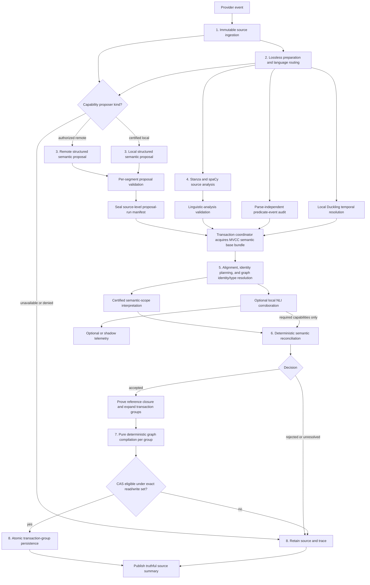

# Source-Grounded Semantic Ingestion Architecture

**Document status:** Proposed target architecture for production memory
ingestion.

Assessment baseline: `live-benchmark-repair` at commit `f76850f`, including
the uncommitted ingestion and runtime-benchmark changes present on 2026-07-25.
The file and symbol references describe that snapshot. The architectural
contracts are intended to survive later refactoring.

The current implementation remains authoritative until this design is
implemented and accepted through the rollout gates in Section 5.

This document is deliberately limited to semantic correctness from raw source
ingestion through durable graph persistence. It also defines the structural
graph-observation surface required to prove that persisted current, historical,
trust, and identity-lineage state is correct. Natural-language retrieval query
interpretation, agent integration, ranking, and answer generation remain outside
its scope.

An ingestion acceptance result and a runtime retrieval acceptance result are
different claims. A correct persisted graph closes an ingestion failure. It does
not close a later runtime failure over that graph. This architecture defines
only the ingestion verdict and a typed handoff proving the persisted graph
passed; downstream systems own their own design, instrumentation, and verdict.
Neither verdict may relabel or repair the other.

## 1. Problem Statement

### 1.1 Objective

Memorii must convert unstructured source text into durable graph state without
promoting a relation that the source does not actually assert.

The current ingestion path has strong transport validation, exact source
grounding, graph atomicity, and benchmark stage attribution. Its remaining
semantic checks rely too heavily on language-specific strings, token ordering,
marker lists, and hand-authored frames. Those mechanisms can prove that words
occur in the source. They cannot generally prove that the words play the roles,
carry the polarity, or have the commitment represented by a proposed graph
edge.

For example:

```text
Alice thinks Bob does not own Atlas.
```

A correct ingestion decision must determine all of the following:

- `Bob`, not `Alice`, fills the owner role.
- `Atlas` fills the owned-resource role.
- the embedded ownership proposition is negative;
- the proposition is attributed to Alice's belief;
- the source does not assert positive ownership as global current truth.

An extraction can contain every required word, valid JSON, valid IDs, and an
exact evidence quote while still encoding the wrong graph. Source grounding is
necessary, but it is not semantic validation.

### 1.2 Why the current approach is unstable

The current string-frame path is becoming a partial natural-language parser.
Every added phrase interacts with:

- inflection and word order;
- active and passive voice;
- intervening or omitted entities;
- negation and its scope;
- coordination;
- reported speech, quotation, and belief;
- modality and questions;
- clause and sentence boundaries;
- multilingual morphology;
- domain-specific names and noun phrases.

Patching one observed sentence therefore changes an implicit grammar without a
complete model of its interactions. That is why locally successful fixes have
moved failures between scenarios and profiles.

### 1.3 Canonical failure patterns and required behavior

These patterns are enduring design hazards, not a record of one benchmark
incident. They define behavior the architecture must prevent or handle safely
across providers, languages, domains, and future implementations.

| ID | Canonical failure pattern | Unsafe behavior | Required system behavior |
| --- | --- | --- | --- |
| CFP-01 | A malformed or internally inconsistent provider proposal crosses the semantic boundary. | Unknown IDs, conflicting entity/literal fields, or partial output reaches semantic processing. | Validate proposal shape and local references before semantic analysis; never guess or merge a repair. |
| CFP-02 | Source visibility is confused with semantic support. | A quote containing the expected names and trigger is accepted even though it does not assert the proposed relation. | Separate exact provenance from proposition assessment. |
| CFP-03 | Role binding relies on surface token order rather than certified structural evidence. | Relation endpoints are reversed or assigned to a nearby entity. | Compare proposals with independently derived clause arguments and certified role schemas. |
| CFP-04 | Competing entities and predicate events are derived from provider output. | Provider omission weakens validation of an incorrect proposal or creates silent false absence. | Derive mentions, arguments, and certified predicate-event candidates from source-only analysis. |
| CFP-05 | Polarity, commitment, and attribution are inferred from marker presence or incomplete intervals. | Negation, belief, quotation, questioning, instruction, or denial receives the wrong scope. | Interpret raw syntactic cues only through certified, construction-bounded semantic-scope policies. |
| CFP-06 | Predicate domains are decided from untrusted, stale, or circular type/identity inference. | A relation uses the wrong entity, wrong canonical type, or mixes entity and literal values. | Require source/registry-rooted type and identity proof ancestry, separate canonical types from role sorts, couple type dependencies, and revalidate graph-relative proofs after revision changes. |
| CFP-07 | Production semantic behavior is fitted to benchmark wording, entity names, or one language. | One fixture passes while paraphrases, arbitrary names, another profile, or another language regress. | Use language-neutral contracts, language-owned resources, metamorphic tests, and held-out natural text. |
| CFP-08 | An expected-state oracle repairs absent source evidence or production identity state. | A malformed fixture appears source-grounded, subset comparison hides unexpected output, or comparison creates missing aliases, lineage, or graph content. | Reject fixtures without unique source-visible introductions and compare an authoritative source/operation cohort exactly without production canonicalization or natural-language retrieval. |
| CFP-09 | Downstream retrieval and comparison continue after an upstream divergence. | Later symptoms obscure the first broken pipeline stage. | Stop validation at the first mismatch and report that stage truthfully. |
| CFP-10 | Tests emphasize schemas and familiar examples instead of semantic invariants. | Unit tests pass while model-shaped outputs create incorrect active graph state. | Test mutations, minimal pairs, graph prefixes, arbitrary-name transformations, and captured failures. |
| CFP-11 | Provider confidence influences semantic truth acceptance. | A confident but unsupported proposal progresses farther than an identical low-confidence proposal. | Treat provider confidence as diagnostic only. |
| CFP-12 | A weaker fallback produces success-shaped output after a verified-path dependency fails. | Rule output or another uncertified path becomes active truth. | Give the verified semantic path a distinct runtime identity and remove rule fallback from production and certification. |
| CFP-13 | Source temporal context is dropped, conflicts silently, or collapses into one timestamp. | Historical facts become current, disappear, or change with event arrival or policy order. | Preserve operation-complete temporal evidence, select and migrate versioned policy explicitly, retain immutable assertions, and project finite, right-unbounded, and atemporal valid/system-time partitions. |
| CFP-14 | Claim competition or source trust is caller/model controlled, underdefined, or evaluated without graph context. | Multi-valued facts compete incorrectly, source count amplifies authority, or malformed decay silently displaces stronger truth. | Share one claim-slot/value/cardinality contract and apply monotone fingerprinted rank, decay, tie, eligibility, and conflict algebra against a revision-bound snapshot. |
| CFP-15 | Canonical identity change is modeled as revision-ID replacement over an incomplete reference set. | Rekey, merge, or split fragments claim state or loses entities, aliases, relations, claims, actions, citations, or provenance. | Separate immutable revision provenance from logical projection identity, resolve identity from proof-carrying evidence, prove closure from schema/ledger/base records, and disposition plus reproject every affected reference atomically. |

### 1.4 Current implementation evidence

The branch demonstrates these issues concretely:

- `memory_evolution/language_support/base.py` implements `SemanticFrame` and
  can default omitted gap policies to unrestricted gaps.
- Negation checks are substantially based on finite markers and selected token
  intervals rather than complete clause scope.
- `memory_evolution/source_grounding.py` derives `known_entity_names` from
  provider-emitted grounded entities, allowing a provider omission to weaken
  its own verification.
- `memory_evolution/entity_resolution.py` can reuse a sole name- and
  type-compatible candidate without proof that the source mention and stored
  entity are the same real-world identity.
- Predicate-domain checks currently conflate structural relation roles with
  canonical entity types, which makes generic ownership reject valid teams or
  organizations and can let a predicate participate in proving its own domain.
- Current lifecycle projections do not expose one shared, explicit contract for
  claim-slot cardinality, temporal interval partitioning, trust-decay age, and
  identity-reference closure.
- Benchmark alignment can obscure graph omissions when expected and observed
  state are canonicalized through related logic or compared as a subset rather
  than through an authoritative closed source/operation cohort.
- English and Spanish resources are separated correctly, but currently form a
  growing hand-built semantic parser through triggers and frames.
- Existing benchmark and production-boundary tests cover examples well but do
  not establish behavior for omitted arguments, unseen paraphrases, nested
  clauses, or model-shaped semantic mutations.

Lexical resources are not inherently wrong. They become unsafe when they are
the final authority for proposition meaning instead of bounded evidence inside
a typed semantic decision.

### 1.5 Required outcome

The target system must:

1. retain the original observation even when extraction fails;
2. generate open-vocabulary semantic candidates from the source;
3. derive an independent linguistic view from the same complete source;
4. validate provenance, roles, polarity, commitment, attribution, and domains
   separately;
5. promote only propositions inside an empirically certified capability;
6. return `unresolved` and retain evidence when support is incomplete;
7. compile accepted typed facts, corrections, retractions, action-state
   operations, and identity operations through
   deterministic graph invariants;
8. expose the first failing stage in tests and production diagnostics;
9. prevent benchmarks from repairing production graph mistakes;
10. remain extensible across languages without putting English strings in the
    language-neutral compiler or reconciler;
11. preserve source scope, modality, authority, event time, and system time
    through every semantic boundary;
12. retain historical truth without confusing it with current truth;
13. preserve entity, claim, action, and provenance continuity across explicit
    identity rekeys, merges, and splits;
14. make source-level proposal completeness a prerequisite for any derived
    graph mutation;
15. expose revision-bound structural current, historical, and lineage views for
    ingestion verification without natural-language retrieval;
16. separate source-local co-reference, canonical graph identity, immutable
    revision provenance, and lineage-stable projection identity;
17. give one transaction coordinator ownership of snapshot-bound
    graph-dependent decisions, grouping, closure, bounded revalidation, and CAS;
18. prove reference and observation completeness from typed storage schemas,
    atomic edge ledgers, base records, and immutable write-set deltas; and
19. bind every accepted temporal operation and every acceptance artifact to
    complete, replayable evidence;
20. construct every accepted operation through one closed language-neutral IR
    with exact selectors and no production-ID or display-text tie-breaking;
21. allocate idempotent first-observation identities before claim-key
    construction without persisting them before atomic commit;
22. preserve source, transaction-group, and operation cardinality in execution,
    persistence, replay, and status aggregation;
23. activate temporal policies and existing-data reference integrity only
    through complete, snapshot-bound migration certificates and cutover
    watermarks; and
24. bind capability activation to every behavior-affecting dependency and
    degrade statistically unsafe capabilities to evidence-only without fallback;
25. authorize every remote semantic request through a deny-by-default,
    source-bound provider-egress decision before source text leaves Memorii;
26. route language through one fingerprinted source-only decision whose
    uncertainty prevents active promotion rather than selecting a convenient
    parser;
27. resolve textual temporal evidence through a named, pinned, source-only
    temporal resolver before temporal reconciliation;
28. require a unique canonical role assignment across certified, independently
    packaged syntactic analyzers and audit predicate-event coverage through a
    parse-independent high-recall detector; and
29. represent fixed-point prefix state with typed planning records whose
    transaction-group commit coordinates remain unambiguous until materialized.

#### 1.5.1 Canonical requirements ledger

This ledger is the normative traceability authority for the design. Section 1.5
summarizes the desired outcome; CFP and ING identifiers classify failure
patterns and prior review findings. Neither replaces these stable requirements.
Every implementation WorkPlan must map each in-scope `SIA-Rxx` row to its
production owner, tests, and other completion evidence. A row is not complete
because a related CFP or ING row is marked closed.

| ID | Requirement and source | Priority | Canonical owner | Measurable acceptance | Required verification |
| --- | --- | --- | --- | --- | --- |
| SIA-R01 | Retain immutable verbatim source and provenance before derivation. Sources: Memorii spec; storage details. | Required | Source governance and source store | Every durably accepted delivery has exactly one byte-identical source record and provenance envelope before any derivation. Invalid envelopes are explicitly rejected; retention failures return no success-shaped admission, and indeterminate writes require idempotent recovery before semantic execution. | Invalid-envelope, prewrite failure, write-before-acknowledgement recovery, delivery replay, conflicting replay, source mutation, and every post-retention stage-failure test. |
| SIA-R02 | Keep model output candidate-only until typed transport, semantic, provenance, lifecycle, and transaction checks pass. Sources: Memorii spec; implementation rules; C2. | Required | Proposal adapter, reconciler, coordinator | No provider field, confidence, or successful transport response alone can create committed graph state. | Malformed, unsupported, high-confidence, partial, and failed-stage zero-effect tests. |
| SIA-R03 | Give every material requirement a stable source, owner, acceptance rule, and verification path. Sources: `.agent/PLANS.md`; `$review-design`. | Required | This design and implementation WorkPlan | This ledger and the implementation coverage ledger contain no missing or contradictory material row. | Static traceability audit and fresh whole-design review. |
| SIA-R04 | Make proposal, source-analysis, normalization, reconciliation, retry-plan, and terminal-result contracts compose without invented identifiers, statuses, or side channels. Source: implementation rules. | Required | Semantic-analysis and transaction-result contracts | Every downstream reference is produced by exactly one typed upstream artifact; pre-planning and planned progress are disjoint; every terminal group identifies its exact eligible attempt, plan, and authorization. | Definition/reference audit, schema round trips, pre-planning/planned transition tests, mixed accepted/unresolved event tests, and commit-then-replan lineage mutations. |
| SIA-R05 | Require certified independent role, scope, attribution-bearer, and attachment evidence before promotion. Sources: Memorii spec Sections 16.25-16.27 and 25.1-25.3; implementation rules, commit gating. | Required | Linguistic consensus, scope interpreter, source-local identity, and canonical identity resolver | Analyzer disagreement, incomplete ancestor closure, unsupported attachment, or missing/ambiguous/noncanonical reported-source bearer yields unresolved and zero graph effect. | Active/passive, negation, quotation, direct/reported/nested attribution, bearer/identity substitution, coordination, and analyzer-mutation tests. |
| SIA-R06 | Detect and attach textual valid time independently of proposer completeness, and combine it with authenticated non-text temporal evidence only through the closed matrix in Section 3.5. Sources: Memorii spec Sections 7.2, 17, and 25; implementation rules, commit gating. | Required | Temporal resolver and attachment consensus | Source-present temporal text omitted by the proposer, ambiguous or misattached text, and unsupported text/non-text combinations cannot be promoted. Genuinely absent text follows the predicate mode and authenticated-evidence matrix rather than being treated as proposer omission. | Absolute/relative/interval, omission versus absence, event/document reference provenance, authenticated interval, atemporal, misattachment, timezone, DST, and replay tests covering every matrix cell. |
| SIA-R07 | Bind prompt text, schema, owner, redaction, and visibility policy through one registered prompt authority. Source: prompt contracts. | Required | Prompt registry/renderer and proposer transport | Any registration-coordinate substitution blocks transport before a provider or local model call; a valid policy removes registered non-source secrets from rendered prompt, transport metadata, and traces without rewriting source text. | YAML/schema/owner/visibility/redaction/digest mutation tests plus independent serialized-byte observation for valid nested redaction and immutable sanitized copies. |
| SIA-R08 | Preserve a certifiable local-only active ingestion path and make it the ordinary production default; cloud proposal is explicit opt-in. Source: storage-details local-first requirement. | Required | Proposer protocol, capability registry, and production composition roots | Ordinary in-memory and filesystem builders promote the supported certified envelope with network denied. Remote proposal requires explicit operator selection plus current source-bound authorization; no attempt silently switches or falls back between proposers. | Default-constructor embedded local-proposer end-to-end tests, explicit remote-opt-in tests, and remote-deny zero-call tests. |
| SIA-R09 | Authorize remote egress only under the current active source-bound policy. Sources: storage details; Memorii spec Sections 15 and 25. | Required | Source governance and provider transport | Revoked, expired, superseded, stale, or mismatched policy produces zero remote calls. | Policy rotation, rollback, concurrent change, classification, provider/model/region, and replay tests. |
| SIA-R10 | Emit canonical idempotent full-state memory events for every committed semantic mutation, retain canonical ingestion-observation deltas for every terminal source-visible operation, and reconstruct both materialized authorities and every acknowledged replay dependency from their logs. Sources: Memorii spec Sections 18.2-18.3; event model Sections 3-5, 8-9, and 14-16. | Required | Transaction coordinator, graph event/replay authority, ingestion-observation ledger, and atomic replay-artifact store | Genesis and signed-checkpoint replay across every active read schema reproduce the exact committed graph revision, ingestion-observation ledger, progress state, and replay-authoritative artifact closure without prior materialized state, provider, analyzer, or read-time reconstruction. No visible state references an artifact absent from the same or an earlier complete generation. Envelope `event_id`, logical-retry `dedupe_key`, and record identity are distinct; only `payload.entity_id == payload.record_id == GraphRecordMutation.record_id`. One typed `create|update` mutation kind is carried unchanged from compiler delta through event identity and replay; one logical mutation has one stable dedupe key across retries. Every terminal operation has exactly one immutable introduction and terminal-outcome record; committed outcomes link exactly one graph delta and terminal non-committing outcomes forbid one. | Every-record-kind create/update/retirement mapping, introduction/outcome replay, zero-mutation terminals, artifact/state publication failpoints, pre-planning resume, identity mutations, envelope/dedupe/record identity separation, current-writer version-collision rejection, canonical historical same-version precedence, duplicate, conflicting-dedupe, reordered, supported/retired/future schema, deterministic upcast, corrupt, partial-commit, checkpoint trust/rollback, and replay-resume tests. |
| SIA-R11 | Enforce one certified semantic writer across embedded, sidecar, event-consumer, legacy, and generic-store paths. Sources: Memorii spec Sections 17.3 and 19.2; implementation rules, commit gating. | Required | Store-owned writer admission, semantic-record ownership manifest, and common storage boundary | Every governed semantic mutation carries one current writer binding. Activation stops new legacy admissions and drains or terminalizes every old-epoch operation before advancing the epoch. A stale or binding-free writer changes no semantic or lifecycle revision. | Shared-store mixed-version, every atomic and generic write entry point, cutover, rollback, drain, active-lease, and paused in-flight process tests. |
| SIA-R12 | Use closed discriminated temporal and lifecycle algebras in source, resolver, accepted, durable, expected, and observed contracts. Sources: implementation rules; C1. | Required | Decision, graph, and acceptance contracts | Impossible basis/value combinations and unknown variants fail deserialization; equal temporal values with different authenticated bases remain distinct end to end. | Exhaustive variant round trips, equal-value/different-basis mutations, missing/swapped provenance, and malformed-row tests. |
| SIA-R13 | Bind acceptance evidence to lifecycle-checked keys and monotonic active releases without placing acceptance authority in production. Sources: Memorii spec Sections 17-18 and 25; implementation rules, commit gating. | Required | Acceptance trust policy and acceptance harness | Revoked, compromised, expired, superseded, wrong-purpose, or rollback releases cannot validate evidence; signed acceptance witnesses bind exact public production attestations, while production imports no acceptance schema, key, or policy. | Key lifecycle, active-release, cross-purpose, cross-artifact replay, production-import-boundary, attestation substitution, and witness reconstruction tests. |
| SIA-R14 | Statistically certify every behavior-affecting routing, analysis, coverage, temporal, semantic, safety, utility, and abstention lane. Sources: Memorii spec Sections 16.25-16.27 and 25; engineering-hardening closure matrix C4. | Required | Acceptance statistical gate | Capability activation requires every predeclared mandatory metric gate and valid multiplicity adjustment. | Independent metric/cluster/p-value/bound recomputation and manifest-completeness tests. |
| SIA-R15 | Make runtime monitoring decisions executable and deterministic from typed policy plus immutable evidence. Sources: Memorii spec Sections 17.5-17.6 and 25; implementation rules, commit gating. | Required | Capability monitor and registry | Identical policy/evidence yields the same state transition; breach or stale evidence atomically enters evidence-only. | Boundary, fake-clock, race, outage, recovery, and independent sequential-decision tests. |
| SIA-R16 | Declare one unambiguous initial dependency topology and certification set. Sources: Memorii spec Sections 16.25-16.27 and 25; storage-details local-first requirement; selected architecture decisions in Sections 3.3-3.5 implementing SIA-R05, SIA-R08, and SIA-R14. | Required | Deployment manifest and capability registry | One authoritative manifest binds every Python distribution, model/tokenizer asset, local runtime/ruleset, license, owner module, and optional remote adapter named by packaging, runtime, rollout, and certification. | Bidirectional manifest/module/package/asset consistency audit and missing/extra/duplicate/digest/license mutation tests. |
| SIA-R17 | Compare a pre-ingest expected ingestion graph with direct, scope-authorized structural observations, including terminal zero-mutation outcomes, never retrieval or production semantic helpers. Sources: Memorii spec Sections 16.27, 17, and 25; storage-details scoped-access requirement; implementation rules, commit gating. | Required | Acceptance-only oracle and graph observation API | One unique global operation/fence bijection is established before source/entity alignment; zero or multiple solutions fail. Production-only source-outcome integrity coordinates are independently checked against public production records before fixture equality. One-field, missing, and unexpected-record mutations fail at the first structural divergence; every expected operation aligns through one persisted introduction and terminal outcome; committed and non-committing outcomes have exact, disjoint effect shapes; cross-principal, cross-scope, mixed-seed, forged-cursor, and revoked access fail without record, digest, cohort, page, or existence disclosure. Hand-authored fixture semantics require current content-bound independent review evidence before ingest. | Static import boundary, reviewed-fixture evidence, global-bijection permutation/ambiguity tests, source-outcome consistency mutation tests, closed-world comparator, zero-mutation and mixed-outcome cohorts, fence alignment, view, revision, pagination, cross-principal/scope, cursor-integrity, and authorization-revocation tests through the production boundary. |
| SIA-R18 | Preserve immutable historical truth, trust evolution, and entity lineage. Sources: Memorii spec Sections 7.2, 17, 18, and 25; canonical event model Sections 5-10. | Required | Graph compiler, projection scheduler, and persistence | Required current, historical, contested, and lineage views remain replayable after late arrival, policy migration, rekey, merge, and split. | Interval/trust/identity prefix matrices, migration races, and exact structural comparison. |
| SIA-R19 | Activate semantic ingestion through the normal production provider composition. Source: engineering-hardening closure matrix C3. | Required | Provider factory, `ProviderMemoryService`, and ingestion coordinator | Default production builders route accepted and evidence-only sources through Steps 1-8 with no legacy writer or fallback authority. | Default-constructor integration tests over filesystem and in-memory supported configurations. |
| SIA-R20 | Fence long-running work with renewable leases, bounded stale recovery, terminal exhaustion, and a separate stable allocation namespace. Source: engineering-hardening closure matrix C13. | Required | Operation repository, lease heartbeat, semantic ingestion coordinator, and identity/action planners | Only the current lease owner may persist or commit; reclaim preserves allocation namespace and byte-identical planned IDs; abandoned work recovers within the fixed budget and then becomes terminal. | Fake-clock, multiprocess token-fencing, crash/reclaim before and after planning, namespace substitution, slow-stage renewal, lost-acknowledgement, restart, stale-recovery, and exhaustion tests. |
| SIA-R21 | Make semantic-ingestion admission, checkpoint progress, terminal-group persistence, and source finalization process-safe and crash-atomic; the filesystem/JSONL backend must publish each complete batch as one generation. Source: engineering-hardening closure matrix C12. | Required | Semantic-ingestion atomic-store protocol and filesystem storage adapter | Readers observe the prior state or one complete admission, progress checkpoint, group, or finalization transaction, never a subset. First visibility of every replay-authoritative artifact is atomic with the state that references it. A terminal-group transaction atomically publishes its group result and ingestion-observation delta and, only when committed, its graph delta/event batch. Every transaction validates its exact graph/control/observation/artifact revisions, artifact closure, lease, writer epoch, and idempotency fence. | Backend-neutral in-memory/filesystem conformance plus pre-planning/planned checkpoints, committed, zero-mutation, and mixed-outcome group transactions; deterministic artifact/index/state failpoints, multiprocess same/distinct delivery, failed replace, reopen, corruption, lost acknowledgement, and idempotent retry schedules. |
| SIA-R22 | Preserve the complete pinned provider evolution lifecycle envelope while exposing the truthful semantic-ingestion terminal result without aliases or versioned APIs. Sources: current provider operation contract; implementation rules; normal production composition requirement C3. | Required | Provider service, operation repository, and semantic-result repository | Existing callers observe byte-identical canonical payloads for every field, enum, default, nullability, and validator case in the immutable baseline; semantic-aware callers retrieve one typed source result whose digest and lifecycle mapping agree with the same operation. Retryable group failure never becomes terminal committed state, and lease exhaustion retains its typed reason. | Independently captured baseline schema/fixture comparison, exhaustive lifecycle/result mapping, legacy-reader serialization, schema mutation, separate-accessor, mixed-process cutover, retryable partial-group resume, lease-exhaustion round trip, missing-result, and digest-substitution tests. |
| SIA-R23 | Preserve public provider delivery identity through deterministic internal normalization, canonical structured source envelopes, and composite-hook replay. Source: engineering-hardening closure matrix C11 and the current provider boundary. | Required | Provider adapters, source-admission normalizer, and operation repository | Every public mutation rejects a blank normalized delivery ID. Structured snapshots/delegations produce one versioned canonical envelope. Accepted admission returns the complete immutable operation/namespace/writer handoff. Composite hooks derive reserved child IDs deterministically; restart and partial replay execute only missing children and never duplicate effects. | Public-operation blank-ID matrix, cross-adapter canonical-byte equality, envelope ordering/reference/version/limit mutations, admission-to-lease/lost-ack/replay, child-ID collision/determinism, process restart, conflicting replay, and every partial-child recovery permutation. |

CFP and ING identifiers below are non-normative rationale and regression
labels. Their sole implementation authority is the owning SIA requirement in
this mapping:

| Rationale IDs | Owning normative requirements |
| --- | --- |
| CFP-01, CFP-02, CFP-11 | SIA-R02, SIA-R04 |
| CFP-03, CFP-05 | SIA-R05 |
| CFP-04 | SIA-R04, SIA-R05 |
| CFP-06 | SIA-R02, SIA-R18 |
| CFP-07, CFP-10 | SIA-R14, SIA-R16 |
| CFP-08, CFP-09 | SIA-R17 |
| CFP-12 | SIA-R08, SIA-R19 |
| CFP-13 | SIA-R06, SIA-R12, SIA-R18 |
| CFP-14, CFP-15 | SIA-R12, SIA-R18 |
| ING-P1-01, ING-P1-02, ING-P1-03 | SIA-R02, SIA-R04, SIA-R11 |
| ING-P1-04, ING-P1-15 | SIA-R04, SIA-R11 |
| ING-P1-05, ING-P1-10, ING-P1-16, ING-P1-18 | SIA-R04, SIA-R11, SIA-R18 |
| ING-P1-06 | SIA-R04, SIA-R12 |
| ING-P1-07, ING-P1-12 | SIA-R17 |
| ING-P1-08 | SIA-R02, SIA-R14 |
| ING-P1-09, ING-P1-13, ING-P1-14 | SIA-R02, SIA-R04, SIA-R12 |
| ING-P1-11, ING-P1-17 | SIA-R10, SIA-R12, SIA-R18 |
| ING-P1-19 | SIA-R09 |
| ING-P1-20 | SIA-R06, SIA-R12 |
| ING-P2-01, ING-P2-05 | SIA-R12, SIA-R13, SIA-R17 |
| ING-P2-02, ING-P2-03, ING-P2-06, ING-P2-09 | SIA-R11, SIA-R12, SIA-R18 |
| ING-P2-04 | SIA-R15 |
| ING-P2-07, ING-P2-10, ING-P2-11, ING-P2-14 | SIA-R13, SIA-R17 |
| ING-P2-08, ING-P2-12 | SIA-R14 |
| ING-P2-13 | SIA-R10, SIA-R12, SIA-R18 |
| ING-P2-15 | SIA-R05, SIA-R16 |
| ING-P2-16 | SIA-R04, SIA-R05, SIA-R14 |
| ING-P2-17 | SIA-R05, SIA-R16 |
| ING-P2-18 | SIA-R13 |

A static audit expands every range above and fails on an absent or duplicate
rationale ID, an unknown SIA ID, or a rationale row that claims independent
completion authority.

### 1.6 Scope

In scope:

- immutable source records and exact source offsets;
- lossless text preparation and language routing;
- source-data classification and provider-egress authorization;
- a provider-neutral source-grounded semantic proposer with certified local and
  optional remote deployments;
- primary and corroborating source-only linguistic analysis;
- bounded source-only temporal-expression resolution;
- optional semantic corroboration;
- semantic role, polarity, commitment, attribution, and domain assessment;
- source eligibility, authority, scope, modality, and bitemporal assessment;
- typed acceptance, rejection, and abstention;
- deterministic graph compilation and atomic persistence;
- explicit identity-lineage compilation and evidence-backed reference
  disposition;
- a read-only structural graph-observation API used to verify ingestion output;
- capability certification, replay, diagnostics, and validation;
- migration away from the current production frame matcher.

Out of scope:

- natural-language retrieval query understanding, including
  `StructuredQueryAnalyzer`;
- agent integration and agent policy;
- retrieval ranking and answer generation;
- broad ontology redesign;
- arbitrary long-range coreference and discourse understanding;
- automatic support for every language or construction;
- using an LLM judge as the production acceptance oracle;
- making the rule benchmark baseline pass.

## 2. High-Level Solution Flow

### 2.1 Runtime workflow

The selected production design **continues to call an LLM for semantic
understanding**. The LLM may run in-process through a certified local adapter or
through an explicitly authorized remote adapter. It is a proposal generator,
not the authority that writes durable graph truth. Each active capability binds
one exact proposer deployment. An ingestion attempt never falls back from one
proposer to another.

For each retained source, the normal active path is:

1. **Immutable source ingestion** persists the original text, provenance,
   server-owned authority, scope, modality, bitemporal context, and a
   deny-by-default provider-egress decision. A denied source is retained but
   cannot cause a remote call.
2. **Lossless text preparation** derives offsets, sentence boundaries, and
   language metadata without discarding source content, then emits one
   fingerprinted language-routing decision or an explicit unresolved result.
3. **LLM semantic proposal** makes one structured-output inference per bounded
   segment through the capability-bound proposer. A local proposer runs from a
   pinned in-process model manifest without network access. A remote proposer
   runs only when the exact source and provider configuration are authorized.
   Both seal all segment outcomes into the same source-level proposal-run
   contract.
4. **Independent source analysis** runs pinned Stanza and spaCy dependency
   adapters, a parse-independent high-recall predicate-event detector, and a
   pinned local Duckling temporal resolver over the same complete source,
   concurrently with Step 3. These components produce evidence, not truth.
5. **Evidence normalization, identity resolution, and optional corroboration**
   deterministically aligns the independent lanes, requires one stable
   canonical role assignment across certified parser outputs, resolves bounded source-local
   co-reference as a total mention partition, plans idempotent first-observation
   identities, resolves reused graph identity and type from one proof-carrying
   MVCC base bundle, interprets certified semantic-scope constructions, audits
   proposal coverage against the parse-independent event inventory, resolves
   certified textual temporal evidence, and may run local multilingual mDeBERTa inference in
   shadow mode.
6. **Deterministic semantic reconciliation** compares the complete source-level
   proposal run, immutable source context, source-only linguistic analysis,
   optional NLI assessment, bundle-bound identity/type evidence, predicate
   policy, and exact capability certification, then emits only the closed
   language-neutral accepted-operation IR. An incomplete segment run cannot
   produce accepted operations.
7. **Transaction coordination and deterministic graph compilation** expand
   source groups with same-token dependency extensions, prove bootstrapped
   reference closure, seal one effective read set per group, invoke the pure
   compiler, and apply entity, predicate, lifecycle, temporal, trust, identity,
   action, and atomicity invariants to accepted typed operations only.
8. **Persistence and replay** retain source traces, atomically apply each
   commit-eligible transaction-group delta, and publish one truthful source
   summary without collapsing group or operation outcomes.



Trust decay, temporal-policy migration, and identity-lineage reprojection also
have server-owned deterministic paths that do not ingest new text. Persisted
commands load an MVCC semantic snapshot bundle, recompute the affected
projection under fingerprinted policy and lineage, and atomically persist any
transition. They share coordinator, compiler, and operation-fence invariants but
never invoke the proposer, parser, scope interpreter, or NLI model.

### 2.2 Call topology

The terms `LLM`, `local model`, and `deterministic` are not interchangeable in
this design.

| Component | Remote provider call | Local learned-model inference | Final semantic authority |
| --- | --- | --- | --- |
| Source-governance resolver | No | No | Authoritative for scope, modality, trigger eligibility, source authority, bitemporal metadata, and provider-egress eligibility |
| Language router | No | Yes, pinned fastText inference | Authoritative only for selecting a certified language capability or abstaining; never for proposition meaning |
| Local semantic proposer | No | Yes, pinned in-process structured-output model | No; produces untrusted candidates |
| Remote semantic proposer | Yes, normally once per bounded segment | No | No; produces untrusted candidates |
| Stanza linguistic analyzer | No | Yes | No; produces primary source-only syntax evidence |
| spaCy linguistic corroborator | No | Yes | No; exposes role-assignment disagreement and parser instability |
| Predicate-event coverage detector | No | No | Authoritative only for high-recall coverage obligations inside a certified predicate lexicon/morphology manifest |
| Duckling temporal resolver | No | No | Authoritative only for certified source spans and normalized temporal candidates under an explicit reference-time contract |
| Proposal aligner and scope interpreter | No | No | Authoritative only for certified alignment and construction-level scope checks |
| Source-local identity resolver | No | No | Clusters mentions only from certified same-source evidence; ambiguity remains unresolved |
| Canonical identity resolver | No | No | Resolves source-local clusters only from proof-carrying, authorized, snapshot-bound graph evidence |
| Type-evidence ledger | No | No | Authoritative for independent canonical type evidence, role sorts, and proof-mode checks |
| Predicate state registry | No | No | Authoritative for claim-slot partitioning, typed value identity, cardinality, and conflict behavior |
| Multilingual NLI corroborator | No | Yes, optional and initially shadow-only | No; can eventually veto or force abstention, never approve alone |
| `SemanticReconciler` | No | No | Applies the complete deterministic acceptance policy over certified inputs |
| Transaction coordinator | No | No | Owns one base graph snapshot, same-token read-set extensions, planned identities, graph-dependent grouping, closure acquisition, bounded revalidation, and per-group CAS commit |
| Graph compiler | No | No | Purely enforces deterministic graph and lifecycle invariants over complete inputs after semantic acceptance |
| Projection scheduler | No | No | Applies fingerprinted trust, temporal-policy, and identity-lineage reprojection without new semantic interpretation |
| Persistence | No | No | Applies only a commit-eligible graph delta |
| Structural graph observation | No | No | Exposes exact revision-bound graph state without query interpretation or ranking |

One additional remote proposal call is allowed only for bounded transport
repair, such as malformed structured output or invalid proposal-local
references. A semantic rejection is never repeatedly sent back to the model
until it emits an acceptable answer.

No LLM judge participates in production acceptance.

### 2.3 Normal and degraded behavior

| Context | Proposal behavior | Analyzer behavior | Promotion behavior |
| --- | --- | --- | --- |
| Production active ingestion | Calls the one capability-bound local or remote proposer; remote calls require exact current egress authorization | Requires a certified language decision, checksum-valid Stanza/spaCy analyses, event coverage, and temporal resolution where required | May promote only after reconciliation and compilation pass |
| Provider egress denied | Makes no remote call; a capability already bound to a local proposer is unaffected, while a remote-bound attempt does not switch proposers | Source-only analysis may still complete | Retains source and approved local evidence for remote-bound attempts; local-bound attempts follow their certified path |
| Provider unavailable or invalid after bounded repair | Records explicit provider failure | Analysis may still complete | Retains source; no open-vocabulary relation promotion |
| Analyzer unavailable, partial, or uncertified | Proposal may still be retained as a trace | Returns typed unavailable/partial status | Retains source; required capabilities become unresolved |
| Evidence-only deployment | Proposer may be disabled | Analyzer may be disabled | Retains observations and independently safe mention evidence only |
| Offline tests and replay | Uses fake or recorded proposals | Uses typed fixtures or packaged adapter assets | Exercises production boundaries without paid calls |
| Rule benchmark baseline | No LLM call | Benchmark-specific behavior | Isolated discriminative baseline, never a silent production fallback |

The failure policy is fail-closed for active semantic promotion. Once the source
store has durably accepted a delivery, every later failure retains that raw
observation for reprocessing. An invalid envelope or a retention failure occurs
before that invariant applies: it returns an explicit non-success admission and
no semantic stage starts. A write whose durability is indeterminate is recovered
by the same delivery ID before any caller may observe acceptance.

### 2.4 Authority flow

| Authority | Owns | Does not own |
| --- | --- | --- |
| Source observation | What was received, provenance, immutable text, event and system time | Relation meaning or graph truth |
| Source-governance policy | Authenticated scope, source modality, trigger eligibility, authority tier, and trust-arbitration policy | Natural-language meaning or graph facts |
| Provider-egress policy | Whether an exact source may be sent to one provider/model/region under one retention and training-use configuration | Semantic truth, redaction inference, or permission inferred from source text |
| Language router | One certified language capability or explicit uncertainty | Proposition meaning, parser repair, or code-switched semantic inference |
| LLM proposer | Candidate mentions, propositions, source quotes, open-vocabulary interpretation | Final acceptance, canonical IDs, lifecycle state |
| Linguistic analyzer ensemble | Source-only tokens, morphology, dependency structure, clause boundaries, raw syntactic cues, and explicit cross-analyzer role-set agreement or disagreement | Proposal alignment, semantic scope, product predicates, durable truth, canonical identity |
| Temporal resolver | Source-only temporal spans and normalized candidates under a certified locale, timezone, and reference instant | Graph precedence, source authority, or conflict resolution |
| Scope interpreter | Certified construction-level polarity, commitment, attribution, and clause-scope assessments from normalized syntax | Open-ended language interpretation, graph mutation, or trust arbitration |
| Source-local identity resolver | Same-source mention clusters supported by explicit alias/apposition/external-ID or certified unambiguous repetition evidence | Graph candidates, name-only clustering, pronoun resolution, or cross-segment inference |
| Canonical identity resolver | Revision-bound reuse, distinct creation, or abstention from authorized identity-binding evidence | Name-only matching, model confidence, cross-scope linking, or benchmark alignment |
| Type-evidence ledger | Independent canonical types and non-persistent structural role sorts under explicit proof modes | Type decisions from model confidence, capitalization, unsupported NER inference, or circular predicate-role proof |
| Predicate state registry | Shared claim-slot/value identity, cardinality, qualifier partition, and conflict policy | Language interpretation or source authority |
| NLI corroborator | Entailment/neutral/contradiction evidence for frozen hypotheses | Final acceptance or graph mutation |
| Semantic reconciler | Typed agreement, contradiction, unsupported capability, and abstention decisions | Storage, lifecycle mutation, benchmark scoring |
| Transaction coordinator | MVCC bundle, graph-dependent revalidation, transaction groups, reference closures, bounded retries, and CAS | Provider/parser/NLI recall, language interpretation, or benchmark scoring |
| Graph compiler | Pure predicate-domain, bitemporal, trust, identity-lineage, reference-disposition, consistency, and atomic-eligibility calculation | Storage reads/retries or natural-language interpretation |
| Projection scheduler | Due trust/temporal/identity commands and deterministic catch-up | Source meaning, policy invention, or provider calls |
| Persistence | Durable observation, trace, and eligible graph delta | Semantic reinterpretation |
| Structural graph-observation API | Authorized typed records for one exact graph revision and time | Natural-language query interpretation, expected-state alignment, or repair |

### 2.5 End-to-end execution sketch

```python
observation = source_ingestor.retain(
    provider_event,
    governance=source_governance,
)
source_context = observation.semantic_context  # resolved before durable success
prepared = text_preparer.prepare(observation, source_context)

proposal_futures = bound_proposer.propose_segments(prepared)
primary_analysis_future = primary_analyzer.analyze(prepared)
corroborating_analysis_future = corroborating_analyzer.analyze(prepared)
event_inventory_future = predicate_event_detector.detect(prepared)
temporal_resolution_future = temporal_resolver.resolve(prepared, source_context)

proposal_run = proposal_run_sealer.validate_and_seal(
    proposal_futures, prepared
)
analyses = analysis_validator.validate_bundle(
    primary_analysis_future.result(),
    corroborating_analysis_future.result(),
    prepared,
)

stable_source_lane_outputs = StableSourceLaneOutputs(
    proposal_run=proposal_run,
    analyses=analyses,
    predicate_events=event_inventory_future.result(),
    temporal_resolution=temporal_resolution_future.result(),
)
result = transaction_coordinator.execute(
    source=prepared,
    source_context=source_context,
    stable_source_lane_outputs=stable_source_lane_outputs,
    arbitration_as_of=operation_time,
    normalize=proposal_aligner.align_and_group_source,
    corroborate=corroborator.assess_bound_operations,  # optional, at most once
    reconcile=reconciler.assess_all,
    expand_groups=transaction_group_planner.expand,
    compile_group=compiler.compile,
)
persistence.retain_source_trace(result.source_trace_request)
for group_request in result.group_persistence_requests:
    persistence.commit_group_trace_and_eligible_delta(group_request)
persistence.retain_source_summary(result.source_summary_request)
```

The actual implementation may use the existing operation fence and async
abstractions, but it must preserve these ownership and call boundaries. The
coordinator supplies one `GraphSemanticSnapshotBundle` to normalization and
reconciliation, acquires verified reference closure, expands transaction groups,
and performs the CAS. Initial NLI runs only after alignment seals operation
capability bindings; the coordinator then seals proposal, analysis, alignment,
bindings, and NLI assessments as graph-independent lane outputs before any
graph-dependent retry. Only source-derived operation spans,
predicate/construction classification, source semantic groups, and capability
bindings are sealed. Canonical identity, type evidence, correction targets,
reference closure, and transaction grouping remain graph-dependent.
NLI input cannot contain canonical entity IDs or another graph-derived value.
On one related conflict the coordinator repeats only graph-dependent operations
with a new complete bundle; graph-independent lane outputs are reused
byte-for-byte and no learned component is called again.

## 3. Key Decisions and Executive Decisions

### 3.1 Preserve raw source as the highest authority

Original text, source identity, timestamps, and provenance are immutable.
Normalized text and model annotations are derived data. Every promoted claim
retains exact source references, and every failed extraction remains
replayable.

Rationale: false-negative semantic decisions can be reprocessed. A false
active graph edge can contaminate retrieval, lifecycle arbitration, and agent
behavior.

### 3.2 Keep the LLM, but demote it from truth authority to proposer

Structured-output LLM inference remains valuable for open-vocabulary entity and
predicate interpretation. The proposer protocol has a local in-process adapter
and an optional remote adapter; neither is trusted to validate its own output.
Structured JSON proves transport shape, not semantic correctness.

The proposer receives the complete bounded source, predicate ontology, output
contract, and source-grounding requirements. It does not receive hidden
benchmark answers or the independent parser's role decisions.

### 3.3 Run linguistic analysis independently, not as lossy LLM preprocessing

Stanza and the LLM inspect the same complete source in parallel. Parser role
answers are not inserted into the proposal prompt and then reused as
"independent" verification.

Safe tokenization and source offsets may be shared. Semantic conclusions must
remain independent enough to expose disagreements.

The analyzer consumes only `PreparedSource` and its pinned analyzer manifest.
It never consumes proposal mentions, proposal spans, provider-local IDs, or
provider-selected predicate anchors. A separate deterministic alignment stage
runs only after both lanes complete and compares their independently produced
source coordinates. This ordering is an architecture invariant, not an
implementation optimization.

### 3.4 Select Stanza as primary and spaCy as corroborating analysis

The initial adapter uses `stanza==1.14.0` with:

```text
tokenize,mwt,pos,lemma,depparse
```

Stanza was selected because it provides:

- exact character-addressable token data;
- Universal Dependencies heads and relations;
- morphology, dependency structure, voice features, and raw polarity cues where
  available;
- one API for English and Spanish;
- offline model installation and disabled runtime downloads.

Stanza NER is not required for correctness. Generic NER is insufficient for
projects, tasks, services, documents, and other domain noun phrases. Argument
candidates come from dependency structure, noun phrases, and exact proposer
spans.

Stanza is an untrusted syntactic signal, not a semantic-scope oracle. Negation
tokens, complement edges, quotation punctuation, mood features, and dependency
ancestors remain raw evidence until a certified scope policy interprets them.
Model assets
are pinned, checksummed, measured on Memorii data, and capability-scoped.

The initial active capability also requires an independently packaged spaCy
dependency parser for the same language. Stanza is the primary analyzer only
for diagnostics and operational ownership; primary designation cannot break a
semantic disagreement. The analyzers use separate model manifests and adapter
implementations and meet only at the normalized language-neutral contract.
Gate C must qualify the full pair before any capability becomes active.

### 3.5 Use multilingual NLI only as asymmetric corroboration

The selected experiment uses Hugging Face `transformers` with
`MoritzLaurer/mDeBERTa-v3-base-mnli-xnli`, loaded from an immutable repository
revision.

For a proposed ownership relation, a language-owned verbalizer produces:

```text
positive:       Alice owns Atlas.
role_swapped:   Atlas owns Alice.
negative:       Alice does not own Atlas.
```

The local model evaluates all hypotheses in one batch. It begins in shadow
mode because public XNLI accuracy is far below the precision required for a
durable-memory authority. After held-out calibration, strong counterevidence
may force `unresolved`; positive entailment can never create acceptance by
itself or override deterministic source, role, scope, or domain failures.

The base mDeBERTa model is preferred over smaller multilingual MiniLM for the
initial correctness study because ingestion is off the retrieval hot path.
Latency optimization occurs only after semantic parity on the frozen corpus.

### 3.6 Own semantic reconciliation in deterministic Memorii code

No third-party library knows Memorii's canonical predicate direction,
commitment policy, domain constraints, capability evidence, identity boundary,
or lifecycle semantics.

`SemanticReconciler` therefore performs only deterministic operations:

- exact span and source checks;
- token/span alignment;
- typed UD graph traversal under a predicate policy;
- role comparison;
- polarity, commitment, attribution, and domain checks;
- capability fingerprint lookup;
- consumption of an already-computed optional `NliAssessment`;
- three-valued `accepted`, `rejected`, or `unresolved` decision algebra.

It does not call OpenAI, Stanza, Transformers, persistence, or benchmark code.
It does not perform open-ended language interpretation.

### 3.7 Keep the graph compiler language-neutral

The compiler consumes accepted typed operations only. It owns canonical entity
references, predicate domains, correction targeting, identity operations,
bitemporal and trust arbitration, reference dispositions, action/claim
consistency, graph projection, and atomic commit eligibility.

It must not contain English or Spanish dictionaries, language-specific regular
expressions, model calls, or benchmark terminology.

### 3.8 Make abstention a first-class product result

`unresolved` means the observation was retained but active semantic promotion
was not justified. It is distinct from provider failure, parser failure,
semantic contradiction, and successful promotion.

The default policy is:

```text
accepted =
    all mandatory checks pass
    AND no check fails
    AND the exact capability is certified

rejected =
    a source, role, polarity, commitment, attribution, or domain check fails

unresolved =
    no mandatory check fails
    AND at least one required check is unknown or unavailable
```

Model confidence never converts `unknown` into `pass`.

### 3.9 Certify bounded capabilities, not models globally

Promotion permission is attached to one closed, transitive dependency bundle:

```python
class ProposalCapabilityDependencyBundle(BaseModel):
    language: str
    proposer_fingerprint: str
    prompt_fingerprint: str
    proposal_schema_fingerprint: str
    proposal_run_schema_fingerprint: str
    preparation_fingerprint: str
    language_router_fingerprint: str
    provider_egress_policy_fingerprint: str
    memorii_source_tree_fingerprint: str
    runtime_asset_manifest_fingerprint: str
    runtime_environment_fingerprint: str
    dependency_lock_fingerprint: str
    bundle_digest: str

class CertifiedProposalCapability(BaseModel):
    dependencies: ProposalCapabilityDependencyBundle
    proposer_manifest: "SemanticProposerManifest"
    registered_prompt: "RegisteredSemanticPromptBinding"
    supported_predicate_catalog_fingerprint: str
    supported_action_catalog_fingerprint: str
    status: Literal["active", "evidence_only", "disabled"]
    status_revision: str
    status_record_digest: str
    certification_evidence_digest: str
    proposal_capability_fingerprint: str

class SemanticCapabilityDependencyBundle(BaseModel):
    language: str
    predicate_family: str
    construction_family: str
    memorii_source_tree_fingerprint: str
    runtime_asset_manifest_fingerprint: str
    runtime_environment_fingerprint: str
    proposal_run_schema_fingerprint: str
    accepted_ir_schema_fingerprint: str
    preparation_fingerprint: str
    language_router_fingerprint: str
    stanza_analyzer_fingerprint: str
    spacy_analyzer_fingerprint: str
    linguistic_consensus_fingerprint: str
    predicate_event_manifest_fingerprint: str
    temporal_resolver_fingerprint: str
    language_policy_fingerprint: str
    alignment_fingerprint: str
    coverage_policy_fingerprint: str
    scope_policy_fingerprint: str
    ontology_fingerprint: str
    type_policy_fingerprint: str
    identity_policy_fingerprint: str
    identity_allocation_policy_fingerprint: str
    predicate_state_fingerprint: str
    action_policy_fingerprint: str
    temporal_policy_fingerprint: str
    trust_policy_fingerprint: str
    reconciliation_fingerprint: str
    transaction_grouping_fingerprint: str
    compiler_fingerprint: str
    transaction_coordinator_fingerprint: str
    reference_schema_manifest_fingerprint: str
    graph_record_codec_manifest_fingerprint: str
    persistence_schema_fingerprint: str
    execution_graph_fingerprint: str
    nli_fingerprint: str | None
    dependency_lock_fingerprint: str
    bundle_digest: str

class VerifierManifest(BaseModel):
    verifier_fingerprint: str
    model_revision: str
    tokenizer_revision: str
    model_asset_digest: str
    tokenizer_asset_digest: str
    calibration_digest: str
    language: str
    predicate_id: str
    construction_family: str
    verbalizer_fingerprint: str

class CertifiedSemanticCapability(BaseModel):
    dependencies: SemanticCapabilityDependencyBundle
    compatible_proposal_capability_fingerprints: tuple[str, ...]
    certification_evidence_digest: str
    status: Literal["shadow", "active", "evidence_only", "disabled"]
    status_revision: str
    status_record_digest: str
    monitoring_policy_digest: str
    evidence_freshness_digest: str
    evidence_freshness: Literal["fresh", "grace", "stale"]
    freshness_evaluated_at: datetime
    grace_deadline: datetime | None
    nli_mode: Literal["required", "optional", "shadow", "disabled"]
    verifier_manifest: VerifierManifest | None
    capability_fingerprint: str

class CapabilityRegistrySnapshot(BaseModel):
    registry_revision: str
    proposal_capabilities: tuple[CertifiedProposalCapability, ...]
    capabilities: tuple[CertifiedSemanticCapability, ...]
    status_record_keys: tuple[str, ...]
    read_set_extension: GraphReadSetExtension
    registry_fingerprint: str
    snapshot_digest: str
```

The two capability classes have different authority and selection times.
`CertifiedProposalCapability` is selected once per bounded segment before Step
3 and authorizes only the exact proposer, prompt, schema, catalogs, and egress
mode that actually run. `CertifiedSemanticCapability` is selected once per
aligned operation in Step 5 and authorizes semantic verification and promotion
for one language/predicate/construction family. It cannot retroactively claim
that another proposer or prompt executed. An operation is eligible only when
its semantic capability lists the proposal capability fingerprint sealed into
its `SemanticProposalRun`. A segment may contain multiple operation families
when every selected semantic capability explicitly accepts the same proposal
capability; otherwise the affected semantic group is unresolved. No hidden
pre-proposal predicate router is permitted.

The bundles are exact runtime authorities, not illustrative lists.
Named component fingerprints provide attribution, while
`memorii_source_tree_fingerprint` is the completeness backstop: it hashes every
regular file in the complete installable Memorii source tree, including shared
runtime code, whether or not a current import path appears to reach it. The
runtime asset manifest likewise enumerates and hashes every prompt, policy,
ontology, schema, parser/model manifest, verbalizer, and generated runtime
artifact used by ingestion. The environment fingerprint binds the Python
implementation/ABI, platform-sensitive runtime settings, and dependency lock.

Both tree and asset digests use repository-relative POSIX paths, Unicode NFC
path normalization, byte-exact file content, lexicographic path ordering, and
length-delimited path/content composition. Missing roots, unreadable files,
duplicate normalized paths, case-colliding paths, files that change during
hashing, and symlinks are hard failures; generated caches, VCS metadata, local
benchmark artifacts, and test-only roots are excluded by one versioned,
reviewed ownership manifest. The manifest itself contributes to both digests.
No Python name-binding or dynamic-import interpreter is used to decide
coverage. Startup recomputes the bundle and refuses to activate a capability
when any field differs from its certification evidence.

Changing a model, prompt, verbalizer, policy, ontology, parser asset, accepted
IR, reconciler, grouping rule, compiler, coordinator, reference schema,
graph-record codec manifest, persistence schema, execution graph, or dependency
lock invalidates the
capability until deterministic replay and held-out evaluation pass again.
Graph-observation and independent-comparator fingerprints are intentionally not
runtime semantic dependencies; they belong to the acceptance evidence bundle,
and changing either invalidates that evidence without leaking test code into
production.

Capability status is transactionally authoritative. Normalization reads each
selected capability status through the configuration repository and contributes
its status record to the transaction read set. CAS verifies the same status
revision and digest. A monitor or operator demotion during an in-flight run
therefore conflicts before graph mutation; deterministic revalidation returns
evidence-only or unresolved without recalling a learned component.
Step 3 likewise reads the selected proposal capability's status record before
transport and seals its revision/digest into the proposal run. Step 5 adds that
record to the transaction read set, and group CAS requires it to remain active
and byte-identical alongside every selected semantic capability status. A
proposal-capability demotion after learned execution therefore prevents
promotion without recalling or reinterpreting the proposer output.
Capability-status records live in a configuration partition inside the same
MVCC/CAS domain as graph commits. An eventually consistent control-plane read,
process-local cache, or cross-store best-effort check cannot authorize
promotion. Control-plane tooling may request a status transition, but the
transactional status record is the sole runtime authority.

The initial active envelope is deliberately small:

| Predicate family | Initially eligible | Initially evidence-only or unresolved |
| --- | --- | --- |
| `owner`, `approver`, `api_owner` | Certified single-clause active, passive, and explicit copular role-noun forms | Pronouns, ellipsis, nested attribution, implicit ownership, unsupported coordination |
| `dependency` | Explicit single-clause dependency with both source-visible endpoints and a certified UD path | Causal implication, topical co-occurrence, cross-sentence dependency |
| `entity_type` | Explicit root copular typing with a supported type | Type inferred only from capitalization, NER, or world knowledge |
| `status`, `action_state` | Explicit root state assertion or certified state-change verb | Planned, requested, quoted, hypothetical, or ambiguous state |
| `correction` | Explicit correction containing source-visible corrected and replacement propositions in one all-or-none semantic group | Implicit correction, omitted replacement, unsupported cross-segment correction |
| Identity | Explicit alias, equivalence, rekey, split, or merge naming all affected entities | Name similarity, abbreviation inference, translation, or co-occurrence |
| Temporal lifecycle | Server-owned event time and explicit certified effective/retraction intervals | Temporal meaning requiring external knowledge or ambiguous deictic expressions |
| `preference`, `belief`, generic semantic facts | Source evidence retention | Active promotion until separately designed and certified |

Initial active support requires declared English or Spanish, one complete
assertion span per proposition, source-visible required arguments, no unresolved
code switch, no cross-sentence coreference, and exact certified fingerprints.
Correction and identity groups may contain multiple complete proposition spans
inside one safe segment, but compile all-or-none.

### 3.10 Encapsulate language-specific resources

The language-neutral core uses spans, UD-compatible relations, proposition
roles, polarity, commitment, attribution, and capability status. It contains
no English words.

Each language adapter owns:

- parser model and tokenizer configuration;
- morphology and normalization resources;
- predicate lemmas and relational function words;
- mapping from normalized syntax to common clause roles;
- bounded modality and polarity cues;
- NLI proposition verbalizers.

English-specific dictionaries are expected for bounded linguistic features.
They are not allowed to enumerate benchmark sentences or bypass structural
analysis. Spanish implements the same conformance contract with native
fixtures and language-owned resources.

### 3.11 Do not add LangExtract initially

LangExtract is a possible future implementation of the LLM proposal and source
grounding lane. It is not a semantic acceptance system and does not replace
role binding, commitment, predicate domains, lifecycle, or graph atomicity.

The existing OpenAI/Pydantic proposal path already supplies structured output.
Adding LangExtract before reconciliation is proven would add migration and
dependency cost without addressing the canonical failure patterns.

### 3.12 Package the complete deployment topology explicitly

The base package does not silently acquire learned runtimes or model assets.
One checked-in, canonically serialized `SemanticIngestionDeploymentManifest` is
the sole source of truth for the initial topology:

```python
class DeploymentComponent(BaseModel):
    component_id: str
    kind: Literal[
        "python_distribution",
        "model_asset",
        "tokenizer_or_template",
        "local_runtime",
        "ruleset",
        "optional_remote_adapter",
    ]
    required_for_default: bool
    version_or_revision: str
    content_digest: str
    license_record_digest: str
    owning_runtime_module: str

class SemanticIngestionDeploymentManifest(BaseModel):
    manifest_revision: str
    components: tuple[DeploymentComponent, ...]
    dependency_lock_fingerprint: str
    manifest_digest: str
```

The initial manifest includes the Pydantic/runtime base; fastText runtime and
`lid.176` asset; PyICU; English and Spanish Stanza and spaCy distributions and
model assets; the local Duckling binary or sidecar image, client, rulesets, and
locale map; `llama-cpp-python`, the selected GGUF model, tokenizer, and chat
template; and Transformers, PyTorch, SentencePiece, and the pinned NLI assets
when NLI is enabled or shadowed. The OpenAI SDK/adapter is listed only as an
`optional_remote_adapter`, never as a default dependency or fallback.

The deployment lock supplies exact compatible versions. Runtime downloads,
unmanifested executables, mutable model aliases, and network fallback are
disabled. Every manifest component names exactly one owning runtime module,
and every mandatory module or rollout gate names a manifest component. Static
cross-section validation fails for a missing, extra, duplicate, unowned, or
digest/license-incomplete component. Sections 3.14 and Gates C/F refer to this
manifest rather than maintaining independent package lists.

### 3.13 Preserve one production semantic authority during migration

The new reconciler first runs in shadow. Cutover occurs one certified
predicate/construction/language capability at a time. Exactly one path controls
commits for a capability.

After cutover, the legacy frame matcher may remain only as an isolated rule
benchmark baseline. It cannot remain a silent production fallback, dual-write
path, or compatibility authority.

The statement above is enforced by storage, not deployment convention:

```python
class SemanticWriterAdmission(BaseModel):
    admission_id: str
    writer_namespace: Literal["semantic_ingestion"]
    active_runtime_mode: Literal[
        "legacy_pre_cutover",
        "verified_semantic",
        "evidence_only",
    ]
    active_writer_implementation_fingerprint: str
    accepted_graph_schema_fingerprint: str
    writer_epoch: int
    activated_at: datetime
    previous_admission_digest: str | None
    admission_digest: str

class SemanticWriterCommitBinding(BaseModel):
    admission_id: str
    admission_digest: str
    writer_namespace: Literal["semantic_ingestion"]
    expected_writer_epoch: int
    runtime_mode: Literal[
        "legacy_pre_cutover",
        "verified_semantic",
        "evidence_only",
    ]
    writer_implementation_fingerprint: str
    graph_schema_fingerprint: str

class SemanticRecordOwnershipManifest(BaseModel):
    manifest_revision: str
    governed_record_kinds: frozenset[str]
    semantic_store_methods: frozenset[str]
    manifest_digest: str
```

One store-owned admission record exists for the global
`semantic_ingestion` writer namespace. It chooses which runtime implementation
may mutate governed semantic records; it does not select a predicate,
construction, language, proposal, or NLI capability. Those semantic
capabilities remain separately selected after source alignment and are
validated through `OperationCapabilitySelection`, active capability-status
records, and group-time CAS.

Every transaction
group, source admission, checkpoint, and source finalization request includes
the complete `SemanticWriterCommitBinding`; the store atomically compares all
fields before applying any governed semantic record. The
`SemanticRecordOwnershipManifest` is the sole inventory of semantic record
kinds and public storage methods. The common store boundary rejects a governed
record passed through `write_records`, `apply_batch`, a backend-specific batch,
or any future generic method unless the same atomic request carries a valid
binding. Method naming, process role, and record shape cannot bypass this
check. Diagnostics outside the governed inventory remain ordinary records and
cannot reference or mutate semantic state.

Every binding must reproduce the global admission's namespace, writer
implementation fingerprint, schema fingerprint, digest, mode, and epoch.
`legacy_pre_cutover` names the pinned legacy writer implementation;
`verified_semantic` and `evidence_only` name the target coordinator
implementation. A later operation capability can authorize semantic promotion
only in combination with this global binding; it can never replace or mint the
binding.
`evidence_only` may write retained source, progress, non-committing outcomes,
and lifecycle state but the store rejects graph records, graph deltas, or
canonical graph events under that mode. Shadow capability execution has no
target commit binding and cannot publish target semantic state. Every other
combination fails model validation.

Before global target-writer cutover, existing production writes are admitted only through an
explicit `legacy_pre_cutover` binding issued by the store. Cutover first stops
new legacy admissions, drains or durably terminalizes every operation admitted
under the old epoch, proves that no old-epoch lease is active, and then
atomically advances `writer_epoch` and activates the target writer. The
legacy mode can never be reissued after that transition. Cutover and rollback
both create a new monotonically increasing epoch; rollback enters
`evidence_only` or a separately certified capability and never reactivates an
old epoch. Per-capability rollout after target activation changes
capability-status epochs, not the global writer epoch. Unsupported or
unpromoted capabilities remain evidence-only inside the one target
coordinator; no old process receives writer authority for them. An in-flight
writer or generic store call carrying a previous epoch
fails before any graph, event, observation, artifact, source, progress, or
lifecycle revision changes. Revalidation may reuse acknowledged
content-addressed learned artifacts but must acquire a new admitted operation
under the active epoch.

### 3.14 Enforce concrete production module ownership

The reference implementation uses the following module boundaries. Exact file
names may change only through an explicit design update; the dependencies and
responsibilities are acceptance requirements.

| Module | Required symbols and responsibility | Permitted dependencies | Forbidden dependencies |
| --- | --- | --- | --- |
| `memory_evolution/source_admission.py` | `SourceAdmissionRequest`, `ProviderEventNormalizer`, closed provider-operation mapping, source/retention/pending-operation admission command | Current provider contracts, source governance, atomic-store protocol | NLP libraries, proposal output, benchmark code |
| `memory_evolution/source_governance.py` | `SourceSemanticContext`, `ProviderEgressDecision`, `TrustPolicySnapshot`, `TemporalPolicySnapshot`, authenticated scope/modality/authority resolution, bitemporal metadata, and deny-by-default provider authorization | Existing source/provenance/security policies, Pydantic | NLP libraries, provider output, benchmark code |
| `memory_evolution/deployment_manifest.py` | `SemanticIngestionDeploymentManifest`, component ownership, digest/license validation, and packaging/runtime consistency audit | Packaging metadata, standard library, typed manifest contracts | Runtime model loading, semantic decisions, benchmark fixtures |
| `memory_evolution/semantic_analysis/source_contracts.py` | `PreparedSource`, `LanguageRoutingDecision`, `LinguisticAnalysisBundle`, `TemporalResolution`, tokens, clauses, source mentions, and raw syntactic cues | Pydantic, standard library | Proposal contracts, concrete analyzers, OpenAI SDK, benchmark code |
| `memory_evolution/semantic_analysis/language_router.py` | pinned fastText adapter, declared-language comparison, threshold/margin policy, and one typed routing decision | fastText model assets, source contracts, language capability registry | Proposal output, graph state, benchmark fixtures |
| `memory_evolution/semantic_analysis/proposal_contracts.py` | `SemanticProposalAttempt`, `SemanticProposal`, `SemanticProposalRun`, and typed proposed facts/corrections/retractions/action-state/identity operations | Pydantic, standard library | Linguistic contracts, Stanza, Transformers, graph persistence, benchmark code |
| `memory_evolution/semantic_analysis/decision_contracts.py` | `SourceNormalizationResult`, `GraphProposalAlignment`, `OperationCapabilitySelection`, `SemanticScopeAssessment`, `TypeEvidence`, `NliAssessment`, `SemanticAssessment`, closed accepted-operation IR/selectors, `SemanticCapability` | Source/proposal/state contracts, Pydantic, standard library | Concrete model libraries, live registry lookup, storage, benchmark code |
| `memory_evolution/semantic_analysis/linguistic/protocol.py` | `LinguisticAnalyzer` protocol and typed result/failure values | Source contracts only | Proposal contracts, concrete NLP libraries |
| `memory_evolution/semantic_analysis/linguistic/stanza_adapter.py` | `StanzaLinguisticAnalyzer`, manifest loader, UD normalizer | Stanza, PyICU, source contracts | Proposal contracts, provider SDK, graph persistence, benchmark fixtures |
| `memory_evolution/semantic_analysis/linguistic/spacy_adapter.py` | `SpacyLinguisticAnalyzer`, pinned pipeline manifest, UD-compatible role normalizer | spaCy, packaged language pipelines, source contracts | Proposal contracts, Stanza runtime objects, provider SDK, graph persistence, benchmark fixtures |
| `memory_evolution/semantic_analysis/linguistic/consensus.py` | analyzer-output validation, canonical role-assignment-set comparison, and explicit disagreement/ambiguity results | Normalized linguistic contracts, standard library | Concrete NLP libraries, proposal output, graph state, benchmark code |
| `memory_evolution/semantic_analysis/predicate_events.py` | parse-independent high-recall predicate-event candidates from language-owned lemma, inflection, and multi-token manifests | Prepared source tokens, language-owned resources, standard library | Dependency parses, proposal output, graph state, benchmark fixtures |
| `memory_evolution/semantic_analysis/temporal/protocol.py` | `TemporalExpressionResolver` and closed temporal candidate/result contracts | Source contracts, standard library | Proposal contracts, graph state, benchmark code |
| `memory_evolution/semantic_analysis/temporal/duckling_adapter.py` | pinned local Duckling client, locale/reference-time normalization, exact span adapter, and manifest validation | Local Duckling service, source contracts | Remote provider SDK, proposal output, graph state, benchmark fixtures |
| `memory_evolution/semantic_analysis/proposal.py` | provider-neutral proposer protocol, registered-prompt binding, and common structured-result validation | Pydantic, proposal/source identity and prompt-registration contracts | Linguistic contracts, graph persistence, benchmark fixtures |
| `memory_evolution/semantic_analysis/local_proposer.py` | pinned in-process llama.cpp adapter and local manifest validation | `llama-cpp-python`, local model assets, proposer protocol | Provider egress policy, linguistic outputs, graph state, benchmark fixtures |
| `memory_evolution/semantic_analysis/openai_proposer.py` | OpenAI transport adapter and active egress-policy enforcement | OpenAI adapter, proposer protocol, source governance | Linguistic outputs, graph state, benchmark fixtures |
| `memory_evolution/semantic_analysis/alignment.py` | `ProposalAligner`, parse-independent predicate-event coverage audit, source-span/token alignment | Core contracts, standard library | Provider calls, concrete analyzer objects, persistence, benchmark code |
| `memory_evolution/semantic_analysis/scope.py` | `SemanticScopeInterpreter`, bounded ancestor/scope checks | Core contracts and language-owned policies | Provider calls, raw Stanza objects, persistence, benchmark code |
| `memory_evolution/semantic_analysis/source_local_identity.py` | `SourceLocalIdentityResolver`, certified same-source cluster decisions, and ambiguity reporting | Grounded source mentions, normalized linguistic contracts, language-owned identity-construction policies | Graph candidates, provider confidence, persistence, benchmark code |
| `memory_evolution/semantic_analysis/typing.py` | `TypeEvidenceLedger`, independent canonical type evidence, role sorts, proof-mode validation, conflict reporting | Core contracts, ontology | Model confidence, generic NER authority, circular predicate-role proof, benchmark code |
| `memory_evolution/semantic_state.py` | lineage-stable logical identity, immutable assertion references, `SemanticClaimSlotKey`, `SemanticClaimValueKey`, predicate cardinality, qualifier partition, and typed value identity | Core graph/entity/scope contracts | Language strings, model confidence, benchmark code |
| `memory_evolution/semantic_analysis/policies.py` | `PredicateSemanticPolicy`, `UdRoleSchema`, language policy registries | Core contracts and language-owned resources | Stanza objects, model logits, persistence |
| `memory_evolution/semantic_analysis/nli/protocol.py` | `SemanticCorroborator` and `NliAssessment` protocol | Core contracts | Transformers |
| `memory_evolution/semantic_analysis/nli/huggingface_adapter.py` | mDeBERTa loader, batch inference, calibration adapter | Transformers, PyTorch, packaged model artifacts | Graph persistence, benchmark fixtures |
| `memory_evolution/semantic_analysis/reconciliation.py` | `SemanticReconciler` and deterministic checks/decision algebra | Core contracts and predicate policies | OpenAI, Stanza, Transformers, storage, benchmark code |
| `memory_evolution/semantic_analysis/capabilities.py` | immutable proposal and semantic capability registry snapshots, pre-transport proposal-capability selection, post-alignment operation capability selection, compatibility validation, execution binding, manifest schema, fingerprint lookup, certification status | Core contracts, standard library | Hidden pre-proposal predicate routing, post-selection mode changes, runtime threshold tuning, benchmark imports |
| `memory_evolution/capability_monitoring.py` | `CapabilityMonitoringPolicy`, `CapabilityEvidenceFreshness`, privacy-bounded counters, sequential drift tests, canary/label deadlines, scheduled evidence-expiry evaluation, and atomic active-to-evidence-only transition | Capability registry, server clock, operational metrics, reviewed statistical policy | Per-observation semantic override, indefinite canary substitution, legacy fallback, benchmark fixtures |
| `memory_evolution/action_policy.py` | immutable `ActionPolicySnapshot`, state/transition/branch definitions, action-allocation policy, and snapshot-bound validation | Typed action-domain contracts, configuration repository, graph read-set contracts | Language strings, provider output, process-local mutable registries, benchmark fixtures |
| `memory_evolution/entity_resolution.py` | total source-local partition validation, proof-carrying bindings, authorized revision-bound lookup, operation-fenced identity planning, deterministic reuse/create/abstain decisions | Existing graph/entity/scope/fence contracts | Provider confidence, name-only merge heuristics, NLP libraries, benchmark code |
| `memory_evolution/identity_lineage.py` | revisioned logical identity, rekey/merge/split validation, and evidence-backed reference-disposition plan | Existing graph/entity/storage contracts | NLP libraries, provider SDK, benchmark code |
| `memory_evolution/reference_integrity.py` | mandatory physical/logical reference annotations, generated `ReferenceSchemaManifest`, typed-target atomic edge ledger, legacy bootstrap/catch-up activation, per-target audit certificate, closure proof, and index verification | Typed storage schemas, graph repositories, transaction layer | NLP libraries, provider SDK, benchmark fixtures |
| `memory_evolution/semantic_compilation.py` | pure accepted-operation compiler over complete typed record snapshots, explicit action/retraction/bitemporal/trust/identity transitions, reference dispositions, typed after-records, and graph-revision delta | Existing graph/domain/lifecycle/governance contracts | Storage reads/retries, natural-language libraries, language strings, benchmark code |
| `memory_evolution/transaction_coordinator.py` | `SemanticIngestionTransactionCoordinator`, base MVCC bundle, scope/fence/issuer-bound read-set extensions, sealed transaction context, planned identity/action reservations, atomic-store-backed immutable planning-artifact read views, fixed-point prefix planning, semantic-effect independence certificates, graph-validation attempts, bounded revalidation, and CAS commit | Deterministic normalization/reconciliation/compiler protocols, graph repositories, operation fence | Provider recall during retry, language interpretation, benchmark code |
| `memory_evolution/atomic_store.py` | `SemanticIngestionAtomicStore`, admission/checkpoint/terminal-group/finalization requests, atomic replay-artifact bytes/index/reference publication, discriminated pre-planning/planned progress, mixed graph/control/observation/artifact CAS semantics, and backend conformance protocol | Source, graph, operation, observation-ledger, event, result, lease, writer-admission, and storage contracts | NLP libraries, provider recall, benchmark orchestration or test hooks |
| `memory_evolution/operation_lease.py` | store-owned work claims, renewable owner/token/epoch leases, bounded stale recovery, terminal exhaustion, and lease-bound durable-write authorization | Operation repository, server clock, process-safe CAS | Semantic interpretation, graph mutation, benchmark fixtures |
| `memory_evolution/writer_admission.py` | store-owned global semantic-writer namespace, implementation admission, monotonic writer epochs, cutover/rollback CAS, governed-record manifest, and commit-binding validation | State store, graph schema contracts | Predicate/language capability selection, provider calls, NLP libraries, benchmark code |
| `memory_evolution/events.py` | canonical full-state semantic-ingestion memory-event payloads, exact record/event identity binding, logical-mutation dedupe keys, event-schema registry and deterministic upcasters, graph-delta references, typed replay checkpoints, and replay reducer | Canonical event contracts, graph contracts, state store, checkpoint trust policy | Provider calls, NLP libraries, benchmark code |
| `memory_evolution/observation_ledger.py` | canonical source/operation introduction and terminal-outcome records, immutable observation deltas, codec manifest, signed checkpoints, replay reducer, and operation/source indexes | Public ingestion-observation contracts, group results, graph-delta digests, state store, checkpoint trust policy | Provider calls, NLP libraries, expected fixtures, comparator code, read-time semantic reconstruction |
| `memory_evolution/policy_migration.py` | typed temporal/trust migration plans, discriminated slot results, atomic writer catch-up, migration-partition revisions, writer epochs, unavailable-slot blocking, and all-committed cutover CAS | Source-governance policy contracts, graph repositories, transaction layer, server clock | NLP libraries, provider SDK, caller-enumerated membership, benchmark fixtures |
| `memory_evolution/projection_scheduler.py` | idempotent trust/temporal/identity reprojection commands, scheduling, catch-up execution, and stale-materialization detection | Source-governance and graph operation contracts | NLP libraries, provider SDK, benchmark fixtures |
| `memory_evolution/persistence.py` | source trace, discriminated committing/noncommitting group persistence, append-only source plan lineage, pregraph/graph-bound source summaries, attempt/plan/authorization-bound idempotent group results, and production-owned source-retention/group-commit time attestations | Storage/graph/fence/execution/clock contracts | Acceptance witnesses or keys, sentinel commit values, NLP libraries, provider SDK, benchmark fixtures |
| `memory_evolution/security_authority.py` | revision-bound signing-authority snapshots, key validity/revocation semantics, and signature-policy verification for destructive graph operations | Existing key-management and graph read-set contracts | NLP libraries, provider SDK, benchmark fixtures |
| `memory_evolution/graph_observation.py` | graph/observation-revision-bound structural current/historical/lineage read API, terminal-outcome-first cohort resolution, exact revision/logical references, and closed observation schemas | Graph, observation-ledger, storage, authorization, and reference-integrity contracts | NLP libraries, provider SDK, benchmark fixtures, expected IDs, source-text reconstruction |
| `memory_evolution/service.py` | dependency injection and orchestration of Steps 1-8 through the transaction coordinator | Protocols and production adapters | Hidden benchmark graph or fixture logic |
| `provider/ingestion.py`, `provider/service.py`, `provider/factory.py`, and `filesystem_storage/bundle.py` | normal production composition root for semantic ingestion; construct the certified Steps 1-8 coordinator, operation lease, writer admission, supported storage transaction adapter, unchanged coarse lifecycle projection, and separate typed `semantic_ingestion_outcome` accessor | Public provider configuration, semantic-ingestion service protocols, supported backend bundles | Semantic-status aliases in the legacy envelope, versioned replacement APIs, legacy semantic writer authority, benchmark-only construction, hidden fallback |

Acceptance code has a separate one-way ownership boundary:
`acceptance/expected_ingestion_graph.py` owns the closed expected schema,
view/time-specific observations, boundary contracts, and pre-ingest fixture
validation, while `acceptance/ingestion_graph_comparator.py` owns the unique
operation/fence-first alignment, independent public source-outcome consistency
assessment, instant-constraint evaluation, and typed equality.
`acceptance/fixture_authorship.py` owns qualified-reviewer validation,
hand-authored semantic-review attestations, simulator-latent release evidence,
and their content-bound trust checks.
`acceptance/statistical_certification.py` owns the immutable cluster table,
predeclared gate manifest, independent bound/multiplicity computation, and
signed certification decision.
`acceptance/registry_release.py` owns signed, independently reviewed releases
for boundary-comparison and operation-effect registries plus the acceptance
trust-store policy that authorizes those releases.
None of these packages is importable by production, and none may import
production semantic, identity, policy, compiler, persistence, or
observation-construction helpers. They may consume only public serialized
contracts and simulator latent fixtures.

Migration of existing modules is explicit:

- `language_support` retains language registration, normalization, parser
  configuration, and language-owned lexical resources. Its frame matcher loses
  production promotion authority after cutover.
- `source_grounding.py` narrows to source IDs, exact quotes/spans,
  proposal-local references, object shape, and source-scope consistency.
  Proposition meaning moves to reconciliation.
- `semantic_compilation.py` keeps canonical references, predicate domains,
  action/claim pairing, lifecycle preparation, graph constraints, and atomic
  eligibility. It consumes accepted language-neutral propositions and complete
  transaction inputs only; graph reads, conflict retry, and group expansion move
  to `transaction_coordinator.py`.
- `entity_resolution.py` removes automatic reuse or split from unique
  name/type-compatible candidates. Existing links are imported as active
  identity evidence only when their source proof and namespace uniqueness can be
  verified; all other legacy aliases remain diagnostic until re-established.
- production composition validates required adapter/model manifests at startup.
  Active semantic promotion fails readiness when required assets are absent;
  an explicitly configured evidence-only deployment may start degraded.

### 3.15 Preserve source governance and bitemporal context end to end

Source semantics include more than text. Every observation carries a
server-owned `SourceSemanticContext` containing:

```python
class ProviderEgressRule(BaseModel):
    rule_id: str
    data_classification: str
    provider_id: str
    resolved_model_id: str
    processing_region: str
    provider_retention_mode: str
    provider_training_use: Literal["prohibited"]
    rule_digest: str

class ProviderEgressPolicySnapshot(BaseModel):
    policy_revision: str
    policy_epoch: int
    activated_at: datetime
    expires_at: datetime | None
    supersedes_policy_revision: str | None
    default_decision: Literal["deny"]
    rules: tuple[ProviderEgressRule, ...]
    snapshot_digest: str

class ActiveProviderEgressPolicy(BaseModel):
    active_policy_revision: str
    active_policy_epoch: int
    active_snapshot_digest: str
    status: Literal["active", "deny_all"]
    activated_at: datetime
    previous_active_record_digest: str | None
    active_record_digest: str

class ProviderEgressDecision(BaseModel):
    source_id: str
    source_digest: str
    decision: Literal["allow_verbatim", "deny"]
    data_classification: str
    matched_rule_id: str | None
    provider_id: str | None
    resolved_model_id: str | None
    processing_region: str | None
    provider_retention_mode: str | None
    provider_training_use: Literal["prohibited"] | None
    policy_revision: str
    policy_fingerprint: str
    policy_snapshot_digest: str
    active_policy_epoch: int
    active_policy_record_digest: str
    decision_digest: str

class AuthenticatedEventTimeReference(BaseModel):
    kind: Literal["authenticated_event_time"]
    source_field: Literal["event_time"]
    reference_instant: datetime
    authority_basis: Literal[
        "server_event_metadata",
        "authenticated_external_time",
    ]
    provenance_digest: str
    reference_digest: str

class AuthenticatedDocumentTimeReference(BaseModel):
    kind: Literal["authenticated_document_time"]
    source_field: Literal["authenticated_document_time"]
    reference_instant: datetime
    authority_basis: Literal[
        "authenticated_document_metadata",
        "authenticated_external_time",
    ]
    provenance_digest: str
    reference_digest: str

class AuthenticatedSourceIntervalEvidence(BaseModel):
    kind: Literal["authenticated_source_interval"]
    source_field: Literal["source_effective_interval"]
    interval: TimeInterval
    authority_basis: Literal[
        "server_source_metadata",
        "authenticated_external_interval",
    ]
    provenance_digest: str
    evidence_digest: str

TemporalReferenceEvidence = Annotated[
    AuthenticatedEventTimeReference | AuthenticatedDocumentTimeReference,
    Field(discriminator="kind"),
]

class SourceSemanticContext(BaseModel):
    source_id: str
    source_digest: str
    scope: MemoryScope
    modality: SourceModality
    trigger_mode: ExtractionTriggerMode
    source_data_classification: str
    authority: SourceAuthority
    temporal_references: tuple[TemporalReferenceEvidence, ...]
    received_at: datetime
    retained_at: datetime
    source_effective_interval_evidence: AuthenticatedSourceIntervalEvidence | None
    provider_egress_policy: ProviderEgressPolicySnapshot
    provider_egress: ProviderEgressDecision
    governance_policy_fingerprint: str
    trust_policy_fingerprint: str

class SourceAuthority(BaseModel):
    authority_class: str
    authenticated_provenance_class: str
    governing_principal_id: str | None
    policy_revision: str

class ImmutableAssertionEntityRef(BaseModel):
    entity_revision_id: str
    logical_entity_id_at_assertion: str

class SemanticClaimSlotKey(BaseModel):
    subject_logical_entity_id: str
    predicate_id: str
    scope_identity: str
    qualifier_partition: tuple[tuple[str, str], ...]

class SemanticClaimValueKey(BaseModel):
    object_kind: Literal["entity", "literal"]
    object_logical_entity_id: str | None
    literal_type: str | None
    canonical_literal_value: str | None
    value_policy_fingerprint: str

class SemanticAssertionKey(BaseModel):
    slot: SemanticClaimSlotKey
    value: SemanticClaimValueKey

class PredicateStateRule(BaseModel):
    predicate_id: str
    cardinality: Literal["single", "multi"]
    conflict_behavior: Literal[
        "compete_within_slot",
        "accumulate_distinct_values",
        "explicit_contradiction_only",
    ]
    qualifier_partition_fields: tuple[str, ...]
    value_identity_policy_id: str
    policy_fingerprint: str

class TrustDecayStep(BaseModel):
    minimum_age: timedelta
    authority_loss: int = Field(ge=0)
    eligibility: Literal["eligible", "ineligible"]

class PredicateTrustRule(BaseModel):
    predicate_id: str
    scope_pattern: ScopePattern
    eligible_authority_classes: frozenset[str]
    authority_rank_by_class: Mapping[str, int]
    incomparable_class_sets: tuple[frozenset[str], ...]
    decay_age_basis: Literal[
        "assertion_system_start",
        "authenticated_event_time",
    ]
    decay_schedule_by_class: Mapping[str, tuple[TrustDecayStep, ...]]
    conflicting_equal_rank_behavior: Literal["contested"]
    same_value_behavior: Literal["co_support"]

class TrustPolicySnapshot(BaseModel):
    policy_revision: str
    system_effective_interval: TimeInterval
    predicate_rules: tuple[PredicateTrustRule, ...]
    fingerprint: str

class PredicateTemporalRule(BaseModel):
    predicate_id: str
    valid_time_requirement: Literal["required", "optional", "atemporal"]
    allow_open_end: bool
    allow_reference_as_effective_start: bool
    correction_behavior: Literal["close_target_interval"]
    retraction_behavior: Literal["close_target_interval"]

class TemporalPolicySnapshot(BaseModel):
    policy_revision: str
    system_effective_interval: TimeInterval
    predicate_rules: tuple[PredicateTemporalRule, ...]
    fingerprint: str
    snapshot_digest: str

class ActionRoleSlotDefinition(BaseModel):
    role_id: str
    endpoint_kind: Literal["actor", "object"]
    minimum_cardinality: int = Field(ge=0)
    maximum_cardinality: int = Field(ge=1)
    allowed_role_sorts: frozenset[RoleSort]
    allowed_canonical_types: frozenset[str]
    canonical_type_requirement: Literal[
        "not_required",
        "independent_evidence_required",
    ]

class ActionStateDefinition(BaseModel):
    state_id: str
    terminal: bool
    role_slots: tuple[ActionRoleSlotDefinition, ...]
    entity_reuse_policy: Literal[
        "forbidden_across_slots",
        "allowed_across_slots",
    ]

class ActionTransitionRoleRequirement(BaseModel):
    role_id: str
    presence: Literal["required", "optional", "forbidden"]
    minimum_cardinality_override: int | None = Field(default=None, ge=0)
    maximum_cardinality_override: int | None = Field(default=None, ge=0)

class ActionTransitionApplicabilityKey(BaseModel):
    from_state_id: str | None
    to_state_id: str
    execution_branch_kind: str | None
    applicability_key_digest: str

class ActionTransitionRule(BaseModel):
    applicability_keys: tuple[ActionTransitionApplicabilityKey, ...]
    role_requirements: tuple[ActionTransitionRoleRequirement, ...]
    transition_rule_id: str

class ActionPolicySnapshot(BaseModel):
    policy_revision: str
    system_effective_interval: TimeInterval
    state_definitions: tuple[ActionStateDefinition, ...]
    transition_rules: tuple[ActionTransitionRule, ...]
    creation_policy_fingerprint: str
    branch_policy_fingerprint: str
    read_set_extension: GraphReadSetExtension
    fingerprint: str

class TrustReprojectionCommand(BaseModel):
    claim_slot_key: SemanticClaimSlotKey
    threshold_time: datetime
    trust_policy_fingerprint: str
    command_id: str

class PolicyMigrationFenceSnapshot(BaseModel):
    migration_partition_id: str
    partition_revision: str
    writer_epoch: int
    catch_up_high_watermark: str
    fence_digest: str

class TemporalMigrationSlotPlan(BaseModel):
    plan_origin: Literal["base"]
    migration_kind: Literal["temporal"]
    claim_slot_key: SemanticClaimSlotKey
    expected_assertion_ids: tuple[str, ...]
    expected_projection_ids: tuple[str, ...]
    read_set_digest: str
    slot_plan_digest: str

class TemporalMigrationCatchUpSlotPlan(BaseModel):
    plan_origin: Literal["catch_up"]
    migration_kind: Literal["temporal"]
    migration_plan_digest: str
    active_policy_fingerprint: str
    pending_policy_fingerprint: str
    migration_partition_id: str
    writer_epoch: int
    claim_slot_key: SemanticClaimSlotKey
    catch_up_ledger_position: str
    catch_up_membership_digest: str
    expected_assertion_ids: tuple[str, ...]
    expected_projection_ids: tuple[str, ...]
    read_set_digest: str
    slot_plan_digest: str

class TemporalPolicyMigrationPlan(BaseModel):
    migration_kind: Literal["temporal"]
    pending_policy_fingerprint: str
    active_policy_fingerprint: str
    activation_snapshot_token: str
    activation_graph_revision: str
    migration_fence: PolicyMigrationFenceSnapshot
    slot_plans: tuple[TemporalMigrationSlotPlan, ...]
    plan_digest: str

class TemporalMigrationCatchUpEntry(BaseModel):
    migration_kind: Literal["temporal"]
    migration_plan_digest: str
    active_policy_fingerprint: str
    pending_policy_fingerprint: str
    ledger_position: str
    graph_revision: str
    migration_partition_id: str
    partition_revision_before: str
    partition_revision_after: str
    writer_epoch: int
    claim_slot_key: SemanticClaimSlotKey
    assertion_ids_added_or_changed: tuple[str, ...]
    projection_ids_added_or_changed: tuple[str, ...]
    membership_digest: str
    slot_plan: TemporalMigrationCatchUpSlotPlan
    entry_digest: str

class TemporalBaseMigrationSlotCoordinates(BaseModel):
    plan_origin: Literal["base"]
    migration_kind: Literal["temporal"]
    migration_plan_digest: str
    active_policy_fingerprint: str
    pending_policy_fingerprint: str
    migration_partition_id: str
    writer_epoch: int
    slot_plan_digest: str

class TemporalCatchUpMigrationSlotCoordinates(BaseModel):
    plan_origin: Literal["catch_up"]
    migration_kind: Literal["temporal"]
    migration_plan_digest: str
    active_policy_fingerprint: str
    pending_policy_fingerprint: str
    migration_partition_id: str
    writer_epoch: int
    slot_plan_digest: str
    catch_up_ledger_position: str
    catch_up_entry_digest: str

TemporalPolicyMigrationSlotCoordinates = Annotated[
    TemporalBaseMigrationSlotCoordinates
    | TemporalCatchUpMigrationSlotCoordinates,
    Field(discriminator="plan_origin"),
]

class TemporalReprojectionCommand(BaseModel):
    migration_kind: Literal["temporal"]
    claim_slot_key: SemanticClaimSlotKey
    policy_effective_at: datetime
    temporal_policy_fingerprint: str
    migration_plan_digest: str
    slot_coordinates: TemporalPolicyMigrationSlotCoordinates
    expected_assertion_ids: tuple[str, ...]
    expected_projection_ids: tuple[str, ...]
    expected_read_set_digest: str
    command_id: str

class TemporalCommittedMigrationSlotResult(BaseModel):
    result_kind: Literal["temporal_committed"]
    migration_kind: Literal["temporal"]
    claim_slot_key: SemanticClaimSlotKey
    migration_plan_digest: str
    slot_coordinates: TemporalPolicyMigrationSlotCoordinates
    active_policy_fingerprint: str
    pending_policy_fingerprint: str
    command_id: str
    migration_partition_id: str
    partition_revision: str
    writer_epoch: int
    expected_read_set_digest: str
    graph_revision: str
    applied_delta_digest: str
    result_digest: str

class TemporalUnavailableMigrationSlotResult(BaseModel):
    result_kind: Literal["temporal_unavailable"]
    migration_kind: Literal["temporal"]
    claim_slot_key: SemanticClaimSlotKey
    migration_plan_digest: str
    slot_coordinates: TemporalPolicyMigrationSlotCoordinates
    active_policy_fingerprint: str
    pending_policy_fingerprint: str
    command_id: str
    migration_partition_id: str
    partition_revision: str
    writer_epoch: int
    expected_read_set_digest: str
    unavailability_reason: str
    retryable: bool
    result_digest: str

TemporalPolicyMigrationSlotResult = Annotated[
    TemporalCommittedMigrationSlotResult
    | TemporalUnavailableMigrationSlotResult,
    Field(discriminator="result_kind"),
]

class TemporalPolicyCutover(BaseModel):
    migration_kind: Literal["temporal"]
    migration_plan_digest: str
    active_policy_fingerprint_before: str
    pending_policy_fingerprint: str
    final_catch_up_watermark: str
    expected_migration_partition_id: str
    expected_partition_revision: str
    expected_writer_epoch: int
    activated_writer_epoch: int
    expected_catch_up_slot_plan_digests: tuple[str, ...]
    slot_results: tuple[TemporalPolicyMigrationSlotResult, ...]
    cutover_operation_id: str
    cutover_digest: str

class TrustMigrationSlotPlan(BaseModel):
    plan_origin: Literal["base"]
    migration_kind: Literal["trust"]
    claim_slot_key: SemanticClaimSlotKey
    expected_assertion_ids: tuple[str, ...]
    expected_projection_ids: tuple[str, ...]
    next_decay_command_ids: tuple[str, ...]
    read_set_digest: str
    slot_plan_digest: str

class TrustMigrationCatchUpSlotPlan(BaseModel):
    plan_origin: Literal["catch_up"]
    migration_kind: Literal["trust"]
    migration_plan_digest: str
    active_policy_fingerprint: str
    pending_policy_fingerprint: str
    migration_partition_id: str
    writer_epoch: int
    claim_slot_key: SemanticClaimSlotKey
    catch_up_ledger_position: str
    catch_up_membership_digest: str
    expected_assertion_ids: tuple[str, ...]
    expected_projection_ids: tuple[str, ...]
    expected_decay_command_ids: tuple[str, ...]
    read_set_digest: str
    slot_plan_digest: str

class TrustPolicyMigrationPlan(BaseModel):
    migration_kind: Literal["trust"]
    pending_policy_fingerprint: str
    active_policy_fingerprint: str
    arbitration_as_of: datetime
    activation_snapshot_token: str
    activation_graph_revision: str
    migration_fence: PolicyMigrationFenceSnapshot
    slot_plans: tuple[TrustMigrationSlotPlan, ...]
    plan_digest: str

class TrustMigrationCatchUpEntry(BaseModel):
    migration_kind: Literal["trust"]
    migration_plan_digest: str
    active_policy_fingerprint: str
    pending_policy_fingerprint: str
    ledger_position: str
    graph_revision: str
    migration_partition_id: str
    partition_revision_before: str
    partition_revision_after: str
    writer_epoch: int
    claim_slot_key: SemanticClaimSlotKey
    assertion_ids_added_or_changed: tuple[str, ...]
    projection_ids_added_or_changed: tuple[str, ...]
    decay_command_ids_added_or_changed: tuple[str, ...]
    membership_digest: str
    slot_plan: TrustMigrationCatchUpSlotPlan
    entry_digest: str

class TrustBaseMigrationSlotCoordinates(BaseModel):
    plan_origin: Literal["base"]
    migration_kind: Literal["trust"]
    migration_plan_digest: str
    active_policy_fingerprint: str
    pending_policy_fingerprint: str
    migration_partition_id: str
    writer_epoch: int
    slot_plan_digest: str

class TrustCatchUpMigrationSlotCoordinates(BaseModel):
    plan_origin: Literal["catch_up"]
    migration_kind: Literal["trust"]
    migration_plan_digest: str
    active_policy_fingerprint: str
    pending_policy_fingerprint: str
    migration_partition_id: str
    writer_epoch: int
    slot_plan_digest: str
    catch_up_ledger_position: str
    catch_up_entry_digest: str

TrustPolicyMigrationSlotCoordinates = Annotated[
    TrustBaseMigrationSlotCoordinates | TrustCatchUpMigrationSlotCoordinates,
    Field(discriminator="plan_origin"),
]

class TrustPolicyMigrationCommand(BaseModel):
    migration_kind: Literal["trust"]
    claim_slot_key: SemanticClaimSlotKey
    arbitration_as_of: datetime
    trust_policy_fingerprint: str
    migration_plan_digest: str
    slot_coordinates: TrustPolicyMigrationSlotCoordinates
    expected_assertion_ids: tuple[str, ...]
    expected_projection_ids: tuple[str, ...]
    expected_decay_command_ids: tuple[str, ...]
    expected_read_set_digest: str
    command_id: str

class TrustCommittedMigrationSlotResult(BaseModel):
    result_kind: Literal["trust_committed"]
    migration_kind: Literal["trust"]
    claim_slot_key: SemanticClaimSlotKey
    migration_plan_digest: str
    slot_coordinates: TrustPolicyMigrationSlotCoordinates
    active_policy_fingerprint: str
    pending_policy_fingerprint: str
    command_id: str
    migration_partition_id: str
    partition_revision: str
    writer_epoch: int
    expected_read_set_digest: str
    graph_revision: str
    applied_delta_digest: str
    result_digest: str

class TrustUnavailableMigrationSlotResult(BaseModel):
    result_kind: Literal["trust_unavailable"]
    migration_kind: Literal["trust"]
    claim_slot_key: SemanticClaimSlotKey
    migration_plan_digest: str
    slot_coordinates: TrustPolicyMigrationSlotCoordinates
    active_policy_fingerprint: str
    pending_policy_fingerprint: str
    command_id: str
    migration_partition_id: str
    partition_revision: str
    writer_epoch: int
    expected_read_set_digest: str
    unavailability_reason: str
    retryable: bool
    result_digest: str

TrustPolicyMigrationSlotResult = Annotated[
    TrustCommittedMigrationSlotResult | TrustUnavailableMigrationSlotResult,
    Field(discriminator="result_kind"),
]

class TrustPolicyCutover(BaseModel):
    migration_kind: Literal["trust"]
    migration_plan_digest: str
    active_policy_fingerprint_before: str
    pending_policy_fingerprint: str
    final_catch_up_watermark: str
    expected_migration_partition_id: str
    expected_partition_revision: str
    expected_writer_epoch: int
    activated_writer_epoch: int
    expected_catch_up_slot_plan_digests: tuple[str, ...]
    slot_results: tuple[TrustPolicyMigrationSlotResult, ...]
    cutover_operation_id: str
    cutover_digest: str
```

`ProviderEgressDecision` is resolved before any proposal request from
authenticated source classification and the exact retained server-owned
`ProviderEgressPolicySnapshot`. Rule IDs and rule digests are unique; rules are
canonically ordered; two rules cannot match the same classification; and the
snapshot's only default is deny. The transport independently recomputes the
decision from the retained classification and snapshot immediately before a
call rather than trusting a caller-created decision or detached digest. It also
loads the store-owned `ActiveProviderEgressPolicy` and requires exact revision,
epoch, and snapshot-digest equality. Expired, superseded, absent, or `deny_all`
state causes zero remote calls. Active-policy changes use monotonic epochs and
compare-and-swap; an older still-cryptographically-valid snapshot cannot be
replayed after revocation. The
initial production contract deliberately has only `allow_verbatim` and `deny`:
it does not claim that ad hoc redaction preserves semantic meaning or source
offsets. `allow_verbatim` requires non-null provider, resolved immutable model,
region, zero-retention-equivalent processing mode, and prohibited training use;
all fields must match one exact rule and the deployed provider client
configuration. `deny` requires `matched_rule_id` and all provider fields to be
null and causes no remote call. The
decision digest covers the exact source digest and all policy/configuration
coordinates, is included in the semantic request fingerprint, and is retained
for replay. A caller declaration, source text, prompt, or model output cannot
elevate egress permission. A future redacted projection requires a separate
design with a lossless source-span mapping and its own certification; it is not
an implicit third mode here.

The temporal and trust slot-result unions are separate closed algebras.
Their `*_committed` variants always carry graph revision and applied delta;
their `*_unavailable` variants carry neither and
requires a nonempty reason; `retryable` states whether the same plan coordinates
may be retried or operator replanning is required. A result cannot use nullable
fields to impersonate another variant. A temporal cutover cannot deserialize a
trust result, and a trust cutover cannot deserialize a temporal result. Every
base and catch-up coordinate, catch-up plan, entry, command, and result is
inseparably bound to the migration kind, exact migration plan, old and pending policy fingerprints,
command, read set, migration partition revision, and writer epoch. Cutover
recomputes every result digest and rejects a result from another plan, policy,
command, partition revision, epoch, or slot membership even when its slot key
and graph revision still exist. Result replay is idempotent only for byte-equal
coordinates under the same command.

A base slot result names a base slot plan in the immutable migration plan. A
catch-up result names the exact catch-up ledger position, finalized entry
digest, and server-derived catch-up slot-plan digest. The writer creates that catch-up slot
plan in the same transaction as the graph delta and catch-up entry, from the
complete post-write assertion, projection, and, for trust, decay-command
membership plus the exact read set. The catch-up plan and entry repeat and
validate the migration kind, plan digest, active/pending policy pair, partition,
and writer epoch before any command can be issued. The entry first derives
`membership_digest` from its non-plan membership fields; the slot plan binds
that digest, and the final entry digest then covers both membership and plan.
This one-way digest graph has no self-reference. Its slot key, ledger position,
membership, plan, and read-set digests are validated together. Cutover
loads every catch-up entry through `final_catch_up_watermark`, derives the
canonical ordered `expected_catch_up_slot_plan_digests`, and requires exactly
one committed result for every base and catch-up plan. Borrowing a base plan
digest for catch-up work, omitting a newly created slot, or producing a result
without a loadable slot plan fails cutover.

An `ActionPolicySnapshot` is activated only after deterministic validation:
state IDs and transition-rule IDs are unique; every transition rule has a
nonempty applicability-key set; applicability keys are globally unique across
the snapshot; and every key endpoint names a declared state except the explicit
`from_state_id=None` creation edge. A key names exactly one branch kind or
explicitly names no branch, so branch applicability cannot overlap. Terminal
states have no outgoing transition; every state has unique role-slot IDs; every
slot has `minimum_cardinality <= maximum_cardinality`, a nonempty role-sort set,
and an explicit independent canonical-type rule. A slot requiring independent
type evidence has a nonempty allowed-type set; a slot not requiring it has an
empty set so ignored type configuration cannot drift. Every transition role
requirement names exactly one slot in every applicability key's destination
state; a rule spanning destination states with different slot contracts is
invalid. Every applicability-key digest is recomputed from its canonical tuple.
Transition overrides may
only narrow the state cardinality interval. Required slots have a positive
effective minimum, forbidden slots have an effective maximum of zero, and the
policy explicitly controls whether one entity may bind more than one slot.
No two transition rules may match the same `(from_state_id, to_state_id,
execution_branch_kind)` tuple, and policy system-effective intervals do not overlap. The
repository selects exactly one snapshot at the server-owned operation time and
adds its read-set extension to the sealed transaction context. Zero or multiple
matching snapshots is unresolved. Neither provider output nor accepted IR may
add a state, transition, role domain, or branch kind.

Every datetime is timezone-aware UTC. `TimeInterval` is half-open
`[start_inclusive, end_exclusive)`; its end may be `None` only when the
predicate temporal rule permits an open interval, and a finite end must be later
than its start.

Claim identity is also closed. A `SemanticClaimSlotKey` identifies the product
slot whose state is being projected; it never contains the proposed object
value. A `SemanticClaimValueKey` identifies one typed value inside that slot,
and a `SemanticAssertionKey` identifies the pair. Scope identity and qualifier
partition use canonical, policy-owned representations rather than display
strings.

Projection identity and assertion provenance are intentionally different:

- every `EntityRevision` carries an immutable `logical_entity_id`;
- immutable assertions retain the exact `entity_revision_id` values observed at
  assertion time through `ImmutableAssertionEntityRef`;
- slot/value keys use lineage-resolved logical entity IDs, never mutable display
  labels or revision IDs;
- a rekey successor retains the predecessor's logical entity ID;
- a merge creates one new logical entity ID. The accepted merge disposition
  maps each predecessor's current references to that successor while preserving
  every original revision reference in immutable assertions;
- each split successor receives a new logical entity ID. Every current reference
  requires exactly one explicit, source-backed successor assignment or is left
  unresolved; references are never fanned out;
- projection keys are resolved under the exact identity-lineage snapshot,
  disposition plan, valid time, and system time named by the transaction.

An identity transition enumerates every affected slot/value key and schedules
deterministic reprojection in the same atomic graph delta. Historical reads
continue to resolve the assertion's original revision and then apply the lineage
state visible at their requested system time. Trust, cardinality, correction
selection, temporal partitioning, grouping, replay, and observation all use the
same lineage-resolved projection keys. This prevents rekey from creating a new
claim slot, merge from silently dropping predecessor state, and split from
duplicating state.

`PredicateStateRule` determines competition:

- `single` plus `compete_within_slot` compares every distinct value in the same
  slot;
- `multi` plus `accumulate_distinct_values` co-supports equal assertion keys and
  retains different values without treating them as replacements;
- `explicit_contradiction_only` creates a conflict only from a separately
  accepted contradiction operation;
- entity values use the lineage-resolved logical identity selected under the
  transaction snapshot; literal values use one typed, fingerprinted
  canonicalization policy;
- unknown predicate, qualifier, cardinality, or value-identity policy is a
  contract failure, never an inferred default.

Grouping, correction selection, contradiction detection, trust arbitration,
temporal projection, replay, and graph observation use these same keys. No
component may define a private approximation of semantic equality.

An authenticated event-time reference may be valid-time evidence, while
`received_at` and `retained_at` are server-owned system-time evidence. They are
never substituted for one another. `TemporalReferenceEvidence` records both the
reference value and why it may be trusted:

- server or authenticated external event metadata may establish an
  `AuthenticatedEventTimeReference`;
- authenticated document metadata may establish an
  `AuthenticatedDocumentTimeReference`;
- authenticated source metadata may establish one
  `AuthenticatedSourceIntervalEvidence`; the interval value is never detached
  from its source field, authority basis, provenance digest, or evidence digest;
- a textual time expression is resolved later into operation-level
  `AcceptedTemporalEvidence` only after a certified temporal construction
  resolves its exact source span; it never mutates `SourceSemanticContext`;
- an unknown, absent, duplicated, or provenance-mismatched reference cannot
  establish temporal precedence. A temporal-sensitive proposition remains
  unresolved rather than using receipt order as event or document time.

The original temporal qualifier, normalized interval, parser/policy fingerprint,
source span, exact `TemporalReferenceEvidence.reference_digest`, and exact
`AuthenticatedSourceIntervalEvidence.evidence_digest` remain attached to the
accepted operation whenever present. Those evidence objects are preserved in
durable graph records, replay, expected graph, observed graph, and comparison.
Equal timestamp or interval values under different fields, authority bases, or
provenance digests are not interchangeable. A later policy or model cannot
silently reinterpret old valid time.

Interval construction is governed by this normative matrix. “Certified text”
means one unambiguous source span independently attached to the operation.
“Reference” means one authenticated event- or document-time
`TemporalReferenceEvidence`; a reference resolves relative text but is not
itself an effective interval unless the selected predicate rule explicitly
allows `allow_reference_as_effective_start`.

| Predicate mode | Certified text | Authenticated source interval | Authenticated reference only | No temporal evidence | Ambiguous, misattached, or proposer-omitted source-present text |
| --- | --- | --- | --- | --- | --- |
| `required` | Use the exact resolved interval, subject to the combination rule when a source interval also exists | Use exactly; combine with text only through equal or certified complementary bounds | Use `[reference_instant, None)` only when both `allow_reference_as_effective_start` and `allow_open_end` are true; otherwise unresolved | Unresolved | Unresolved |
| `optional` | Use the exact resolved interval, subject to the same combination rule | Use exactly; combine with text only through equal or certified complementary bounds | Use as an open start only under the same two explicit policy flags; otherwise accept as atemporal with no interval | Accept as atemporal with no interval | Unresolved when source-present text materially attaches to the operation |
| `atemporal` | Unresolved because the predicate policy forbids valid-time attachment | Unresolved when the interval is operation-scoped; unrelated source metadata remains unattached | The reference may resolve other operations but is not attached and creates no interval | Accept as atemporal with no interval | Unresolved when the temporal expression materially attaches to the operation |

Across every row:

- authenticated `source_effective_interval_evidence` and a certified textual
  interval are retained as separate evidence items;
- when both exist, they must be equal or satisfy a fingerprinted construction
  rule that explicitly combines complementary bounds; otherwise temporal
  assessment is unresolved;
- a certified textual interval is operation-specific and is used exactly as
  resolved when no conflicting authenticated interval exists;
- otherwise the interval in authenticated
  `source_effective_interval_evidence` is used exactly without detaching it
  from the evidence object;
- otherwise an authenticated temporal reference becomes
  `[reference_instant, None)` only when the matrix and both predicate flags
  permit it;
- an `atemporal` predicate carries no valid-time interval and cannot participate
  in temporal supersession;
- a `required` temporal predicate without trusted valid-time evidence is
  unresolved;
- proposer omission is diagnosed against the independent source-derived
  temporal inventory; it is never conflated with genuinely absent text;
- no receipt, retention, claim ID, or processing order is used as a missing
  valid-time value.

`TemporalPolicySnapshot` is selected by server-owned system time from a
non-overlapping policy timeline. The accepted operation stores both the
component evidence and the selected policy fingerprint. A later policy version
does not reinterpret an immutable assertion; it may create a new, explicit
system-time projection only through a revisioned migration operation.

`SourceAuthority` is derived from authenticated provenance and server policy.
The source text, caller, LLM, and benchmark cannot self-assign an authority tier.
Authority is predicate- and scope-sensitive: a policy may admit one source for
ownership while refusing to use it for identity. Reconciliation validates that
admission without reading graph state. The compiler alone compares admitted
evidence with current and historical truth. Lower-authority evidence is retained
but cannot silently supersede stronger current truth. Trust decay, conflict
handling, and exceptions are explicit policy data with fingerprints, not
hard-coded conditionals.

`authority_rank_by_class` is local to one predicate/scope rule; a rank from one
rule is meaningless in another. Larger integers are stronger. Missing classes
and explicitly incomparable class sets do not receive an inferred ordering.
`TrustPolicySnapshot` is selected at server-owned `arbitration_as_of` from a
non-overlapping system-effective policy timeline; zero or multiple matching
snapshots is an unresolved policy state.
Every decay schedule is well formed before activation:

- steps are strictly ordered by non-negative `minimum_age`;
- `authority_loss` is non-decreasing and is subtracted from the immutable base
  rank;
- the rule names one decay age basis; `assertion_system_start` uses the
  server-owned assertion system-time start, while `authenticated_event_time`
  requires trusted event-time evidence;
- eligibility may transition from `eligible` to `ineligible` at most once and
  can never return to eligible;
- an ineligible class remains retained as evidence but cannot win a projection;
- every class named by eligibility, rank, incomparability, or decay belongs to
  the same rule;
- malformed, overlapping, or incomplete rules prevent policy activation.

The compiler evaluates trust with the exact `TrustPolicySnapshot` effective at
the server-owned `arbitration_as_of` time:

1. determine source eligibility from the predicate/scope rule;
2. resolve the predicate state rule and canonical claim slot/value keys;
3. compute age from the policy-declared anchor and apply the greatest eligible
   decay step whose threshold is met exactly once to the configured base rank;
4. for a single-valued slot, compare distinct values whose valid intervals
   overlap the elementary projection interval;
5. for a multi-valued slot, compare only equal assertion keys unless an accepted
   explicit contradiction says otherwise;
6. co-support equal assertion keys without increasing authority from source
   count;
7. let strictly higher effective authority supersede a competing value while
   preserving the displaced assertion and provenance;
8. retain lower-authority evidence as non-current conflicting evidence;
9. mark conflicting equal-rank or incomparable evidence `contested` and expose
   no unique current value unless a separately fingerprinted rule supplies a
   deterministic resolution.

Effective rank is the exact signed integer `base_rank - authority_loss`; it is
not clamped or interpolated. Missing required anchors, future anchors that would
produce negative age, source-count voting, implicit default steps, and
cross-rule rank comparison are unresolved or invalid policy inputs, never
coerced decisions.

Trust decay never deletes evidence. When decay changes the winning projection,
the compiler records a new system-time transition with the policy fingerprint,
`arbitration_as_of`, compared claim IDs, pre/post effective ranks, and reason.
Replaying the same graph snapshot, policy snapshot, and timestamp must produce
the same transition.

Decay is not dependent on another user observation arriving. Every committed
claim computes its next policy threshold, if any, and persists an idempotent
`TrustReprojectionCommand` keyed by claim slot, policy fingerprint, and
threshold time. A server-owned scheduler executes that command through the same
deterministic projection compiler with `arbitration_as_of` fixed to the
threshold. Missed commands are replayed in threshold order after recovery.
Current-view reads also evaluate the pure projection function at the requested
`system_as_of` and fail with `stale_materialized_projection` if durable
materialization is behind; they never silently return the stale winner. No
reprojection command makes a provider or linguistic-model call.

Trust-policy activation is a typed, revisioned migration, not a deployment
side effect. A new fingerprint remains `pending` while the repository derives
one `TrustPolicyMigrationPlan` from a fixed MVCC snapshot. The repository
enumerates every slot whose eligibility, authority rank, incomparability,
decay basis, decay schedule, tie behavior, or next threshold can change. Each
slot plan binds the complete assertion, projection, and scheduled-decay-command
sets. One idempotent `TrustPolicyMigrationCommand` recomputes each slot at the
plan's server-owned `arbitration_as_of`; it never invokes a provider or mutates
an immutable assertion. Earlier projections and decay decisions remain
queryable by system time and old policy fingerprint.

Trust migration has the same base-plan, catch-up, and cutover protocol as
temporal migration. Every concurrent writer that changes an affected slot
atomically commits its base graph delta, a `TrustMigrationCatchUpEntry`, and the
next migration-partition revision under the active writer epoch. A
slot is affected when its predicate/scope matches any changed trust rule,
including a slot first created after the migration snapshot; absence from the
base slot plan does not exempt a new slot from catch-up. A
`TrustPolicyCutover` can activate the pending policy only after every base and
catch-up slot result is committed and an atomic CAS confirms the expected
partition revision and writer epoch. `slot_results` is an exact bijection with
the server-derived base and catch-up slot plans;
`expected_catch_up_slot_plan_digests` equals the canonical digest sequence
derived from the ledger through the final watermark, and every member has
`status="committed"` and its graph revision and delta digest verify against
storage. An unavailable result is retained as migration progress, blocks
cutover, and names an explicit retryable or operator-actionable reason; it never
authorizes a new-policy read. The same transaction advances the writer epoch
and switches the active fingerprint. Therefore no
writer can commit under the old trust policy after the final watermark without
appearing in catch-up: it either commits before cutover and advances the
partition, causing cutover CAS to retry, or conflicts and retries under the new
epoch. A deployment cannot relabel assertions in place, reuse projections or
decay commands from another fingerprint, or activate an unplanned subset.

Temporal-policy activation follows the same discipline. A new temporal-policy
fingerprint remains `pending` while the repository derives one
`TemporalPolicyMigrationPlan` from a fixed MVCC snapshot. The repository, never
a caller or model, enumerates every affected slot and the complete assertion and
projection set for that slot, then persists one idempotent
`TemporalReprojectionCommand` per slot at the policy's system-effective time.
Commands are replayed in `(policy_effective_at, command_id)` order after
recovery. The new policy cannot become active until every affected slot command
has committed. An explicitly unavailable slot blocks global cutover while the
old policy remains the sole active policy; it does not create a per-slot
activation exception. No command reinterprets source text, invokes a provider,
or mutates an immutable assertion; it only recomputes projection constraints
from retained accepted temporal evidence. Trust and temporal commands that
affect the same slot are serialized by the transaction coordinator against one
policy bundle.

Writes after the temporal migration snapshot continue to use the active policy.
For every affected slot, one transaction commits the graph delta, a
`TemporalMigrationCatchUpEntry`, and the next revision of the migration
partition under the active writer epoch. The same transaction persists the
typed catch-up slot plan derived from complete post-write membership and its
read set. Predicate/scope rule differences
define affectedness, so a newly created matching slot also enters catch-up even
though it was absent from the base snapshot. Selecting a watermark alone never
authorizes activation. The cutover transaction binds the plan digest, old and
new fingerprints, final watermark, all committed slot-result digests, expected
migration partition revision, expected writer epoch, and the exact canonical
catch-up slot-plan digest sequence. It atomically verifies those
coordinates, advances the writer epoch, and switches the active policy. A write
that races after watermark selection either advances the partition first and
forces cutover to retry with a later watermark, or loses the CAS and retries
under the new policy. There is no admission gap in which an old-policy write
can escape both catch-up and the new policy.

Until cutover commits, including while any slot is unavailable, the old policy
remains the only active current-view policy; the system never exposes
mixed-policy success. Migration-status APIs expose unavailable slots, reasons,
and retry state separately from graph reads. A command whose
assertion, projection, decay-command, or read-set membership differs from its
server-derived slot plan is stale and must be replanned rather than silently
processing a caller-supplied subset. Temporal and trust migrations that overlap
on a slot acquire their migration partitions in canonical order and compile one
policy-bundle projection; they cannot independently publish incompatible
winners.

Every Step 2-8 request carries the same context or a cryptographic reference to
it. Dropping, changing, or reconstructing governance fields is a contract
failure. The graph compiler records both valid-time and system-time intervals so
late or out-of-order observations can add historical truth without replacing
the current projection incorrectly.

Claims are immutable assertions. Current state is a deterministic projection for
`(valid_at, system_as_of, scope, policy_fingerprint)`, not a destructive
overwrite:

- a disjoint earlier interval adds historical truth and cannot close or replace
  a later interval;
- an overlapping interval can alter current state only through explicit
  temporal and trust arbitration;
- correction and retraction close only the target interval proven by the
  accepted operation;
- equal starts, open intervals, and partial overlap use stable claim-ID ordering
  only for deterministic serialization, never to choose semantic truth;
  unresolved ties become `contested`;
- system-time history records when every assertion and projection became known
  and when a projection changed.

Projection is defined over interval partitions, not pairwise overwrite order.
For one claim slot, the compiler collects every finite valid-time start and end
visible at `system_as_of`, sorts and deduplicates those endpoints, and creates
disjoint elementary half-open atoms. If any visible assertion or constraint is
right-unbounded, the final atom is explicitly `[last_finite_endpoint, +infinity)`;
`+infinity` is a typed sentinel used only by the partition algebra, never a
serialized datetime. A slot containing only right-unbounded intervals starts at
the minimum finite start. Atemporal assertions are evaluated in a separate
atemporal partition and never compete with temporal atoms. Empty intervals,
non-increasing bounds, and an unbounded interval without a finite start are
invalid.

Predicate cardinality and trust arbitration apply independently in every atom.
Adjacent atoms coalesce only when selected assertion keys, policy fingerprints,
and decision metadata are identical. Corrections and retractions add
system-versioned projection constraints; they never mutate the original
assertion interval. This makes finite tails, partial overlap, open intervals,
late arrival, and temporal-policy migration deterministic.

Arrival-order permutations must produce equivalent valid-time projections when
the same evidence and policy snapshots are supplied.

### 3.16 Separate syntax, alignment, and semantic scope

The source-only linguistic adapter returns normalized syntax and raw cues. A
deterministic `ProposalAligner` later maps proposal spans to analyzer tokens and
clauses. A separate `SemanticScopeInterpreter` applies language-owned,
construction-bounded policies to produce typed polarity, commitment,
attribution, and temporal-scope assessments.

The scope interpreter may pass a dimension only when:

- exactly one certified predicate head and clause attachment are resolved;
- all relevant negation, embedding, mood, quotation, and attribution ancestors
  are inside the supported construction;
- the policy identifies the scope bearer and proposition target explicitly;
- no unsupported clause crossing, coordination, or parser ambiguity remains.

Otherwise the dimension is `unknown` or `fail`; the interpreter never guesses.
Stanza features do not become semantic truth merely because a field is present.
NLI may add counterevidence but cannot turn unsupported scope into `pass`.

Each language-owned scope policy is declarative and fingerprinted:

```python
class SemanticScopePolicy(BaseModel):
    language: str
    construction_family: ConstructionFamily
    predicate_family: str
    allowed_predicate_ancestor_paths: tuple[UdPathPattern, ...]
    negation_bearer_patterns: tuple[UdPathPattern, ...]
    embedding_head_lemmas: Mapping[str, Commitment]
    reporting_head_lemmas: frozenset[str]
    question_mood_features: frozenset[str]
    quotation_boundary_policy: QuotationBoundaryPolicy
    temporal_attachment_patterns: tuple[UdPathPattern, ...]
    forbidden_clause_crossings: frozenset[str]
    policy_fingerprint: str
```

The entries describe bounded constructions and dependency paths, not complete
sentences or benchmark names. A lexical entry is never sufficient by itself: it
must occupy the declared structural role and all required ancestors must be
available. Policy conformance tests include counterexamples in which the same
lemma appears outside the governing scope.

### 3.17 Use an explicit type-evidence ledger

Entity typing is a constraint-solving boundary, not an LLM confidence check.
The design separates **canonical entity type** from **predicate role sort**.
The reconciler consumes immutable, proof-carrying `TypeEvidence` records from
only three independent sources:

1. an existing canonical entity type in the current graph revision;
2. an explicit source assertion accepted under a certified `entity_type`
   construction;
3. an authenticated external registry admitted by server policy.

Provider `proposed_type`, capitalization, generic NER, and world knowledge are
diagnostic hints only.

```python
class TypeEvidence(BaseModel):
    evidence_id: str
    entity_reference: GroundedMentionRef | CanonicalEntityRevisionRef
    asserted_type: str
    origin: Literal[
        "certified_source_assertion",
        "authenticated_external_registry",
        "verified_graph_type_assertion",
    ]
    source_evidence: tuple[SourceSpanReference, ...]
    registry_record_id: str | None
    authority: SourceAuthority
    valid_interval: TimeInterval | None
    recorded_at: datetime
    proof_ancestry_ids: tuple[str, ...]
    proof_policy_fingerprint: str

class RoleSortEvidence(BaseModel):
    operation_id: str
    entity_reference: GroundedMentionRef
    role_sort: RoleSort
    predicate_id: str
    source_evidence: tuple[SourceSpanReference, ...]

class TypeEvidenceLedgerSnapshot(BaseModel):
    graph_revision: str
    canonical_type_evidence: tuple[TypeEvidence, ...]
    role_sort_evidence: tuple[RoleSortEvidence, ...]
    snapshot_digest: str

class PredicateEndpointDomain(BaseModel):
    required_role_sort: RoleSort
    allowed_canonical_types_when_known: frozenset[str]
    evidence_requirement: Literal[
        "independent_canonical_type_required",
        "certified_role_sort_sufficient",
    ]

class PredicateDomainPolicy(BaseModel):
    predicate_id: str
    subject: PredicateEndpointDomain
    object: PredicateEndpointDomain
    policy_fingerprint: str
```

Structural role binding may establish a non-persistent role sort such as
`resource` or `agentive`; it does not prove a canonical type such as `project`
or `person`. Each predicate endpoint selects its evidence requirement
independently. An endpoint with
`independent_canonical_type_required` needs explicit source, registry, or
pedigreed graph type evidence independent of that predicate. An endpoint with
`certified_role_sort_sufficient` may accept a first-observation relation when
its source-derived role is unambiguous and no independent type evidence
contradicts `allowed_canonical_types_when_known`; it persists the entity's
canonical type as unknown unless another independent source proves it.

A graph-resident canonical type is independent only when its complete proof
ancestry terminates in a certified source assertion or authenticated registry
record and contains no role-sort or predicate-domain inference. Legacy or
imported graph types without that pedigree are retained as
`unverified_legacy_type` diagnostics and cannot satisfy
`independent_canonical_type_required`. Type evidence retains authority, valid
time, system time, entity revision, and policy fingerprint; it does not silently
follow an identity redirect into another entity revision.

The same predicate therefore cannot manufacture the canonical type used to pass
its own domain check. The initial generic `owner` capability has a
`resource` subject endpoint and an `agentive` object endpoint; both use
`certified_role_sort_sufficient`. A known subject type must be compatible with
the resource family, and a known object type may be a person, team, organization,
or another policy-declared actor. The relation does not assert either canonical
type. A narrower product predicate that requires a person owner places
`independent_canonical_type_required` on the object endpoint only. It cannot use
the ownership role itself to prove personhood. The compiler solves all
independent types and role sorts together. Contradiction or underconstraint
rejects or leaves the transaction unresolved without partial mutation.

Type-producing operations and every operation whose acceptance consumes that
type are in the same semantic dependency group. The group cannot be split merely
because the operations use different predicates. `TypeEvidenceLedgerSnapshot`,
entity resolution, and bounded graph state must occur in one
`GraphSemanticSnapshotBundle`. If CAS detects a changed dependency in its read
set, the transaction coordinator reloads the complete bundle and reruns
graph-dependent type/domain, identity, grouping, and target checks
deterministically before recompilation; it never reuses an acceptance decision
whose proof IDs changed.

### 3.18 Resolve canonical identity through proof-carrying evidence

Mention grounding and canonical entity identity are separate decisions. The LLM
proposes source-local mentions only; it receives no graph-derived
`candidate_identity_context` and cannot select canonical IDs. A server-owned,
revision-bound identity resolver operates after source grounding and before
claim-slot construction.

```python
class SourceLocalEntityClusterDecision(BaseModel):
    cluster_id: str
    mention_refs: tuple[GroundedMentionRef, ...]
    decision: Literal["same_source_entity", "singleton_distinct", "unresolved"]
    proof_kind: Literal[
        "explicit_alias",
        "explicit_apposition",
        "authenticated_external_id",
        "certified_unambiguous_repetition",
        "insufficient_evidence",
        "conflicting_evidence",
    ]
    source_evidence: tuple[SourceSpanReference, ...]
    language_policy_fingerprint: str
    reason_codes: tuple[str, ...]

class SourceLocalIdentityResolution(BaseModel):
    source_id: str
    grounded_mention_refs: tuple[GroundedMentionRef, ...]
    clusters: tuple[SourceLocalEntityClusterDecision, ...]
    unresolved_mention_refs: tuple[GroundedMentionRef, ...]
    language_policy_fingerprint: str
    resolution_digest: str

class PlannedEntityIdentity(BaseModel):
    allocation_key: str
    entity_revision_id: str
    logical_entity_id: str
    allocation_namespace_id: str
    allocation_policy_fingerprint: str

class PlannedIdentityReservation(BaseModel):
    planned_identity: PlannedEntityIdentity
    collision_read_set_extension: GraphReadSetExtension
    expected_absent_write_intents: tuple[GraphWriteIntent, ...]
    reservation_digest: str

class ReservationUseAuthorization(BaseModel):
    reservation_kind: Literal["identity", "action"]
    reservation_digest: str
    operation_id: str
    operation_fence_id: str
    allocation_namespace_id: str
    lease_binding: "OperationLeaseBinding"
    authorization_digest: str

class IdentityBindingEvidence(BaseModel):
    evidence_id: str
    kind: Literal[
        "authenticated_external_id",
        "explicit_source_alias",
        "explicit_source_equivalence",
        "certified_unique_alias_binding",
    ]
    scope_identity: str
    alias_namespace: str | None
    normalized_alias_key: str | None
    external_identity_key: str | None
    entity_revision_id: str
    source_evidence: tuple[SourceSpanReference, ...]
    policy_fingerprint: str

class EntityResolutionSnapshot(BaseModel):
    graph_revision: str
    authorized_scope: MemoryScope
    binding_evidence: tuple[IdentityBindingEvidence, ...]
    lineage: IdentityLineageSnapshot
    snapshot_digest: str

class CanonicalEntityDecision(BaseModel):
    source_local_cluster_id: str
    grounded_mentions: tuple[GroundedMentionRef, ...]
    decision: Literal["reuse", "create_distinct", "unresolved"]
    canonical_entity_revision_id: str | None
    logical_entity_id: str | None
    planned_identity_reservation: PlannedIdentityReservation | None
    supporting_evidence_ids: tuple[str, ...]
    identity_policy_fingerprint: str
    reason_codes: tuple[str, ...]
    decision_digest: str

class GraphSemanticSnapshotBundle(BaseModel):
    snapshot_token: str
    graph_revision: str
    authorized_scope: MemoryScope
    entity_resolution: EntityResolutionSnapshot
    type_evidence: TypeEvidenceLedgerSnapshot
    action_policy: ActionPolicySnapshot
    policy_fingerprints: tuple[str, ...]
    base_read_set: GraphReadSet
    snapshot_digest: str
```

Source-local co-reference is closed before graph lookup. A
`SourceLocalIdentityResolver` consumes grounded mentions, source-only syntax,
authenticated source metadata, and a language-owned construction policy. It
does not consume existing graph candidates. It may cluster mentions only when a
certified same-source cue proves identity: explicit alias/equivalence,
apposition, one authenticated external identifier, or unambiguous repetition
under a policy that proves no competing compatible mention exists in the bounded
source segment. Name equality alone is insufficient when multiple candidates
exist. Pronouns, ellipsis, ambiguous repeated names, cross-sentence discourse
without a certified construction, and cross-segment coreference remain
`unresolved`.

`SourceLocalIdentityResolution` is a total partition over the independently
grounded mention universe. Every grounded mention appears in exactly one
non-empty, pairwise-disjoint cluster; `unresolved_mention_refs` equals exactly
the union of mention references in `unresolved` clusters; and no provider-only
mention may enter the universe. A `singleton_distinct` cluster contains exactly
one mention and certifies only that source-local entity, not pairwise
distinctness from unseen graph entities. Duplicate membership, omitted
mentions, overlapping clusters, an unresolved-list mismatch, or a cluster
containing incompatible certified identities makes the entire identity result
invalid before graph lookup.

Graph canonical resolution receives source-local clusters, never isolated
provider-local IDs. Resolution is closed:

- an authenticated external ID or explicit accepted identity operation may
  establish reuse;
- an alias may establish reuse only when its namespace is declared unique by
  policy, the binding is source-grounded, visible in the authorized scope, type
  compatible under independent evidence, and resolves to exactly one active
  lineage revision;
- surface-name equality, Unicode-normalized equality, type compatibility,
  candidate count, embedding similarity, ordering, or model confidence cannot
  establish identity by themselves;
- an unbound first mention creates a distinct entity only when the predicate and
  scope policy permit new identity creation; otherwise it is unresolved;
- ambiguous, cross-scope, cyclic, or stale bindings are unresolved;
- every decision records the source-local cluster, exact graph revision,
  logical entity ID, and evidence IDs used.

Canonical decisions are variant-complete:

- `reuse` requires non-null `canonical_entity_revision_id` and
  `logical_entity_id`, requires at least one snapshot-bound supporting evidence
  ID, and forbids `planned_identity_reservation`;
- `create_distinct` requires a non-null `planned_identity_reservation`; its
  canonical revision and logical IDs must equal the reserved planned IDs, and it
  cannot claim existing binding evidence;
- `unresolved` requires all canonical and planned identity fields to be null and
  cannot participate in claim-key construction.

The transaction coordinator invokes a server-owned `EntityIdentityPlanner`
after source-local clustering and before reconciliation. The planner derives an
idempotent allocation key from the authorized scope, source digest,
source-local cluster ID, stable allocation namespace, and allocation-policy
fingerprint. `allocation_namespace_id` is derived once from the normalized
delivery identity and immutable `operation_id`; it never contains lease token,
owner, lease expiry, state revision, or ownership epoch. The pending operation
retains the namespace and the resulting planned revision and logical IDs.
Retrying the same source operation therefore returns the same IDs, while a
different operation cannot reuse the allocation key. The planner adds collision
checks for every planned record key to the graph read set and matching
expected-absent intents to the write set. It returns those two artifacts only as
one `PlannedIdentityReservation`. Its validators require the collision-read
keys and expected-absent write-intent keys to equal the complete canonical
record-key set implied by the planned revision/logical IDs and allocation
policy; every write intent has `expected_before_digest=None`. The reservation
digest is copied into the canonical entity decision, accepted IR, compilation,
and transaction manifest. The compiler must include those exact intents in its
group write set, and CAS rejects a missing, additional, or changed reservation
intent. No downstream component may reconstruct a reservation from IDs alone.
Planning does not persist an entity;
the entity and every referencing record are created together only by a
commit-eligible graph delta. A collision, changed scope, changed cluster, or
changed allocation policy forces deterministic revalidation rather than a
second allocation.

Alias namespaces define normalization and confusable handling explicitly.
Production identity lookup never broadens the source scope and never sends
existing graph entities to the remote proposer. This makes ordinary mention
linking and explicit rekey/merge/split use the same durable identity evidence.
The hidden oracle may observe that evidence through the production structural
boundary, but it neither invokes the resolver nor shares its normalization or
decision logic.

`GraphSemanticSnapshotBundle` is the only graph-derived input admitted to
normalization and reconciliation. Its identity and type snapshots are read under
one storage snapshot token and authorized scope; every embedded graph revision,
base-read-set version, policy fingerprint, and digest must agree. A bundle is
immutable. Normalization and reconciliation may not refresh one member
independently or query extra graph state. The transaction coordinator may
acquire additional compiler dependencies only through snapshot-bound read-set
extensions described in Step 7; it may never combine data from another token or
revision.

### 3.19 Make proposal attempts and semantic groups atomic

A provider attempt is either complete and eligible to participate in a sealed
source-level `SemanticProposalRun`, or it is retained as a non-committing trace.
`partial` is an attempt status, not an admissible `SemanticProposal` status. A
bounded transport-repair call must return a new complete proposal for the same
immutable segment and semantic-request fingerprint; its exact repair payload has
a distinct attempt-payload fingerprint, and its output is never merged
field-by-field with the failed attempt.

The source-derived analyzer also emits certified predicate-event candidates.
The `ProposalCoverageAudit` compares those candidates with provider proposals.
It cannot create graph facts, but an uncovered candidate is an explicit
`unresolved_proposal_coverage` result rather than silent absence.

Semantically coupled operations receive a deterministic
`source_dependency_group_id` from a fingerprinted graph-free grouping policy
after source alignment; a provider cannot assign it or weaken source
dependencies. Graph-sensitive transaction boundaries are derived later.
Corrections and their replacement facts, action declarations and required
state, and explicit identity operations compile all-or-none. Independent
facts may compile independently only after the complete expected segment set is
sealed into a `complete` source-level proposal run and the coverage audit has no
unresolved event affecting that group. Any incomplete segment blocks every
active mutation from the source; evidence and traces are still retained.

### 3.20 Give the verified production path an unambiguous identity

The target production and certification mode is `verified_semantic`: one
segment-bound certified proposal capability (local or explicitly authorized
remote), source-only Stanza and spaCy analysis, deterministic alignment and
cross-analyzer role/scope/temporal-attachment consensus, reconciliation,
compilation, canonical event emission, and persistence.

The existing `hybrid` extractor means LLM extraction followed by an English
rule fallback. It is not the architecture defined here and is ineligible for
Gate G certification. Before cutover, production registration and live workflow
configuration remove that fallback path rather than aliasing it to
`verified_semantic`. The rule extractor may remain only as the isolated `rule`
benchmark baseline. Provider, analyzer, or policy failure in
`verified_semantic` produces evidence-only or unresolved output and never calls
the rule extractor.

The normal production composition root is
`build_provider_memory_service_from_env` /
`build_filesystem_provider` constructing `ProviderMemoryService` and
`ProviderIngestionCoordinator`. At cutover, those ordinary builders inject the
same certified `SemanticIngestionService`, operation repository/lease,
writer-admission repository, and atomic storage adapter defined here. Direct
construction by benchmarks or tests is not activation evidence. No default
configuration may retain a second legacy semantic writer or silently select the
old LLM-to-rule path. An explicitly disabled semantic capability remains
evidence-only; it does not reactivate legacy mutation.

The ordinary in-memory and filesystem builders select one active local
`CertifiedProposalCapability` from the deployment manifest and start with
network access denied. Remote proposal is selected only by explicit operator
configuration naming an active remote proposal capability and still requires
the exact source-bound `allow_verbatim` decision for each request. Missing,
invalid, unavailable, or revoked remote configuration yields a typed
non-transport result; it never falls back to local, legacy, or another remote
capability during that attempt.

### 3.21 Preserve fenced work ownership and bounded recovery

The new coordinator preserves the existing durable operation lifecycle. At this
boundary, a *delivery* means one already-expanded `ProviderEvent` passed to
`ProviderMemoryService.sync_event` and then `ProviderIngestionCoordinator`; it
creates exactly one pending operation. An upstream adapter may expand one hook
invocation into multiple independently identified child events, as
`sync_turn` does for user and assistant events. That adapter fan-out remains
outside semantic ingestion, and each child independently satisfies the
one-delivery/one-operation invariant. Long-running proposal,
analysis, reconciliation, compilation, and persistence work runs only under a
store-owned renewable lease:

```python
class PendingSemanticOperation(BaseModel):
    kind: Literal["pending"]
    operation_id: str
    delivery_id: str
    allocation_namespace_id: str
    writer_namespace: Literal["semantic_ingestion"]
    admitted_writer_epoch: int = Field(ge=0)
    writer_admission_digest: str
    writer_implementation_fingerprint: str
    state_revision: int = Field(ge=0)
    attempt_count: int = Field(ge=0)
    lease_recovery_count: int = Field(ge=0)
    maximum_lease_recoveries: int = Field(ge=0)
    operation_digest: str

class ActiveSemanticOperationLease(BaseModel):
    kind: Literal["active"]
    operation_id: str
    delivery_id: str
    allocation_namespace_id: str
    writer_namespace: Literal["semantic_ingestion"]
    admitted_writer_epoch: int = Field(ge=0)
    writer_admission_digest: str
    writer_implementation_fingerprint: str
    state_revision: int = Field(ge=1)
    attempt_count: int = Field(ge=1)
    lease_recovery_count: int = Field(ge=0)
    maximum_lease_recoveries: int = Field(ge=0)
    owner_id: str
    execution_token: str
    ownership_epoch: int = Field(ge=1)
    acquired_at: datetime
    lease_expires_at: datetime
    renewal_interval: timedelta
    operation_digest: str

class TerminalSemanticOperation(BaseModel):
    kind: Literal["terminal"]
    operation_id: str
    delivery_id: str
    allocation_namespace_id: str
    writer_namespace: Literal["semantic_ingestion"]
    admitted_writer_epoch: int = Field(ge=0)
    writer_admission_digest: str
    writer_implementation_fingerprint: str
    state_revision: int = Field(ge=1)
    attempt_count: int = Field(ge=0)
    lease_recovery_count: int = Field(ge=0)
    maximum_lease_recoveries: int = Field(ge=0)
    final_status: Literal[
        "committed",
        "evidence_only",
        "rejected",
        "unresolved",
        "failed",
        "lease_recovery_exhausted",
    ]
    completed_ownership_epoch: int
    completed_at: datetime
    result_digest: str
    operation_digest: str

SemanticOperationState = Annotated[
    PendingSemanticOperation
    | ActiveSemanticOperationLease
    | TerminalSemanticOperation,
    Field(discriminator="kind"),
]

class OperationLeaseBinding(BaseModel):
    operation_id: str
    allocation_namespace_id: str
    writer_namespace: Literal["semantic_ingestion"]
    admitted_writer_epoch: int = Field(ge=0)
    writer_admission_digest: str
    writer_implementation_fingerprint: str
    state_revision: int
    owner_id: str
    execution_token: str
    ownership_epoch: int
    lease_expires_at: datetime
    binding_digest: str

class StaleLeaseRecoveryCommand(BaseModel):
    operation_id: str
    expected_state_revision: int
    expected_execution_token: str
    expected_ownership_epoch: int
    expected_lease_expires_at: datetime
    recovering_owner_id: str
    evaluated_at: datetime
    command_digest: str
```

Acquisition and renewal use process-safe compare-and-swap against
`state_revision`, `execution_token`, and `ownership_epoch`. Server time is the
only lease clock. Renewal keeps the token and epoch, increments state revision,
and must finish before expiry. Every durable source trace, proposal-attempt
record, graph-validation attempt, transaction-group request, event batch,
summary, and graph CAS carries an `OperationLeaseBinding`; the repository
reloads it immediately before writing. An expired or mismatched binding cannot
persist even diagnostic progress under the stale owner, and writer admission
does not override lease ownership.

`allocation_namespace_id` and `OperationLeaseBinding` are deliberately
different authorities. The former is immutable idempotent identity used only
for deterministic allocation and replay alignment. The latter is renewable
write authorization. A reservation persists the allocation namespace but never
the current lease. Each use is authorized separately by a
`ReservationUseAuthorization` that binds the immutable reservation digest,
operation, fence, namespace, and current complete lease binding. Validation and
CAS load both artifacts, reproduce the authorization digest, validate the
namespace against the admitted operation, and validate the lease against
current ownership. Reclaim rotates only the use authorization and preserves the
namespace and all acknowledged reservation bytes and digests. A namespace
derived from another delivery or operation is an integrity failure; an old,
missing, or cross-reservation authorization is a stale-owner conflict.

`operation_fence_id` remains the immutable persisted identity that groups one
operation's introductions, terminal outcomes, deltas, and acceptance
observations. It is derived once from the normalized delivery and immutable
operation ID and never rotates. `allocation_namespace_id` is a distinct,
domain-separated digest of those same immutable coordinates used only by
identity/action allocation. Neither value is an
`OperationLeaseBinding`. Any implementation that aliases either stable value
to `execution_token`, `ownership_epoch`, lease expiry, or state revision
violates the contract.

A different owner may reclaim only an expired active lease by applying one
`StaleLeaseRecoveryCommand` whose expected coordinates equal the stored state.
Successful reclaim increments ownership epoch, execution token, attempt count,
lease-recovery count, and state revision atomically. It reuses immutable
retained source, complete proposer attempts, sealed proposal run, analyzer
outputs, and other valid content-addressed artifacts; it never repeats a paid
or learned stage merely because ownership changed. Any artifact that is
partial, unsealed, dependency-mismatched, or not durably acknowledged is
recomputed according to its ordinary idempotency contract.

When the next reclaim would exceed `maximum_lease_recoveries`, CAS writes
`lease_recovery_exhausted` as the terminal noncommitting state and releases no
new lease. Terminal states are immutable and replayable. A lost commit
acknowledgement first reloads the operation, operation fence, graph revision,
event batch, and outcome; an already committed matching result is returned
without recompilation. No retry or recovery loop is unbounded.

Every public mutation first applies the current `normalize_delivery_id`
contract and rejects empty or whitespace-only normalized values. Composite
hooks reserve a closed child namespace and derive each child as
`normalize_delivery_id(parent) + ":" + child_kind`, where `child_kind` is one
of the adapter's registered literals such as `user` or `assistant`. Parent IDs
that would collide with the reserved composite namespace are rejected at that
adapter boundary. The normalized parent, ordered expected child kinds, and
derived child IDs form one durable fan-out record. Restart reloads that record;
partial replay invokes only children without matching terminal or active
operations and returns the aggregate in original child order. It never
renumbers, re-derives from content, or replays a completed child.

### 3.22 Make replay and retry provenance self-contained

Canonical events separate three identities. Envelope `event_id` identifies one
concrete event, `dedupe_key` identifies one logical mutation across retries, and
the generic payload `entity_id` identifies the changed graph record. Memorii
does not create a second record-identity namespace:
`payload.entity_id == payload.record_id == GraphRecordMutation.record_id`.

Semantic ingestion never physically deletes a memory-graph record. Retraction,
invalidation, supersession, expiration, archival, and identity retirement are
complete typed updates whose prior revisions remain observable. Event replay
therefore reconstructs retained full-state records without hidden graph reads.
Any future storage-compaction protocol is governed separately and cannot emit a
semantic-ingestion graph change or alter its historical observation contract.

Graph-dependent retries keep a different kind of history: an append-only
source plan lineage. Each terminal group result names the exact eligible
attempt, plan, and planning authorization that produced it. Freezing one plan
for all retries was rejected because graph conflicts legitimately require a
new snapshot-bound plan. Keeping only the latest plan was rejected because it
erases the authority for already committed groups. Per-group lineage is the
smallest representation that preserves both revalidation and auditability.

### 3.23 Preserve the provider lifecycle contract

The target semantic result lattice does not replace or alias the provider's
existing pending/running/committed/failed operation lifecycle. The old
lifecycle payload remains byte-compatible and continues to describe whether an
operation is active, durably complete, or failed. A separate additive typed
accessor returns the exact semantic source result by operation ID.

Adding semantic statuses to the legacy enum was rejected because old clients
use a closed schema. Encoding semantic rejection or unresolved output as
operation failure was rejected because deterministic abstention is already a
durably completed operation and blind retry would not improve it. A separate
typed result preserves truthful semantics without versioned APIs or a legacy
writer path.

## 4. Workflow Component Contracts

Every component below uses the same specification template:

1. expectation;
2. input contract;
3. output contract;
4. success and failure semantics;
5. library and design choices;
6. component validation strategy.

The contracts are conceptual Pydantic models. Exact field names may follow
repository conventions, but semantics, ownership, and failure behavior are
required.

### 4.1 Step 1: Immutable Source Ingestion

#### 4.1.1 Expectation

Source ingestion durably identifies and preserves exactly what Memorii
received before any semantic model runs. It is responsible for delivery
idempotency, provenance, scope, and source timestamps. It does not infer
entities, relations, lifecycle state, or truth.

The observation is the recovery point for every later failure. A provider,
parser, reconciler, compiler, or persistence-delta failure must not erase or
rewrite it.

#### 4.1.2 Input contract

```python
class SourceAdmissionRequest(BaseModel):
    delivery_id: str
    source_kind: SourceKind
    original_text: str
    event_time: datetime | None
    requested_scope: MemoryScope
    declared_modality: SourceModality | None
    declared_language: str | None
    provenance: SourceProvenance
```

Required invariants:

- `delivery_id` is stable across caller retries.
- `original_text` is the caller-provided Unicode string, not normalized text.
- supplied timestamps are timezone-aware;
- a supplied `event_time` is only a claim until server governance authenticates
  its provenance and emits an `AuthenticatedEventTimeReference`;
- requested scope, declared modality, and provenance are valid inputs to the
  server-owned governance policy rather than trusted semantic conclusions;
- size and content-policy limits are checked explicitly.

The current public `ProviderEvent` remains unchanged. Structured provider hooks
must first construct one versioned, canonical source envelope:

```python
class ProviderEnvelopeMessage(BaseModel):
    message_id: str
    sequence_number: int = Field(ge=0)
    role: str
    content: str
    source_reference: str

class VerbatimProviderSourceEnvelope(BaseModel):
    kind: Literal["verbatim_text"]
    schema_version: Literal[1]
    content: str

class ConversationSnapshotSourceEnvelope(BaseModel):
    kind: Literal["conversation_snapshot"]
    schema_version: Literal[1]
    session_id: str
    messages: tuple[ProviderEnvelopeMessage, ...]
    snapshot_source_reference: str

class DelegationResultSourceEnvelope(BaseModel):
    kind: Literal["delegation_result"]
    schema_version: Literal[1]
    task_id: str
    result_id: str
    result_status: str
    content: str
    task_source_reference: str
    result_source_reference: str

ProviderSourceEnvelope = Annotated[
    VerbatimProviderSourceEnvelope
    | ConversationSnapshotSourceEnvelope
    | DelegationResultSourceEnvelope,
    Field(discriminator="kind"),
]

class ProviderSourceEnvelopeManifest(BaseModel):
    schema_version: Literal[1]
    canonical_json_profile: Literal["rfc8785-utf8"]
    maximum_envelope_bytes: int = Field(gt=0)
    maximum_message_count: int = Field(gt=0)
    manifest_digest: str
```

For a conversation snapshot, messages are unique by `message_id`, ordered by
contiguous `sequence_number`, and carry explicit source references. For a
delegation result, task and result identities and references are distinct and
required. Duplicate, missing, reordered, over-limit, or unsupported-version
inputs reject before source admission. Adapters serialize the envelope as
RFC 8785 canonical JSON encoded as UTF-8; `ProviderEvent.content` contains that
exact JSON string for structured operations. Ordinary text operations preserve
the original text directly in `ProviderEvent.content`; the verbatim envelope
variant defines their internal typed interpretation without changing public
wire bytes. The manifest fingerprint is included in the normalized request
digest. Independent adapters given the same structured input must produce
identical bytes, while any order, reference, version, or content mutation must
change the digest.

A server-owned `ProviderEventNormalizer` maps each closed
`ProviderOperation` to exactly one `SourceAdmissionRequest`: `content` supplies
verbatim text or the validated canonical structured envelope; operation and hook
determine `source_kind`; authenticated session/task/user context and server
policy determine requested scope and provenance; timestamp, language, and
modality remain declared evidence. `role`, `target`, and `action` cannot grant
scope, authority, or provenance. User turn, assistant turn, session end,
pre-compress, each memory-write domain, and delegation result have one explicit
mapping-table entry. An unknown operation or a missing operation-required field
rejects before retention. Composite-hook child identity follows Section 3.21.
Public `event_id` becomes internal `delivery_id` only after the shared
`normalize_delivery_id` contract succeeds; no content-derived replacement ID is
permitted.

The mapping table is closed:

| Public operation | Internal source kind | Verbatim text | Effective-scope authority | Provenance authority |
| --- | --- | --- | --- | --- |
| `chat_user_turn`, `chat_assistant_turn` | `conversation_turn` | required `content` | authenticated user/session policy for the role | provider identity plus authenticated user/session/task context; role remains evidence |
| `session_end`, `pre_compress` | `conversation_snapshot` | required canonical `ConversationSnapshotSourceEnvelope` | authenticated session/task policy | provider identity plus authenticated session/task context |
| `memory_write_longterm`, `memory_write_user`, `memory_write_dailylog` | `explicit_memory_write` | required `content` | fixed server policy for the operation's memory domain; caller `target` cannot broaden it | provider identity plus authenticated principal and validated write action |
| `delegation_result` | `delegation_result` | required canonical `DelegationResultSourceEnvelope` | authenticated delegation/task policy | provider identity plus authenticated delegator/task context |
| `prefetch_query`, `unknown` | none | not retained | none | reject before source admission |

`SourceKind` is the closed union of the four internal values above. A new
public operation requires an explicit design and mapping-table update; default
normalization is rejection, not best-effort inference.

#### 4.1.3 Output contract

```python
class SemanticProjectionSegment(BaseModel):
    segment_id: str
    projected_span: TextSpan
    semantic_text: str
    source_variant: Literal[
        "verbatim_text",
        "conversation_message",
        "delegation_result_content",
    ]
    envelope_json_pointer: str | None
    source_reference: str | None
    segment_digest: str

class SourceSemanticTextProjection(BaseModel):
    schema_version: Literal[1]
    retained_source_digest: str
    projection_text: str
    separator: Literal["\n"]
    segments: tuple[SemanticProjectionSegment, ...]
    envelope_manifest_digest: str | None
    projection_digest: str

class SourceSpanReference(BaseModel):
    source_id: str
    source_digest: str
    projection_digest: str
    projection_segment_id: str
    projected_span: TextSpan
    segment_local_span: TextSpan
    envelope_json_pointer: str | None
    source_reference: str | None

class SourceObservation(BaseModel):
    source_id: str
    delivery_id: str
    original_text: str
    source_digest: str
    source_kind: SourceKind
    declared_language: str | None
    provenance: SourceProvenance
    semantic_context: SourceSemanticContext
    semantic_text_projection: SourceSemanticTextProjection

class SourceAdmissionAccepted(BaseModel):
    kind: Literal["accepted"]
    observation: SourceObservation
    operation_id: str
    allocation_namespace_id: str
    writer_namespace: Literal["semantic_ingestion"]
    admitted_writer_epoch: int = Field(ge=0)
    writer_admission_digest: str
    writer_implementation_fingerprint: str
    retention_time_attestation_digest: str
    pending_operation_digest: str
    admission_digest: str

class SourceAdmissionRejected(BaseModel):
    kind: Literal["rejected"]
    delivery_id: str
    reason_codes: tuple[str, ...]
    rejection_digest: str

class SourceAdmissionRetryRequired(BaseModel):
    kind: Literal["retry_required"]
    delivery_id: str
    durability: Literal["not_retained", "indeterminate"]
    reason_codes: tuple[str, ...]
    recovery_token: str

SourceAdmissionResult = Annotated[
    SourceAdmissionAccepted
    | SourceAdmissionRejected
    | SourceAdmissionRetryRequired,
    Field(discriminator="kind"),
]
```

`source_digest` is computed over a canonical encoding of immutable source
fields. `semantic_context` is resolved from authenticated provenance and a
fingerprinted server policy. It contains authenticated temporal-reference
evidence, receive and retain timestamps, effective scope, modality, trigger
mode, source authority, and the exact
authenticated data classification, provider-egress policy snapshot, and
independently derivable provider-egress decision. The output contains no
model-derived semantic fields.
`temporal_references` is canonical by kind and contains at most one event-time
and one document-time reference. Each member's source field, authority basis,
instant, provenance digest, and reference digest must be derivable from the
retained request/envelope plus authenticated server metadata. Unknown bases are
represented by absence, never a synthetic reference. Duplicate kinds, a
reference to an absent field, a digest mismatch, or an unauthenticated caller
timestamp rejects the reference; policy decides whether the source may still be
retained, but no rejected reference can influence semantics.

`original_text` remains the exact caller text or canonical structured-envelope
JSON retained under SIA-R01. `semantic_text_projection` is a deterministic,
versioned derivative and is the only text accepted by preparation, proposal,
language routing, linguistic analysis, event detection, and temporal
resolution. For verbatim sources it has one segment whose text and offsets
equal `original_text`. For snapshots it contains only each message `content` in
declared sequence; for delegation it contains only the result `content`.
Message roles, IDs, source references, JSON keys, task IDs, result IDs, and
result status are non-semantic metadata and never enter `projection_text`.

Segments are concatenated with one fixed newline separator. A valid semantic
span lies wholly inside one segment and is represented by
`SourceSpanReference`; separator-crossing spans are invalid. The reference maps
the projected span reversibly to the segment's decoded content through its
canonical JSON pointer, segment-local span, and authenticated source reference.
Re-reading the retained envelope and applying that pointer must reproduce the
same segment text and digest. Projection bytes, segment order/map, manifest,
and digest are persisted atomically with the source. Replay never recomputes a
projection under a newer adapter.

The semantic-ingestion atomic store persists one
`SourceRetentionTimeAttestation` and one `PendingSemanticOperation` with the
observation under the same delivery fence. Their digests are part of
`SourceAdmissionAccepted`; neither the attestation nor the admission result
contains an acceptance signature, key, or trust-policy reference.
Only `SourceAdmissionAccepted` authorizes Step 2. `rejected` proves that the
input did not enter the source store. `retry_required` is not a terminal
semantic result and cannot be converted to `accepted` from an in-memory write
result: the coordinator must recover by `delivery_id` through the source store.
If recovery finds the exact durable observation, it returns the same
byte-identical `SourceAdmissionAccepted`, including operation ID, allocation
namespace, writer coordinates, pending-operation digest, and admission digest.
Those fields are the complete typed handoff to lease acquisition; no caller
derives an operation ID or performs an untyped delivery-index lookup. Lease
acquisition requires those coordinates and verifies them against the persisted
pending operation before issuing an `OperationLeaseBinding`. If recovery proves
no write occurred, a later idempotent attempt may write it; conflicting durable
bytes are rejected.

#### 4.1.4 Success and failure

Success means:

- exactly one durable observation exists for the delivery;
- exactly one matching pending or later semantic operation exists for every
  accepted observation;
- replay of the same delivery returns the same source identity;
- the stored text compares exactly with the input text;
- replay returns the same source-governance decision and fingerprint;
- replay returns the same source-bound provider-egress policy snapshot and
  decision;
- downstream processing can reference stable source coordinates.

Failure means:

- the input violates source, scope, size, timestamp, or provenance contracts;
- persistence cannot durably retain the observation;
- the same delivery ID is reused with different immutable content.

An invalid envelope or conflicting replay returns `SourceAdmissionRejected`.
A proven prewrite failure or an indeterminate write returns
`SourceAdmissionRetryRequired`. Neither is a retained observation or a
source-ingestion success. No proposer, analyzer, graph compiler, or structural
comparison runs without `SourceAdmissionAccepted`. After acceptance, every
later failure retains the exact observation.

#### 4.1.5 Library and design choices

- Pydantic validates the transport contract.
- The semantic-ingestion atomic-store admission command and operation fence own
  the all-or-none observation, retention-attestation, and pending-operation
  write; no nested unit of work or later best-effort operation creation exists.
- A production `ServerClock` protocol supplies `received_at` and `retained_at`;
  it is injected infrastructure, never a caller field. Deterministic tests use a
  fixed implementation of the same production protocol so expected system time
  is independently knowable without reading it back from the system under test.
- Python's explicit UTF-8 encoding and a cryptographic digest produce the
  source fingerprint.
- No NLP library or provider SDK is imported by this component.
- Privacy classification, access control, and retention follow the memory
  plane's existing source-data policy.

#### 4.1.6 Validation strategy

- exercise every public `ProviderOperation` through the real normalizer and
  compare its admission request with an independently authored mapping-table
  fixture; reject `prefetch_query`, `unknown`, missing required content, caller
  scope elevation, and provenance substitution before retention;
- reject blank normalized delivery IDs for every public mutation. For composite
  turns, prove reserved child-ID collision rejection, deterministic child IDs,
  stable ordered fan-out across process restart, and every partial-child replay
  permutation without duplicate source, operation, or graph effects;
- inject failure before and after each admission-store publication and
  acknowledgement boundary; an accepted observation, retention attestation,
  and pending operation are all visible with matching digests or all absent;
  no accepted source lacks enumerable restart work;
- identical delivery replay returns the same source;
- conflicting delivery replay fails without mutation;
- Unicode, combining characters, emoji, and embedded null-policy cases retain
  exact text according to the accepted transport contract;
- for verbatim, snapshot, and delegation sources, independently reconstruct the
  expected semantic projection from the public envelope fixture and compare
  projection bytes, ordered segments, JSON pointers, source references, and
  digests. Facts stated only in content may proceed; identical relation-shaped
  text in role, IDs, status, source references, or JSON keys must be
  structurally unavailable to every semantic lane;
- mutate envelope order, escaping, duplicate content, path, reference, schema
  version, projection separator, projected offsets, and segment-local offsets.
  Replay either returns the byte-identical admitted projection or fails before
  preparation; it never rebuilds under current adapter code;
- invalid timestamps, scope, provenance, and oversized source fail before
  semantic execution;
- unauthenticated caller event time produces no `TemporalReferenceEvidence` and
  cannot establish temporal precedence;
- fixed-clock tests assert exact receive/retain system-time transitions without
  copying production timestamp logic;
- caller attempts to self-elevate authority, broaden scope, or override
  server-owned modality fail before semantic execution;
- every source classification/provider/model/region/retention/training-use
  policy combination is tested; duplicate or ambiguous rules invalidate the
  snapshot, denied combinations make zero provider calls, and a changed source
  digest, classification, policy rule, snapshot, or provider configuration
  invalidates a prior allow decision;
- failpoints before validation, before source write, after source write but
  before durable acknowledgement, and after acknowledgement prove the exact
  admission disposition: invalid input is `rejected`, proven no-write and
  indeterminate writes are `retry_required`, write-before-acknowledgement
  recovery returns the one durable accepted observation, and no non-accepted
  result starts Step 2;
- every provider, analyzer, reconciliation, compilation, graph-persistence, and
  summary-persistence failure after admission leaves the accepted source bytes
  and provenance unchanged;
- injected storage failure creates no success-shaped operation result;
- tests assert the persisted source independently through the storage API,
  rather than reusing source-ingestion normalization logic.

### 4.2 Step 2: Lossless Text Preparation

#### 4.2.1 Expectation

Text preparation creates a reversible, character-addressable view of the
source for both semantic lanes. It may annotate text but must not remove or
rewrite the original source.

This step identifies safe segment boundaries. It must not strip quoted text,
parentheticals, attribution prefixes, or negation markers, because doing so
would hide exactly the semantic context that validation must inspect.

#### 4.2.2 Input contract

```python
class TextPreparationRequest(BaseModel):
    observation: SourceObservation
    max_segment_characters: int
    supported_languages: frozenset[str]
    preparation_policy_fingerprint: str
```

The source ID and digest must match the retained observation. Language
metadata is a hint and is not silently rewritten.

#### 4.2.3 Output contract

```python
class PreparedSegment(BaseModel):
    segment_id: str
    owned_span: TextSpan
    context_span: TextSpan
    boundary_flags: frozenset[str]

class LanguageCandidate(BaseModel):
    language: str
    probability_ppm: int = Field(ge=0, le=1_000_000)
    model_fingerprint: str

class LanguageRoutingDecision(BaseModel):
    source_id: str
    source_digest: str
    declared_language: str | None
    candidates: tuple[LanguageCandidate, ...]
    selected_language: str | None
    decision: Literal["selected", "uncertain", "unsupported", "conflict"]
    minimum_probability_ppm: int = Field(ge=0, le=1_000_000)
    minimum_margin_ppm: int = Field(ge=0, le=1_000_000)
    routing_policy_fingerprint: str
    router_manifest_fingerprint: str
    decision_digest: str

class PreparedSource(BaseModel):
    source_id: str
    semantic_text: str
    semantic_text_projection: SourceSemanticTextProjection
    source_digest: str
    semantic_context: SourceSemanticContext
    language_routing: LanguageRoutingDecision
    sentence_spans: tuple[TextSpan, ...]
    segments: tuple[PreparedSegment, ...]
    token_spans: tuple[TokenSpan, ...]
    code_switch_spans: tuple[LanguageSpan, ...]
    preparation_fingerprint: str
    status: Literal["complete", "unsupported", "failed"]
    diagnostics: tuple[str, ...]
```

Every span addresses `semantic_text` with Python character offsets and must lie
within one projection segment. `semantic_text` equals
`semantic_text_projection.projection_text`; preparation cannot read semantic
content from retained envelope metadata. Normalized token values are
annotations, not replacement source text. The semantic context and projection
must compare exactly with the retained observation; preparation cannot rebuild
the projection or normalize governance fields.

#### 4.2.4 Success and failure

Success means:

- every span lies within projected semantic text, slices back to the expected
  substring, and maps through one `SourceSpanReference` to exact retained
  verbatim content;
- no span crosses a projection separator or addresses structured-envelope
  metadata; path and segment-local-span mutation fails reverse mapping;
- sources within the configured bound remain one segment;
- segment `owned_span` values are disjoint, source ordered, and partition the
  complete source exactly once;
- oversized sources use whole-sentence or whole-paragraph context windows whose
  `context_span` may overlap, but each context contains its segment's
  `owned_span`;
- no semantic marker is discarded;
- the proposer receives the complete context span and may emit an operation only
  when its predicate anchor lies inside that segment's owned span;
- the analyzer receives the complete prepared source and preserves the same
  absolute coordinate system;
- preparation is deterministic for one source and policy fingerprint.
- a `selected` route names exactly one enabled language whose probability and
  lead over the runner-up meet the fingerprinted thresholds; a material
  declaration/model conflict cannot be `selected`.

Failure means:

- source identity or digest does not match;
- span coverage overlaps illegally or leaves content unaccounted for;
- an assertion candidate touches an unsafe segment boundary or requires context
  outside the declared overlap;
- text or language metadata violates the supported preparation contract.
- language evidence is insufficient, unsupported, or materially conflicts with
  an authenticated declaration.

An unsupported or failed preparation retains the source but cannot promote an
active proposition. A proposition whose predicate, argument, attribution,
negation, or temporal ancestor touches a boundary is unresolved; Step 2 never
claims that segmentation alone proved semantic completeness.

Context overlap supplies interpretation only. Proposals anchored outside the
owned span are ignored as context duplicates and recorded diagnostically.
Proposals with the same absolute assertion/predicate spans and typed operation
digest must deduplicate to one operation; conflicting duplicates fail run
sealing. An operation whose required evidence crosses context windows remains
unresolved rather than being reconstructed from partial proposals.

#### 4.2.5 Library and design choices

- Existing PyICU support handles Unicode and locale-sensitive annotation.
- A pinned local fastText `lid.176` adapter produces language candidates. Its
  model hash, adapter version, truncation policy, minimum source length,
  probability threshold, and margin threshold are part of the router manifest.
  Scores authorize routing only; they are never semantic truth evidence.
- Python source-string offsets remain canonical across all components.
- BCP-47 tags represent declared language metadata.
- Safe sentence and chunk boundaries may use deterministic Unicode-aware
  segmentation; no semantic role decision occurs here.
- Stanza parsing belongs to Step 4 and is not hidden inside preparation.
- Normalization never changes the coordinate space used by evidence spans.

#### 4.2.6 Validation strategy

- round-trip every produced span against the original source;
- cover repeated substrings, combining marks, punctuation variants, emoji,
  multi-sentence updates, quotation, and parentheticals;
- prove that adding whitespace or irrelevant independent sentences preserves
  the proposition segment semantics;
- prove that negation and attribution context cannot be truncated from a
  segment containing their governed proposition;
- place assertions at every owned/context boundary and prove exactly one segment
  owns each predicate anchor;
- duplicate and conflict proposals from overlapping contexts and require,
  respectively, one canonical operation or an explicit non-committing failure;
- use an independent interval-coverage assertion in tests rather than the
  production segment builder;
- fuzz Unicode and boundary positions while requiring exact source recovery.
- run native English and Spanish routing corpora plus short, mixed-language,
  mislabeled, unsupported, and low-margin cases; mutate declarations, scores,
  thresholds, model hashes, and candidate order and require either the same
  unique decision or explicit non-promotion.

### 4.3 Step 3: Capability-Bound Semantic Proposal

#### 4.3.1 Expectation

The proposer performs open-vocabulary semantic interpretation and returns
candidate mentions and propositions grounded in verbatim source quotes.

This is the capability-bound generative-model call. A proposal capability names exactly
one certified local or remote proposer and normally makes one structured-output
request per bounded source segment. A local proposer runs from pinned local
assets with network disabled. A remote proposer requires the exact active
source-bound egress authorization before transport. Its output is untrusted: it
cannot commit graph state or certify its own semantic correctness.

#### 4.3.2 Input contract

```python
class ActionProposalRoleContract(BaseModel):
    role_id: str
    endpoint_kind: Literal["actor", "object"]
    description: str
    grounding_requirement: Literal["verbatim_source_mention"]

class ActionProposalStateContract(BaseModel):
    state_id: str
    description: str
    allowed_role_ids: tuple[str, ...]
    required_state_anchor: Literal[True]

class ActionProposalCatalog(BaseModel):
    vocabulary_namespace: str
    proposal_capability_fingerprint: str
    roles: tuple[ActionProposalRoleContract, ...]
    states: tuple[ActionProposalStateContract, ...]
    catalog_schema_fingerprint: str
    catalog_fingerprint: str

class RegisteredSemanticPromptBinding(BaseModel):
    prompt_ref: str
    prompt_registration_digest: str
    prompt_content_digest: str
    output_schema_fingerprint: str
    owner_fingerprint: str
    visibility_policy_digest: str
    redaction_policy_digest: str

class SemanticProposerManifest(BaseModel):
    proposer_id: str
    proposer_kind: Literal["local", "remote"]
    runtime_fingerprint: str
    model_artifact_fingerprint: str
    tokenizer_or_template_fingerprint: str
    structured_output_capability_fingerprint: str
    manifest_digest: str

class SemanticProposalRequest(BaseModel):
    source_id: str
    source_digest: str
    semantic_context_fingerprint: str
    segment_id: str
    owned_span: TextSpan
    context_span: TextSpan
    segment_text: str
    selected_language: str
    language_routing_decision_digest: str
    provider_egress_decision_digest: str | None
    proposal_capability_fingerprint: str
    predicate_catalog: tuple[PredicatePromptContract, ...]
    action_proposal_catalog: ActionProposalCatalog
    registered_prompt: RegisteredSemanticPromptBinding
    proposer_manifest: SemanticProposerManifest
```

The request is built only by `PromptRegistry` and `PromptRenderer` from one
`RegisteredPromptContract`. Its registration digest binds checked-in prompt
text, strict output schema, owner, redaction policy, and no-leakage visibility
policy. Predicate and action catalogs are render inputs, not alternate prompt
authorities. The request includes:

- the complete bounded context span and the owned predicate-anchor span;
- immutable source and segment identity;
- predicate names, argument types, and modality requirements;
- the static, certified source-facing action role and state vocabulary;
- explicit permission to abstain;
- exact-quote grounding requirements.
- the exact `selected` language route and, for a remote proposer, the
  source-bound `allow_verbatim` egress decision.

A local proposer request requires `provider_egress_decision_digest=None`. A
remote proposer request requires a non-null decision bound to the current active
policy and exact remote manifest. Any other combination fails schema validation;
runtime unavailability never changes `proposer_kind` for the attempt.

`proposal_capability_fingerprint` names the active
`CertifiedProposalCapability` selected before transport. Its registered prompt,
proposer manifest, catalogs, language, status revision, and dependency bundle
must equal the request fields and are sealed into every attempt and the final
`SemanticProposalRun`. Step 3 neither selects nor predicts a downstream
predicate/construction semantic capability.

The source segment is placed in a dedicated structured data field with explicit
instruction/data separation. Text inside the segment is never interpreted as a
control-plane instruction, tool request, schema override, or permission to read
additional memory.

Prompt redaction applies to registered non-source render inputs, credentials,
safe diagnostics, and trace fields only. It cannot rewrite `segment_text`,
source quotes, or offsets. A remote `allow_verbatim` request carries the exact
authorized segment; a denied source makes zero calls. This preserves the closed
egress algebra while still requiring executable redaction for secrets that must
never enter prompts, transport metadata, or traces.

The request excludes:

- hidden benchmark IDs or expected values;
- parser-derived role conclusions later used for independent verification;
- graph-derived identity candidates, canonical IDs, aliases, and unrelated graph
  content;
- secrets, provider credentials, hidden system policy, and source-authority
  values not required for semantic proposal;
- permission to invent canonical IDs;
- instructions to force a proposition from ambiguous text.

Constructing or sending this request requires a `selected` language route and
an `allow_verbatim` egress decision whose source ID/digest, provider, resolved
model, region, retention mode, training-use setting, and policy fingerprint
match the configured client and request fingerprint exactly. A denied, stale,
cross-source, mutable-model-alias-only, or configuration-mismatched decision
creates a typed pre-provider terminal outcome and makes zero network calls.

`ActionProposalCatalog` is a capability-bound, fingerprinted prompt vocabulary, not a graph or
transition-policy snapshot. It contains only stable role/state IDs and
source-facing descriptions needed to produce schema-valid proposals. It never
contains existing action IDs, current graph state, transition rules, branch
eligibility, identity candidates, or hidden fixture data. The coordinator
selects it before the provider call from the same certified proposal-capability
release that fixes the output schema. Every emitted `role_id` and `state_id` must belong
to that exact catalog, and every role must be allowed by the selected state;
missing, duplicate, unknown, cross-state, or catalog-substituted IDs make the
proposal attempt invalid before reconciliation.
Catalog activation recomputes its canonical fingerprint, requires unique role
and state IDs, resolves every state's `allowed_role_ids` exactly once, rejects
unreferenced roles, and requires its capability fingerprint to equal the
selected proposal capability and request fingerprint. Catalog order, prose
description, endpoint kind, membership, schema, or capability substitution is
therefore observable and cannot be normalized away.

#### 4.3.3 Output contract

The provider-facing contract uses source quotes instead of asking the model to
count offsets:

```python
class ProviderMention(BaseModel):
    local_id: str
    mention_quote: str
    mention_context_quote: str
    proposed_type: str | None

class ProviderFact(BaseModel):
    kind: Literal["fact"]
    local_id: str
    predicate_id: str
    subject_entity_ref: str
    object: ProviderEntityObject | ProviderLiteralObject
    assertion_quote: str
    predicate_anchor_quote: str
    polarity: Polarity
    commitment: Commitment
    attributed_to_entity_ref: str | None
    temporal_qualifier_quotes: tuple[str, ...]

class ProviderCorrection(BaseModel):
    kind: Literal["correction"]
    local_id: str
    corrected_fact: ProviderFact
    replacement_fact: ProviderFact
    assertion_quote: str
    correction_anchor_quote: str

class ProviderRetraction(BaseModel):
    kind: Literal["retraction"]
    local_id: str
    retracted_fact: ProviderFact
    assertion_quote: str
    retraction_anchor_quote: str

class ProviderActionRoleBinding(BaseModel):
    role_id: str
    endpoint_kind: Literal["actor", "object"]
    entity_refs: tuple[str, ...]
    grounding_quotes: tuple[str, ...]

class ProviderActionState(BaseModel):
    kind: Literal["action_state"]
    local_id: str
    logical_action_local_id: str
    action_anchor_quote: str
    role_bindings: tuple[ProviderActionRoleBinding, ...]
    state_id: str
    state_anchor_quote: str
    execution_branch_local_id: str | None
    execution_branch_anchor_quote: str | None
    assertion_quote: str
    temporal_qualifier_quotes: tuple[str, ...]

class ProviderReferenceAssignment(BaseModel):
    record_kind: Literal["claim", "action", "alias"]
    record_selector: ProviderRecordSelector
    successor_entity_refs: tuple[str, ...]
    disposition: Literal[
        "migrate_current",
        "share_by_explicit_evidence",
        "preserve_historical",
    ]
    assertion_quote: str

class ProviderIdentityOperation(BaseModel):
    kind: Literal["identity"]
    local_id: str
    operation: Literal["alias", "rekey", "merge", "split"]
    predecessor_entity_refs: tuple[str, ...]
    successor_entity_refs: tuple[str, ...]
    reference_assignments: tuple[ProviderReferenceAssignment, ...]
    assertion_quote: str
    identity_anchor_quote: str

class ProviderSemanticProposal(BaseModel):
    mentions: tuple[ProviderMention, ...]
    facts: tuple[ProviderFact, ...]
    corrections: tuple[ProviderCorrection, ...]
    retractions: tuple[ProviderRetraction, ...]
    action_states: tuple[ProviderActionState, ...]
    identity_operations: tuple[ProviderIdentityOperation, ...]
    abstained: bool
```

The proposal adapter validates local references and resolves every assertion and
anchor quote to a unique occurrence inside its context span.
`mention_context_quote` must itself resolve uniquely and contain exactly one
occurrence of `mention_quote`; the mention span is derived inside that context.
The aligner later requires every fact argument mention to lie inside, or attach
through a certified path to, that fact's resolved assertion span. The adapter
never selects the first repeated occurrence. The predicate-anchor span must lie
inside the segment's owned span; context-only anchors cannot produce operations.

A correction is not represented as two unrelated facts. It names the corrected
and replacement fact together, and both must be source-visible within the same
safe segment. An identity operation names all predecessor and successor
mentions explicitly. A split also proposes source-grounded reference assignments
for every claim, action, or alias the source explicitly reallocates. Those
selectors and assignments remain untrusted: the compiler resolves them against
the revision-bound graph and supplies operation-defined dispositions for
historical provenance. Provider-local operation types never identify canonical
record IDs or decide a disposition without source evidence and compiler checks.
A retraction names the complete source-visible proposition being withdrawn and
the exact retraction anchor; it is not encoded as a negative replacement fact.
An action-state proposal names a source-local logical action anchor, every
source-visible actor and object, the registry state ID, the exact source-visible
state anchor, and an optional source-local execution branch. The adapter resolves
`state_anchor_quote` uniquely inside `assertion_quote`; normalization retains the
resulting `SourceSpanReference`. Reconciliation requires the certified
construction to bind that span to the proposed state and rejects or leaves
unresolved an unanchored, ambiguous, inferred, or registry-unknown state.
Provider-local action and branch IDs cannot
become persisted IDs and cannot select an existing action without exact
source/graph-bound reconciliation.

Provider execution first produces an attempt record:

```python
class SemanticProposalAttempt(BaseModel):
    source_id: str
    segment_id: str
    owned_span: TextSpan
    context_span: TextSpan
    proposer_fingerprint: str
    proposer_manifest_digest: str
    prompt_registration_digest: str
    semantic_request_fingerprint: str
    attempt_payload_fingerprint: str
    attempt_number: int
    raw_output_digest: str | None
    status: Literal["complete", "partial", "abstained", "failed"]
    diagnostics: tuple[str, ...]
```

Only a transport-complete attempt may produce the reconciliation input:

```python
class SemanticProposal(BaseModel):
    proposal_id: str
    source_id: str
    source_digest: str
    segment_id: str
    owned_span: TextSpan
    context_span: TextSpan
    proposer_fingerprint: str
    proposer_manifest_digest: str
    prompt_registration_digest: str
    semantic_request_fingerprint: str
    action_proposal_catalog_fingerprint: str
    attempt_payload_fingerprint: str
    mentions: tuple[ProposedMention, ...]
    facts: tuple[ProposedFact, ...]
    corrections: tuple[ProposedCorrection, ...]
    retractions: tuple[ProposedRetraction, ...]
    action_states: tuple[ProposedActionState, ...]
    identity_operations: tuple[ProposedIdentityOperation, ...]
    status: Literal["complete", "abstained"]
    diagnostics: tuple[str, ...]

class SemanticProposalRun(BaseModel):
    source_id: str
    source_digest: str
    preparation_fingerprint: str
    expected_segment_ids: tuple[str, ...]
    segment_attempts: tuple[SemanticProposalAttempt, ...]
    validated_segments: tuple[SemanticProposal, ...]
    status: Literal["complete", "abstained", "incomplete", "failed"]
    run_fingerprint: str
    diagnostics: tuple[str, ...]
```

Each internal fact carries exact assertion, predicate-anchor, and argument spans
plus typed polarity, commitment, attribution, and object kind. Corrections and
retractions retain their target coupling and exact temporal source spans;
action-state operations retain action/role/state/branch coupling; identity
operations retain predecessor/successor/reference coupling through
reconciliation and compilation.

Each `segment_id` is the digest of source digest, canonical owned/context
start/end offsets, and preparation-policy fingerprint. `expected_segment_ids`
is the stable, source-ordered tuple derived from every
`PreparedSource.segments` entry.
`proposal_id` is the digest of source digest, segment ID, semantic-request
fingerprint, proposer-manifest digest, prompt-registration digest, and
attempt-payload fingerprint. It is stable for byte-identical replay and changes
when any behavior-affecting request authority changes.
The run is `complete` only when every expected segment has exactly one terminal,
validated result under the same source, preparation, proposer, prompt, and
schema fingerprints. `abstained` means every segment completed and collectively
proposed no operation. Missing, duplicate, failed, partial, or fingerprint-
inconsistent segment outcomes make the run `incomplete` or `failed`.

Before sealing, absolute-span deduplication enforces ownership. An operation is
eligible only from the segment whose owned span contains its predicate anchor.
Identical context duplicates from other segments are diagnostic-only. Two
owner-eligible operations with the same source spans but incompatible typed
semantics make the run failed; neither may reach reconciliation.

Only a `complete` or fully `abstained` source-level run may reach
reconciliation. The initial architecture does not selectively commit unaffected
segments from an incomplete run. This conservative rule prevents an omitted
segment from hiding a correction, conflict, identity operation, or competing
predicate event. Cross-segment corrections and identity operations remain
unresolved until a separately certified discourse capability exists.

#### 4.3.4 Success and failure

Success means:

- the remote call completed under the provider contract;
- output conforms to the structured schema;
- every proposal-local reference resolves;
- entity and literal object fields are mutually exclusive;
- all quotes resolve uniquely to the identified source segment;
- every expected segment has one terminal validated result;
- typed corrections and identity operations are internally complete;
- the sealed source-level run is ready for independent semantic assessment.

Success does **not** mean the proposal is semantically correct or eligible for
graph promotion.

Failure categories include:

- provider transport, timeout, authentication, or rate-limit failure;
- malformed structured output;
- unknown or duplicate local references;
- hallucinated or ambiguous source quote;
- entity/literal shape conflict;
- unsupported schema or fingerprint.
- missing, duplicate, or fingerprint-inconsistent segment results;
- a correction or identity operation crossing a segment boundary.

One bounded repair request may address malformed transport or invalid local
references. It uses the same immutable semantic-request fingerprint but a new
attempt-payload fingerprint covering the exact repair instruction and validation
feedback, and it must independently produce a complete attempt. Failed and
repair outputs are never merged. A
partial or failed attempt cannot reach reconciliation or compilation. Semantic
rejection by later stages is never repaired by repeatedly asking the model for
a passing answer.

Run sealing is deterministic and makes no provider call. A repair replaces only
the failed attempt for the same segment and semantic-request fingerprint; it does not
change the expected segment set or merge fields from attempts. If the bounded
repair does not produce a complete segment result, the entire source-level run
remains non-committing.

#### 4.3.5 Library and design choices

- Reuse the existing registered structured-output runner behind one
  provider-neutral proposer protocol.
- The local adapter uses pinned in-process llama.cpp inference; the remote
  adapter uses OpenAI only after active egress-policy verification.
- Pydantic and JSON Schema define and validate provider output.
- The proposal adapter performs deterministic quote-to-span resolution.
- Provider, model, prompt, schema, and repair-policy fingerprints accompany
  every result.
- The resolved model identity and provider response identity are recorded; a
  mutable model alias alone is not a certification fingerprint.
- The immutable request and attempt record are persisted before local inference
  or a remote call; the validated response digest is persisted before semantic
  processing.
- LangExtract is not introduced initially. It may later replace only this
  proposal/grounding implementation after a source-span bake-off.
- Provider confidence is retained as diagnostic metadata only.

#### 4.3.6 Validation strategy

- fake-provider tests cover valid, malformed, partial, abstained, timed-out,
  and transport-failed outputs;
- repeated-quote tests require a unique mention context and a unique assertion
  occurrence;
- source-run tests remove, duplicate, reorder, fingerprint-mutate, fail, and
  partially repair individual segments; only the exact complete segment set may
  seal, and every non-complete run has zero graph effect;
- overlap tests emit the same assertion from every context window, vary which
  owned span contains the predicate anchor, and require exactly one canonical
  operation; incompatible duplicate semantics fail the entire run;
- correction tests remove or alter the corrected fact, replacement fact, or
  shared assertion; identity tests remove predecessor/successor mentions or
  change operation cardinality;
- mutations swap entity IDs, omit true entities, invent entities, mix literal
  and entity fields, truncate quotes, or change polarity;
- captured real provider outputs replay without paid calls;
- prompt contract tests mutate the registered prompt content, schema, owner,
  visibility/redaction policies, and registration digest; every mismatch blocks
  local inference and remote transport;
- valid-policy tests sanitize nested mappings and sequences, snapshot the
  immutable sanitized value, and let an observer independent of renderer and
  transport inspect serialized prompt, request, and persisted trace bytes. Raw
  secrets must occur nowhere, approved replacements must occur exactly where
  policy declares, and later caller mutation cannot alter the sent snapshot;
- unit egress tests deny each source classification and provider configuration
  in turn, prove the transport adapter was not invoked, and reject replay or
  substitution of an allow decision from another source, model, region, or
  policy revision. A separate at-the-wire integration test builds the ordinary
  production provider root with the real remote adapter configured to a
  controlled capture endpoint. Denied, stale, revoked, cross-source,
  provider-mismatched, and model-mismatched decisions must produce the explicit
  denied result with zero DNS attempts, connections, requests, fallback, or
  graph effects. An allowed control using the same root and adapter must reach
  exactly that endpoint once, proving the negative test exercises the real
  composition path;
- action proposal tests remove, duplicate, substitute, and cross-release role or
  state catalog IDs; prove the request contains no current graph/transition
  state; and require identical validation for arbitrary source names and every
  certified language adapter;
- mixed-family segments bind one exact proposal capability into every attempt
  and sealed run, then select distinct compatible per-operation semantic
  capabilities after alignment. Substituting an incompatible proposal
  capability, prompt, schema, catalog, or operation capability makes only the
  affected semantic group unresolved before learned corroboration;
- adversarial source text attempts prompt injection, schema replacement, tool
  use, secret disclosure, hidden-context access, and instructions to ignore the
  extraction policy; no case bypasses deterministic acceptance or exposes
  unrelated data;
- production-boundary tests prove that provider success alone cannot mutate
  the active graph;
- model-backed smoke tests require explicit approval and occur only after all
  deterministic proposal tests pass.

### 4.4 Step 4: Independent Source Analysis

#### 4.4.1 Expectation

The source-analysis stage derives independently packaged syntactic views, a
parse-independent high-recall predicate-event inventory, and source-only
temporal candidates from the complete prepared source. Stanza is the primary
parser and spaCy is the corroborating parser. The design does not claim that
their training data or errors are statistically independent; diversity is used
to expose disagreement, while held-out certification remains the authority for
residual common-mode risk.

It must not consume the LLM's semantic conclusions, map text directly into
durable graph truth, or hide parser failure behind an empty successful result.

#### 4.4.2 Input contract

```python
class LinguisticAnalysisRequest(BaseModel):
    source: PreparedSource
    language_routing: LanguageRoutingDecision
    analyzer_manifest: AnalyzerManifest

class PredicateEventDetectionRequest(BaseModel):
    source: PreparedSource
    language_routing: LanguageRoutingDecision
    predicate_event_manifest: PredicateEventManifest

class TemporalResolutionRequest(BaseModel):
    source: PreparedSource
    language_routing: LanguageRoutingDecision
    resolver_manifest: TemporalResolverManifest
    reference_evidence: TemporalReferenceEvidence | None
```

`probability_ppm` and routing thresholds are canonical fixed-point integers;
floating-point serialization is forbidden in routing decisions and their
digests. Candidate languages are unique, canonical BCP-47 tags ordered by
descending score and then tag; scores and thresholds are bounded integers, the
selected language must be the unique top candidate satisfying both thresholds,
and every non-`selected` decision requires `selected_language=None`.
`reference_evidence=None` permits only absolute expressions that the resolver
can normalize without a reference instant. A non-null reference must equal one
member of `SourceSemanticContext.temporal_references`, including kind,
source-field identity, authority basis, provenance, and digest. An unknown,
duplicate, swapped-field, or value-equal-but-basis-different reference fails
before temporal analysis.

Each `AnalyzerManifest` includes an analyzer ID, library version, resource
manifest, model file hashes, processor configuration, adapter version, and
supported language capability. A capability names exactly one Stanza manifest
and one separately packaged spaCy manifest. `PredicateEventManifest` contains
language-owned certified predicate lemmas, inflection tables, and multi-token
forms, but no benchmark sentences or entity names. `TemporalResolverManifest`
binds the local Duckling image/binary hash, ruleset version, locale map,
timezone policy, adapter schema, and supported temporal construction families.

The initial active languages are English and Spanish. Every request requires
the same `selected` `LanguageRoutingDecision`. A material
language-identification disagreement produces unresolved promotion; it never
silently routes the source to a different semantic authority.

#### 4.4.3 Output contract

```python
class LinguisticAnalysis(BaseModel):
    source_id: str
    source_digest: str
    analyzer_fingerprint: str
    language: str | None
    tokens: tuple[LinguisticToken, ...]
    mentions: tuple[SourceMention, ...]
    clauses: tuple[ClauseAnalysis, ...]
    dependencies: tuple[DependencyArc, ...]
    status: Literal["complete", "partial", "unsupported", "failed"]
    diagnostics: tuple[str, ...]

class LinguisticAnalysisBundle(BaseModel):
    source_id: str
    source_digest: str
    language_routing_decision_digest: str
    primary: LinguisticAnalysis
    corroborating: LinguisticAnalysis
    status: Literal["complete", "partial", "unsupported", "failed"]
    bundle_fingerprint: str
    diagnostics: tuple[str, ...]

class PredicateEventCandidate(BaseModel):
    event_id: str
    predicate_family: str
    lexical_anchor_span: TextSpan
    morphology_evidence_spans: tuple[TextSpan, ...]
    detection_rule_id: str
    detection_manifest_fingerprint: str
    candidate_digest: str

class PredicateEventInventory(BaseModel):
    source_id: str
    source_digest: str
    language_routing_decision_digest: str
    candidates: tuple[PredicateEventCandidate, ...]
    status: Literal["complete", "unsupported", "failed"]
    inventory_fingerprint: str

class ResolvedTemporalCandidate(BaseModel):
    candidate_id: str
    source_span: TextSpan
    exact_text: str
    value_kind: Literal["instant", "interval", "duration"]
    normalized_interval: TimeInterval | None
    normalized_duration: timedelta | None
    grain: str
    locale: str
    timezone: str
    reference_evidence: TemporalReferenceEvidence | None
    resolver_rule_id: str
    candidate_digest: str

class TemporalResolution(BaseModel):
    source_id: str
    source_digest: str
    language_routing_decision_digest: str
    candidates: tuple[ResolvedTemporalCandidate, ...]
    ambiguous_spans: tuple[TextSpan, ...]
    status: Literal["complete", "unsupported", "failed"]
    resolver_fingerprint: str
    diagnostics: tuple[str, ...]
```

`LinguisticToken` records original character offsets, lemma, UPOS,
morphological features, sentence/word identity, and multi-word-token mapping.

`ClauseAnalysis` records source-only syntactic evidence:

- clause and parent-clause spans;
- predicate head span;
- syntactic arguments and grammatical roles;
- active or passive voice;
- negation tokens, dependency arcs, and morphological polarity features without
  claiming semantic scope;
- mood and modality features without claiming commitment;
- quotation punctuation, reporting heads, complements, and candidate
  attribution arguments without claiming attribution truth;
- coordination and parser limitations.

The mention inventory includes named entities when available, predicate
argument heads, noun phrases, pronouns, and coordinated arguments derived only
from the source analysis. It contains no proposer spans, provider-local IDs, or
provider-selected predicate anchors. The later `ProposalAligner` compares
proposal spans with this independent inventory and the normalized token graph.

#### 4.4.4 Success and failure

Success means:

- the pinned model bundle loaded with valid checksums;
- every token offset maps exactly to the original source;
- every dependency endpoint and clause span is valid;
- the required processors completed;
- output is normalized into the language-neutral contract;
- the analyzer fingerprint matches a known manifest.

Failure or non-success means:

- `unsupported`: language or required processor capability is unavailable;
- `partial`: tokenization succeeded but required parse, morphology, or offset
  data is incomplete;
- `failed`: model loading, checksum, timeout, inference, or normalization
  failed.

Both parser analyses, the event inventory, and temporal resolution where the
predicate requires textual time must be `complete` under one exact certified
capability. Other statuses retain source and diagnostics. A complete parser
bundle does not assert agreement; Step 5 derives and records exact
construction-level role-assignment sets from each normalized parse. A
`ParserConsensusAssessment` must bind the exact source, route, bundle, proposal,
primary analyzer, and corroborating analyzer. Stable status requires both
explicit interpretations to produce the same unique role IDs, argument spans,
endpoint kinds, predicate span, and construction family; every other case has
`stable_assignment=None`. Analyzer order, confidence, or primary designation
cannot break a disagreement.

#### 4.4.5 Library and design choices

The sole Stanza-importing adapter constructs a process-cached primary pipeline:

```python
stanza.Pipeline(
    lang=language,
    package="default",
    processors="tokenize,mwt,pos,lemma,depparse",
    model_dir=config.model_dir,
    download_method=None,
    use_gpu=config.use_gpu,
)
```

Design choices:

- Stanza objects never cross the adapter boundary.
- Universal Dependencies-compatible labels form the normalized syntax
  vocabulary.
- parser assets are local, immutable, checksummed, and licensed explicitly;
- one warmed pipeline exists per enabled language and process;
- analysis is cached by `(source_digest, analyzer_fingerprint)`;
- NER is optional evidence and not required for domain argument discovery;
- parser exceptions and empty required output are explicit failures.
- The spaCy adapter loads one pinned `en_core_web_trf` or
  `es_dep_news_trf`-class pipeline from local checksummed assets. Exact deployed
  package names and hashes live in the manifest; no network download occurs at
  runtime.
- Analyzer adapters share only the language-neutral output contract. They do
  not call one another, consume proposal output, or normalize through a common
  parser-specific helper.
- Predicate-event detection uses prepared source tokens plus language-owned
  lexical/morphological manifests and bounded multi-token matching. It does not
  consume either dependency parse. Its intended operating point is high recall;
  extra candidates cause explicit unresolved coverage obligations, never graph
  facts.
- Duckling runs as a pinned local sidecar or embedded binary with network
  egress disabled. The adapter converts returned byte offsets to canonical
  Python character offsets and verifies every exact source slice. Relative
  temporal expressions require an authenticated event/document reference time;
  `received_at` is not silently used as valid-time evidence. Multiple distinct
  normalized values for one span are retained as ambiguity and cannot promote.

#### 4.4.6 Validation strategy

- adapter conformance tests run the packaged English and Spanish assets over a
  compact frozen corpus;
- exact offset, token, dependency, voice, and clause labels are asserted where
  deterministic;
- active/passive dependencies and raw cue locations for pre/post negation,
  attribution, quotation, question, instruction, coordination, and
  relative-clause families are covered without asserting final semantic scope;
- arbitrary names and domain noun phrases replace benchmark entities;
- malformed offsets, missing models, checksum mismatch, unsupported language,
  timeout, and partial processor output fail explicitly;
- core reconciler tests consume hand-authored `LinguisticAnalysis` fixtures so
  they remain independent of Stanza internals;
- model/library upgrades change the fingerprint and require conformance replay
  before capability reactivation.
- cross-analyzer tests mutate each dependency head, voice, clause attachment,
  and argument span independently; Step 5 must accept only an identical unique
  canonical role assignment and must report disagreement or ambiguity without
  selecting the primary parser by precedence;
- event-coverage tests remove predicate events from proposals and from each
  parser independently; the parse-independent inventory still creates a
  coverage obligation for every certified lexical/morphological anchor;
- event-detector recall is separately gated on native held-out English and
  Spanish text, including inflection, multi-token predicates, punctuation, and
  arbitrary entities; unsupported implicit predicates remain outside the
  certified envelope rather than being called covered;
- temporal tests cover absolute dates, bounded intervals, relative expressions
  with and without authenticated reference time, locale ambiguity, timezone and
  daylight-saving boundaries, repeated expressions, invalid spans, and
  conflicting candidates. Expected intervals are authored independently from
  Duckling output.

### 4.5 Step 5: Evidence Normalization and Optional Corroboration

#### 4.5.1 Alignment and scope expectation

This step is the first point allowed to inspect both provider proposals and
source-only linguistic analysis. It aligns exact source spans, audits whether
the proposer covered certified predicate events, and interprets semantic scope
only through bounded language/construction policies. It performs no model call
and creates no graph fact.

#### 4.5.2 Alignment and scope input contract

```python
class SourceNormalizationRequest(BaseModel):
    source: PreparedSource
    proposal_run: SemanticProposalRun
    analyses: LinguisticAnalysisBundle
    predicate_events: PredicateEventInventory
    temporal_resolution: TemporalResolution
    predicate_registry: PredicateRegistry
    scope_policy_registry: ScopePolicyRegistry
    temporal_policy: TemporalPolicySnapshot
    capability_registry: CapabilityRegistrySnapshot

class GraphEvidenceNormalizationRequest(BaseModel):
    source_normalization: "SourceNormalizationResult"
    snapshot_bundle: GraphSemanticSnapshotBundle
    allocation_namespace_id: str
    operation_lease_binding: OperationLeaseBinding
    identity_policy_registry: IdentityPolicyRegistry
```

The source, proposal run, both analyses, predicate-event inventory, and temporal
resolution must agree on source identity, digest, and language-routing decision.
The run must be sealed `complete` or fully `abstained`, and its expected segment
IDs must exactly equal the prepared source segment IDs. The proposal and
analysis dependency fingerprints must prove that neither was derived from the
other. `SourceNormalizationRequest` is graph-free: its schema cannot contain a
graph snapshot, graph revision, canonical entity ID, allocation namespace,
operation lease, graph repository, or graph-derived policy. It produces the
immutable source alignment once.

Capability selection is closed in the source-scoped request. The selector uses only the
sealed source alignment, exact language/predicate/construction/policy
fingerprints, and `CapabilityRegistrySnapshot`. It emits exactly one
`OperationCapabilitySelection` for every aligned operation before NLI starts.
The selected semantic capability must list the exact
`proposal_capability_fingerprint` sealed into that operation's proposal run.
No later component may look up a nearer capability, change `nli_mode`, or
replace the selected status revision. Every operation in one atomic source
semantic group must select the same capability fingerprint and NLI mode or the
group is unresolved before learned corroboration.
An `active` selection is valid only when the selected status record names the
same monitoring-policy and fresh-evidence digests and the evidence evaluates
`fresh` or policy-authorized `grace` at the server-owned selection time.
`grace` is commit-authorizing only before the exact predeclared pause or outage
deadline; `stale` is never commit-authorizing.
The selected `nli_mode` and verifier manifest are copied from that same
`CertifiedSemanticCapability`; they are not inferred from a global default.
`required` and `optional` require a non-null verifier manifest whose fingerprint
matches `dependencies.nli_fingerprint`. `shadow` requires a non-null manifest
when inference runs, while `disabled` requires both the manifest and NLI
fingerprint to be null. Status, freshness, mode, and verifier therefore form one
transactionally read capability record.

Only after the source alignment and capability selections are sealed may the
coordinator create `GraphEvidenceNormalizationRequest`. Its snapshot bundle is
produced from the authorized source scope and names one graph revision,
snapshot token, identity snapshot, type-evidence snapshot, policy set, and base
read set against which every graph-relative decision is made. Alias/type
compatibility is evaluated only from the bundle's type evidence; graph
normalization cannot issue a second type lookup. Planned first-observation
identities are derived from the stable allocation namespace and authorized by
the current lease. Their collision checks are returned as typed same-token
read-set extensions inside complete reservations and cannot be discarded
before transaction-context sealing. The reservation write intents remain
attached until compiler/CAS validation; carrying only the read-set extension is
invalid.

`temporal_policy` is the complete immutable rule content used by normalization,
not a pointer to live configuration. Its digest is copied into every temporal
assessment, accepted temporal coordinate, capability binding, reconciliation
result, planning artifact, and transaction read set that depends on it. Step 5
performs no hidden policy lookup.

#### 4.5.3 Alignment and scope output contract

```python
class SourceProposalAlignment(BaseModel):
    source_id: str
    operation_alignments: tuple[OperationAlignment, ...]
    parser_consensus: tuple["ParserConsensusAssessment", ...]
    scope_consensus: tuple["SemanticScopeConsensus", ...]
    temporal_attachment_consensus: tuple["TemporalAttachmentConsensus", ...]
    source_local_identity: SourceLocalIdentityResolution
    source_dependency_groups: tuple["SourceDependencyGroup", ...]
    proposal_coverage: "ProposalCoverageAudit"
    predicate_event_inventory_fingerprint: str
    temporal_resolution_fingerprint: str
    status: Literal["complete", "unsupported", "failed"]
    reason_codes: tuple[str, ...]
    source_alignment_fingerprint: str

class CanonicalRoleAssignment(BaseModel):
    role_id: str
    argument_span: TextSpan
    endpoint_kind: Literal["subject", "object", "actor", "other"]
    assignment_digest: str

class AnalyzerRoleInterpretation(BaseModel):
    analyzer_fingerprint: str
    predicate_head_span: TextSpan
    construction_family: ConstructionFamily
    assignments: tuple[CanonicalRoleAssignment, ...]
    interpretation_digest: str

class ParserConsensusAssessment(BaseModel):
    source_id: str
    source_digest: str
    proposal_id: str
    language_routing_decision_digest: str
    analysis_bundle_fingerprint: str
    primary_interpretation: AnalyzerRoleInterpretation
    corroborating_interpretation: AnalyzerRoleInterpretation
    stable_assignment: tuple[CanonicalRoleAssignment, ...] | None
    status: Literal["stable", "disagreement", "ambiguous", "unsupported"]
    consensus_policy_fingerprint: str
    assessment_digest: str

class AnalyzerScopeInterpretation(BaseModel):
    analyzer_fingerprint: str
    proposal_id: str
    predicate_head_span: TextSpan
    governing_clause_spans: tuple[TextSpan, ...]
    polarity: CheckResult
    commitment: CheckResult
    attribution: CheckResult
    attribution_bearer_span: TextSpan | None
    interpretation_digest: str

class StableSemanticScope(BaseModel):
    polarity: Literal["positive", "negative"]
    commitment: Commitment
    attribution: Literal["speaker", "quoted_or_reported_source"]
    attribution_bearer_span: TextSpan | None
    governing_clause_spans: tuple[TextSpan, ...]
    scope_digest: str

class SemanticScopeConsensus(BaseModel):
    source_id: str
    source_digest: str
    proposal_id: str
    language_routing_decision_digest: str
    analysis_bundle_fingerprint: str
    primary_interpretation: AnalyzerScopeInterpretation
    corroborating_interpretation: AnalyzerScopeInterpretation
    stable_scope: StableSemanticScope | None
    status: Literal["stable", "disagreement", "ambiguous", "unsupported"]
    consensus_policy_fingerprint: str
    consensus_digest: str

class AnalyzerTemporalAttachment(BaseModel):
    analyzer_fingerprint: str
    proposal_id: str
    predicate_head_span: TextSpan
    candidate_ids: tuple[str, ...]
    attachment_spans: tuple[TextSpan, ...]
    attachment_digest: str

class TemporalAttachmentConsensus(BaseModel):
    source_id: str
    source_digest: str
    proposal_id: str
    temporal_resolution_fingerprint: str
    primary_attachment: AnalyzerTemporalAttachment
    corroborating_attachment: AnalyzerTemporalAttachment
    stable_candidate_ids: tuple[str, ...] | None
    status: Literal["stable", "disagreement", "ambiguous", "unsupported"]
    consensus_policy_fingerprint: str
    consensus_digest: str

class CoveredPredicateEvent(BaseModel):
    kind: Literal["covered"]
    event_id: str
    proposal_ids: tuple[str, ...]
    operation_ids: tuple[str, ...]
    alignment_digests: tuple[str, ...]
    disposition_digest: str

class UnresolvedPredicateEvent(BaseModel):
    kind: Literal["unresolved"]
    event_id: str
    reason: Literal[
        "proposal_omitted",
        "proposal_abstained",
        "alignment_failed",
        "parser_disagreement",
        "scope_disagreement",
        "temporal_attachment_disagreement",
        "unsupported_construction",
    ]
    related_proposal_ids: tuple[str, ...]
    evidence_spans: tuple[TextSpan, ...]
    disposition_digest: str

PredicateEventDisposition = Annotated[
    CoveredPredicateEvent | UnresolvedPredicateEvent,
    Field(discriminator="kind"),
]

class ProposalCoverageAudit(BaseModel):
    source_id: str
    source_digest: str
    proposal_run_fingerprint: str
    predicate_event_inventory_fingerprint: str
    dispositions: tuple[PredicateEventDisposition, ...]
    covered_event_ids: tuple[str, ...]
    unresolved_event_ids: tuple[str, ...]
    status: Literal["complete", "unresolved", "failed"]
    coverage_policy_fingerprint: str
    audit_digest: str

class OperationCapabilitySelection(BaseModel):
    operation_id: str
    source_dependency_group_id: str
    proposal_capability_fingerprint: str
    capability_fingerprint: str
    capability_registry_snapshot_digest: str
    capability_status_revision: str
    capability_status_record_digest: str
    monitoring_policy_digest: str
    evidence_freshness_digest: str
    nli_mode: Literal["required", "optional", "shadow", "disabled"]
    verifier_manifest_digest: str | None
    temporal_policy_snapshot_digest: str
    selection_policy_fingerprint: str
    selection_digest: str

class SourceNormalizationResult(BaseModel):
    source_alignment: SourceProposalAlignment
    capability_selections: tuple[OperationCapabilitySelection, ...]
    result_digest: str

class OperationCapabilityExecutionBinding(BaseModel):
    operation_id: str
    source_dependency_group_id: str
    proposal_capability_fingerprint: str
    capability_fingerprint: str
    capability_selection_digest: str
    capability_registry_snapshot_digest: str
    capability_status_revision: str
    capability_status_record_digest: str
    monitoring_policy_digest: str
    evidence_freshness_digest: str
    nli_mode: Literal["required", "optional", "shadow", "disabled"]
    verifier_manifest_digest: str | None
    temporal_policy_snapshot_digest: str
    binding_digest: str

class CanonicalAttributionBearerBinding(BaseModel):
    proposal_id: str
    scope_consensus_digest: str
    attribution_bearer_span: TextSpan
    grounded_mention_ref: GroundedMentionRef
    source_local_cluster_id: str
    canonical_entity: "CanonicalEntityReference"
    canonical_entity_decision_digest: str
    binding_digest: str

class GraphProposalAlignment(BaseModel):
    source_alignment: SourceProposalAlignment
    canonical_entity_decisions: tuple[CanonicalEntityDecision, ...]
    planned_identity_reservations: tuple[PlannedIdentityReservation, ...]
    reservation_use_authorizations: tuple[ReservationUseAuthorization, ...]
    capability_selection_digests: tuple[str, ...]
    attribution_bearer_bindings: tuple[CanonicalAttributionBearerBinding, ...]
    snapshot_digest: str
    status: Literal["complete", "unsupported", "failed"]
    reason_codes: tuple[str, ...]
    alignment_fingerprint: str

class SourceDependencyGroup(BaseModel):
    group_id: str
    operation_ids: tuple[str, ...]
    segment_ids: tuple[str, ...]
    kind: Literal[
        "independent_fact",
        "correction",
        "retraction",
        "identity",
        "action_state",
    ]
    source_dependency_kinds: tuple[str, ...]
    atomic: Literal[True]
    status: Literal["complete", "unresolved", "failed"]
    reason_codes: tuple[str, ...]

class SemanticScopeAssessment(BaseModel):
    proposal_id: str
    parser_consensus_digest: str
    scope_consensus_digest: str
    temporal_attachment_consensus_digest: str
    stable_scope: StableSemanticScope
    temporal_evidence: TemporalEvidenceAssessment
    policy_fingerprint: str
    assessment_digest: str

class TemporalEvidenceAssessment(BaseModel):
    status: Literal["pass", "fail", "unknown"]
    reference_evidence: TemporalReferenceEvidence | None
    authenticated_source_interval_evidence: AuthenticatedSourceIntervalEvidence | None
    certified_text_interval: TimeInterval | None
    resolved_interval: TimeInterval | None
    resolution_rule: Literal[
        "text_only",
        "source_interval_only",
        "authenticated_reference_open_start",
        "equal_source_and_text",
        "certified_complementary_bounds",
        "atemporal",
        "unresolved",
    ]
    evidence_spans: tuple[TextSpan, ...]
    temporal_policy_fingerprint: str
    temporal_policy_snapshot_digest: str
```

Attribution kind and attribution bearer are separate decisions. For
`speaker`, both analyzer bearer spans and the stable bearer span are null. For
`quoted_or_reported_source`, each analyzer must identify one source-derived
bearer span inside the certified governing construction, and stable consensus
requires the spans to be identical. A provider reference cannot supply or
break a tie between bearer spans.

The stable bearer span must align to exactly one `GroundedMentionRef` in the
total source-local identity partition. Graph-bound alignment then resolves that
mention's exact cluster through one non-unresolved
`CanonicalEntityDecision` and emits `CanonicalAttributionBearerBinding`.
The binding's canonical entity, cluster, and decision digest must reproduce
that decision. A reported-source fact has exactly one such binding; a speaker
fact has none. Missing or ambiguous bearer spans, pronouns outside a certified
coreference construction, analyzer disagreement, non-entity bearers, provider
reference mismatch, unresolved identity, or cross-snapshot substitution makes
the containing atomic semantic group unresolved with zero graph effect.

`certified_text_interval` may be copied only from exactly one
`ResolvedTemporalCandidate` named by a `stable`
`TemporalAttachmentConsensus`, whose resolver fingerprint belongs to the
selected capability, whose locale matches the selected language, and whose
reference-time basis satisfies the predicate temporal policy. A proposer
temporal qualifier is alignment evidence only and cannot create, suppress, or
select a temporal candidate. Zero candidates, multiple distinct values, a
duration without an independently grounded anchor, a timezone conflict, parser
attachment disagreement, or a relative expression without authenticated
reference time yields `unknown`.
The scope interpreter may combine already accepted bounds according to the
closed temporal policy, but it cannot parse a date, call Duckling, or synthesize
an interval itself.

`PredicateEventCandidate` is a source-derived diagnostic anchored to a
certified lexical or morphological source span without using either dependency
parse. It is not a graph proposition and contains no canonical ID. Its only
authority is to expose proposal omissions. The coordinator emits exactly one
`PredicateEventDisposition` for every candidate after proposal alignment. The
proposer never receives or invents detector event IDs. A covered disposition
names every aligned proposal and operation; omission, proposer-level
abstention, failed alignment, or unstable role/scope/temporal attachment
becomes an explicit unresolved disposition. `ProposalCoverageAudit` must
contain every inventory event exactly once and no foreign event. An unresolved
candidate makes every intersecting semantic group unresolved; it cannot
disappear merely because no source group was created for it.

For each aligned proposal, the language-owned construction and scope policies
are applied separately to the Stanza and spaCy normalized graphs. They produce
two role interpretations, two scope interpretations, and two temporal
attachment interpretations. Stable outputs exist only when both analyzers
produce the same unique predicate head, construction family, role IDs,
endpoint kinds, exact argument spans, semantic scope, and temporal candidate
set. Missing output, multiple assignments, or disagreement is explicit and
non-promoting. Parser order, confidence, or a two-out-of-two majority cannot
break a disagreement.

Source dependency grouping is graph-free and deterministic after absolute-span
deduplication, source-local co-reference, and syntax alignment. It consumes only
source spans, source-local mention clusters, typed source operations, and
explicit source dependency edges. Canonical graph identities, graph-resident
targets, claim slots, reference closure, and graph revision are forbidden
inputs. Each independent fact forms its own source dependency group unless an
explicit source dependency couples it to another operation: a correction and
replacement, an action and required state, an identity operation and its named
predecessor/successor assignments, or a type assertion and a same-source
operation that consumes it.
A correction group contains its corrected and replacement facts. An identity
group contains the complete typed identity operation and all named
predecessor/successor mentions and reference-assignment proposals. The group
fingerprint covers every member, source span, segment, explicit source
dependency, source policy, and capability. It cannot cover a canonical entity
decision, graph snapshot, graph record, or transaction plan.
A retraction group contains the target selector, exact temporal target, and
retraction transition. An action-state group contains the complete logical
action identity, actor/object role set, supporting assertion, state transition,
branch, and temporal evidence. Neither group may be split into a generic fact
and a later lifecycle mutation.
A provider-local ID cannot create, split, or merge a group. A coupled operation
spanning owned segments is unresolved unless every operation was independently
complete in its owning segment and a separately certified cross-segment
dependency policy proves the group closure. Overlapping context never creates a
second group member for the same absolute-span operation.

Step 5 does not claim knowledge of graph reference closure, all current
claim-slot conflicts, or every graph-resident correction target. Those
dependencies are unavailable until the transaction coordinator reads the
bounded graph closure. After reconciliation, the coordinator expands
`SourceDependencyGroup` components with canonical identity, claim-slot, target,
type-domain, and reference-closure dependencies into a
`TransactionSemanticGroupPlan` under the same snapshot bundle. Expansion may
merge source dependency groups but may not split an explicit source dependency
group. Only transaction groups are compilation and commit boundaries.

#### 4.5.4 Alignment and scope success and failure

Success requires a stable parser-consensus assignment for every proposed
assertion, predicate, and argument; complete ancestor traversal to the
certified scope boundary in both analyses; complete parse-independent event
coverage; and an exact construction policy. `unknown` scope is a successful,
truthful assessment but is not promotion support.

Ambiguous span alignment, unsafe segment boundaries, parser ambiguity,
unsupported clause crossings, missing scope ancestors, or an uncovered
certified predicate event produce explicit unresolved evidence. Contradictory
proposal roles or polarity produce a deterministic failure for that proposal.

#### 4.5.5 Alignment and scope library and design choices

- Standard-library interval indexes and bounded UD graph traversal implement
  alignment, per-analyzer role interpretation, consensus comparison, and
  ancestor closure.
- Language-owned policy data defines certified lemmas, dependency paths,
  function words, construction families, and scope rules.
- The language-neutral algorithm contains no English or Spanish strings.
- No OpenAI, Stanza, Transformers, persistence, graph compiler, or benchmark
  dependency is permitted.
- Raw parser cues are never renamed as semantic scope without a passing policy.

#### 4.5.6 Alignment and scope validation strategy

- hold the retained source, proposal, prepared analysis, and language-policy
  snapshot fixed while changing, adding, retiring, or rekeying graph records;
  require byte-identical `SourceDependencyGroup` IDs, capability selections,
  semantic assessments, and NLI artifacts. Only the later
  `TransactionSemanticGroupPlan` may change. Static dependency and constructor
  tests must also prove that source grouping accepts no graph repository,
  canonical graph identity, graph revision, claim slot, or reference closure;
- hold source, proposal run, analyses, event inventory, and temporal resolution
  fixed while varying only the typed `TemporalPolicySnapshot`;
  `SourceProposalAlignment` may change only according to that snapshot, and a
  spy graph/configuration repository must observe no graph or live-policy
  lookup;
- serialize every `SourceNormalizationRequest` and use static dependency checks
  to prove it contains no graph snapshot, revision, canonical ID, allocation
  namespace, operation lease, or graph-repository dependency. Reuse one sealed
  `SourceNormalizationResult` across unrelated graph writes and require
  byte-identical source alignment, capability selections, and NLI;
- mutate a related graph record after source normalization and require only a
  new `GraphEvidenceNormalizationRequest`, `GraphProposalAlignment`, and
  downstream graph-bound attempt. Source analysis, proposal, alignment,
  capability selection, and NLI are loaded byte-identically rather than rerun;
- mutate snapshot, allocation namespace, lease, canonical identity,
  reservation, or copied capability-selection digest independently in graph
  normalization; every mismatch fails without changing the sealed source
  result;
- remove or alter every proposer span while holding analysis fixed;
- alter every parser role or ancestor while holding the proposal fixed;
- cover active/passive, pre/post negation, root/embedded assertion, quotation,
  attribution, question, instruction, coordination, and boundary cases;
- cover direct speech, reported speech, nested quotations, omitted and
  ambiguous bearers, certified and unsupported pronominal coreference, and
  attribution-bearing active/passive constructions; mutate each analyzer's
  bearer span independently and require exact unique agreement;
- omit a provider proposition while retaining a certified source predicate and
  require an uncovered-event diagnostic with no invented graph edge;
- independently remove or misattach the predicate/argument in Stanza and spaCy
  fixtures; no analyzer has precedence, and only exact unique canonical
  agreement can promote;
- remove the predicate from both parser fixtures while retaining its prepared
  source tokens; the parse-independent event inventory must still block silent
  omission;
- mutate authenticated IDs, alias namespace, alias uniqueness, scope, lineage
  revision, independent type proof, and candidate count; only proof-sufficient
  identity bindings may reuse a canonical entity;
- test source-local clustering independently with explicit alias, apposition,
  authenticated ID, and unambiguous repetition positives; two compatible
  same-name entities, ambiguous repetition, pronouns, cross-sentence references,
  and cross-segment references must remain distinct or unresolved;
- run those source-local cases with arbitrary names and equivalent certified
  English and Spanish constructions; the language-neutral resolver must contain
  no lexical entries;
- prove that exact name equality, one remaining candidate, compatible type, or
  model confidence alone never links identities;
- replace arbitrary names and use native English and Spanish minimal pairs;
- replace the provider attribution reference while preserving both source
  analyses, then replace the grounded mention, source-local cluster, canonical
  entity decision, or graph snapshot one at a time; every mismatch is
  unresolved and no accepted fact may default to the speaker or omit a
  supported reported-source bearer;
- mutate policy or analyzer fingerprints and require capability invalidation;
- prove by static imports and constructor tests that analysis cannot consume a
  proposal and alignment cannot mutate either lane.

#### 4.5.7 NLI expectation

The NLI component looks for semantic counterevidence that deterministic source
and syntax checks may not capture reliably. It evaluates a proposed
proposition and deliberately altered counterfactuals against the complete
assertion span.

NLI is optional by default and begins in shadow mode. A later exact capability
may make it required only after separate calibration and certification; that
requirement is carried by the sealed per-operation execution binding rather
than by a globally optional or globally required stage. NLI never establishes
provenance, roles, commitment, domains, or acceptance by itself. Its eventual
production authority is asymmetric: calibrated contradiction may veto or force
abstention, while positive entailment alone cannot approve durable truth.

#### 4.5.8 NLI input contract

```python
class NliRequest(BaseModel):
    source_id: str
    assertion_span: TextSpan
    assertion_text: str
    proposal_id: str
    predicate_id: str
    language: str
    positive_hypothesis: str
    role_swapped_hypothesis: str | None
    polarity_swapped_hypothesis: str | None
    capability_binding: OperationCapabilityExecutionBinding
    verifier_manifest: VerifierManifest
```

Hypotheses are generated by language-owned, predicate-specific verbalizers.
They are derived from typed proposal roles, not hidden benchmark values. The
assertion text must slice exactly from the prepared source.
An `NliRequest` may be constructed only from `SourceNormalizationResult`,
source-owned scope evidence, immutable proposal/source artifacts, and the
sealed `OperationCapabilityExecutionBinding` projected from the selected
capability. The binding is the only permitted graph-coordinated input: it
contains capability identity, status coordinates, mode, and verifier-manifest
digest, but no canonical entity, type, claim, reference, or other graph payload.
The request's manifest must hash to the binding's manifest digest. An absent,
stale, mismatched, or disabled binding prevents inference. The request must not
consume `GraphProposalAlignment`, canonical entity IDs, planned identities, graph
state, benchmark expectations, or any other graph-dependent read. This keeps
learned corroboration reusable across a graph-conflict retry without allowing
canonical graph decisions to leak into it.

#### 4.5.9 NLI output contract

```python
class NliHypothesisAssessment(BaseModel):
    kind: Literal["positive", "role_swapped", "polarity_swapped"]
    entailment_logit: float
    neutral_logit: float
    contradiction_logit: float
    calibrated_region: Literal[
        "supports", "counterevidence", "uncertain", "uncalibrated"
    ]

class NliAssessment(BaseModel):
    source_id: str
    proposal_id: str
    verifier_fingerprint: str
    hypotheses: tuple[NliHypothesisAssessment, ...]
    status: Literal["complete", "shadow", "unsupported", "failed"]
    requires_abstention: bool
    diagnostics: tuple[str, ...]
```

Raw logits remain observable. `requires_abstention` can be true only under a
frozen calibrated capability. No output field means "accept".

#### 4.5.10 NLI success and failure

Success means:

- model and tokenizer revisions match the immutable manifest;
- assertion and hypotheses are valid for the same language capability;
- all hypotheses run in one bounded batch;
- logits are finite and mapped through frozen calibration metadata;
- the output is a typed assessment ready for deterministic consumption.

Non-success includes:

- missing or checksum-invalid model/tokenizer assets;
- unsupported language or predicate verbalizer;
- ambiguous or lossy verbalization;
- timeout, resource exhaustion, or inference failure;
- absent calibration for a capability that requires active NLI vetoes.

Before calibration, successful inference returns `shadow` and cannot affect
acceptance. If a capability requires NLI and a usable assessment is absent,
the reconciler returns `unresolved`.

#### 4.5.11 NLI library and design choices

- Hugging Face `transformers` loads
  `MoritzLaurer/mDeBERTa-v3-base-mnli-xnli` from an immutable revision.
- PyTorch executes local batched inference.
- `sentencepiece` supports the tokenizer where required.
- One tokenizer/model is warmed per process.
- Results are cached by assertion, proposition, verbalizer, and verifier
  fingerprints.
- English and Spanish verbalizers live in their respective language adapters.
- Thresholds are specific to language, predicate, construction, model, and
  verbalizer fingerprints; no universal `0.5` cutoff exists.

#### 4.5.12 NLI validation strategy

- unit tests use hand-authored `NliAssessment` values and require no model;
- adapter tests run packaged assets against a frozen positive, role-swapped,
  polarity-swapped, and neutral corpus;
- tests assert calibrated decision regions with safety margins rather than
  exact floating-point logits;
- arbitrary entity names prove that the verbalizer is role-driven;
- translation-equivalent English and Spanish cases are evaluated separately,
  not assumed equivalent;
- missing assets, wrong revision, timeout, unsupported verbalizer, and NaN
  logits produce explicit non-success;
- mutate status revision, freshness, NLI mode, verifier-manifest digest, model
  assets, and binding independently; inference must not start without one exact
  binding, and a request containing canonical identity or graph payload is
  structurally impossible;
- held-out evaluation must show incremental unsafe-promotion detection and
  acceptable abstention impact before veto authority is enabled.

### 4.6 Step 6: Deterministic Semantic Reconciliation

#### 4.6.1 Expectation

The reconciler decides whether each untrusted proposal is sufficiently
supported to become an input to graph compilation. It compares independent
evidence under typed predicate and capability policies.

The reconciler is deterministic. It invokes no OpenAI API, Stanza pipeline,
Transformers model, storage implementation, graph lifecycle mutation, or
benchmark oracle.

#### 4.6.2 Input contract

```python
class ReconciliationRequest(BaseModel):
    source: PreparedSource
    source_context: SourceSemanticContext
    proposal_run: SemanticProposalRun
    analyses: LinguisticAnalysisBundle
    alignment: GraphProposalAlignment
    parser_consensus: tuple[ParserConsensusAssessment, ...]
    scope_consensus: tuple[SemanticScopeConsensus, ...]
    temporal_attachment_consensus: tuple[TemporalAttachmentConsensus, ...]
    scope_assessments: tuple[SemanticScopeAssessment, ...]
    snapshot_bundle: GraphSemanticSnapshotBundle
    proposal_coverage: ProposalCoverageAudit
    nli_assessments: tuple[NliAssessment, ...]
    predicate_registry: PredicateRegistry
    predicate_state_registry: PredicateStateRegistry
    predicate_domain_registry: PredicateDomainRegistry
    identity_policy_registry: IdentityPolicyRegistry
    capability_registry_snapshot: CapabilityRegistrySnapshot
    capability_bindings: tuple[OperationCapabilityExecutionBinding, ...]
    reconciliation_policy_fingerprint: str
```

All source IDs, digests, and immutable source-context fields must agree with the
retained observation. Every supplied dependency has an exact fingerprint. The
reconciler refuses unknown combinations rather than applying the nearest policy.
The proposal run and analysis bundle must be independently produced;
`alignment` is the first component allowed to reference both. The explicit
parser, scope, and temporal-attachment consensus tuples must exactly equal the
tuples sealed into `alignment.source_alignment`; the reconciler may validate
their identities and statuses but cannot recompute either analyzer
interpretation or break a disagreement.
The alignment, canonical identity decisions, and snapshot bundle must name the
same snapshot digest and graph revision. Reconciliation consumes the bundle's
type evidence and cannot refresh identity, type, or policy state independently.
Predicate state, domain, identity, temporal, and trust policy fingerprints are
validated against the already sealed capability selection; reconciliation does
not perform capability lookup. Every binding must reproduce its
`OperationCapabilitySelection`, registry snapshot digest, status revision, and
status-record digest exactly. No default policy fills a missing combination,
and an absent, duplicated, stale, or mismatched binding makes the affected
atomic group unresolved before acceptance.

Each promotable predicate has a language-specific policy:

```python
class PredicateSemanticPolicy(BaseModel):
    predicate_id: str
    language: str
    predicate_lemmas: frozenset[str]
    nominal_lemmas: frozenset[str]
    role_schemas: tuple[UdRoleSchema, ...]
    verbalizer_id: str | None
    supported_commitments: frozenset[Commitment]
    supported_constructions: frozenset[ConstructionFamily]
```

An `UdRoleSchema` declares anchored predicate form, allowed dependency paths,
required function-word lemmas, forbidden clause crossings, coordination
support, voice normalization, canonical graph-role mapping, and required
polarity/commitment evidence.

#### 4.6.3 Output contract

```python
class CheckResult(BaseModel):
    status: Literal["pass", "fail", "unknown"]
    reason_code: str
    evidence_spans: tuple[TextSpan, ...]
    diagnostics: tuple[str, ...]

class SemanticAssessment(BaseModel):
    operation_id: str
    source_dependency_group_id: str
    provenance: CheckResult
    source_eligibility: CheckResult
    source_authority: CheckResult
    scope_visibility: CheckResult
    mention_grounding: CheckResult
    predicate_support: CheckResult
    argument_roles: CheckResult
    polarity: CheckResult
    commitment: CheckResult
    attribution: CheckResult
    temporal_scope: CheckResult
    type_evidence: CheckResult
    predicate_domain: CheckResult
    proposal_coverage: CheckResult
    corroboration: CheckResult
    capability: CheckResult
    decision: Literal["accepted", "rejected", "unresolved"]
    reason_codes: tuple[str, ...]
    dependency_fingerprints: tuple[str, ...]

class CanonicalEntityReference(BaseModel):
    source_local_cluster_id: str
    entity_revision_id: str
    logical_entity_id: str
    decision_digest: str

class LanguageNeutralEntityObject(BaseModel):
    kind: Literal["entity"]
    entity: CanonicalEntityReference

class LanguageNeutralLiteralObject(BaseModel):
    kind: Literal["literal"]
    value: TypedLiteral
    value_policy_fingerprint: str

LanguageNeutralObject = Annotated[
    LanguageNeutralEntityObject | LanguageNeutralLiteralObject,
    Field(discriminator="kind"),
]

class LanguageNeutralFact(BaseModel):
    predicate_id: str
    subject: CanonicalEntityReference
    object: LanguageNeutralObject
    polarity: Polarity
    commitment: Commitment
    attributed_to: CanonicalEntityReference | None
    scope_identity: str
    qualifier_partition: tuple[tuple[str, str], ...]
    claim_slot_key: SemanticClaimSlotKey
    claim_value_key: SemanticClaimValueKey
    assertion_evidence: tuple[SourceSpanReference, ...]
    predicate_anchor: SourceSpanReference
    argument_evidence: tuple[SourceSpanReference, ...]
    predicate_state_policy_fingerprint: str
    fact_digest: str

class LanguageNeutralFactSelector(BaseModel):
    claim_slot_key: SemanticClaimSlotKey
    claim_value_key: SemanticClaimValueKey | None
    polarity: Polarity | None
    commitment: Commitment | None
    source_evidence: tuple[SourceSpanReference, ...]
    selector_digest: str

class ExactIntervalTargetSelector(BaseModel):
    kind: Literal["exact_interval"]
    valid_interval: TimeInterval
    source_evidence: tuple[SourceSpanReference, ...]
    temporal_policy_fingerprint: str
    temporal_policy_snapshot_digest: str
    selector_digest: str

class ContainingInstantTargetSelector(BaseModel):
    kind: Literal["containing_instant"]
    valid_instant: datetime
    source_evidence: tuple[SourceSpanReference, ...]
    temporal_policy_fingerprint: str
    temporal_policy_snapshot_digest: str
    selector_digest: str

class AtemporalTargetSelector(BaseModel):
    kind: Literal["atemporal"]
    source_evidence: tuple[SourceSpanReference, ...]
    temporal_policy_fingerprint: str
    temporal_policy_snapshot_digest: str
    selector_digest: str

TemporalTargetSelector = Annotated[
    ExactIntervalTargetSelector
    | ContainingInstantTargetSelector
    | AtemporalTargetSelector,
    Field(discriminator="kind"),
]

class ClaimRecordSelector(BaseModel):
    kind: Literal["claim"]
    claim_selector: LanguageNeutralFactSelector
    selector_digest: str

class ActionRecordSelector(BaseModel):
    kind: Literal["action"]
    logical_action_id: str
    action_source_evidence: tuple[SourceSpanReference, ...]
    selector_digest: str

class AliasRecordSelector(BaseModel):
    kind: Literal["alias"]
    alias_namespace: str
    alias_source_evidence: tuple[SourceSpanReference, ...]
    selector_digest: str

LanguageNeutralRecordSelector = Annotated[
    ClaimRecordSelector | ActionRecordSelector | AliasRecordSelector,
    Field(discriminator="kind"),
]

class GroundedReferenceAssignment(BaseModel):
    record_selector: LanguageNeutralRecordSelector
    successor_entities: tuple[CanonicalEntityReference, ...]
    disposition: Literal[
        "migrate_current",
        "share_by_explicit_evidence",
        "preserve_historical",
    ]
    source_evidence: tuple[SourceSpanReference, ...]
    assignment_digest: str

class AcceptedTemporalEvidence(BaseModel):
    reference_evidence: TemporalReferenceEvidence | None
    authenticated_source_interval_evidence: AuthenticatedSourceIntervalEvidence | None
    certified_text_interval: TimeInterval | None
    resolved_interval: TimeInterval | None
    resolution_rule: Literal[
        "text_only",
        "source_interval_only",
        "authenticated_reference_open_start",
        "equal_source_and_text",
        "certified_complementary_bounds",
        "atemporal",
    ]
    evidence_spans: tuple[TextSpan, ...]
    temporal_policy_fingerprint: str
    temporal_policy_snapshot_digest: str

class CertifiedTextEffectiveTime(BaseModel):
    kind: Literal["certified_text_time"]
    effective_at: datetime
    evidence_spans: tuple[TextSpan, ...]
    temporal_policy_fingerprint: str
    temporal_policy_snapshot_digest: str

class AuthenticatedReferenceEffectiveTime(BaseModel):
    kind: Literal["authenticated_reference_time"]
    effective_at: datetime
    reference_evidence: TemporalReferenceEvidence
    temporal_policy_fingerprint: str
    temporal_policy_snapshot_digest: str

class SystemRecordedEffectiveTime(BaseModel):
    kind: Literal["system_recorded_only"]
    temporal_policy_fingerprint: str
    temporal_policy_snapshot_digest: str

EffectiveTimeCoordinate = Annotated[
    CertifiedTextEffectiveTime
    | AuthenticatedReferenceEffectiveTime
    | SystemRecordedEffectiveTime,
    Field(discriminator="kind"),
]

class AcceptedFact(BaseModel):
    kind: Literal["fact"]
    operation_id: str
    source_dependency_group_id: str
    fact: LanguageNeutralFact
    temporal_evidence: AcceptedTemporalEvidence
    assessment_digest: str

class AcceptedCorrection(BaseModel):
    kind: Literal["correction"]
    operation_id: str
    source_dependency_group_id: str
    corrected_fact: LanguageNeutralFactSelector
    target_temporal_selector: TemporalTargetSelector
    replacement_fact: LanguageNeutralFact
    replacement_temporal_evidence: AcceptedTemporalEvidence
    transition_temporal_evidence: AcceptedTemporalEvidence
    effective_time: EffectiveTimeCoordinate
    assessment_digests: tuple[str, ...]

class AcceptedRetraction(BaseModel):
    kind: Literal["retraction"]
    operation_id: str
    source_dependency_group_id: str
    retracted_fact: LanguageNeutralFactSelector
    target_temporal_selector: TemporalTargetSelector
    effective_time: EffectiveTimeCoordinate
    transition_temporal_evidence: AcceptedTemporalEvidence
    source_evidence: tuple[SourceSpanReference, ...]
    assessment_digest: str

class ExistingActionReference(BaseModel):
    kind: Literal["existing"]
    logical_action_id: str
    action_revision_id: str
    action_anchor: SourceSpanReference
    resolution_evidence_digest: str

class PlannedActionIdentity(BaseModel):
    allocation_key: str
    logical_action_id: str
    action_revision_id: str
    allocation_namespace_id: str
    allocation_policy_fingerprint: str

class PlannedActionReservation(BaseModel):
    planned_action: PlannedActionIdentity
    collision_read_set_extension: GraphReadSetExtension
    expected_absent_write_intents: tuple[GraphWriteIntent, ...]
    reservation_digest: str

class PlannedActionReference(BaseModel):
    kind: Literal["planned"]
    reservation: PlannedActionReservation
    action_anchor: SourceSpanReference

LanguageNeutralActionReference = Annotated[
    ExistingActionReference | PlannedActionReference,
    Field(discriminator="kind"),
]

class AcceptedActionRoleParticipant(BaseModel):
    entity: CanonicalEntityReference
    grounding_spans: tuple[SourceSpanReference, ...]
    participant_assessment_digest: str

class AcceptedActionRoleBinding(BaseModel):
    role_id: str
    endpoint_kind: Literal["actor", "object"]
    participants: tuple[AcceptedActionRoleParticipant, ...]
    role_assessment_digest: str

class LanguageNeutralExecutionBranchReference(BaseModel):
    execution_branch_id: str
    branch_anchor: SourceSpanReference
    resolution_evidence_digest: str

class AcceptedActionTransitionReference(BaseModel):
    transition_rule_id: str
    applicability_key: ActionTransitionApplicabilityKey
    action_policy_fingerprint: str
    resolution_evidence_digest: str

class AcceptedActionState(BaseModel):
    kind: Literal["action_state"]
    operation_id: str
    source_dependency_group_id: str
    action: LanguageNeutralActionReference
    role_bindings: tuple[AcceptedActionRoleBinding, ...]
    action_state: str
    state_anchor: SourceSpanReference
    execution_branch: LanguageNeutralExecutionBranchReference | None
    transition: AcceptedActionTransitionReference
    temporal_evidence: AcceptedTemporalEvidence
    assertion_evidence: tuple[SourceSpanReference, ...]
    action_policy_fingerprint: str
    assessment_digest: str

class AcceptedIdentityOperation(BaseModel):
    kind: Literal["identity"]
    operation_id: str
    source_dependency_group_id: str
    operation: Literal["alias", "rekey", "merge", "split"]
    predecessor_mentions: tuple[GroundedMentionRef, ...]
    successor_mentions: tuple[GroundedMentionRef, ...]
    predecessor_entities: tuple[CanonicalEntityReference, ...]
    successor_entities: tuple[CanonicalEntityReference, ...]
    reference_assignments: tuple[GroundedReferenceAssignment, ...]
    effective_time: EffectiveTimeCoordinate
    transition_temporal_evidence: AcceptedTemporalEvidence
    assessment_digest: str

AcceptedSemanticOperation = Annotated[
    AcceptedFact
    | AcceptedCorrection
    | AcceptedRetraction
    | AcceptedActionState
    | AcceptedIdentityOperation,
    Field(discriminator="kind"),
]

class ReconciliationResult(BaseModel):
    source_id: str
    proposal_run_fingerprint: str
    assessments: tuple[SemanticAssessment, ...]
    accepted_operations: tuple[AcceptedSemanticOperation, ...]
    status: Literal["complete", "abstained", "unresolved", "rejected", "failed"]
    reconciliation_fingerprint: str
```

These are the sole accepted-operation intermediate representations. They are
language-neutral, contain no display-name matching rule, and carry only
canonical identity decisions already validated against the transaction
snapshot. Their validators enforce:

- entity and literal objects are a discriminated union and cannot coexist;
- every canonical entity reference names one non-`unresolved`
  `CanonicalEntityDecision` and reproduces its decision digest;
- `LanguageNeutralFact.attributed_to` is null exactly for speaker attribution.
  For quoted or reported attribution it equals the canonical entity in the one
  `CanonicalAttributionBearerBinding` for that proposal; the binding reproduces
  the stable scope-consensus digest, exact bearer span, grounded mention,
  source-local cluster, and canonical identity decision;
- the fact's slot and value keys are exactly the keys produced by the shared
  predicate-state contract from those canonical references, typed value, scope,
  and qualifier partition;
- temporal and record selectors are closed discriminated unions, so every
  variant carries exactly its required fields and cannot carry fields from a
  different variant;
- every correction or retraction selector and every identity reference
  assignment is grounded in source evidence but contains no provider-selected
  production record ID;
- every action-state operation names one source-grounded logical action,
  catalog-valid and policy-valid state, complete named role-slot binding set,
  optional branch, and exactly one policy-selected transition
  whose identity was resolved under the same snapshot; an existing action
  carries revision-bound resolution evidence, while a planned action
  inseparably carries its operation fence, collision read, expected-absent
  write intent, and reservation digest. Neither an action anchor nor a
  provider-local ID can silently become a canonical action ID;
- identity predecessor/successor entity references bijectively cover their
  grounded mention clusters and satisfy the operation arity for alias, rekey,
  merge, or split; and
- all source spans belong to the same immutable source and accepted semantic
  group.

The compiler resolves a `LanguageNeutralFactSelector` and
`TemporalTargetSelector` against the bound graph snapshot. Zero or multiple
matching assertions or temporal regions are `unresolved`; ordering, display
text, model confidence, or hidden expected state cannot break the tie.

`unknown` remains distinct from `pass`. The output contains all safely
computable checks, even when one check determines the decision.

Temporal evidence is operation-complete. A correction identifies both the exact
target valid-time region and the replacement's accepted interval. A retraction
identifies the exact target valid-time region and explicit closure basis; it
never masquerades as a negative assertion. An action-state operation carries
the accepted state interval, and an identity operation carries its own
effective-time evidence. When source or authenticated metadata does not prove
valid time, the accepted operation carries `SystemRecordedEffectiveTime`; there
is no nullable `effective_at` alternate encoding. The transition becomes
current only at its server-owned system record time. Receipt time is never
reconstructed as valid time. The compiler copies accepted temporal fields exactly; it may reject
contradictions but may not derive temporal meaning from a source digest,
operation ID, display text, or wall clock.

#### 4.6.4 Success and failure

The reconciler itself succeeds when it returns a complete, internally
consistent assessment. The semantic decision can still be rejected or
unresolved.

The deterministic algorithm is:

1. require a complete source-level proposal run whose expected segment set
   exactly matches `PreparedSource`, then validate every local reference and
   entity/literal exclusivity;
2. verify immutable source context, provider-egress decision, selected language
   route, trigger eligibility, scope, predicate-level source eligibility, and
   valid-time/system-time consistency without attempting graph-relative trust
   arbitration;
3. validate assertion, predicate-anchor, temporal-qualifier, and argument spans
   against one source;
4. validate both normalized analyses, the independently computed
   proposal-to-syntax alignments, and one exact stable parser-consensus role set;
5. validate the exact sealed `(language, predicate, construction)` capability
   selection and execution binding against the supplied registry snapshot;
6. resolve exactly one compatible predicate head inside the assertion span in
   both analyses;
7. bind source roles independently from each source-only UD graph without
   consulting proposal entity IDs, then require identical canonical roles;
8. compare exact proposal mention spans with source-derived role assignments;
9. consume the certified scope assessment for polarity, root assertion,
   embedding, mood, question, instruction, quotation, attribution kind and
   bearer span, and the exact temporal candidate selected from
   `TemporalResolution`;
10. for reported-source attribution, require the unique
    `CanonicalAttributionBearerBinding` derived from that stable span and reject
    any provider/bearer, cluster, identity, or snapshot mismatch; require no
    bearer binding for speaker attribution;
11. validate reused canonical entity decisions against the authorized
    revision-bound identity snapshot and created decisions against the
    operation-fenced planned-identity result; retain each planned collision
    read-set extension for transaction-context sealing;
12. resolve independent canonical type evidence and structural role sorts as
    distinct constraint sets;
13. apply each predicate endpoint's explicit evidence requirement and reject
    contradictions or unresolved required proof;
14. construct canonical claim slot/value keys and retraction selectors; for an
    action, derive the exact applicability key from the current or creation
    state, proposed target state, and resolved branch kind, then require exactly
    one policy rule and retain its typed transition reference;
15. verify complete parse-independent predicate-event coverage and
    source-derived atomic grouping for the operation; any uncovered source event
    blocks the complete source plan even when it produced no operation; full
    graph-dependent transaction grouping occurs later under the coordinator;
16. consume the optional precomputed `NliAssessment` without model inference;
17. verify the exact capability and all governance/model/policy fingerprints;
18. emit one decision and stable reason codes per operation, then emit an
    accepted typed operation only when every member of its atomic group accepts.

Decision behavior:

| Condition | Decision | Graph effect |
| --- | --- | --- |
| Invalid local references, impossible spans, hallucinated quote | `rejected` | No derived mutation |
| Proposal attempt is partial or failed | No reconciliation input | Retain attempt trace; no derived mutation |
| Any expected source segment is absent, partial, failed, or fingerprint-inconsistent | No reconciliation input | Retain source-level run trace; no derived mutation |
| Provider egress is denied or mismatched | No proposal call; `unresolved` or evidence-only | Retain source and approved local evidence |
| Language route is uncertain, unsupported, or conflicts | `unresolved` | Retain source and routing evidence |
| Source trigger mode forbids immediate promotion | `unresolved` or evidence-only according to policy | No active relation |
| Source scope is incompatible with requested graph scope | `rejected` | No cross-scope relation |
| Source authority is not eligible for this predicate/scope | `rejected` or evidence-only according to policy | No active relation |
| Analyzer unavailable, partial, checksum-invalid, or unsupported | `unresolved` | Retain source and trace |
| Stanza and spaCy role interpretations differ or either is ambiguous | `unresolved` | No active relation |
| Required textual time has zero, multiple, or unauthenticated relative resolutions | `unresolved` | No temporal mutation |
| Predicate anchor missing or ambiguous | `unresolved` | No active relation |
| Source-derived roles contradict proposed roles | `rejected` | No active relation |
| Multiple role assignments remain plausible | `unresolved` | No active relation |
| Canonical identity lacks one uniquely sufficient proof | `unresolved` | Grounded mention evidence only |
| Identity decision uses stale, cross-scope, name-only, or confidence-only evidence | `rejected` | No canonical link or active relation |
| Positive proposal occurs in negative scope | `rejected` | Optional negative evidence only under a separate contract |
| Attributed, quoted, hypothetical, questioned, or instructed proposition proposed as global truth | `rejected` | Scoped evidence only |
| Predicate domain contradicts typed arguments | `rejected` | No active relation |
| Role sort is structurally proven and the endpoint policy is `certified_role_sort_sufficient` | Continue without asserting a canonical entity type | Persist relation and role evidence only |
| Policy requires independent canonical type but only a role-implied sort exists | `unresolved` | No active relation |
| Required argument type remains unknown or conflicts | `unresolved` or `rejected` | Mention may persist independently |
| Claim slot, value identity, predicate cardinality, or conflict behavior is unknown | `unresolved` | No active relation |
| Retraction target or action identity/state/branch/role set is absent, ambiguous, or invalid | `unresolved` or `rejected` according to contradiction evidence | No lifecycle or action mutation |
| Any correction or identity group member fails or is unknown | `rejected` or `unresolved` for the complete group | No partial group mutation |
| Certified predicate event is uncovered by the proposal | `unresolved` for the complete source semantic plan | No silent false absence |
| NLI is uncalibrated | Ignore for acceptance and retain telemetry | Deterministic policy governs |
| Calibrated NLI supplies strong counterevidence | `unresolved` unless another deterministic check already rejects | No active relation |
| All mandatory checks pass under an exact certified capability | `accepted` | Forward to compiler |

For `owner`, the initial policy supports only certified role schemas:

| Construction | Source-derived syntax | Canonical graph roles |
| --- | --- | --- |
| `Alice owns Atlas` | owner is `nsubj`; resource is `obj` of ownership head | subject = resource; object = owner |
| `Atlas is owned by Alice` | resource is passive subject; owner is agentive oblique | subject = resource; object = owner |
| `Alice is the owner of Atlas` | owner and resource attach to the certified role noun | subject = resource; object = owner |

English and Spanish policies own their lemmas and function words. Stanza
lemmatization handles inflection. These resources describe bounded linguistic
constructions, not whole benchmark sentences.

A policy fails closed when the predicate is unanchored, a role is ambiguous, a
dependency path crosses an unsupported clause, a required relation marker is
absent, unsupported coordination appears, or a competing source argument
occupies the proposed role.

#### 4.6.5 Library and design choices

- Pydantic validates reconciliation contracts.
- Python standard-library data structures implement span indexes and bounded
  graph traversal.
- Memorii-owned predicate policies map normalized syntax to canonical product
  roles.
- No general rules engine or graph library is required; the traversals are
  bounded by typed schemas and one assertion graph.
- No raw Stanza or Transformers objects cross into reconciliation.
- No benchmark fixtures or expected IDs are importable from production code.
- Stable reason-code enums replace free-form success heuristics.

#### 4.6.6 Validation strategy

- deterministic unit tests use hand-authored proposals, linguistic analyses,
  NLI assessments, predicate policies, and capability manifests;
- semantic minimal pairs vary one dimension at a time: role, polarity,
  attribution, modality, voice, clause attachment, or domain;
- proposal mutations omit a competing entity, swap roles, shorten evidence,
  invent a quote, change type, or raise confidence without changing source;
- metamorphic tests replace names, vary punctuation/whitespace, insert
  irrelevant sentences, reorder independent sentences, and change local IDs;
- positive controls prove supported constructions still promote, preventing
  perfect precision by universal abstention;
- negative and unsupported controls prove fail-closed behavior;
- tests assert complete `SemanticAssessment` fields and graph effects rather
  than only the top-level decision;
- no test calls Stanza or OpenAI unless it is explicitly an adapter test.

### 4.7 Step 7: Deterministic Graph Compilation

#### 4.7.1 Expectation

The compiler converts accepted, language-neutral facts, corrections,
retractions, action-state operations, and identity operations into a canonical
graph delta while enforcing ontology, identity, lifecycle, action, temporal,
trust, and atomicity invariants.

It does not interpret natural language and cannot recover a proposition that
the reconciler rejected or left unresolved.

#### 4.7.2 Input contract

```python
class GraphPartitionVersion(BaseModel):
    partition_id: str
    version: str

class GraphReadSet(BaseModel):
    record_keys: tuple[str, ...]
    partition_versions: tuple[GraphPartitionVersion, ...]
    manifest_fingerprints: tuple[str, ...]
    read_set_digest: str

class GraphReadSetExtension(BaseModel):
    snapshot_token: str
    graph_revision: str
    authorized_scope_identity: str
    operation_fence_id: str
    issuer_repository_id: str
    issuer_contract_fingerprint: str
    dependency_kind: Literal[
        "identity_allocation",
        "claim_state",
        "correction_target",
        "type_evidence",
        "action_state",
        "reference_closure",
        "policy",
        "capability_status",
    ]
    record_keys: tuple[str, ...]
    partition_versions: tuple[GraphPartitionVersion, ...]
    manifest_fingerprints: tuple[str, ...]
    extension_digest: str

class TransactionSnapshotContext(BaseModel):
    base_bundle: GraphSemanticSnapshotBundle
    authorized_scope_identity: str
    operation_fence_id: str
    extensions: tuple[GraphReadSetExtension, ...]
    effective_read_set: GraphReadSet
    context_digest: str

class GraphWriteIntent(BaseModel):
    record_key: str
    expected_before_digest: str | None

class GraphWriteSet(BaseModel):
    intents: tuple[GraphWriteIntent, ...]
    write_set_digest: str

class TransactionSemanticGroup(BaseModel):
    transaction_group_id: str
    source_dependency_group_ids: tuple[str, ...]
    operation_ids: tuple[str, ...]
    member_decisions: tuple[
        tuple[str, Literal["accepted", "rejected", "unresolved"]], ...
    ]
    graph_dependency_record_keys: tuple[str, ...]
    dependency_kinds: tuple[str, ...]
    atomic: Literal[True]
    status: Literal["commit_eligible", "rejected", "unresolved"]
    group_digest: str

class PlannedGraphRevisionDelta(BaseModel):
    source_ids: tuple[str, ...]
    operation_ids: tuple[str, ...]
    transaction_group_id: str
    record_changes: tuple["PlanningGraphRecordChange", ...]
    read_set_digest: str
    write_set_digest: str
    planning_delta_digest: str

class PlanningCompilationArtifact(BaseModel):
    artifact_id: str
    transaction_group_id: str
    compilation_request: "GraphCompilationRequest"
    reconciliation: ReconciliationResult
    dependency_closure: "ReferenceClosureSnapshot"
    compilation_request_digest: str
    reconciliation_digest: str
    dependency_closure_digest: str
    prefix_state_digest_before: str
    write_set: GraphWriteSet
    planned_delta: PlannedGraphRevisionDelta
    semantic_effect_digest: str
    prefix_state_digest_after: str
    compiler_fingerprint: str
    artifact_schema_fingerprint: str
    artifact_digest: str

class PlanningArtifactReference(BaseModel):
    artifact_id: str
    artifact_digest: str
    repository_id: str
    repository_contract_fingerprint: str

class PlannedTransactionGroupExecution(BaseModel):
    transaction_group_id: str
    planning_snapshot_digest: str
    prefix_state_digest_before: str
    planning_artifact: PlanningArtifactReference
    semantic_effect_digest: str
    prefix_state_digest_after: str
    dependency_closure_digest: str
    execution_digest: str

class GroupIndependenceCertificate(BaseModel):
    transaction_group_id: str
    preceding_group_ids: tuple[str, ...]
    preceding_execution_digests: tuple[str, ...]
    baseline_artifact: PlanningArtifactReference
    after_prefix_artifact: PlanningArtifactReference
    prefix_state_digest: str
    certificate_digest: str

class TransactionSemanticGroupPlan(BaseModel):
    plan_id: str
    source_id: str
    snapshot_token: str
    groups: tuple[TransactionSemanticGroup, ...]
    planned_executions: tuple[PlannedTransactionGroupExecution, ...]
    independence_certificates: tuple[GroupIndependenceCertificate, ...]
    effective_read_set: GraphReadSet
    plan_digest: str

class TransactionSemanticGroupPlanReference(BaseModel):
    plan_id: str
    plan_digest: str
    repository_id: str
    repository_contract_fingerprint: str

class GroupPlanningAuthorization(BaseModel):
    transaction_group_id: str
    group_plan: TransactionSemanticGroupPlanReference
    planned_execution_digest: str
    planning_artifact: PlanningArtifactReference
    independence_certificate_digests: tuple[str, ...]
    authorization_digest: str

class GraphCompilationRequest(BaseModel):
    source_id: str
    source_context: SourceSemanticContext
    proposal_run_fingerprint: str
    transaction_group: TransactionSemanticGroup
    accepted_operations: tuple[AcceptedSemanticOperation, ...]
    grounded_mentions: tuple[GroundedMention, ...]
    canonical_entity_decisions: tuple[CanonicalEntityDecision, ...]
    reservation_use_authorizations: tuple[ReservationUseAuthorization, ...]
    snapshot_context: TransactionSnapshotContext
    reference_closure: ReferenceClosureSnapshot
    current_graph: GraphStateSnapshot
    trust_policy: TrustPolicySnapshot
    temporal_policy: TemporalPolicySnapshot
    action_policy: ActionPolicySnapshot
    arbitration_as_of: datetime
    predicate_registry_fingerprint: str
    predicate_state_registry_fingerprint: str
    identity_policy_fingerprint: str
    compiler_policy_fingerprint: str

class TrustReprojectionRequest(BaseModel):
    command: TrustReprojectionCommand
    snapshot_context: TransactionSnapshotContext
    current_graph: GraphStateSnapshot
    trust_policy: TrustPolicySnapshot
    temporal_policy: TemporalPolicySnapshot
    predicate_state_registry_fingerprint: str
    arbitration_as_of: datetime
    compiler_policy_fingerprint: str
    operation_fence_id: str
```

Every accepted operation references complete semantic assessments, one atomic
semantic group, the sealed source-level proposal run, and exact source evidence.
All operations in one request must occur in its `transaction_group`.
The transaction group must be `commit_eligible`, every `operation_id` must have
an `accepted` member decision, and `accepted_operations` must cover those IDs
exactly. A rejected or unresolved member makes the entire graph-dependent group
non-committing, even when it originated in another source dependency group.
Inputs may
contain no rejected or unresolved operation IDs.
`current_graph` is an immutable, snapshot-bound dependency closure containing current and
historical claims, lifecycle state, source-governance references, actions, and
identity lineage needed for deterministic arbitration. The compiler does not
load additional storage state. Its snapshot token, read set, type evidence,
entity resolution, graph state, action policy, transaction-group plan, and reference closure
must agree with `snapshot_context`. A mixed-snapshot request is invalid before
compilation.

`TransactionSnapshotContext.effective_read_set` is the canonical set union of
the base bundle's `base_read_set` and every extension, with identical duplicate
record keys, partition versions, and manifest fingerprints removed and
canonically ordered. Two different versions for one partition, two issuer
contracts for one dependency instance, or inconsistent metadata for one record
key is a hard context-construction failure, never a last-writer or ordering
choice.
Every extension is issued by the repository under the base bundle's unchanged
MVCC token, graph revision, authorized scope identity, and operation fence and
names an allowlisted repository plus its deployed contract fingerprint. The
context fields must reproduce the base scope and coordinator fence exactly.
An extension from another token, revision, scope, fence, issuer contract, or
unaccounted compiler dependency, or a non-canonical union invalidates the
context. Once sealed for one transaction group, the context is immutable. The
compiler, write-set constructor, and CAS all consume that same effective read
set.

No compilation request is created until the whole source proposal run is sealed.
After sealing, candidate transaction groups are considered in stable
group-digest order. Corrections, operations touching the same claim slot, type
producer/consumer closure, action/state pairs, identity sets, and reference
closures are never split across requests.

Before the first commit, the coordinator builds a private, immutable
`GraphPlanningState` from the complete record-bearing snapshot and runs the pure
compiler for each candidate group against the exact prefix produced by every
preceding planned record-change set. A `PlannedTransactionGroupExecution`
references an immutable `PlanningCompilationArtifact` containing the full typed
`GraphCompilationRequest`, typed `ReconciliationResult`, typed
`ReferenceClosureSnapshot`, write set, canonical typed record changes, semantic
effect, and before/after prefix-state digests. The request's transaction group,
accepted operations, snapshot context, policies, and closure are independently
loadable evidence rather than facts represented only by producer-supplied
digests. The artifact validator derives `transaction_group_id`,
`compilation_request_digest`, `reconciliation_digest`,
`dependency_closure_digest`, write-set digest, and semantic-effect digest from
the canonical bytes of those loaded objects and rejects disagreement; none is
accepted as an unattested caller assertion.
Planning record changes replace commit-owned graph revision and timestamp
coordinates with the codec-manifest-declared typed placeholders; final durable
records bind them only in the authorizing transaction. A write-set digest
by itself is never evidence of semantic independence.

`PlanningArtifactRepository` is a coordinator-owned, content-addressed,
append-only read view over the semantic-ingestion atomic store. It is not an
independent publication boundary. A planning artifact first becomes visible
only through the atomic checkpoint that publishes both its canonical bytes and
the progress or plan state that first references it. The store validates
canonical encoding, recomputes `artifact_digest`, and refuses an existing
`artifact_id` with different bytes.
`get(PlanningArtifactReference)` verifies repository identity, repository
contract fingerprint, artifact schema, content digest, and every nested digest
before returning the typed artifact. Repository validation also proves that the
request's accepted operations are exactly the accepted operation subset of the
embedded reconciliation result and that the request closure is byte-equal to
the embedded dependency closure. A missing, mutable, undecodable,
cross-repository, or digest-inconsistent artifact makes planning unresolved.
No certificate validator accepts a detached digest tuple or an artifact supplied
only by the caller.

`TransactionSemanticGroupPlanRepository` is another typed read view over that
same atomic store and has the same coordinator ownership, canonical-encoding,
append-only, collision, repository-identity, and nested-digest rules. It has no
standalone `put()` that can race state publication.
`get(TransactionSemanticGroupPlanReference)` returns the complete
typed plan, not a caller-supplied plan plus a matching digest. Before the first
commit, the coordinator materializes exactly one `GroupPlanningAuthorization`
per group. It reloads the referenced plan, the group's
`PlannedTransactionGroupExecution`, its planning artifact, and every required
independence certificate; proves an exact group/execution/certificate bijection;
and derives `authorization_digest` from those loaded objects. A validation
attempt embeds these authorizations. A persistence request can authorize a
commit only with the authorization for its exact group from its exact eligible
attempt. Detached plan, artifact, execution, certificate, or effect digests are
diagnostic fields, never commit authority.

For every later group, the coordinator also evaluates the group from the
unmodified base state and after the complete preceding prefix. A valid
`GroupIndependenceCertificate` requires byte-equal group membership,
reconciliation decision, dependency closure, and semantic-effect digests in
those two evaluations. The certificate contains no detached copies of those
digests. Its validator independently loads `baseline_artifact` and
`after_prefix_artifact`, derives all compared values from the loaded typed
objects, and then reapplies both typed deltas through the public planning
state schema, and recomputing their canonical effects. The references and loaded
artifact digests are included in `certificate_digest`; a caller-supplied
boolean or unresolvable digest is not accepted. If any value differs, the
affected connected groups are merged
and the complete planning pass restarts. Planning is bounded by the finite
operation set; failure to reach a fixed partition makes the source unresolved
before any graph mutation.

Only the fixed-point plan is commit-authorizing. Each later group acquires a new
base bundle and transaction snapshot context containing prior committed writes,
then recompiles. Its own preceding commits must reproduce their planned
`semantic_effect_digest`; its new group, reconciliation, and closure digests
must reproduce the certificate. A mismatch caused by an external write follows
bounded graph-dependent revalidation. A mismatch caused by the source's own
prefix is an internal planning failure and no later group commits. Ordering
cannot act as an implicit conflict resolver, and no certificate can be issued
from record keys or write intents alone.

`semantic_effect_digest` hashes the canonical typed record changes, lifecycle,
temporal, trust, identity, action, and reference-disposition effects while
excluding only commit-owned graph revision, transaction timestamps, and their
derived digests. Planned IDs are derived from the stable
`allocation_namespace_id`, never the renewable operation lease, and remain
included.
The production compiler and an independent planning-state test applicator
compute the digest from the public change schema through separate
implementations; equality cannot be manufactured by copying the planner's
private state hash.

`TrustReprojectionRequest` creates no entity, claim, action, or identity
assertion. It can only recompute trust decisions and temporal projections for
the command's claim slot at its exact threshold. Its operation-fence,
revision-conflict, replay, and atomicity rules are identical to ingestion
compilation.

```python
class TemporalTransitionRecord(BaseModel):
    record_kind: Literal["temporal_transition"]
    transition_id: str
    operation_id: str
    claim_slot_key: SemanticClaimSlotKey
    compared_claim_ids: tuple[str, ...]
    previous_projection_claim_ids: tuple[str, ...]
    next_projection_claim_ids: tuple[str, ...]
    transition_kind: Literal["correction", "retraction"]
    effective_time: EffectiveTimeCoordinate
    transition_temporal_evidence: AcceptedTemporalEvidence
    system_interval: TimeInterval
    source_ids: tuple[str, ...]
    provenance_ids: tuple[str, ...]
    record_digest: str

class PlanningTemporalTransitionRecord(BaseModel):
    record_kind: Literal["temporal_transition"]
    transition_id: str
    operation_id: str
    claim_slot_key: SemanticClaimSlotKey
    compared_claim_ids: tuple[str, ...]
    previous_projection_claim_ids: tuple[str, ...]
    next_projection_claim_ids: tuple[str, ...]
    transition_kind: Literal["correction", "retraction"]
    effective_time: EffectiveTimeCoordinate
    transition_temporal_evidence: AcceptedTemporalEvidence
    system_interval: "PlannedCommitCoordinate"
    source_ids: tuple[str, ...]
    provenance_ids: tuple[str, ...]
    planning_record_digest: str

GraphRecordKind = Literal[
    "entity_revision",
    "alias_revision",
    "type_evidence",
    "claim_assertion",
    "claim_projection",
    "relation_revision",
    "action_revision",
    "citation",
    "provenance",
    "temporal_transition",
    "identity_lineage",
    "reference_disposition",
]

CanonicalGraphRecordPayload = Annotated[
    EntityRevision
    | AliasRevision
    | TypeEvidence
    | ClaimAssertion
    | ClaimProjection
    | RelationRevision
    | ActionRevision
    | CitationRecord
    | ProvenanceRecord
    | TemporalTransitionRecord
    | IdentityLineageRecord
    | ReferenceDispositionRecord,
    Field(discriminator="record_kind"),
]

class CanonicalGraphRecordCodecEntry(BaseModel):
    record_kind: GraphRecordKind
    payload_schema_fingerprint: str
    codec_fingerprint: str
    planning_projection_schema_fingerprint: str
    planning_projection_codec_fingerprint: str

class CanonicalGraphRecordCodecManifest(BaseModel):
    entries: tuple[CanonicalGraphRecordCodecEntry, ...]
    manifest_fingerprint: str

class SnapshotGraphRecord(BaseModel):
    record_id: str
    record_version: int = Field(ge=1)
    payload: CanonicalGraphRecordPayload
    codec_fingerprint: str
    persistence_schema_fingerprint: str
    record_digest: str

class PlannedCommitCoordinate(BaseModel):
    kind: Literal["transaction_commit_coordinate"]
    transaction_group_id: str
    coordinate: Literal[
        "graph_revision_before",
        "graph_revision_after",
        "committed_at",
    ]

CanonicalPlanningRecordPayload = Annotated[
    PlanningEntityRevision
    | PlanningAliasRevision
    | PlanningTypeEvidence
    | PlanningClaimAssertion
    | PlanningClaimProjection
    | PlanningRelationRevision
    | PlanningActionRevision
    | PlanningCitationRecord
    | PlanningProvenanceRecord
    | PlanningTemporalTransitionRecord
    | PlanningIdentityLineageRecord
    | PlanningReferenceDispositionRecord,
    Field(discriminator="record_kind"),
]

class PlanningSnapshotGraphRecord(BaseModel):
    record_id: str
    record_version: int = Field(ge=1)
    payload: CanonicalPlanningRecordPayload
    planning_projection_codec_fingerprint: str
    planning_projection_schema_fingerprint: str
    planning_record_digest: str

class AbsentPlanningRecordPrecondition(BaseModel):
    kind: Literal["absent"]

class DurablePlanningRecordPrecondition(BaseModel):
    kind: Literal["durable"]
    record_version: int = Field(ge=1)
    record_digest: str

class PendingPlanningRecordPrecondition(BaseModel):
    kind: Literal["pending"]
    producing_transaction_group_id: str
    record_version: int = Field(ge=1)
    planning_record_digest: str

PlanningRecordPrecondition = Annotated[
    AbsentPlanningRecordPrecondition
    | DurablePlanningRecordPrecondition
    | PendingPlanningRecordPrecondition,
    Field(discriminator="kind"),
]

class PlanningGraphRecordMutation(BaseModel):
    mutation_kind: Literal["create", "update"]
    record_kind: GraphRecordKind
    record_id: str
    before: PlanningRecordPrecondition
    after_planning_record: PlanningSnapshotGraphRecord
    reference_edges_added: tuple["PlanningReferenceEdgeLedgerEntry", ...]
    reference_edges_removed: tuple["PlanningReferenceEdgeLedgerEntry", ...]

PlanningGraphRecordChange = PlanningGraphRecordMutation

class GraphStateSnapshot(BaseModel):
    snapshot_token: str
    graph_revision: str
    system_as_of: datetime
    records: tuple[SnapshotGraphRecord, ...]
    exact_record_counts_by_kind: tuple[tuple[GraphRecordKind, int], ...]
    codec_manifest_fingerprint: str
    governance_policy_fingerprints: tuple[str, ...]
    read_set: GraphReadSet
    snapshot_digest: str

class DurablePlanningStateRecord(BaseModel):
    state_kind: Literal["durable"]
    record: SnapshotGraphRecord

class PendingPlanningStateRecord(BaseModel):
    state_kind: Literal["pending"]
    producing_transaction_group_id: str
    record: PlanningSnapshotGraphRecord

PlanningStateRecord = Annotated[
    DurablePlanningStateRecord | PendingPlanningStateRecord,
    Field(discriminator="state_kind"),
]

class GraphPlanningState(BaseModel):
    base_snapshot_digest: str
    records: tuple[PlanningStateRecord, ...]
    codec_manifest_fingerprint: str
    applied_planned_delta_digests: tuple[str, ...]
    state_digest: str

class EntityRevisionReferenceTarget(BaseModel):
    kind: Literal["entity_revision"]
    entity_revision_id: str

class LogicalEntityReferenceTarget(BaseModel):
    kind: Literal["logical_entity"]
    logical_entity_id: str

ReferenceTarget = Annotated[
    EntityRevisionReferenceTarget | LogicalEntityReferenceTarget,
    Field(discriminator="kind"),
]

class PlanningReferenceEdgeLedgerEntry(BaseModel):
    commit_coordinate: PlannedCommitCoordinate
    operation_id: str
    change: Literal["add", "remove"]
    record_kind: GraphRecordKind
    record_id: str
    reference_path: str
    target: ReferenceTarget
    base_record_digest: str
    planning_ledger_entry_digest: str

class ReverseReference(BaseModel):
    record_kind: GraphRecordKind
    record_id: str
    reference_path: str
    target: ReferenceTarget
    lifecycle_state: str
    base_record_digest: str
    referenced_value_digest: str

class ReferenceFieldAnnotation(BaseModel):
    reference_path: str
    target_kind: Literal["entity_revision", "logical_entity"]
    cardinality: Literal["one", "optional", "many"]
    lifecycle_semantics: Literal[
        "immutable_revision",
        "current_revision_redirectable",
        "logical_projection_key",
    ]
    annotation_fingerprint: str

class ReferenceSchemaEntry(BaseModel):
    record_kind: GraphRecordKind
    reference_fields: tuple[ReferenceFieldAnnotation, ...]
    owned_partition_family: str
    persistence_schema_fingerprint: str
    extractor_fingerprint: str

class ReferenceSchemaManifest(BaseModel):
    schema_entries: tuple[ReferenceSchemaEntry, ...]
    manifest_fingerprint: str

class ReferenceEdgeLedgerEntry(BaseModel):
    graph_revision: str
    operation_id: str
    change: Literal["add", "remove"]
    record_kind: GraphRecordKind
    record_id: str
    reference_path: str
    target: ReferenceTarget
    base_record_digest: str
    ledger_entry_digest: str

class ReferenceEdgeLedgerSnapshot(BaseModel):
    manifest_fingerprint: str
    high_watermark: str
    entries: tuple[ReferenceEdgeLedgerEntry, ...]
    ledger_digest: str

class ReferenceAuditCertificate(BaseModel):
    certificate_id: str
    graph_revision: str
    schema_manifest_fingerprint: str
    ledger_start_watermark: str
    ledger_end_watermark: str
    covered_partition_versions: tuple[GraphPartitionVersion, ...]
    base_record_count: int
    extracted_reference_count: int
    target_kind_reference_counts: tuple[tuple[str, int], ...]
    target_kind_reference_digests: tuple[tuple[str, str], ...]
    base_record_digest: str
    ledger_digest: str
    completed_at: datetime
    certificate_digest: str

class ReferenceClosureSnapshot(BaseModel):
    snapshot_token: str
    graph_revision: str
    authorized_scope: MemoryScope
    root_targets: tuple[ReferenceTarget, ...]
    reverse_references: tuple[ReverseReference, ...]
    base_records: tuple[SnapshotGraphRecord, ...]
    codec_manifest_fingerprint: str
    reference_ledger_entries: tuple[ReferenceEdgeLedgerEntry, ...]
    schema_manifest_fingerprint: str
    ledger_high_watermark: str
    ledger_digest: str
    covered_partition_versions: tuple[GraphPartitionVersion, ...]
    audit_certificate: ReferenceAuditCertificate
    complete: Literal[True]
    closure_digest: str
```

Every payload variant has exactly one literal `record_kind` discriminator from
`GraphRecordKind`. `SnapshotGraphRecord.record_kind` is deliberately not a
second serialized field: callers and storage derive it from
`payload.record_kind`. The deployed `CanonicalGraphRecordCodecManifest` is an
exact bijection over `GraphRecordKind`; each entry identifies the authoritative
imported domain-model schema and codec. Missing or duplicate kinds, a payload
whose discriminator disagrees with its decoded model, an unknown model or
schema fingerprint, or a codec mismatch invalidates the entire snapshot before
planning. Counts, sorting, closure, reference extraction, and graph deltas all
use the one payload discriminator. This prevents record-kind smuggling and
ensures that the record-bearing snapshot is a genuinely closed union rather
than a string-tagged envelope.

The codec generator also emits one closed `CanonicalPlanningRecordPayload`
variant for every durable payload. It preserves every semantic and reference
field but replaces only manifest-declared transaction-owned revision/time
fields with a typed `PlannedCommitCoordinate`. No arbitrary null, string
sentinel, or field omission represents an unbound coordinate. The planning
projection schema and codec fingerprints are part of the same exact codec
manifest. Applying a planning delta therefore changes a complete typed semantic
state, while final commit binds each placeholder and requires the resulting
durable record's semantic projection to equal the authorized planning record.
Changing any non-commit field invalidates the semantic-effect and certificate
digests.

`GraphPlanningState` begins by wrapping every base `SnapshotGraphRecord` in a
`DurablePlanningStateRecord`. Applying a planned update replaces the addressed
state member with a `PendingPlanningStateRecord`; a later group must name that
pending producer and planning-record digest in its precondition. Creation uses
`AbsentPlanningRecordPrecondition`. Semantic ingestion has no record-removal
operation; a null digest cannot mean either absence or a pending prefix value.

Planning-state records are a unique map by `(record_kind, record_id)` serialized
in canonical kind/ID order. The state digest covers the base snapshot, codec
manifest, ordered discriminated records, and ordered applied-delta digests.
Duplicate keys, noncanonical order, a payload-derived kind mismatch, skipped or
reordered delta, and applying one delta twice are invalid. The independent test
applicator consumes only serialized contracts and does not import the
production applicator, codec helpers, planner, or compiler.

Every `PlannedCommitCoordinate` names its producing transaction group. This is
required because a fixed-point prefix can contain records from several planned
commits with different eventual revisions and timestamps. Planning-state
validation rejects a coordinate naming another group, an unknown producer, a
forward dependency, or a pending precondition whose producer is not in the
exact preceding prefix. At commit, only the authorizing group's coordinates
are materialized; records from earlier groups must already equal their durable
materialization, and records from later groups cannot be present. The public
planning-state applicator and the independent test applicator implement this
state algebra separately from the same closed serialized contracts.

Reference-ledger mutations follow the same rule. Planning uses only
`PlanningReferenceEdgeLedgerEntry`, whose typed `PlannedCommitCoordinate`
identifies the transaction-owned revision without pretending that a commit has
already happened. Its planning digest covers the operation, change direction,
record, path, target, and before-record digest. Commit binds the coordinate to
the authorizing `graph_revision_after`, constructs the durable
`ReferenceEdgeLedgerEntry`, and proves semantic-field equality with the planned
entry before CAS. Empty revisions, sentinel strings, detached durable ledger
entries, and any non-coordinate difference are invalid planning evidence.

`GraphStateSnapshot.records` is the one complete, typed record authority for the
compiler. The generated `CanonicalGraphRecordPayload` union contains every
reference-bearing and projection-bearing persistence codec in
`ReferenceSchemaManifest`; adding a codec without adding its payload variant is
a build and readiness failure. `exact_record_counts_by_kind` and the canonical
record digest prevent a convenience index or kind-specific tuple from becoming
a second, partial snapshot authority.

Every `ReverseReference.base_record_digest` must identify exactly one
`ReferenceClosureSnapshot.base_records` member, and that member must be the
same record and digest in `GraphStateSnapshot.records`. Its referenced value
must hash to `referenced_value_digest`. The relevant ledger entries are carried
as data, not only represented by a ledger-wide digest. The compiler can
therefore validate a before-state, apply a schema-typed field transition, and
construct the complete after-record without loading storage. Missing payloads,
duplicate payloads, digest disagreement, unknown codec variants, or an edge
whose path does not resolve in its bound payload make the identity group
non-committing.

The pure compiler distinguishes immutable assertions from derived projections
and never performs storage reads, retries, grouping expansion, or semantic
reconciliation. Those responsibilities belong to one
`SemanticIngestionTransactionCoordinator`:

1. acquire one MVCC `GraphSemanticSnapshotBundle` for the authorized scope;
2. run normalization and deterministic reconciliation against that bundle,
   retaining provider and parser outputs as immutable inputs;
3. acquire planned-identity collision checks, selected capability-status
   records, current graph dependencies, and reference closures under the same
   snapshot token, with each repository read returning a typed
   `GraphReadSetExtension`;
4. expand all source dependency groups and their decisions, not only accepted operations,
   into a `TransactionSemanticGroupPlan` from claim slots,
   correction targets, type producer/consumer edges, action/state pairs,
   identity sets, and verified reference closure, then seal the
   `TransactionSnapshotContext` from the canonical read-set union;
5. invoke the pure compiler for each transaction group with that sealed
   transaction context;
6. compare-and-swap the graph delta using its exact effective `GraphReadSet` and
   write set;
7. on one related version conflict, reacquire the complete bundle and rerun all
   graph-dependent normalization, identity, type/domain, correction-target,
   group-expansion, closure, and compilation steps without another provider,
   parser, or NLI call.

If revalidation changes a decision or group, only the new deterministic result
is eligible. A second related conflict terminates explicitly. An unrelated graph
write does not conflict: the global graph revision remains an audit ordering
number, while commit eligibility is validated against record keys and partition
versions actually present in the read/write sets. The coordinator enforces
fingerprinted maximum record, partition, and reference counts. Exceeding a
closure budget is `unresolved_dependency_closure_too_large`, never a truncated
snapshot.

The coordinator persists a `GraphDependentValidationAttempt` before using its
result. The initial source plan has one `source_plan_attempt`; every later group
refresh or related conflict has a `transaction_group_attempt`. Compilation and
group persistence name the exact eligible attempt digest. A retry never
overwrites the original alignment/decision trace, and a source-level summary
cannot collapse several snapshot contexts into one apparent semantic run.

Repository APIs that return identity evidence, type evidence, claim state,
correction targets, action state, policy state, or reference closure must return
their read-set extension with the data. The coordinator rejects graph-derived
data without an extension. No downstream component may append an untracked key
to a sealed context, and no component may reconstruct the effective read set
from object contents after the fact.

Reference completeness is independently attestable. A fingerprinted
`ReferenceSchemaManifest` enumerates every reference-bearing path for every
owned persisted record kind. Physical entity-revision references and
logical-entity projection-key references are distinct target kinds and both are
part of closure. Their semantics cannot be inferred from a Python type alone:
every reference-bearing field has a mandatory
`ReferenceFieldAnnotation` in its typed persistence schema. The build generates
the manifest and path extractors from those annotations, compares the generated
manifest with the storage transaction layer's authoritative codec registry,
commits the artifact, and recomputes it at startup. No owned record can be
persisted without a registered codec, and every registered codec must declare
whether each field is a physical revision reference, a logical projection
reference, or neither. An unregistered write path, a
registered type absent from the manifest, an entity-reference field without an
annotation, or a schema change without a matching manifest fingerprint fails
build and readiness.
Hand-maintained path allowlists are not a completeness authority. The storage
transaction writes each base record
and its append-only `ReferenceEdgeLedgerEntry` atomically and refuses the write
when the schema extractor's edge set and proposed ledger edge set differ.
Reverse-reference indexes are rebuildable lookup accelerators, not the
completeness authority.

To issue `complete=True`, the repository must prove under the same snapshot
token that:

- the manifest fingerprint is the deployed schema manifest;
- every ledger entry through the bound high watermark names an existing base
  record with the recorded digest;
- schema extraction from all base records in the covered closure agrees exactly
  with the ledger and reverse index;
- closure begins from both the transition's physical revision targets and every
  predecessor/successor logical identity and reaches every physical pointer,
  claim slot, claim value, projection key, correction selector, trust state,
  temporal state, and action key that names either target kind;
- all covered partition versions occur in the transaction read set; and
- the retained `ReferenceAuditCertificate` names the deployed manifest and a
  baseline graph revision/ledger range, proves exact base-record and
  extracted-reference counts for its covered partitions, and the ledger chain
  from its end watermark through the closure's current high watermark is
  contiguous and validated against current base records under the closure's
  snapshot token.

Missing schema entries, unknown record kinds, base/ledger/index disagreement,
stale watermarks, missing partitions, dangling records, or an audit digest for
another manifest make the operation unresolved or fail storage integrity. The
compiler never infers completeness from an empty list or trusts a boolean
without its proof fields.

Existing storage is not implicitly grandfathered. Before reference-complete
identity operations are enabled, a bootstrap migration freezes an activation
graph revision, scans every owned partition through that revision, extracts all
annotated physical and logical references, writes genesis ledger entries,
rebuilds both target-kind accelerator indexes, and issues a
`ReferenceAuditCertificate` only after base records,
generated extraction, ledger, and indexes agree exactly. Writes concurrent with
the scan remain on the ordinary atomic base-record/ledger path and are included
through a catch-up watermark before activation. The activation transaction
binds the certificate, deployed manifest, and final catch-up watermark.
Until it commits, rekey, merge, and split return
`unresolved_reference_integrity_not_bootstrapped`; they never trust a partial
legacy index. A persistence-schema or reference-annotation change invalidates
the certificate and repeats the controlled audit before affected identity
operations are re-enabled.

An identity transition is not commit-eligible until its closure proves exact
coverage for both target kinds. Rekey may preserve a logical target while
redirecting current physical references. Merge must migrate every predecessor
logical slot/value/projection key to the explicit successor logical identity.
Split must resolve each affected logical key through a source-backed
`GroundedReferenceAssignment` or leave the complete transaction group
unresolved; it cannot infer fanout. Physical dispositions and logical-key
reprojection are emitted in the same graph delta and validated against the same
effective read set.

`arbitration_as_of` is a server-owned, timezone-aware operation timestamp and is
persisted for deterministic replay. Trust decay and valid/current projection
must never read the ambient wall clock during compilation.

#### 4.7.3 Output contract

```python
class GraphRecordMutation(BaseModel):
    mutation_kind: Literal["create", "update"]
    record_kind: GraphRecordKind
    record_id: str
    before_record_version: int | None
    before_digest: str | None
    after_record_version: int = Field(ge=1)
    after_digest: str
    after_record: SnapshotGraphRecord
    reference_edges_added: tuple[ReferenceEdgeLedgerEntry, ...]
    reference_edges_removed: tuple[ReferenceEdgeLedgerEntry, ...]

GraphRecordChange = GraphRecordMutation

class GraphRevisionDelta(BaseModel):
    graph_revision_delta_id: str
    graph_revision_before: str
    graph_revision_after: str
    source_ids: tuple[str, ...]
    operation_ids: tuple[str, ...]
    transaction_group_id: str
    record_changes: tuple[GraphRecordChange, ...]
    read_set_digest: str
    write_set_digest: str
    delta_digest: str

IngestionObservationRecordKind = Literal[
    "source_introduction",
    "operation_introduction",
    "operation_terminal_outcome",
    "source_terminal_outcome",
]

class CanonicalSourceIntroductionRecord(BaseModel):
    ingestion_record_kind: Literal["source_introduction"]
    introduction_id: str
    source_id: str
    source_digest: str
    mention_span: TextSpan
    entity_revision_id: str
    logical_entity_id: str
    independently_asserted_type_evidence_ids: tuple[str, ...]
    operation_id: str
    operation_fence_id: str
    record_digest: str

class CanonicalOperationIntroductionRecord(BaseModel):
    ingestion_record_kind: Literal["operation_introduction"]
    introduction_id: str
    operation_id: str
    source_id: str
    source_digest: str
    operation_fence_id: str
    transaction_group_id: str
    operation_kind: str
    predicate_id: str | None
    owned_source_spans: tuple[TextSpan, ...]
    record_digest: str

class CanonicalOperationTerminalOutcomeRecord(BaseModel):
    ingestion_record_kind: Literal["operation_terminal_outcome"]
    outcome_id: str
    operation_id: str
    source_id: str
    source_digest: str
    operation_fence_id: str
    transaction_group_id: str
    final_status: Literal[
        "committed", "evidence_only", "rejected", "unresolved", "failed"
    ]
    retry_disposition: Literal["terminal"]
    graph_revision_delta_digest: str | None
    authorizing_plan_lineage_entry_digest: str
    execution_manifest_digest: str
    reason_codes: tuple[str, ...]
    record_digest: str

class CanonicalSourceTerminalOutcomeRecord(BaseModel):
    ingestion_record_kind: Literal["source_terminal_outcome"]
    outcome_id: str
    source_id: str
    source_digest: str
    operation_fence_id: str
    operation_ids: tuple[str, ...]
    final_status: Literal[
        "fully_committed",
        "partially_committed",
        "evidence_only",
        "rejected",
        "unresolved",
        "failed",
    ]
    group_result_digests: tuple[str, ...]
    source_result_digest: str
    record_digest: str

CanonicalIngestionObservationRecord = Annotated[
    CanonicalSourceIntroductionRecord
    | CanonicalOperationIntroductionRecord
    | CanonicalOperationTerminalOutcomeRecord
    | CanonicalSourceTerminalOutcomeRecord,
    Field(discriminator="ingestion_record_kind"),
]

class IngestionObservationRecordMutation(BaseModel):
    mutation_kind: Literal["create"]
    ingestion_record_kind: IngestionObservationRecordKind
    record_id: str
    record_version: Literal[1]
    record: CanonicalIngestionObservationRecord
    record_digest: str

class IngestionObservationDelta(BaseModel):
    kind: Literal["terminal_group"]
    observation_delta_id: str
    observation_revision_before: str
    observation_revision_after: str
    source_id: str
    source_digest: str
    operation_fence_id: str
    transaction_group_id: str
    operation_ids: tuple[str, ...]
    terminal_status: Literal[
        "committed", "evidence_only", "rejected", "unresolved", "failed"
    ]
    graph_revision_delta_digest: str | None
    observation_schema_fingerprint: str
    record_mutations: tuple[IngestionObservationRecordMutation, ...]
    delta_digest: str

class SourceFinalizationObservationDelta(BaseModel):
    kind: Literal["source_finalization"]
    observation_delta_id: str
    observation_revision_before: str
    observation_revision_after: str
    source_id: str
    source_digest: str
    operation_fence_id: str
    operation_ids: tuple[str, ...]
    source_outcome: CanonicalSourceTerminalOutcomeRecord
    observation_schema_fingerprint: str
    delta_digest: str

CanonicalIngestionObservationDelta = Annotated[
    IngestionObservationDelta | SourceFinalizationObservationDelta,
    Field(discriminator="kind"),
]

class IngestionObservationReplayCheckpoint(BaseModel):
    checkpoint_id: str
    observation_revision: str
    last_observation_delta_id: str
    last_observation_delta_digest: str
    materialized_observation_ledger_digest: str
    observation_schema_fingerprint: str
    created_at: datetime
    signing_key_id: str
    trust_policy_digest: str
    checkpoint_digest: str
    signature: str

class CompilationResult(BaseModel):
    transaction_group_id: str
    operation_ids: tuple[str, ...]
    source_id: str
    canonical_entities: tuple[CanonicalEntityDecision, ...]
    claims: tuple[CompiledClaim, ...]
    actions: tuple[CompiledAction, ...]
    lifecycle_transitions: tuple[LifecycleTransition, ...]
    temporal_transitions: tuple[TemporalTransition, ...]
    trust_decisions: tuple[TrustArbitrationDecision, ...]
    identity_lineage_transitions: tuple[IdentityLineageTransition, ...]
    reference_dispositions: tuple[ReferenceDisposition, ...]
    write_set: GraphWriteSet | None
    graph_delta: GraphRevisionDelta | None
    unresolved_references: tuple[str, ...]
    status: Literal["commit_eligible", "unresolved", "rejected", "failed"]
    reason_codes: tuple[str, ...]
    compiler_fingerprint: str

class SourceAuthorizedTemporalTransition(BaseModel):
    claim_slot_key: SemanticClaimSlotKey
    compared_claim_ids: tuple[str, ...]
    previous_projection_claim_ids: tuple[str, ...]
    next_projection_claim_ids: tuple[str, ...]
    valid_interval: TimeInterval | None
    system_interval: TimeInterval
    transition_kind: Literal["correction", "retraction"]
    effective_time: EffectiveTimeCoordinate
    transition_temporal_evidence: AcceptedTemporalEvidence
    arbitration_as_of: datetime
    temporal_policy_fingerprint: str
    transition_digest: str

class DerivedTemporalTransition(BaseModel):
    claim_slot_key: SemanticClaimSlotKey
    compared_claim_ids: tuple[str, ...]
    previous_projection_claim_ids: tuple[str, ...]
    next_projection_claim_ids: tuple[str, ...]
    valid_interval: TimeInterval | None
    system_interval: TimeInterval
    transition_kind: Literal[
        "historical_insert",
        "higher_authority_supersession",
        "contested",
        "decay_reprojection",
        "temporal_policy_reprojection",
        "identity_lineage_reprojection",
    ]
    arbitration_as_of: datetime
    temporal_policy_fingerprint: str
    transition_digest: str

TemporalTransition = Annotated[
    SourceAuthorizedTemporalTransition | DerivedTemporalTransition,
    Field(discriminator="transition_kind"),
]

class TrustArbitrationDecision(BaseModel):
    claim_slot_key: SemanticClaimSlotKey
    compared_claim_ids: tuple[str, ...]
    source_authority_classes: tuple[str, ...]
    effective_authority_ranks: tuple[int | None, ...]
    decision: Literal[
        "co_support",
        "supersede",
        "retain_noncurrent",
        "contested",
        "ineligible",
    ]
    arbitration_as_of: datetime
    trust_policy_fingerprint: str
    reason_code: str
```

`record_version` is store-owned and monotonic per `(record_kind, record_id)`.
`mutation_kind="create"` requires both before fields null and
`after_record_version == 1`. `mutation_kind="update"` requires both before
fields non-null, the before version/digest to equal the snapshot, and
`after_record_version == before_record_version + 1`; the embedded
`after_record.record_version` must equal it. Record and planning digests include
record version and mutation kind. Logical retirement, invalidation,
supersession, and archival are updates, never link/unlink/delete operations.
Fixed-point planning applies the same arithmetic to durable and
pending records, so the event layer never invents a version after compilation.

An `AcceptedCorrection` carries source-grounded corrected and replacement
semantics, not a provider-selected canonical claim ID. Against the revision-bound
snapshot, the compiler must resolve the corrected selector, including predicate,
endpoints, scope, and its accepted `target_temporal_selector`, to exactly one
eligible claim assertion and valid-time region. It copies the replacement
temporal evidence and correction effective-time basis exactly from the accepted
operation. Zero or multiple matches are
unresolved. The target interval closure, replacement assertion, lifecycle
transition, and provenance are one graph delta; none may commit independently.
Correction never deletes the target assertion or rewrites its system-time
history. The same delta creates one `TemporalTransitionRecord` whose
`transition_kind="correction"`, operation, claim-slot, projection membership,
effective-time coordinate, and complete transition temporal evidence reproduce
the accepted correction exactly.

An `AcceptedRetraction` resolves its selector and temporal target by the same
exact-match rules. It closes only the selected valid-time region, emits an
immutable retraction transition and provenance, and leaves the original
assertion observable historically. It cannot create a replacement assertion,
delete evidence, or close another interval with the same display value. The
same delta creates one `TemporalTransitionRecord` whose
`transition_kind="retraction"` and complete temporal provenance reproduce the
accepted retraction exactly.

An `AcceptedActionState` resolves or allocates exactly one logical action from
its source anchor and snapshot-bound evidence. Its `state_anchor` must equal
the uniquely resolved provider state anchor, must be included in the operation's
accepted assessment, and must support the exact `action_state` under the
certified construction. The compiler validates a bijection between
`role_bindings` and the effective role slots for the selected state and
transition. Missing, duplicate, extra, wrong-endpoint, out-of-cardinality,
disallowed-sort, insufficient-type, and prohibited entity-reuse bindings fail
before mutation. Each participant carries its own canonical entity reference,
nonempty source grounding, and assessment digest; tuple position or a shared
unpaired span list cannot establish participant grounding. The provider never
selects a transition rule. The coordinator derives the applicability key from
the snapshot's current state (or explicit creation), accepted target state, and
resolved branch kind, requires one globally unique matching rule, and verifies
that `AcceptedActionState.transition` reproduces that rule, applicability key,
policy fingerprint, and evidence digest. The compiler then validates the state-machine transition, branch identity, and
temporal interval against the exact `ActionPolicySnapshot` carried by
`GraphCompilationRequest`. That snapshot's fingerprint must equal
`AcceptedActionState.action_policy_fingerprint`, its read-set extension must be
present unchanged in `snapshot_context.effective_read_set`, and CAS must verify
the same policy revision. A fingerprint or process-local registry lookup without
the typed snapshot cannot authorize compilation.
`PlanningActionRevision` and durable `ActionRevision` preserve the same named
role bindings, canonical participant identities, transition-rule ID, and
applicability-key digest. They may not collapse them
back into unordered actor/object bags; observation and expected-graph schemas
compare role IDs, endpoint kinds, cardinality, participant identities, and
transition provenance directly.

For a new action, the coordinator creates one `PlannedActionReservation` using
the same scope, issuer, stable allocation-namespace, collision-read, and
expected-absent write rules as `PlannedIdentityReservation`. Its validators
derive the complete
action and branch record-key set from `planned_action` and the action policy.
The compiler copies the exact expected-absent intents into the group write set;
the coordinator creates a separate current `ReservationUseAuthorization`, and
CAS rejects missing, additional, substituted, cross-namespace, stale-lease,
cross-reservation, or cross-policy reservation artifacts and authorizations.
No component reconstructs either artifact from IDs or digests. Creation and
initial state, or
an existing action and its next state, form one atomic delta with their
supporting assertion and provenance. Unknown actions, missing role participants,
invalid transitions, or ambiguous branch resolution are unresolved rather than
compiled as ordinary entity facts.

Every successful storage commit persists its server-owned `GraphRevisionDelta`
in the same transaction as the changed records and reference-ledger entries.
The delta enumerates every created, updated, or retired record, including
before/after digests, the complete typed after-record, and reference-edge
changes. Semantic ingestion does not emit physical record removal. Retraction,
invalidation, supersession, expiration, archival, and identity retirement are
ordinary typed updates whose prior versions remain historically observable.
A `GraphRecordMutation` must carry a complete
after-record whose kind, ID, codec, schema fingerprint, and digest match the
change and validate under the deployed codec. Its
`after_record.payload.record_kind` must equal the change's `record_kind`; there
is no separately writable envelope kind.
A caller cannot suppress a record kind or substitute a per-record provenance
query. Storage derives the delta from its actual write set and refuses commit
when the declared and actual changes differ. Record changes sort by
`(record_kind, record_id)`;
reference-edge changes use the ledger's canonical key; and `delta_digest` hashes
canonical delta bytes with that field omitted. These immutable graph deltas are
authoritative only for graph mutation membership. They are not an operation-
terminal ledger and cannot make a non-committing operation disappear.

Every terminal transaction group also creates exactly one immutable
`IngestionObservationDelta` in the same atomic store transaction as its group
result. The delta contains exactly one `CanonicalOperationIntroductionRecord`
and one `CanonicalOperationTerminalOutcomeRecord` for every group operation.
A committed delta may additionally contain source-introduction records for the
source-grounded entity mentions that its graph mutation created or attached; a
non-committing delta contains no source introduction and no graph mutation. For
`terminal_status="committed"`, `graph_revision_delta_digest` is non-null and
equals the graph delta committed in that transaction. For `evidence_only`,
`rejected`, or `unresolved`, it is null. A terminal `failed` outcome is retained
only when the failure summary itself is durable and non-retryable; retryable
attempts create progress, not terminal observation records.

Source finalization creates exactly one `SourceFinalizationObservationDelta`
in the same transaction as the terminal source result and coarse lifecycle. Its
single `CanonicalSourceTerminalOutcomeRecord` repeats the exact operation set,
ordered group-result digests, source-result digest, operation fence, and final
status. A pre-graph terminal source has an empty operation/group set and remains
directly observable without manufacturing an operation or graph delta. A graph-
bound source outcome must reproduce the complete terminal operation set and
group-result bijection. Duplicate finalization, changed replay content, or a
source/result/lifecycle mismatch fails atomically.

Introduction and outcome records are append-only production audit records, not
semantic graph facts and not acceptance artifacts. Their IDs are server-derived
from the operation fence, operation ID, record kind, and source span where
applicable. They use an exact codec manifest, canonical ordering, and a separate
monotonic observation revision. The observation ledger rejects duplicate IDs,
changed replay content, missing operation pairs, extra operations, a graph
digest on a non-committing outcome, or a committed outcome without the exact
same-transaction graph delta. Ordinary provenance indexes remain accelerators.

The ledger has genesis and signed-checkpoint replay under the same schema-
registry, trust, corruption, and rollback principles as graph replay. Replay
reconstructs records only from canonical observation deltas and verifies every
linked group-result and graph-delta digest; it never calls a provider, analyzer,
compiler, provenance reconstruction helper, or observation API. Genesis and
checkpoint replay must produce byte-identical observation revisions and record
digests. A missing, reordered, duplicated, corrupt, or cross-source delta blocks
readiness rather than yielding a partial cohort.

Identity lineage is an explicit graph product:

```python
class ReferenceDisposition(BaseModel):
    record_kind: Literal[
        "entity_revision",
        "lineage_transition",
        "type_evidence",
        "claim",
        "action",
        "alias",
        "citation",
        "provenance",
        "relation",
    ]
    record_id: str
    reference_path: str
    predecessor_entity_revision_id: str
    predecessor_logical_entity_id: str
    disposition: Literal[
        "preserve_historical",
        "redirect_current",
        "migrate_current",
        "share_by_explicit_evidence",
        "unresolved",
    ]
    successor_entity_revision_ids: tuple[str, ...]
    successor_logical_entity_ids: tuple[str, ...]
    source_evidence: tuple[SourceSpanReference, ...]
    basis: Literal[
        "source_assignment",
        "operation_defined_rekey_redirect",
        "operation_defined_merge_redirect",
        "operation_defined_history_preservation",
    ]
    disposition_digest: str

class IdentityLineageTransition(BaseModel):
    operation_id: str
    operation: Literal["alias", "rekey", "merge", "split"]
    predecessor_entity_revision_ids: tuple[str, ...]
    predecessor_logical_entity_ids: tuple[str, ...]
    successor_entity_revision_ids: tuple[str, ...]
    successor_logical_entity_ids: tuple[str, ...]
    effective_time: EffectiveTimeCoordinate
    transition_temporal_evidence: AcceptedTemporalEvidence
    recorded_at: datetime
    source_evidence: tuple[SourceSpanReference, ...]
    temporal_policy_fingerprint: str
    reference_dispositions: tuple[ReferenceDisposition, ...]
    transition_digest: str
```

Every compiled and durable claim, action revision, correction transition,
retraction transition, and identity transition that used temporal evidence
stores each complete `TemporalReferenceEvidence` and
`AuthenticatedSourceIntervalEvidence`, or its content-addressed digest plus a
same-transaction immutable evidence record. Non-null `reference_evidence` and
`authenticated_source_interval_evidence` in `AcceptedTemporalEvidence` must
therefore remain recoverable byte-for-byte from graph replay; a null evidence
field cannot acquire a value during compilation. The compiler rejects a changed
kind, source field, instant or interval, authority basis, provenance digest,
reference digest, or evidence digest even when the resulting valid interval is
numerically equal. Expected and observed graph contracts expose both evidence
identities, and the comparator tests exact variant and provenance equality
before interval equality.
`AcceptedCorrection.transition_temporal_evidence`,
`AcceptedRetraction.transition_temporal_evidence`, and
`AcceptedIdentityOperation.transition_temporal_evidence` are mandatory and are
copied without reinterpretation into every corresponding durable transition,
event payload, replay artifact, expected record, observed record, and boundary
profile. `effective_time` is a selected coordinate, not a substitute for the
evidence that authorized it.
For correction and retraction, the canonical graph record is
`TemporalTransitionRecord`; its planning mirror, event mutation, replay codec,
expected record, observation record, and boundary profile are a required
one-to-one schema chain. Omitting that record, substituting only a
`ClaimProjection.transition_reason`, or preserving only the resolved interval
is a non-committing compiler or replay-integrity failure.

`rekey` has one predecessor revision and one successor revision that share one
logical entity ID. `merge` has many predecessor revisions/logical IDs and one
successor with a new logical ID. `split` has one predecessor and many successors,
each with a new logical ID. Old revision and logical IDs remain resolvable under
their system-time lineage; they are not deleted or silently reused.

Reference handling is operation-specific:

- **alias** adds a source-grounded name without changing canonical identity or
  rewriting any reference;
- **rekey** creates a one-to-one successor revision with the same logical ID.
  Current resolution may
  redirect to the successor under `operation_defined_rekey_redirect`, while
  historical assertions and provenance retain their original entity revision;
- **merge** creates a many-to-one consolidation revision and new logical ID.
  Current references may
  resolve through the successor under `operation_defined_merge_redirect`, but
  predecessor revisions and their historical provenance remain directly
  observable;
- **split** creates new logical IDs and never fans a predecessor reference out
  to every child by default.
  Every active entity revision, lineage transition, type-evidence record, claim,
  action, and alias needs source-backed disposition to exactly one successor,
  explicit evidence that it is shared, or `preserve_historical`. A required
  active reference with no justified disposition is `unresolved` and blocks the
  complete identity group.

The disposition set must be a bijective accounting of the reverse-reference
closure: every `ReverseReference` appears exactly once, no disposition names a
record absent from the closure, and every current redirect/migration points to
an operation successor. Operation-defined rekey redirects are valid only for
one predecessor and one successor. Operation-defined merge redirects are valid
only for an accepted many-to-one merge and only after independently proven
canonical types and active constraints are mutually compatible. Neither basis
is valid for a split. Historical citation and provenance references receive
only the operation-defined history-preservation basis; split migration or
sharing always requires explicit source assignment. Closure digest,
disposition digests, and graph revision are committed together.

Citation and provenance records are immutable historical evidence. Their stored
entity revision is never rewritten; lineage-aware views may additionally resolve
that revision to a current successor. Type evidence also retains its original
proof subject: rekey may redirect its current resolution explicitly, merge may
do so only after type compatibility succeeds, and split requires new
source-backed assignment for each child. A split cannot choose a child from
name similarity, ordering, type coincidence, or the hidden benchmark graph.

The result is immutable and complete. `graph_delta` exists only when all
required compilation checks pass.
`CompilationResult.operation_ids` must equal both the transaction group's
operation IDs and the graph delta's operation IDs. A compiler result cannot
represent a subset of an atomic transaction group.

#### 4.7.4 Success and failure

Success means:

- all local references resolve to grounded or canonical entities;
- entity/literal object kinds match predicate contracts;
- canonical role domains are valid;
- identity merge/split rules are satisfied;
- identity operations produce an acyclic, revisioned lineage and assign every
  affected reference an explicit, valid disposition atomically;
- split and merge preserve predecessor history and never manufacture a
  one-to-many reference disposition without source evidence;
- lifecycle, trust arbitration, and bitemporal supersession transitions are
  deterministic;
- a late observation can add historical valid-time state without erasing a
  later current state;
- claim/action pairing is consistent;
- the complete delta is atomically commit-eligible.

Failure means:

- a required reference is unresolved;
- a correction or retraction target resolves to zero or multiple graph claims;
- an identity operation has an unresolved or unjustified reference disposition;
- predicate domains conflict after canonicalization;
- lifecycle transitions are impossible or ambiguous;
- graph constraints conflict;
- action identity, state transition, branch, roles, or claim pairing is
  inconsistent;
- a related record or partition version changed outside the operation fence and
  bounded revalidation did not succeed;
- an internal invariant fails.

Compilation failure applies no partial graph mutation.

#### 4.7.5 Library and design choices

- Reuse existing Memorii graph, lifecycle, modality, storage, lineage, and
  operation-fence data contracts where they satisfy this design. Replace the
  existing name/type candidate-reuse decision with the proof-carrying resolver;
  preserving its heuristic authority would violate Section 3.18.
- Pydantic models keep the compilation boundary typed.
- The compiler consistently uses compiler-produced canonical entities and
  proposals; it must not mix pre- and post-compilation objects.
- Language strings, lexical frames, regex semantics, provider SDKs, Stanza,
  Transformers, and benchmark code are forbidden dependencies.
- Deterministic ordering and stable fingerprints make replay comparable.

#### 4.7.6 Validation strategy

- accepted-IR contract tests mutate every fact, correction, retraction,
  action-state, identity, object, selector, temporal-target, and
  reference-assignment variant and prove local-ID, entity/literal, action
  identity/state/role/branch, source, canonical-decision, claim-key, and
  exact-selector invariants fail closed;
- source-local identity properties generate mention universes and partitions,
  rejecting omissions, duplicate membership, overlap, and incompatible
  certified identities; planned-identity tests prove stable IDs across retry,
  explicit collision detection, and no persisted entity before atomic commit;
- table-driven predicate-domain tests cover every entity/literal combination
  and every subject/object evidence-requirement pairing, and prove that a role
  sort cannot satisfy an independent canonical-type requirement;
- ownership-domain tests accept source-grounded person, team, and organization
  actors without inventing a canonical type, reject a known non-agentive object,
  preserve subject/resource and object/actor direction, and require independent
  person evidence only for a narrower person-specific predicate;
- type-pedigree tests admit only source/registry-rooted proof ancestry, reject
  legacy and role-derived canonical types, and invalidate a decision when a
  reloaded graph revision changes its proof IDs;
- claim-state tests cover single- and multi-valued predicates, qualifier
  partitions, typed literal/entity equality, explicit contradiction, and prove
  that distinct multi-values neither supersede nor co-support one another;
- identity-key tests prove that rekey preserves logical slot/value identity,
  merge migrates current references to one new logical identity while retaining
  predecessor assertion revisions, and split requires explicit per-reference
  successor keys without fanout; historical system-time reads retain the
  predecessor projection;
- correction tests cover unique, absent, and ambiguous targets and prove that
  interval closure and replacement are atomic;
- retraction tests cover unique, absent, and ambiguous assertion/interval
  targets and prove exact closure, immutable historical retention, and no
  negative-replacement encoding;
- action-state tests cover creation, existing-action resolution, complete named
  role-slot bindings, missing/duplicate/extra/wrong-endpoint participants,
  cardinality boundaries, entity-reuse policy, independent type evidence,
  valid and invalid state transitions, globally duplicate applicability keys,
  zero/multiple transition matches, provider-selected transition injection,
  lost durable/observed transition provenance, branch ambiguity,
  temporal intervals, supporting assertions, collision/read-versus-write
  reservation races, and atomic action/claim effects;
- identity merge, split, alias, collision, and ambiguous-name cases are
  exercised independently of language extraction;
- rekey tests require every entity, claim, action, alias, citation, and
  provenance reference, prior lineage transition, and type-evidence record to
  remain reachable while historical records retain their original revision;
- merge and split tests validate many-to-one and one-to-many lineage, explicit
  per-reference dispositions, no default split fanout, and no provenance
  rewriting;
- disposition-basis tests reject rekey bases on non-one-to-one transitions,
  merge bases on non-many-to-one or type-incompatible transitions, and every
  operation-defined redirect on split;
- lifecycle tests cover activation, supersession, contradiction, retraction,
  temporal transitions, source-authority conflicts, trust decay, out-of-order
  arrival, late historical facts, and repeated replay;
- trust tests cover every higher, lower, equal, incomparable, decayed, and
  ineligible authority relation for each certified predicate/scope policy;
- trust-policy contract tests reject negative or decreasing authority loss,
  eligibility re-entry, unknown classes, duplicate thresholds, missing age
  bases, unavailable authenticated-event anchors, future anchors, and rank
  comparisons across rules;
- scheduler tests advance across each decay threshold and temporal-policy
  effective time with no new source, replay missed commands after downtime,
  deduplicate commands, serialize commands that affect the same slot, and prove
  a stale or mixed-policy materialized projection is never returned as current;
- policy-rollout tests derive migration membership from the repository, reject
  omitted/extra/stale base and catch-up slot plans, mutate catch-up ledger
  position/entry/membership/read-set coordinates, ingest concurrently through the catch-up
  ledger, atomically activate at the final watermark, preserve prior system-time
  views, prohibit mixed-fingerprint current results, and reject temporal/trust
  cross-kind replay at the plan, entry, coordinate, result, and cutover layers;
- bitemporal property tests permute arrival order, replay policy time, and vary
  valid/system query time while requiring identical immutable assertions and
  the expected projection;
- interval-partition tests cover every disjoint, equal, nested, touching,
  partially overlapping, right-unbounded, corrected, retracted, and atemporal
  pair, including finite tails and the explicit final infinity atom, and compare
  exact elementary projections and coalescing;
- reference-closure tests independently remove or alter one field annotation,
  owned record type, schema-manifest entry, base record, genesis/live ledger
  entry, reverse-index entry, lineage transition, type-evidence record, alias,
  relation, claim, action, citation, provenance record, partition version,
  bootstrap/catch-up watermark, or audit-certificate coordinate and require the
  entire identity group to remain non-committing;
- record-bearing compiler tests remove or corrupt every base payload, codec,
  schema fingerprint, record digest, referenced-value digest, ledger entry, and
  typed after-record; the compiler must never reread storage or emit a
  digest-only update;
- append-only retention tests prove no accepted operation, planned change,
  compiled delta, event, codec entry, or persistence request can represent
  physical removal; retraction, invalidation, supersession, expiration,
  archival, and identity retirement preserve all prior versions;
- group-planning properties generate interacting operations, compile complete
  prefixes, independently reload the group plan, request/reconciliation/closure
  artifacts, executions, and certificates, recompute each group authorization
  both before first commit and immediately before CAS, and
  mutate nested inputs or after-values while preserving write keys and detached
  digest text; missing or substituted artifacts and durable-ledger entries in a
  planning delta fail, and no group may
  commit until fixed-point membership, decisions, closure, and semantic effects
  are independently invariant;
- property tests permute accepted operation order while requiring the same
  canonical delta where semantics are order-independent;
- revision-conflict tests mutate every base/extension token, revision, record
  key, partition, and manifest; prove untracked graph data is rejected,
  unrelated writes do not conflict, related writes permit one complete context
  reload and deterministic identity/type/correction/group/closure recomputation,
  provider/parser/NLI outputs are reused byte-for-byte, stale
  context/acceptance/delta reuse is prohibited, closure budget overflow is
  unresolved, and a second related conflict terminates;
- fault injection proves no partial mutation on any compilation failure;
- tests reject requests containing unresolved assessments;
- graph snapshots are inspected through the storage/graph API rather than by
  invoking compiler normalization a second time.

### 4.8 Step 8: Persistence, Observability, and Replay

#### 4.8.1 Expectation

Persistence durably records source and transaction-group outcomes, appends one
canonical ingestion-observation delta for every terminal group, and applies each
eligible graph delta exactly once. It keeps enough fingerprinted evidence to
reproduce and attribute future regressions without another paid provider call.

The source observation already exists from Step 1. Step 8 atomically records
derived trace state, the terminal introduction/outcome records, and, when
eligible, the graph delta under the operation fence. A non-committing terminal
group is a durable zero-mutation outcome, not an absent operation.

#### 4.8.2 Input contract

```python
IngestionStage = Literal[
    "source_ingestion",
    "source_governance",
    "text_preparation",
    "language_routing",
    "provider_egress_authorization",
    "llm_proposal",
    "proposal_validation",
    "proposal_run_sealing",
    "primary_linguistic_analysis",
    "corroborating_linguistic_analysis",
    "linguistic_consensus",
    "semantic_scope_consensus",
    "temporal_attachment_consensus",
    "predicate_event_detection",
    "temporal_resolution",
    "source_proposal_alignment",
    "proposal_coverage",
    "semantic_scope",
    "source_local_identity",
    "capability_selection",
    "canonical_identity_resolution",
    "planned_identity_reservation",
    "graph_proposal_alignment",
    "capability_status_binding_validation",
    "type_evidence_resolution",
    "claim_slot_construction",
    "nli_corroboration",
    "semantic_reconciliation",
    "transaction_group_expansion",
    "graph_compilation",
    "temporal_projection",
    "trust_arbitration",
    "reference_closure",
    "identity_lineage",
    "source_trace_persistence",
    "transaction_group_persistence",
    "source_summary_persistence",
]

class IngestionStageDependencySpec(BaseModel):
    stage: IngestionStage
    mode: Literal["required", "capability_conditional", "diagnostic"]

class IngestionStageSpec(BaseModel):
    stage: IngestionStage
    allowed_scopes: frozenset[
        Literal[
            "source",
            "source_plan_attempt",
            "transaction_group_attempt",
            "transaction_group",
        ]
    ]
    dependencies: tuple[IngestionStageDependencySpec, ...]

class IngestionExecutionGraph(BaseModel):
    stages: tuple[IngestionStageSpec, ...]
    topological_order: tuple[IngestionStage, ...]
    graph_fingerprint: str

class IngestionStageInstanceRef(BaseModel):
    stage: IngestionStage
    scope: Literal[
        "source",
        "source_plan_attempt",
        "transaction_group_attempt",
        "transaction_group",
    ]
    transaction_group_id: str | None
    attempt_id: str | None

class IngestionStageOutcome(BaseModel):
    instance: IngestionStageInstanceRef
    status: Literal[
        "not_started",
        "complete",
        "committed",
        "evidence_only",
        "rejected",
        "unresolved",
        "failed",
    ]
    started_at: datetime | None
    completed_at: datetime | None
    artifact_digest: str | None
    blocking_stages: tuple[IngestionStageInstanceRef, ...]
    reason_codes: tuple[str, ...]

class GraphDependentValidationAttempt(BaseModel):
    attempt_id: str
    scope: Literal["source_plan_attempt", "transaction_group_attempt"]
    trigger: Literal[
        "initial_plan",
        "prior_group_commit",
        "related_version_conflict",
    ]
    transaction_group_id: str | None
    attempt_index: int
    operation_lease_binding: OperationLeaseBinding
    supersedes_attempt_id: str | None
    base_snapshot_digest: str
    transaction_snapshot_context_digest: str
    source_alignment_digest: str
    proposal_alignment_digest: str
    planned_identity_reservation_digests: tuple[str, ...]
    planned_action_reservation_digests: tuple[str, ...]
    reservation_use_authorization_digests: tuple[str, ...]
    capability_selection_digests: tuple[str, ...]
    capability_binding_digests: tuple[str, ...]
    canonical_entity_decision_digests: tuple[str, ...]
    reconciliation_digest: str
    reference_closure_digest: str
    transaction_group_plan: TransactionSemanticGroupPlanReference
    planning_authorizations: tuple[GroupPlanningAuthorization, ...]
    stage_outcomes: tuple[IngestionStageOutcome, ...]
    status: Literal["eligible", "superseded", "rejected", "unresolved", "failed"]
    attempt_digest: str

class IngestionExecutionManifest(BaseModel):
    execution_graph_fingerprint: str
    capability_bindings: tuple[OperationCapabilityExecutionBinding, ...]
    source_outcomes: tuple[IngestionStageOutcome, ...]
    graph_validation_attempts: tuple[GraphDependentValidationAttempt, ...]
    transaction_group_outcomes: tuple[
        tuple[str, tuple[IngestionStageOutcome, ...]], ...
    ]
    causal_blockers: tuple[IngestionStageInstanceRef, ...]
    manifest_digest: str

class SourceTraceArtifact(BaseModel):
    source_id: str
    source_digest: str
    source_context: SourceSemanticContext
    operation_lease_binding: OperationLeaseBinding
    proposal_attempts: tuple[SemanticProposalAttempt, ...]
    proposal_run: SemanticProposalRun | None
    language_routing_result: LanguageRoutingDecision | None
    provider_egress_result: ProviderEgressDecision | None
    primary_linguistic_result: LinguisticAnalysis | None
    corroborating_linguistic_result: LinguisticAnalysis | None
    linguistic_consensus_results: tuple[ParserConsensusAssessment, ...]
    semantic_scope_consensus_results: tuple[SemanticScopeConsensus, ...]
    temporal_attachment_consensus_results: tuple[
        TemporalAttachmentConsensus, ...
    ]
    predicate_event_inventory: PredicateEventInventory | None
    temporal_resolution: TemporalResolution | None
    source_normalization: SourceNormalizationResult | None
    graph_alignments: tuple[GraphProposalAlignment, ...]
    graph_validation_attempt_traces: tuple[GraphDependentValidationAttempt, ...]
    scope_assessments: tuple[SemanticScopeAssessment, ...]
    proposal_coverage: ProposalCoverageAudit | None
    type_evidence: tuple[TypeEvidence, ...]
    nli_assessments: tuple[NliAssessment, ...]
    assessments: tuple[SemanticAssessment, ...]
    source_stage_outcomes: tuple[IngestionStageOutcome, ...]
    dependency_fingerprints: tuple[str, ...]
    trace_digest: str

ReplayArtifactKind = Literal[
    "source_trace",
    "provider_attempt",
    "normalized_analysis",
    "proposal_run",
    "graph_validation_attempt",
    "planning_compilation",
    "transaction_group_plan",
    "independence_certificate",
    "planning_authorization",
]

class ReplayArtifactSchemaEntry(BaseModel):
    artifact_kind: ReplayArtifactKind
    artifact_schema_fingerprint: str
    canonical_codec_id: str
    decoder_fingerprint: str
    maximum_canonical_bytes: int = Field(ge=1)
    retention_class: str
    encryption_policy_digest: str
    entry_digest: str

class ReplayArtifactSchemaRegistry(BaseModel):
    registry_revision: int = Field(ge=1)
    entries: tuple[ReplayArtifactSchemaEntry, ...]
    maximum_bundle_artifacts: int = Field(ge=1)
    maximum_bundle_canonical_bytes: int = Field(ge=1)
    registry_fingerprint: str
    registry_digest: str

class ReplayArtifactPublication(BaseModel):
    artifact_id: str
    artifact_kind: ReplayArtifactKind
    artifact_schema_fingerprint: str
    canonical_payload: bytes
    artifact_digest: str

class ReplayArtifactBundle(BaseModel):
    source_id: str
    source_digest: str
    artifact_schema_registry_fingerprint: str
    publications: tuple[ReplayArtifactPublication, ...]
    required_artifact_digests: tuple[str, ...]
    total_canonical_bytes: int = Field(ge=0)
    bundle_digest: str

class CommittedTransactionGroupPersistenceRequest(BaseModel):
    kind: Literal["committed"]
    source_id: str
    source_digest: str
    transaction_group_id: str
    operation_ids: tuple[str, ...]
    operation_lease_binding: OperationLeaseBinding
    authorizing_attempt_digest: str
    planning_authorization: GroupPlanningAuthorization
    compilation: CompilationResult
    group_stage_outcomes: tuple[IngestionStageOutcome, ...]
    expected_graph_revision_before: str
    expected_effective_read_set_digest: str
    expected_write_set_digest: str
    applied_graph_delta_digest: str
    memory_events: tuple["SemanticMemoryEvent", ...]
    expected_event_batch_digest: str
    ingestion_observation_delta: IngestionObservationDelta
    replay_artifacts: ReplayArtifactBundle
    required_replay_artifact_digests: tuple[str, ...]
    dependency_fingerprints: tuple[str, ...]

class NonCommittingTransactionGroupPersistenceRequest(BaseModel):
    kind: Literal["non_committing"]
    source_id: str
    source_digest: str
    transaction_group_id: str
    operation_ids: tuple[str, ...]
    operation_lease_binding: OperationLeaseBinding
    authorizing_attempt_digest: str
    planning_authorization: GroupPlanningAuthorization | None
    compilation: CompilationResult | None
    group_stage_outcomes: tuple[IngestionStageOutcome, ...]
    terminal_status: Literal["evidence_only", "rejected", "unresolved", "failed"]
    retry_disposition: Literal["terminal", "retryable"]
    observed_graph_revision: str | None
    observed_effective_read_set_digest: str | None
    ingestion_observation_delta: IngestionObservationDelta | None
    replay_artifacts: ReplayArtifactBundle
    required_replay_artifact_digests: tuple[str, ...]
    dependency_fingerprints: tuple[str, ...]

TransactionGroupPersistenceRequest = Annotated[
    CommittedTransactionGroupPersistenceRequest
    | NonCommittingTransactionGroupPersistenceRequest,
    Field(discriminator="kind"),
]

class MemoryEventMetadata(BaseModel):
    version: int = Field(ge=1)
    is_candidate: Literal[False]
    is_committed: Literal[True]

class CommittedMemoryRecordSnapshot(BaseModel):
    kind: Literal["committed_record"]
    record: CanonicalGraphRecordPayload

MemoryEventEntitySnapshot = CommittedMemoryRecordSnapshot

class SemanticMemoryEventPayload(BaseModel):
    graph_type: Literal["memory"]
    entity_type: Literal["memory_object"]
    operation: Literal["create", "update"]
    entity_id: str
    record_id: str
    entity: MemoryEventEntitySnapshot
    metadata: MemoryEventMetadata
    record_kind: GraphRecordKind
    prior_record_digest: str | None
    record_digest: str
    graph_revision_before: str
    graph_revision_after: str
    graph_delta_digest: str

class EventProvenance(BaseModel):
    source_type: Literal["derived"]
    source_id: str

class SemanticEventSchemaSupport(BaseModel):
    source_schema_version: str
    canonical_schema_version: str
    envelope_decoder_fingerprint: str
    upcaster_fingerprints: tuple[str, ...]
    status: Literal["active", "deprecated"]
    support_digest: str

class SemanticEventSchemaRegistry(BaseModel):
    registry_revision: int = Field(ge=1)
    current_write_schema_version: str
    supported_read_schemas: tuple[SemanticEventSchemaSupport, ...]
    registry_fingerprint: str
    registry_digest: str

class SemanticMemoryEvent(BaseModel):
    event_id: str
    dedupe_key: str
    logical_mutation_digest: str
    event_type: Literal["memorii.semantic_ingestion.memory_mutation"]
    schema_version: str
    timestamp: datetime
    repository_id: str
    task_id: str | None
    execution_node_id: str | None
    solver_run_id: str | None
    payload: SemanticMemoryEventPayload
    provenance: EventProvenance
    transaction_group_id: str
    operation_fence_id: str
    writer_epoch: int
    event_digest: str

class EventBatchLogPosition(BaseModel):
    repository_id: str
    sequence: int = Field(ge=1)
    position_digest: str

class SemanticMemoryEventBatch(BaseModel):
    repository_id: str
    log_position: EventBatchLogPosition
    source_id: str
    transaction_group_id: str
    operation_fence_id: str
    event_schema_registry_revision: int = Field(ge=1)
    event_schema_registry_digest: str
    graph_delta_digest: str
    events: tuple[SemanticMemoryEvent, ...]
    event_batch_digest: str

class ReplayCheckpointSigningKey(BaseModel):
    key_id: str
    issuer_id: str
    public_key_fingerprint: str
    valid_from: datetime
    valid_until: datetime | None
    status: Literal["active", "retired", "revoked"]
    retired_at: datetime | None
    revoked_at: datetime | None
    compromise_effective_at: datetime | None
    key_status_digest: str

class ReplayCheckpointTrustPolicy(BaseModel):
    policy_revision: int = Field(ge=1)
    authorized_repository_id: str
    keys: tuple[ReplayCheckpointSigningKey, ...]
    policy_digest: str

class SemanticReplayCheckpoint(BaseModel):
    checkpoint_id: str
    checkpoint_schema_version: str
    repository_id: str
    graph_revision: str
    writer_epoch: int = Field(ge=1)
    last_event_batch_position: EventBatchLogPosition
    last_event_id: str
    last_event_dedupe_key: str
    last_event_batch_digest: str
    last_graph_delta_digest: str
    materialized_memory_snapshot_digest: str
    event_schema_registry_revision: int = Field(ge=1)
    event_schema_registry_digest: str
    created_at: datetime
    signing_key_id: str
    trust_policy_revision: int = Field(ge=1)
    trust_policy_digest: str
    checkpoint_digest: str
    signature: str
```

The transaction coordinator derives one event from every typed record change in
the compiler's `GraphRevisionDelta`; no caller supplies event payloads.
`SemanticMemoryEventPayload.record_id` equals the originating
`GraphRecordMutation.record_id`, and the generic canonical-event field
`entity_id` must equal that same value for every `GraphRecordKind`. Neither
field is caller-selected or separately normalized. Event construction,
delta/event bijection, dedupe, replay, and checkpoint validation reject any
`record_kind`, `record_id`, and `entity_id` mismatch even if all supplied
digests agree.

Event IDs are the digest of event schema version, transaction group, operation
fence, graph revision after, record kind, record ID, record version, and
`mutation_kind`. The ordered event tuple is canonical by `(record_kind, record_id,
metadata.version, event_id)`. It is a bijection with the delta changes,
including complete typed after-records for logical retirement and invalidation;
a missing, extra, duplicate, partial, identity-mismatched, or digest-mismatched
event invalidates the commit. `metadata.version` equals
`after_record_version`. The event payload record digest and version must equal
the compiler change and store-owned record envelope. Create starts at one, and
every later event advances exactly one; there is no timestamp- or
arrival-derived version.

`dedupe_key` identifies the logical mutation rather than one execution attempt.
It is the canonical digest of event type, repository ID, provenance source ID,
transaction-group ID, record kind, record ID, record version, and
`mutation_kind`.
It excludes timestamp, operation fence, writer epoch, and graph revision so a
retry under a new lease or fence retains the same key. The event store
atomically persists a typed mapping from `dedupe_key` to
`logical_mutation_digest`, the committed `event_id` and `event_digest`,
record/version, transaction group, and graph revision. The logical mutation
digest covers the dedupe key, `mutation_kind`, prior-record digest, and canonical
after-record snapshot; it excludes attempt-specific envelope fields. Before
recompilation or event construction on retry, the coordinator
derives the key and logical mutation digest from the sealed plan and persisted
compilation artifact and consults this mapping. Repeating the same key and
logical mutation digest returns the existing committed event and revision as an
idempotent acknowledgement, even under a new lease or fence; no replacement
envelope is emitted. The same key with a different logical mutation digest,
entity/version, or group is corruption and blocks readiness. `event_id` remains
the immutable identity of the concrete envelope that first committed; it does
not substitute for the logical retry key.

For each `GraphRecordMutation`, payload `operation` equals its
`mutation_kind` byte-for-byte. Event ID, logical-mutation digest, dedupe key,
payload, and replay validation all consume that same typed value. The semantic
writer cannot emit `link`, `unlink`, or `version`, or infer an operation from
record kind. Independent event construction from the serialized delta must
produce the same operation and identities or reject the batch.

The active `SemanticEventSchemaRegistry` is part of the exact certified
capability bundle. Writers emit only `current_write_schema_version`. Replay
first verifies the original envelope and digest with the decoder registered for
its declared source version, then applies the registry's single ordered chain
of pure deterministic upcasters to the canonical version. Upcasters may only
represent the same mutation in the current schema: they cannot consult graph
state, providers, analyzers, clocks, or network services; change dedupe identity;
drop provenance; or invent a field without a versioned, deterministic default
declared by the registry entry. The original envelope bytes and digest remain
available for audit. A mixed-version stream decodes each envelope independently
and then undergoes the same canonical dedupe, ordering, version, batch/delta,
and graph-revision checks.

Supported historical versions are the explicit `supported_read_schemas` in the
active registry, not an implicit latest-N window. Removing a version requires a
completed offline migration or checkpoint rewrite under a new monotonic
registry revision, proof that no retained event or active checkpoint depends on
that decoder/upcaster chain, rollback evidence, and recertification before
activation. Unknown future, retired, ambiguous-chain, digest-invalid, or
non-deterministically upcast events fail replay and readiness before any state
is exposed. A registry revision rollback or a registry whose current writer
version lacks an active identity/upcast entry also fails closed.

The graph records, reference-ledger entries, server-owned delta, event batch,
processed-event idempotency keys, source/group outcome, and writer-admission
epoch commit in one storage transaction. A successful commit therefore cannot
exist without its canonical memory events, and an event cannot become visible
without its corresponding graph revision. Replay validates schema, digest,
`graph_type="memory"`, full-state payload, monotonic entity version, event
batch/delta bijection, dedupe binding, and writer epoch before applying.

The event repository assigns exactly one repository-scoped
`EventBatchLogPosition` atomically with each committed batch. `sequence` is
strictly monotonic and contiguous for visible batches in that repository; it is
not derived from event ID, timestamp, graph revision, or caller input. The
repository exposes `read_batches_after(position)` in ascending sequence order
and validates that the first returned position is `position.sequence + 1` and
every later position is contiguous. A gap, duplicate, regression,
cross-repository position, or position-digest mismatch is an integrity failure.
Backends may use different physical journals, but this logical position and
continuity contract are identical.

The current semantic writer rejects two changes for the same
`(record_kind, record_id, version)` before commit, whether their event IDs agree
or differ. Duplicate `event_id` or `dedupe_key` with conflicting content is
always corruption. For retained historical or mixed-schema streams governed by
the canonical event model, replay performs conflict resolution before applying
events: after validation and deterministic upcast, it groups events by
`(record_kind, record_id, version)` and selects the lexicographically greatest
`event_id`. Input order cannot affect the winner. It then applies the ordinary
version rule: a materialized equal version is skipped, a lower version is
ignored, and a higher version is applied. Identical duplicate envelopes are
skipped. This compatibility rule cannot authorize a conflicting same-version
write by the current semantic-ingestion path.

A `SemanticReplayCheckpoint` may be created only at a fully committed event-
batch boundary and is stored with the immutable complete materialized memory
snapshot it names. Its authoritative watermark is the complete
`last_event_batch_position`; `last_event_id` is an integrity coordinate inside
that batch, not an ordering cursor. The position, batch, event, and delta
digests must identify that same committed graph revision. The position is
covered by the checkpoint digest and signature. Before exposing checkpoint
state or reading a later event, replay
verifies the checkpoint schema and digest; exact repository and snapshot
identity; complete snapshot digest; graph revision and writer epoch; watermark
existence and event/dedupe/batch/delta bindings; exact active or explicitly
supported event-schema registry revision; and signature under the named
repository-scoped trust policy. The key must be valid for checkpoint signing at
`created_at` and must not be expired, retired before issuance, revoked, or
compromised effective at or before issuance. Trust-policy and registry revisions
are monotonic and cannot roll back an already observed revision.

After validation, replay calls `read_batches_after(last_event_batch_position)`
and requires position continuity plus the first later event's
`graph_revision_before` equal to the checkpoint graph revision. Snapshot
mutation, missing or substituted position, position gap/duplicate/regression,
cross-repository substitution, stale registry, invalid key lifecycle,
discontinuous revision, or a checkpoint that lands inside a batch is an
integrity failure;
the runtime does not silently reinterpret or partially apply it. If no
checkpoint is selected, replay begins at genesis. Operators may explicitly
discard an invalid checkpoint and request a full genesis replay, but the
invalid artifact is retained and readiness stays blocked until that replay
finishes successfully.

```python

class TransactionGroupPlanLineageEntry(BaseModel):
    transaction_group_id: str
    operation_ids: tuple[str, ...]
    attempt_id: str
    authorizing_attempt_digest: str
    authorizing_group_plan: TransactionSemanticGroupPlanReference
    planning_authorization_digest: str | None
    supersedes_entry_digest: str | None
    entry_digest: str

class SourceTransactionPlanLineage(BaseModel):
    lineage_id: str
    repository_id: str
    source_id: str
    source_digest: str
    initial_group_plan: TransactionSemanticGroupPlanReference
    entries: tuple[TransactionGroupPlanLineageEntry, ...]
    final_entry_digests: tuple[str, ...]
    lineage_digest: str

class SourceTransactionPlanLineageReference(BaseModel):
    lineage_id: str
    lineage_digest: str
    repository_id: str

class PreGraphSourceIngestionSummaryRequest(BaseModel):
    kind: Literal["pre_graph_terminal"]
    source_id: str
    source_digest: str
    operation_lease_binding: OperationLeaseBinding
    execution_manifest: IngestionExecutionManifest
    final_status: Literal["evidence_only", "rejected", "unresolved", "failed"]
    failure_reason: Literal[
        "infrastructure_failure",
        "integrity_failure",
        "lease_recovery_exhausted",
    ] | None
    dependency_fingerprints: tuple[str, ...]

class GraphBoundSourceIngestionSummaryRequest(BaseModel):
    kind: Literal["graph_bound"]
    source_id: str
    source_digest: str
    operation_lease_binding: OperationLeaseBinding
    plan_lineage: SourceTransactionPlanLineageReference
    transaction_group_result_digests: tuple[str, ...]
    execution_manifest: IngestionExecutionManifest
    final_status: Literal[
        "fully_committed",
        "partially_committed",
        "evidence_only",
        "rejected",
        "unresolved",
        "failed",
    ]
    graph_revision_before: str
    graph_revision_after: str
    dependency_fingerprints: tuple[str, ...]

SourceIngestionSummaryRequest = Annotated[
    PreGraphSourceIngestionSummaryRequest
    | GraphBoundSourceIngestionSummaryRequest,
    Field(discriminator="kind"),
]

class SourceAdmissionAtomicWriteRequest(BaseModel):
    delivery_fence_id: str
    normalized_request_digest: str
    writer_commit_binding: SemanticWriterCommitBinding
    observation: SourceObservation
    retention_attestation: SourceRetentionTimeAttestation
    pending_operation: PendingSemanticOperation
    expected_delivery_state: Literal["absent", "matching_replay"]
    request_digest: str

class CommittedGroupAtomicWriteRequest(BaseModel):
    kind: Literal["committed"]
    persistence: CommittedTransactionGroupPersistenceRequest
    expected_graph_revision: str
    expected_observation_revision: str
    expected_artifact_generation: int
    expected_effective_read_set_digest: str
    expected_operation_state_revision: int
    operation_lease_binding: OperationLeaseBinding
    writer_commit_binding: SemanticWriterCommitBinding
    expected_capability_status_digests: tuple[str, ...]
    request_digest: str

class NonCommittingGroupAtomicWriteRequest(BaseModel):
    kind: Literal["non_committing"]
    persistence: NonCommittingTransactionGroupPersistenceRequest
    expected_observation_revision: str
    expected_artifact_generation: int
    expected_operation_state_revision: int
    operation_lease_binding: OperationLeaseBinding
    writer_commit_binding: SemanticWriterCommitBinding
    expected_capability_status_digests: tuple[str, ...]
    request_digest: str

TerminalGroupAtomicWriteRequest = Annotated[
    CommittedGroupAtomicWriteRequest | NonCommittingGroupAtomicWriteRequest,
    Field(discriminator="kind"),
]

class SourceFinalizationAtomicWriteRequest(BaseModel):
    operation_lease_binding: OperationLeaseBinding
    writer_commit_binding: SemanticWriterCommitBinding
    expected_operation_state_revision: int
    expected_artifact_generation: int
    terminal_operation: TerminalSemanticOperation
    source_summary: SourceIngestionSummaryRequest
    source_result: "SourceIngestionResult"
    source_result_digest: str
    source_observation_delta: SourceFinalizationObservationDelta
    coarse_lifecycle_status: Literal[
        "evolution_committed", "evolution_failed"
    ]
    expected_group_result_digests: tuple[str, ...]
    replay_artifacts: ReplayArtifactBundle
    required_replay_artifact_digests: tuple[str, ...]
    request_digest: str

class SourceCheckpointAtomicWriteRequest(BaseModel):
    operation_lease_binding: OperationLeaseBinding
    writer_commit_binding: SemanticWriterCommitBinding
    expected_operation_state_revision: int
    expected_artifact_generation: int
    progress: "SourceIngestionProgress"
    replay_artifacts: ReplayArtifactBundle
    retryable_attempt_outcomes: tuple[
        "NonCommittingTransactionGroupExecutionResult", ...
    ]
    request_digest: str

class SemanticIngestionAtomicStore(Protocol):
    def admit_source(
        self, request: SourceAdmissionAtomicWriteRequest
    ) -> SourceAdmissionResult: ...

    def persist_terminal_group(
        self, request: TerminalGroupAtomicWriteRequest
    ) -> "TransactionGroupExecutionResult": ...

    def checkpoint_source_progress(
        self, request: SourceCheckpointAtomicWriteRequest
    ) -> "SourceIngestionProgress": ...

    def finalize_source(
        self, request: SourceFinalizationAtomicWriteRequest
    ) -> "ProviderSemanticIngestionOutcome": ...
```

These are the only authoritative semantic-ingestion write boundaries.
`admit_source` atomically publishes observation, retention attestation, and
pending operation under one delivery fence and binds that operation to the
writer epoch. Every method validates the complete writer binding at the common
store boundary before changing a revision. The ownership manifest makes generic
semantic-record writes without that binding a contract error, including legacy
`MemoryPlaneStore.apply_batch` calls. `persist_terminal_group` always
validates the observation revision, active lease state revision/token/epoch,
semantic writer admission, capability-status records, terminal operation set,
idempotency mapping, and complete replay-artifact closure before publishing the group result, trace coordinates,
and exact `IngestionObservationDelta`. Its committed variant additionally
validates the graph revision/read set and record preconditions before publishing
graph records, reference ledger, graph delta, and canonical event batch. Its
terminal non-committing variant forbids those graph artifacts. A retryable
failed request has no observation delta and uses `checkpoint_source_progress`, never
`persist_terminal_group`. `finalize_source`
atomically publishes terminal semantic operation, source result/digest index,
source summary, the exact source-finalization observation delta, and the
unchanged coarse provider lifecycle.
`checkpoint_source_progress` atomically validates and publishes the canonical
bytes, schema indexes, and content-addressed identities of every new
replay-authoritative artifact together with the lease-bound progress and
retry-attempt state that first references them. It cannot publish graph effects,
an ingestion-observation delta, a terminal source result, or a committed coarse
lifecycle.

Cutover conformance runs against each atomic method and every generic backend
write entry point. A two-process schedule pauses a legacy or old-epoch target
writer immediately before each storage mutation, activates or rolls back the
next epoch, and releases the stale writer. Every stale call must fail with no
change to source, operation, graph, event, observation, artifact, result, or
lifecycle revisions. Activation itself is forbidden until all operations
admitted under the retiring epoch are terminal and no lease from that epoch is
active.

`ReplayArtifactBundle.required_artifact_digests` is the transitive closure of
every trace, provider response, normalized analysis, proposal run, validation
attempt, plan, planning artifact, independence certificate, and authorization
referenced by the new state. The atomic store decodes each publication through
the exact certified schema manifest, recomputes all nested digests, and proves
that every required digest is either published in this request or already
visible in the expected complete generation. Identical bytes already present
are idempotent; an identity or digest collision is an integrity failure. Group
and finalization requests carry the required closure and fail before visibility
if any member is absent, undecodable, or from an uncommitted generation.
`ReplayArtifactPublication.canonical_payload` is the exact canonical encoded
byte sequence for the declared schema, not an arbitrary serialized object; JSON
transport uses canonical base64 without changing the hashed bytes. The active
`ReplayArtifactSchemaRegistry` is part of the certified deployment manifest and
has exactly one entry for every accepted `(artifact_kind,
artifact_schema_fingerprint)` pair. Unknown, duplicate, oversized,
decoder-mismatched, retention-mismatched, or encryption-policy-mismatched
artifacts fail before publication. Artifact ID
is derived from kind, schema fingerprint, and payload digest. The bundle orders
publications by `(artifact_kind, artifact_id, artifact_digest)`, forbids duplicate
identities, verifies count and canonical-byte totals against registry limits,
and hashes that ordered sequence plus the registry fingerprint, byte total, and
canonical sorted required closure. Encryption is a storage-envelope concern: integrity is verified over
the canonical plaintext inside the authorized process, while durable bytes are
encrypted and access-controlled under the source trace retention policy.

The protocol is semantic, not an assumption that the current generic
`MemoryPlaneUnitOfWork` already supports mixed control and graph writes. Each
backend implements one all-or-none commit domain or rejects startup as
unsupported. There is no nested unit of work, cross-store best effort, or
post-commit lifecycle patch. In-memory and filesystem adapters implement the
same CAS inputs and revision semantics. The filesystem adapter stages one
checksummed generation and publishes it with one atomic replacement; recovery
uses the generation manifest and request digest to distinguish prior, complete
new, and corrupt state.

Artifact bytes, artifact indexes, and referencing state are one generation.
For every crash or lost acknowledgement during checkpoint publication, readers
observe either the complete previous generation or the complete next
generation. No recovery path reconstructs an acknowledged artifact from source
text, repeats an acknowledged paid or learned call, or treats a digest without
loadable bytes as durable evidence. The planning and trace repositories are
typed projections of this generation, not independently writable stores.

The source-plan lineage is store-owned and append-only. Each entry binds one
group attempt to the exact plan and planning authorization that were loaded
when that attempt became eligible. A pre-planning terminal attempt has
`planning_authorization_digest=None`; every attempt that reached planning has a
non-null digest matching the authorization inside its referenced plan.
`supersedes_entry_digest` forms one acyclic chain per group, and exactly one
entry per terminal group appears in `final_entry_digests`. Superseded entries
remain auditable but cannot authorize a result.

Before the first group commits, a new source plan may replace the complete
uncommitted partition if every operation remains present exactly once and the
new plan explicitly supersedes the prior plan. After any group commits, all
later plans must preserve every group ID and exact operation membership.
Committed groups retain their original final lineage entries and cannot be
regrouped, removed, reauthorized, or semantically changed. If a later graph
snapshot reveals a dependency that would require coupling a remaining group
with a committed group, the remaining attempt terminates as
`late_dependency_after_partial_commit` with no graph effect; it cannot rewrite
history or pretend the groups were independent. The final lineage covers the
original operation set exactly once across terminal groups and retains the
exact plan ancestry used for each result.

The execution-graph registry fixes stage scope. Immutable source ingestion,
governance, preparation, language routing, provider-egress authorization,
proposal attempts/run sealing, primary and corroborating source-only linguistic
analysis, parser consensus, predicate-event detection, temporal resolution,
`source_proposal_alignment` producing `SourceProposalAlignment`, scope,
coverage, source-local identity,
source trace persistence, and source summary persistence are source-scoped and
execute at most once. `capability_selection` executes exactly once in the
initial `source_plan_attempt` after source alignment and before NLI; NLI then
executes at most once against the sealed `SourceNormalizationResult`.
Graph-bound
`graph_proposal_alignment` producing `GraphProposalAlignment`,
`canonical_identity_resolution`, `planned_identity_reservation`,
`capability_status_binding_validation`, type evidence, claim-slot construction,
deterministic reconciliation, reference closure, and transaction group
expansion are graph-dependent attempt stages.
They execute once in the initial attempt and again in every required
`transaction_group_attempt` under that attempt's exact snapshot context. A
later attempt copies the original capability-selection digest and may only
validate its exact status binding; it cannot select an alternative capability
or rerun NLI. A stale or demoted selection makes the group noncommitting.
`graph_compilation`, `temporal_projection`, `trust_arbitration`,
`identity_lineage`, and `transaction_group_persistence` are terminal
transaction-group stages. A stage cannot change scope in a
capability-specific graph.

The closed registry contains each literal in `IngestionStage` exactly once and
declares its permitted scope. `source_proposal_alignment` cannot consume graph
state. `graph_proposal_alignment` depends on the immutable source alignment,
the attempt's graph snapshot, canonical-identity result,
planned-identity-reservation result, and copied capability selection.
`capability_status_binding_validation` depends on that selection and the
attempt's store-loaded status revision; it may invalidate but never reselect.
No generic `proposal_alignment` alias is accepted. An execution graph missing
one of these stages, assigning it another scope, or collapsing two artifacts
into one stage is invalid before execution.

Trace payloads follow privacy and retention policy. Full raw prompts or source
text are not copied indiscriminately into operational logs.

Persistence has three explicit cardinalities. Common source traces and
source-scoped outcomes are retained once. Each transaction group is committed
or terminally retained through exactly one `TransactionGroupPersistenceRequest`.
After every planned group is terminal, one source summary binds the ordered
group-result digests and complete execution manifest. An upstream source-level
terminal result has no transaction-group request and cannot manufacture an
empty compilation. A group request cannot contain a subset of its operation IDs
or a compilation for another group. `committed` requires one matching
commit-eligible compilation, exact authorizing attempt, that attempt's exact
`GroupPlanningAuthorization`, non-null write-set digest, applied delta, and one
`SemanticMemoryEventBatch`. The batch's typed event payloads must be an exact
bijection with that delta and its writer epoch must equal the store-loaded
`SemanticWriterAdmission`.
Immediately before CAS, persistence reloads the referenced group plan, planning
artifact, and independence certificates; recomputes the authorization; and
requires the compilation request, operation membership, reconciliation,
closure, effective read set, write set, semantic effect, and expected graph
revision to match the authorizing attempt and current transaction context. A
digest-only match cannot authorize a write. A non-committing request has no
expected write-set or applied-delta field. It carries `compilation=None` and
`planning_authorization=None` when blocked before planning; when planning and
compilation ran and returned non-committing, both the exact authorization and
result are retained, and the result must itself have `write_set=None` and
`graph_delta=None`. A pre-graph source summary
contains no plan, group result, or graph revision. Empty or sentinel
success-shaped values are forbidden.
`retry_disposition="retryable"` is valid only with `terminal_status="failed"`
and is persisted through `checkpoint_source_progress`, never as a final lineage entry or
source summary. `retry_disposition="terminal"` is required for every result
eligible for source finalization.
For a non-committing group, observed graph revision and read-set digest are
either both null because no graph context was acquired or both non-null and
equal the authorizing attempt. A terminal non-committing request has one non-null
ingestion-observation delta with introductions and outcomes for its exact
operation set and no graph-delta digest. A retryable failed request has no
ingestion-observation delta because it is not terminal. For a graph-bound source summary, group-result
digests are a complete ordered bijection with the final entries in the
store-reloaded `SourceTransactionPlanLineage`; every result repeats and
validates its selected entry's attempt, plan, and authorization coordinates.
The two source summary variants cannot be coerced into one another by null or
empty values.

The execution graph is a fingerprinted DAG, not a linear list. After language
routing, the proposal-capability-bound proposer, two local linguistic analyzers,
parse-independent event detector, and local temporal resolver may run
concurrently. A local proposer has no provider-egress dependency and must prove
network denial. A remote proposer may run only after the source-bound
provider-egress decision is `allow_verbatim`; a denied or mismatched decision
records a blocked proposal stage without invoking transport or switching to a
different proposer. The final manifest
contains each applicable source-scoped stage exactly once, every
graph-dependent stage exactly once per retained attempt, and every terminal
group stage exactly once for every group in `TransactionSemanticGroupPlan`.
Attempt IDs are monotone per group; every noninitial attempt names the attempt it
supersedes, and exactly one eligible attempt digest authorizes a terminal group
result. Superseded decisions, contexts, closures, plans, and deltas are retained
for diagnosis but cannot authorize persistence. A stage that never ran is
explicitly `not_started`, has no timestamps or artifact, and names the causal
blocking dependencies. A completed sibling or independent group remains
truthful when another branch or group fails. A dependent stage cannot start
unless every required dependency completed successfully.
Every attempt references the same source-alignment and capability-selection
digests as the initial attempt. Its graph-bound alignment, planned-identity
reservations, capability-status bindings, canonical decisions, closure, and
group plan are newly materialized under that attempt's context. Reusing any of
those graph-bound digests from a superseded context is invalid even when the
resulting values happen to compare equal.
An eligible `source_plan_attempt` carries a planning-authorization bijection
over every group in its referenced plan. An eligible
`transaction_group_attempt` carries exactly one authorization for its named
group under the newly referenced plan. An attempt that terminates before
planning carries an empty authorization set; it cannot later authorize
persistence. Duplicate, missing, extra, cross-attempt, cross-group, or
cross-repository authorizations invalidate the attempt and every dependent
stage.

The capability registry loads the immutable execution-graph template before the
source run. Evidence normalization emits one exact
`OperationCapabilitySelection` per proposed operation from its immutable
registry snapshot. The execution owner copies, without lookup or reinterpretation,
each selection into one `OperationCapabilityExecutionBinding` before NLI or
reconciliation. The NLI-to-reconciliation edge is
`capability_conditional`: a missing or failed NLI assessment makes only an
operation whose binding says `required` unresolved; optional, shadow, and
disabled operations continue without treating NLI as acceptance evidence.
Bindings are complete for the sealed operation set, agree within each atomic
semantic group, and cannot change after any NLI result is observed. A required
binding with no certified NLI fingerprint, an NLI assessment without a binding,
or inconsistent modes inside one atomic semantic group fails before
reconciliation.
The binding also copies the monitoring-policy and evidence-freshness digests.
Persistence and CAS compare the selected capability-status revision again, so a
scheduled freshness demotion conflicts with an in-flight attempt instead of
allowing stale evidence to authorize a commit.

Persistence validates the graph fingerprint, every capability binding,
acyclicity, declared topological order, scope/cardinality of every stage
instance, dependency states, timestamps, artifact presence, and the
one-outcome-per-instance invariant before writing trace state or a graph delta.
The earliest causal required blocker is computed from the declared topological
order and stable group order, not event completion time. Concurrent blockers at
the same depth are retained as a stable tuple.
Optional or shadow NLI failure is diagnostic only. NLI becomes causal only
for operations whose sealed, separately certified capability binding marks it
required.

#### 4.8.3 Output contract

```python
class CommittedTransactionGroupExecutionResult(BaseModel):
    kind: Literal["committed"]
    transaction_group_id: str
    operation_ids: tuple[str, ...]
    source_id: str
    authorizing_plan_lineage_entry_digest: str
    authorizing_attempt_digest: str
    authorizing_group_plan: TransactionSemanticGroupPlanReference
    planning_authorization_digest: str | None
    final_status: Literal["committed"]
    retry_disposition: Literal["terminal"]
    graph_revision_before: str
    graph_revision_after: str
    applied_delta_digest: str
    committed_event_batch_digest: str
    commit_time_attestation_digest: str
    ingestion_observation_delta_digest: str
    first_divergence_stages: tuple[IngestionStageInstanceRef, ...]
    execution_manifest_digest: str
    reason_codes: tuple[str, ...]
    dependency_fingerprints: tuple[str, ...]
    result_digest: str

class NonCommittingTransactionGroupExecutionResult(BaseModel):
    kind: Literal["non_committing"]
    transaction_group_id: str
    operation_ids: tuple[str, ...]
    source_id: str
    authorizing_plan_lineage_entry_digest: str
    authorizing_attempt_digest: str
    authorizing_group_plan: TransactionSemanticGroupPlanReference
    planning_authorization_digest: str | None
    final_status: Literal["evidence_only", "rejected", "unresolved", "failed"]
    retry_disposition: Literal["terminal", "retryable"]
    observed_graph_revision: str | None
    observed_effective_read_set_digest: str | None
    ingestion_observation_delta_digest: str | None
    first_divergence_stages: tuple[IngestionStageInstanceRef, ...]
    execution_manifest_digest: str
    reason_codes: tuple[str, ...]
    dependency_fingerprints: tuple[str, ...]
    result_digest: str

TransactionGroupExecutionResult = Annotated[
    CommittedTransactionGroupExecutionResult
    | NonCommittingTransactionGroupExecutionResult,
    Field(discriminator="kind"),
]

class PreGraphSourceIngestionResult(BaseModel):
    kind: Literal["pre_graph_terminal"]
    source_id: str
    source_digest: str
    final_status: Literal["evidence_only", "rejected", "unresolved", "failed"]
    failure_reason: Literal[
        "infrastructure_failure",
        "integrity_failure",
        "lease_recovery_exhausted",
    ] | None
    execution_manifest_digest: str
    dependency_fingerprints: tuple[str, ...]

class GraphBoundSourceIngestionResult(BaseModel):
    kind: Literal["graph_bound"]
    source_id: str
    source_digest: str
    plan_lineage: SourceTransactionPlanLineageReference
    group_results: tuple[TransactionGroupExecutionResult, ...]
    final_status: Literal[
        "fully_committed",
        "partially_committed",
        "evidence_only",
        "rejected",
        "unresolved",
        "failed",
    ]
    graph_revision_before: str
    graph_revision_after: str
    execution_manifest_digest: str
    dependency_fingerprints: tuple[str, ...]

SourceIngestionResult = Annotated[
    PreGraphSourceIngestionResult | GraphBoundSourceIngestionResult,
    Field(discriminator="kind"),
]

class PrePlanningSourceIngestionProgress(BaseModel):
    kind: Literal["pre_planning"]
    source_id: str
    source_digest: str
    operation_id: str
    completed_source_stage_instances: tuple[IngestionStageInstanceRef, ...]
    next_eligible_source_stage_instances: tuple[IngestionStageInstanceRef, ...]
    replay_artifact_bundle_digest: str
    reusable_artifact_digests: tuple[str, ...]
    retry_attempt_count: int = Field(ge=1)
    retry_reason_codes: tuple[str, ...]
    operation_lease_binding: OperationLeaseBinding
    progress_digest: str

class PlannedSourceIngestionProgress(BaseModel):
    kind: Literal["planned"]
    source_id: str
    source_digest: str
    operation_id: str
    plan_lineage: SourceTransactionPlanLineageReference
    replay_artifact_bundle_digest: str
    terminal_group_result_digests: tuple[str, ...]
    unfinished_transaction_group_ids: tuple[str, ...]
    latest_retryable_attempt_digests: tuple[str, ...]
    operation_lease_binding: OperationLeaseBinding
    progress_digest: str

SourceIngestionProgress = Annotated[
    PrePlanningSourceIngestionProgress | PlannedSourceIngestionProgress,
    Field(discriminator="kind"),
]
```

Pre-planning progress is valid only before a fixed transaction-group plan has
been atomically published. `completed_source_stage_instances` is the complete
dependency-closed set of terminal source-scoped DAG instances, and
`next_eligible_source_stage_instances` is the complete canonical set of
not-started source-scoped instances whose required predecessors succeeded.
Both are derived from the persisted execution manifest; optional failed
predecessors follow their declared capability rule. Every reusable digest must
occur in the bound replay-artifact bundle. It contains no plan, group,
graph revision, or sentinel identity. Retry resumes at the exact next eligible
stage, reuses every sealed acknowledged artifact, and invokes a paid or learned
stage again only when no complete acknowledged artifact exists under its
idempotency key and the bounded retry policy permits it.

The transition from `pre_planning` to `planned` occurs once through
`checkpoint_source_progress`: the request atomically publishes the complete
plan, planning artifacts, certificates, authorizations, and planned progress.
There is no reverse transition. Retryable transaction-group outcomes are legal
only with `PlannedSourceIngestionProgress`; a pre-planning checkpoint must have
an empty `retryable_attempt_outcomes`. Stale-owner takeover reloads the exact
variant and artifact generation before selecting the next stage. Terminal
source state remains reachable only through `finalize_source`, never by changing
the progress discriminator.

`PreGraphSourceIngestionResult.failure_reason` is non-null exactly when
`final_status="failed"`; `lease_recovery_exhausted` is the exact reason for the
matching terminal lease state. Nonfailed semantic dispositions cannot carry a
failure reason.

`group_results` is a bijection with the plan lineage's final entries and is
ordered by `(transaction_group_id, authorizing_plan_lineage_entry_digest)`.
Each result's group ID, operation IDs, attempt digest, plan reference, and
planning-authorization digest must exactly equal its final lineage entry. A
null planning-authorization digest is allowed only when that exact terminal
attempt ended before planning and cannot accompany `committed`.
`fully_committed` requires every final group to be `committed`.
Each committed group has non-null, matching event-batch, applied-delta, and
`TransactionGroupCommitTimeAttestation` digests created in the same atomic
storage transaction, plus one non-null ingestion-observation delta digest from
that transaction. Every non-committing group has the three graph-commit fields
absent. A terminal non-committing group has one observation-delta digest; a
retryable failed attempt has none and cannot enter `group_results`.
`partially_committed` requires at least one committed group and at least one
terminal `evidence_only`, `rejected`, or `unresolved` group and is permitted only
when those groups were proven independent by their lineage-bound plans. It can
never include `failed` and can never be reported as source-wide success. A
non-retryable failed group makes the terminal source status `failed`, even when
another independent group committed; the result preserves those committed
effects and does not relabel failure as partial success.
It is forbidden when any group has `retry_disposition="retryable"` or a
retryable infrastructure, CAS-conflict, lease, or durability reason. Such a run
has durable `SourceIngestionProgress`, not a terminal `SourceIngestionResult`:
committed groups remain immutable, the operation remains running or failed-
retryable under the existing lifecycle policy, and replay of the same operation
resumes only unfinished groups. Source finalization cannot occur until every
group is committed or has a deterministic terminal non-committing result.
With no committed group, aggregation precedence is `failed`, `unresolved`,
`rejected`, then `evidence_only`, based on the truthful group results. A
source-level failure before a group plan is always `failed`. If one group's
outcome could affect another group's truth, the grouping policy must have
coupled them atomically and partial commit is forbidden.

The stored replay envelope includes sanitized source identity/content and exact
governance context under policy, every provider attempt, the sealed source-level
proposal run, normalized source-only analysis, alignment, scope, coverage, type
and NLI assessments, reconciliation checks, compilation result including
temporal/trust decisions and identity lineage, and expected operation outcome.

#### 4.8.4 Success and failure

Group success can be any truthful terminal result:

- `committed`: a commit-eligible delta applied exactly once;
- `evidence_only`: source/mention evidence persisted without active relation;
- `rejected`: deterministic semantic contradiction prevented promotion;
- `unresolved`: required support or capability was unavailable.

Failure means the group outcome or eligible graph delta could not be
durably recorded, the operation fence detected a conflict, or an integrity
check failed. A failed group cannot report a success-shaped graph revision.
Retryable failures are progress records, not terminal source results or final
plan-lineage entries. A terminal failed group is reserved for a deterministic,
non-retryable integrity or policy outcome and carries
`retry_disposition="terminal"`.

Retries are idempotent by transaction group and operation fence. Replaying a
committed group cannot apply the same delta twice. Replaying a non-committing
terminal result cannot invent a delta. Rebuilding a source summary cannot alter
any group result.

##### Provider lifecycle compatibility

Legacy lifecycle compatibility is pinned to the complete authoritative model,
not only its status field:

- model: `memorii.memorii.core.provider.models.ProviderEvolutionOutcome`;
- implementation baseline:
  `f76850fc45f09d21a40b5a7302d173ce642ec9d6`;
- authoritative source Git blob:
  `307921e7648fcaf5e11244200a7fb3c1f402e817`;
- authoritative source SHA-256:
  `38b80a29a991ebfb1076cccc437c2406d43da031982a6c8fe57f755e1e58dbbd`;
- canonical fixture profile: UTF-8 RFC 8785 JSON over the baseline model's
  public field names, with explicit nulls retained and enum values serialized
  as their existing strings;
- allowed wire-schema change set during this migration: empty.

The frozen field contract, in declaration order, is:

| Field | Type | Default / constraint |
| --- | --- | --- |
| `operation_id` | `str` | required |
| `status` | `evolution_pending | evolution_running | evolution_committed | evolution_failed` | required |
| `attempt_count` | `int` | required, `>= 0` |
| `failure_code` | `str | null` | `null` |
| `retryable` | `bool` | `false` |
| `extraction_status` | existing `ExtractionRunStatus | null` | `null` |
| `provider_attempt_status` | existing `ProviderAttemptStatus | null` | `null` |
| `fallback_outcome` | existing `FallbackOutcome` | `not_used` |
| `final_extraction_source` | existing `FinalExtractionSource | null` | `null` |
| `extraction_failure_code` | existing `ExtractionFailureCode | null` | `null` |
| `primary_failure_code` | existing `ExtractionFailureCode | null` | `null` |
| `fallback_provider` | `str | null` | `null` |

Unknown fields are forbidden. The baseline validators are part of the frozen
contract: committed outcomes require succeeded or deterministic-abstained
extraction and a usable final source; successful or failed fallback requires
matching provider and final-source provenance; unused fallback forbids a
provider; committed outcomes forbid `failure_code`; failed outcomes require
one. Before implementation, an acceptance fixture extractor runs against the
pinned blob in an isolated environment and records every enum member, model JSON
schema, canonical valid fixture, and canonical invalid fixture. The migration
test consumes those independently captured bytes; it does not regenerate the
oracle through the target serializer. Any field, order, alias, type, enum,
default, nullability, extra-field, validation, or canonical-byte difference
blocks activation.

The existing `ProviderEvolutionOutcome.status` remains the coarse operation
lifecycle contract:

```python
ProviderEvolutionLifecycleStatus = Literal[
    "evolution_pending",
    "evolution_running",
    "evolution_committed",
    "evolution_failed",
]

class ProviderSemanticIngestionOutcome(BaseModel):
    operation_id: str
    lifecycle_status: ProviderEvolutionLifecycleStatus
    source_result: SourceIngestionResult | None
    source_result_digest: str | None
    outcome_digest: str
```

The existing lifecycle response schema is not extended with semantic statuses,
aliases, or optional target-only fields. Existing callers continue to use the
same method and deserialize the same payload. A separate additive
`semantic_ingestion_outcome(operation_id)` provider method returns
`ProviderSemanticIngestionOutcome` for semantic-aware callers; it is not a
versioned replacement API. Its source result is loaded from the canonical
source-summary repository by operation ID and verified by digest rather than
reconstructed from the coarse status.

`SemanticOperationState` is a target-owned adjunct keyed by the same operation
ID, not a reinterpretation of existing persisted `EvolutionOperation` rows.
The existing operation repository continues to own the coarse lifecycle
envelope. For target deliveries, source finalization atomically writes the
terminal semantic operation state, source result and digest index, and mapped
coarse lifecycle status. Readers therefore cannot observe a terminal semantic
result with a running lifecycle or a committed lifecycle with a missing target
result. Lost acknowledgement reloads all three bindings by operation ID.

The mapping is total:

- pending and running lifecycle states have no source result or result digest;
- `fully_committed`, `partially_committed`, `evidence_only`, `rejected`, and
  `unresolved` are durably completed operations and map to
  `evolution_committed`;
- source result `failed` maps to `evolution_failed` and remains available when
  its failure summary was durably recorded;
- `failure_reason="lease_recovery_exhausted"` maps to
  `evolution_failed`, `retryable=false`, and must equal the terminal semantic
  operation's `lease_recovery_exhausted` status;
- a retryable unfinished-group failure has no terminal source result, maps to
  the existing failed/running retryable lifecycle as dictated by operation
  policy, and resumes the same operation without repeating committed groups;
- an infrastructure or integrity failure that prevents even the failure
  summary from being recorded maps to `evolution_failed` with no source result;
- no other lifecycle/result combination deserializes.

`retryable` remains false for every committed lifecycle outcome, including
semantic rejection, unresolved, and evidence-only results. For failed
lifecycles it is derived only from the existing typed failure/recovery policy,
never from absence of a graph mutation. Existing extraction diagnostics remain
a projection of the actual proposal run: a complete sealed primary proposal is
`SUCCEEDED`/`PRIMARY`; a deterministic no-proposal terminal result is
`ABSTAINED`/`NONE`; provider or proposal validation failure uses its existing
typed failure coordinates. Downstream semantic rejection or unresolved
analysis never rewrites a successful proposal attempt into a provider failure.
Fallback fields remain `NOT_USED` because `verified_semantic` forbids the
legacy fallback.

During shadow operation, the new accessor may return no target result while the
legacy writer remains authoritative. Activation requires the certified writer
epoch and ordinary provider constructors to make the semantic source summary
authoritative before publishing the mapped terminal lifecycle status. An old
process can continue reading the unchanged lifecycle envelope but cannot become
a semantic writer; a new process can join that operation ID to the separately
stored typed result. Pre-cutover operations finish under the old writer or are
made terminal before activation; target code does not synthesize semantic
results for historical legacy operations. Rollback advances the writer epoch
and returns future operations to evidence-only or a separately certified writer
without reinterpreting already persisted lifecycle/result pairs.

#### 4.8.5 Library and design choices

- Reuse the existing storage repositories, operation fences, graph revision,
  and transaction abstractions.
- Implement the one `SemanticIngestionAtomicStore` protocol above. Its
  checkpoint, group, and finalization inputs include the replay-artifact bundle
  and complete required-artifact closure as well as exact source/group outcome,
  writer-admission binding, and operation-lease binding. A backend reports only
  `committed`, `already_committed_same_digest`, `conflict`, or
  `integrity_failure`; it cannot acknowledge a subset.
- The filesystem/JSONL memory-plane adapter implements atomic publication with
  a process-safe lock/CAS and crash-safe replacement. Filesystem readers
  validate the batch manifest and checksums before exposing its graph revision.
  A missing, partial, corrupt, or mixed-generation filesystem batch fails
  closed and blocks further writes until recovery; it is never treated as an
  empty prior state. Other adapters still implement the all-or-none
  `SemanticIngestionAtomicStore` acknowledgement contract, but C12 does
  not impose filesystem crash/reopen mechanics on non-filesystem adapters.
- Store stable reason codes and bounded diagnostics in logs.
- Store source/model traces only under explicit privacy, encryption, access,
  and retention controls.
- Fingerprint source preparation, proposer, prompt, proposal-run manifest,
  analyzer resources, NLI model/verbalizer, predicate/domain policies,
  temporal/trust policies, ontology, reconciler, compiler, canonical event
  schema registry/decoder/upcasters, replay checkpoint schema/trust policy, and
  graph-observation schema.
- Analyzer caches are non-authoritative optimizations. A replay artifact is
  authoritative only after atomic publication with the first state that
  references it; content addressability alone is insufficient.

The shipped semantic-ingestion artifact publishes one content-bound production
surface manifest:

```python
class ProductionContractSurfaceManifest(BaseModel):
    distribution_name: str
    distribution_version: str
    artifact_digest: str
    public_module_roots: tuple[str, ...]
    exported_symbol_paths: tuple[str, ...]
    public_schema_fingerprints: tuple[tuple[str, str], ...]
    configuration_schema_fingerprints: tuple[tuple[str, str], ...]
    entry_point_fingerprints: tuple[tuple[str, str], ...]
    manifest_digest: str
```

The manifest is generated from the exact production wheel or image, not from a
source-tree allowlist. It enumerates every public module, export, schema,
configuration contract, and entry point. The acceptance package owns a closed
forbidden-surface policy covering scheduler controls, fault-injection hooks,
failpoint state, benchmark labels, hidden oracle inputs, and test
configuration. It independently inspects the installed artifact, requires
exact equality with the manifest, and rejects any forbidden or undeclared
surface. Production imports neither that policy nor the fault harness.

Crash scheduling is performed by an external process/filesystem supervisor
against an unmodified production artifact. The supervisor may pause, kill,
restart, corrupt copied test storage, or control filesystem operation ordering
outside the process; it cannot call a production failpoint, inject a private
service, or pass a test-only configuration field.

#### 4.8.6 Validation strategy

- run a two-process writer-fence matrix over source admission, pre-planning and
  planned checkpoints, committed and non-committing groups, source
  finalization, and every generic store method named by
  `SemanticRecordOwnershipManifest`. Pause the old writer immediately before
  mutation, advance or roll back writer admission, then release it; require a
  conflict and byte-identical old state at every governed revision. Admit
  sources before operation capability selection, select several capabilities
  from one source, and demote one capability; all operations retain the same
  global writer coordinates while only affected groups fail capability CAS;
- crash and reclaim before and after entity/action planning. Require the exact
  same `allocation_namespace_id`, allocation keys, reservations, planned IDs,
  and reservation digests while a new `ReservationUseAuthorization` binds the
  reclaimed lease and the old authorization fails. Mutate delivery ID,
  operation ID, fence, reservation digest, namespace, lease token, and ownership
  epoch independently and cross-pair reservations and authorizations;
- execute admission-to-lease, lost-acknowledgement, restart, matching replay,
  conflicting replay, and stale-writer acquisition from
  `SourceAdmissionAccepted` alone. No test or implementation may infer an
  operation ID or inspect a private delivery index;
- compare independently serialized provider snapshot and delegation envelopes
  across every registered adapter; mutate order, duplicate and missing
  references, version, limits, task/result identity, and source content.
  Ordinary verbatim `ProviderEvent` and every pinned legacy lifecycle fixture
  must remain byte-identical;
- exhaust the complete temporal mode/evidence matrix with table-driven tests.
  Mutate equal event/document timestamps, reference kind, source field,
  provenance digest, authenticated interval, text span, attachment, omission,
  policy flags, and expected/observed reference identity. For authenticated
  source intervals, keep interval endpoints numerically equal while
  independently swapping the source field, authority basis, provenance digest,
  and evidence digest at source context, assessment, accepted IR, durable
  record, replay, expected fixture, and observed boundary. A substitution at a
  production input, accepted-IR, durable-write, or replay boundary must reject
  before graph visibility. A substitution applied only to a pre-ingest expected
  fixture, serialized observed page, or comparator input occurs after a valid
  graph may exist; it must instead produce deterministic comparison failure, no
  `IngestionGraphPassed` artifact, and byte-identical authorized production
  graph observations. Restart and replay preserve the same complete evidence
  object or reject it before graph visibility. For correction and retraction,
  require an exact one-to-one chain from accepted operation through
  `PlanningTemporalTransitionRecord`, `TemporalTransitionRecord`, canonical
  event mutation, replay, `ExpectedTemporalTransition`,
  `ObservedTemporalTransition`, and its mandatory boundary profile. Remove,
  duplicate, reorder, or alter any transition evidence coordinate while
  preserving the resolved interval; compilation, replay, or direct comparison
  must fail at the first affected boundary;
- run backend-neutral atomic-store conformance against both in-memory and
  filesystem adapters. Independently mutate graph revision/read set, operation
  state revision/token/epoch, artifact generation/closure, writer admission, capability status, record
  preconditions, result digest, and coarse lifecycle; each mismatch must expose
  no partial admission, checkpoint, group, or finalization write;
- install the exact production artifact into a clean environment, reconstruct
  its public modules, exports, schemas, configuration, and entry points without
  importing the manifest generator, and require exact equality with
  `ProductionContractSurfaceManifest`. Independently reject every injected
  scheduler, fault, failpoint, benchmark, oracle, or test-control surface. Run
  the crash matrix only through the external supervisor and prove the artifact
  bytes and public contracts remain unchanged;
- fail before and after canonical artifact-byte publication, schema-index
  publication, progress-state publication, and generation replacement. Every
  schedule must expose the complete old generation or complete new generation;
  progress, plan, authorization, group, and source results may never reference a
  missing artifact. Replaying a lost acknowledgement must load the same bytes
  without repeating an acknowledged paid or learned stage;
- inject retryable failure at every source-scoped stage before planning and
  assert one `PrePlanningSourceIngestionProgress` with the exact complete set of
  next eligible DAG stage instances and reusable artifact closure. Exercise the one-way atomic
  transition to `PlannedSourceIngestionProgress`, stale-owner takeover on both
  variants, empty/sentinel plan rejection, reverse-transition rejection, and
  the rule that group retry outcomes are planned-only;
- retry the same source and transaction group before, during, and after each
  persistence boundary;
- crash after request persistence, provider response receipt, attempt
  validation, proposal-run sealing, alignment, reconciliation, and compilation;
  replay must reuse every durable upstream result and never merge attempts;
- inject trace-write, graph-write, revision-conflict, and transaction failures;
- assert exactly-once graph effects, a bijection between final plan-lineage
  entries and group results, exact operation membership inside each group, one
  loadable authorizing attempt/plan/`GroupPlanningAuthorization` per planned
  group, immutable committed-group membership, and truthful source aggregation;
- commit group A, force group B through a graph-dependent retry and new plan,
  and prove the terminal lineage preserves A's original authorization and B's
  replacement authorization; reject missing, duplicate, stale, regrouped,
  cross-group, cross-repository, and post-commit membership mutations;
- reconstruct the materialized memory graph from canonical events at genesis
  and from signed mid-stream checkpoints; exercise duplicate and conflicting
  dedupe keys, retry under a new fence, reorder within the event model's
  version semantics, omission, addition, corruption, version regression,
  cross-repository substitution, supported historical and mixed schemas,
  deterministic upcast, retired/future/ambiguous schemas, registry rollback,
  snapshot mutation, batch-position substitution, gap, duplicate, regression,
  cross-repository position, checkpoint key lifecycle, and unknown event types.
  Append a later batch whose event IDs sort before the checkpoint's last event
  and require both backends to return it exactly once from
  `read_batches_after`; require deterministic equality or an explicit replay
  integrity failure before partial state is exposed;
- for every `GraphRecordKind`, mutate `record_id` or `entity_id` independently
  while preserving all other event coordinates and require construction and
  replay failure; vary envelope `event_id` and logical `dedupe_key`
  independently to prove they are not record identities;
- derive `create|update` independently from each serialized graph mutation and
  require exact equality with event operation, event ID, logical mutation
  digest, and dedupe key. Exercise creation, ordinary update, and logical
  retirement; substitute `link`, `unlink`, `version`, or the opposite mutation
  kind and require pre-commit failure;
- present historical same-record/version events in both input orders and prove
  deterministic greatest-`event_id` selection before version application;
  require a materialized equal version to skip, and require the current writer
  to reject any same-record/version collision before visibility;
- exhaustively cross the unchanged provider lifecycle statuses with every
  source-result status; require the exact allowed mapping, old-reader payload
  equality, separate-accessor digest agreement, retryability consistency,
  mixed-process writer fencing, and failure on missing or substituted durable
  result records;
- inject failures between graph, delta, event-batch, idempotency-key, and outcome
  writes and prove that the atomic transaction exposes either all artifacts or
  none;
- run the real-process crash/reopen atomic-batch conformance suite against the
  filesystem/JSONL memory-plane adapter. Use independent OS processes, same and
  distinct delivery IDs, failure before/during/after replacement, lost commit
  acknowledgement, process death, reopen, checksum corruption, and idempotent
  retry; readers must observe the old complete generation or the new complete
  generation and exactly one event/delta/outcome set;
- drive that process suite with a test-harness-only coordinator around existing
  filesystem operations at before staging write, before atomic replace, after
  replace/before acknowledgement, and before/after reader snapshot validation.
  Execute a fixed same-delivery writer/writer, distinct-delivery writer/writer,
  writer/reader, crash/reopen, and recovery schedule matrix. Production
  protocols contain no scheduler, failpoint, or benchmark concept;
- run lease conformance with a fake server clock and independent processes:
  renew through slow proposer/analyzer/compiler/commit stages, transfer only
  after expiry, fence the stale token/epoch from every durable write, recover
  sealed artifacts without learned-stage recall, resolve lost acknowledgement,
  and enter immutable `lease_recovery_exhausted` at the configured bound;
- round-trip lease exhaustion through terminal semantic operation, typed source
  failure reason, separate semantic accessor, and unchanged coarse
  `evolution_failed` lifecycle with `retryable=false`;
- mutate a plan/artifact/certificate after validation, substitute a detached
  matching digest, or replay authorization from another attempt/group/repository;
  the mandatory pre-CAS reload must reject every case before graph mutation;
- execute multiple independent groups with committed, rejected, unresolved, and
  failed combinations; prove semantically coupled groups cannot partially
  commit and independent partial completion cannot report source-wide success;
- commit group A, make group B fail with a retryable CAS/storage conflict, and
  prove source finalization is forbidden. Restart the same operation, reuse A
  without recompilation, resume only B, and finalize only after B reaches a
  terminal disposition;
- terminate each required ingestion stage in turn and prove every dependent
  stage is `not_started`, independent concurrent siblings retain truthful
  outcomes, no unsupported downstream artifact exists, and no unsupported graph
  effect applies;
- exercise simultaneous sibling success/failure, multiple causal blockers,
  optional/shadow NLI failure, capability-required NLI failure, invalid
  capability/DAG combinations, group-scoped failure, and out-of-order
  completion; require stable topological first-divergence tuples;
- reject missing, duplicated, dependency-invalid, unknown, or graph-fingerprint-
  mismatched stage outcomes and every timestamp/artifact/trace digest mismatch;
- replay captured operations without provider or model calls;
- change one runtime dependency fingerprint at a time and require capability
  invalidation; change observer/comparator evidence separately and require
  acceptance-artifact invalidation without importing it into production;
- execute a valid registered redaction policy over nested mappings and
  sequences, then let an observer independent of renderer and transport inspect
  serialized prompt, request, and persisted trace bytes. Raw secret values must
  occur nowhere, only approved replacements may occur, and caller mutation
  after sanitization cannot alter the immutable sanitized copy. Keep
  registration/digest substitution as a separate negative test;
- query the production graph API after commit and compare observable graph
  state, historical projection, source authority, and identity lineage with an
  independently authored expected graph.

## 5. Overall Validation Strategy

### 5.1 Validation principles

The validation system must answer two different questions:

1. Did each component honor its typed contract?
2. Did the composed production path create exactly the graph supported by the
   source?

Passing component tests is necessary but insufficient. Passing one live run is
also insufficient. The architecture is accepted only when deterministic
contracts, model adapters, semantic invariants, production composition, and
held-out statistical behavior all satisfy predeclared gates.

Validation follows these principles:

- **first divergence wins:** a broken ingestion stage stops later semantic
  processing; the structural API may verify zero graph effect, but
  natural-language retrieval is not run;
- **independent expected state:** expected graphs are never derived from
  production extraction or compilation;
- **no mirrored oracle:** tests observe outputs and invariants rather than
  copying production reconciliation logic;
- **model calls are not unit tests:** deterministic tests use fake or recorded
  model outputs;
- **precision and recall both matter:** universal abstention is not success;
- **fingerprints bind evidence:** a result certifies one exact dependency
  combination;
- **cost rises only after confidence:** every failed layer stops the validation
  ladder before a more expensive layer runs.

### 5.2 Test layers

| Layer | Purpose | Dependencies | Required evidence |
| --- | --- | --- | --- |
| Static architecture checks | Enforce package ownership and forbidden imports | Source tree only | No benchmark imports in production; no NLP/model imports in compiler/reconciler; analyzer cannot import proposal contracts |
| Contract tests | Validate every input/output model and status algebra | Pydantic fixtures | Invalid references, source-bound egress decisions, fixed-point language routes, dual-analyzer bundles, parser consensus, predicate-event inventories, temporal resolutions, accepted IR/selectors, action proposal catalog/transition evidence/policy/reservations, owned/context spans, source context, proposal-run manifests, transitive fingerprints, typed durable/pending planning state, mention partitions/planned identities, kind/plan/policy-bound migration entries/results/cutovers, snapshot extensions/effective read sets, group-plan/artifact/certificate authorizations, append-only graph-change closure, record-kind codec closure, reference annotations/bootstrap certificates/closure, scoped execution DAG/results, graph deltas, event/dedupe/record identity and schema-registry/upcast contracts, replay checkpoints and checkpoint trust policies, exact observed references, effect-complete oracle atomicity/field paths, and authority-verified acceptance-release bindings fail explicitly |
| Deterministic component tests | Exercise governance and egress authorization, language routing, preparation, run sealing, independent analyses, parser consensus, parse-independent event detection, temporal resolution, alignment, source-local and graph identity, type resolution, scope, reconciliation, action-policy validation, transaction coordination, planning-artifact validation, compilation, trust/temporal reprojection, persistence, and graph observation | Hand-authored typed inputs and fake adapters | Positive, negative, unsupported, disagreement, overlap, omission, cardinality, action transition/allocation, trust, temporal, identity, closure, bounded concurrency, failure, and idempotency invariants |
| Model-adapter conformance | Validate normalized fastText, Stanza, spaCy, Duckling, and NLI outputs | Packaged pinned local models and rulesets | Exact asset and adapter fingerprints, canonical offsets, routing margins, labels, normalized temporal intervals, failure behavior, and calibrated regions |
| Captured replay | Reproduce previously observed failures | Sanitized recorded proposals/analyses | Same first divergence and no paid provider call |
| Production-boundary prefix tests | Exercise composition through persistence and structural observation | Fake provider, typed analyzer adapter or fixture | Exact current, historical, and lineage graph after each source prefix; trust and identity transitions preserve earlier state and references |
| Structural ingestion comparison | Verify persisted graph independently at one revision/time and through the production authorization boundary | Production storage and source/operation-cohort graph-observation API; two ordinarily ingested principals/scopes; independent hidden oracle | Exact closed-world cohort match; unrelated records are excluded; cohort/page/revision and one-field mutations fail; cross-principal/scope/seed/cursor/revocation attempts return one non-disclosing denial |
| Held-out offline evaluation | Estimate routing, event coverage, semantic reliability, and abstention | Frozen natural corpus, pinned dependencies | Predeclared language-route error, parser-disagreement, predicate-event recall, temporal-resolution accuracy, per-capability precision/recall, and abstention bounds |
| Local live smoke/certification | Measure real provider behavior | Paid provider under explicit approval | Candidate fingerprint, call/cost bound, artifact integrity |
| GitHub live certification | Bind acceptance to merge candidate | Exact clean SHA under separate approval | Required check and artifacts attached to that SHA |

### 5.3 Semantic test corpus design

For every enabled `(language, predicate, construction)` capability, the corpus
contains independent positive, negative, ambiguous, unsupported, and
model-shaped cases.

#### 5.3.1 Minimal pairs

For `owner`, examples include:

```text
Alice owns Atlas.
Bob owns Atlas.
Alice does not own Atlas.
Alice may own Atlas.
Carol says Alice owns Atlas.
It is not Alice who owns Atlas.
Atlas is owned by Alice.
Alice thinks Bob owns Atlas.
Alice owns Atlas and Bob owns Borealis.
Does Alice own Atlas?
Assign Alice to own Atlas.
```

Equivalent test families are authored natively in Spanish. They are not
generated by mechanically substituting translated trigger words.

Each case asserts:

- exact source evidence;
- immutable source-governance and bitemporal context;
- proposer transport status;
- normalized linguistic roles and clause structure;
- independent proposal alignment, coverage, and semantic-scope assessments;
- independent canonical type evidence, structural role sorts, and endpoint
  evidence requirements;
- complete semantic assessment;
- accepted/rejected/unresolved decision;
- compiled graph delta or absence of delta;
- persisted observable graph state.

#### 5.3.2 Proposal mutations

Starting from a valid source/proposal pair, mutate only provider output:

- swap subject and object;
- omit the true role-bearing entity;
- reference an unknown local ID;
- invent or shorten a quote;
- move the predicate anchor outside the assertion;
- pair an entity reference with a literal value;
- change entity type;
- change positive to negative polarity;
- remove attribution;
- remove, duplicate, or move an action state anchor;
- change an action state ID while preserving its source anchor;
- add arbitrarily high provider confidence.

Additional run-level mutations truncate a multi-operation response, remove or
duplicate an expected segment, merge a failed attempt with its repair, omit a
certified predicate event, split a correction from its replacement, or remove
an identity operation's required reference disposition.

Every mutation must fail or abstain for the correct reason without changing
the active graph.

Graph-dependent action mutations independently replace the action-policy
snapshot, transition rule, branch rule, role domain, read-set extension, or
revision while preserving all provider output. They also mutate one planned
action collision read or expected-absent write intent. Each mutation must make
the group unresolved or conflict at CAS; none may be repaired by a process-local
registry or reconstructed digest.

#### 5.3.3 Metamorphic transformations

Meaning-preserving transformations must preserve the decision:

- replace all arbitrary entity names consistently;
- vary whitespace and punctuation;
- insert irrelevant independent sentences;
- reorder independent sentences;
- use certified paraphrases;
- change model-generated local IDs;
- vary diagnostic confidence.

Meaning-changing transformations must change the decision or graph:

- swap role-bearing mentions;
- add or remove negation;
- add belief, quotation, or attribution;
- change an assertion to a question or instruction;
- change temporal scope;
- move an argument into another clause.

Stateful transformations vary source authority, event time, arrival order,
scope, and explicit identity lineage while holding text constant. They must
change only the dimensions governed by those inputs. In particular, moving a
fact from current to historical must not delete it, lowering authority must not
silently displace stronger truth, and a rekey must not lose references.

These transformations detect benchmark-string matching and overly permissive
surface heuristics.

#### 5.3.4 Natural held-out text

Simulator text is useful but insufficient. The held-out corpus includes
human-reviewed examples from:

- natural project updates;
- conversational corrections;
- terse tool output;
- copied or quoted material;
- domain jargon and malformed prose;
- multilingual and code-switched text;
- discourse that should remain unresolved.

The held-out set is versioned, access-controlled, and excluded from prompt,
lexicon, and policy tuning.

### 5.4 Independent production-boundary oracle

Ingestion acceptance validates four observable stages:

1. ingest source text through production Memorii;
2. retain an independently authored hidden expected graph;
3. read the persisted graph through the production structural graph-observation
   API at an exact revision and time;
4. compare the observed structure directly with expected structure.

This is intentionally not a natural-language retrieval query. After ingestion
acceptance passes, a separately scoped runtime test may consume the typed
`ingestion_graph_passed` handoff. This document does not prescribe, modify, or
validate the downstream query/retrieval implementation. Its result is a
separate acceptance claim and cannot change the ingestion verdict.

#### 5.4.1 Hidden expected graph

Expected state comes from the simulator's latent state or a hand-authored
fixture. It cannot import or invoke:

- the production proposer;
- Stanza normalization;
- predicate policies;
- semantic reconciliation;
- graph compilation;
- production canonicalization helpers.

The fixture must identify a source-visible surface for every expected mention
and relation endpoint. If it cannot, fixture construction fails. It cannot
fall back to a hidden canonical name.

The fixture also declares source scope, modality, authority class, event time,
expected valid/system-time intervals, and expected identity-lineage operations.
Those values are authored from simulator latent state or fixture inputs, never
read back from production. Deterministic production-boundary tests prescribe
server-clock values through the production `ServerClock` protocol; live tests
validate timestamp invariants and recorded ordering rather than inventing an
expected wall-clock instant after the fact. Ambiguous identity that lacks
source-visible merge,
split, alias, or rekey evidence is expected to remain unresolved rather than
being repaired by the oracle.

The expected side is a closed, versioned data contract, not fixture prose:

```python
class SourceRetentionTimeAttestation(BaseModel):
    kind: Literal["source_retention"]
    attestation_id: str
    source_id: str
    operation_fence_id: str
    retained_at: datetime
    graph_revision: str
    clock_identity: str
    source_record_digest: str
    attestation_digest: str

class TransactionGroupCommitTimeAttestation(BaseModel):
    kind: Literal["transaction_group_commit"]
    attestation_id: str
    source_id: str
    operation_fence_id: str
    transaction_group_id: str
    operation_ids: tuple[str, ...]
    transaction_started_at: datetime
    transaction_committed_at: datetime
    graph_revision_before: str
    graph_revision_after: str
    applied_graph_delta_digest: str
    clock_identity: str
    committed_batch_digest: str
    attestation_digest: str

ProductionIngestionTimeAttestation = Annotated[
    SourceRetentionTimeAttestation | TransactionGroupCommitTimeAttestation,
    Field(discriminator="kind"),
]

class SourceRetentionTimeWitness(BaseModel):
    kind: Literal["source_retention"]
    witness_id: str
    attestation_digest: str
    source_id: str
    operation_fence_id: str
    retained_at: datetime
    graph_revision: str
    clock_identity: str
    issued_at: datetime
    signing_key_id: str
    signing_authority_snapshot_digest: str
    trust_policy_digest: str
    witness_digest: str
    signature: str

class TransactionGroupCommitTimeWitness(BaseModel):
    kind: Literal["transaction_group_commit"]
    witness_id: str
    attestation_digest: str
    source_id: str
    operation_fence_id: str
    transaction_group_id: str
    operation_ids: tuple[str, ...]
    transaction_started_at: datetime
    transaction_committed_at: datetime
    graph_revision_before: str
    graph_revision_after: str
    applied_graph_delta_digest: str
    clock_identity: str
    committed_batch_digest: str
    issued_at: datetime
    signing_key_id: str
    signing_authority_snapshot_digest: str
    trust_policy_digest: str
    witness_digest: str
    signature: str

IngestionTimeWitness = Annotated[
    SourceRetentionTimeWitness | TransactionGroupCommitTimeWitness,
    Field(discriminator="kind"),
]

class ExactInstantExpectation(BaseModel):
    kind: Literal["exact"]
    value: datetime

IngestionWitnessField = Literal[
    "retained_at",
    "transaction_started_at",
    "transaction_committed_at",
]

class WitnessedInstantExpectation(BaseModel):
    kind: Literal["witnessed"]
    witness_key: str
    witness_field: IngestionWitnessField

ExpectedInstant = Annotated[
    ExactInstantExpectation | WitnessedInstantExpectation,
    Field(discriminator="kind"),
]

ExpectedTemporalFieldPath = Literal[
    "valid_interval.start",
    "valid_interval.end",
    "system_interval.start",
    "system_interval.end",
    "arbitration_as_of",
    "effective_at",
]

class ExpectedRecordInstantReference(BaseModel):
    kind: Literal["expected_record_field"]
    record_key: str
    field_path: ExpectedTemporalFieldPath

class WitnessInstantReference(BaseModel):
    kind: Literal["witness_field"]
    witness_key: str
    witness_field: IngestionWitnessField

InstantConstraintOperand = Annotated[
    ExpectedRecordInstantReference | WitnessInstantReference,
    Field(discriminator="kind"),
]

class ExpectedInstantOrderingConstraint(BaseModel):
    lower: InstantConstraintOperand
    relation: Literal["lt", "le"]
    upper: InstantConstraintOperand
    constraint_digest: str

class ExpectedTimeInterval(BaseModel):
    start: ExpectedInstant
    end: ExpectedInstant | None

class ExpectedCertifiedTextEffectiveTime(BaseModel):
    kind: Literal["certified_text_time"]
    effective_at: ExpectedInstant

class ExpectedAuthenticatedReferenceEffectiveTime(BaseModel):
    kind: Literal["authenticated_reference_time"]
    effective_at: ExpectedInstant
    reference_kind: Literal[
        "authenticated_event_time",
        "authenticated_document_time",
    ]
    reference_evidence_key: str

class ExpectedSystemRecordedEffectiveTime(BaseModel):
    kind: Literal["system_recorded_only"]

ExpectedEffectiveTimeCoordinate = Annotated[
    ExpectedCertifiedTextEffectiveTime
    | ExpectedAuthenticatedReferenceEffectiveTime
    | ExpectedSystemRecordedEffectiveTime,
    Field(discriminator="kind"),
]

class OracleTextSpan(BaseModel):
    start_char: int = Field(ge=0)
    end_char: int = Field(gt=0)
    exact_text: str

class OracleSourceEvidence(BaseModel):
    source_id: str
    source_digest: str
    span: OracleTextSpan

class OracleTypedLiteral(BaseModel):
    literal_type: str
    canonical_value: str
    unit: str | None
    value_policy_fingerprint: str

class OracleEntityIdentity(BaseModel):
    entity_key: str
    revision_key: str
    logical_key: str

class OracleEntityReference(BaseModel):
    entity: OracleEntityIdentity
    reference_path: str

class OracleAssertionEntityReference(BaseModel):
    stored_entity: OracleEntityReference
    logical_entity_key_at_assertion: str

class OracleClaimSlotKey(BaseModel):
    subject_entity_key: str
    predicate_id: str
    scope_identity: str
    qualifier_partition: tuple[tuple[str, str], ...]

class OracleOperationDefinition(BaseModel):
    operation_key: str
    operation_fence_key: str
    source_id: str
    source_digest: str
    operation_kind: Literal[
        "fact",
        "correction",
        "retraction",
        "alias",
        "rekey",
        "merge",
        "split",
        "action_state",
    ]
    predicate_id: str | None
    owned_source_spans: tuple[OracleTextSpan, ...]

AtomicDependencyKind = Literal[
    "correction_target_replacement",
    "retraction_target_closure",
    "action_state_support",
    "identity_transition_closure",
]

OracleAtomicEffectRole = Literal[
    "primary_assertion",
    "target_interval_closure",
    "replacement_assertion",
    "projection_update",
    "relation_revision",
    "action_revision",
    "identity_transition",
    "reference_disposition",
    "citation",
    "provenance",
]

class OracleAtomicEffectReference(BaseModel):
    operation_key: str
    effect_role: OracleAtomicEffectRole
    record_key: str

class OracleEffectRoleCardinality(BaseModel):
    effect_role: OracleAtomicEffectRole
    minimum_cardinality: int = Field(ge=0)
    maximum_cardinality: int | None = Field(default=None, ge=0)

class OracleOperationEffectRequirement(BaseModel):
    operation_kind: Literal[
        "fact",
        "correction",
        "retraction",
        "alias",
        "rekey",
        "merge",
        "split",
        "action_state",
    ]
    effect_role_cardinalities: tuple[OracleEffectRoleCardinality, ...]
    requirement_digest: str

class OracleOperationEffectRequirementRegistry(BaseModel):
    requirements: tuple[OracleOperationEffectRequirement, ...]
    registry_schema_fingerprint: str
    registry_fingerprint: str
    registry_digest: str

class OracleAtomicityConstraint(BaseModel):
    constraint_key: str
    effects: tuple[OracleAtomicEffectReference, ...]
    dependency_kind: AtomicDependencyKind
    requires_same_commit: Literal[True]
    constraint_digest: str

class ExpectedTimeWitnessRequirement(BaseModel):
    witness_key: str
    witness_kind: Literal["source_retention", "transaction_group_commit"]
    source_id: str
    operation_fence_key: str
    operation_keys: tuple[str, ...]
    group_match: Literal["not_applicable", "same_commit_containing"]
    required_clock_identity: str

class ExpectedEntityRevision(BaseModel):
    kind: Literal["entity_revision"]
    record_key: str
    entity: OracleEntityIdentity
    canonical_type: str | None
    lifecycle_state: str
    valid_interval: ExpectedTimeInterval | None
    system_interval: ExpectedTimeInterval
    source_ids: tuple[str, ...]
    operation_keys: tuple[str, ...]
    boundary: bool

class ExpectedAliasRevision(BaseModel):
    kind: Literal["alias_revision"]
    record_key: str
    entity: OracleEntityReference
    alias_namespace: str
    normalized_alias_key: str
    binding_evidence_keys: tuple[str, ...]
    valid_interval: ExpectedTimeInterval | None
    system_interval: ExpectedTimeInterval
    source_ids: tuple[str, ...]
    boundary: bool

class ExpectedTypeEvidence(BaseModel):
    kind: Literal["type_evidence"]
    record_key: str
    entity: OracleEntityReference
    asserted_type: str
    origin: str
    source_evidence: tuple[OracleSourceEvidence, ...]
    proof_ancestry_keys: tuple[str, ...]
    proof_policy_fingerprint: str
    valid_interval: ExpectedTimeInterval | None
    system_interval: ExpectedTimeInterval
    boundary: bool

class ExpectedAuthenticatedSourceIntervalEvidence(BaseModel):
    kind: Literal["authenticated_source_interval"]
    source_field: Literal["source_effective_interval"]
    interval: ExpectedTimeInterval
    authority_basis: Literal[
        "server_source_metadata",
        "authenticated_external_interval",
    ]
    provenance_digest: str
    evidence_digest: str

class ExpectedAcceptedTemporalEvidence(BaseModel):
    temporal_reference_kind: Literal[
        "authenticated_event_time",
        "authenticated_document_time",
    ] | None
    temporal_reference_evidence_key: str | None
    authenticated_source_interval_evidence: (
        ExpectedAuthenticatedSourceIntervalEvidence | None
    )
    certified_text_interval: ExpectedTimeInterval | None
    resolved_interval: ExpectedTimeInterval | None
    resolution_rule: Literal[
        "text_only",
        "source_interval_only",
        "authenticated_reference_open_start",
        "equal_source_and_text",
        "certified_complementary_bounds",
        "atemporal",
    ]
    temporal_policy_fingerprint: str
    temporal_policy_snapshot_digest: str

class ExpectedClaimAssertion(BaseModel):
    kind: Literal["claim_assertion"]
    record_key: str
    subject_assertion_ref: OracleAssertionEntityReference
    object_assertion_ref: OracleAssertionEntityReference | None
    predicate_id: str
    literal_value: OracleTypedLiteral | None
    polarity: str
    commitment: str
    scope_identity: str
    qualifier_partition: tuple[tuple[str, str], ...]
    valid_interval: ExpectedTimeInterval | None
    temporal_reference_kind: Literal[
        "authenticated_event_time",
        "authenticated_document_time",
    ] | None
    temporal_reference_evidence_key: str | None
    authenticated_source_interval_evidence: (
        ExpectedAuthenticatedSourceIntervalEvidence | None
    )
    system_interval: ExpectedTimeInterval
    source_authority_class: str
    source_ids: tuple[str, ...]
    operation_keys: tuple[str, ...]
    citation_keys: tuple[str, ...]
    provenance_keys: tuple[str, ...]
    policy_fingerprints: tuple[str, ...]
    boundary: bool

class ExpectedClaimProjection(BaseModel):
    kind: Literal["claim_projection"]
    record_key: str
    claim_slot_key: OracleClaimSlotKey
    selected_claim_keys: tuple[str, ...]
    contested_claim_keys: tuple[str, ...]
    valid_interval: ExpectedTimeInterval | None
    system_interval: ExpectedTimeInterval
    arbitration_as_of: ExpectedInstant
    trust_policy_fingerprint: str
    temporal_policy_fingerprint: str
    transition_reason: str
    boundary: bool

class ExpectedRelation(BaseModel):
    kind: Literal["relation"]
    record_key: str
    predicate_id: str
    subject: OracleEntityReference
    object_entity: OracleEntityReference | None
    literal_value: OracleTypedLiteral | None
    supporting_claim_keys: tuple[str, ...]
    lifecycle_state: str
    valid_interval: ExpectedTimeInterval | None
    system_interval: ExpectedTimeInterval
    source_ids: tuple[str, ...]
    provenance_keys: tuple[str, ...]
    boundary: bool

class OracleActionRoleBinding(BaseModel):
    role_id: str
    endpoint_kind: Literal["actor", "object"]
    entities: tuple[OracleEntityReference, ...]

class ExpectedActionRevision(BaseModel):
    kind: Literal["action_revision"]
    record_key: str
    logical_action_key: str
    role_bindings: tuple[OracleActionRoleBinding, ...]
    action_state: str
    execution_branch_key: str | None
    transition_rule_id: str
    transition_applicability_key_digest: str
    supporting_claim_keys: tuple[str, ...]
    valid_interval: ExpectedTimeInterval | None
    authenticated_source_interval_evidence: (
        ExpectedAuthenticatedSourceIntervalEvidence | None
    )
    system_interval: ExpectedTimeInterval
    source_ids: tuple[str, ...]
    provenance_keys: tuple[str, ...]
    boundary: bool

class ExpectedCitationRecord(BaseModel):
    kind: Literal["citation"]
    record_key: str
    cited_record_key: str
    source_id: str
    source_span: OracleTextSpan
    source_digest: str
    boundary: bool

class ExpectedProvenanceRecord(BaseModel):
    kind: Literal["provenance"]
    record_key: str
    target_record_key: str
    source_ids: tuple[str, ...]
    operation_keys: tuple[str, ...]
    proof_ancestry_keys: tuple[str, ...]
    policy_fingerprints: tuple[str, ...]
    system_interval: ExpectedTimeInterval
    boundary: bool

class ExpectedTemporalTransition(BaseModel):
    kind: Literal["temporal_transition"]
    record_key: str
    operation_key: str
    claim_slot_key: OracleClaimSlotKey
    compared_claim_keys: tuple[str, ...]
    previous_projection_claim_keys: tuple[str, ...]
    next_projection_claim_keys: tuple[str, ...]
    transition_kind: Literal["correction", "retraction"]
    effective_time: ExpectedEffectiveTimeCoordinate
    transition_temporal_evidence: ExpectedAcceptedTemporalEvidence
    system_interval: ExpectedTimeInterval
    source_ids: tuple[str, ...]
    provenance_keys: tuple[str, ...]
    boundary: bool

class ExpectedIdentityTransition(BaseModel):
    kind: Literal["identity_transition"]
    record_key: str
    operation: Literal["alias", "rekey", "merge", "split"]
    predecessor_entities: tuple[OracleEntityReference, ...]
    successor_entities: tuple[OracleEntityReference, ...]
    effective_time: ExpectedEffectiveTimeCoordinate
    transition_temporal_evidence: ExpectedAcceptedTemporalEvidence
    system_interval: ExpectedTimeInterval
    source_evidence: tuple[OracleSourceEvidence, ...]
    operation_key: str
    boundary: bool

class ExpectedReferenceDisposition(BaseModel):
    kind: Literal["reference_disposition"]
    record_key: str
    transition_key: str
    target_record_key: str
    reference_path: str
    predecessor_entity: OracleEntityReference
    successor_entities: tuple[OracleEntityReference, ...]
    disposition: str
    evidence_keys: tuple[str, ...]
    system_interval: ExpectedTimeInterval
    boundary: bool

class ExpectedSourceIntroduction(BaseModel):
    kind: Literal["source_introduction"]
    record_key: str
    source_id: str
    source_digest: str
    mention_span: OracleTextSpan
    entity: OracleEntityReference
    independently_asserted_type_evidence_keys: tuple[str, ...]
    operation_key: str
    boundary: bool

class ExpectedOperationIntroduction(BaseModel):
    kind: Literal["operation_introduction"]
    record_key: str
    operation_key: str
    source_id: str
    source_digest: str
    operation_kind: str
    predicate_id: str | None
    owned_source_spans: tuple[OracleTextSpan, ...]
    boundary: bool

class ExpectedOperationTerminalOutcome(BaseModel):
    kind: Literal["operation_terminal_outcome"]
    record_key: str
    operation_key: str
    source_id: str
    source_digest: str
    final_status: Literal[
        "committed", "evidence_only", "rejected", "unresolved", "failed"
    ]
    graph_effect: Literal["exact_committed_delta", "no_graph_mutation"]
    reason_codes: tuple[str, ...]
    boundary: bool

class ExpectedSourceTerminalOutcome(BaseModel):
    kind: Literal["source_terminal_outcome"]
    record_key: str
    source_id: str
    source_digest: str
    operation_keys: tuple[str, ...]
    final_status: Literal[
        "fully_committed",
        "partially_committed",
        "evidence_only",
        "rejected",
        "unresolved",
        "failed",
    ]
    boundary: bool

ExpectedGraphRecordKind = Literal[
    "entity_revision",
    "alias_revision",
    "type_evidence",
    "claim_assertion",
    "claim_projection",
    "relation",
    "action_revision",
    "citation",
    "provenance",
    "temporal_transition",
    "identity_transition",
    "reference_disposition",
    "source_introduction",
    "operation_introduction",
    "operation_terminal_outcome",
    "source_terminal_outcome",
]

ExpectedGraphRecord = Annotated[
    ExpectedEntityRevision
    | ExpectedAliasRevision
    | ExpectedTypeEvidence
    | ExpectedClaimAssertion
    | ExpectedClaimProjection
    | ExpectedRelation
    | ExpectedActionRevision
    | ExpectedCitationRecord
    | ExpectedProvenanceRecord
    | ExpectedTemporalTransition
    | ExpectedIdentityTransition
    | ExpectedReferenceDisposition
    | ExpectedSourceIntroduction
    | ExpectedOperationIntroduction
    | ExpectedOperationTerminalOutcome
    | ExpectedSourceTerminalOutcome,
    Field(discriminator="kind"),
]

class ExpectedBoundaryReferencePath(BaseModel):
    record_kind: GraphRecordKind
    reference_path: str
    reference_schema_manifest_fingerprint: str

class ExpectedBoundaryFieldComparison(BaseModel):
    field_path: str
    comparison_kind: Literal[
        "exact",
        "oracle_entity_reference",
        "oracle_record_reference",
        "expected_instant",
        "expected_interval",
    ]
    observed_schema_fingerprint: str

class BoundaryComparisonProfile(BaseModel):
    record_kind: ExpectedGraphRecordKind
    mandatory_fields: tuple[ExpectedBoundaryFieldComparison, ...]
    excludable_field_paths: tuple[str, ...]
    profile_schema_fingerprint: str
    profile_fingerprint: str

class BoundaryComparisonProfileRegistry(BaseModel):
    profiles: tuple[BoundaryComparisonProfile, ...]
    observed_schema_fingerprint: str
    registry_schema_fingerprint: str
    registry_fingerprint: str
    registry_digest: str

AcceptanceRegistryKind = Literal[
    "operation_effect_requirements",
    "boundary_comparison_profiles",
]

AcceptanceEvidenceKind = Literal[
    "registry_release",
    "expected_graph_authorship",
    "source_retention_time_witness",
    "transaction_group_commit_time_witness",
    "ingestion_graph_passed",
]

class AcceptanceRegistrySigningKey(BaseModel):
    key_id: str
    issuer_id: str
    public_key_fingerprint: str
    valid_from: datetime
    valid_until: datetime | None
    status: Literal["active", "retired", "revoked"]
    retired_at: datetime | None
    revoked_at: datetime | None
    compromise_effective_at: datetime | None
    allowed_registry_kinds: frozenset[AcceptanceRegistryKind]
    allowed_evidence_kinds: frozenset[AcceptanceEvidenceKind]
    key_status_digest: str

class AcceptanceRegistryTrustPolicy(BaseModel):
    policy_revision: str
    keys: tuple[AcceptanceRegistrySigningKey, ...]
    policy_digest: str

class AcceptanceRegistryAuthoritySnapshot(BaseModel):
    snapshot_id: str
    captured_at: datetime
    trust_policy: AcceptanceRegistryTrustPolicy
    active_release_epochs: tuple[tuple[AcceptanceRegistryKind, int], ...]
    snapshot_digest: str

class SignedAcceptanceRegistryRelease(BaseModel):
    release_id: str
    registry_kind: AcceptanceRegistryKind
    registry_schema_fingerprint: str
    registry_fingerprint: str
    registry_digest: str
    released_at: datetime
    expires_at: datetime | None
    release_epoch: int = Field(ge=1)
    supersedes_release_id: str | None
    signing_key_id: str
    trust_policy_digest: str
    release_digest: str
    signature: str

class ActiveAcceptanceRegistryRelease(BaseModel):
    registry_kind: AcceptanceRegistryKind
    release_id: str
    release_epoch: int = Field(ge=1)
    release_digest: str
    trust_policy_digest: str
    activated_at: datetime
    active_record_digest: str

```

The acceptance harness loads one `AcceptanceRegistryAuthoritySnapshot` and the
store-owned `ActiveAcceptanceRegistryRelease` for each registry kind before it
loads registry content. A release is usable only when its kind, ID, epoch,
digest, trust-policy digest, and signature equal those records, its key was
authorized for that kind at `released_at` and use time, and it is neither
expired nor compromised. Activation is a compare-and-swap that requires
`release_epoch` to increase by exactly one and `supersedes_release_id` to equal
the previously active release. Deactivation or emergency revocation increments
the active epoch and leaves no usable prior pointer. A caller-supplied release,
an older validly signed release, a trust-policy rollback, or a same-epoch
content substitution fails before fixture validation or production execution.

```python
class BoundaryFieldExclusion(BaseModel):
    field_path: str
    reason: Literal[
        "outside_ingestion_ownership",
        "nondeterministic_server_coordinate",
        "view_inapplicable",
    ]
    profile_fingerprint: str

class ExpectedBoundaryComparison(BaseModel):
    record_key: str
    profile_fingerprint: str
    compared_fields: tuple[ExpectedBoundaryFieldComparison, ...]
    exclusions: tuple[BoundaryFieldExclusion, ...]
    required_reference_paths: tuple[ExpectedBoundaryReferencePath, ...]
    comparison_digest: str

class ExpectedGraphObservation(BaseModel):
    observation_key: str
    view: Literal["current", "historical", "lineage"]
    valid_at: ExpectedInstant | None
    system_as_of: ExpectedInstant
    expected_record_keys: tuple[str, ...]
    exact_record_counts_by_kind: tuple[tuple[ExpectedGraphRecordKind, int], ...]
    boundary_comparisons: tuple[ExpectedBoundaryComparison, ...]
    observation_digest: str

class FixtureAuthorshipProvenance(BaseModel):
    fixture_id: str
    expected_graph_digest: str
    author_principal_ids: tuple[str, ...]
    author_independence_domains: tuple[str, ...]
    provenance_digest: str
    signing_key_id: str
    trust_policy_digest: str
    signature: str

class SemanticFixtureReviewCommitment(BaseModel):
    reviewer_id: str
    reviewer_independence_domain: str
    fixture_id: str
    expected_graph_digest: str
    blinded_decision_commitment: str
    committed_at: datetime
    signing_key_id: str
    commitment_digest: str
    signature: str

class SemanticFixtureReviewDecision(BaseModel):
    reviewer_id: str
    reviewer_independence_domain: str
    reviewer_qualification_digest: str
    fixture_id: str
    expected_graph_schema_fingerprint: str
    expected_graph_digest: str
    source_digests: tuple[tuple[str, str], ...]
    decision: Literal["approve", "reject"]
    commitment_digest: str
    commitment_opening: str
    reviewed_operation_keys: tuple[str, ...]
    reviewed_observation_keys: tuple[str, ...]
    reviewed_at: datetime
    signing_key_id: str
    decision_digest: str
    signature: str

class HandAuthoredSemanticReviewAttestation(BaseModel):
    kind: Literal["hand_authored_review"]
    fixture_id: str
    expected_graph_schema_fingerprint: str
    expected_graph_digest: str
    source_digests: tuple[tuple[str, str], ...]
    fixture_authorship_provenance_digest: str
    primary_commitments: tuple[
        SemanticFixtureReviewCommitment, SemanticFixtureReviewCommitment
    ]
    primary_reviews: tuple[
        SemanticFixtureReviewDecision, SemanticFixtureReviewDecision
    ]
    adjudication_review: SemanticFixtureReviewDecision | None
    final_decision: Literal["approved"]
    reviewer_registry_digest: str
    trust_policy_digest: str
    expires_at: datetime | None
    evidence_digest: str

class SimulatorLatentFixtureEvidence(BaseModel):
    kind: Literal["simulator_latent_state"]
    fixture_id: str
    expected_graph_schema_fingerprint: str
    expected_graph_digest: str
    source_digests: tuple[tuple[str, str], ...]
    generator_fingerprint: str
    generator_release_digest: str
    latent_state_digest: str
    trust_policy_digest: str
    evidence_digest: str

ExpectedGraphAuthorshipEvidence = Annotated[
    HandAuthoredSemanticReviewAttestation | SimulatorLatentFixtureEvidence,
    Field(discriminator="kind"),
]

class ExpectedIngestionGraph(BaseModel):
    fixture_id: str
    authorized_scope_identity: str
    source_ids: tuple[str, ...]
    source_digests: tuple[tuple[str, str], ...]
    operations: tuple[OracleOperationDefinition, ...]
    exact_operation_count: int
    operation_effect_requirement_registry_fingerprint: str
    operation_effect_requirement_registry_digest: str
    operation_effect_registry_release_digest: str
    atomicity_constraints: tuple[OracleAtomicityConstraint, ...]
    boundary_comparison_profile_registry_fingerprint: str
    boundary_comparison_profile_registry_digest: str
    boundary_profile_registry_release_digest: str
    acceptance_registry_trust_policy_digest: str
    records: tuple[ExpectedGraphRecord, ...]
    observations: tuple[ExpectedGraphObservation, ...]
    time_witness_requirements: tuple[ExpectedTimeWitnessRequirement, ...]
    instant_ordering_constraints: tuple[ExpectedInstantOrderingConstraint, ...]
    expected_graph_schema_fingerprint: str
    expected_graph_digest: str
```

Production owns only `ProductionIngestionTimeAttestation`. Source retention
creates its attestation atomically with the immutable source record; group
commit creates its attestation atomically with the graph delta, event batch,
dedupe state, trace, and outcome. The attestation is canonical,
content-addressed production data and binds the server-clock identity and every
coordinate needed to detect substitution. It has no acceptance key, signature,
trust-policy digest, expected fixture coordinate, or pass-artifact dependency.

The production graph-observation boundary exposes a separate scope-authorized,
revision-bound read for the attestations named by the accepted source and group
results. It applies the same principal, scope, operation-fence, snapshot,
pagination, cursor-integrity, and revocation rules as structural graph
observation. It never accepts an expected witness ID or fixture key.

Only the acceptance harness constructs `IngestionTimeWitness`. It loads a
production attestation through that public boundary, verifies its canonical
digest and consistency with the observed source/group result, copies every
bound coordinate without reinterpretation, and signs the resulting witness
under the frozen acceptance authority snapshot. The witness digest includes
the complete `attestation_digest`; a witness with changed or omitted production
coordinates, or one that binds a different attestation, is invalid.

The expected-graph authoring package is acceptance-only and may depend on
simulator latent events or hand-authored fixture data, but never on production
outputs or production semantic helpers. It constructs the graph before ingest,
validates that record keys are unique, every foreign key resolves, record counts
are exact, entity/reference keys are closed, object-entity and literal values
are mutually exclusive, and every time-witness requirement is declared. A
fixture with an unknown record kind, dangling key, duplicate key, undeclared
witness key, or inconsistent count is invalid before production runs.

The expected graph and its authorship evidence are separate content-addressed
artifacts so neither digest is circular. Before ingest, the harness loads
exactly one `ExpectedGraphAuthorshipEvidence` whose fixture ID, schema
fingerprint, expected-graph digest, and complete source-digest set equal the
validated fixture. Simulator-derived fixtures require a signed, active generator
release and exact latent-state digest. Hand-authored fixtures require signed
`FixtureAuthorshipProvenance` and exactly two qualified primary reviewers from
distinct registered independence domains. Neither reviewer, reviewer domain,
employer-controlled review authority, nor signing authority may intersect the
fixture authors or author domains. Before either review is revealed, each
reviewer independently signs a salted blinded commitment to its complete
decision. The acceptance authority records both commitments before accepting
either opening; each opening must reproduce its commitment and complete
operation/observation coverage. Two approvals authorize final approval. A
disagreement requires one qualified adjudicator whose principal, independence
domain, and signing authority are disjoint from the fixture authors and both
primary domains; its complete signed decision determines the result. A
rejected or missing adjudication cannot be represented as
`final_decision="approved"`. Same-domain, author-reviewer, author-controlled,
unqualified, partial-coverage, unblinded, stale/expired, cross-fixture,
cross-source, schema, digest, trust-policy, or signature substitution fails
before any production call. This contract, authorship registry, reviewer
registry, commitments, and trust policy remain acceptance-only and are
forbidden production imports.

It creates exactly one `ExpectedOperationIntroduction` for every
`OracleOperationDefinition` from that pre-ingest operation's source-visible
kind, predicate, and owned spans. The operation key must resolve exactly once,
its source coordinates must equal the fixture source, and every operation
introduction must appear in each observation whose cohort includes that
operation. Production output cannot add, remove, or populate these expected
records. It also creates exactly one `ExpectedOperationTerminalOutcome` for
every operation. A committed expectation uses
`graph_effect="exact_committed_delta"`; `evidence_only`, `rejected`, and
`unresolved` use `no_graph_mutation`; failed expectations are permitted only for
explicit terminal failure fixtures. The expected graph cannot infer an outcome
from missing graph records. It creates exactly one
`ExpectedSourceTerminalOutcome` for every source, including pre-graph terminal
fixtures with an empty operation set. Its operation-key set and final status
must equal the aggregate of the expected operation outcomes under the same
total precedence and partial-commit rules as the public source-result contract;
the fixture cannot declare an unrelated source status.
Before fixture validation, the harness loads exactly one signed release for
each registry kind and one independently configured trust policy. The release
must reproduce the loaded registry's schema fingerprint, fingerprint, and
canonical digest; its key must be authorized for that registry kind and valid
at `released_at`; expiry, revocation, and compromise-effective semantics are
enforced exactly as declared by the trust policy. Active/retired/revoked key
records obey the trust policy's closed key-lifecycle invariants;
retired keys authorize only releases predating `retired_at`, and revoked or
compromised keys cannot authorize releases at or after their effective time.
The expected graph binds both
release digests and the trust-policy digest before ingest. Matching registry
hashes without an authorized release are not acceptance authority.
Every observation key is unique and selects a closed subset of `records`.
Its `exact_record_counts_by_kind` is computed from that subset, not from the
union of all views. `valid_at` is null exactly for views whose public contract
does not accept valid-time selection; `system_as_of` is always present. Each
record expected from more than one view is named in each corresponding
observation. A required current, historical, or lineage check therefore has
explicit request coordinates and exact expected membership rather than an
implicit kind-dependent filter.

Every expected assertion carries both its immutable stored entity revision and
the logical identity that was valid at assertion time. The comparator checks
those values against `ObservedAssertionEntityReference.entity` and
`logical_entity_id_at_assertion` independently. It may additionally compare the
lineage-resolved logical identity under the requested view, but it cannot
replace either assertion-time coordinate with that current identity.

`boundary_comparisons` is a complete bijection with boundary records named by
the observation. `BoundaryComparisonProfileRegistry` is an exact, public,
versioned acceptance artifact with one profile per expected record kind used at
a boundary. It is reviewed and released independently of individual fixtures;
the expected graph must name its exact fingerprint and canonical content digest.
Each profile defines the mandatory semantic fields and the only paths
that may be excluded; profiles are versioned acceptance inputs, not private
comparator policy or fixture-authored authority. The harness loads the registry,
verifies its schema and observed-schema fingerprints and canonical registry
digest, and rejects an unknown, mutated, or fixture-substituted registry.
Mandatory and excludable paths are disjoint,
every schema path appears once, and the registry is an exact bijection over the
expected record-kind union. `compared_fields` must contain every mandatory profile field
and may add further fields. An exclusion is valid only for an explicitly
excludable path, one closed reason, and the exact profile fingerprint. A fixture
cannot remove identity, lifecycle, type, provenance, temporal, role-binding, or
reference semantics by selecting a trivial field. Every compared path must
exist in both the expected record and the fingerprinted observed schema; every
required reference path must exist in the expected record's closed schema.
Duplicate, ancestor/descendant-overlapping, unknown, inapplicable, or
schema-mismatched field paths invalidate the fixture. Non-boundary records have
no profile or exclusions and compare every field. Boundary records compare the
mandatory profile fields, fixture-added fields, and required reference paths.
The profile, additions, and exclusions are authored and validated before
ingest; category booleans such as “identity” or “provenance” are prohibited
because they would require a hidden per-kind field map in the comparator.
Operation keys are unique and every operation key referenced by an expected
record resolves to exactly one `OracleOperationDefinition`. The comparator maps
a production operation ID only from matching source ID/digest, exact owned
source spans, operation kind, and predicate where applicable. Zero, multiple,
or many-to-one operation matches fail; graph topology, record order, display
text, and production semantic helpers are not mapping inputs.
`exact_operation_count` equals the number of operation definitions and the
number of uniquely aligned `ObservedOperationIntroduction` records; missing or
unexpected operations fail closed. It also equals the number of uniquely
aligned `ObservedOperationTerminalOutcome` records. Each aligned committed
outcome must name the graph delta that supplies the expected effects. Each
aligned non-committing outcome must have no graph delta, and its observation
must contain no graph record attributed only to that operation. Missing,
duplicate, cross-group, status-substituted, or effect-shape-substituted outcomes
fail before record comparison.
The public acceptance-only `OracleOperationEffectRequirementRegistry` declares
the mandatory effect roles for each closed operation kind. Before ingest, every
operation must have a complete set of `OracleAtomicEffectReference` records:
each reference resolves its operation key and expected record key, and each
role count falls within its explicit nonnegative minimum/maximum interval.
Role IDs are unique per operation-kind requirement, `minimum <= maximum` when a
maximum exists, and roles absent from the requirement are forbidden. A
correction therefore cannot name only its operation and
omit target closure or replacement effects; equivalent completeness applies to
retraction, action, and identity operations.
`atomicity_constraints` state only independently authored semantic requirements:
the named effects must commit together. They do not predict an exact
transaction partition, group ID, group order, or planner fixed point. Every
effect reference in a constraint resolves uniquely, and overlapping constraints
form their transitive required-atomic component before ingest. Production must
not split such a component. It may safely coalesce independent components when
the production fixed-point planner certifies that choice; the independent
oracle neither reproduces that analysis nor rejects a correct graph solely
because a larger safe group was used.
The dependency-kind algebra is closed. Before ingest, fixture validation first
checks the independently released effect-requirement registry fingerprint and
digest, then derives mandatory atomic components from complete expected effect
references and public expected-graph foreign keys: correction target plus replacement effects,
retraction target plus closure effects, action creation/state plus supporting
assertion and provenance, and identity transition plus reference dispositions,
lineage, and reprojection effects. The declared transitive components must equal
that derived mandatory set; missing, extra, open-string, or semantically
inconsistent constraints invalidate the fixture. This derivation uses only the
acceptance schema, effect-requirement registry, and expected graph and never imports or predicts production
planner grouping.
Each observation's `exact_record_counts_by_kind` contains every selected record
discriminator exactly once in canonical discriminator order. Every
expected-record field path in an ordering constraint must resolve to a datetime
in the closed expected schema; unknown, non-temporal, optional-without-value,
or collection-valued paths are invalid.
The exact counts include `operation_introduction` and
`operation_terminal_outcome` plus one `source_terminal_outcome` per selected
source; missing, extra, wrong-source, wrong-operation-
kind, wrong-predicate, wrong-owned-span, wrong-fence, wrong-status, illegal
graph-effect shape, or wrong-boundary records fail closed-world comparison.

Valid time and fixture-controlled deterministic system time use `exact`
expectations. A live run may compare a server-owned system instant only to a
signed `IngestionTimeWitness`. Source retention time uses a
`SourceRetentionTimeWitness` derived from the exact production
`SourceRetentionTimeAttestation`. Every separately committed transaction group
atomically emits its own `TransactionGroupCommitTimeAttestation` with its graph
delta. The acceptance harness derives one
`TransactionGroupCommitTimeWitness` from that attestation, and every record
created or transitioned by the group names that witness requirement for its
system interval. A source-level or final-summary timestamp cannot stand in for
a group commit.
Each acceptance witness is issued under the same immutable acceptance authority
snapshot used by the final pass artifact. Its signing key must authorize the
exact witness kind and be valid at both `issued_at` and verification time under
the bound trust policy. Retired keys validate only witnesses issued before
retirement; revoked or compromised keys reject witnesses at or after their
effective time. Unknown keys, wrong-purpose keys, stale trust-policy snapshots,
attestation substitution, and signatures over a different witness kind,
source, fence, group, revision, batch, or delta fail before any expected instant
is resolved.
Primitive ordering is represented separately by
`ExpectedInstantOrderingConstraint`, whose operands resolve only to a declared
expected-record datetime or a verified witness field. The
expected-graph author cannot derive a system timestamp by reading the graph,
copy a production value into expected state, or substitute a tolerance window.
Witness comparison verifies the production attestation digest, acceptance
signature, witness digest, kind, source, operation fence, transaction group,
exact operation set, graph revisions before and after, committed batch, applied
delta, and clock identity where applicable. A witnessed field must
exist on its discriminated witness variant; for example, `retained_at` cannot
resolve through a group-commit witness. Valid-time meaning, graph topology,
state, cardinality, identity transitions, and record counts remain exact in
every mode.
The pre-ingest fixture names only logical witness requirements. A
source-retention requirement uses `group_match="not_applicable"` and an empty
operation set. A transaction-group requirement uses
`group_match="same_commit_containing"` and names one or more operations whose
records require the same commit instant. Every `OracleOperationDefinition`
carries one nonempty fixture-only `operation_fence_key`. All operations for one
fixture source must declare the same key; distinct source deliveries must use
distinct keys unless the fixture explicitly models byte-identical replay of the
same delivery. Each `ExpectedTimeWitnessRequirement.operation_fence_key` must
equal that source's unique declared key, and every named operation must carry
the same value. After operation alignment, the harness constructs the complete
logical-fence-to-production-fence relation only from each aligned
`ObservedOperationIntroduction.operation_fence_id`. One logical key must map to
exactly one production ID, one production ID cannot satisfy two distinct
logical keys, and every operation in a witness requirement must map through the
same key. Source-retention requirements map through the unique operation fence
for their source. The fixture never contains a production fence ID and cannot
select one by graph topology or timestamps. Zero, multiple, same-key/different-
ID, or different-key/same-ID mappings fail before witness loading.

The harness then maps each requirement to exactly one production attestation
through its kind, source ID, mapped operation fence, required operation subset,
and clock identity, then
constructs exactly one signed acceptance witness from it. For a group
attestation, every required operation must occur in the same observed commit,
while additional independently safe operations are allowed.
Each operation belongs to exactly one observed committed group, so subset
matching cannot select multiple attestations. Zero, multiple, split-required,
cross-group, cross-run, or attestation/result-digest mismatches fail. Actual
attestation and witness IDs
and digests are runtime evidence and appear only in comparison evidence and
`IngestionGraphPassed`; they are never written back into the expected graph.

#### 5.4.2 Stage gates

| First mismatch | Classification | Next action |
| --- | --- | --- |
| Source not retained exactly | Source ingestion failure | Stop before semantic extraction assertions |
| Source governance, bitemporal context, or trigger eligibility differs | Source-governance failure | Stop before proposal and graph observation |
| Proposal run, source-only analysis, alignment, scope, type evidence, coverage, or reconciliation terminates unsuccessfully | Semantic ingestion failure | Stop before graph observation; use traces diagnostically, not as a mirrored correctness oracle |
| Compiled or persisted graph differs after a correct assessment | Compilation/persistence failure | Stop before natural-language retrieval |
| Structural graph observation differs from persisted storage at the same revision | Graph-observation API failure | Stop before oracle comparison |
| Structural observation is correct but direct typed comparison differs | Oracle/comparison failure | Inspect fixture, schema version, and comparator without changing production state |
| A later runtime system omits or changes a graph item that passed ingestion comparison | Downstream runtime failure | Retain the passed ingestion verdict and investigate under the downstream system's separately scoped contract |

This prevents a wrong ingestion graph from being misdiagnosed as retrieval.

#### 5.4.3 Structural graph-observation API

The production graph layer exposes a read-only typed surface:

```python
class GraphObservationCohortSelector(BaseModel):
    seed_source_ids: tuple[str, ...]
    seed_operation_ids: tuple[str, ...]
    include_referenced_boundary_entities: Literal[True]

class ResolvedGraphObservationCohort(BaseModel):
    seed_source_ids: tuple[str, ...]
    seed_operation_ids: tuple[str, ...]
    source_ids: tuple[str, ...]
    operation_ids: tuple[str, ...]
    operation_fence_ids: tuple[str, ...]
    include_referenced_boundary_entities: Literal[True]
    authorized_scope_identity: str
    authorization_policy_revision: str
    authorization_decision_digest: str
    graph_revision_delta_ids: tuple[str, ...]
    graph_revision_delta_digests: tuple[str, ...]
    ingestion_observation_delta_ids: tuple[str, ...]
    ingestion_observation_delta_digests: tuple[str, ...]
    reference_schema_manifest_fingerprint: str
    reference_ledger_high_watermark: str
    reference_ledger_digest: str
    reference_audit_certificate_digest: str
    complete: Literal[True]
    cohort_digest: str

class GraphObservationRequest(BaseModel):
    requested_scope: MemoryScope
    cohort_selector: GraphObservationCohortSelector
    view: Literal["current", "historical", "lineage"]
    expected_graph_revision: str
    expected_observation_revision: str
    valid_at: datetime | None
    system_as_of: datetime
    page_size: int
    cursor: str | None

class IngestionTimeAttestationRequest(BaseModel):
    requested_scope: MemoryScope
    cohort_selector: GraphObservationCohortSelector
    expected_graph_revision: str
    expected_observation_revision: str
    page_size: int
    cursor: str | None

class IngestionTimeAttestationPage(BaseModel):
    graph_revision: str
    observation_revision: str
    snapshot_token: str
    cohort: ResolvedGraphObservationCohort
    attestations: tuple[ProductionIngestionTimeAttestation, ...]
    next_cursor: str | None
    page_digest: str

class ObservedEntityReference(BaseModel):
    entity_revision_id: str
    logical_entity_id: str
    reference_path: str

class ObservedAssertionEntityReference(BaseModel):
    entity: ObservedEntityReference
    logical_entity_id_at_assertion: str

class ObservedEntityRevision(BaseModel):
    entity_revision_id: str
    logical_entity_id: str
    canonical_type: str | None
    lifecycle_state: str
    valid_interval: TimeInterval | None
    system_interval: TimeInterval
    source_ids: tuple[str, ...]
    operation_ids: tuple[str, ...]
    boundary: bool
    record_digest: str

class ObservedAliasRevision(BaseModel):
    alias_revision_id: str
    entity: ObservedEntityReference
    alias_namespace: str
    normalized_alias_key: str
    binding_evidence_ids: tuple[str, ...]
    valid_interval: TimeInterval | None
    system_interval: TimeInterval
    source_ids: tuple[str, ...]
    boundary: bool
    record_digest: str

class ObservedTypeEvidence(BaseModel):
    evidence_id: str
    entity: ObservedEntityReference
    asserted_type: str
    origin: str
    source_evidence: tuple[SourceSpanReference, ...]
    proof_ancestry_ids: tuple[str, ...]
    proof_policy_fingerprint: str
    valid_interval: TimeInterval | None
    system_interval: TimeInterval
    boundary: bool
    record_digest: str

class ObservedClaimAssertion(BaseModel):
    claim_assertion_id: str
    subject_assertion_ref: ObservedAssertionEntityReference
    object_assertion_ref: ObservedAssertionEntityReference | None
    assertion_key_at_recording: SemanticAssertionKey
    predicate_id: str
    literal_value: TypedLiteral | None
    polarity: str
    commitment: str
    scope_identity: str
    valid_interval: TimeInterval | None
    temporal_reference_evidence: TemporalReferenceEvidence | None
    authenticated_source_interval_evidence: AuthenticatedSourceIntervalEvidence | None
    system_interval: TimeInterval
    source_authority_class: str
    source_ids: tuple[str, ...]
    operation_ids: tuple[str, ...]
    citation_ids: tuple[str, ...]
    provenance_ids: tuple[str, ...]
    policy_fingerprints: tuple[str, ...]
    boundary: bool
    record_digest: str

class ObservedClaimProjection(BaseModel):
    projection_id: str
    claim_slot_key: SemanticClaimSlotKey
    selected_assertion_ids: tuple[str, ...]
    contested_assertion_ids: tuple[str, ...]
    valid_interval: TimeInterval | None
    system_interval: TimeInterval
    arbitration_as_of: datetime
    trust_policy_fingerprint: str
    temporal_policy_fingerprint: str
    transition_reason: str
    boundary: bool
    record_digest: str

class ObservedRelation(BaseModel):
    relation_id: str
    predicate_id: str
    subject: ObservedEntityReference
    object_kind: Literal["entity", "literal"]
    object_entity: ObservedEntityReference | None
    literal_value: TypedLiteral | None
    supporting_claim_assertion_ids: tuple[str, ...]
    lifecycle_state: str
    valid_interval: TimeInterval | None
    system_interval: TimeInterval
    source_ids: tuple[str, ...]
    provenance_ids: tuple[str, ...]
    boundary: bool
    record_digest: str

class ObservedActionRoleBinding(BaseModel):
    role_id: str
    endpoint_kind: Literal["actor", "object"]
    entities: tuple[ObservedEntityReference, ...]

class ObservedActionRevision(BaseModel):
    action_revision_id: str
    logical_action_id: str
    role_bindings: tuple[ObservedActionRoleBinding, ...]
    action_state: str
    execution_branch_id: str | None
    transition_rule_id: str
    transition_applicability_key_digest: str
    supporting_claim_assertion_ids: tuple[str, ...]
    valid_interval: TimeInterval | None
    authenticated_source_interval_evidence: (
        AuthenticatedSourceIntervalEvidence | None
    )
    system_interval: TimeInterval
    source_ids: tuple[str, ...]
    provenance_ids: tuple[str, ...]
    boundary: bool
    record_digest: str

class ObservedCitationRecord(BaseModel):
    citation_id: str
    cited_record_kind: GraphRecordKind
    cited_record_id: str
    source_id: str
    source_span: TextSpan
    source_digest: str
    boundary: bool
    record_digest: str

class ObservedProvenanceRecord(BaseModel):
    provenance_id: str
    record_kind: GraphRecordKind
    record_id: str
    source_ids: tuple[str, ...]
    operation_ids: tuple[str, ...]
    proof_ancestry_ids: tuple[str, ...]
    policy_fingerprints: tuple[str, ...]
    system_interval: TimeInterval
    boundary: bool
    record_digest: str

class ObservedTemporalTransition(BaseModel):
    transition_id: str
    operation_id: str
    claim_slot_key: SemanticClaimSlotKey
    compared_claim_ids: tuple[str, ...]
    previous_projection_claim_ids: tuple[str, ...]
    next_projection_claim_ids: tuple[str, ...]
    transition_kind: Literal["correction", "retraction"]
    effective_time: "ObservedEffectiveTimeCoordinate"
    transition_temporal_evidence: AcceptedTemporalEvidence
    system_interval: TimeInterval
    source_ids: tuple[str, ...]
    provenance_ids: tuple[str, ...]
    boundary: bool
    record_digest: str

class ObservedCertifiedTextEffectiveTime(BaseModel):
    kind: Literal["certified_text_time"]
    effective_at: datetime
    evidence_spans: tuple[SourceSpanReference, ...]
    temporal_policy_fingerprint: str

class ObservedAuthenticatedReferenceEffectiveTime(BaseModel):
    kind: Literal["authenticated_reference_time"]
    effective_at: datetime
    reference_evidence: TemporalReferenceEvidence
    temporal_policy_fingerprint: str

class ObservedSystemRecordedEffectiveTime(BaseModel):
    kind: Literal["system_recorded_only"]
    temporal_policy_fingerprint: str

ObservedEffectiveTimeCoordinate = Annotated[
    ObservedCertifiedTextEffectiveTime
    | ObservedAuthenticatedReferenceEffectiveTime
    | ObservedSystemRecordedEffectiveTime,
    Field(discriminator="kind"),
]

class ObservedIdentityTransition(BaseModel):
    transition_id: str
    operation: Literal["alias", "rekey", "merge", "split"]
    predecessor_entities: tuple[ObservedEntityReference, ...]
    successor_entities: tuple[ObservedEntityReference, ...]
    effective_time: ObservedEffectiveTimeCoordinate
    transition_temporal_evidence: AcceptedTemporalEvidence
    system_interval: TimeInterval
    source_evidence: tuple[SourceSpanReference, ...]
    operation_id: str
    boundary: bool
    record_digest: str

class ObservedReferenceDisposition(BaseModel):
    disposition_id: str
    transition_id: str
    record_kind: GraphRecordKind
    record_id: str
    reference_path: str
    predecessor_entity: ObservedEntityReference
    successor_entities: tuple[ObservedEntityReference, ...]
    disposition: str
    evidence_ids: tuple[str, ...]
    system_interval: TimeInterval
    boundary: bool
    record_digest: str

class ObservedSourceIntroduction(BaseModel):
    introduction_id: str
    source_id: str
    source_digest: str
    mention_span: TextSpan
    entity: ObservedEntityReference
    independently_asserted_type_evidence_ids: tuple[str, ...]
    operation_id: str
    operation_fence_id: str
    boundary: bool
    record_digest: str

class ObservedOperationIntroduction(BaseModel):
    introduction_id: str
    operation_id: str
    source_id: str
    source_digest: str
    operation_fence_id: str
    transaction_group_id: str
    operation_kind: str
    predicate_id: str | None
    owned_source_spans: tuple[TextSpan, ...]
    boundary: bool
    record_digest: str

class ObservedOperationTerminalOutcome(BaseModel):
    outcome_id: str
    operation_id: str
    source_id: str
    source_digest: str
    operation_fence_id: str
    transaction_group_id: str
    final_status: Literal[
        "committed", "evidence_only", "rejected", "unresolved", "failed"
    ]
    graph_revision_delta_digest: str | None
    reason_codes: tuple[str, ...]
    record_digest: str

class ObservedSourceTerminalOutcome(BaseModel):
    outcome_id: str
    source_id: str
    source_digest: str
    operation_fence_id: str
    operation_ids: tuple[str, ...]
    final_status: Literal[
        "fully_committed",
        "partially_committed",
        "evidence_only",
        "rejected",
        "unresolved",
        "failed",
    ]
    group_result_digests: tuple[str, ...]
    source_result_digest: str
    record_digest: str

class ObservedSourceOutcomeConsistencyAssessment(BaseModel):
    source_id: str
    source_outcome_record_digest: str
    source_result_digest: str
    operation_set_digest: str
    group_result_set_digest: str
    operation_fence_partition_digest: str
    observation_delta_set_digest: str
    status: Literal["consistent", "inconsistent"]
    reason_codes: tuple[str, ...]
    assessment_digest: str

class GraphObservationPage(BaseModel):
    graph_revision: str
    observation_revision: str
    snapshot_token: str
    cohort: ResolvedGraphObservationCohort
    view: Literal["current", "historical", "lineage"]
    valid_at: datetime | None
    system_as_of: datetime
    entities: tuple[ObservedEntityRevision, ...]
    aliases: tuple[ObservedAliasRevision, ...]
    type_evidence: tuple[ObservedTypeEvidence, ...]
    claims: tuple[ObservedClaimAssertion, ...]
    projections: tuple[ObservedClaimProjection, ...]
    relations: tuple[ObservedRelation, ...]
    actions: tuple[ObservedActionRevision, ...]
    citations: tuple[ObservedCitationRecord, ...]
    provenance_records: tuple[ObservedProvenanceRecord, ...]
    temporal_transitions: tuple[ObservedTemporalTransition, ...]
    lineage: tuple[ObservedIdentityTransition, ...]
    reference_dispositions: tuple[ObservedReferenceDisposition, ...]
    source_introductions: tuple[ObservedSourceIntroduction, ...]
    operation_introductions: tuple[ObservedOperationIntroduction, ...]
    operation_terminal_outcomes: tuple[ObservedOperationTerminalOutcome, ...]
    source_terminal_outcomes: tuple[ObservedSourceTerminalOutcome, ...]
    observation_schema_fingerprint: str
    next_cursor: str | None
    page_digest: str
```

The API has no text query, ranking, semantic analyzer, LLM, benchmark fixture, or
expected-ID input. The caller supplies only a `GraphObservationCohortSelector`
containing production source and operation IDs returned by ingestion; it cannot
contain expected entity, claim, action, or relation IDs, opt out of referenced
boundary entities, claim completeness, or provide a digest. The server resolves
the selector under the operation fence and returns the signed
`ResolvedGraphObservationCohort`. It returns production-owned typed records
rather than recompiling or canonicalizing them for the test. Authorization
derives from the authenticated principal and production policy; the request
contains only a requested scope, and a benchmark cannot broaden the resolved
scope. The server computes one typed authorization decision from principal,
requested scope, seed IDs, policy revision, and request purpose before resolving
membership. Its digest and policy revision are bound into the cohort and every
page. Neither is caller-supplied.

`IngestionTimeAttestationRequest` resolves the same authorized cohort and
snapshot through a distinct request purpose. Its page contains exactly the
source-retention attestations and committed-group attestations reachable from
that cohort's accepted source and group results, in canonical
`(kind, source_id, operation_fence_id, transaction_group_id-or-empty,
attestation_id)` order. It exposes no signing operation and no acceptance
authority. Every page reauthorizes the principal and scope; a mixed-scope seed,
forged cursor, changed policy revision, or revocation returns the same
non-disclosing denial as graph observation.

The cohort is closed-world for source and operation terminal outcomes and for
graph records derived or transitioned by its source and operation IDs. It
includes every source terminal outcome, operation introduction, and operation
terminal outcome, plus every entity revision, alias,
type-evidence record, assertion, projection, action, lineage transition,
reference disposition, citation, provenance record, relation, and source
introduction created or changed by committed members of the cohort.
Pre-existing records referenced but not changed are returned as `boundary`
records with stable production identity and source introductions; unrelated
records are excluded.

The server resolves operation membership first from immutable
`IngestionObservationDelta` records through the requested observation revision.
Every seed operation must have exactly one terminal introduction/outcome pair in
exactly one delta. Every seed source must have one accepted source record and
exactly one source-finalization observation delta through the requested
revision. That source delta supplies the complete operation set and ordered
group-result digests; an accepted source without it is nonterminal and cannot
produce a complete cohort. Every source reached through an operation/group must
also have exactly one matching source-finalization outcome. The server selects
all terminal group deltas named by those source outcomes and closes over each
selected delta's transaction group,
operation fence, and source, then repeats until no selected terminal delta adds
a member. For every selected committed outcome, it loads the one graph delta
named by the outcome and closes over any additional operations atomically
co-committed there. A selected terminal non-committing outcome must name no graph
delta and adds no graph record. The resulting operation/source set and source
result are therefore complete for a pre-graph terminal source, when every
operation has zero graph effect, or when a source is partially committed.
The caller does not predict that closure. The response returns both the exact
seed and the complete server-derived closure. A seed ID that is unknown,
ambiguous, outside the authorized scope, nonterminal, or not represented by
exactly one canonical introduction/outcome pair fails; expansion itself is not
a fixture repair. The
independent expected graph must contain the semantic effects for every returned
operation, including an explicit zero-mutation terminal outcome where
applicable. A returned operation absent from the pre-ingest fixture therefore
fails closed-world comparison rather than being silently excluded.
The server verifies each selected observation delta against its group result and
each selected graph delta against the
committed base-record digests and unions every changed record ID. It then follows
only reference edges from those records through the bound
`ReferenceEdgeLedgerSnapshot` to add boundary records.
Provenance indexes may locate candidate deltas but are not membership or
completeness authorities. The cohort digest covers selector, ordered observation
and graph delta IDs and digests, both schema-manifest fingerprints, observation
revision, ledger watermark/digest, authorized
scope, authorization policy revision and decision digest,
reference-audit-certificate digest, graph revision, changed record keys, and
boundary record keys. Unknown or
ambiguous IDs, a missing source outcome or introduction/outcome pair, illegal graph link,
observation/group-result mismatch, base/delta mismatch, ledger mismatch, or a
selector whose exact cohort cannot be enumerated fails observation.

All pages use the same immutable `snapshot_token`, cohort digest, graph revision,
observation revision, `valid_at`, and `system_as_of`. A revision change, expired cursor, duplicate
record, missing page, incomplete cohort, or inconsistent digest fails the
observation rather than returning a partial success. Records use canonical
ordering only for transport; the independent comparator treats sets and
temporal relations structurally.

Every page request reauthorizes the authenticated principal against the current
production policy. The authenticated cursor binds principal identity,
authorized scope, authorization decision, policy revision, cohort digest,
snapshot token, graph/observation revisions, view/time coordinates, and next offset. Cross-principal,
cross-scope, mixed-authority seed, forged, replayed-after-revocation, or
policy-stale cursors fail before cohort lookup or page construction. Denial uses
one non-disclosing error shape and returns no page, cohort, record, boundary
record, digest, cursor, or seed-existence signal.

View semantics are exact:

- `current` returns immutable assertions plus the winning or contested
  projection at `valid_at` and `system_as_of`;
- `historical` returns every assertion visible by `system_as_of`, its complete
  valid/system intervals, authority context, and projection transitions;
- `lineage` returns every entity revision, lineage edge, redirect, and reference
  disposition without rewriting predecessor history.

Every observed record type has a closed schema. `ObservedSourceIntroduction`
contains source ID, exact mention span, entity revision ID, and the proof IDs for
any independently asserted type. Entity observations expose these introductions
directly; the comparator never reconstructs them from labels, aliases, or
relations. `ObservedOperationIntroduction` exposes the immutable source-visible
operation coordinates and production operation fence required to align opaque
operation IDs. `ObservedOperationTerminalOutcome` exposes the exact terminal
semantic disposition and nullable graph-delta link. Both are decoded directly
from canonical ingestion-observation records; the API never reconstructs them
from accepted-operation provenance, group traces, graph absence, or source text.
`ObservedSourceTerminalOutcome` is decoded from the source-finalization delta.
Before fixture comparison, the acceptance harness independently constructs one
`ObservedSourceOutcomeConsistencyAssessment` from the serialized observation,
the public `SourceIngestionResult`, selected operation introductions and terminal
outcomes, selected terminal-group observation deltas, and published group
results. It recomputes, without production validators, that the outcome's
operation fence partitions the exact operation set; its ordered group-result
digests are a bijection with the public source result; its source-result digest
matches canonical public result bytes; and its final status is the total result
of those groups. Missing, extra, reordered where order is normative, mismatched,
or unloadable runtime coordinates make the assessment `inconsistent` and stop
acceptance before fixture equality. The assessment is acceptance evidence only
and cannot be imported by production.

The hidden `ExpectedSourceTerminalOutcome` deliberately contains no production
fence ID, group-result digest, source-result digest, observation-delta digest,
or assessment value. After consistency succeeds, direct fixture equality checks
only its pre-ingest-authorable source ID/digest, complete aligned operation-key
set, and semantic final status. Thus production integrity coordinates are fully
validated but never copied into, inferred by, or demanded from the fixture. The
source outcome remains the completion authority for source-seed cohorts,
including pre-graph terminal sources.

Every schema-annotated persisted entity-reference field represented in an
observed record is encoded as `ObservedEntityReference`, exposing both the exact
immutable `entity_revision_id` stored in that field and its lineage-resolved
`logical_entity_id`. `reference_path` is the exact deployed
reference-schema-manifest path. Deliberately logical-only projection keys remain
logical-only and are not misrepresented as physical references. For a rekey
that preserves logical identity, the comparator therefore still distinguishes
a stale predecessor revision from the required successor revision. Every
reference in a disposition uses the disposition's same manifest path, and
relation, action, alias, type-evidence, assertion, lineage, and source-
introduction references are checked against the corresponding disposition. A
matching logical ID cannot hide an incorrect physical reference transition.

The wire format is canonical UTF-8 JSON: field names follow schema order, map
keys sort by Unicode code point, tuples preserve declared order unless the field
contract declares set semantics, datetimes use UTC RFC 3339 with microseconds,
and absent optional values serialize as JSON `null`. Floats are forbidden in
observation identity. Each `record_digest` hashes the schema fingerprint,
record-kind tag, primary key, and canonical record bytes with the
`record_digest` field omitted. `page_digest` hashes
the observation schema fingerprint, request coordinates, cohort digest,
ordered `(record_kind, primary_key, record_digest)` triples, and next cursor.
The `page_digest` and any transport signature are omitted from their own digest.
The observation schema fingerprint changes whenever a required field, enum,
canonical encoding rule, or digest rule changes.

The API is implemented and tested as a production graph audit, replay, migration
verification, and diagnostic boundary. Ingestion tests consume that ordinary
production capability; no benchmark-only field or behavior is added. It is not
the user-facing retrieval API and does not depend on natural-language query
interpretation.

#### 5.4.4 Direct structural comparison

Direct comparison evaluates observable semantics:

- entity identity equivalence class and type;
- aliases, type evidence, and their complete proof ancestry;
- predicate and canonical role direction;
- polarity and commitment when represented;
- lifecycle and temporal state;
- valid-time and system-time intervals, source authority, and scope;
- exact citations and source provenance;
- identity equivalence classes and revisioned lineage transitions;
- action state and execution branch where applicable.

Comparison is exact and closed-world for each `ExpectedGraphObservation`: every
record key selected by that observation must be observed and every observed
cohort-derived record in that view must be selected. Counts are checked against
that observation, never against the union of views. Boundary records compare
exactly the mandatory profile dimensions, any fixture-added dimensions, and
manifest reference paths declared by their typed `ExpectedBoundaryComparison`;
a missing profile, omitted mandatory field, unauthorized exclusion, extra,
inapplicable, or empty comparison fails before record comparison. This prevents unrelated graph content from
creating false failures without allowing unexpected cohort output or hidden
per-kind comparator rules to hide behind subset comparison.

“Direct” means the comparator parses the published observation schema, aligns
opaque production entity IDs to independently authored introduction keys, and
then performs typed equality against the selected
`ExpectedGraphObservation` and its records. It does not
lemmatize text, normalize aliases, infer types, collapse lifecycle states,
resolve temporal intervals, rerun lineage, call production helpers, or repair
either side. The only permitted representation operations are canonical JSON
decoding, order-insensitive set comparison for fields declared as sets, the
unique introduction-key bijection described next, equality evaluation of the
two closed `ExpectedInstant` variants, and evaluation of separately declared
`ExpectedInstantOrderingConstraint` records. `exact` requires equality,
`witnessed` requires equality to the named field in a verified signed witness,
and an ordering constraint evaluates only `lt` or `le` over its two resolved
datetime operands. Before issuing `GraphObservationRequest`, the harness
resolves that observation's exact or witnessed `valid_at` and `system_as_of`;
the returned page must echo those resolved coordinates. No tolerance, calendar
inference, policy inference, graph-derived expected value, or semantic time
repair is permitted.

Each hidden entity has an oracle key authored from its first source-visible
introduction: source ID, exact mention span, and expected type only when that
type is independently stated in the same source. Production IDs may align to
oracle keys only when that introduction evidence is present in the structural
observation and yields one unique bijection. Expected predicate roles, canonical
names, lexical similarity, production aliases, and later expected relations are
not matching inputs. Zero, multiple, or many-to-one matches fail comparison
rather than being repaired.

Entity alignment is only the first layer. Every non-entity production record
also receives exactly one independently authored oracle record key before typed
comparison:

| Record kind | Independent oracle key |
| --- | --- |
| Alias | Aligned entity oracle key, source ID, exact alias span, and fixture-authored namespace |
| Type evidence | Aligned entity oracle key, source evidence spans, asserted type, and proof-origin class |
| Claim assertion | Fixture operation key, predicate, aligned subject/object or typed literal, polarity, commitment, scope/qualifier partition, temporal evidence, and exact assertion spans |
| Projection | Canonical set of contributing claim oracle keys, valid/system interval, and fixture policy coordinates |
| Relation | Predicate plus aligned endpoint oracle keys or typed literal and canonical set of supporting claim oracle keys |
| Action revision | Fixture operation key, exact action anchor, aligned named role-slot oracle bindings, state, branch, transition-rule ID/applicability key, and supporting claim oracle keys |
| Citation | Target oracle record key, source ID, source digest, and exact source span |
| Provenance | Target oracle record key, fixture operation keys, source IDs, and independently authored proof ancestry |
| Lineage transition | Fixture identity-operation key plus predecessor/successor entity oracle keys and temporal coordinates |
| Reference disposition | Fixture identity-operation key, target oracle record key, manifest reference path, predecessor/successor entity oracle keys, and disposition |
| Source introduction | Source ID, source digest, exact mention span, fixture operation key, and independently stated type-proof coordinates |
| Operation introduction | Source ID, source digest, exact owned spans, operation kind, predicate where applicable, and logical fence equivalence mapped to the persisted production fence |
| Operation terminal outcome | Fixture operation key, exact terminal status and reason-code set, and committed-delta versus zero-mutation effect shape |
| Source terminal outcome | Source ID, source digest, canonical set of fixture operation keys, and semantic final status; production fence and result/observation digests are validated separately by `ObservedSourceOutcomeConsistencyAssessment` |

The fixture defines these keys from simulator latent state or hand-authored
source evidence before ingestion. The comparator maps production primary keys
to oracle keys only through published observed fields and already established
foreign-key mappings. Production record IDs are checked for uniqueness,
referential integrity, and digest consistency, but they are never expected
fixture values. Derived records without one unique oracle key, duplicate
production records for one oracle key, one production record matching multiple
oracle keys, or an unmatched expected or observed record fail closed.
Alignment begins with operation introductions, not entity or source
introductions. The comparator partitions expected operations by nonempty
`operation_fence_key` and observed operations by `operation_fence_id`. It builds
a bipartite candidate graph between those partitions: an edge exists only when
partition cardinality agrees and the partition admits a perfect operation
matching on source ID/digest, exact owned spans, operation kind, and nullable
predicate equality. It requires one unique perfect partition matching, then one
unique perfect operation matching inside every paired partition. Uniqueness is
checked independently by removing each selected edge in turn and proving that
no alternate perfect matching remains; the implementation does not enumerate
factorially many bijections or rely on traversal order. This enforces the global
fence constraint: equal logical keys map to equal production fence IDs, and
distinct logical keys map to distinct observed IDs. The fixture key and
production ID are values in separate namespaces and are never compared for
string equality. Zero solutions are a mismatch; multiple solutions are an
ambiguity failure even when every later graph record would be equal.
Enumeration order, production IDs, labels, aliases, later relations, outcomes,
and witnesses cannot break a tie or repair a failure.

Only after the operation/fence bijection is unique are source-introduction keys
matched. Their fixture operation key is resolved through that established
mapping and compared with the observed opaque operation ID, while source
ID/digest, exact mention span, and independently stated type-proof coordinates
must also match. Their embedded `ObservedEntityReference` values then establish
the unique production-ID to oracle-entity bijection used by every later record
key. A later relation, alias, type, or lineage record can never participate in
operation, fence, source-introduction, or entity alignment. This ordering makes
every foreign key available before use and establishes the complete logical-to-
production fence relation before any witness is loaded. Terminal-outcome keys
are then a one-to-one join on the aligned operation and cannot be inferred from
graph presence or absence.
Source-terminal outcomes align only by the already exact source ID/digest and
must contain the complete aligned operation set; operation outcomes cannot
repair or synthesize a missing source outcome.
The complete `ExpectedIngestionGraph`, including every observation's exact
record membership, per-kind counts, coordinates, boundary field paths, and all
foreign-key targets, is validated before the first production call. The
comparator may not synthesize an expected record, drop an unexpected record, or
change fixture cardinality after observing production output.

Record alignment is implemented in the independent comparator package as
schema-specific tuple construction over decoded `Observed*` values. It cannot
import production key builders, predicate-state canonicalizers, identity
resolvers, compiler helpers, or storage index code. Mutation tests replace each
oracle-key coordinate independently and prove that no remaining field, record
ordering, production ID, or later relation can repair the mismatch.

Alignment tests generate operation-introduction sets with repeated local
coordinates, permute both sides, and exhaust same-key/same-ID,
same-key/different-ID, different-key/different-ID, and
different-key/same-ID fence partitions. They require one identical result for
every permutation when a unique total solution exists and an explicit failure
when there are zero or multiple solutions. A source-introduction fixture whose
operation key is absent, ambiguous, or mapped to another observed operation
fails before entity alignment. No later record or witness is available to the
alignment test oracle.

Source-outcome tests independently decode the public source result, observation
records, terminal-group deltas, and group results. They mutate the production
fence partition, operation set, group-result ordering/membership, source-result
bytes/digest, observation linkage, and aggregate status one coordinate at a
time; each mutation must make
`ObservedSourceOutcomeConsistencyAssessment.status="inconsistent"` before
fixture comparison. Separate fixture mutations change source ID/digest,
operation keys, and semantic status and must fail direct equality after a
consistent production assessment. The fixture never receives a runtime digest,
and the assessment implementation cannot import production store, result, or
observation validators.

Rekey, merge, and split cases use a fixture-authored temporal lineage relation
that permits explicit many-to-one and one-to-many transitions only when expected
by the source prefix. The comparator matches entity revisions, equivalence
partitions, lineage edges, reference dispositions, and graph revision.
Alignment cannot create a missing entity, infer an unobserved alias, substitute
a name, reverse a relation, repair lifecycle or temporal state, or add expected
support.

The comparator is tested through filesystem/graph mutations: add, remove,
rename, retype, reverse, or re-provenance one observable item and require the
comparison to fail for that exact dimension.
Observation mutations move one record between current, historical, and lineage
memberships; change `valid_at` or `system_as_of`; alter one per-view count; or
swap stored, assertion-time, and lineage-resolved identity. Each must fail the
named observation without affecting an independently correct observation.
Boundary mutations remove or substitute a profile, omit one mandatory field,
add an unauthorized exclusion, alter an exclusion reason, enable an
inapplicable dimension, change its schema-manifest path, or alter one mandatory
identity, type-proof, provenance, temporal, role-binding, lifecycle, or
reference field. Only fields explicitly excludable by the public profile may
remain outside comparison, proving that the contract, not private comparator
code or fixture discretion, determines the surface.
Schema mutations delete or alter every required field of every `Observed*`
record, change a record-kind tag, primary key, boundary flag, canonical encoding
rule, schema fingerprint, record digest, page digest, or cursor-chain member and
must fail before semantic comparison. The test oracle parses the public schema
and mutates serialized pages; it does not call the production page builder or
digest implementation.
Authorization tests seed two principals and scopes through ordinary ingestion,
then call the production graph-observation API and storage adapter. Authorized
requests return the exact cohort. Cross-principal, cross-scope, mixed-authority
seed, forged-cursor, cursor-replay-after-revocation, and policy-revision-change
requests return the same non-disclosing denial with no page, cohort, record,
boundary record, digest, cursor, or seed-existence signal. Tests paginate across
an authorization change and prove every page is reauthorized. The harness may
not use a privileged bypass or construct expected authorization results with
the production cohort resolver.
Lineage mutations independently drop an entity revision, prior lineage edge,
type-evidence record, redirect, alias, claim reference, action reference,
provenance edge, merge parent, or split child and require the exact
identity-continuity dimension to fail.
Additional mutations change one valid-time bound, system-time bound, authority
class, trust decision, contested projection, reference disposition, page,
snapshot token, or graph revision and require the exact comparison dimension to
fail through its declared field path.
Expected-side mutations independently change every record variant and field,
exact operation/per-observation count, operation-effect requirement registry
fingerprint/digest, effect-role cardinality, effect record key,
effect-level atomicity constraint, boundary-profile registry fingerprint/digest, observation
membership/time/view, boundary contract, foreign key,
entity/revision/assertion-time/current logical key, authorship evidence, witness
requirement/kind/source/fence/group/operation set, runtime witness ID,
before/after graph revision, applied delta, signature, digest, field, and
instant-constraint kind. Operation-introduction mutations independently change
source, operation kind, predicate, owned span, operation fence, transaction
group, and boundary status or add/remove the record. Terminal-outcome mutations
independently change status, reason codes, graph-delta link, group, or fence.
Source-outcome mutations independently change status, source-result digest,
operation set, group-result set, or fence, including the empty pre-graph case.
Fence tests cover same-key/same-ID, distinct-key/distinct-ID, replayed delivery,
composite child, split commit, and every zero/multiple/cross-key mapping.
Authorship-evidence tests cover missing authorship provenance, stale or wrong
releases, same-reviewer or same-domain approvals, author-reviewers,
author-controlled signing authorities, missing or late blinded commitments,
invalid openings, incomplete operation/view coverage, an adjudicator from
either primary domain, unadjudicated disagreement, expired review,
cross-fixture/source substitution, and changed expected-graph bytes.
Each mutation must fail fixture validation or direct comparison before a pass
artifact can be emitted. A separate dependency-boundary test proves the
expected-graph author and comparator cannot import production proposer,
normalizer, reconciler, compiler, identity, predicate, temporal, trust, storage,
or graph-observation construction helpers.
The reciprocal boundary test proves production source, persistence, and
observation packages cannot import acceptance witness, expected-graph,
comparator, registry-signing, or pass-artifact packages. Crash failpoints prove
the source record and retention attestation, and each terminal group result plus
ingestion-observation delta and optional graph delta/event batch/commit
attestation, are respectively all visible or all absent. Acceptance
tests independently reconstruct each witness from the public attestation,
mutate every attestation coordinate and digest, swap attestations across
sources, fences, groups, and runs, and rotate or revoke acceptance keys without
changing production data.
Observation-cohort mutations add an unrelated same-scope record, add an
unexpected cohort-derived record, omit a changed record, alter a boundary flag,
or independently corrupt one ingestion-observation delta, introduction/outcome
pair, graph-revision delta, base-record digest,
reference-ledger entry, boundary edge, or accelerator index. Unrelated records
remain excluded, while every cohort omission, addition, or evidence disagreement
fails before closed-world comparison.
Coalescing tests seed two independently authored operation components and allow
production to commit them as separate groups or one safe larger group; the
server-derived closure changes, but the same complete expected semantic effects
must compare exactly. A co-committed operation absent from the pre-ingest
fixture, a seed silently dropped during expansion, or a closure member filtered
by the harness fails before pass-artifact emission.
Zero-effect tests independently produce `evidence_only`, `rejected`, and
`unresolved` operations and require complete authorized pages containing their
introduction/outcome pairs, no graph mutations, stable genesis/checkpoint
replay, and an exact passing zero-effect comparison. A mixed fixture commits one
operation and terminates another without mutation; omission, duplication,
invented graph linkage, or treating the non-committing member as unknown fails.

The acceptance harness emits this evidence only after every required structural
observation at its exact view and time coordinates compares exactly:

```python
class AcceptanceDependencyFingerprintBundle(BaseModel):
    model_fingerprints: tuple[str, ...]
    prompt_fingerprints: tuple[str, ...]
    parser_fingerprints: tuple[str, ...]
    schema_fingerprints: tuple[str, ...]
    policy_fingerprints: tuple[str, ...]
    dependency_lock_fingerprint: str
    bundle_digest: str

class IngestionGraphPassed(BaseModel):
    execution_run_id: str
    source_digests: tuple[tuple[str, str], ...]
    operation_ids: tuple[str, ...]
    candidate_code_revision: str
    candidate_code_fingerprint: str
    capability_fingerprint: str
    dependency_fingerprints: AcceptanceDependencyFingerprintBundle
    graph_revision: str
    observation_revision: str
    snapshot_token: str
    cohort_digest: str
    observation_schema_fingerprint: str
    expected_graph_schema_fingerprint: str
    expected_graph_digest: str
    expected_graph_authorship_evidence_digest: str
    operation_effect_requirement_registry_fingerprint: str
    operation_effect_requirement_registry_digest: str
    operation_effect_registry_release_digest: str
    boundary_comparison_profile_registry_fingerprint: str
    boundary_comparison_profile_registry_digest: str
    boundary_profile_registry_release_digest: str
    acceptance_registry_trust_policy_digest: str
    acceptance_registry_authority_snapshot_digest: str
    active_registry_release_digests: tuple[
        tuple[AcceptanceRegistryKind, str], ...
    ]
    time_witness_digests: tuple[str, ...]
    comparator_fingerprint: str
    expected_observation_digests: tuple[str, ...]
    page_digests_by_observation: tuple[tuple[str, tuple[str, ...]], ...]
    comparison_digest: str
    acceptance_policy_fingerprint: str
    issued_at: datetime
    artifact_digest: str
    signing_key_id: str
    signing_authority_snapshot_digest: str
    artifact_trust_policy_digest: str
    signature: str
```

Any ingestion, observation, or comparison failure emits no
`IngestionGraphPassed`. This is a validation-artifact contract, not a production
ingestion dependency; production packages cannot import it or the independent
comparator.

The artifact is content-addressed and signed by the acceptance environment. Its
`expected_observation_digests` must equal the complete canonical observation
set declared by the expected graph and named acceptance policy; the harness
cannot choose one passing time coordinate or view from several. Every page
returned for each observation contributes its digest, and the comparison digest
binds those pages and resolved request coordinates to the independent expected
graph, time witnesses, exact boundary-profile registry fingerprint and content
digest and authorized release, exact operation-effect registry fingerprint and
content digest and authorized release, the acceptance registry trust-policy
digest, and
comparator fingerprints. The pass artifact repeats both registries'
coordinates; they must equal the expected graph and the registries actually
loaded by the comparator, and each release must verify under the independently
configured trust policy at the acceptance time. Replay fails on any source,
operation, candidate revision,
capability, dependency, graph snapshot, cohort, observation schema,
expected-graph schema, expected graph, boundary-profile registry, time witness,
expected-graph authorship evidence, comparator, policy, view,
page, or signature mismatch. “Same benchmark name” or “same report directory”
is not sufficient identity.
`artifact_digest` is computed from canonical artifact bytes with
`artifact_digest` and `signature` omitted; `signature` signs that digest under
the exact `signing_key_id` in the bound authority snapshot. Issuance-time and
use-time validation apply the same purpose, validity, retirement, revocation,
compromise, and active-release rules as the time witnesses and registry
releases. A cryptographically valid artifact under a stale key, stale trust
policy, or superseded active release is invalid.

Acceptance-artifact tests mutate every binding independently, substitute a
different clean candidate revision with identical scenario results, omit one
policy-required observation or page, replay under a different dependency bundle, and
replace the expected-graph schema/digest, time-witness set, comparator,
operation-effect registry or release, boundary-profile registry or release,
expected-graph authorship evidence, or acceptance trust-policy digest,
including a registry content
mutation that preserves its logical name. Every mutation must invalidate the artifact without consulting
production reconciliation or compilation logic.

For ingestion acceptance, the oracle observes explicit structural `current`,
`historical`, and `lineage` graph views under a known scope; it does not depend
on natural-language query interpretation. If persisted state is correct but a
later runtime system omits historical state, ignores authority, or loses
lineage, the first divergence is downstream and remains outside this ingestion
design. A later benchmark may exercise that system only after receiving
`ingestion_graph_passed=true`; it cannot mark ingestion repair incomplete or use
downstream output to repair the expected graph.

### 5.5 Model-adapter validation

Model-backed adapters have two test layers:

1. Core unit tests consume hand-authored normalized adapter outputs. These are
   fast, deterministic, and independent of model implementation.
2. Adapter integration tests run the exact packaged assets over a compact
   frozen corpus and validate normalized outputs.

Stanza tests assert exact offsets and normalized labels where deterministic.
NLI tests assert calibrated regions with frozen margins rather than exact
floating-point logits.

A model, tokenizer, parser resource, library, adapter, or verbalizer change:

- changes the corresponding fingerprint;
- invalidates dependent active capabilities;
- reruns adapter conformance, deterministic replay, and held-out evaluation;
- cannot be deployed through an unnoticed cache reuse.

### 5.6 Statistical acceptance

A ten-scenario pass is a smoke test, not statistical evidence.

```python
BehaviorLane = Literal[
    "language_routing",
    "primary_analysis",
    "corroborating_analysis",
    "role_consensus",
    "scope_consensus",
    "predicate_event_coverage",
    "temporal_resolution",
    "temporal_attachment",
    "semantic_promotion",
    "identity_lineage",
    "action_state",
    "authority_arbitration",
    "utility_recall",
    "abstention",
    "atomicity",
]

class CapabilityCoverageCell(BaseModel):
    coverage_cell_id: str
    language: str
    predicate_family: str
    construction: str
    behavior_lane: BehaviorLane
    disposition: Literal["enabled", "explicitly_unsupported"]
    required_metric_ids: tuple[str, ...]
    unsupported_abstention_metric_id: str | None
    cell_digest: str

class CapabilityCoverageManifest(BaseModel):
    capability_fingerprint: str
    capability_contract_digest: str
    cells: tuple[CapabilityCoverageCell, ...]
    manifest_digest: str
    release_id: str
    signing_key_id: str
    trust_policy_digest: str
    signature: str

class CertificationMetricGate(BaseModel):
    coverage_cell_id: str
    metric_id: str
    estimand: Literal["cluster_any_failure", "cluster_macro_mean"]
    bound: Literal["upper", "lower"]
    threshold: float
    nominal_alpha: float
    test_method: Literal["exact_binomial", "weighted_hoeffding"]
    cluster_value_lower_bound: float
    cluster_value_upper_bound: float

class CapabilityStatisticalGateManifest(BaseModel):
    capability_fingerprint: str
    capability_coverage_manifest_digest: str
    capability_coverage_release_id: str
    sampling_frame_digest: str
    independent_cluster_definition_digest: str
    strata_definition_digest: str
    cluster_weighting_digest: str
    diagnostic_bootstrap_seed_derivation: str
    diagnostic_bootstrap_replicates: int
    missing_data_policy: Literal["cluster_failure"]
    multiplicity_method: Literal["holm_bonferroni"]
    family_wise_alpha: float
    metric_gates: tuple[CertificationMetricGate, ...]
    manifest_digest: str
```

Metrics are predeclared by language, predicate family, and construction:

- language-routing correctness and unsupported-language abstention;
- primary and corroborating analyzer conformance;
- parser role-consensus correctness and disagreement detection;
- semantic-scope consensus correctness and disagreement detection;
- predicate-event detector recall and proposal-coverage disposition accuracy;
- temporal-resolution and temporal-attachment correctness;
- false active-edge rate;
- active-edge precision;
- role accuracy conditional on promotion;
- polarity and commitment accuracy conditional on promotion;
- supported-envelope recall;
- abstention rate inside and outside the envelope;
- malformed-proposal rejection rate;
- proposal-omission detection rate;
- source-authority arbitration accuracy;
- current-versus-historical state accuracy;
- identity-lineage and reference-disposition accuracy;
- atomicity violation count.

`CapabilityCoverageManifest` is the signed closed authority for certification
completeness. Its cells are the exact Cartesian subset enabled or explicitly
unsupported by the content-bound capability contract; the manifest cannot add
or omit a language, predicate family, construction, or behavior lane relative
to that contract. Each enabled cell declares a non-empty exact metric set.
Each explicitly unsupported cell declares exactly one held-out abstention
metric and no promotion metric.

These metric families are mandatory for every capability whose coverage
manifest enables the corresponding behavior.
`CapabilityStatisticalGateManifest.metric_gates` must form an exact bijection
with every `(coverage_cell_id, required_metric_id)` pair and every explicit
unsupported abstention metric. Missing, extra, duplicate, cross-cell, or
free-form gates fail activation before runtime selection. The independently
implemented activation verifier loads the capability contract, signed coverage
manifest, and gate manifest separately and reconstructs this bijection without
importing routing, reconciliation, or runtime capability-selection code. A
capability cannot omit a routing, analyzer, consensus, event-coverage,
temporal, semantic, safety, utility, or abstention cell merely because the
final active-edge metric passed.

The inferential unit for critical false activation is one independently sampled
base-scenario cluster, not one sentence, edge, paraphrase, checkpoint, or model
call. All sources derived from the same latent scenario, template lineage,
document thread, authoring seed, or natural-document provenance group belong to
one cluster. A cluster's safety outcome is Bernoulli and equals failure when
any promoted edge in that cluster is a false activation. Arbitrary dependence
inside the cluster is therefore conservative rather than an independence
violation.

For an exact capability whose frozen sampling frame proves IID Bernoulli
base-scenario clusters, the primary `cluster_any_failure` safety gate may use
the one-sided exact binomial test and its inverted Clopper-Pearson bound. With
zero failed clusters, approximately 300 independent IID clusters are needed for
a one-sided 95% upper bound to approach 1%; approximately 600 are needed to
approach 0.5%. If IID sampling is not established, including disproportionate
stratified sampling, the safety gate uses the same predeclared weighted
Hoeffding test as other bounded cluster metrics. Those sample sizes and
assumptions never refer to events inside clusters. Independence and, where
claimed, identical sampling are justified by the frozen sampling frame and
provenance grouping, not inferred from low lexical similarity. When independent
cluster provenance cannot be established, clusters are conservatively merged or
excluded from the gate.

Supported-envelope recall, role accuracy, polarity/commitment accuracy, and
in-envelope abstention use cluster-macro estimands: compute the metric inside
each cluster, then combine clusters using non-negative weights frozen by the
sampling-frame estimand before labels are observed. Each cluster value has a
predeclared finite range, normally `[0, 1]`. Their primary one-sided bounds and
p-values use the weighted Hoeffding inequality over independent bounded
clusters. For normalized weights `w_i`, observed weighted mean `m`, threshold
`t`, and `S = sum(w_i**2 * (upper_i - lower_i)**2)`, the lower-bound claim uses
`p = exp(-2 * max(0, m - t)**2 / S)` and the upper-bound claim uses the symmetric
tail `p = exp(-2 * max(0, t - m)**2 / S)`. The confidence bound is the
inversion of that same test. Undefined
within-cluster denominators follow the predeclared `cluster_failure` rule rather
than being dropped. Stratified cluster percentile bootstrap results may be
reported as diagnostics, but they cannot supply a primary p-value, confidence
bound, or activation decision.

A capability must satisfy the safety bound, lower utility bounds, and
upper abstention bounds simultaneously. Event-level rates and alternate
cluster bootstraps are diagnostics only and cannot override the primary gate.
Results remain per capability so high-volume easy cases cannot hide failures in
negation, attribution, or role binding.

Precision is gated together with recall and in-envelope abstention. Otherwise,
a system that rejects every proposition could appear perfectly precise.
Numeric thresholds are frozen before evaluating held-out data.

Capability families, cluster construction, estimands, thresholds, confidence
levels, cluster weights and ranges, test algorithms, and primary metrics are
predeclared before the
final held-out evaluation in one fingerprinted statistical-gate manifest.
Before evaluating statistics, an independent coverage audit compares the
content-bound capability contract, signed `CapabilityCoverageManifest`, and
`CapabilityStatisticalGateManifest`. It mutates every language, predicate,
construction, behavior-lane disposition, required metric, unsupported metric,
release, and digest coordinate. Enabling temporal attachment, action state,
identity lineage, or an NLI-required lane without its exact coverage cell and
gate fails before any statistical result or runtime activation is considered.
Joint activation uses Holm-Bonferroni control over the one-sided primary claims
at a frozen family-wise alpha; false-discovery control is not sufficient for a
safety activation decision. Each metric supplies the one-sided valid p-value
for its predeclared threshold under its named test method; the exact-binomial
p-value is the appropriate binomial tail and the weighted-Hoeffding p-value is
the predeclared concentration tail above. Holm ordering
and rejection are computed only after all family members are present. A
capability passes only when every adjusted primary claim passes. Exploratory
slices are labeled as such and cannot
independently activate production. The final certification set is not reused
for prompt or policy tuning. A separate rotating shadow corpus detects drift.

An independent evaluator recomputes cluster membership from provenance,
recomputes every cluster outcome and macro metric from event-level labels, and
recomputes adjusted bounds without importing runtime capability-selection or
reconciliation code. Certification artifacts include the sampling-frame
digest, cluster-membership table, event labels, cluster outcomes, gate manifest,
per-claim raw and adjusted alpha, bound, threshold, and final decision. Missing
clusters, duplicated events, changed membership, post-hoc strata, or a
non-predeclared metric invalidate the gate.

Human labels require a written annotation guide, two qualified annotators for
the critical held-out subset, agreement reporting, and adjudication before a
case enters the final set. Native-language reviewers own multilingual labels.

#### 5.6.1 Runtime drift and common-mode error control

Certification does not make two learned lanes statistically independent.
Proposer/analyzer agreement can rise when both systems share the same domain
shift or linguistic misconception. Runtime monitoring is therefore a safety
control over capability activation, never additional evidence for accepting an
individual proposition.

```python
class CapabilityMonitoringPolicy(BaseModel):
    capability_fingerprint: str
    monitoring_policy_revision: str
    maximum_independent_label_age: timedelta
    maximum_canary_success_age: timedelta
    minimum_labeled_clusters_per_window: int
    label_window: timedelta
    paused_traffic_grace_period: timedelta
    label_pipeline_outage_grace_period: timedelta
    stale_evidence_action: Literal["evidence_only"]
    metric_gates: tuple["MonitoringMetricGate", ...]
    family_wise_alpha_budget: float
    sequential_test_manifest: "SequentialTestManifest"
    breach_action: Literal["evidence_only"]
    policy_digest: str

class MonitoringMetricGate(BaseModel):
    metric_id: str
    direction: Literal["upper", "lower"]
    warning_threshold: float
    breach_threshold: float
    minimum_independent_clusters: int
    maximum_label_delay: timedelta
    alpha_budget: float
    gate_digest: str

class SequentialTestManifest(BaseModel):
    method: Literal["time_uniform_confidence_sequence"]
    bounded_value_lower: float
    bounded_value_upper: float
    spending_rule_id: str
    implementation_fingerprint: str
    manifest_digest: str

class MonitoringMetricDecision(BaseModel):
    metric_id: str
    independent_cluster_count: int
    estimate: float | None
    lower_bound: float | None
    upper_bound: float | None
    alpha_spent: float
    status: Literal["insufficient_data", "healthy", "warning", "breach"]
    decision_digest: str

class CapabilityMonitoringDecision(BaseModel):
    capability_fingerprint: str
    monitoring_policy_digest: str
    evidence_window_digest: str
    evaluated_at: datetime
    metric_decisions: tuple[MonitoringMetricDecision, ...]
    evidence_freshness: Literal["fresh", "grace", "stale"]
    action: Literal["remain_active", "evidence_only"]
    reason_codes: tuple[str, ...]
    decision_digest: str

class CapabilityEvidenceFreshness(BaseModel):
    capability_fingerprint: str
    monitoring_policy_digest: str
    evaluated_at: datetime
    latest_independent_label_at: datetime | None
    latest_canary_success_at: datetime | None
    labeled_cluster_count_in_window: int
    traffic_state: Literal["active", "paused"]
    label_pipeline_state: Literal["healthy", "outage"]
    freshness: Literal["fresh", "grace", "stale"]
    freshness_reason: str
    status_revision: str
    evidence_digest: str
```

For each exact capability fingerprint, the system records privacy-bounded
counts for proposal/analyzer disagreement, unsupported-event coverage,
rejection, unresolved output, in-envelope abstention, malformed proposals,
parser failure, and optional/shadow NLI counterevidence. A rotating,
access-controlled sample of promoted edges receives delayed independent labels
under the same annotation protocol as held-out certification. Disagreement
metrics detect lane divergence; delayed labels and fixed semantic canaries
detect common-mode errors that agreement cannot reveal.

Monitoring thresholds, minimum sample sizes, label delay handling, and the
family-wise error budget are frozen with the capability. Repeated monitoring
uses time-uniform confidence sequences or an equivalently reviewed sequential
test, not repeated fixed-horizon confidence intervals. Traffic is clustered by
source/template family so repeated paraphrases do not create false sample size.
The monitor evaluates every declared gate from one immutable evidence window,
rejects duplicate or multiply assigned clusters, and validates that per-gate
`alpha_budget` values sum to no more than
`family_wise_alpha_budget`. Missing gates, missing eligible observations, an
unknown metric, an implementation-fingerprint mismatch, or a non-finite
statistic produces `evidence_only`. A metric breaches when its valid
time-uniform bound crosses the declared breach threshold in the unsafe
direction. Any breach or stale evidence deterministically yields
`action="evidence_only"`; warning alone retains activation and opens an
operational alert. The same canonical policy and evidence-window bytes must
produce the same `CapabilityMonitoringDecision`.
Evidence freshness is part of the activation invariant, including for
low-volume capabilities. Independent labels must be newer than
`maximum_independent_label_age`, the current window must contain at least
`minimum_labeled_clusters_per_window`, and canary success must be newer than
`maximum_canary_success_age`. Canaries supplement independent labels but can
never extend the label deadline. Passing canaries with stale labels is stale
evidence, not safety evidence.

Paused traffic and label-pipeline outages use their separately frozen grace
periods. A pause does not reset evidence age or manufacture labeled clusters.
After the pause grace expires, the capability becomes `evidence_only` until
fresh independently labeled traffic satisfies the policy. A label-pipeline
outage raises an operational incident immediately and may retain activation
only through its bounded outage grace; expiry demotes even when traffic,
agreement, and canaries look healthy. Wall-clock evaluation is server-owned,
scheduled independently of new ingest, and persisted as
`CapabilityEvidenceFreshness`, so a quiet capability cannot remain active
indefinitely merely because no monitoring event arrives.

A predeclared safety boundary breach or stale evidence atomically changes that
capability from `active` to `evidence_only`. It never enables the legacy matcher
or another uncertified model. The status-record update conflicts with every
in-flight CAS that read the prior active revision, so no already-started run can
commit after demotion without deterministic status revalidation. Recovery
requires fresh evidence satisfying the same policy, root-cause review, a new
dependency bundle
when behavior changed, deterministic replay, held-out recertification, and
explicit activation. Monitoring data cannot change the semantic outcome of a
single ingestion run retroactively.

Monitoring tests advance a fake server clock across every label, canary, pause,
and outage boundary; exercise zero traffic, insufficient independent clusters,
stale labels with passing canaries, delayed-label recovery, and concurrent
ingest at demotion; and verify the exact status revision read by CAS. Cluster
counts and sequential-test statistics are independently recomputed from
event-level fixtures rather than copied from the monitoring implementation.

### 5.7 Validation ladder and cost controls

The validation ladder stops at the first failure:

1. static ownership and import checks;
2. contract tests;
3. deterministic unit, mutation, and metamorphic tests;
4. packaged model-adapter conformance;
5. captured replay;
6. production-boundary fake-provider prefix tests;
7. offline held-out evaluation;
8. local live benchmark only after explicit approval for the exact command,
   estimated provider call count, and maximum expected cost;
9. GitHub live certification only after separate explicit approval for the
   exact workflow and clean candidate SHA.

Paid validation does not use `--mode all`. Rule mode is an intentionally
discriminative baseline and is not required to pass. Live certification
targets only the `verified_semantic` production path and records that exact mode,
resolved model identity, prompt/schema fingerprints, analyzer manifest,
governance policy, scope/type/temporal/trust policies, proposal-run schema,
compiler, graph-observation schema, and clean candidate SHA.
Neither the legacy `hybrid` LLM-to-rule fallback nor proposer-only execution is
eligible evidence.

No GitHub workflow may be dispatched merely because local deterministic tests
or a previous live run passed. A failed stage prevents every more expensive
stage.

### 5.8 Observability and failure attribution

Every production ingestion operation records the complete execution DAG using
the `IngestionStageOutcome` contract from Section 4.8. The following indentation
shows dependency levels, not a required wall-clock sequence:

```text
source_ingestion -> source_governance -> text_preparation -> language_routing
source_governance -> provider_egress_authorization
language_routing -> llm_proposal -> proposal_validation -> proposal_run_sealing
provider_egress_authorization -> llm_proposal [remote proposer only]
language_routing -> primary_linguistic_analysis
language_routing -> corroborating_linguistic_analysis
language_routing -> predicate_event_detection
language_routing -> temporal_resolution
primary_linguistic_analysis + corroborating_linguistic_analysis
    -> linguistic_consensus
proposal_run_sealing + linguistic_consensus + predicate_event_detection
    + temporal_resolution -> proposal_alignment
proposal_alignment + linguistic_consensus -> semantic_scope_consensus
proposal_alignment + linguistic_consensus + temporal_resolution
    -> temporal_attachment_consensus
proposal_alignment + semantic_scope_consensus + temporal_attachment_consensus
    -> proposal_coverage
proposal_alignment + semantic_scope_consensus + temporal_attachment_consensus
    -> semantic_scope
proposal_alignment -> source_local_identity -> canonical_identity_resolution
proposal_alignment + semantic_scope -> nli_corroboration
canonical_identity_resolution -> type_evidence_resolution
proposal_coverage + semantic_scope + canonical_identity_resolution
    + type_evidence_resolution -> claim_slot_construction
claim_slot_construction [+ required NLI for that capability]
    -> semantic_reconciliation
semantic_reconciliation -> reference_closure
semantic_reconciliation + reference_closure -> transaction_group_expansion
transaction_group_expansion -> graph_compilation
graph_compilation -> temporal_projection
graph_compilation -> trust_arbitration
graph_compilation -> identity_lineage
any source-level terminal outcome -> source_trace_persistence
temporal_projection + trust_arbitration + identity_lineage
    -> transaction_group_persistence
source_trace_persistence + all planned group terminal outcomes
    -> source_summary_persistence
```

The fingerprinted `IngestionExecutionGraph` is normative where this compact
rendering is ambiguous. In particular, proposal, parser, event-detection, and
temporal lanes are concurrent after their governance dependencies, optional NLI
is not implicitly required, and completed siblings are
retained after another branch blocks. Every source-scoped stage appears once
and every group-scoped stage appears once per planned transaction group in the
final manifest, including `not_started` instances.
`source_trace_persistence` is a terminal recording sink rather than a semantic
success dependency, so it can retain an upstream rejected, unresolved, or
failed source truthfully.

The acceptance harness then records, in its own artifact rather than the
production operation trace:

```text
graph_observation
ingestion_comparison
downstream_handoff
```

The successful acceptance result emits exactly one `IngestionGraphPassed`
handoff. Acceptance-stage names, hidden expected state, and comparator results
are forbidden production dependencies. The harness preserves the production
execution manifest and appends its own causal-divergence evidence without
rewriting completed outcomes or blocker tuples. This document neither defines
nor records the internal stages of a
downstream query/retrieval system.

Failure categories remain orthogonal:

- provider egress denied or authorization mismatch;
- provider transport failure;
- malformed proposal;
- incomplete or inconsistent source-level proposal run;
- source-grounding failure;
- unsupported, uncertain, conflicting, or code-switched language route;
- primary/corroborating analyzer unavailable, partial, failed, or in material disagreement;
- parse-independent certified predicate event uncovered;
- temporal expression unsupported, ambiguous, or missing authenticated reference time;
- semantic role contradiction;
- polarity, commitment, or attribution contradiction;
- semantic uncertainty;
- NLI counterevidence or unavailable required corroboration;
- predicate-domain violation;
- canonical-identity proof missing, ambiguous, stale, or cross-scope;
- missing independent type proof;
- claim-slot/cardinality/value-identity policy failure;
- temporal-policy or trust-arbitration conflict;
- source-local or canonical identity-resolution ambiguity;
- incomplete or inconsistent reference schema/ledger/base closure;
- identity reference-disposition ambiguity;
- compiler invariant violation;
- persistence or operation-fence failure;
- external acceptance-release trust or signature-lifecycle failure;
- structural graph-observation failure;
- downstream runtime failure after a passed ingestion handoff;
- benchmark oracle/comparison failure.

A successful provider call with an unresolved semantic result records both
facts. It is not a provider failure and not an active-ingestion success.

Logs contain IDs, fingerprints, bounded reason codes, and safe diagnostics.
Raw source and model traces follow source-data privacy and retention controls.

### 5.9 Rollout and migration gates

#### Gate A: Freeze evidence

- capture sanitized production and benchmark regression exemplars;
- author independent expected semantic decisions, source-governance inputs,
  trust-policy snapshots, bitemporal graph prefixes, identity-lineage
  transitions, and per-reference dispositions;
- record the current false-activation, recall, and abstention baseline.

Exit: every canonical failure pattern has an offline executable example that
reaches its expected first divergence,
including `historical_fact_lost`, `source_trust_decay`, and
`entity_rekey_lost`.

#### Gate B: Introduce contracts and traces

- add language-neutral contracts, immutable `SourceSemanticContext`,
  source-bound `ProviderEgressDecision`, fixed-point `LanguageRoutingDecision`,
  registered prompt/proposer bindings, local and remote proposer manifests,
  dual-analyzer role/scope/temporal-attachment consensus contracts,
  parse-independent event inventory and typed event dispositions,
  explicit temporal-resolution evidence,
  source-level proposal-run atomicity, closed accepted fact/correction/
  retraction/action-state/identity/selector/reference IR, total source-local
  identity partitions, atomic planned-identity reservations, lineage-stable
  claim-slot/value identity, proof-carrying type/identity evidence, complete
  operation temporal evidence, source-grounded action-state evidence,
  revision-bound action-policy snapshots, atomic planned-action reservations,
  typed durable/pending fixed-point planning state, source/group/attempt-scoped
  execution-DAG diagnostics, store-owned writer admission, canonical memory
  event envelopes/batches, signing-authority snapshots, independently signed
  monotonic active acceptance-registry releases and trust policy, and
  transitive fingerprints;
- preserve current commit behavior while new analysis is shadow-only.

Exit: every component produces truthful typed outcomes and replay artifacts.

#### Gate C: Qualify language and source-analysis adapters

- validate the one `SemanticIngestionDeploymentManifest`, then pin and package
  every mandatory component it names: fastText runtime/model, PyICU, English
  and Spanish Stanza and spaCy distributions/models, local Duckling
  runtime/client/rulesets, local llama.cpp proposer/runtime/assets, enabled NLI
  dependencies/assets, and language-owned predicate-event manifests with their
  licenses and content hashes. The optional OpenAI adapter remains absent from
  the default image unless explicitly selected;
- pass routing thresholds, canonical offsets, cross-analyzer normalization,
  disagreement, temporal-reference, event-recall, failure-injection, and
  Memorii-corpus analysis;
- prove that each analyzer accepts only source input, that the event detector
  does not consume either dependency parse, and that adapters emit observations
  rather than proposer-derived spans or semantic-scope conclusions.

Exit: no raw library object crosses an adapter; unsupported or uncertain
routing, analyzer disagreement, uncovered certified events, and ambiguous
temporal expressions fail closed with stable reason codes; source-role failures
are reproduced from normalized outputs.

#### Gate D: Implement deterministic evidence normalization and reconciliation

- introduce one predicate/construction family at a time;
- implement proposal alignment, parser-consensus role assignment,
  parse-independent source coverage audit, resolver-backed temporal evidence,
  dual-analyzer scope and temporal-attachment consensus, certified scope
  interpretation, total source-local coreference, planned/canonical
  identity/type evidence from one base snapshot, predicate state/cardinality
  policies, accepted-IR construction, action-state/source-anchor reconciliation,
  and role-sort constraint solving;
- pass semantic minimal pairs, partial/omitted proposal mutations,
  arbitrary-name metamorphic tests, and captured replays.

Exit: historical wrong proposals reject or abstain, corresponding supported
positive controls accept, unsupported forms abstain, and neither parser nor the
proposer can hide a certified predicate event from coverage.

#### Gate E: Evaluate NLI in shadow

- pin the local model and verbalizers;
- collect held-out incremental detection and abstention evidence.

Exit: NLI remains telemetry unless a separately reviewed capability manifest
justifies veto-only authority.

#### Gate F: Production composition and narrow cutover

- make the ordinary `build_provider_memory_service_from_env` and
  `build_filesystem_provider` roots construct the certified Steps 1-8 path;
  default-constructor integration tests must prove accepted and evidence-only
  sources traverse the new coordinator and that no legacy semantic writer or
  fallback remains reachable;
- require those ordinary constructors to select the manifest's certified local
  proposal capability with network denied. A remote proposal capability is
  reachable only through explicit operator configuration plus exact active
  source-bound authorization, and an unavailable selected proposer never
  switches within the attempt;
- run proposal and analysis lanes concurrently;
- run the exact capability-bound local proposer in no-network deployments or
  the exact remote proposer only after current-policy authorization; never
  switch proposer within an attempt;
- enforce deny-by-default provider egress before transport and prove that a
  denied, stale, cross-source, provider-mismatched, or model-mismatched decision
  causes zero wire activity through the production factory and real configured
  adapter, with one allowed capture-endpoint control proving path reachability;
- activate one exact proposal capability and compatible per-operation semantic
  capability bundle at a time;
- enforce the store-owned writer epoch and keep exactly one production commit
  authority per tuple across embedded, sidecar, and event-consumer processes;
- preserve renewable operation leases, owner/token/epoch fencing, bounded stale
  recovery, lost-acknowledgement reload, and terminal exhaustion across every
  long-running stage and durable write;
- pass production-boundary graph-prefix tests for scope, authority, temporal
  ordering, trust decay, correction, action creation/transition/branching,
  rekey, merge, split, and reference
  disposition;
- complete the existing-data reference bootstrap, certificate, catch-up, and
  activation fence before identity transitions are eligible;
- pass annotated-schema/ledger/base-audited reference closure, base-bundle plus
  scope/fence/issuer-bound same-token read-set-extension revalidation,
  physical-and-logical reference coverage, atomic planned-identity reservation,
  atomic planned-action reservation and action-policy read-set validation,
  static action-proposal catalog validation, globally unique transition
  applicability, and durable/observed transition provenance,
  owned/context overlap deduplication, and delta-derived source/operation
  observation-cohort tests;
- pass reference-schema/edge-ledger/base-record consistency, delta-derived
  source/operation cohort, unrelated-write concurrency, and bounded related-
  conflict revalidation tests;
- pass no-new-source trust, typed trust and temporal migration planning,
  concurrent-writer atomic catch-up, migration-partition/writer-epoch cutover,
  downtime replay, cross-kind/plan/policy substitution, and stale or mixed-policy materialization tests;
- pass source/group/operation cardinality, execution-DAG concurrency,
  graph-validation-attempt revalidation, discriminated terminal persistence,
  causal-blocker, preselected capability-bound NLI, immutable typed planning
  plans/artifacts, independently recomputed independence certificates,
  per-group authorization, append-only attempt/plan/authorization lineage,
  immutable committed-group membership, mandatory pre-CAS reload, and
  artifact-dependency tests;
- pass graph-delta-to-event bijection, atomic graph/event/dedupe/outcome commit,
  canonical introduction/outcome-ledger persistence, terminal zero-mutation and
  mixed-outcome cohort resolution, observation-ledger genesis/checkpoint replay,
  duplicate/conflicting-dedupe/out-of-order/version/corruption handling,
  envelope/dedupe/record identity separation for every record kind,
  current-writer same-version rejection, canonical historical same-version
  precedence, supported and mixed event-schema decoding/upcast, genesis replay,
  and typed signed-checkpoint trust, rollback, mutation, and mid-stream resume
  tests;
- prove the unchanged provider lifecycle envelope and separate typed semantic
  result accessor compose atomically for every source terminal status, preserve
  old-reader serialization and retryability, reject every status/result/digest
  mismatch, and fence pre-cutover writers without synthesizing target results
  for historical operations;
- require the filesystem/JSONL memory-plane adapter to pass the real
  multiprocess semantic-ingestion atomic-batch conformance suite;
- pass structural graph-observation contract and independent-comparator mutation
  tests for exact physical/logical references, every expected record variant,
  exact count/foreign-key closure, explicit boundary field paths, semantic
  effect-complete atomicity constraints that permit safe coalescing,
  lifecycle-bound signed time witnesses, exact independently signed
  operation-effect and
  boundary-profile releases, monotonic active-release records, content-bound
  hand-authored semantic-review evidence, logical-to-production fence mapping,
  and acceptance-trust-policy binding; production-boundary authorization tests must
  cover cross-principal/scope/seed/cursor/revocation denial without partial or
  existence disclosure;
  then bind every
  required view and dependency to the exact candidate before emitting the
  downstream ingestion-pass handoff.

Exit: every active edge traces through exact source evidence, immutable
governance and egress context, selected language route, both analyzer outputs,
parser consensus, parse-independent event coverage, resolved temporal evidence,
complete alignment/scope/type assessments, one capability
record, and one atomic compiler transaction per planned group; historical and
identity-lineage state remain independently observable.

#### Gate G: Remove legacy authority and certify

- remove string-frame promotion for cut-over capabilities;
- retain it only in the isolated rule benchmark if still useful;
- remove production registration of the LLM-to-English-rule `hybrid` fallback;
- bind production and certification to the exact `verified_semantic` path;
- certify append-only graph retention, source plan lineage, the three event
  identity domains, canonical same-version replay, graph-observation
  authorization, and provider lifecycle/result composition as part of that
  exact path;
- bind certification to the complete installable source tree, all selected
  local assets/manifests, prompt registration, proposer manifest, canonical
  event schema registry and upcasters, replay checkpoint schema and trust
  policy, writer-admission schema, signed active acceptance releases, trust
  policy, and signing authority snapshots;
- pass deterministic, adapter, replay, prefix, held-out, and approved live
  gates;
- require all predeclared routing, analyzer, consensus, event, temporal,
  semantic, safety, utility, and abstention statistical gates;
- install the typed per-capability drift policies and independently verify that
  every threshold boundary, stale-evidence state, and sequential error budget
  produces the declared deterministic decision and that breach atomically
  enters evidence-only without legacy fallback.

Exit: rollback means evidence-only abstention, never reactivation of the
legacy permissive matcher.

### 5.10 Canonical failure-pattern coverage matrix

| Failure pattern | Primary component control | Independent validation |
| --- | --- | --- |
| CFP-01 malformed references/object shape | Complete-attempt validator plus sealed source-level proposal run; disjoint owned spans and context-only overlap prevent duplicate operations; any missing/partial segment blocks all derived mutation; repairs never merge outputs | Unknown refs, entity/literal conflicts, truncation, missing/duplicate segments, overlap ownership/conflict, partial-run, and failed-repair mutation tests with zero graph effect |
| CFP-02 visibility confused with meaning | Reconciler separates provenance from semantics | Exact-quote positive and semantically unsupported pairs |
| CFP-03 role reversal | Source-only Stanza/spaCy normalized roles, exact parser-consensus assignment, deterministic proposal alignment, and certified role schemas | Hold one analysis fixed while swapping the other; hold both analyses fixed while mutating proposal roles; disagreement must abstain and exact hidden graph comparison must fail a wrong edge |
| CFP-04 omitted competing entity | Source-only mention/argument inventories plus parse-independent predicate-event coverage | Remove true entity or entire proposition from proposal; corrupt either parse while retaining text; uncovered certified events must block the complete source plan |
| CFP-05 negation/attribution scope | Raw syntax cues plus certified `SemanticScopeInterpreter`; unsupported ancestor closure is unknown | Scope minimal pairs for pre/post negation, embedding, belief, quote, question, instruction, and boundary cases in each language |
| CFP-06 predicate-domain errors | Proof-carrying canonical type evidence, non-persistent role sorts, revision-bound identity evidence, and endpoint-specific evidence requirements; neither the predicate nor an unverified legacy graph type can prove the domain | First-observation controls, proof-ancestry mutations, graph-revision races, all subject/object evidence-requirement pairings, conflicting evidence, entity/literal matrices, and no-confidence/no-NER-authority tests |
| CFP-07 benchmark-shaped phrase patches | Language adapters and bounded capabilities | Arbitrary-name and paraphrase metamorphic tests; held-out text |
| CFP-08 hidden fixture repair | A pre-ingest `ExpectedIngestionGraph` closes every record kind/key/foreign key, assertion-time identity, terminal operation outcome, effect-cardinality registry, effect-level atomicity, and public boundary-profile registry; content-bound authorship evidence validates the exact fixture and the signed pass binds every loaded authority | Mutate every expected/observed field, authorship decision/reviewer/coverage/digest, profile registry fingerprint/digest, exclusion, effect role/cardinality, atomic dependency, observation, key, count, reference, outcome, fence mapping, and witness; reject undercomparison, omitted effects, graph-derived expectations, stale references, same-reviewer approval, and forbidden production imports |
| CFP-09 downstream masking | Source-only stages plus explicit graph-validation attempts preserve every revalidation; loadable plans/artifacts/certificates and per-group authorizations bind terminal persistence through pre-CAS reload; a fully bound pass artifact enforces first divergence | Inject one failure or plan/artifact/certificate substitution at every source/attempt/group/observation/comparison stage, including prior-group revalidation, conflict retry, concurrent siblings, and independent groups; prove no stale authorization, false source-wide success, or handoff |
| CFP-10 insufficient semantic unit tests | Minimal pairs, mutations, prefix graphs | Offline replay of captured production and benchmark regressions |
| CFP-11 confidence treated as truth | Confidence excluded from acceptance algebra | Change confidence only and require identical decision |
| CFP-12 unsafe hybrid fallback | Dedicated `verified_semantic` mode; legacy hybrid fallback removed from production and certification | Provider/analyzer/policy failures produce evidence-only output; static/runtime tests prove rule extractor is unreachable |
| CFP-13 historical state loss | Resolver-backed exact-span temporal evidence under an authenticated reference basis, immutable assertions, explicit correction/retraction IR, operation-complete intervals, temporal-only plan/entry/coordinate/result contracts, finite/right-unbounded atoms, all-committed writer-epoch cutover, and group-bound signed time witnesses | Exhaust absolute/relative/interval/timezone/DST/locale cases; permute arrival, policy, query time, writer/watermark/cutover order, and crashes; mutate resolver and migration coordinates; prove unsupported time abstains and late/retracted facts remain historical |
| CFP-14 source trust inversion/decay | Shared claim-slot/cardinality policy, explicit decay algebra, trust-only plan/entry/coordinate/result contracts, exact cutover bijection, scheduled reprojection, immutable evidence, and no source-count voting | Reject malformed policies/anchors; exhaust rank/decay/tie relations; mutate membership, read sets, kind/plan/policy/result provenance, and decay commands; race writers/cutover; reject temporal replay; compare old/new views |
| CFP-15 entity rekey loss | Total source-local partitions, atomic identity reservations, logical/physical reference targets, complete typed payloads, planning-specific ledger coordinates, audited closure, immutable assertions, append-only retirement, exact dispositions, and atomic reprojection | Reservation/collision retries; incomplete bootstrap; planning/durable ledger substitution; mutate manifest/ledger/base/index/payload; rekey/merge/split prefixes; attempt physical removal; mutate every reference and assertion-time identity |

The controls already judged sound remain mandatory non-regression gates:

| Preserved control | Non-regression invariant |
| --- | --- |
| CFP-02 provenance is not meaning | Exact source visibility without structural semantic support never promotes an edge |
| CFP-07 no benchmark-shaped language logic | Arbitrary names, native-language paraphrases, and held-out text preserve capability behavior without simulator strings in production |
| CFP-09 first divergence wins | Every injected upstream failure produces the exact stable causal-blocker tuple in the execution DAG, suppresses the downstream handoff, and preserves truthful completed sibling outcomes |
| CFP-10 semantic tests cover behavior | Every known live failure has deterministic replay plus positive, negative, mutation, and graph-prefix controls |
| CFP-11 confidence is diagnostic | Changing provider confidence alone never changes acceptance, compilation, or persistence |

Previously observed runtime classifications have explicit ingestion obligations
and an explicit scope boundary:

| Failure family | Ingestion obligation | Ingestion completion evidence | If the graph passes but a later runtime still fails |
| --- | --- | --- | --- |
| `historical_fact_lost` | Resolve temporal evidence explicitly, preserve immutable assertions, encode correction and retraction distinctly, project elementary valid/system-time intervals, and migrate policy only through all-committed writer-epoch cutover | Out-of-order, late-arrival, retraction, policy-version, interval-overlap, and writer/cutover race replays match explicit historical observations using exact or group-bound signed-witness time | Classify as a separately scoped downstream runtime failure; ingestion remains passed |
| `source_trust_decay` | Apply predicate cardinality and monotone authority-loss/tie algebra without deleting evidence; migrate trust policy through typed complete slot plans, decay commands, catch-up, and all-committed atomic cutover | Invalid-policy rejection, single/multi-value matrices, threshold replay, unavailable-slot and writer races, and explicit current/historical observations expose the exact winner or contested state and provenance | Classify as a separately scoped downstream runtime failure; ingestion remains passed |
| `entity_rekey_lost` | Resolve proof-carrying identity, reserve new identities with collision reads plus expected-absent writes, preserve assertion-time and logical projection identity, and compile lineage against audited physical/logical references plus complete typed base payloads | Explicit lineage observations expose every stored revision, assertion-time/current logical ID, redirect, relation, alias, claim/action disposition, citation, projection key, and original provenance after rekey/merge/split | Classify as a separately scoped downstream runtime failure; ingestion remains passed |

The design-review inventory is fixed at twenty P1 and eighteen P2 ingestion
findings. The original thirty-one findings remain unchanged. Rows 18-20 and
15-18 close the final bounded review of fixed-point planning state, provider
egress governance, temporal evidence production, parser observability,
parse-independent coverage, language routing, and external-evidence authority
lifecycle. They do not expand the product scope beyond ingestion.
Each is closed at the design-contract level by a named owner, a complete
contract, and independent evidence. “Closed” does not mean implemented;
implementation closure requires every listed test and rollout gate.

Severity is stable throughout this document. **P1** means a supported main
ingestion scenario would be broken or unsafe and implementation must not
proceed to production cutover. **P2** means main happy paths can work but an
important correctness or operational case remains broken and the system is not
advisable to ship. **P3** is limited to fit and finish and cannot be used for a
semantic correctness, integrity, or evidence gap.

| Finding | Severity | Design status | Contract that closes it | Independent completion evidence |
| --- | --- | --- | --- | --- |
| ING-P1-01 logical identity dependencies are absent from reference closure | P1 | Closed | `ReferenceTarget` discriminates immutable revision and logical identity targets; annotations, edge ledger, closure snapshots, audit certificates, compiler deltas, and CAS cover both kinds under one manifest | Mutate every physical and logical reference field independently; rekey/merge/split with unchanged and changed logical IDs; corrupt base, ledger, manifest, and closure by target kind; require exact closure failure |
| ING-P1-02 capability selection is not a stable execution input | P1 | Closed | Normalization emits one `OperationCapabilitySelection` from a transactionally authoritative registry snapshot before learned execution; a graph-payload-free binding carries exact status/freshness/mode/verifier coordinates to NLI, reconciliation, execution, and CAS without another lookup | Missing, duplicate, cross-group, stale-status/freshness, changed-mode/manifest/registry bindings; optional/required/shadow/disabled NLI matrix; prove post-selection registry changes cannot alter the attempt |
| ING-P1-03 graph read-set extensions lack authority and fence identity | P1 | Closed | Every `GraphReadSetExtension` binds authorized scope, operation fence, issuer repository, issuer contract fingerprint, snapshot token, and revision; conflicting duplicates fail rather than merge | Cross-scope, cross-fence, cross-issuer, mixed-token, mixed-revision, duplicate-conflict, and traversal-order tests; compiler and CAS must consume the exact sealed union |
| ING-P1-04 planned identity collision reads are separated from expected-absent writes | P1 | Closed | `PlannedIdentityReservation` inseparably binds the planned identity, collision-read extension, expected-absent `GraphWriteIntent` set, and reservation digest through decision, IR, compiler manifest, and CAS | Add/drop/change expected-absent intents, collision races, retry/replay, allocation collision, digest substitution, and compiler-manifest mismatch; no ID reconstruction after planning |
| ING-P1-05 multi-group execution cannot represent graph-dependent revalidation | P1 | Closed | `GraphDependentValidationAttempt` carries a loadable group-plan reference plus exact per-group planning authorizations; fixed-point prefix planning compiles actual deltas, and persistence reloads the plan/artifacts/certificates before CAS | Multiple independent and coupled groups, prior-group commits, same keys with changed after-values, first related conflict, unrelated writes, superseded-attempt injection, stale-plan/artifact/certificate substitution, and exact one-authorizing-attempt checks |
| ING-P1-06 noncommitting outcomes require impossible commit data | P1 | Closed | Discriminated committed/noncommitting persistence requests and pregraph/graph-bound source summaries require write-set and graph coordinates only when they exist; no sentinel or success-shaped empty record is valid | Rejected, unresolved, provider-failed, pregraph, compile-failed, committed, replayed, and mixed-group matrices; mutate nullable field pairs and prove only the correct variant validates |
| ING-P1-07 hidden expected graph is prose rather than an independent closed oracle | P1 | Closed | `ExpectedIngestionGraph` defines every observed record variant, closed oracle keys and foreign keys, explicit per-view observation/time/membership contracts, expected-time primitives, schema fingerprint, and digest before ingest | Mutate every expected variant/field/observation/count/key/reference/witness; zero/multiple/many-to-one mappings; import-boundary enforcement; no observed output can create, delete, filter, or repair expected state |
| ING-P1-08 selected capability cannot legally authorize NLI | P1 | Closed | The transactionally authoritative `CertifiedSemanticCapability` contains status, freshness, mode, and exact verifier manifest; one graph-payload-free `OperationCapabilityExecutionBinding` carries those coordinates into `NliRequest` and reconciliation | Missing/stale/mismatched status, freshness, mode, manifest, fingerprint, and binding mutations; prove NLI receives no canonical entity or graph payload and graph retries reuse the exact learned result |
| ING-P1-09 accepted IR omits action-state and retraction operations | P1 | Closed | Provider, normalized proposal, source-group, and accepted-operation unions contain explicit variants; a static certified action proposal catalog makes role/state IDs available without graph leakage; accepted IR carries grounded roles and one policy-selected transition reference | Round-trip every union variant; missing/duplicate/unknown/substituted catalog IDs, wrong endpoints, cardinality/reuse/type errors, invalid state/branch/transition, ambiguous retraction targets, and exact all-or-none graph effects |
| ING-P1-10 group independence is inferred from write keys rather than semantic after-state | P1 | Closed | Fixed-point planning compiles every group against the actual planned prefix; a content-addressed plan, executions, artifacts, certificates, and per-group authorizations bind complete before/after state and semantic effects through commit | Generate interacting and independent group graphs; mutate nested after-values while preserving detached digests; permute order; inject own-prefix/external changes; prove no first commit occurs before a fixed partition and pre-CAS reload |
| ING-P1-11 identity compiler lacks complete referenced record payloads | P1 | Closed | `GraphStateSnapshot` and `ReferenceClosureSnapshot` carry every typed base record and edge; every graph change is a complete after-record update, and semantic retirement remains append-only | Remove or corrupt each record kind, payload, codec, path, edge, and after-record; attempt physical removal; exercise rekey/merge/split while retaining every historical revision |
| ING-P1-12 independent oracle cannot encode view-specific or assertion-time identity | P1 | Closed | Each `ExpectedGraphObservation` fixes one view, exact time coordinates, record membership/counts, and boundary contracts; `OracleAssertionEntityReference` separates immutable stored revision from logical identity at assertion time | Current/historical/lineage fixtures with differing membership; mutate request time/view, assertion-time logical ID, current resolved ID, record membership, and per-view counts; comparator must fail without hidden filtering |
| ING-P1-13 action state is an ungrounded registry label | P1 | Closed | `SemanticProposalRequest` supplies a static certified source-facing action catalog; proposals ground catalog roles/states in text, while normalized and accepted IR retain exact spans and the coordinator resolves policy semantics independently | Remove, duplicate, move, paraphrase, or substitute state/participant anchors; unknown or cross-catalog IDs; arbitrary states and source-visible competing states reject or remain unresolved with zero graph effect |
| ING-P1-14 the pure compiler has no authoritative action transition policy | P1 | Closed | A revision-bound `ActionPolicySnapshot` has globally disjoint applicability keys; the coordinator derives one exact key, accepted/durable/observed records retain its unique transition rule, and CAS verifies the same revision | Duplicate/overlapping applicability keys, zero/multiple matches, state/branch/slot/cardinality/type/reuse mutations, stale policy, provider-selected rule injection, and lost durable transition provenance fail |
| ING-P1-15 planned action creation carries unauditable digest placeholders | P1 | Closed | `PlannedActionReservation` inseparably carries the planned action, scope/fence/issuer-bound collision-read extension, complete expected-absent write intents, and reservation digest through accepted IR, compiler, manifest, and CAS | Add/drop/change collision keys and absence intents, cross-scope/fence/issuer/policy substitutions, concurrent allocation, retry/replay, and ID-only reconstruction attempts |
| ING-P1-16 fixed-point independence certificates cannot dereference their evidence | P1 | Closed | Typed planning artifacts and the complete group plan live in content-addressed repositories; certificates and per-group authorizations contain loadable references, and validation/persistence independently derive comparisons after reload; planned edges use typed commit placeholders | Missing/mutable/cross-repository plans or artifacts, detached digest substitution, request/reconciliation/closure mismatch, certificate omission, changed nested effects, stale prefixes, and first-commit/pre-CAS-reload tests |
| ING-P1-17 graph record envelopes permit record-kind smuggling | P1 | Closed | `GraphRecordKind` and an exact codec manifest close the payload union; record kind is derived only from the payload discriminator; deltas must match that discriminator | Decode every kind, mutate envelope/payload/schema/codec combinations, introduce unknown and duplicate manifest kinds, change count/sort classifications, and prove snapshot rejection before planning |
| ING-P1-18 fixed-point planning state cannot represent its own pending deltas | P1 | Closed | `GraphPlanningState` is a discriminated union of durable and pending planning records; every pending record and commit coordinate names its producing transaction group; update preconditions distinguish absent, durable, and pending state | Apply generated deltas with an independent minimal state applicator; exercise create-update-retire chains across groups, wrong or missing producer IDs, out-of-order prefixes, replay, and materialization; require the planned final graph to equal serial compilation |
| ING-P1-19 remote semantic proposal lacks source-bound egress authorization | P1 | Closed | A deny-by-default typed policy snapshot and independently recomputed `ProviderEgressDecision` bind source identity/digest, authenticated classification, exact rule, provider, model, region, retention/training policy, and policy revision before transport | Unit fake-transport mutations plus production-factory integration with the real adapter and controlled capture endpoint; denied, stale, ambiguous-rule, cross-source, provider/model/region-mismatched, or policy-mismatched decisions create zero wire activity and explicit blocked outcomes, while one allowed control proves reachability |
| ING-P1-20 textual temporal evidence has no authoritative producer | P1 | Closed | A pinned local Duckling adapter emits exact-span `TemporalResolution` under an authenticated reference-time basis; both analyzers independently attach candidates and only exact attachment consensus can authorize one resolved candidate, independent of proposer omission | Absolute/relative/interval/timezone/DST/locale matrices, missing or mismatched reference basis, offset and attachment mutation, proposal-qualifier omission, multiple candidates, unsupported expressions, and captured historical-fact replays; no compiler-side or proposer-side date reconstruction |
| ING-P2-01 live server-owned timestamps contradict direct typed comparison | P2 | Closed | Exact fixture time remains exact; live system time compares only through signed `IngestionTimeWitness` equality or a closed primitive ordering constraint, both bound to source, fence, clock, revision, and pass artifact | Exact-clock tests, forged/stale/cross-run witness mutations, every witness field and ordering relation, and proof that tolerances or graph-derived expected timestamps are rejected |
| ING-P2-02 temporal policy cutover has a post-watermark writer race | P2 | Closed | Temporal writers atomically persist graph delta, catch-up entry, and slot plan, each bound to migration kind, plan, policy pair, partition, and epoch; temporal-only cutover requires an exact all-committed result bijection | Writer/watermark/CAS permutations, cross-kind/plan/policy replay, new post-snapshot slots, membership/read-set mutation, crash/replay, unavailable slots, and proof every writer is caught or retries |
| ING-P2-03 trust-policy migration has no typed plan, catch-up, or cutover | P2 | Closed | Trust plans/entries enumerate assertion/projection/decay membership and carry kind/plan/policy/partition/epoch coordinates; a trust-specific result union and cutover reject temporal or stale provenance | Policy changes, cross-kind/plan/policy replay, concurrent/new-slot writes, unavailable slots, stale commands, membership/read-set mutation, crash/replay, old/new views, and overlapping temporal migration |
| ING-P2-04 low-volume capabilities can remain active on stale evidence | P2 | Closed | `CapabilityMonitoringPolicy` and `CapabilityEvidenceFreshness` impose label, cluster, canary, pause, and outage deadlines; server-clock evaluation atomically demotes stale capability status to evidence-only | Fake-clock boundaries, zero/paused traffic, insufficient clusters, stale labels with passing canaries, label outage, concurrent ingest/demotion, recovery, and independent event-level statistic recomputation |
| ING-P2-05 one source witness cannot prove separately committed group times | P2 | Closed | Discriminated source-retention and transaction-group commit witnesses bind exact source, fence, group, operation set, before/after revisions, applied delta, clock, and timestamps; expected records reference the committing group witness | Multi-group commits with distinct times/revisions; swapped, missing, duplicate, forged, cross-group, and summary-time witnesses; exact system-interval and ordering comparison |
| ING-P2-06 unavailable migration slots have undefined active-policy semantics | P2 | Closed | Typed slot results retain unavailable state and reason, but cutover requires an exact all-committed bijection; the old policy remains the sole active read policy until global atomic cutover | Unavailable base/catch-up slot, retry and operator-stop paths, writer races, stale results, omitted/extra results, and proof that no unavailable slot or per-slot exception can authorize cutover |
| ING-P2-07 boundary comparison depends on hidden comparator policy | P2 | Closed | A public fingerprinted profile per boundary record kind defines mandatory semantic fields and authorized exclusions; fixtures may add comparisons but cannot remove mandatory identity, lifecycle, type, provenance, temporal, role, or reference semantics | Missing/wrong profiles, omitted mandatory fields, unauthorized exclusions, altered reasons, every semantic field/reference mutation, and unrelated explicitly authorized boundary fields |
| ING-P2-08 clustered statistical gate mixes incompatible inferential units | P2 | Closed | Independent base-scenario clusters are the unit; IID Bernoulli safety may use exact-binomial inference, other bounded cluster estimands use predeclared weighted-Hoeffding inference, and Holm-Bonferroni controls joint activation | Independently recompute provenance grouping, IID eligibility, cluster outcomes, weights, estimands, raw/adjusted alpha, bounds, and decisions; reject event-as-trial, duplicate/omitted events, changed strata, and post-hoc metrics |
| ING-P2-09 migration slot results are replayable across plans and policies | P2 | Closed | Separate temporal/trust result unions and every base/catch-up coordinate bind migration kind, plan, policy pair, command, read set, partition revision, epoch, and graph revision where committed | Replay across migration kinds, base/catch-up origin, entries, plans, policies, commands, revisions, epochs, read sets, and slots; only byte-identical same-command replay is idempotent |
| ING-P2-10 boundary comparison categories hide per-kind field policy | P2 | Closed | `BoundaryComparisonProfile` publicly fixes each kind's mandatory fields and excludable paths; each comparison names the exact profile, fields, typed operations, schema, and closed exclusion reasons | Mutate profile/path/operator/schema/reason coordinates, mandatory-field omission, unauthorized exclusion, overlaps, duplicates, unknown/inapplicable paths, and one unlisted semantic field |
| ING-P2-11 the independent oracle predicts the planner's exact partition | P2 | Closed | An independently released, signed-pass-bound operation-effect registry requires complete per-operation effect references; a closed dependency algebra derives effect-level must-co-commit components without predicting production partitioning | Omit/add/change every mandatory effect role, record key, dependency kind, foreign key, registry fingerprint/digest, or pass binding; exercise transitive overlap, safe coalescing, prohibited effect splits, changed production groups, and forbidden planner imports |
| ING-P2-12 percentile bootstrap does not provide the p-values used for activation | P2 | Closed | IID Bernoulli safety uses an exact binomial test; other independent bounded cluster estimands use predeclared weighted-Hoeffding tests and inverted bounds; bootstrap is diagnostic only; Holm consumes those named valid p-values | Independently recompute weights, ranges, means, tails, bounds, IID eligibility, adjusted alphas, and decisions; reject post-label weights, invalid ranges, non-IID exact-binomial use, and bootstrap-derived activation |
| ING-P2-13 physical deletion authority is prose-only | P2 | Closed by prohibition | Semantic ingestion has no physical-delete operation, deletion policy, deletion authorization, or tombstone payload; all lifecycle changes are complete append-only updates | Static schema and import checks plus create/update/retire/retract/invalidate/replay tests prove no source, plan, compiler, codec, event, or persistence contract can represent physical removal |
| ING-P2-14 signed ingestion acceptance does not bind the public boundary-profile registry | P2 | Closed | The expected graph, comparison digest, and signed `IngestionGraphPassed` all bind the exact independently released registry fingerprint and canonical content digest actually loaded by the comparator | Mutate registry content while preserving name/fingerprint fields; substitute schema/profile/order/content; mismatch expected graph, comparator load, comparison digest, or signed artifact; every case must fail without production logic |
| ING-P2-15 parser ambiguity is asserted but cannot be observed | P2 | Closed | Each active capability binds independently packaged Stanza and spaCy manifests; normalized analyses are compared by a typed `ParserConsensusAssessment`, and stable role assignment requires one exact unique canonical assignment from both analyzers | Hold source and proposal fixed while mutating either parse, spans, roles, manifests, or traversal order; disagreement and partial analysis abstain, agreement is order-invariant, and neither parser receives the other's output |
| ING-P2-16 proposal-coverage audit inherits dependency-parser blind spots | P2 | Closed | A language-owned, fingerprinted predicate-event detector derives a source event inventory without consuming either dependency parse or provider output; every certified event must be covered exactly once by a proposal or explicit unresolved disposition | Remove or corrupt each parser event while preserving text, omit proposals, mutate event manifests and spans, and use adversarial dynamic constructions; detector recall is measured independently and uncovered events block the complete source plan |
| ING-P2-17 language routing has no typed decision authority | P2 | Closed | A pinned local fastText router emits a fixed-point, source-bound `LanguageRoutingDecision`; declared language is evidence rather than authority, and uncertainty, conflict, unsupported language, and code switching fail closed according to the certified capability | Native English/Spanish, short, noisy, code-switched, wrong-declaration, threshold/margin boundary, model-manifest, and canonical-digest mutations; selected-language adapters cannot run on another route |
| ING-P2-18 signed external evidence is content-bound but not authority-lifecycle-bound | P2 | Closed | Acceptance witnesses, registry releases, and pass artifacts bind purpose-authorized lifecycle-checked keys and one immutable trust snapshot; store-owned active-release epochs advance monotonically and reject validly signed rollback releases | Rotate, retire, revoke, compromise, expire, substitute issuer/key/trust policy/release/snapshot, roll back active epochs, and replay signatures across purpose or revision; independently verify signatures and lifecycle at issuance and use time before comparison |

The following canonical high-severity ingestion patterns remain closed and are
non-regression requirements:

| Critical ingestion pattern | Design status | Contract that closes it | Required independent evidence |
| --- | --- | --- | --- |
| Owner/entity domain errors | Closed | Endpoint-specific domain requirements separate the resource and actor roles; proof-carrying canonical type ancestry is independent from role sort; graph and type snapshots share a revision; type producers/consumers are coupled; name/type/model confidence cannot establish canonical identity | Generic ownership with person/team/organization actors, narrower person-only policy, legacy/circular-proof rejection, graph-revision race, all endpoint evidence-requirement pairings, arbitrary actor kinds, identity-evidence mutations, and direct graph type/role comparison |
| Claim-state identity and cardinality divergence | Closed | One closed accepted-operation IR carries lineage-stable logical `SemanticClaimSlotKey`, typed value key, immutable assertion references, qualifier partition, cardinality, and conflict policy through transaction grouping, correction, trust, temporal projection, replay, and observation | IR variant/selector mutations, single/multi-valued matrices, typed entity/literal equality, rekey/merge/split key behavior, qualifier mutations, explicit contradiction, and static checks forbidding private key implementations |
| Canonical entity over-linking | Closed | Source-local clustering is distinct from graph identity; graph reuse requires authorized proof-carrying binding evidence in one snapshot bundle; name, type, candidate count, embeddings, and confidence cannot establish either layer by themselves | Alias/apposition and ambiguous repeated-name source-local cases; name/type-only and confusable graph aliases; ambiguous namespaces, cross-scope candidates, stale lineage revisions, first mentions, and explicit equivalence controls |
| Overlapping-segment duplicate or partial mutation | Closed | Disjoint owned spans partition the source, overlap is context-only, predicate anchors have one owner, absolute-span operations deduplicate before grouping, and the complete source-level run seals before any commit | Boundary-position fuzzing, duplicate/conflicting overlap outputs, missing segment, cross-window dependency, deterministic traversal order, and zero-effect partial-run tests |
| Mixed-revision semantic acceptance | Closed | One coordinator owns an immutable base snapshot, same-token dependency extensions, one sealed effective read set, transaction-group expansion, compilation, and bounded CAS retry; unrelated writes do not conflict and learned lanes never rerun | Mutate each extension token/revision/key between reconciliation and commit; require deterministic full graph-dependent revalidation, prohibit learned recall and stale context/decision/delta reuse, accept unrelated writes, and terminate on a second related conflict |
| Hidden-oracle repair and downstream masking | Closed | Closed pre-ingest `ExpectedIngestionGraph`, signed time witnesses, independent keys for every record, exact delta/ledger cohort, attempt-aware execution evidence, and fully bound pass artifact | Expected/observed field, key, count, witness, page, revision, and cohort mutations; independent storage-evidence corruption; superseded-attempt injection; suppressed handoff; forbidden-import checks |
| `historical_fact_lost` at ingestion | Closed | Operation-complete temporal evidence, immutable assertions, finite/right-unbounded atoms, typed migration plan, plan/policy/fence-bound slot results, atomic writer catch-up, fenced cutover, and exact expected current/historical views | Full interval matrix, late arrival, correction/retraction, migration membership/result-coordinate mutations, writer/watermark/cutover races, crash replay, and signed-witness system-time comparisons |
| `source_trust_decay` at ingestion | Closed | Shared claim-slot/value/cardinality contract, explicit decay algebra, immutable evidence, scheduled commands, and typed trust plan/catch-up/cutover with plan/policy/fence-bound slot results | Malformed policy/anchor rejection, authority/decay/tie matrices, migration membership/result/command mutations, writer/cutover races, scheduler catch-up, and old/new policy-time replay |
| `entity_rekey_lost` at ingestion | Closed | Total source-local partitions, atomic planned-identity reservations, logical and physical audited reference closure under one exact kind/codec manifest, immutable assertion revisions, exact dispositions, and atomic reprojection | Reservation/collision retries, incomplete bootstrap, logical/physical manifest/ledger/base/index/payload-kind mutations, rekey/merge/split prefixes, and one-field reference/lineage/disposition mutations |

For the last three rows, a later runtime can still fail over a correct graph.
That is a separately scoped downstream defect, not evidence that the ingestion
contract failed.

The following previously validated implementability changes remain closed.
This table is a compact trace into the canonical inventory rather than a second
issue namespace:

| Final review gap | Severity | Canonical finding | Implementation owner | Closing contract | Exit gates |
| --- | --- | --- | --- | --- | --- |
| Fixed-point prefix state cannot type or authorize pending records | P1 | ING-P1-18 | Transaction coordinator and planning-state codec | Discriminated durable/pending state, typed preconditions, and producer-group-bound placeholders and commit coordinates | B, D, F |
| Remote proposal transport has no source-bound release decision | P1 | ING-P1-19 | Source governance and provider transport | Deny-by-default typed policy snapshot and independently recomputed `ProviderEgressDecision` immediately before transport | B, F, G |
| Textual event time has no deterministic producer | P1 | ING-P1-20 | Local temporal adapter and evidence normalizer | Pinned local resolver, authenticated reference basis, exact-span evidence, and no downstream date reconstruction | B, C, D, F |
| Parser ambiguity is unobservable | P2 | ING-P2-15 | Stanza/spaCy adapters and consensus reconciler | Independently packaged analyses plus exact typed consensus or abstention | B, C, D, F |
| Coverage repeats parser blind spots | P2 | ING-P2-16 | Language-owned event detector and source-plan validator | Parse-independent predicate-event inventory and source-plan completeness gate | B, C, D, F |
| Language selection has no decision authority | P2 | ING-P2-17 | Language router and capability registry | Fixed-point, source-bound local route with fail-closed uncertainty and conflict | B, C, D, F |
| External signatures ignore authority lifecycle | P2 | ING-P2-18 | Acceptance release verifier | Independently trusted signed releases and trust snapshots with rotation/revocation semantics | B, F, G |

### 5.11 New risks and residual fragility

| Risk | Mitigation | Residual limitation |
| --- | --- | --- |
| Proposal and semantic capability authority drift apart | Separate segment proposal and per-operation semantic capabilities, seal actual proposal provenance, require explicit compatibility, and test mixed-family segments | A broader proposal capability may increase abstention until every operation family has compatible certification evidence |
| Default composition accidentally enables remote transport | Manifest-selected local proposer is the ordinary constructor default; remote requires explicit operator selection and per-source authorization; no fallback | Local model quality and resource requirements bound the supported default envelope |
| Atomic graph/control semantics differ by backend | One semantic-ingestion atomic-store protocol fixes admission, progress, group, and finalization CAS inputs; both backends pass the same conformance suite | Filesystem publication remains limited by the host filesystem's documented atomic-replace guarantees |
| Retryable partial work becomes irreversible success | Retryable failures persist only progress, committed groups remain immutable, and finalization requires every group terminal | Long-lived conflicts can delay source completion and require operational visibility |
| Deployment manifests drift from runtime modules | One authoritative component manifest binds packages, assets, local runtimes, optional remote adapters, licenses, and owners; static audits are bidirectional | Platform-specific binary availability can still block activation rather than degrade silently |
| Temporal normalization consults mutable policy | Step 5 carries the complete immutable temporal-policy snapshot and threads its digest through every dependent artifact | Policy migration remains explicit work and cannot alter already accepted evidence in place |
| Event operation is reconstructed inconsistently | Compiler and planner carry one `create|update` mutation kind unchanged through event identity, dedupe, payload, and replay | Future physical compaction or other event operations require a separate design and writer |
| Provider normalization grants caller authority | A closed server-owned mapping table derives source kind, scope, provenance, and replay identity from current public operations | New provider operations fail closed until the table and certification are updated |
| Redaction tests alter production interfaces | Independent observers inspect serialized boundaries while test-only process coordination wraps existing filesystem operations | Some platform crash windows require backend-specific harness implementations, not production hooks |
| Parser domain shift misbinds roles | Independently packaged Stanza and spaCy adapters, exact consensus, Memorii bake-off, shadow mode, capability scope, and disagreement abstention | The parsers are corroborating observations, not statistically independent; shared treebanks or constructions can create common-mode error |
| Semantic lanes are correlated | Keep parser roles out of proposer prompt; certify distinct fingerprints/datasets; monitor disagreement, fixed canaries, and delayed independently labeled promoted edges with time-uniform tests; expire evidence by policy and degrade a breached or stale capability to evidence-only | Novel common-mode errors can exist before enough fresh labeled evidence accumulates |
| Abstention becomes excessive | Gate supported recall and in-envelope abstention | Rare constructions remain unavailable until certified |
| Language routing is wrong | Pinned fastText model, fixed-point thresholds/margins, declared-language conflict checks, held-out native corpora, and fail-closed uncertainty | Short or code-switched text can be inherently ambiguous and remains unsupported until separately certified |
| Offset mapping differs across libraries | Original Python offsets remain canonical; validate every adapter mapping | Complex Unicode can expose library defects |
| Model upgrades change decisions | Pin artifacts, fingerprint dependencies, replay and recertify | Security/platform updates can force replacement |
| Verbalized NLI loses meaning | Direct role checks remain primary; verbalizers are independently tested | Some predicates have no lossless natural-language hypothesis |
| Source-local co-reference over-clusters mentions | Require certified same-source evidence, isolate language policy, and abstain on same-name competitors or discourse ambiguity | Pronouns and long-range/core-segment discourse remain unresolved |
| Identity linking is wrong after correct parsing | Proof-carrying scoped bindings; no name/type/confidence-only reuse; unresolved ambiguity | Open-world aliases without authenticated or explicit identity evidence remain unresolved |
| Logical identity or transition disposition is wrong | Separate immutable revision provenance from logical projection identity; reserve identity reads and expected-absent writes atomically; close and reproject both physical and logical reference targets | Open-world split assignment without source evidence remains unresolved |
| Predicate role is mistaken for canonical entity type | Separate non-persistent role sorts from independent canonical type evidence and enforce endpoint-specific evidence requirements | New entities may remain canonically untyped until stronger evidence arrives |
| Legacy canonical types lack independent proof ancestry | Treat them as diagnostic-only and require source/registry re-establishment | Migration can temporarily increase abstention |
| Claim-slot or value canonicalization changes | Fingerprint predicate state/value policies and recertify dependent capabilities | Policy migration requires explicit system-time projection |
| Temporal-policy rollout leaves mixed projections | Server-derived base/catch-up plans and temporal-only coordinates/results bind plan, policy pair, partition, and epoch; atomic catch-up and exact all-committed cutover CAS reject cross-kind replay | Large migrations or unavailable slots retain the old policy and can delay activation |
| Trust-policy rollout leaves mixed winners or schedules | Trust-only plans/coordinates/results bind complete decay membership, plan, policy pair, partition, and epoch; atomic catch-up and old/new view verification reject temporal substitution | Large migrations or unavailable slots retain the old policy and require coordinated temporal-policy ordering |
| Source authority policy is stale or misconfigured | Version, fingerprint, replay, independently test policy tables, typed migration, and evidence-freshness demotion | Governance configuration remains a high-impact operational dependency |
| Action state or transition policy is stale, ambiguous, or substituted | Capability-bound source-facing catalog, exact state/role anchors, globally disjoint applicability keys, coordinator-selected transition provenance, sealed `ActionPolicySnapshot`, read-set/CAS validation, and atomic action reservation | Newly unsupported transitions abstain until a catalog, capability, and policy are certified together |
| Late events create unexpected current-state transitions | Local resolver-backed event time, authenticated reference basis, separate valid/system time, and deterministic arbitration | Unsupported, externally contextual, or genuinely ambiguous temporal meaning remains unresolved |
| Proposal omits a valid relation | Parse-independent source event inventory and complete-source coverage gate | Unsupported or implicit predicates absent from the certified language manifest can still lack a diagnostic |
| Provider egress policy is stale or misconfigured | Deny-by-default source-bound decision, exact provider/model/region/retention binding, pre-transport verification, audit, and zero-call negative tests | Incorrect source classification can over-abstain; expanding to redacted egress requires a separate reviewed contract |
| Acceptance signing authority is stale or compromised | Purpose-bound trust policy, immutable releases/snapshots, rotation/retirement/revocation/compromise semantics, and independent signature verification at issuance and use | Trust-anchor operation and emergency revocation remain high-impact operational dependencies |
| Prompt injection changes proposer behavior | Treat source as delimited data, expose no unrelated graph/secrets, and require independent deterministic acceptance | A source can still cause harmless proposal churn and abstention |
| Process crashes around a paid provider call | Persist request/attempt identity before the call and response digest before downstream work | A crash before a response is durably received may require one bounded retry |
| Identity lineage develops a cycle, dangling redirect, missing reference, or unjustified split fanout | Compiler validates acyclicity, revision monotonicity, authoritative closure completeness, and every disposition atomically | Complex open-world identity remains unresolved |
| Reference ledger or schema manifest drifts from base storage | Mandatory field annotations, generated manifest, atomic base/ledger writes, typed bootstrap/audit certificate, index comparison, and periodic full-record audits | Additional write amplification, bootstrap duration, and audit cost must be capacity-tested |
| Hot graph dependencies repeatedly conflict | Record/partition MVCC read sets, bounded closures, and one deterministic retry | High-contention groups may return unresolved and require later reprocessing |
| Planning evidence is missing, mutable, or substituted | Content-addressed typed group plans/artifacts, per-group authorizations, planning-specific ledger coordinates, nested verification, independent certificate recomputation before first commit, and mandatory pre-CAS reload | Large multi-group sources increase temporary artifact storage and validation cost |
| Progress or terminal state references replay evidence that was not atomically published | One generation publishes canonical artifact bytes, indexes, and first referencing state; every later write validates complete artifact closure | Atomic generations increase write amplification and require capacity and compaction testing |
| A retryable source failure occurs before any transaction plan exists | Discriminated pre-planning progress records exact next DAG stage and reusable artifact closure, then transitions atomically and only once to planned progress | Crashes before a provider response is acknowledged can still consume one bounded retry |
| A retry result is attributed to the wrong plan or authorization | Append-only per-group plan lineage, immutable committed-group membership, one final lineage entry per terminal group, and result-to-entry equality checks | Late dependencies discovered after a partial commit can force remaining groups to terminate unresolved rather than regroup |
| Event, retry, and record identities are conflated | Separate envelope `event_id`, logical `dedupe_key`, and payload record identity; bind only payload entity/record IDs to the compiler change | More identity coordinates increase audit and test surface |
| Historical same-version events replay inconsistently | Reject current-writer collisions; deterministically select the greatest event ID before historical version application | Legacy conflicting events remain auditable but only the governing winner materializes |
| Graph-observation authorization leaks scope or existence | Bind principal-derived authorization evidence into cohorts/pages/cursors and reauthorize every page with a non-disclosing denial | Authorization-policy outages block acceptance observation |
| Coarse provider lifecycle and typed semantic outcome diverge | Atomic terminal composition, a total status/result mapping, an unchanged old-reader envelope, a separate typed accessor, and digest-joined reload | Historical pre-cutover operations intentionally have no synthesized target semantic result |
| Execution traces misstate concurrent failure | Fingerprinted stage DAG, complete manifest, dependency validation, and causal blocker tuples | Clock timestamps remain diagnostic rather than causal ordering evidence |
| Observation schema evolution invalidates old evidence | Bind schema fingerprint and canonical encoding to every page and acceptance artifact | Old artifacts require their original schema implementation for replay |
| Expected graph accidentally mirrors production or encodes one author's mistake | Closed acceptance-only schema, pre-ingest construction, exact foreign-key/count validation, independently released boundary profiles, signed time witnesses, import boundaries, mutation testing, signed authorship provenance, blinded commitments, and content-bound cross-domain adjudicated evidence for hand-authored fixtures | Independent domains can still share a semantic misconception; rotating held-out corpora and simulator-latent fixtures provide additional diversity |
| Acceptance alignment is ambiguous or depends on later graph semantics | One unique global operation/fence bijection precedes source/entity alignment; zero or multiple solutions fail before witnesses or graph records are available | Fixtures with structurally indistinguishable operations must add independent source coordinates or remain untestable rather than use production IDs |
| Runtime-only source integrity coordinates leak into the hidden oracle | An independent public-record consistency assessment validates fence, result, group, and observation bindings before fixture equality | The acceptance implementation remains a separate security-sensitive code path and requires import-boundary and mutation coverage |
| Acceptance oracle omits atomic effects or mirrors internal partition | An independent operation-effect cardinality registry and effect references derive complete must-co-commit coverage from public expected-graph keys while allowing safe production coalescing; authorship evidence binds the reviewed graph | A shared misconception across authorship review and source interpretation remains a residual human-label risk |
| Terminal non-committing operations disappear from graph-only observation | A canonical atomic ingestion-observation ledger retains one introduction/outcome pair per terminal operation; cohort resolution starts there and follows graph deltas only for committed outcomes | The extra append-only ledger increases storage and replay audit cost |
| Storage pressure encourages historical deletion | Semantic ingestion has no physical-delete contract; every lifecycle transition remains an append-only full-state update | Any future compaction protocol requires a separate governing design and cannot alter semantic history |
| Primary statistical test assumptions do not hold | Fingerprint IID eligibility, weights, ranges, and sampling frame; use exact-binomial only for IID Bernoulli clusters and weighted Hoeffding otherwise | Distribution-free bounds can be conservative and require more independent clusters |
| Chunking separates semantic context | Clause-aware boundaries and complete assertion validation | Long-range discourse can exceed bounded segments |
| Context overlap duplicates or conflicts an assertion | Disjoint owned spans, absolute-anchor ownership, and typed operation deduplication | Cross-segment discourse remains unresolved |
| Added local models increase latency/availability load | Parallel lanes, process warming, batching, caching, bounded timeouts | Active graph freshness decreases during analyzer outages |
| Raw traces expose sensitive content | Access, encryption, retention, and redaction policy | Debugging and privacy remain in tension |
| A legacy or generic store path bypasses target writer admission | One ownership manifest classifies every semantic record and method; the shared storage boundary requires a current binding for admission, checkpoint, group, finalization, and generic writes; cutover drains the retiring epoch | Adding a new semantic record kind or storage method requires an atomic manifest update and conformance coverage before use |
| Lease recovery changes deterministic entity or action identity | Domain-separated immutable allocation namespaces are persisted at admission while renewable lease bindings authorize writes only | Allocation namespace and lease coordinates increase schema surface and must be audited independently |
| Equal event/document timestamps erase temporal provenance | One discriminated reference object is carried through source, resolver, accepted IR, durable graph, replay, expected/observed schemas, and exact comparison | Authenticating bad upstream metadata remains a governance risk and therefore fails closed when provenance is inconsistent |
| Structured provider adapters serialize different source bytes | Versioned canonical envelopes define fields, ordering, references, limits, and RFC 8785 UTF-8 encoding before unchanged `ProviderEvent` normalization | New structured hook shapes require a reviewed envelope variant and manifest revision |
| Lifecycle compatibility is inferred from the current checkout | The complete baseline model, source blob, schema, validators, canonical serialization, and independent fixture bytes are pinned with an empty allowed change set | A deliberate future lifecycle change requires a separately reviewed migration rather than silent compatibility drift |

Unsupported areas intentionally remain unresolved:

- nested negation and multiple levels of reported speech;
- sarcasm, irony, and pragmatic implication;
- ellipsis and omitted arguments;
- pronouns and long-range coreference;
- ambiguous coordination;
- temporal meaning requiring external knowledge;
- low-resource languages and intra-proposition code switching;
- relations implied across several observations;
- ambiguous identity for reused or renamed entities.

### 5.12 Prohibited shortcuts

The following changes violate this design even if they improve a benchmark:

- sending source text to a remote provider without the exact current
  source-bound egress decision, or silently substituting redaction, provider,
  model, region, retention, or training-use policy;
- routing from declared language alone, persisting floating-point routing
  evidence, or selecting an analyzer after observing its semantic result;
- treating either Stanza or spaCy as authoritative on disagreement, feeding one
  parser's output into the other, or describing two correlated parsers as a
  statistically independent oracle;
- deriving the coverage inventory from provider output or either dependency
  parse, or enumerating benchmark sentences and entity names in its language
  manifest;
- parsing accepted event time in the proposer, reconciler, or compiler instead
  of referencing exact local resolver evidence and its authenticated time basis;
- hashing or comparing pending planning records as durable records, or using a
  future commit placeholder without its producing transaction-group identity;
- accepting registry signatures without independently verifying purpose, trust
  policy, key status, rotation, revocation, compromise effective time, expiry,
  and exact candidate/revision binding;
- adding unrestricted token gaps to accept more frames;
- adding benchmark sentences or entity names to production dictionaries;
- treating all words before or after a trigger as a semantic role;
- deriving competing source entities only from provider output or NER;
- selecting the first repeated quote with `str.find`;
- approving a proposition from model confidence or NLI entailment alone;
- calling the same proposer prompt again and labeling agreement independent;
- retrying semantic rejection until the provider emits a passing answer;
- converting analyzer failure or `unknown` into `pass`;
- silently falling back to the legacy frame matcher;
- certifying the legacy `hybrid` fallback while labeling it the verified semantic
  path;
- reconstructing scope, authority, modality, event time, or trust from model
  output after source ingestion;
- treating provider type suggestions, capitalization, or generic NER as
  authoritative entity types;
- using a predicate-implied role sort as independent proof of that predicate's
  canonical entity-type requirement;
- accepting a persisted canonical type without source/registry-rooted proof
  ancestry;
- linking identities from name equality, one remaining candidate, compatible
  type, embedding similarity, or model confidence alone;
- defining claim equality, qualifier partition, cardinality, or value
  normalization separately in grouping, trust, temporal, and compiler code;
- using entity revision IDs, names, or aliases as durable projection keys across
  rekey, merge, or split;
- reconstructing correction or identity valid time from receipt time, operation
  IDs, source digests, or source text inside the compiler;
- activating a trust-decay policy with increasing authority, eligibility
  re-entry, unknown classes, or ambiguous rank direction;
- accepting a partial proposal attempt or merging fields across attempts;
- committing any segment before the complete expected source-level proposal run
  is sealed;
- using a one-to-one ID mapping to hide missing rekey, merge, split, alias, or
  reference-disposition state;
- copying a predecessor reference to every split successor without explicit
  source-backed assignment;
- treating an empty or partial reverse-reference query as a complete identity
  closure;
- trusting a reverse/provenance index, `complete=True`, or a per-record source
  tag without schema-manifest, edge-ledger, base-record, and delta evidence;
- activating identity transitions over existing storage without a matching
  typed bootstrap/audit certificate and catch-up watermark;
- inferring entity-reference fields from Python annotations without explicit
  reference semantics and complete owned-record inventory;
- allowing the pure compiler to query storage, expand groups, refresh one
  snapshot member, or own revision-conflict retry;
- passing graph-derived compiler data without a same-token read-set extension,
  or reconstructing the effective read set after compilation;
- issuing a read-set extension without authorized scope, operation fence,
  repository issuer, issuer-contract fingerprint, or an exact base token and
  revision;
- deduplicating two extensions that name the same key with conflicting
  revisions, issuers, fences, or authorization coordinates;
- rejecting an unrelated graph write solely because the global audit revision
  changed;
- clustering source mentions from same-name equality, provider-local IDs, or
  model confidence without a certified same-source construction;
- allowing a grounded mention to be omitted from or duplicated across the
  source-local identity partition;
- allocating a new entity after claim-key construction or allocating different
  IDs for an idempotent retry of the same operation fence;
- carrying collision reads without the inseparable expected-absent write
  intents, reconstructing either side of a planned identity reservation, or
  dropping its digest before CAS;
- closing identity transitions over physical revision references while
  omitting logical projection, correction, trust, temporal, action, or lineage
  dependencies from the same manifest, ledger, and closure;
- labeling raw dependency cues as semantic polarity, commitment, attribution,
  or temporal scope without a certified construction policy;
- committing a quoted or reported fact without one independently agreed
  attribution-bearer span and its exact grounded-mention, source-local-cluster,
  and canonical-identity binding, or using the provider reference to choose or
  repair that bearer;
- allowing benchmark alignment to create or repair graph content;
- using natural-language retrieval as the structural ingestion oracle or
  allowing a retrieval verdict to change an ingestion verdict;
- using subset graph comparison, expected entity IDs, or unrelated same-scope
  records to define the ingestion observation cohort;
- matching opaque non-entity records by production IDs, display text, ordering,
  or production canonicalization rather than independent oracle record keys;
- observing only logical IDs where exact stored entity revision references are
  required to verify rekey, merge, or split;
- letting the independent comparator lemmatize, infer, canonicalize, or repair
  an observed graph instead of comparing the closed typed schema;
- authoring expected records after observing production output, representing
  expected graph shape only in prose, using graph reads as expected system
  timestamps, or accepting a live timestamp tolerance in place of a signed
  witness constraint;
- importing acceptance witness schemas, signing keys, trust policy, fixture
  coordinates, or pass-artifact logic into production source or persistence
  code instead of atomically emitting production-owned time attestations;
- reconstructing operation introductions or terminal outcomes from traces,
  provenance queries, graph absence, or source text instead of reading the
  canonical ingestion-observation ledger;
- matching source introductions before their opaque operation IDs have one
  unique operation/fence mapping, or using record order, production IDs, later
  graph semantics, outcomes, or witnesses to break an alignment tie;
- copying production fence IDs, group-result digests, source-result digests, or
  observation coordinates into the hidden fixture instead of independently
  validating their public-record consistency;
- treating a terminal non-committing operation as unknown because it has no
  graph delta, or inventing an empty graph delta to make it observable;
- running a hand-authored acceptance fixture without exact content-bound
  qualified-reviewer evidence, or allowing one reviewer identity to satisfy both
  primary-review positions;
- persisting a linear or partial stage log that omits not-started DAG nodes,
  erases successful concurrent siblings, or lets optional failure block without
  a capability requirement;
- collapsing a source, transaction group, or atomic operation set into one
  ambiguous status or reporting a partial group result as source-wide success;
- representing a pre-planning retry with an empty or sentinel plan/group,
  discarding acknowledged learned artifacts, or allowing progress to transition
  from planned back to pre-planning;
- publishing replay-authoritative artifact bytes or indexes separately from the
  first visible progress, plan, group, or source state that references them, or
  treating an unloaded digest as durable replay evidence;
- collapsing attempt-specific group plans into one source-level plan,
  attributing a terminal group result to a superseded attempt, or regrouping a
  committed operation after a retry;
- reusing one graph-dependent decision across prior-group commits or related
  conflicts, erasing superseded validation attempts, or persisting a
  noncommitting result with sentinel commit coordinates;
- allowing optional/shadow NLI to become promotion-critical after inference;
- selecting capability mode after learned execution, consulting the live
  capability registry during reconciliation, or allowing one group to contain
  incompatible capability selections;
- using one capability identity as both pre-transport proposal authority and
  post-alignment operation authority, performing hidden predicate routing before
  proposal, or accepting an operation whose semantic capability does not list
  the exact proposal capability that executed;
- invoking NLI without the exact sealed capability binding and verifier
  manifest, or exposing canonical identities or graph payloads to that learned
  lane;
- encoding retraction as a negative fact or action state as an ordinary entity
  fact without explicit action identity, roles, state-machine, and temporal
  contracts;
- accepting an action state without an exact source anchor, validating it
  against a fingerprint or mutable process-local registry instead of the sealed
  `ActionPolicySnapshot`, asking the provider to invent catalog IDs or select a
  transition rule, permitting overlapping transition applicability, losing the
  selected rule in durable observation, or reconstructing an action reservation
  from IDs or detached digests;
- certifying group independence from record keys or write-set digests without
  compiling and revalidating the complete semantic prefix, or accepting a
  certificate whose typed planning artifacts cannot be loaded and independently
  recomputed, or committing without reloading the exact group plan, artifacts,
  certificates, and per-group authorization immediately before CAS;
- asking the pure compiler to rewrite a referenced record whose typed payload,
  codec, before digest, and ledger edge are absent from its immutable snapshot;
- serializing a second writable record-kind tag outside the discriminated
  payload or accepting a payload kind absent from the exact codec manifest;
- adding a physical-delete graph change, deletion policy, deletion
  authorization, or tombstone payload to semantic ingestion; lifecycle changes
  must remain append-only full-state updates;
- equating envelope `event_id` or logical `dedupe_key` with compiler record
  identity, or allowing payload `entity_id` to differ from payload or compiler
  `record_id`;
- accepting caller-enumerated temporal migration membership or activating a new
  policy before its base plan and catch-up are complete;
- selecting a temporal or trust catch-up watermark without atomically fencing
  writers through a migration-partition revision and writer epoch;
- activating a trust policy without a typed complete plan, catch-up ledger,
  decay-command reconciliation, and cutover CAS;
- allowing an unavailable temporal/trust migration slot to authorize global or
  per-slot cutover;
- accepting a migration plan, catch-up entry, coordinate, command, or result
  that is not bound to the exact migration kind, plan, slot plan, policy pair,
  command, read set, migration partition revision, and writer epoch, or allowing
  one migration-kind result union to deserialize into the other cutover;
- activating a capability from a partial dependency list or repeated
  fixed-horizon drift checks;
- maintaining separate illustrative package lists instead of the authoritative
  deployment manifest, making remote proposal the ordinary default, or
  switching proposer after an unavailable or denied attempt;
- retaining an active low-volume capability after independent labels, cluster
  coverage, or canary evidence expires, including during paused traffic or a
  label-pipeline outage;
- deriving certification coverage from Python imports, dynamic-name analysis,
  or a partial owned-root list instead of the complete installable source tree
  and versioned runtime-asset manifest;
- emitting `ingestion_graph_passed` without binding the exact candidate,
  dependency bundle, graph snapshot, schemas, expected graph, signed time
  witnesses, exact loaded operation-effect and boundary-profile registry
  fingerprints/content digests,
  comparator, every expected view/time observation, and every page digest;
- comparing one global expected record set across current, historical, and
  lineage views, applying an untyped hidden boundary-field allowlist, or
  allowing operation-only atomicity to omit mandatory record effects, or
  requiring the independent oracle to reproduce the planner's exact safe transaction partition;
- counting events or paraphrases as independent safety trials, or changing
  cluster membership, strata, metrics, or multiplicity correction after
  held-out labels are observed;
- using percentile-bootstrap diagnostics as activation p-values or applying an
  exact-binomial test without the predeclared IID cluster-sampling condition;
- importing benchmark fixtures, hidden labels, or test-only concepts into
  production code;
- extending the existing provider lifecycle enum with semantic terminal
  statuses, hiding semantic results in an optional legacy payload field, or
  inferring graph mutation from `evolution_committed`;
- finalizing `partially_committed` while any group is retryable, recreating a
  committed group during retry, or losing `lease_recovery_exhausted` between
  operation, semantic result, and coarse lifecycle;
- assuming the generic memory-plane unit of work can atomically commit semantic
  graph and control state without the explicit atomic-store protocol, using
  nested units of work or best-effort follow-up writes, or adding scheduler/
  failpoint/test concepts to production contracts for concurrency tests;
- allowing a governed semantic record through any generic or backend-specific
  write path without the current `SemanticWriterCommitBinding`, reissuing
  `legacy_pre_cutover` after activation, or advancing the writer epoch while a
  retiring-epoch operation or lease remains nonterminal;
- deriving planned identity from a lease token, owner, expiry, state revision,
  or ownership epoch; rotating `allocation_namespace_id` on reclaim; or using
  the stable operation/allocation identity as write authorization;
- representing temporal reference as a bare timestamp/basis string after
  source governance, treating event and document reference as interchangeable,
  resolving relative text from receipt time, or comparing intervals before
  exact reference provenance;
- constructing structured snapshot/delegation bytes ad hoc inside the
  normalizer, sorting away declared message order, omitting source references,
  or extending `ProviderEvent` to avoid the canonical envelope contract;
- claiming legacy lifecycle compatibility from status literals alone,
  regenerating both sides of the compatibility oracle with target code, or
  changing any pinned field/default/enum/validator/canonical byte under this
  migration;
- deriving admission's operation ID through content, a private delivery lookup,
  or test-only state instead of the byte-identical accepted handoff;
- placing English/Spanish lexical logic in the language-neutral reconciler or
  graph compiler.

### 5.13 Definition of architecture acceptance

The architecture is implementation-ready when:

- every workflow component has the contracts and ownership described in
  Section 4;
- the exact selected libraries, model assets, and runtime call topology are
  reflected in dependency and deployment plans;
- every normative SIA-R01 through SIA-R23 requirement has its named owner,
  implementation, measurable acceptance, and independent completion evidence
  passing;
- every CFP-01 through CFP-15 and ING-P1-01 through ING-P2-18 rationale label
  maps to its owning SIA requirement and its regression evidence passes; these
  labels cannot independently add, remove, or weaken implementation scope;
- ordinary provider and filesystem constructors exercise the exact certified
  Steps 1-8 composition for accepted and evidence-only sources, with no
  benchmark-only construction, legacy semantic writer, or hidden fallback;
- ordinary constructors select the certified local proposal capability with
  network denied; remote use requires explicit configuration and exact egress
  authorization, and mixed-family operations retain both the proposal
  capability that executed and compatible semantic capability that promoted;
- operation-lease tests prove renewal through slow stages, owner/token/epoch
  fencing, bounded stale recovery, lost-acknowledgement reload without learned
  recall, immutable terminal exhaustion, and interaction with writer admission
  and graph CAS; exhaustion round-trips one typed reason through terminal
  operation, semantic source result, and unchanged failed coarse lifecycle;
- allocation tests prove crash/reclaim before and after planning preserves
  byte-identical namespaces, reservations, entity/action IDs, and digests while
  stale leases fail and cross-delivery/operation namespace substitution is
  rejected;
- source-admission tests distinguish invalid-envelope rejection, proven
  prewrite failure, indeterminate durability, write-before-acknowledgement
  recovery, accepted replay, and conflicting replay; only the accepted variant
  starts Step 2, its complete operation/namespace/writer handoff constructs
  lease acquisition without inference, and every later failure preserves its
  byte-identical source;
- provider-normalization and C11 tests cover every public operation, blank IDs,
  reserved child-ID collisions, restart-stable child fan-out, conflicting
  replay, every partial-child recovery permutation, and canonical
  snapshot/delegation envelope equality plus order/reference/version/limit
  mutations;
- the filesystem/JSONL memory-plane store passes the real-process semantic-
  ingestion atomic-batch conformance suite, so graph, delta, canonical events,
  canonical introductions/outcomes, idempotency, trace, and outcome are all
  visible or all absent after crash,
  reopen, corruption, concurrency, and retry;
- in-memory and filesystem atomic-store conformance proves all-or-none source
  admission, terminal-group persistence, and source finalization across exact
  graph/control/observation revisions, lease and writer fences, and
  deterministic filesystem schedules;
- provider-egress tests prove that no remote proposal call occurs without the
  exact current source-bound authorization and that raw source data is never
  silently transformed into an unreviewed alternate egress mode;
- valid-policy redaction tests inspect serialized prompt, transport, and trace
  bytes independently, including nested containers and post-sanitization input
  mutation, and prove raw secrets occur nowhere;
- language, analyzer, event, and temporal tests prove fixed-point routing,
  independent normalized analyses, explicit consensus, parse-independent event
  recall, and exact resolver-backed temporal evidence under the selected
  capability bundle;
- the full temporal-mode/evidence matrix passes with exact event/document
  reference provenance through source, resolver, accepted operation, durable
  graph, replay, expected graph, observed graph, and comparator; equal
  timestamps with swapped bases fail;
- every semantic write boundary and generic store entry point rejects stale,
  missing, or mismatched writer bindings in two-process cutover/rollback
  schedules without changing any governed revision;
- independently captured fixtures from the pinned provider lifecycle baseline
  match the target's schema, valid/invalid behavior, and canonical bytes
  exactly; the allowed compatibility change set is empty;
- temporal normalization tests carry one complete typed policy snapshot, forbid
  hidden live-policy lookup, and reject nullable effective-time encodings;
- fixed-point planning tests independently apply each actual planned delta and
  prove pending-record producer identity, typed preconditions, serial-prefix
  equivalence, and exact durable materialization;
- acceptance tests independently verify release signatures, trust policy,
  signing-authority revision, rotation, retirement, revocation, compromise
  effective time, expiry, purpose, and candidate/revision binding;
- fixture-authorship tests require exact simulator generator evidence or signed
  author provenance plus two qualified, blinded, content-bound primary reviews
  from independent non-author domains with complete operation/view coverage and
  an independent-domain adjudicator for disagreement before any production
  execution;
- the retained `historical_fact_lost`, `source_trust_decay`, and
  `entity_rekey_lost` artifacts replay without paid calls and prove, through the
  structural graph-observation API, whether first divergence is ingestion or
  a separately scoped downstream runtime;
- owner/entity domain cases prove that no predicate passes an independent type
  requirement using its own role implication, unverified legacy type, stale
  graph revision, name-only identity, or model confidence;
- attribution cases prove direct, reported, and nested constructions derive one
  exact bearer span independently in both analyzers, bind it through one
  grounded mention, source-local cluster, and canonical identity decision, and
  leave missing, ambiguous, unsupported-coreference, provider-substituted, or
  cross-snapshot bearers unresolved with zero graph effect;
- claim-slot/value/cardinality tests prove identical conflict, grouping,
  temporal, trust, correction, and replay behavior from one logical-identity
  contract across rekey, merge, and split while immutable assertion revisions
  remain observable;
- accepted-operation tests prove complete discriminated fact, correction,
  retraction, action-state, identity, selector, temporal-target, and
  reference-assignment contracts with no display-name, production-record-ID,
  or hidden-oracle tie-breaking;
- action-state tests prove exact source-state anchoring, one sealed
  source-facing proposal catalog, one sealed action-policy revision, exactly one
  disjoint applicability-key match, durable transition provenance, legal role/branch transitions, and collision-safe
  planned action creation with no mutable registry lookup or digest-only
  reservation;
- source-local identity tests prove a total mention partition, and
  first-observation/conflict-retry tests prove one stable collision-checked
  planned identity plus its exact expected-absent write intents before
  claim-key construction;
- multi-group tests prove every independence certificate can reload and
  independently recompute both complete typed planning artifacts, and every
  commit reloads the content-addressed plan/artifacts/certificates and exact
  per-group authorization immediately before CAS; retry tests prove append-only
  plan lineage, immutable committed-group membership, one final lineage entry
  per terminal group, exact result/attempt/plan/authorization binding, and
  fail-closed late dependencies after partial commit; record-envelope tests
  prove one payload-derived kind under an exact codec manifest;
- retryable multi-group tests prove a committed group remains immutable while
  an unfinished group resumes under the same operation, and that no terminal
  source result or committed coarse lifecycle appears until all groups are
  terminal;
- temporal tests exhaust finite, open-tail, atemporal, correction, and policy-
  migration matrices, including server-derived membership, concurrent atomic
  writer catch-up, writer-epoch/partition-CAS cutover, and crash replay; trust
  tests reject every non-monotone or eligibility-reentering policy and exercise
  the same typed migration lifecycle for ranks, eligibility, ties, and decay
  commands;
- source-level proposal runs prove that no expected segment can be absent while
  another segment commits and no overlap assertion can commit twice;
- correction, retraction, action-state, trust, temporal, and identity operations
  pass their complete transition and atomicity matrices;
- identity operations prove annotation-generated schema/ledger/base-audited
  physical-and-logical reference closure, a complete existing-data bootstrap
  certificate, complete typed compiler payloads and after-records, and exactly
  one valid disposition for every affected reference;
- coordinator tests prove one immutable base bundle, same-token read-set
  extensions bound to scope/fence/issuer, one sealed effective read set,
  complete graph-dependent regrouping/revalidation attempts after prior-group
  commits and related conflicts, fixed-point prefix simulation over actual
  semantic effects, unrelated-write tolerance, one bounded related retry, and
  no learned-component recall;
- execution-manifest and persistence tests prove source/group/operation
  cardinality, a complete closed stage registry with distinct source/graph
  alignment, capability-selection, capability-status-binding, and
  planned-identity-reservation stages, exact scope/dependency/cardinality,
  complete DAG and superseded-attempt state, causal first
  divergence, truthful independent groups and concurrent siblings, no false
  source-wide success, discriminated noncommitting records without sentinel
  commit data, and capability-materialized optional stages selected before
  learned execution;
- event tests prove an exact delta/event bijection for every record kind,
  distinguish envelope `event_id`, logical `dedupe_key`, and payload record
  identity, require
  `entity_id == record_id == GraphRecordMutation.record_id`, reject current-writer
  same-version collisions, and apply greatest-`event_id` historical precedence
  deterministically before ordinary version replay; create, update, and logical
  retirement consume one identical mutation kind through delta, event identity,
  dedupe, payload, and replay;
- ingestion-observation tests prove one immutable operation introduction and
  terminal outcome per terminal operation, exact committed graph-delta linkage,
  forbidden graph linkage for zero-mutation outcomes, atomic group-result
  publication, and byte-identical genesis/checkpoint replay without semantic
  reconstruction;
- append-only retention tests prove no semantic-ingestion contract can encode
  physical removal and that retracted, invalidated, superseded, expired,
  archived, rekeyed, merged, and split history survives genesis and checkpoint
  replay plus structural historical/lineage observation;
- provider-boundary tests prove byte-for-byte compatibility of the existing
  lifecycle response, exhaustive source-result-to-lifecycle mapping, atomic
  status/result/digest persistence, separate typed-result lookup, unchanged
  retryability, lost-acknowledgement reload, mixed-process writer fencing, and
  no synthesized target result for pre-cutover operations;
- structural graph-observation and independent comparison pass before any
  downstream handoff is emitted, and a later runtime result cannot rewrite the
  ingestion verdict;
- graph-observation authorization tests use two ordinarily ingested principals
  and scopes through the production API/storage boundary; cross-principal,
  cross-scope, mixed-seed, forged-cursor, page-after-revocation, and
  policy-revision-change requests disclose no page, cohort, record, boundary
  record, digest, cursor, or seed existence;
- structural comparison proves exact closed-world equality inside a
  terminal-outcome/graph-delta/ledger-derived source/operation cohort while excluding unrelated
  records, observes exact revision and logical IDs for every entity reference,
  compares every record kind to pre-ingest view/time-specific
  `ExpectedGraphObservation` contracts with exact membership, counts, boundary
  field paths, assertion-time identity, independently authored operation
  introductions and terminal outcomes, logical-to-production fence mapping,
  complete operation-effect references,
  semantic atomicity constraints that do
  not prescribe safe planner coalescing, and closed foreign keys, evaluates only exact
  or group-bound signed-witness time primitives, and fails every required
  field/digest/key/count/introduction/outcome/fence/witness mutation without
  production builders;
- the signed handoff binds the exact source set, operations, code revision,
  capability/dependency bundle, graph snapshot/cohort/schemas, expected graph,
  expected-graph authorship evidence, exact observation revision,
  exact loaded operation-effect and boundary-profile registry fingerprints/digests,
  production source/group time attestations, acceptance-side signed witnesses,
  comparator, acceptance policy, every
  expected observation, and every observed page;
- temporal and trust migrations prove that an unavailable slot blocks cutover,
  the old policy remains globally active, and only an exact all-committed result
  bijection whose members bind the exact plan, slot plan, policy pair, command,
  migration kind, read set, migration partition revision, and writer epoch can atomically
  activate the pending fingerprint;
- capability certification independently recomputes provenance-derived
  clusters, IID eligibility, exact-binomial or weighted-Hoeffding primary
  p-values and inverted bounds, Holm-Bonferroni adjusted alpha, and the final
  decision from immutable event-level evidence; percentile bootstrap remains
  diagnostic only;
- initial capability boundaries and unsupported behavior are explicit;
- every active capability matches its closed transitive runtime dependency
  bundle, while observer/comparator changes separately invalidate acceptance
  evidence without entering production semantics;
- the authoritative deployment manifest has a bidirectional static match with
  every mandatory runtime module, package, local runtime, model/ruleset asset,
  optional remote adapter, checksum, and license record;
- predeclared time-uniform drift monitors, common-mode canaries, and delayed
  independent labels prove an unsafe or stale capability degrades atomically to
  evidence-only; label, cluster, canary, pause, and outage deadlines are
  server-clock tested and cannot enable legacy fallback;
- implementation and rollout can proceed gate by gate without a live provider
  call revealing a basic contract defect.

The implementation is production-ready only after Gate G and the exact clean
candidate revision pass all required deterministic, adapter, replay,
production-boundary, held-out, and separately approved live certification
requirements.

### 5.14 References

- [Universal Dependencies](https://universaldependencies.org/) defines the
  cross-lingual morphology and dependency vocabulary used by the normalized
  linguistic contract.
- [Universal Dependency Relations](https://universaldependencies.org/u/dep/)
  documents grammatical relations, including clausal arguments and passive
  constructions.
- [Stanza](https://stanfordnlp.github.io/stanza/) provides multilingual neural
  tokenization, morphology, and dependency parsing.
- [Stanza data objects](https://stanfordnlp.github.io/stanza/data_objects.html)
  document token character offsets and sentence/token/word representation.
- [Stanza model download and offline configuration](https://stanfordnlp.github.io/stanza/download_models.html)
  document local model directories and disabling automatic downloads.
- [Stanza available models](https://stanfordnlp.github.io/stanza/available_models.html)
  document different processor coverage by language.
- [Stanza model performance and licensing](https://stanfordnlp.github.io/stanza/performance.html)
  provide treebank evaluation and packaged model-data licensing.
- [Multilingual mDeBERTa-v3 MNLI/XNLI model card](https://huggingface.co/MoritzLaurer/mDeBERTa-v3-base-mnli-xnli)
  documents the selected NLI experiment's model, evaluation, and license.
- [spaCy DependencyParser](https://spacy.io/api/dependencyparser/) documents the
  separately packaged corroborating dependency-parser adapter.
- [fastText language identification](https://fasttext.cc/docs/en/language-identification.html)
  documents the pinned local language-routing model and its supported labels.
- [Duckling](https://github.com/facebook/duckling) documents the pinned local
  temporal-expression resolver and rulesets.
- [Google LangExtract](https://github.com/google/langextract) provides
  LLM-based structured extraction and source grounding; in this design it is a
  potential proposer implementation, not a semantic truth oracle.
